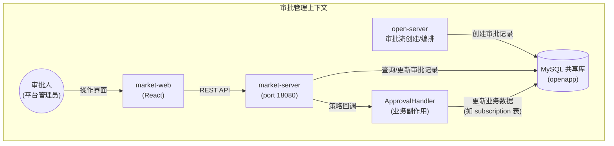
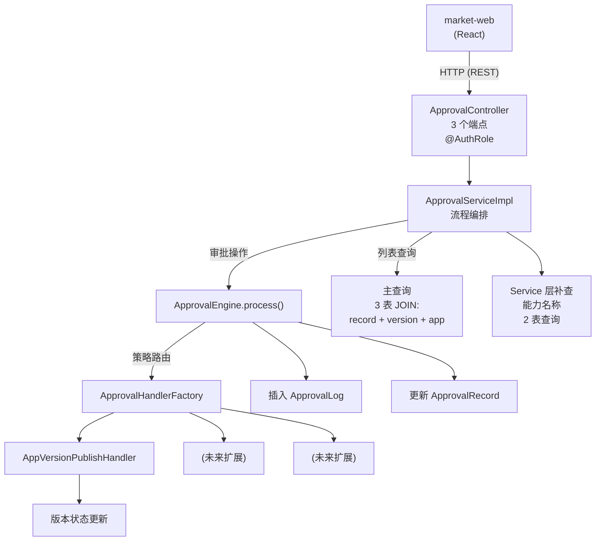
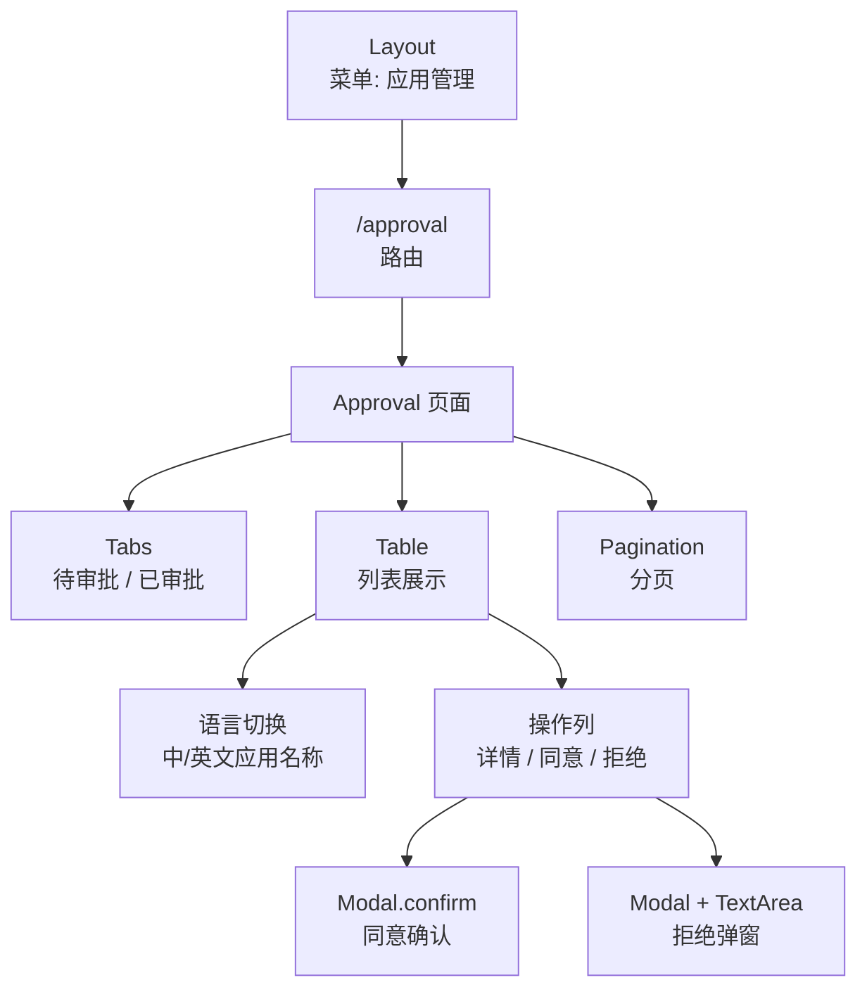
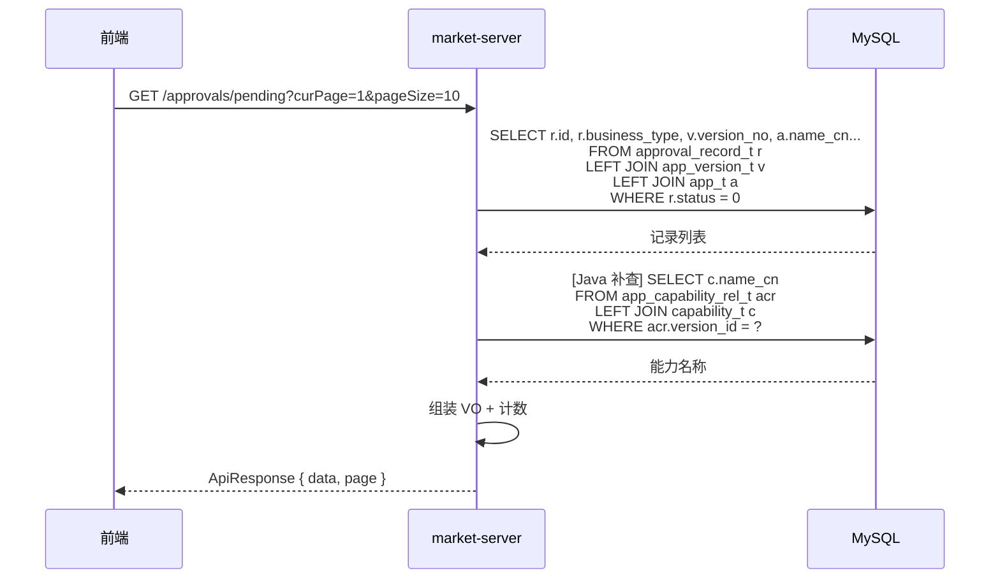
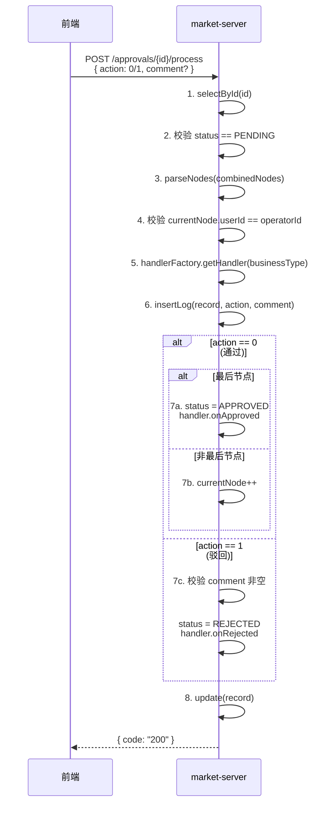
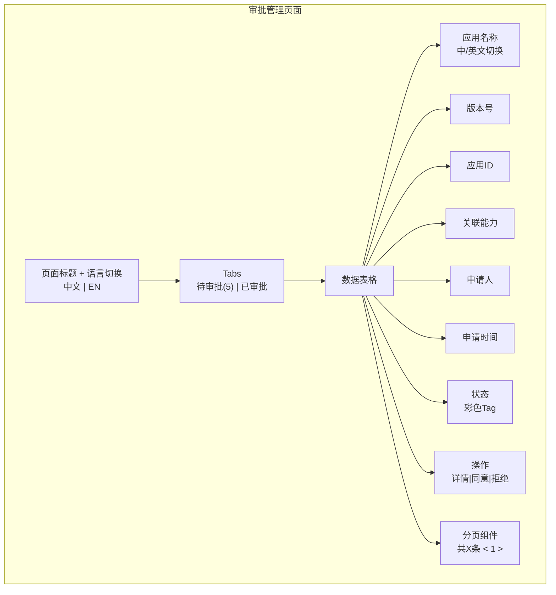

# 需求设计说明书 — 应用版本审批管理

## 修订记录

| 版本 | 日期 | 修改人 | 修改说明 |
|------|------|--------|---------|
| v1.0 | 2026-06-04 | SDDU Build Agent | 初稿，基于 app-version-approval-spec.md v8.0 |

## 目录
- 1 需求价值和概述
- 2 上下文分析
- 3 初始需求分析
    - 3.1 初始需求场景分析
    - 3.2 结构化IR
- 4 需求影响分析
    - 4.1 特性影响分析
- 5 系统用例分析
    - 5.1 用例清单
    - 5.2 用例分析
- 6 功能设计
    - 6.1 功能实现整体设计方案
    - 6.2 功能实现
- 7 系统级非功能设计
    - 7.1 FMEA影响分析
    - 7.2 安全影响分析
    - 7.3 兼容性
    - 7.4 可运维
- 8 checkList

## Keywords 关键字：
- 中文：审批管理、应用版本发布、策略模式、通用审批引擎
- English：Approval Management, App Version Publish, Strategy Pattern, Generic Approval Engine

## Abstract 摘要：

**中文**：本需求在 market-server（后端）和 market-web（前端）中实现通用审批管理模块。审批人通过 Web 页面查看待审批列表，对应用版本发布等审批请求执行通过/驳回操作。后端采用策略模式（ApprovalHandler + BusinessDataResolver），支持按 businessType 扩展不同审批类型；前端提供 Tabs（待审批/已审批）+ 表格列表 + 操作弹窗的交互体验。当前固定为一种审批类型（应用版本发布），后续新增类型时拆分独立菜单页。

**English**: This requirement implements a generic approval management module in market-server (backend) and market-web (frontend). Approvers view pending approval lists on the Web page and perform approve/reject operations on requests such as application version publishing. The backend adopts the Strategy Pattern (ApprovalHandler + BusinessDataResolver) to support extensibility by businessType. The frontend provides a Tabs (pending/processed) + table list + modal interaction. Currently fixed to one approval type (app version publish); new types will be split into independent menu pages.

## List 缩略语清单

| 缩略语 | 英文全名 | 中文解释 |
|--------|---------|---------|
| IR | Initial Requirement | 初始需求 |
| US | User Story | 用户故事 |
| DFX | Design for X | 面向X的设计（X=性能/安全/可靠性等） |
| FMEA | Failure Mode and Effects Analysis | 失效模式与影响分析 |
| businessType | Business Type | 业务类型标识（如 app_version_publish） |

---

## 1 需求价值和概述

### 需求背景与来源

开放平台（OpenPlatform v2）支持第三方应用接入，应用发布新版本、申请 API/事件/回调权限等操作需要经过审批流程。当前 open-server 已实现审批流创建、审批节点编排、IM 卡片催办等能力，但 **market-server 侧缺少 Web 端审批操作界面**，审批人无法通过管理后台直接完成审批。

### 需求价值

| 维度 | 价值 |
|------|------|
| 效率提升 | 审批人可在管理后台直接查看和处理审批，无需依赖 IM 卡片回调 |
| 信息完整 | 列表展示应用中英文名、版本号、关联能力等完整信息，辅助审批决策 |
| 可扩展 | 策略模式架构，后续新增审批类型（API 权限、事件权限等）只需新增 Handler + Resolver，核心引擎无需修改 |
| 操作追溯 | 审批日志完整记录操作人、操作类型、审批意见，满足审计要求 |

### 如果不做的影响

- 审批人只能通过 IM 卡片操作，无法在管理后台统一查看和处理审批
- 无法按应用维度查看审批关联的完整业务信息（版本号、能力列表等）
- 审批记录缺少 Web 端可视化追溯

---

## 2 上下文分析

### 系统上下文



### 利益相关方

| 利益相关方 | 关注点 |
|-----------|--------|
| 审批人（平台管理员） | 快速查看待审批列表，高效执行通过/驳回操作 |
| 应用开发者 | 提交审批后等待审批结果（不在本需求范围） |
| open-server | 创建审批记录，market-server 消费审批记录并执行后续业务逻辑 |
| 运维/审计 | 审批操作日志完整可追溯 |

---

## 3 初始需求分析

### 3.1 初始需求场景分析

| 所属场景 | 场景名称 | 场景简要说明 | 涉及角色 |
|---------|---------|------------|---------|
| 应用版本管理 | 查看待审批列表 | 审批人进入审批管理页面，查看当前待处理的审批记录列表 | 审批人 |
| 应用版本管理 | 查看已审批列表 | 审批人切换到已审批 Tab，查看历史审批记录及结果 | 审批人 |
| 应用版本管理 | 审批通过 | 审批人点击"同意"，二次确认后完成审批通过操作 | 审批人 |
| 应用版本管理 | 审批驳回 | 审批人点击"拒绝"，填写驳回原因后完成驳回操作 | 审批人 |
| 应用版本管理 | 查看应用详情 | 审批人点击"详情"跳转到应用详情页查看完整信息 | 审批人 |
| 应用版本管理 | 多节点审批推进 | 多节点审批场景下，非最后节点通过后自动推进到下一节点 | 系统 |

### 3.2 结构化IR

| IR属性 | 具体信息 |
|-------|---------|
| IR标识 | IR-MARKET-APPROVAL-001 |
| 名称 | 应用版本审批管理 |
| 描述 | 在 market-server + market-web 实现通用审批管理模块，支持审批人通过 Web 页面查看审批列表并执行通过/驳回操作 |
| 优先级 | P1（高） |
| 需求描述（why） | 审批人需要在管理后台统一查看和处理审批，当前只能通过 IM 卡片操作，缺少 Web 端入口；且需要展示应用维度的完整业务信息辅助决策 |
| what | ① 待审批/已审批列表查询（分页）；② 审批通过/驳回统一操作接口；③ 前端审批管理页面（Tabs + 表格 + 弹窗）；④ 策略模式架构支持 businessType 扩展 |
| who | 后端：market-server 开发；前端：market-web 开发；审批人使用 |
| 对架构要素的影响 | **架构**：新增 approval 模块，引入策略模式（Handler + Resolver + Factory）；**安全**：基于 @AuthRole 权限校验 + 操作人身份校验；**性能**：分页查询，SQL JOIN ≤ 3 表 |

---

## 4 需求影响分析

### 4.1 特性影响分析

**【新增】**：

| 特性 | 说明 |
|------|------|
| 审批管理模块 | market-server 新增 approval 包（controller / service / engine / handler / resolver / entity / mapper / dto / vo / constant） |
| 审批管理页面 | market-web 新增 Approval 页面（index.js / index.module.less / constant.js / thunk.js） |

**【修改】**：

| 特性 | 影响说明 |
|------|---------|
| market-web 路由 | 新增 `/approval` 路由 |
| market-web 菜单 | Layout 菜单仅展示"应用管理"，审批路由存在但不单独显示菜单项 |
| market-web API 配置 | web.config.js 新增 3 个 API URL |

**【删除】**：不涉及

---

## 5 系统用例分析

### 5.1 用例清单

| 角色名称 | UseCase名称 | UseCase简要说明 | 是否需要细化分析 |
|---------|-----------|---------------|:-------------:|
| 审批人 | UC-01 查看待审批列表 | 进入页面默认加载待审批列表，带数字角标 | 否 |
| 审批人 | UC-02 查看已审批列表 | 切换到已审批 Tab 查看历史记录 | 否 |
| 审批人 | UC-03 审批通过 | 点击"同意"→ 二次确认 → 调用接口 → 刷新列表 | 是 |
| 审批人 | UC-04 审批驳回 | 点击"拒绝"→ 弹窗填写原因 → 调用接口 → 刷新列表 | 是 |
| 审批人 | UC-05 查看应用详情 | 点击"详情"跳转到应用详情页 | 否 |
| 审批人 | UC-06 切换语言 | 切换中/英文，应用名称列随之切换 | 否 |

### 5.2 用例分析

#### UC-03 审批通过

**【简要说明】**：审批人对某条待审批记录执行通过操作，系统校验身份后更新审批状态，若为最后节点则触发业务回调。

**【Actor】**：审批人

**【前置条件】**：
- 审批人已登录且具备 @AuthRole 权限
- 待审批列表中存在 status=PENDING(0) 的记录
- 当前审批人为该记录当前节点的指定审批人

**【最小保证】**：操作失败时，审批记录状态不变，前端展示错误信息

**【成功保证】**：
- 单节点/最后节点：审批记录 status → APPROVED(1)，completedAt 设置，触发 handler.onApproved
- 多节点非最后：currentNode += 1，等待下一节点审批人处理

**【主成功场景】**：
1. 审批人点击某条记录的"同意"按钮
2. 前端弹出 Modal.confirm 二次确认框，展示应用名称、版本号、申请人信息
3. 审批人点击"确认通过"
4. 前端调用 `POST /approvals/{id}/process`，body: `{ action: 0 }`
5. 后端校验记录存在、状态为 PENDING、操作人匹配
6. 后端插入 ApprovalLog（action=APPROVE）
7. 后端判断最后节点 → 更新 status=APPROVED + 触发 handler.onApproved
8. 后端返回 `{ code: "200" }`
9. 前端展示 `message.success('审批通过')`，调用 fetchData() 刷新列表

**【扩展场景】**：
- **E1 记录不存在**：后端返回 code=40001，前端展示错误信息
- **E2 记录已处理**：后端返回 code=40002（含当前状态），前端展示错误信息
- **E3 操作人不匹配**：后端返回 code=40003，前端展示错误信息
- **E4 审批人取消确认**：Modal 关闭，不发起请求

**【DFX属性】**：安全（操作人身份校验）、可靠性（事务保证 @Transactional）

#### UC-04 审批驳回

**【简要说明】**：审批人对某条待审批记录执行驳回操作，必须填写驳回原因，系统校验后更新审批状态并触发业务回调。

**【Actor】**：审批人

**【前置条件】**：同 UC-03

**【最小保证】**：操作失败时，审批记录状态不变，前端展示错误信息

**【成功保证】**：审批记录 status → REJECTED(2)，completedAt 设置，触发 handler.onRejected

**【主成功场景】**：
1. 审批人点击某条记录的"拒绝"按钮
2. 前端弹出 Modal，展示 TextArea（拒绝原因，必填）
3. 审批人输入驳回原因，点击"确认拒绝"
4. 前端校验 TextArea 非空 → 调用 `POST /approvals/{id}/process`，body: `{ action: 1, comment: "原因" }`
5. 后端校验记录存在、状态为 PENDING、操作人匹配、comment 非空
6. 后端插入 ApprovalLog（action=REJECT, comment=原因）
7. 后端更新 status=REJECTED + 触发 handler.onRejected
8. 后端返回 `{ code: "200" }`
9. 前端展示 `message.success('已拒绝')`，关闭 Modal，刷新列表

**【扩展场景】**：
- **E1 TextArea 为空**：前端校验拦截，TextArea 边框变红，提示必填，不发起请求
- **E2 后端 comment 为空**：后端返回 code=40005，前端展示错误信息
- **E3-E5**：同 UC-03 的 E1-E3

**【DFX属性】**：安全（操作人身份校验 + 驳回原因必填）、可靠性（事务保证）

#### 2.3 影响的功能列表和需求分解

| 功能编号 | 功能名称 | 功能规格描述 | 类型 | 需求标号 | 需求名称 | 需求描述 |
|---------|---------|------------|------|---------|---------|---------|
| F-01 | 待审批列表查询 | 分页查询 status=0 的审批记录，关联应用信息 | 新增 | IR-001 | 查看待审批 | 查询审批记录 + 关联应用/版本信息 + Service 层补查能力名称 |
| F-02 | 已审批列表查询 | 分页查询 status IN (1,2,3) 的记录，支持状态筛选 | 新增 | IR-001 | 查看已审批 | 同上，额外支持 status 参数筛选 |
| F-03 | 审批操作 | 统一接口处理通过/驳回，按 action 字段分支 | 新增 | IR-001 | 执行审批 | 校验 → 日志 → 状态更新 → 策略回调 |
| F-04 | 策略路由 | ApprovalHandlerFactory 按 businessType 路由 | 新增 | IR-001 | 策略扩展 | Handler 接口 + Factory 工厂，支持多 businessType |
| F-05 | 业务数据解析 | BusinessDataResolver 解析业务展示数据 | 新增 | IR-001 | 数据展示 | Resolver 接口 + Factory，按 businessType 解析展示字段 |
| F-06 | 前端审批页面 | React 页面（Tabs + 表格 + 弹窗 + 分页） | 新增 | IR-001 | 审批管理页面 | 列表展示 + 同意/拒绝操作 + 语言切换 |
| F-07 | 路由/菜单/配置 | 路由、菜单、API URL 配置 | 修改 | IR-001 | 页面接入 | 新增路由、菜单项（隐藏）、API 配置 |

---

## 6 功能设计

### 6.1 功能实现整体设计方案

#### 6.1.1 整体方案

**设计原则**：
- **通用引擎 + 策略扩展**：核心审批流程（校验 → 日志 → 状态更新）由 Engine 统一编排，业务副作用通过 Handler 策略模式扩展
- **SQL 规范**：禁止 `SELECT *`，JOIN ≤ 3 表，子查询嵌套 ≤ 3 层
- **Entity 同构**：审批三表实体与 open-server 字段完全一致，共享数据库
- **前端轻量**：useState 页面级状态，无全局状态管理

**设计模式**：
- 策略模式：`ApprovalHandler`（审批后业务副作用）+ `BusinessDataResolver`（业务数据解析）
- 工厂模式：`ApprovalHandlerFactory` + `BusinessDataResolverFactory`（@Component + @PostConstruct 自动注册）

**限制和约束**：
- 当前页面固定一种审批类型，后续新类型拆独立菜单页
- 暂不提供搜索/过滤功能
- 暂不提供审批详情页、催办、转办、撤回

#### 6.1.2 架构设计

**后端架构**：



**前端架构**：



---

### 6.2 功能实现

#### F-01 待审批列表查询

##### 实现思路

后端主查询通过 3 表 JOIN（approval_record + app_version + app）获取核心数据（应用名称、版本号、应用ID），能力名称由 Service 层单独补查（2 表 JOIN），避免主查询超出 3 表限制。

##### 实现设计



##### 3.6.1 接口设计

| URL | Method | 功能 | 增删改查 | 鉴权 | TPS | 时延 |
|-----|--------|------|---------|------|-----|------|
| `/service/open/v2/approvals/pending` | GET | 待审批列表 | 查 | @AuthRole | 50 | <200ms |

**输入参数**：

| 参数 | 类型 | 必填 | 格式 | 说明 |
|------|------|:----:|------|------|
| curPage | Integer | 否 | 正整数，默认 1 | 当前页码 |
| pageSize | Integer | 否 | 正整数，默认 10，最大 100 | 每页条数 |

**返回值**：

| 字段 | 类型 | 说明 |
|------|------|------|
| code | String | "200"=成功 |
| messageZh | String | 中文消息 |
| messageEn | String | 英文消息 |
| data | Array | 审批记录列表 |
| data[].id | Long | 审批记录 ID |
| data[].appNameCn | String | 应用中文名 |
| data[].appNameEn | String | 应用英文名 |
| data[].versionNo | String | 版本号 |
| data[].appId | String | 第三方应用 ID |
| data[].capabilityNames | String | 关联能力中文名（逗号分隔） |
| data[].applicantId | String | 申请人账号 ID |
| data[].status | Integer | 0=待审批 |
| data[].createTime | String | yyyy-MM-dd HH:mm:ss |
| page | Object | { curPage, pageSize, total, totalPages } |

##### 3.6.2 数据模型设计

复用已有表（open-server 创建），不新增表：

| 表名 | 用途 | 操作类型 |
|------|------|---------|
| `openplatform_v2_approval_record_t` | 审批记录主表 | SELECT, UPDATE |
| `openplatform_v2_approval_log_t` | 审批操作日志 | INSERT |
| `app_t` | 应用主表 | SELECT |
| `app_version_t` | 版本表 | SELECT |
| `app_capability_rel_t` | 版本-能力关联表 | SELECT |
| `capability_t` | 能力表 | SELECT |

`app_t` / `app_version_t` / `app_capability_rel_t` / `capability_t` 为 `#PLACEHOLDER`，实际 DDL 由其他需求提供。

---

#### F-02 已审批列表查询

##### 3.6.1 接口设计

| URL | Method | 功能 | 增删改查 | 鉴权 | TPS | 时延 |
|-----|--------|------|---------|------|-----|------|
| `/service/open/v2/approvals/processed` | GET | 已审批列表 | 查 | @AuthRole | 50 | <200ms |

**输入参数**：

| 参数 | 类型 | 必填 | 格式 | 说明 |
|------|------|:----:|------|------|
| status | Integer | 否 | 1/2/3 | 状态筛选：1=已通过, 2=已驳回, 3=已撤回 |
| curPage | Integer | 否 | 正整数，默认 1 | 当前页码 |
| pageSize | Integer | 否 | 正整数，默认 10，最大 100 | 每页条数 |

**返回值**：同 F-01，data[].status 包含 1/2/3。

---

#### F-03 审批操作（通过/驳回统一接口）

##### 实现思路

将 open-server 的 approve() 和 reject() 两个方法合并为一个 process() 方法，通过 body 中的 `action` 字段（0=通过, 1=驳回）区分处理逻辑。整个操作在 `@Transactional` 事务内完成。

##### 实现设计



##### 3.6.1 接口设计

| URL | Method | 功能 | 增删改查 | 鉴权 | TPS | 时延 |
|-----|--------|------|---------|------|-----|------|
| `/service/open/v2/approvals/{id}/process` | POST | 审批操作 | 改 | @AuthRole | 20 | <300ms |

**路径参数**：

| 参数 | 类型 | 说明 |
|------|------|------|
| id | Long | 审批记录 ID |

**请求 Body**：

| 字段 | 类型 | 必填 | 格式 | 说明 |
|------|------|:----:|------|------|
| action | Integer | 是 | 0 或 1 | 0=通过, 1=驳回 |
| comment | String | action=1 时必填 | UTF-8 文本，最大 2000 字符 | 审批意见 |

**返回值**：

| code | messageZh | 场景 |
|------|-----------|------|
| 200 | 操作成功 | 正常 |
| 40001 | 审批记录不存在 | record 查询为空 |
| 40002 | 审批记录已处理，当前状态：{status} | status != PENDING |
| 40003 | 当前节点审批人不匹配 | userId 校验失败 |
| 40004 | 不支持的业务类型：{businessType} | handler 未注册 |
| 40005 | 驳回时必须填写审批意见 | action=1 且 comment 为空 |
| 40006 | 无效的操作类型：{action} | action 不是 0 或 1 |

---

#### F-04 策略路由（ApprovalHandler）

##### 实现思路

采用策略模式，每种 businessType 对应一个 Handler 实现。通过 Spring 的 `@Component` 自动注入 + `@PostConstruct` 构建 Map，实现零配置注册。

##### 核心接口

```java
public interface ApprovalHandler {
    String getBusinessType();           // 如 "app_version_publish"
    void onApproved(ApprovalRecord record);  // 审批通过后的业务副作用
    void onRejected(ApprovalRecord record);  // 审批驳回后的业务副作用
}
```

##### 扩展方式

新增 businessType 支持只需：实现 `ApprovalHandler` + `@Component`，工厂自动注册，Engine / Service / Controller 无需修改。

---

#### F-05 业务数据解析（BusinessDataResolver）

##### 实现思路

每种 businessType 对应一个 Resolver，负责查询并返回该类型特有的展示数据（应用中英文名、版本号、应用ID、能力名称等）。内部查询遵守 SQL 规范（禁止 SELECT *，JOIN ≤ 3 表）。

##### 核心接口

```java
public interface BusinessDataResolver {
    String getBusinessType();
    Map<String, Object> resolveBusinessData(String businessId);
    String getBusinessTypeName();
}
```

---

#### F-06 前端审批页面

##### 实现思路

遵循 market-web 现有页面模式：index.js（useState 状态管理）+ index.module.less（CSS Modules）+ constant.js（常量）+ thunk.js（API 调用）。通过 webFetch.js 的 `fetchApi()` + `buildApiUrl()` 发起请求。

##### 界面原型

> 浏览器打开 [`docs/market-server/approval-page-mockup.html`](./approval-page-mockup.html) 查看可交互效果图。

**页面结构**：



**交互说明**：

| 操作 | 触发 | 行为 |
|------|------|------|
| 切换 Tab | 点击"待审批"/"已审批" | 加载对应数据，待审批显示同意/拒绝按钮，已审批仅显示详情 |
| 切换语言 | 点击"中文"/"EN" | 应用名称列在中英文名间切换 |
| 点击详情 | 操作列"详情"链接 | navigate('/app-detail/' + businessId) |
| 点击同意 | 操作列"同意"链接 | Modal.confirm 二次确认 → POST process(action=0) → 成功刷新 |
| 点击拒绝 | 操作列"拒绝"链接 | Modal + TextArea（必填）→ POST process(action=1, comment) → 成功刷新 |

##### 3.5 架构元素影响列表

| 元素 | 变更类型 | 说明 |
|------|---------|------|
| `market-web/src/router/index.tsx` | 修改 | 新增 /approval 路由 |
| `market-web/src/components/Layout/index.js` | 修改 | 菜单仅展示"应用管理" |
| `market-web/src/configs/web.config.js` | 修改 | 新增 3 个 API URL |
| `market-web/src/pages/Approval/` | 新增 | 4 个文件（index.js, index.module.less, constant.js, thunk.js） |

##### 3.7 功能实现分解分配清单

| # | Task 名称 | 模块 | 职责描述 |
|:-:|----------|------|---------|
| 1 | 审批常量定义 | market-server | ApprovalConstants.java — 状态/操作常量 |
| 2 | 审批实体类 | market-server | ApprovalRecord / ApprovalLog / ApprovalFlow（同构 open-server） |
| 3 | 审批 DTO/VO | market-server | ApprovalNodeDto / ApprovalListRequest / ApprovalProcessRequest / ApprovalListVo |
| 4 | 审批 Mapper 接口 | market-server | ApprovalRecordMapper / ApprovalLogMapper / ApprovalFlowMapper |
| 5 | 审批 Mapper XML | market-server | SQL 实现（明确字段，JOIN ≤ 3 表） |
| 6 | 策略接口 + 工厂 | market-server | ApprovalHandler + ApprovalHandlerFactory + BusinessDataResolver + BusinessDataResolverFactory |
| 7 | 审批引擎 | market-server | ApprovalEngine.process() — 统一审批操作 |
| 8 | 审批 Service | market-server | ApprovalService + ApprovalServiceImpl — 列表查询编排 + 能力名称补查 |
| 9 | 审批 Controller | market-server | ApprovalController — 3 个端点 |
| 10 | 前端常量 + API 配置 | market-web | constant.js + web.config.js 修改 |
| 11 | 前端 API 调用层 | market-web | thunk.js — fetchPendingList / fetchProcessedList / processApproval |
| 12 | 前端审批页面 | market-web | index.js + index.module.less — Tabs + 表格 + 弹窗 + 分页 |
| 13 | 前端路由/菜单 | market-web | router/index.tsx + Layout/index.js 修改 |

---

## 7 系统级非功能设计

### 7.1 FMEA影响分析

| 失效模式 | 影响 | 缓解措施 |
|---------|------|---------|
| 审批操作并发（两人同时审批同一条记录） | 状态被重复更新 | 数据库层：status 字段更新前校验 WHERE status=0；事务层：@Transactional 串行化 |
| Handler 策略回调异常 | 审批状态已更新但业务副作用未执行 | Handler 内部 try-catch + 日志记录；后续可增加重试/补偿机制 |
| combinedNodes JSON 解析失败 | 审批操作无法执行 | 解析前校验 JSON 格式，异常时返回明确错误码 |

### 7.2 安全影响分析

| 安全项 | 措施 |
|-------|------|
| 接口鉴权 | @AuthRole 注解，未登录返回 401 |
| 操作人校验 | UserContextHolder.getUserId() 与审批节点 userId 比对 |
| 越权防护 | 只能操作自己是当前审批人的记录 |
| 输入校验 | action 值校验（0/1），comment 驳回必填 |

### 7.3 兼容性

#### 后向兼容性确认

- 数据库表复用 open-server 已有表，不修改表结构，无后向兼容风险
- API 新增端点，不影响现有接口

#### 前向兼容性确认

- 策略模式架构，后续新增 businessType 只需新增 Handler + Resolver
- 列表查询预留 keyword / businessType 参数位，后续按需启用
- 前端页面固定一种类型，后续新类型拆独立菜单页

### 7.4 可运维

| 运维项 | 说明 |
|-------|------|
| 日志 | 审批操作日志写入 approval_log_t 表，支持按 recordId 查询 |
| 监控 | 接口响应时间 + 错误码分布（后续接入） |
| 数据修复 | 审批记录状态可通过 SQL 直接修复（status 字段语义明确） |

---

## 8 checkList

### 8.1 设计自检清单要求

| check点 | 是否达标 | 说明 |
|--------|:-------:|------|
| 需求背景和价值清晰 | ✅ | 第1章已说明 |
| 用例场景完整覆盖 | ✅ | 6 个用例覆盖列表查看、通过、驳回、详情、语言切换 |
| 接口定义明确（输入/输出/错误码） | ✅ | 3 个 API 均定义完整参数、返回值、6 个错误码 |
| 数据模型清晰 | ✅ | 复用已有表结构，字段类型和说明完整 |
| SQL 规范（禁止 SELECT *，JOIN ≤ 3 表） | ✅ | 所有 SQL 明确列出字段，主查询 3 表 JOIN，能力名称单独补查 |
| 安全设计（鉴权 + 越权防护） | ✅ | @AuthRole + 操作人身份校验 |
| 事务保证 | ✅ | 审批操作 @Transactional(rollbackFor = Exception.class) |
| 前端界面原型 | ✅ | HTML 效果图可交互预览 |
| 可扩展性设计 | ✅ | 策略模式（Handler + Resolver），新增类型零修改核心代码 |
| 前后端技术栈一致 | ✅ | 后端 Spring Boot 3.4.6 / Java 21 / MyBatis；前端 React 18 / AntD v4 / JS |
| 测试用例覆盖 | ✅ | 后端 13 条 + 前端 10 条 |
| 文件清单完整 | ✅ | 后端 21 个文件 + 前端 4 新建 + 3 修改 |
| #PLACEHOLDER 标记 | ✅ | 业务表（app_t / version_t / capability_t）已标记待其他 spec 提供 |
