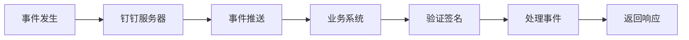
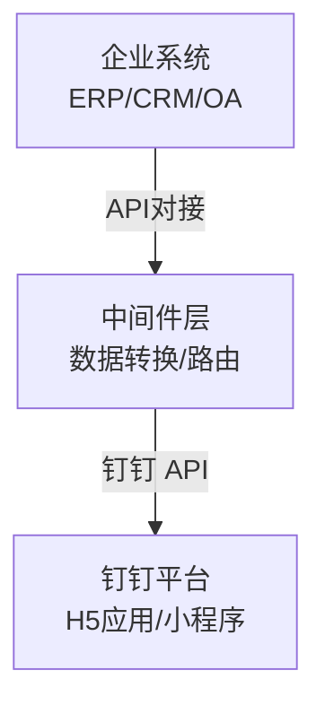
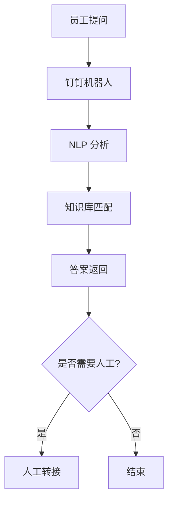
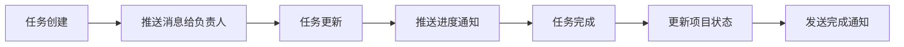
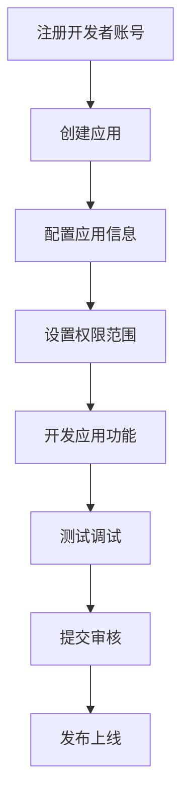
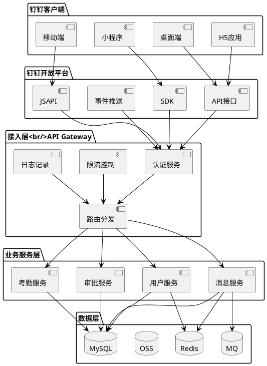
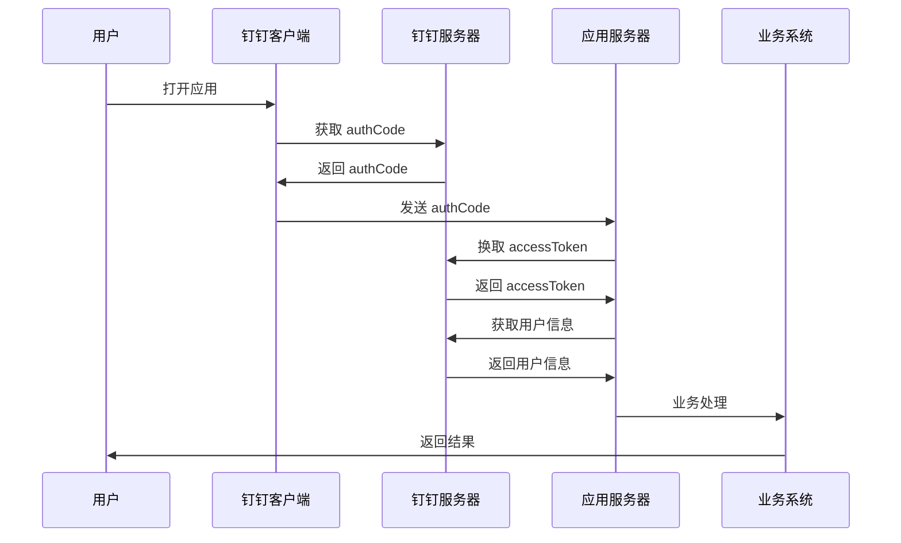

# 钉钉开放平台调研报告

## 一、平台概述

### 1.1 平台简介

钉钉开放平台是阿里巴巴集团旗下的企业级智能移动办公平台开放生态，为企业提供组织管理、协同办公、业务定制等全方位的数字化解决方案。钉钉作为国内领先的企业服务平台，拥有超过 6 亿用户和 2300 万企业组织，通过开放平台能力，帮助企业实现组织数字化、业务数字化、生态数字化。

### 1.2 平台定位

- **企业协作平台**：聚焦企业协同办公场景，提供 IM、文档、视频会议等核心能力
- **组织管理平台**：提供组织架构、通讯录、考勤、审批等企业管理能力
- **业务定制平台**：支持低代码开发和定制化应用，满足企业个性化需求
- **生态开放平台**：连接 ISV 和开发者，构建企业服务生态

### 1.3 核心价值主张

| 价值维度 | 描述 |
|---------|------|
| **数字化办公** | 打通办公场景，实现全流程数字化 |
| **效率提升** | 智能化工具，提升组织协同效率 |
| **成本降低** | 低代码平台，降低应用开发和部署成本 |
| **生态连接** | 开放平台能力，连接企业内部和外部生态 |

---

## 二、核心能力体系

### 2.1 API 能力矩阵

#### 2.1.1 基础能力

| 能力模块 | 主要接口 | 应用场景 |
|---------|---------|---------|
| **用户管理** | 用户创建、更新、删除、查询 | 组织人员管理、权限分配 |
| **部门管理** | 部门创建、更新、删除、层级管理 | 组织架构管理、部门协作 |
| **角色管理** | 角色创建、权限配置、用户关联 | 权限管理、角色授权 |
| **企业通讯录** | 通讯录同步、组织架构查询 | 通讯录管理、组织可视化 |

#### 2.1.2 消息能力

| 能力模块 | 主要接口 | 应用场景 |
|---------|---------|---------|
| **工作通知** | 发送工作通知、消息撤回 | 企业内部通知、任务提醒 |
| **群消息** | 群消息发送、群管理 | 团队协作、项目沟通 |
| **单聊消息** | 一对一消息发送、消息回调 | 私信沟通、即时通知 |
| **机器人** | 自定义机器人、交互卡片 | 自动化消息、智能助手 |

#### 2.1.3 办公能力

| 能力模块 | 主要接口 | 应用场景 |
|---------|---------|---------|
| **考勤打卡** | 考勤记录查询、排班管理 | 考勤管理、工时统计 |
| **审批流程** | 审批创建、审批流转、审批查询 | 流程审批、工作流自动化 |
| **日程管理** | 日程创建、日程共享、日程提醒 | 时间管理、会议协调 |
| **日志报表** | 日报、周报、月报提交和查询 | 工作汇报、绩效管理 |

#### 2.1.4 协作能力

| 能力模块 | 主要接口 | 应用场景 |
|---------|---------|---------|
| **文档协作** | 文档创建、编辑、共享 | 知识管理、协作文档 |
| **待办任务** | 任务创建、任务分配、任务跟踪 | 任务管理、项目协作 |
| **通讯录** | 企业通讯录、外部联系人 | 人员管理、客户管理 |
| **视频会议** | 创建会议、邀请参会、会议控制 | 远程会议、在线培训 |

#### 2.1.5 业务能力

| 能力模块 | 主要接口 | 应用场景 |
|---------|---------|---------|
| **智能人事** | 员工档案、入职离职、花名册 | 人力资源管理 |
| **智能薪酬** | 薪资计算、工资条发放 | 薪酬管理 |
| **智能报表** | 数据统计、报表生成 | 经营分析、决策支持 |
| **应用管理** | 应用发布、权限配置、应用授权 | 应用分发、权限管理 |

### 2.2 开发模式

#### 2.2.1 H5 微应用

**特点**：
- 基于 Web 技术开发，跨平台兼容
- 通过 JSAPI 调用钉钉原生能力
- 支持免登、分享、拍照等原生功能
- 开发门槛低，迭代速度快

**技术栈**：
- 前端：HTML5 + CSS3 + JavaScript
- 框架：Vue.js / React / Angular
- JSAPI：dd.runtime.permission.requestAuthCode

**代码示例**：
```javascript
// 钉钉免登
dd.runtime.permission.requestAuthCode({
  corpId: "corpid",
  onSuccess: function(result) {
    // 获取 authCode
    console.log(result.code);
  },
  onFail : function(err) {
    console.log(err);
  }
});
```

#### 2.2.2 企业内部应用

**特点**：
- 服务端应用，通过 API 对接
- 支持 Java、Python、PHP、Node.js 等语言
- 提供 SDK 简化开发
- 权限控制更灵活

**认证方式**：
- **企业内部应用**：AppKey + AppSecret
- **第三方企业应用**：SuiteKey + SuiteSecret

#### 2.2.3 第三方企业应用

**特点**：
- 可发布到钉钉应用市场
- 支持多企业租户
- 需要通过平台审核
- 提供 ISV 服务能力

**开发流程**：
1. 创建应用并配置基本信息
2. 开发应用功能
3. 配置应用权限
4. 提交审核
5. 发布上线

#### 2.2.4 小程序开发

**特点**：
- 原生渲染，性能优异
- 丰富的组件库
- 支持钉钉小程序 IDE
- 支持多端发布（钉钉、支付宝等）

**技术栈**：
- 框架：钉钉小程序框架
- 语言：JavaScript / TypeScript
- 样式：ACSS（类似 CSS）
- 组件：小程序组件库

### 2.3 消息推送能力

#### 2.3.1 消息类型对比

| 消息类型 | 描述 | 使用场景 | 是否支持交互 |
|---------|------|---------|------------|
| **文本消息** | 纯文本内容 | 简单通知 | 否 |
| **链接消息** | 跳转链接 | 内容推广 | 是 |
| **Markdown 消息** | Markdown 格式 | 富文本展示 | 否 |
| **ActionCard 消息** | 交互式卡片 | 业务操作入口 | 是 |
| **OA 消息** | 办公审批消息 | 审批通知 | 是 |
| **图片消息** | 图片内容 | 可视化展示 | 否 |
| **语音消息** | 语音内容 | 语音通知 | 否 |
| **文件消息** | 文件附件 | 文档分享 | 否 |

#### 2.3.2 ActionCard 消息详解

**消息结构**：
```json
{
  "msgtype": "actionCard",
  "actionCard": {
    "title": "审批通知",
    "text": "### 审批通知\n**申请人**：张三\n**审批类型**：请假申请\n**申请时间**：2026-04-01",
    "singleTitle": "查看详情",
    "singleURL": "https://example.com/detail",
    "btnOrientation": "0",
    "btns": [
      {
        "title": "同意",
        "actionURL": "https://example.com/approve"
      },
      {
        "title": "拒绝",
        "actionURL": "https://example.com/reject"
      }
    ]
  }
}
```

**优势**：
- 结构化展示，信息清晰
- 支持按钮交互，操作便捷
- 支持 Markdown 格式
- 视觉效果统一

#### 2.3.3 机器人能力

**机器人类型**：

| 类型 | 描述 | 特点 | 使用场景 |
|------|------|------|---------|
| **Webhook 机器人** | 群聊 Webhook 机器人 | 简单推送消息 | 监控报警、通知推送 |
| **企业内部机器人** | 企业自建机器人 | 功能完整，支持交互 | 智能客服、业务助手 |
| **第三方机器人** | ISV 提供的机器人 | 专业服务能力 | 专业工具、行业应用 |

**机器人功能**：
- 消息接收：监听用户消息、群消息
- 消息发送：主动推送、回复消息
- 交互处理：处理按钮点击、表单提交
- 富媒体消息：发送卡片、文件、图片等

### 2.4 事件订阅

#### 2.4.1 支持的事件类型

| 事件分类 | 具体事件 | 应用场景 |
|---------|---------|---------|
| **通讯录事件** | user_add_org、user_modify_org、user_leave_org | 组织架构同步 |
| **群组事件** | chat_add_member、chat_remove_member、chat_update_title | 群组管理 |
| **消息事件** | chat_add_message、user_read_message | 消息处理 |
| **审批事件** | bpms_task_change、bpms_instance_change | 审批流转 |
| **考勤事件** | attendance_check、attendance_off_check | 考勤管理 |
| **日历事件** | calendar_event_create、calendar_event_update | 日程管理 |

#### 2.4.2 事件订阅流程



**安全机制**：
- 签名验证：验证请求来源合法性
- Token 验证：防止重放攻击
- 加密传输：敏感数据加密传输

### 2.5 低代码开发能力

#### 2.5.1 宜搭低代码平台

**核心能力**：
- **表单设计**：可视化表单设计器
- **流程设计**：拖拽式流程编排
- **报表设计**：自定义报表和数据可视化
- **页面设计**：可视化页面搭建

**特点**：
- 无需编码，快速搭建应用
- 丰富的组件库和模板
- 支持复杂业务逻辑
- 一键发布到钉钉

#### 2.5.2 应用场景

| 场景 | 描述 | 实现方式 |
|------|------|---------|
| **数据收集** | 问卷调查、信息采集 | 表单 + 数据统计 |
| **流程审批** | 请假、报销、采购等审批流程 | 表单 + 流程设计 |
| **项目管理** | 任务管理、进度跟踪 | 表单 + 仪表盘 |
| **设备管理** | 设备巡检、报修 | 表单 + 流程 + 报表 |

---

## 三、应用场景分析

### 3.1 典型应用场景

#### 3.1.1 企业内部系统集成

**场景描述**：
将企业 ERP、CRM、OA、HR 等核心业务系统与钉钉集成，实现统一入口、数据互通、流程打通。

**集成方案**：



**关键能力**：
- 单点登录（SSO）
- 组织架构同步
- 业务数据推送
- 审批流程对接
- 消息通知提醒

**典型案例**：
- **销售管理**：CRM 订单推送到钉钉，销售人员实时接收
- **财务审批**：ERP 审批流程对接钉钉，移动端审批
- **HR 管理**：人事系统与钉钉通讯录同步，一键入职

#### 3.1.2 智能客服机器人

**场景描述**：
构建企业内部智能客服系统，自动回答员工关于 IT、HR、行政等常见问题。

**技术架构**：



**核心功能**：
- 自然语言理解（NLU）
- 多轮对话管理
- 知识库管理
- 上下文理解
- 人工转接
- 对话记录分析

**实现要点**：
- 接入钉钉机器人接收消息
- 集成 NLP 服务（如阿里云 NLP）
- 构建知识库和问答模型
- 支持富媒体回复（卡片、链接等）

#### 3.1.3 自动化工作流

**场景描述**：
通过钉钉审批、事件订阅等能力，实现业务流程自动化。

**典型工作流**：

1. **请假审批自动化**


2. **项目任务自动化**



3. **费用报销自动化**


**关键能力**：
- 审批流程定义
- 事件订阅和回调
- 第三方系统对接
- 消息自动推送

#### 3.1.4 移动办公应用

**场景描述**：
开发移动端办公应用，支持员工随时随地办公。

**应用类型**：

| 应用类型 | 功能描述 | 技术实现 |
|---------|---------|---------|
| **移动审批** | 移动端审批、查看审批记录 | H5 微应用 + 审批 API |
| **移动报表** | 数据可视化、报表查看 | 小程序 + 数据 API |
| **外勤管理** | 位置打卡、拜访记录、轨迹追踪 | H5 + 地理位置API |
| **移动考勤** | 打卡、请假、加班申请 | 小程序 + 考勤 API |

**开发要点**：
- 响应式设计，适配移动端
- 利用 JSAPI 调用原生能力
- 优化加载速度和用户体验
- 支持离线缓存

#### 3.1.5 数据采集与上报

**场景描述**：
通过钉钉进行各类数据采集、信息上报、问卷调查等。

**应用场景**：
- **健康上报**：每日健康打卡、体温上报
- **安全生产**：安全隐患上报、巡检记录
- **问卷调查**：员工满意度调查、培训反馈
- **信息采集**：员工信息采集、客户信息录入

**实现方式**：
- H5 表单
- 小程序表单
- 宜搭低代码表单

**数据流转**：
```
员工填写 → 数据提交 → 后端存储 → 数据统计 → 
报表展示 → 导出分析
```

### 3.2 行业解决方案

#### 3.2.1 制造业

**典型需求**：
- 生产管理
- 设备巡检
- 质量管控
- 供应链协同

**解决方案**：

| 场景 | 实现方式 | 核心功能 |
|------|---------|---------|
| **生产管理** | H5 应用 + 审批流程 | 生产计划、进度跟踪、异常上报 |
| **设备巡检** | 小程序 + 二维码 | 扫码巡检、故障上报、维修跟踪 |
| **质量管理** | H5 应用 + 报表 | 质检记录、不合格处理、质量分析 |
| **供应链协同** | 供应链应用 + 消息通知 | 订单协同、物流跟踪、对账结算 |

**核心价值**：
- 实时数据采集，提升生产效率
- 移动化巡检，降低安全隐患
- 质量追溯，保障产品质量
- 供应链协同，优化库存管理

#### 3.2.2 零售行业

**典型需求**：
- 门店管理
- 销售统计
- 会员服务
- 库存管理

**解决方案**：

| 场景 | 实现方式 | 核心功能 |
|------|---------|---------|
| **门店管理** | H5 应用 + 打卡 | 门店考勤、巡店管理、任务分配 |
| **销售管理** | 小程序 + 数据看板 | 销售录入、业绩统计、排行榜 |
| **会员服务** | H5 应用 + CRM | 会员查询、积分管理、营销推送 |
| **库存管理** | H5 应用 + 扫码 | 库存查询、盘点记录、补货提醒 |

**核心价值**：
- 移动化门店管理，提升运营效率
- 实时销售数据，辅助决策
- 会员精准营销，提升复购率
- 库存实时管控，降低库存成本

#### 3.2.3 教育行业

**典型需求**：
- 在线教学
- 学生管理
- 家校沟通
- 资源共享

**解决方案**：

| 场景 | 实现方式 | 核心功能 |
|------|---------|---------|
| **在线教学** | 视频会议 + 直播 | 在线课堂、互动教学、录播回放 |
| **学生管理** | H5 应用 | 学生档案、成绩管理、考勤记录 |
| **家校沟通** | 群聊 + 消息通知 | 班级群、通知推送、作业布置 |
| **资源共享** | 文档 + 知识库 | 教案共享、课件管理、学习资料 |

**核心价值**：
- 在线教学，打破时空限制
- 学生管理数字化，提升管理效率
- 家校沟通便捷，促进家校共育
- 资源共享，提升教学质量

#### 3.2.4 医疗健康

**典型需求**：
- 预约挂号
- 在线问诊
- 健康管理
- 医护排班

**解决方案**：

| 场景 | 实现方式 | 核心功能 |
|------|---------|---------|
| **预约挂号** | 小程序 | 在线预约、号源查询、排队提醒 |
| **在线问诊** | 视频会议 + IM | 图文咨询、视频问诊、处方开具 |
| **健康管理** | H5 应用 + IoT | 健康数据采集、健康档案、健康建议 |
| **医护排班** | 审批流程 + 日历 | 排班管理、调班申请、值班提醒 |

**核心价值**：
- 便捷预约，改善就医体验
- 在线问诊，降低就医成本
- 健康管理，预防疾病发生
- 智能排班，优化医护资源

---

## 四、开发指南

### 4.1 开发流程

#### 4.1.1 应用创建流程



**详细步骤**：

1. **注册开发者账号**
   - 访问钉钉开放平台：https://open.dingtalk.com
   - 使用钉钉账号登录
   - 完成开发者认证

2. **创建应用**
   - 选择应用类型：H5 微应用、企业内部应用、第三方企业应用、小程序
   - 填写应用名称、描述、图标等基本信息
   - 获取 AppKey 和 AppSecret

3. **配置应用信息**
   - 配置应用首页地址
   - 配置服务器出口 IP 白名单
   - 配置回调 URL

4. **设置权限范围**
   - 根据业务需求申请相应权限
   - 敏感权限需要管理员授权
   - 部分权限需要平台审核

5. **开发应用功能**
   - 开发前端页面或小程序
   - 开发后端服务
   - 对接钉钉 API

6. **测试调试**
   - 使用测试企业进行测试
   - 使用钉钉调试工具
   - 修复 bug 和问题

7. **提交审核**（第三方应用）
   - 提交应用审核
   - 等待平台审核（1-3 个工作日）
   - 根据审核意见修改

8. **发布上线**
   - 审核通过后发布
   - 企业安装使用

#### 4.1.2 权限管理

**权限分类**：

| 权限类型 | 描述 | 申请方式 |
|---------|------|---------|
| **基础权限** | 获取用户信息、部门信息等 | 应用配置中直接申请 |
| **高级权限** | 发送消息、管理群组等 | 需要管理员授权 |
| **敏感权限** | 考勤数据、审批数据等 | 需要平台审核 |

**权限申请原则**：
- 最小权限原则：只申请必要的权限
- 分级申请：根据实际需求申请不同级别的权限
- 用户授权：涉及用户隐私的权限需要用户明确授权

### 4.2 SDK 使用

#### 4.2.1 Java SDK

**Maven 依赖**：
```xml
<dependency>
    <groupId>com.dingtalk.open</groupId>
    <artifactId>taobao-sdk-java-auto</artifactId>
    <version>1.0.0</version>
</dependency>
```

**代码示例**：
```java
import com.dingtalk.open.client.api.ServiceFactory;
import com.dingtalk.open.client.api.model.corp.CorpUserService;

// 初始化客户端
DefaultDingTalkClient client = new DefaultDingTalkClient("https://oapi.dingtalk.com/gettoken");

// 获取 access_token
OapiGettokenRequest request = new OapiGettokenRequest();
request.setAppkey("appkey");
request.setAppsecret("appsecret");
OapiGettokenResponse response = client.execute(request);
String accessToken = response.getAccessToken();

// 获取用户信息
CorpUserService userService = ServiceFactory.getInstance().getOpenService(CorpUserService.class);
CorpUserDetailInfo userInfo = userService.getUserInfo(accessToken, "userid");
```

#### 4.2.2 Python SDK

**安装**：
```bash
pip install dingtalk-sdk
```

**代码示例**：
```python
from dingtalk import SecretClient, AppKeyClient

# 初始化客户端
client = SecretClient('app_key', 'app_secret')

# 获取 access_token
access_token = client.get_access_token()

# 获取用户信息
user_info = client.user.get(userid='user_id')

# 发送消息
client.message.corpconversation_send(
    agent_id='agent_id',
    userid_list='user_id',
    msg={'msgtype': 'text', 'text': {'content': 'Hello World'}}
)
```

#### 4.2.3 Node.js SDK

**安装**：
```bash
npm install dingtalk-sdk
```

**代码示例**：
```javascript
const DingTalk = require('dingtalk-sdk');

// 初始化客户端
const client = new DingTalk({
  appKey: 'app_key',
  appSecret: 'app_secret',
});

// 获取 access_token
const accessToken = await client.getAccessToken();

// 获取用户信息
const userInfo = await client.user.get({
  userid: 'user_id',
});

// 发送消息
await client.message.corpconversation_send({
  agent_id: 'agent_id',
  userid_list: 'user_id',
  msg: {
    msgtype: 'text',
    text: {
      content: 'Hello World',
    },
  },
});
```

#### 4.2.4 PHP SDK

**安装**：
```bash
composer require dingtalk/sdk
```

**代码示例**：
```php
<?php
use DingTalk\DingTalkClient;

// 初始化客户端
$client = new DingTalkClient([
    'app_key' => 'app_key',
    'app_secret' => 'app_secret',
]);

// 获取 access_token
$accessToken = $client->getAccessToken();

// 获取用户信息
$userInfo = $client->user->get([
    'userid' => 'user_id',
]);

// 发送消息
$client->message->corpconversation_send([
    'agent_id' => 'agent_id',
    'userid_list' => 'user_id',
    'msg' => [
        'msgtype' => 'text',
        'text' => [
            'content' => 'Hello World',
        ],
    ],
]);
```

### 4.3 前端开发指南

#### 4.3.1 JSAPI 调用

**引入 JSAPI**：
```html
<script src="https://g.alicdn.com/dingding/dingtalk-jsapi/2.10.3/dingtalk.open.js"></script>
```

**免登认证**：
```javascript
dd.runtime.permission.requestAuthCode({
  corpId: "corpid",
  onSuccess: function(result) {
    // 获取 authCode
    console.log(result.code);
    // 将 authCode 发送到后端换取用户信息
  },
  onFail: function(err) {
    console.log(err);
  }
});
```

**获取当前位置**：
```javascript
dd.device.geolocation.get({
  targetAccuracy: 200,
  coordinate: 1,
  withReGeocode: true,
  onSuccess: function(result) {
    console.log(result);
  },
  onFail: function(err) {
    console.log(err);
  }
});
```

**扫码功能**：
```javascript
dd.biz.util.scan({
  type: 'qrCode',
  onSuccess: function(result) {
    console.log(result.text);
  },
  onFail: function(err) {
    console.log(err);
  }
});
```

#### 4.3.2 小程序开发

**项目结构**：
```
project/
├── pages/
│   ├── index/
│   │   ├── index.js
│   │   ├── index.axml
│   │   ├── index.acss
│   │   └── index.json
├── app.js
├── app.json
├── app.acss
└── project.config.json
```

**生命周期**：
```javascript
// app.js
App({
  onLaunch(options) {
    // 小程序初始化
    console.log('App Launch');
  },
  onShow(options) {
    // 小程序显示
    console.log('App Show');
  },
  onHide() {
    // 小程序隐藏
    console.log('App Hide');
  },
});

// pages/index/index.js
Page({
  data: {
    motto: 'Hello World',
  },
  onLoad() {
    // 页面加载
    console.log('Page Load');
  },
  onReady() {
    // 页面渲染完成
    console.log('Page Ready');
  },
  onShow() {
    // 页面显示
    console.log('Page Show');
  },
  onHide() {
    // 页面隐藏
    console.log('Page Hide');
  },
  onUnload() {
    // 页面卸载
    console.log('Page Unload');
  },
});
```

### 4.4 最佳实践

#### 4.4.1 性能优化

**API 调用优化**：
- **批量接口**：使用批量接口减少调用次数
- **缓存策略**：缓存 token、用户信息等不常变更的数据
- **并发控制**：合理控制并发量，避免触发限流
- **异步处理**：耗时操作异步处理，提升响应速度

**前端优化**：
- **代码压缩**：压缩 JS、CSS、图片等资源
- **懒加载**：按需加载页面和组件
- **缓存策略**：利用浏览器缓存和本地存储
- **CDN 加速**：静态资源使用 CDN

#### 4.4.2 安全最佳实践

**认证安全**：
- AppSecret 安全存储，不泄露
- 定期更换 AppSecret
- 使用 IP 白名单限制访问

**数据安全**：
- 敏感数据加密传输和存储
- 遵守最小权限原则
- 记录审计日志

**接口安全**：
- 验证回调签名
- 防止重放攻击
- 输入参数校验

#### 4.4.3 错误处理

**常见错误码**：

| 错误码 | 描述 | 处理建议 |
|--------|------|---------|
| 0 | 成功 | - |
| 88 | access_token 过期 | 刷新 access_token |
| 500 | 服务器内部错误 | 重试或联系技术支持 |
| 600001 | 不合法的 access_token | 重新获取 access_token |
| 600002 | access_token 过期 | 刷新 access_token |
| 600003 | 不合法的 appkey 或 appsecret | 检查配置 |
| 600004 | IP 白名单限制 | 配置 IP 白名单 |
| 600005 | 没有调用该接口的权限 | 检查应用权限 |

**错误处理策略**：
- 记录详细日志
- 实现重试机制
- 提供友好的错误提示
- 监控错误率

---

## 五、优势与劣势分析

### 5.1 核心优势

#### 5.1.1 市场优势

| 优势维度 | 详细描述 |
|---------|---------|
| **市场占有率** | 国内企业办公平台领先者，拥有 2300 万企业用户 |
| **品牌认知** | 阿里巴巴旗下产品，品牌知名度高 |
| **用户基础** | 6 亿用户，覆盖各行业各规模企业 |
| **生态完善** | 大量 ISV 合作伙伴，应用市场丰富 |

#### 5.1.2 产品优势

| 优势维度 | 详细描述 |
|---------|---------|
| **功能完善** | IM、考勤、审批、文档、视频会议等功能齐全 |
| **考勤打卡** | 考勤功能强大，支持多种打卡方式 |
| **硬件生态** | 智能考勤机、智能门禁等硬件产品丰富 |
| **低代码平台** | 宜搭低代码平台，快速搭建应用 |
| **行业应用** | 大量行业垂直应用，覆盖各行业需求 |

#### 5.1.3 技术优势

| 优势维度 | 详细描述 |
|---------|---------|
| **稳定性** | 阿里云基础设施，稳定可靠 |
| **性能** | 支持大规模并发，性能优异 |
| **API 丰富** | API 能力全面，覆盖各种场景 |
| **SDK 完善** | 多语言 SDK 支持，开发体验好 |
| **文档详细** | 开发文档完善，示例丰富 |

#### 5.1.4 生态优势

| 优势维度 | 详细描述 |
|---------|---------|
| **应用市场** | 丰富的应用市场，涵盖各行业应用 |
| **ISV 生态** | 大量 ISV 合作伙伴，提供专业服务 |
| **开发者社区** | 活跃的开发者社区，问题响应及时 |
| **培训资源** | 完善的培训体系和认证机制 |

### 5.2 潜在劣势

#### 5.2.1 产品劣势

| 劣势维度 | 详细描述 |
|---------|---------|
| **文档协作** | 文档能力不如飞书强大 |
| **用户体验** | 部分功能体验不够流畅 |
| **界面设计** | 界面设计相对传统 |
| **智能化** | AI 能力有待加强 |

#### 5.2.2 技术劣势

| 劣势维度 | 详细描述 |
|---------|---------|
| **API 设计** | 部分 API 设计不够 RESTful |
| **调试工具** | 调试工具不如微信开发者工具成熟 |
| **学习曲线** | 概念较多，上手需要一定时间 |

#### 5.2.3 其他劣势

| 劣势维度 | 详细描述 |
|---------|---------|
| **消息推送** | 消息推送限制较多 |
| **定制化** | 部分定制化需求难以满足 |
| **数据导出** | 数据导出功能不够灵活 |

---

## 六、成本分析

### 6.1 开发成本

| 成本项 | 说明 | 预估费用 |
|--------|------|---------|
| **人力成本** | 开发人员薪资 | 根据团队规模和开发周期 |
| **培训成本** | 学习钉钉开发技术 | 1-2 周学习时间 |
| **测试成本** | 测试环境、测试数据 | 相对较低 |
| **工具成本** | 开发工具、服务器 | 根据实际情况 |

### 6.2 运营成本

| 成本项 | 说明 | 费用说明 |
|--------|------|---------|
| **平台费用** | 钉钉企业版费用 | 根据企业规模和版本 |
| **服务器成本** | 后端服务部署 | 根据业务量级 |
| **带宽成本** | 网络带宽费用 | 根据访问量 |
| **维护成本** | 系统运维、升级 | 持续投入 |

### 6.3 隐性成本

| 成本项 | 说明 |
|--------|------|
| **迁移成本** | 从其他平台迁移到钉钉的成本 |
| **培训成本** | 员工使用培训 |
| **集成成本** | 与现有系统集成对接 |
| **机会成本** | 选择钉钉而放弃其他平台的机会成本 |

---

## 七、技术架构建议

### 7.1 整体架构设计



### 7.2 关键技术选型

#### 7.2.1 后端技术栈

| 技术组件 | 推荐方案 | 说明 |
|---------|---------|------|
| **开发语言** | Java / Go / Node.js | 根据团队技术栈选择 |
| **Web 框架** | Spring Boot / Gin / Express | 成熟的 Web 框架 |
| **数据库** | MySQL | 关系型数据库，存储业务数据 |
| **缓存** | Redis | 缓存 token、用户信息等 |
| **消息队列** | Kafka / RocketMQ / RabbitMQ | 异步处理、削峰填谷 |
| **文件存储** | OSS / MinIO | 存储文件、图片等 |
| **日志** | ELK | 日志收集和分析 |
| **监控** | Prometheus + Grafana | 系统监控和告警 |

#### 7.2.2 前端技术栈

| 技术组件 | 推荐方案 | 说明 |
|---------|---------|------|
| **H5 应用** | Vue.js / React | 主流前端框架 |
| **小程序** | 钉钉小程序框架 | 原生小程序开发 |
| **UI 组件库** | Ant Design / Element UI | 成熟的 UI 组件库 |
| **状态管理** | Vuex / Redux | 状态管理工具 |

### 7.3 安全架构

#### 7.3.1 认证授权流程



**认证方式**：
- **免登认证**：通过 authCode 换取用户信息
- **SSO 单点登录**：与企业现有账号体系集成
- **Token 认证**：access_token 有效期管理

#### 7.3.2 数据安全措施

| 安全措施 | 说明 |
|---------|------|
| **传输加密** | HTTPS 加密传输 |
| **存储加密** | 敏感数据加密存储 |
| **访问控制** | 基于角色的访问控制（RBAC） |
| **审计日志** | 记录所有操作日志 |
| **数据脱敏** | 敏感数据脱敏展示 |
| **IP 白名单** | 限制访问来源 IP |

---

## 八、实施路径建议

### 8.1 实施阶段规划

#### 第一阶段：需求调研与方案设计（2-4 周）

**主要工作**：
- 业务需求梳理
- 技术可行性分析
- 系统架构设计
- 开发计划制定

**交付物**：
- 需求规格说明书
- 技术方案设计文档
- 项目计划书

#### 第二阶段：基础能力开发（4-6 周）

**主要工作**：
- 开发环境搭建
- 基础框架搭建
- 核心接口对接
- 基础功能开发

**交付物**：
- 开发环境
- 基础代码框架
- 核心功能模块

#### 第三阶段：业务功能开发（6-8 周）

**主要工作**：
- 业务功能开发
- 前端界面开发
- 接口联调
- 功能测试

**交付物**：
- 完整的业务功能
- 测试报告

#### 第四阶段：测试与上线（2-3 周）

**主要工作**：
- 集成测试
- 性能测试
- 安全测试
- 灰度发布
- 正式上线

**交付物**：
- 测试报告
- 上线报告
- 运维文档

#### 第五阶段：运营与优化（持续）

**主要工作**：
- 用户培训
- 运营推广
- 问题收集与处理
- 功能迭代优化

**交付物**：
- 运营报告
- 优化方案

### 8.2 团队配置建议

| 角色 | 人数 | 职责 |
|------|------|------|
| **项目经理** | 1 | 项目整体规划、进度把控、资源协调 |
| **产品经理** | 1 | 需求分析、产品规划、原型设计 |
| **架构师** | 1 | 架构设计、技术选型、技术难点攻关 |
| **后端开发** | 2-3 | 后端服务开发、接口对接 |
| **前端开发** | 2 | H5/小程序前端开发 |
| **测试工程师** | 1 | 测试用例设计、功能测试、性能测试 |
| **运维工程师** | 1 | 环境搭建、部署上线、系统运维 |

### 8.3 风险控制

| 风险类型 | 风险描述 | 应对措施 |
|---------|---------|---------|
| **技术风险** | API 变更、接口不稳定 | 关注官方更新、做好版本管理 |
| **进度风险** | 需求变更、技术难题 | 预留缓冲时间、及时沟通调整 |
| **安全风险** | 数据泄露、权限滥用 | 严格的安全审查、最小权限原则 |
| **运维风险** | 系统故障、性能瓶颈 | 完善的监控告警、应急预案 |
| **合规风险** | 数据合规、隐私保护 | 遵守相关法律法规、合规审查 |

---

## 九、总结与建议

### 9.1 总结

钉钉开放平台作为阿里巴巴旗下的企业办公平台，具有以下特点：

**优势**：
- 市场占有率高，用户基础广泛
- 功能完善，覆盖企业办公全场景
- 考勤、审批等功能强大
- 硬件生态丰富
- 低代码平台降低开发门槛
- API 能力全面，文档详细
- 生态完善，ISV 合作伙伴众多

**劣势**：
- 文档协作能力不如飞书
- 部分功能体验有待优化
- 界面设计相对传统
- 部分 API 设计不够现代

**适用场景**：
- 传统企业数字化转型
- 需要强大考勤、审批功能的企业
- 需要硬件生态支持的场景
- 对市场占有率和稳定性有高要求的企业

### 9.2 建议

#### 9.2.1 平台选择建议

- **如果企业**：注重考勤、审批、稳定性、硬件生态 → **推荐钉钉**
- **如果企业**：注重文档协作、产品体验、先进理念 → **推荐飞书**
- **如果企业**：深度使用微信生态、需要客户连接 → **推荐企业微信**

#### 9.2.2 开发实施建议

1. **充分调研**：深入了解业务需求和技术可行性
2. **架构先行**：做好技术架构设计，避免后期重构
3. **小步快跑**：采用敏捷开发，快速迭代
4. **重视安全**：从设计阶段就考虑安全问题
5. **持续优化**：根据用户反馈持续优化功能

#### 9.2.3 后续规划建议

1. **深度集成**：逐步将更多企业系统与钉钉集成
2. **数据中台**：构建基于钉钉的数据中台，实现数据统一
3. **智能化**：引入 AI 能力，提升办公智能化水平
4. **生态建设**：建设企业应用生态，降低重复开发

---

## 十、附录

### 10.1 相关资源

| 资源类型 | 链接 |
|---------|------|
| **开放平台官网** | https://open.dingtalk.com |
| **开发文档** | https://open.dingtalk.com/document |
| **API 参考** | https://open.dingtalk.com/document/orgapp/api-overview |
| **SDK 下载** | https://open.dingtalk.com/document/resourcedownload/download-server-sdk |
| **开发者社区** | https://open.dingtalk.com/document/resourcedownload/developer-forum |
| **应用市场** | https://www.dingtalk.com/qidian/appstore |

### 10.2 常见问题

**Q1: 钉钉开放平台的费用如何？**
A: 钉钉开放平台本身免费开放，但使用钉钉企业版需要付费。具体费用根据企业规模和功能需求而定。

**Q2: 如何获取技术支持？**
A: 可以通过开发者社区、工单系统、技术支持热线等渠道获取技术支持。

**Q3: 应用审核需要多长时间？**
A: 一般应用审核时间为 1-3 个工作日，涉及特殊权限的应用可能需要更长时间。

**Q4: 如何处理 access_token 过期问题？**
A: access_token 有效期为 2 小时，需要定时刷新或使用企业内部应用的 appkey 和 appsecret 获取。

**Q5: 是否支持私有化部署？**
A: 钉钉支持私有化部署，具体方案需要联系钉钉商务团队。

**Q6: 钉钉和企业微信有什么区别？**
A: 钉钉侧重企业内部管理和协作，企业微信侧重企业内外连接和客户管理。钉钉功能更全面，企业微信与微信生态连接更紧密。

**Q7: 宜搭低代码平台适合哪些场景？**
A: 宜搭适合快速搭建表单、流程、报表类应用，如数据采集、审批流程、项目管理等场景。

**Q8: 如何实现钉钉与其他系统的单点登录？**
A: 可以通过钉钉的扫码登录、免登认证等方式实现单点登录。

---

**报告编制时间**：2026年4月
**报告版本**：V1.0