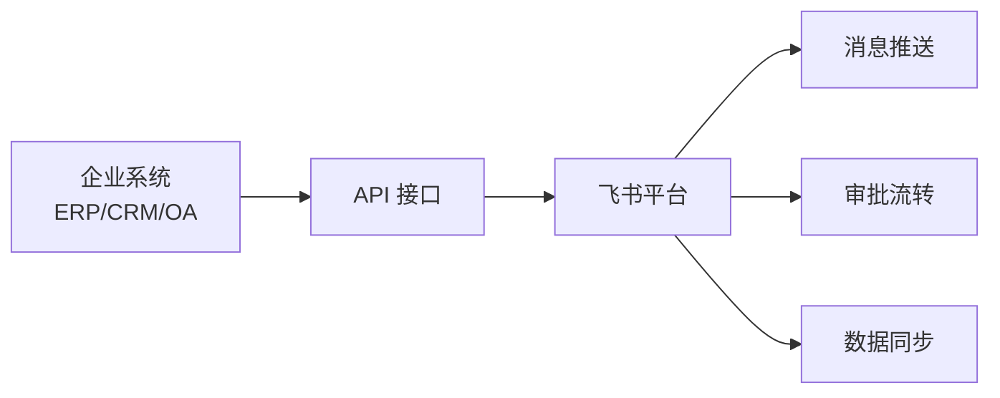
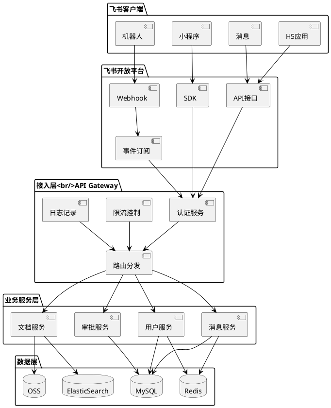
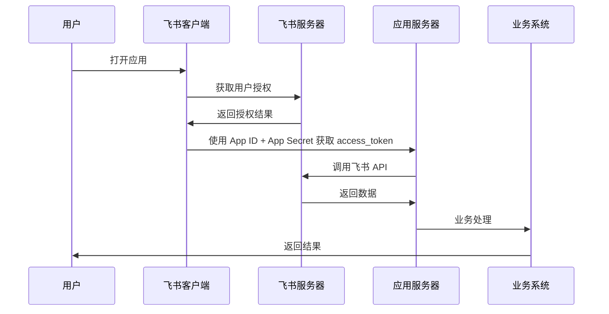

# 飞书开放平台调研报告

## 一、平台概述

### 1.1 平台简介

飞书开放平台是字节跳动旗下的企业协作平台开放生态，为开发者提供丰富的 API 接口和开发工具，支持企业构建定制化的办公应用和集成解决方案。飞书整合了即时沟通、日历、文档、云盘、视频会议等核心办公场景，通过开放平台能力，帮助企业实现数字化办公转型。

### 1.2 平台定位

- **企业协作平台**：聚焦企业内部协作场景，提供一站式办公解决方案
- **开放生态平台**：通过开放 API、小程序、应用市场等能力，构建企业服务生态
- **低代码开发平台**：提供低代码开发工具，降低企业应用开发门槛
- **智能化办公平台**：集成 AI 能力，提升办公效率和体验

### 1.3 核心价值

| 价值维度 | 描述 |
|---------|------|
| 效率提升 | 打通企业内部系统，实现信息流转自动化 |
| 成本降低 | 低代码开发能力降低开发成本，快速上线应用 |
| 体验优化 | 统一入口，提升员工使用体验 |
| 数据整合 | 集成多系统数据，构建企业数据中台 |

---

## 二、核心能力体系

### 2.1 API 能力矩阵

#### 2.1.1 基础能力

| 能力类型 | 主要接口 | 应用场景 |
|---------|---------|---------|
| **用户管理** | 用户信息获取、部门管理、组织架构 | 人员管理、权限控制 |
| **消息推送** | 单聊消息、群聊消息、富文本消息 | 通知提醒、审批流转 |
| **机器人** | 自定义机器人、交互式卡片 | 智能客服、自动回复 |
| **事件订阅** | 消息事件、审批事件、通讯录变更 | 实时响应、流程触发 |

#### 2.1.2 业务能力

| 能力类型 | 主要接口 | 应用场景 |
|---------|---------|---------|
| **文档能力** | 云文档、在线表格、知识库 | 知识管理、协作编辑 |
| **日历能力** | 日历事件、会议室预定、日程管理 | 会议管理、时间协调 |
| **审批能力** | 审批定义、审批实例、审批流程 | 流程审批、自动化处理 |
| **通讯录能力** | 部门管理、用户管理、群组管理 | 组织管理、权限控制 |

#### 2.1.3 高级能力

| 能力类型 | 主要接口 | 应用场景 |
|---------|---------|---------|
| **视频会议** | 创建会议、邀请参会、录制回放 | 远程协作、在线培训 |
| **多维表格** | 数据存储、视图管理、仪表盘 | 项目管理、数据收集 |
| **应用管理** | 应用发布、权限配置、版本管理 | 应用分发、租户管理 |
| **数据安全** | 水印设置、审计日志、敏感数据保护 | 安全合规、数据治理 |

### 2.2 开发框架

#### 2.2.1 小程序开发

- **技术栈**：基于 Vue.js / React 框架
- **开发工具**：飞书开发者工具（类似微信开发者工具）
- **特点**：
  - 轻量级，无需安装即可使用
  - 丰富的 UI 组件库
  - 支持热更新
  - 完善的调试工具

#### 2.2.2 H5 应用开发

- **技术栈**：标准 Web 技术（HTML5/CSS3/JavaScript）
- **集成方式**：通过 JS-SDK 与飞书客户端交互
- **特点**：
  - 跨平台兼容
  - 开发门槛低
  - 灵活度高

#### 2.2.3 服务端应用开发

- **SDK 支持**：Java、Python、Go、Node.js
- **认证方式**：App ID + App Secret
- **接口协议**：RESTful API
- **数据格式**：JSON

### 2.3 消息推送能力

#### 2.3.1 消息类型

| 消息类型 | 描述 | 使用场景 |
|---------|------|---------|
| **文本消息** | 纯文本内容 | 简单通知 |
| **富文本消息** | 支持格式化的文本 | 详细说明、重点标注 |
| **卡片消息** | 结构化、交互式卡片 | 业务通知、操作入口 |
| **图片消息** | 图片内容 | 可视化展示 |
| **文件消息** | 文件附件 | 文档分享 |
| **分享消息** | 分享卡片 | 内容传播 |

#### 2.3.2 卡片消息详解

**卡片消息优势**：
- 结构化展示信息，提升阅读效率
- 支持交互按钮，直接触发业务操作
- 支持动态更新，实时展示业务状态
- 统一的视觉规范，提升用户体验

**卡片消息结构**：
```json
{
  "config": {
    "wide_screen_mode": true
  },
  "header": {
    "title": {
      "tag": "plain_text",
      "content": "审批通知"
    },
    "template": "blue"
  },
  "elements": [
    {
      "tag": "div",
      "text": {
        "tag": "lark_md",
        "content": "**申请人**：张三\n**审批类型**：请假申请"
      }
    },
    {
      "tag": "action",
      "actions": [
        {
          "tag": "button",
          "text": {
            "tag": "plain_text",
            "content": "同意"
          },
          "type": "primary",
          "value": {
            "action": "approve"
          }
        }
      ]
    }
  ]
}
```

### 2.4 机器人能力

#### 2.4.1 机器人类型

| 类型 | 描述 | 特点 |
|------|------|------|
| **自定义机器人** | 群聊 Webhook 机器人 | 简单易用，快速推送消息 |
| **应用机器人** | 企业自建应用的机器人 | 功能完整，支持交互 |
| **公众号机器人** | 对外服务的机器人 | 可服务外部用户 |

#### 2.4.2 机器人能力

- **消息接收**：监听用户消息、群聊消息
- **消息发送**：主动推送消息、回复用户消息
- **交互处理**：处理按钮点击、表单提交
- **命令处理**：识别和处理特定命令

### 2.5 事件订阅

#### 2.5.1 支持的事件类型

| 事件类型 | 具体事件 | 应用场景 |
|---------|---------|---------|
| **消息事件** | 接收消息、消息已读、消息撤回 | 消息处理、状态同步 |
| **通讯录事件** | 用户创建、用户更新、部门变更 | 组织架构同步 |
| **审批事件** | 审批发起、审批通过、审批拒绝 | 流程自动化 |
| **日历事件** | 日程创建、日程更新、日程删除 | 日程管理 |
| **文档事件** | 文档创建、文档更新、权限变更 | 知识管理 |

#### 2.5.2 事件推送机制

- **推送方式**：HTTP POST 请求
- **数据格式**：JSON
- **安全机制**：签名验证、IP 白名单
- **重试机制**：失败自动重试，指数退避

---

## 三、应用场景分析

### 3.1 典型应用场景

#### 3.1.1 企业内部系统集成

**场景描述**：
将企业现有的 ERP、CRM、OA 等系统与飞书集成，实现统一入口和数据互通。

**实现方案**：



**具体能力**：
- 单点登录（SSO）
- 组织架构同步
- 业务数据推送
- 审批流程对接
- 报表数据展示

#### 3.1.2 智能客服机器人

**场景描述**：
构建企业内部智能客服，自动回答员工常见问题，提升 IT/HR 服务效率。

**实现方案**：


**技术要点**：
- 自然语言处理（NLP）
- 知识库管理
- 多轮对话
- 人工转接

#### 3.1.3 自动化工作流

**场景描述**：
通过飞书开放能力，实现业务流程自动化，减少人工操作。

**典型流程**：
1. **审批自动化**：系统事件触发审批 → 推送审批卡片 → 用户操作 → 回调业务系统
2. **任务提醒**：定时任务 → 检查待办 → 推送提醒 → 更新状态
3. **数据同步**：业务系统变更 → 事件监听 → 同步到飞书 → 更新组织架构

#### 3.1.4 项目管理协作

**场景描述**：
利用飞书多维表格和开放能力，构建项目管理工具。

**核心功能**：
- 任务创建和分配
- 进度跟踪和更新
- 消息通知和提醒
- 数据统计和报表

#### 3.1.5 知识管理平台

**场景描述**：
基于飞书文档能力，构建企业知识库。

**核心功能**：
- 文档创建和编辑
- 权限管理
- 全文搜索
- 知识图谱

### 3.2 行业解决方案

#### 3.2.1 互联网科技行业

**典型需求**：
- 快速迭代的产品开发
- 敏捷项目管理
- 代码协作和审查
- 自动化运维

**解决方案**：
- Git 集成：代码提交自动通知
- CI/CD 集成：构建结果实时推送
- 项目管理：多维表格 + 自动化工作流
- 知识沉淀：技术文档 + 知识库

#### 3.2.2 金融行业

**典型需求**：
- 严格的安全合规
- 审批流程规范
- 数据隐私保护
- 高可用性

**解决方案**：
- 安全能力：数据加密、审计日志、权限控制
- 合规审批：自定义审批流程、多级审批
- 数据隔离：租户隔离、数据脱敏
- 灾备方案：多地容灾、数据备份

#### 3.2.3 制造业

**典型需求**：
- 生产流程管理
- 设备监控预警
- 供应链协同
- 质量管理

**解决方案**：
- 设备对接：IoT 设备数据接入飞书
- 预警通知：设备异常自动报警
- 流程管理：生产流程审批自动化
- 数据可视化：多维表格 + 仪表盘

#### 3.2.4 教育行业

**典型需求**：
- 在线教学
- 学生管理
- 家校沟通
- 资源共享

**解决方案**：
- 在线课堂：视频会议 + 屏幕共享
- 作业管理：文档协作 + 在线批改
- 家校沟通：班级群 + 消息通知
- 资源管理：知识库 + 文件共享

---

## 四、开发指南

### 4.1 开发流程

#### 4.1.1 应用创建

**步骤**：
1. 注册飞书开发者账号
2. 创建企业自建应用
3. 配置应用基本信息
4. 设置权限范围
5. 获取 App ID 和 App Secret

#### 4.1.2 权限配置

**权限类型**：
- **通讯录权限**：读取用户信息、部门信息等
- **消息权限**：发送消息、接收消息等
- **文档权限**：读取文档、编辑文档等
- **审批权限**：创建审批、查询审批等

**权限申请原则**：
- 最小权限原则：只申请必要的权限
- 用户授权：敏感权限需要用户显式授权
- 权限审核：部分权限需要平台审核

#### 4.1.3 开发调试

**开发环境**：
- 测试企业：独立的测试环境
- 调试工具：飞书开发者工具
- 日志查看：实时日志监控

**调试方式**：
- 本地调试：通过内网穿透工具
- 云端调试：部署到测试环境
- 模拟测试：使用测试数据

#### 4.1.4 应用发布

**发布流程**：
1. 应用配置完成
2. 版本创建
3. 应用审核（部分应用类型）
4. 发布上线
5. 用户安装使用

**版本管理**：
- 支持多版本并存
- 灰度发布能力
- 版本回滚机制

### 4.2 SDK 使用

#### 4.2.1 Java SDK

**Maven 依赖**：
```xml
<dependency>
    <groupId>com.larksuite.oapi</groupId>
    <artifactId>oapi-sdk</artifactId>
    <version>2.0.0</version>
</dependency>
```

**代码示例**：
```java
// 初始化客户端
Config config = Config.createConfig(Config.DemoAppId, Config.DemoAppSecret, Config.AppType.SelfBuild);
Client client = new Client(config);

// 发送消息
SendMessageReq req = SendMessageReq.newBuilder()
    .receiveIdType("user_id")
    .sendMessageRequestBody(SendMessageRequestBody.newBuilder()
        .receiveId("user_id_here")
        .msgType("text")
        .content("{\"text\":\"Hello World\"}")
        .build())
    .build();

SendMessageResp resp = client.im().message().sendMessage(req);
```

#### 4.2.2 Python SDK

**安装**：
```bash
pip install lark-oapi
```

**代码示例**：
```python
import lark_oapi as lark
from lark_oapi.api.im.v1 import *

# 初始化客户端
client = lark.Client.builder() \
    .app_id("app_id") \
    .app_secret("app_secret") \
    .build()

# 发送消息
request = CreateMessageReq.builder() \
    .receive_id_type("user_id") \
    .request_body(CreateMessageReqBody.builder()
        .receive_id("user_id")
        .msg_type("text")
        .content("{\"text\":\"Hello World\"}")
        .build()) \
    .build()

response = client.im.v1.message.create(request)
```

#### 4.2.3 Node.js SDK

**安装**：
```bash
npm install @larksuiteoapi/node-sdk
```

**代码示例**：
```javascript
const lark = require('@larksuiteoapi/node-sdk');

// 初始化客户端
const client = new lark.Client({
  appId: 'app_id',
  appSecret: 'app_secret',
  appType: lark.AppType.SelfBuild,
});

// 发送消息
const res = await client.im.message.create({
  params: {
    receive_id_type: 'user_id',
  },
  data: {
    receive_id: 'user_id',
    msg_type: 'text',
    content: JSON.stringify({ text: 'Hello World' }),
  },
});
```

### 4.3 最佳实践

#### 4.3.1 性能优化

**API 调用优化**：
- 批量接口：使用批量接口减少调用次数
- 并发控制：合理控制并发量，避免限流
- 缓存策略：缓存用户信息、部门信息等不常变更的数据
- 异步处理：耗时操作异步处理，避免阻塞

**消息推送优化**：
- 消息队列：高并发场景使用消息队列
- 重试机制：失败自动重试，确保消息送达
- 限流控制：控制推送频率，避免被限流

#### 4.3.2 安全最佳实践

**认证安全**：
- App Secret 安全存储，不泄露
- 使用 IP 白名单限制访问
- 定期更换 App Secret

**数据安全**：
- 敏感数据加密传输
- 遵守最小权限原则
- 记录审计日志

**接口安全**：
- 验证请求签名
- 防止重放攻击
- 输入参数校验

#### 4.3.3 错误处理

**常见错误码**：

| 错误码 | 描述 | 处理建议 |
|--------|------|---------|
| 99991663 | access_token 过期 | 刷新 token |
| 99991664 | access_token 无效 | 重新获取 token |
| 99991661 | 权限不足 | 检查应用权限配置 |
| 99991400 | 参数错误 | 检查请求参数 |
| 99991500 | 服务器内部错误 | 重试或联系技术支持 |

**错误处理策略**：
- 记录详细日志
- 实现重试机制
- 提供友好的错误提示
- 监控错误率

---

## 五、优势与劣势分析

### 5.1 核心优势

#### 5.1.1 产品能力优势

| 优势维度 | 详细描述 |
|---------|---------|
| **一站式办公** | 整合 IM、文档、日历、视频会议、审批等核心能力，无需切换应用 |
| **强大文档能力** | 在线文档、多维表格、知识库，支持实时协作和丰富插件 |
| **智能体验** | OKR 目标管理、先进的企业协同理念，提升团队效率 |
| **开放性强** | API 能力丰富，支持多种开发模式和集成方式 |

#### 5.1.2 技术优势

| 优势维度 | 详细描述 |
|---------|---------|
| **性能优异** | 基于 ByteTech 技术栈，性能和稳定性有保障 |
| **接口设计** | RESTful API 设计，接口规范清晰 |
| **SDK 支持** | 多语言 SDK 支持，开发体验好 |
| **文档完善** | 开发文档详细，示例丰富 |

#### 5.1.3 生态优势

| 优势维度 | 详细描述 |
|---------|---------|
| **应用市场** | 丰富的应用市场，涵盖各类企业需求 |
| **合作伙伴** | 大量 ISV 合作伙伴，提供专业解决方案 |
| **社区活跃** | 开发者社区活跃，问题响应及时 |

### 5.2 潜在劣势

#### 5.2.1 市场劣势

| 劣势维度 | 详细描述 |
|---------|---------|
| **市场占有率** | 相比钉钉、企业微信，市场占有率相对较低 |
| **品牌认知** | 品牌知名度不如腾讯、阿里系产品 |
| **客户基础** | 主要面向互联网、科技企业，传统企业渗透率较低 |

#### 5.2.2 功能劣势

| 劣势维度 | 详细描述 |
|---------|---------|
| **考勤打卡** | 考勤功能相对简单，不如钉钉完善 |
| **硬件集成** | 硬件生态不如钉钉丰富 |
| **行业应用** | 行业垂直应用相对较少 |

#### 5.2.3 开发劣势

| 劣势维度 | 详细描述 |
|---------|---------|
| **学习曲线** | 概念和 API 相对复杂，上手需要一定时间 |
| **调试工具** | 调试工具不如微信开发者工具成熟 |
| **第三方资源** | 第三方库和工具相对较少 |

---

## 六、成本分析

### 6.1 开发成本

| 成本项 | 说明 | 预估费用 |
|--------|------|---------|
| **人力成本** | 开发人员薪资 | 根据团队规模和开发周期 |
| **培训成本** | 学习飞书开发技术 | 1-2 周学习时间 |
| **测试成本** | 测试环境、测试数据 | 相对较低 |

### 6.2 运营成本

| 成本项 | 说明 | 费用说明 |
|--------|------|---------|
| **平台费用** | 飞书使用费用 | 根据企业规模和版本 |
| **服务器成本** | 后端服务部署 | 根据业务量级 |
| **维护成本** | 系统运维、升级 | 持续投入 |

### 6.3 隐性成本

| 成本项 | 说明 |
|--------|------|
| **迁移成本** | 从其他平台迁移到飞书的成本 |
| **培训成本** | 员工使用培训 |
| **集成成本** | 与现有系统集成对接 |

---

## 七、技术架构建议

### 7.1 整体架构设计



### 7.2 关键技术选型

#### 7.2.1 后端技术栈

| 技术组件 | 推荐方案 | 说明 |
|---------|---------|------|
| **开发语言** | Java / Go / Node.js | 根据团队技术栈选择 |
| **Web 框架** | Spring Boot / Gin / Express | 成熟的 Web 框架 |
| **数据库** | MySQL | 关系型数据库，存储业务数据 |
| **缓存** | Redis | 缓存 token、用户信息等 |
| **消息队列** | Kafka / RabbitMQ | 异步处理、削峰填谷 |
| **日志** | ELK | 日志收集和分析 |
| **监控** | Prometheus + Grafana | 系统监控和告警 |

#### 7.2.2 前端技术栈

| 技术组件 | 推荐方案 | 说明 |
|---------|---------|------|
| **小程序** | Vue.js / React | 飞书小程序框架支持 |
| **H5 应用** | Vue.js / React | 主流前端框架 |
| **UI 组件库** | Ant Design / Element UI | 成熟的 UI 组件库 |

### 7.3 安全架构

#### 7.3.1 认证授权



**认证流程**：
1. 用户在飞书客户端打开应用
2. 应用获取用户授权
3. 应用服务器使用 App ID + App Secret 获取 access_token
4. 使用 access_token 调用飞书 API
5. 业务系统处理请求

#### 7.3.2 数据安全

| 安全措施 | 说明 |
|---------|------|
| **传输加密** | HTTPS 加密传输 |
| **存储加密** | 敏感数据加密存储 |
| **访问控制** | 基于角色的访问控制（RBAC） |
| **审计日志** | 记录所有操作日志 |
| **数据脱敏** | 敏感数据脱敏展示 |

---

## 八、实施路径建议

### 8.1 实施阶段规划

#### 第一阶段：需求调研与方案设计（2-4 周）

**主要工作**：
- 业务需求梳理
- 技术可行性分析
- 系统架构设计
- 开发计划制定

**交付物**：
- 需求规格说明书
- 技术方案设计文档
- 项目计划书

#### 第二阶段：基础能力开发（4-6 周）

**主要工作**：
- 开发环境搭建
- 基础框架搭建
- 核心接口对接
- 基础功能开发

**交付物**：
- 开发环境
- 基础代码框架
- 核心功能模块

#### 第三阶段：业务功能开发（6-8 周）

**主要工作**：
- 业务功能开发
- 前端界面开发
- 接口联调
- 功能测试

**交付物**：
- 完整的业务功能
- 测试报告

#### 第四阶段：测试与上线（2-3 周）

**主要工作**：
- 集成测试
- 性能测试
- 安全测试
- 灰度发布
- 正式上线

**交付物**：
- 测试报告
- 上线报告
- 运维文档

#### 第五阶段：运营与优化（持续）

**主要工作**：
- 用户培训
- 运营推广
- 问题收集与处理
- 功能迭代优化

**交付物**：
- 运营报告
- 优化方案

### 8.2 团队配置建议

| 角色 | 人数 | 职责 |
|------|------|------|
| **项目经理** | 1 | 项目整体规划、进度把控、资源协调 |
| **产品经理** | 1 | 需求分析、产品规划、原型设计 |
| **架构师** | 1 | 架构设计、技术选型、技术难点攻关 |
| **后端开发** | 2-3 | 后端服务开发、接口对接 |
| **前端开发** | 2 | 小程序/H5 前端开发 |
| **测试工程师** | 1 | 测试用例设计、功能测试、性能测试 |
| **运维工程师** | 1 | 环境搭建、部署上线、系统运维 |

### 8.3 风险控制

| 风险类型 | 风险描述 | 应对措施 |
|---------|---------|---------|
| **技术风险** | API 变更、接口不稳定 | 关注官方更新、做好版本管理 |
| **进度风险** | 需求变更、技术难题 | 预留缓冲时间、及时沟通调整 |
| **安全风险** | 数据泄露、权限滥用 | 严格的安全审查、最小权限原则 |
| **运维风险** | 系统故障、性能瓶颈 | 完善的监控告警、应急预案 |

---

## 九、总结与建议

### 9.1 总结

飞书开放平台作为字节跳动旗下的企业协作平台，具有以下特点：

**优势**：
- 一站式办公平台，功能完善
- 文档能力强大，支持实时协作
- API 能力丰富，开放性强
- 技术架构先进，性能优异
- 产品理念先进，用户体验好

**劣势**：
- 市场占有率相对较低
- 传统企业客户基础较弱
- 硬件生态不够丰富

**适用场景**：
- 互联网、科技企业
- 注重协作效率的团队
- 需要强大文档能力的企业
- 追求先进办公理念的组织

### 9.2 建议

#### 9.2.1 平台选择建议

- **如果企业**：注重文档协作、团队效率、产品体验 → **推荐飞书**
- **如果企业**：需要完善考勤、硬件生态、传统行业解决方案 → **推荐钉钉**
- **如果企业**：深度使用微信生态、需要客户连接 → **推荐企业微信**

#### 9.2.2 开发实施建议

1. **充分调研**：深入了解业务需求和技术可行性
2. **架构先行**：做好技术架构设计，避免后期重构
3. **小步快跑**：采用敏捷开发，快速迭代
4. **重视安全**：从设计阶段就考虑安全问题
5. **持续优化**：根据用户反馈持续优化功能

#### 9.2.3 后续规划建议

1. **深度集成**：逐步将更多企业系统与飞书集成
2. **数据中台**：构建基于飞书的数据中台，实现数据统一
3. **智能化**：引入 AI 能力，提升办公智能化水平
4. **生态建设**：建设企业应用生态，降低重复开发

---

## 十、附录

### 10.1 相关资源

| 资源类型 | 链接 |
|---------|------|
| **开放平台官网** | https://open.feishu.cn |
| **开发文档** | https://open.feishu.cn/document |
| **API 参考** | https://open.feishu.cn/document/server-docs/api-reference |
| **SDK 下载** | https://open.feishu.cn/document/ukTMukTMukTM/uYTMxUjL2ITMx4iNyMTE |
| **开发者社区** | https://open.feishu.cn/community |
| **应用市场** | https://app.feishu.cn |

### 10.2 常见问题

**Q1: 飞书开放平台的费用如何？**
A: 飞书开放平台本身免费开放，但使用飞书企业版需要付费。具体费用根据企业规模和功能需求而定。

**Q2: 如何获取技术支持？**
A: 可以通过开发者社区、工单系统、技术支持邮箱等渠道获取技术支持。

**Q3: 应用审核需要多长时间？**
A: 一般应用审核时间为 1-3 个工作日，涉及特殊权限的应用可能需要更长时间。

**Q4: 如何处理 access_token 过期问题？**
A: access_token 有效期为 2 小时，需要定时刷新或使用 tenant_access_token。

**Q5: 是否支持私有化部署？**
A: 飞书支持私有化部署，具体方案需要联系飞书商务团队。

---

**报告编制时间**：2026年4月
**报告版本**：V1.0