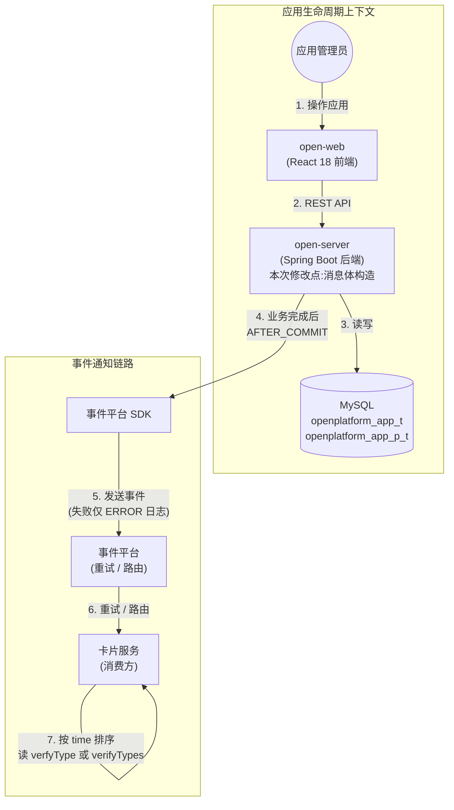
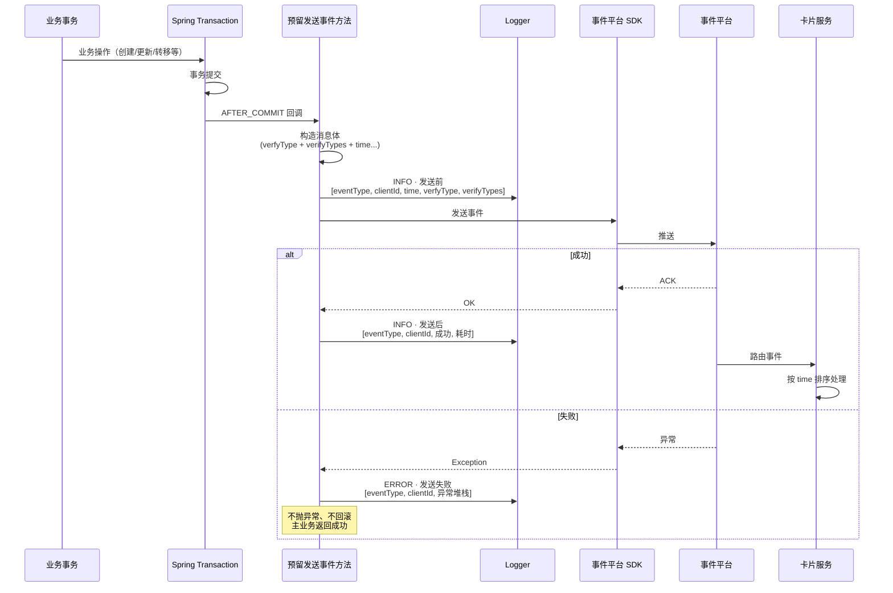

# 需求设计说明书 — 开放平台应用事件通知卡片服务 · verifyTypes 字段扩展

## 修订记录

| 版本 | 日期 | 修改人 | 修改说明 |
|------|------|--------|---------|
| v0.1 | 2026-06-11 | Spec Agent | 初稿（技术规格形式，固定章节 Scope/Interface/Constraints/Data/TestCases）|
| v0.2 | 2026-06-11 | Spec Agent | 清除全部 #ASSUMED，确认日志级别 / 兜底策略 / 时序语义 / AFTER_COMMIT |
| v0.3 | 2026-06-11 | Spec Agent | 认证方式枚举补充 `4: APIG`（与 [spec.md:81] 5 种认证方式对齐）|
| v1.0 | 2026-06-11 | Spec Agent | 重写为需求设计说明书样式（对齐 `docs/market-server/app-chatbot-bindtab-requirement.md`）|

## 目录
- 1 需求价值和概述
    - 1.1 需求背景与来源
    - 1.2 需求价值
    - 1.3 如果不做的影响
- 2 上下文分析
    - 2.1 系统上下文
    - 2.2 利益相关方
- 3 初始需求分析
    - 3.1 初始需求场景分析
    - 3.2 结构化 IR
- 4 需求影响分析
    - 4.1 特性影响分析
- 5 事件触发场景分析
    - 5.1 触发场景清单
    - 5.2 触发场景详述（UC-01 ~ UC-05）
- 6 功能设计
    - 6.1 整体设计方案
    - 6.2 事件类型表
    - 6.3 触发点 → 事件类型 → 字段取值规则
    - 6.4 消息体字段契约
    - 6.5 认证方式枚举
    - 6.6 数据库映射
    - 6.7 消息体 JSON 示例
    - 6.8 事件发送时序
- 7 系统级非功能设计
    - 7.1 FMEA 影响分析
    - 7.2 安全影响分析
    - 7.3 兼容性
    - 7.4 可运维
- 8 测试用例
- 9 checkList

## Keywords 关键字：
- 中文：卡片服务、事件通知、认证方式多选、消息契约、向后兼容、AFTER_COMMIT、verifyTypes
- English：Card Service, Event Notification, Authentication Multi-Select, Message Contract, Backward Compatibility, AFTER_COMMIT, verifyTypes

## Abstract 摘要：

**中文**：开放平台在应用生命周期关键节点（创建业务应用、升级应用类型、更新基本信息、转移 Owner、变更认证方式）通过 SDK 经事件平台向卡片服务发送事件通知。当前消息体中的 `verfyType`（Integer，单选）字段已上线运行，历史项目已有实现。本次业务驱动为认证方式由单选扩展为多选（含新增类型 `4: APIG`），需要在消息体中**新增 `verifyTypes`（`List<Integer>`，升序）字段**承载完整多选列表，**保留历史字段 `verfyType`** 以保持向后兼容。本需求不修改触发点、不修改前端、不修改预留方法体结构，仅在消息体构造环节新增字段并按触发场景确定取值规则（默认/从 DB 读/以请求为准）。事件发送失败仅打印 ERROR 日志，不阻断主业务；重试由事件平台承担；时序依赖消息体 `time` 字段（UTC 毫秒）；触发时机严格 AFTER_COMMIT。

**English**: OpenPlatform sends event notifications to the Card Service via an event platform through SDK at key application lifecycle nodes (creating business app, upgrading app type via EAMAP binding, updating basic info, transferring Owner, changing authentication methods). The existing `verfyType` (Integer, single-select) field in the message body is already in production. The business driver this time is the extension of authentication methods from single-select to multi-select (including the newly added type `4: APIG`), requiring a new `verifyTypes` (`List<Integer>`, ascending) field in the message body to carry the complete multi-select list, while **retaining the historical `verfyType` field** for backward compatibility. This requirement does not modify trigger points, frontend, or the reserved method structure — it only adds the new field during message body construction and defines value rules per trigger scenario (default / read from DB / based on request). Event sending failure only prints ERROR logs without blocking the main business; retries are handled by the event platform; timing depends on the `time` field (UTC milliseconds); trigger timing is strictly AFTER_COMMIT.

## List 缩略语清单

| 缩略语 | 英文全名 | 中文解释 |
|--------|---------|---------|
| SDK | Software Development Kit | 软件开发工具包（事件平台提供）|
| AFTER_COMMIT | Transaction After Commit | Spring 事务提交后回调机制 |
| EAMAP | Enterprise Application Management Platform | 企业应用管理平台 |
| IR | Initial Requirement | 初始需求 |
| UC | Use Case | 用例 |
| DFX | Design for X | 面向 X 的设计（X=性能/安全/可靠性等）|
| FMEA | Failure Mode and Effects Analysis | 失效模式与影响分析 |
| SOA | Service-Oriented Architecture | 面向服务架构 |
| APIG | API Gateway | API 网关 |

---

## 1 需求价值和概述

### 1.1 需求背景与来源

开放平台（OpenPlatform v2）在应用生命周期关键节点需要向卡片服务同步应用数据，使其维护应用副本供业务消费。同步通过 SDK → 事件平台 → 卡片服务的链路完成，事件发送为业务完成后的异步动作，失败不影响主流程 [plan.md:583/687/1191/1414/1979]。

当前消息体中 `verfyType`（Integer）字段承载"回调接口认证方式"，已上线运行于历史项目，为单选值 [用户输入 2026-06-11]。业务侧正在将认证方式由单选扩展为多选 [spec.md:81]，原单选字段已无法承载完整信息。

本次需求在消息体中**新增 `verifyTypes` 字段**（`List<Integer>`，升序排列），承载完整多选列表；同时**保留 `verfyType` 字段**（取 `verifyTypes[0]`），确保老消费方不破约。

认证方式枚举同步扩展 `4: APIG`（历史 5 种认证方式见 [spec.md:81]，首次输入时漏列，本次对齐）。

### 1.2 需求价值

| 维度 | 价值 |
|------|------|
| 多选承载 | 通过 `verifyTypes` 字段承载完整多选认证方式，满足业务演进 |
| 向后兼容 | 保留 `verfyType` 字段，老卡片服务消费方无需同步升级 |
| 架构稳定 | 不修改触发点、预留方法体结构、前端，改动面最小化 |
| 可靠性 | 失败仅日志、重试依赖事件平台，主业务零影响 |
| 可观测 | 发送前后 INFO 日志 / 失败 ERROR 日志，含 traceId 串联 |
| 时序正确 | 严格 AFTER_COMMIT + UTC 毫秒 `time` 字段，消费方可还原事件顺序 |

### 1.3 如果不做的影响

- 卡片服务无法获得应用的多选认证方式，只能继续按单选 `verfyType` 处理，业务语义缺失
- 新增的 `APIG` 认证方式（值 `4`）在消息体中无承载，卡片服务无法识别
- 业务侧认证方式多选能力与卡片服务消费侧脱节，形成数据孤岛
- 长期看，缺失 `verifyTypes` 会阻塞卡片服务侧的认证策略升级

---

## 2 上下文分析

### 2.1 系统上下文



### 2.2 利益相关方

| 利益相关方 | 关注点 |
|-----------|--------|
| 卡片服务消费方 | 平稳过渡到 `verifyTypes`，老客户端继续读 `verfyType` 不破约 |
| 应用管理员 | 应用生命周期操作零感知，不因事件通知失败而受阻 |
| 事件平台 | 标准事件接入，业务侧不重试，幂等/重试由平台承担 |
| open-server 开发 | 改动面最小（仅消息体构造），复用现有预留方法 |
| 运维 / 审计 | 失败有 ERROR 日志可追溯，含 traceId 串联主业务 |

---

## 3 初始需求分析

### 3.1 初始需求场景分析

| 所属场景 | 场景名称 | 场景简要说明 | 涉及角色 |
|---------|---------|------------|---------|
| 事件通知字段扩展 | 创建业务应用通知 | 应用创建事务提交后，发送 `eamap_app_added` 事件，`verfyType=0` / `verifyTypes=[0]`（默认）| 系统 |
| 事件通知字段扩展 | 升级应用类型通知 | 个人应用绑 EAMAP 升级为业务应用，发送 `eamap_app_added` 事件，默认 `0` / `[0]` | 系统 |
| 事件通知字段扩展 | 应用基本信息更新通知 | 应用基本信息变更，发送 `eamap_app_updated` 事件，认证字段**从 DB 读**（不涉及认证更新）| 系统 |
| 事件通知字段扩展 | 转移 Owner 通知 | Owner 变更，发送 `eamap_app_updated` 事件，认证字段**从 DB 读**（不涉及认证更新）| 系统 |
| 事件通知字段扩展 | 更新认证方式通知 | 认证方式变更，发送 `eamap_app_updated` 事件，`verifyTypes` **以请求为准**，`verfyType = verifyTypes[0]` | 系统 |
| 事件通知字段扩展 | 事件发送失败 | 任一触发场景下 SDK 调用失败，仅 ERROR 日志，主业务不回滚 | 系统 |
| 事件通知字段扩展 | 历史脏数据兜底 | DB 中 `verify_type` 为空时，按 `0` / `[0]` 兜底 | 系统 |

### 3.2 结构化 IR

| IR 属性 | 具体信息 |
|--------|---------|
| IR 标识 | IR-OPEN-CARD-EVENT-001 |
| 名称 | 卡片服务事件通知消息体新增 verifyTypes 字段 |
| 描述 | 在 open-server 向卡片服务发送的事件消息体中，新增 `verifyTypes`（`List<Integer>`，升序）字段承载多选认证方式；保留历史 `verfyType` 字段；认证方式枚举扩展 `4: APIG` |
| 优先级 | P1（高）|
| 需求描述（why）| 业务侧认证方式扩展为多选 + 新增 APIG 类型，当前单选字段 `verfyType` 无法承载完整语义；卡片服务消费侧需要完整的多选信息 |
| what | ① 新增 `verifyTypes` 字段；② 保留 `verfyType`；③ 5 个触发场景各自取值规则；④ 认证方式枚举扩展 `4: APIG`；⑤ 失败 ERROR 日志；⑥ `[0]` 兜底 |
| who | 后端：open-server 开发；卡片服务：消费方升级（不在本需求范围）|
| 对架构要素的影响 | **架构**：消息契约扩展，触发点不变；**可靠性**：失败零影响主业务；**兼容**：老消费方不破约 |

---

## 4 需求影响分析

### 4.1 特性影响分析

**【新增】**：

| 特性 | 说明 |
|------|------|
| `verifyTypes` 字段 | 消息体新增 `List<Integer>` 字段，承载多选认证方式（升序）|
| `4: APIG` 认证类型 | 认证方式枚举扩展，与 [spec.md:81] 5 种认证方式对齐 |

**【修改】**：

| 特性 | 影响说明 |
|------|---------|
| 5 个触发场景的消息体构造 | 各自按取值规则填充 `verfyType` + `verifyTypes`（默认 / DB 读 / 请求为准）|
| 失败日志级别 | 失败日志从 WARN 升级为 **ERROR** |

**【删除】**：不涉及

**【不变】**：

| 特性 | 说明 |
|------|------|
| 5 个触发点 | 不增不减不调整触发时机 |
| 预留方法体结构 | 不改造，仅在方法体内构造消息体时新增字段 |
| 前端（open-web）| 任何页面均不涉及 |
| 错误码 `500101` | 沿用"事件发送失败"错误码 |

---

## 5 事件触发场景分析

> 本需求无 UI 交互、无 API 端点新增，因此将"系统用例"替换为"事件触发场景"，每个场景按 Actor / 前置条件 / 主成功场景 / 扩展场景描述。

### 5.1 触发场景清单

| 场景 ID | 场景名称 | 触发点 | 事件类型 | 涉及认证方式更新 |
|--------|---------|-------|---------|:----------------:|
| UC-01 | 创建业务应用时通知 | T1 | `eamap_app_added` | 否 |
| UC-02 | 升级应用类型时通知 | T2 | `eamap_app_added` | 否 |
| UC-03 | 应用基本信息更新时通知 | T3 | `eamap_app_updated` | 否 |
| UC-04 | 转移 Owner 时通知 | T4 | `eamap_app_updated` | 否 |
| UC-05 | 更新认证方式时通知 | T5 | `eamap_app_updated` | **是** |

### 5.2 触发场景详述

#### UC-01 创建业务应用时通知卡片服务

**【简要说明】**：业务应用创建事务成功提交后，系统通过 SDK 向卡片服务发送 `eamap_app_added` 事件，消息体中 `verfyType=0`、`verifyTypes=[0]`（默认值）。

**【Actor】**：系统（业务应用创建流程）

**【前置条件】**：
- 应用创建事务已成功提交（4 张表：app + member + identity + property [需求设计说明书.md:142]）
- 创建者为 EAMAP owner
- 预留发送事件方法可调用

**【最小保证】**：事件发送失败时，应用创建结果保留，仅打印 ERROR 日志

**【成功保证】**：
- 卡片服务收到 `eamap_app_added` 事件
- 消息体 `verfyType = 0`，`verifyTypes = [0]`
- 发送前后各一条 INFO 日志

**【主成功场景】**：
1. 应用创建事务提交
2. 触发 AFTER_COMMIT 回调
3. 构造消息体：`verfyType = 0`、`verifyTypes = [0]`、`time = System.currentTimeMillis()`
4. 发送 INFO 日志（发送前）：事件类型、clientId、time、verfyType、verifyTypes
5. SDK 调用事件平台
6. 发送 INFO 日志（发送后）：事件类型、clientId、成功状态、耗时
7. 主业务返回成功

**【扩展场景】**：
- **E1 SDK 调用失败**：打印 ERROR 日志（含异常堆栈），主业务不回滚、不回传错误码
- **E2 事件平台不可达**：同 E1

**【DFX 属性】**：可靠性（失败零影响主业务）、可观测（INFO/ERROR 日志）

#### UC-02 升级应用类型时通知卡片服务

**【简要说明】**：个人应用通过绑定 EAMAP 升级为业务应用，事务提交后发送 `eamap_app_added` 事件（首次成为业务应用语义），默认 `verfyType=0`、`verifyTypes=[0]`。

**【Actor】**：系统（应用升级流程）

**【前置条件】**：
- 应用升级事务成功提交（`app_type: 0→1`、`app_sub_type: 0→4` [plan.md:1413]）
- EAMAP 绑定已完成

**【最小保证】**：事件发送失败时，升级结果保留

**【成功保证】**：卡片服务收到 `eamap_app_added` 事件，消息体默认值正确

**【主成功场景】**：
1. 应用升级事务提交
2. 触发 AFTER_COMMIT 回调
3. 构造消息体：`verfyType = 0`、`verifyTypes = [0]`、`time = System.currentTimeMillis()`
4. 发送 INFO 日志（发送前）
5. SDK 调用事件平台
6. 发送 INFO 日志（发送后）
7. 主业务返回成功

**【扩展场景】**：
- **E1 SDK 调用失败**：ERROR 日志，主业务不回滚

**【DFX 属性】**：可靠性、可观测

#### UC-03 应用基本信息更新时通知卡片服务

**【简要说明】**：应用基本信息变更（不涉及认证方式），事务提交后发送 `eamap_app_updated` 事件，`verfyType` 和 `verifyTypes` **从本地 DB 读取当前值**，不更新。

**【Actor】**：系统（应用更新流程）

**【前置条件】**：
- 应用更新事务成功提交
- 应用存在且有效

**【最小保证】**：事件发送失败时，更新结果保留

**【成功保证】**：卡片服务收到 `eamap_app_updated` 事件，消息体中认证字段反映 DB 当前值

**【主成功场景】**：
1. 应用更新事务提交
2. 触发 AFTER_COMMIT 回调
3. 从 DB 读取当前 `verify_type` 字段（逗号分隔字符串）
4. 解析为 `List<Integer>`，升序排列，填充 `verifyTypes`
5. 取 `verifyTypes[0]` 填充 `verfyType`
6. 构造消息体，`time = System.currentTimeMillis()`
7. 发送 INFO 日志（发送前）
8. SDK 调用事件平台
9. 发送 INFO 日志（发送后）
10. 主业务返回成功

**【扩展场景】**：
- **E1 DB 中 `verify_type` 为空**：按 `0` / `[0]` 兜底
- **E2 SDK 调用失败**：ERROR 日志，主业务不回滚

**【DFX 属性】**：可靠性、可观测、兜底策略

#### UC-04 转移 Owner 时通知卡片服务

**【简要说明】**：Owner 变更（不涉及认证方式），事务提交后发送 `eamap_app_updated` 事件，`verfyType` 和 `verifyTypes` **从本地 DB 读取当前值**，不更新。

**【Actor】**：系统（Owner 转移流程）

**【前置条件】**：
- Owner 转移事务成功提交（删旧 Owner + 增新 Owner 原子操作 [需求设计说明书.md:643]）

**【最小保证】**：事件发送失败时，转移结果保留

**【成功保证】**：卡片服务收到 `eamap_app_updated` 事件，消息体中认证字段反映 DB 当前值

**【主成功场景】**：
1. Owner 转移事务提交
2. 触发 AFTER_COMMIT 回调
3. 从 DB 读取当前 `verify_type` 字段
4. 解析、升序、填充（同 UC-03 步骤 4-5）
5. 构造消息体，`time = System.currentTimeMillis()`
6. 发送 INFO 日志（发送前）
7. SDK 调用事件平台
8. 发送 INFO 日志（发送后）
9. 主业务返回成功

**【扩展场景】**：
- **E1 DB 中 `verify_type` 为空**：按 `0` / `[0]` 兜底
- **E2 SDK 调用失败**：ERROR 日志，主业务不回滚

**【DFX 属性】**：可靠性、可观测、兜底策略

#### UC-05 更新认证方式时通知卡片服务

**【简要说明】**：应用管理员修改认证方式（涉及认证方式更新），事务提交后发送 `eamap_app_updated` 事件，`verifyTypes` **以请求入参为准**（升序），`verfyType = verifyTypes[0]`。

**【Actor】**：系统（认证方式更新流程，由应用管理员触发）

**【前置条件】**：
- 认证方式更新事务成功提交
- 请求入参中 `verifyTypes` 非空，元素值域为 `{0, 1, 2, 3, 4}`
- 操作人为应用成员

**【最小保证】**：事件发送失败时，认证方式更新结果保留

**【成功保证】**：
- 卡片服务收到 `eamap_app_updated` 事件
- 消息体 `verifyTypes` 与请求入参一致（升序）
- `verfyType = verifyTypes[0]`

**【主成功场景】**：
1. 认证方式更新事务提交
2. 触发 AFTER_COMMIT 回调
3. 从请求入参读取 `verifyTypes`，升序排列
4. 取 `verifyTypes[0]` 作为 `verfyType`
5. 构造消息体，`time = System.currentTimeMillis()`
6. 发送 INFO 日志（发送前）
7. SDK 调用事件平台
8. 发送 INFO 日志（发送后）
9. 主业务返回成功

**【扩展场景】**：
- **E1 请求入参 `verifyTypes` 为空**：理论上由认证方式配置侧约束拦截，不应到达此处 #ASSUMED
- **E2 请求入参含非法值（非 `{0,1,2,3,4}`）**：由认证方式更新侧校验拦截 #ASSUMED
- **E3 SDK 调用失败**：ERROR 日志，主业务不回滚

**【DFX 属性】**：可靠性、可观测、向后兼容

---

## 6 功能设计

### 6.1 整体设计方案

**设计原则**：
- **向后兼容优先**：保留 `verfyType`，新增 `verifyTypes`，老消费方不破约
- **最小改动面**：不改触发点、不改预留方法体结构、不改前端
- **失败隔离**：事件发送失败仅日志，主业务零影响
- **语义清晰**：字段拼写采用正确拼写 `verifyTypes`，历史错拼 `verfyType` 保留

**限制和约束**：
- 卡片服务消费方升级节奏与本需求解耦（通过双字段实现平滑过渡）
- 重试、幂等、路由均由事件平台承担，业务侧不实现
- 时序依赖消息体 `time` 字段（UTC 毫秒），业务侧不保证到达顺序

### 6.2 事件类型表

| 事件类型字面量 | 触发场景 | 来源 |
|---|---|---|
| `open-cloud-wecode_eamap_app_added` | 创建业务应用、升级应用类型（绑 EAMAP，个人→业务）| [用户输入 2026-06-11] |
| `open-cloud-wecode_eamap_app_updated` | 应用基本信息更新、转移 Owner、更新认证方式 | [用户输入 2026-06-11] |

### 6.3 触发点 → 事件类型 → 字段取值规则

| # | 触发点 | 事件类型 | 涉及认证方式更新？ | `verfyType` 取值 | `verifyTypes` 取值 |
|---|---|---|---|---|---|
| T1 | 创建业务应用 | `eamap_app_added` | **否** | 默认 `0` | 默认 `[0]` |
| T2 | 升级应用类型（绑 EAMAP）| `eamap_app_added` | **否** | 默认 `0` | 默认 `[0]` |
| T3 | 应用基本信息更新 | `eamap_app_updated` | **否** | 从本地 DB 查 | 从本地 DB 查 |
| T4 | 转移 Owner | `eamap_app_updated` | **否** | 从本地 DB 查（不更新）| 从本地 DB 查（不更新）|
| T5 | 更新认证方式 | `eamap_app_updated` | **是** | 取 `verifyTypes[0]` | 以请求入参为准（升序）|

**取值派生规则（跨事件通用）**：
- `verfyType = verifyTypes[0]`（T5 场景下由请求入参派生；其他场景下与 DB 值保持一致）
- `verifyTypes` 元素**升序排列**

### 6.4 消息体字段契约

| 字段名 | 类型 | 必填 | 说明 | 状态 |
|---|---|---|---|---|
| `tenantId` | String | Y | 租户 ID | 历史 |
| `tenantName` | String | Y | 租户名 | 历史 |
| `clientId` | String | Y | EAMAP 应用 ID | 历史 |
| `clientName` | String | Y | 应用中文名称 | 历史 |
| `clientNameEn` | String | Y | 应用英文名称 | 历史 |
| `clientIcon` | String | Y | 应用图标 ID | 历史 |
| `clientOwner` | String | Y | 应用责任人账号 ID | 历史 |
| `verfyType` | Integer | Y | 回调认证方式（单选值，与 `verifyTypes[0]` 保持一致）| **历史，保留** |
| `verifyTypes` | List\<Integer\> | Y | 回调认证方式（多选完整列表，升序）| **新增 · 本次变更** |
| `time` | Long | Y | 事件触发时刻（13 位毫秒时间戳，UTC）| 历史 |
| `extend` | Object | N | 扩展字段 | 历史 |
| `propertyObjMap` | Map | N | 属性字段 | 历史 |

### 6.5 认证方式枚举

| 值 | 含义 | 状态 |
|---|---|---|
| `0` | Cookie | 历史 |
| `1` | SOAHeader | 历史 |
| `2` | 数字签名 | 历史 |
| `3` | SOAURL | 历史 |
| `4` | **APIG** | **新增** |

来源：5 种认证方式全量清单 [spec.md:81]；`4: APIG` 由 [用户输入 2026-06-11] 补充对齐。

### 6.6 数据库映射

- 应用认证方式持久化于 `openplatform_app_p_t.verify_type`，存储形式为**逗号分隔字符串**（多选）[plan.md:581]
- 发送事件时由生产方将字符串解析为 `List<Integer>` 填充 `verifyTypes`，取首元素填充 `verfyType`
- 解析位置在预留方法体内

### 6.7 消息体 JSON 示例

**场景 A：创建业务应用 / 升级应用类型（默认值）**
```json
{
  "tenantId": "T001",
  "tenantName": "示例租户",
  "clientId": "EAMAP_001",
  "clientName": "示例应用",
  "clientNameEn": "Sample App",
  "clientIcon": "icon_001",
  "clientOwner": "user_12345",
  "verfyType": 0,
  "verifyTypes": [0],
  "time": 1749600000000,
  "extend": null,
  "propertyObjMap": {}
}
```

**场景 B：更新认证方式为多选（SOAHeader + 数字签名 + APIG）**
```json
{
  "tenantId": "T001",
  "tenantName": "示例租户",
  "clientId": "EAMAP_001",
  "clientName": "示例应用",
  "clientNameEn": "Sample App",
  "clientIcon": "icon_001",
  "clientOwner": "user_12345",
  "verfyType": 1,
  "verifyTypes": [1, 2, 4],
  "time": 1749600000000,
  "extend": null,
  "propertyObjMap": {}
}
```

**场景 C：DB 历史脏数据（verify_type 为空）兜底**
```json
{
  "verfyType": 0,
  "verifyTypes": [0],
  "...": "其他字段同场景 A"
}
```

### 6.8 事件发送时序



---

## 7 系统级非功能设计

### 7.1 FMEA 影响分析

| 失效模式 | 影响 | 缓解措施 |
|---------|------|---------|
| SDK 调用失败 | 卡片服务数据陈旧 | 仅 ERROR 日志；重试由事件平台承担；主业务零影响 |
| 事件平台不可达 | 同上 | 同上 |
| 历史 DB 数据 `verify_type` 为空 | 消息体字段缺失 | 按 `0` / `[0]` 兜底 |
| 消息体 `time` 字段乱序 | 卡片服务处理顺序错乱 | 严格 UTC 毫秒（`System.currentTimeMillis()`）；消费方按 `time` 排序 |
| 事务回滚后事件仍发出 | 卡片服务收到"未发生"的事件 | 严格 AFTER_COMMIT，事务未提交不触发回调 |
| `verifyTypes` 入参乱序 | 消费方获得非预期顺序 | 生产方强制升序规整 |
| `verfyType` 与 `verifyTypes[0]` 不一致 | 老/新消费方看到不同认证方式 | 派生规则强制 `verfyType = verifyTypes[0]` |

### 7.2 安全影响分析

| 安全项 | 措施 |
|-------|------|
| 消息体敏感字段 | 不含密文、不含 token；`clientOwner` 为账号 ID，脱敏由卡片服务侧承担 |
| 越权发送 | 触发点均位于已鉴权的业务接口内，事件发送为系统动作，不暴露外部入口 |
| 日志泄露 | ERROR 日志不含完整消息体（避免 PII 泄露），仅含 clientId / eventType / 异常摘要 |

### 7.3 兼容性

#### 后向兼容性确认

- 老卡片服务消费方只读 `verfyType` 仍可工作，不受本次变更影响
- `verfyType` 字段拼写保留错拼（不纠正），避免破约
- 5 个触发点不增不减，触发时机不变

#### 前向兼容性确认

- 新卡片服务消费方可读 `verifyTypes` 获得完整多选信息
- 认证方式枚举新增 `4: APIG`，消费方按值解析即可
- `extend` / `propertyObjMap` 字段保留，未来可扩展

### 7.4 可运维

| 运维项 | 说明 |
|-------|------|
| 日志 | 发送前 INFO / 发送后 INFO / 失败 ERROR；含 traceId 串联主业务 |
| 监控 | 可基于 ERROR 日志告警事件发送失败率 |
| 数据查询 | 应用认证方式可通过 `SELECT verify_type FROM openplatform_app_p_t WHERE parent_id=? AND property_name='verify_type'` 直接查询 |
| 数据修复 | 历史脏数据（空值）可通过 SQL 直接补齐为 `'0'` |
| 配置 | 无新增配置项；事件平台侧路由/重试由事件平台运维承担 |

---

## 8 测试用例

| ID | 场景 | 触发点 | 预期事件类型 | 预期 `verfyType` | 预期 `verifyTypes` | 验证点 |
|---|---|---|---|---|---|---|
| TC-01 | 创建业务应用（默认认证） | T1 | `added` | `0` | `[0]` | 默认值正确 |
| TC-02 | 升级应用类型（绑 EAMAP） | T2 | `added` | `0` | `[0]` | 升级为业务应用发 added |
| TC-03 | 应用基本信息更新（原认证 [1,2]） | T3 | `updated` | `1` | `[1, 2]` | 不涉及认证更新，从 DB 读 |
| TC-04 | 转移 Owner（原认证 [1,2]） | T4 | `updated` | `1` | `[1, 2]` | 不涉及认证更新，从 DB 读 |
| TC-05 | 更新认证方式为多选（SOAHeader + 数字签名） | T5 | `updated` | `1` | `[1, 2]` | `verfyType` 取首元素，升序 |
| TC-06 | 更新认证方式为单选（仅 Cookie） | T5 | `updated` | `0` | `[0]` | 单选场景向后兼容 |
| TC-07 | 更新认证方式为乱序入参 `[2,0,1]` | T5 | `updated` | `0` | `[0, 1, 2]` | 升序规整 |
| TC-08 | 更新认证方式含 APIG `[1,4]` | T5 | `updated` | `1` | `[1, 4]` | 新增枚举值正确承载 |
| TC-09 | 事件发送失败 | 任一 | — | — | — | 主事务不回滚；**ERROR** 日志；主业务返回成功 |
| TC-10 | 消费方仅读 `verfyType`（老客户端） | 任一 | — | 取首元素 | — | 向后兼容不破 |
| TC-11 | 消费方仅读 `verifyTypes`（新客户端） | 任一 | — | — | 完整升序列表 | 多选语义正确 |
| TC-12 | `time` 字段时序校验 | 任一 | — | — | — | 消费方按 `time` 排序可还原事件顺序 |
| TC-13 | DB 历史脏数据（verify_type 为空） | T3/T4 | `updated` | `0` | `[0]` | `[0]` 兜底 |

> 相对 v0.3 Spec 新增 **TC-08**（APIG 枚举承载验证）。

---

## 9 checkList

### 9.1 设计自检清单要求

| check 点 | 是否达标 | 说明 |
|--------|:-------:|------|
| 需求背景和价值清晰 | ✅ | §1 已说明 |
| 触发场景完整覆盖 | ✅ | §5 UC-01 ~ UC-05 覆盖 5 个触发点 |
| 消息契约定义明确（字段/类型/枚举/取值） | ✅ | §6.4 字段表 + §6.5 枚举表 + §6.3 取值规则 |
| 数据模型清晰 | ✅ | §6.6 DB 映射（`openplatform_app_p_t.verify_type`）|
| 向后兼容设计 | ✅ | 双字段（verfyType + verifyTypes）平滑过渡 |
| 失败隔离设计 | ✅ | 仅 ERROR 日志，主业务零影响 |
| 可观测设计 | ✅ | 发送前/后 INFO 日志，失败 ERROR 日志，含 traceId |
| 时序语义清晰 | ✅ | AFTER_COMMIT + UTC 毫秒 time 字段 |
| 兜底策略清晰 | ✅ | DB 空值按 `0` / `[0]` 兜底 |
| 测试用例覆盖 | ✅ | §8 共 13 条 TC（含 1 条 APIG 新增）|
| 改动面最小化 | ✅ | 不改触发点 / 预留方法体 / 前端 |
| #ASSUMED 标记 | ✅ | 仅 UC-05 E1/E2 两项校验拦截边界标 #ASSUMED，其余全部已确认 |
| 与上游文档对齐 | ✅ | 5 种认证方式与 [spec.md:81] 对齐；触发点与 [plan.md] 对齐 |
| 参考样式对齐 | ✅ | 章节结构对齐 `docs/market-server/app-chatbot-bindtab-requirement.md` |
