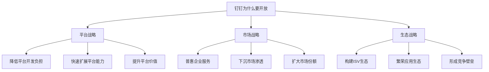
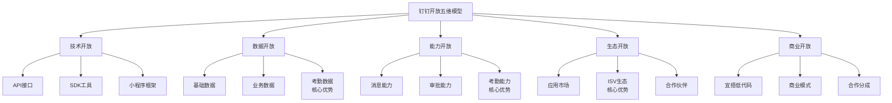
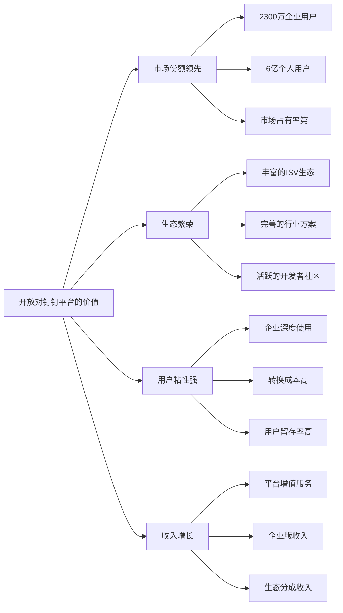

# 钉钉开放价值与维度调研报告

## 一、执行摘要

本报告从**开放的本质与价值**角度深度剖析钉钉开放平台，探究"开放是什么"、"为什么要开放"、"开放了什么"、"开放的价值"等核心问题。

### 核心发现

| 维度 | 钉钉开放特点 |
|------|-------------|
| **开放理念** | "让工作更简单"的实用主义开放理念 |
| **开放维度** | 五维开放体系（技术、数据、能力、生态、商业） |
| **开放动机** | 普惠企业服务、降低使用门槛、繁荣生态 |
| **商业价值** | 平台普惠、生态繁荣、服务下沉、市场领先 |

---

## 二、开放的本质与定义

### 2.1 开放是什么

**开放**是平台将核心资产（资源、能力、数据、用户）通过标准化方式向外部开放，使外部能够基于平台创造价值的过程。

**钉钉开放的三个特征**：
- **普惠性**：开放给所有企业，降低使用门槛
- **实用性**：开放实用能力，解决实际问题
- **生态性**：开放生态资源，构建服务生态

### 2.2 为什么要开放

#### 2.2.1 开放的核心动机

| 动机类型 | 详细说明 | 商业意义 |
|---------|---------|---------|
| **普惠企业** | 让更多企业享受数字化服务 | 扩大市场覆盖，下沉市场 |
| **繁荣生态** | 吸引ISV共建服务生态 | 提升平台能力，构建壁垒 |
| **降低门槛** | 开放降低企业使用和开发门槛 | 提升市场渗透率 |
| **提升价值** | 开放带来平台价值增值 | 提升用户粘性，提高收入 |

---

## 三、开放的维度全景

### 3.1 开放五维模型

钉钉构建了**五维开放体系**：

### 3.2 维度一：技术开放

#### 3.2.1 技术开放内容

| 开放内容 | 开放形式 | 开放程度 | 对比飞书 |
|---------|---------|---------|---------|
| **API接口** | RESTful + RPC | ⭐⭐⭐⭐ | 飞书API设计更现代 |
| **SDK工具** | Java/Python/Node.js/PHP | ⭐⭐⭐⭐ | 两者相当 |
| **小程序框架** | 钉钉小程序框架 | ⭐⭐⭐⭐⭐ | 钉钉小程序生态更成熟 |
| **开发工具** | 钉钉开发者工具 | ⭐⭐⭐⭐ | 两者相当 |
| **低代码平台** | 宜搭低代码平台 | ⭐⭐⭐⭐⭐ | 钉钉低代码更强 |

**技术开放的价值**：
- 对平台：快速扩展能力，降低开发负担
- 对开发者：降低开发门槛，快速构建应用
- 对企业：快速获取应用，降低信息化成本

### 3.3 维度二：数据开放

#### 3.3.1 数据开放内容

| 数据类型 | 开放内容 | 开放程度 | 对比飞书 | 核心价值 |
|---------|---------|---------|---------|---------|
| **基础数据** | 用户、组织、部门 | ⭐⭐⭐⭐⭐ | 相当 | 统一身份体系 |
| **业务数据** | 审批、考勤、日志 | ⭐⭐⭐⭐⭐ | 钉钉考勤更强 | 业务数据流转 |
| **协作数据** | 消息、文档（受限） | ⭐⭐⭐ | 飞书更强 | 协作场景支持 |
| **运营数据** | 使用统计（有限） | ⭐⭐⭐ | 相当 | 数据分析支持 |

**数据开放的价值**：
- 打破数据孤岛，实现数据统一
- 支持企业数据中台建设
- 让数据在不同场景发挥价值

### 3.4 维度三：能力开放

#### 3.4.1 能力开放内容

| 能力类型 | 开放内容 | 开放程度 | 对比飞书 | 核心价值 |
|---------|---------|---------|---------|---------|
| **消息能力** | 消息发送、推送 | ⭐⭐⭐⭐⭐ | 相当 | 统一消息通道 |
| **审批能力** | 审批流程、实例 | ⭐⭐⭐⭐⭐ | 相当 | 流程自动化 |
| **考勤能力** | 考勤打卡、管理 **核心优势** | ⭐⭐⭐⭐⭐ | 钉钉更强 | 考勤管理 |
| **文档能力** | 文档基础能力 | ⭐⭐⭐ | 飞书更强 | 知识管理 |
| **低代码能力** | 宜搭低代码 **核心优势** | ⭐⭐⭐⭐⭐ | 钉钉更强 | 快速应用搭建 |

**能力开放的价值**：
- 快速获得核心能力，无需自研
- 专注于业务逻辑，降低开发成本
- 获得成熟能力，提升业务效率

### 3.5 维度四：生态开放

#### 3.5.1 生态开放内容

| 生态资源 | 开放内容 | 开放程度 | 对比飞书 | 核心价值 |
|---------|---------|---------|---------|---------|
| **应用市场** | 应用发布、分发 | ⭐⭐⭐⭐⭐ | 钉钉生态更成熟 | 应用分发渠道 |
| **ISV生态** | ISV合作伙伴 **核心优势** | ⭐⭐⭐⭐⭐ | 钉钉ISV更多 | 合作共赢 |
| **开发者社区** | 技术交流、支持 | ⭐⭐⭐⭐⭐ | 钉钉社区更活跃 | 社区支持 |
| **用户流量** | 平台用户、企业 | ⭐⭐⭐⭐⭐ | 钉钉用户更多 | 流量共享 |
| **行业方案** | 垂直行业方案 **核心优势** | ⭐⭐⭐⭐⭐ | 钉钉方案更丰富 | 行业渗透 |

**生态开放的价值**：
- 构建生态壁垒，提高竞争门槛
- ISV贡献能力，快速扩展平台能力
- 行业方案丰富，快速渗透垂直市场

### 3.6 维度五：商业开放

#### 3.6.1 商业开放内容

| 商业资源 | 开放内容 | 开放程度 | 对比飞书 | 核心价值 |
|---------|---------|---------|---------|---------|
| **商业模式** | SaaS、定制、服务 | ⭐⭐⭐⭐⭐ | 相当 | 商业参考 |
| **变现能力** | 应用销售、订阅 | ⭐⭐⭐⭐ | 相当 | 变现渠道 |
| **合作模式** | ISV、代理商、技术合作 | ⭐⭐⭐⭐⭐ | 钉钉合作更成熟 | 合作机会 |
| **低代码变现** | 宜搭低代码变现 | ⭐⭐⭐⭐⭐ | 钉钉更强 | 新变现模式 |

**商业开放的价值**：
- 帮助ISV实现商业价值，繁荣生态
- 提供变现渠道，吸引更多开发者
- 形成良性循环，生态带动平台

---

## 四、开放的商业价值分析

### 4.1 对平台的价值

### 4.2 对企业的价值

| 价值维度 | 价值内容 | 典型场景 |
|---------|---------|---------|
| **降低门槛** | 低代码平台降低应用开发门槛 | 宜搭快速搭建应用 |
| **普惠服务** | 免费版功能全面，普惠中小企业 | 中小企业零成本数字化 |
| **丰富应用** | 应用市场丰富，满足多样化需求 | 企业快速找到所需应用 |
| **行业方案** | 垂直行业方案成熟 | 快速实现行业数字化 |

### 4.3 对生态的价值

| 价值维度 | 价值内容 | 典型场景 |
|---------|---------|---------|
| **市场机会** | 庞大的企业客户群 | ISV快速获客 |
| **变现渠道** | 完善的变现机制 | ISV实现商业价值 |
| **技术支持** | 完善的技术支持体系 | 降低开发成本 |
| **品牌赋能** | 阿里品牌背书 | 提升信任度 |

---

## 五、开放的差异化优势

### 5.1 核心差异化优势

| 优势维度 | 钉钉优势 | 价值体现 |
|---------|---------|---------|
| **考勤能力开放** | 考勤能力开放非常充分 | 满足企业管理核心需求 |
| **低代码开放** | 宜搭低代码平台强大 | 降低应用开发门槛 |
| **ISV生态开放** | ISV生态成熟完善 | 提供丰富的应用和方案 |
| **行业方案开放** | 垂直行业方案丰富 | 快速渗透行业市场 |
| **普惠性开放** | 免费版功能全面 | 普惠中小企业 |

---

## 六、总结与建议

### 6.1 钉钉开放特点总结

| 维度 | 钉钉开放特点 | 优势 | 不足 |
|------|-------------|------|------|
| **开放理念** | 普惠、实用、生态 | 理念务实、落地强 | 创新性相对不足 |
| **技术开放** | API完善、低代码强 | 开发门槛低 | API设计不够现代 |
| **数据开放** | 考勤数据开放强 | 企业管理数据充分 | 协作数据开放受限 |
| **能力开放** | 考勤、低代码能力强 | 核心能力突出 | 文档能力相对弱 |
| **生态开放** | ISV生态成熟 | 生态完善、方案丰富 | 生态质量参差不齐 |
| **商业开放** | 变现渠道完善 | ISV商业化程度高 | 需平衡生态利益 |

### 6.2 对产品的启示

**启示一：开放要普惠**
- 钉钉的普惠开放策略带来了巨大的市场份额
- 开放要降低门槛，让更多人受益

**启示二：开放要实用**
- 钉钉开放实用能力（考勤、审批）解决了企业核心痛点
- 开放要聚焦实际需求，而非概念创新

**启示三：开放要生态化**
- 钉钉构建了完善的ISV生态，形成竞争壁垒
- 开放的成功取决于生态的繁荣

---

**报告编制时间**：2026年4月
**报告版本**：V1.0
**调研角度**：开放价值与维度调研