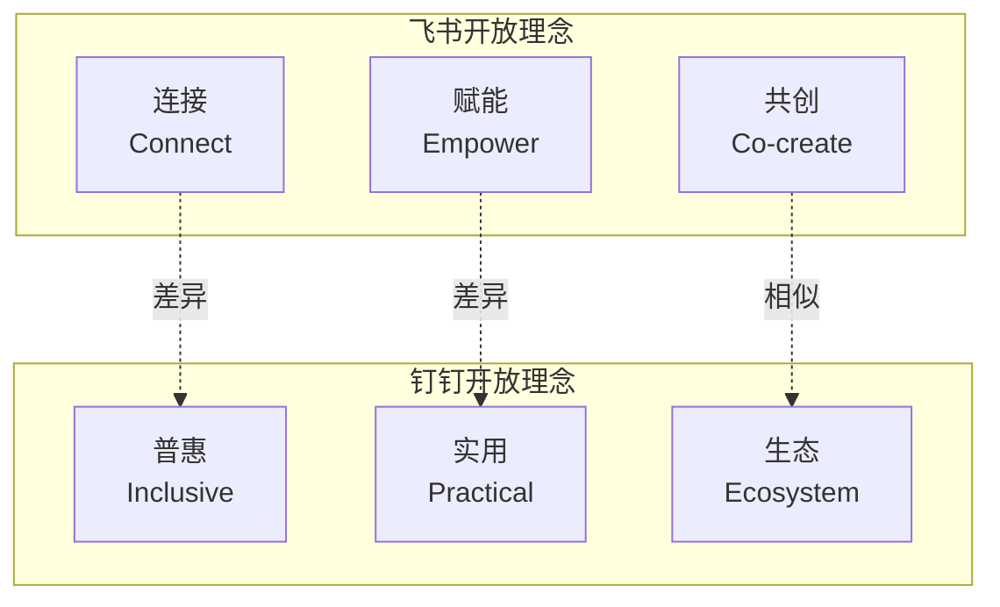
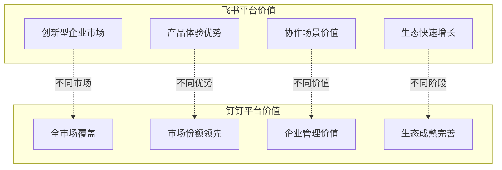
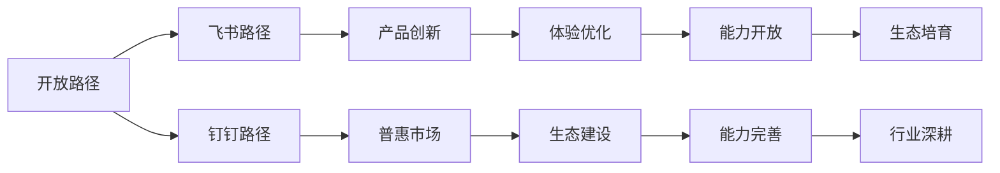
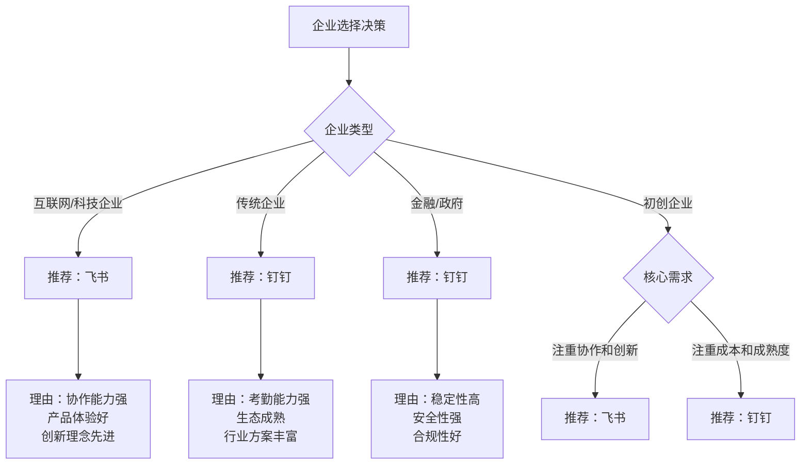

# 飞书&钉钉开放价值与维度对比调研报告

## 一、执行摘要

本报告从**开放的本质与价值**角度全面对比飞书和钉钉开放平台，分析两者在开放理念、开放维度、开放价值等方面的异同，为企业理解开放平台的商业逻辑提供决策参考。

### 核心结论

| 对比维度 | 飞书 | 钉钉 | 综合评价 |
|---------|------|------|---------|
| **开放理念** | 连接、赋能、共创 | 普惠、实用、生态 | 飞书理念更先进，钉钉理念更务实 |
| **开放维度** | 五维全面开放 | 五维全面开放 | 两者开放维度相同 |
| **开放程度** | 协作数据开放更充分 | 企业管理数据开放更充分 | 各有优势 |
| **生态成熟度** | 生态快速发展中 | 生态成熟完善 | 钉钉生态更成熟 |
| **商业价值** | 创新型企业价值更高 | 传统企业价值更高 | 各有市场 |

---

## 二、开放理念对比

### 2.1 开放理念差异

### 2.2 开放理念深度对比

| 理念维度 | 飞书理念 | 钉钉理念 | 差异分析 |
|---------|---------|---------|---------|
| **核心理念** | 连接、赋能、共创 | 普惠、实用、生态 | 飞书强调创新，钉钉强调普惠 |
| **目标用户** | 互联网、科技企业 | 全行业、各规模企业 | 飞书聚焦创新企业，钉钉普惠所有企业 |
| **价值主张** | 提升协作效率、创新办公方式 | 降低数字化门槛、普惠企业服务 | 飞书强调效率创新，钉钉强调普惠实用 |
| **开放策略** | 深度开放、生态共创 | 全面开放、生态繁荣 | 飞书强调深度共创，钉钉强调全面繁荣 |

### 2.3 理念差异根源

**飞书理念根源**：
- 字节跳动的创新基因
- 互联网思维，强调用户体验
- 面向创新型企业的战略定位

**钉钉理念根源**：
- 阿里巴巴的商业基因
- 平台思维，强调生态建设
- 面向全市场的普惠战略

---

## 三、开放维度全面对比

### 3.1 技术开放对比

#### 3.1.1 技术开放对比矩阵

| 对比维度 | 飞书 | 钉钉 | 对比结论 |
|---------|------|------|---------|
| **API设计** | RESTful，设计现代 | 部分不够RESTful | ⭐ 飞书更好 |
| **SDK支持** | Java/Python/Go/Node.js | Java/Python/Node.js/PHP | ⭐ 飞书Go支持更好 |
| **文档质量** | 非常详细，示例丰富 | 详细，示例较多 | ⭐ 飞书稍好 |
| **开发工具** | 开发者工具完善 | 开发者工具完善 | ⭐ 两者相当 |
| **小程序** | 支持，生态发展中 | 支持，生态成熟 | ⭐ 钉钉更好 |
| **低代码** | 飞书应用引擎 | 宜搭，非常强大 | ⭐ 钉钉明显更好 |

**技术开放对比结论**：
- 飞书：API设计更现代，SDK支持更全（特别是Go），文档质量更高
- 钉钉：小程序生态更成熟，低代码平台（宜搭）明显更强

### 3.2 数据开放对比

#### 3.2.1 数据开放对比矩阵

| 数据类型 | 飞书开放程度 | 钉钉开放程度 | 对比结论 |
|---------|-------------|-------------|---------|
| **用户数据** | ⭐⭐⭐⭐⭐ | ⭐⭐⭐⭐ | ⭐ 飞书稍好 |
| **组织架构** | ⭐⭐⭐⭐⭐ | ⭐⭐⭐⭐⭐ | ⭐ 两者相当 |
| **审批数据** | ⭐⭐⭐⭐⭐ | ⭐⭐⭐⭐⭐ | ⭐ 两者相当 |
| **考勤数据** | ⭐⭐⭐⭐ | ⭐⭐⭐⭐⭐ | ⭐ 钉钉明显更好 |
| **消息数据** | ⚠️ 受限 | ⚠️ 受限更多 | ⭐ 飞书稍好 |
| **文档数据** | ⭐⭐⭐⭐⭐ | ⚠️ 开放有限 | ⭐ 飞书明显更好 |
| **任务数据** | ⭐⭐⭐⭐⭐ | ⭐⭐⭐ | ⭐ 飞书明显更好 |
| **运营数据** | ⚠️ 有限开放 | ⚠️ 有限开放 | ⭐ 两者相当 |

**数据开放对比结论**：
- 飞书：文档数据、任务数据开放明显更好，协作数据开放更充分
- 钉钉：考勤数据开放明显更好，企业管理数据开放更充分

### 3.3 能力开放对比

#### 3.3.1 能力开放对比矩阵

| 能力类型 | 飞书开放程度 | 钉钉开放程度 | 对比结论 |
|---------|-------------|-------------|---------|
| **消息能力** | ⭐⭐⭐⭐⭐ | ⭐⭐⭐⭐⭐ | ⭐ 两者相当 |
| **审批能力** | ⭐⭐⭐⭐⭐ | ⭐⭐⭐⭐⭐ | ⭐ 两者相当 |
| **考勤能力** | ⭐⭐⭐⭐ | ⭐⭐⭐⭐⭐ | ⭐ 钉钉明显更好 |
| **文档能力** | ⭐⭐⭐⭐⭐ | ⚠️ 能力有限 | ⭐ 飞书明显更好 |
| **会议能力** | ⭐⭐⭐⭐ | ⭐⭐⭐⭐ | ⭐ 两者相当 |
| **低代码能力** | ⭐⭐⭐⭐ | ⭐⭐⭐⭐⭐ | ⭐ 钉钉明显更好 |
| **OKR能力** | ⭐⭐⭐⭐⭐ | ❌ 无 | ⭐ 飞书独有优势 |

**能力开放对比结论**：
- 飞书：文档能力、OKR能力开放更好，协作能力更强
- 钉钉：考勤能力、低代码能力开放更好，企业管理能力更强

### 3.4 生态开放对比

#### 3.4.1 生态开放对比矩阵

| 生态维度 | 飞书 | 钉钉 | 对比结论 |
|---------|------|------|---------|
| **应用市场** | 应用数量较少，质量高 | 应用数量多，质量参差不齐 | ⭐ 钉钉数量多，飞书质量高 |
| **ISV生态** | ISV较少，增长快 | ISV众多，成熟完善 | ⭐ 钉钉明显更好 |
| **开发者社区** | 社区活跃，增长快 | 社区非常活跃，成熟 | ⭐ 钉钉更好 |
| **用户流量** | 用户增长快 | 6亿用户，2300万企业 | ⭐ 钉钉明显更好 |
| **行业方案** | 行业方案较少 | 行业方案丰富成熟 | ⭐ 钉钉明显更好 |
| **合作伙伴** | 合作伙伴增长中 | 合作伙伴体系完善 | ⭐ 钉钉更好 |

**生态开放对比结论**：
- 钉钉在生态开放维度全面领先：ISV更多、社区更活跃、用户更多、行业方案更丰富
- 飞书生态快速发展中，但成熟度仍有差距

### 3.5 商业开放对比

#### 3.5.1 商业开放对比矩阵

| 商业维度 | 飞书 | 钉钉 | 对比结论 |
|---------|------|------|---------|
| **商业模式** | SaaS、定制、服务 | SaaS、定制、服务 | ⭐ 两者相当 |
| **变现渠道** | 应用销售、订阅 | 应用销售、订阅、低代码 | ⭐ 钉钉变现渠道更丰富 |
| **合作模式** | ISV合作、技术合作 | ISV合作、代理商合作、技术合作 | ⭐ 钉钉合作模式更完善 |
| **分成机制** | 平台分成机制 | 完善的分成机制 | ⭐ 钉钉更成熟 |
| **免费策略** | 免费版功能全面 | 免费版功能非常全面 | ⭐ 钉钉普惠性更强 |

**商业开放对比结论**：
- 钉钉在商业开放维度更成熟：变现渠道更多、合作模式更完善、普惠性更强
- 飞书商业开放快速发展中

---

## 四、开放价值对比

### 4.1 对平台的价值对比

### 4.2 对企业的价值对比

| 企业类型 | 飞书价值 | 钉钉价值 | 推荐选择 |
|---------|---------|---------|---------|
| **互联网/科技企业** | ⭐⭐⭐⭐⭐ | ⭐⭐⭐⭐ | 飞书 |
| **创新型初创企业** | ⭐⭐⭐⭐⭐ | ⭐⭐⭐⭐ | 飞书 |
| **传统制造业** | ⭐⭐⭐ | ⭐⭐⭐⭐⭐ | 钉钉 |
| **零售/服务业** | ⭐⭐⭐ | ⭐⭐⭐⭐⭐ | 钉钉 |
| **金融/政府** | ⭐⭐⭐⭐ | ⭐⭐⭐⭐⭐ | 钉钉 |
| **教育/医疗** | ⭐⭐⭐⭐ | ⭐⭐⭐⭐ | 两者均可 |

### 4.3 对生态的价值对比

| 生态伙伴 | 飞书价值 | 钉钉价值 | 对比分析 |
|---------|---------|---------|---------|
| **ISV开发者** | 创新机会多、竞争小 | 市场大、变现成熟 | 钉钉商业化更成熟 |
| **行业伙伴** | 行业方案少、机会多 | 行业方案多、竞争大 | 钉钉市场更成熟 |
| **技术伙伴** | 技术创新合作 | 技术落地合作 | 各有机会 |

---

## 五、开放的差异化战略对比

### 5.1 开放战略差异

| 战略维度 | 飞书战略 | 钉钉战略 | 差异分析 |
|---------|---------|---------|---------|
| **目标市场** | 创新型企业 | 全市场 | 飞书聚焦创新，钉钉普惠所有 |
| **开放重点** | 协作能力开放 | 企业管理能力开放 | 飞书重协作，钉钉重管理 |
| **生态策略** | 培育优质生态 | 繁荣应用生态 | 飞书重质量，钉钉重数量 |
| **商业模式** | 高价值变现 | 普惠+增值 | 飞书重价值，钉钉重普惠 |

### 5.2 开放路径差异

---

## 六、综合评价与选择建议

### 6.1 综合评分对比

| 评分维度 | 飞书 | 钉钉 | 权重 | 飞书加权分 | 钉钉加权分 |
|---------|------|------|------|-----------|-----------|
| **开放理念** | ⭐⭐⭐⭐⭐ | ⭐⭐⭐⭐ | 15% | 3.75 | 3.0 |
| **技术开放** | ⭐⭐⭐⭐⭐ | ⭐⭐⭐⭐ | 15% | 3.75 | 3.0 |
| **数据开放** | ⭐⭐⭐⭐ | ⭐⭐⭐⭐ | 15% | 3.0 | 3.0 |
| **能力开放** | ⭐⭐⭐⭐⭐ | ⭐⭐⭐⭐ | 15% | 3.75 | 3.0 |
| **生态开放** | ⭐⭐⭐ | ⭐⭐⭐⭐⭐ | 20% | 2.4 | 4.0 |
| **商业开放** | ⭐⭐⭐⭐ | ⭐⭐⭐⭐⭐ | 20% | 3.2 | 4.0 |
| **综合评分** | - | - | 100% | **19.85** | **20.0** |

### 6.2 选择建议决策树

### 6.3 最终建议

#### 6.3.1 选择飞书的情况

**适合企业**：
- ✅ 互联网、科技、创新型企业
- ✅ 注重协作效率和创新体验
- ✅ 需要强大的文档和知识管理
- ✅ 追求先进的管理理念（OKR）

**核心优势**：
- 协作能力强，产品体验好
- 文档能力开放充分
- API设计现代，开发体验好
- 理念先进，适合创新企业

#### 6.3.2 选择钉钉的情况

**适合企业**：
- ✅ 传统企业、制造业、零售业
- ✅ 需要强大的考勤和企业管理
- ✅ 需要成熟的行业解决方案
- ✅ 金融、政府等对稳定性要求高的企业

**核心优势**：
- 考勤能力强，企业管理功能完善
- 生态成熟，ISV和行业方案丰富
- 低代码平台强大，降低开发门槛
- 普惠性强，免费版功能全面

---

## 七、附录

### 7.1 开放维度对比总表

| 开放维度 | 飞书优势 | 钉钉优势 | 对比结论 |
|---------|---------|---------|---------|
| **技术开放** | API设计、SDK支持、文档质量 | 小程序生态、低代码平台 | 各有优势 |
| **数据开放** | 文档数据、任务数据、协作数据 | 考勤数据、企业管理数据 | 各有优势 |
| **能力开放** | 文档能力、OKR能力、协作能力 | 考勤能力、低代码能力 | 各有优势 |
| **生态开放** | 应用质量、技术创新 | ISV生态、用户规模、行业方案 | 钉钉明显更好 |
| **商业开放** | 高价值变现 | 普惠性、变现成熟度 | 钉钉更好 |

### 7.2 企业选择速查表

| 需求场景 | 推荐平台 | 核心理由 |
|---------|---------|---------|
| 需要强大文档协作 | 飞书 | 文档能力开放充分 |
| 需要强大考勤管理 | 钉钉 | 考勤能力开放充分 |
| 需要低代码快速开发 | 钉钉 | 宜搭低代码平台强大 |
| 需要成熟的行业方案 | 钉钉 | 行业方案丰富成熟 |
| 需要先进的协作理念 | 飞书 | 协作能力强、体验好 |
| 需要普惠的免费服务 | 钉钉 | 免费版功能非常全面 |

---

**报告编制时间**：2026年4月
**报告版本**：V1.0
**调研角度**：开放价值与维度对比调研
**目标受众**：产品团队（功能规划参考）