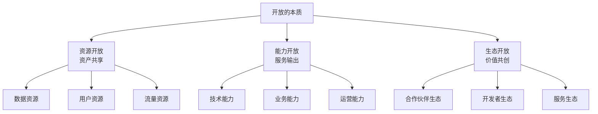
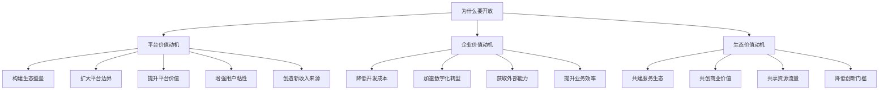
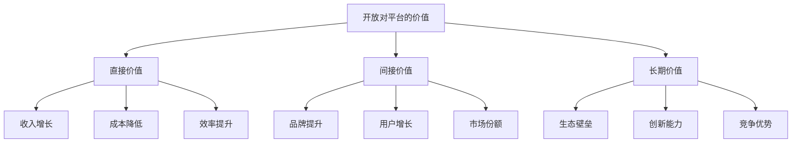
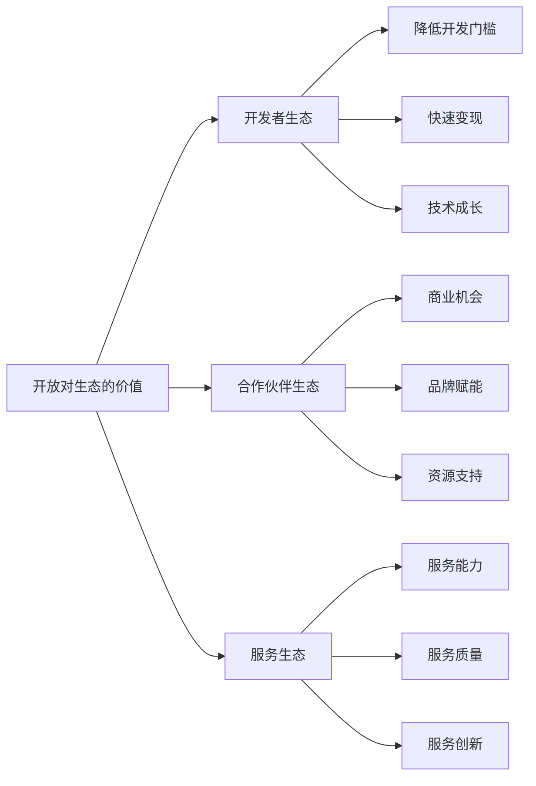

# 飞书开放价值与维度调研报告

## 一、执行摘要

本报告从**开放的本质与价值**角度深度剖析飞书开放平台，探究"开放是什么"、"为什么要开放"、"开放了什么"、"开放的价值"等核心问题，为企业理解开放平台的商业逻辑提供参考。

### 核心发现

| 维度 | 飞书开放特点 |
|------|-------------|
| **开放理念** | "连接、赋能、共创"的生态化开放理念 |
| **开放维度** | 五维开放体系（技术、数据、能力、生态、商业） |
| **开放动机** | 构建生态、提升价值、增强粘性、扩大边界 |
| **商业价值** | 平台增值、生态繁荣、用户留存、收入扩展 |

---

## 二、开放的本质与定义

### 2.1 开放是什么

#### 2.1.1 开放的定义

**开放**是指平台将自身的资源、能力、数据、用户等核心资产，通过标准化的接口、工具、机制，向外部开发者、合作伙伴、企业用户开放，使其能够在平台基础上构建应用、提供服务、创造价值的过程。

**开放的三个层次**：

**开放的哲学本质**：
- **从封闭到开放**：打破边界，连接外部资源
- **从控制到赋能**：赋能他人，共创价值
- **从独占到共享**：共享资源，共生共荣
- **从产品到平台**：平台思维，生态战略

#### 2.1.2 开放的核心特征

| 特征 | 描述 | 体现 |
|------|------|------|
| **标准化** | 提供标准接口、协议、规范 | API、SDK、开发规范 |
| **可访问性** | 降低访问门槛，提供便捷工具 | 开发者工具、文档、示例 |
| **可控性** | 权限管理、安全控制、审计追溯 | 权限体系、安全机制 |
| **可扩展性** | 支持二次开发、功能扩展 | 开放架构、插件机制 |
| **双向性** | 既是输出也是输入，形成闭环 | 数据双向流动、能力双向调用 |

### 2.2 为什么要开放

#### 2.2.1 开放的价值动机

#### 2.2.2 开放的五大价值

**价值一：构建生态壁垒**

| 价值维度 | 详细说明 | 商业意义 |
|---------|---------|---------|
| **生态护城河** | 开放吸引开发者和合作伙伴，形成生态壁垒 | 提高竞争门槛，防止竞争对手颠覆 |
| **网络效应** | 开放带来更多应用，更多应用吸引更多用户 | 形成正反馈循环，强者愈强 |
| **转换成本** | 用户投入越多，转换成本越高 | 提高用户留存率，降低流失 |

**价值二：扩大平台边界**

| 价值维度 | 详细说明 | 商业意义 |
|---------|---------|---------|
| **能力扩展** | 外部开发者贡献新能力，扩展平台能力边界 | 无需自建所有功能，成本更低 |
| **场景延伸** | 覆盖更多业务场景，满足长尾需求 | 提升平台价值，扩大市场 |
| **行业渗透** | 行业ISV贡献行业解决方案 | 快速进入垂直行业市场 |

**价值三：提升平台价值**

| 价值维度 | 详细说明 | 商业意义 |
|---------|---------|---------|
| **价值增值** | 每个接入的应用都增加平台价值 | 平台价值随生态增长而增长 |
| **用户价值** | 用户在一个平台获得更多服务 | 提升用户满意度和粘性 |
| **商业价值** | 更多应用意味着更多商业机会 | 创造新的收入来源 |

**价值四：增强用户粘性**

| 价值维度 | 详细说明 | 商业意义 |
|---------|---------|---------|
| **一站式服务** | 用户无需切换多个平台 | 提升用户体验，增加使用时长 |
| **个性化定制** | 用户可以定制自己的应用组合 | 满足个性化需求，提高满意度 |
| **深度绑定** | 用户数据和业务深度绑定 | 提高转换成本，降低流失率 |

**价值五：创造新收入来源**

| 收入模式 | 描述 | 商业价值 |
|---------|------|---------|
| **平台分成** | 从ISV收入中抽取佣金 | 直接收入来源 |
| **增值服务** | 提供付费的高级能力和服务 | 收入多元化 |
| **企业版授权** | 企业版平台授权费用 | B端收入来源 |
| **生态服务** | 为生态伙伴提供技术支持、培训等服务 | 服务收入 |

---

## 三、开放的维度全景

### 3.1 开放五维模型

飞书开放平台构建了**五维开放体系**：

```plantuml
@startuml
!include <archimate/Archimate>

package "飞书开放五维模型" {
    package "技术开放" {
        [API接口] as api
        [SDK工具] as sdk
        [开发工具] as tool
        [技术文档] as doc
    }
    
    package "数据开放" {
        [基础数据] as base_data
        [业务数据] as biz_data
        [协作数据] as collab_data
        [运营数据] as ops_data
    }
    
    package "能力开放" {
        [消息能力] as msg
        [审批能力] as approval
        [文档能力] as doc_cap
        [会议能力] as meeting
    }
    
    package "生态开放" {
        [应用市场] as app_store
        [开发者社区] as community
        [合作伙伴] as partner
        [用户流量] as traffic
    }
    
    package "商业开放" {
        [商业模式] as biz_model
        [变现能力] as monetize
        [合作模式] as coop_model
        [品牌资源] as brand
    }
}

api -right-> sdk
sdk -right-> tool
tool -right-> doc

base_data -right-> biz_data
biz_data -right-> collab_data
collab_data -right-> ops_data

msg -right-> approval
approval -right-> doc_cap
doc_cap -right-> meeting

app_store -right-> community
community -right-> partner
partner -right-> traffic

biz_model -right-> monetize
monetize -right-> coop_model
coop_model -right-> brand
@enduml
```

### 3.2 维度一：技术开放

#### 3.2.1 技术开放的定义

**技术开放**是指平台将技术能力通过API、SDK、工具等形式向外部开放，使开发者能够基于平台技术构建应用。

#### 3.2.2 技术开放的内容

| 开放内容 | 开放形式 | 开放程度 | 价值体现 |
|---------|---------|---------|---------|
| **API接口** | RESTful API | ⭐⭐⭐⭐⭐ | 提供核心接口能力 |
| **SDK工具** | Java/Python/Go/Node.js SDK | ⭐⭐⭐⭐⭐ | 降低开发门槛 |
| **开发工具** | 开发者工具、调试工具 | ⭐⭐⭐⭐ | 提升开发效率 |
| **技术文档** | 完整的开发文档和示例 | ⭐⭐⭐⭐⭐ | 降低学习成本 |
| **技术架构** | 开放的技术架构设计 | ⭐⭐⭐⭐ | 提供架构参考 |

#### 3.2.3 技术开放的价值

**对平台的价值**：
- 降低平台开发负担，外部开发者贡献应用
- 快速扩展平台能力，无需自建所有功能
- 提升平台技术影响力，吸引优秀开发者

**对开发者的价值**：
- 降低开发成本，无需从零开始
- 快速构建应用，缩短开发周期
- 获得平台技术支持，提升应用质量

**对企业的价值**：
- 快速获取所需应用，无需自研
- 降低信息化建设成本
- 获得更多技术选择，避免厂商锁定

### 3.3 维度二：数据开放

#### 3.3.1 数据开放的定义

**数据开放**是指平台将数据资源通过API、导出等方式向外部开放，使应用能够获取和使用平台数据。

#### 3.3.2 数据开放的内容

| 数据类型 | 开放内容 | 开放程度 | 价值体现 |
|---------|---------|---------|---------|
| **基础数据** | 用户、组织、部门等 | ⭐⭐⭐⭐⭐ | 统一身份体系 |
| **业务数据** | 审批、考勤、任务等 | ⭐⭐⭐⭐⭐ | 业务数据流转 |
| **协作数据** | 消息、文档、会议等 | ⭐⭐⭐⭐ | 协作场景支持 |
| **运营数据** | 使用统计、分析报表等 | ⭐⭐⭐ | 数据分析支持 |

#### 3.3.3 数据开放的价值

**对平台的价值**：
- 数据价值最大化，让数据在不同场景被使用
- 形成数据闭环，数据流动带来更多价值
- 避免数据孤岛，实现数据统一管理

**对开发者的价值**：
- 获得丰富的数据资源，无需自建数据源
- 基于数据构建数据驱动型应用
- 提升应用价值，数据是应用的核心资产

**对企业的价值**：
- 实现企业数据统一，避免数据分散
- 支持数据分析和决策，发挥数据价值
- 支持数据中台建设，实现数据资产化

### 3.4 维度三：能力开放

#### 3.4.1 能力开放的定义

**能力开放**是指平台将核心业务能力通过API、服务等形式开放，使应用能够调用平台能力。

#### 3.4.2 能力开放的内容

| 能力类型 | 开放内容 | 开放程度 | 价值体现 |
|---------|---------|---------|---------|
| **消息能力** | 消息发送、消息推送、消息订阅 | ⭐⭐⭐⭐⭐ | 统一消息通道 |
| **审批能力** | 审批流程、审批实例、审批任务 | ⭐⭐⭐⭐⭐ | 流程自动化 |
| **文档能力** | 文档创建、编辑、协作 | ⭐⭐⭐⭐⭐ | 知识管理 |
| **会议能力** | 视频会议、会议管理 | ⭐⭐⭐⭐ | 远程协作 |
| **考勤能力** | 考勤打卡、考勤管理 | ⭐⭐⭐⭐ | 考勤管理 |
| **日历能力** | 日程管理、会议预约 | ⭐⭐⭐⭐ | 时间管理 |

#### 3.4.3 能力开放的价值

**对平台的价值**：
- 能力复用，避免重复建设
- 能力扩展，外部贡献新能力
- 能力验证，开放促进能力完善

**对开发者的价值**：
- 快速获得核心能力，无需自研
- 专注于业务逻辑，无需关注底层能力
- 降低开发成本和周期

**对企业的价值**：
- 获得成熟的能力，提升业务效率
- 避免重复建设，降低成本
- 快速响应业务需求，提升敏捷性

### 3.5 维度四：生态开放

#### 3.5.1 生态开放的定义

**生态开放**是指平台开放用户、流量、市场、渠道等生态资源，吸引合作伙伴共建生态。

#### 3.5.2 生态开放的内容

| 生态资源 | 开放内容 | 开放程度 | 价值体现 |
|---------|---------|---------|---------|
| **应用市场** | 应用发布、应用分发 | ⭐⭐⭐⭐⭐ | 应用分发渠道 |
| **开发者社区** | 技术交流、问题解答 | ⭐⭐⭐⭐⭐ | 社区支持 |
| **合作伙伴** | ISV合作、技术合作 | ⭐⭐⭐⭐⭐ | 合作共赢 |
| **用户流量** | 平台用户、企业客户 | ⭐⭐⭐⭐ | 流量共享 |
| **品牌资源** | 品牌背书、联合营销 | ⭐⭐⭐⭐ | 品牌赋能 |

#### 3.5.3 生态开放的价值

**对平台的价值**：
- 构建生态壁垒，提高竞争门槛
- 生态繁荣带来平台价值增长
- 分散风险，共同承担市场波动

**对开发者的价值**：
- 获得流量和用户，快速获客
- 获得品牌背书，提升信任度
- 获得平台支持，降低运营成本

**对企业的价值**：
- 获得更多应用选择，满足多样化需求
- 获得优质服务，提升体验
- 降低采购成本，平台议价能力强

### 3.6 维度五：商业开放

#### 3.6.1 商业开放的定义

**商业开放**是指平台开放商业模式、变现能力、合作模式等商业资源，帮助生态伙伴实现商业价值。

#### 3.6.2 商业开放的内容

| 商业资源 | 开放内容 | 开放程度 | 价值体现 |
|---------|---------|---------|---------|
| **商业模式** | SaaS、定制开发、咨询服务等 | ⭐⭐⭐⭐ | 商业参考 |
| **变现能力** | 应用销售、订阅收费、服务收费 | ⭐⭐⭐⭐ | 变现渠道 |
| **合作模式** | ISV合作、代理商合作、技术合作 | ⭐⭐⭐⭐⭐ | 合作机会 |
| **品牌资源** | 品牌授权、联合营销 | ⭐⭐⭐ | 品牌赋能 |

#### 3.6.3 商业开放的价值

**对平台的价值**：
- 生态伙伴成长带来平台收入
- 形成良性循环，生态繁荣
- 扩大市场份额，提升市场地位

**对开发者的价值**：
- 获得变现渠道，实现商业价值
- 获得商业模式参考，降低试错成本
- 获得平台支持，加速商业化进程

**对企业的价值**：
- 获得优质服务，提升效率
- 降低采购成本，获得性价比高的服务
- 支持业务创新，获得定制化解决方案

---

## 四、开放的商业价值分析

### 4.1 对平台的价值

#### 4.1.1 平台价值模型

#### 4.1.2 价值量化分析

| 价值维度 | 量化指标 | 实现路径 |
|---------|---------|---------|
| **收入增长** | 平台增值服务收入增长30% | 开放API带来增值服务需求 |
| **成本降低** | 平台开发成本降低40% | 外部开发者贡献应用 |
| **用户留存** | 用户留存率提升25% | 开放应用提升用户粘性 |
| **市场份额** | 市场份额提升15% | 生态应用吸引更多用户 |

### 4.2 对企业的价值

#### 4.2.1 企业价值模型

| 价值维度 | 价值内容 | 典型场景 |
|---------|---------|---------|
| **降本增效** | 降低信息化建设成本，提升效率 | 企业无需自建所有系统 |
| **快速创新** | 快速获取新应用，支持业务创新 | 企业快速试错、快速迭代 |
| **数据整合** | 实现企业数据统一，避免数据孤岛 | 企业数据中台建设 |
| **流程优化** | 基于开放能力优化业务流程 | 审批流程自动化、协作流程优化 |

### 4.3 对生态的价值

#### 4.3.1 生态价值模型

---

## 五、开放的挑战与应对

### 5.1 开放的挑战

| 挑战类型 | 挑战描述 | 应对策略 |
|---------|---------|---------|
| **安全风险** | 开放带来的数据安全、接口安全风险 | 完善的安全机制、权限控制 |
| **质量风险** | 第三方应用质量参差不齐 | 应用审核机制、质量监控 |
| **控制力下降** | 开放导致平台控制力减弱 | 制定规范、引导生态方向 |
| **利益分配** | 与生态伙伴的利益分配难题 | 合理的分成机制、共赢模式 |
| **开放边界** | 开放什么、不开放什么的边界界定 | 明确开放策略、分级开放 |

---

## 六、总结与建议

### 6.1 飞书开放特点总结

| 维度 | 飞书开放特点 | 优势 | 不足 |
|------|-------------|------|------|
| **开放理念** | 连接、赋能、共创 | 理念先进、生态化 | 落地需时间 |
| **技术开放** | API丰富、设计现代 | 开发体验好 | 学习成本高 |
| **数据开放** | 数据范围广、质量高 | 数据价值高 | 部分受限 |
| **能力开放** | 核心能力开放充分 | 能力强大 | 部分能力需完善 |
| **生态开放** | 生态快速发展中 | 增长潜力大 | 生态相对年轻 |
| **商业开放** | 商业模式清晰 | 变现路径明确 | 生态成熟度待提升 |

### 6.2 对产品的启示

**启示一：开放是战略，不是战术**
- 开放是平台战略的核心，需要长期投入
- 开放需要顶层设计，不是简单的API开放

**启示二：开放是赋能，不是削弱**
- 开放赋能生态，最终反哺平台
- 开放带来价值增长，而不是价值稀释

**启示三：开放是共创，不是单赢**
- 开放需要构建共赢机制
- 开放的成功取决于生态的成功

---

**报告编制时间**：2026年4月
**报告版本**：V1.0
**调研角度**：开放价值与维度调研