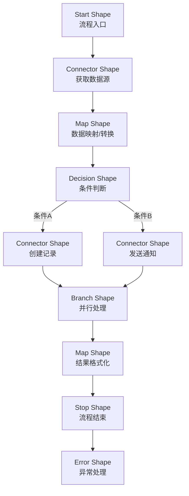
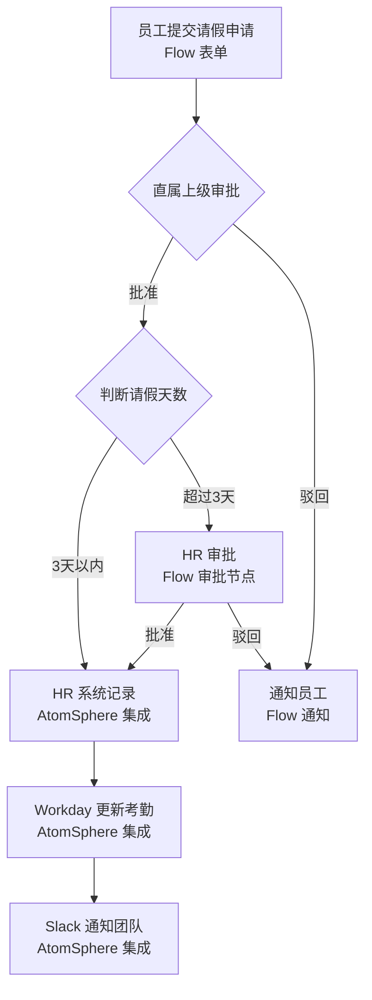
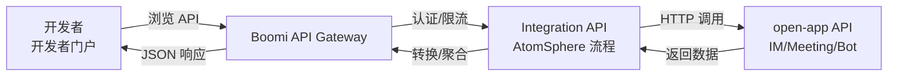
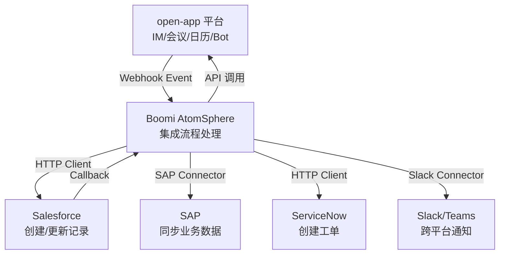
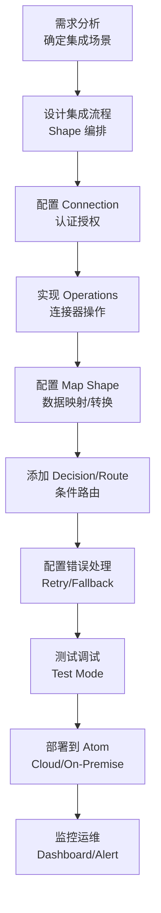

# Boomi 连接器平台调研报告

## 一、平台概述

### 1.1 平台简介

Boomi（原名 Dell Boomi）是全球领先的云端集成平台即服务（iPaaS）提供商，由 Rick Muldoon 和 Brian O'Neill 于 2000 年创立，总部位于美国新泽西州伯克利海茨（Berkeley Heights）。Boomi 是云计算集成领域的先驱者之一，早在 2007 年就推出了业界首个纯云端集成平台 **AtomSphere**，比大多数竞争对手更早确立了 SaaS 优先的集成理念。

2010 年，Dell 收购了 Boomi，将其作为 Dell 软件集团的重要组成部分运营超过十年。在 Dell 旗下期间，Boomi 获得了大量企业客户资源和全球化运营能力，业务规模显著增长。2021 年，Dell 将 Boomi 独立分拆，由 Francisco Partners 和 TPG Capital 联合收购，Boomi 重新成为独立公司运营，并正式将品牌从"Dell Boomi"更名为"Boomi"，标志着其迈向多云、多云供应商中立的新阶段。

截至目前，Boomi 平台拥有超过 2000 个预构建连接器和集成组件，服务全球超过 20000 家企业客户，涵盖金融、医疗、制造、零售、科技等行业。Boomi 在 Gartner 企业集成平台即服务（iPaaS）魔力象限中连续多年被评为领导者，是全球 iPaaS 市场的重要参与者。

### 1.2 平台定位

- **企业 iPaaS 领导者**：提供云端一体化的集成平台，连接 SaaS、PaaS、本地系统及物联网设备，消除企业信息孤岛
- **API 全生命周期管理**：从 API 设计、发布、网关代理到开发者门户的完整 API 管理能力
- **主数据管理（MDM）**：通过 Master Data Hub 提供企业级主数据治理、匹配、合并和同步能力
- **数据质量管理**：内置数据质量引擎，支持数据清洗、标准化、去重和验证
- **混合云集成**：独创的 Atom/Molecule 运行时架构，支持云端、本地和混合部署模式
- **低代码集成**：可视化拖拽式流程画布，业务分析师和开发者均可快速构建集成流程

### 1.3 核心价值主张

| 价值维度 | 描述 |
|---------|------|
| **智能集成** | 2000+ 预构建连接器 + Boomi Suggest AI 推荐引擎，智能推荐最佳集成方案和映射配置 |
| **混合部署** | 独创 Atom 运行时架构，一套集成流程可灵活部署在云端、本地或边缘节点，满足各种合规要求 |
| **统一平台** | 集成、API 管理、主数据管理、数据质量、工作流自动化五大能力统一在同一平台 |
| **低代码高效** | 可视化画布 + 200+ 预构建组件，平均集成部署时间缩短 70% |
| **主数据治理** | 内置 Master Data Hub，提供数据匹配、合并、存活化和审计追踪，确保企业数据一致性 |
| **云原生弹性** | SaaS 优先架构，零运维基础设施，自动扩缩容，99.99% 可用性 SLA |

---

## 二、核心能力体系

### 2.1 连接器能力矩阵

#### 2.1.1 连接器核心概念

Boomi 连接器（Connector）是平台的核心构建块，每个连接器封装了对特定应用或服务的访问能力。Boomi 的连接器体系由以下核心要素组成：

| 要素 | 描述 | 示例 |
|------|------|------|
| **Connection** | 与目标应用的认证连接配置 | Salesforce OAuth 连接、SAP RFC 连接 |
| **Operation** | 执行具体操作的配置（查询、创建、更新、删除、发送、监听等） | Salesforce Query、SAP Create BAPI |
| **Shape** | 画布中的流程组件（连接器、决策、映射、路由等） | Map Shape、Decision Shape、HTTP Client |
| **Document** | 流经集成流程的数据单元，包含数据和元数据 | JSON 文档、XML 文档、CSV 文档 |

#### 2.1.2 主要连接器能力

| 连接器 | 功能描述 | 典型场景 |
|--------|---------|---------|
| **Salesforce Connector** | CRUD 操作、SOQL 查询、Bulk API、Streaming API、Platform Event | CRM 数据同步、销售流程自动化 |
| **SAP Connector** | BAPI/RFC 调用、IDoc 收发、SAP OData、BAPI 事务处理 | ERP 订单集成、物料数据同步 |
| **NetSuite Connector** | SuiteTalk API、Saved Search、CSV Import、REST API | 财务数据集成、库存同步 |
| **Workday Connector** | RaaS 报表、Workday API、自定义报表 | HR 数据同步、组织架构集成 |
| **HTTP Client Connector** | REST/HTTP 调用、OAuth2 认证、自定义 Header | 通用 API 集成、Webhook 接收 |
| **Database Connector** | JDBC 连接、SQL 执行、存储过程调用、批量操作 | 关系型数据库读写、数据迁移 |
| **File Connector** | FTP/SFTP 文件传输、文件监听、本地文件操作 | 批量文件处理、EDI 数据交换 |
| **EDI Connector** | X12/EDIFACT 解析和生成、Trading Partner 管理 | 供应链 EDI 集成、B2B 数据交换 |
| **Microsoft 365 Connector** | Exchange 邮件、SharePoint 文档、Teams 消息、OneDrive 文件 | 办公自动化、文档协同 |
| **ServiceNow Connector** | Incident/Change 管理、CMDB 同步、REST API | ITSM 流程自动化 |
| **AWS Connector** | S3 文件、SQS 队列、SNS 通知、Lambda 触发 | 云服务集成、事件驱动架构 |
| **Slack Connector** | 消息发送、频道管理、事件订阅、文件上传 | 团队通知、事件告警 |
| **Jira Connector** | Issue CRUD、Sprint 管理、搜索、Webhook | 项目管理、DevOps 流程 |
| **Google Workspace Connector** | Gmail、Calendar、Drive、Sheets 操作 | 办公协同、数据采集 |
| **Snowflake Connector** | SQL 执行、数据加载、批量导入导出 | 数据仓库集成、分析数据流 |

#### 2.1.3 连接器能力分类

| 能力分类 | 说明 | 连接器示例 |
|---------|------|-----------|
| **ERP/财务** | 企业资源规划与财务管理 | SAP、NetSuite、Oracle EBS、QuickBooks、Sage |
| **CRM/销售** | 客户关系管理与销售工具 | Salesforce、HubSpot、Microsoft Dynamics 365、Zoho CRM |
| **HR/人才** | 人力资源与人才管理 | Workday、BambooHR、ADP、SAP SuccessFactors |
| **ITSM/DevOps** | IT 服务管理与研发运维 | ServiceNow、Jira、PagerDuty、BMC Remedy |
| **协作/通讯** | 团队协作与即时通讯 | Slack、Microsoft Teams、Zoom、Webex |
| **数据库/存储** | 数据库与数据仓库 | Snowflake、Redshift、PostgreSQL、MongoDB、Redis |
| **云服务/IoT** | 公有云服务与物联网 | AWS、Azure、GCP、MQTT、Azure IoT Hub |
| **文件/EDI** | 文件传输与 B2B 数据交换 | FTP/SFTP、AS2、X12、EDIFACT |
| **营销/电商** | 营销自动化与电商平台 | Marketo、HubSpot、Shopify、Magento |
| **身份/安全** | 身份认证与安全管控 | Okta、Azure AD、Ping Identity、CyberArk |

### 2.2 开发模式

#### 2.2.1 AtomSphere 画布

AtomSphere 画布是 Boomi 的核心集成开发环境，提供可视化拖拽式流程构建能力。

**特点**：
- 100% 基于浏览器的云端 IDE，无需安装本地开发工具
- 可视化拖拽式流程画布，通过 Shape 组件构建集成流程
- 200+ 预构建 Shape 组件，覆盖连接器、映射、决策、路由、脚本等
- 实时测试和调试，支持单步执行和数据预览
- 内置版本控制和环境管理（Dev/Test/Prod）
- 支持 Atom 部署：一键部署到云端 Atom 或本地 Atom
- 集成 Boomi Suggest AI 推荐引擎，智能推荐映射和组件配置
- 支持并行处理、批量处理和流式处理

**技术架构**：



**流程结构示例**：

```
Process: 新员工入职数据同步
├── Start: Webhook 监听 Workday 入职事件
├── Step 1: Map - Workday 数据映射到标准格式
├── Step 2: Decision - 判断员工类型
│   ├── If 正式员工 → Salesforce - 创建用户档案
│   └── If 实习生 → NetSuite - 创建临时档案
├── Step 3: Salesforce - 创建 Contact
├── Step 4: Map - 构建通知消息
├── Step 5: Slack - 发送入职通知到 #onboarding
├── Step 6: Database - 写入入职记录
└── Stop: 流程结束
  └── Error: 异常时发送邮件告警
```

#### 2.2.2 Boomi Flow

Boomi Flow 是 Boomi 的低代码工作流自动化平台（原名 ManyWho），专注于业务用户自助式工作流构建。

**特点**：
- 面向业务用户的低代码工作流构建器
- 可视化流程设计器，拖拽式步骤编排
- 内置表单构建器，支持条件逻辑、数据绑定和样式定制
- 支持人工任务节点、审批流程和并行会签
- 多渠道部署：Web、移动端、Slack、Teams
- 与 AtomSphere 集成流程无缝对接
- 支持状态机和长运行流程（可运行数天/数周）
- 内置用户管理和权限控制

**Flow 典型场景**：



**Flow 与 AtomSphere 协作模式**：

| 维度 | Boomi Flow | AtomSphere |
|------|-----------|------------|
| **面向用户** | 业务分析师、流程管理员 | 集成开发者、IT 团队 |
| **核心能力** | 人工工作流、表单、审批 | 系统集成、数据转换、API 调用 |
| **流程类型** | 长运行、人工参与 | 短运行、自动化 |
| **触发方式** | 用户发起、表单提交 | 事件触发、定时调度、API 调用 |
| **协作方式** | Flow 调用 AtomSphere Integration API 完成系统操作 | AtomSphere 为 Flow 提供数据和服务 |

#### 2.2.3 自定义连接器开发

当预构建连接器无法满足需求时，Boomi 提供多种方式扩展连接器能力：

**方式一：HTTP Client + OpenAPI 导入**

最常用的自定义集成方式，通过 HTTP Client 连接器调用任意 REST API，支持导入 OpenAPI/Swagger 规范自动生成 Operation。

**特点**：
- 导入 OpenAPI 3.0 / Swagger 2.0 规范文件
- 自动生成 Connection 和 Operation 配置
- 支持 OAuth2、API Key、Basic Auth 等多种认证
- 无需编写代码，配置式开发
- 适合标准 REST API 的快速对接

**方式二：Boomi SDK（Java-based）**

对于复杂的非标准协议或需要深度封装的场景，可使用 Boomi SDK 开发自定义连接器。

**特点**：
- 基于 Java 的连接器开发框架
- 实现 Boomi Connector 接口（Connector、Operation、Connection）
- 支持自定义认证、分页、批量操作
- 支持监听器（Listener）模式实现事件驱动
- 开发完成后打包为 JAR，上传到 Boomi 账户
- 可发布到 Boomi Marketplace 供社区使用

**项目结构**：

```
open-app-boomi-connector/
├── src/
│   ├── main/
│   │   ├── java/
│   │   │   └── com/openapp/boomi/
│   │   │       ├── OpenAppConnector.java
│   │   │       ├── OpenAppConnection.java
│   │   │       ├── OpenAppConnectorConfig.java
│   │   │       ├── operations/
│   │   │       │   ├── SendMessageOperation.java
│   │   │       │   ├── CreateMeetingOperation.java
│   │   │       │   ├── GetContactOperation.java
│   │   │       │   ├── CreateCalendarEventOperation.java
│   │   │       │   └── SendBotMessageOperation.java
│   │   │       └── listeners/
│   │   │           ├── IMMessageListener.java
│   │   │           └── MeetingEventListener.java
│   │   └── resources/
│   │       ├── connector-descriptor.xml
│   │       └── icon.png
│   └── test/
│       └── java/
│           └── com/openapp/boomi/
│               ├── SendMessageOperationTest.java
│               └── CreateMeetingOperationTest.java
├── build.gradle
└── README.md
```

**代码示例 — 连接器主类**：

```java
package com.openapp.boomi;

import com.boomi.connector.api.BrowseContext;
import com.boomi.connector.api.ObjectDefinitionRole;
import com.boomi.connector.api.ObjectDefinitions;
import com.boomi.connector.api.ObjectType;
import com.boomi.connector.api.ObjectTypes;
import com.boomi.connector.api.OperationType;
import com.boomi.connector.util.BaseConnector;
import com.openapp.boomi.operations.SendMessageOperation;
import com.openapp.boomi.operations.CreateMeetingOperation;
import com.openapp.boomi.operations.GetContactOperation;
import com.openapp.boomi.operations.CreateCalendarEventOperation;
import com.openapp.boomi.operations.SendBotMessageOperation;

public class OpenAppConnector extends BaseConnector {

    public static final String SEND_MESSAGE = "sendMessage";
    public static final String CREATE_MEETING = "createMeeting";
    public static final String GET_CONTACT = "getContact";
    public static final String CREATE_CALENDAR_EVENT = "createCalendarEvent";
    public static final String SEND_BOT_MESSAGE = "sendBotMessage";

    @Override
    public ObjectTypes getObjectTypes(BrowseContext browseContext) {
        ObjectTypes objectTypes = new ObjectTypes();
        objectTypes.getTypes().add(createObjectType(SEND_MESSAGE, "发送 IM 消息"));
        objectTypes.getTypes().add(createObjectType(CREATE_MEETING, "创建会议"));
        objectTypes.getTypes().add(createObjectType(GET_CONTACT, "查询联系人"));
        objectTypes.getTypes().add(createObjectType(CREATE_CALENDAR_EVENT, "创建日历事件"));
        objectTypes.getTypes().add(createObjectType(SEND_BOT_MESSAGE, "发送 Bot 消息"));
        return objectTypes;
    }

    @Override
    public ObjectDefinitions getObjectDefinitions(BrowseContext browseContext,
                                                   String objectTypeId) {
        ObjectDefinitions objDefs = new ObjectDefinitions();
        objDefs.getObjectDefinitions().add(
            createJsonSchemaDefinition(objectTypeId, ObjectDefinitionRole.INPUT)
        );
        objDefs.getObjectDefinitions().add(
            createJsonSchemaDefinition(objectTypeId, ObjectDefinitionRole.OUTPUT)
        );
        return objDefs;
    }

    @Override
    protected com.boomi.connector.api.Operation createOperation(
            OperationType operationType,
            com.boomi.connector.api.ConnectorConfig connectorConfig) {

        String objectTypeId = connectorConfig.getObjectTypeId();
        switch (objectTypeId) {
            case SEND_MESSAGE:
                return new SendMessageOperation(connectorConfig);
            case CREATE_MEETING:
                return new CreateMeetingOperation(connectorConfig);
            case GET_CONTACT:
                return new GetContactOperation(connectorConfig);
            case CREATE_CALENDAR_EVENT:
                return new CreateCalendarEventOperation(connectorConfig);
            case SEND_BOT_MESSAGE:
                return new SendBotMessageOperation(connectorConfig);
            default:
                throw new UnsupportedOperationException(
                    "不支持的操作: " + objectTypeId);
        }
    }

    private ObjectType createObjectType(String id, String label) {
        ObjectType type = new ObjectType();
        type.setId(id);
        type.setLabel(label);
        return type;
    }
}
```

**代码示例 — 发送消息 Operation**：

```java
package com.openapp.boomi.operations;

import com.boomi.connector.api.ObjectData;
import com.boomi.connector.api.OperationResponse;
import com.boomi.connector.api.OperationStatus;
import com.boomi.connector.api.ResponseUtil;
import com.boomi.connector.api.UpdateRequest;
import com.boomi.connector.util.BaseUpdateOperation;
import com.openapp.boomi.OpenAppConnection;

import java.io.InputStream;
import java.util.Map;
import java.util.HashMap;

public class SendMessageOperation extends BaseUpdateOperation {

    public SendMessageOperation(com.boomi.connector.api.ConnectorConfig config) {
        super(config);
    }

    @Override
    protected void executeUpdate(UpdateRequest request,
                                  OperationResponse response) {
        OpenAppConnection connection = getConnection();

        for (ObjectData input : request) {
            try (InputStream is = input.getData()) {
                // 解析输入 JSON
                Map<String, Object> inputMap = parseJson(is);

                // 构建 API 请求体
                Map<String, Object> payload = new HashMap<>();
                payload.put("user_id", inputMap.get("user_id"));
                payload.put("msg_type", inputMap.getOrDefault("msg_type", "text"));
                payload.put("content", inputMap.get("content"));

                // 调用 open-app API
                String result = connection.post("/api/v1/im/messages", payload);

                // 返回成功响应
                response.addResult(input, OperationStatus.SUCCESS,
                    "200", "OK",
                    ResponseUtil.toPayload(result));

            } catch (Exception e) {
                // 返回错误响应
                response.addErrorResult(input, OperationStatus.APPLICATION_ERROR,
                    "500", e.getMessage(), e);
            }
        }
    }

    @Override
    public OpenAppConnection getConnection() {
        return (OpenAppConnection) super.getConnection();
    }
}
```

**代码示例 — 连接管理类**：

```java
package com.openapp.boomi;

import com.boomi.connector.api.ConnectorConfig;
import com.boomi.connector.util.BaseConnection;

import java.io.IOException;
import java.net.URI;
import java.net.http.HttpClient;
import java.net.http.HttpRequest;
import java.net.http.HttpResponse;
import java.time.Duration;
import java.util.Map;

public class OpenAppConnection extends BaseConnection<ConnectorConfig> {

    private final String baseUrl;
    private final String accessToken;
    private final HttpClient httpClient;

    public OpenAppConnection(ConnectorConfig config) {
        super(config);
        this.baseUrl = config.getProperty("baseUrl");
        this.accessToken = config.getProperty("accessToken");
        this.httpClient = HttpClient.newBuilder()
            .connectTimeout(Duration.ofSeconds(10))
            .build();
    }

    public String get(String path) throws IOException {
        try {
            HttpRequest request = HttpRequest.newBuilder()
                .uri(URI.create(baseUrl + path))
                .header("Authorization", "Bearer " + accessToken)
                .header("Content-Type", "application/json")
                .GET()
                .build();
            HttpResponse<String> response = httpClient.send(request,
                HttpResponse.BodyHandlers.ofString());
            if (response.statusCode() >= 400) {
                throw new IOException("API 请求失败: " + response.body());
            }
            return response.body();
        } catch (InterruptedException e) {
            Thread.currentThread().interrupt();
            throw new IOException("请求被中断", e);
        }
    }

    public String post(String path, Map<String, Object> body) throws IOException {
        try {
            String jsonBody = toJson(body);
            HttpRequest request = HttpRequest.newBuilder()
                .uri(URI.create(baseUrl + path))
                .header("Authorization", "Bearer " + accessToken)
                .header("Content-Type", "application/json")
                .POST(HttpRequest.BodyPublishers.ofString(jsonBody))
                .build();
            HttpResponse<String> response = httpClient.send(request,
                HttpResponse.BodyHandlers.ofString());
            if (response.statusCode() >= 400) {
                throw new IOException("API 请求失败: " + response.body());
            }
            return response.body();
        } catch (InterruptedException e) {
            Thread.currentThread().interrupt();
            throw new IOException("请求被中断", e);
        }
    }

    private String toJson(Map<String, Object> map) {
        // 简化的 JSON 序列化实现
        StringBuilder sb = new StringBuilder("{");
        boolean first = true;
        for (Map.Entry<String, Object> entry : map.entrySet()) {
            if (!first) sb.append(",");
            sb.append("\"").append(entry.getKey()).append("\":");
            Object val = entry.getValue();
            if (val instanceof String) {
                sb.append("\"").append(val).append("\"");
            } else {
                sb.append(val);
            }
            first = false;
        }
        sb.append("}");
        return sb.toString();
    }
}
```

#### 2.2.4 Boomi API Management

Boomi API Management 是平台内置的 API 全生命周期管理组件，提供 API 发布、网关代理、开发者门户等能力。

**特点**：
- API 发布：将集成流程发布为 REST API，支持自定义路径和方法
- API 网关：内置 API Gateway，支持限流、认证、CORS 等策略
- 开发者门户：自动生成交互式 API 文档，供开发者浏览和测试 API
- API 版本管理：支持多版本共存和平滑升级
- 流量管控：基于 SLA 层级的限流和配额管理
- 安全策略：支持 OAuth2、API Key、Basic Auth 等认证方式
- API 分析：调用统计、响应时间分析、错误率监控

**API Management 与 open-app 协作**：



### 2.3 集成能力

#### 2.3.1 Atom/Molecule 运行时架构

Boomi 独创的 Atom 运行时架构是平台的核心差异化能力，支持灵活的部署模式。

**Atom（单节点运行时）**：
- 轻量级 Java 运行时进程，可部署在任何有 JVM 的服务器上
- 包含执行集成流程所需的全部引擎和组件
- 支持云端（Boomi Cloud Atom）和本地（On-Premise Atom）部署
- 单节点运行，适合中小规模集成场景
- 支持自动更新和远程管理

**Molecule（集群运行时）**：
- 多 Atom 节点集群，提供高可用和负载均衡能力
- 共享队列和持久化存储，确保消息不丢失
- 节点故障自动转移，保障业务连续性
- 支持动态扩缩容，按需增减节点
- 适合高吞吐量和关键业务集成场景

**部署模式对比**：

| 部署模式 | 描述 | 适用场景 | 特点 |
|---------|------|---------|------|
| **Cloud Atom** | Boomi 托管的云端运行时 | 云原生应用、SaaS 集成 | 零运维、自动扩缩容、多区域 |
| **Cloud Molecule** | Boomi 托管的云端集群 | 高吞吐量云端集成 | 高可用、自动扩缩容、负载均衡 |
| **On-Premise Atom** | 本地服务器部署 | 严格数据合规、低延迟 | 完全控制、支持防火墙内网 |
| **On-Premise Molecule** | 本地集群部署 | 高吞吐量本地集成 | 高可用、完全控制 |
| **Edge Atom** | 边缘设备部署 | IoT、远程办公点 | 轻量级、离线支持、断点续传 |
| **Docker Atom** | 容器化部署 | CI/CD、Kubernetes 环境 | 容器化、弹性伸缩、DevOps 友好 |

#### 2.3.2 Master Data Hub（主数据管理）

Master Data Hub 是 Boomi 内置的主数据管理（MDM）组件，提供企业级数据治理能力。

| 能力维度 | 功能描述 |
|---------|---------|
| **数据模型** | 定义主数据实体模型（客户、供应商、产品、员工等） |
| **数据匹配** | 基于规则的智能匹配算法，识别重复和关联数据 |
| **数据合并** | 自动或手动合并匹配记录，创建黄金记录（Golden Record） |
| **存活化** | 定义数据优先级规则，确定权威数据源 |
| **审计追踪** | 完整的数据变更历史和血缘追踪 |
| **数据同步** | 将黄金记录同步回各源系统，确保数据一致性 |
| **数据质量** | 内置数据质量规则引擎，验证和标准化数据 |
| **工作流审批** | 数据合并/修改需要审批，确保数据准确性 |

#### 2.3.3 数据质量

Boomi 内置数据质量引擎，提供数据清洗和验证能力。

| 能力 | 描述 | 示例 |
|------|------|------|
| **数据验证** | 基于规则验证数据完整性和合法性 | 邮箱格式验证、手机号校验、必填字段检查 |
| **数据标准化** | 将不一致的数据转换为统一格式 | 地址标准化、日期格式统一、名称规范化 |
| **数据去重** | 识别和标记重复数据 | 基于模糊匹配的客户去重 |
| **数据丰富** | 从外部数据源补充缺失数据 | 根据邮编补充城市/省份信息 |
| **数据转换** | 字段映射和数据类型转换 | ERP 代码到业务名称的映射 |

### 2.4 连接器发布机制

#### 2.4.1 Boomi Marketplace

Boomi Marketplace 是平台的连接器和集成资产共享市场，提供预构建的连接器、模板和流程。

**特点**：
- 2000+ 预构建连接器和集成组件
- 按类别、行业和功能搜索和浏览
- 一键安装到自己的 Boomi 账户
- 支持社区评分和评论
- 免费使用（含在订阅中）

**Marketplace 资产类型**：

| 资产类型 | 描述 | 示例 |
|---------|------|------|
| **Connector** | 预构建连接器 | Salesforce Connector、SAP Connector |
| **Process Template** | 集成流程模板 | Salesforce-to-SAP 同步模板 |
| **Map Template** | 数据映射模板 | SAP 客户到 Salesforce Contact 映射 |
| **API Spec** | API 规范文件 | OpenAPI/Swagger 定义 |

#### 2.4.2 连接器认证体系

| 认证级别 | 描述 | 审核要求 |
|---------|------|---------|
| **Community** | 社区贡献，无官方认证 | 基本功能测试 |
| **Partner Certified** | 合作伙伴认证 | 功能测试 + 文档审查 + 安全审查 |
| **Boomi Certified** | Boomi 官方认证 | 全面功能测试 + 安全审计 + 性能测试 + SLA 保障 |

#### 2.4.3 社区连接器

| 发布类型 | 审核要求 | 可见范围 | 维护责任 |
|---------|---------|---------|---------|
| **Boomi 官方连接器** | Boomi 内部严格审核 | 所有 Boomi 用户 | Boomi 团队维护 |
| **合作伙伴连接器** | 合作伙伴审核 + Boomi 认证 | 所有 Boomi 用户 | 合作伙伴维护 |
| **社区连接器** | 基础审核 | 社区用户 | 开发者自行维护 |
| **私有连接器** | 无需审核 | 仅创建者所在账户 | 组织内部维护 |

---

## 三、应用场景分析

### 3.1 典型应用场景

#### 3.1.1 企业通讯与业务系统自动化

**场景描述**：
通过 Boomi AtomSphere 将 open-app 的通讯能力（IM、会议、日历）与企业业务系统（CRM、ERP、ITSM）打通，实现事件驱动的自动化通知和流程触发。

**集成方案**：



**典型流程示例**：

```
Process: open-app 会议结束后自动同步到 CRM
├── Start: Webhook - 监听 open-app 会议结束事件
├── Step 1: HTTP Client - 获取会议参与者和会议纪要
├── Step 2: Map - 转换为 Salesforce Activity 格式
├── Step 3: Decision - 判断是否为客户会议
│   ├── If 客户会议 → Salesforce - 创建 Activity 记录
│   └── If 内部会议 → Google Calendar - 标记完成
├── Step 4: HTTP Client - open-app IM 发送会议摘要
└── Stop: 流程结束
  └── Error: 异常时发送邮件告警
```

**关键价值**：
- 消除人工数据录入，提升数据准确性
- 实时事件响应，缩短业务处理时间
- 跨系统数据一致性保障
- Atom 混合部署满足本地系统合规要求

#### 3.1.2 主数据同步与治理

**场景描述**：
利用 Boomi Master Data Hub 实现企业多系统间的客户、员工、组织架构等主数据的统一治理和同步，将黄金记录同步到 open-app 通讯录。

**关键价值**：
- 消除多系统数据不一致问题
- 自动化数据匹配和合并，减少人工维护成本
- 审计追踪满足合规要求
- 黄金记录同步确保 open-app 通讯录数据准确性

#### 3.1.3 审批流程自动化

**场景描述**：
结合 Boomi Flow 的低代码工作流能力和 AtomSphere 的系统集成能力，将 open-app 的审批推送与企业业务系统的审批流程对接。

**典型场景**：
- **采购审批**：SAP 采购申请 → Boomi Flow 审批流程 → open-app 推送审批 → 审批结果回写 SAP
- **报销审批**：Concur 报销申请 → Boomi Flow 多级审批 → open-app 通知审批人 → 通过后触发付款
- **请假审批**：Workday 请假申请 → Boomi Flow 审批路由 → open-app 推送 → 审批结果同步考勤

#### 3.1.4 IT 服务管理自动化

**场景描述**：
通过 Boomi 将 open-app 的 IM、Bot 能力与 ITSM 系统（ServiceNow、Jira）集成，实现 IT 服务请求的自动化处理。

| 场景 | 触发方式 | 自动化流程 |
|------|---------|-----------|
| **故障告警** | 监控系统事件 → Boomi AtomSphere | 创建 ServiceNow 工单 → open-app 通知运维团队 |
| **服务请求** | open-app Bot 命令 → Boomi AtomSphere | 解析请求 → 创建 Jira Issue → 返回工单号 |
| **变更通知** | ServiceNow 变更审批 → Boomi AtomSphere | 推送变更通知到 open-app 相关群组 |
| **知识查询** | open-app Bot 问答 → Boomi AtomSphere | 搜索 ServiceNow 知识库 → 返回解决方案 |

#### 3.1.5 供应链 EDI 集成

**场景描述**：
利用 Boomi 的 EDI Connector 实现 B2B 数据交换，并将关键事件（订单确认、发货通知）通过 open-app 实时推送给相关人员。Boomi 在 EDI/B2B 集成领域具有独特优势，内置对 X12、EDIFACT 等标准的原生支持。

### 3.2 与 open-app 的集成场景

#### 3.2.1 open-app 四大开放模式与 Boomi 对接

| open-app 开放模式 | Boomi 对接方式 | 典型场景 |
|------------------|---------------|---------|
| **API（外部→内部）** | HTTP Client Connector 调用 open-app API | 发送 IM 消息、创建会议、查询日历 |
| **Event（内部→外部）** | Webhook Server Shape 监听 open-app Event | 新消息通知、会议状态变更、日历更新 |
| **WebHook/Callback（内部→外部）** | HTTP Client 接收回调 + Decision Shape 路由 | 审批结果回调、Bot 消息回调 |
| **Bot（双向）** | API + Event 双向通信 + Flow 工作流 | 对话式业务操作、智能审批助手 |

#### 3.2.2 open-app 能力模块与 Boomi 映射

| open-app 能力模块 | Boomi Connector/Shape | Boomi Operation 类型 | 优先级 |
|------------------|----------------------|---------------------|--------|
| **IM 即时通讯** | HTTP Client Connector | GET（查询消息）、POST（发送消息） | P0 |
| **Meeting 会议** | HTTP Client Connector | POST（创建会议）、GET（查询会议） | P0 |
| **Calendar 日历** | HTTP Client Connector | POST（创建日程）、GET（查询日程） | P1 |
| **Contact 通讯录** | HTTP Client + Database Connector | GET（查询联系人）、POST（同步联系人） | P1 |
| **Bot 机器人** | HTTP Client Connector | POST（发送 Bot 消息）、Webhook（接收 Bot 消息） | P0 |
| **CloudBox 云盒** | HTTP Client + File Connector | GET/POST（文件操作） | P2 |
| **Drive 云盘** | HTTP Client + File Connector | GET/POST（文件上传/下载） | P2 |
| **Mail 邮件** | HTTP Client Connector | POST（发送邮件）、GET（查询邮件） | P2 |
| **Phone 电话** | HTTP Client Connector | POST（发起呼叫）、GET（查询通话记录） | P3 |
| **Status 状态** | HTTP Client Connector | GET（查询状态）、POST（设置状态） | P3 |

---

## 四、开发指南

### 4.1 集成流程开发流程



**详细步骤**：

1. **需求分析**
   - 明确集成的源系统和目标系统
   - 确定数据流向和转换需求
   - 识别触发方式和执行频率

2. **设计集成流程**
   - 在 AtomSphere 画布中拖拽 Shape 组件
   - 设计 Start → Process → Stop 完整流程
   - 规划条件分支和错误处理路径

3. **配置 Connection**
   - 为每个涉及的系统创建 Connection
   - 配置认证方式（OAuth2 / API Key / Basic Auth）
   - 验证连接可用性

4. **实现 Operations**
   - 为每个连接器配置 Operation
   - 设置查询条件、创建字段、更新参数
   - 使用 Boomi Suggest 智能推荐

5. **配置数据映射**
   - 使用 Map Shape 进行字段映射
   - 使用 Map Functions 进行数据转换
   - 利用 Boomi Suggest 自动推荐映射

6. **添加条件路由**
   - 使用 Decision Shape 进行条件判断
   - 使用 Route Shape 进行多路分发
   - 使用 Branch Shape 进行并行处理

7. **配置错误处理**
   - 为关键步骤添加 Retry 逻辑
   - 配置错误通知（Email/Slack）
   - 设计 Fallback 路径

8. **测试调试**
   - 使用 Test Mode 单步执行
   - 检查每个 Shape 的输入输出
   - 验证异常场景处理

9. **部署上线**
   - 选择目标 Atom（Cloud/On-Premise）
   - 配置 Schedule（定时触发）或 Listener（事件触发）
   - 设置并发控制和优先级

### 4.2 自定义连接器开发

#### 4.2.1 开发环境搭建

**前置条件**：
- Java 11+ (JDK)
- Gradle 7.x 构建工具
- Boomi SDK 依赖
- IDE（推荐 IntelliJ IDEA）
- Boomi 账户（用于上传和测试）

**构建配置（build.gradle）**：

```gradle
plugins {
    id 'java'
}

group 'com.openapp.boomi'
version '1.0.0'

sourceCompatibility = 11

repositories {
    mavenCentral()
    // Boomi SDK 从 Boomi 账户下载
    flatDir {
        dirs 'libs'
    }
}

dependencies {
    // Boomi Connector SDK
    implementation ':boomi-connector-sdk:latest'
    // JSON 处理
    implementation 'com.fasterxml.jackson.core:jackson-databind:2.15.0'
    // HTTP Client
    implementation 'java.net.http:jdk.httpclient'
    // 测试
    testImplementation 'junit:junit:4.13.2'
    testImplementation 'org.mockito:mockito-core:5.3.0'
}

jar {
    archiveBaseName = 'open-app-boomi-connector'
    archiveVersion = version
    // 包含所有依赖
    from {
        configurations.runtimeClasspath.collect { it.isDirectory() ? it : zipTree(it) }
    }
    duplicatesStrategy = DuplicatesStrategy.EXCLUDE
}
```

#### 4.2.2 Listener 开发（事件驱动）

**代码示例 — IM 消息监听器**：

```java
package com.openapp.boomi.listeners;

import com.boomi.connector.api.ListenerStatus;
import com.boomi.connector.api.ListenOperation;
import com.boomi.connector.util.BaseListenOperation;
import com.boomi.connector.util.listen.Listener;

import java.util.concurrent.Executors;
import java.util.concurrent.ScheduledExecutorService;
import java.util.concurrent.TimeUnit;

public class IMMessageListener extends BaseListenOperation {

    private ScheduledExecutorService executor;
    private volatile boolean running = false;

    @Override
    public void start(Listener listener) {
        running = true;
        executor = Executors.newSingleThreadScheduledExecutor();

        // 启动 Webhook 监听或轮询
        executor.scheduleAtFixedRate(() -> {
            if (!running) return;
            try {
                // 轮询 open-app 获取新消息
                // 或接收 Webhook 推送
                String messages = getConnection()
                    .get("/api/v1/im/messages/poll");

                if (messages != null && !messages.isEmpty()) {
                    listener.submit(messages);
                }
            } catch (Exception e) {
                // 记录错误但不停止监听
                getLogger().severe("监听异常: " + e.getMessage());
            }
        }, 0, 5, TimeUnit.SECONDS);
    }

    @Override
    public void stop() {
        running = false;
        if (executor != null) {
            executor.shutdown();
            try {
                if (!executor.awaitTermination(10, TimeUnit.SECONDS)) {
                    executor.shutdownNow();
                }
            } catch (InterruptedException e) {
                executor.shutdownNow();
                Thread.currentThread().interrupt();
            }
        }
    }

    @Override
    public ListenerStatus getStatus() {
        return running ? ListenerStatus.LISTENING : ListenerStatus.STOPPED;
    }

    @Override
    public OpenAppConnection getConnection() {
        return (OpenAppConnection) super.getConnection();
    }
}
```

### 4.3 Atom/Molecule 部署

#### 4.3.1 Cloud Atom 部署

**步骤**：
1. 在 AtomSphere 控制台创建 Cloud Atom
2. 选择部署区域（美国/欧洲/亚太）
3. 将 Process 部署到 Cloud Atom
4. 配置 Schedule 或 Webhook Listener
5. 监控运行状态

**优势**：
- 零运维，自动更新
- 自动扩缩容
- 高可用，多区域灾备
- 快速部署，几分钟内完成

#### 4.3.2 On-Premise Atom 部署

**步骤**：
1. 下载 Atom 安装包
2. 在本地服务器安装（需要 JVM）
3. 配置网络和防火墙规则
4. Atom 自动连接到 AtomSphere 控制台
5. 将 Process 部署到 On-Premise Atom

**优势**：
- 完全控制运行环境
- 数据不出本地网络
- 支持访问防火墙内部系统
- 低延迟访问本地数据库

**安装命令**：

```bash
# 下载 Atom 安装包
wget https://platform.boomi.com/atom/install_atom.sh

# 运行安装
chmod +x install_atom.sh
./install_atom.sh -a <atom_id> -t <token> -d /opt/boomi/atom

# 验证安装
/opt/boomi/atom/bin/atom status

# 配置为系统服务
sudo ln -s /opt/boomi/atom/bin/atom /etc/init.d/boomi-atom
sudo chkconfig boomi-atom on
sudo service boomi-atom start
```

#### 4.3.3 Docker Atom 部署

```bash
# 拉取 Boomi Atom Docker 镜像
docker pull boomi/atom:latest

# 运行 Atom 容器
docker run -d \
  --name boomi-atom \
  -e ATOM_ID=<atom_id> \
  -e INSTALL_TOKEN=<token> \
  -v /opt/boomi/atom/data:/var/boomi/atom/data \
  -p 9090:9090 \
  boomi/atom:latest

# Kubernetes 部署
kubectl apply -f boomi-atom-deployment.yaml
```

**Kubernetes Deployment 示例**：

```yaml
apiVersion: apps/v1
kind: Deployment
metadata:
  name: boomi-atom
  labels:
    app: boomi-atom
spec:
  replicas: 2
  selector:
    matchLabels:
      app: boomi-atom
  template:
    metadata:
      labels:
        app: boomi-atom
    spec:
      containers:
      - name: boomi-atom
        image: boomi/atom:latest
        env:
        - name: ATOM_ID
          valueFrom:
            secretKeyRef:
              name: boomi-secrets
              key: atom-id
        - name: INSTALL_TOKEN
          valueFrom:
            secretKeyRef:
              name: boomi-secrets
              key: install-token
        ports:
        - containerPort: 9090
        resources:
          requests:
            memory: "2Gi"
            cpu: "1"
          limits:
            memory: "4Gi"
            cpu: "2"
```

### 4.4 认证方式

#### 4.4.1 认证方式对比

| 认证方式 | 适用场景 | 安全等级 | 实现复杂度 | 推荐场景 |
|---------|---------|---------|-----------|---------|
| **OAuth 2.0** | 第三方应用授权 | 高 | 中 | 推荐：open-app 连接器首选 |
| **API Key** | 简单的服务间调用 | 中 | 低 | 内部系统集成 |
| **Basic Auth** | 遗留系统兼容 | 低 | 低 | 仅用于开发测试 |
| **Certificate** | 高安全 B2B 场景 | 高 | 高 | 金融/政务系统集成 |

#### 4.4.2 OAuth2 Connection 配置

在 AtomSphere 画布中配置 HTTP Client Connection 使用 OAuth2：

```
Connection: open-app OAuth2
├── Connection Type: HTTP Client
├── Base URL: https://open-app.example.com
├── Authentication:
│   ├── Type: OAuth 2.0
│   ├── Grant Type: Authorization Code
│   ├── Authorization URL: https://open-app.example.com/oauth/authorize
│   ├── Token URL: https://open-app.example.com/oauth/token
│   ├── Client ID: ${OPENAPP_CLIENT_ID}
│   ├── Client Secret: ${OPENAPP_CLIENT_SECRET}
│   └── Scopes: im:message meeting:write calendar:read contact:read bot:message
├── Headers:
│   └── Content-Type: application/json
└── Advanced:
    ├── Connection Timeout: 30s
    ├── Read Timeout: 60s
    ├── Max Retries: 3
    └── Retry Interval: 5s (Exponential Backoff)
```

### 4.5 最佳实践

#### 4.5.1 集成流程设计最佳实践

| 最佳实践 | 描述 |
|---------|------|
| **单一职责** | 每个 Process 聚焦一个明确的业务场景 |
| **子流程复用** | 将公共逻辑抽取为子 Process，避免重复 |
| **错误处理优先** | 为每个关键步骤添加错误处理和重试逻辑 |
| **幂等设计** | 确保重复执行不会产生副作用 |
| **数据验证** | 在关键步骤前校验输入数据 |
| **合理重试** | 设置合理的重试次数和指数退避间隔 |
| **文档同步** | 使用 Note Shape 记录流程说明和业务规则 |
| **命名规范** | Process、Connection、Operation 命名清晰明确 |

#### 4.5.2 连接器开发最佳实践

| 最佳实践 | 描述 |
|---------|------|
| **完善输入校验** | 对必填字段、数据类型进行校验 |
| **合理分页** | 大数据量查询支持分页，避免超时 |
| **速率限制** | 遵守目标 API 的速率限制 |
| **缓存策略** | 对不常变更的数据使用 Cache Shape |
| **错误信息友好** | 返回有意义的错误信息和修复建议 |
| **文档完善** | 为每个 Operation 编写详细描述 |
| **版本管理** | 使用 Package 管理连接器版本 |
| **自动化测试** | 编写完善的单元测试 |

#### 4.5.3 部署最佳实践

| 最佳实践 | 描述 |
|---------|------|
| **环境隔离** | 使用不同的 Atom 进行 Dev/Test/Prod 隔离 |
| **灰度发布** | 新版本先部署到 Test Atom 验证，再发布到 Prod |
| **监控告警** | 配置 Process 执行失败告警通知 |
| **容量规划** | 根据流量预估选择 Cloud Atom 或 Molecule |
| **数据持久化** | 使用 Process Property 存储运行时状态 |
| **日志管理** | 合理设置日志级别，避免过多日志影响性能 |

---

## 五、优势与劣势分析

### 5.1 核心优势

#### 5.1.1 混合部署架构优势

| 优势维度 | 详细描述 |
|---------|---------|
| **Atom 架构** | 独创的 Atom 运行时架构，一套集成流程可灵活部署在云端、本地或边缘，无需修改代码 |
| **On-Premise 支持** | 原生支持本地部署，直接访问防火墙内网的 SAP、Oracle 等核心系统，无需开放端口 |
| **Edge 计算** | Edge Atom 支持在远程办公点和 IoT 设备上运行，离线处理、断点续传 |
| **容器化部署** | Docker Atom 支持 Kubernetes 环境，与 DevOps 流程无缝集成 |
| **统一管理** | 无论 Atom 部署在哪里，都通过 AtomSphere 控制台统一管理和监控 |

#### 5.1.2 MDM 与数据质量优势

| 优势维度 | 详细描述 |
|---------|---------|
| **内置 MDM** | 业界唯一内置主数据管理的 iPaaS 平台，无需额外采购 MDM 产品 |
| **黄金记录** | 自动化数据匹配、合并、存活化，创建和维护企业黄金记录 |
| **数据质量** | 内置数据质量引擎，支持验证、标准化、去重，与集成流程无缝协作 |
| **审计追踪** | 完整的数据变更历史，满足 SOX、GDPR 等合规要求 |
| **成本节约** | 集成 + MDM + 数据质量一体化，避免多产品采购和集成成本 |

#### 5.1.3 企业治理优势

| 优势维度 | 详细描述 |
|---------|---------|
| **权限管理** | 细粒度的角色权限控制，支持 Folder 级别隔离 |
| **审计日志** | 完整的操作审计和 Process 执行日志 |
| **版本控制** | 内置 Package 版本管理，支持回滚 |
| **环境管理** | Dev/Test/Prod 环境隔离，一键部署 |
| **合规认证** | 通过 SOC2 Type II、HIPAA、GDPR 等认证 |

#### 5.1.4 AI 辅助优势

| 优势维度 | 详细描述 |
|---------|---------|
| **Boomi Suggest** | AI 驱动的智能推荐引擎，根据社区使用数据推荐最佳映射和组件配置 |
| **自动映射** | Map Shape 中 AI 自动推荐字段映射关系 |
| **流程优化** | 基于社区数据推荐最优的集成模式 |
| **降低门槛** | AI 辅助降低集成开发的技术门槛 |

### 5.2 潜在劣势

#### 5.2.1 定价与成本劣势

| 劣势维度 | 详细描述 |
|---------|---------|
| **定价不透明** | 订阅制定价不公开，需联系销售获取报价，中小企业难以预估成本 |
| **成本较高** | 企业版起价较高，包含 MDM 和 API Management 的完整套餐费用显著 |
| **连接器限制** | 部分高级连接器需要更高层级订阅 |
| **Atom 计费** | Cloud Atom 和 Molecule 按节点计费，高可用部署成本线性增加 |

#### 5.2.2 生态与规模劣势

| 劣势维度 | 详细描述 |
|---------|---------|
| **连接器数量** | 2000+ 连接器虽不少，但相比 Zapier 的 6000+ 和 MuleSoft 的 3000+ 有差距 |
| **社区规模** | 开发者社区和第三方资源不如 MuleSoft 和 Zapier 丰富 |
| **中国市场** | 缺少对中国本地应用（钉钉、企业微信、飞书）的原生支持 |
| **品牌认知** | 从 Dell 剥离后品牌重建中，知名度不如 Salesforce 旗下的 MuleSoft |

#### 5.2.3 技术劣势

| 劣势维度 | 详细描述 |
|---------|---------|
| **UI 现代化** | AtomSphere 画布界面相对传统，不如 Workato 等新平台现代美观 |
| **调试体验** | 复杂 Process 的调试和排错体验有待提升 |
| **SDK 文档** | Boomi SDK 文档和示例相对较少，学习曲线较陡 |
| **脚本能力** | 自定义脚本能力有限，复杂逻辑不如纯代码平台灵活 |
| **Dell 品牌混淆** | 市场上仍存在 Dell Boomi 品牌混淆，影响独立品牌认知 |

---

## 六、成本分析

### 6.1 定价方案

Boomi 采用订阅制定价模式，根据功能模块和连接数分级：

| 计划 | 年费范围 | 包含能力 | 适用场景 |
|------|---------|---------|---------|
| **Professional** | 约 $550/月起 | AtomSphere 集成 + 基础连接器 + Cloud Atom | 中小企业、简单集成 |
| **Professional Plus** | 约 $1,000/月起 | Professional + API Management + 更多连接器 | 中型企业、多场景集成 |
| **Enterprise** | 约 $2,000/月起 | Professional Plus + Master Data Hub + Flow | 大型企业、数据治理需求 |
| **Enterprise Plus** | 定制报价 | Enterprise 全部 + 无限连接器 + 专属支持 | 超大规模、关键业务 |

**详细计费维度**：

| 计费项 | 说明 | 预估费用 |
|--------|------|---------|
| **订阅费** | 按功能模块和连接数计费 | $6,600-$24,000+/年 |
| **Cloud Atom** | 按节点计费 | 包含在订阅中（基础） |
| **Cloud Molecule** | 集群运行时额外计费 | $500-2,000/月 |
| **额外连接器** | 高级连接器额外收费 | $100-500/连接器/月 |
| **API 调用量** | API Gateway 按调用量计费 | 阶梯计费 |
| **MDM 记录数** | Master Data Hub 按记录数计费 | 阶梯计费 |

### 6.2 开发成本

| 成本项 | 说明 | 预估费用 |
|--------|------|---------|
| **平台许可** | Boomi 订阅费用 | Enterprise 版 $24,000+/年起 |
| **连接器开发** | open-app 自定义连接器开发（Boomi SDK） | 3-5 人周，约 12-20 万元 |
| **集成流程开发** | 核心场景 Process 配置 | 2-3 人周，约 8-12 万元 |
| **培训成本** | 团队 Boomi 技术培训 | Boomi 认证 $200-400/人 |
| **测试成本** | 连接器与流程测试 | 1-2 人周，约 4-8 万元 |

### 6.3 运营成本

| 成本项 | 说明 | 费用预估（月） |
|--------|------|-------------|
| **订阅续费** | 按年订阅续费 | $2,000-5,000/月 |
| **Cloud Atom/Molecule** | 云端运行时 | $500-2,000/月 |
| **连接器维护** | 适配 API 变更 | 1 人日/月 |
| **流程优化** | 性能优化和逻辑调整 | 2-4 人日/月 |
| **监控运维** | Dashboard 监控和告警处理 | 1-2 人日/月 |

**成本优化建议**：
- 合理选择 Atom 部署模式，本地系统用 On-Premise Atom，云应用用 Cloud Atom
- 利用 Boomi Suggest 减少 Map 配置时间
- 使用 Process Template 加速开发，避免重复造轮子
- 定期审计和清理不再使用的 Process 和 Connection
- 利用 Cache Shape 减少不必要的 API 调用

---

## 七、技术架构建议

### 7.1 open-app Boomi Connector 架构设计

| 层次 | 组件 | 职责 |
|------|------|------|
| **业务系统层** | SAP、Salesforce、Workday、ServiceNow、OA | 业务数据存储与处理 |
| **AtomSphere 连接器层** | SAP Connector、Salesforce Connector、HTTP Client | 封装业务系统 API |
| **数据转换层** | Map Shape / Decision Shape / Cache Shape | 数据映射、条件路由、缓存 |
| **主数据层** | Master Data Hub | 主数据匹配、合并、同步 |
| **open-app 连接器层** | HTTP Client Connector (API/Event/WebHook/Bot) | 封装 open-app 开放能力 |
| **open-app 平台层** | API 网关、事件中心、WebHook 服务、Bot 服务 | 能力暴露、事件推送 |

### 7.2 关键技术选型

| 技术维度 | 推荐方案 | 说明 |
|---------|---------|------|
| **连接器开发** | Boomi SDK + Java 11+ | 标准化自定义连接器开发 |
| **快速对接** | HTTP Client + OpenAPI 导入 | 标准 REST API 零代码对接 |
| **认证方式** | OAuth2 Client Credentials | 系统级别集成，无需用户交互 |
| **部署模式** | Cloud Atom（优先）+ On-Premise Atom（本地需求） | 云优先，本地按需 |
| **数据治理** | Master Data Hub | 企业主数据统一管理 |
| **API 管理** | Boomi API Management | API 发布、网关、开发者门户 |
| **工作流** | Boomi Flow | 长运行审批流程 |
| **监控告警** | Boomi Dashboard + 自定义告警 | 统一监控和告警 |
| **CI/CD** | Boomi Packaged Component + API | 自动化部署流水线 |
| **密钥管理** | Boomi Shared Web Services + 外部 Vault | 敏感配置安全管理 |

### 7.3 安全架构

| 安全层级 | 措施 | 说明 |
|---------|------|------|
| **网络层** | TLS 1.2+ | 所有 API 通信加密传输 |
| **网络层** | IP 白名单 | 限制 Atom 出口 IP |
| **网络层** | VPN/专线 | On-Premise Atom 与本地系统的安全通道 |
| **认证层** | OAuth2 | open-app API 认证 |
| **认证层** | Mutual TLS | 高安全场景双向证书认证 |
| **授权层** | Scope 控制 | 最小权限原则 |
| **数据层** | 字段级加密 | 敏感字段加密存储和传输 |
| **数据层** | 数据脱敏 | 日志和监控中脱敏 |
| **审计层** | 操作日志 | 记录所有 API 调用和配置变更 |
| **审计层** | 合规报告 | 定期生成合规报告 |

---

## 八、实施路径建议

### 8.1 实施阶段规划

#### 第一阶段：技术预研与概念验证（3-4 周）

**主要工作**：
- Boomi 平台技术评估和 PoC 验证
- open-app HTTP Client 快速对接验证
- 核心 API（IM 发送消息、创建会议）调用验证
- 认证对接（OAuth2）

**交付物**：
- 技术评估报告
- PoC 演示系统
- 风险评估报告

#### 第二阶段：MVP 连接器开发（4-6 周）

**主要工作**：
- 开发 open-app Boomi Connector（Boomi SDK）
- 实现核心 Operations（IM、Meeting、Bot）
- 实现 Listener（事件监听）
- 编写单元测试

**MVP 能力清单**：

| 能力模块 | Operations | Listener | 优先级 |
|---------|-----------|----------|--------|
| **IM** | 发送消息、查询消息 | 新消息接收 | P0 |
| **Meeting** | 创建/取消会议、查询会议 | 会议开始/结束 | P0 |
| **Bot** | 发送 Bot 消息 | Bot 消息接收 | P0 |
| **Calendar** | 创建/查询日程 | 日程变更 | P1 |
| **Contact** | 查询/同步联系人 | 联系人变更 | P1 |

#### 第三阶段：场景验证与优化（3-4 周）

**主要工作**：
- 基于核心场景构建 Process Template
- Boomi Flow 审批流程开发
- 端到端场景测试和优化
- 安全审查

#### 第四阶段：完整能力开发与发布（4-6 周）

**主要工作**：
- 开发剩余能力模块
- Master Data Hub 与 open-app 通讯录集成
- 连接器发布到 Boomi Marketplace
- API Management 配置

#### 第五阶段：运营与迭代（持续）

**主要工作**：
- 用户反馈收集和处理
- Process Template 持续丰富
- 连接器功能迭代优化
- 社区运营

### 8.2 团队配置建议

| 角色 | 人数 | 职责 |
|------|------|------|
| **项目架构师** | 1 | 整体架构设计、Atom 部署策略、技术选型 |
| **Boomi 开发** | 1-2 | Connector SDK 开发、Process 配置、Map 设计 |
| **open-app 后端** | 1 | open-app 侧 API 适配、WebHook 支持 |
| **测试工程师** | 1 | 连接器测试、Process 场景测试 |
| **文档工程师** | 1（兼） | 连接器文档、Process Template 文档 |
| **项目经理** | 1 | 项目管理、进度把控、风险协调 |

### 8.3 风险控制

| 风险类型 | 风险描述 | 应对措施 |
|---------|---------|---------|
| **技术风险** | Boomi SDK 版本升级导致连接器不兼容 | 关注 SDK 更新日志、锁定依赖版本 |
| **进度风险** | 连接器开发复杂度超预期 | 预留缓冲时间、优先 HTTP Client 方式 |
| **成本风险** | Cloud Atom/Molecule 费用超预期 | 做好容量规划、设置用量告警 |
| **安全风险** | OAuth2 Token 泄露 | 使用 Vault 存储、定期轮换、最小权限 |
| **运营风险** | 连接器维护跟不上 API 变更 | 建立变更监控机制、自动化测试 |
| **合规风险** | 数据跨境传输合规 | 选择 On-Premise Atom 本地部署 |
| **品牌风险** | Dell Boomi 品牌混淆影响推广 | 明确使用独立 Boomi 品牌标识 |

---

## 九、总结与建议

### 9.1 总结

Boomi 作为全球领先的统一集成平台，具有以下核心特点：

**优势**：
- Gartner iPaaS 魔力象限连续多年领导者
- 独创的 Atom/Molecule 混合部署架构，满足各种合规和安全需求
- 业界唯一内置 MDM 的 iPaaS 平台，集成 + API 管理 + 主数据管理 + 数据质量一体化
- 2000+ 预构建连接器，覆盖主流企业系统
- Boomi Suggest AI 推荐引擎，智能辅助集成开发
- EDI/B2B 集成能力突出，原生支持 X12/EDIFACT
- Boomi Flow 低代码工作流，补齐长运行审批流程能力

**劣势**：
- 定价不透明，企业版费用较高
- 连接器生态规模不如 Zapier 和 MuleSoft
- AtomSphere UI 相对传统，现代化程度有待提升
- 缺少对中国本地应用的原生支持
- Boomi SDK 文档和示例相对较少
- 从 Dell 剥离后品牌重建中，市场认知需要时间

**与 open-app 的契合度**：
- **高度契合**：open-app 的 API/Event/WebHook/Bot 四大开放模式与 Boomi 的 HTTP Client/Webhook Server/Listener/Flow 天然匹配
- **混合部署**：Atom 架构可将流程部署在本地访问企业内网系统，同时调用 open-app 云端 API
- **主数据治理**：Master Data Hub 可为 open-app 通讯录提供企业级数据治理，确保联系人数据一致性
- **审批流程**：Boomi Flow 可与 open-app 审批推送能力结合，实现端到端审批自动化

### 9.2 建议

#### 9.2.1 平台选型建议

- **如果企业**：需要混合云集成 + 主数据治理 + 数据质量 + 预算适中 → **推荐 Boomi**
- **如果企业**：已使用 Salesforce 生态 + 预算充足 + 需要 API 全生命周期管理 → **推荐 MuleSoft**
- **如果企业**：追求低代码自动化 + 业务人员自助搭建 + 预算灵活 → **推荐 Workato**
- **如果企业**：预算有限 + 集成场景简单 + 快速上手 → **推荐 Zapier / Make**
- **如果企业**：国产化要求高 + 数据必须留在国内 → **建议评估国内 iPaaS 方案**

#### 9.2.2 实施建议

1. **先 HTTP Client 后 SDK**：先用 HTTP Client + OpenAPI 导入快速验证 open-app API 对接，再基于 Boomi SDK 开发标准化连接器
2. **混合部署优先**：利用 Atom 架构优势，On-Premise Atom 连接本地 ERP，Cloud Atom 连接 SaaS 和 open-app
3. **MDM 赋能通讯录**：通过 Master Data Hub 统一管理企业联系人黄金记录，同步到 open-app 通讯录
4. **安全左移**：从设计阶段就考虑 OAuth2 认证、Vault 密钥管理、数据脱敏
5. **渐进式集成**：从 IM 通知等简单场景入手，逐步扩展到审批流程和主数据治理

#### 9.2.3 长期规划建议

1. **连接器发布**：开发完成后发布到 Boomi Marketplace，扩大 open-app 在 Boomi 生态的覆盖
2. **MDM 深度集成**：探索 Master Data Hub 与 open-app 通讯录的深度双向同步
3. **Flow 审批**：利用 Boomi Flow 构建与 open-app 审批推送的完整工作流
4. **AI 融合**：探索 Boomi Suggest 与 open-app AI 能力的结合
5. **EDI 场景**：结合 Boomi EDI 能力和 open-app 通知，打造供应链事件驱动集成方案

---

## 十、附录

### 10.1 相关资源

| 资源类型 | 链接 |
|---------|------|
| **Boomi 官网** | https://boomi.com |
| **Boomi 文档** | https://help.boomi.com |
| **Boomi Marketplace** | https://boomi.com/marketplace |
| **Boomi SDK 文档** | https://help.boomi.com/bundle/connectors/page/r-atm-Custom_connector_Landing_page.html |
| **Boomi API 参考** | https://help.boomi.com/bundle/integration/apis |
| **Boomi 社区** | https://community.boomi.com |
| **Boomi 培训** | https://boomi.com/training |
| **Boomi 博客** | https://boomi.com/blog |
| **Boomi GitHub** | https://github.com/boomi |

### 10.2 术语表

| 术语 | 英文 | 说明 |
|------|------|------|
| **AtomSphere** | AtomSphere | Boomi 核心集成平台，基于云端的集成开发和运行环境 |
| **Atom** | Atom | Boomi 轻量级运行时进程，可部署在云端或本地 |
| **Molecule** | Molecule | 多 Atom 节点集群，提供高可用和负载均衡 |
| **Shape** | Shape | AtomSphere 画布中的流程组件（连接器、映射、决策等） |
| **Document** | Document | 流经集成流程的数据单元 |
| **Process** | Process | Boomi 中的集成流程，由多个 Shape 组成 |
| **Connection** | Connection | 与目标应用的认证连接配置 |
| **Operation** | Operation | 连接器执行的具体操作 |
| **Map Shape** | Map Shape | 数据映射和转换组件 |
| **Decision Shape** | Decision Shape | 条件判断和路由组件 |
| **Master Data Hub** | Master Data Hub | Boomi 内置的主数据管理组件 |
| **Boomi Flow** | Boomi Flow | Boomi 的低代码工作流自动化平台 |
| **Boomi Suggest** | Boomi Suggest | AI 驱动的智能推荐引擎 |
| **Marketplace** | Marketplace | Boomi 连接器和集成资产共享市场 |
| **iPaaS** | Integration Platform as a Service | 集成平台即服务 |
| **MDM** | Master Data Management | 主数据管理 |
| **Golden Record** | Golden Record | 主数据管理中的黄金记录/统一数据视图 |

### 10.3 常见问题

**Q1: Boomi 和 MuleSoft 有什么区别？**
A: Boomi 优势在于混合部署（Atom 架构）、内置 MDM 和数据质量、低代码画布；MuleSoft 优势在于 API 全生命周期管理（API-led 方法论）、3000+ 连接器生态、Salesforce 深度整合。Boomi 定价相对较低，MuleSoft 企业版起价更高。

**Q2: open-app Boomi Connector 需要多长时间开发？**
A: MVP 版本（IM + Meeting + Bot）约 4-6 周，完整版本（10 大能力模块全部覆盖）约 12-16 周。具体时间取决于 open-app API 的完善程度和团队对 Boomi SDK 的熟悉度。

**Q3: Boomi 的 Atom 和 Molecule 如何选择？**
A: Atom 适合中小规模集成，单节点运行；Molecule 适合高吞吐量和关键业务场景，多节点集群提供高可用和负载均衡。建议开发测试用 Atom，生产环境根据流量选择 Atom 或 Molecule。

**Q4: Boomi 是否支持私有化部署？**
A: Boomi 支持通过 On-Premise Atom 在本地服务器部署运行时，但管理控制台（AtomSphere）始终是云端 SaaS 服务。On-Premise Atom 可以完全在防火墙内网运行，数据不需要出网。

**Q5: 如何处理 open-app API 的速率限制？**
A: 在 Boomi 中可以通过以下方式处理：1）使用 Cache Shape 缓存不常变更的数据；2）在 Process 中添加 Delay Shape 控制请求频率；3）使用批量 API 减少调用次数；4）配置 Connection 的 Rate Limiting 属性。

**Q6: Boomi Suggest 是什么？**
A: Boomi Suggest 是 Boomi 的 AI 智能推荐引擎，基于数百万社区集成数据，在 Map Shape 中自动推荐字段映射关系，在 Process 设计中推荐最佳组件配置，大幅降低集成开发门槛。

**Q7: Boomi Master Data Hub 如何与 open-app 通讯录集成？**
A: 通过 AtomSphere Process 将 Master Data Hub 中的黄金记录（统一联系人视图）同步到 open-app 通讯录 API。支持增量同步、冲突检测和审计追踪，确保 open-app 通讯录数据与企业主数据一致。

**Q8: Boomi 在中国大陆能用吗？**
A: Boomi Cloud Atom 在中国大陆无数据中心，存在网络延迟问题。建议使用 On-Premise Atom 部署在国内服务器上，既解决延迟问题，也满足数据合规要求。AtomSphere 控制台通过 HTTPS 访问，国内网络可正常使用。

**Q9: 如何监控 open-app Connector 的运行状态？**
A: Boomi 提供 Dashboard 监控 Process 执行状态、成功率和错误率。可配置告警规则，在执行失败时通过 Email 或 HTTP 回调通知。也可通过 Boomi API 获取监控数据，集成到自定义看板。

**Q10: Boomi 的定价模式是什么？**
A: Boomi 采用订阅制定价，根据功能模块（集成/API 管理/MDM/Flow）和连接数分级。Professional 版约 $550/月起，Enterprise 版约 $2,000/月起。具体价格需联系 Boomi 销售团队获取报价。

---

**报告编制时间**：2026年5月
**报告版本**：V1.0
