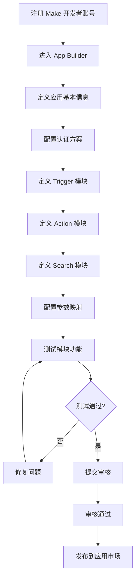
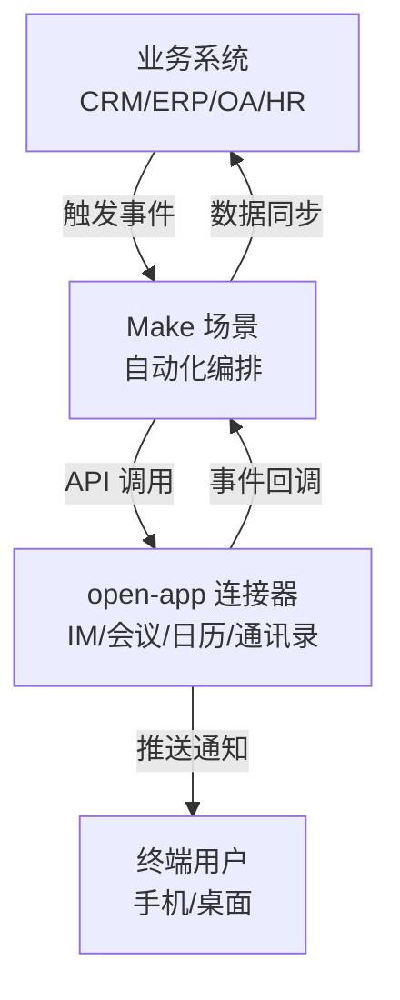
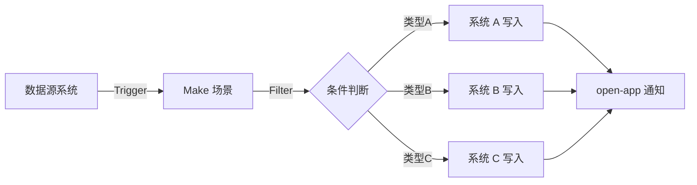
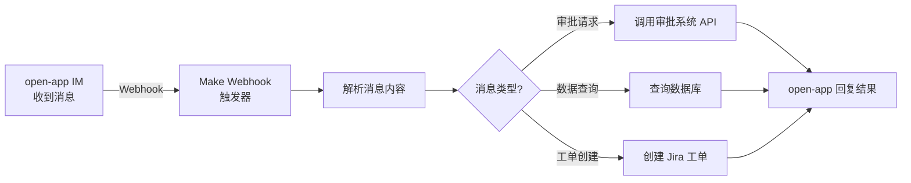
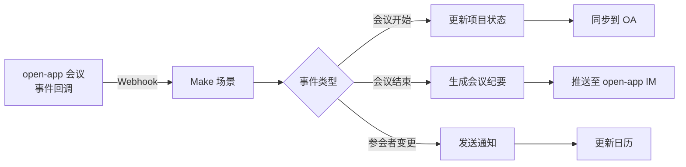
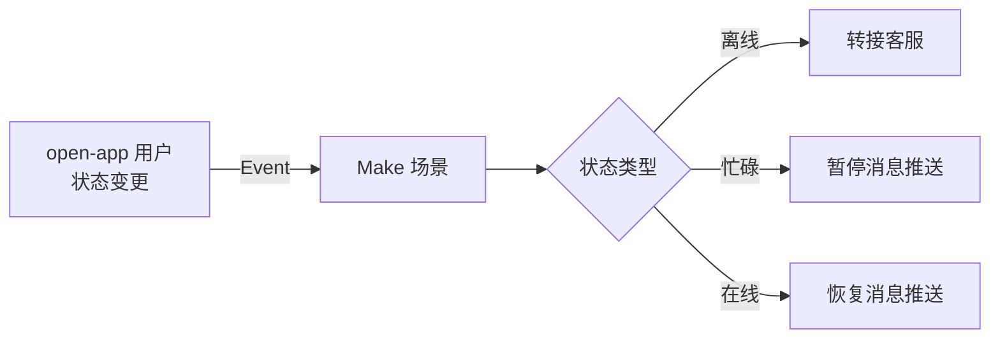
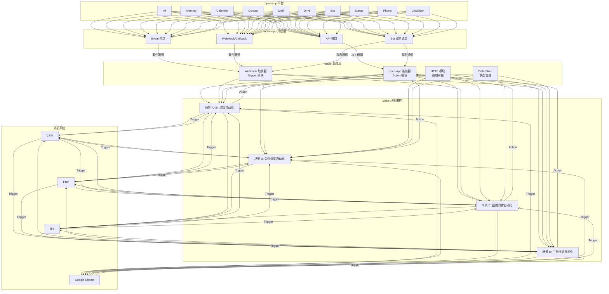
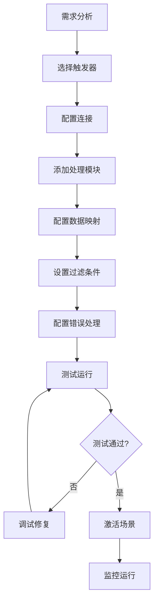
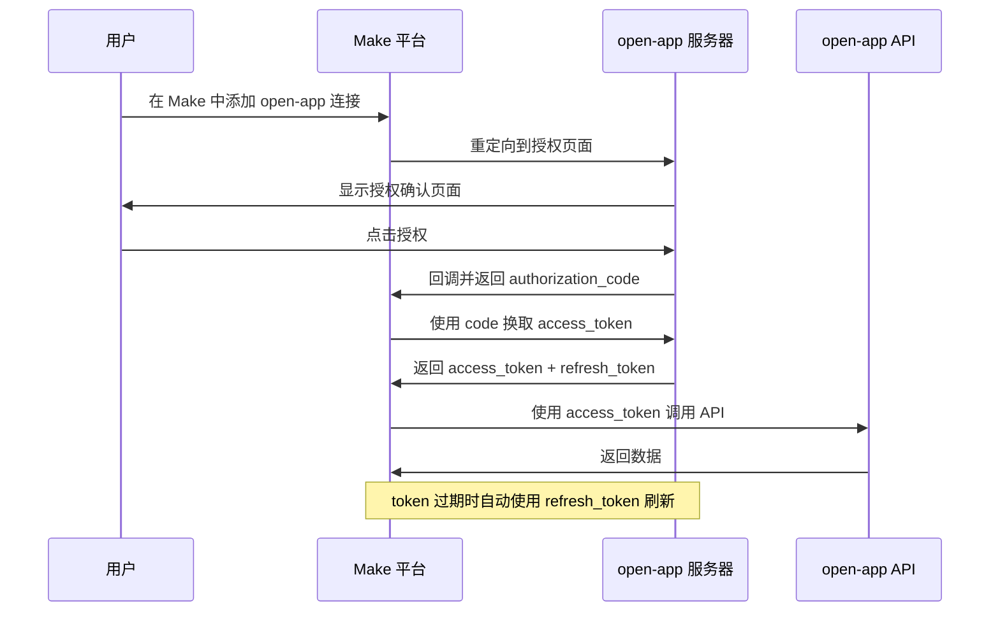

# Make 连接器平台调研报告

## 一、平台概述

### 1.1 平台简介

Make（前身为 Integromat）是一款全球领先的视觉化自动化与集成平台，由 Ondřej Kvasničovský 和 Petr Žďárek 于 2012 年在捷克布拉格创立。2021 年 2 月，Integromat 正式更名为 Make，以更简洁的品牌形象和更强大的产品能力重新出发。Make 通过视觉化的场景编辑器（Scenario Builder），让用户无需编写代码即可构建复杂的跨应用自动化工作流。截至目前，Make 已支持 1800+ 个预构建应用连接器，覆盖企业办公、营销、销售、IT 运维、电商、数据分析等多个领域，全球有超过 50 万家企业用户在使用 Make 进行业务自动化。

Make 的核心创新在于其独特的视觉化场景编排方式——用户通过拖拽模块（Module）、连接数据流、配置路由与过滤器，即可构建包含条件分支、循环迭代、错误处理、数据聚合等复杂逻辑的自动化流程。与传统 iPaaS 平台的线性管道（Pipeline）模型不同，Make 的场景（Scenario）模型更接近编程语言的流程控制结构，使其在表达复杂业务逻辑方面具有显著优势。

### 1.2 平台定位

- **视觉化 iPaaS 平台**：以"场景"为核心概念，通过可视化编排实现跨应用集成与自动化
- **中小企业与中型市场首选**：定价灵活、上手成本低，尤其适合 SMB 和 Mid-market 企业
- **复杂工作流引擎**：支持条件路由、循环迭代、数据聚合等高级逻辑，突破简单触发-动作的局限
- **低代码/无代码自动化**：面向业务人员与公民开发者，降低自动化门槛
- **企业集成中间层**：作为企业 SaaS 应用之间的集成枢纽，连接 CRM、ERP、通讯、协作等系统

### 1.3 核心价值主张

| 价值维度 | 描述 |
|---------|------|
| **视觉化编排** | 通过拖拽式场景编辑器，直观构建复杂工作流，所见即所得 |
| **复杂逻辑支持** | 原生支持路由、迭代、聚合、过滤器等高级控制流，超越简单线性自动化 |
| **成本效益** | 相比 Zapier 等竞品，同等操作量下价格更低，性价比突出 |
| **灵活调度** | 支持即时触发、定时调度、Webhook 触发等多种运行模式 |
| **强大错误处理** | 内置错误路由、重试机制、异常通知，保障自动化流程可靠性 |
| **丰富连接器生态** | 1800+ 预构建应用，覆盖主流 SaaS 服务，并通过 HTTP 模块支持任意 API 对接 |
| **内置数据存储** | 提供 Data Store 和 Data Structure，无需外部数据库即可实现数据持久化 |
| **企业级安全** | 通过 SOC 2 Type II、GDPR 合规认证，支持 IP 白名单、数据加密等安全机制 |

---

## 二、核心能力体系

### 2.1 连接器能力矩阵

Make 的连接器以"模块（Module）"为基本单元，每个应用的连接器由多种类型的模块组合而成，共同构成完整的集成能力。

#### 2.1.1 模块类型总览

| 模块类型 | 功能描述 | 典型示例 | 数据流方向 |
|---------|---------|---------|-----------|
| **Trigger（触发器）** | 监听外部事件，启动场景执行 | 新邮件到达、新订单创建、定时触发 | 外部 → Make |
| **Action（动作）** | 对目标应用执行操作 | 发送消息、创建记录、更新数据 | Make → 外部 |
| **Search（搜索）** | 从目标应用查询数据 | 搜索联系人、查询订单、获取文件列表 | 外部 → Make |
| **Iterator（迭代器）** | 将数组数据拆分为逐项处理 | 遍历订单明细、逐条处理邮件附件 | 内部转换 |
| **Aggregator（聚合器）** | 将多条数据合并为单一输出 | 汇总多行数据为 HTML 表格、合并多文件为压缩包 | 内部转换 |

#### 2.1.2 常见应用模块映射

| 应用 | Trigger 模块 | Action 模块 | Search 模块 |
|------|-------------|------------|------------|
| **Gmail** | Watch Emails | Send Email、Add Label | Search Emails |
| **Slack** | Watch Messages | Send Message、Create Channel | Search Messages |
| **Google Sheets** | Watch Rows | Add Row、Update Row | Search Rows |
| **Salesforce** | Watch Records | Create Record、Update Record | Search Records |
| **HTTP** | Webhook (Custom) | Make a Request、Make a OAuth 2.0 Request | — |
| **GitHub** | Watch Issues、Watch Pull Requests | Create Issue、Create Pull Request | Search Issues |
| **Microsoft 365** | Watch Events | Send Email、Create Event | Search Contacts |
| **Jira** | Watch Issues | Create Issue、Transition Issue | Get Issue |

#### 2.1.3 内置工具模块

| 模块名称 | 功能描述 | 典型用途 |
|---------|---------|---------|
| **Router** | 将数据流分发到多个并行路径 | 根据条件执行不同分支操作 |
| **Filter** | 根据条件过滤数据流 | 只处理符合条件的数据 |
| **Iterator** | 拆分数组为逐项处理 | 遍历列表中的每个元素 |
| **Aggregator** | 将多条数据聚合为一个包 | 汇总处理结果、生成报告 |
| **Text Parser** | 正则表达式文本解析 | 提取邮件中的特定信息 |
| **JSON Parser** | 解析/生成 JSON 数据 | 格式转换、数据映射 |
| **XML Parser** | 解析/生成 XML 数据 | 对接遗留系统 |
| **Data Store** | 读写内置键值存储 | 状态持久化、去重判断 |
| **Flow Control** | Sleep、Resume 等流程控制 | 延迟执行、暂停恢复 |
| **Error Handler** | 捕获并处理模块执行错误 | 异常通知、重试、降级 |

### 2.2 开发模式

#### 2.2.1 可视化场景编辑器

**核心特点**：
- 基于浏览器的拖拽式编辑器，无需安装客户端
- 模块之间通过可视化连接线展示数据流向
- 支持实时预览每个模块的输入/输出数据
- 内置执行日志，可逐步查看每个模块的执行结果
- 支持场景模板（Template），快速复用常见自动化流程

**场景编辑器界面组成**：

```
┌─────────────────────────────────────────────────────────────────┐
│  场景编辑器 (Scenario Editor)                                    │
│ ┌──────────────────────────────────────────────────────────────┐ │
│ │  工具栏: [保存] [运行一次] [激活] [调度设置] [日志] [模板]    │ │
│ └──────────────────────────────────────────────────────────────┘ │
│                                                                 │
│   ● Trigger          ──→  ● Action 1  ──→  ● Router             │
│   [Gmail: Watch      │    [Filter:     │    ├─→ ● Action 2a    │
│    Emails]           │     Subject     │    │   [Slack: Send    │
│                      │     contains    │    │    Message]       │
│                      │     "urgent"]   │    │                   │
│                      │                │    └─→ ● Action 2b    │
│                      │                │        [Sheets: Add    │
│                      │                │         Row]           │
│                      │                │                        │
│                      └──→  ● Error Handler                    │
│                            [Email: Send Alert]                 │
│                                                                 │
│ ┌──────────────────────────────────────────────────────────────┐ │
│ │  输出面板: [模块数据] [执行日志] [错误信息]                    │ │
│ └──────────────────────────────────────────────────────────────┘ │
└─────────────────────────────────────────────────────────────────┘
```

**场景运行模式**：

| 运行模式 | 描述 | 适用场景 |
|---------|------|---------|
| **即时触发（Instant）** | Webhook 触发，事件发生时立即执行 | 实时消息推送、即时通知 |
| **定时轮询（Polling）** | 按设定间隔定期检查新数据 | 定期同步、周期性任务 |
| **手动执行** | 手动点击"Run Once"执行 | 调试测试、一次性任务 |
| **调度执行（Scheduled）** | 使用 Cron 表达式精确调度 | 每日报表、定时备份 |

**错误处理机制**：
- 每个模块可独立配置错误处理路由
- 支持三种错误处理策略：Ignore（忽略）、Break（中断并回滚）、Commit（提交已完成操作）
- 错误处理器可发送通知、记录日志、执行降级操作
- 支持自动重试，可配置重试次数和间隔

#### 2.2.2 Make Custom Module 开发（HTTP 模块）

**特点**：
- 无需编写代码，通过 HTTP 模块即可对接任意 REST API
- 支持 GET、POST、PUT、PATCH、DELETE 等全部 HTTP 方法
- 支持 OAuth 2.0、API Key、Basic Auth 等多种认证方式
- 支持自定义请求头、请求体、URL 参数
- 响应数据自动解析，支持 JSON/XML 格式
- 适用于快速对接内部 API 或尚未有官方连接器的服务

**HTTP 模块配置示例——对接 open-app 发送消息**：

```json
{
  "url": "https://open-app.example.com/api/v1/messages/send",
  "method": "POST",
  "headers": [
    { "key": "Authorization", "value": "Bearer {{api_token}}" },
    { "key": "Content-Type", "value": "application/json" }
  ],
  "body": {
    "type": "raw",
    "content": "{\"target_type\": \"user\", \"target_id\": \"{{user_id}}\", \"message_type\": \"text\", \"content\": {\"text\": \"{{message_content}}\"}}"
  },
  "parse_response": true
}
```

**Webhook 自定义触发器示例**：

```json
{
  "webhook_name": "open-app-event-listener",
  "webhook_route": "https://hook.make.com/xxxxx",
  "method": "POST",
  "output_structure": {
    "event_type": "{{body.event_type}}",
    "event_data": "{{body.data}}",
    "timestamp": "{{body.timestamp}}"
  }
}
```

通过将 Make 提供的 Webhook URL 配置到 open-app 的事件订阅（Event/Callback）地址，即可实现 open-app 事件驱动 Make 场景执行。

#### 2.2.3 Make App 开发（Make App SDK）

**特点**：
- 基于声明式 JSON 配置定义应用模块
- 提供可视化的 Make App 编辑器（App Builder）
- 支持 Trigger、Action、Search 三种模块类型
- 支持自定义认证方案（API Key、OAuth 2.0 等）
- 支持动态参数（根据用户选择动态加载选项）
- 开发完成后可发布到 Make 应用市场或私有部署

**Make App 项目结构**：

```
my-make-app/
├── app.json              # 应用主配置文件
├── modules/
│   ├── triggers/
│   │   └── watchMessages.json    # 触发器模块定义
│   ├── actions/
│   │   ├── sendMessage.json      # 发送消息动作
│   │   ├── createMeeting.json    # 创建会议动作
│   │   └── searchContact.json    # 搜索联系人动作
│   └── connections/
│       └── oauth2.json           # OAuth2 连接定义
├── assets/
│   └── icon.png                  # 应用图标
└── README.md
```

**Make App 核心配置示例——open-app 连接器**：

```json
{
  "name": "open-app",
  "label": "open-app Communication Platform",
  "description": "Connect to XXX Communication System IM, Meeting, Calendar, Contact and more",
  "version": "1.0.0",
  "baseUrl": "https://open-app.example.com/api/v1",
  "auth": {
    "type": "oauth2",
    "authorizationUrl": "https://open-app.example.com/oauth/authorize",
    "tokenUrl": "https://open-app.example.com/oauth/token",
    "scopes": ["im:message:send", "meeting:create", "contact:read"]
  }
}
```

**Make App 开发流程**：



#### 2.2.4 Make Data Store & Data Structure

**Data Store（数据存储）**：
- Make 内置的轻量级键值数据库，无需外部数据库服务
- 支持创建多个独立的 Data Store，每个场景可访问不同的 Store
- 最大存储容量取决于订阅计划（Free: 1MB, Core: 1MB, Pro: 50MB, Teams: 500MB, Enterprise: 可扩展）
- 支持 CRUD 操作：Add、Update、Delete、Search、Get Record
- 可用作跨场景的状态共享、数据去重、增量处理标记等

**Data Structure（数据结构）**：
- 定义 Data Store 中记录的字段结构，类似于数据库 Schema
- 支持字段类型：text、number、date、boolean、array、object
- 可在模块之间共享，确保数据格式一致性
- 支持从 JSON 示例自动生成 Data Structure

**Data Store 操作模块**：

| 操作 | 描述 | 参数 |
|------|------|------|
| **Add Record** | 向 Data Store 添加新记录 | Data Structure、字段值 |
| **Update Record** | 更新已有记录 | Record ID、更新字段 |
| **Delete Record** | 删除记录 | Record ID 或 Key |
| **Search Records** | 按条件搜索记录 | 过滤条件、排序、分页 |
| **Get Record** | 按 Key 获取单条记录 | Key 值 |
| **Clear All Records** | 清空 Data Store | — |
| **Check Existence** | 检查记录是否存在 | Key 值 |

**典型应用场景**：
- **增量同步**：记录最后处理时间戳，避免重复处理
- **数据去重**：存储已处理记录 ID，防止重复触发
- **状态管理**：跨场景共享业务状态数据
- **临时缓存**：缓存 API 响应数据，减少重复调用
- **映射表**：存储 ID 映射关系，实现跨系统数据关联

### 2.3 场景自动化能力

#### 2.3.1 场景（Scenario）核心概念

| 概念 | 描述 | 类比 |
|------|------|------|
| **Scenario（场景）** | 一个完整的自动化工作流，由多个模块按顺序组成 | 一个程序 |
| **Module（模块）** | 场景中的单个步骤，执行特定操作 | 一个函数调用 |
| **Operation（操作）** | 模块的一次执行计为一次 Operation | 一次函数执行 |
| **Bundle（数据包）** | 模块之间传递的数据单元 | 函数参数/返回值 |
| **Execution（执行）** | 场景的一次完整运行 | 一次程序运行 |
| **Cycle（周期）** | 场景执行中的一个处理轮次 | 一次循环迭代 |
| **Data Transfer（数据传输）** | 场景执行中传输的总数据量 | I/O 吞吐量 |

#### 2.3.2 高级控制流

**Router（路由器）**：
- 将一个数据流分裂为多个并行处理路径
- 每个路径可配置独立的 Filter 条件
- 支持无条件路由（所有路径都执行）和条件路由（仅满足条件的路径执行）
- 典型场景：根据事件类型分发到不同的处理逻辑

**Iterator（迭代器）**：
- 将数组类型的数据拆分为单个元素，逐个传递给下游模块
- 配合 Aggregator 使用可实现"拆分-处理-合并"模式
- 典型场景：遍历订单明细列表，逐条同步到目标系统

**Aggregator（聚合器）**：
- 将迭代器产生的多个 Bundle 合并为一个 Bundle
- 支持多种聚合方式：Text Aggregator（文本拼接）、Archive Aggregator（压缩打包）、Numeric Aggregator（数值统计）
- 典型场景：将多条查询结果汇总为一封邮件的 HTML 表格

**Filter（过滤器）**：
- 在模块之间设置条件判断，不符合条件的数据被丢弃
- 支持多种条件运算符：等于、包含、正则匹配、存在性判断等
- 支持 AND/OR 逻辑组合
- 典型场景：只处理优先级为"紧急"的工单

**Error Handler（错误处理器）**：
- 每个模块可附加错误处理路由
- 支持三种处理策略：Ignore（忽略继续）、Break（中断回滚）、Commit（提交继续）
- 可配置自动重试（最大重试次数、重试间隔）
- 典型场景：API 调用失败时发送告警通知并记录错误日志

#### 2.3.3 场景调度能力

| 调度类型 | 描述 | 配置方式 | 适用场景 |
|---------|------|---------|---------|
| **即时调度** | Webhook 触发，事件发生时立即执行 | 配置 Webhook URL | 实时通知、即时同步 |
| **间隔调度** | 按固定时间间隔执行 | 设置间隔分钟数（最短 5 分钟） | 定期同步、轮询检查 |
| **定时调度** | 指定具体时间点执行 | 设置每天/每周/每月执行时间 | 日报生成、定期备份 |
| **Cron 调度** | 使用 Cron 表达式精确调度 | 输入 Cron 表达式 | 复杂调度需求 |

#### 2.3.4 数据流转与处理

**数据映射**：
- 模块之间通过 Bundle 传递数据
- 支持将上游模块的输出字段映射到下游模块的输入参数
- 支持内置函数对数据进行转换（字符串操作、日期格式化、数学计算等）
- 支持条件映射（根据条件选择不同的数据源）

**内置函数库**：

| 函数类别 | 常用函数 | 说明 |
|---------|---------|------|
| **通用函数** | if、switch、fallback | 条件判断与默认值 |
| **字符串函数** | substring、replace、lower、upper、length | 字符串操作 |
| **数学函数** | add、subtract、multiply、divide、round、ceil、floor | 数值计算 |
| **日期函数** | formatDate、parseDate、addDays、formatDate | 日期格式化与计算 |
| **数组函数** | join、split、length、sort、merge | 数组操作 |
| **JSON 函数** | parseJSON、stringify、get、keys | JSON 处理 |
| **正则函数** | match、replace、test | 正则表达式 |
| **编码函数** | base64、encodeURL、hash、hmac | 编码与加密 |

### 2.4 连接器发布机制

| 发布方式 | 描述 | 适用场景 |
|---------|------|---------|
| **HTTP 模块** | 无需发布，配置即用 | 个人使用、临时对接 |
| **私有 App** | 在 Make App Builder 中创建，仅组织内可见 | 企业内部系统集成 |
| **公开 App** | 提交 Make 审核，发布到应用市场 | 面向所有 Make 用户 |
| **模板发布** | 将场景配置发布为可复用模板 | 推广最佳实践 |

**公开 App 审核要求**：
- 必须有完整的应用描述和使用文档
- 所有模块必须经过充分测试
- 认证方案需符合安全标准
- API 端点需稳定可用
- 错误处理需完善
- 需提供应用图标和品牌素材

---

## 三、应用场景分析

### 3.1 典型应用场景

#### 3.1.1 企业通讯与业务系统集成

**场景描述**：
将 open-app 的 IM、会议、日历、通讯录等核心通讯能力通过 Make 暴露给企业其他业务系统，实现通讯能力与业务流程的深度集成。

**集成方案**：



**关键能力**：
- IM 消息推送：业务系统触发条件满足时，通过 Make 调用 open-app IM API 发送通知
- 会议自动创建：CRM 中安排客户拜访时，自动创建 open-app 会议并邀请参与者
- 日历同步：业务系统日程与 open-app 日历双向同步
- 通讯录查询：在 Make 场景中实时查询 open-app 通讯录获取用户信息
- 状态订阅：订阅 open-app 用户状态变更事件，触发后续业务流程

**典型案例**：
- **销售通知**：CRM 中新建重要商机 → Make 场景触发 → 通过 open-app IM 向销售经理推送通知
- **会议安排**：OA 系统审批通过出差申请 → Make 自动创建 open-app 会议并同步日历
- **人员入职**：HR 系统新员工入职 → Make 同步通讯录 → 发送欢迎消息 → 创建账号

#### 3.1.2 多系统数据流转自动化

**场景描述**：
通过 Make 的 Router 和 Iterator 能力，实现多系统之间的数据自动流转和同步，减少人工操作。

**典型流程**：



**应用场景**：
- **订单同步**：电商订单 → ERP 系统 → 仓库系统 → 财务系统，全程通过 Make 自动流转
- **客户数据同步**：CRM 新客户 → 邮件营销平台 → 客服系统，并通过 open-app 通知销售
- **项目协同**：项目管理工具更新 → 通知团队成员（via open-app IM）→ 同步到知识库

#### 3.1.3 事件驱动的工作流自动化

**场景描述**：
利用 open-app 的 Event 和 Callback 开放模式，通过 Make Webhook 实现事件驱动的自动化工作流。

**典型场景**：

1. **IM 消息触发自动化**



2. **会议事件驱动**



3. **状态变更联动**



#### 3.1.4 复杂数据处理与转换

**场景描述**：
利用 Make 的 Iterator、Aggregator 和内置函数，实现复杂的数据转换、格式适配和批量处理。

**典型场景**：
- **多源数据聚合**：从多个系统获取数据 → Iterator 逐条处理 → Aggregator 合并为统一报告 → 通过 open-app IM 发送
- **格式转换**：JSON → CSV → Excel → PDF，每一步由不同模块处理
- **数据清洗**：原始数据 → Text Parser 正则提取 → 格式化 → 写入目标系统
- **批量操作**：读取 Excel 清单 → Iterator 遍历 → 逐条调用 API → Aggregator 汇总结果

#### 3.1.5 定时任务与批量处理

**场景描述**：
利用 Make 的调度能力，实现定时同步、批量处理和定期报告。

| 场景 | 调度方式 | 处理流程 |
|------|---------|---------|
| **每日报表** | 每天 9:00 触发 | 查询业务数据 → 生成报表 → open-app IM 推送 |
| **周度同步** | 每周一 8:00 触发 | 拉取 CRM 数据 → 同步到 ERP → 发送同步结果通知 |
| **月度结算** | 每月 1 日触发 | 汇总上月数据 → 生成结算单 → 推送财务确认 |
| **实时监控** | 每 5 分钟轮询 | 检查系统状态 → 异常时 open-app 告警通知 |
| **批量导入** | 手动触发 | 读取 CSV 文件 → Iterator 遍历 → 逐条创建记录 |

### 3.2 与 open-app 的集成场景

#### 3.2.1 open-app 四大开放模式与 Make Module 映射

| open-app 开放模式 | 数据方向 | 对应 Make Module 类型 | 典型实现方式 |
|------------------|---------|---------------------|-------------|
| **API（外部→内部）** | Make → open-app | **Action 模块** | HTTP Make a Request / 自定义 Action |
| **Event（内部→外部）** | open-app → Make | **Trigger 模块（Webhook）** | Custom Webhook 触发器 |
| **WebHook/Callback（内部→外部）** | open-app → Make | **Trigger 模块（Webhook）** | Custom Webhook 触发器 |
| **Bot（双向）** | 双向 | **Trigger + Action 组合** | Webhook 触发 + HTTP Action 回复 |

#### 3.2.2 open-app 各能力模块的 Make 连接器设计

| open-app 能力 | Trigger 模块 | Action 模块 | Search 模块 |
|--------------|-------------|------------|------------|
| **IM（即时通讯）** | Watch IM Messages、Watch Group Messages | Send IM Message、Create Group、Update Group | Search Messages、Search Groups |
| **Meeting（会议）** | Watch Meeting Events | Create Meeting、Update Meeting、End Meeting | Search Meetings、Get Meeting Detail |
| **CloudBox（云盒子）** | Watch File Changes | Upload File、Share File、Create Folder | Search Files、Get File |
| **Calendar（日历）** | Watch Calendar Events | Create Event、Update Event、Delete Event | Search Events、Get Free/Busy |
| **Contact（通讯录）** | Watch Contact Changes | Create Contact、Update Contact | Search Users、Search Departments |
| **Mail（邮件）** | Watch Emails | Send Email、Move Email、Mark Read | Search Emails |
| **Drive（云盘）** | Watch Drive Changes | Upload File、Create Share Link | Search Files、Get File Info |
| **Bot（机器人）** | Watch Bot Messages | Send Bot Message、Send Card Message | — |
| **Status（状态）** | Watch Status Changes | Set User Status | Get User Status |
| **Phone（电话）** | Watch Call Events | Initiate Call、Hang Up Call | Search Call Records |

#### 3.2.3 集成架构图



---

## 四、开发指南

### 4.1 场景开发流程



**详细步骤**：

1. **需求分析**
   - 明确触发条件：何时启动自动化？
   - 明确处理逻辑：需要执行哪些操作？
   - 明确输出结果：最终达到什么效果？

2. **选择触发器**
   - 即时触发：选择 Webhook 触发器
   - 定时触发：选择轮询触发器或调度设置
   - 事件触发：选择对应应用的 Watch 模块

3. **配置连接**
   - 选择目标应用并授权
   - 配置 API Key 或 OAuth 认证
   - 验证连接可用性

4. **添加处理模块**
   - 按业务流程添加 Action 模块
   - 使用 Router 创建条件分支
   - 使用 Iterator/Aggregator 处理数组数据

5. **配置数据映射**
   - 将上游模块输出映射到下游模块输入
   - 使用内置函数进行数据转换
   - 验证数据类型匹配

6. **设置过滤条件**
   - 配置模块间的 Filter 条件
   - 测试条件逻辑正确性

7. **配置错误处理**
   - 为关键模块添加 Error Handler
   - 设置重试策略
   - 配置失败通知

8. **测试运行**
   - 使用 "Run Once" 手动执行
   - 检查每个模块的输入输出
   - 验证整体流程正确性

9. **激活场景**
   - 启用调度或 Webhook
   - 设置运行优先级
   - 配置执行日志级别

10. **监控运行**
    - 查看执行历史和日志
    - 监控 Operation 消耗
    - 及时处理异常

### 4.2 Make App 开发

**Make App 完整模块定义示例——open-app 发送 IM 消息 Action**：

```json
{
  "name": "sendIMMessage",
  "label": "Send IM Message",
  "description": "Send a message to a user or group via open-app IM",
  "endpoint": "/messages/send",
  "method": "POST",
  "parameters": [
    {
      "name": "target_type",
      "type": "select",
      "options": ["user", "group"],
      "label": "Target Type",
      "required": true,
      "help": "Select whether to send to a user or a group"
    },
    {
      "name": "target_id",
      "type": "string",
      "label": "Target ID",
      "required": true,
      "help": "User ID or Group ID"
    },
    {
      "name": "message_type",
      "type": "select",
      "options": ["text", "markdown", "card"],
      "label": "Message Type",
      "required": true
    },
    {
      "name": "content",
      "type": "text",
      "label": "Message Content",
      "required": true,
      "help": "Message body in text, markdown, or card JSON format"
    }
  ],
  "interface": [
    { "name": "message_id", "type": "string", "label": "Message ID" },
    { "name": "status", "type": "string", "label": "Send Status" },
    { "name": "timestamp", "type": "date", "label": "Send Time" }
  ]
}
```

**Make App 模块定义示例——open-app 会议事件 Webhook Trigger**：

```json
{
  "name": "watchMeetingEvents",
  "label": "Watch Meeting Events",
  "type": "webhook",
  "description": "Triggers when a meeting event occurs (started, ended, participant joined/left)",
  "hookType": "custom",
  "interface": [
    { "name": "meeting_id", "type": "string", "label": "Meeting ID" },
    { "name": "event_type", "type": "string", "label": "Event Type" },
    { "name": "topic", "type": "text", "label": "Meeting Topic" },
    { "name": "host_id", "type": "string", "label": "Host ID" },
    { "name": "participant_id", "type": "string", "label": "Participant ID" },
    { "name": "timestamp", "type": "date", "label": "Timestamp" }
  ]
}
```

**Make App 模块定义示例——open-app 搜索通讯录 Search**：

```json
{
  "name": "searchContacts",
  "label": "Search Contacts",
  "description": "Search for users in open-app directory",
  "endpoint": "/contacts/search",
  "method": "GET",
  "parameters": [
    { "name": "keyword", "type": "text", "label": "Search Keyword", "required": true },
    { "name": "department_id", "type": "string", "label": "Department ID" },
    { "name": "limit", "type": "number", "label": "Max Results", "default": 50 }
  ],
  "interface": [
    { "name": "user_id", "type": "string", "label": "User ID" },
    { "name": "name", "type": "text", "label": "Name" },
    { "name": "email", "type": "email", "label": "Email" },
    { "name": "phone", "type": "string", "label": "Phone" },
    { "name": "department", "type": "text", "label": "Department" },
    { "name": "position", "type": "text", "label": "Position" }
  ]
}
```

### 4.3 HTTP 模块对接

**对接 open-app API 的 HTTP 模块配置步骤**：

**步骤 1：创建 HTTP 模块（Action 类型）**

```
模块类型: HTTP - Make a Request
URL: https://open-app.example.com/api/v1/messages/send
方法: POST
```

**步骤 2：配置认证**

```
认证类型: OAuth 2.0
Authorization URL: https://open-app.example.com/oauth/authorize
Token URL: https://open-app.example.com/oauth/token
Scope: im:message:send meeting:create contact:read
```

**步骤 3：配置请求头**

```
Content-Type: application/json
Authorization: Bearer {{1.token}}
X-Request-ID: {{uuid}}
```

**步骤 4：配置请求体**

```json
{
  "target_type": "user",
  "target_id": "{{2.user_id}}",
  "message_type": "markdown",
  "content": {
    "markdown": "## 新订单通知\n\n**客户**: {{3.customer_name}}\n**金额**: {{3.amount}}\n**时间**: {{formatDate(now; \"YYYY-MM-DD HH:mm\")}}"
  }
}
```

**步骤 5：解析响应**

```
解析响应: 是
响应结构:
  - message_id (string)
  - status (string)
  - timestamp (date)
```

**Webhook 触发器对接 open-app Event**：

1. 在 Make 中创建 Custom Webhook，获取 Webhook URL（如 `https://hook.make.com/abc123xyz`）
2. 在 open-app 事件订阅配置中，将 Webhook URL 注册为回调地址
3. 配置 Webhook 输出数据结构，映射 open-app 事件数据字段
4. 在 Make 场景中使用 Webhook 输出的数据进行后续处理

### 4.4 认证方式

| 认证方式 | 配置方式 | 适用场景 | 安全等级 |
|---------|---------|---------|---------|
| **API Key** | 在请求头中添加 `Authorization: Bearer <api_key>` | 内部服务对接、简单场景 | 中 |
| **OAuth 2.0** | 配置 Authorization URL、Token URL、Scope | 面向第三方用户、需要用户授权 | 高 |
| **Basic Auth** | 配置用户名和密码，自动添加 `Authorization: Basic <encoded>` | 遗留系统对接 | 低 |
| **Custom Auth** | 自定义认证流程，支持多步骤认证 | 复杂认证场景 | 取决于实现 |

**OAuth 2.0 认证流程**：



### 4.5 最佳实践

#### 4.5.1 场景设计最佳实践

- **单一职责**：每个场景只负责一个明确的业务流程，避免过于复杂的场景
- **模块化设计**：将通用逻辑抽取为独立场景，通过 "Run Scenario" 模块复用
- **数据去重**：使用 Data Store 记录已处理数据 ID，避免重复触发
- **错误隔离**：为关键模块配置独立的错误处理路由
- **版本管理**：使用场景克隆功能保存版本，修改前先克隆

#### 4.5.2 性能优化最佳实践

- **批量处理**：优先使用批量 API，减少 Operation 消耗
- **合理调度**：避免过于频繁的轮询，根据业务需求设置合理的调度间隔
- **数据过滤**：在 Trigger 之后立即使用 Filter 过滤无关数据，减少下游 Operation
- **缓存策略**：使用 Data Store 缓存不常变化的数据（如通讯录、部门信息）
- **并发控制**：合理设置场景并发数，避免触发 API 限流

#### 4.5.3 安全最佳实践

- **最小权限**：OAuth 授权时只申请必要的 Scope
- **密钥轮换**：定期更换 API Key 和 Client Secret
- **传输加密**：确保所有 API 调用使用 HTTPS
- **日志脱敏**：场景执行日志中避免记录敏感数据
- **访问控制**：限制场景编辑和执行权限，实施 RBAC

#### 4.5.4 错误处理最佳实践

| 错误场景 | 处理策略 | 配置方式 |
|---------|---------|---------|
| **API 限流（429）** | 自动重试，递增等待时间 | Error Handler + Sleep 模块 |
| **网络超时** | 重试 3 次，失败后通知 | Error Handler + 邮件通知 |
| **数据格式错误** | 记录日志，跳过当前记录 | Commit 策略 + Data Store 记录 |
| **认证失效（401）** | 自动刷新 token 重试 | OAuth 2.0 自动刷新机制 |
| **业务逻辑错误** | Break 中断，回滚操作 | Break 策略 + 错误通知 |

---

## 五、优势与劣势分析

### 5.1 核心优势

#### 5.1.1 产品优势

| 优势维度 | 详细描述 |
|---------|---------|
| **视觉化工作流** | 拖拽式场景编辑器，直观展示数据流向和逻辑分支，非技术人员也能构建复杂自动化 |
| **复杂逻辑支持** | 原生支持 Router、Iterator、Aggregator、Filter 等高级控制流，可表达条件分支、循环、并行等复杂逻辑 |
| **成本效益** | 相比 Zapier 同等操作量价格低约 30%-50%，性价比突出；Data Store 免费内置，无需额外数据库 |
| **灵活调度** | 支持即时 Webhook、定时轮询、Cron 调度等多种运行模式，满足不同时效性需求 |
| **强大错误处理** | 三级错误策略（Ignore/Break/Commit）+ 自动重试 + 独立错误路由，企业级可靠性 |
| **内置数据存储** | Data Store 提供开箱即用的持久化能力，支持跨场景状态共享和数据去重 |
| **丰富函数库** | 内置 300+ 函数覆盖字符串、日期、数组、JSON、正则、加密等，减少自定义代码需求 |
| **HTTP 通用模块** | 无需官方连接器即可对接任意 REST API，降低等待和依赖成本 |

#### 5.1.2 技术优势

| 优势维度 | 详细描述 |
|---------|---------|
| **场景克隆与版本** | 支持场景克隆，便于版本管理和 A/B 测试 |
| **执行日志详细** | 每个模块的输入输出完整记录，便于调试和排查问题 |
| **Webhook 即时触发** | 原生 Webhook 支持，事件触发延迟低（秒级），适合实时场景 |
| **数组处理能力** | Iterator + Aggregator 的组合可优雅处理数组数据，突破线性管道的局限 |
| **Make App SDK** | 声明式 JSON 配置开发连接器，开发效率高，可复用可发布 |
| **模板市场** | 丰富的场景模板，可快速复用成熟的自动化方案 |

#### 5.1.3 生态优势

| 优势维度 | 详细描述 |
|---------|---------|
| **连接器数量** | 1800+ 预构建应用连接器，持续增长 |
| **模板社区** | 大量用户贡献的场景模板，降低学习成本 |
| **API 生态** | 通过 HTTP 模块理论上可对接任何提供 REST API 的服务 |
| **开发者支持** | 完善的开发文档、API 参考和社区论坛 |

### 5.2 潜在劣势

#### 5.2.1 产品劣势

| 劣势维度 | 详细描述 |
|---------|---------|
| **生态规模较小** | 相比 Zapier 的 7000+ 应用，Make 的 1800+ 应用连接器数量较少，部分小众应用无官方连接器 |
| **学习曲线较陡** | 场景编辑器的概念模型（Router、Iterator、Aggregator 等）比 Zapier 的线性管道更复杂，新手需要更多学习时间 |
| **无可视化仪表盘** | 缺乏内置的数据可视化仪表盘，需要借助外部工具展示数据 |
| **移动端支持有限** | 移动端仅支持查看执行日志，不支持编辑场景 |

#### 5.2.2 技术劣势

| 劣势维度 | 详细描述 |
|---------|---------|
| **无本地部署** | Make 仅提供 SaaS 版本，不支持私有化部署，对数据合规性要求高的企业可能受限 |
| **执行超时限制** | 单次场景执行有超时限制（通常 40 分钟），超长任务需要拆分 |
| **Data Store 容量有限** | 内置 Data Store 容量取决于订阅等级，大规模数据存储需外部数据库 |
| **API 调用延迟** | 作为中间层，每次 API 调用会引入额外延迟（通常 200-500ms） |
| **调试能力有限** | 调试主要依赖执行日志，缺乏断点、单步执行等高级调试能力 |

#### 5.2.3 其他劣势

| 劣势维度 | 详细描述 |
|---------|---------|
| **品牌认知度** | 在国内市场知名度较低，用户社区以海外为主 |
| **中文支持** | 界面和文档以英文为主，中文资源较少 |
| **合规认证** | 虽有 SOC 2 和 GDPR 认证，但缺少国内等保认证 |
| **技术支持** | 海外团队，时区差异可能影响技术支持响应速度 |

---

## 六、成本分析

### 6.1 定价方案

| 计划 | 月价格 | 年付价格 | Operations/月 | Data Transfer | Data Store | 场景数 | 最小间隔 | 连接数 |
|------|--------|---------|--------------|--------------|-----------|--------|---------|--------|
| **Free** | $0 | $0 | 1,000 | 1 GB | 1 MB | 2 | 15 分钟 | 2 |
| **Core** | $9 | $7/mo | 10,000 | 10 GB | 1 MB | 无限 | 5 分钟 | 2 |
| **Pro** | $16 | $13/mo | 10,000+ | 50 GB | 50 MB | 无限 | 1 分钟 | 无限 |
| **Teams** | $29 | $24/mo | 10,000+ | 100 GB | 500 MB | 无限 | 1 分钟 | 无限 |
| **Enterprise** | 定制 | 定制 | 无限 | 无限 | 可扩展 | 无限 | 即时 | 无限 |

**Operation 消耗说明**：
- 每个 Trigger 触发计 1 Operation
- 每个 Action/Search 执行计 1 Operation
- Iterator 每处理一个元素计 1 Operation
- Aggregator 每合并一次计 1 Operation
- Router 和 Filter 不消耗 Operation
- Error Handler 不消耗额外 Operation

**Pro/Teams/Enterprise 的 Operation 按量计费**：

| 增量 Operations | 单价 |
|----------------|------|
| 1,000 次 | ~$0.15 |
| 10,000 次 | ~$1.00 |
| 100,000 次 | ~$9.00 |
| 1,000,000 次 | ~$80.00 |

### 6.2 开发成本

| 成本项 | 说明 | 预估费用 |
|--------|------|---------|
| **人力成本** | 1 名开发者 2-4 周完成 Make App 开发 | 根据团队规模 |
| **学习成本** | Make App SDK 学习 + 场景开发实践 | 1-2 周学习时间 |
| **测试成本** | 场景测试、集成测试、压力测试 | 使用 Free/Core 计划测试 |
| **文档成本** | 编写连接器文档、使用指南 | 1-2 周 |
| **审核成本** | 提交 Make 应用市场审核 | 通常 1-2 周 |

### 6.3 运营成本

| 成本项 | 说明 | 费用说明 |
|--------|------|---------|
| **Make 订阅** | Teams 计划 $29/月起 | 根据企业规模和自动化量级选择 |
| **Operations 超额** | 超出计划的 Operation 按量计费 | 需监控并优化场景设计 |
| **API 服务器** | open-app API 侧服务器资源 | 已有基础设施，增量成本可控 |
| **维护成本** | 连接器更新、场景优化 | 持续投入，约 0.5 人/月 |
| **监控成本** | 场景运行监控、异常处理 | Make 内置 + 外部告警 |

**年度运营成本估算**（中型企业，100+ 场景）：

| 项目 | 年度费用估算 |
|------|------------|
| Make Teams 订阅 | $348 - $588/年 |
| Operations 超额 | $200 - $1,000/年 |
| 维护人力 | 6 人工月 |
| 总计 | 约 $1,500 - $3,000/年 + 人力成本 |

---

## 七、技术架构建议

### 7.1 open-app Make Connector 架构设计

```mermaid
flowchart TB
    subgraph "外部业务系统"
        E1[CRM]
        E2[ERP]
        E3[项目管理]
        E4[其他 SaaS]
    end

    subgraph "Make 平台"
        subgraph "open-app 官方连接器"
            M1[IM 模块<br/>Trigger + Action]
            M2[Meeting 模块<br/>Trigger + Action]
            M3[Calendar 模块<br/>Trigger + Action]
            M4[Contact 模块<br/>Search + Action]
            M5[Mail 模块<br/>Trigger + Action]
            M6[Drive 模块<br/>Action + Search]
            M7[Bot 模块<br/>Trigger + Action]
            M8[Status 模块<br/>Trigger + Action]
            M9[Phone 模块<br/>Trigger + Action]
            M10[CloudBox 模块<br/>Action + Search]
        end

        subgraph "通用模块"
            M11[HTTP 模块<br/>自定义对接]
            M12[Data Store<br/>状态管理]
            M13[Router/Filter<br/>流程控制]
            M14[Iterator/Aggregator<br/>数据处理]
        end
    end

    subgraph "open-app 开放平台"
        subgraph "API 层"
            A1[IM API]
            A2[Meeting API]
            A3[Calendar API]
            A4[Contact API]
            A5[Mail API]
            A6[Drive API]
            A7[Bot API]
            A8[Status API]
            A9[Phone API]
            A10[CloudBox API]
        end

        subgraph "事件层"
            B1[IM Event]
            B2[Meeting Event]
            B3[Calendar Event]
            B4[Contact Event]
            B5[Bot Callback]
            B6[Status Event]
        end

        subgraph "安全层"
            C1[OAuth 2.0]
            C2[API Gateway]
            C3[Rate Limiter]
            C4[Audit Log]
        end
    end

    E1 & E2 & E3 & E4 -->|Trigger/Action| M1 & M2 & M3 & M4 & M5 & M6 & M7 & M8 & M9 & M10
    M1 & M2 & M3 & M4 & M5 & M6 & M7 & M8 & M9 & M10 -->|API 调用| A1 & A2 & A3 & A4 & A5 & A6 & A7 & A8 & A9 & A10
    B1 & B2 & B3 & B4 & B5 & B6 -->|Webhook 回调| M1 & M2 & M3 & M4 & M7 & M8
    A1 & A2 & A3 & A4 & A5 & A6 & A7 & A8 & A9 & A10 --> C1 & C2 & C3 & C4
```



**架构说明**：

1. **外部业务系统层**：CRM、ERP、项目管理等外部系统作为 Make 场景的触发源或数据目标
2. **Make 平台层**：包含 open-app 官方连接器模块和 Make 通用模块，负责场景编排和执行
3. **open-app 开放平台层**：提供 API、事件和安全三屟能力，是 Make 连接器的后端支撑

**关键设计决策**：

| 决策点 | 选择 | 理由 |
|--------|------|------|
| **连接器类型** | 官方 Make App | 提供 UI 友好的模块配置，降低使用门槛 |
| **认证方式** | OAuth 2.0 | 安全性最高，支持用户级别授权，符合企业安全要求 |
| **事件对接** | Webhook (Custom) | 延迟最低，支持即时触发，适合实时场景 |
| **状态管理** | Data Store + 外部缓存 | 轻量状态用 Data Store，大规模数据用外部 Redis |
| **错误处理** | 三级策略 + 重试 + 告警 | 保障自动化流程的可靠性 |

### 7.2 关键技术选型

#### 7.2.1 连接器开发技术栈

| 技术组件 | 推荐方案 | 说明 |
|---------|---------|------|
| **Make App 开发** | Make App Builder (可视化) | 官方推荐的开发方式，声明式 JSON 配置 |
| **API 规范** | OpenAPI 3.0 | 标准化 API 定义，可自动生成部分连接器配置 |
| **认证方案** | OAuth 2.0 + PKCE | 安全的授权码模式，支持公共客户端 |
| **数据格式** | JSON | Make 原生支持，解析效率高 |
| **版本管理** | Git + Make App CLI | 代码化连接器配置，便于版本控制和 CI/CD |
| **测试工具** | Make Scenario Tester + Postman | 场景级测试和 API 级测试 |

#### 7.2.2 open-app 侧适配需求

| 适配项 | 当前状态 | 需要的改造 | 优先级 |
|--------|---------|-----------|--------|
| **REST API** | 已有 | 确保 API 符合 RESTful 规范，响应格式统一 | P0 |
| **OAuth 2.0** | 已有 | 确保 OAuth 端点兼容 Make 的 OAuth 2.0 实现 | P0 |
| **Webhook 事件** | 已有 | 确保事件回调支持自定义 URL 注册 | P0 |
| **错误码标准化** | 待统一 | 统一错误码和错误消息格式，便于 Make 错误处理 | P1 |
| **分页支持** | 部分支持 | Search 类 API 统一支持 cursor 分页 | P1 |
| **批量 API** | 部分支持 | 提供 IM 消息批量发送等批量接口，减少 Operation | P2 |
| **Rate Limit 响应** | 已有 | 确保返回标准 429 状态码和 Retry-After 头 | P1 |

### 7.3 安全架构

#### 7.3.1 安全层次

```
┌─────────────────────────────────────────────────────────┐
│                    安全架构层次                           │
├─────────────────────────────────────────────────────────┤
│  Layer 1: 传输安全                                       │
│  ┌─────────────────────────────────────────────────┐   │
│  │  HTTPS/TLS 1.3  |  证书校验  |  HSTS           │   │
│  └─────────────────────────────────────────────────┘   │
│  Layer 2: 认证授权                                       │
│  ┌─────────────────────────────────────────────────┐   │
│  │  OAuth 2.0  |  Scope 限制  |  Token 轮换        │   │
│  └─────────────────────────────────────────────────┘   │
│  Layer 3: 访问控制                                       │
│  ┌─────────────────────────────────────────────────┐   │
│  │  IP 白名单  |  Rate Limit  |  RBAC              │   │
│  └─────────────────────────────────────────────────┘   │
│  Layer 4: 数据安全                                       │
│  ┌─────────────────────────────────────────────────┐   │
│  │  数据加密  |  脱敏处理  |  日志审计              │   │
│  └─────────────────────────────────────────────────┘   │
│  Layer 5: 合规治理                                       │
│  ┌─────────────────────────────────────────────────┐   │
│  │  GDPR  |  SOC 2  |  数据留存策略                 │   │
│  └─────────────────────────────────────────────────┘   │
└─────────────────────────────────────────────────────────┘
```

#### 7.3.2 数据安全措施

| 安全措施 | 说明 | 实现方式 |
|---------|------|---------|
| **传输加密** | 所有 API 调用使用 HTTPS | TLS 1.3，强制 HTTPS |
| **Token 安全** | OAuth token 加密存储和传输 | Make 平台加密存储，自动刷新 |
| **Scope 限制** | 每个连接器模块只申请必要的 Scope | 最小权限原则 |
| **IP 白名单** | 限制 Make 服务器 IP 访问 | 配置 Make 出口 IP 到白名单 |
| **数据脱敏** | 场景日志中敏感字段脱敏 | Make 内置敏感数据屏蔽 |
| **审计日志** | 记录所有 API 调用和操作 | open-app 侧审计 + Make 执行日志 |
| **Rate Limit** | 防止 API 被过度调用 | 令牌桶算法，429 响应 + Retry-After |

---

## 八、实施路径建议

### 8.1 实施阶段规划

#### 第一阶段：调研验证（2-3 周）

**主要工作**：
- Make 平台深度体验和功能验证
- open-app API 与 Make HTTP 模块对接测试
- 关键技术可行性验证（OAuth 2.0、Webhook、数据映射）
- 竞品对比分析（Make vs Zapier vs Workato）

**交付物**：
- 技术可行性报告
- Make 平台评估报告
- 原型验证 Demo

#### 第二阶段：连接器开发（4-6 周）

**主要工作**：
- open-app Make App 连接器设计与开发
- 实现核心模块（IM、Meeting、Calendar、Contact）
- OAuth 2.0 认证方案实现
- 模块测试与联调

**交付物**：
- open-app Make App 连接器
- 模块测试报告
- 连接器使用文档

**模块开发优先级**：

| 优先级 | 模块 | 模块类型 | 预计工时 |
|--------|------|---------|---------|
| P0 | Send IM Message | Action | 3 天 |
| P0 | Watch IM Messages | Trigger | 3 天 |
| P0 | Search Contacts | Search | 2 天 |
| P0 | OAuth 2.0 连接 | Connection | 3 天 |
| P1 | Create Meeting | Action | 2 天 |
| P1 | Watch Meeting Events | Trigger | 2 天 |
| P1 | Create Calendar Event | Action | 2 天 |
| P1 | Watch Calendar Events | Trigger | 2 天 |
| P2 | Send Mail | Action | 2 天 |
| P2 | Upload Drive File | Action | 2 天 |
| P2 | Send Bot Message | Action | 2 天 |
| P2 | Watch Status Changes | Trigger | 1 天 |
| P3 | Phone/CloudBox 模块 | Action/Trigger | 4 天 |

#### 第三阶段：场景模板与文档（2-3 周）

**主要工作**：
- 开发 10+ 典型场景模板
- 编写用户使用指南
- 录制操作演示视频
- 连接器提交 Make 审核发布

**交付物**：
- 场景模板集
- 用户使用指南
- 操作演示视频

**推荐场景模板**：

| 模板名称 | 触发器 | 处理流程 | 涉及能力 |
|---------|--------|---------|---------|
| CRM 新商机通知 | CRM 新商机 | → 查询联系人 → 发送 IM 通知 | IM, Contact |
| 自动创建会议 | OA 审批通过 | → 创建会议 → 邀请参会者 → 发送日历事件 | Meeting, Calendar, IM |
| 工单自动创建 | IM 消息 | → 解析消息 → 创建 Jira 工单 → 回复确认 | IM, Bot |
| 每日站会提醒 | 定时触发 | → 查询参会者状态 → 发送会议提醒 | Calendar, Status, IM |
| 邮件转发 IM | 邮件到达 | → 解析邮件 → 发送 IM 消息 | Mail, IM |
| 文件共享通知 | Drive 文件上传 | → 生成分享链接 → 发送 IM 通知 | Drive, IM |
| 离线状态转接 | 用户离线 | → 更新状态 → 转接消息给代理人 | Status, IM |
| 新员工入职流程 | HR 系统触发 | → 同步通讯录 → 发送欢迎消息 → 创建账号 | Contact, IM |

#### 第四阶段：测试与优化（2-3 周）

**主要工作**：
- 全面功能测试和集成测试
- 性能测试和压力测试
- 安全测试和渗透测试
- 优化场景执行效率和稳定性

**交付物**：
- 测试报告
- 性能优化方案
- 安全审计报告

#### 第五阶段：发布与运营（持续）

**主要工作**：
- 连接器发布到 Make 应用市场
- 用户推广和培训
- 收集用户反馈
- 持续迭代和优化

**交付物**：
- 发布上线报告
- 用户运营方案
- 迭代路线图

### 8.2 团队配置建议

| 角色 | 人数 | 职责 |
|------|------|------|
| **项目经理** | 1 | 项目规划、进度把控、资源协调 |
| **产品经理** | 1 | 连接器功能规划、场景设计、用户需求分析 |
| **后端开发** | 2 | open-app API 适配、OAuth 实现、连接器开发 |
| **测试工程师** | 1 | 场景测试、集成测试、性能测试 |
| **技术文档** | 1 | 编写连接器文档、使用指南、场景模板 |
| **运营推广** | 1 | 用户培训、社区运营、反馈收集 |

### 8.3 风险控制

| 风险类型 | 风险描述 | 应对措施 | 影响等级 |
|---------|---------|---------|---------|
| **技术风险** | open-app API 不兼容 Make 的 OAuth 实现 | 提前验证 OAuth 2.0 兼容性，必要时增加适配层 | 高 |
| **审核风险** | Make App 审核不通过 | 严格遵循 Make App 开发规范，提前沟通审核要求 | 中 |
| **性能风险** | 大量场景并发执行导致 API 限流 | 实施请求合并、缓存、Rate Limit 适配 | 中 |
| **安全风险** | OAuth token 泄露或滥用 | Token 加密存储、Scope 最小化、IP 白名单 | 高 |
| **合规风险** | 数据跨境传输合规问题 | 评估 Make 数据中心位置，必要时使用专用实例 | 中 |
| **运营风险** | 用户使用门槛高，推广困难 | 提供丰富模板、视频教程、1v1 支持 | 低 |

---

## 九、总结与建议

### 9.1 总结

Make 作为全球领先的视觉化自动化与集成平台，具有以下特点：

**优势**：
- 视觉化场景编排能力强大，支持复杂的业务逻辑表达
- 1800+ 预构建连接器，通过 HTTP 模块可对接任意 REST API
- 成本效益突出，同等操作量下比 Zapier 更经济
- 内置 Data Store 和丰富的函数库，减少对外部工具的依赖
- 完善的错误处理机制，保障自动化流程的可靠性
- Make App SDK 支持开发自定义连接器并发布

**劣势**：
- 连接器生态规模小于 Zapier（1800 vs 7000+）
- 不支持私有化部署，对数据合规性要求高的企业受限
- 学习曲线较 Zapier 更陡峭
- 国内市场认知度低，中文资源少

**适用场景**：
- 需要复杂逻辑编排的跨应用自动化
- 中小企业希望以较低成本实现业务流程自动化
- 需要将通讯能力（IM、会议、日历等）与业务系统集成的场景
- 有技术团队支持、愿意投入学习的组织

### 9.2 建议

#### 9.2.1 平台选择建议

- **如果需要**：复杂逻辑编排、高性价比、灵活调度 → **推荐 Make**
- **如果需要**：最大应用覆盖、最简单上手、快速实现 → **推荐 Zapier**
- **如果需要**：企业级治理、大规模部署、私有化选项 → **推荐 Workato**

#### 9.2.2 open-app 连接器开发建议

1. **优先开发核心模块**：先实现 IM（发送消息 + 消息监听）和 Contact（搜索联系人），覆盖最高频的使用场景
2. **提供丰富的场景模板**：10+ 开箱即用的模板，降低用户上手门槛
3. **OAuth 2.0 必备**：使用 OAuth 2.0 认证，确保安全性和用户授权可控
4. **Webhook 优先**：事件对接优先使用 Webhook（即时触发），轮询作为降级方案
5. **完善错误处理**：每个模块都应提供清晰的错误码和错误消息，便于用户排查问题
6. **文档先行**：详细的文档和示例是连接器成功的关键

#### 9.2.3 后续规划建议

1. **连接器生态**：逐步完善所有 10 大能力的模块覆盖，形成完整生态
2. **场景市场**：建设 open-app 专属的场景模板市场，推广最佳实践
3. **数据监控**：建设连接器运营数据监控看板，持续优化用户体验
4. **多平台扩展**：基于 Make App 的经验，扩展到 Zapier、Workato 等其他 iPaaS 平台
5. **社区建设**：建立 open-app + Make 的开发者社区，促进用户交流和贡献

---

## 十、附录

### 10.1 相关资源

| 资源类型 | 链接 |
|---------|------|
| **Make 官网** | https://www.make.com |
| **Make 帮助中心** | https://www.make.com/en/help |
| **Make App 开发文档** | https://developers.make.com |
| **Make 社区论坛** | https://community.make.com |
| **Make 模板市场** | https://www.make.com/en/templates |
| **Make API 参考** | https://www.make.com/en/api-documentation |
| **Make 定价** | https://www.make.com/en/pricing |
| **Make 状态页** | https://status.make.com |

### 10.2 Make 与竞品对比

| 对比维度 | Make | Zapier | Workato |
|---------|------|--------|---------|
| **定位** | 视觉化 iPaaS | 简单自动化 | 企业 iPaaS |
| **连接器数量** | 1,800+ | 7,000+ | 1,200+ |
| **定价起步** | Free / $9/月 | Free / $19.99/月 | 定制报价 |
| **复杂逻辑** | ★★★★★ | ★★★ | ★★★★★ |
| **易用性** | ★★★ | ★★★★★ | ★★★ |
| **私有化部署** | ❌ | ❌ | ✅ |
| **学习曲线** | 中等 | 低 | 高 |
| **错误处理** | ★★★★★ | ★★★ | ★★★★ |
| **调度灵活性** | ★★★★★ | ★★★ | ★★★★ |
| **适用企业** | SMB / Mid-market | SMB | Enterprise |
| **数据存储** | 内置 Data Store | 无 | 内置 |
| **批量处理** | ★★★★★ | ★★★ | ★★★★★ |

### 10.3 常见问题

**Q1: Make 和 Integromat 是什么关系？**
A: Make 就是 Integromat 更名后的品牌。2021 年 2 月，Integromat 正式更名为 Make，产品功能完全延续，并在此基础上持续增强。

**Q2: Make 的免费版有什么限制？**
A: 免费版每月提供 1,000 Operations、1 GB Data Transfer、2 个场景、2 个连接，最小调度间隔 15 分钟。适合个人学习和轻量使用。

**Q3: 如何开发自定义 Make 连接器？**
A: 通过 Make App Builder（可视化编辑器）或 Make CLI（命令行工具）开发。使用声明式 JSON 配置定义模块、参数、接口和认证方案，开发完成后可提交审核发布到 Make 应用市场。

**Q4: Make 支持私有化部署吗？**
A: 目前 Make 仅提供 SaaS 服务，不支持私有化部署。Enterprise 计划提供专属实例和增强安全配置，但仍然运行在 Make 的云基础设施上。

**Q5: Make 的 Operation 是如何计费的？**
A: 每个 Trigger 触发、Action 执行、Search 执行、Iterator 每个元素处理、Aggregator 合并操作各计 1 Operation。Router 和 Filter 不消耗 Operation。

**Q6: open-app 连接器开发需要多长时间？**
A: 核心模块（IM + Contact + OAuth）约 2-3 周，完整 10 大能力模块约 4-6 周。加上测试、文档和审核，总项目周期约 8-12 周。

**Q7: 如何处理 Make 场景执行失败？**
A: Make 为每个模块提供三种错误处理策略：Ignore（忽略继续执行）、Break（中断并回滚已执行操作）、Commit（提交已完成操作并中断）。建议为关键模块配置 Error Handler，实现自动重试和告警通知。

**Q8: Make 的数据存储在哪里？**
A: Make 的数据中心位于欧盟（爱尔兰）和美国（弗吉尼亚），用户在注册时选择区域。Enterprise 计划支持指定数据存储区域。Data Store 中的数据存储在所选区域的数据中心。

**Q9: Make 与 Zapier 相比，哪个更适合 open-app？**
A: 如果 open-app 的集成场景涉及复杂逻辑（如条件路由、数据迭代、多步骤处理），Make 更适合；如果主要需求是简单的触发-动作自动化，Zapier 上手更快。建议两者都支持，Make 侧重复杂场景。

**Q10: 如何监控 Make 场景的运行状态？**
A: Make 提供内置的执行历史和日志查看功能，可以查看每次执行的状态、耗时、输入输出。此外，可以通过 Webhook 将执行结果推送到外部监控系统，或使用 Make 的 API 获取场景运行数据。

---

**报告编制时间**：2026年5月
**报告版本**：V1.0
