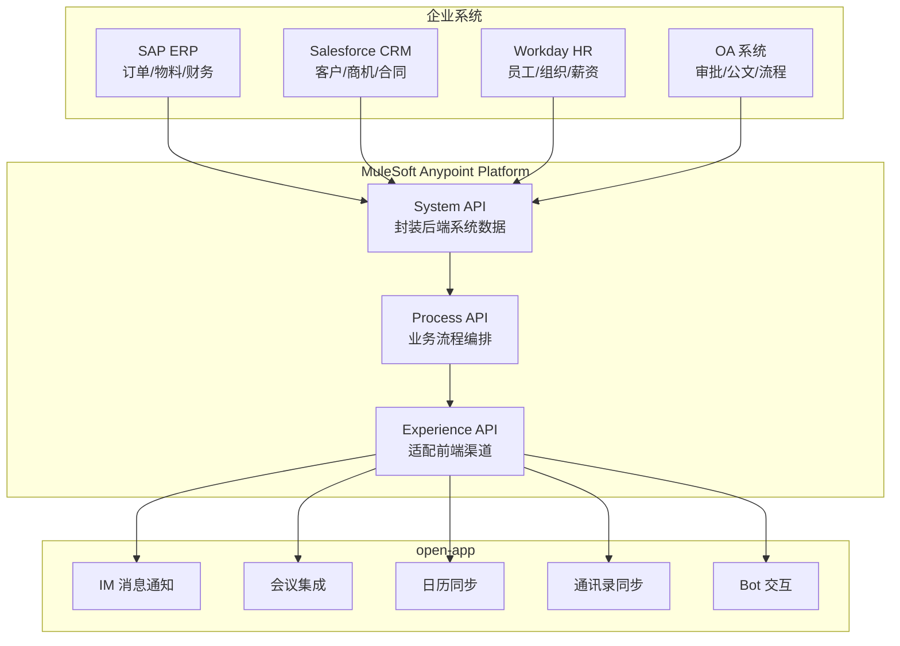
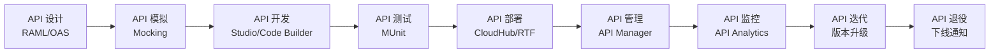
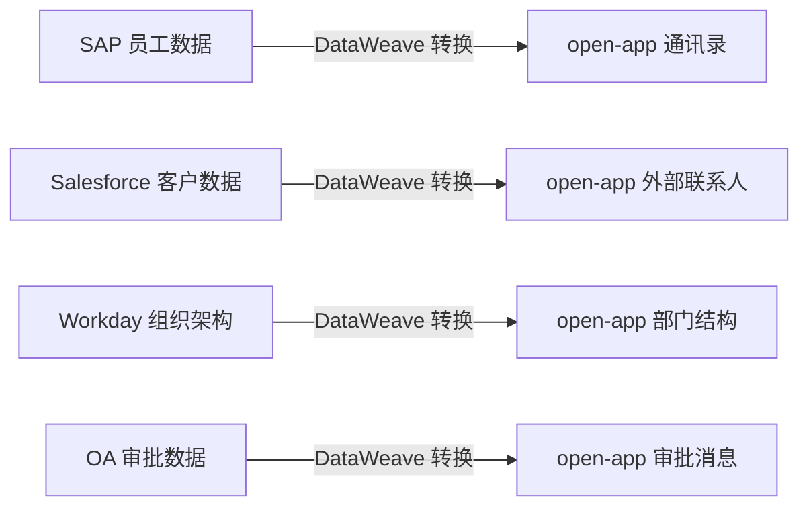
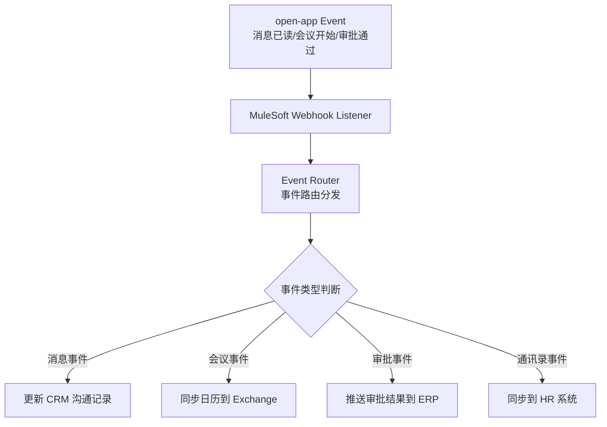
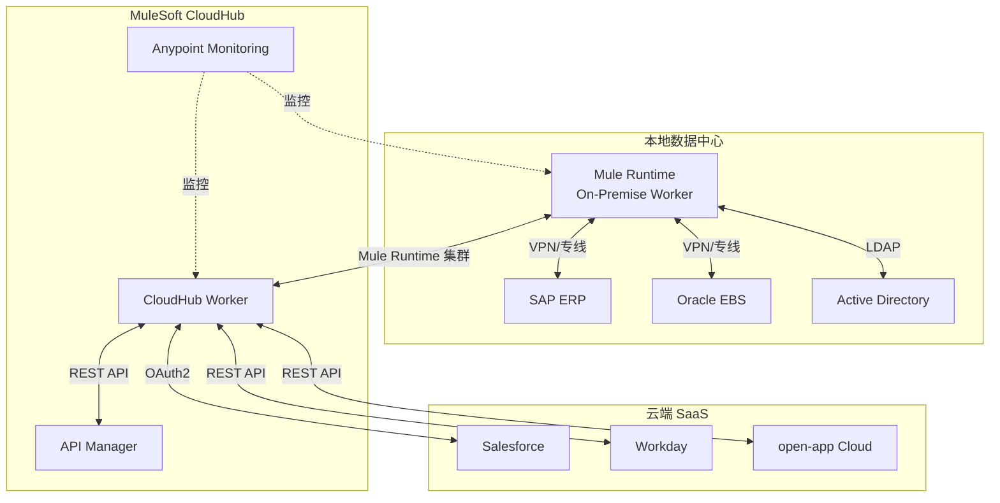
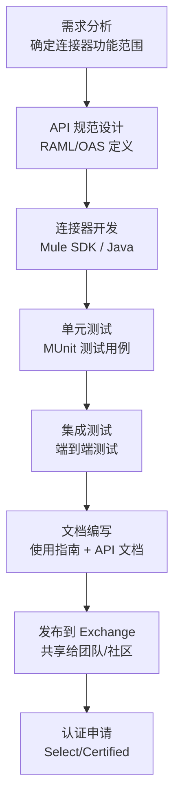
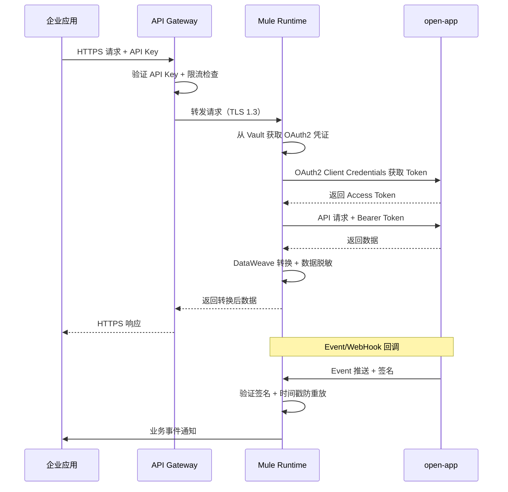

# MuleSoft 连接器平台调研报告

## 一、平台概述

### 1.1 平台简介

MuleSoft 是全球领先的企业集成平台（iPaaS）提供商，由 Ross Mason 和 Dave Rosenberg 于 2006 年创立，总部位于美国旧金山。2018 年，Salesforce 以 65 亿美元收购 MuleSoft，成为 Salesforce 历史上最大规模的收购之一，也是企业集成领域最具标志性的并购事件。MuleSoft 的核心产品 **Anypoint Platform** 是业界首个统一集成与 API 管理的一体化平台，提供从 API 设计、开发、管理到部署的全生命周期支持。

目前，MuleSoft 拥有超过 3000 个预构建连接器（Anypoint Connectors），覆盖 Salesforce、SAP、Oracle、ServiceNow、Workday、AWS、Azure 等主流企业系统和云服务。Anypoint Exchange 作为连接器和模板的共享市场，汇聚了全球开发者贡献的集成资产。MuleSoft 服务于全球超过 1600 家企业客户，包括财富 500 强中的多数企业，是企业级 iPaaS 市场的领导者。

### 1.2 平台定位

- **企业 iPaaS 领导者**：提供云端一体化集成平台，连接 SaaS、SaaS-to-On-Premise、云到云等多种集成场景
- **API 驱动连接（API-led Connectivity）**：倡导通过 System API、Process API、Experience API 三层架构实现企业能力的可复用、可治理连接
- **API 管理与集成一体化**：业界唯一将 API 全生命周期管理与集成能力统一在同一平台的产品
- **混合云集成**：支持 CloudHub（云端）、Runtime Fabric（容器化）、On-Premise（本地化）等多种部署模式
- **企业数字化转型赋能者**：通过 Composable API 架构帮助企业构建可组合的业务能力

### 1.3 核心价值主张

| 价值维度 | 描述 |
|---------|------|
| **连接一切** | 3000+ 预构建连接器，覆盖主流企业应用和云服务，消除集成孤岛 |
| **API 驱动** | API-led Connectivity 方法论，实现企业能力的标准化暴露与复用 |
| **全生命周期管理** | 从 API 设计、开发、部署、管理到监控的一体化平台 |
| **混合部署** | 云端、本地、容器化灵活部署，满足不同安全合规要求 |
| **可组合性** | 基于 API 的可组合架构，支持业务能力的快速编排与重组 |
| **治理与安全** | 统一的 API 治理策略、安全策略、流量管控，保障企业合规 |

---

## 二、核心能力体系

### 2.1 连接器能力矩阵

#### 2.1.1 企业应用连接器

| 连接器 | 功能描述 | 典型场景 |
|--------|---------|---------|
| **Salesforce Connector** | CRUD 操作、批量 API、Streaming API、Platform Event | Salesforce 与 ERP/CRM 数据同步 |
| **SAP Connector** | BAPI/RFC 调用、IDoc 处理、SAP OData | SAP 订单、物料、财务数据集成 |
| **Oracle EBS Connector** | Oracle PL/SQL 调用、Concurrent Program、FND API | Oracle EBS 业务流程集成 |
| **ServiceNow Connector** | Incident/Change/Problem 管理、CMDB 同步 | ITSM 流程自动化 |
| **Workday Connector** | 员工/组织数据、薪资核算、报表数据获取 | HR 数据同步与组织架构集成 |
| **NetSuite Connector** | 交易记录、库存管理、财务报表 | NetSuite ERP 数据集成 |
| **Dynamics 365 Connector** | CRM/ERP 实体操作、Webhook 订阅 | 微软生态业务数据集成 |
| **SAP Concur Connector** | 费用报告、出差请求、发票处理 | 差旅费用管理集成 |

#### 2.1.2 数据库与存储连接器

| 连接器 | 功能描述 | 典型场景 |
|--------|---------|---------|
| **Database Connector** | MySQL、PostgreSQL、Oracle、SQL Server 通用 JDBC | 关系型数据库读写操作 |
| **MongoDB Connector** | 文档 CRUD、聚合管道、Change Stream | NoSQL 文档数据集成 |
| **Redis Connector** | Key-Value 操作、Pub/Sub、缓存管理 | 缓存集成与实时数据推送 |
| **Elasticsearch Connector** | 索引管理、搜索查询、聚合分析 | 全文搜索与日志分析集成 |
| **Snowflake Connector** | 数据仓库读写、批量加载、SQL 查询 | 云数据仓库集成 |
| **S3 Connector** | 文件上传/下载、Bucket 管理、事件通知 | 对象存储与文件集成 |
| **File Connector** | 本地/远程文件读写、FTP/SFTP 传输 | 文件传输与批处理 |

#### 2.1.3 消息与事件连接器

| 连接器 | 功能描述 | 典型场景 |
|--------|---------|---------|
| **Kafka Connector** | 生产/消费消息、Topic 管理、Consumer Group | 事件流处理与异步消息集成 |
| **RabbitMQ Connector** | 队列收发、Exchange 路由、消息确认 | 消息队列与异步任务处理 |
| **JMS Connector** | Queue/Topic 收发、事务消息、消息选择器 | Java 消息服务集成 |
| **AMQP Connector** | AMQP 0-9-1/1.0 协议、消息路由 | 跨平台消息互通 |
| **AWS SQS/SNS Connector** | 队列消息、主题发布/订阅 | AWS 消息服务集成 |
| **Event Bridge Connector** | 事件总线、规则匹配、目标路由 | AWS 事件驱动架构 |
| **Slack Connector** | 消息发送、频道管理、事件订阅 | 团队协作通知集成 |
| **Email Connector** | SMTP 发送、IMAP/POP3 接收、模板渲染 | 邮件通知与处理 |

#### 2.1.4 协议与通用连接器

| 连接器 | 功能描述 | 典型场景 |
|--------|---------|---------|
| **HTTP Connector** | HTTP/HTTPS 请求、REST API 调用、Webhook 接收 | 通用 HTTP/API 集成 |
| **Web Service Consumer** | SOAP/WSDL 消费、WS-Security | 传统 Web Service 集成 |
| **GraphQL Connector** | Query/Mutation/Subscription 操作 | GraphQL API 集成 |
| **gRPC Connector** | Protobuf 序列化、流式通信 | 高性能微服务间通信 |
| **SFTP Connector** | 文件传输、目录监控、自动拉取 | 安全文件传输 |
| **Socket Connector** | TCP/UDP 通信、自定义协议 | 底层网络协议集成 |
| **VM Connector** | Mule 应用内部异步通信 | Flow 间消息传递 |
### 2.2 开发模式

#### 2.2.1 Anypoint Studio

Anypoint Studio 是 MuleSoft 的主力集成开发环境（IDE），基于 Eclipse 平台构建，提供可视化的拖拽式集成开发体验。

**特点**：
- 基于 Eclipse RCP，支持 Windows、macOS、Linux
- 可视化 Flow 设计器，拖拽组件构建集成流程
- 内置 Mule Runtime，支持本地调试和热部署
- 集成 DataWeave 数据转换编辑器
- 支持 MUnit 单元测试和集成测试
- 内置 Git 版本管理
- 丰富的组件面板：Connector、Transformer、Scope、Router

**技术栈**：
- IDE：Eclipse-based
- Runtime：Mule Runtime 4.x
- 数据转换：DataWeave 2.0
- 测试框架：MUnit 2.x
- 构建工具：Maven

**代码示例 — HTTP 请求处理 Flow**：

```xml
<?xml version="1.0" encoding="UTF-8"?>
<mule xmlns:http="http://www.mulesoft.org/schema/mule/http"
      xmlns:ee="http://www.mulesoft.org/schema/mule/ee/core"
      xmlns="http://www.mulesoft.org/schema/mule/core">
    
    <http:listener-config name="HTTP_Listener_config">
        <http:listener-connection host="0.0.0.0" port="8081"/>
    </http:listener-config>
    
    <http:request-config name="HTTP_Request_config">
        <http:request-connection host="api.example.com" port="443" protocol="HTTPS"/>
    </http:request-config>
    
    <flow name="getUserFlow">
        <http:listener config-ref="HTTP_Listener_config" path="/api/users/{userId}"/>
        <set-variable variableName="userId" value="#[attributes.uriParams.userId]"/>
        <http:request config-ref="HTTP_Request_config" 
                      path="/users/{userId}" method="GET">
            <http:uri-params>
                #[{'userId': vars.userId}]
            </http:uri-params>
        </http:request>
        <ee:transform>
            <ee:message>
                <ee:set-payload><![CDATA[
                    %dw 2.0
                    output application/json
                    ---
                    {
                        id: payload.id,
                        name: payload.name,
                        email: payload.email,
                        department: payload.dept_name
                    }
                ]]></ee:set-payload>
            </ee:message>
        </ee:transform>
    </flow>
</mule>
```

#### 2.2.2 Anypoint Code Builder

Anypoint Code Builder 是 MuleSoft 推出的新一代云端 IDE，基于 VS Code 构建，提供更现代化的开发体验。

**特点**：
- 基于 VS Code，开发体验更现代化
- 支持云端（Cloud IDE）和本地桌面两种使用模式
- 内置 AI 辅助编码（MuleSoft AI Chain）
- 支持可视化 Flow 编辑器和代码编辑器双模式切换
- 轻量级启动，资源占用更低
- 原生支持 Git 和 CI/CD
- 扩展生态丰富，支持 VS Code 插件

**与 Anypoint Studio 对比**：

| 维度 | Anypoint Studio | Anypoint Code Builder |
|------|----------------|----------------------|
| **基础平台** | Eclipse | VS Code |
| **运行模式** | 本地桌面 | 云端 + 本地桌面 |
| **启动速度** | 较慢 | 快速 |
| **AI 辅助** | 无 | 内置 AI 编码助手 |
| **可视化设计** | 成熟稳定 | 持续迭代中 |
| **插件生态** | Eclipse 插件 | VS Code 插件 |
| **推荐场景** | 复杂企业项目 | 新项目与轻量级集成 |

#### 2.2.3 Mule SDK

Mule SDK 是 MuleSoft 提供的 Java 开发工具包，用于开发自定义连接器（Custom Connector），当预构建连接器无法满足需求时，开发者可通过 Mule SDK 扩展平台能力。

**特点**：
- 基于 Java 注解驱动开发，声明式编程模型
- 支持 @Extension、@Operations、@Parameter 等注解
- 自动生成连接器元数据和文档
- 支持连接管理（Connection Management）、轮询源（Polling Source）、消息源（Message Source）
- 内置 OAuth2、Basic Auth、API Key 等认证框架
- 与 Anypoint Studio/Code Builder 无缝集成

**代码示例 — 自定义连接器核心结构**：

```java
@Extension(name = "Open App", category = "COMMUNITY")
@Xml(prefix = "open-app")
public class OpenAppExtension {

    @Configuration
    @DisplayName("Open App Configuration")
    public static class OpenAppConfiguration {

        @Parameter
        @DisplayName("Base URL")
        @Summary("Open App API base URL")
        private String baseUrl;

        @Parameter
        @DisplayName("Client ID")
        @Summary("OAuth2 Client ID")
        private String clientId;

        @Parameter
        @DisplayName("Client Secret")
        @Passwords
        private String clientSecret;

        @ConnectionProviders(OAuth2AuthorizationCodeProvider.class)
        public OAuth2AuthorizationCodeProvider getConnectionProvider() {
            return new OAuth2AuthorizationCodeProvider(
                baseUrl + "/oauth2/authorize",
                baseUrl + "/oauth2/token",
                clientId, clientSecret
            );
        }

        // Getters and Setters omitted
    }

    @Operations
    public static class OpenAppOperations {

        @MediaType(value = MediaType.APPLICATION_JSON)
        @DisplayName("Send Message")
        public String sendMessage(
                @Connection OpenAppConnection connection,
                @DisplayName("User ID") String userId,
                @DisplayName("Message Content") String content,
                @DisplayName("Message Type") @DefaultValue("text") String msgType) {
            
            return connection.getHttpClient()
                .post("/api/v1/im/messages")
                .header("Authorization", "Bearer " + connection.getAccessToken())
                .body(Map.of("user_id", userId, "msg_type", msgType, "content", content))
                .execute()
                .getBody();
        }

        @MediaType(value = MediaType.APPLICATION_JSON)
        @DisplayName("Get User Info")
        public String getUserInfo(
                @Connection OpenAppConnection connection,
                @DisplayName("User ID") String userId) {
            
            return connection.getHttpClient()
                .get("/api/v1/contacts/users/" + userId)
                .header("Authorization", "Bearer " + connection.getAccessToken())
                .execute()
                .getBody();
        }

        @MediaType(value = MediaType.APPLICATION_JSON)
        @DisplayName("Create Meeting")
        public String createMeeting(
                @Connection OpenAppConnection connection,
                @DisplayName("Topic") String topic,
                @DisplayName("Start Time") String startTime,
                @DisplayName("Duration") @DefaultValue("30") int duration,
                @DisplayName("Attendee IDs") List<String> attendeeIds) {
            
            Map<String, Object> body = new HashMap<>();
            body.put("topic", topic);
            body.put("start_time", startTime);
            body.put("duration", duration);
            
            return connection.getHttpClient()
                .post("/api/v1/meetings")
                .header("Authorization", "Bearer " + connection.getAccessToken())
                .body(body)
                .execute()
                .getBody();
        }
    }

    @Sources
    public static class OpenAppEventSource {

        @OnEvent
        @DisplayName("On Event Received")
        @Summary("Listen for Open App events via Webhook")
        public void onEvent(
                @Connection OpenAppConnection connection,
                @DisplayName("Event Types") List<String> eventTypes,
                SourceCallback callback) {
            connection.registerWebhook(eventTypes, event -> {
                callback.handle(Result.builder().output(event).build());
            });
        }
    }
}
```

#### 2.2.4 Anypoint Design Center

Anypoint Design Center 是 MuleSoft 的 API 设计中心，提供 API 优先（API-first）的设计能力。

**特点**：
- 支持 RAML（RESTful API Modeling Language）和 OAS（OpenAPI Specification）两种规范
- 可视化 API 设计器，拖拽式定义资源和方法
- 自动生成交互式 API 文档（API Console）
- 支持模拟服务（Mocking Service），前后端并行开发
- 与 Anypoint Exchange 集成，一键发布 API 资产
- API Fragment 机制，支持 API 设计片段复用

**RAML 设计示例**：

```yaml
#%RAML 1.0
title: Open App API
version: v1
baseUri: https://api.openapp.example.com/{version}
protocols: [HTTPS]
mediaType: application/json
securedBy: [oauth_2_0]

securitySchemes:
  oauth_2_0:
    type: OAuth 2.0
    settings:
      authorizationUri: https://api.openapp.example.com/oauth2/authorize
      accessTokenUri: https://api.openapp.example.com/oauth2/token
      authorizationGrants: [authorization_code, client_credentials]
      scopes: [im:read, im:write, meeting:read, meeting:write, contact:read]

types:
  Message:
    type: object
    properties:
      msg_id: string
      msg_type: string
      content: string
      sender: User
      create_time: datetime
  User:
    type: object
    properties:
      user_id: string
      name: string
      email: string
      department: string
      status: string

/im:
  /messages:
    get:
      description: 获取消息列表
      queryParameters:
        user_id:
          type: string
          required: true
        limit:
          type: integer
          default: 20
      responses:
        200:
          body:
            application/json:
              type: Message[]
    post:
      description: 发送消息
      securedBy: [oauth_2_0: {scopes: [im:write]}]
      body:
        application/json:
          properties:
            user_id: string
            msg_type: string
            content: string
      responses:
        201:
          body:
            application/json:
              type: Message

/meetings:
  post:
    description: 创建会议
    securedBy: [oauth_2_0: {scopes: [meeting:write]}]
    body:
      application/json:
        properties:
          topic: string
          start_time: datetime
          duration: integer
          attendee_ids: string[]
    responses:
      201:
        body:
          application/json:
            type: object
            properties:
              meeting_id: string
              meeting_url: string
```
### 2.3 集成能力

#### 2.3.1 API Manager

API Manager 是 MuleSoft 的 API 治理核心组件，提供 API 的发布、管理、监控和安全管控能力。

| 能力维度 | 功能描述 |
|---------|---------|
| **API 发布** | 通过 API Manager 将 API 发布到 Anypoint Exchange，供消费者发现和使用 |
| **流量管控** | 支持 SLA 层级（SLA Tiers）定义和限流策略，如 Gold/Silver/Bronze 不同 QPS 配额 |
| **安全策略** | 支持 OAuth2、API Key、JWT、Basic Auth、Client Certificate 等多种认证方式 |
| **API 代理** | 自动生成 API Proxy，无需修改后端即可添加治理策略 |
| **版本管理** | 支持 API 多版本共存和平滑升级 |
| **分析监控** | API 调用统计、响应时间分析、错误率监控、地理位置分析 |
| **契约管理** | API 契约（RAML/OAS）强制执行，确保 API 变更兼容性 |
| **开发者门户** | 自动生成开发者门户，提供 API 文档、沙箱、SDK 下载 |

#### 2.3.2 部署模式

| 部署模式 | 描述 | 适用场景 | 特点 |
|---------|------|---------|------|
| **CloudHub 2.0** | MuleSoft 托管的云端运行时 | 云原生应用、SaaS 集成 | 零运维、自动扩缩容、多区域部署 |
| **Runtime Fabric** | 容器化部署（K8s/Docker） | 混合云、私有云 | 灵活部署、资源隔离、支持 On-Premise K8s |
| **Anypoint Runtime** | 本地服务器部署 | 严格数据合规、低延迟 | 完全控制、支持传统数据中心 |
| **CloudHub 1.0** | 传统的云端运行时（旧版） | 遗留应用 | 兼容旧版 Mule 应用 |

#### 2.3.3 DataWeave 数据转换

DataWeave 是 MuleSoft 的核心数据转换语言，提供强大的数据映射和转换能力。

**核心能力**：
- 支持多种数据格式：JSON、XML、CSV、Flat File、Avro、Protobuf 等
- 声明式函数式编程模型
- 丰富的内置函数库：字符串处理、日期时间、数学运算、类型转换
- 支持自定义模块和函数
- 类型系统：支持强类型和动态类型
- 流式处理：支持大文件流式转换，避免 OOM

**DataWeave 代码示例**：

```dataweave
%dw 2.0
output application/json
---
{
  // 简单数据映射
  userId: payload.user_id,
  userName: payload.name,
  userEmail: lower(payload.email),
  
  // 条件映射
  userLevel: if (payload.score > 90) "VIP" 
             else if (payload.score > 60) "Normal" 
             else "Basic",
  
  // 数组映射与过滤
  departments: payload.depts filter ($.active == true) map {
    deptId: $.id,
    deptName: $.name,
    memberCount: sizeOf($.members)
  },
  
  // 日期格式转换
  createdAt: payload.created_at as DateTime 
             >> "UTC" 
             as String {format: "yyyy-MM-dd HH:mm:ss"},
  
  // 嵌套对象展平
  contactInfo: {
    phone: payload.contact.phone_number default "N/A",
    address: payload.contact.street ++ ", " ++ payload.contact.city
  }
}
```

**DataWeave 复杂转换示例 — ERP 数据到 open-app 格式**：

```dataweave
%dw 2.0
output application/json
---
{
  // 将 SAP 员工数据转换为 open-app 通讯录格式
  contacts: payload.EMPLOYEE_LIST map (employee) -> {
    user_id: employee.PERNR,
    name: employee.ENAME,
    email: employee.EMAIL default "",
    phone: employee.TELNR default "",
    department: employee.ORGEH,
    position: employee.PLANS,
    status: if (employee.STATUS == "A") "active" else "inactive",
    join_date: employee.BEGDA as Date as String {format: "yyyy-MM-dd"}
  },
  
  // 将 SAP 组织架构转换为 open-app 部门格式
  departments: payload.ORG_LIST groupBy $.OBJID mapObject (value, key) -> {
    (key): {
      dept_id: key,
      dept_name: value[0].STEXT,
      parent_id: value[0].UP_OBJID default null,
      members: value map ((item) -> item.PERNR) filter ($ != null)
    }
  }
}
```

#### 2.3.4 事件驱动架构

MuleSoft 支持丰富的事件驱动集成模式，与 open-app 的事件推送能力天然契合。

| 事件模式 | 描述 | open-app 对应 |
|---------|------|--------------|
| **Polling Source** | 定时轮询外部系统获取变更数据 | 对接 open-app API 定期同步 |
| **Webhook Listener** | 监听 HTTP Webhook 事件推送 | 接收 open-app Event/WebHook |
| **Streaming** | 监听数据流（如 Kafka、CDC） | 对接 open-app Event Stream |
| **JMS/AMQP** | 消息队列消费 | 异步处理 open-app 事件 |
| **Scheduler** | 定时任务触发 | 定期同步 open-app 数据 |

### 2.4 连接器发布机制

#### 2.4.1 Anypoint Exchange

Anypoint Exchange 是 MuleSoft 的集成资产共享市场，用于发布、发现和共享连接器、API 规范、模板等集成资产。

| 资产类型 | 描述 | 示例 |
|---------|------|------|
| **Connector** | 预构建连接器 | Salesforce Connector、SAP Connector |
| **API Spec** | API 规范文件（RAML/OAS） | Open App API RAML |
| **Template** | 集成流程模板 | Salesforce-to-SAP 同步模板 |
| **Example** | 示例应用 | DataWeave 转换示例 |
| **Custom Connector** | 自定义连接器 | Open App Connector |
| **Policy** | API 治理策略 | 限流策略、CORS 策略 |

#### 2.4.2 连接器认证体系

| 认证级别 | 描述 | 审核要求 |
|---------|------|---------|
| **Community** | 社区贡献，无官方认证 | 基本功能测试 |
| **Select** | MuleSoft 选型认证 | 功能测试 + 文档审查 + 安全审查 |
| **Certified** | MuleSoft 官方认证 | 全面功能测试 + 安全审计 + 性能测试 + SLA 保障 |

---

## 三、应用场景分析

### 3.1 典型应用场景

#### 3.1.1 企业系统集成

**场景描述**：
将企业 ERP（SAP/Oracle）、CRM（Salesforce）、OA、HR 等核心业务系统与 open-app 通信平台集成，实现统一消息通知、业务流程联动、数据实时同步。

**集成方案**：



**关键能力**：
- System API 封装各后端系统接口，屏蔽系统差异
- Process API 实现跨系统业务流程编排
- Experience API 针对不同渠道适配数据格式
- open-app 提供消息通知、会议、日历等通信能力

**典型案例**：
- **销售机会通知**：Salesforce 新建商机 → MuleSoft 编排 → open-app IM 推送通知给销售团队
- **采购审批流程**：SAP 采购申请 → MuleSoft 流程编排 → open-app 审批消息 + 会议安排评审
- **员工入职联动**：Workday 新员工入职 → MuleSoft 同步 → open-app 创建账号 + 通讯录更新 + 欢迎消息

#### 3.1.2 API 生命周期管理

**场景描述**：
通过 Anypoint Platform 实现 open-app API 的全生命周期管理，从设计、开发、测试、发布到监控、退役的完整治理。

**API 生命周期阶段**：



**关键治理策略**：
- API 版本管理：v1/v2 共存，逐步迁移
- SLA 分级：Gold（1000 QPS）/ Silver（500 QPS）/ Bronze（100 QPS）
- 安全策略：OAuth2 + API Key 双重认证
- 限流策略：基于 SLA 层级的自动限流
- 契约管理：RAML/OAS 强制执行

#### 3.1.3 数据同步与转换

**场景描述**：
利用 DataWeave 实现企业系统与 open-app 之间的数据格式转换和双向同步。

**典型数据流**：



#### 3.1.4 事件驱动架构

**场景描述**：
利用 MuleSoft 的事件驱动能力，对接 open-app 的 Event 和 WebHook 推送，实现实时业务联动。

**事件处理流程**：



**open-app 事件订阅配置示例**：

```xml
<flow name="openAppEventListener">
    <http:listener config-ref="HTTP_Listener_config" path="/webhook/openapp"/>
    
    <!-- 验证 Webhook 签名 -->
    <set-variable variableName="signature" value="#[attributes.headers.'X-OpenApp-Signature']"/>
    <set-variable variableName="timestamp" value="#[attributes.headers.'X-OpenApp-Timestamp']"/>
    
    <!-- 事件路由 -->
    <choice>
        <when expression="#[payload.event_type == 'im.message.read']">
            <flow-ref name="handleMessageRead"/>
        </when>
        <when expression="#[payload.event_type == 'meeting.started']">
            <flow-ref name="handleMeetingStarted"/>
        </when>
        <when expression="#[payload.event_type == 'calendar.event.created']">
            <flow-ref name="handleCalendarEvent"/>
        </when>
        <when expression="#[payload.event_type == 'contact.user.created']">
            <flow-ref name="handleUserCreated"/>
        </when>
        <otherwise>
            <logger message="Unknown event type: #[payload.event_type]" level="WARN"/>
        </otherwise>
    </choice>
</flow>
```

#### 3.1.5 混合云集成

**场景描述**：
企业核心系统（ERP/HR）部署在本地数据中心，而协作工具和 SaaS 应用部署在云端，需要通过 MuleSoft 实现混合云集成。

**混合云架构**：



### 3.2 与 open-app 的集成场景

#### 3.2.1 open-app 四大开放模式与 MuleSoft 对接

| open-app 开放模式 | MuleSoft 对接方式 | 典型场景 |
|------------------|------------------|---------|
| **API（外部→内部）** | HTTP Connector + OAuth2 调用 open-app API | 查询用户、发送消息、创建会议 |
| **Event（内部→外部）** | Webhook Listener 接收 open-app 事件推送 | 消息已读回调、审批状态变更 |
| **WebHook/Callback（内部→外部）** | HTTP Endpoint 暴露回调地址 | 异步任务完成通知、数据同步回调 |
| **Bot（双向）** | API + Event 双向通信 | 智能问答、流程审批机器人 |

#### 3.2.2 open-app 各能力模块集成矩阵

| open-app 能力 | MuleSoft 连接器 | 集成方向 | 典型用例 |
|--------------|----------------|---------|---------|
| **IM 即时消息** | HTTP Connector | API + Event | 发送通知消息、接收消息事件 |
| **Meeting 会议** | HTTP Connector | API + Event | 创建会议、会议状态变更通知 |
| **CloudBox 云盘** | HTTP Connector + S3 Connector | API | 文件同步、云盘文件备份到 S3 |
| **Calendar 日历** | HTTP Connector | API + Event | 日程同步、会议邀请 |
| **Contact 通讯录** | HTTP Connector + DB Connector | API + Event | 组织架构同步、用户信息更新 |
| **Mail 邮件** | HTTP Connector + Email Connector | API | 邮件转发到 IM、邮件触发流程 |
| **Drive 网盘** | HTTP Connector + File Connector | API | 文件下载、批量导出 |
| **Bot 机器人** | HTTP Connector | API + Event | Bot 交互、自动应答 |
| **Status 状态** | HTTP Connector | Event | 状态变更通知、在线状态同步 |
| **Phone 电话** | HTTP Connector | API + Event | 电话呼叫触发、通话记录同步 |

---
## 四、开发指南

### 4.1 连接器开发流程



**详细步骤**：

1. **需求分析**
   - 明确连接器需要封装的 API 接口
   - 确定认证方式（OAuth2/Basic Auth/API Key）
   - 识别数据转换需求
   - 定义连接器操作（Operations）和事件源（Sources）

2. **API 规范设计**
   - 使用 RAML 或 OAS 定义 API 规范
   - 定义数据类型和错误响应
   - 设计 API Fragment 复用

3. **连接器开发**
   - 使用 Mule SDK 创建连接器项目
   - 实现 @Configuration、@Operations、@Sources
   - 实现连接管理和认证逻辑
   - 编写 DataWeave 数据转换

4. **单元测试**
   - 使用 MUnit 编写测试用例
   - Mock 外部依赖
   - 覆盖正常路径和异常路径

5. **集成测试**
   - 端到端测试完整集成流程
   - 使用 Sandbox 环境验证
   - 性能和压力测试

6. **文档编写**
   - 连接器使用指南
   - API 参考文档
   - 示例代码和教程

7. **发布与认证**
   - 发布到 Anypoint Exchange
   - 申请 Select 或 Certified 认证
   - 持续维护和版本更新

### 4.2 Mule SDK 开发

**Maven 项目结构**：

```
open-app-connector/
├── src/
│   ├── main/
│   │   ├── java/
│   │   │   └── com/openapp/connector/
│   │   │       ├── OpenAppExtension.java
│   │   │       ├── OpenAppConfiguration.java
│   │   │       ├── OpenAppConnection.java
│   │   │       ├── operations/
│   │   │       │   ├── IMOperations.java
│   │   │       │   ├── MeetingOperations.java
│   │   │       │   ├── ContactOperations.java
│   │   │       │   ├── CalendarOperations.java
│   │   │       │   └── BotOperations.java
│   │   │       ├── sources/
│   │   │       │   └── OpenAppEventSource.java
│   │   │       └── internal/
│   │   │           ├── HttpClientWrapper.java
│   │   │           └── ConfigValidator.java
│   │   └── resources/
│   │       └── META-INF/
│   │           └── mule-extension.xml
│   └── test/
│       └── java/
│           └── com/openapp/connector/
│               ├── IMOperationsTest.java
│               ├── MeetingOperationsTest.java
│               └── ContactOperationsTest.java
├── pom.xml
└── README.md
```

**连接管理代码示例**：

```java
public class OpenAppConnection {

    private final String baseUrl;
    private final String accessToken;
    private final HttpClient httpClient;
    private final long tokenExpiryTime;

    public OpenAppConnection(String baseUrl, String clientId, 
                             String clientSecret, String username, String password) {
        this.baseUrl = baseUrl;
        TokenResponse tokenResponse = requestToken(clientId, clientSecret, username, password);
        this.accessToken = tokenResponse.getAccessToken();
        this.tokenExpiryTime = System.currentTimeMillis() + tokenResponse.getExpiresIn() * 1000;
        this.httpClient = HttpClient.newBuilder()
            .connectTimeout(Duration.ofSeconds(10))
            .build();
    }

    public String get(String path) throws IOException {
        ensureTokenValid();
        HttpRequest request = HttpRequest.newBuilder()
            .uri(URI.create(baseUrl + path))
            .header("Authorization", "Bearer " + accessToken)
            .header("Content-Type", "application/json")
            .GET()
            .build();
        HttpResponse<String> response = httpClient.send(request, 
            HttpResponse.BodyHandlers.ofString());
        if (response.statusCode() >= 400) {
            throw new IOException("API request failed: " + response.body());
        }
        return response.body();
    }

    public String post(String path, String body) throws IOException {
        ensureTokenValid();
        HttpRequest request = HttpRequest.newBuilder()
            .uri(URI.create(baseUrl + path))
            .header("Authorization", "Bearer " + accessToken)
            .header("Content-Type", "application/json")
            .POST(HttpRequest.BodyPublishers.ofString(body))
            .build();
        HttpResponse<String> response = httpClient.send(request, 
            HttpResponse.BodyHandlers.ofString());
        if (response.statusCode() >= 400) {
            throw new IOException("API request failed: " + response.body());
        }
        return response.body();
    }

    private void ensureTokenValid() {
        if (System.currentTimeMillis() >= tokenExpiryTime - 60000) {
            refreshToken();
        }
    }
}
```

**MUnit 测试代码示例**：

```java
@ExtensionsTestInfrastructure
public class IMOperationsTest {

    @RegisterExtension
    static MuleExtension MULE_EXTENSION = new MuleExtension();

    @Test
    public void testSendMessage() throws Exception {
        String userId = "user_001";
        String content = "Hello from MuleSoft!";
        String msgType = "text";

        Message result = IMOperations.sendMessage(
            getTestConnection(), userId, content, msgType);

        assertThat(result.getPayload().getValue(), is(notNullValue()));
        String response = (String) result.getPayload().getValue();
        assertThat(response, containsString("msg_id"));
    }

    @Test
    public void testSendMessageWithMarkdown() throws Exception {
        String userId = "user_001";
        String content = "**Important**: System maintenance tonight";
        String msgType = "markdown";

        Message result = IMOperations.sendMessage(
            getTestConnection(), userId, content, msgType);

        assertThat(result.getPayload().getValue(), is(notNullValue()));
    }

    private OpenAppConnection getTestConnection() {
        return new OpenAppConnection(
            "https://api-sandbox.openapp.example.com",
            "test_client_id", "test_client_secret",
            "test_user", "test_password");
    }
}
```

### 4.3 DataWeave 数据转换

#### 4.3.1 常用转换模式

**JSON 到 XML 转换**：

```dataweave
%dw 2.0
output application/xml
---
{
  root: {
    users: payload.users map (user) -> {
      user: {
        id: user.user_id,
        name: user.name,
        email: user.email,
        department: user.department
      }
    }
  }
}
```

**CSV 到 JSON 转换**：

```dataweave
%dw 2.0
output application/json
---
{
  employees: payload map (row) -> {
    employeeId: row[0],
    name: row[1],
    email: row[2],
    department: row[3],
    joinDate: row[4] as Date {format: "yyyy-MM-dd"}
  }
}
```

**open-app 消息格式适配**：

```dataweave
%dw 2.0
output application/json
---
{
  msg_type: "interactive",
  content: {
    config: {
      wide_screen_mode: true
    },
    header: {
      title: {
        tag: "plain_text",
        content: payload.notification_title
      },
      template: if (payload.priority == "high") "red" else "blue"
    },
    elements: [
      {
        tag: "div",
        text: {
          tag: "lark_md",
          content: "**Source**: " ++ payload.source ++ "\n" ++
                   "**Type**: " ++ payload.type ++ "\n" ++
                   "**Time**: " ++ (now() as String {format: "yyyy-MM-dd HH:mm:ss"})
        }
      },
      {
        tag: "action",
        actions: [
          {
            tag: "button",
            text: { tag: "plain_text", content: "View Details" },
            url: payload.detail_url,
            type: "primary"
          }
        ] when payload.detail_url? otherwise []
      }
    ]
  }
}
```

#### 4.3.2 自定义 DataWeave 模块

```dataweave
# File: modules/OpenAppFormat.dwl
%dw 2.0

fun formatNotification(source: String, type: String, title: String, 
                       content: String, url: String = "") = {
  msg_type: "interactive",
  card: {
    header: {
      title: title,
      template: if (type == "urgent") "red" 
                else if (type == "warning") "orange" 
                else "blue"
    },
    elements: [
      { tag: "div", text: content },
      {
        tag: "note",
        elements: [
          { tag: "plain_text", content: "Source: " ++ source },
          { tag: "plain_text", content: "Time: " ++ (now() as String {format: "HH:mm"}) }
        ]
      }
    ] + (
      if (url != "") [{
        tag: "action",
        actions: [{
          tag: "button",
          text: { tag: "plain_text", content: "View Details" },
          url: url,
          type: "primary"
        }]
      }] else []
    )
  }
}

fun mapSapStatus(sapStatus: String): String = 
  sapStatus match {
    "A" -> "active"
    "I" -> "inactive"
    "L" -> "on_leave"
    "D" -> "deleted"
    default -> "unknown"
  }
```

### 4.4 认证方式

MuleSoft 连接器支持多种认证机制，与 open-app 的 OAuth2 体系天然匹配。

| 认证方式 | 描述 | open-app 适用场景 | 配置复杂度 |
|---------|------|------------------|-----------|
| **OAuth 2.0 Authorization Code** | 授权码模式，用户交互授权 | 用户级别操作（发送消息、创建会议） | 中等 |
| **OAuth 2.0 Client Credentials** | 客户端凭证模式，应用级别授权 | 系统级别操作（通讯录同步、数据拉取） | 低 |
| **Basic Authentication** | 用户名/密码认证 | 简单场景、内部系统 | 低 |
| **API Key** | API 密钥认证 | 简单 API 访问、Webhook 验证 | 低 |
| **SAML** | SAML 断言认证 | 企业 SSO 集成 | 高 |
| **Kerberos** | Kerberos 票据认证 | Windows 域环境集成 | 高 |
| **JWT** | JSON Web Token | 微服务间认证、API 网关 | 中等 |
| **Mutual TLS** | 双向 TLS 证书认证 | 高安全场景、B2B 集成 | 高 |

**OAuth2 配置示例**：

```java
@ConnectionProviders
public class OpenAppOAuthProvider extends OAuth2AuthorizationCodeProvider {

    public OpenAppOAuthProvider(String baseUrl, String clientId, String clientSecret) {
        super(
            baseUrl + "/oauth2/authorize",
            baseUrl + "/oauth2/token",
            clientId,
            clientSecret,
            "im:read im:write meeting:read meeting:write contact:read",
            "openapp-connector"
        );
    }

    @Override
    protected void customizeTokenRequest(HttpRequestBuilder builder) {
        builder.header("Accept", "application/json");
    }

    @Override
    protected AccessTokenResponse parseTokenResponse(String response) {
        JSONObject json = new JSONObject(response);
        return AccessTokenResponse.builder()
            .accessToken(json.getString("access_token"))
            .refreshToken(json.optString("refresh_token", null))
            .expiresIn(json.optInt("expires_in", 7200))
            .tokenType(json.optString("token_type", "Bearer"))
            .build();
    }
}
```

### 4.5 最佳实践

#### 4.5.1 连接器设计最佳实践

| 最佳实践 | 描述 |
|---------|------|
| **API-led 方法论** | 严格遵循 System API → Process API → Experience API 三层架构 |
| **连接池管理** | 使用连接池复用 HTTP 连接，避免频繁创建销毁 |
| **Token 缓存** | 缓存 OAuth Token，避免频繁获取，注意刷新机制 |
| **重试策略** | 实现指数退避重试，处理临时性故障 |
| **幂等设计** | 关键操作设计为幂等，支持安全重试 |
| **错误分类** | 区分可重试错误和不可重试错误 |
| **批处理优化** | 大数据量使用批量接口，减少 API 调用次数 |
| **异步处理** | 耗时操作使用异步模式，避免超时 |
| **日志脱敏** | 日志中不记录敏感信息（Token、密码等） |

#### 4.5.2 性能优化

| 优化策略 | 描述 | 预期效果 |
|---------|------|---------|
| **连接复用** | 使用 HTTP Keep-Alive 和连接池 | 减少连接建立开销 50%+ |
| **批量接口** | 合并多个 API 调用为批量调用 | 减少网络往返 N 倍 |
| **数据缓存** | 缓存不常变更的数据（用户信息、组织架构） | 减少不必要的 API 调用 |
| **异步 Flow** | 非实时操作使用异步 Flow 处理 | 提高吞吐量 3-5 倍 |
| **DataWeave 优化** | 使用流式模式处理大数据 | 降低内存占用 80%+ |
| **VM Queue** | Flow 间使用 VM Connector 异步通信 | 提高系统解耦和可靠性 |
| **集群部署** | CloudHub 多 Worker 部署 | 线性扩展处理能力 |

#### 4.5.3 安全最佳实践

- **传输加密**：所有 API 调用使用 HTTPS
- **密钥管理**：使用 Anypoint Vault 或外部密钥管理器存储敏感配置
- **最小权限**：OAuth Token 只申请必要的 Scope
- **IP 白名单**：配置 Mule Runtime 出口 IP 到 open-app 白名单
- **签名验证**：Webhook 回调验证签名，防止伪造请求
- **审计日志**：记录所有 API 调用和配置变更
- **数据脱敏**：日志和监控中脱敏处理个人信息

---
## 五、优势与劣势分析

### 5.1 核心优势

#### 5.1.1 企业级优势

| 优势维度 | 详细描述 |
|---------|---------|
| **Gartner 领导者** | 连续多年位居 Gartner iPaaS 魔力象限领导者象限 |
| **Salesforce 生态** | 深度整合 Salesforce 产品线，CRM/Service/Marketing Cloud 无缝集成 |
| **企业级可靠性** | 99.99% SLA 保障，多区域灾备，企业级运维支持 |
| **全球客户基础** | 1600+ 企业客户，覆盖金融、医疗、制造、零售等行业 |

#### 5.1.2 技术优势

| 优势维度 | 详细描述 |
|---------|---------|
| **API-led 方法论** | 成熟的 System/Process/Experience API 三层架构方法论 |
| **一体化平台** | API 设计 + 开发 + 管理 + 集成 + 监控统一平台 |
| **DataWeave** | 强大的数据转换语言，支持 20+ 数据格式 |
| **3000+ 连接器** | 丰富的预构建连接器库，覆盖主流企业系统 |
| **混合部署** | CloudHub + RTF + On-Premise 灵活部署 |
| **Mule SDK** | 标准化的自定义连接器开发框架 |

#### 5.1.3 治理优势

| 优势维度 | 详细描述 |
|---------|---------|
| **API 全生命周期** | 从设计到退役的完整 API 治理 |
| **SLA 管理** | 分级 SLA 策略，自动限流和配额管理 |
| **安全治理** | 统一的安全策略，支持多种认证和加密方式 |
| **可视化监控** | 实时 API 分析、告警和故障排查 |
| **契约管理** | API 契约强制执行，确保变更兼容性 |

### 5.2 潜在劣势

#### 5.2.1 成本劣势

| 劣势维度 | 详细描述 |
|---------|---------|
| **许可证昂贵** | 企业版年费 25-50 万美元起，大规模部署成本更高 |
| **按量计费** | CloudHub 按 vCore 计费，高并发场景费用显著增加 |
| **培训成本** | MuleSoft 认证培训费用高（MCD 考试约 $375/次） |
| **咨询依赖** | 复杂集成项目往往需要 MuleSoft 咨询服务，费用高昂 |

#### 5.2.2 技术劣势

| 劣势维度 | 详细描述 |
|---------|---------|
| **学习曲线陡峭** | DataWeave、Mule Runtime、API Manager 等概念繁多，上手周期长 |
| **开发效率** | 简单集成场景下，XML 配置和 Flow 设计比直接编码更繁琐 |
| **调试困难** | 可视化 Flow 的调试和排错比纯代码项目更复杂 |
| **性能开销** | Mule Runtime 框架层引入额外性能开销，轻量场景不够高效 |
| **版本兼容** | Mule 3.x 到 4.x 迁移成本高，不向后兼容 |

#### 5.2.3 生态劣势

| 劣势维度 | 详细描述 |
|---------|---------|
| **中国本地化** | 在中国大陆无数据中心，合规和数据主权存在挑战 |
| **社区生态** | 相比开源方案（Apache Camel、Kafka），社区规模较小 |
| **国产化适配** | 对国产化系统（信创）支持有限 |
| **中小企业** | 定价策略偏向大型企业，中小企业难以负担 |
| **供应商锁定** | 深度依赖 MuleSoft 生态，迁移成本高 |

---

## 六、成本分析

### 6.1 定价方案

MuleSoft 采用分层定价（Tiered Pricing）模式，根据功能模块和使用量收费：

| 套餐 | 年费范围 | 包含能力 | 适用场景 |
|------|---------|---------|---------|
| **Gold** | 约 $250,000/年 | Anypoint Platform 基础版 + CloudHub + API Manager（基础） | 中型企业集成项目 |
| **Platinum** | 约 $350,000/年 | Gold 全部 + 高级 API Manager + Data Graph + 高级分析 | 大型企业复杂集成 |
| **Titanium** | 定制报价 | Platinum 全部 + 无限连接器 + 专属支持 + 培训 | 超大型企业/全球化企业 |
| **Enterprise** | 定制报价 | Titanium 全部 + 私有化部署 + 专属客户成功经理 | 金融/政府等特殊行业 |

**详细计费维度**：

| 计费项 | 说明 | 预估费用 |
|--------|------|---------|
| **vCore 许可** | CloudHub Runtime 按虚拟核心计费 | $3,000-5,000/vCore/年 |
| **API 调用量** | API Manager 按 API 调用量计费 | 阶梯计费，量大优惠 |
| **连接器许可** | Premium 连接器额外收费 | $10,000-50,000/连接器/年 |
| **Runtime Fabric** | RTF 按节点数计费 | $5,000-10,000/节点/年 |
| **技术支持** | 标准版/高级版/专属版 | $50,000-200,000/年 |

### 6.2 开发成本

| 成本项 | 说明 | 预估费用 |
|--------|------|---------|
| **人力成本** | MuleSoft 开发人员薪资（较一般 Java 开发高 20-30%） | $120,000-180,000/人/年 |
| **培训成本** | MuleSoft 开发者认证培训 | $3,000-5,000/人 |
| **认证考试** | MCD - Integration / API 设计 | $375/次/人 |
| **开发工具** | Anypoint Studio 免费下载，Code Builder 需付费 | $0-500/人/年 |
| **测试环境** | Sandbox 环境 | 包含在许可中 |

### 6.3 运营成本

| 成本项 | 说明 | 年费预估 |
|--------|------|---------|
| **CloudHub 运行时** | 按 vCore 计费，4 vCore 起步 | $12,000-20,000/vCore |
| **API Manager** | API 代理 + SLA 管理 + 安全策略 | 包含在套餐中 |
| **监控告警** | Anypoint Monitoring + 自定义告警 | 包含在套餐中 |
| **数据库** | CloudHub 内置 Object Store | 包含在套餐中 |
| **网络带宽** | CloudHub 内含带宽，超出额外计费 | $0.05-0.10/GB |
| **运维人员** | MuleSoft 运维工程师 | $100,000-150,000/人/年 |
| **持续优化** | 性能优化、版本升级、安全补丁 | 持续投入 |

### 6.4 与 open-app 集成专项成本估算

| 项目 | 说明 | 费用估算 |
|------|------|---------|
| **open-app Connector 开发** | 基于 Mule SDK 开发自定义连接器 | 2-3 人月（约 $40,000-60,000） |
| **集成 Flow 开发** | IM/Meeting/Contact 等核心集成流程 | 3-4 人月（约 $60,000-80,000） |
| **DataWeave 转换** | ERP/CRM 到 open-app 数据格式映射 | 1-2 人月（约 $20,000-40,000） |
| **API 治理配置** | API Manager + SLA + 安全策略 | 1 人月（约 $20,000） |
| **测试与上线** | 单元测试 + 集成测试 + 性能测试 | 2 人月（约 $40,000） |
| **总计** | open-app MuleSoft 集成初始投入 | 约 $180,000-240,000 |

---
## 七、技术架构建议

### 7.1 open-app MuleSoft Connector 架构设计

```
┌─────────────────────────────────────────────────────────────────┐
│                     企业业务系统                                  │
│  ┌──────┐ ┌───────────┐ ┌─────────┐ ┌──────────┐ ┌───────┐   │
│  │SAP   │ │Salesforce │ │Workday  │ │Oracle    │ │OA/BPM │   │
│  │ERP   │ │CRM        │ │HR       │ │EBS       │ │       │   │
│  └──┬───┘ └─────┬─────┘ └────┬────┘ └────┬─────┘ └───┬───┘   │
└─────┼───────────┼────────────┼───────────┼───────────┼────────┘
      │           │            │           │           │
      ▼           ▼            ▼           ▼           ▼
┌─────────────────────────────────────────────────────────────────┐
│                   System API 层                                  │
│  ┌──────────┐ ┌──────────────┐ ┌────────────┐ ┌────────────┐  │
│  │SAP System│ │Salesforce    │ │Workday     │ │Oracle      │  │
│  │API       │ │System API    │ │System API  │ │System API  │  │
│  └────┬─────┘ └──────┬───────┘ └─────┬──────┘ └─────┬──────┘  │
└───────┼──────────────┼───────────────┼──────────────┼─────────┘
        │              │               │              │
        ▼              ▼               ▼              ▼
┌─────────────────────────────────────────────────────────────────┐
│                   Process API 层                                 │
│  ┌──────────┐ ┌──────────────┐ ┌────────────┐ ┌────────────┐  │
│  │员工入职  │ │销售商机通知  │ │采购审批    │ │组织架构    │  │
│  │流程 API  │ │流程 API      │ │流程 API    │ │同步 API    │  │
│  └────┬─────┘ └──────┬───────┘ └─────┬──────┘ └─────┬──────┘  │
└───────┼──────────────┼───────────────┼──────────────┼─────────┘
        │              │               │              │
        ▼              ▼               ▼              ▼
┌─────────────────────────────────────────────────────────────────┐
│                   Experience API 层                              │
│  ┌──────────┐ ┌──────────────┐ ┌────────────┐ ┌────────────┐  │
│  │IM 通知   │ │会议集成 API  │ │日历同步 API│ │通讯录 API  │  │
│  │API       │ │              │ │            │ │            │  │
│  └────┬─────┘ └──────┬───────┘ └─────┬──────┘ └─────┬──────┘  │
└───────┼──────────────┼───────────────┼──────────────┼─────────┘
        │              │               │              │
        ▼              ▼               ▼              ▼
┌─────────────────────────────────────────────────────────────────┐
│                   open-app Connector                             │
│  ┌──────────┐ ┌──────────┐ ┌──────────┐ ┌──────────┐ ┌──────┐│
│  │IM Ops    │ │Meeting   │ │Contact   │ │Calendar  │ │Bot   ││
│  │          │ │Ops       │ │Ops       │ │Ops       │ │Ops   ││
│  └────┬─────┘ └────┬─────┘ └────┬─────┘ └────┬─────┘ └──┬───┘│
│       │             │            │             │          │    │
│  ┌────┴─────────────┴────────────┴─────────────┴──────────┴──┐│
│  │              Event Source (Webhook Listener)                ││
│  └──────────────────────────┬────────────────────────────────┘│
└─────────────────────────────┼──────────────────────────────────┘
                              │
        ┌─────────────────────┼─────────────────────┐
        │                     │                     │
        ▼                     ▼                     ▼
┌──────────────┐    ┌──────────────┐    ┌──────────────┐
│ IM 消息      │    │ Meeting 会议 │    │ Calendar 日历│
│ (API+Event)  │    │ (API+Event)  │    │ (API+Event)  │
└──────────────┘    └──────────────┘    └──────────────┘
┌──────────────┐    ┌──────────────┐    ┌──────────────┐
│ Contact 通讯录│   │ Bot 机器人   │    │ Event 事件   │
│ (API+Event)  │    │ (API+Event)  │    │ (WebHook)    │
└──────────────┘    └──────────────┘    └──────────────┘
              open-app 平台
```

### 7.2 关键技术选型

| 技术维度 | 推荐方案 | 说明 |
|---------|---------|------|
| **连接器开发** | Mule SDK + Java 11+ | 标准化开发，注解驱动 |
| **数据转换** | DataWeave 2.0 | 声明式转换，多格式支持 |
| **认证方式** | OAuth2 Client Credentials | 系统级别集成，无需用户交互 |
| **部署模式** | CloudHub 2.0（优先）+ RTF（本地需求） | 云优先，本地按需 |
| **API 设计** | RAML 1.0 | MuleSoft 原生支持，工具链完善 |
| **API 管理** | API Manager + SLA Tiers | 流量管控和安全治理 |
| **消息队列** | Kafka / Anypoint MQ | 事件流处理和异步解耦 |
| **监控告警** | Anypoint Monitoring + Grafana | 统一监控和告警 |
| **CI/CD** | Anypoint CLI + Jenkins/GitHub Actions | 自动化部署流水线 |
| **密钥管理** | Anypoint Vault + HashiCorp Vault | 敏感配置加密存储 |

### 7.3 安全架构



**安全措施清单**：

| 安全层级 | 措施 | 说明 |
|---------|------|------|
| **网络层** | TLS 1.3 | 所有通信加密传输 |
| **网络层** | IP 白名单 | 限制 Mule Runtime 出口 IP |
| **网络层** | VPN/专线 | 本地系统与云端的安全通道 |
| **认证层** | OAuth2 | open-app API 认证 |
| **认证层** | Mutual TLS | 高安全场景双向证书认证 |
| **认证层** | SAML SSO | 企业统一身份认证 |
| **授权层** | Scope 控制 | 最小权限原则 |
| **授权层** | SLA Tiers | 分级流量管控 |
| **数据层** | 字段级加密 | 敏感字段加密存储和传输 |
| **数据层** | 数据脱敏 | 日志和监控中脱敏 |
| **数据层** | Anypoint Vault | 密钥和凭证安全存储 |
| **审计层** | 访问日志 | 记录所有 API 调用 |
| **审计层** | 变更审计 | 记录配置变更 |
| **审计层** | 合规报告 | 定期生成合规报告 |

---
## 八、实施路径建议

### 8.1 实施阶段规划

#### 第一阶段：技术预研与概念验证（4-6 周）

**主要工作**：
- MuleSoft 平台技术评估
- open-app Connector 原型开发
- 核心集成场景 PoC 验证
- 技术风险识别和应对

**交付物**：
- 技术评估报告
- PoC 演示系统
- 风险评估报告

#### 第二阶段：连接器开发与基础集成（8-12 周）

**主要工作**：
- open-app MuleSoft Connector 完整开发
- System API 层设计与实现
- 核心数据转换（DataWeave）开发
- 单元测试和集成测试

**交付物**：
- open-app Connector v1.0
- System API 接口定义
- 测试报告

#### 第三阶段：业务流程集成（8-10 周）

**主要工作**：
- Process API 层设计与实现
- 关键业务流程编排
- Experience API 层适配
- 事件驱动集成开发

**交付物**：
- Process API 接口定义
- 业务流程集成方案
- 端到端测试报告

#### 第四阶段：API 治理与生产部署（4-6 周）

**主要工作**：
- API Manager 策略配置
- 安全策略和访问控制
- 性能调优和压力测试
- 生产环境部署和灰度发布

**交付物**：
- API 治理策略文档
- 性能测试报告
- 生产部署文档

#### 第五阶段：运营与持续优化（持续）

**主要工作**：
- 监控告警体系建设
- 运维自动化
- 功能迭代优化
- 连接器版本升级

**交付物**：
- 运维手册
- 监控看板
- 优化路线图

### 8.2 团队配置建议

| 角色 | 人数 | 职责 | 技能要求 |
|------|------|------|---------|
| **项目架构师** | 1 | 整体架构设计、技术选型、API-led 方法论指导 | MuleSoft MCD 认证、企业集成经验 |
| **MuleSoft 开发** | 2-3 | 连接器开发、Flow 实现、DataWeave 转换 | Mule SDK、Java、DataWeave |
| **open-app 开发** | 1-2 | open-app API 对接、事件处理 | open-app API、OAuth2 |
| **API 设计师** | 1 | API 规范设计（RAML/OAS）、API 治理策略 | RAML、API 管理 |
| **测试工程师** | 1-2 | MUnit 测试、集成测试、性能测试 | MUnit、自动化测试 |
| **DevOps** | 1 | CI/CD 流水线、CloudHub 部署、监控 | Anypoint CLI、K8s、CI/CD |
| **项目经理** | 1 | 项目管理、进度把控、风险协调 | PMP、敏捷管理 |

### 8.3 风险控制

| 风险类型 | 风险描述 | 影响程度 | 应对措施 |
|---------|---------|---------|---------|
| **技术风险** | Mule SDK 版本升级导致连接器不兼容 | 高 | 遵循 MuleSoft 版本支持策略，预留迁移时间 |
| **成本风险** | vCore 用量超预期导致费用激增 | 高 | 提前做好容量规划，设置用量告警 |
| **安全风险** | open-app OAuth Token 泄露 | 高 | 使用 Vault 存储，定期轮换，最小权限 |
| **性能风险** | 大数据量同步性能瓶颈 | 中 | 使用批量接口、异步处理、流式 DataWeave |
| **合规风险** | 数据跨境传输合规 | 中 | 选择本地 RTF 部署，数据不出境 |
| **人才风险** | MuleSoft 开发人员招聘困难 | 中 | 提前储备人才，内部培训，引入外部顾问 |
| **集成风险** | open-app API 变更影响连接器 | 中 | API 契约管理，版本兼容策略 |
| **运维风险** | CloudHub 服务中断 | 低 | 多区域部署，自动故障转移 |

---

## 九、总结与建议

### 9.1 总结

MuleSoft 作为全球领先的企业 iPaaS 平台，具有以下核心特点：

**优势**：
- Gartner iPaaS 魔力象限连续多年领导者
- API-led Connectivity 方法论成熟，企业级治理完善
- 3000+ 连接器生态，覆盖主流企业系统
- DataWeave 数据转换能力强大
- Salesforce 生态深度整合
- 混合云部署灵活，支持合规需求

**劣势**：
- 许可证费用高昂（年费 25-50 万美元起）
- 学习曲线陡峭，专业人才稀缺
- 中国本地化不足，无大陆数据中心
- 供应商锁定风险高，迁移成本大
- 对国产化系统（信创）支持有限

**与 open-app 的契合度**：
- **高度契合**：open-app 的 API/Event/WebHook/Bot 四大开放模式与 MuleSoft 的 HTTP Connector/Webhook Listener/Event Source 天然匹配
- **数据转换**：DataWeave 可高效完成 ERP/CRM 数据到 open-app 格式的映射
- **事件驱动**：MuleSoft 的事件驱动架构与 open-app 的 Event 推送完美互补
- **API 治理**：API Manager 可为 open-app API 提供企业级治理和安全管控

### 9.2 建议

#### 9.2.1 平台选型建议

- **如果企业**：已使用 Salesforce 生态 + 需要集成多个企业系统 + 预算充足 → **推荐 MuleSoft**
- **如果企业**：预算有限 + 集成场景简单 + 有 Java 开发团队 → **推荐 Apache Camel / Spring Integration**
- **如果企业**：主要集成云原生应用 + 需要快速上手 → **推荐 Workato / Boomi**
- **如果企业**：国产化要求高 + 数据必须留在国内 → **建议评估国内 iPaaS 方案**

#### 9.2.2 实施建议

1. **先 PoC 后投入**：先进行 4-6 周概念验证，验证核心技术可行性和性能指标
2. **API-led 优先**：严格遵循 System/Process/Experience API 三层架构，避免绕过治理
3. **连接器标准化**：基于 Mule SDK 开发标准化的 open-app Connector，发布到 Exchange
4. **安全左移**：从设计阶段就考虑安全策略，OAuth2 + Vault + 数据脱敏
5. **渐进式集成**：从 IM 通知等简单场景入手，逐步扩展到完整业务流程集成

#### 9.2.3 长期规划建议

1. **open-app Connector 认证**：开发完成后申请 MuleSoft Select/Certified 认证，扩大影响力
2. **集成模板沉淀**：将常见集成场景沉淀为 Anypoint Exchange 模板，加速后续项目
3. **数据编织**：利用 MuleSoft Data Graph 构建统一数据图谱，实现跨系统数据联合查询
4. **Composable Business**：基于 API 构建可组合的业务能力，支持业务快速创新
5. **AI 增强**：结合 MuleSoft AI Chain 和 open-app Bot，实现智能集成和自动化

---

## 十、附录

### 10.1 相关资源

| 资源类型 | 链接 |
|---------|------|
| **Anypoint Platform** | https://anypoint.mulesoft.com |
| **MuleSoft 官网** | https://www.mulesoft.com |
| **开发文档** | https://docs.mulesoft.com |
| **Anypoint Exchange** | https://www.mulesoft.com/exchange |
| **Mule SDK 文档** | https://docs.mulesoft.com/mule-sdk/latest/ |
| **DataWeave 文档** | https://docs.mulesoft.com/mule-runtime/latest/dataweave |
| **API Manager 文档** | https://docs.mulesoft.com/api-manager/latest/ |
| **MUnit 文档** | https://docs.mulesoft.com/munit/latest/ |
| **MuleSoft 博客** | https://blogs.mulesoft.com |
| **MuleSoft 社区** | https://forums.mulesoft.com |
| **GitHub 示例** | https://github.com/mulesoft |

### 10.2 常见问题

**Q1: MuleSoft 的定价模式是什么？**
A: MuleSoft 采用分层定价模式，Gold 套餐约 $250,000/年，Platinum 套餐约 $350,000/年。CloudHub 运行时按 vCore 计费，API Manager 按 API 调用量计费。具体价格需要联系 MuleSoft 销售团队获取报价。

**Q2: 如何开发自定义连接器？**
A: 使用 Mule SDK（Java）开发自定义连接器。通过 @Extension、@Operations、@Sources 等注解声明连接器结构，支持自动生成元数据和文档。开发完成后可发布到 Anypoint Exchange 共享。

**Q3: MuleSoft 和 Apache Camel 有什么区别？**
A: MuleSoft 是商业 iPaaS 平台，提供可视化开发、API 管理、监控等企业级能力，但费用高昂。Apache Camel 是开源集成框架，灵活度高、免费，但缺乏可视化和企业级治理能力。

**Q4: CloudHub 和 Runtime Fabric 如何选择？**
A: CloudHub 适合云原生应用和 SaaS 集成，零运维、自动扩缩容。Runtime Fabric 适合混合云场景，可部署在私有云/本地 K8s 集群，满足数据合规要求。两者可以混合使用。

**Q5: DataWeave 支持哪些数据格式？**
A: DataWeave 支持 JSON、XML、CSV、Flat File、Avro、Protobuf、YAML、Excel 等 20+ 种数据格式，可在任意格式之间进行双向转换。

**Q6: open-app 如何与 MuleSoft 实现事件驱动集成？**
A: open-app 通过 Event/WebHook 向外部推送事件，MuleSoft 通过 HTTP Listener 接收 Webhook 回调，再通过 Event Router 分发到不同的处理 Flow。支持签名验证确保安全性。

**Q7: MuleSoft 在中国大陆能用吗？**
A: MuleSoft CloudHub 在中国大陆无数据中心，存在延迟和合规挑战。建议使用 Runtime Fabric 部署在国内云（阿里云/AWS 中国），或使用 VPN 专线连接。

**Q8: 开发 open-app MuleSoft Connector 需要多长时间？**
A: 核心连接器开发约 2-3 人月，包含 IM/Meeting/Contact/Calendar/Bot 等核心操作和 Event Source。完整的 MuleSoft 集成项目（含 API 层、治理、测试、部署）约 6-8 个月。

**Q9: 如何处理 MuleSoft 中的错误和重试？**
A: MuleSoft 提供多种错误处理机制：Try-Catch Scope 捕获异常、On-Error Continue 继续处理、On-Error Propagate 传播错误、Error Router 路由错误、重试策略（固定间隔/指数退避）。建议区分可重试错误和不可重试错误分别处理。

**Q10: MuleSoft 如何与 Salesforce 集成？**
A: MuleSoft 提供官方 Salesforce Connector，支持 CRUD、批量 API、Streaming API、Platform Event 等。作为 Salesforce 旗下产品，MuleSoft 与 Salesforce 的集成是最成熟和最深度的。

---

**报告编制时间**：2026年5月
**报告版本**：V1.0
