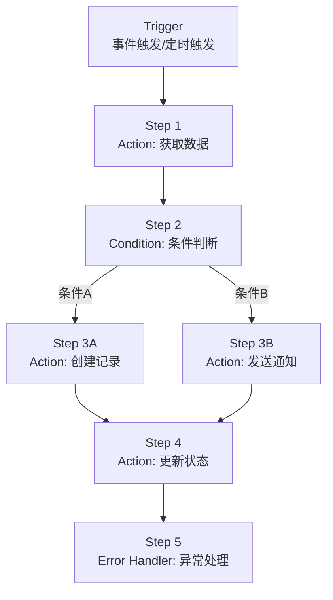
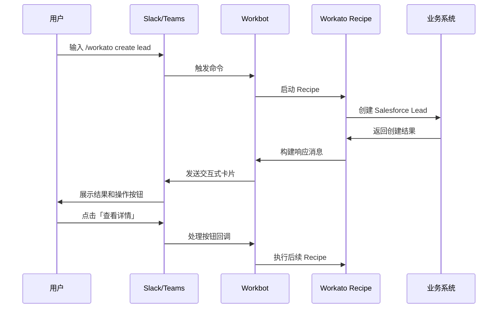
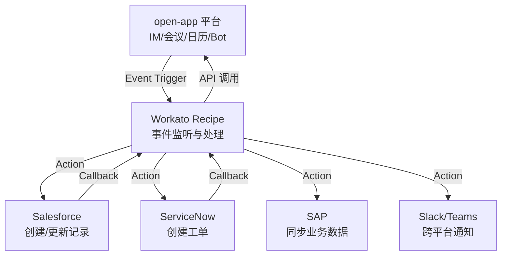
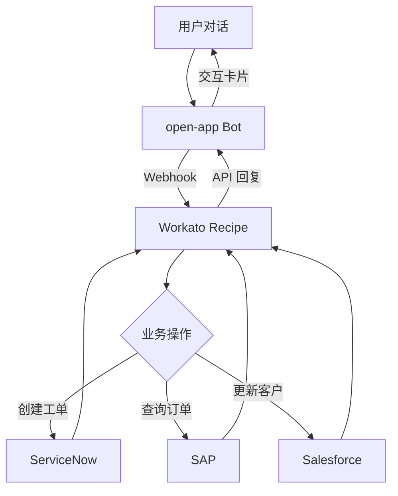
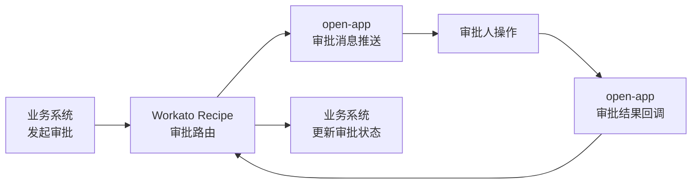
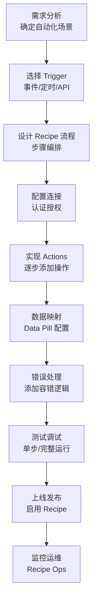
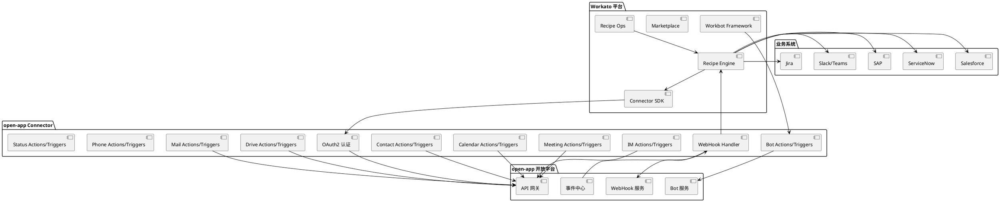
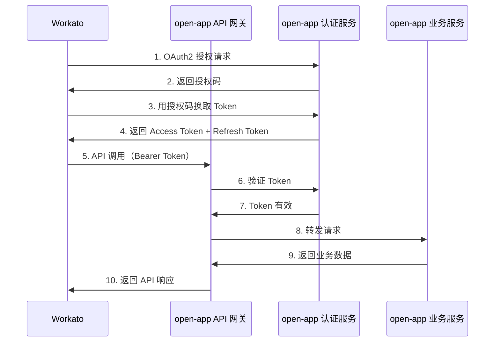

# Workato 连接器平台调研报告

## 一、平台概述

### 1.1 平台简介

Workato 是一家成立于 2013 年的企业级自动化与集成平台，总部位于美国加利福尼亚州山景城（Mountain View），由前 Oracle 和 IBM 工程师 Vijay Tella 创立。Workato 以"Recipe（配方）"为核心概念，将复杂的系统集成和业务流程自动化转化为可视化的、可复用的工作流配方，使业务人员和开发者无需编写大量代码即可实现跨应用的数据集成与流程自动化。截至目前，Workato 已拥有 1200+ 预构建连接器，覆盖 CRM、ERP、HR、ITSM、营销、通讯等几乎所有主流企业 SaaS 应用。2021 年，Workato 完成 E 轮融资，估值达 56 亿美元，成为企业 iPaaS（Integration Platform as a Service）领域的重要领导者，客户涵盖 Broadcom、Gap、Workday、Toast 等全球知名企业。

### 1.2 平台定位

- **企业 iPaaS 平台**：聚焦企业应用集成与数据互通，提供统一的连接与编排能力
- **工作流自动化平台**：以 Recipe 为核心，通过可视化步骤编排实现业务流程自动化
- **低代码集成平台**：业务用户可自行搭建集成流程，降低对专业开发者的依赖
- **企业治理平台**：提供企业级权限管理、审计日志、合规管控等治理能力

### 1.3 核心价值主张

| 价值维度 | 描述 |
|---------|------|
| **快速集成** | 1200+ 预构建连接器，开箱即用，大幅缩短集成开发周期 |
| **低代码自动化** | 可视化 Recipe 构建器，业务人员可独立创建自动化流程 |
| **企业级治理** | 细粒度权限控制、审计追踪、合规管理，满足大型企业安全与合规要求 |
| **智能辅助** | AI 辅助 Recipe 构建（Workato Autopilot），降低自动化搭建门槛 |
| **生态丰富** | 社区贡献 Recipe 与连接器，Marketplace 提供海量可复用模板 |
| **双向实时** | 事件驱动架构，支持实时 Trigger 与双向数据同步 |

---

## 二、核心能力体系

### 2.1 连接器能力矩阵

#### 2.1.1 连接器核心概念

Workato 连接器（Connector）是平台的核心构建块，每个连接器封装了对特定应用或服务的 API 访问能力。每个连接器由以下要素组成：

| 要素 | 描述 | 示例 |
|------|------|------|
| **Connection** | 与目标应用的认证连接配置 | Salesforce OAuth 连接、Slack API Key 连接 |
| **Trigger** | 事件触发器，当满足条件时启动 Recipe | 新建 Salesforce Lead、Slack 消息接收 |
| **Action** | 执行具体操作的步骤 | 创建 Jira 工单、发送 Slack 消息 |
| **Sync** | 数据同步动作，支持增量同步 | Salesforce 联系人同步到 HubSpot |

#### 2.1.2 主要连接器能力

| 连接器 | Trigger 示例 | Action 示例 | 典型场景 |
|--------|-------------|------------|---------|
| **Salesforce** | 新建/更新 Lead、Opportunity、Case | 创建/更新记录、SOQL 查询、批量操作 | CRM 数据同步、销售流程自动化 |
| **Slack** | 新消息、频道创建、Reaction 添加 | 发送消息、更新状态、创建频道 | 团队通知、事件告警推送 |
| **ServiceNow** | 新建/更新 Incident、Change Request | 创建工单、更新状态、查询知识库 | ITSM 流程自动化、事件管理 |
| **SAP** | 新建/更新采购订单、销售订单 | BAPI/RFC 调用、数据查询、文档处理 | ERP 集成、财务数据同步 |
| **Microsoft 365** | 新邮件、日历事件、OneDrive 文件变更 | 发送邮件、创建事件、操作文件 | 办公自动化、文档协同 |
| **Jira** | 新建/更新 Issue、Sprint 变更 | 创建 Issue、更新状态、添加评论 | 项目管理、DevOps 流程 |
| **Google Workspace** | 新邮件、日历事件、Sheet 变更 | 发送邮件、操作 Sheet、管理 Drive | 办公协同、数据采集 |
| **Okta** | 用户创建/更新、组变更 | 创建用户、分配应用、管理 MFA | 身份管理、权限自动化 |
| **Snowflake** | 查询结果返回、数据变更通知 | 执行 SQL、批量导入/导出 | 数据仓库集成、数据分析 |
| **Zendesk** | 新建/更新 Ticket、满意度评分 | 创建工单、更新状态、添加标签 | 客服自动化、工单路由 |

#### 2.1.3 连接器能力分类

| 能力分类 | 说明 | 连接器示例 |
|---------|------|-----------|
| **CRM** | 客户关系管理类应用 | Salesforce、HubSpot、Pipedrive、Zoho CRM |
| **ERP/财务** | 企业资源规划与财务管理 | SAP、Oracle ERP、NetSuite、QuickBooks |
| **ITSM/DevOps** | IT 服务管理与研发运维 | ServiceNow、Jira、PagerDuty、GitHub |
| **协作/通讯** | 团队协作与即时通讯 | Slack、Microsoft Teams、Zoom、Webex |
| **HR/人才** | 人力资源与人才管理 | Workday、BambooHR、Greenhouse、Lever |
| **营销/销售** | 营销自动化与销售工具 | Marketo、HubSpot、Mailchimp、Outreach |
| **数据/存储** | 数据库与数据仓库 | Snowflake、Redshift、PostgreSQL、MongoDB |
| **身份/安全** | 身份认证与安全管控 | Okta、Azure AD、Ping Identity、CyberArk |

### 2.2 开发模式

#### 2.2.1 Recipe 构建器

**特点**：
- 可视化拖拽式工作流编排，无需编码
- 每一步（Step）可选择 Trigger 或 Action，形成线性流程
- 支持条件分支、循环、错误处理、子 Recipe 调用
- 数据映射（Data Pill）直观传递上下游步骤数据
- 实时测试与调试，支持单步执行

**技术架构**：



**Recipe 结构示例**：

```
Recipe: 新员工入职自动化
├── Trigger: Workday - 新员工入职事件
├── Step 1: Okta - 创建用户账号
├── Step 2: Slack - 发送欢迎消息到 #general 频道
├── Step 3: Jira - 创建入职任务工单
├── Step 4: Condition - 判断部门
│   ├── If 销售部 → Salesforce - 创建用户档案
│   └── If 工程部 → GitHub - 邀请加入组织
├── Step 5: Google Workspace - 创建邮箱账号
└── Step 6: ServiceNow - 提交设备申请工单
```

#### 2.2.2 Workato Connector SDK

**特点**：
- 基于 Ruby 语言的连接器开发框架
- 支持自定义连接器，扩展 Workato 连接器生态
- 提供 CLI 工具进行本地开发、测试和打包
- 支持 OAuth2、API Key、Basic Auth 等多种认证方式
- 可发布到 Workato Marketplace 供社区使用

**项目结构**：

```
my_connector/
├── Gemfile                 # Ruby 依赖声明
├── Rakefile               # 构建任务
├── spec/                  # 测试用例
│   ├── actions/           # Action 测试
│   ├── triggers/          # Trigger 测试
│   └── spec_helper.rb     # 测试辅助
├── lib/                   # 连接器实现
│   ├── actions/           # Action 定义
│   │   ├── send_message.rb
│   │   └── create_record.rb
│   ├── triggers/          # Trigger 定义
│   │   └── new_record.rb
│   ├── lookup.rb          # Lookup 定义
│   ├── object_types.rb    # 对象类型定义
│   └── pick_lists.rb      # 下拉列表定义
├── resources/             # 静态资源
│   └── icon.png           # 连接器图标
└── my_connector.rb        # 连接器主入口
```

**代码示例 - 连接器主定义**：

```ruby
# my_connector.rb
class MyConnector < Workato::Connector::Sdk::Connector
  title "My Custom Connector"
  description "自定义连接器示例 - 对接 open-app 通讯平台"

  # 连接器元数据
  metadata do
    {
      provider: 'open_app',
      category: 'Communication',
      tags: ['IM', 'Meeting', 'Calendar', 'Bot']
    }
  end

  # 认证配置
  authorization :oauth2 do
    {
      authorization_url: 'https://open-app.example.com/oauth/authorize',
      token_url: 'https://open-app.example.com/oauth/token',
      scopes: ['im:message', 'calendar:read', 'meeting:write']
    }
  end

  # 连接测试
  test do
    get('/api/v1/me')
  end

  # 引用 Action 和 Trigger
  actions :send_im_message, :create_meeting, :send_bot_message
  triggers :new_im_message, :calendar_event_created, :meeting_started
end
```

**代码示例 - Action 定义**：

```ruby
# lib/actions/send_im_message.rb
class MyConnector::Actions::SendImMessage
  title "发送 IM 消息"
  description "通过 open-app 发送即时消息"

  input do
    field :user_id, type: :string, required: true, description: '接收者用户ID'
    field :message_type, type: :string, required: true,
          pick_list: %w[text markdown file],
          description: '消息类型'
    field :content, type: :string, required: true, description: '消息内容'
  end

  output do
    field :message_id, type: :string, description: '消息ID'
    field :send_time, type: :string, description: '发送时间'
    field :status, type: :string, description: '发送状态'
  end

  execute do |connection, input|
    post('/api/v1/im/messages') do
      payload(
        user_id: input['user_id'],
        msg_type: input['message_type'],
        content: input['content']
      )
    end
  end
end
```

**代码示例 - Trigger 定义**：

```ruby
# lib/triggers/new_im_message.rb
class MyConnector::Triggers::NewImMessage
  title "接收 IM 消息"
  description "当收到新的 IM 消息时触发"

  input do
    field :bot_id, type: :string, required: true, description: '监听的 Bot ID'
  end

  output do
    field :message_id, type: :string, description: '消息ID'
    field :sender_id, type: :string, description: '发送者ID'
    field :content, type: :string, description: '消息内容'
    field :timestamp, type: :string, description: '消息时间戳'
    field :chat_type, type: :string, description: '聊天类型'
  end

  webhook do |connection, input, payload|
    {
      message_id: payload['data']['message_id'],
      sender_id: payload['data']['sender_id'],
      content: payload['data']['content'],
      timestamp: payload['data']['timestamp'],
      chat_type: payload['data']['chat_type']
    }
  end

  # Webhook 注册
  webhook_subscribe do |connection, input, webhook_url|
    post('/api/v1/bot/webhooks') do
      payload(
        bot_id: input['bot_id'],
        callback_url: webhook_url,
        events: ['im.message.receive_v1']
      )
    end
  end

  # Webhook 注销
  webhook_unsubscribe do |connection, input, webhook_url|
    delete("/api/v1/bot/webhooks/#{input['bot_id']}")
  end
end
```

#### 2.2.3 Workbot

**特点**：
- 企业级 Bot 平台，支持 Slack 和 Microsoft Teams
- 通过 Bot 在聊天界面直接操作业务系统
- 支持命令触发、交互按钮、表单提交
- 无需切换应用即可完成业务流程
- 预构建多种 Workbot 连接器（Salesforce Workbot、ServiceNow Workbot 等）

**Workbot 命令示例**：

```
# Slack 中使用 Workbot 命令
/workato help                          # 显示可用命令
/workato create lead name:张三 company:XX科技  # 创建 Salesforce Lead
/workato search case keyword:登录异常   # 搜索 ServiceNow Case
/workato approve id:12345              # 审批工单
```

**Workbot 交互流程**：



#### 2.2.4 Workato Automation Institute

**特点**：
- Workato 官方在线培训与认证平台
- 提供系统化的自动化课程体系
- 认证等级分明：Automation Pro I / II / III、Automation Architect
- 社区贡献者计划，鼓励分享 Recipe 和连接器
- 定期举办 Workato Automate 大会，分享最佳实践

**认证路径**：

| 认证等级 | 面向人群 | 核心内容 | 预计学习时间 |
|---------|---------|---------|------------|
| **Automation Pro I** | 初学者/业务用户 | Recipe 基础、连接器使用、数据映射 | 8-10 小时 |
| **Automation Pro II** | 中级用户 | 高级 Recipe 模式、错误处理、性能优化 | 12-15 小时 |
| **Automation Pro III** | 高级用户 | 子 Recipe、自定义连接器、复杂集成 | 15-20 小时 |
| **Automation Architect** | 架构师 | 企业架构设计、治理策略、最佳实践 | 20+ 小时 |

### 2.3 自动化能力

#### 2.3.1 Recipe 核心能力

| 能力 | 描述 | 应用场景 |
|------|------|---------|
| **Trigger 类型** | 事件触发（Webhook/Polling）、定时触发（Schedule） | 实时事件响应、定时批处理 |
| **条件逻辑** | If/Else 条件分支、Switch 多路分支 | 业务规则判断、流程路由 |
| **循环处理** | For Each 循环、Repeat While 循环 | 批量数据处理、列表遍历 |
| **错误处理** | Try/Rescue/Retry 错误捕获与重试 | 异常恢复、容错处理 |
| **子 Recipe** | 调用其他 Recipe 作为子流程 | 流程复用、模块化设计 |
| **数据转换** | Formula 模式、数据映射、类型转换 | 数据格式适配、字段映射 |
| **延迟与等待** | Sleep 延迟、Wait for Event 等待 | 异步流程编排、审批等待 |
| **Recipe Ops** | 运行监控、性能指标、告警通知 | 运维监控、容量规划 |

#### 2.3.2 Recipe 运行模式

| 运行模式 | 描述 | 限制 |
|---------|------|------|
| **实时事件触发** | 接收到 Webhook 事件后立即执行 | 单次运行处理一条事件 |
| **定时触发** | 按 Cron 表达式定时执行 | 支持分钟级调度粒度 |
| **批量处理** | 每次运行处理一批数据 | 支持分页和增量处理 |
| **手动触发** | 用户手动启动运行 | 适用于一次性任务 |
| **API 触发** | 通过 API 调用启动 Recipe | 支持 REST API 调用 |

#### 2.3.3 错误处理策略

```
Recipe 错误处理示例：

├── Step 1: Salesforce - 查询客户 (Try)
│   ├── On Success → Step 2
│   ├── On Error → Error Handler
│   │   ├── Retry: 最多重试 3 次，间隔 60 秒
│   │   └── After Retry Failed → 发送 Slack 告警
│   └── On Skip → 记录日志并跳过
├── Step 2: SAP - 创建订单 (Try)
│   └── On Error → 子 Recipe: 订单创建失败处理
└── Step 3: 通知相关方
```

### 2.4 连接器发布机制

#### 2.4.1 社区连接器

| 发布类型 | 审核要求 | 可见范围 | 维护责任 |
|---------|---------|---------|---------|
| **Workato 官方连接器** | Workato 内部严格审核 | 所有 Workato 用户 | Workato 团队维护 |
| **合作伙伴连接器** | 合作伙伴审核 + Workato 认证 | 所有 Workato 用户 | 合作伙伴维护 |
| **社区连接器** | 基础审核 | 社区用户 | 开发者自行维护 |
| **私有连接器** | 无需审核 | 仅创建者所在组织 | 组织内部维护 |

#### 2.4.2 Workato Marketplace

**特点**：
- 提供预构建 Recipe 模板库，涵盖 500+ 业务场景
- 按行业、功能分类浏览和搜索
- 一键复制 Recipe 到自己的 Workato 实例
- 支持社区评分和评论
- 定期更新和维护

**Marketplace 分类**：

| 分类 | 描述 | 典型模板 |
|------|------|---------|
| **销售自动化** | CRM 数据同步、销售流程自动化 | Salesforce → Slack 通知、Lead 自动分配 |
| **营销自动化** | 营销活动管理、线索 nurturing | Marketo → Salesforce 同步、活动数据汇总 |
| **IT 运维** | 事件管理、告警自动化 | PagerDuty → ServiceNow 工单、服务器监控告警 |
| **HR 自动化** | 入职离职、数据同步 | Workday → Okta 账号管理、新员工入职流程 |
| **财务自动化** | 发票处理、数据对账 | SAP → QuickBooks 同步、费用报告自动化 |

---

## 三、应用场景分析

### 3.1 典型应用场景

#### 3.1.1 企业通讯与业务系统自动化

**场景描述**：
通过 Workato Recipe 将 open-app 的通讯能力（IM、会议、日历）与企业业务系统（CRM、ERP、ITSM）打通，实现事件驱动的自动化通知和流程触发。

**集成方案**：



**典型 Recipe 示例**：

```
Recipe: open-app 会议结束后自动同步到 CRM

├── Trigger: open-app - 会议结束事件
├── Step 1: 获取会议参与者和会议纪要
├── Step 2: Condition - 判断是否为客户会议
│   ├── If 客户会议 → Salesforce - 创建活动记录
│   │   └── 更新 Opportunity 阶段
│   └── If 内部会议 → Google Calendar - 标记完成
├── Step 3: open-app IM - 发送会议摘要给参与者
└── Step 4: 日历 - 创建后续跟进日程
```

**关键价值**：
- 消除人工数据录入，提升数据准确性
- 实时事件响应，缩短业务处理时间
- 跨系统数据一致性保障

#### 3.1.2 机器人驱动的业务流程

**场景描述**：
通过 Workato Workbot 与 open-app Bot 能力结合，在聊天界面中直接操作业务系统，实现"对话式业务流程"。

**技术架构**：



**典型交互流程**：

1. 用户在 open-app 中向 Bot 发送："帮我查一下客户XX科技的最新订单"
2. Bot 通过 Webhook 触发 Workato Recipe
3. Recipe 调用 SAP API 查询订单信息
4. Recipe 将结果格式化为交互卡片
5. Bot 返回卡片消息，包含订单详情和操作按钮

**实现要点**：
- open-app Bot 接收消息并转发到 Workato
- Workato Recipe 解析意图并调用对应业务系统
- 返回结构化交互卡片，支持下一步操作

#### 3.1.3 数据同步与集成

**场景描述**：
实现 open-app 通讯录、日历、云盘等数据与企业其他系统的双向同步。

**同步模式**：

| 同步方向 | 源系统 | 目标系统 | 同步内容 | 触发方式 |
|---------|--------|---------|---------|---------|
| **通讯录同步** | open-app 联系人 | Salesforce Contact | 联系人信息 | 事件触发 |
| **日历同步** | open-app 日历 | Microsoft 365 Calendar | 日程事件 | 双向实时 |
| **文件同步** | open-app 云盘 | Google Drive / OneDrive | 文件附件 | 事件触发 |
| **状态同步** | open-app 状态 | Slack Status | 在线状态 | 事件触发 |

**数据同步 Recipe 示例**：

```
Recipe: open-app 通讯录 → Salesforce 双向同步

├── Trigger: open-app - 联系人变更事件
├── Step 1: 查询 Salesforce 中对应 Contact
├── Step 2: Condition - 判断操作类型
│   ├── If 新增 → Salesforce - 创建 Contact
│   ├── If 更新 → Salesforce - 更新 Contact
│   └── If 删除 → Salesforce - 删除 Contact
├── Step 3: 记录同步日志
└── Error Handler: 同步失败时发送告警通知
```

#### 3.1.4 审批流程自动化

**场景描述**：
将 open-app 的审批能力与企业业务系统的审批流程对接，实现跨系统审批自动化。

**审批流程 Recipe**：



**典型场景**：
- **采购审批**：SAP 采购申请 → open-app 推送审批 → 审批结果回写 SAP
- **报销审批**：Concur 报销申请 → open-app 推送审批 → 审批通过触发付款
- **请假审批**：Workday 请假申请 → open-app 推送审批 → 审批结果同步考勤

#### 3.1.5 IT 服务管理自动化

**场景描述**：
通过 Workato 将 open-app 的 IM、Bot 能力与 ITSM 系统（ServiceNow、Jira）集成，实现 IT 服务请求的自动化处理。

**自动化场景**：

| 场景 | 触发方式 | 自动化流程 |
|------|---------|-----------|
| **故障告警** | 监控系统事件 → Workato | 创建 ServiceNow 工单 → open-app 通知运维团队 |
| **服务请求** | open-app Bot 命令 → Workato | 解析请求 → 创建 Jira Issue → 返回工单号 |
| **变更通知** | ServiceNow 变更审批 → Workato | 推送变更通知到 open-app 相关群组 |
| **知识查询** | open-app Bot 问答 → Workato | 搜索 ServiceNow 知识库 → 返回解决方案 |

### 3.2 与 open-app 的集成场景

#### 3.2.1 open-app 四大开放模式与 Workato 对接

| open-app 开放模式 | Workato 对接方式 | 典型场景 |
|------------------|----------------|---------|
| **API（外部→内部）** | Workato Action 调用 open-app API | 发送 IM 消息、创建会议、查询日历 |
| **Event（内部→外部）** | Workato Trigger 监听 open-app Event | 新消息通知、会议状态变更、日历更新 |
| **WebHook/Callback（内部→外部）** | Workato Webhook Trigger 接收回调 | 审批结果回调、Bot 消息回调 |
| **Bot（双向）** | Workbot + open-app Bot 双向通信 | 对话式业务操作、智能助手 |

#### 3.2.2 open-app 能力模块与 Workato 映射

| open-app 能力模块 | Workato Trigger | Workato Action | 优先级 |
|------------------|----------------|---------------|--------|
| **IM 即时通讯** | 新消息接收、群聊事件 | 发送消息、创建群组、管理成员 | P0 |
| **Meeting 会议** | 会议创建/开始/结束 | 创建/取消会议、邀请参会者 | P0 |
| **Calendar 日历** | 日程创建/更新/删除 | 创建/查询日程、空闲查询 | P1 |
| **Contact 通讯录** | 联系人变更 | 查询/创建/更新联系人 | P1 |
| **Bot 机器人** | Bot 消息接收、交互回调 | 发送 Bot 消息、交互卡片 | P0 |
| **CloudBox 云盒** | 文件变更 | 上传/下载/分享文件 | P2 |
| **Drive 云盘** | 文件上传/变更 | 上传/下载文件、管理权限 | P2 |
| **Mail 邮件** | 新邮件、邮件状态变更 | 发送邮件、查询邮件 | P2 |
| **Phone 电话** | 通话事件 | 发起呼叫、查询通话记录 | P3 |
| **Status 状态** | 状态变更 | 设置/查询状态 | P3 |

---

## 四、开发指南

### 4.1 Recipe 开发流程



**详细步骤**：

1. **需求分析**
   - 明确自动化目标和预期结果
   - 识别涉及的系统和数据流向
   - 确定触发条件和执行频率

2. **选择 Trigger**
   - 实时事件：选择 Webhook Trigger（推荐）
   - 定时执行：选择 Schedule Trigger
   - 按需执行：选择 API Trigger 或手动触发

3. **设计 Recipe 流程**
   - 绘制流程图，明确每一步的操作
   - 标注条件分支和异常处理路径
   - 考虑子 Recipe 抽取，提高复用性

4. **配置连接**
   - 为每个涉及的系统创建 Connection
   - 配置认证方式（OAuth2 / API Key / Basic Auth）
   - 验证连接可用性

5. **实现 Actions**
   - 逐步添加 Action 步骤
   - 配置每个 Action 的输入参数
   - 使用 Data Pill 传递上游数据

6. **数据映射**
   - 利用 Formula Mode 进行数据转换
   - 处理字段名称和格式差异
   - 配置默认值和必填校验

7. **错误处理**
   - 为关键步骤添加 Error Handler
   - 配置重试策略（次数、间隔）
   - 添加告警通知

8. **测试调试**
   - 使用测试模式单步执行
   - 检查每步的输入输出
   - 验证异常场景的处理逻辑

9. **上线发布**
   - 通过审核后启用 Recipe
   - 设置运行优先级和并发控制
   - 配置监控和告警

### 4.2 Connector SDK 开发

#### 4.2.1 开发环境搭建

**前置条件**：
- Ruby 2.7+ 环境
- Workato Connector SDK Gem
- 文本编辑器（推荐 VS Code + Ruby 扩展）

**安装步骤**：

```bash
# 安装 Ruby（使用 rbenv）
rbenv install 3.0.0
rbenv global 3.0.0

# 安装 Workato Connector SDK
gem install workato-connector-sdk

# 创建新连接器项目
workato connector init open_app_connector

# 进入项目目录
cd open_app_connector

# 安装依赖
bundle install
```

#### 4.2.2 连接器开发完整示例

**定义连接器主体（open_app_connector.rb）**：

```ruby
class OpenAppConnector < Workato::Connector::Sdk::Connector
  title "open-app"
  description "XXX 通讯系统开放平台连接器，提供 IM、会议、日历等能力"

  metadata do
    {
      provider: 'open_app',
      category: 'Communication',
      logo_url: 'https://open-app.example.com/logo.png',
      tags: ['IM', 'Meeting', 'Calendar', 'Contact', 'Bot', 'Mail', 'Drive']
    }
  end

  authorization :oauth2 do
    credentials do
      {
        client_id: 'CLIENT_ID',
        client_secret: 'CLIENT_SECRET'
      }
    end

    authorization_url -> { 'https://open-app.example.com/oauth/authorize' }
    token_url -> { 'https://open-app.example.com/oauth/token' }

    scopes -> {
      [
        'im:message:send',
        'im:message:read',
        'meeting:write',
        'calendar:read',
        'calendar:write',
        'contact:read',
        'bot:message',
        'drive:read',
        'drive:write',
        'mail:send'
      ]
    }

    apply ->(connection, access_token) {
      headers('Authorization': "Bearer #{access_token}")
    }

    on_renew ->(connection, refresh_token) {
      post('https://open-app.example.com/oauth/token') do
        payload(
          grant_type: 'refresh_token',
          refresh_token: refresh_token
        )
      end
    }
  end

  test do
    get('/api/v1/me')
  end

  # 引用所有 Actions
  actions(
    :send_im_message,
    :create_meeting,
    :create_calendar_event,
    :send_bot_message,
    :search_contacts,
    :upload_file
  )

  # 引用所有 Triggers
  triggers(
    :new_im_message,
    :meeting_started,
    :calendar_event_created,
    :bot_command_received
  )
end
```

**定义 Action - 创建会议（lib/actions/create_meeting.rb）**：

```ruby
class OpenAppConnector::Actions::CreateMeeting
  title "创建会议"
  description "通过 open-app 创建即时会议或预约会议"

  input do
    field :topic, type: :string, required: true, description: '会议主题'
    field :meeting_type, type: :string, required: true,
          pick_list: [
            ['即时会议', 'instant'],
            ['预约会议', 'scheduled']
          ],
          description: '会议类型'
    field :start_time, type: :string, description: '开始时间（ISO 8601）'
    field :duration, type: :integer, description: '会议时长（分钟）'
    field :participant_ids, type: :array,
          of: :string,
          description: '参会者用户ID列表'
    field :password, type: :string, description: '会议密码'
    field :enable_recording, type: :boolean,
          default: false,
          description: '是否启用录制'
  end

  output do
    field :meeting_id, type: :string, description: '会议ID'
    field :meeting_url, type: :string, description: '会议链接'
    field :host_key, type: :string, description: '主持人密钥'
    field :status, type: :string, description: '会议状态'
  end

  execute do |connection, input|
    post('/api/v1/meetings') do
      payload(
        topic: input['topic'],
        type: input['meeting_type'],
        start_time: input['start_time'],
        duration: input['duration'],
        participants: input['participant_ids'],
        settings: {
          password: input['password'],
          recording: input['enable_recording']
        }
      )
    end
  end
end
```

**定义 Trigger - 会议开始事件（lib/triggers/meeting_started.rb）**：

```ruby
class OpenAppConnector::Triggers::MeetingStarted
  title "会议开始"
  description "当 open-app 会议开始时触发"

  input do
    field :monitor_user_id, type: :string,
          description: '监控的用户ID（为空则监控全部）'
  end

  output do
    field :meeting_id, type: :string, description: '会议ID'
    field :topic, type: :string, description: '会议主题'
    field :host_id, type: :string, description: '主持人ID'
    field :participant_count, type: :integer, description: '参会人数'
    field :start_time, type: :string, description: '开始时间'
    field :meeting_url, type: :string, description: '会议链接'
  end

  webhook_subscribe do |connection, input, webhook_url|
    post('/api/v1/webhooks') do
      payload(
        callback_url: webhook_url,
        event: 'meeting.started',
        filter: input['monitor_user_id'] ? { host_id: input['monitor_user_id'] } : {}
      )
    end
  end

  webhook_unsubscribe do |connection, input, webhook_url|
    # 查找并删除对应的 webhook 订阅
    webhooks = get('/api/v1/webhooks')
    webhooks['data'].each do |hook|
      if hook['callback_url'] == webhook_url
        delete("/api/v1/webhooks/#{hook['id']}")
      end
    end
  end

  webhook do |connection, input, payload|
    {
      meeting_id: payload['event']['meeting_id'],
      topic: payload['event']['topic'],
      host_id: payload['event']['host']['user_id'],
      participant_count: payload['event']['participant_count'],
      start_time: payload['event']['start_time'],
      meeting_url: payload['event']['join_url']
    }
  end
end
```

#### 4.2.3 连接器测试

```bash
# 运行所有测试
bundle exec rspec

# 运行单个 Action 测试
bundle exec rspec spec/actions/create_meeting_spec.rb

# 运行单个 Trigger 测试
bundle exec rspec spec/triggers/meeting_started_spec.rb

# 本地执行 Action 测试
workato exec actions.create_meeting --input '{}'

# 本地执行 Trigger 测试
workato exec triggers.meeting_started
```

**测试示例（spec/actions/create_meeting_spec.rb）**：

```ruby
require 'spec_helper'

describe OpenAppConnector::Actions::CreateMeeting do
  let(:connector) { OpenAppConnector.new }
  let(:action) { connector.actions.create_meeting }

  describe 'execute' do
    it 'creates an instant meeting' do
      input = {
        'topic' => '测试会议',
        'meeting_type' => 'instant',
        'participant_ids' => ['user_001', 'user_002']
      }

      result = action.execute(input: input)

      expect(result['meeting_id']).not_to be_nil
      expect(result['meeting_url']).to include('https://open-app.example.com/meeting/')
      expect(result['status']).to eq('started')
    end
  end
end
```

### 4.3 Workbot 开发

#### 4.3.1 Workbot for open-app 设计

**设计思路**：
将 open-app Bot 与 Workato Workbot 框架结合，实现通过对话交互操作业务系统。

**Workbot Recipe 示例**：

```
Recipe: open-app Workbot - 创建 ServiceNow 工单

├── Trigger: Workbot - 命令 "create ticket"
├── Step 1: Workbot - 显示表单（收集工单信息）
│   ├── 字段：简述、描述、优先级、分类
│   └── 按钮：提交、取消
├── Step 2: ServiceNow - 创建 Incident
│   └── 使用表单数据填充工单字段
├── Step 3: Workbot - 返回结果卡片
│   ├── 显示：工单号、状态、链接
│   └── 按钮：查看详情、添加备注
└── Error Handler: Workbot - 返回错误消息
```

#### 4.3.2 Workbot 交互卡片定义

```json
{
  "blocks": [
    {
      "type": "header",
      "text": "工单创建成功"
    },
    {
      "type": "section",
      "fields": [
        { "type": "plain_text", "text": "工单号：INC0012345" },
        { "type": "plain_text", "text": "优先级：高" },
        { "type": "plain_text", "text": "状态：新建" },
        { "type": "plain_text", "text": "分配给：运维二组" }
      ]
    },
    {
      "type": "actions",
      "elements": [
        {
          "type": "button",
          "text": "查看详情",
          "action_id": "view_detail",
          "url": "https://servicenow.example.com/incident/INC0012345"
        },
        {
          "type": "button",
          "text": "添加备注",
          "action_id": "add_comment"
        }
      ]
    }
  ]
}
```

### 4.4 认证方式

#### 4.4.1 认证方式对比

| 认证方式 | 适用场景 | 安全等级 | 实现复杂度 | 推荐场景 |
|---------|---------|---------|-----------|---------|
| **OAuth 2.0** | 第三方应用授权 | 高 | 中 | ✅ 推荐：open-app 连接器首选 |
| **API Key** | 简单的服务间调用 | 中 | 低 | 内部系统集成 |
| **Basic Auth** | 遗留系统兼容 | 低 | 低 | 仅用于开发测试 |
| **Custom Auth** | 特殊认证协议 | 视实现 | 高 | 非标准认证场景 |

#### 4.4.2 OAuth 2.0 配置示例

```ruby
authorization :oauth2 do
  authorization_url -> { 'https://open-app.example.com/oauth/authorize' }
  token_url -> { 'https://open-app.example.com/oauth/token' }

  scopes -> {
    %w[
      im:message:send
      im:message:read
      meeting:write
      calendar:read
      calendar:write
      contact:read
      bot:message
      drive:read
      drive:write
      mail:send
    ]
  }

  apply ->(connection, access_token) {
    headers('Authorization': "Bearer #{access_token}")
  }

  on_renew ->(connection, refresh_token) {
    post('https://open-app.example.com/oauth/token') do
      payload(
        grant_type: 'refresh_token',
        refresh_token: refresh_token
      )
    end
  }
end
```

### 4.5 最佳实践

#### 4.5.1 Recipe 设计最佳实践

| 最佳实践 | 描述 |
|---------|------|
| **单一职责** | 每个 Recipe 聚焦一个明确的业务场景 |
| **子 Recipe 复用** | 将公共逻辑抽取为子 Recipe，避免重复 |
| **错误处理优先** | 为每个关键步骤添加 Error Handler |
| **幂等设计** | 确保重复执行不会产生副作用 |
| **数据验证** | 在关键步骤前校验输入数据 |
| **合理重试** | 设置合理的重试次数和间隔 |
| **日志记录** | 关键节点添加日志，便于排查 |
| **命名规范** | Recipe 和步骤命名清晰、描述明确 |

#### 4.5.2 连接器开发最佳实践

| 最佳实践 | 描述 |
|---------|------|
| **完善输入校验** | 对必填字段、数据类型进行校验 |
| **合理分页** | 大数据量查询支持分页，避免超时 |
| **速率限制** | 遵守目标 API 的速率限制 |
| **缓存策略** | 对不常变更的数据使用 Lookup 缓存 |
| **错误信息友好** | 返回有意义的错误信息和修复建议 |
| **文档完善** | 为每个 Action 和 Trigger 编写详细描述 |
| **版本管理** | 使用 Git 管理连接器代码 |
| **自动化测试** | 编写完善的单元测试和集成测试 |

---

## 五、优势与劣势分析

### 5.1 核心优势

#### 5.1.1 企业治理优势

| 优势维度 | 详细描述 |
|---------|---------|
| **权限治理** | 基于角色的访问控制（RBAC），支持 Folder 级别的权限管理，确保不同团队隔离 |
| **审计追踪** | 完整的 Recipe 运行日志，操作审计记录，满足 SOC2、GDPR 等合规要求 |
| **变更管理** | Recipe 版本控制，支持回滚；环境隔离（Dev/Staging/Prod） |
| **密钥管理** | 集中式密钥和凭证管理，支持密钥轮换，不暴露在代码中 |
| **合规认证** | 通过 SOC2 Type II、HIPAA、GDPR 等认证，满足企业合规需求 |

#### 5.1.2 产品能力优势

| 优势维度 | 详细描述 |
|---------|---------|
| **AI 辅助** | Workato Autopilot 基于 AI 自动推荐 Recipe 步骤和配置，大幅降低搭建门槛 |
| **Workbot** | 独创的 Workbot 框架，在 Slack/Teams 中直接操作业务系统，无需切换应用 |
| **社区生态** | 500+ 社区 Recipe 模板，加速常见场景的自动化落地 |
| **Recipe Ops** | 企业级运行监控，提供实时性能指标、告警通知、容量规划 |
| **多租户** | 支持企业多团队、多项目独立管理，互不干扰 |

#### 5.1.3 技术架构优势

| 优势维度 | 详细描述 |
|---------|---------|
| **事件驱动** | 原生支持 Webhook 和 Polling 两种事件触发模式，实时响应能力强 |
| **高可用** | 多区域部署，自动故障转移，SLA 99.99% |
| **可扩展** | Connector SDK 支持自定义连接器，不受官方连接器限制 |
| **低代码** | 可视化 Recipe 构建器，业务人员可独立完成 80% 的自动化需求 |
| **实时调试** | 单步执行、数据预览、实时日志，调试体验优秀 |

#### 5.1.4 生态集成优势

| 优势维度 | 详细描述 |
|---------|---------|
| **连接器数量** | 1200+ 预构建连接器，覆盖主流 SaaS 和企业应用 |
| **Marketplace** | 丰富的 Recipe 模板市场，一键复制使用 |
| **合作伙伴** | 与 Deloitte、Accenture 等咨询公司合作，提供专业服务 |
| **培训认证** | Automation Institute 提供系统化培训和认证体系 |

### 5.2 潜在劣势

#### 5.2.1 定价与成本劣势

| 劣势维度 | 详细描述 |
|---------|---------|
| **定价复杂** | 基于 Recipe Run 计费，不同操作消耗不同 Recipe Ops，理解和预估成本较困难 |
| **成本上升快** | 高频自动化场景下，Recipe Run 消耗快速增长，成本可能显著上升 |
| **企业版门槛高** | 企业级功能（如 RBAC、审计日志）仅在企业版提供，起价较高 |
| **连接器限制** | 部分高级连接器（如 SAP、Workday）需要额外付费 |

#### 5.2.2 生态与规模劣势

| 劣势维度 | 详细描述 |
|---------|---------|
| **生态规模** | 相比 Zapier 的 5000+ App，Workato 的 1200+ 连接器数量较少 |
| **社区规模** | 开发者社区和文档资源不如 Zapier 丰富 |
| **中国市场** | 缺少对中国本地应用（如钉钉、企业微信、飞书）的原生支持 |
| **品牌认知** | 在中小企业市场知名度不如 Zapier |

#### 5.2.3 技术劣势

| 劣势维度 | 详细描述 |
|---------|---------|
| **Ruby 依赖** | Connector SDK 基于 Ruby，对非 Ruby 开发者有学习成本 |
| **定制受限** | 复杂的自定义逻辑需要通过 Ruby 代码实现，低代码能力有限 |
| **调试局限** | 复杂 Recipe 的调试仍需依赖日志，缺少断点调试能力 |
| **本地开发** | 本地开发和测试环境搭建相对复杂 |

---

## 六、成本分析

### 6.1 定价方案

| 计划 | 月费用 | Recipe Ops/月 | 连接数 | 适用场景 |
|------|--------|-------------|--------|---------|
| **Starter** | $10/用户 | 5,000 | 5 | 小团队、简单自动化 |
| **Professional** | $50/用户 | 50,000 | 25 | 中型企业、多场景自动化 |
| **Enterprise** | 定制报价 | 定制 | 无限 | 大型企业、复杂集成 |
| **Enterprise Plus** | 定制报价 | 定制 | 无限 | 超大规模、关键业务 |

**Recipe Ops 消耗参考**：

| 操作类型 | Recipe Ops 消耗 | 说明 |
|---------|----------------|------|
| **Trigger 触发** | 1 Op | 每次 Recipe 被触发计 1 Op |
| **Action 执行** | 1 Op | 每个步骤执行计 1 Op |
| **条件判断** | 0.1 Op | 条件步骤消耗较少 |
| **数据转换** | 0.1 Op | Formula 模式数据转换 |
| **子 Recipe 调用** | 1 Op + 子 Recipe Ops | 调用子 Recipe 的额外消耗 |
| **错误处理** | 0.5 Op | 错误处理步骤 |

### 6.2 开发成本

| 成本项 | 说明 | 预估费用 |
|--------|------|---------|
| **平台许可** | Workato 订阅费用 | Professional 版 $50/用户/月起 |
| **连接器开发** | open-app 自定义连接器开发 | 2-4 人周，约 8-16 万元 |
| **Recipe 开发** | 核心场景 Recipe 配置 | 1-2 人周，约 4-8 万元 |
| **培训成本** | 团队 Workato 技术培训 | Automation Pro 认证 $0（免费） |
| **测试成本** | 连接器与 Recipe 测试 | 1-2 人周，约 4-8 万元 |

### 6.3 运营成本

| 成本项 | 说明 | 费用预估（月） |
|--------|------|-------------|
| **Recipe Ops** | 基于运行次数的消耗 | 取决于自动化频率，$500-$5000 |
| **连接器维护** | 连接器适配 API 变更 | $0（社区维护）或 1 人日/月 |
| **Recipe 优化** | 性能优化和逻辑调整 | 2-4 人日/月 |
| **监控运维** | Recipe Ops 监控和告警处理 | 1-2 人日/月 |
| **额外连接器** | 高级连接器许可费 | $100-$500/连接器/月 |

**成本优化建议**：
- 合并多个小 Recipe 为一个大 Recipe，减少 Trigger 消耗
- 使用批量处理模式替代单条事件触发
- 缓存不常变更的数据，减少 API 调用
- 优化 Recipe 步骤，减少不必要的 Action
- 定期审查和清理不再使用的 Recipe

---

## 七、技术架构建议

### 7.1 open-app Workato Connector 架构设计



**架构说明**：

| 层次 | 组件 | 职责 |
|------|------|------|
| **Workato 平台层** | Recipe Engine、Workbot、Recipe Ops | 流程编排、Bot 交互、运行监控 |
| **连接器层** | open-app Connector（10 大能力模块） | 封装 open-app API，提供 Trigger/Action |
| **开放平台层** | API 网关、事件中心、WebHook 服务、Bot 服务 | 能力暴露、事件推送、回调处理 |
| **业务系统层** | Salesforce、ServiceNow、SAP 等 | 业务数据存储与处理 |

### 7.2 关键技术选型

#### 7.2.1 连接器技术栈

| 技术组件 | 推荐方案 | 说明 |
|---------|---------|------|
| **开发语言** | Ruby 3.0+ | Workato Connector SDK 官方语言 |
| **SDK 版本** | workato-connector-sdk 1.x | 最新稳定版 |
| **测试框架** | RSpec | Ruby 生态主流测试框架 |
| **版本管理** | Git | 连接器代码版本控制 |
| **CI/CD** | GitHub Actions | 自动化测试和发布 |
| **文档** | YARD | Ruby 代码文档生成 |

#### 7.2.2 open-app 侧技术选型

| 技术组件 | 推荐方案 | 说明 |
|---------|---------|------|
| **API 网关** | Kong / APISIX | 高性能 API 网关，支持限流、认证 |
| **事件总线** | Kafka | 高吞吐事件流处理 |
| **WebHook 服务** | 自研 + Redis | WebHook 注册、分发、重试 |
| **认证服务** | OAuth2 Server | 标准 OAuth2 授权服务 |
| **监控** | Prometheus + Grafana | API 调用量、延迟、错误率监控 |

### 7.3 安全架构

#### 7.3.1 认证授权流程



**安全措施**：

| 安全措施 | 说明 |
|---------|------|
| **OAuth2 授权** | 标准授权流程，用户授权后获取 Token |
| **Token 管理** | Access Token 有效期 2 小时，自动刷新 |
| **API 限流** | 按应用限流，防止滥用 |
| **IP 白名单** | 可配置 IP 白名单限制访问来源 |
| **数据加密** | HTTPS 传输加密，敏感字段存储加密 |
| **审计日志** | 记录所有 API 调用，支持追溯 |
| **权限最小化** | 按最小权限原则申请 Scope |

#### 7.3.2 数据安全措施

| 安全层级 | 措施 | 说明 |
|---------|------|------|
| **传输层** | TLS 1.2+ | 所有 API 通信强制 HTTPS |
| **认证层** | OAuth2 + JWT | Token 认证，支持细粒度权限 |
| **应用层** | 输入校验 + SQL 注入防护 | 防止常见 Web 攻击 |
| **数据层** | 字段级加密 | 敏感数据（如手机号）加密存储 |
| **审计层** | 操作日志 + 数据访问日志 | 完整的审计追踪 |
| **合规层** | GDPR / SOC2 | 满足数据保护和合规要求 |

---

## 八、实施路径建议

### 8.1 实施阶段规划

#### 第一阶段：调研与设计（2-3 周）

**主要工作**：
- Workato 平台深入调研和技术评估
- open-app 连接器架构设计
- 确定 MVP 能力范围（IM、Meeting、Bot）
- 开发环境搭建和认证对接

**交付物**：
- 技术方案设计文档
- 连接器接口规范
- 开发环境搭建完成

#### 第二阶段：MVP 连接器开发（4-6 周）

**主要工作**：
- 开发 open-app Connector 核心模块（IM、Meeting、Bot）
- 实现 OAuth2 认证流程
- 开发核心 Triggers 和 Actions
- 编写单元测试和集成测试

**交付物**：
- open-app Connector MVP 版本
- 测试报告
- 连接器使用文档

**MVP 能力清单**：

| 能力模块 | Triggers | Actions | 优先级 |
|---------|---------|---------|--------|
| **IM** | 新消息接收 | 发送消息、创建群组 | P0 |
| **Meeting** | 会议开始/结束 | 创建/取消会议 | P0 |
| **Bot** | Bot 消息接收、交互回调 | 发送 Bot 消息、交互卡片 | P0 |
| **Calendar** | 日程创建/更新 | 创建/查询日程 | P1 |
| **Contact** | 联系人变更 | 查询联系人 | P1 |

#### 第三阶段：场景验证与优化（3-4 周）

**主要工作**：
- 基于核心场景构建 Recipe 模板
- 端到端场景测试和优化
- 性能测试和限流调优
- 安全审查和渗透测试

**交付物**：
- 场景验证报告
- 5-10 个典型 Recipe 模板
- 性能测试报告
- 安全审查报告

#### 第四阶段：完整能力开发（4-6 周）

**主要工作**：
- 开发剩余能力模块（Calendar、Contact、Drive、Mail、Phone、Status）
- Workbot for open-app 适配
- 连接器发布到 Workato Marketplace
- 文档完善和培训材料准备

**交付物**：
- open-app Connector 完整版
- Workbot 适配完成
- Marketplace 发布审核通过
- 完整文档和培训材料

#### 第五阶段：运营与迭代（持续）

**主要工作**：
- 用户反馈收集和处理
- Recipe 模板持续丰富
- 连接器功能迭代优化
- 社区运营和生态建设

**交付物**：
- 季度运营报告
- 版本迭代计划
- 社区运营方案

### 8.2 团队配置建议

| 角色 | 人数 | 职责 |
|------|------|------|
| **项目经理** | 1 | 项目整体规划、进度把控、资源协调 |
| **架构师** | 1 | 连接器架构设计、技术选型、技术难点攻关 |
| **Ruby 开发** | 1-2 | Connector SDK 开发、Action/Trigger 实现 |
| **open-app 后端** | 1 | open-app 侧 API 适配、WebHook 支持 |
| **测试工程师** | 1 | 连接器测试、Recipe 场景测试 |
| **文档工程师** | 1（兼） | 连接器文档、Recipe 模板文档 |

### 8.3 风险控制

| 风险类型 | 风险描述 | 应对措施 |
|---------|---------|---------|
| **技术风险** | Workato SDK API 变更、Ruby 版本兼容性 | 关注 SDK 更新日志、锁定依赖版本 |
| **进度风险** | 连接器开发复杂度超预期、API 文档不完善 | 预留缓冲时间、提前对接 open-app 技术团队 |
| **成本风险** | Recipe Ops 消耗超预期 | 设置预算告警、优化 Recipe 步骤 |
| **安全风险** | OAuth2 配置错误、Token 泄露 | 安全审查、密钥轮换、最小权限 |
| **运营风险** | 连接器维护跟不上 API 变更 | 建立变更监控机制、自动化测试 |
| **合规风险** | 数据跨境传输、隐私保护 | 了解 Workato 数据处理政策、签署 DPA |

---

## 九、总结与建议

### 9.1 总结

Workato 作为全球领先的企业 iPaaS 和工作流自动化平台，具有以下特点：

**优势**：
- 1200+ 预构建连接器，覆盖主流企业应用
- Recipe 驱动的低代码自动化，业务人员可独立搭建
- 企业级治理能力（RBAC、审计、合规），满足大型企业需求
- Workbot 独创的对话式业务操作模式
- AI 辅助 Recipe 构建（Autopilot），降低自动化门槛
- 完善的培训和认证体系
- 56 亿美元估值，资本市场高度认可

**劣势**：
- 基于 Recipe Run 的计费模式，成本随使用量线性增长
- 连接器生态规模不如 Zapier（1200 vs 5000+）
- Connector SDK 依赖 Ruby，对非 Ruby 团队有学习成本
- 缺少对中国本地应用的原生支持
- 企业版起价较高，中小企业门槛较高

**适用场景**：
- 大中型企业的多系统集成和自动化需求
- 需要企业级治理和合规的场景
- 希望通过低代码方式实现业务自动化的团队
- 需要对话式业务操作（Workbot）的场景

### 9.2 建议

#### 9.2.1 对 open-app 的建议

1. **优先开发 open-app Connector**
   - 将 open-app Connector 作为 Workato 生态的入口，扩大 open-app 在海外市场的覆盖
   - MVP 聚焦 IM、Meeting、Bot 三大核心能力，快速上线验证

2. **发布到 Workato Marketplace**
   - 通过 Marketplace 发布连接器和 Recipe 模板，获取 Workato 社区流量
   - 提供丰富的 Recipe 模板，降低用户使用门槛

3. **Workbot 双向集成**
   - 将 open-app Bot 与 Workato Workbot 打通
   - 实现在 Workato 支持的所有聊天平台（Slack、Teams）中操作 open-app

4. **关注成本优化**
   - 设计连接器时注意减少不必要的 API 调用
   - 提供批量操作 Action，降低 Recipe Ops 消耗

#### 9.2.2 技术实施建议

1. **认证优先**：先完成 OAuth2 认证对接，这是一切集成的基础
2. **事件驱动**：优先实现 Webhook Trigger，确保实时性
3. **场景驱动**：以 3-5 个高频场景为切入点，验证连接器设计
4. **测试先行**：每个 Action/Trigger 必须有对应的自动化测试
5. **文档同步**：开发过程中同步编写文档，降低后期维护成本

#### 9.2.3 长期规划建议

1. **连接器认证**：推动 open-app Connector 通过 Workato 官方认证，提升可信度
2. **生态建设**：建设 open-app + Workato 的最佳实践库和社区
3. **AI 融合**：探索 Workato Autopilot 与 open-app AI 能力的结合
4. **中国市场**：推动 Workato 对中国本地应用（钉钉、企业微信、飞书）的支持

---

## 十、附录

### 10.1 相关资源

| 资源类型 | 链接 |
|---------|------|
| **Workato 官网** | https://www.workato.com |
| **Workato 文档** | https://docs.workato.com |
| **Connector SDK 文档** | https://docs.workato.com/develop/connectors.html |
| **Workato Marketplace** | https://www.workato.com/marketplace |
| **Automation Institute** | https://academy.workato.com |
| **Workato 社区** | https://community.workato.com |
| **Workato API 参考** | https://docs.workato.com/api/index.html |
| **Workbot 文档** | https://docs.workato.com/workbot.html |
| **Recipe Ops 文档** | https://docs.workato.com/recipe-ops.html |

### 10.2 术语表

| 术语 | 英文 | 说明 |
|------|------|------|
| **Recipe** | Recipe | Workato 中的自动化流程，由 Trigger + Actions 组成 |
| **Connector** | Connector | 连接器，封装对特定应用的 API 访问能力 |
| **Trigger** | Trigger | 触发器，当满足条件时启动 Recipe |
| **Action** | Action | 操作步骤，Recipe 中执行具体任务的单元 |
| **Data Pill** | Data Pill | 数据映射单元，将上游步骤的输出传递给下游步骤 |
| **Connection** | Connection | 与目标应用的认证连接配置 |
| **Recipe Ops** | Recipe Ops | Recipe 运行度量单位，用于计费 |
| **Workbot** | Workbot | Workato 的企业 Bot 框架 |
| **iPaaS** | Integration Platform as a Service | 集成平台即服务 |
| **Autopilot** | Workato Autopilot | Workato 的 AI 辅助 Recipe 构建功能 |
| **Lookup** | Lookup | 数据查询缓存，减少重复 API 调用 |
| **Formula Mode** | Formula Mode | Workato 数据转换表达式模式 |

### 10.3 常见问题

**Q1: Workato 与 Zapier 有什么区别？**
A: Workato 更侧重企业级 iPaaS，提供更强的治理能力（RBAC、审计、合规），支持复杂的工作流编排（子 Recipe、条件分支、循环），而 Zapier 更适合简单的点对点集成。Workato 的 Workbot 是独有能力，Zapier 没有对应功能。

**Q2: open-app Connector 需要多长时间开发？**
A: MVP 版本（IM + Meeting + Bot）约 4-6 周，完整版本（10 大能力模块全部覆盖）约 10-14 周。具体时间取决于 open-app API 的完善程度和团队对 Ruby/Workato SDK 的熟悉度。

**Q3: Workato 的数据存储在哪里？**
A: Workato 在 AWS 上托管，主要数据中心位于美国（us-east-1）和欧洲（eu-west-1）。企业版支持选择数据驻留区域。如需满足中国数据合规要求，需要评估 Workato 的数据处理政策（DPA）。

**Q4: 如何处理 open-app API 的速率限制？**
A: 在连接器中实现速率限制感知：1）设置合理的请求间隔；2）使用批量 API 减少调用次数；3）利用 Lookup 缓存减少重复查询；4）在 Recipe 中添加 Sleep 步骤控制请求频率。

**Q5: Workato Connector SDK 是否免费？**
A: 是的，Workato Connector SDK 是开源的，可以免费使用。但开发的自定义连接器需要在 Workato 平台上运行，因此仍需要 Workato 订阅。

**Q6: 如何实现 open-app Event 到 Workato 的实时推送？**
A: 两种方式：1）open-app 事件中心通过 Webhook 推送到 Workato Webhook Trigger（推荐，实时性最好）；2）Workato 使用 Polling Trigger 定时轮询 open-app API（适合不支持 Webhook 的场景）。

**Q7: Workato 是否支持私有化部署？**
A: Workato 本身是 SaaS 服务，不支持完全私有化部署。但对于有特殊合规需求的企业，Workato 提供专属实例（Dedicated Instance）选项，具体方案需要联系 Workato 商务团队。

**Q8: 如何监控 open-app Connector 的运行状态？**
A: Workato 提供 Recipe Ops 功能，可以监控 Recipe 运行次数、成功率、平均耗时、错误率等指标。同时可以配置告警规则，在运行异常时通过 Slack、Email 等渠道通知。

---

**报告编制时间**：2026年5月
**报告版本**：V1.0
