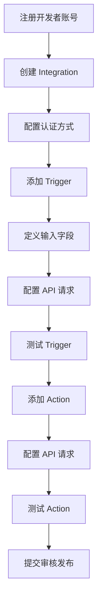
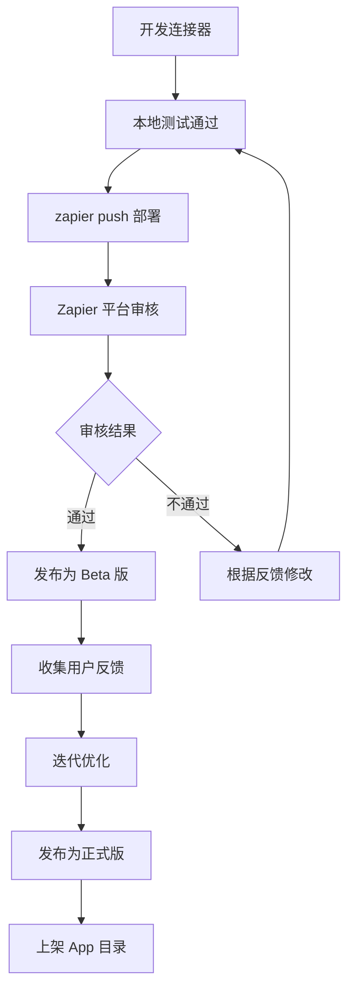
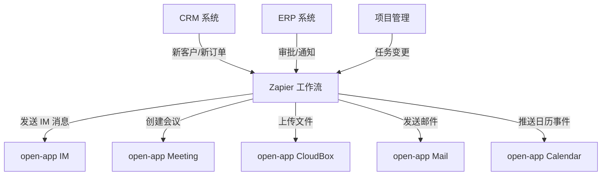
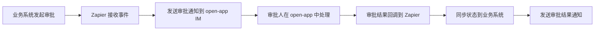
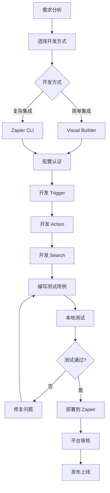
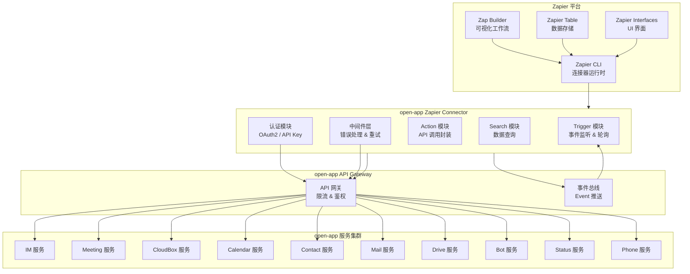
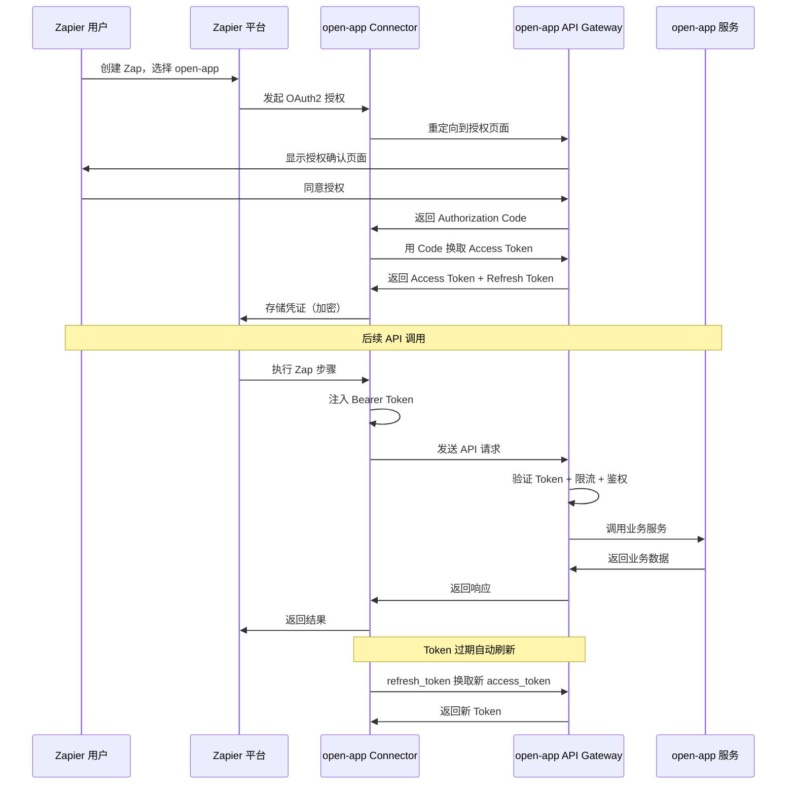

# Zapier 连接器平台调研报告

## 一、平台概述

### 1.1 平台简介

Zapier 成立于 2011 年，是全球领先的无代码自动化工作流平台，总部位于美国旧金山。作为 iPaaS（集成平台即服务）领域的开创者和领导者，Zapier 目前支持超过 7000+ 个应用的集成连接，累计自动化任务执行超过 25 亿次。Zapier 采用全远程办公模式，拥有约 700 名员工，是全球最大的全远程工作公司之一。

Zapier 的核心使命是让每个人都能轻松实现跨应用自动化，无需编写代码即可将不同 SaaS 服务连接起来，实现数据的自动流转和业务流程的自动化执行。截至 2026 年，Zapier 已服务超过 200 万企业用户，涵盖从个人创业者到世界 500 强企业的各类规模组织。

### 1.2 平台定位

- **无代码 iPaaS 平台**：面向非技术用户，通过可视化方式实现跨应用集成
- **工作流自动化引擎**：以 Trigger → Action 为核心范式，驱动业务流程自动化
- **SaaS 生态连接器**：作为 SaaS 生态系统的"胶水"，连接 7000+ 应用
- **中小企业数字化基础设施**：为 SMB 提供低门槛、低成本的业务自动化能力
- **开发者友好平台**：同时提供 CLI 和 Visual Builder，满足专业开发者的自定义集成需求

### 1.3 核心价值主张

| 价值维度 | 描述 |
|---------|------|
| **零代码自动化** | 无需编程技能，拖拽式配置即可构建自动化工作流，大幅降低自动化门槛 |
| **最大应用生态** | 7000+ 应用集成，全球最大的第三方应用连接器市场，覆盖主流 SaaS 服务 |
| **极速上线** | 分钟级完成集成配置，无需开发部署周期，业务人员可自行创建和维护 |
| **成本效率** | 相比自研集成方案，节省 80% 以上的开发和维护成本 |
| **可靠稳定** | 99.9% SLA 保障，自动重试机制，完善的错误处理和日志系统 |
| **灵活扩展** | 从简单两步自动化到复杂多步骤条件分支工作流，支持不同复杂度场景 |
| **安全合规** | SOC 2 Type II 认证，GDPR 合规，数据加密传输与存储，完善的审计日志 |

---

## 二、核心能力体系

### 2.1 连接器能力矩阵

Zapier 的每个连接器（Integration/App）由三种核心能力类型组成：

| 能力类型 | 描述 | 典型示例 | 对应 open-app 开放模式 |
|---------|------|---------|---------------------|
| **Trigger（触发器）** | 当某事件发生时触发工作流，是 Zap 的起点 | 新邮件到达、新订单创建、表单提交、日历事件新建 | 对应 Event（内部→外部）模式 |
| **Action（操作）** | 在工作流中执行的具体操作，是 Zap 的执行步骤 | 发送消息、创建记录、更新数据、调用 API | 对应 API（外部→内部）模式 |
| **Search（查找）** | 在应用中查找特定数据，可配合 Action 使用 | 查找用户、查找订单、查找联系人 | 对应 API 查询接口 |

#### 详细连接器能力示例

**以 Slack 连接器为例**：

| 能力类型 | 具体能力 | 描述 |
|---------|---------|------|
| Trigger | New Message Posted to Channel | 监听指定频道的新消息 |
| Trigger | New Reaction Added | 监听新增的表情回应 |
| Trigger | New Starred Message | 监听新增的星标消息 |
| Action | Send Message | 向指定频道发送消息 |
| Action | Update Profile | 更新用户资料 |
| Action | Set Channel Topic | 设置频道主题 |
| Search | Find Message | 搜索特定消息 |
| Search | Find User | 查找用户信息 |

**以 Google Calendar 连接器为例**：

| 能力类型 | 具体能力 | 描述 |
|---------|---------|------|
| Trigger | New Event | 新日历事件创建时触发 |
| Trigger | Event Cancelled | 日历事件取消时触发 |
| Trigger | Event Started | 日历事件开始时触发 |
| Action | Create Detailed Event | 创建详细日历事件 |
| Action | Update Event | 更新日历事件 |
| Action | Delete Event | 删除日历事件 |
| Search | Find Event | 查找日历事件 |
| Search | Get Free/Busy Info | 获取空闲/忙碌信息 |

### 2.2 开发模式

#### 2.2.1 可视化工作流（Zap Builder）

**特点**：
- 零代码，纯可视化配置
- Trigger → Action 核心范式，直觉式操作
- 支持多步骤工作流（Multi-step Zaps）
- 内置条件分支（Paths）、过滤器（Filters）、格式化器（Formatters）
- 实时测试每个步骤

**Zap Builder 核心概念**：

```
+-----------------------------------------------------------+
|                      Zap（工作流）                          |
|                                                           |
|  +----------+    +----------+    +----------+             |
|  | Trigger   |--->|  Filter  |--->|  Action   |             |
|  | (触发器)  |    | (过滤器) |    | (操作1)   |             |
|  +----------+    +----------+    +----------+             |
|                                        |                  |
|                                  +-----+-----+            |
|                                  |   Paths    |            |
|                                  | (条件分支) |            |
|                                  +-----+-----+            |
|                                 +------+------+           |
|                            +----+----+ +----+----+        |
|                            | Path A  | | Path B  |        |
|                            | Action2 | | Action3 |        |
|                            +---------+ +---------+        |
+-----------------------------------------------------------+
```

**核心组件说明**：

| 组件 | 描述 | 示例 |
|------|------|------|
| **Trigger** | 工作流起点，监控事件或定时触发 | 当收到新邮件时 |
| **Filter** | 条件过滤，不满足条件的执行被跳过 | 仅当邮件主题包含"紧急"时继续 |
| **Formatter** | 数据格式转换和加工 | 日期格式化、文本截取、数字计算 |
| **Paths** | 条件分支，类似 if-else 逻辑 | 金额 > 1000 走路径 A，否则走路径 B |
| **Delay** | 延迟执行，等待指定时间后继续 | 延迟 1 小时后发送提醒 |
| **Webhook** | 自定义 HTTP 请求，扩展能力边界 | 调用自建 API 获取或推送数据 |

**配置示例：新邮件自动创建任务并通知**

```
步骤1: Trigger - Gmail -> New Email
步骤2: Filter - 仅当主题包含"客户需求"
步骤3: Formatter - 提取邮件正文关键信息
步骤4: Action - Asana -> Create Task
步骤5: Action - Slack -> Send Message（通知产品经理）
```

#### 2.2.2 Zapier CLI 开发

**特点**：
- 基于 Node.js 的命令行开发工具
- 完整的 TypeScript 类型支持
- 本地开发、测试、部署一体化
- 适合复杂业务逻辑和自定义集成
- 版本控制和 CI/CD 友好

**安装与初始化**：

```bash
# 安装 Zapier CLI
npm install -g zapier-platform-cli

# 登录 Zapier 账号
zapier login

# 初始化项目
zapier init open-app-connector
cd open-app-connector

# 项目结构
# open-app-connector/
# |-- index.js           # 入口文件，定义应用配置
# |-- triggers/          # 触发器目录
# |   +-- newMessage.js
# |-- creates/           # Action 目录
# |   |-- sendMessage.js
# |   +-- createMeeting.js
# |-- searches/          # Search 目录
# |   +-- findUser.js
# |-- authentication.js  # 认证配置
# |-- package.json
# +-- test/              # 测试目录
#     +-- index.test.js
```

**完整 CLI 连接器代码示例（open-app IM 连接器）**：

```javascript
// index.js - 入口文件
const authentication = require('./authentication');
const newMessageTrigger = require('./triggers/newMessage');
const sendMessageAction = require('./creates/sendMessage');
const createMeetingAction = require('./creates/createMeeting');
const findUserSearch = require('./searches/findUser');

module.exports = {
  version: require('./package.json').version,
  platformVersion: require('zapier-platform-core').version,

  authentication: authentication,

  triggers: {
    [newMessageTrigger.key]: newMessageTrigger,
  },

  creates: {
    [sendMessageAction.key]: sendMessageAction,
    [createMeetingAction.key]: createMeetingAction,
  },

  searches: {
    [findUserSearch.key]: findUserSearch,
  },

  // 自动中间件：在每次请求前注入认证头
  beforeRequest: [
    (request, z, bundle) => {
      if (bundle.authData.access_token) {
        request.headers['Authorization'] = 'Bearer ' + bundle.authData.access_token;
      }
      request.headers['Content-Type'] = 'application/json';
      return request;
    },
  ],

  // 响应后中间件：处理通用错误
  afterResponse: [
    (response, z, bundle) => {
      if (response.status === 401) {
        throw new z.errors.RefreshAuthError('Token 过期，需要刷新');
      }
      if (response.status >= 400) {
        throw new Error('API 错误: ' + response.status);
      }
      return response;
    },
  ],
};
```

```javascript
// authentication.js - OAuth2 认证配置
module.exports = {
  type: 'oauth2',
  test: async (z, bundle) => {
    const response = await z.request({
      url: 'https://api.open-app.example.com/v1/user/me',
    });
    if (response.status === 401) {
      throw new Error('认证失败，请检查凭证');
    }
    return response.data;
  },
  oauth2Config: {
    authorizeUrl: {
      url: 'https://open.open-app.example.com/oauth2/authorize',
      params: {
        client_id: '{{process.env.CLIENT_ID}}',
        state: '{{bundle.inputData.state}}',
        redirect_uri: '{{bundle.env.redirect_uri}}',
        response_type: 'code',
        scope: 'im:read im:write meeting:read meeting:write contact:read',
      },
    },
    getAccessToken: {
      url: 'https://open.open-app.example.com/oauth2/token',
      method: 'POST',
      body: {
        code: '{{bundle.inputData.code}}',
        client_id: '{{process.env.CLIENT_ID}}',
        client_secret: '{{process.env.CLIENT_SECRET}}',
        redirect_uri: '{{bundle.env.redirect_uri}}',
        grant_type: 'authorization_code',
      },
      headers: {
        'Content-Type': 'application/x-www-form-urlencoded',
      },
    },
    refreshAccessToken: {
      url: 'https://open.open-app.example.com/oauth2/token',
      method: 'POST',
      body: {
        refresh_token: '{{bundle.authData.refresh_token}}',
        client_id: '{{process.env.CLIENT_ID}}',
        client_secret: '{{process.env.CLIENT_SECRET}}',
        grant_type: 'refresh_token',
      },
      headers: {
        'Content-Type': 'application/x-www-form-urlencoded',
      },
    },
    autoRefresh: true,
  },
  connectionLabel: '{{data.name}} ({{data.email}})',
  fields: [],
};
```

```javascript
// triggers/newMessage.js - 新消息触发器
module.exports = {
  key: 'new_message',
  noun: '消息',
  display: {
    label: '新消息',
    description: '当收到新消息时触发',
  },
  operation: {
    inputFields: [
      {
        key: 'chat_id',
        label: '会话ID',
        type: 'string',
        required: true,
        helpText: '要监听消息的会话 ID',
      },
    ],
    sample: {
      id: 'msg_001',
      chat_id: 'chat_123',
      sender_id: 'user_456',
      sender_name: '张三',
      content: '你好，这是一条测试消息',
      message_type: 'text',
      created_at: '2026-05-14T10:30:00Z',
    },
    outputFields: [
      { key: 'id', label: '消息ID' },
      { key: 'sender_name', label: '发送者' },
      { key: 'content', label: '消息内容' },
      { key: 'created_at', label: '发送时间' },
    ],
    // 轮询方式获取新消息
    perform: async (z, bundle) => {
      const response = await z.request({
        url: 'https://api.open-app.example.com/v1/im/messages',
        params: {
          chat_id: bundle.inputData.chat_id,
          since: bundle.meta.cursor || new Date(0).toISOString(),
          limit: 50,
        },
      });
      const messages = response.data.items || [];
      // 按时间排序，Zapier 按此顺序处理
      return messages.sort((a, b) => {
        return new Date(a.created_at) - new Date(b.created_at);
      });
    },
    canPaginate: true,
    getCursor: (response) => {
      if (response && response.length > 0) {
        return response[response.length - 1].created_at;
      }
      return null;
    },
  },
};
```

```javascript
// creates/sendMessage.js - 发送消息 Action
module.exports = {
  key: 'send_message',
  noun: '消息',
  display: {
    label: '发送消息',
    description: '向指定会话发送消息',
    important: true,
  },
  operation: {
    inputFields: [
      {
        key: 'chat_id',
        label: '会话ID',
        type: 'string',
        required: true,
        helpText: '目标会话的唯一标识',
      },
      {
        key: 'message_type',
        label: '消息类型',
        type: 'string',
        required: true,
        choices: { text: '文本', markdown: 'Markdown', card: '卡片' },
        default: 'text',
      },
      {
        key: 'content',
        label: '消息内容',
        type: 'text',
        required: true,
        helpText: '要发送的消息正文内容',
      },
    ],
    sample: {
      id: 'msg_002',
      chat_id: 'chat_123',
      message_type: 'text',
      content: '消息已发送',
      created_at: '2026-05-14T10:35:00Z',
    },
    perform: async (z, bundle) => {
      const response = await z.request({
        url: 'https://api.open-app.example.com/v1/im/messages',
        method: 'POST',
        body: {
          chat_id: bundle.inputData.chat_id,
          message_type: bundle.inputData.message_type,
          content: bundle.inputData.content,
        },
      });
      return response.data;
    },
  },
};
```

```javascript
// creates/createMeeting.js - 创建会议 Action
module.exports = {
  key: 'create_meeting',
  noun: '会议',
  display: {
    label: '创建会议',
    description: '创建一个新的在线会议',
    important: true,
  },
  operation: {
    inputFields: [
      { key: 'topic', label: '会议主题', type: 'string', required: true },
      {
        key: 'start_time',
        label: '开始时间',
        type: 'datetime',
        required: true,
        helpText: '会议开始时间（ISO 8601 格式）',
      },
      { key: 'duration', label: '时长(分钟)', type: 'integer', required: true, default: 30 },
      {
        key: 'participant_ids',
        label: '参会人ID',
        type: 'string',
        list: true,
        helpText: '参会人员的用户 ID 列表',
      },
    ],
    sample: {
      id: 'mtg_001',
      topic: '项目周会',
      start_url: 'https://meeting.open-app.example.com/join/abc123',
      join_url: 'https://meeting.open-app.example.com/join/abc123',
      duration: 30,
      status: 'scheduled',
    },
    perform: async (z, bundle) => {
      const response = await z.request({
        url: 'https://api.open-app.example.com/v1/meetings',
        method: 'POST',
        body: {
          topic: bundle.inputData.topic,
          start_time: bundle.inputData.start_time,
          duration: bundle.inputData.duration,
          participant_ids: bundle.inputData.participant_ids,
        },
      });
      return response.data;
    },
  },
};
```

```javascript
// searches/findUser.js - 查找用户 Search
module.exports = {
  key: 'find_user',
  noun: '用户',
  display: {
    label: '查找用户',
    description: '按邮箱或用户名查找用户信息',
  },
  operation: {
    inputFields: [
      { key: 'email', label: '邮箱地址', type: 'string', required: false, helpText: '用户的邮箱地址' },
      { key: 'name', label: '用户名', type: 'string', required: false, helpText: '用户的显示名称（模糊匹配）' },
    ],
    sample: {
      id: 'user_001',
      name: '张三',
      email: 'zhangsan@example.com',
      department: '技术部',
      status: 'active',
    },
    perform: async (z, bundle) => {
      const params = {};
      if (bundle.inputData.email) params.email = bundle.inputData.email;
      if (bundle.inputData.name) params.name = bundle.inputData.name;
      const response = await z.request({
        url: 'https://api.open-app.example.com/v1/users/search',
        params: params,
      });
      return response.data.items || [];
    },
  },
};
```

```bash
# 测试连接器
zapier test

# 本地运行和调试
zapier test --debug

# 部署到 Zapier 平台
zapier push

# 邀请用户使用
zapier users:add user@example.com
```

#### 2.2.3 Zapier Visual Builder

**特点**：
- 低代码可视化构建器，在浏览器中完成开发
- 拖拽式配置 API 端点、认证、输入输出字段
- 无需搭建本地开发环境
- 实时预览和测试
- 适合快速原型和简单集成

**开发流程**：



**Visual Builder vs CLI 对比**：

| 对比维度 | Visual Builder | Zapier CLI |
|---------|---------------|------------|
| **门槛** | 低，无需编程 | 中，需 Node.js 基础 |
| **灵活性** | 中等 | 高，可自定义复杂逻辑 |
| **版本控制** | 不支持 Git | 支持 Git/CI/CD |
| **调试** | 在线测试 | 本地断点调试 |
| **适用场景** | 简单集成、快速原型 | 复杂业务、团队协作 |
| **代码复用** | 有限 | 高，模块化设计 |
| **部署速度** | 快 | 需构建部署 |

#### 2.2.4 Zapier Table & Interfaces

**Zapier Table**：
- 内置轻量级数据库，可直接存储自动化过程中的数据
- 支持创建、读取、更新、删除记录
- 可作为 Zap 的数据源（Trigger）和目标（Action）
- 最大支持 10,000 行记录（免费版）、无限行（付费版）
- 自动与 Zap 工作流集成

**Zapier Interfaces**：
- 内置 UI 构建器，可创建表单、页面和应用界面
- 支持表单提交触发 Zap 工作流
- 可创建简单的客户门户、内部工具
- 无需前端开发知识
- 提供预置模板（联系表单、调查问卷、预约系统等）

**组合使用示例**：

```
客户通过 Interface 表单提交需求
    -> 数据存入 Zapier Table
    -> Zap 触发，创建 Asana 任务
    -> 发送 Slack 通知给销售团队
    -> 销售确认后更新 Table 状态
    -> 自动发送邮件回复客户
```

### 2.3 工作流自动化能力

#### 多步骤 Zaps（Multi-step Zaps）

Zapier 的核心优势之一是支持多步骤工作流，一个 Zap 可包含多个 Action 步骤，前后步骤的数据可互相引用。

**数据流转示例**：

```
Trigger: 新订单创建 (Shopify)
  -> 获取订单数据: {order_id, customer_email, total_amount}
  
Action 1: 查找客户 (CRM)
  -> 输入: customer_email
  -> 输出: {customer_id, customer_tier}
  
Action 2: 条件分支 (Paths)
  -> 条件A: total_amount > 1000 且 customer_tier = "VIP"
    -> Action 2a: 发送专属优惠码 (Email)
    -> Action 2b: 创建跟进任务 (Asana)
  -> 条件B: 其他
    -> Action 2c: 发送标准确认邮件 (Email)
    
Action 3: 记录日志 (Google Sheets)
```

#### Paths（条件分支）

Paths 是 Zapier 内置的条件分支功能，支持基于字段值执行不同的操作路径：

| 功能 | 描述 |
|------|------|
| **条件判断** | 支持等于、不等于、包含、大于、小于等多种运算符 |
| **多路径** | 单个 Paths 步骤最多支持 3 条路径（2 条自定义 + 1 条默认） |
| **嵌套条件** | 每条路径内可包含任意数量的 Action 步骤 |
| **数据传递** | 前序步骤的数据可在各路径中使用 |

#### Filters（过滤器）

Filter 用于条件过滤，当数据不满足条件时，该次 Zap 执行被静默跳过（不视为失败）：

```javascript
// Filter 配置示例
{
  filter: {
    type: 'and',
    conditions: [
      {
        field: 'subject',
        operator: 'contains',
        value: '紧急'
      },
      {
        field: 'priority',
        operator: 'is',
        value: 'high'
      }
    ]
  }
}
```

#### Formatters（格式化器）

| 格式化类型 | 功能 | 示例 |
|-----------|------|------|
| **日期/时间** | 日期格式转换、时区转换、日期计算 | "2026-05-14T10:30:00Z" -> "2026年5月14日 18:30" |
| **文本** | 截取、拼接、替换、大小写转换 | 提取邮箱域名、拼接完整地址 |
| **数字** | 数学运算、四舍五入、格式化 | 金额计算、百分比转换 |
| **实用工具** | UUID 生成、URL 编码、Base64 编码 | 生成唯一 ID、编码特殊字符 |
| **Lookup Table** | 值映射转换 | 状态码 -> 中文描述 |

#### Webhooks

Zapier 支持两种 Webhook 模式：

| Webhook 类型 | 描述 | 方向 | 使用场景 |
|-------------|------|------|---------|
| **Catch Hook** | Zapier 生成 URL，接收外部推送 | 外部 → Zapier | 外部系统事件触发 Zap |
| **Webhooks by Zapier** | Zapier 主动调用外部 API | Zapier → 外部 | 调用自建系统 API |

### 2.4 连接器发布机制

#### 发布流程



**发布要求**：
- 至少包含 1 个 Trigger 或 Action
- 完整的认证配置和测试
- 所有端点必须通过测试
- 提供清晰的应用描述和图标
- 符合 Zapier 品牌规范
- 无安全隐患和性能问题

**版本管理**：
- 支持多版本并存，用户可选择升级
- 版本号遵循语义化版本（SemVer）
- 可向后兼容或引入 Breaking Change
- 旧版本保留 90 天后下线

---
## 三、应用场景分析

### 3.1 典型应用场景

#### 3.1.1 企业通讯与业务系统集成

**场景描述**：
通过 Zapier 将 open-app 的 IM、会议、云盘等通讯能力与企业现有的 CRM、ERP、OA 等业务系统打通，实现消息自动推送、会议自动创建、文件自动同步等跨系统协作。

**集成方案**：



**open-app 各能力在 Zapier 中的映射**：

| open-app 能力 | Zapier Trigger | Zapier Action | Zapier Search |
|--------------|----------------|---------------|---------------|
| **IM（即时通讯）** | 新消息接收、群聊事件 | 发送消息、创建群聊 | 查找用户、查找群聊 |
| **Meeting（会议）** | 会议开始、会议结束 | 创建会议、邀请参会 | 查找会议、查找参会人 |
| **CloudBox（云盘）** | 文件上传、文件共享 | 上传文件、创建共享 | 查找文件、查找文件夹 |
| **Calendar（日历）** | 日历事件创建/更新 | 创建日程、更新日程 | 查找空闲时间、查找日程 |
| **Contact（通讯录）** | 人员变动事件 | 创建联系人、更新信息 | 查找联系人、查找部门 |
| **Mail（邮件）** | 新邮件到达 | 发送邮件、转发邮件 | 查找邮件、查找联系人 |
| **Drive（云盘）** | 文件变更事件 | 上传文件、移动文件 | 查找文件、查找目录 |
| **Bot（机器人）** | 机器人消息接收 | 机器人发送消息 | 查找机器人信息 |
| **Status（状态）** | 状态变更事件 | 更新状态 | 查找用户状态 |
| **Phone（电话）** | 来电事件 | 发起呼叫 | 查找通话记录 |

#### 3.1.2 消息通知自动化

**场景描述**：
将各业务系统的重要事件自动推送到 open-app IM，实现统一的即时通知。

**典型工作流**：

```
场景1：CRM 新订单通知
  Trigger: Salesforce -> New Opportunity (Stage = Closed Won)
  Action: open-app IM -> Send Message (群聊: 销售大捷报)

场景2：服务器监控告警
  Trigger: Datadog -> New Alert (Severity = Critical)
  Action: open-app IM -> Send Message (群聊: 运维告警)
  Action: open-app Bot -> Send Card Message (带操作按钮的告警卡片)

场景3：HR 系统事件通知
  Trigger: Workday -> New Employee Onboarded
  Action: open-app IM -> Send Message (群聊: 新人欢迎)
  Action: open-app Contact -> Create Contact (更新通讯录)
```

#### 3.1.3 审批流程自动化

**场景描述**：
通过 Zapier 连接审批系统与 open-app，实现审批自动触发、状态同步和结果通知。



**具体实现**：
- 审批创建时：通过 Zapier Action 在 open-app IM 发送审批卡片消息
- 审批处理时：通过 open-app Event 回调审批操作到 Zapier
- 审批完成时：通过 Zapier 同步结果到 OA/ERP，并发送通知

#### 3.1.4 数据同步与集成

**场景描述**：
在不同系统之间自动同步数据，保持数据一致性。

| 同步场景 | 源系统 | 目标系统 | 同步内容 |
|---------|--------|---------|---------|
| **通讯录同步** | HR 系统 | open-app Contact | 人员信息、部门架构 |
| **日程同步** | Google Calendar | open-app Calendar | 会议日程、提醒 |
| **文件同步** | Dropbox | open-app CloudBox | 项目文档、共享文件 |
| **邮件同步** | Gmail | open-app Mail | 重要邮件、附件 |
| **任务同步** | Jira | open-app IM + Calendar | 任务通知、截止日期 |

#### 3.1.5 机器人消息推送

**场景描述**：
通过 open-app Bot 在 Zapier 工作流中实现智能消息推送和交互。

**工作流示例**：

```
场景：每日站会提醒机器人
  Trigger: Schedule by Zapier -> Every Weekday at 9:00 AM
  Action: open-app Bot -> Send Interactive Card
    内容包含：
    - 今日待办事项（从 Jira 拉取）
    - 快捷操作按钮（签到/请假/查看详情）
  当用户点击按钮时：
  -> Webhook 回调到 Zapier
  -> 执行对应操作（更新状态/创建请假单等）
```

### 3.2 与 open-app 的集成场景

#### open-app 开放模式到 Zapier 的映射

| open-app 开放模式 | 描述 | Zapier 对应 | 实现方式 |
|------------------|------|------------|---------|
| **API（外部→内部）** | 外部系统调用 open-app 接口 | Action / Search | 将 open-app API 封装为 Zapier Action（写操作）和 Search（读操作） |
| **Event（内部→外部）** | open-app 事件推送到外部 | Trigger | 将 open-app 事件通过 Webhook 暴露为 Zapier Trigger |
| **WebHook/Callback（内部→外部）** | open-app 回调通知外部 | Trigger / Webhook | 将 open-app 回调 URL 注册为 Zapier Catch Hook 的推送目标 |
| **Bot（双向）** | 机器人双向通信 | Trigger + Action | Bot 接收消息作为 Trigger，发送消息作为 Action |

**集成架构**：

```
+-------------------+     +------------------+     +-------------------+
|   open-app 平台    |     |   Zapier 平台    |     |   第三方 SaaS     |
|                   |     |                  |     |                   |
| API (REST)  <-----|---> | Action/Search    |     |                   |
| Event (Push) ---->|-->  | Trigger (Hook)   |     |                   |
| WebHook     <-----|<--- | Catch Hook       |     |                   |
| Bot         <---->|<--> | Trigger+Action   |     |                   |
+-------------------+     +------------------+     +-------------------+
                                |       ^
                                v       |
                          +-------------------+
                          |  7000+ SaaS Apps  |
                          | (Slack/Gmail/     |
                          |  Salesforce/      |
                          |  HubSpot/...)     |
                          +-------------------+
```

---
## 四、开发指南

### 4.1 连接器开发流程



**开发周期估算**：

| 连接器规模 | Trigger 数 | Action 数 | Search 数 | 开发周期 | 推荐方式 |
|-----------|-----------|----------|----------|---------|---------|
| **小型** | 1-2 | 2-3 | 0-1 | 1-2 周 | Visual Builder |
| **中型** | 3-5 | 5-10 | 2-3 | 2-4 周 | CLI |
| **大型** | 5+ | 10+ | 5+ | 4-8 周 | CLI |

### 4.2 Zapier CLI 开发

#### 4.2.1 项目结构详解

```
open-app-zapier/
|-- index.js              # 应用入口，注册所有组件
|-- authentication.js     # 认证配置
|-- triggers/             # 触发器目录
|   |-- newImMessage.js   # IM 新消息触发器
|   |-- newCalendarEvent.js  # 日历新事件触发器
|   +-- meetingStarted.js # 会议开始触发器
|-- creates/              # Action（创建/操作）目录
|   |-- sendImMessage.js  # 发送 IM 消息
|   |-- createMeeting.js  # 创建会议
|   |-- sendEmail.js      # 发送邮件
|   |-- uploadFile.js     # 上传文件
|   +-- createCalendarEvent.js  # 创建日历事件
|-- searches/             # Search（查找）目录
|   |-- findUser.js       # 查找用户
|   |-- findMeeting.js    # 查找会议
|   +-- findFile.js       # 查找文件
|-- test/                 # 测试目录
|   |-- index.test.js     # 入口测试
|   |-- triggers.test.js  # 触发器测试
|   |-- creates.test.js   # Action 测试
|   +-- searches.test.js  # Search 测试
|-- package.json          # 依赖管理
|-- environment.json      # 环境变量配置
+-- zapier.schema.json    # Zapier 平台 schema
```

#### 4.2.2 测试用例编写

```javascript
// test/creates.test.js
const zapier = require('zapier-platform-core');
const App = require('../index');
const appTester = zapier.createAppTester(App);

describe('发送消息 Action', () => {
  it('应该成功发送文本消息', async () => {
    const bundle = {
      inputData: {
        chat_id: 'chat_test_001',
        message_type: 'text',
        content: 'Zapier 集成测试消息',
      },
      authData: {
        access_token: process.env.TEST_ACCESS_TOKEN,
      },
    };

    const result = await appTester(
      App.creates.send_message.operation.perform,
      bundle
    );

    expect(result.id).toBeDefined();
    expect(result.chat_id).toBe('chat_test_001');
    expect(result.content).toBe('Zapier 集成测试消息');
  });

  it('缺少必填字段时应报错', async () => {
    const bundle = {
      inputData: {
        chat_id: '',
        message_type: 'text',
        content: '测试',
      },
      authData: {
        access_token: process.env.TEST_ACCESS_TOKEN,
      },
    };

    await expect(
      appTester(App.creates.send_message.operation.perform, bundle)
    ).rejects.toThrow();
  });
});
```

#### 4.2.3 高级功能：自定义字段动态化

```javascript
// creates/sendMessage.js - 动态输入字段
module.exports = {
  key: 'send_message',
  noun: '消息',
  display: {
    label: '发送消息',
    description: '向指定会话发送消息',
    important: true,
  },
  operation: {
    inputFields: [
      {
        key: 'chat_id',
        label: '会话',
        type: 'string',
        required: true,
        // 动态下拉列表：从 API 获取用户可用的会话列表
        dynamic: 'listChats.id.name',
        helpText: '选择目标会话',
      },
      {
        key: 'message_type',
        label: '消息类型',
        type: 'string',
        required: true,
        choices: { text: '文本', markdown: 'Markdown', card: '卡片' },
        default: 'text',
        altersDynamicFields: true,
      },
      // 根据消息类型动态显示不同字段
      function(z, bundle) {
        if (bundle.inputData.message_type === 'card') {
          return [
            {
              key: 'card_title',
              label: '卡片标题',
              type: 'string',
              required: true,
            },
            {
              key: 'card_content',
              label: '卡片内容',
              type: 'text',
              required: true,
            },
          ];
        }
        return [
          {
            key: 'content',
            label: '消息内容',
            type: 'text',
            required: true,
          },
        ];
      },
    ],
    perform: async (z, bundle) => {
      // ... 发送逻辑
    },
  },
};

// triggers/listChats.js - 为动态下拉提供数据
module.exports = {
  key: 'listChats',
  noun: '会话',
  display: {
    label: '获取会话列表',
    description: '获取用户可用的会话列表',
    hidden: true,  // 隐藏触发器，仅供动态列表使用
  },
  operation: {
    perform: async (z, bundle) => {
      const response = await z.request({
        url: 'https://api.open-app.example.com/v1/im/chats',
        params: { limit: 100 },
      });
      return response.data.items.map(chat => ({
        id: chat.id,
        name: chat.name || chat.chat_id,
      }));
    },
  },
};
```

### 4.3 Zapier Visual Builder 开发

#### 核心步骤

1. **创建 Integration**：登录 developer.zapier.com，点击 "Create Integration"
2. **配置基本信息**：填写应用名称、描述、Logo、分类等
3. **设置认证**：选择认证类型，配置 OAuth2 授权 URL、Token URL 等
4. **添加 Trigger**：
   - 定义 Trigger 名称和描述
   - 配置 API 端点和请求方式
   - 设置轮询 URL（Zapier 定期请求获取新数据）
   - 定义输入/输出字段
   - 测试 Trigger
5. **添加 Action**：
   - 定义 Action 名称和描述
   - 配置 API 端点和请求方式
   - 设置输入/输出字段
   - 测试 Action
6. **发布**：提交审核，通过后即可供用户使用

### 4.4 认证方式

Zapier 支持多种认证方式，适配不同 API 的安全要求：

| 认证方式 | 描述 | 适用场景 | 安全级别 |
|---------|------|---------|---------|
| **API Key** | 通过 API Key 认证，放在 Header 或 Query 中 | 内部系统、简单 API | 中 |
| **OAuth2** | 标准 OAuth2 授权码流程 | 面向第三方用户的 SaaS 应用 | 高 |
| **Session Auth** | 通过登录获取 Session Token，定期刷新 | 传统 Web 应用 | 中 |
| **Basic Auth** | 用户名+密码认证 | 简单系统、内部工具 | 低 |
| **Digest Auth** | 基于 Digest 的认证 | 安全性要求较高的系统 | 中高 |
| **Custom Auth** | 完全自定义认证流程 | 非标准认证方式 | 可变 |

**open-app 推荐使用 OAuth2 认证**：

```javascript
// OAuth2 认证流程
const oauth2Config = {
  // 步骤1: 引导用户到授权页面
  authorizeUrl: {
    url: 'https://open.open-app.example.com/oauth2/authorize',
    params: {
      client_id: '{{process.env.CLIENT_ID}}',
      state: '{{bundle.inputData.state}}',
      redirect_uri: '{{bundle.env.redirect_uri}}',
      response_type: 'code',
      scope: 'im:read im:write meeting:read meeting:write contact:read calendar:read calendar:write',
    },
  },
  // 步骤2: 用授权码换取 Access Token
  getAccessToken: {
    url: 'https://open.open-app.example.com/oauth2/token',
    method: 'POST',
    body: {
      code: '{{bundle.inputData.code}}',
      client_id: '{{process.env.CLIENT_ID}}',
      client_secret: '{{process.env.CLIENT_SECRET}}',
      redirect_uri: '{{bundle.env.redirect_uri}}',
      grant_type: 'authorization_code',
    },
  },
  // 步骤3: Token 过期后自动刷新
  refreshAccessToken: {
    url: 'https://open.open-app.example.com/oauth2/token',
    method: 'POST',
    body: {
      refresh_token: '{{bundle.authData.refresh_token}}',
      client_id: '{{process.env.CLIENT_ID}}',
      client_secret: '{{process.env.CLIENT_SECRET}}',
      grant_type: 'refresh_token',
    },
  },
  autoRefresh: true,
};
```

### 4.5 最佳实践

#### 4.5.1 连接器设计最佳实践

- **命名规范**：Trigger/Action 名称清晰、动词开头（如"发送消息"而非"消息"）
- **字段设计**：提供合理的默认值和 helpText，降低用户理解成本
- **错误处理**：区分业务错误和系统错误，提供友好的中文错误提示
- **幂等性**：Action 应设计为幂等操作，防止重复执行导致数据异常
- **速率限制**：遵守 API 速率限制，实现指数退避重试
- **数据脱敏**：敏感字段标记为 `type: 'password'`，避免日志泄露

#### 4.5.2 性能优化

- **批量操作**：优先使用批量 API 减少请求次数
- **分页拉取**：Trigger 使用 cursor 分页，避免数据遗漏
- **字段精简**：只请求必要字段，减少数据传输量
- **缓存策略**：对不常变数据（如用户列表、部门信息）进行缓存

#### 4.5.3 安全最佳实践

| 安全措施 | 说明 |
|---------|------|
| **凭证管理** | 使用环境变量存储 Client ID/Secret，不硬编码 |
| **HTTPS** | 所有 API 请求必须使用 HTTPS |
| **最小权限** | OAuth2 Scope 仅申请必要的权限 |
| **Token 刷新** | 实现 Token 自动刷新，避免过期 |
| **输入校验** | 前端和后端都要进行输入参数校验 |
| **审计日志** | 记录所有 API 调用日志，便于问题排查 |

---
## 五、优势与劣势分析

### 5.1 核心优势

#### 5.1.1 生态优势

| 优势维度 | 详细描述 |
|---------|---------|
| **最大应用生态** | 支持 7000+ 应用集成，覆盖 CRM、营销、开发、协作等全品类，远超竞争对手（Make 1500+、Workato 1000+） |
| **先发优势** | 2011 年成立，iPaaS 领域最早入局者之一，品牌认知度高 |
| **用户基数** | 超过 200 万企业用户，全球最大的自动化工作流平台 |
| **开发者生态** | 大量第三方开发者贡献连接器，持续扩展应用覆盖 |

#### 5.1.2 产品优势

| 优势维度 | 详细描述 |
|---------|---------|
| **零代码易用** | 可视化配置，5 分钟即可创建一个自动化工作流，学习曲线极低 |
| **多步骤工作流** | 支持复杂的多步骤工作流，条件分支、过滤器、格式化等高级功能 |
| **内置数据存储** | Zapier Table 提供内置数据库，无需额外数据服务 |
| **内置界面** | Zapier Interfaces 支持创建表单和简单应用界面 |
| **可靠性** | 99.9% SLA，自动重试，完善的错误处理和任务历史 |
| **AI 能力** | 集成 AI 功能（AI Actions、Natural Language Zap 创建），降低使用门槛 |

#### 5.1.3 开发者优势

| 优势维度 | 详细描述 |
|---------|---------|
| **双模式开发** | 同时提供 Visual Builder（低代码）和 CLI（代码），满足不同需求 |
| **完善的 SDK** | zapier-platform-core 提供丰富的工具函数（z.request、z.dehydrate 等） |
| **本地测试** | CLI 支持本地单元测试和集成测试，开发体验好 |
| **CI/CD 集成** | 支持 GitHub Actions 等 CI/CD 工具，自动化部署流程 |
| **文档丰富** | 开发者文档详尽，有大量示例和教程 |

### 5.2 潜在劣势

#### 5.2.1 成本劣势

| 劣势维度 | 详细描述 |
|---------|---------|
| **定价偏高** | 免费版仅 100 任务/月，付费版起价 $19.99/月，高级版 $49+/月，大规模使用成本高 |
| **按任务计费** | 每个 Action 执行算 1 个 Task，多步骤 Zap 消耗任务数快 |
| **功能分级** | 多步骤 Zap、Paths 等关键功能需付费版，免费版仅支持两步 |
| **企业版定制** | Company 版本需联系销售，价格不透明 |

#### 5.2.2 技术劣势

| 劣势维度 | 详细描述 |
|---------|---------|
| **复杂逻辑受限** | 不支持复杂循环、递归、并行执行，超长工作流维护困难 |
| **实时性有限** | Trigger 主要基于轮询（1-15 分钟间隔），非真正实时推送（Webhook 触发器除外） |
| **数据处理能力** | 内置 Formatter 功能有限，复杂数据转换需要借助 Code 步骤（JavaScript） |
| **执行超时** | 单个 Zap 执行最长 30 分钟，超时自动失败 |
| **调试困难** | Visual Builder 调试能力有限，错误信息有时不够明确 |

#### 5.2.3 平台劣势

| 劣势维度 | 详细描述 |
|---------|---------|
| **厂商锁定** | 工作流配置绑定 Zapier 平台，迁移成本高 |
| **无私有化部署** | 仅 SaaS 模式，不支持 On-Premise 部署，数据必须经过 Zapier 服务器 |
| **数据合规** | 数据流转经过美国服务器，部分企业（金融、政府）无法接受 |
| **国内访问** | 服务器在海外，国内访问速度可能受限 |
| **中文支持** | 界面和文档以英文为主，中文本地化不足 |
| **API 调用限制** | 连接器 API 请求有速率限制，高并发场景可能受限 |

---
## 六、成本分析

### 6.1 定价方案

| 版本 | 月费用 | 年付月费 | 任务数/月 | 核心功能 |
|------|--------|---------|----------|---------|
| **Free** | $0 | $0 | 100 | 单步 Zap、5 个 Zap、基础应用 |
| **Starter** | $19.99 | $15.99 | 750 | 多步 Zap、20 个 Zap、Webhook |
| **Professional** | $49 | $39 | 2,000 | Paths、Filters、无限 Zap、Custom Logic |
| **Team** | $69 | $59 | 2,000+ | 团队协作、共享连接、SSO |
| **Company** | 定制 | 定制 | 定制 | 企业级功能、专属支持、自定义 SLA |

**任务数消耗示例**：

```
一个 3 步 Zap（Trigger + 2 Actions），每次触发消耗 2 个 Task
- 每天触发 10 次 = 20 Task/天
- 每月 = 约 600 Task
- 需要 Starter 版本（750 Task/月）
```

**open-app 连接器预估任务消耗**：

| 使用场景 | 日均触发次数 | 步骤数 | 月均 Task 消耗 | 推荐版本 |
|---------|-----------|--------|-------------|---------|
| **消息通知** | 20 | 2 | 1,200 | Professional |
| **会议管理** | 5 | 3 | 450 | Starter |
| **数据同步** | 10 | 4 | 1,200 | Professional |
| **审批流程** | 15 | 5 | 2,250 | Team |
| **全场景集成** | 50+ | 3-5 | 7,500+ | Company |

### 6.2 开发成本

| 成本项 | 说明 | 预估费用 |
|--------|------|---------|
| **人力成本** | 1 名全栈开发 + 1 名产品经理 | 根据团队薪资 |
| **学习成本** | Zapier CLI 学习时间约 1-2 周 | 较低 |
| **开发时间** | 小型连接器 1-2 周，中型 2-4 周，大型 4-8 周 | - |
| **测试成本** | 自动化测试 + 手动测试 | 1-2 周 |
| **审核成本** | Zapier 平台审核时间 3-7 个工作日 | 无直接费用 |
| **迭代成本** | 版本迭代和 Bug 修复 | 持续投入 |

### 6.3 运营成本

| 成本项 | 说明 | 费用说明 |
|--------|------|---------|
| **平台费用** | Zapier 订阅费用 | $19.99 - $69/月起 |
| **API 网关** | open-app API 网关流量费用 | 根据调用量 |
| **监控告警** | Zap 运行监控和异常告警 | 包含在订阅中 |
| **维护成本** | 连接器版本更新、Bug 修复 | 持续投入，约 0.5 人/月 |
| **培训成本** | 用户 Zap 使用培训 | 初始投入 |

---
## 七、技术架构建议

### 7.1 open-app Zapier Connector 架构设计



**架构说明**：

1. **Connector 层**：基于 Zapier CLI 开发，封装 open-app 的所有能力为 Trigger/Action/Search
2. **认证模块**：支持 OAuth2 授权码流程，自动刷新 Token
3. **中间件层**：统一处理认证注入、错误重试、速率限制、日志记录
4. **API Gateway 层**：open-app 统一 API 网关，负责限流、鉴权、路由
5. **事件总线**：将 open-app 内部事件推送至 Zapier Webhook，实现 Trigger

### 7.2 关键技术选型

| 技术组件 | 推荐方案 | 说明 |
|---------|---------|------|
| **开发框架** | Zapier CLI + Node.js 18+ | 官方推荐，类型安全，生态完善 |
| **语言** | JavaScript / TypeScript | Zapier 平台原生支持 |
| **认证** | OAuth2 (Authorization Code) | 安全性高，支持细粒度权限控制 |
| **API 协议** | RESTful API | Zapier 原生支持，与 open-app 现有 API 对齐 |
| **事件推送** | Webhook (Catch Hook) | 实现准实时 Trigger，降低轮询开销 |
| **数据格式** | JSON | Zapier 原生数据格式 |
| **测试框架** | Jest + zapier-platform-core | 单元测试 + 集成测试 |
| **CI/CD** | GitHub Actions | 自动化测试和部署 |
| **监控** | Zapier Dashboard + 自建日志 | 运行监控 + 详细日志分析 |
| **文档** | Zapier Developer Hub | 自动生成用户文档 |

### 7.3 安全架构

#### 7.3.1 安全机制



#### 7.3.2 数据安全措施

| 安全措施 | 说明 |
|---------|------|
| **传输加密** | 所有 API 请求使用 HTTPS/TLS 1.2+ |
| **凭证加密** | Access Token / Refresh Token 在 Zapier 端加密存储 |
| **最小权限** | OAuth2 Scope 严格按最小权限原则申请 |
| **速率限制** | API Gateway 实现速率限制，防止滥用 |
| **审计日志** | 记录所有 API 调用，包含用户、时间、操作、结果 |
| **数据脱敏** | 日志中不记录敏感数据（Token、密码等） |
| **IP 白名单** | 可配置 Zapier 出口 IP 白名单（需 Team 版本以上） |
| **合规认证** | Zapier 已通过 SOC 2 Type II、GDPR 认证 |

---
## 八、实施路径建议

### 8.1 实施阶段规划

#### 第一阶段：调研与原型验证（2-3 周）

**主要工作**：
- 梳理 open-app 可开放的 API 和事件清单
- 评估各能力模块的 Zapier 集成可行性
- 选择核心场景（IM + Meeting）开发 MVP 原型
- 使用 Visual Builder 快速搭建原型，验证可行性
- 收集内部用户反馈

**交付物**：
- open-app Zapier 集成可行性分析报告
- MVP 原型（IM 发送消息 + 创建会议）
- 用户反馈文档

#### 第二阶段：核心连接器开发（4-6 周）

**主要工作**：
- 使用 Zapier CLI 开发正式版连接器
- 实现 IM、Meeting、Calendar、Contact 四大核心模块
- 开发完整认证模块（OAuth2）
- 编写自动化测试用例
- 提交 Zapier 平台审核

**交付物**：
- open-app Zapier Connector v1.0
- Trigger：新消息、会议开始/结束、日历事件变更、联系人变动
- Action：发送消息、创建会议、发送邮件、创建日程、上传文件
- Search：查找用户、查找会议、查找联系人
- 测试用例覆盖率 > 80%

#### 第三阶段：扩展能力开发（4-6 周）

**主要工作**：
- 新增 CloudBox、Mail、Drive、Bot、Status、Phone 模块
- 开发高级功能（动态字段、批量操作、交互卡片）
- 优化性能（分页、缓存、错误处理）
- 编写用户文档和最佳实践指南

**交付物**：
- open-app Zapier Connector v2.0（全能力覆盖）
- 完善的用户文档
- 常见场景模板 Zap

#### 第四阶段：发布与推广（2-4 周）

**主要工作**：
- 通过 Zapier 平台审核
- 上架 Zapier App Directory
- 制作营销素材和教程视频
- 开展内部推广和培训
- 收集早期用户反馈

**交付物**：
- 正式上架的 open-app 连接器
- 营销素材和教程
- 用户反馈收集机制

#### 第五阶段：运营与迭代（持续）

**主要工作**：
- 监控连接器运行状态和错误率
- 响应用户反馈，修复问题
- 根据需求新增 Trigger/Action/Search
- 优化性能和用户体验
- 探索 Zapier AI 等新功能集成

**交付物**：
- 季度运营报告
- 版本迭代计划

### 8.2 团队配置建议

| 角色 | 人数 | 职责 |
|------|------|------|
| **项目经理** | 1 | 项目规划、进度把控、跨团队协调 |
| **产品经理** | 1 | 场景梳理、需求分析、用户调研 |
| **全栈开发** | 2 | 连接器开发、测试、部署（需 Node.js 技能） |
| **API 对接** | 1 | 对接 open-app 后端 API，确保接口稳定 |
| **测试工程师** | 1 | 测试用例编写、功能测试、回归测试 |
| **技术文档** | 1 | 用户文档、开发文档、最佳实践指南 |

### 8.3 风险控制

| 风险类型 | 风险描述 | 影响程度 | 应对措施 |
|---------|---------|---------|---------|
| **API 稳定性** | open-app API 变更导致连接器失效 | 高 | 版本化 API、变更通知机制、自动化测试 |
| **平台依赖** | Zapier 平台政策或 API 变更 | 中 | 关注平台更新、保持版本兼容 |
| **审核延迟** | Zapier 审核周期不可控 | 低 | 提前提交、预留缓冲时间 |
| **数据合规** | 数据经过海外服务器 | 高 | 评估合规风险、必要时提供替代方案 |
| **成本超支** | Zap 任务数超出预期 | 中 | 任务消耗监控、设置预算上限 |
| **用户体验** | 轮询延迟影响实时性 | 中 | 关键场景优先使用 Webhook Trigger |
| **安全风险** | Token 泄露或权限滥用 | 高 | 最小权限原则、定期审计、监控异常调用 |

---
## 九、总结与建议

### 9.1 总结

Zapier 作为全球领先的无代码自动化工作流平台，具有以下核心特征：

**优势**：
- 全球最大的 SaaS 连接器生态（7000+ 应用），无可匹敌的应用覆盖
- 零代码/低代码并行的开发模式，降低使用和开发门槛
- 多步骤工作流、条件分支、过滤器等高级功能，满足复杂自动化需求
- 99.9% SLA 保障，自动重试，运行稳定可靠
- SOC 2 Type II 认证、GDPR 合规，安全合规有保障
- 持续创新，AI 能力集成，Natural Language 创建 Zap 等新功能

**劣势**：
- 定价较高，大规模使用成本压力大
- 数据必须经过 Zapier 海外服务器，国内企业合规风险
- 复杂逻辑能力有限（循环、并行、递归），不适合超复杂场景
- Trigger 以轮询为主，非实时推送（Webhook 除外）
- 无私有化部署选项，完全依赖 SaaS 服务
- 中文本地化不足，面向国内用户体验有待提升

**市场定位**：
- Zapier 是面向全球 SMB 市场的 iPaaS 领导者
- 与 Make（原 Integromat）同为通用 iPaaS，Zapier 生态更大、Make 更灵活
- 与 Workato 相比，Zapier 更轻量、Workato 更适合企业级复杂场景
- 与 MuleSoft 相比，Zapier 更简单易用、MuleSoft 更适合大型企业集成

### 9.2 对 open-app 的建议

#### 9.2.1 战略建议

1. **积极接入 Zapier**：尽管存在数据合规和国内访问的挑战，Zapier 7000+ 应用的生态价值不可忽视。建议开发 open-app Zapier Connector，以覆盖使用海外 SaaS 的跨国企业和海外用户群体。

2. **双平台策略**：同时开发 Zapier Connector 和国内连接器平台（如腾讯轻联/集简云）的集成，形成"海外+国内"双平台覆盖。

3. **分阶段推进**：先实现 IM + Meeting 核心场景的 MVP，验证价值后再逐步扩展全能力覆盖。

4. **差异化竞争**：在 Zapier 连接器中突出 open-app 独有能力（如一体化的 IM+会议+云盘协同），形成差异化优势。

#### 9.2.2 技术建议

1. **API 优先**：确保 open-app API 设计符合 Zapier 集成要求——RESTful、JSON 格式、OAuth2 支持、完善的错误码。

2. **Webhook 优先**：关键事件（新消息、会议状态变更等）优先提供 Webhook 推送能力，减少轮询延迟。

3. **速率限制友好**：为 Zapier 连接器配置合理的 API 速率限制，避免因 Zapier 高频轮询触发限流。

4. **版本化 API**：API 必须版本化，避免 Breaking Change 影响已发布的连接器。

5. **监控告警**：建立连接器运行监控，及时发现 API 异常和错误率上升。

#### 9.2.3 产品建议

1. **模板 Zap**：为常见场景提供预配置模板 Zap，降低用户使用门槛（如"新订单 -> IM 通知"模板）。

2. **场景文档**：编写面向业务人员的场景化使用指南，而非技术文档。

3. **用户社区**：建立 open-app Zapier 集成用户社区，收集反馈，分享最佳实践。

4. **定期更新**：跟随 open-app API 更新，定期迭代连接器版本，新增 Trigger/Action。

#### 9.2.4 风险缓解

1. **合规风险**：对数据合规要求高的客户（金融、政府），建议提供国内连接器平台替代方案。

2. **成本风险**：提供 Zap 使用量评估工具，帮助用户选择合适的 Zapier 版本。

3. **依赖风险**：避免将核心业务流程完全依赖 Zapier，关键流程保留自建集成方案作为备份。

---
## 十、附录

### 10.1 相关资源

| 资源类型 | 链接 | 说明 |
|---------|------|------|
| **Zapier 官网** | https://zapier.com | 产品主页，了解定价和功能 |
| **Zapier 开发者平台** | https://developer.zapier.com | 连接器开发入口 |
| **Zapier CLI 文档** | https://zapier.com/docs/cli | CLI 开发完整文档 |
| **Zapier Visual Builder** | https://developer.zapier.com/app | 可视化构建器 |
| **Zapier API 参考** | https://zapier.com/developer/documentation/v2 | Zapier 平台 API 文档 |
| **Zapier 社区** | https://community.zapier.com | 用户社区和问答 |
| **Zapier 博客** | https://zapier.com/blog | 产品更新、最佳实践 |
| **Zapier 模板** | https://zapier.com/apps | 预配置 Zap 模板库 |
| **Zapier 学习中心** | https://zapier.com/learn | 教程和课程 |
| **GitHub 示例** | https://github.com/zapier/zapier-platform-cli | 官方示例代码 |

### 10.2 常见问题

**Q1: Zapier 和 Make（原 Integromat）有什么区别？**
A: Zapier 支持 7000+ 应用，生态最大，操作更简单直观；Make 支持 1500+ 应用，但工作流编辑器更灵活，支持更复杂的视觉化逻辑编排（循环、迭代、错误路由等），价格也更低。Zapier 适合简单快速的自动化，Make 适合需要复杂逻辑的场景。

**Q2: open-app 连接器开发需要多长时间？**
A: 小型连接器（3-5 个端点）约 1-2 周，中型连接器（10-15 个端点）约 2-4 周，大型连接器（20+ 个端点，覆盖全部 10 个能力模块）约 4-8 周。包含测试和审核时间。

**Q3: Zapier 是否支持私有化部署？**
A: 不支持。Zapier 仅提供 SaaS 服务，所有工作流和数据流转都经过 Zapier 的云端服务器。对于有私有化部署需求的企业，建议考虑 Workato（提供混合部署选项）或 MuleSoft。

**Q4: 数据经过 Zapier 服务器是否安全？**
A: Zapier 通过了 SOC 2 Type II 认证和 GDPR 合规，数据传输使用 TLS 加密，凭证存储使用 AES-256 加密。但对于数据合规要求极高的行业（金融、政府），数据出境可能存在合规风险，建议评估后决策。

**Q5: Zapier 的任务数（Task）如何计算？**
A: 每个 Action 和 Search 执行算 1 个 Task。Trigger 触发不算 Task。例如：一个 Zap 包含 1 个 Trigger + 2 个 Action，每次触发执行消耗 2 个 Task。如果每天触发 10 次，每月消耗约 600 个 Task。

**Q6: 如何实现实时触发而非轮询？**
A: 使用 "Webhooks by Zapier" 中的 "Catch Hook" 触发器。当外部系统有事件发生时，主动向 Zapier 生成的 Webhook URL 发送 HTTP POST 请求，Zapier 收到后立即触发 Zap 执行，延迟通常在 1-3 秒内。open-app 应优先为关键事件提供 Webhook 推送能力。

**Q7: 连接器审核需要多长时间？**
A: 首次提交审核通常需要 3-7 个工作日。审核内容包括：功能测试、安全性检查、用户体验评估、品牌规范检查。审核不通过会提供具体反馈，修改后可重新提交。

**Q8: 如何监控 Zapier 连接器的运行状态？**
A: Zapier Dashboard 提供 Zap 运行历史、成功/失败率、错误详情等监控信息。也可以通过 Zapier API 将运行数据导出到自建监控系统。对于关键业务流程，建议配置独立的监控告警。

**Q9: open-app 的哪些能力最适合优先接入 Zapier？**
A: 建议优先级：IM（发送消息/通知）> Meeting（创建/管理会议）> Calendar（日程管理）> Contact（通讯录查询）> Mail（邮件发送）> Bot（机器人消息）> CloudBox/Drive（文件操作）> Status/Phone（状态/电话）。IM 和 Meeting 是最高频的集成场景，价值最大。

**Q10: Zapier 对中国用户有什么限制？**
A: Zapier 服务器位于海外，国内访问可能存在延迟。界面和文档以英文为主，无中文版本。部分国内 SaaS 应用（如钉钉、企业微信）没有官方连接器，需通过 Webhook 或自定义 Code 步骤实现。定价以美元结算，需使用国际信用卡支付。

---

**报告编制时间**：2026年5月
**报告版本**：V1.0
