# 数环通连接器平台调研报告

## 一、平台概述

### 1.1 平台简介

数环通（ShuHuanTong）是杭州数环科技有限公司旗下的国产 iPaaS（Integration Platform as a Service，集成平台即服务）平台，专注于为企业提供自动化流程编排与多系统数据集成解决方案。数环通以"连接一切、自动化一切"为理念，致力于打破企业信息孤岛，实现跨系统、跨平台、跨数据源的业务流程自动化与数据实时同步。

数环通总部位于杭州，是国内 iPaaS 赛道的重要参与者，已获得多轮融资。平台支持 500+ 应用连接器，覆盖国内主流 SaaS 应用（企业微信、钉钉、飞书、金蝶、用友、北森、纷享销客、销售易、泛微、蓝凌等）以及国际主流应用（Salesforce、Google Workspace、Microsoft 365 等），同时提供数据库直连、消息队列、自定义 API 等企业级连接能力。

数环通的核心特色包括：强大的数据转换能力（支持 JavaScript 脚本、字段映射、条件过滤、聚合去重等）、可视化拖拽式流程编排、实时数据同步、企业级安全合规（等保三级、SOC2 审计），以及完善的本地化服务支持。平台已服务数千家企业客户，覆盖制造、零售、金融、教育、医疗等多个行业。

### 1.2 平台定位

- **国产 iPaaS 平台**：面向国内企业市场的集成平台即服务，替代 Zapier、Workato、MuleSoft 等国际 iPaaS 平台
- **企业自动化平台**：通过可视化流程编排，实现跨系统业务流程自动化，减少人工重复操作
- **数据集成平台**：打通企业多系统数据壁垒，实现数据实时同步、ETL 转换与数据治理
- **流程编排平台**：支持复杂业务流程编排，包括审批流、通知流、定时任务、事件驱动等多种触发模式
- **API 管理平台**：统一管理企业内外部 API，提供 API 创建、发布、监控、安全管控能力

### 1.3 核心价值主张

| 价值维度 | 描述 |
|---------|------|
| **消除数据孤岛** | 打通企业内外部系统，实现数据跨系统实时流转与同步，消除信息壁垒 |
| **自动化业务流程** | 可视化编排复杂业务流程，将重复性人工操作自动化，提升组织运行效率 |
| **降低集成成本** | 预置 500+ 连接器，无需从零开发集成接口，显著降低系统集成开发与维护成本 |
| **加速业务创新** | 低代码 / 零代码集成方式，业务人员可自助搭建自动化流程，快速响应业务变化 |
| **保障数据安全** | 等保三级认证、SOC2 审计、数据加密传输与存储，满足企业级安全合规要求 |
| **国产化替代** | 完整国产自主可控方案，深度适配国内 SaaS 生态，支持信创环境部署 |

---

## 二、核心能力体系

### 2.1 连接器能力矩阵

#### 2.1.1 国内 SaaS 连接器

| 连接器分类 | 代表应用 | 核心能力 | 应用场景 |
|-----------|---------|---------|---------|
| **协同办公** | 企业微信、钉钉、飞书 | 消息发送、通讯录同步、审批触发、日历管理、机器人交互 | 办公通知、审批联动、组织架构同步 |
| **财务管理** | 金蝶云、用友 U8/NCC、畅捷通 | 凭证创建、账套查询、报表同步、供应商/客户管理 | 财务数据同步、ERP 集成、自动记账 |
| **HR 人力** | 北森、2号人事部、薪人薪事、Moka | 员工入转调离、考勤同步、薪酬数据、招聘管理 | HR 系统与通讯录同步、入职自动化 |
| **CRM 客户** | 纷享销客、销售易、神州云动 | 客户创建/更新、商机跟进、合同管理、线索分配 | 销售线索流转、客户数据同步 |
| **OA 协同** | 泛微、蓝凌、致远 | 流程审批、表单数据、文档管理、待办同步 | OA 审批与 IM 通知联动 |
| **项目管理** | Teambition、Tower、PingCode | 任务创建/更新、项目进度、工时统计 | 项目状态同步、任务提醒 |
| **客服系统** | 智齿科技、网易七鱼、美洽 | 工单创建、客户对话、满意度数据 | 客服工单与 CRM 联动 |
| **电商零售** | 有赞、微盟、抖店、淘宝/天猫 | 订单同步、库存管理、商品上下架、营销活动 | 电商订单与 ERP/仓库同步 |
| **物流供应链** | 快递100、菜鸟、满帮 | 物流查询、运单管理、发货通知 | 订单发货与物流追踪联动 |
| **云服务** | 阿里云、腾讯云、华为云 | 云资源管理、监控告警、日志采集 | 运维告警与 IM 通知联动 |

#### 2.1.2 国际 SaaS 连接器

| 连接器分类 | 代表应用 | 核心能力 | 应用场景 |
|-----------|---------|---------|---------|
| **CRM** | Salesforce、HubSpot、Zoho CRM | 客户/线索/商机管理、工作流触发 | 跨国企业 CRM 与国内系统数据同步 |
| **协作办公** | Google Workspace、Microsoft 365 | 邮件、日历、OneDrive、Teams | 国际团队协作、邮件与 IM 联动 |
| **项目管理** | Jira、Asana、Trello、Monday.com | Issue 创建/更新、项目进度、Sprint 管理 | 研发团队国内外协同 |
| **营销自动化** | Mailchimp、Marketo、HubSpot Marketing | 邮件营销、线索培育、活动管理 | 跨境营销数据同步 |
| **数据分析** | Tableau、Power BI、Looker | 数据源接入、报表刷新、仪表盘 | 跨系统数据汇聚分析 |
| **开发工具** | GitHub、GitLab、Bitbucket | 代码推送、PR/MR 事件、CI/CD 触发 | 研发流程自动化 |
| **通信** | Slack、Twilio、SendGrid | 消息发送、短信/邮件通知 | 多渠道消息触达 |

#### 2.1.3 数据库连接器

| 数据库类型 | 支持产品 | 连接方式 | 核心能力 |
|-----------|---------|---------|---------|
| **关系型数据库** | MySQL、PostgreSQL、Oracle、SQL Server、达梦、TiDB | JDBC/ODBC 直连 | SQL 查询、数据写入、CDC 增量同步、存储过程调用 |
| **NoSQL 数据库** | MongoDB、Redis、Elasticsearch、Cassandra | 原生驱动 | 文档读写、缓存操作、全文检索 |
| **数据仓库** | ClickHouse、Greenplum、Hive、Doris | JDBC/ODBC | 大规模数据查询、ETL 写入 |
| **国产数据库** | 达梦、人大金仓、OceanBase、GaussDB | JDBC | 信创环境数据库对接 |

#### 2.1.4 自定义 API 连接器

数环通支持通过自定义 API 连接器对接任意具备 HTTP/HTTPS 接口的系统：

| 能力维度 | 描述 |
|---------|------|
| **协议支持** | HTTP/HTTPS（GET、POST、PUT、DELETE、PATCH） |
| **认证方式** | API Key、OAuth 2.0、Basic Auth、Bearer Token、自定义 Token、HMAC 签名 |
| **请求配置** | 自定义 URL、Headers、Query Parameters、Body（JSON/XML/Form） |
| **响应解析** | JSON/XML 响应自动解析、字段提取、嵌套数据展开 |
| **分页处理** | 支持游标分页、偏移分页、链接分页等多种分页方式 |
| **错误处理** | 自定义重试策略、错误码映射、降级处理 |
| **速率限制** | 内置速率限制配置，自动控制请求频率 |
| **测试调试** | 在线请求测试、响应预览、字段路径提取 |

**自定义连接器配置示例**：

```json
{
  "name": "open-app-connector",
  "baseUrl": "https://api.open-app.example.com/v1",
  "auth": {
    "type": "oauth2",
    "tokenUrl": "https://api.open-app.example.com/oauth/token",
    "clientId": "{{client_id}}",
    "clientSecret": "{{client_secret}}",
    "scopes": ["im:message:send", "contact:user:read", "meeting:schedule"]
  },
  "actions": [
    {
      "name": "发送IM消息",
      "method": "POST",
      "path": "/im/messages",
      "headers": {
        "Content-Type": "application/json"
      },
      "body": {
        "receive_id": "{{receive_id}}",
        "msg_type": "{{msg_type}}",
        "content": "{{content}}"
      },
      "responseMapping": {
        "message_id": "$.data.message_id",
        "send_time": "$.data.send_time"
      }
    },
    {
      "name": "查询用户信息",
      "method": "GET",
      "path": "/contact/users/{{user_id}}",
      "responseMapping": {
        "user_name": "$.data.name",
        "department": "$.data.department",
        "email": "$.data.email"
      }
    }
  ],
  "triggers": [
    {
      "name": "接收IM消息事件",
      "type": "webhook",
      "webhookPath": "/webhooks/im-message-received",
      "payloadMapping": {
        "sender_id": "$.event.sender_id",
        "message_content": "$.event.content",
        "chat_id": "$.event.chat_id"
      }
    }
  ]
}
```

#### 2.1.5 消息队列与中间件连接器

| 中间件类型 | 支持产品 | 连接方式 | 核心能力 |
|-----------|---------|---------|---------|
| **消息队列** | Apache Kafka、RabbitMQ、RocketMQ、ActiveMQ | 原生协议 / AMQP | 消息发布/订阅、消费组管理、消息确认 |
| **缓存** | Redis、Memcached | 原生协议 | 缓存读写、发布/订阅、键过期事件 |
| **服务总线** | Apache ServiceComb、Dubbo | HTTP / RPC | 服务注册发现、流量管控 |
| **文件存储** | 阿里云 OSS、腾讯云 COS、MinIO、S3 | SDK / API | 文件上传/下载、事件触发 |
| **邮件** | SMTP / IMAP / Exchange | 标准协议 | 邮件发送、邮件接收触发、附件处理 |

### 2.2 开发模式

#### 2.2.1 可视化流程编排

数环通的核心开发模式是可视化拖拽式流程编排，用户无需编写代码即可构建复杂的业务集成流程。

**流程设计器特点**：

- **拖拽式操作**：从左侧连接器面板拖拽应用节点到画布，连线即完成流程编排
- **多触发模式**：支持实时触发、定时触发、Webhook 触发、手动触发四种启动方式
- **复杂逻辑控制**：支持条件分支（If/Else）、循环（For Each）、并行执行（Parallel）、异常处理（Try/Catch）
- **子流程**：支持将常用流程封装为子流程，实现流程复用与模块化
- **调试模式**：内置单步调试、断点、数据预览，快速定位流程问题
- **版本管理**：流程版本控制，支持回滚与版本对比

**流程编排能力矩阵**：

| 能力维度 | 支持情况 | 详细说明 |
|---------|---------|---------|
| **顺序执行** | ✅ 支持 | 节点按连线顺序依次执行 |
| **条件分支** | ✅ 支持 | If/Else If/Else 多条件判断，支持 AND/OR 组合条件 |
| **循环遍历** | ✅ 支持 | For Each 遍历数组数据，支持 break/continue |
| **并行执行** | ✅ 支持 | 多个分支并行执行，等待全部完成后汇合 |
| **异常捕获** | ✅ 支持 | Try/Catch 异常处理，可配置重试策略和降级路径 |
| **延迟等待** | ✅ 支持 | Delay 节点，支持固定延迟和延迟到指定时间 |
| **子流程** | ✅ 支持 | 流程嵌套调用，支持参数传递和返回值 |
| **变量管理** | ✅ 支持 | 全局变量、流程变量、环境变量管理 |
| **数据映射** | ✅ 支持 | 节点间数据字段映射与转换 |
| **注释说明** | ✅ 支持 | 流程节点添加注释，便于团队协作 |

**典型流程编排示例**：

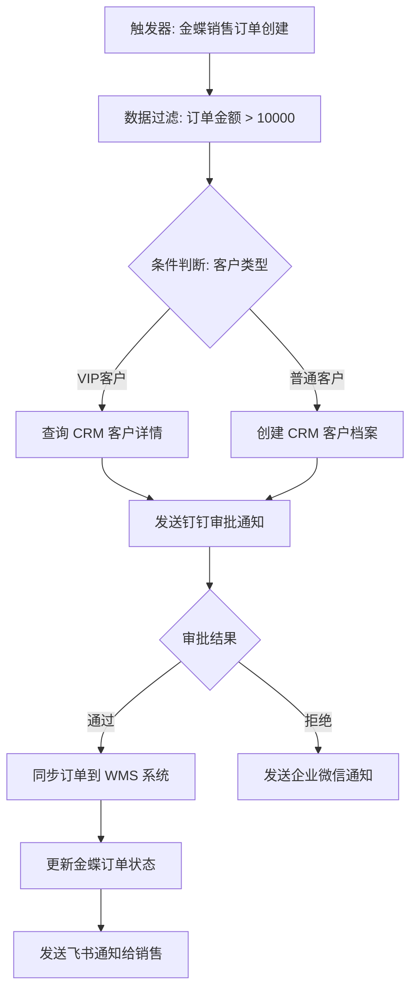

#### 2.2.2 数据流程

数环通提供强大的数据流程管理能力，支持跨系统数据同步、ETL 处理和字段映射：

**数据同步模式**：

| 同步模式 | 描述 | 适用场景 |
|---------|------|---------|
| **全量同步** | 每次同步全部数据 | 数据量小、需要全量刷新的场景 |
| **增量同步** | 仅同步变更数据 | 数据量大、需要高效同步的场景 |
| **实时同步** | 基于 Webhook/事件驱动实时同步 | 对时效性要求高的场景 |
| **定时同步** | 定时拉取数据同步 | 对时效性要求不高的批量同步场景 |

**ETL 能力**：

| 能力 | 描述 | 示例 |
|------|------|------|
| **Extract（抽取）** | 从源系统抽取数据 | 从金蝶 API 拉取订单数据 |
| **Transform（转换）** | 数据清洗、格式转换、字段映射 | 日期格式转换、金额单位换算、枚举值映射 |
| **Load（加载）** | 将转换后的数据写入目标系统 | 写入 Salesforce 创建 Opportunity |

**字段映射示例**：

```
源字段（金蝶）                    目标字段（Salesforce）
─────────────────────────────────────────────────────
FNumber           →    AccountNumber
FName             →    Name
FCustId_FNumber   →    CustomerId__c
FSaleAmount       →    Amount（元→万元）
FSaleDate         →    CloseDate（格式: yyyy-MM-dd）
FSalerId_FName    →    OwnerId（查询用户映射表）
```

#### 2.2.3 业务流程

数环通支持多种业务流程模式，满足企业不同场景的自动化需求：

| 流程类型 | 描述 | 典型场景 | 触发方式 |
|---------|------|---------|---------|
| **审批流** | 多级审批自动流转，审批结果驱动后续动作 | 采购审批、费用报销、合同审批 | 事件触发 / 手动触发 |
| **通知流** | 多渠道消息自动推送，支持条件路由 | 订单通知、异常告警、任务提醒 | 事件触发 / 定时触发 |
| **同步流** | 多系统数据实时或定时同步 | 通讯录同步、订单同步、库存同步 | 定时触发 / Webhook 触发 |
| **定时任务** | 定时执行数据拉取、报表生成、清理任务 | 日报生成、数据备份、过期数据清理 | 定时触发（Cron 表达式） |
| **事件驱动流** | 监听系统事件，触发关联流程 | 客户创建触发欢迎邮件、订单支付触发发货 | 事件触发 / Webhook 触发 |

#### 2.2.4 Webhook 与 API 集成

**Webhook 能力**：

| 能力 | 描述 |
|------|------|
| **Webhook 接收** | 生成唯一 Webhook URL，接收外部系统推送的事件数据 |
| **Webhook 发送** | 流程执行中向外部系统发送 HTTP 请求 |
| **签名验证** | 支持 HMAC-SHA256 签名验证，确保 Webhook 来源可信 |
| **重试机制** | Webhook 推送失败自动重试，支持指数退避策略 |
| **数据转换** | Webhook 接收数据自动解析 JSON/XML，支持字段提取 |

**Webhook 接收配置示例**：

```json
{
  "webhookUrl": "https://api.shuhuantong.com/webhook/wh_abc123def456",
  "method": "POST",
  "auth": {
    "type": "hmac",
    "header": "X-Signature",
    "algorithm": "SHA256",
    "secret": "{{webhook_secret}}"
  },
  "payloadMapping": {
    "event_type": "$.header.X-Event-Type",
    "data": "$.body.data",
    "timestamp": "$.body.timestamp"
  },
  "responseCode": 200
}
```

**API 集成能力**：

| 能力 | 描述 |
|------|------|
| **REST API 调用** | 支持 GET/POST/PUT/DELETE/PATCH 全部 HTTP 方法 |
| **GraphQL 支持** | 支持 GraphQL 查询和变更操作 |
| **SOAP 支持** | 支持 SOAP/XML 协议接口调用 |
| **批量 API** | 支持批量请求合并，减少调用次数 |
| **API 代理** | 通过数环通代理转发 API 请求，隐藏后端真实地址 |

#### 2.2.5 自定义连接器开发

数环通支持开发者创建自定义连接器并发布到连接器市场，供企业内外部共享使用：

**自定义连接器开发流程**：

1. **定义基本信息**：连接器名称、描述、图标、分类
2. **配置认证方式**：选择 API Key / OAuth2 / Basic Auth 等认证模式
3. **定义动作（Actions）**：配置每个 API 端点的请求参数和响应映射
4. **定义触发器（Triggers）**：配置 Webhook 触发或轮询触发
5. **测试验证**：在线测试每个动作和触发器的正确性
6. **发布共享**：发布到企业私有连接器库或公共连接器市场

**自定义连接器与预置连接器对比**：

| 对比维度 | 预置连接器 | 自定义连接器 |
|---------|-----------|------------|
| **开发方式** | 平台预置，开箱即用 | 用户自行配置开发 |
| **覆盖范围** | 500+ 主流应用 | 任意 HTTP API 系统 |
| **维护责任** | 平台负责更新维护 | 用户自行维护 |
| **共享范围** | 所有用户可用 | 可设为私有或公开共享 |
| **复杂度** | 配置简单，参数填入即可 | 需理解 API 文档，配置较复杂 |
| **适用场景** | 主流 SaaS 应用集成 | 内部系统、私有 API、小众应用 |

### 2.3 数据处理能力

数环通提供丰富的数据处理节点，满足复杂的数据转换和加工需求：

| 处理能力 | 描述 | 典型用法 |
|---------|------|---------|
| **数据过滤** | 根据条件筛选数据行 | 过滤金额 > 10000 的订单 |
| **字段映射** | 源字段到目标字段的映射转换 | 将"姓名"映射为"name" |
| **数据转换脚本** | 使用 JavaScript 脚本进行复杂数据转换 | 日期格式化、金额计算、字符串拼接 |
| **条件判断** | If/Else 条件分支路由 | 根据订单状态执行不同逻辑 |
| **循环** | For Each 遍历数组并逐条处理 | 遍历订单明细逐条同步 |
| **聚合** | 多条数据聚合为汇总结果 | 计算订单总金额、统计数量 |
| **去重** | 基于主键或指定字段去除重复数据 | 通讯录同步时去重 |
| **格式化** | 数据格式转换（日期、数字、字符串） | 时间戳转日期字符串、数字千分位 |
| **合并** | 多个数据源合并为一个数据集 | 合并多个 API 返回的数据 |
| **拆分** | 将一条数据拆分为多条 | 将包含多个明细的订单拆分为独立行 |

### 2.4 流程调度能力

| 调度模式 | 描述 | 配置方式 | 适用场景 |
|---------|------|---------|---------|
| **实时触发** | 事件发生后立即执行流程 | Webhook / 事件订阅 | 订单创建、用户注册等实时响应 |
| **定时触发** | 按照时间计划执行流程 | Cron 表达式 | 每日数据同步、定时报表生成 |
| **Webhook 触发** | 接收外部 HTTP 请求触发流程 | 生成 Webhook URL | 第三方系统回调、支付通知 |
| **手动触发** | 用户在控制台手动执行流程 | 手动点击运行按钮 | 一次性数据迁移、临时数据处理 |
| **子流程调用** | 其他流程执行中调用子流程 | 流程节点配置 | 流程复用、模块化编排 |

**定时触发 Cron 表达式示例**：

| Cron 表达式 | 执行频率 | 说明 |
|------------|---------|------|
| `0 0 2 * * ?` | 每天凌晨 2 点 | 每日数据全量同步 |
| `0 */30 * * * ?` | 每 30 分钟 | 高频数据增量同步 |
| `0 0 9,18 * * ?` | 每天 9 点和 18 点 | 上下班考勤数据同步 |
| `0 0 0 1 * ?` | 每月 1 日零点 | 月度报表生成 |
| `0 0 10 ? * MON-FRI` | 工作日 10 点 | 工作日定时提醒 |

### 2.5 连接器发布与共享机制

数环通提供连接器生命周期管理能力，支持连接器的创建、测试、发布、版本管理和共享：

**连接器生命周期**：

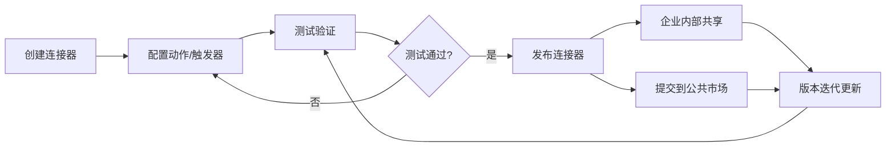

| 阶段 | 描述 | 关键操作 |
|------|------|---------|
| **创建** | 定义连接器基本信息和认证方式 | 填写名称、描述、选择认证模式 |
| **配置** | 定义动作和触发器 | 配置 API 端点、参数映射、响应解析 |
| **测试** | 验证连接器功能正确性 | 发送测试请求、检查响应、调试映射 |
| **发布** | 发布到连接器市场或企业库 | 设置共享范围、版本号、变更日志 |
| **版本管理** | 连接器版本迭代与兼容性管理 | 版本号规则、向后兼容检查、灰度发布 |
| **监控** | 连接器运行状态监控 | 调用次数、成功率、响应时间、错误日志 |

---

## 三、应用场景分析

### 3.1 典型应用场景

#### 3.1.1 企业通讯与业务系统集成

**场景描述**：将 open-app 的 IM、会议、云盒子等通讯能力通过数环通开放给企业现有业务系统，实现业务系统与通讯能力的深度融合。

**集成方案**：

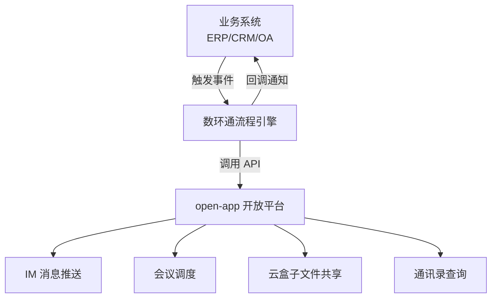

**典型流程**：
- ERP 订单创建 → 数环通 → open-app IM 发送订单通知
- CRM 客户拜访提醒 → 数环通 → open-app 会议自动创建
- OA 审批完成 → 数环通 → open-app IM 推送审批结果

#### 3.1.2 HR 系统与通讯录同步

**场景描述**：将北森、2号人事部等 HR 系统的员工数据与 open-app 通讯录实时同步，确保组织架构和人员信息的一致性。

**同步流程**：

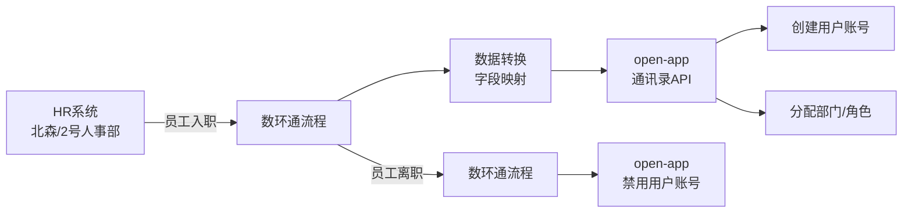

**关键能力**：
- 员工入职自动创建 open-app 账号并分配部门
- 员工离职自动禁用 open-app 账号
- 组织架构变更自动同步到 open-app 通讯录
- 考勤数据双向同步

#### 3.1.3 ERP 与审批流程对接

**场景描述**：将金蝶、用友等 ERP 系统的审批流程与 open-app 通知/审批能力对接，实现移动端审批和实时通知。

**对接方案**：

| ERP 事件 | 数环通处理 | open-app 动作 |
|---------|-----------|-------------|
| 采购订单待审批 | 数据转换 + 条件路由 | IM 推送审批通知 |
| 费用报销待审批 | 数据映射 + 审批流 | 创建审批单 + IM 通知 |
| 合同签署完成 | 状态同步 + 消息推送 | IM 推送签署结果 |
| 付款审批通过 | 数据回写 + 通知 | 更新 ERP 状态 + 通知申请人 |

#### 3.1.4 CRM 与消息通知联动

**场景描述**：将纷享销客、销售易等 CRM 系统的客户动态与 open-app IM 通知联动，确保销售团队及时获取客户信息。

**联动方案**：

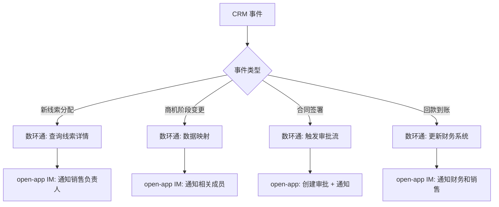

#### 3.1.5 多系统数据同步与治理

**场景描述**：企业存在多个业务系统（ERP、CRM、HR、OA、财务），需要通过数环通实现跨系统数据同步与治理，确保数据一致性和准确性。

**数据治理能力**：

| 治理维度 | 数环通支持 | 说明 |
|---------|-----------|------|
| **数据质量** | 数据校验、清洗、去重 | 确保同步数据的准确性和完整性 |
| **数据映射** | 字段映射、枚举值转换 | 不同系统间数据格式统一 |
| **数据血缘** | 流程追踪、数据来源标记 | 清晰追踪数据流转路径 |
| **数据脱敏** | 字段级别脱敏处理 | 敏感数据在同步过程中脱敏 |
| **数据审计** | 操作日志、变更记录 | 记录所有数据同步操作，便于审计追溯 |
| **异常处理** | 错误重试、降级策略 | 同步失败自动重试，确保数据最终一致 |

### 3.2 与 open-app 的集成场景

#### 3.2.1 open-app 4 种开放模式与数环通的映射

open-app 提供 4 种开放模式，每种模式都可与数环通的触发/动作机制进行映射：

| open-app 开放模式 | 模式说明 | 数环通映射 | 集成方式 |
|------------------|---------|-----------|---------|
| **API 模式** | 外部系统调用 open-app 内部能力 | 数环通 Action（动作） | 数环通流程中调用 open-app API 节点 |
| **Event 模式** | open-app 内部事件推送到外部 | 数环通 Trigger（触发器） | open-app 事件通过 Webhook 触发数环通流程 |
| **WebHook/Callback 模式** | open-app 内部操作触发回调到外部 | 数环通 Trigger（触发器） | open-app 回调通知触发数环通流程 |
| **Bot 模式** | 双向交互式机器人 | 数环通 Trigger + Action | Bot 消息触发流程，流程执行后回复 Bot 消息 |

**API 模式集成示例**：

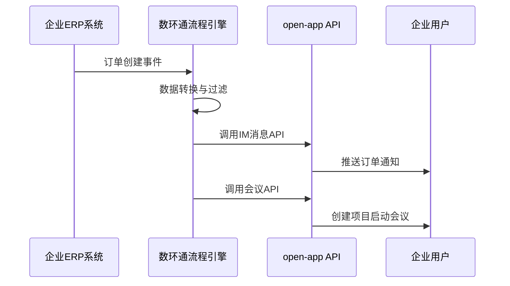

**Event 模式集成示例**：

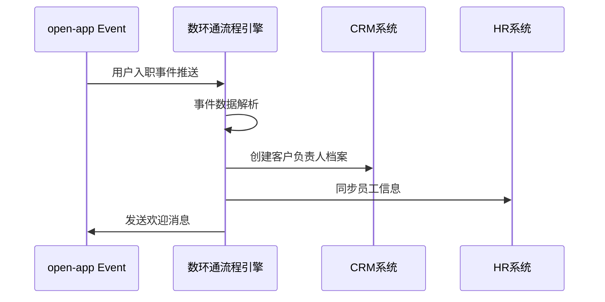

#### 3.2.2 数环通作为 open-app 连接国内企业系统

数环通作为国产 iPaaS 平台，可以作为 open-app 与国内企业系统之间的集成桥梁：

**核心价值**：
- **无需逐个对接**：open-app 只需开放 API/Event，数环通负责连接各业务系统
- **降低集成复杂度**：数环通提供可视化编排，降低集成开发门槛
- **加速生态覆盖**：通过数环通 500+ 连接器，open-app 能力可快速触达各业务系统
- **统一集成管理**：所有集成流程在数环通统一管理、监控、运维

**架构图**：

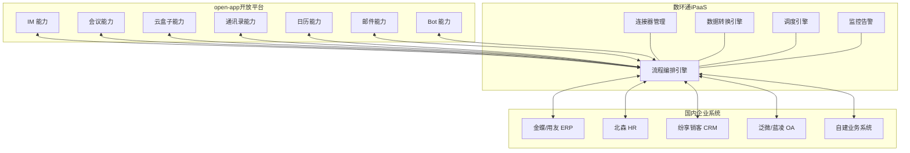

#### 3.2.3 open-app 能力通过数环通触达国内 SaaS 生态

通过数环通的连接器网络，open-app 的通讯能力可以触达国内主流 SaaS 生态：

| open-app 能力 | 数环通连接器 | 触达的 SaaS 系统 | 典型场景 |
|-------------|-----------|---------------|---------|
| IM 消息 | 企业微信/钉钉/飞书连接器 | 企业微信、钉钉、飞书 | 跨平台消息推送 |
| 通讯录 | 北森/2号人事部连接器 | 北森、2号人事部、薪人薪事 | 组织架构同步 |
| 会议 | 日历/日程连接器 | 钉钉日历、飞书日历 | 会议自动创建 |
| 审批 | 泛微/蓝凌连接器 | 泛微、蓝凌、致远 | 审批流程联动 |
| 文件 | 云盒子/OSS连接器 | 阿里云 OSS、腾讯云 COS | 文件自动归档 |
| Bot | 机器人连接器 | 企业微信机器人、钉钉机器人 | 智能助手联动 |

---

## 四、开发指南

### 4.1 流程创建流程

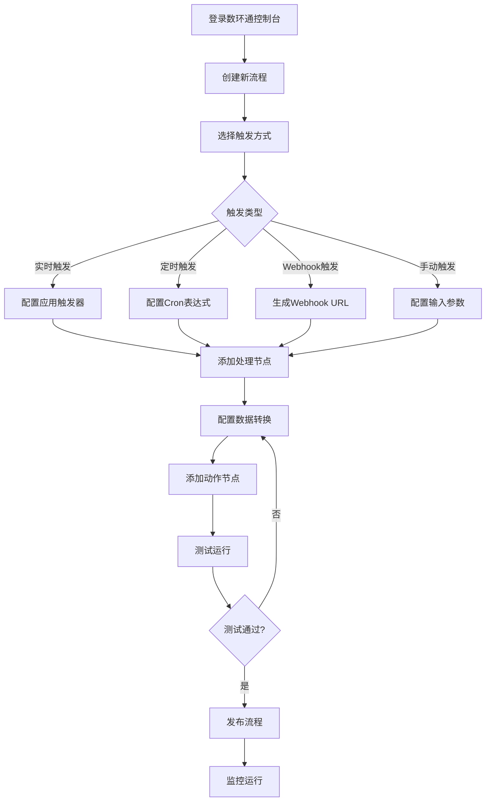

**详细步骤**：

1. **登录控制台**：访问数环通官网，使用企业账号登录管理控制台
2. **创建流程**：点击"新建流程"，输入流程名称和描述
3. **选择触发方式**：根据业务需求选择实时/定时/Webhook/手动触发
4. **配置触发器**：选择应用连接器，配置触发条件和认证信息
5. **添加处理节点**：拖拽数据过滤、转换、条件判断等节点
6. **配置数据转换**：设置字段映射、JavaScript 脚本等
7. **添加动作节点**：配置目标应用的动作（如发送消息、创建记录等）
8. **测试运行**：使用测试数据验证流程正确性
9. **发布流程**：测试通过后发布流程，流程开始按配置运行

### 4.2 自定义连接器开发

**创建 open-app 自定义连接器的完整配置示例**：

**步骤 1：基本信息配置**

| 配置项 | 值 |
|-------|-----|
| 连接器名称 | open-app 通讯平台 |
| 连接器描述 | 连接 open-app 开放平台，支持 IM、会议、通讯录等能力 |
| 分类 | 协同办公 |
| 图标 | open-app Logo |
| 基础 URL | `https://api.open-app.example.com/v1` |

**步骤 2：认证配置（OAuth 2.0）**

```json
{
  "authType": "oauth2",
  "grantType": "client_credentials",
  "tokenUrl": "https://api.open-app.example.com/oauth/token",
  "authorizeUrl": "https://api.open-app.example.com/oauth/authorize",
  "clientId": "{{client_id}}",
  "clientSecret": "{{client_secret}}",
  "scope": "im:message:send contact:user:read meeting:schedule calendar:event drive:file",
  "tokenPlacement": "header",
  "headerPrefix": "Bearer "
}
```

**步骤 3：动作定义**

| 动作名称 | HTTP 方法 | 路径 | 描述 |
|---------|----------|------|------|
| 发送文本消息 | POST | /im/messages | 向指定用户/群发送文本消息 |
| 发送卡片消息 | POST | /im/messages | 向指定用户/群发送交互卡片 |
| 查询用户信息 | GET | /contact/users/{user_id} | 查询用户详细信息 |
| 查询部门列表 | GET | /contact/departments | 查询部门列表 |
| 创建会议 | POST | /meetings | 创建视频会议 |
| 查询日历事件 | GET | /calendar/events | 查询日历事件列表 |
| 上传文件 | POST | /drive/files/upload | 上传文件到云盒子 |

**步骤 4：触发器定义**

| 触发器名称 | 类型 | 描述 |
|-----------|------|------|
| 接收IM消息 | Webhook | 当收到 IM 消息时触发 |
| 会议状态变更 | Webhook | 当会议状态变更时触发 |
| 通讯录变更 | Webhook | 当通讯录信息变更时触发 |
| 审批状态变更 | Webhook | 当审批状态变更时触发 |

### 4.3 数据转换脚本开发

数环通支持使用 JavaScript 编写数据转换脚本，实现复杂的业务逻辑：

**示例 1：open-app 消息体格式转换**

```javascript
/**
 * 将 ERP 订单数据转换为 open-app IM 消息格式
 * 输入：ERP 订单数据
 * 输出：open-app 卡片消息体
 */
function transformOrderToMessage(input) {
  const order = input.data;
  
  // 状态映射
  const statusMap = {
    'PENDING': '待处理',
    'APPROVED': '已审批',
    'SHIPPED': '已发货',
    'COMPLETED': '已完成',
    'CANCELLED': '已取消'
  };

  // 优先级映射
  const priorityMap = {
    'HIGH': '🔴 紧急',
    'MEDIUM': '🟡 一般',
    'LOW': '🟢 低'
  };

  return {
    receive_id: order.salesPersonId,
    msg_type: "interactive",
    content: JSON.stringify({
      header: {
        title: `订单通知：${order.orderNo}`,
        template: order.priority === 'HIGH' ? 'red' : 'blue'
      },
      elements: [
        {
          tag: "column_set",
          columns: [
            { tag: "column", width: "auto", elements: [{ tag: "markdown", content: `**客户**
${order.customerName}` }] },
            { tag: "column", width: "auto", elements: [{ tag: "markdown", content: `**金额**
¥${order.amount.toLocaleString()}` }] }
          ]
        },
        {
          tag: "markdown",
          content: `**状态**：${statusMap[order.status]}
**优先级**：${priorityMap[order.priority]}
**下单时间**：${new Date(order.createTime).toLocaleString('zh-CN')}`
        },
        {
          tag: "action",
          actions: [
            { tag: "button", text: "查看详情", url: `https://erp.company.com/orders/${order.orderNo}`, type: "primary" },
            { tag: "button", text: "审批", url: `https://erp.company.com/approve/${order.orderNo}`, type: "default" }
          ]
        }
      ]
    })
  };
}
```

**示例 2：HR 员工数据同步转换**

```javascript
/**
 * 将北森 HR 系统员工数据转换为 open-app 通讯录格式
 */
function transformEmployeeData(input) {
  const emp = input.data;
  
  // 部门路径解析
  const deptPath = emp.departmentFullPath || '';
  const deptNames = deptPath.split('/').filter(d => d.trim());
  
  return {
    user_id: emp.employeeNumber,
    name: emp.name,
    mobile: emp.mobile,
    email: emp.email || `${emp.employeeNumber}@company.com`,
    department_ids: deptNames,  // open-app 部门名称列表
    position: emp.positionName,
    gender: emp.gender === '1' ? 1 : 2,
    join_time: emp.hireDate,
    status: emp.status === 'ACTIVE' ? 1 : 0,  // 1=启用, 0=禁用
    custom_attrs: {
      employee_type: emp.employeeType,
      cost_center: emp.costCenter,
      direct_leader: emp.directLeaderName
    }
  };
}
```

**示例 3：多维数据聚合**

```javascript
/**
 * 聚合多个系统的数据，生成综合报表
 */
function aggregateReport(inputs) {
  // inputs 包含来自 ERP、CRM、HR 三个系统的数据
  const erpOrders = inputs.erpOrders || [];
  const crmDeals = inputs.crmDeals || [];
  const hrEmployees = inputs.hrEmployees || [];
  
  // 按部门聚合
  const departmentStats = {};
  
  erpOrders.forEach(order => {
    const dept = order.department || '未分配';
    if (!departmentStats[dept]) {
      departmentStats[dept] = { orderCount: 0, orderAmount: 0, dealCount: 0, dealAmount: 0, headcount: 0 };
    }
    departmentStats[dept].orderCount++;
    departmentStats[dept].orderAmount += parseFloat(order.amount || 0);
  });
  
  crmDeals.forEach(deal => {
    const dept = deal.department || '未分配';
    if (!departmentStats[dept]) {
      departmentStats[dept] = { orderCount: 0, orderAmount: 0, dealCount: 0, dealAmount: 0, headcount: 0 };
    }
    departmentStats[dept].dealCount++;
    departmentStats[dept].dealAmount += parseFloat(deal.amount || 0);
  });
  
  hrEmployees.forEach(emp => {
    const dept = emp.department || '未分配';
    if (!departmentStats[dept]) {
      departmentStats[dept] = { orderCount: 0, orderAmount: 0, dealCount: 0, dealAmount: 0, headcount: 0 };
    }
    if (emp.status === 'ACTIVE') {
      departmentStats[dept].headcount++;
    }
  });
  
  // 生成报表
  return Object.entries(departmentStats).map(([dept, stats]) => ({
    department: dept,
    headcount: stats.headcount,
    orderCount: stats.orderCount,
    orderAmount: stats.orderAmount.toFixed(2),
    dealCount: stats.dealCount,
    dealAmount: stats.dealAmount.toFixed(2),
    perCapitaOrder: stats.headcount > 0 ? (stats.orderAmount / stats.headcount).toFixed(2) : '0'
  }));
}
```

### 4.4 认证方式

数环通支持多种认证方式，适配不同系统的安全要求：

| 认证方式 | 描述 | 配置参数 | 适用场景 |
|---------|------|---------|---------|
| **API Key** | 通过 API Key 进行身份验证 | Key Name、Key Value、传递位置（Header/Query） | 简单 API 调用、内部服务 |
| **OAuth 2.0** | 标准 OAuth 2.0 授权流程 | Token URL、Client ID、Client Secret、Scope | 主流 SaaS 平台、标准 API |
| **Basic Auth** | HTTP 基本认证 | Username、Password | 旧版系统、简单认证场景 |
| **Bearer Token** | 令牌认证 | Token 值、前缀 | API 网关、微服务 |
| **自定义 Token** | 自定义令牌获取逻辑 | Token 获取 URL、请求体、过期时间 | 非标准认证体系 |
| **HMAC 签名** | 基于 HMAC 的请求签名 | Secret Key、签名算法、签名头 | 高安全要求场景、支付接口 |

**open-app OAuth 2.0 认证配置示例**：

```
认证类型：OAuth 2.0
授权类型：Client Credentials
Token URL：https://api.open-app.example.com/oauth/token
Client ID：your_client_id
Client Secret：your_client_secret
Scope：im:message:send contact:user:read meeting:schedule
Token 放置位置：Header
Token 前缀：Bearer
Token 有效期：7200秒
自动刷新：是
```

### 4.5 最佳实践

**流程设计最佳实践**：

| 实践 | 描述 | 原因 |
|------|------|------|
| **单一职责** | 每个流程只做一件事 | 降低复杂度，便于维护和复用 |
| **子流程复用** | 将通用逻辑封装为子流程 | 避免重复配置，统一维护入口 |
| **异常处理** | 为每个关键节点配置异常处理 | 防止单点故障导致整个流程失败 |
| **幂等设计** | 确保流程重复执行结果一致 | 支持安全重试，避免数据重复 |
| **数据校验** | 在关键节点添加数据校验 | 尽早发现问题，防止脏数据扩散 |
| **日志记录** | 在关键节点记录日志 | 便于问题排查和审计追溯 |

**性能优化最佳实践**：

- **批量操作**：使用批量 API 减少调用次数，如批量发送消息、批量创建用户
- **分页处理**：大量数据分页获取，避免单次请求数据量过大
- **增量同步**：优先使用增量同步而非全量同步，减少数据传输量
- **并发控制**：合理设置并发度，既保证效率又避免触发限流
- **缓存利用**：对频繁访问的配置数据使用缓存，减少 API 调用

---

## 五、优势与劣势分析

### 5.1 核心优势

#### 5.1.1 国产化优势

| 优势维度 | 详细描述 |
|---------|---------|
| **国产自主可控** | 完全国产 iPaaS 平台，数据不出境，符合数据安全法规 |
| **信创适配** | 支持信创环境部署，适配国产操作系统、数据库、中间件 |
| **人民币定价** | 人民币计费，无汇率波动风险，财务预算可控 |
| **本地化服务** | 国内团队提供售前、实施、售后全流程服务，响应及时 |
| **合规保障** | 通过等保三级、SOC2 审计，满足国内合规要求 |

#### 5.1.2 连接器优势

| 优势维度 | 详细描述 |
|---------|---------|
| **国内 SaaS 覆盖广** | 深度覆盖国内主流 SaaS（金蝶、用友、北森、纷享销客等），比国际平台更全面 |
| **国内 SaaS 适配深** | 对国内 SaaS 的 API 更新跟进更快，接口适配更深入 |
| **自定义连接器** | 支持自定义连接器开发，覆盖任意 HTTP API 系统 |
| **连接器市场** | 提供连接器市场，用户可共享和复用连接器 |

#### 5.1.3 数据转换优势

| 优势维度 | 详细描述 |
|---------|---------|
| **JavaScript 脚本** | 支持完整的 JavaScript 脚本引擎，可实现任意复杂的数据转换逻辑 |
| **丰富的处理节点** | 数据过滤、映射、聚合、去重、格式化等开箱即用的处理节点 |
| **字段映射** | 可视化字段映射，支持嵌套数据展开和复杂表达式 |
| **实时预览** | 数据转换过程中实时预览处理结果，快速验证转换逻辑 |

#### 5.1.4 企业级安全

| 优势维度 | 详细描述 |
|---------|---------|
| **等保三级** | 通过国家信息安全等级保护三级认证 |
| **SOC2 审计** | 通过 SOC2 Type II 审计，符合国际安全标准 |
| **数据加密** | 传输加密（TLS 1.2+）、存储加密（AES-256） |
| **访问控制** | 基于角色的访问控制（RBAC），细粒度权限管理 |
| **审计日志** | 完整的操作审计日志，支持合规审查 |
| **数据驻留** | 支持数据本地化存储，满足数据不出境要求 |

### 5.2 潜在劣势

#### 5.2.1 生态劣势

| 劣势维度 | 详细描述 |
|---------|---------|
| **应用数量** | 500+ 连接器，相比 Zapier（6000+）、Workato（1500+）仍有差距 |
| **国际应用** | 国际 SaaS 连接器深度不如国际平台，对海外应用支持有限 |
| **品牌知名度** | 相比 Zapier、MuleSoft 等国际品牌，全球知名度有待提升 |
| **生态成熟度** | 开发者社区规模、模板/方案丰富度不如成熟国际平台 |

#### 5.2.2 技术劣势

| 劣势维度 | 详细描述 |
|---------|---------|
| **高并发处理** | 超大规模数据同步场景下，性能瓶颈可能显现 |
| **AI 能力** | 缺乏内置 AI/ML 能力，智能化水平有待提升 |
| **API 管理** | API 全生命周期管理能力不如专业 API 管理平台 |
| **私有化部署** | 私有化部署方案成熟度有待进一步验证 |

#### 5.2.3 其他劣势

| 劣势维度 | 详细描述 |
|---------|---------|
| **文档完善度** | 部分连接器文档不够详细，学习成本较高 |
| **模板方案** | 行业模板和最佳实践方案数量有限 |
| **培训资源** | 官方培训课程和认证体系不如国际平台完善 |
| **全球化** | 多语言支持、全球节点部署等全球化能力不足 |

---

## 六、成本分析

### 6.1 定价方案

数环通采用人民币定价，提供多个版本满足不同规模企业需求：

| 版本 | 月费（元） | 年费（元） | 流程数 | 任务执行次数/月 | 连接器数 | 适用场景 |
|------|----------|----------|--------|---------------|---------|---------|
| **免费版** | 0 | 0 | 5 | 1,000 | 50+ | 个人体验、小规模测试 |
| **基础版** | 299 | 2,990 | 20 | 10,000 | 200+ | 小微企业基础集成 |
| **专业版** | 999 | 9,990 | 100 | 50,000 | 500+ | 中型企业核心业务集成 |
| **企业版** | 定制 | 定制 | 不限 | 不限 | 全部+定制 | 大型企业深度集成 |

**各版本详细对比**：

| 功能特性 | 免费版 | 基础版 | 专业版 | 企业版 |
|---------|--------|--------|--------|--------|
| 流程数量 | 5 | 20 | 100 | 不限 |
| 月执行次数 | 1,000 | 10,000 | 50,000 | 不限 |
| 连接器访问 | 50+ | 200+ | 500+ | 全部+定制 |
| 数据转换节点 | 基础 | 标准 | 高级 | 全部 |
| JavaScript 脚本 | - | 支持 | 支持 | 支持 |
| 子流程 | - | - | 支持 | 支持 |
| 团队协作 | 1人 | 3人 | 10人 | 不限 |
| 审计日志 | 7天 | 30天 | 90天 | 不限 |
| 专属技术支持 | - | - | 支持 | 支持（专属客户经理） |
| 私有化部署 | - | - | - | 支持 |
| SLA 保障 | 99.5% | 99.5% | 99.9% | 99.99% |
| 数据驻留指定 | - | - | - | 支持 |

### 6.2 开发成本

| 成本项 | 说明 | 预估费用 |
|--------|------|---------|
| **学习成本** | 学习数环通平台操作和流程编排 | 1-2 周培训时间 |
| **流程开发** | 可视化编排，无需编码 | 每个流程 0.5-2 人天 |
| **自定义连接器** | 配置 API 端点、认证、映射 | 每个连接器 1-3 人天 |
| **数据转换脚本** | JavaScript 脚本开发 | 每个脚本 0.5-1 人天 |
| **测试验证** | 流程测试和联调 | 每个流程 0.5-1 人天 |
| **总开发成本** | 中等规模集成项目（20个流程） | 约 20-40 人天 |

### 6.3 运营成本

| 成本项 | 说明 | 月费估算（专业版） |
|--------|------|----------------|
| **平台订阅费** | 数环通专业版 | 999 元/月 |
| **超出执行次数** | 超出 50,000 次/月后按量计费 | 约 0.01 元/次 |
| **维护人力** | 流程维护和优化 | 0.5 人/月 |
| **技术支持** | 专属技术支持（专业版含） | 0 元 |
| **总运营成本** | 中等使用量 | 约 3,000-5,000 元/月 |

**成本对比（与自研集成方案）**：

| 对比维度 | 数环通方案 | 自研集成方案 |
|---------|-----------|------------|
| **初始开发** | 2-4 周 | 2-3 个月 |
| **开发成本** | 20-40 人天 | 80-120 人天 |
| **维护成本** | 0.5 人/月 | 2-3 人/月 |
| **新系统集成** | 1-3 天/个 | 1-2 周/个 |
| **技术风险** | 低（平台保障） | 高（自研维护） |
| **3年总成本** | 约 15-25 万元 | 约 60-100 万元 |

---

## 七、技术架构建议

### 7.1 open-app 数环通连接器架构设计

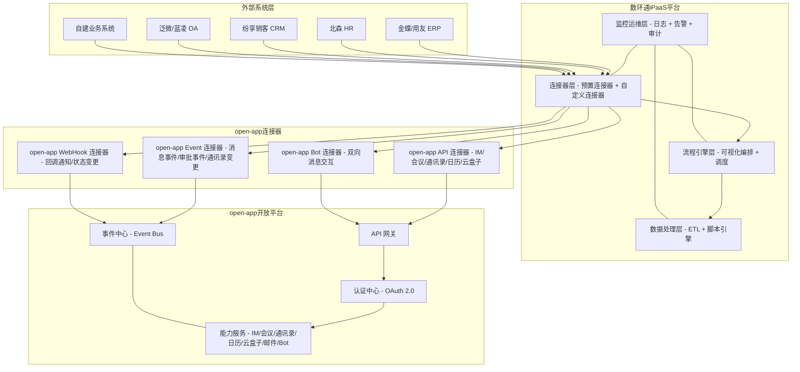

### 7.2 关键技术选型

#### 7.2.1 连接器开发技术栈

| 技术组件 | 推荐方案 | 说明 |
|---------|---------|------|
| **连接器协议** | HTTPS / REST | open-app API 采用 RESTful 风格 |
| **认证方式** | OAuth 2.0 (Client Credentials) | 服务端对服务端调用，安全可靠 |
| **数据格式** | JSON | open-app API 请求/响应统一使用 JSON |
| **事件传输** | Webhook (HTTPS POST) | open-app 事件通过 Webhook 推送到数环通 |
| **签名验证** | HMAC-SHA256 | 确保 Webhook 回调来源可信 |
| **数据转换** | JavaScript (ES6+) | 数环通内置 JS 引擎，支持复杂转换 |
| **错误处理** | 重试 + 降级 | 指数退避重试 + 死信队列 |

#### 7.2.2 集成架构技术选型

| 技术组件 | 推荐方案 | 说明 |
|---------|---------|------|
| **API 网关** | Kong / APISIX | 统一入口、限流、认证、日志 |
| **消息队列** | Apache Kafka / RocketMQ | 事件解耦、削峰填谷、可靠投递 |
| **缓存** | Redis | Token 缓存、配置缓存、限流计数 |
| **数据库** | MySQL / PostgreSQL | 连接器配置、流程定义、执行日志 |
| **监控** | Prometheus + Grafana | 运行指标监控、告警 |
| **日志** | ELK Stack | 日志采集、检索、分析 |
| **容器** | Kubernetes | 容器化部署、弹性伸缩 |

### 7.3 安全架构

#### 7.3.1 安全架构设计

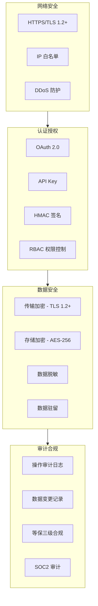

#### 7.3.2 安全措施详细说明

| 安全层级 | 措施 | 说明 |
|---------|------|------|
| **传输层** | TLS 1.2+ 加密 | 所有 API 通信和 Webhook 回调均使用 HTTPS |
| **认证层** | OAuth 2.0 + HMAC 签名 | API 调用使用 OAuth 2.0，Webhook 使用 HMAC 签名验证 |
| **授权层** | 最小权限原则 | 每个连接器只申请必要的 API 权限 Scope |
| **数据层** | 敏感数据加密 | Token、密钥等敏感数据加密存储 |
| **审计层** | 完整审计日志 | 记录所有 API 调用、数据访问、配置变更 |
| **合规层** | 等保三级 + SOC2 | 满足国内数据安全合规要求 |

---

## 八、实施路径建议

### 第一阶段：试点验证（2-4 周）

**目标**：验证 open-app 与数环通的集成可行性

**主要工作**：
- 开发 open-app 自定义连接器（API 模式 + Event 模式）
- 搭建 2-3 个典型集成流程（IM 通知、通讯录同步）
- 端到端测试验证
- 性能和安全测试

**交付物**：
- open-app 自定义连接器
- 试点集成流程
- 测试报告

### 第二阶段：核心场景建设（4-6 周）

**目标**：覆盖核心业务场景的集成需求

**主要工作**：
- 完善 open-app 4 种开放模式的连接器
- 开发 10-15 个常用集成流程模板
- 与 HR、ERP、CRM 等核心系统对接
- 建立监控和告警体系

**交付物**：
- 完整的 open-app 连接器套件
- 集成流程模板库
- 运维监控体系

### 第三阶段：生态扩展（6-8 周）

**目标**：扩展连接器生态，发布到数环通连接器市场

**主要工作**：
- 将 open-app 连接器发布到数环通公共连接器市场
- 开发行业解决方案模板（制造、零售、金融等）
- 建立开发者社区和文档体系
- 培训赋能合作伙伴

**交付物**：
- 数环通连接器市场上的 open-app 连接器
- 行业解决方案模板
- 开发者文档和培训材料

### 第四阶段：持续运营（持续）

**目标**：持续优化和扩展集成能力

**主要工作**：
- 根据用户反馈优化连接器和流程
- 新增连接器功能（跟随 open-app API 版本更新）
- 扩展行业解决方案覆盖
- 运营数据分析与优化

**团队配置建议**：

| 角色 | 人数 | 职责 |
|------|------|------|
| **项目经理** | 1 | 项目整体规划、进度把控 |
| **集成架构师** | 1 | 架构设计、技术选型、技术攻关 |
| **连接器开发** | 2 | open-app 连接器开发与维护 |
| **流程开发** | 2 | 集成流程模板开发 |
| **测试工程师** | 1 | 功能测试、性能测试、安全测试 |
| **运维工程师** | 1 | 部署运维、监控告警 |

**风险控制**：

| 风险类型 | 风险描述 | 应对措施 |
|---------|---------|---------|
| **技术风险** | open-app API 变更导致连接器失效 | 建立版本兼容机制，API 变更提前通知 |
| **进度风险** | 连接器开发进度延期 | 预留缓冲时间，优先开发核心场景 |
| **安全风险** | 数据传输过程中的安全风险 | 全链路加密，签名验证，最小权限 |
| **运维风险** | 流程执行异常或性能瓶颈 | 完善监控告警，建立应急预案 |
| **合规风险** | 数据出境或隐私保护合规 | 数据本地化存储，合规审查 |

---

## 九、总结与建议

### 9.1 总结

数环通作为国产 iPaaS 平台，具有以下特点：

**核心优势**：
- 国产自主可控，深度适配国内 SaaS 生态，支持信创环境
- 500+ 预置连接器，覆盖国内主流 ERP、HR、CRM、OA 等系统
- 强大的数据转换能力，支持 JavaScript 脚本、可视化字段映射
- 可视化拖拽式流程编排，降低集成开发门槛
- 企业级安全保障，等保三级、SOC2 审计
- 本地化服务支持，人民币定价，成本可控

**潜在劣势**：
- 连接器数量相比国际平台（Zapier 6000+、Workato 1500+）仍有差距
- 国际 SaaS 连接器深度不足，对海外应用支持有限
- 品牌知名度和生态成熟度有待提升
- 高并发、超大规模数据同步场景下性能瓶颈需关注
- AI 智能化能力有待加强

**与 open-app 的契合度**：
- 高度契合：open-app 面向国内企业市场，数环通是国内 iPaaS 领先者
- 生态互补：open-app 提供通讯能力，数环通提供连接能力，两者互补性强
- 模式映射：open-app 的 4 种开放模式（API/Event/WebHook/Bot）与数环通的触发/动作机制天然对应
- 价值放大：通过数环通，open-app 能力可快速触达国内 500+ 企业 SaaS 生态

### 9.2 建议

#### 9.2.1 平台选择建议

- **如果企业**：以国内 SaaS 生态为主，重视国产化替代和数据安全 → **推荐数环通**
- **如果企业**：需要连接大量国际 SaaS 应用，预算充足 → **推荐 Workato 或 MuleSoft**
- **如果企业**：以轻量级自动化为主，追求简单易用 → **推荐 Zapier 或 Make**
- **如果企业**：深度使用微软生态 → **推荐 Power Automate**

#### 9.2.2 open-app 集成建议

1. **优先开发 open-app 连接器**：将 open-app 4 种开放模式封装为标准数环通连接器
2. **建设集成流程模板库**：提供开箱即用的集成场景模板，降低用户使用门槛
3. **发布到连接器市场**：将 open-app 连接器发布到数环通公共市场，扩大覆盖面
4. **建立联合解决方案**：与数环通联合推出行业解决方案，提升市场影响力
5. **持续迭代优化**：跟随 open-app API 版本更新，持续优化连接器能力

#### 9.2.3 后续规划建议

1. **短期（1-3 个月）**：完成 open-app 连接器开发和试点验证
2. **中期（3-6 个月）**：覆盖核心业务场景，发布到连接器市场
3. **长期（6-12 个月）**：建设行业解决方案生态，与数环通深度合作

---

## 十、附录

### 10.1 相关资源

| 资源类型 | 链接 |
|---------|------|
| **数环通官网** | https://www.shuhuantong.com |
| **数环通文档中心** | https://docs.shuhuantong.com |
| **数环通连接器市场** | https://market.shuhuantong.com |
| **数环通开发者社区** | https://community.shuhuantong.com |
| **数环通定价** | https://www.shuhuantong.com/pricing |

### 10.2 术语表

| 术语 | 英文 | 说明 |
|------|------|------|
| iPaaS | Integration Platform as a Service | 集成平台即服务，云端集成平台 |
| ETL | Extract, Transform, Load | 数据抽取、转换、加载 |
| API | Application Programming Interface | 应用编程接口 |
| Webhook | Web Callback | Web 回调，事件推送机制 |
| OAuth | Open Authorization | 开放授权标准 |
| RBAC | Role-Based Access Control | 基于角色的访问控制 |
| CDC | Change Data Capture | 变更数据捕获 |
| SLA | Service Level Agreement | 服务等级协议 |
| SaaS | Software as a Service | 软件即服务 |
| CRM | Customer Relationship Management | 客户关系管理 |
| ERP | Enterprise Resource Planning | 企业资源计划 |
| HR | Human Resources | 人力资源 |
| OA | Office Automation | 办公自动化 |

### 10.3 常见问题

**Q1: 数环通与 Zapier 有什么区别？**
A: 数环通是国产 iPaaS 平台，深度适配国内 SaaS 生态（金蝶、用友、北森等），支持人民币定价和本地化服务，符合国内数据安全合规要求。Zapier 是国际平台，连接器数量更多（6000+），但对国内 SaaS 支持有限，数据出境合规风险较高。

**Q2: open-app 如何通过数环通开放能力？**
A: open-app 的 4 种开放模式与数环通天然对应：API 模式映射为数环通的动作（Action），Event 模式和 WebHook/Callback 模式映射为数环通的触发器（Trigger），Bot 模式同时支持触发和动作。只需开发 open-app 自定义连接器并配置到数环通即可。

**Q3: 数环通支持私有化部署吗？**
A: 数环通企业版支持私有化部署，可以将平台部署在企业自己的服务器或私有云上，满足数据不出企业网络边界的安全要求。私有化部署需要联系数环通商务团队获取方案。

**Q4: 数环通的数据处理能力如何？**
A: 数环通内置 JavaScript 脚本引擎和丰富的数据处理节点（过滤、映射、聚合、去重等），能够满足大部分数据转换需求。对于超大数据量场景，建议分批处理并使用增量同步模式。

**Q5: 如何确保 Webhook 回调的安全性？**
A: 数环通支持 HMAC-SHA256 签名验证，每次 Webhook 回调都会携带签名头，接收方通过验证签名确保请求来源可信。同时建议配置 IP 白名单和 HTTPS 加密传输。

**Q6: 数环通的 SLA 保障如何？**
A: 免费版和基础版 SLA 为 99.5%，专业版为 99.9%，企业版为 99.99%。企业版还提供专属客户经理和 7x24 小时技术支持。

**Q7: open-app 连接器开发需要多长时间？**
A: 基于 open-app 标准化的 RESTful API 和 OAuth 2.0 认证，开发一个基础连接器约需 1-3 人天，完善所有动作和触发器约需 5-10 人天。

**Q8: 数环通与 Workato 相比有什么优势和劣势？**
A: 优势在于国内 SaaS 覆盖更深、人民币定价成本更低、本地化服务更及时、数据合规性更好。劣势在于国际 SaaS 连接器数量较少、平台生态成熟度不如 Workato、AI/ML 内置能力不足。

---

**报告编制时间**：2026年5月
**报告版本**：V1.0
