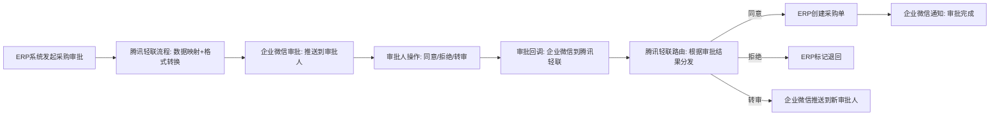
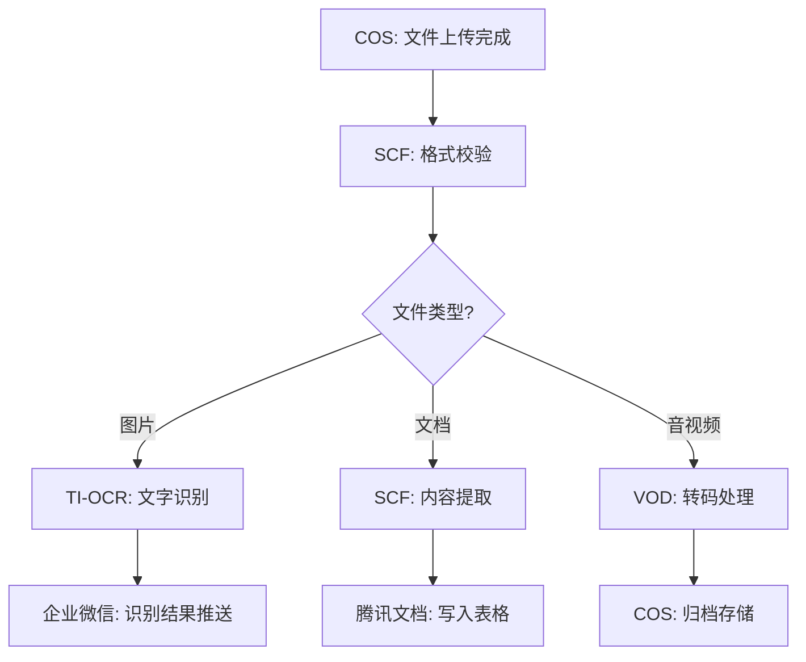
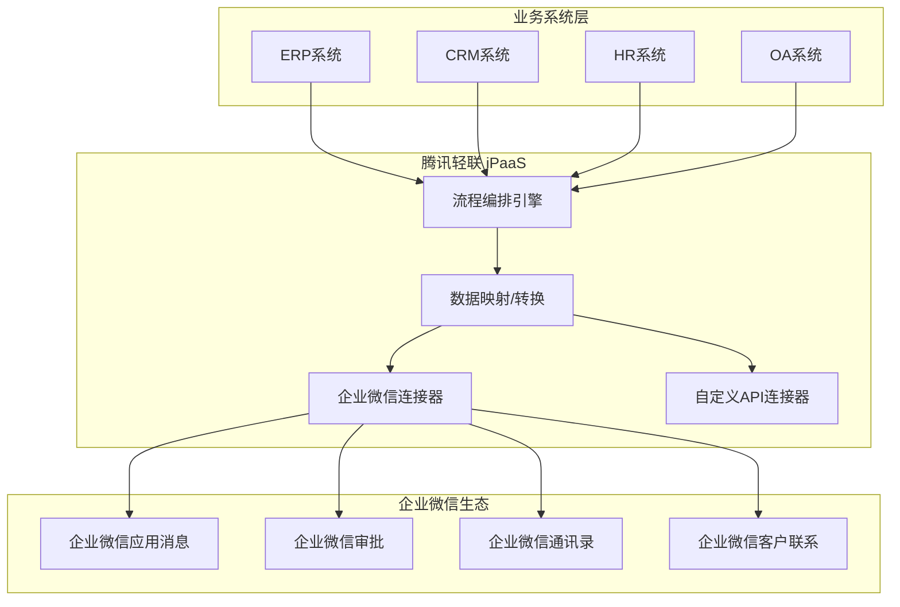
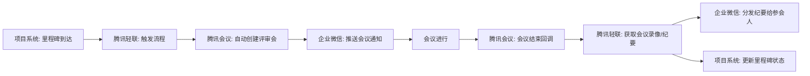
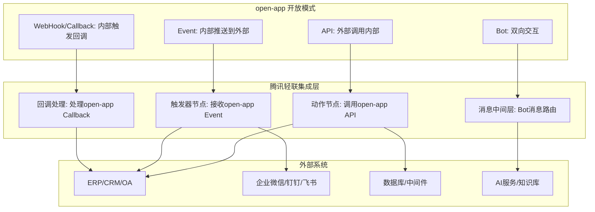
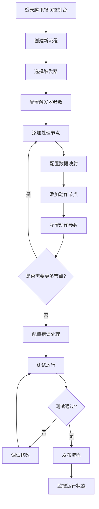
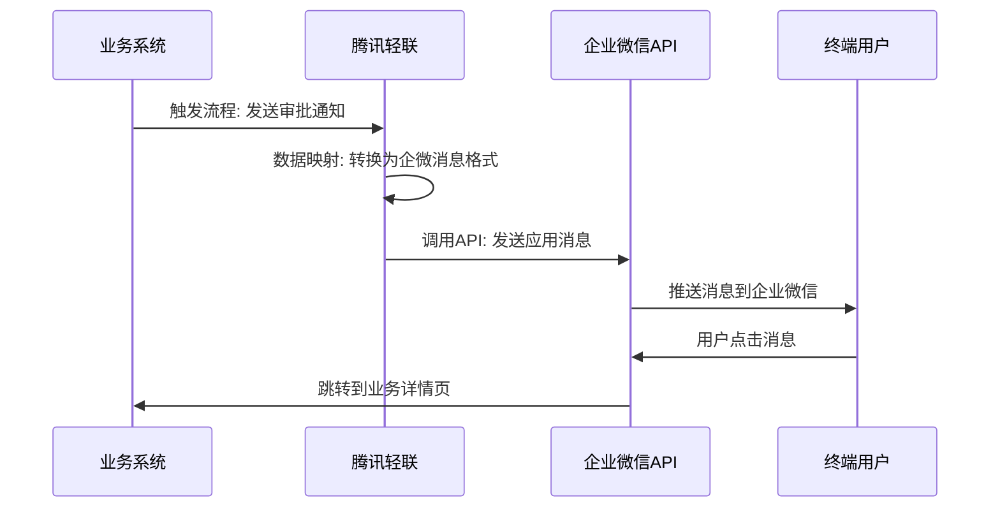
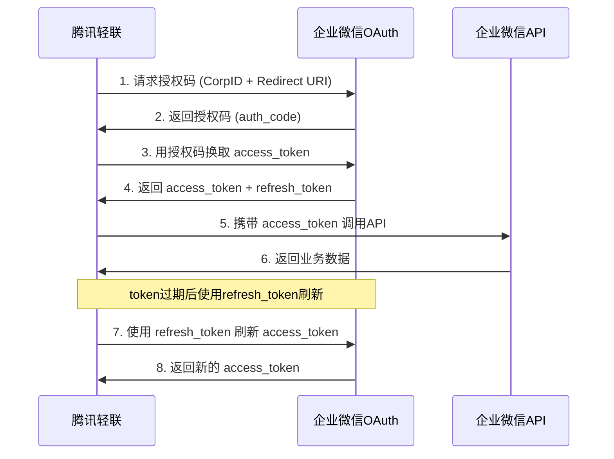
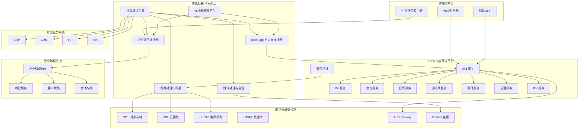
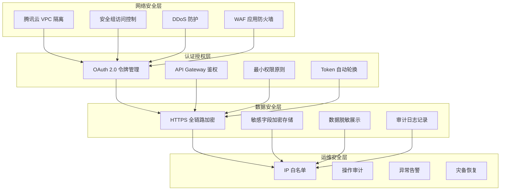

# 腾讯轻联连接器平台调研报告

## 一、平台概述

### 1.1 平台简介

腾讯轻联是腾讯云旗下的企业集成平台（iPaaS），前身为"腾讯微搭"集成能力，后独立为腾讯轻联产品线。作为腾讯云在 iPaaS 领域的核心产品，腾讯轻联致力于为企业提供一站式应用集成与自动化解决方案，帮助企业打通多系统间的数据孤岛，实现业务流程自动化。

腾讯轻联深度集成企业微信生态，支持数百个预构建应用连接器，覆盖腾讯系产品（企业微信、腾讯会议、腾讯文档、腾讯邮箱、微信支付、腾讯云全产品线等）和主流第三方 SaaS（金蝶、用友、飞书、钉钉、泛微、北森、Salesforce、Microsoft 365 等）。平台采用可视化流程编排模式，用户通过拖拽连接器节点、配置触发条件与执行动作，即可构建跨应用自动化工作流，无需编写代码。

腾讯轻联的核心差异化优势在于与腾讯云基础设施的深度整合——平台天然运行于腾讯云之上，可无缝调用腾讯云 API（COS 对象存储、CBS 云硬盘、API Gateway、SCF 云函数、TDSQL 数据库等），并继承了腾讯级别的安全合规能力（等保三级、SOC 2、GDPR 等），为企业提供从连接器编排到数据安全的一体化保障。

### 1.2 平台定位

- **腾讯生态集成平台**：作为腾讯云/iPaaS 产品线核心组件，深度集成企业微信、腾讯会议、腾讯文档等腾讯系产品，是腾讯生态内应用互通的枢纽
- **企业微信连接器**：以企业微信为核心触达终端，实现企业微信通讯录、消息、审批、客户管理等能力的开放集成，是"企业微信+"战略的技术载体
- **企业自动化平台**：面向企业 IT 和业务人员，提供低代码/无代码的自动化流程编排能力，降低企业集成开发门槛
- **腾讯云服务编排层**：作为腾讯云上层编排平台，将底层云服务（计算、存储、网络、AI）组合为业务级自动化流程
- **国产化 iPaaS 方案**：面向信创和本土化需求，提供国产自主可控的企业集成方案

### 1.3 核心价值主张

| 价值维度 | 描述 |
|---------|------|
| **企业微信深度集成** | 原生支持企业微信全量 API，通讯录同步、消息推送、审批流、客户管理等开箱即用 |
| **腾讯云一站式** | 天然运行于腾讯云，无缝调用 COS、SCF、API Gateway 等 200+ 云服务 API |
| **安全合规** | 继承腾讯云安全体系，等保三级、SOC 2、GDPR 等合规认证，数据不出云 |
| **国产化适配** | 深度适配国产化软硬件环境，支持信创要求，满足政企客户合规需求 |
| **低代码编排** | 可视化流程设计器，拖拽式操作，业务人员可直接构建自动化流程 |
| **品牌背书** | 腾讯品牌信任度高，大型企业客户基础广泛，降低选型决策风险 |
| **生态协同** | 与企业微信应用市场、腾讯云市场联动，形成应用分发与分润生态 |

---

## 二、核心能力体系

### 2.1 连接器能力矩阵

腾讯轻联的连接器以"应用（Application）"为组织单元，每个应用连接器包含触发器（Trigger）和动作（Action）两类操作节点。平台将连接器按生态归属划分为五大类别。

#### 2.1.1 腾讯生态连接器

| 连接器 | 触发器 | 动作 | 典型场景 |
|--------|--------|------|---------|
| **企业微信** | 新消息回调、通讯录变更、审批状态变更、客户联系变更 | 发送应用消息、创建/更新成员、获取部门列表、提交审批、外部联系人管理 | 企业微信生态集成、OA审批、客户管理 |
| **腾讯会议** | 会议创建、会议开始、会议结束、参会人加入 | 创建会议、修改会议、取消会议、查询会议、获取参会记录 | 会议与业务系统联动、自动排会 |
| **腾讯文档** | 文档更新、表格行变更 | 创建文档、读取表格数据、写入表格行、共享文档 | 数据采集、报表同步 |
| **腾讯邮箱** | 新邮件到达、邮件标签变更 | 发送邮件、搜索邮件、移动邮件 | 邮件自动化、工单创建 |
| **微信支付** | 支付成功回调、退款回调、转账回调 | 统一下单、查询订单、申请退款 | 电商订单处理、财务对账 |
| **腾讯云 COS** | 对象上传完成、对象删除 | 上传文件、下载文件、列举对象、删除对象 | 文件归档、数据备份 |
| **腾讯云 SCF** | 函数调用触发 | 调用云函数 | 自定义业务逻辑、数据加工 |
| **腾讯云 API Gateway** | API 请求到达 | 调用 API 接口 | 服务编排、API 聚合 |
| **腾讯会议 Rooms** | 会议室预约变更 | 预约会议室、取消预约 | 智能办公空间管理 |
| **腾讯问卷** | 问卷提交完成 | 创建问卷、获取答卷 | 问卷调查自动化 |

#### 2.1.2 国内 SaaS 连接器

| 连接器 | 触发器 | 动作 | 典型场景 |
|--------|--------|------|---------|
| **金蝶云星空** | 订单创建、凭证生成、物料变更 | 创建订单、查询客户、同步物料、生成凭证 | ERP 数据同步、财务自动化 |
| **金蝶精斗云** | 销售单创建、采购单审核 | 创建销售单、查询库存、生成报表 | 中小企业 ERP 集成 |
| **用友 U8Cloud** | 采购入库、销售出库、凭证审核 | 创建采购单、查询库存、同步科目 | 财务 ERP 对接 |
| **用友 NC** | 审批完成、单据变更 | 提交单据、查询台账 | 大型企业 ERP 集成 |
| **飞书** | 消息事件、审批事件、日历事件 | 发送消息、创建文档、审批操作 | 跨平台协作、双平台互通 |
| **钉钉** | 审批回调、考勤事件、消息事件 | 发送工作通知、查询考勤、创建审批 | 双平台桥接、数据同步 |
| **泛微 OA** | 流程审批回调、文档变更 | 提交流程、查询流程、创建文档 | OA 系统集成 |
| **北森** | 入职事件、离职事件、绩效变更 | 查询员工、同步组织 | HR 系统集成 |
| **致远 OA** | 表单提交、流程回调 | 创建表单、查询流程 | OA 流程打通 |
| **明道云** | 记录创建、记录更新 | 创建记录、更新记录、搜索记录 | 低代码平台联动 |
| **简道云** | 数据新增、数据更新、流程审批 | 新增数据、更新数据、查询数据 | 数据采集与同步 |
| **有赞** | 订单创建、退款事件 | 查询订单、同步商品 | 电商运营自动化 |
| **微盟** | 订单变更、会员变更 | 查询订单、管理会员 | 社交电商集成 |

#### 2.1.3 国际 SaaS 连接器

| 连接器 | 触发器 | 动作 | 典型场景 |
|--------|--------|------|---------|
| **Salesforce** | Lead 创建、Opportunity 更新、Case 变更 | 创建 Lead、更新 Account、查询 Opportunity | CRM 集成、销售自动化 |
| **Microsoft 365** | Outlook 新邮件、SharePoint 文件变更、Teams 消息 | 发送邮件、创建事件、上传文件 | 跨境办公协作 |
| **Google Workspace** | Gmail 新邮件、Drive 文件变更、Calendar 事件 | 发送邮件、创建文档、查询表格 | 跨境办公协作 |
| **Slack** | 新消息、频道事件 | 发送消息、创建频道 | 国际团队协作 |
| **Zapier** | Zap 触发 | 执行 Action | 级联自动化 |
| **HubSpot** | Contact 创建、Deal 变更 | 创建 Contact、更新 Deal | 营销自动化 |

#### 2.1.4 数据库与中间件连接器

| 连接器 | 支持类型 | 典型操作 | 应用场景 |
|--------|---------|---------|---------|
| **MySQL** | 腾讯云 TDSQL/自建 MySQL | 查询、插入、更新、删除 | 业务数据读写 |
| **PostgreSQL** | 腾讯云 TBase/自建 PG | 查询、插入、更新、删除 | 业务数据读写 |
| **SQL Server** | 腾讯云 SQL Server | 查询、存储过程调用 | 企业遗留系统对接 |
| **Redis** | 腾讯云 Redis | 读写键值、发布订阅 | 缓存管理、消息队列 |
| **MongoDB** | 腾讯云 MongoDB | 文档 CRUD 操作 | 非结构化数据存储 |
| **Kafka** | 腾讯云 CKafka | 发布消息、订阅主题 | 事件流处理 |
| **RabbitMQ** | 腾讯云 TDMQ | 发布消息、消费消息 | 异步消息处理 |
| **HTTP** | 通用 REST API | GET/POST/PUT/DELETE | 自定义 API 对接 |

#### 2.1.5 自定义 API 连接器

腾讯轻联提供自定义连接器能力，用于对接平台尚未内置的应用或内部系统。开发者通过声明式配置定义连接器的认证方式、触发器、动作和字段结构。

**配置要素**：

| 配置项 | 说明 |
|--------|------|
| **基本信息** | 连接器名称、描述、图标、分类 |
| **认证配置** | API Key、OAuth 2.0、Basic Auth、自定义 Token |
| **触发器定义** | Webhook 地址、事件类型、数据结构映射 |
| **动作定义** | API 端点、请求方法、参数定义、响应映射 |
| **字段映射** | 输入/输出字段的结构定义与类型标注 |
| **测试用例** | 验证连接器可用性的测试配置 |

### 2.2 开发模式

#### 2.2.1 可视化流程编排

腾讯轻联的核心开发模式为可视化流程设计器，用户通过"触发-处理-动作"的模式构建自动化流程。

**流程设计器界面组成**：

```
+------------------------------------------------------------------+
|  流程设计器 (Flow Designer)                                       |
| +---------------------------------------------------------------+ |
| |  工具栏: [保存] [测试运行] [发布] [调度设置] [日志] [版本管理]   | |
| +---------------------------------------------------------------+ |
|                                                                  |
|   * 触发器            -->  * 处理节点  -->  * 条件分支            |
|   [企业微信:           |    [数据映射:  |    |-> * 动作 A           |
|    审批状态变更]        |     字段转换]  |    |   [腾讯文档:          |
|                        |              |    |    写入表格行]         |
|                        |              |    |                       |
|                        |              |    +-> * 动作 B           |
|                        |              |        [企业微信:          |
|                        |              |         发送消息通知]      |
|                        |              |                           |
|                        +-->  * 错误处理器                          |
|                              [企业微信: 发送告警消息]              |
|                                                                  |
| +---------------------------------------------------------------+ |
| |  属性面板: [节点配置] [输入映射] [输出映射] [条件设置] [重试]    | |
| +---------------------------------------------------------------+ |
+------------------------------------------------------------------+
```

**流程运行模式**：

| 运行模式 | 描述 | 适用场景 |
|---------|------|---------|
| **事件触发** | 通过 Webhook 接收外部事件，即时启动流程 | 审批回调、消息通知、数据变更 |
| **定时调度** | 按 Cron 表达式定时执行 | 每日数据同步、定期报表生成 |
| **手动触发** | 手动点击执行 | 调试测试、一次性数据迁移 |
| **API 调用** | 通过 API 接口触发流程执行 | 第三方系统调用、批量任务 |

**流程模板**：
- 平台提供丰富的流程模板库，覆盖常见业务场景
- 支持从模板创建流程，快速复用最佳实践
- 支持自定义模板，团队内共享流程设计

#### 2.2.2 企业微信深度集成

企业微信集成是腾讯轻联最核心的差异化能力，提供从通讯录到业务流程的全链路集成。

**企业微信集成能力矩阵**：

| 能力域 | 集成内容 | 典型流程 |
|--------|---------|---------|
| **通讯录同步** | 成员增删改、部门变更、标签变更 | 企业微信与HR系统通讯录双向同步 |
| **消息推送** | 应用消息、群消息、单聊消息、交互卡片 | 审批结果推送、业务告警通知 |
| **审批流程** | 审批模板管理、审批提交/撤回、审批状态回调 | 第三方系统对接企业微信审批、审批通过后触发ERP流程 |
| **客户管理** | 外部联系人增删改、客户群变更、客户标签 | CRM对接企业微信客户同步、客户行为追踪 |
| **日程管理** | 日程创建/修改/删除、日程参与人变更 | 会议系统对接企业微信日程同步 |
| **素材管理** | 上传临时/永久素材、获取素材 | 营销素材统一管理 |
| **应用管理** | 应用菜单配置、工作台自定义 | 应用入口统一管理 |
| **会话存档** | 会话内容回调（需合规授权） | 合规审计、风控分析 |

**企业微信审批集成流程示例**：



#### 2.2.3 腾讯云服务集成

腾讯轻联作为腾讯云原生产品，可直接编排腾讯云全产品线 API，实现云服务级别的自动化。

| 腾讯云服务 | 集成方式 | 典型编排场景 |
|-----------|---------|------------|
| **COS 对象存储** | 内置连接器 | 文件上传后自动转码、归档、通知 |
| **SCF 云函数** | 内置连接器 | 自定义数据处理逻辑、复杂计算 |
| **API Gateway** | 内置连接器 | API 编排、协议转换、限流控制 |
| **TDSQL 数据库** | 内置连接器 | 数据同步、ETL 处理 |
| **CKafka** | 内置连接器 | 事件驱动架构、消息流转 |
| **TI 平台（AI）** | API 调用 | OCR 识别、语音转写、智能分类 |
| **CLB 负载均衡** | API 调用 | 流量切换、灰度发布 |
| **CVM 云服务器** | API 调用 | 实例管理、批量运维 |
| **Monitor 监控** | API 调用 | 告警联动、自动扩缩容 |
| **SES 邮件** | 内置连接器 | 营销邮件、事务邮件发送 |

**腾讯云服务编排示例——文件处理流水线**：



#### 2.2.4 Webhook 与 API 集成

**Webhook 接收（作为触发器）**：

腾讯轻联为每个流程自动生成 Webhook URL，外部系统向该 URL 发送 HTTP 请求即可触发流程执行。

```json
{
  "webhook_url": "https://ipaas.tencentcloudapi.com/webhook/flow/xxxxxxxx",
  "method": "POST",
  "headers": {
    "Content-Type": "application/json",
    "X-Signature": "sha256=xxxxxxx"
  },
  "body": {
    "event_type": "order.created",
    "data": {
      "order_id": "ORD-20260514-001",
      "customer_name": "张三",
      "amount": 9999.00
    },
    "timestamp": "2026-05-14T10:30:00+08:00"
  }
}
```

**API 主动调用（作为动作）**：

通过 HTTP 连接器或自定义连接器，腾讯轻联可主动调用外部 API 实现数据写入或操作执行。

**调用 open-app 发送消息示例**：

```json
{
  "url": "https://open-app.example.com/api/v1/messages/send",
  "method": "POST",
  "headers": [
    { "key": "Authorization", "value": "Bearer {{api_token}}" },
    { "key": "Content-Type", "value": "application/json" }
  ],
  "body": {
    "target_type": "user",
    "target_id": "{{user_id}}",
    "message_type": "text",
    "content": { "text": "{{message_content}}" }
  }
}
```

#### 2.2.5 自定义连接器开发

腾讯轻联支持通过声明式配置开发自定义连接器，用于对接内部系统或平台尚未内置的第三方服务。

**自定义连接器配置示例——open-app 连接器**：

```json
{
  "name": "open-app",
  "display_name": "XXX通信能力开放平台",
  "description": "对接XXX通信系统IM、会议、日历等开放能力",
  "icon": "https://open-app.example.com/icon.png",
  "auth": {
    "type": "oauth2",
    "authorization_url": "https://open-app.example.com/oauth/authorize",
    "token_url": "https://open-app.example.com/oauth/token",
    "scopes": ["im:send", "meeting:create", "calendar:read", "contact:read"]
  },
  "triggers": [
    {
      "name": "new_message",
      "display_name": "收到新消息",
      "type": "webhook",
      "output_fields": [
        { "name": "message_id", "type": "string" },
        { "name": "sender_id", "type": "string" },
        { "name": "content", "type": "string" },
        { "name": "timestamp", "type": "datetime" }
      ]
    },
    {
      "name": "meeting_started",
      "display_name": "会议开始",
      "type": "webhook",
      "output_fields": [
        { "name": "meeting_id", "type": "string" },
        { "name": "title", "type": "string" },
        { "name": "host_id", "type": "string" }
      ]
    }
  ],
  "actions": [
    {
      "name": "send_message",
      "display_name": "发送消息",
      "method": "POST",
      "url": "https://open-app.example.com/api/v1/messages/send",
      "input_fields": [
        { "name": "target_type", "type": "string", "required": true },
        { "name": "target_id", "type": "string", "required": true },
        { "name": "message_type", "type": "string", "required": true },
        { "name": "content", "type": "object", "required": true }
      ],
      "output_fields": [
        { "name": "message_id", "type": "string" },
        { "name": "send_time", "type": "datetime" }
      ]
    },
    {
      "name": "create_meeting",
      "display_name": "创建会议",
      "method": "POST",
      "url": "https://open-app.example.com/api/v1/meetings/create",
      "input_fields": [
        { "name": "title", "type": "string", "required": true },
        { "name": "start_time", "type": "datetime", "required": true },
        { "name": "duration", "type": "integer", "required": true },
        { "name": "participants", "type": "array", "required": false }
      ],
      "output_fields": [
        { "name": "meeting_id", "type": "string" },
        { "name": "join_url", "type": "string" }
      ]
    }
  ]
}
```

### 2.3 数据处理能力

腾讯轻联提供丰富的数据处理节点，在触发器与动作之间进行数据转换与加工。

**数据处理节点矩阵**：

| 处理节点 | 功能描述 | 典型用途 |
|---------|---------|---------|
| **字段映射** | 将源字段映射到目标字段，支持重命名、类型转换 | ERP字段名到企业微信字段名的映射 |
| **数据转换** | 格式转换（JSON/XML/CSV互转）、日期格式化、编码转换 | API返回的JSON转换为表格所需格式 |
| **条件判断** | if-else 条件分支，支持多条件组合（AND/OR） | 根据审批结果执行不同动作 |
| **循环** | 遍历数组/列表数据，逐条执行后续节点 | 批量处理订单明细、逐人发送通知 |
| **过滤** | 按条件过滤数据流，只保留符合条件的记录 | 过滤金额大于1000的订单 |
| **格式化** | 数据格式化（数字千分位、日期格式、货币格式） | 金额格式化、时间本地化 |
| **聚合** | 多条数据聚合汇总（求和、计数、分组） | 汇总每日订单总额 |
| **变量存储** | 临时变量存取，跨节点数据传递 | 保存中间计算结果供后续节点使用 |
| **脚本执行** | 通过 SCF 云函数执行自定义脚本 | 复杂数据加工、调用外部算法 |
| **去重** | 基于主键或组合字段去除重复数据 | 防止重复处理同一事件 |

### 2.4 流程调度能力

| 调度模式 | 描述 | 配置方式 | 适用场景 |
|---------|------|---------|---------|
| **即时触发** | 事件到达时立即执行 | Webhook / 事件回调 | 实时通知、即时响应 |
| **定时调度** | 按固定时间间隔执行 | Cron 表达式 | 定期同步、报表生成 |
| **延迟执行** | 延迟指定时间后执行 | 延迟节点配置 | 延迟通知、超时提醒 |
| **批量调度** | 批量数据一次性处理 | 批量触发器 | 数据迁移、批量导入 |
| **并发控制** | 限制同时运行的流程实例数 | 流程配置 | 保护下游系统、限流 |

**错误处理与重试机制**：

| 机制 | 描述 |
|------|------|
| **自动重试** | 节点执行失败后自动重试，可配置重试次数（默认3次）和间隔 |
| **错误路由** | 将错误数据路由到指定的错误处理分支 |
| **超时控制** | 每个节点可配置执行超时时间，超时自动中断 |
| **死信队列** | 多次重试仍失败的数据进入死信队列，人工干预 |
| **告警通知** | 流程异常时通过企业微信/邮件通知运维人员 |

### 2.5 连接器发布与共享机制

| 机制 | 描述 |
|------|------|
| **企业内共享** | 自定义连接器在企业内发布，团队成员可直接使用 |
| **模板市场** | 官方维护的流程模板库，覆盖常见集成场景 |
| **版本管理** | 连接器与流程支持版本管理，可回滚到历史版本 |
| **权限控制** | 连接器的使用权限可按部门/角色精细控制 |
| **审计日志** | 记录连接器的创建、修改、删除及使用日志 |

---

## 三、应用场景分析

### 3.1 典型应用场景

#### 3.1.1 企业微信生态集成

**场景描述**：
将企业内部业务系统（ERP、CRM、HR、OA）通过腾讯轻联与企业微信深度集成，实现消息通知、审批流转、通讯录同步、客户管理等能力的全面打通，让 open-app 的通信能力通过企业微信触达终端用户。

**集成方案**：



**关键价值**：
- 统一消息入口：所有业务通知通过企业微信推送，用户无需切换应用
- 移动审批：审批流程推送到企业微信，支持移动端即时处理
- 通讯录实时同步：HR系统与企微通讯录双向同步，入职即开通
- 客户管理闭环：CRM与企微客户联系打通，销售可随时查看客户信息

#### 3.1.2 腾讯会议与业务系统联动

**场景描述**：
将腾讯会议与项目管理、日程系统联动，实现自动创建会议、会前提醒、会后纪要分发等自动化流程。

**典型流程**：



#### 3.1.3 企业通讯录多系统同步

**场景描述**：
以企业微信通讯录为权威数据源，通过腾讯轻联实现 HR 系统、AD/LDAP、各业务系统的通讯录自动同步。

| 同步方向 | 数据源 | 目标系统 | 同步策略 |
|---------|--------|---------|---------|
| HR -> 企业微信 | HR 系统 | 企业微信通讯录 | 实时事件驱动 |
| 企业微信 -> AD | 企业微信通讯录 | Active Directory | 定时增量同步 |
| 企业微信 -> 业务系统 | 企业微信通讯录 | ERP/CRM/OA | 变更事件触发 |
| 企业微信 -> open-app | 企业微信通讯录 | open-app 通讯录 | 实时双向同步 |

#### 3.1.4 CRM 与客户管理联动

**场景描述**：
打通 CRM 系统与企业微信客户联系能力，实现销售线索自动分配、客户跟进自动记录、营销触达自动化。

**典型流程**：
1. CRM 新增线索 -> 腾讯轻联 -> 企业微信分配给销售
2. 销售在企业微信添加外部联系人 -> 腾讯轻联 -> CRM 自动创建客户记录
3. 客户在微信咨询 -> 腾讯轻联 -> 通知对应销售跟进
4. 销售跟进记录 -> 腾讯轻联 -> CRM 同步沟通记录

#### 3.1.5 腾讯云服务编排

**场景描述**：
利用腾讯轻联编排腾讯云服务，构建云原生业务流程自动化。

**典型场景**：

| 场景 | 编排流程 |
|------|---------|
| **文件处理** | COS上传 -> SCF校验 -> TI-OCR识别 -> 腾讯文档记录 |
| **监控告警** | Monitor告警 -> 腾讯轻联路由 -> 企业微信通知 -> SCF自愈脚本 |
| **数据ETL** | TDSQL读取 -> SCF清洗 -> COS存储 -> 数据仓库加载 |
| **CI/CD** | 代码提交 -> 腾讯轻联触发 -> CVM部署 -> 企业微信通知 |

### 3.2 与 open-app 的集成场景

#### 3.2.1 open-app 4种开放模式与腾讯轻联的映射

open-app 提供 4 种开放模式，每种模式均可通过腾讯轻联实现与外部系统的集成：

| open-app 开放模式 | 映射到腾讯轻联 | 集成方式 | 典型场景 |
|------------------|--------------|---------|---------|
| **API（外部调用内部）** | 动作节点（Action） | 腾讯轻联流程中调用 open-app API | 发送消息、创建会议、查询通讯录 |
| **Event（内部推送到外部）** | 触发器节点（Trigger） | open-app 事件推送至腾讯轻联 Webhook | 新消息事件触发CRM同步 |
| **WebHook/Callback（内部触发回调外部）** | 回调处理节点 | open-app 回调触发腾讯轻联流程 | 审批结果回调驱动后续流程 |
| **Bot（双向交互）** | 消息收发节点 | 腾讯轻联作为Bot中间层 | 智能客服Bot对接知识库 |

**映射架构图**：



#### 3.2.2 腾讯轻联作为 open-app 连接企业微信生态的桥梁

open-app 自身的通信能力（IM、会议、日历等）可通过腾讯轻联快速触达企业微信生态用户，无需逐个对接企业微信 API。

**桥接场景**：

| 场景 | open-app 侧 | 腾讯轻联桥接 | 企业微信侧 |
|------|------------|------------|-----------|
| **消息推送** | open-app Event: 新消息通知 | 格式转换+路由 | 企业微信应用消息推送 |
| **会议联动** | open-app API: 创建会议 | 数据映射+触发 | 企业微信日历+腾讯会议 |
| **审批桥接** | open-app Callback: 审批结果 | 状态同步 | 企业微信审批状态更新 |
| **Bot 交互** | open-app Bot: 智能助手 | 消息路由+格式转换 | 企业微信机器人交互 |

#### 3.2.3 腾讯云基础设施与 open-app 的结合

open-app 部署在腾讯云基础设施上时，腾讯轻联可编排云服务与 open-app 的协同：

| 结合场景 | 技术方案 |
|---------|---------|
| **高可用部署** | 腾讯轻联 + CLB + 多CVM实例 + open-app API |
| **数据备份** | open-app 数据 -> CKafka -> 腾讯轻联 -> COS归档 |
| **智能处理** | open-app Event -> 腾讯轻联 -> TI-OCR/NLP -> 结果回写open-app |
| **监控告警** | Monitor检测open-app异常 -> 腾讯轻联 -> 企业微信告警 + SCF自愈 |

---

## 四、开发指南

### 4.1 流程创建流程



**详细步骤**：

1. **登录控制台**：访问腾讯轻联控制台，使用腾讯云账号登录
2. **创建流程**：点击"创建流程"，选择从空白创建或从模板创建
3. **选择触发器**：从连接器列表中选择触发器类型（事件触发/定时触发/Webhook触发）
4. **配置触发器**：设置触发条件、认证信息、轮询间隔等
5. **添加处理节点**：根据需要添加数据映射、条件判断、循环等处理节点
6. **配置数据映射**：将上游节点的输出字段映射到下游节点的输入字段
7. **添加动作节点**：选择要执行的操作，配置目标应用和操作参数
8. **配置错误处理**：设置重试策略、错误路由、告警通知
9. **测试运行**：手动触发一次流程运行，检查执行结果
10. **发布流程**：测试通过后发布上线，流程进入活跃状态

### 4.2 企业微信集成开发

**前置准备**：

| 步骤 | 操作 | 说明 |
|------|------|------|
| 1 | 创建企业微信应用 | 在企业微信管理后台创建自建应用 |
| 2 | 获取 CorpID 和 Secret | 用于 API 调用鉴权 |
| 3 | 配置可信域名 | 设置应用的回调域名白名单 |
| 4 | 授权腾讯轻联 | 在企业微信后台授权腾讯轻联访问权限 |
| 5 | 配置接收消息服务器 | 设置消息回调 URL 指向腾讯轻联 |

**企业微信消息推送流程配置**：



**企业微信审批集成代码示例（通过腾讯轻联 API 触发）**：

```bash
# 通过腾讯轻联 API 触发审批流程
curl -X POST "https://ipaas.tencentcloudapi.com/api/v1/flows/flow_xxx/trigger" \
  -H "Authorization: Bearer {{tencent_cloud_token}}" \
  -H "Content-Type: application/json" \
  -d '{
    "trigger_type": "api",
    "input": {
      "approval_template_id": "3Tka1eD6v8iZkhHDMgP9v3",
      "applicant_user_id": "zhangsan",
      "approval_data": [
        {"key": "采购金额", "value": "50000"},
        {"key": "采购事由", "value": "办公设备采购"},
        {"key": "供应商", "value": "XXX科技有限公司"}
      ],
      "notify_type": "app"
    }
  }'
```

### 4.3 自定义连接器开发

**开发流程**：

1. **需求分析**：明确连接器需要对接的 API、触发条件和执行动作
2. **认证配置**：配置 API 认证方式（OAuth 2.0、API Key 等）
3. **触发器定义**：定义 Webhook 接收或轮询触发的数据结构
4. **动作定义**：定义每个操作节点的 API 端点、参数和返回值
5. **字段映射**：定义输入/输出字段，标注类型和必填项
6. **测试验证**：使用测试数据验证连接器的正确性
7. **发布共享**：发布到企业内连接器市场

**自定义连接器配置示例——对接 open-app 会议能力**：

```json
{
  "connector": {
    "name": "open-app-meeting",
    "version": "1.0.0",
    "display_name": "open-app 会议能力",
    "description": "对接XXX通信系统会议开放能力",
    "category": "communication",
    "auth": {
      "type": "oauth2_client_credentials",
      "token_url": "https://open-app.example.com/oauth/token",
      "client_id": "{{client_id}}",
      "client_secret": "{{client_secret}}",
      "scopes": ["meeting:create", "meeting:read", "meeting:control"]
    },
    "triggers": [
      {
        "name": "meeting_started",
        "display_name": "会议开始事件",
        "type": "webhook",
        "webhook_path": "/triggers/meeting/started",
        "payload_schema": {
          "meeting_id": "string",
          "title": "string",
          "host": "object",
          "participants": "array",
          "start_time": "datetime"
        }
      },
      {
        "name": "meeting_ended",
        "display_name": "会议结束事件",
        "type": "webhook",
        "webhook_path": "/triggers/meeting/ended",
        "payload_schema": {
          "meeting_id": "string",
          "duration": "integer",
          "recording_url": "string"
        }
      }
    ],
    "actions": [
      {
        "name": "create_meeting",
        "display_name": "创建会议",
        "method": "POST",
        "path": "/api/v1/meetings",
        "input_schema": {
          "title": { "type": "string", "required": true },
          "start_time": { "type": "datetime", "required": true },
          "duration_minutes": { "type": "integer", "required": true },
          "participant_ids": { "type": "array", "required": false },
          "meeting_type": { "type": "string", "enum": ["video", "audio", "screen"], "default": "video" }
        },
        "output_schema": {
          "meeting_id": "string",
          "join_url": "string",
          "meeting_number": "string"
        }
      },
      {
        "name": "get_meeting_participants",
        "display_name": "获取参会人员",
        "method": "GET",
        "path": "/api/v1/meetings/{{meeting_id}}/participants",
        "input_schema": {
          "meeting_id": { "type": "string", "required": true }
        },
        "output_schema": {
          "participants": "array",
          "total_count": "integer"
        }
      }
    ]
  }
}
```

### 4.4 认证方式

腾讯轻联支持多种认证方式，适配不同 API 的鉴权需求：

| 认证方式 | 描述 | 适用场景 |
|---------|------|---------|
| **API Key** | 在请求头或参数中携带 API Key | 简单的内部 API 对接 |
| **OAuth 2.0 - 授权码模式** | 标准授权码流程，用户授权后获取 Token | 企业微信、钉钉等需要用户授权的API |
| **OAuth 2.0 - 客户端凭证** | 使用 Client ID/Secret 获取 Token | 服务间调用，无需用户参与 |
| **Basic Auth** | 用户名密码编码后放在请求头 | 遗留系统、简单认证 |
| **自定义 Token** | 自定义获取和刷新 Token 的逻辑 | 非标准认证协议的API |
| **腾讯云 API 签名** | 使用 SecretId/SecretKey 生成签名 | 腾讯云 API 调用 |

**企业微信 OAuth 2.0 认证流程**：



### 4.5 最佳实践

#### 4.5.1 流程设计最佳实践

| 实践 | 描述 |
|------|------|
| **单一职责** | 每个流程只做一件事，避免复杂的多目标流程 |
| **幂等设计** | 动作节点设计为幂等操作，避免重复执行产生副作用 |
| **错误隔离** | 关键动作配置独立的错误处理路由，避免一个节点失败导致整个流程中断 |
| **版本管理** | 流程变更时创建新版本，保留历史版本便于回滚 |
| **文档完善** | 为每个流程添加描述、标签和使用说明 |

#### 4.5.2 企业微信集成最佳实践

| 实践 | 描述 |
|------|------|
| **消息频率控制** | 遵守企业微信消息推送频率限制，避免被封禁 |
| **审批模板标准化** | 统一审批模板ID管理，变更时同步更新腾讯轻联配置 |
| **通讯录增量同步** | 使用变更事件而非全量同步，减少API调用次数 |
| **敏感信息脱敏** | 消息推送时对敏感信息做脱敏处理 |

#### 4.5.3 性能优化最佳实践

| 实践 | 描述 |
|------|------|
| **批量操作** | 优先使用批量API而非逐条调用，减少请求次数 |
| **异步处理** | 耗时操作通过SCF异步执行，避免流程阻塞 |
| **缓存热点数据** | 对频繁读取的配置数据做本地缓存 |
| **合理调度** | 非实时流程设置在非高峰期执行 |

---

## 五、优势与劣势分析

### 5.1 核心优势

#### 5.1.1 企业微信深度集成优势

| 优势维度 | 详细描述 |
|---------|---------|
| **全量API覆盖** | 原生支持企业微信全量开放API，包括通讯录、消息、审批、客户、日程、会话存档等 |
| **零配置对接** | 企业微信连接器预配置好认证和接口映射，用户只需授权即可使用 |
| **实时事件** | 支持企业微信回调事件实时触发，响应延迟低 |
| **双向同步** | 通讯录、审批等能力支持双向数据同步，不是简单的单向推送 |

#### 5.1.2 腾讯云安全合规优势

| 优势维度 | 详细描述 |
|---------|---------|
| **等保三级** | 腾讯云平台已通过等保三级认证，满足政务、金融等强合规行业要求 |
| **数据不出云** | 数据在腾讯云内闭环流转，不经过第三方平台，降低数据泄露风险 |
| **加密传输** | 全链路HTTPS加密，敏感数据支持国密算法加密 |
| **审计合规** | 完整的操作审计日志，满足内控和外部审计要求 |
| **SOC 2 / GDPR** | 通过国际安全合规认证，支撑出海业务需求 |

#### 5.1.3 品牌与生态优势

| 优势维度 | 详细描述 |
|---------|---------|
| **腾讯品牌** | 腾讯品牌在中国市场具有极高的信任度，尤其对大企业和政企客户 |
| **腾讯云生态** | 与腾讯云200+产品形成协同，云市场提供联合解决方案 |
| **企业微信生态** | 企业微信超1000万家企业用户，腾讯轻联可借助企微渠道触达 |
| **ISV 合作** | 腾讯云ISV生态可提供行业定制化集成方案 |

#### 5.1.4 国产化优势

| 优势维度 | 详细描述 |
|---------|---------|
| **信创适配** | 适配国产CPU（鲲鹏、飞腾）、国产OS（麒麟、统信） |
| **自主可控** | 腾讯自研iPaaS平台，不依赖国外技术栈 |
| **本地化支持** | 中文界面、中文文档、本土化技术支持团队 |
| **政企准入** | 满足政务云、金融云等特殊行业的准入要求 |

### 5.2 潜在劣势

#### 5.2.1 非腾讯生态支持弱

| 劣势维度 | 详细描述 |
|---------|---------|
| **国际SaaS连接器少** | 相比Zapier/Make等国际平台，国际SaaS连接器数量明显不足 |
| **飞书/钉钉支持有限** | 对竞品平台（飞书、钉钉）的连接器支持不如企业微信，更新滞后 |
| **社区生态薄弱** | 缺乏活跃的开发者社区，自定义连接器分享较少 |
| **模板库规模** | 流程模板库规模小于国际竞品，覆盖场景有限 |

#### 5.2.2 平台独立性不足

| 劣势维度 | 详细描述 |
|---------|---------|
| **腾讯云绑定** | 平台深度绑定腾讯云基础设施，不支持AWS/Azure/阿里云等部署 |
| **企业微信依赖** | 核心差异化能力围绕企业微信，非企业微信客户价值大打折扣 |
| **数据锁定** | 流程配置和数据存储在腾讯云内，迁移成本较高 |
| **技术栈封闭** | 自定义扩展需要依赖腾讯云SCF，不支持其他函数计算平台 |

#### 5.2.3 产品成熟度

| 劣势维度 | 详细描述 |
|---------|---------|
| **产品时间短** | 相比MuleSoft/Workato等成熟平台，产品迭代时间较短 |
| **高级编排能力** | 复杂路由、子流程调用等高级编排能力不如Make等平台 |
| **调试工具** | 调试和排障工具不如国际竞品完善 |
| **连接器数量** | 数百个连接器 vs Zapier 6000+、Make 1800+ |

#### 5.2.4 定价与透明度

| 劣势维度 | 详细描述 |
|---------|---------|
| **定价不透明** | 公开信息有限，需要联系商务获取报价 |
| **腾讯云捆绑** | 可能与腾讯云产品捆绑销售，灵活性不足 |
| **按量计费复杂** | 按连接器/流程/操作次数多维计费，成本预测困难 |

---
## 六、成本分析

### 6.1 定价方案

腾讯轻联采用与腾讯云产品联动的定价模式，具体价格需联系腾讯云商务获取。以下基于公开信息和行业惯例的预估：

| 定价维度 | 预估方案 | 说明 |
|---------|---------|------|
| **基础版** | 约 5,000-10,000 元/月 | 有限连接器数量、有限流程数量、基础支持 |
| **专业版** | 约 20,000-50,000 元/月 | 更多连接器、更多流程、高级功能、优先支持 |
| **企业版** | 约 80,000-200,000 元/月 | 不限连接器/流程、企业级SLA、专属技术支持 |
| **按量计费** | 按流程执行次数/数据量计费 | 适合使用量波动较大的场景 |
| **腾讯云捆绑** | 与企业微信/腾讯云产品打包折扣 | 已采购腾讯云产品的客户可享优惠 |

**与竞品定价对比**：

| 平台 | 起步价格 | 计费模式 | 适用规模 |
|------|---------|---------|---------|
| **腾讯轻联** | 约 5,000 元/月 | 订阅+按量 | 中大型企业（腾讯云客户） |
| **Zapier** | $19.99/月起 | 按Task计费 | SMB/个人 |
| **Make** | $9/月起 | 按操作次数 | SMB/中型市场 |
| **Power Automate** | $15/用户/月 | 按用户+流程 | Microsoft生态企业 |
| **Workato** | 约 $10,000/年起 | 按连接器/消息量 | 大型企业 |

### 6.2 开发成本

| 成本项 | 说明 | 预估 |
|--------|------|------|
| **人力成本** | 流程设计与配置人员 | 1名低代码开发人员，培训1-2周即可上手 |
| **培训成本** | 平台使用培训 | 腾讯云提供免费在线培训，企业微信集成专项培训约1周 |
| **连接器开发** | 自定义连接器开发 | 简单连接器1-2天，复杂连接器1-2周 |
| **测试成本** | 流程测试与验证 | 每个流程约0.5-1天测试时间 |

### 6.3 运营成本

| 成本项 | 说明 | 费用说明 |
|--------|------|---------|
| **平台订阅费** | 腾讯轻联版本费用 | 根据版本和使用量 |
| **腾讯云资源费** | 关联云服务费用 | SCF调用、COS存储、CKafka消息等 |
| **运维人力** | 流程监控与维护 | 兼职运维或共享运维团队 |
| **连接器更新** | API变更导致连接器更新 | 定期维护，预估每月2-4小时 |

---

## 七、技术架构建议

### 7.1 open-app 腾讯轻联连接器架构设计



### 7.2 关键技术选型

#### 7.2.1 连接器层技术选型

| 技术组件 | 推荐方案 | 说明 |
|---------|---------|------|
| **open-app 连接器** | 自定义连接器（声明式JSON配置） | 通过腾讯轻联自定义连接器能力声明式定义 |
| **企业微信连接器** | 官方内置连接器 | 直接使用腾讯轻联内置的企业微信连接器 |
| **认证方式** | OAuth 2.0 客户端凭证模式 | open-app API 调用使用 Client Credentials |
| **数据格式** | JSON | 所有连接器间数据交换统一使用 JSON 格式 |
| **错误处理** | 重试+死信队列+企业微信告警 | 三级错误处理保障流程可靠性 |

#### 7.2.2 流程编排技术选型

| 技术组件 | 推荐方案 | 说明 |
|---------|---------|------|
| **流程引擎** | 腾讯轻联内置引擎 | 无需额外部署，直接使用平台能力 |
| **数据映射** | 内置字段映射节点 | 可视化配置字段映射关系 |
| **复杂逻辑** | SCF 云函数 | 超出可视化编排能力的复杂逻辑通过SCF实现 |
| **异步处理** | CKafka + 延迟节点 | 大批量或延迟处理通过消息队列解耦 |
| **状态持久化** | TDSQL + Redis | 流程执行状态持久化到数据库，热数据缓存到Redis |

### 7.3 安全架构

#### 7.3.1 安全分层设计



#### 7.3.2 安全措施清单

| 安全措施 | 说明 | 责任方 |
|---------|------|--------|
| **VPC 网络隔离** | open-app 和腾讯轻联部署在同一 VPC，内网通信 | 运维团队 |
| **API 网关鉴权** | 所有 API 调用经过 API Gateway 统一鉴权 | 架构团队 |
| **OAuth 2.0 令牌管理** | access_token 有效期2小时，自动刷新 | 开发团队 |
| **敏感数据加密** | API Key、Secret 等使用腾讯云 KMS 加密存储 | 安全团队 |
| **数据脱敏** | 日志和监控中敏感字段自动脱敏 | 开发团队 |
| **IP 白名单** | 限制 API 调用来源 IP 范围 | 运维团队 |
| **审计日志** | 记录所有 API 调用、流程执行的完整日志 | 安全团队 |
| **异常告警** | 异常调用频率、失败率超阈值自动告警 | 运维团队 |

---
## 八、实施路径建议

### 8.1 实施阶段规划

#### 第一阶段：调研评估与POC验证（2-3 周）

**主要工作**：
- 腾讯轻联平台能力深度评估
- open-app 与腾讯轻联集成可行性分析
- 企业微信集成 POC 搭建
- 核心场景原型验证

**交付物**：
- 技术可行性评估报告
- POC 演示环境
- 风险评估与应对方案

#### 第二阶段：企业微信集成开发（4-6 周）

**主要工作**：
- 企业微信连接器配置与授权
- 通讯录双向同步流程开发
- 消息推送流程开发
- 审批集成流程开发
- 测试与调优

**交付物**：
- 企业微信集成流程（通讯录/消息/审批）
- 测试报告
- 运维文档

#### 第三阶段：open-app 自定义连接器开发（4-6 周）

**主要工作**：
- open-app API 分析与连接器设计
- 自定义连接器开发（IM/会议/日历/通讯录/邮件等）
- Event/WebHook/Bot 对接开发
- 数据映射与格式转换配置
- 连接器测试与发布

**交付物**：
- open-app 自定义连接器
- 连接器文档
- 测试用例与测试报告

#### 第四阶段：业务场景集成（6-8 周）

**主要工作**：
- 核心业务场景流程开发
- ERP/CRM/OA 集成流程开发
- 腾讯云服务编排流程开发
- 端到端测试
- 性能优化

**交付物**：
- 业务集成流程
- 端到端测试报告
- 性能测试报告

#### 第五阶段：上线与运营优化（持续）

**主要工作**：
- 灰度发布与全量上线
- 运维监控体系搭建
- 用户培训与推广
- 持续优化与迭代

**交付物**：
- 上线报告
- 运维手册
- 培训材料

### 8.2 团队配置建议

| 角色 | 人数 | 职责 |
|------|------|------|
| **项目经理** | 1 | 项目整体规划、进度把控、资源协调 |
| **架构师** | 1 | 集成架构设计、连接器设计、技术选型 |
| **集成开发** | 2-3 | 流程开发、连接器开发、数据映射配置 |
| **企业微信开发** | 1 | 企业微信应用开发、权限配置 |
| **测试工程师** | 1 | 流程测试、端到端测试、性能测试 |
| **运维工程师** | 1 | 腾讯云环境搭建、部署上线、监控运维 |

### 8.3 风险控制

| 风险类型 | 风险描述 | 应对措施 |
|---------|---------|---------|
| **平台风险** | 腾讯轻联产品变更、功能调整 | 关注产品更新公告、做好版本管理 |
| **API 风险** | 企业微信/open-app API 变更 | 建立API变更监控机制、预留适配时间 |
| **性能风险** | 高并发场景下流程执行延迟 | 压力测试、合理配置并发度、异步处理 |
| **安全风险** | API Key泄露、数据泄露 | KMS加密存储、最小权限、审计日志 |
| **成本风险** | 流程执行量超出预期导致费用超支 | 设置费用告警、优化流程减少不必要调用 |
| **依赖风险** | 过度依赖腾讯云/企业微信生态 | 核心逻辑保留在open-app内部，轻联仅做集成层 |

---

## 九、总结与建议

### 9.1 总结

腾讯轻联作为腾讯云旗下的 iPaaS 平台，具有以下显著特点：

**核心优势**：
- 企业微信深度集成，全量 API 覆盖，开箱即用
- 腾讯云一站式能力，可编排 200+ 云服务 API
- 安全合规体系完善，等保三级、SOC 2、GDPR 认证
- 品牌信任度高，大型企业客户基础广泛
- 国产化适配，满足信创和政企准入要求
- 低代码编排，业务人员可直接使用

**潜在劣势**：
- 非腾讯生态（飞书、钉钉、国际SaaS）支持较弱
- 平台深度绑定腾讯云和企业微信，独立性不足
- 产品成熟度不及国际竞品（MuleSoft、Workato）
- 连接器数量（数百个）远少于 Zapier（6000+）
- 定价不透明，需联系商务获取

**适用场景**：
- 深度使用企业微信的企业，需要将业务系统与企微打通
- 已采购腾讯云产品的企业，需要云服务编排能力
- 对安全合规有高要求的政企、金融客户
- 需要国产化 iPaaS 方案的信创场景

### 9.2 建议

#### 9.2.1 平台选择建议

- **如果企业**：深度使用企业微信 + 腾讯云，需要国产化合规 -> **推荐腾讯轻联**
- **如果企业**：需要广泛的国际SaaS连接器 + 复杂编排 -> **推荐 Make/Workato**
- **如果企业**：Microsoft生态为主 -> **推荐 Power Automate**
- **如果企业**：简单自动化场景 + 预算有限 -> **推荐 Zapier**

#### 9.2.2 open-app 集成建议

1. **优先企业微信通道**：通过腾讯轻联将 open-app 能力接入企业微信，利用企微触达终端用户
2. **自定义连接器开发**：为 open-app 开发腾讯轻联自定义连接器，覆盖 API/Event/Callback/Bot 四种模式
3. **核心能力保留**：核心业务逻辑保留在 open-app 内部，腾讯轻联仅作为集成编排层
4. **多平台策略**：不将所有集成绑定腾讯轻联，保持与其他 iPaaS 平台的兼容性

#### 9.2.3 后续规划建议

1. **分阶段实施**：先POC验证，再企业微信集成，再自定义连接器，最后业务场景集成
2. **建立监控体系**：对集成流程建立完善的监控告警，确保可靠性
3. **连接器标准化**：将 open-app 连接器模板化，便于在多个客户场景快速复用
4. **生态拓展**：在腾讯轻联基础上，评估其他 iPaaS 平台（Make、Power Automate）作为补充

---

## 十、附录

### 10.1 相关资源

| 资源类型 | 链接 |
|---------|------|
| **腾讯轻联官网** | https://qinglian.tencent.com |
| **腾讯云官网** | https://cloud.tencent.com |
| **企业微信开放平台** | https://developer.work.weixin.qq.com |
| **腾讯云 API 文档** | https://cloud.tencent.com/document/api |
| **腾讯轻联产品文档** | https://cloud.tencent.com/document/product/1350 |
| **企业微信开发者社区** | https://developer.work.weixin.qq.com/community |

### 10.2 常见问题

**Q1: 腾讯轻联与 Zapier/Make 有什么区别？**
A: 腾讯轻联深度集成企业微信和腾讯云生态，在国内企业场景下具有明显优势；Zapier/Make 在国际SaaS连接器数量和复杂编排能力上更强。选择取决于企业主要使用的应用生态。

**Q2: 腾讯轻联是否支持私有化部署？**
A: 腾讯轻联基于腾讯云运行，支持在腾讯云 VPC 内私有化部署，但不支持在非腾讯云环境（如自建机房、阿里云）独立部署。

**Q3: 如何获取腾讯轻联的定价信息？**
A: 需要联系腾讯云商务团队获取具体报价。可通过腾讯云官网提交咨询，或联系企业微信渠道经理。

**Q4: 腾讯轻联与 open-app 如何集成？**
A: 通过腾讯轻联的自定义连接器能力，声明式定义 open-app 的 API 端点、认证方式和数据结构，即可在流程中调用 open-app 的 IM、会议、日历等能力。

**Q5: 企业微信集成需要什么前置条件？**
A: 需要企业微信管理员权限、已创建的企业微信应用、CorpID 和应用 Secret，以及在腾讯轻联中完成企业微信连接器的授权配置。

**Q6: 腾讯轻联支持哪些编程语言的自定义扩展？**
A: 复杂的自定义逻辑通过腾讯云 SCF（云函数）实现，SCF 支持 Python、Node.js、Java、Go、PHP 等多种运行时。

**Q7: 如何保证腾讯轻联流程的可靠性？**
A: 腾讯轻联提供自动重试、错误路由、死信队列、超时控制和告警通知等多级保障机制，确保流程的可靠执行。

**Q8: 腾讯轻联的数据安全如何保障？**
A: 数据在腾讯云内闭环流转，支持 VPC 网络隔离、全链路 HTTPS 加密、KMS 密钥管理、操作审计日志等安全机制，并通过等保三级认证。

---

**报告编制时间**：2026年5月
**报告版本**：V1.0
