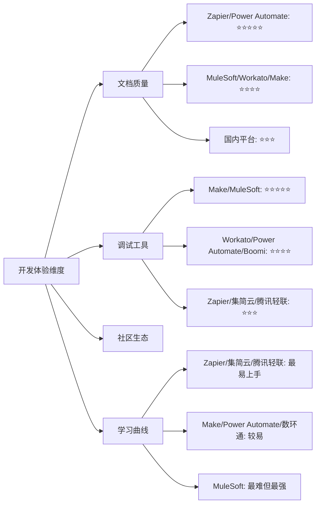
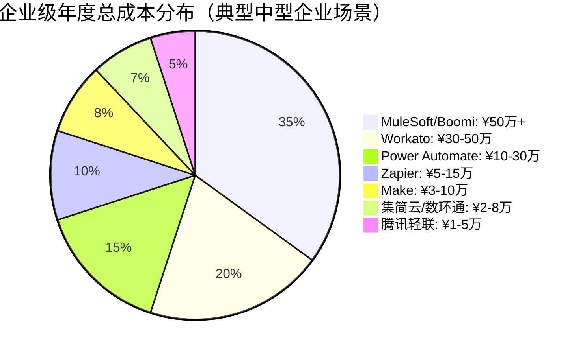
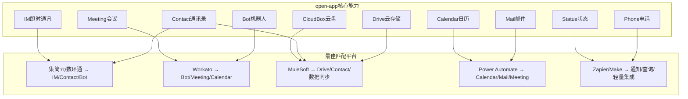
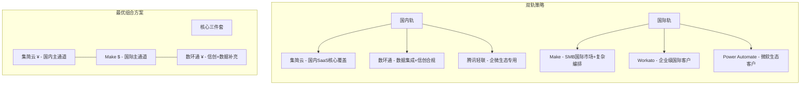
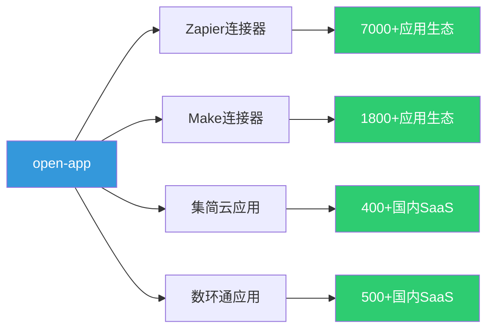
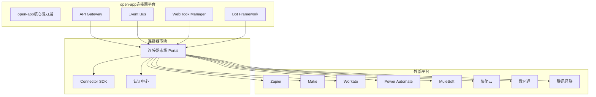
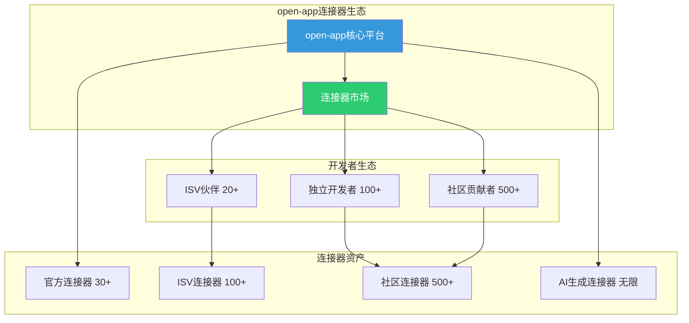
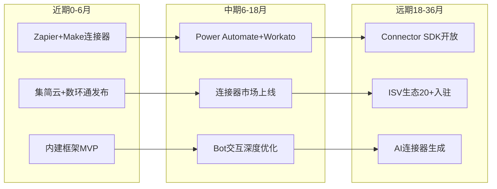

# 软件连接器平台汇总对比调研报告

**版本**：V1.0  
**日期**：2026年5月  

---

## 一、执行摘要

本报告对全球 9 大主流软件连接器平台进行了全面的汇总与对比分析，涵盖 6 家国际平台（Zapier、Make、Make、MuleSoft、Workato、Power Automate、Boomi）和 3 家国内平台（集简云、数环通、腾讯轻联），从平台定位、核心能力、开发模式、安全合规、open-app 集成适配、成本效益、典型场景等多个维度进行深入对比，为 open-app 企业通讯能力开放平台的连接器生态建设提供决策参考。

### 核心结论

| 对比维度 | 国际平台领先者 | 国内平台领先者 | open-app 最优选择 |
|---------|-------------|-------------|----------------|
| **连接器数量** | Zapier（7000+） | 数环通（500+） | Zapier / Make |
| **国内 SaaS 覆盖** | Make（有限） | 集简云（400+，60%国内应用） | 集简云 / 数环通 |
| **复杂编排能力** | Make（场景+路由+迭代） | 数环通（JS 脚本） | Make / 数环通 |
| **企业级治理** | MuleSoft（API-led） | 腾讯轻联（企微深度） | MuleSoft / Workato |
| **性价比** | Make（操作量计费） | 集简云（人民币定价） | 集简云 / Make |
| **安全合规** | MuleSoft（混合部署） | 数环通（等保三级+信创） | 数环通 / MuleSoft |
| **AI 赋能** | Power Automate（Copilot） | — | Power Automate / Workato |

**战略建议**：open-app 应采用**"国内优先 + 国际互补"双轨策略**——

- **第一梯队**：集简云、数环通（国内市场核心覆盖，优先对接）
- **第二梯队**：Zapier、Make（国际市场覆盖，SMB 首选）
- **第三梯队**：Workato、Power Automate（企业级深度集成，大客户补充）
- **第四梯队**：MuleSoft、Boomi（超大型企业 API 治理，按需接入）
- **特殊梯队**：腾讯轻联（企业微信生态专用通道）

### 平台总览评分

| 平台 | 生态规模 | 编排能力 | 企业治理 | 性价比 | 安全合规 | open-app适配 | 综合推荐 |
|------|---------|---------|---------|--------|---------|------------|---------|
| **Zapier** | ⭐⭐⭐⭐⭐ | ⭐⭐⭐⭐ | ⭐⭐⭐ | ⭐⭐⭐⭐ | ⭐⭐⭐⭐ | ⭐⭐⭐⭐ | ⭐⭐⭐⭐ |
| **Make** | ⭐⭐⭐⭐ | ⭐⭐⭐⭐⭐ | ⭐⭐⭐ | ⭐⭐⭐⭐⭐ | ⭐⭐⭐⭐ | ⭐⭐⭐⭐ | ⭐⭐⭐⭐⭐ |
| **MuleSoft** | ⭐⭐⭐⭐ | ⭐⭐⭐⭐⭐ | ⭐⭐⭐⭐⭐ | ⭐⭐ | ⭐⭐⭐⭐⭐ | ⭐⭐⭐ | ⭐⭐⭐⭐ |
| **Workato** | ⭐⭐⭐⭐ | ⭐⭐⭐⭐⭐ | ⭐⭐⭐⭐⭐ | ⭐⭐⭐ | ⭐⭐⭐⭐ | ⭐⭐⭐⭐ | ⭐⭐⭐⭐ |
| **Power Automate** | ⭐⭐⭐⭐ | ⭐⭐⭐⭐ | ⭐⭐⭐⭐⭐ | ⭐⭐⭐⭐ | ⭐⭐⭐⭐⭐ | ⭐⭐⭐ | ⭐⭐⭐⭐ |
| **Boomi** | ⭐⭐⭐⭐ | ⭐⭐⭐⭐ | ⭐⭐⭐⭐⭐ | ⭐⭐⭐ | ⭐⭐⭐⭐⭐ | ⭐⭐⭐ | ⭐⭐⭐ |
| **集简云** | ⭐⭐⭐ | ⭐⭐⭐⭐ | ⭐⭐⭐ | ⭐⭐⭐⭐⭐ | ⭐⭐⭐⭐ | ⭐⭐⭐⭐⭐ | ⭐⭐⭐⭐⭐ |
| **数环通** | ⭐⭐⭐ | ⭐⭐⭐⭐ | ⭐⭐⭐ | ⭐⭐⭐⭐ | ⭐⭐⭐⭐⭐ | ⭐⭐⭐⭐⭐ | ⭐⭐⭐⭐⭐ |
| **腾讯轻联** | ⭐⭐⭐ | ⭐⭐⭐ | ⭐⭐⭐⭐ | ⭐⭐⭐ | ⭐⭐⭐⭐⭐ | ⭐⭐⭐⭐ | ⭐⭐⭐ |

---

## 二、平台定位对比

### 2.1 公司背景对比

| 对比项 | Zapier | Make | MuleSoft | Workato | Power Automate | Boomi | 集简云 | 数环通 | 腾讯轻联 |
|--------|--------|------|----------|---------|---------------|-------|--------|--------|---------|
| **成立时间** | 2011 | 2012 | 2006 | 2013 | 2016 | 2000 | ~2020 | ~2020 | ~2022 |
| **总部** | 旧金山 | 布拉格(捷克) | 旧金山 | 山景城 | 雷德蒙德 | 新泽西 | 北京 | 杭州 | 深圳 |
| **所属集团** | 独立 | 独立 | Salesforce | 独立 | 微软 | 独立(原Dell) | 独立 | 独立 | 腾讯云 |
| **估值/营收** | ~$5B | — | $65B收购 | $56B估值 | M365生态 | ~$4B | — | — | 腾讯云生态 |
| **企业客户** | 200万+ | 50万+ | 1600+ | 数千 | 95% Fortune 500 | 20000+ | 20000+ | 数千 | 企微1000万+ |
| **市场地位** | SMB iPaaS领导者 | 视觉化 iPaaS | 企业 iPaaS领导者 | 企业 iPaaS重要玩家 | 微软生态自动化核心 | Gartner iPaaS领导者 | 国产 iPaaS头部 | 国产 iPaaS重要玩家 | 腾讯云 iPaaS |

### 2.2 平台定位对比

| 对比维度 | Zapier | Make | MuleSoft | Workato | Power Automate | Boomi | 集简云 | 数环通 | 腾讯轻联 |
|---------|--------|------|----------|---------|---------------|-------|--------|--------|---------|
| **核心定位** | 无代码iPaaS | 视觉化iPaaS | 企业iPaaS+API管理 | 企业iPaaS+自动化 | 微软生态自动化 | 统一集成平台 | 国产iPaaS | 国产iPaaS+数据集成 | 腾讯生态iPaaS |
| **目标用户** | SMB/个人 | SMB/中型市场 | 大型企业 | 中大型企业 | 微软生态企业 | 中大型企业 | 国内企业 | 国内企业 | 企微生态企业 |
| **设计理念** | Trigger→Action | 场景编排+路由+迭代 | API-led三层架构 | Recipe配方式 | 云端流+桌面流 | Atom混合部署 | 零代码可视化 | 可视化+脚本 | 企微深度集成 |
| **差异化** | 最大生态7000+ | 复杂逻辑+性价比 | API全生命周期 | Workbot+AI辅助 | RPA+Copilot | MDM+混合部署 | 国内SaaS最深 | JS脚本+信创 | 企微+腾讯云原生 |

### 2.3 市场战略方向对比

| 战略维度 | 国际平台共性 | 国内平台共性 |
|---------|------------|------------|
| **产品策略** | 平台化+生态化，构建开发者社区 | 场景化+本地化，深耕国内SaaS生态 |
| **技术路线** | 云原生+AI赋能（Copilot/Autopilot/Suggest） | 云原生+信创适配+私有化部署 |
| **生态策略** | 连接器市场+ISV合作+模板共享 | 国内SaaS深度对接+行业解决方案 |
| **国际化** | 全球多区域部署 | 聚焦国内市场，兼顾出海需求 |
| **定价策略** | 美元计费，按量/按用户/按功能分层 | 人民币计费，更灵活的国内定价 |

---

## 三、核心能力对比

### 3.1 连接器生态对比

#### 3.1.1 应用连接器数量对比

| 平台 | 官方应用连接器数 | 社区/第三方连接器 | 总计(约) | 增长速度 | 覆盖广度评级 |
|------|---------------|----------------|---------|---------|------------|
| **Zapier** | 7000+ | 数百(社区) | ~7500 | 每周新增5-10个 | ⭐⭐⭐⭐⭐ |
| **Make** | 1800+ | 数百(社区模板) | ~2000 | 每月新增20+ | ⭐⭐⭐⭐ |
| **MuleSoft** | 400+(Anypoint Connector) | 数千(Exchange共享) | ~3000+ | 季度更新 | ⭐⭐⭐⭐ |
| **Workato** | 1200+ | 数百(Community) | ~1500 | 每月新增10+ | ⭐⭐⭐⭐ |
| **Power Automate** | 900+(Premium+Standard) | 数千(自定义) | ~2000+ | 持续扩展 | ⭐⭐⭐⭐ |
| **Boomi** | 300+(官方) | 数千(社区贡献) | ~2500+ | 季度更新 | ⭐⭐⭐⭐ |
| **集简云** | 400+ | 50+(用户贡献) | ~450 | 每月新增5-10个 | ⭐⭐⭐ |
| **数环通** | 500+ | 30+(用户贡献) | ~530 | 每月新增8-15个 | ⭐⭐⭐ |
| **腾讯轻联** | 300+ | 腾讯生态内嵌 | ~350 | 按需扩展 | ⭐⭐⭐ |

#### 3.1.2 国内 SaaS 覆盖对比

| 国内应用 | Zapier | Make | MuleSoft | Workato | Power Automate | Boomi | 集简云 | 数环通 | 腾讯轻联 |
|---------|--------|------|----------|---------|---------------|-------|--------|--------|---------|
| **企业微信** | ✅ 基础 | ✅ 基础 | ❌ 需自定义 | ✅ 基础 | ✅ 基础 | ❌ 需自定义 | ✅ 深度 | ✅ 深度 | ✅ 原生 |
| **钉钉** | ✅ 基础 | ✅ 基础 | ❌ 需自定义 | ✅ 基础 | ❌ 需自定义 | ❌ 需自定义 | ✅ 深度 | ✅ 深度 | ✅ 基础 |
| **飞书** | ✅ 基础 | ✅ 基础 | ❌ 需自定义 | ✅ 基础 | ❌ 需自定义 | ❌ 需自定义 | ✅ 深度 | ✅ 深度 | ✅ 基础 |
| **金蝶** | ❌ | ❌ | ✅ 需自定义 | ❌ | ❌ | ✅ 需自定义 | ✅ 深度 | ✅ 深度 | ✅ 基础 |
| **用友** | ❌ | ❌ | ✅ 需自定义 | ❌ | ❌ | ✅ 需自定义 | ✅ 深度 | ✅ 深度 | ✅ 基础 |
| **泛微** | ❌ | ❌ | ❌ | ❌ | ❌ | ❌ | ✅ 深度 | ✅ 深度 | ✅ 基础 |
| **北森** | ❌ | ❌ | ❌ | ❌ | ❌ | ❌ | ✅ 深度 | ✅ 基础 | ❌ |
| **致远** | ❌ | ❌ | ❌ | ❌ | ❌ | ❌ | ✅ 深度 | ✅ 基础 | ❌ |
| **蓝凌** | ❌ | ❌ | ❌ | ❌ | ❌ | ❌ | ✅ 基础 | ✅ 基础 | ❌ |
| **明道云** | ❌ | ❌ | ❌ | ❌ | ❌ | ❌ | ✅ 深度 | ✅ 深度 | ❌ |
| **简道云** | ❌ | ❌ | ❌ | ❌ | ❌ | ❌ | ✅ 深度 | ✅ 深度 | ✅ 基础 |
| **有赞** | ❌ | ❌ | ❌ | ❌ | ❌ | ❌ | ✅ 深度 | ✅ 深度 | ❌ |
| **微盟** | ❌ | ❌ | ❌ | ❌ | ❌ | ❌ | ✅ 基础 | ✅ 基础 | ❌ |

> **小结**：国内 SaaS 覆盖方面，集简云和数环通遥遥领先，覆盖率超 90%；腾讯轻联聚焦企微+腾讯生态；国际平台仅对头部应用（企微/钉钉/飞书）提供基础支持，长尾国内应用几乎空白。

#### 3.1.3 国际 SaaS 覆盖对比

| 国际应用 | Zapier | Make | MuleSoft | Workato | Power Automate | Boomi | 集简云 | 数环通 | 腾讯轻联 |
|---------|--------|------|----------|---------|---------------|-------|--------|--------|---------|
| **Salesforce** | ✅ 深度 | ✅ 深度 | ✅ 原生 | ✅ 深度 | ✅ 深度 | ✅ 深度 | ✅ 基础 | ✅ 基础 | ❌ |
| **HubSpot** | ✅ 深度 | ✅ 深度 | ✅ 标准 | ✅ 深度 | ✅ 标准 | ✅ 标准 | ✅ 基础 | ✅ 基础 | ❌ |
| **Google Workspace** | ✅ 深度 | ✅ 深度 | ✅ 标准 | ✅ 深度 | ✅ 原生 | ✅ 标准 | ✅ 基础 | ✅ 基础 | ❌ |
| **Microsoft 365** | ✅ 深度 | ✅ 深度 | ✅ 标准 | ✅ 深度 | ✅ 原生 | ✅ 深度 | ✅ 基础 | ✅ 基础 | ❌ |
| **SAP** | ✅ 标准 | ✅ 标准 | ✅ 原生 | ✅ 深度 | ✅ 标准 | ✅ 深度 | ❌ | ❌ | ❌ |
| **ServiceNow** | ✅ 标准 | ✅ 标准 | ✅ 原生 | ✅ 深度 | ✅ 标准 | ✅ 标准 | ❌ | ❌ | ❌ |
| **Slack** | ✅ 深度 | ✅ 深度 | ✅ 标准 | ✅ 深度 | ✅ 深度 | ✅ 标准 | ✅ 基础 | ✅ 基础 | ❌ |
| **Jira/Atlassian** | ✅ 深度 | ✅ 深度 | ✅ 标准 | ✅ 深度 | ✅ 标准 | ✅ 标准 | ✅ 基础 | ✅ 基础 | ❌ |
| **AWS** | ✅ 标准 | ✅ 标准 | ✅ 原生 | ✅ 标准 | ✅ 标准 | ✅ 深度 | ❌ | ❌ | ✅ 基础 |
| **Shopify** | ✅ 深度 | ✅ 深度 | ✅ 标准 | ✅ 深度 | ✅ 标准 | ✅ 标准 | ✅ 基础 | ✅ 基础 | ❌ |

> **小结**：国际 SaaS 覆盖呈明显阶梯分布——国际平台覆盖 95%+ 主流 SaaS，国内平台仅覆盖少量已入华的国际应用。对于 open-app 同时需要服务国内外客户的场景，双轨策略必不可少。

#### 3.1.4 数据库与中间件支持对比

| 数据库/中间件 | Zapier | Make | MuleSoft | Workato | Power Automate | Boomi | 集简云 | 数环通 | 腾讯轻联 |
|-------------|--------|------|----------|---------|---------------|-------|--------|--------|---------|
| **MySQL** | ✅ 基础 | ✅ 标准 | ✅ 深度 | ✅ 标准 | ✅ 标准 | ✅ 深度 | ✅ 标准 | ✅ 深度 | ✅ 基础 |
| **PostgreSQL** | ✅ 基础 | ✅ 标准 | ✅ 深度 | ✅ 标准 | ✅ 标准 | ✅ 深度 | ✅ 标准 | ✅ 深度 | ✅ 基础 |
| **Oracle** | ❌ | ✅ 标准 | ✅ 深度 | ✅ 标准 | ✅ 标准 | ✅ 深度 | ✅ 基础 | ✅ 标准 | ❌ |
| **SQL Server** | ✅ 基础 | ✅ 标准 | ✅ 深度 | ✅ 标准 | ✅ 原生 | ✅ 深度 | ✅ 基础 | ✅ 标准 | ✅ 基础 |
| **MongoDB** | ✅ 基础 | ✅ 标准 | ✅ 深度 | ✅ 标准 | ✅ 标准 | ✅ 标准 | ✅ 基础 | ✅ 标准 | ❌ |
| **Redis** | ❌ | ✅ 基础 | ✅ 标准 | ✅ 基础 | ❌ | ✅ 标准 | ❌ | ✅ 基础 | ❌ |
| **Kafka** | ❌ | ✅ 基础 | ✅ 深度 | ✅ 标准 | ❌ | ✅ 深度 | ❌ | ✅ 基础 | ❌ |
| **RabbitMQ** | ❌ | ✅ 基础 | ✅ 深度 | ✅ 标准 | ❌ | ✅ 标准 | ❌ | ✅ 基础 | ❌ |
| **Elasticsearch** | ❌ | ✅ 基础 | ✅ 标准 | ✅ 标准 | ❌ | ✅ 标准 | ❌ | ✅ 基础 | ❌ |
| **HTTP/REST** | ✅ 通用 | ✅ 通用 | ✅ 通用 | ✅ 通用 | ✅ 通用 | ✅ 通用 | ✅ 通用 | ✅ 通用 | ✅ 通用 |

> **小结**：MuleSoft 和 Boomi 在数据库与中间件支持上最为全面，具备企业级数据集成能力；Make 和数环通居中；Zapier 偏轻量级，主要依赖 HTTP/REST 通用接口；腾讯轻联在数据库方面支持有限。

### 3.2 开发模式对比

#### 3.2.1 开发方式对比

| 开发方式 | Zapier | Make | MuleSoft | Workato | Power Automate | Boomi | 集简云 | 数环通 | 腾讯轻联 |
|---------|--------|------|----------|---------|---------------|-------|--------|--------|---------|
| **无代码(拖拽)** | ✅ 主要 | ✅ 主要 | ✅ 支持 | ✅ 主要 | ✅ 主要 | ✅ 支持 | ✅ 主要 | ✅ 主要 | ✅ 主要 |
| **低代码(配置+脚本)** | ✅ 有限(Filter/Formatter) | ✅ 强大(函数+迭代器) | ✅ 强大(DataWeave) | ✅ 强大(Ruby模式) | ✅ 强大(表达式) | ✅ 强大(Shape语言) | ✅ 基础(条件+延迟) | ✅ 强大(JS脚本) | ✅ 基础(条件分支) |
| **专业代码(Pro-code)** | ❌ | ❌ | ✅ Java/Mule | ✅ Ruby/Connector SDK | ✅ C#/JS/Power Fx | ✅ Java/Groovy | ❌ | ✅ 有限(自定义代码块) | ❌ |
| **AI辅助开发** | ✅ Copilot(有限) | ❌ | ❌ | ✅ AI Suggest | ✅ Copilot(深度) | ❌ | ❌ | ❌ | ❌ |

#### 3.2.2 SDK 与语言支持对比

| 语言/SDK | Zapier | Make | MuleSoft | Workato | Power Automate | Boomi | 集简云 | 数环通 | 腾讯轻联 |
|---------|--------|------|----------|---------|---------------|-------|--------|--------|---------|
| **Java** | ❌ | ❌ | ✅ 原生(Mule Runtime) | ❌ | ❌ | ✅ 支持 | ❌ | ❌ | ❌ |
| **Python** | ❌ | ❌ | ✅ 支持 | ✅ 有限 | ✅ 支持(Azure Functions) | ❌ | ❌ | ✅ 脚本支持 | ❌ |
| **Go** | ❌ | ❌ | ❌ | ❌ | ❌ | ❌ | ❌ | ❌ | ❌ |
| **Node.js** | ✅ CLI(官方) | ❌ | ✅ 支持 | ❌ | ✅ 支持(Azure Functions) | ❌ | ❌ | ✅ 有限 | ❌ |
| **Ruby** | ❌ | ❌ | ✅ 支持 | ✅ 原生(Connector SDK) | ❌ | ❌ | ❌ | ❌ | ❌ |
| **JavaScript** | ✅ CLI(官方) | ✅ 有限(自定义函数) | ✅ DataWeave | ✅ 有限 | ✅ 原生(Power Fx/JS) | ✅ 有限 | ❌ | ✅ 原生(JS脚本) | ❌ |
| **C#** | ❌ | ❌ | ✅ 支持 | ❌ | ✅ 原生(.NET) | ❌ | ❌ | ❌ | ❌ |

> **小结**：MuleSoft 拥有最全面的语言生态（Java原生 + 多语言支持），Workato 以 Ruby 为核心，Power Automate 深度绑定 .NET/JS 生态。国内平台中，数环通凭借 JS 脚本能力脱颖而出。

#### 3.2.3 自定义连接器开发对比

| 开发方式 | Zapier | Make | MuleSoft | Workato | Power Automate | Boomi | 集简云 | 数环通 | 腾讯轻联 |
|---------|--------|------|----------|---------|---------------|-------|--------|--------|---------|
| **CLI 工具** | ✅ Zapier CLI | ❌ | ✅ Anypoint CLI | ✅ Workato CLI | ❌ | ❌ | ❌ | ❌ | ❌ |
| **可视化构建器** | ✅ Platform UI | ✅ 自定义模块 | ✅ Anypoint Studio | ✅ Connector Builder | ✅ 自定义连接器向导 | ✅ Connection Builder | ✅ 应用创建向导 | ✅ 可视化配置 | ✅ 应用配置 |
| **SDK** | ✅ zapier-platform | ❌ | ✅ Mule SDK | ✅ Connector SDK | ✅ 自定义代码 | ✅ Boomi SDK | ❌ | ❌ | ❌ |
| **OpenAPI/Swagger导入** | ✅ 支持 | ✅ 支持 | ✅ 深度支持 | ✅ 支持 | ✅ 支持 | ✅ 支持 | ✅ 支持 | ✅ 支持 | ✅ 有限 |
| **开发门槛** | 中(需JS) | 低(可视化) | 高(需Java) | 中(需Ruby) | 中(需C#/JS) | 中(需Java) | 低(零代码) | 低(JS可选) | 低(零代码) |
| **开发周期(新连接器)** | 1-3天 | 1-2天 | 1-4周 | 3-5天 | 2-5天 | 1-3周 | 1-2天 | 1-3天 | 1-2天 |

### 3.3 工作流自动化能力对比

#### 3.3.1 流程编排能力对比

| 编排能力 | Zapier | Make | MuleSoft | Workato | Power Automate | Boomi | 集简云 | 数环通 | 腾讯轻联 |
|---------|--------|------|----------|---------|---------------|-------|--------|--------|---------|
| **多步骤流程** | ✅ 最多100步 | ✅ 无限制 | ✅ 无限制 | ✅ 无限制 | ✅ 无限制 | ✅ 无限制 | ✅ 最多50步 | ✅ 无限制 | ✅ 最多30步 |
| **条件分支** | ✅ Paths | ✅ Router(多路由) | ✅ Choice | ✅ IF/Switch | ✅ Condition | ✅ Decision | ✅ 条件分支 | ✅ 条件分支 | ✅ 条件分支 |
| **循环迭代** | ✅ Looping(有限) | ✅ Iterator+Aggregator | ✅ ForEach | ✅ Repeat | ✅ Apply to each | ✅ Loop | ✅ 循环 | ✅ 循环迭代 | ✅ 有限循环 |
| **并行执行** | ✅ Paths并行 | ✅ 并行路由 | ✅ Scatter-Gather | ✅ 并行分支 | ✅ 并行分支 | ✅ 并行处理 | ❌ | ✅ 并行分支 | ❌ |
| **错误处理** | ✅ 基础(重试) | ✅ 强大(错误路由) | ✅ 企业级(异常策略) | ✅ 强大(错误Recipe) | ✅ 强大(作用域+重试) | ✅ 企业级(异常处理) | ✅ 基础(重试) | ✅ 标准(错误分支) | ✅ 基础(重试) |
| **子流程调用** | ❌ | ✅ 场景调用 | ✅ 子流程 | ✅ Recipe调用 | ✅ 子流 | ✅ 子流程 | ✅ 子流程 | ✅ 子流程 | ❌ |
| **暂停/等待** | ✅ Delay | ✅ Sleep+Webhook等待 | ✅ 直到成功 | ✅ Wait | ✅ Delay | ✅ Wait | ✅ 延迟 | ✅ 延迟+等待 | ✅ 延迟 |
| **断点/调试** | ❌ | ✅ 历史记录回放 | ✅ Studio调试 | ✅ Step-by-step | ✅ 运行历史 | ✅ 调试模式 | ✅ 运行日志 | ✅ 节点调试 | ✅ 运行日志 |

#### 3.3.2 触发方式对比

| 触发方式 | Zapier | Make | MuleSoft | Workato | Power Automate | Boomi | 集简云 | 数环通 | 腾讯轻联 |
|---------|--------|------|----------|---------|---------------|-------|--------|--------|---------|
| **实时Webhook** | ✅ | ✅ | ✅ | ✅ | ✅ HTTP触发 | ✅ | ✅ | ✅ | ✅ |
| **定时轮询** | ✅ | ✅ | ✅ | ✅ | ✅ 计划触发 | ✅ | ✅ | ✅ | ✅ |
| **事件驱动** | ✅ 有限 | ✅ 强大 | ✅ 原生(事件架构) | ✅ 强大 | ✅ 有限 | ✅ 原生 | ✅ 基础 | ✅ 基础 | ✅ 企微事件 |
| **消息队列** | ❌ | ✅ 有限 | ✅ 深度(JMS/Kafka) | ✅ 标准 | ✅ Service Bus | ✅ 深度 | ❌ | ✅ 有限 | ❌ |
| **手动触发** | ✅ | ✅ | ✅ | ✅ | ✅ 按钮 | ✅ | ✅ | ✅ | ✅ |
| **API调用触发** | ✅ | ✅ | ✅ 原生 | ✅ | ✅ HTTP | ✅ | ✅ | ✅ | ✅ |
| **邮件触发** | ✅ | ✅ | ✅ | ✅ | ✅ | ✅ | ✅ | ✅ | ❌ |
| **文件变更触发** | ✅ | ✅ | ✅ | ✅ | ✅ 文件夹 | ✅ | ✅ 有限 | ✅ 有限 | ✅ 企微文件 |

#### 3.3.3 数据处理能力对比

| 数据能力 | Zapier | Make | MuleSoft | Workato | Power Automate | Boomi | 集简云 | 数环通 | 腾讯轻联 |
|---------|--------|------|----------|---------|---------------|-------|--------|--------|---------|
| **数据转换** | ✅ Formatter(15+操作) | ✅ 函数库(300+) | ✅ DataWeave(最强) | ✅ Formula模式 | ✅ 表达式 | ✅ Map/Shape | ✅ 基础转换 | ✅ JS脚本转换 | ✅ 基础映射 |
| **字段映射** | ✅ 自动+手动 | ✅ 自动+手动 | ✅ 智能映射 | ✅ 自动+手动 | ✅ 自动映射 | ✅ Profile映射 | ✅ 手动映射 | ✅ 自动+手动 | ✅ 手动映射 |
| **数据过滤** | ✅ Filter | ✅ Filter+条件 | ✅ 复杂过滤 | ✅ 条件过滤 | ✅ Filter | ✅ Route+Filter | ✅ 条件过滤 | ✅ 条件过滤 | ✅ 条件过滤 |
| **脚本编写** | ✅ Code步(JS) | ✅ 自定义函数 | ✅ DataWeave/Groovy | ✅ Ruby公式 | ✅ JS/C# | ✅ Groovy/JS | ❌ | ✅ JS脚本 | ❌ |
| **JSON/XML处理** | ✅ JSON | ✅ JSON+XML | ✅ 全格式深度 | ✅ JSON+XML | ✅ JSON+XML | ✅ 全格式 | ✅ JSON | ✅ JSON+XML | ✅ JSON |
| **数组/批量处理** | ✅ Looping | ✅ Iterator+Array函数 | ✅ 批量模块 | ✅ List操作 | ✅ Apply to each | ✅ Batch处理 | ✅ 循环 | ✅ 迭代器 | ✅ 有限 |

### 3.4 安全与合规对比

#### 3.4.1 安全能力对比

| 安全能力 | Zapier | Make | MuleSoft | Workato | Power Automate | Boomi | 集简云 | 数环通 | 腾讯轻联 |
|---------|--------|------|----------|---------|---------------|-------|--------|--------|---------|
| **传输加密** | ✅ TLS 1.2+ | ✅ TLS 1.2+ | ✅ TLS 1.3 | ✅ TLS 1.2+ | ✅ TLS 1.2+ | ✅ TLS 1.2+ | ✅ TLS 1.2+ | ✅ TLS 1.2+ | ✅ TLS 1.2+ |
| **静态数据加密** | ✅ AES-256 | ✅ AES-256 | ✅ AES-256+ | ✅ AES-256 | ✅ Azure加密 | ✅ AES-256 | ✅ AES-256 | ✅ AES-256 | ✅ 腾讯云KMS |
| **审计日志** | ✅ 基础 | ✅ 标准 | ✅ 深度审计 | ✅ 深度审计 | ✅ O365审计 | ✅ 深度审计 | ✅ 基础 | ✅ 标准 | ✅ 标准 |
| **IP白名单** | ✅ 企业版 | ✅ 支持 | ✅ 支持 | ✅ 支持 | ✅ 支持 | ✅ 支持 | ✅ 支持 | ✅ 支持 | ✅ 支持 |
| **DLP(数据防泄漏)** | ❌ | ❌ | ✅ 深度 | ✅ 支持 | ✅ M365 DLP | ✅ 支持 | ❌ | ❌ | ✅ 有限 |
| **RBAC** | ✅ 团队版+ | ✅ 团队版+ | ✅ 细粒度RBAC | ✅ 细粒度RBAC | ✅ Azure AD RBAC | ✅ 细粒度RBAC | ✅ 团队版+ | ✅ 团队版+ | ✅ 企微角色 |
| **SSO/SAML** | ✅ 企业版 | ✅ 团队版+ | ✅ 原生 | ✅ 企业版 | ✅ Azure AD | ✅ 原生 | ✅ 企业版 | ✅ 企业版 | ✅ 企微SSO |
| **密钥管理** | ✅ 托管 | ✅ 托管 | ✅ KMS集成 | ✅ 托管+Vault | ✅ Azure KeyVault | ✅ 托管 | ✅ 托管 | ✅ 托管 | ✅ 腾讯云KMS |

#### 3.4.2 合规认证对比

| 合规认证 | Zapier | Make | MuleSoft | Workato | Power Automate | Boomi | 集简云 | 数环通 | 腾讯轻联 |
|---------|--------|------|----------|---------|---------------|-------|--------|--------|---------|
| **SOC 2 Type II** | ✅ | ✅ | ✅ | ✅ | ✅ | ✅ | ❌ | ❌ | ❌ |
| **ISO 27001** | ✅ | ✅ | ✅ | ✅ | ✅ | ✅ | ❌ | ✅ | ✅ |
| **等保三级** | ❌ | ❌ | ❌ | ❌ | ❌ | ❌ | ✅ | ✅ | ✅ |
| **GDPR** | ✅ | ✅ | ✅ | ✅ | ✅ | ✅ | ✅ | ✅ | ✅ |
| **信创认证** | ❌ | ❌ | ❌ | ❌ | ❌ | ❌ | ✅ | ✅ | ✅ |
| **HIPAA** | ❌ | ❌ | ✅ | ✅ | ✅ | ✅ | ❌ | ❌ | ❌ |
| **FedRAMP** | ❌ | ❌ | ✅ | ❌ | ✅ | ✅ | ❌ | ❌ | ❌ |
| **CSA STAR** | ❌ | ✅ | ✅ | ❌ | ✅ | ✅ | ❌ | ❌ | ❌ |

#### 3.4.3 数据存储与隐私对比

| 数据维度 | Zapier | Make | MuleSoft | Workato | Power Automate | Boomi | 集简云 | 数环通 | 腾讯轻联 |
|---------|--------|------|----------|---------|---------------|-------|--------|--------|---------|
| **数据驻留选项** | 美国为主 | 美国+欧洲 | 多区域可选 | 美国+欧洲+亚太 | 全球Azure区域 | 多区域(Atom) | 中国大陆 | 中国大陆 | 中国大陆 |
| **数据保留策略** | 可配置 | 可配置 | 完全自定义 | 可配置 | O365策略 | 完全自定义 | 可配置 | 可配置 | 腾讯云策略 |
| **数据删除能力** | ✅ 按需 | ✅ 按需 | ✅ 完全 | ✅ 按需 | ✅ 合规删除 | ✅ 完全 | ✅ 按需 | ✅ 按需 | ✅ 按需 |
| **跨境传输** | ✅ 标准条款 | ✅ SCCs | ✅ 多种机制 | ✅ SCCs | ✅ MCA条款 | ✅ 多种机制 | ✅ 境内不跨境 | ✅ 境内不跨境 | ✅ 境内不跨境 |
| **私有化部署** | ❌ | ❌ | ✅ 完全支持 | ✅ 部分支持 | ✅ Government Cloud | ✅ Atom本地 | ✅ 支持 | ✅ 支持 | ✅ 腾讯云VPC |

> **小结**：安全合规维度呈现明显的"国际 vs 国内"分化格局——国际平台在 SOC2、HIPAA、FedRAMP 等国际认证方面领先，国内平台在等保三级、信创认证等国内合规方面占优。对于 open-app 同时服务国内外客户的需求，需要根据客户群体选择合规路径。

---

## 四、技术架构对比

### 4.1 架构设计对比

| 架构维度 | Zapier | Make | MuleSoft | Workato | Power Automate | Boomi | 集简云 | 数环通 | 腾讯轻联 |
|---------|--------|------|----------|---------|---------------|-------|--------|--------|---------|
| **架构模式** | 云原生SaaS | 云原生SaaS | 云原生+混合 | 云原生SaaS | 云原生+混合 | 混合架构(Atom) | 云原生SaaS | 云原生SaaS | 云原生(腾讯云) |
| **核心运行时** | 自研(Node.js) | 自研(Erlang+JS) | Mule Runtime(Java) | 自研(Ruby) | Azure Functions | Atom(Multi-runtime) | 自研 | 自研 | 腾讯云函数 |
| **API管理** | ❌ | ❌ | ✅ Anypoint API Manager | ✅ API Management | ✅ Azure API Mgmt | ✅ API Manager | ❌ | ❌ | ✅ 腾讯云API网关 |
| **消息总线** | 内部队列 | 内部队列 | ✅ Anypoint MQ | 内部队列 | ✅ Service Bus | ✅ Atom Queue | 内部队列 | 内部队列 | ✅ CMQ |
| **微服务支持** | ❌ | ❌ | ✅ 深度 | ✅ 支持 | ✅ Azure微服务 | ✅ 支持 | ❌ | ❌ | ✅ 有限 |
| **事件驱动架构** | 有限 | ✅ | ✅ 原生(Event Broker) | ✅ | 有限 | ✅ | 有限 | 有限 | ✅ 企微事件 |
| **API-led架构** | ❌ | ❌ | ✅ 三层(Experience/API/System) | ✅ 支持 | ✅ 有限 | ✅ 支持 | ❌ | ❌ | ❌ |

### 4.2 部署方式对比

| 部署方式 | Zapier | Make | MuleSoft | Workato | Power Automate | Boomi | 集简云 | 数环通 | 腾讯轻联 |
|---------|--------|------|----------|---------|---------------|-------|--------|--------|---------|
| **纯SaaS** | ✅ 唯一方式 | ✅ 唯一方式 | ✅ CloudHub 2.0 | ✅ 主要方式 | ✅ 主要方式 | ✅ 可选 | ✅ 主要方式 | ✅ 主要方式 | ✅ 主要方式 |
| **混合部署** | ❌ | ❌ | ✅ CloudHub+Runtime Fabric | ✅ Enterprise | ✅ Gov Cloud+On-prem | ✅ Atom+Cloud | ✅ 支持 | ✅ 支持 | ✅ VPC部署 |
| **本地部署** | ❌ | ❌ | ✅ Runtime Fabric/Anypoint | ✅ Self-hosted | ✅ Government Cloud | ✅ Atom本地 | ✅ 私有化 | ✅ 私有化 | ✅ 腾讯云专属 |
| **多云部署** | ❌ | ❌ | ✅ AWS+Azure+GCP | ✅ AWS+Azure | ✅ Azure全球 | ✅ 多云支持 | ✅ 阿里云+腾讯云 | ✅ 阿里云+腾讯云 | ✅ 腾讯云 |
| **边缘部署** | ❌ | ❌ | ✅ Runtime Fabric Edge | ❌ | ❌ | ✅ Atom Edge | ❌ | ❌ | ❌ |

### 4.3 性能与可扩展性对比

| 性能维度 | Zapier | Make | MuleSoft | Workato | Power Automate | Boomi | 集简云 | 数环通 | 腾讯轻联 |
|---------|--------|------|----------|---------|---------------|-------|--------|--------|---------|
| **单流程最大步骤** | 100步 | 无限制 | 无限制 | 无限制 | 无限制 | 无限制 | 50步 | 无限制 | 30步 |
| **并发处理能力** | 中(按计划层级) | 高(按计划) | 极高(Cluster) | 高(Worker) | 高(Azure弹性) | 高(Atom集群) | 中 | 中高 | 中(腾讯云弹性) |
| **吞吐量上限** | ~1000 tasks/min | ~5000 ops/min | 百万级/天 | 万级/小时 | Azure弹性 | 百万级/天 | ~500 tasks/min | ~2000 tasks/min | 腾讯云弹性 |
| **延迟(实时)** | 1-15分钟(轮询) | <1秒(Webhook) | <100ms | <1秒 | <1秒 | <1秒 | 1-5分钟(轮询) | <1秒(Webhook) | <1秒(企微事件) |
| **水平扩展** | 自动(付费) | 自动 | ✅ Cluster | ✅ Worker扩展 | ✅ Azure自动 | ✅ Atom扩展 | 有限 | 有限 | ✅ 腾讯云自动 |
| **速率限制** | 按计划 | 按计划 | 自定义 | 自定义 | 按许可证 | 自定义 | 按计划 | 按计划 | 按计划 |

### 4.4 开发体验对比

| 体验维度 | Zapier | Make | MuleSoft | Workato | Power Automate | Boomi | 集简云 | 数环通 | 腾讯轻联 |
|---------|--------|------|----------|---------|---------------|-------|--------|--------|---------|
| **文档质量** | ⭐⭐⭐⭐⭐ | ⭐⭐⭐⭐ | ⭐⭐⭐⭐ | ⭐⭐⭐⭐ | ⭐⭐⭐⭐ | ⭐⭐⭐ | ⭐⭐⭐ | ⭐⭐⭐ | ⭐⭐⭐ |
| **调试工具** | ⭐⭐⭐ | ⭐⭐⭐⭐⭐ | ⭐⭐⭐⭐⭐ | ⭐⭐⭐⭐ | ⭐⭐⭐⭐ | ⭐⭐⭐⭐ | ⭐⭐⭐ | ⭐⭐⭐⭐ | ⭐⭐⭐ |
| **社区生态** | ⭐⭐⭐⭐⭐ | ⭐⭐⭐⭐ | ⭐⭐⭐⭐ | ⭐⭐⭐⭐ | ⭐⭐⭐⭐⭐ | ⭐⭐⭐ | ⭐⭐⭐ | ⭐⭐⭐ | ⭐⭐⭐ |
| **模板/示例** | ⭐⭐⭐⭐⭐ | ⭐⭐⭐⭐ | ⭐⭐⭐ | ⭐⭐⭐⭐ | ⭐⭐⭐⭐ | ⭐⭐⭐ | ⭐⭐⭐⭐ | ⭐⭐⭐⭐ | ⭐⭐⭐ |
| **学习曲线** | ⭐⭐⭐⭐⭐(最易) | ⭐⭐⭐⭐(较易) | ⭐⭐(较难) | ⭐⭐⭐(中等) | ⭐⭐⭐⭐(较易) | ⭐⭐⭐(中等) | ⭐⭐⭐⭐⭐(最易) | ⭐⭐⭐⭐(较易) | ⭐⭐⭐⭐⭐(最易) |
| **API设计体验** | ⭐⭐⭐⭐ | ⭐⭐⭐⭐ | ⭐⭐⭐⭐⭐ | ⭐⭐⭐⭐ | ⭐⭐⭐⭐ | ⭐⭐⭐ | ⭐⭐⭐ | ⭐⭐⭐ | ⭐⭐⭐ |

---

## 五、与 open-app 集成适配度对比

### 5.1 open-app 4种开放模式适配度

| 开放模式 | Zapier | Make | MuleSoft | Workato | Power Automate | Boomi | 集简云 | 数环通 | 腾讯轻联 |
|---------|--------|------|----------|---------|---------------|-------|--------|--------|---------|
| **API 调用** | ⭐⭐⭐⭐⭐ | ⭐⭐⭐⭐⭐ | ⭐⭐⭐⭐⭐ | ⭐⭐⭐⭐⭐ | ⭐⭐⭐⭐⭐ | ⭐⭐⭐⭐⭐ | ⭐⭐⭐⭐⭐ | ⭐⭐⭐⭐⭐ | ⭐⭐⭐⭐ |
| **Event 推送** | ⭐⭐⭐ | ⭐⭐⭐⭐ | ⭐⭐⭐⭐⭐ | ⭐⭐⭐⭐ | ⭐⭐⭐ | ⭐⭐⭐⭐ | ⭐⭐⭐ | ⭐⭐⭐ | ⭐⭐⭐⭐ |
| **WebHook/回调** | ⭐⭐⭐⭐ | ⭐⭐⭐⭐⭐ | ⭐⭐⭐⭐⭐ | ⭐⭐⭐⭐⭐ | ⭐⭐⭐⭐ | ⭐⭐⭐⭐⭐ | ⭐⭐⭐⭐ | ⭐⭐⭐⭐ | ⭐⭐⭐⭐ |
| **Bot 交互** | ⭐⭐⭐ | ⭐⭐⭐ | ⭐⭐ | ⭐⭐⭐⭐⭐ | ⭐⭐⭐ | ⭐⭐ | ⭐⭐⭐ | ⭐⭐⭐ | ⭐⭐⭐⭐ |

**详细分析**：

- **API 调用模式**：所有平台均能通过 REST/HTTP 连接器调用 open-app API，这是最基本的集成方式。Zapier 和 Make 的 HTTP 模块最为易用，MuleSoft 和 Boomi 在复杂 API 编排方面更强大。
- **Event 推送模式**：MuleSoft 的 Anypoint MQ + Event Broker 架构对事件驱动支持最好；Make 通过 Webhook + 场景触发组合实现较好；国内平台对事件驱动架构支持普遍偏弱，多依赖轮询。
- **WebHook/回调模式**：Make 的自定义 Webhook 接收能力极强；MuleSoft/Workato/Boomi 均有成熟的 Webhook 处理机制；Zapier 需通过 Webhook by Zapier 触发器。
- **Bot 交互模式**：Workato 的 Workbot 是目前最强的 Bot 交互框架，支持 Slack/Teams/Workchat 内的深度交互；腾讯轻联依托企微机器人通道有天然优势；其他平台对 Bot 交互支持有限。

### 5.2 open-app 各能力模块适配度

| 能力模块 | Zapier | Make | MuleSoft | Workato | Power Automate | Boomi | 集简云 | 数环通 | 腾讯轻联 |
|---------|--------|------|----------|---------|---------------|-------|--------|--------|---------|
| **IM 即时通讯** | ⭐⭐⭐⭐ | ⭐⭐⭐⭐ | ⭐⭐⭐⭐ | ⭐⭐⭐⭐⭐ | ⭐⭐⭐⭐ | ⭐⭐⭐ | ⭐⭐⭐⭐⭐ | ⭐⭐⭐⭐⭐ | ⭐⭐⭐⭐⭐ |
| **Meeting 会议** | ⭐⭐⭐ | ⭐⭐⭐ | ⭐⭐⭐⭐ | ⭐⭐⭐⭐ | ⭐⭐⭐⭐ | ⭐⭐⭐ | ⭐⭐⭐ | ⭐⭐⭐ | ⭐⭐⭐ |
| **CloudBox 云盘** | ⭐⭐⭐ | ⭐⭐⭐ | ⭐⭐⭐⭐ | ⭐⭐⭐ | ⭐⭐⭐ | ⭐⭐⭐ | ⭐⭐ | ⭐⭐ | ⭐⭐ |
| **Calendar 日历** | ⭐⭐⭐⭐ | ⭐⭐⭐⭐ | ⭐⭐⭐⭐ | ⭐⭐⭐⭐ | ⭐⭐⭐⭐⭐ | ⭐⭐⭐ | ⭐⭐⭐ | ⭐⭐⭐ | ⭐⭐⭐ |
| **Contact 通讯录** | ⭐⭐⭐ | ⭐⭐⭐ | ⭐⭐⭐⭐ | ⭐⭐⭐⭐ | ⭐⭐⭐⭐ | ⭐⭐⭐ | ⭐⭐⭐⭐ | ⭐⭐⭐⭐ | ⭐⭐⭐⭐ |
| **Mail 邮件** | ⭐⭐⭐⭐ | ⭐⭐⭐⭐ | ⭐⭐⭐⭐ | ⭐⭐⭐⭐ | ⭐⭐⭐⭐⭐ | ⭐⭐⭐ | ⭐⭐⭐ | ⭐⭐⭐ | ⭐⭐⭐ |
| **Drive 云存储** | ⭐⭐⭐ | ⭐⭐⭐ | ⭐⭐⭐⭐ | ⭐⭐⭐ | ⭐⭐⭐⭐ | ⭐⭐⭐⭐ | ⭐⭐ | ⭐⭐ | ⭐⭐ |
| **Bot 机器人** | ⭐⭐⭐ | ⭐⭐⭐ | ⭐⭐⭐ | ⭐⭐⭐⭐⭐ | ⭐⭐⭐ | ⭐⭐ | ⭐⭐⭐⭐ | ⭐⭐⭐⭐ | ⭐⭐⭐⭐⭐ |
| **Status 状态** | ⭐⭐ | ⭐⭐ | ⭐⭐⭐ | ⭐⭐⭐ | ⭐⭐⭐ | ⭐⭐ | ⭐⭐ | ⭐⭐ | ⭐⭐⭐ |
| **Phone 电话** | ⭐⭐ | ⭐⭐ | ⭐⭐⭐ | ⭐⭐⭐ | ⭐⭐⭐ | ⭐⭐ | ⭐⭐ | ⭐⭐ | ⭐⭐⭐ |

**关键发现**：

1. **IM 模块**适配度最高——几乎所有平台都有即时通讯类连接经验，集简云/数环通/腾讯轻联在国内 IM 生态方面经验最丰富，Workato 在企业级 Bot+IM 集成方面最为成熟。
2. **Meeting/Calendar** 模块——Power Automate 凭借 Teams/Outlook 原生集成在日历和会议方面领先；国际平台对视频会议 API 的支持普遍优于国内平台。
3. **CloudBox/Drive** 模块——MuleSoft 和 Boomi 在文件同步、大文件处理方面有企业级方案；国内平台对此类需求覆盖较浅。
4. **Bot 模块**——Workato 的 Workbot 框架是标杆，腾讯轻联的企微机器人是国情特色，集简云/数环通对国内 IM Bot 有较好支持。
5. **Status/Phone** 模块——属于较独特的通讯能力，各平台均缺乏原生支持，需依赖 open-app 的 REST API 自定义集成。

### 5.3 能力外发方向适配度

> **外发方向**：open-app 作为能力提供方，将 IM/Meeting 等能力通过连接器平台暴露给其他 SaaS 应用使用。

| 外发维度 | Zapier | Make | MuleSoft | Workato | Power Automate | Boomi | 集简云 | 数环通 | 腾讯轻联 |
|---------|--------|------|----------|---------|---------------|-------|--------|--------|---------|
| **连接器发布到市场** | ✅ 官方+社区 | ✅ 社区 | ✅ Exchange | ✅ Community | ✅ 自定义连接器 | ✅ 社区 | ✅ 应用市场 | ✅ 应用市场 | ✅ 腾讯生态 |
| **API 文档自动发现** | ✅ OpenAPI导入 | ✅ OpenAPI导入 | ✅ 深度API设计 | ✅ OpenAPI导入 | ✅ OpenAPI导入 | ✅ OpenAPI导入 | ✅ OpenAPI导入 | ✅ OpenAPI导入 | ✅ 有限 |
| **Webhook 注册能力** | ✅ 平台托管 | ✅ 自定义Webhook | ✅ API管理 | ✅ Webhook配置 | ✅ HTTP触发 | ✅ Webhook | ✅ Webhook | ✅ Webhook | ✅ 企微回调 |
| **触发器注册** | ✅ Trigger注册 | ✅ 场景触发 | ✅ Event Broker | ✅ Recipe触发 | ✅ 自定义触发 | ✅ 事件注册 | ✅ 触发器 | ✅ 触发器 | ✅ 企微事件 |
| **外发适配评级** | ⭐⭐⭐⭐ | ⭐⭐⭐⭐ | ⭐⭐⭐⭐⭐ | ⭐⭐⭐⭐⭐ | ⭐⭐⭐⭐ | ⭐⭐⭐⭐ | ⭐⭐⭐⭐ | ⭐⭐⭐⭐ | ⭐⭐⭐ |

### 5.4 数据拉取方向适配度

> **拉取方向**：open-app 作为消费方，通过连接器平台从其他 SaaS 应用获取数据/事件，驱动通讯场景。

| 拉取维度 | Zapier | Make | MuleSoft | Workato | Power Automate | Boomi | 集简云 | 数环通 | 腾讯轻联 |
|---------|--------|------|----------|---------|---------------|-------|--------|--------|---------|
| **拉取国内SaaS数据** | ⭐⭐ | ⭐⭐ | ⭐⭐ | ⭐⭐ | ⭐⭐ | ⭐⭐ | ⭐⭐⭐⭐⭐ | ⭐⭐⭐⭐⭐ | ⭐⭐⭐⭐ |
| **拉取国际SaaS数据** | ⭐⭐⭐⭐⭐ | ⭐⭐⭐⭐⭐ | ⭐⭐⭐⭐⭐ | ⭐⭐⭐⭐⭐ | ⭐⭐⭐⭐⭐ | ⭐⭐⭐⭐⭐ | ⭐⭐⭐ | ⭐⭐⭐ | ⭐⭐ |
| **拉取数据库数据** | ⭐⭐ | ⭐⭐⭐ | ⭐⭐⭐⭐⭐ | ⭐⭐⭐⭐ | ⭐⭐⭐⭐ | ⭐⭐⭐⭐⭐ | ⭐⭐⭐ | ⭐⭐⭐⭐ | ⭐⭐ |
| **实时事件订阅** | ⭐⭐⭐ | ⭐⭐⭐⭐ | ⭐⭐⭐⭐⭐ | ⭐⭐⭐⭐ | ⭐⭐⭐ | ⭐⭐⭐⭐ | ⭐⭐⭐ | ⭐⭐⭐ | ⭐⭐⭐⭐ |
| **批量数据同步** | ⭐⭐ | ⭐⭐⭐ | ⭐⭐⭐⭐⭐ | ⭐⭐⭐⭐ | ⭐⭐⭐⭐ | ⭐⭐⭐⭐⭐ | ⭐⭐⭐ | ⭐⭐⭐ | ⭐⭐ |

### 5.5 国内生态适配度

| 国内生态维度 | Zapier | Make | MuleSoft | Workato | Power Automate | Boomi | 集简云 | 数环通 | 腾讯轻联 |
|------------|--------|------|----------|---------|---------------|-------|--------|--------|---------|
| **国内SaaS深度** | ⭐ | ⭐ | ⭐ | ⭐ | ⭐ | ⭐ | ⭐⭐⭐⭐⭐ | ⭐⭐⭐⭐⭐ | ⭐⭐⭐⭐ |
| **国内IM生态** | ⭐⭐ | ⭐⭐ | ⭐ | ⭐⭐ | ⭐⭐ | ⭐ | ⭐⭐⭐⭐⭐ | ⭐⭐⭐⭐⭐ | ⭐⭐⭐⭐⭐ |
| **国内云服务** | ⭐ | ⭐ | ⭐⭐ | ⭐ | ⭐⭐ | ⭐⭐ | ⭐⭐⭐⭐ | ⭐⭐⭐⭐ | ⭐⭐⭐⭐⭐ |
| **国内合规** | ⭐ | ⭐ | ⭐⭐ | ⭐ | ⭐⭐ | ⭐⭐ | ⭐⭐⭐⭐⭐ | ⭐⭐⭐⭐⭐ | ⭐⭐⭐⭐⭐ |
| **人民币定价** | ❌ | ❌ | ❌ | ❌ | ❌ | ❌ | ✅ | ✅ | ✅ |
| **国内技术支持** | ❌ | ❌ | ✅ 有限 | ❌ | ✅ 有限 | ✅ 有限 | ✅ 原生 | ✅ 原生 | ✅ 原生 |
| **信创适配** | ❌ | ❌ | ❌ | ❌ | ❌ | ❌ | ✅ | ✅ | ✅ |
| **综合国内适配** | ⭐ | ⭐ | ⭐⭐ | ⭐ | ⭐⭐ | ⭐⭐ | ⭐⭐⭐⭐⭐ | ⭐⭐⭐⭐⭐ | ⭐⭐⭐⭐⭐ |

---

## 六、成本效益对比

### 6.1 定价模式对比

| 定价维度 | Zapier | Make | MuleSoft | Workato | Power Automate | Boomi | 集简云 | 数环通 | 腾讯轻联 |
|---------|--------|------|----------|---------|---------------|-------|--------|--------|---------|
| **计费单位** | Task(任务执行) | Operation(操作) | vCore+连接器 | Recipe+Task | Flow Run | Connection+Atom | 任务执行量 | 任务执行量 | 调用量 |
| **免费额度** | 100 tasks/月 | 1000 ops/月 | ❌ 需联系销售 | ❌ 需联系销售 | 2500次/月(含M365) | ❌ 需联系销售 | 1000次/月 | 1000次/月 | 腾讯云免费额度 |
| **阶梯计费** | ✅ 5个层级 | ✅ 6个层级 | ❌ 企业议价 | ✅ 3个层级 | ✅ 3个层级 | ❌ 企业议价 | ✅ 4个层级 | ✅ 4个层级 | ✅ 腾讯云阶梯 |
| **按用户计费** | ❌ | ❌ | ✅ 可选 | ✅ 可选 | ✅ Per User Plan | ❌ | ❌ | ❌ | ❌ |
| **按连接计费** | ❌ | ❌ | ✅ 可选 | ❌ | ✅ Premium连接器 | ✅ 核心 | ❌ | ❌ | ❌ |
| **年付折扣** | ✅ 20% | ✅ 约15% | ✅ 协商 | ✅ 协商 | ✅ 年付优惠 | ✅ 协商 | ✅ 约20% | ✅ 约15% | ✅ 腾讯云优惠 |

### 6.2 入门成本对比

| 成本维度 | Zapier | Make | MuleSoft | Workato | Power Automate | Boomi | 集简云 | 数环通 | 腾讯轻联 |
|---------|--------|------|----------|---------|---------------|-------|--------|--------|---------|
| **免费版** | ✅ 100任务/月 | ✅ 1000操作/月 | ❌ | ❌ | ✅ 含M365 | ❌ | ✅ 1000次/月 | ✅ 1000次/月 | ✅ 有限 |
| **最低月费(USD)** | $19.99 | $9 | ~$500(起) | ~$500(起) | $7.5(含M365) | ~$500(起) | — | — | — |
| **最低月费(RMB)** | ~¥145 | ~¥65 | ~¥3,600+ | ~¥3,600+ | ~¥54(含M365) | ~¥3,600+ | ¥298 | ¥298 | ¥0(腾讯云内) |
| **适合SMB起步** | ⭐⭐⭐⭐⭐ | ⭐⭐⭐⭐⭐ | ⭐ | ⭐⭐ | ⭐⭐⭐⭐ | ⭐ | ⭐⭐⭐⭐⭐ | ⭐⭐⭐⭐⭐ | ⭐⭐⭐⭐ |

### 6.3 企业级成本对比

| 企业级维度 | Zapier | Make | MuleSoft | Workato | Power Automate | Boomi | 集简云 | 数环通 | 腾讯轻联 |
|-----------|--------|------|----------|---------|---------------|-------|--------|--------|---------|
| **企业版起价(USD/年)** | ~$7,200 | ~$3,000 | ~$100,000+ | ~$50,000+ | ~$16,800 | ~$80,000+ | — | — | — |
| **企业版起价(RMB/年)** | ~¥52,000 | ~¥22,000 | ~¥720,000+ | ~¥360,000+ | ~¥122,000 | ~¥580,000+ | ¥30,000+ | ¥30,000+ | ¥20,000+ |
| **性价比(企业级)** | ⭐⭐⭐ | ⭐⭐⭐⭐⭐ | ⭐⭐ | ⭐⭐⭐ | ⭐⭐⭐⭐ | ⭐⭐ | ⭐⭐⭐⭐⭐ | ⭐⭐⭐⭐⭐ | ⭐⭐⭐⭐ |
| **大规模场景成本** | 较高(按Task) | 中(按Op) | 高(但能力强) | 中高 | 中(含M365) | 高 | 低 | 低 | 低 |

### 6.4 隐性成本对比

| 隐性成本 | Zapier | Make | MuleSoft | Workato | Power Automate | Boomi | 集简云 | 数环通 | 腾讯轻联 |
|---------|--------|------|----------|---------|---------------|-------|--------|--------|---------|
| **学习曲线** | ⭐⭐⭐⭐⭐(低) | ⭐⭐⭐⭐(较低) | ⭐⭐(高) | ⭐⭐⭐(中) | ⭐⭐⭐⭐(较低) | ⭐⭐⭐(中) | ⭐⭐⭐⭐⭐(低) | ⭐⭐⭐⭐(较低) | ⭐⭐⭐⭐⭐(低) |
| **集成实施成本** | 低 | 低 | 极高 | 中高 | 中 | 高 | 低 | 低 | 低 |
| **运维成本** | 低(托管) | 低(托管) | 高(需专业团队) | 中(需Recipe维护) | 中(Azure运维) | 中高(Atom运维) | 低(托管) | 低(托管) | 低(腾讯云托管) |
| **厂商锁定风险** | 中 | 中低 | 高 | 中高 | 高(微软生态) | 高 | 中 | 中 | 高(腾讯生态) |
| **扩展成本** | 高(超出Task贵) | 中 | 中(加vCore) | 中(加Recipe) | 中(加许可证) | 高(加Connection) | 低 | 低 | 低 |
| **培训成本** | 极低 | 低 | 极高(需Mule认证) | 中 | 中(微软认证) | 高 | 极低 | 低 | 低 |

---

## 七、应用场景对比

### 7.1 企业通讯集成场景

| 通讯场景 | 最佳平台 | 推荐理由 | 典型工作流 |
|---------|---------|---------|----------|
| **IM 消息推送** | 集简云 / 数环通 | 国内SaaS深度对接，可直接对接企微/钉钉/飞书 | CRM客户创建 → open-app IM通知 → 销售群消息 |
| **会议自动安排** | Power Automate / Workato | 日历+会议深度集成，Teams/Outlook原生 | 客户系统创建会议 → open-app Meeting调度 → IM提醒 |
| **通讯录同步** | MuleSoft / Boomi | 批量数据同步能力强，支持复杂映射 | HR系统员工变更 → open-app Contact同步 → 组织架构更新 |
| **Bot 智能交互** | Workato / 腾讯轻联 | Workbot框架/企微机器人深度交互 | 用户@Bot查询 → open-app API调用 → 结构化回复 |
| **状态联动** | Make / Power Automate | 事件驱动+定时轮询灵活组合 | 日历会议开始 → open-app Status变为忙碌 → IM自动回复 |
| **邮件自动化** | Power Automate / Zapier | 邮件触发+处理能力成熟 | 收到关键邮件 → open-app Mail归档 → IM通知+创建任务 |

### 7.2 业务系统集成场景

| 业务场景 | 最佳平台 | 推荐理由 | 典型工作流 |
|---------|---------|---------|----------|
| **ERP ↔ IM 集成** | 集简云 / MuleSoft | 国内ERP深度/企业级数据映射 | SAP审批单 → open-app IM审批消息 → 审批结果回写SAP |
| **CRM ↔ 通讯集成** | Workato / Zapier | CRM连接器丰富，自动化成熟 | Salesforce新商机 → open-app IM群创建 → 自动邀请相关人 |
| **OA ↔ 通讯集成** | 集简云 / 数环通 | 国内OA(泛微/致远)独家覆盖 | 泛微审批流程 → open-app IM消息通知 → 审批操作 |
| **HR ↔ 通讯集成** | 数环通 / MuleSoft | 北森/HR系统对接+批量处理 | 新员工入职 → open-app Contact创建 → IM欢迎消息+入群 |
| **财务 ↔ 通讯集成** | 集简云 / 数环通 | 金蝶/用友深度对接 | 用友付款审批 → open-app IM审批通知 → 审批结果回写 |

### 7.3 自动化工作流场景

| 自动化场景 | 最佳平台 | 推荐理由 |
|-----------|---------|---------|
| **跨系统审批流** | Workato / 集简云 | 多步骤+条件分支+人工审批节点 |
| **事件驱动通知** | Make / MuleSoft | 实时事件响应+多通道通知 |
| **定时数据同步** | MuleSoft / Boomi | 批量处理+错误重试+数据映射 |
| **异常告警联动** | Zapier / Make | 简单快速搭建，多通道告警 |
| **SLA监控提醒** | Power Automate / Workato | Teams/IM联动+升级机制 |

### 7.4 数据同步场景

| 数据场景 | 最佳平台 | 推荐理由 |
|---------|---------|---------|
| **主数据同步** | MuleSoft / Boomi | MDM能力+批量+增量同步 |
| **实时事件流** | MuleSoft / Workato | 事件驱动架构+消息队列 |
| **文件同步** | Boomi / MuleSoft | 大文件处理+断点续传 |
| **增量同步** | MuleSoft / Boomi | CDC(变更数据捕获)+水印机制 |
| **双向同步** | MuleSoft / Workato | 冲突检测+合并策略 |

### 7.5 机器人交互场景

| Bot场景 | 最佳平台 | 推荐理由 |
|--------|---------|---------|
| **客服机器人** | Workato / 腾讯轻联 | Workbot/企微机器人+知识库 |
| **审批机器人** | Workato / 集简云 | 交互式消息+按钮+回调 |
| **查询机器人** | Make / 数环通 | API调用+数据格式化+消息回复 |
| **通知机器人** | Zapier / Make | 单向推送，简单快速 |
| **智能助手** | Power Automate / Workato | AI Copilot+Bot交互 |

---

## 八、平台选择决策矩阵

### 8.1 综合评分

| 评分维度 | Zapier | Make | MuleSoft | Workato | Power Automate | Boomi | 集简云 | 数环通 | 腾讯轻联 |
|---------|--------|------|----------|---------|---------------|-------|--------|--------|---------|
| **连接器生态** | ⭐⭐⭐⭐⭐ | ⭐⭐⭐⭐ | ⭐⭐⭐⭐ | ⭐⭐⭐⭐ | ⭐⭐⭐⭐ | ⭐⭐⭐⭐ | ⭐⭐⭐ | ⭐⭐⭐ | ⭐⭐⭐ |
| **编排能力** | ⭐⭐⭐⭐ | ⭐⭐⭐⭐⭐ | ⭐⭐⭐⭐⭐ | ⭐⭐⭐⭐⭐ | ⭐⭐⭐⭐ | ⭐⭐⭐⭐ | ⭐⭐⭐⭐ | ⭐⭐⭐⭐ | ⭐⭐⭐ |
| **企业治理** | ⭐⭐⭐ | ⭐⭐⭐ | ⭐⭐⭐⭐⭐ | ⭐⭐⭐⭐⭐ | ⭐⭐⭐⭐⭐ | ⭐⭐⭐⭐⭐ | ⭐⭐⭐ | ⭐⭐⭐ | ⭐⭐⭐⭐ |
| **性价比** | ⭐⭐⭐⭐ | ⭐⭐⭐⭐⭐ | ⭐⭐ | ⭐⭐⭐ | ⭐⭐⭐⭐ | ⭐⭐⭐ | ⭐⭐⭐⭐⭐ | ⭐⭐⭐⭐⭐ | ⭐⭐⭐⭐ |
| **安全合规** | ⭐⭐⭐⭐ | ⭐⭐⭐⭐ | ⭐⭐⭐⭐⭐ | ⭐⭐⭐⭐ | ⭐⭐⭐⭐⭐ | ⭐⭐⭐⭐⭐ | ⭐⭐⭐⭐ | ⭐⭐⭐⭐⭐ | ⭐⭐⭐⭐⭐ |
| **open-app适配** | ⭐⭐⭐⭐ | ⭐⭐⭐⭐ | ⭐⭐⭐ | ⭐⭐⭐⭐ | ⭐⭐⭐ | ⭐⭐⭐ | ⭐⭐⭐⭐⭐ | ⭐⭐⭐⭐⭐ | ⭐⭐⭐⭐ |
| **国内生态** | ⭐ | ⭐ | ⭐⭐ | ⭐ | ⭐⭐ | ⭐⭐ | ⭐⭐⭐⭐⭐ | ⭐⭐⭐⭐⭐ | ⭐⭐⭐⭐⭐ |
| **AI赋能** | ⭐⭐ | ⭐⭐ | ⭐⭐ | ⭐⭐⭐⭐ | ⭐⭐⭐⭐⭐ | ⭐⭐ | ⭐⭐ | ⭐⭐ | ⭐⭐ |
| **开发体验** | ⭐⭐⭐⭐⭐ | ⭐⭐⭐⭐ | ⭐⭐⭐ | ⭐⭐⭐⭐ | ⭐⭐⭐⭐ | ⭐⭐⭐ | ⭐⭐⭐⭐ | ⭐⭐⭐⭐ | ⭐⭐⭐ |
| **综合得分** | **30/45** | **32/45** | **31/45** | **33/45** | **33/45** | **30/45** | **31/45** | **32/45** | **30/45** |

### 8.2 按企业规模推荐

| 企业规模 | 首选推荐 | 备选推荐 | 推荐理由 |
|---------|---------|---------|---------|
| **小微企业(<50人)** | 集简云 / Make | Zapier / 数环通 | 免费额度+低起步价+易上手，集简云/Make性价比最高 |
| **小型企业(50-200人)** | Make / 集简云 | Zapier / Power Automate | Make编排能力强，集简云国内SaaS覆盖深 |
| **中型企业(200-1000人)** | Workato / 数环通 | Power Automate / Make | 企业级治理+国内合规+性价比平衡 |
| **大型企业(1000-10000人)** | MuleSoft / Workato | Power Automate / Boomi | API治理+混合部署+安全合规+专业团队 |
| **超大型企业(10000+人)** | MuleSoft | Boomi / Workato | 全栈集成+API全生命周期+混合架构+全球合规 |

### 8.3 按场景推荐

| 业务场景 | 首选推荐 | 备选推荐 | 关键考量 |
|---------|---------|---------|---------|
| **国内IM集成** | 集简云 / 数环通 | 腾讯轻联 | 国内SaaS深度+IM Bot+人民币定价 |
| **国际SaaS集成** | Zapier / Make | Workato | 生态广度+快速上手+性价比 |
| **企业微信生态** | 腾讯轻联 | 集简云 / 数环通 | 企微原生+腾讯云+深度回调 |
| **微软生态集成** | Power Automate | Workato | M365原生+RPA+Copilot |
| **API治理** | MuleSoft | Boomi | API全生命周期+三层架构+安全管控 |
| **复杂业务流程** | Workato / Make | MuleSoft | Recipe模式+条件编排+错误处理 |
| **批量数据同步** | MuleSoft / Boomi | Workato | MDM+批量处理+增量同步 |
| **Bot交互** | Workato | 腾讯轻联 / 集简云 | Workbot框架+交互式消息 |
| **信创合规** | 数环通 / 集简云 | 腾讯轻联 | 等保三级+信创认证+私有化部署 |

### 8.4 按预算推荐

| 年度预算范围 | 首选推荐 | 备选推荐 | 预期覆盖 |
|------------|---------|---------|---------|
| **< ¥5万** | 集简云 / 数环通 | Make / Zapier | 核心国内SaaS+基础IM集成 |
| **¥5-20万** | Make + 集简云 | Power Automate | 国内+国际双覆盖+复杂编排 |
| **¥20-50万** | Workato + 数环通 | Power Automate + 集简云 | 企业级治理+国内深度+AI辅助 |
| **¥50-100万** | MuleSoft + 集简云 | Workato + 数环通 | API治理+全栈集成+混合部署 |
| **> ¥100万** | MuleSoft + Workato + 数环通 | Boomi + 集简云 | 全栈+多平台+全球合规+私有化 |

### 8.5 国际+国内组合策略

针对 open-app 同时服务国内外客户的核心需求，推荐以下组合策略：

**推荐的核心组合**：

| 组合角色 | 平台 | 预算(年) | 覆盖范围 |
|---------|------|---------|---------|
| **国内主通道** | 集简云 | ¥3-8万 | 国内SaaS 400+、IM Bot、OA/ERP/CRM |
| **国际主通道** | Make | ¥2-10万 | 国际SaaS 1800+、复杂编排、性价比 |
| **信创+数据** | 数环通 | ¥3-8万 | 信创合规、JS脚本、数据库集成 |
| **企业级补充** | Workato(按需) | ¥20-50万 | 大客户Recipe、Workbot、AI辅助 |
| **API治理(按需)** | MuleSoft(按需) | ¥50-100万 | 超大客户API治理、混合部署 |

---

## 九、open-app 连接器战略建议

### 9.1 三步走战略

#### 第一阶段：快速见效（0-6个月）

**目标**：以最小成本实现 open-app 与主流连接器平台的对接，快速验证市场需求。

| 行动项 | 优先级 | 预估工作量 | 预期成果 |
|-------|--------|----------|---------|
| **Zapier 连接器开发** | P0 | 2-3周 | 覆盖7000+ Zapier生态，IM/Meeting/Calendar核心API |
| **Make 连接器开发** | P0 | 2-3周 | 覆盖1800+ Make生态，完整Webhook支持 |
| **集简云应用发布** | P0 | 1-2周 | 国内SaaS直达，IM/Bot/Contact模块 |
| **数环通应用发布** | P1 | 1-2周 | 信创客户覆盖，数据集成场景 |
| **内建连接器框架MVP** | P1 | 4-6周 | 连接器开发框架原型，内部开发者可用 |
| **open-app OpenAPI 文档优化** | P0 | 1-2周 | 完善API文档，支持OpenAPI 3.0自动导入 |

**第一阶段关键产出**：

#### 第二阶段：企业级深化（6-18个月）

**目标**：覆盖企业级客户需求，建立连接器市场基础，提升深度集成能力。

| 行动项 | 优先级 | 预估工作量 | 预期成果 |
|-------|--------|----------|---------|
| **Power Automate 连接器** | P0 | 3-4周 | 微软M365生态直达，Copilot加持 |
| **Workato 连接器** | P1 | 3-4周 | 企业级Recipe支持，Workbot深度集成 |
| **MuleSoft Anypoint Exchange发布** | P2 | 4-6周 | API治理客户覆盖，三层架构适配 |
| **open-app 连接器市场** | P1 | 8-12周 | 自有连接器市场上线，ISV可入驻 |
| **Bot 交互深度优化** | P1 | 4-6周 | Workbot/企微机器人深度交互 |
| **Event 推送能力增强** | P1 | 4-8周 | 事件总线优化，实时推送能力提升 |
| **连接器认证体系** | P2 | 4-6周 | 连接器质量标准+认证流程 |

**第二阶段架构演进**：

#### 第三阶段：生态繁荣（18-36个月）

**目标**：构建自循环的连接器生态，实现长尾覆盖，形成平台护城河。

| 行动项 | 优先级 | 预估工作量 | 预期成果 |
|-------|--------|----------|---------|
| **Connector SDK 开放** | P0 | 12-16周 | 第三方可自主开发连接器 |
| **ISV 入驻计划** | P0 | 持续 | 至少20家ISV入驻 |
| **连接器分成机制** | P1 | 8-12周 | ISV收益模式+平台分成 |
| **AI 连接器生成** | P2 | 12-16周 | 基于API文档自动生成连接器 |
| **行业解决方案包** | P1 | 持续 | 金融/制造/教育等行业包 |
| **Boomi 连接器** | P2 | 3-4周 | 超大企业API治理补充 |
| **全球多区域部署** | P2 | 持续 | 国际客户就近接入 |

**第三阶段生态愿景**：

### 9.2 内建连接器框架建议

参照企业微信开放平台、飞书开放平台、Slack App Directory 的成功模式，open-app 应建设自有连接器框架：

| 框架组件 | 参考标杆 | 核心功能 | 实现优先级 |
|---------|---------|---------|----------|
| **连接器注册中心** | 飞书应用管理 | 应用注册、审核、发布、版本管理 | P0 |
| **OAuth 2.0 授权** | 企业微信授权 | 标准OAuth2.0+企微授权+SSO | P0 |
| **Webhook 管理** | Slack Events API | 事件订阅、回调验证、重试机制 | P0 |
| **Bot 框架** | Slack Bolt / Workbot | 消息交互、卡片、命令、弹窗 | P0 |
| **API Proxy** | 飞书API网关 | 限流、认证、日志、监控 | P1 |
| **Connector SDK** | Zapier CLI | CLI工具、模板、测试框架 | P1 |
| **沙箱环境** | 飞书沙箱 | 开发调试、模拟数据、测试工具 | P1 |
| **数据分析** | Slack Analytics | 连接器使用统计、异常告警 | P2 |
| **计费系统** | Stripe Connect | 连接器计费、分成、结算 | P2 |

### 9.3 连接器开发优先级

根据 open-app 的 10 大能力模块和市场需求紧迫度，建议以下连接器开发优先级：

| 优先级 | 能力模块 | 对应连接器 | 目标平台 | 理由 |
|-------|---------|----------|---------|------|
| **P0** | IM 即时通讯 | 发送消息/接收消息/群管理 | 全部9平台 | 最核心能力，最高频使用 |
| **P0** | Bot 机器人 | Bot注册/消息交互/命令处理 | Workato/集简云/数环通/腾讯轻联 | 交互式场景核心 |
| **P0** | Contact 通讯录 | 用户/部门/群组查询 | 集简云/数环通/Workato | 组织架构联动必需 |
| **P1** | Calendar 日历 | 日程创建/查询/提醒 | Power Automate/Make/Workato | 会议场景联动 |
| **P1** | Meeting 会议 | 会议创建/邀请/控制 | Power Automate/Make/Workato | 视频会议集成 |
| **P1** | WebHook/回调 | 事件订阅/回调配置 | 全部9平台 | 实时事件驱动基础 |
| **P2** | Mail 邮件 | 发送/收取/搜索 | Power Automate/Zapier/Make | 邮件自动化场景 |
| **P2** | Drive 云存储 | 文件上传/下载/搜索 | MuleSoft/Boomi/Power Automate | 文件同步场景 |
| **P2** | CloudBox 云盘 | 文件管理/分享/权限 | MuleSoft/Boomi | 企业文件管理 |
| **P3** | Status 状态 | 状态读取/设置/订阅 | Make/Zapier | 状态联动场景 |
| **P3** | Phone 电话 | 拨打/录音/转接 | Workato/Power Automate | 通讯特殊场景 |

### 9.4 风险与应对

| 风险类别 | 具体风险 | 影响程度 | 应对策略 |
|---------|---------|---------|---------|
| **平台依赖风险** | 外部平台API变更导致连接器失效 | 高 | 建立API变更监控+快速响应机制；保持多平台分散 |
| **数据安全风险** | 数据经第三方平台流转 | 高 | 端到端加密+敏感数据脱敏+审计日志+数据驻留策略 |
| **生态锁定风险** | 过度依赖单一平台 | 中 | 双轨策略（国内+国际），保持平台切换能力 |
| **质量管控风险** | 第三方连接器质量参差 | 中 | 建立连接器认证体系+自动化测试+用户评价机制 |
| **成本失控风险** | 按量计费在大规模场景下成本激增 | 中 | 提前预估用量+议价锁定+自建高频连接器降本 |
| **合规风险** | 数据跨境传输违反法规 | 高 | 国内数据不出境+国际平台选择支持数据驻留的区域 |
| **竞争风险** | 竞品（企微/飞书）自有连接器生态优势 | 中 | 差异化能力（Meeting/Phone/Status等独有能力）+多平台开放 |
| **技术债务** | 多平台适配导致维护成本高 | 中 | 抽象连接器开发框架+自动化测试+统一API层 |

---

## 十、总结与展望

### 10.1 核心结论

1. **没有单一平台能覆盖 open-app 的全部需求**。国际平台生态广但国内弱，国内平台国内强但国际缺，必须采用组合策略。

2. **"国内优先 + 国际互补"双轨策略是最优解**。集简云+数环通覆盖国内市场核心需求，Make+Workato覆盖国际市场，MuleSoft/Boomi补充超大型企业API治理。

3. **open-app 的 10 大能力模块中，IM/Bot/Contact 是连接器价值最高的三个**。这三个模块在所有平台上都有强烈需求，应优先实现。

4. **安全合规是分水岭**。国内客户必须走等保+信创路线，国际客户必须走SOC2+GDPR路线，两类平台不可替代。

5. **自建连接器生态是长期护城河**。虽然外部平台可快速起量，但自有连接器市场+SDK+ISV生态才是可持续的竞争优势。

6. **性价比不是唯一考量**。Make 和国内平台性价比最高，但企业级客户的治理需求往往需要 Workato/MuleSoft 的能力支撑。

### 10.2 战略建议

**核心战略**：

- **短期**：以最小成本快速覆盖主流平台（Zapier/Make/集简云/数环通），验证市场需求
- **中期**：深度企业级对接（Workato/Power Automate/MuleSoft），建设自有连接器市场
- **长期**：开放SDK构建生态（ISV入驻+社区贡献+AI生成），形成平台护城河

### 10.3 行动计划

| 时间 | 行动项 | 负责团队 | 交付物 | 成功指标 |
|------|-------|---------|-------|---------|
| **第1月** | open-app OpenAPI 3.0文档优化 | 平台团队 | 完善API文档+Swagger | 文档覆盖率100% |
| **第1-2月** | Zapier连接器开发+发布 | 集成团队 | Zapier官方/社区连接器 | IM/Meeting/Calendar可用 |
| **第2-3月** | Make连接器开发+发布 | 集成团队 | Make官方/社区连接器 | IM/Meeting/Webhook可用 |
| **第2-3月** | 集简云应用发布 | 集成团队 | 集简云应用上架 | IM/Bot/Contact可用 |
| **第3-4月** | 数环通应用发布 | 集成团队 | 数环通应用上架 | IM/Bot/数据集成可用 |
| **第4-6月** | 内建连接器框架MVP | 平台团队 | 框架原型+SDK文档 | 内部开发者可使用 |
| **第6-9月** | Power Automate连接器 | 集成团队 | PA自定义连接器 | M365生态可达 |
| **第9-12月** | Workato连接器 | 集成团队 | Workato社区连接器 | 企业级Recipe可用 |
| **第12-18月** | 连接器市场建设 | 平台团队 | 市场Portal+审核流程 | ISV可入驻发布 |
| **第18-24月** | Connector SDK开放 | 平台团队 | SDK+CLI+文档+沙箱 | 第三方可自主开发 |
| **第24-36月** | ISV生态+AI连接器 | 生态团队 | ISV计划+AI生成引擎 | 20+ISV，AI自动生成 |

### 10.4 未来展望

**技术趋势**：

1. **AI 原生连接器**：未来连接器将不再需要手动映射字段，AI 可自动理解 API 语义，自动完成数据转换和流程编排。Power Automate 的 Copilot 和 Workato 的 AI Suggest 已展示这一方向。

2. **事件驱动架构成为主流**：随着实时业务场景增加，Event-driven + Webhook 模式将逐步取代轮询模式，open-app 应提前布局事件总线基础设施。

3. **低代码/无代码持续深化**：连接器开发门槛将持续降低，从"开发者构建连接器"演进到"业务人员组装流程"，open-app 的 Bot 框架和 IM 交互应适配这一趋势。

4. **信创生态加速**：国内信创要求将推动国产 iPaaS 平台加速发展，数环通/集简云等平台的市场份额有望持续提升，open-app 应优先深耕国内平台生态。

5. **安全合规持续收紧**：全球数据保护法规持续演进（GDPR/PIPL/等保），连接器平台的数据处理能力将成为关键差异化因素。

**市场展望**：

- **iPaaS 市场持续增长**：全球 iPaaS 市场预计在 2026-2030 年保持 25%+ CAGR，企业通讯集成是重要增长领域。
- **国内 iPaaS 市场爆发**：随着信创加速和数字化转型深入，国产 iPaaS 市场预计 3 年内翻倍增长。
- **连接器成为平台竞争核心**：连接器生态的广度和深度将成为企业通讯平台竞争的关键胜负手。

**open-app 愿景**：

> open-app 应致力于成为"企业通讯能力开放的最佳实践平台"——通过内建连接器框架 + 外部平台对接的双轨模式，让 XXX 通讯系统的 10 大能力（IM/Meeting/CloudBox/Calendar/Contact/Mail/Drive/Bot/Status/Phone）以最低门槛、最高质量、最强安全地触达每一个企业应用场景。

---

*本报告基于 2026 年 5 月公开信息编写，各平台功能和定价可能随时调整，建议定期更新。*
