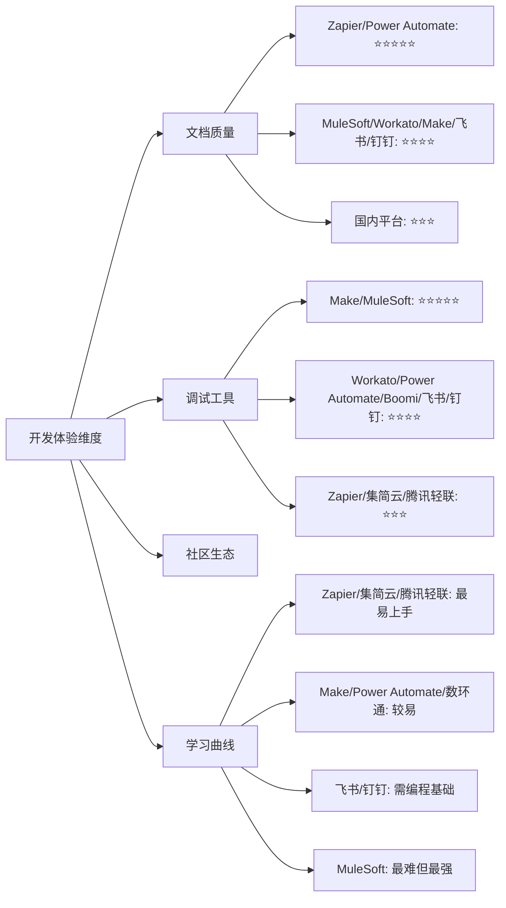
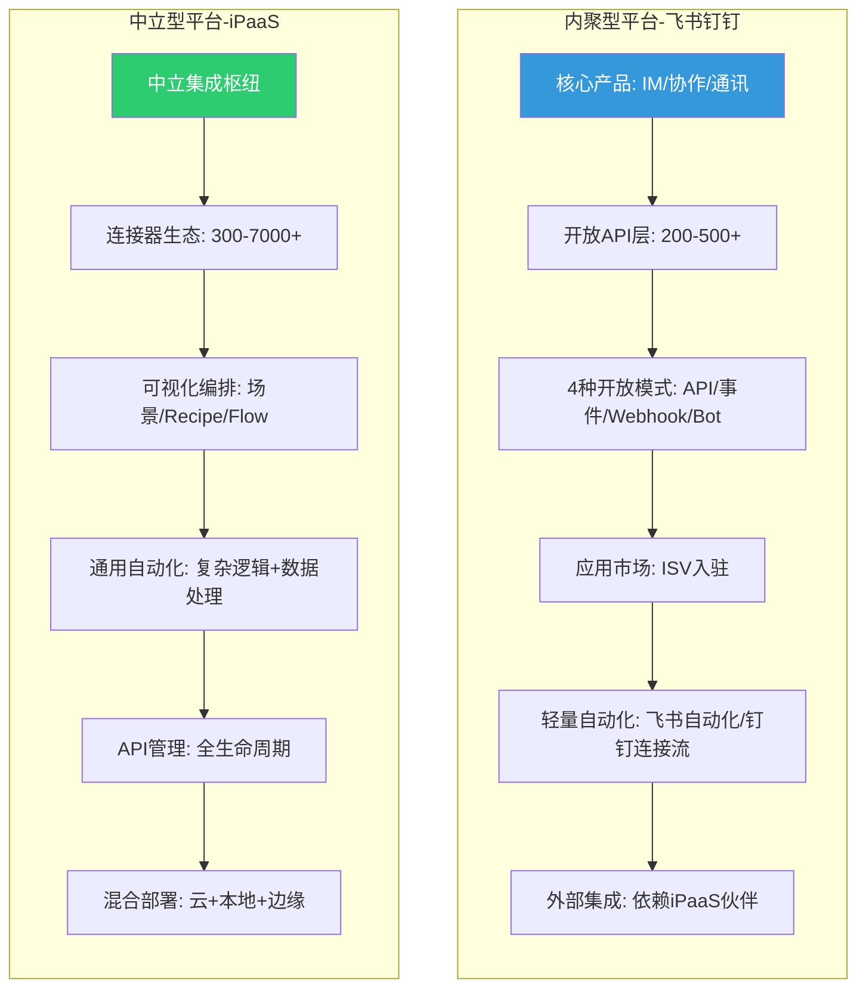
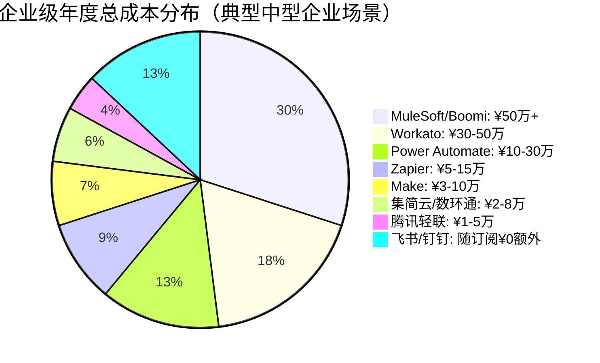
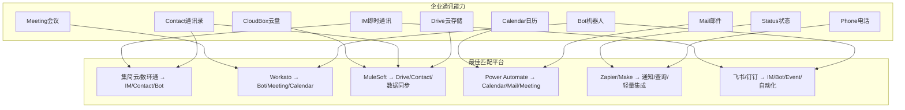
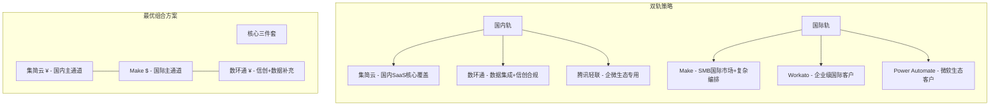

# 软件连接器平台汇总对比调研报告

**版本**：V3.0  
**日期**：2026年5月  
**修订说明**：V3.0 移除了所有特定产品视角的内容，将报告定位为纯粹的第三方连接器平台客观对比调研报告，聚焦 11 个平台之间的差异分析与行业洞察。

---

## 一、执行摘要

本报告对全球 11 大主流软件连接器平台进行了全面的汇总与对比分析，涵盖 6 家国际平台（Zapier、Make、MuleSoft、Workato、Power Automate、Boomi）、3 家国内平台（集简云、数环通、腾讯轻联）和 2 家内聚型平台（飞书集成平台、钉钉连接平台），从平台定位、核心能力、开发模式、安全合规、成本效益、典型场景等多个维度进行深入对比，为企业选择连接器平台提供客观参考。

> **说明**：飞书集成平台和钉钉连接平台属于"内聚型集成平台"，以自身产品为中心提供集成能力，与独立 iPaaS 平台有本质区别。在本报告中，它们作为内聚型平台的代表参与对比，而非外部集成渠道。

### 核心结论

| 对比维度 | 国际平台领先者 | 国内平台领先者 | 内聚型平台代表 | 最佳适用场景 |
|---------|-------------|-------------|-------------|------------|
| **连接器数量** | Zapier（7000+） | 数环通（500+） | 钉钉（500+开放API） | 超大规模SaaS生态覆盖 |
| **国内 SaaS 覆盖** | Make（有限） | 集简云（400+，60%国内应用） | 飞书/钉钉（自身即国内SaaS） | 国内企业数字化转型 |
| **复杂编排能力** | Make（场景+路由+迭代） | 数环通（JS 脚本） | 钉钉连接流（轻量级） | 跨系统复杂业务流程 |
| **企业级治理** | MuleSoft（API-led） | 腾讯轻联（企微深度） | 飞书/钉钉（应用级治理） | 大型企业API治理与合规 |
| **性价比** | Make（操作量计费） | 集简云（人民币定价） | 飞书/钉钉（随订阅无额外费用） | 中小企业轻量集成 |
| **安全合规** | MuleSoft（混合部署） | 数环通（等保三级+信创） | 飞书/钉钉（等保+PIPL） | 高合规要求行业 |
| **AI 赋能** | Power Automate（Copilot） | — | — | AI辅助自动化场景 |
| **内聚型架构** | — | — | 飞书（原生联动深度）/ 钉钉（开放生态连接） | 企业通讯场景化集成 |

**市场定位总结**：11 个平台可归纳为四大类别——

- **国际 iPaaS 平台**（Zapier、Make、MuleSoft、Workato、Power Automate、Boomi）：以连接广度见长，覆盖全球主流 SaaS，但在国内 SaaS 和合规方面存在短板
- **国内 iPaaS 平台**（集简云、数环通、腾讯轻联）：深耕国内 SaaS 生态，人民币定价，等保+信创合规齐全，但国际 SaaS 覆盖有限
- **内聚型平台**（飞书、钉钉）：以自身通讯/协作为核心，原生联动深度极强，集成能力随订阅提供，但外部连接广度依赖 iPaaS 伙伴
- **企业微信生态专用**（腾讯轻联）：企微+腾讯云原生的特殊定位，在企微生态场景中有不可替代的优势

### 平台总览评分

| 平台 | 生态规模 | 编排能力 | 企业治理 | 性价比 | 安全合规 | 综合推荐 |
|------|---------|---------|---------|--------|---------|---------|
| **Zapier** | ⭐⭐⭐⭐⭐ | ⭐⭐⭐⭐ | ⭐⭐⭐ | ⭐⭐⭐⭐ | ⭐⭐⭐⭐ | ⭐⭐⭐⭐ |
| **Make** | ⭐⭐⭐⭐ | ⭐⭐⭐⭐⭐ | ⭐⭐⭐ | ⭐⭐⭐⭐⭐ | ⭐⭐⭐⭐ | ⭐⭐⭐⭐⭐ |
| **MuleSoft** | ⭐⭐⭐⭐ | ⭐⭐⭐⭐⭐ | ⭐⭐⭐⭐⭐ | ⭐⭐ | ⭐⭐⭐⭐⭐ | ⭐⭐⭐⭐ |
| **Workato** | ⭐⭐⭐⭐ | ⭐⭐⭐⭐⭐ | ⭐⭐⭐⭐⭐ | ⭐⭐⭐ | ⭐⭐⭐⭐ | ⭐⭐⭐⭐ |
| **Power Automate** | ⭐⭐⭐⭐ | ⭐⭐⭐⭐ | ⭐⭐⭐⭐⭐ | ⭐⭐⭐⭐ | ⭐⭐⭐⭐⭐ | ⭐⭐⭐⭐ |
| **Boomi** | ⭐⭐⭐⭐ | ⭐⭐⭐⭐ | ⭐⭐⭐⭐⭐ | ⭐⭐⭐ | ⭐⭐⭐⭐⭐ | ⭐⭐⭐ |
| **集简云** | ⭐⭐⭐ | ⭐⭐⭐⭐ | ⭐⭐⭐ | ⭐⭐⭐⭐⭐ | ⭐⭐⭐⭐ | ⭐⭐⭐⭐⭐ |
| **数环通** | ⭐⭐⭐ | ⭐⭐⭐⭐ | ⭐⭐⭐ | ⭐⭐⭐⭐ | ⭐⭐⭐⭐⭐ | ⭐⭐⭐⭐⭐ |
| **腾讯轻联** | ⭐⭐⭐ | ⭐⭐⭐ | ⭐⭐⭐⭐ | ⭐⭐⭐ | ⭐⭐⭐⭐⭐ | ⭐⭐⭐ |
| **飞书集成平台** 🔵 | ⭐⭐⭐ | ⭐⭐ | ⭐⭐⭐ | ⭐⭐⭐⭐⭐ | ⭐⭐⭐⭐ | ⭐⭐⭐⭐ |
| **钉钉连接平台** 🔵 | ⭐⭐⭐ | ⭐⭐⭐ | ⭐⭐⭐ | ⭐⭐⭐⭐⭐ | ⭐⭐⭐⭐ | ⭐⭐⭐⭐ |

> 🔵 标记为内聚型平台，其评分维度含义与 iPaaS 不同，主要评估其自身产品生态内的集成深度。

---

## 二、平台定位对比

### 2.1 公司背景对比

| 对比项 | Zapier | Make | MuleSoft | Workato | Power Automate | Boomi | 集简云 | 数环通 | 腾讯轻联 | 飞书集成平台 | 钉钉连接平台 |
|--------|--------|------|----------|---------|---------------|-------|--------|--------|---------|------------|------------|
| **成立时间** | 2011 | 2012 | 2006 | 2013 | 2016 | 2000 | ~2020 | ~2020 | ~2022 | 2019(开放平台) | 2015(开放平台) |
| **总部** | 旧金山 | 布拉格(捷克) | 旧金山 | 山景城 | 雷德蒙德 | 新泽西 | 北京 | 杭州 | 深圳 | 北京 | 杭州 |
| **所属集团** | 独立 | 独立 | Salesforce | 独立 | 微软 | 独立(原Dell) | 独立 | 独立 | 腾讯云 | 字节跳动 | 阿里巴巴 |
| **估值/营收** | ~$5B | — | $65B收购 | $56B估值 | M365生态 | ~$4B | — | — | 腾讯云生态 | 字节跳动生态 | 阿里云生态 |
| **企业客户** | 200万+ | 50万+ | 1600+ | 数千 | 95% Fortune 500 | 20000+ | 20000+ | 数千 | 企微1000万+ | 飞书千万级用户 | 钉钉6亿+用户 |
| **市场地位** | SMB iPaaS领导者 | 视觉化 iPaaS | 企业 iPaaS领导者 | 企业 iPaaS重要玩家 | 微软生态自动化核心 | Gartner iPaaS领导者 | 国产 iPaaS头部 | 国产 iPaaS重要玩家 | 腾讯云 iPaaS | 内聚型集成平台 | 内聚型集成平台 |

### 2.2 平台定位对比

| 对比维度 | Zapier | Make | MuleSoft | Workato | Power Automate | Boomi | 集简云 | 数环通 | 腾讯轻联 | 飞书集成平台 | 钉钉连接平台 |
|---------|--------|------|----------|---------|---------------|-------|--------|--------|---------|------------|------------|
| **核心定位** | 无代码iPaaS | 视觉化iPaaS | 企业iPaaS+API管理 | 企业iPaaS+自动化 | 微软生态自动化 | 统一集成平台 | 国产iPaaS | 国产iPaaS+数据集成 | 腾讯生态iPaaS | 飞书内聚型集成平台 | 钉钉内聚型连接中枢 |
| **目标用户** | SMB/个人 | SMB/中型市场 | 大型企业 | 中大型企业 | 微软生态企业 | 中大型企业 | 国内企业 | 国内企业 | 企微生态企业 | 飞书生态企业 | 钉钉生态企业 |
| **设计理念** | Trigger→Action | 场景编排+路由+迭代 | API-led三层架构 | Recipe配方式 | 云端流+桌面流 | Atom混合部署 | 零代码可视化 | 可视化+脚本 | 企微深度集成 | 以飞书为中心+4种开放模式 | 以钉钉为中心+开放生态连接 |
| **差异化** | 最大生态7000+ | 复杂逻辑+性价比 | API全生命周期 | Workbot+AI辅助 | RPA+Copilot | MDM+混合部署 | 国内SaaS最深 | JS脚本+信创 | 企微+腾讯云原生 | 通讯+协作场景原生深度 | 开放生态+宜搭低代码+Stream |

### 2.3 市场战略方向对比

| 战略维度 | 国际平台共性 | 国内平台共性 | 内聚型平台（飞书/钉钉） |
|---------|------------|------------|----------------------|
| **产品策略** | 平台化+生态化，构建开发者社区 | 场景化+本地化，深耕国内SaaS生态 | 内聚型+场景化，以自身产品为中心构建集成层 |
| **技术路线** | 云原生+AI赋能（Copilot/Autopilot/Suggest） | 云原生+信创适配+私有化部署 | 开放API+事件订阅+SDK，内建轻量自动化引擎 |
| **生态策略** | 连接器市场+ISV合作+模板共享 | 国内SaaS深度对接+行业解决方案 | 应用市场+ISV合作（飞书零佣金/钉钉10-30%佣金） |
| **国际化** | 全球多区域部署 | 聚焦国内市场，兼顾出海需求 | 聚焦国内市场，飞书有出海布局 |
| **定价策略** | 美元计费，按量/按用户/按功能分层 | 人民币计费，更灵活的国内定价 | 集成能力随订阅提供，无额外费用 |

---

## 三、核心能力对比

> **重要说明**：飞书集成平台和钉钉连接平台属于内聚型平台，其"连接器"概念与独立 iPaaS 有本质区别——它们提供的是**自身产品的开放API**而非对外部应用的封装。以下对比表中，标注"内聚型"的维度表示该指标不适用直接对比。

### 3.1 连接器生态对比

#### 3.1.1 应用连接器数量对比

| 平台 | 官方应用连接器数 | 社区/第三方连接器 | 总计(约) | 增长速度 | 覆盖广度评级 |
|------|---------------|----------------|---------|---------|------------|
| **Zapier** | 7000+ | 数百(社区) | ~7500 | 每周新增5-10个 | ⭐⭐⭐⭐⭐ |
| **Make** | 1800+ | 数百(社区模板) | ~2000 | 每月新增20+ | ⭐⭐⭐⭐ |
| **MuleSoft** | 400+(Anypoint Connector) | 数千(Exchange共享) | ~3000+ | 季度更新 | ⭐⭐⭐⭐ |
| **Workato** | 1200+ | 数百(Community) | ~1500 | 每月新增10+ | ⭐⭐⭐⭐ |
| **Power Automate** | 900+(Premium+Standard) | 数千(自定义) | ~2000+ | 持续扩展 | ⭐⭐⭐⭐ |
| **Boomi** | 300+(官方) | 数千(社区贡献) | ~2500+ | 季度更新 | ⭐⭐⭐⭐ |
| **集简云** | 400+ | 50+(用户贡献) | ~450 | 每月新增5-10个 | ⭐⭐⭐ |
| **数环通** | 500+ | 30+(用户贡献) | ~530 | 每月新增8-15个 | ⭐⭐⭐ |
| **腾讯轻联** | 300+ | 腾讯生态内嵌 | ~350 | 按需扩展 | ⭐⭐⭐ |
| **飞书集成平台** 🔵 | 200+(内部API) | 应用市场ISV应用 | 不适用(iPaaS维度) | 持续扩展 | ⭐⭐⭐(内部深度) |
| **钉钉连接平台** 🔵 | 500+(开放API) | 应用市场ISV应用 | 不适用(iPaaS维度) | 持续扩展 | ⭐⭐⭐(内部深度) |

> 🔵 内聚型平台的"连接器数量"含义不同：飞书200+和钉钉500+是自身产品的开放API数量，而非对外部应用的封装连接器。其生态广度体现在应用市场的ISV应用数而非连接器数。

#### 3.1.2 国内 SaaS 覆盖对比

| 国内应用 | Zapier | Make | MuleSoft | Workato | Power Automate | Boomi | 集简云 | 数环通 | 腾讯轻联 | 飞书 | 钉钉 |
|---------|--------|------|----------|---------|---------------|-------|--------|--------|---------|------|------|
| **企业微信** | ✅ 基础 | ✅ 基础 | ❌ 需自定义 | ✅ 基础 | ✅ 基础 | ❌ 需自定义 | ✅ 深度 | ✅ 深度 | ✅ 原生 | ✅ 基础 | ✅ 基础 |
| **钉钉** | ✅ 基础 | ✅ 基础 | ❌ 需自定义 | ✅ 基础 | ❌ 需自定义 | ❌ 需自定义 | ✅ 深度 | ✅ 深度 | ✅ 基础 | ✅ 基础 | ✅ 自身(原生) |
| **飞书** | ✅ 基础 | ✅ 基础 | ❌ 需自定义 | ✅ 基础 | ❌ 需自定义 | ❌ 需自定义 | ✅ 深度 | ✅ 深度 | ✅ 基础 | ✅ 自身(原生) | ✅ 基础 |
| **金蝶** | ❌ | ❌ | ✅ 需自定义 | ❌ | ❌ | ✅ 需自定义 | ✅ 深度 | ✅ 深度 | ✅ 基础 | ✅ 基础(ISV) | ✅ 基础(ISV) |
| **用友** | ❌ | ❌ | ✅ 需自定义 | ❌ | ❌ | ✅ 需自定义 | ✅ 深度 | ✅ 深度 | ✅ 基础 | ✅ 基础(ISV) | ✅ 基础(ISV) |
| **泛微** | ❌ | ❌ | ❌ | ❌ | ❌ | ❌ | ✅ 深度 | ✅ 深度 | ✅ 基础 | ✅ 基础(ISV) | ✅ 基础(ISV) |
| **北森** | ❌ | ❌ | ❌ | ❌ | ❌ | ❌ | ✅ 深度 | ✅ 基础 | ❌ | ✅ 基础(ISV) | ✅ 基础(ISV) |
| **致远** | ❌ | ❌ | ❌ | ❌ | ❌ | ❌ | ✅ 深度 | ✅ 基础 | ❌ | ✅ 基础(ISV) | ✅ 基础(ISV) |
| **蓝凌** | ❌ | ❌ | ❌ | ❌ | ❌ | ❌ | ✅ 基础 | ✅ 基础 | ❌ | ✅ 基础(ISV) | ✅ 基础(ISV) |
| **明道云** | ❌ | ❌ | ❌ | ❌ | ❌ | ❌ | ✅ 深度 | ✅ 深度 | ❌ | ✅ 基础(ISV) | ✅ 基础(ISV) |
| **简道云** | ❌ | ❌ | ❌ | ❌ | ❌ | ❌ | ✅ 深度 | ✅ 深度 | ✅ 基础 | ✅ 基础(ISV) | ✅ 基础(ISV) |
| **有赞** | ❌ | ❌ | ❌ | ❌ | ❌ | ❌ | ✅ 深度 | ✅ 深度 | ❌ | ✅ 基础(ISV) | ✅ 基础(ISV) |
| **微盟** | ❌ | ❌ | ❌ | ❌ | ❌ | ❌ | ✅ 基础 | ✅ 基础 | ❌ | ✅ 基础(ISV) | ✅ 基础(ISV) |

> **小结**：国内 SaaS 覆盖方面，集简云和数环通遥遥领先，覆盖率超 90%；腾讯轻联聚焦企微+腾讯生态；国际平台仅对头部应用（企微/钉钉/飞书）提供基础支持，长尾国内应用几乎空白。飞书/钉钉自身就是国内核心 SaaS，通过 ISV 应用市场提供国内 SaaS 的集成能力。

#### 3.1.3 国际 SaaS 覆盖对比

| 国际应用 | Zapier | Make | MuleSoft | Workato | Power Automate | Boomi | 集简云 | 数环通 | 腾讯轻联 | 飞书 | 钉钉 |
|---------|--------|------|----------|---------|---------------|-------|--------|--------|---------|------|------|
| **Salesforce** | ✅ 深度 | ✅ 深度 | ✅ 原生 | ✅ 深度 | ✅ 深度 | ✅ 深度 | ✅ 基础 | ✅ 基础 | ❌ | ✅ 有限(ISV) | ✅ 有限(ISV) |
| **HubSpot** | ✅ 深度 | ✅ 深度 | ✅ 标准 | ✅ 深度 | ✅ 标准 | ✅ 标准 | ✅ 基础 | ✅ 基础 | ❌ | ✅ 有限 | ✅ 有限 |
| **Google Workspace** | ✅ 深度 | ✅ 深度 | ✅ 标准 | ✅ 深度 | ✅ 原生 | ✅ 标准 | ✅ 基础 | ✅ 基础 | ❌ | ✅ 有限 | ✅ 有限 |
| **Microsoft 365** | ✅ 深度 | ✅ 深度 | ✅ 标准 | ✅ 深度 | ✅ 原生 | ✅ 深度 | ✅ 基础 | ✅ 基础 | ❌ | ✅ 有限 | ✅ 有限 |
| **SAP** | ✅ 标准 | ✅ 标准 | ✅ 原生 | ✅ 深度 | ✅ 标准 | ✅ 深度 | ❌ | ❌ | ❌ | ❌ | ❌ |
| **ServiceNow** | ✅ 标准 | ✅ 标准 | ✅ 原生 | ✅ 深度 | ✅ 标准 | ✅ 标准 | ❌ | ❌ | ❌ | ❌ | ❌ |
| **Slack** | ✅ 深度 | ✅ 深度 | ✅ 标准 | ✅ 深度 | ✅ 深度 | ✅ 标准 | ✅ 基础 | ✅ 基础 | ❌ | ✅ 有限 | ✅ 有限 |
| **Jira/Atlassian** | ✅ 深度 | ✅ 深度 | ✅ 标准 | ✅ 深度 | ✅ 标准 | ✅ 标准 | ✅ 基础 | ✅ 基础 | ❌ | ✅ 有限 | ✅ 有限 |
| **AWS** | ✅ 标准 | ✅ 标准 | ✅ 原生 | ✅ 标准 | ✅ 标准 | ✅ 深度 | ❌ | ❌ | ✅ 基础 | ❌ | ✅ 有限(阿里云) |
| **Shopify** | ✅ 深度 | ✅ 深度 | ✅ 标准 | ✅ 深度 | ✅ 标准 | ✅ 标准 | ✅ 基础 | ✅ 基础 | ❌ | ❌ | ❌ |

> **小结**：国际 SaaS 覆盖呈明显阶梯分布——国际平台覆盖 95%+ 主流 SaaS，国内平台仅覆盖少量已入华的国际应用。飞书/钉钉对国际 SaaS 的覆盖有限，主要通过 ISV 应用间接支持。对于同时需要服务国内外客户的企业，组合策略必不可少。

#### 3.1.4 数据库与中间件支持对比

| 数据库/中间件 | Zapier | Make | MuleSoft | Workato | Power Automate | Boomi | 集简云 | 数环通 | 腾讯轻联 | 飞书 | 钉钉 |
|-------------|--------|------|----------|---------|---------------|-------|--------|--------|---------|------|------|
| **MySQL** | ✅ 基础 | ✅ 标准 | ✅ 深度 | ✅ 标准 | ✅ 标准 | ✅ 深度 | ✅ 标准 | ✅ 深度 | ✅ 基础 | ❌ 不支持直连 | ❌ 不支持直连 |
| **PostgreSQL** | ✅ 基础 | ✅ 标准 | ✅ 深度 | ✅ 标准 | ✅ 标准 | ✅ 深度 | ✅ 标准 | ✅ 深度 | ✅ 基础 | ❌ 不支持直连 | ❌ 不支持直连 |
| **Oracle** | ❌ | ✅ 标准 | ✅ 深度 | ✅ 标准 | ✅ 标准 | ✅ 深度 | ✅ 基础 | ✅ 标准 | ❌ | ❌ 不支持直连 | ❌ 不支持直连 |
| **SQL Server** | ✅ 基础 | ✅ 标准 | ✅ 深度 | ✅ 标准 | ✅ 原生 | ✅ 深度 | ✅ 基础 | ✅ 标准 | ✅ 基础 | ❌ 不支持直连 | ❌ 不支持直连 |
| **MongoDB** | ✅ 基础 | ✅ 标准 | ✅ 深度 | ✅ 标准 | ✅ 标准 | ✅ 标准 | ✅ 基础 | ✅ 标准 | ❌ | ❌ 不支持直连 | ❌ 不支持直连 |
| **Redis** | ❌ | ✅ 基础 | ✅ 标准 | ✅ 基础 | ❌ | ✅ 标准 | ❌ | ✅ 基础 | ❌ | ❌ 不支持直连 | ❌ 不支持直连 |
| **Kafka** | ❌ | ✅ 基础 | ✅ 深度 | ✅ 标准 | ❌ | ✅ 深度 | ❌ | ✅ 基础 | ❌ | ❌ 不支持直连 | ❌ 不支持直连 |
| **RabbitMQ** | ❌ | ✅ 基础 | ✅ 深度 | ✅ 标准 | ❌ | ✅ 标准 | ❌ | ✅ 基础 | ❌ | ❌ 不支持直连 | ❌ 不支持直连 |
| **Elasticsearch** | ❌ | ✅ 基础 | ✅ 标准 | ✅ 标准 | ❌ | ✅ 标准 | ❌ | ✅ 基础 | ❌ | ❌ 不支持直连 | ❌ 不支持直连 |
| **HTTP/REST** | ✅ 通用 | ✅ 通用 | ✅ 通用 | ✅ 通用 | ✅ 通用 | ✅ 通用 | ✅ 通用 | ✅ 通用 | ✅ 通用 | ✅ 开放API | ✅ 开放API |

> **小结**：MuleSoft 和 Boomi 在数据库与中间件支持上最为全面，具备企业级数据集成能力；Make 和数环通居中；Zapier 偏轻量级，主要依赖 HTTP/REST 通用接口；腾讯轻联在数据库方面支持有限。飞书/钉钉作为内聚型平台，不支持直连数据库和中间件，数据集成需通过 API 或借助 iPaaS 伙伴实现。

### 3.2 开发模式对比

#### 3.2.1 开发方式对比

| 开发方式 | Zapier | Make | MuleSoft | Workato | Power Automate | Boomi | 集简云 | 数环通 | 腾讯轻联 | 飞书 | 钉钉 |
|---------|--------|------|----------|---------|---------------|-------|--------|--------|---------|------|------|
| **无代码(拖拽)** | ✅ 主要 | ✅ 主要 | ✅ 支持 | ✅ 主要 | ✅ 主要 | ✅ 支持 | ✅ 主要 | ✅ 主要 | ✅ 主要 | ❌ | ✅ 有限(宜搭) |
| **低代码(配置+脚本)** | ✅ 有限(Filter/Formatter) | ✅ 强大(函数+迭代器) | ✅ 强大(DataWeave) | ✅ 强大(Ruby模式) | ✅ 强大(表达式) | ✅ 强大(Shape语言) | ✅ 基础(条件+延迟) | ✅ 强大(JS脚本) | ✅ 基础(条件分支) | ✅ 有限(场景配置) | ✅ 连接流配置 |
| **专业代码(Pro-code)** | ❌ | ❌ | ✅ Java/Mule | ✅ Ruby/Connector SDK | ✅ C#/JS/Power Fx | ✅ Java/Groovy | ❌ | ✅ 有限(自定义代码块) | ❌ | ✅ Java/Python/Go/Node.js | ✅ Java/Python/Node.js/Go/C# |
| **AI辅助开发** | ✅ Copilot(有限) | ❌ | ❌ | ✅ AI Suggest | ✅ Copilot(深度) | ❌ | ❌ | ❌ | ❌ | ❌ | ❌ |

#### 3.2.2 SDK 与语言支持对比

| 语言/SDK | Zapier | Make | MuleSoft | Workato | Power Automate | Boomi | 集简云 | 数环通 | 腾讯轻联 | 飞书 | 钉钉 |
|---------|--------|------|----------|---------|---------------|-------|--------|--------|---------|------|------|
| **Java** | ❌ | ❌ | ✅ 原生(Mule Runtime) | ❌ | ❌ | ✅ 支持 | ❌ | ❌ | ❌ | ✅ 官方SDK | ✅ 官方SDK |
| **Python** | ❌ | ❌ | ✅ 支持 | ✅ 有限 | ✅ 支持(Azure Functions) | ❌ | ❌ | ✅ 脚本支持 | ❌ | ✅ 官方SDK | ✅ 官方SDK |
| **Go** | ❌ | ❌ | ❌ | ❌ | ❌ | ❌ | ❌ | ❌ | ❌ | ✅ 官方SDK | ✅ 官方SDK |
| **Node.js** | ✅ CLI(官方) | ❌ | ✅ 支持 | ❌ | ✅ 支持(Azure Functions) | ❌ | ❌ | ✅ 有限 | ❌ | ✅ 官方SDK | ✅ 官方SDK |
| **Ruby** | ❌ | ❌ | ✅ 支持 | ✅ 原生(Connector SDK) | ❌ | ❌ | ❌ | ❌ | ❌ | ❌ | ❌ |
| **JavaScript** | ✅ CLI(官方) | ✅ 有限(自定义函数) | ✅ DataWeave | ✅ 有限 | ✅ 原生(Power Fx/JS) | ✅ 有限 | ❌ | ✅ 原生(JS脚本) | ❌ | ✅ 小程序 | ✅ 小程序 |
| **C#** | ❌ | ❌ | ✅ 支持 | ❌ | ✅ 原生(.NET) | ❌ | ❌ | ❌ | ❌ | ❌ | ✅ 官方SDK |

> **小结**：MuleSoft 拥有最全面的语言生态（Java原生 + 多语言支持），Workato 以 Ruby 为核心，Power Automate 深度绑定 .NET/JS 生态。国内平台中，数环通凭借 JS 脚本能力脱颖而出。飞书/钉钉作为内聚型平台，提供全栈 SDK（Java/Python/Go/Node.js），开发模式以代码+API为主，而非可视化编排。

#### 3.2.3 自定义连接器开发对比

| 开发方式 | Zapier | Make | MuleSoft | Workato | Power Automate | Boomi | 集简云 | 数环通 | 腾讯轻联 | 飞书 | 钉钉 |
|---------|--------|------|----------|---------|---------------|-------|--------|--------|---------|------|------|
| **CLI 工具** | ✅ Zapier CLI | ❌ | ✅ Anypoint CLI | ✅ Workato CLI | ❌ | ❌ | ❌ | ❌ | ❌ | ❌ | ✅ DingTalk CLI |
| **可视化构建器** | ✅ Platform UI | ✅ 自定义模块 | ✅ Anypoint Studio | ✅ Connector Builder | ✅ 自定义连接器向导 | ✅ Connection Builder | ✅ 应用创建向导 | ✅ 可视化配置 | ✅ 应用配置 | ✅ 开发者后台 | ✅ 开发者后台 |
| **SDK** | ✅ zapier-platform | ❌ | ✅ Mule SDK | ✅ Connector SDK | ✅ 自定义代码 | ✅ Boomi SDK | ❌ | ❌ | ❌ | ✅ 多语言SDK | ✅ 多语言SDK+Stream SDK |
| **OpenAPI/Swagger导入** | ✅ 支持 | ✅ 支持 | ✅ 深度支持 | ✅ 支持 | ✅ 支持 | ✅ 支持 | ✅ 支持 | ✅ 支持 | ✅ 有限 | ❌ 不适用(内聚型) | ❌ 不适用(内聚型) |
| **开发门槛** | 中(需JS) | 低(可视化) | 高(需Java) | 中(需Ruby) | 中(需C#/JS) | 中(需Java) | 低(零代码) | 低(JS可选) | 低(零代码) | 中(需编程+API) | 中(需编程+API) |
| **开发周期(新连接器)** | 1-3天 | 1-2天 | 1-4周 | 3-5天 | 2-5天 | 1-3周 | 1-2天 | 1-3天 | 1-2天 | 不适用(内聚型) | 不适用(内聚型) |

### 3.3 工作流自动化能力对比

#### 3.3.1 流程编排能力对比

| 编排能力 | Zapier | Make | MuleSoft | Workato | Power Automate | Boomi | 集简云 | 数环通 | 腾讯轻联 | 飞书 | 钉钉 |
|---------|--------|------|----------|---------|---------------|-------|--------|--------|---------|------|------|
| **多步骤流程** | ✅ 最多100步 | ✅ 无限制 | ✅ 无限制 | ✅ 无限制 | ✅ 无限制 | ✅ 无限制 | ✅ 最多50步 | ✅ 无限制 | ✅ 最多30步 | ✅ 有限(自动化) | ✅ 连接流 |
| **条件分支** | ✅ Paths | ✅ Router(多路由) | ✅ Choice | ✅ IF/Switch | ✅ Condition | ✅ Decision | ✅ 条件分支 | ✅ 条件分支 | ✅ 条件分支 | ✅ 条件判断 | ✅ 条件分支 |
| **循环迭代** | ✅ Looping(有限) | ✅ Iterator+Aggregator | ✅ ForEach | ✅ Repeat | ✅ Apply to each | ✅ Loop | ✅ 循环 | ✅ 循环迭代 | ✅ 有限循环 | ❌ | ✅ 有限 |
| **并行执行** | ✅ Paths并行 | ✅ 并行路由 | ✅ Scatter-Gather | ✅ 并行分支 | ✅ 并行分支 | ✅ 并行处理 | ❌ | ✅ 并行分支 | ❌ | ❌ | ❌ |
| **错误处理** | ✅ 基础(重试) | ✅ 强大(错误路由) | ✅ 企业级(异常策略) | ✅ 强大(错误Recipe) | ✅ 强大(作用域+重试) | ✅ 企业级(异常处理) | ✅ 基础(重试) | ✅ 标准(错误分支) | ✅ 基础(重试) | ✅ 基础 | ✅ 基础 |
| **子流程调用** | ❌ | ✅ 场景调用 | ✅ 子流程 | ✅ Recipe调用 | ✅ 子流 | ✅ 子流程 | ✅ 子流程 | ✅ 子流程 | ❌ | ❌ | ✅ 审批流协同 |
| **暂停/等待** | ✅ Delay | ✅ Sleep+Webhook等待 | ✅ 直到成功 | ✅ Wait | ✅ Delay | ✅ Wait | ✅ 延迟 | ✅ 延迟+等待 | ✅ 延迟 | ✅ 延迟 | ✅ 延迟 |
| **断点/调试** | ❌ | ✅ 历史记录回放 | ✅ Studio调试 | ✅ Step-by-step | ✅ 运行历史 | ✅ 调试模式 | ✅ 运行日志 | ✅ 节点调试 | ✅ 运行日志 | ✅ API Explorer | ✅ API Explorer |

#### 3.3.2 触发方式对比

| 触发方式 | Zapier | Make | MuleSoft | Workato | Power Automate | Boomi | 集简云 | 数环通 | 腾讯轻联 | 飞书 | 钉钉 |
|---------|--------|------|----------|---------|---------------|-------|--------|--------|---------|------|------|
| **实时Webhook** | ✅ | ✅ | ✅ | ✅ | ✅ HTTP触发 | ✅ | ✅ | ✅ | ✅ | ✅ Webhook | ✅ Webhook |
| **定时轮询** | ✅ | ✅ | ✅ | ✅ | ✅ 计划触发 | ✅ | ✅ | ✅ | ✅ | ❌ | ❌ |
| **事件驱动** | ✅ 有限 | ✅ 强大 | ✅ 原生(事件架构) | ✅ 强大 | ✅ 有限 | ✅ 原生 | ✅ 基础 | ✅ 基础 | ✅ 企微事件 | ✅ 事件订阅v2(AES-256) | ✅ 事件订阅+Stream长连接 |
| **消息队列** | ❌ | ✅ 有限 | ✅ 深度(JMS/Kafka) | ✅ 标准 | ✅ Service Bus | ✅ 深度 | ❌ | ✅ 有限 | ❌ | ❌ | ✅ Stream长连接 |
| **手动触发** | ✅ | ✅ | ✅ | ✅ | ✅ 按钮 | ✅ | ✅ | ✅ | ✅ | ✅ 机器人命令 | ✅ 机器人命令 |
| **API调用触发** | ✅ | ✅ | ✅ 原生 | ✅ | ✅ HTTP | ✅ | ✅ | ✅ | ✅ | ✅ 开放API | ✅ 开放API |
| **邮件触发** | ✅ | ✅ | ✅ | ✅ | ✅ | ✅ | ✅ | ✅ | ❌ | ❌ | ❌ |
| **文件变更触发** | ✅ | ✅ | ✅ | ✅ | ✅ 文件夹 | ✅ | ✅ 有限 | ✅ 有限 | ✅ 企微文件 | ✅ 云盘事件 | ✅ 有限 |

#### 3.3.3 数据处理能力对比

| 数据能力 | Zapier | Make | MuleSoft | Workato | Power Automate | Boomi | 集简云 | 数环通 | 腾讯轻联 | 飞书 | 钉钉 |
|---------|--------|------|----------|---------|---------------|-------|--------|--------|---------|------|------|
| **数据转换** | ✅ Formatter(15+操作) | ✅ 函数库(300+) | ✅ DataWeave(最强) | ✅ Formula模式 | ✅ 表达式 | ✅ Map/Shape | ✅ 基础转换 | ✅ JS脚本转换 | ✅ 基础映射 | ✅ SDK处理 | ✅ SDK处理 |
| **字段映射** | ✅ 自动+手动 | ✅ 自动+手动 | ✅ 智能映射 | ✅ 自动+手动 | ✅ 自动映射 | ✅ Profile映射 | ✅ 手动映射 | ✅ 自动+手动 | ✅ 手动映射 | ✅ API手动 | ✅ API手动 |
| **数据过滤** | ✅ Filter | ✅ Filter+条件 | ✅ 复杂过滤 | ✅ 条件过滤 | ✅ Filter | ✅ Route+Filter | ✅ 条件过滤 | ✅ 条件过滤 | ✅ 条件过滤 | ✅ 条件过滤 | ✅ 条件过滤 |
| **脚本编写** | ✅ Code步(JS) | ✅ 自定义函数 | ✅ DataWeave/Groovy | ✅ Ruby公式 | ✅ JS/C# | ✅ Groovy/JS | ❌ | ✅ JS脚本 | ❌ | ✅ 多语言SDK | ✅ 多语言SDK |
| **JSON/XML处理** | ✅ JSON | ✅ JSON+XML | ✅ 全格式深度 | ✅ JSON+XML | ✅ JSON+XML | ✅ 全格式 | ✅ JSON | ✅ JSON+XML | ✅ JSON | ✅ JSON | ✅ JSON |
| **数组/批量处理** | ✅ Looping | ✅ Iterator+Array函数 | ✅ 批量模块 | ✅ List操作 | ✅ Apply to each | ✅ Batch处理 | ✅ 循环 | ✅ 迭代器 | ✅ 有限 | ✅ 有限 | ✅ 有限 |

### 3.4 安全与合规对比

#### 3.4.1 安全能力对比

| 安全能力 | Zapier | Make | MuleSoft | Workato | Power Automate | Boomi | 集简云 | 数环通 | 腾讯轻联 | 飞书 | 钉钉 |
|---------|--------|------|----------|---------|---------------|-------|--------|--------|---------|------|------|
| **传输加密** | ✅ TLS 1.2+ | ✅ TLS 1.2+ | ✅ TLS 1.3 | ✅ TLS 1.2+ | ✅ TLS 1.2+ | ✅ TLS 1.2+ | ✅ TLS 1.2+ | ✅ TLS 1.2+ | ✅ TLS 1.2+ | ✅ TLS 1.2+ | ✅ TLS 1.2+ |
| **静态数据加密** | ✅ AES-256 | ✅ AES-256 | ✅ AES-256+ | ✅ AES-256 | ✅ Azure加密 | ✅ AES-256 | ✅ AES-256 | ✅ AES-256 | ✅ 腾讯云KMS | ✅ AES-256 | ✅ AES-256 |
| **审计日志** | ✅ 基础 | ✅ 标准 | ✅ 深度审计 | ✅ 深度审计 | ✅ O365审计 | ✅ 深度审计 | ✅ 基础 | ✅ 标准 | ✅ 标准 | ✅ 标准 | ✅ 标准 |
| **IP白名单** | ✅ 企业版 | ✅ 支持 | ✅ 支持 | ✅ 支持 | ✅ 支持 | ✅ 支持 | ✅ 支持 | ✅ 支持 | ✅ 支持 | ✅ 支持 | ✅ 支持 |
| **DLP(数据防泄漏)** | ❌ | ❌ | ✅ 深度 | ✅ 支持 | ✅ M365 DLP | ✅ 支持 | ❌ | ❌ | ✅ 有限 | ✅ 数据权限 | ✅ 数据权限 |
| **RBAC** | ✅ 团队版+ | ✅ 团队版+ | ✅ 细粒度RBAC | ✅ 细粒度RBAC | ✅ Azure AD RBAC | ✅ 细粒度RBAC | ✅ 团队版+ | ✅ 团队版+ | ✅ 企微角色 | ✅ 应用级权限 | ✅ 应用级权限 |
| **SSO/SAML** | ✅ 企业版 | ✅ 团队版+ | ✅ 原生 | ✅ 企业版 | ✅ Azure AD | ✅ 原生 | ✅ 企业版 | ✅ 企业版 | ✅ 企微SSO | ✅ 飞书SSO | ✅ 钉钉SSO |
| **密钥管理** | ✅ 托管 | ✅ 托管 | ✅ KMS集成 | ✅ 托管+Vault | ✅ Azure KeyVault | ✅ 托管 | ✅ 托管 | ✅ 托管 | ✅ 腾讯云KMS | ✅ 应用级加密 | ✅ 应用级加密 |

#### 3.4.2 合规认证对比

| 合规认证 | Zapier | Make | MuleSoft | Workato | Power Automate | Boomi | 集简云 | 数环通 | 腾讯轻联 | 飞书 | 钉钉 |
|---------|--------|------|----------|---------|---------------|-------|--------|--------|---------|------|------|
| **SOC 2 Type II** | ✅ | ✅ | ✅ | ✅ | ✅ | ✅ | ❌ | ❌ | ❌ | ❌ | ❌ |
| **ISO 27001** | ✅ | ✅ | ✅ | ✅ | ✅ | ✅ | ❌ | ✅ | ✅ | ✅ | ✅ |
| **等保三级** | ❌ | ❌ | ❌ | ❌ | ❌ | ❌ | ✅ | ✅ | ✅ | ✅ | ✅ |
| **GDPR** | ✅ | ✅ | ✅ | ✅ | ✅ | ✅ | ✅ | ✅ | ✅ | ✅ | ✅ |
| **信创认证** | ❌ | ❌ | ❌ | ❌ | ❌ | ❌ | ✅ | ✅ | ✅ | ❌ | ❌ |
| **HIPAA** | ❌ | ❌ | ✅ | ✅ | ✅ | ✅ | ❌ | ❌ | ❌ | ❌ | ❌ |
| **FedRAMP** | ❌ | ❌ | ✅ | ❌ | ✅ | ✅ | ❌ | ❌ | ❌ | ❌ | ❌ |
| **CSA STAR** | ❌ | ✅ | ✅ | ❌ | ✅ | ✅ | ❌ | ❌ | ❌ | ❌ | ❌ |
| **PIPL(个人信息保护法)** | ❌ | ❌ | ✅ 有限 | ❌ | ✅ 有限 | ❌ | ✅ | ✅ | ✅ | ✅ | ✅ |

#### 3.4.3 数据存储与隐私对比

| 数据维度 | Zapier | Make | MuleSoft | Workato | Power Automate | Boomi | 集简云 | 数环通 | 腾讯轻联 | 飞书 | 钉钉 |
|---------|--------|------|----------|---------|---------------|-------|--------|--------|---------|------|------|
| **数据驻留选项** | 美国为主 | 美国+欧洲 | 多区域可选 | 美国+欧洲+亚太 | 全球Azure区域 | 多区域(Atom) | 中国大陆 | 中国大陆 | 中国大陆 | 中国大陆 | 中国大陆 |
| **数据保留策略** | 可配置 | 可配置 | 完全自定义 | 可配置 | O365策略 | 完全自定义 | 可配置 | 可配置 | 腾讯云策略 | 飞书策略 | 钉钉策略 |
| **数据删除能力** | ✅ 按需 | ✅ 按需 | ✅ 完全 | ✅ 按需 | ✅ 合规删除 | ✅ 完全 | ✅ 按需 | ✅ 按需 | ✅ 按需 | ✅ 按需 | ✅ 按需 |
| **跨境传输** | ✅ 标准条款 | ✅ SCCs | ✅ 多种机制 | ✅ SCCs | ✅ MCA条款 | ✅ 多种机制 | ✅ 境内不跨境 | ✅ 境内不跨境 | ✅ 境内不跨境 | ✅ 境内不跨境 | ✅ 境内不跨境 |
| **私有化部署** | ❌ | ❌ | ✅ 完全支持 | ✅ 部分支持 | ✅ Government Cloud | ✅ Atom本地 | ✅ 支持 | ✅ 支持 | ✅ 腾讯云VPC | ✅ 飞书专属版 | ✅ 钉钉专属版 |

> **小结**：安全合规维度呈现明显的"国际 vs 国内"分化格局——国际平台在 SOC2、HIPAA、FedRAMP 等国际认证方面领先，国内平台在等保三级、信创认证等国内合规方面占优。飞书/钉钉具备等保三级+PIPL合规，但缺少国际认证（SOC2/HIPAA等）。企业在选择平台时需根据自身客户群体选择合规路径。

### 3.5 国内生态差异小结

> 本节综合对比 11 个平台在国内市场环境下的生态差异，涵盖国内 SaaS 深度、国内 IM 生态、国内云服务、国内合规、定价货币、技术支持和信创适配等维度。

| 国内生态维度 | Zapier | Make | MuleSoft | Workato | Power Automate | Boomi | 集简云 | 数环通 | 腾讯轻联 | 飞书 | 钉钉 |
|------------|--------|------|----------|---------|---------------|-------|--------|--------|---------|------|------|
| **国内SaaS深度** | ⭐ | ⭐ | ⭐ | ⭐ | ⭐ | ⭐ | ⭐⭐⭐⭐⭐ | ⭐⭐⭐⭐⭐ | ⭐⭐⭐⭐ | ⭐⭐⭐⭐(ISV生态) | ⭐⭐⭐⭐(ISV生态) |
| **国内IM生态** | ⭐⭐ | ⭐⭐ | ⭐ | ⭐⭐ | ⭐⭐ | ⭐ | ⭐⭐⭐⭐⭐ | ⭐⭐⭐⭐⭐ | ⭐⭐⭐⭐⭐ | ⭐⭐⭐⭐⭐(原生IM) | ⭐⭐⭐⭐⭐(原生IM) |
| **国内云服务** | ⭐ | ⭐ | ⭐⭐ | ⭐ | ⭐⭐ | ⭐⭐ | ⭐⭐⭐⭐ | ⭐⭐⭐⭐ | ⭐⭐⭐⭐⭐ | ⭐⭐⭐⭐(字节云) | ⭐⭐⭐⭐⭐(阿里云) |
| **国内合规** | ⭐ | ⭐ | ⭐⭐ | ⭐ | ⭐⭐ | ⭐⭐ | ⭐⭐⭐⭐⭐ | ⭐⭐⭐⭐⭐ | ⭐⭐⭐⭐⭐ | ⭐⭐⭐⭐⭐(等保+PIPL) | ⭐⭐⭐⭐⭐(等保+PIPL) |
| **人民币定价** | ❌ | ❌ | ❌ | ❌ | ❌ | ❌ | ✅ | ✅ | ✅ | ✅(随订阅) | ✅(随订阅) |
| **国内技术支持** | ❌ | ❌ | ✅ 有限 | ❌ | ✅ 有限 | ✅ 有限 | ✅ 原生 | ✅ 原生 | ✅ 原生 | ✅ 原生 | ✅ 原生 |
| **信创适配** | ❌ | ❌ | ❌ | ❌ | ❌ | ❌ | ✅ | ✅ | ✅ | ❌ | ❌ |

> **小结**：国内生态呈现鲜明的三档分布——集简云/数环通/腾讯轻联/飞书/钉钉在人民币定价、国内技术支持、国内合规方面全面占优，是国内企业的首选；MuleSoft/Power Automate/Boomi 在国内云服务方面有有限支持；Zapier/Make/Workato 几乎不提供国内生态支持。信创适配方面，仅集简云、数环通、腾讯轻联三个国内 iPaaS 平台通过了信创认证。

---

## 四、技术架构对比

### 4.1 架构设计对比

| 架构维度 | Zapier | Make | MuleSoft | Workato | Power Automate | Boomi | 集简云 | 数环通 | 腾讯轻联 | 飞书 | 钉钉 |
|---------|--------|------|----------|---------|---------------|-------|--------|--------|---------|------|------|
| **架构模式** | 云原生SaaS | 云原生SaaS | 云原生+混合 | 云原生SaaS | 云原生+混合 | 混合架构(Atom) | 云原生SaaS | 云原生SaaS | 云原生(腾讯云) | 内聚型SaaS | 内聚型SaaS |
| **核心运行时** | 自研(Node.js) | 自研(Erlang+JS) | Mule Runtime(Java) | 自研(Ruby) | Azure Functions | Atom(Multi-runtime) | 自研 | 自研 | 腾讯云函数 | 自研+字节云 | 自研+阿里云 |
| **API管理** | ❌ | ❌ | ✅ Anypoint API Manager | ✅ API Management | ✅ Azure API Mgmt | ✅ API Manager | ❌ | ❌ | ✅ 腾讯云API网关 | ✅ 飞书API网关 | ✅ 钉钉API网关 |
| **消息总线** | 内部队列 | 内部队列 | ✅ Anypoint MQ | 内部队列 | ✅ Service Bus | ✅ Atom Queue | 内部队列 | 内部队列 | ✅ CMQ | ✅ 事件订阅v2 | ✅ Stream长连接 |
| **微服务支持** | ❌ | ❌ | ✅ 深度 | ✅ 支持 | ✅ Azure微服务 | ✅ 支持 | ❌ | ❌ | ✅ 有限 | ✅ 小程序+机器人 | ✅ 小程序+机器人 |
| **事件驱动架构** | 有限 | ✅ | ✅ 原生(Event Broker) | ✅ | 有限 | ✅ | 有限 | 有限 | ✅ 企微事件 | ✅ 事件订阅v2(AES-256加密) | ✅ 事件订阅+Stream长连接 |
| **API-led架构** | ❌ | ❌ | ✅ 三层(Experience/API/System) | ✅ 支持 | ✅ 有限 | ✅ 支持 | ❌ | ❌ | ❌ | ❌ | ❌ |

### 4.2 部署方式对比

| 部署方式 | Zapier | Make | MuleSoft | Workato | Power Automate | Boomi | 集简云 | 数环通 | 腾讯轻联 | 飞书 | 钉钉 |
|---------|--------|------|----------|---------|---------------|-------|--------|--------|---------|------|------|
| **纯SaaS** | ✅ 唯一方式 | ✅ 唯一方式 | ✅ CloudHub 2.0 | ✅ 主要方式 | ✅ 主要方式 | ✅ 可选 | ✅ 主要方式 | ✅ 主要方式 | ✅ 主要方式 | ✅ 主要方式 | ✅ 主要方式 |
| **混合部署** | ❌ | ❌ | ✅ CloudHub+Runtime Fabric | ✅ Enterprise | ✅ Gov Cloud+On-prem | ✅ Atom+Cloud | ✅ 支持 | ✅ 支持 | ✅ VPC部署 | ✅ 专属版 | ✅ 专属版 |
| **本地部署** | ❌ | ❌ | ✅ Runtime Fabric/Anypoint | ✅ Self-hosted | ✅ Government Cloud | ✅ Atom本地 | ✅ 私有化 | ✅ 私有化 | ✅ 腾讯云专属 | ✅ 飞书私有化 | ✅ 钉钉私有化 |
| **多云部署** | ❌ | ❌ | ✅ AWS+Azure+GCP | ✅ AWS+Azure | ✅ Azure全球 | ✅ 多云支持 | ✅ 阿里云+腾讯云 | ✅ 阿里云+腾讯云 | ✅ 腾讯云 | ✅ 字节云 | ✅ 阿里云 |
| **边缘部署** | ❌ | ❌ | ✅ Runtime Fabric Edge | ❌ | ❌ | ✅ Atom Edge | ❌ | ❌ | ❌ | ❌ | ❌ |

### 4.3 性能与可扩展性对比

| 性能维度 | Zapier | Make | MuleSoft | Workato | Power Automate | Boomi | 集简云 | 数环通 | 腾讯轻联 | 飞书 | 钉钉 |
|---------|--------|------|----------|---------|---------------|-------|--------|--------|---------|------|------|
| **单流程最大步骤** | 100步 | 无限制 | 无限制 | 无限制 | 无限制 | 无限制 | 50步 | 无限制 | 30步 | 有限(自动化) | 连接流步骤 |
| **并发处理能力** | 中(按计划层级) | 高(按计划) | 极高(Cluster) | 高(Worker) | 高(Azure弹性) | 高(Atom集群) | 中 | 中高 | 中(腾讯云弹性) | 高(字节云弹性) | 高(阿里云弹性) |
| **吞吐量上限** | ~1000 tasks/min | ~5000 ops/min | 百万级/天 | 万级/小时 | Azure弹性 | 百万级/天 | ~500 tasks/min | ~2000 tasks/min | 腾讯云弹性 | 字节云弹性 | 阿里云弹性 |
| **延迟(实时)** | 1-15分钟(轮询) | <1秒(Webhook) | <100ms | <1秒 | <1秒 | <1秒 | 1-5分钟(轮询) | <1秒(Webhook) | <1秒(企微事件) | <1秒(事件订阅) | <1秒(Stream长连接) |
| **水平扩展** | 自动(付费) | 自动 | ✅ Cluster | ✅ Worker扩展 | ✅ Azure自动 | ✅ Atom扩展 | 有限 | 有限 | ✅ 腾讯云自动 | ✅ 字节云自动 | ✅ 阿里云自动 |
| **速率限制** | 按计划 | 按计划 | 自定义 | 自定义 | 按许可证 | 自定义 | 按计划 | 按计划 | 按计划 | API调用限制 | API调用限制 |

### 4.4 开发体验对比

| 体验维度 | Zapier | Make | MuleSoft | Workato | Power Automate | Boomi | 集简云 | 数环通 | 腾讯轻联 | 飞书 | 钉钉 |
|---------|--------|------|----------|---------|---------------|-------|--------|--------|---------|------|------|
| **文档质量** | ⭐⭐⭐⭐⭐ | ⭐⭐⭐⭐ | ⭐⭐⭐⭐ | ⭐⭐⭐⭐ | ⭐⭐⭐⭐ | ⭐⭐⭐ | ⭐⭐⭐ | ⭐⭐⭐ | ⭐⭐⭐ | ⭐⭐⭐⭐ | ⭐⭐⭐⭐ |
| **调试工具** | ⭐⭐⭐ | ⭐⭐⭐⭐⭐ | ⭐⭐⭐⭐⭐ | ⭐⭐⭐⭐ | ⭐⭐⭐⭐ | ⭐⭐⭐⭐ | ⭐⭐⭐ | ⭐⭐⭐⭐ | ⭐⭐⭐ | ⭐⭐⭐⭐(API Explorer) | ⭐⭐⭐⭐(API Explorer) |
| **社区生态** | ⭐⭐⭐⭐⭐ | ⭐⭐⭐⭐ | ⭐⭐⭐⭐ | ⭐⭐⭐⭐ | ⭐⭐⭐⭐⭐ | ⭐⭐⭐ | ⭐⭐⭐ | ⭐⭐⭐ | ⭐⭐⭐ | ⭐⭐⭐⭐(开发者社区) | ⭐⭐⭐⭐(开发者社区) |
| **模板/示例** | ⭐⭐⭐⭐⭐ | ⭐⭐⭐⭐ | ⭐⭐⭐ | ⭐⭐⭐⭐ | ⭐⭐⭐⭐ | ⭐⭐⭐ | ⭐⭐⭐⭐ | ⭐⭐⭐⭐ | ⭐⭐⭐ | ⭐⭐⭐(场景化模板) | ⭐⭐⭐(场景化模板) |
| **学习曲线** | ⭐⭐⭐⭐⭐(最易) | ⭐⭐⭐⭐(较易) | ⭐⭐(较难) | ⭐⭐⭐(中等) | ⭐⭐⭐⭐(较易) | ⭐⭐⭐(中等) | ⭐⭐⭐⭐⭐(最易) | ⭐⭐⭐⭐(较易) | ⭐⭐⭐⭐⭐(最易) | ⭐⭐⭐(需编程) | ⭐⭐⭐(需编程) |
| **API设计体验** | ⭐⭐⭐⭐ | ⭐⭐⭐⭐ | ⭐⭐⭐⭐⭐ | ⭐⭐⭐⭐ | ⭐⭐⭐⭐ | ⭐⭐⭐ | ⭐⭐⭐ | ⭐⭐⭐ | ⭐⭐⭐ | ⭐⭐⭐⭐(API Explorer) | ⭐⭐⭐⭐(API Explorer) |

---

## 五、内聚型 vs 中立型平台深度对比

> 本章深入分析内聚型平台（飞书/钉钉）与中立型平台（iPaaS）的本质差异，帮助理解两类平台的适用边界与互补关系。

### 5.1 架构模式对比图

### 5.2 多维度深度对比

| 对比维度 | 内聚型（飞书/钉钉） | 中立型（iPaaS） |
|---------|----------------|--------------|
| **平台立场** | 以自身产品为中心，集成是增值能力 | 中立枢纽，连接一切是核心价值 |
| **集成边界** | 内部深度联动，外部依赖 iPaaS 伙伴 | 无边界，所有应用平等接入 |
| **数据归属** | 数据在自身平台内流转 | 数据经平台中转，可控制流向 |
| **锁定效应** | 高——深度绑定自身生态 | 中——可切换但迁移成本存在 |
| **自动化深度** | 轻量级场景化自动化，深度有限 | 通用自动化引擎，复杂逻辑支持 |
| **外部广度** | 有限——主要依赖 ISV 应用市场 | 极广——数千连接器覆盖 |
| **开发体验** | 代码为主+SDK，门槛较高 | 可视化为主+低代码，门槛较低 |

> **总结**：内聚型平台和中立型平台各有其适用场景，二者并非替代关系而是互补关系。内聚型平台在自身产品生态内提供深度原生联动和零额外成本的集成体验，适合通讯/协作场景为主的企业；中立型 iPaaS 提供广泛的连接器覆盖和复杂的编排能力，适合需要跨多个异构系统集成的企业。在实际应用中，许多企业同时采用两类平台——内聚型平台满足日常通讯协作场景，iPaaS 处理跨系统复杂业务流程，两者互补形成完整的集成方案。

---

## 六、成本效益对比

### 6.1 定价模式对比

| 定价维度 | Zapier | Make | MuleSoft | Workato | Power Automate | Boomi | 集简云 | 数环通 | 腾讯轻联 | 飞书 | 钉钉 |
|---------|--------|------|----------|---------|---------------|-------|--------|--------|---------|------|------|
| **计费单位** | Task(任务执行) | Operation(操作) | vCore+连接器 | Recipe+Task | Flow Run | Connection+Atom | 任务执行量 | 任务执行量 | 调用量 | 随订阅 | 随订阅 |
| **免费额度** | 100 tasks/月 | 1000 ops/月 | ❌ 需联系销售 | ❌ 需联系销售 | 2500次/月(含M365) | ❌ 需联系销售 | 1000次/月 | 1000次/月 | 腾讯云免费额度 | 随飞书订阅 | 随钉钉订阅 |
| **阶梯计费** | ✅ 5个层级 | ✅ 6个层级 | ❌ 企业议价 | ✅ 3个层级 | ✅ 3个层级 | ❌ 企业议价 | ✅ 4个层级 | ✅ 4个层级 | ✅ 腾讯云阶梯 | ❌ 随订阅 | ❌ 随订阅 |
| **按用户计费** | ❌ | ❌ | ✅ 可选 | ✅ 可选 | ✅ Per User Plan | ❌ | ❌ | ❌ | ❌ | ✅ 随订阅用户 | ✅ 随订阅用户 |
| **按连接计费** | ❌ | ❌ | ✅ 可选 | ❌ | ✅ Premium连接器 | ✅ 核心 | ❌ | ❌ | ❌ | ❌ | ❌ |
| **年付折扣** | ✅ 20% | ✅ 约15% | ✅ 协商 | ✅ 协商 | ✅ 年付优惠 | ✅ 协商 | ✅ 约20% | ✅ 约15% | ✅ 腾讯云优惠 | ✅ 随订阅折扣 | ✅ 随订阅折扣 |

### 6.2 入门成本对比

| 成本维度 | Zapier | Make | MuleSoft | Workato | Power Automate | Boomi | 集简云 | 数环通 | 腾讯轻联 | 飞书 | 钉钉 |
|---------|--------|------|----------|---------|---------------|-------|--------|--------|---------|------|------|
| **免费版** | ✅ 100任务/月 | ✅ 1000操作/月 | ❌ | ❌ | ✅ 含M365 | ❌ | ✅ 1000次/月 | ✅ 1000次/月 | ✅ 有限 | ✅ 随飞书免费版 | ✅ 随钉钉免费版 |
| **最低月费(USD)** | $19.99 | $9 | ~$500(起) | ~$500(起) | $7.5(含M365) | ~$500(起) | — | — | — | 随订阅 | 随订阅 |
| **最低月费(RMB)** | ~¥145 | ~¥65 | ~¥3,600+ | ~¥3,600+ | ~¥54(含M365) | ~¥3,600+ | ¥298 | ¥298 | ¥0(腾讯云内) | 随订阅(¥0额外) | 随订阅(¥0额外) |
| **适合SMB起步** | ⭐⭐⭐⭐⭐ | ⭐⭐⭐⭐⭐ | ⭐ | ⭐⭐ | ⭐⭐⭐⭐ | ⭐ | ⭐⭐⭐⭐⭐ | ⭐⭐⭐⭐⭐ | ⭐⭐⭐⭐ | ⭐⭐⭐⭐⭐(无额外费用) | ⭐⭐⭐⭐⭐(无额外费用) |

### 6.3 企业级成本对比

| 企业级维度 | Zapier | Make | MuleSoft | Workato | Power Automate | Boomi | 集简云 | 数环通 | 腾讯轻联 | 飞书 | 钉钉 |
|-----------|--------|------|----------|---------|---------------|-------|--------|--------|---------|------|------|
| **企业版起价(USD/年)** | ~$7,200 | ~$3,000 | ~$100,000+ | ~$50,000+ | ~$16,800 | ~$80,000+ | — | — | — | 随订阅 | 随订阅 |
| **企业版起价(RMB/年)** | ~¥52,000 | ~¥22,000 | ~¥720,000+ | ~¥360,000+ | ~¥122,000 | ~¥580,000+ | ¥30,000+ | ¥30,000+ | ¥20,000+ | 随飞书企业版 | 随钉钉专业版 |
| **性价比(企业级)** | ⭐⭐⭐ | ⭐⭐⭐⭐⭐ | ⭐⭐ | ⭐⭐⭐ | ⭐⭐⭐⭐ | ⭐⭐ | ⭐⭐⭐⭐⭐ | ⭐⭐⭐⭐⭐ | ⭐⭐⭐⭐ | ⭐⭐⭐⭐⭐(无额外费用) | ⭐⭐⭐⭐⭐(无额外费用) |
| **大规模场景成本** | 较高(按Task) | 中(按Op) | 高(但能力强) | 中高 | 中(含M365) | 高 | 低 | 低 | 低 | 随订阅 | 随订阅 |

### 6.4 隐性成本对比

| 隐性成本 | Zapier | Make | MuleSoft | Workato | Power Automate | Boomi | 集简云 | 数环通 | 腾讯轻联 | 飞书 | 钉钉 |
|---------|--------|------|----------|---------|---------------|-------|--------|--------|---------|------|------|
| **学习曲线** | ⭐⭐⭐⭐⭐(低) | ⭐⭐⭐⭐(较低) | ⭐⭐(高) | ⭐⭐⭐(中) | ⭐⭐⭐⭐(较低) | ⭐⭐⭐(中) | ⭐⭐⭐⭐⭐(低) | ⭐⭐⭐⭐(较低) | ⭐⭐⭐⭐⭐(低) | ⭐⭐⭐(需编程) | ⭐⭐⭐(需编程) |
| **集成实施成本** | 低 | 低 | 极高 | 中高 | 中 | 高 | 低 | 低 | 低 | 中(需开发) | 中(需开发) |
| **运维成本** | 低(托管) | 低(托管) | 高(需专业团队) | 中(需Recipe维护) | 中(Azure运维) | 中高(Atom运维) | 低(托管) | 低(托管) | 低(腾讯云托管) | 低(平台托管) | 低(平台托管) |
| **厂商锁定风险** | 中 | 中低 | 高 | 中高 | 高(微软生态) | 高 | 中 | 中 | 高(腾讯生态) | 极高(深度绑定飞书) | 极高(深度绑定钉钉) |
| **扩展成本** | 高(超出Task贵) | 中 | 中(加vCore) | 中(加Recipe) | 中(加许可证) | 高(加Connection) | 低 | 低 | 低 | 中(按API调用量) | 中(按API调用量) |
| **培训成本** | 极低 | 低 | 极高(需Mule认证) | 中 | 中(微软认证) | 高 | 极低 | 低 | 低 | 中(需SDK学习) | 中(需SDK学习) |

---

## 七、应用场景对比

### 7.1 企业通讯集成场景

| 通讯场景 | 最佳平台 | 推荐理由 | 典型工作流 |
|---------|---------|---------|----------|
| **IM 消息推送** | 集简云 / 数环通 | 国内SaaS深度对接，可直接对接企微/钉钉/飞书 | CRM客户创建 → 企业IM通知 → 销售群消息 |
| **会议自动安排** | Power Automate / Workato | 日历+会议深度集成，Teams/Outlook原生 | 客户系统创建会议 → 会议调度 → IM提醒 |
| **通讯录同步** | MuleSoft / Boomi | 批量数据同步能力强，支持复杂映射 | HR系统员工变更 → 通讯录同步 → 组织架构更新 |
| **Bot 智能交互** | Workato / 腾讯轻联 | Workbot框架/企微机器人深度交互 | 用户@Bot查询 → API调用 → 结构化回复 |
| **状态联动** | Make / Power Automate | 事件驱动+定时轮询灵活组合 | 日历会议开始 → 状态变为忙碌 → IM自动回复 |
| **邮件自动化** | Power Automate / Zapier | 邮件触发+处理能力成熟 | 收到关键邮件 → 邮件归档 → IM通知+创建任务 |

> **飞书/钉钉参照**：飞书自动化可直接串联IM/日历/会议/状态，钉钉连接流可实现审批流+IM协同，展现了内聚型平台在通讯场景中场景化快捷流程的设计思路。

### 7.2 业务系统集成场景

| 业务场景 | 最佳平台 | 推荐理由 | 典型工作流 |
|---------|---------|---------|----------|
| **ERP ↔ IM 集成** | 集简云 / MuleSoft | 国内ERP深度/企业级数据映射 | SAP审批单 → IM审批消息 → 审批结果回写SAP |
| **CRM ↔ 通讯集成** | Workato / Zapier | CRM连接器丰富，自动化成熟 | Salesforce新商机 → IM群创建 → 自动邀请相关人 |
| **OA ↔ 通讯集成** | 集简云 / 数环通 | 国内OA(泛微/致远)独家覆盖 | 泛微审批流程 → IM消息通知 → 审批操作 |
| **HR ↔ 通讯集成** | 数环通 / MuleSoft | 北森/HR系统对接+批量处理 | 新员工入职 → 通讯录创建 → IM欢迎消息+入群 |
| **财务 ↔ 通讯集成** | 集简云 / 数环通 | 金蝶/用友深度对接 | 用友付款审批 → IM审批通知 → 审批结果回写 |

> **飞书/钉钉参照**：钉钉在 ERP/OA/HR 场景中具备原生优势——钉钉审批流+连接流+宜搭低代码形成闭环。内聚型平台通过自身审批流协同模式实现业务集成，iPaaS 则提供外部 SaaS 的广度覆盖。

### 7.3 自动化工作流场景

| 自动化场景 | 最佳平台 | 推荐理由 |
|-----------|---------|---------|
| **跨系统审批流** | Workato / 集简云 | 多步骤+条件分支+人工审批节点 |
| **事件驱动通知** | Make / MuleSoft | 实时事件响应+多通道通知 |
| **定时数据同步** | MuleSoft / Boomi | 批量处理+错误重试+数据映射 |
| **异常告警联动** | Zapier / Make | 简单快速搭建，多通道告警 |
| **SLA监控提醒** | Power Automate / Workato | Teams/IM联动+升级机制 |

> **飞书/钉钉参照**：飞书自动化在"事件驱动通知"和"异常告警联动"场景中有原生优势——消息卡片+机器人+自动化三位一体，体现了场景化快捷流程的设计理念。

### 7.4 数据同步场景

| 数据场景 | 最佳平台 | 推荐理由 |
|---------|---------|---------|
| **主数据同步** | MuleSoft / Boomi | MDM能力+批量+增量同步 |
| **实时事件流** | MuleSoft / Workato | 事件驱动架构+消息队列 |
| **文件同步** | Boomi / MuleSoft | 大文件处理+断点续传 |
| **增量同步** | MuleSoft / Boomi | CDC(变更数据捕获)+水印机制 |
| **双向同步** | MuleSoft / Workato | 冲突检测+合并策略 |

> **飞书/钉钉参照**：飞书/钉钉在数据同步场景中不具备直接可比性——它们不提供数据库直连和批量数据同步能力，此类需求需通过 iPaaS 伙伴实现。这印证了内聚型平台与 iPaaS 的互补关系。

### 7.5 机器人交互场景

| Bot场景 | 最佳平台 | 推荐理由 |
|--------|---------|---------|
| **客服机器人** | Workato / 腾讯轻联 | Workbot/企微机器人+知识库 |
| **审批机器人** | Workato / 集简云 | 交互式消息+按钮+回调 |
| **查询机器人** | Make / 数环通 | API调用+数据格式化+消息回复 |
| **通知机器人** | Zapier / Make | 单向推送，简单快速 |
| **智能助手** | Power Automate / Workato | AI Copilot+Bot交互 |

> **飞书/钉钉参照**：飞书/钉钉的机器人+小程序双通道交互是成熟的 Bot 交互模式。飞书机器人的卡片消息+交互回调、钉钉机器人的企业内部应用+Stream 长连接，展示了内聚型平台在 Bot 交互方面的深度实现。

---

## 八、平台选择决策矩阵

### 8.1 综合评分

| 评分维度 | Zapier | Make | MuleSoft | Workato | Power Automate | Boomi | 集简云 | 数环通 | 腾讯轻联 | 飞书 | 钉钉 |
|---------|--------|------|----------|---------|---------------|-------|--------|--------|---------|------|------|
| **连接器生态** | ⭐⭐⭐⭐⭐ | ⭐⭐⭐⭐ | ⭐⭐⭐⭐ | ⭐⭐⭐⭐ | ⭐⭐⭐⭐ | ⭐⭐⭐⭐ | ⭐⭐⭐ | ⭐⭐⭐ | ⭐⭐⭐ | ⭐⭐⭐(内部深度) | ⭐⭐⭐(内部深度) |
| **编排能力** | ⭐⭐⭐⭐ | ⭐⭐⭐⭐⭐ | ⭐⭐⭐⭐⭐ | ⭐⭐⭐⭐⭐ | ⭐⭐⭐⭐ | ⭐⭐⭐⭐ | ⭐⭐⭐⭐ | ⭐⭐⭐⭐ | ⭐⭐⭐ | ⭐⭐ | ⭐⭐⭐ |
| **企业治理** | ⭐⭐⭐ | ⭐⭐⭐ | ⭐⭐⭐⭐⭐ | ⭐⭐⭐⭐⭐ | ⭐⭐⭐⭐⭐ | ⭐⭐⭐⭐⭐ | ⭐⭐⭐ | ⭐⭐⭐ | ⭐⭐⭐⭐ | ⭐⭐⭐ | ⭐⭐⭐ |
| **性价比** | ⭐⭐⭐⭐ | ⭐⭐⭐⭐⭐ | ⭐⭐ | ⭐⭐⭐ | ⭐⭐⭐⭐ | ⭐⭐⭐ | ⭐⭐⭐⭐⭐ | ⭐⭐⭐⭐⭐ | ⭐⭐⭐⭐ | ⭐⭐⭐⭐⭐ | ⭐⭐⭐⭐⭐ |
| **安全合规** | ⭐⭐⭐⭐ | ⭐⭐⭐⭐ | ⭐⭐⭐⭐⭐ | ⭐⭐⭐⭐ | ⭐⭐⭐⭐⭐ | ⭐⭐⭐⭐⭐ | ⭐⭐⭐⭐ | ⭐⭐⭐⭐⭐ | ⭐⭐⭐⭐⭐ | ⭐⭐⭐⭐ | ⭐⭐⭐⭐ |
| **国内生态** | ⭐ | ⭐ | ⭐⭐ | ⭐ | ⭐⭐ | ⭐⭐ | ⭐⭐⭐⭐⭐ | ⭐⭐⭐⭐⭐ | ⭐⭐⭐⭐⭐ | ⭐⭐⭐⭐⭐ | ⭐⭐⭐⭐⭐ |
| **AI赋能** | ⭐⭐ | ⭐⭐ | ⭐⭐ | ⭐⭐⭐⭐ | ⭐⭐⭐⭐⭐ | ⭐⭐ | ⭐⭐ | ⭐⭐ | ⭐⭐ | ⭐⭐ | ⭐⭐ |
| **开发体验** | ⭐⭐⭐⭐⭐ | ⭐⭐⭐⭐ | ⭐⭐⭐ | ⭐⭐⭐⭐ | ⭐⭐⭐⭐ | ⭐⭐⭐ | ⭐⭐⭐⭐ | ⭐⭐⭐⭐ | ⭐⭐⭐ | ⭐⭐⭐ | ⭐⭐⭐ |
| **综合得分** | **26/40** | **27/40** | **28/40** | **29/40** | **30/40** | **27/40** | **26/40** | **28/40** | **25/40** | **23/40** | **25/40** |

> **评分说明**：以上 8 个评分维度各 5 分制，满分 40 分。飞书/钉钉作为内聚型平台，在连接器生态和编排能力维度评分含义与 iPaaS 不同（侧重内部深度而非外部广度），综合得分不直接与 iPaaS 平台对比。

### 8.2 按企业规模推荐

| 企业规模 | 首选推荐 | 备选推荐 | 推荐理由 |
|---------|---------|---------|---------|
| **小微企业(<50人)** | 集简云 / Make | Zapier / 数环通 | 免费额度+低起步价+易上手，集简云/Make性价比最高 |
| **小型企业(50-200人)** | Make / 集简云 | Zapier / Power Automate | Make编排能力强，集简云国内SaaS覆盖深 |
| **中型企业(200-1000人)** | Workato / 数环通 | Power Automate / Make | 企业级治理+国内合规+性价比平衡 |
| **大型企业(1000-10000人)** | MuleSoft / Workato | Power Automate / Boomi | API治理+混合部署+安全合规+专业团队 |
| **超大型企业(10000+人)** | MuleSoft | Boomi / Workato | 全栈集成+API全生命周期+混合架构+全球合规 |

### 8.3 按场景推荐

| 业务场景 | 首选推荐 | 备选推荐 | 关键考量 |
|---------|---------|---------|---------|
| **国内IM集成** | 集简云 / 数环通 | 腾讯轻联 | 国内SaaS深度+IM Bot+人民币定价 |
| **国际SaaS集成** | Zapier / Make | Workato | 生态广度+快速上手+性价比 |
| **企业微信生态** | 腾讯轻联 | 集简云 / 数环通 | 企微原生+腾讯云+深度回调 |
| **微软生态集成** | Power Automate | Workato | M365原生+RPA+Copilot |
| **API治理** | MuleSoft | Boomi | API全生命周期+三层架构+安全管控 |
| **复杂业务流程** | Workato / Make | MuleSoft | Recipe模式+条件编排+错误处理 |
| **批量数据同步** | MuleSoft / Boomi | Workato | MDM+批量处理+增量同步 |
| **Bot交互** | Workato | 腾讯轻联 / 集简云 | Workbot框架+交互式消息 |
| **信创合规** | 数环通 / 集简云 | 腾讯轻联 | 等保三级+信创认证+私有化部署 |

### 8.4 按预算推荐

| 年度预算范围 | 首选推荐 | 备选推荐 | 预期覆盖 |
|------------|---------|---------|---------|
| **< ¥5万** | 集简云 / 数环通 | Make / Zapier | 核心国内SaaS+基础IM集成 |
| **¥5-20万** | Make + 集简云 | Power Automate | 国内+国际双覆盖+复杂编排 |
| **¥20-50万** | Workato + 数环通 | Power Automate + 集简云 | 企业级治理+国内深度+AI辅助 |
| **¥50-100万** | MuleSoft + 集简云 | Workato + 数环通 | API治理+全栈集成+混合部署 |
| **> ¥100万** | MuleSoft + Workato + 数环通 | Boomi + 集简云 | 全栈+多平台+全球合规+私有化 |

### 8.5 国际+国内组合策略

针对同时需要国内外集成的企业，推荐以下组合策略：

**推荐的核心组合**：

| 组合角色 | 平台 | 预算(年) | 覆盖范围 |
|---------|------|---------|---------|
| **国内主通道** | 集简云 | ¥3-8万 | 国内SaaS 400+、IM Bot、OA/ERP/CRM |
| **国际主通道** | Make | ¥2-10万 | 国际SaaS 1800+、复杂编排、性价比 |
| **信创+数据** | 数环通 | ¥3-8万 | 信创合规、JS脚本、数据库集成 |
| **企业级补充** | Workato(按需) | ¥20-50万 | 大客户Recipe、Workbot、AI辅助 |
| **API治理(按需)** | MuleSoft(按需) | ¥50-100万 | 超大客户API治理、混合部署 |

### 8.6 内聚型 vs 中立型对比分析

> 飞书/钉钉作为内聚型平台，与 iPaaS 中立型平台在定位上有本质差异，以下分析帮助理解两者的适用边界。

**内聚型平台优势**：
- 原生联动深度：IM/日历/会议/审批等产品间无缝联动
- 用户体验统一：同一平台内完成所有操作
- 零额外成本：集成能力随订阅提供
- 场景化快捷流程：预设高频场景模板

**内聚型平台局限**：
- 外部连接广度有限：仅能通过 ISV 应用市场扩展
- 不支持数据库/中间件直连
- 自动化引擎轻量级，无法处理复杂编排
- 深度锁定：数据和工作流绑定在单一平台

**中立型 iPaaS 优势**：
- 连接广度：数千连接器覆盖几乎所有 SaaS
- 复杂编排：可视化/代码双模式，支持复杂业务逻辑
- 数据集成：数据库直连+批量同步+增量处理
- 中立性：不绑定任何生态，可自由切换

**中立型 iPaaS 局限**：
- 无原生联动：需额外配置和开发
- 按量计费：大规模场景成本可能较高
- 学习曲线：复杂编排需要专业团队

---

## 九、总结与展望

### 9.1 核心结论

1. **没有单一平台能覆盖所有集成需求**。国际平台生态广但国内弱，国内平台国内强但国际缺，企业通常需要采用组合策略。

2. **安全合规是分水岭**。国内客户必须走等保+信创路线，国际客户必须走SOC2+GDPR路线，两类平台不可替代。

3. **性价比不是唯一考量**。Make 和国内平台性价比最高，但企业级客户的治理需求往往需要 Workato/MuleSoft 的能力支撑。

4. **内聚型平台与中立型 iPaaS 是互补关系**。内聚型平台在自身生态内提供深度原生联动，iPaaS 提供广泛的跨系统连接能力，两者组合可形成完整的集成方案。

5. **IM 和 Bot 是连接器价值最高的通讯能力**。这两个能力在所有平台上都有强烈需求，是企业通讯集成的核心切入点。

6. **国内生态差异显著**。集简云/数环通/腾讯轻联在国内 SaaS 覆盖、人民币定价、信创合规方面具有不可替代的优势，国内企业应优先考虑。

7. **飞书/钉钉展示了内聚型集成的最佳实践**。飞书的"4种开放模式+事件订阅v2"和钉钉的"Stream长连接+审批流协同"为企业通讯平台的集成能力设计提供了重要参考。

### 9.2 行业趋势

**技术趋势**：

1. **AI 原生连接器**：连接器正在从手动映射字段演进到 AI 自动理解 API 语义、自动完成数据转换和流程编排。Power Automate 的 Copilot 和 Workato 的 AI Suggest 已展示这一方向。

2. **事件驱动架构成为主流**：随着实时业务场景增加，Event-driven + Webhook 模式将逐步取代轮询模式。飞书事件订阅 v2 和钉钉 Stream 长连接已率先采用此模式。

3. **低代码/无代码持续深化**：连接器开发门槛将持续降低，从"开发者构建连接器"演进到"业务人员组装流程"。

4. **信创生态加速**：国内信创要求将推动国产 iPaaS 平台加速发展，数环通/集简云等平台的市场份额有望持续提升。

5. **安全合规持续收紧**：全球数据保护法规持续演进（GDPR/PIPL/等保），连接器平台的数据处理能力将成为关键差异化因素。

**市场趋势**：

- **iPaaS 市场持续增长**：全球 iPaaS 市场预计在 2026-2030 年保持 25%+ CAGR，企业通讯集成是重要增长领域。
- **国内 iPaaS 市场爆发**：随着信创加速和数字化转型深入，国产 iPaaS 市场预计 3 年内翻倍增长。
- **连接器成为平台竞争核心**：连接器生态的广度和深度将成为企业通讯平台竞争的关键胜负手。
- **内聚型与中立型融合**：飞书/钉钉等内聚型平台将加强与 iPaaS 的合作（飞书+集简云、钉钉+数环通），形成"内聚+中立"的混合模式，这一趋势将持续深化。

### 9.3 未来展望

1. **AI 将重塑连接器开发范式**：未来 2-3 年内，AI 将大幅降低连接器开发和维护成本，从"手动编写"转向"AI 生成+人工审核"，连接器数量将不再是竞争壁垒，质量和深度将成为关键。

2. **实时事件架构将成为标配**：轮询模式将逐步被淘汰，基于事件订阅+长连接的实时推送架构将成为主流，飞书事件订阅 v2 和钉钉 Stream 已引领这一趋势。

3. **信创合规将加速国产替代**：国内政企客户对等保三级+信创认证的要求将推动国产 iPaaS 平台快速增长，国际平台在国内的市场份额可能受到压缩。

4. **企业通讯平台的集成能力将成为核心竞争维度**：飞书/钉钉/企微的竞争已从"功能比拼"演进到"生态比拼"，集成能力的深度和广度直接决定用户粘性和切换成本。

5. **混合集成模式将成为主流**：企业将同时采用内聚型平台（满足日常通讯协作）和 iPaaS（处理跨系统复杂流程），两者互补形成完整的集成架构。

---

*本报告基于 2026 年 5 月公开信息编写，各平台功能和定价可能随时调整，建议定期更新。*
