# 钉钉连接平台调研报告

**版本**：V1.0
**日期**：2026年5月
**调研角度**：同赛道产品连接器能力分析——内聚型平台连接策略深度解析

---

## 一、平台概述

### 1.1 钉钉连接平台的定位

钉钉连接平台（DingTalk Integration Platform）是钉钉开放生态中负责"跨系统连接与自动化"的核心能力层。钉钉连接平台并非中立的第三方集成平台，而是钉钉自身生态体系内聚的连接能力——它以钉钉为"连接中枢"，将钉钉的 IM、审批、通讯录、考勤、日程等原生能力作为触发器和动作节点，同时通过连接器市场和自定义连接器扩展到外部 SaaS 和企业内部系统。

**核心定位**：

| 维度 | 钉钉连接平台 | open-app 开放平台 |
|------|------------|-----------------|
| **平台角色** | 内聚型连接中枢 | 通讯能力开放中枢 |
| **核心资产** | 用户规模+原生能力 | 通讯能力+开放模式 |
| **连接方向** | 外部→钉钉为主（钉钉为中心辐射） | 外部→内部为主（Provider→Consumer） |
| **集成深度** | 深度优先，钉钉内能力极深 | 深度优先，通讯能力极深 |
| **盈利模式** | 生态增值（ISV 分成+钉钉专业版） | 能力开放+生态运营 |
| **用户画像** | 钉钉企业用户原生集成 | 通讯系统消费者接入 |

### 1.2 发展历程与战略演进

钉钉连接能力经历了从"API 开放"到"连接器平台"再到"AI 原生连接"的三阶段演进：

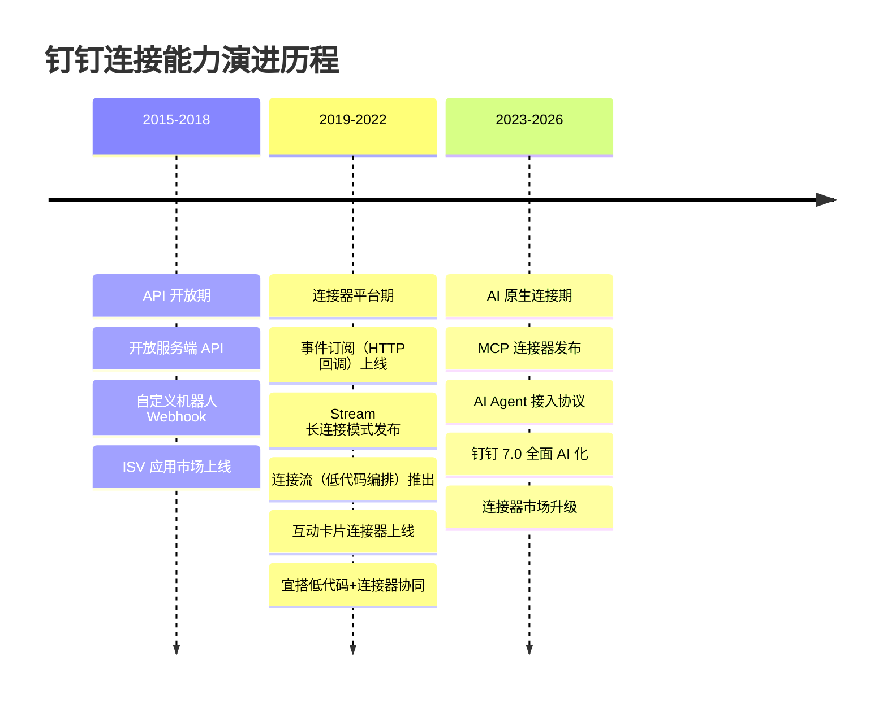

**关键战略节点**：

| 时间 | 事件 | 战略意义 |
|------|------|---------|
| 2015 | 钉钉开放平台上线 | 从封闭系统走向开放生态 |
| 2018 | ISV 应用市场成型 | 构建"钉钉+"生态，第三方应用爆发 |
| 2020 | Stream 模式发布 | 降低内网系统接入门槛，创新连接方式 |
| 2021 | 连接流低代码编排 | 从 API 开放升级为可视化集成能力 |
| 2023 | 互动卡片+酷应用 | 从工具连接升级为场景化连接 |
| 2024 | MCP 连接器发布 | 面向 AI Agent 时代的新型连接形态 |
| 2025 | 钉钉 7.0 AI 化 | AI 原生连接成为核心战略方向 |

### 1.3 内聚型连接架构：钉钉的核心特征

这是本次调研最核心的洞察。钉钉连接平台采用"内聚型"连接架构——连接能力内嵌于钉钉产品中，以钉钉自身为核心枢纽向外辐射，形成独特的连接模式。

**内聚型连接平台的核心特征**：
- 连接能力**内嵌于**钉钉产品中，是钉钉产品的一部分而非独立平台
- 钉钉自身能力（IM、审批、通讯录等）是连接器的一等公民，优先级高于外部系统
- 连接方向以**钉钉为中心**向外辐射，而非对等的双向连接
- 生态策略服务于钉钉产品战略，连接器是"增强钉钉粘性"的手段
- 用户价值 = 钉钉原生体验 + 外部系统扩展

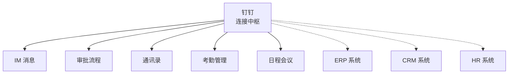

**内聚型架构的战略含义**：

| 战略维度 | 内聚型架构特点 | 对 open-app 的战略含义 |
|---------|------------|---------------------|
| **核心竞争力** | 自身能力深度+原生联动 | 不应追求连接器数量，应追求能力深度 |
| **用户选择逻辑** | "我已在用钉钉，顺便集成" | open-app 应让通讯能力成为集成刚需 |
| **护城河** | 用户迁移成本+数据沉淀 | open-app 护城河是通讯系统本身 |
| **盈利模式** | 产品增值+生态抽成 | open-app 应通过能力差异化收费 |
| **生态策略** | 中心化，以我为主 | open-app 需平衡开放与控制 |
| **集成体验** | 原生深度，统一体验 | open-app 原生联动体验是差异化 |

> **💡 对 open-app 的启示**：open-app 本质上也是内聚型连接平台——以通讯能力为核心枢纽，向外辐射连接。钉钉的内聚型模式具有高度参考价值，因为两者面临相同的战略选择：如何平衡"自身能力优先"与"开放生态建设"？如何让内聚型连接既有深度又有广度？

### 1.4 钉钉"开放生态、连接一切"的产品哲学

钉钉在连接器层面的产品哲学可以概括为三个层次：

| 层次 | 产品哲学 | 连接器体现 | 典型案例 |
|------|---------|----------|---------|
| **第一层：钉钉内部打通** | 一个钉钉解决所有问题 | 审批→消息→日程→考勤的内部流转 | 请假审批自动更新考勤+日历 |
| **第二层：钉钉+外部扩展** | 钉钉作为统一入口连接一切 | 开放 API+事件订阅+连接器市场 | ERP 审批推送到钉钉，钉钉审批回调 ERP |
| **第三层：AI 原生连接** | AI 自主发现和调用连接 | MCP 连接器+AI Agent | 自然语言触发审批创建、消息发送 |

钉钉连接平台在钉钉生态中的战略地位可以用"**三器一体**"概括：
- **粘合器**：通过连接器让钉钉与外部系统深度绑定，提高用户迁移成本
- **放大器**：通过连接器市场让 ISV 为钉钉生态贡献力量，扩大钉钉能力边界
- **锁存器**：通过审批流、消息触达等高频场景锁定企业日常运营在钉钉上

---

## 二、连接器能力矩阵

### 2.1 钉钉连接器能力全景

```mermaid
graph TB
    A[钉钉连接器能力] --> B[触发器能力<br/>事件订阅体系]
    A --> C[动作能力<br/>API 调用体系]
    A --> D[内部连接<br/>钉钉应用间流转]
    A --> E[外部连接<br/>预置+自定义集成]
    A --> F[低代码连接<br/>宜搭+连接流]

    B --> B1[通讯录变更事件]
    B --> B2[审批状态事件]
    B --> B3[消息收发事件]
    B --> B4[考勤打卡事件]
    B --> B5[日程变更事件]
    B --> B6[机器人交互事件]

    C --> C1[消息推送 API]
    C --> C2[审批操作 API]
    C --> C3[通讯录读写 API]
    C --> C4[考勤管理 API]
    C --> C5[日程会议 API]
    C --> C6[机器人消息 API]

    D --> D1[审批→消息通知]
    D --> D2[通讯录→群组自动维护]
    D --> D3[考勤→薪资计算]
    D --> D4[日程→会议自动创建]

    E --> E1[预置连接器<br/>50+ 外部应用]
    E --> E2[自定义连接器<br/>API 配置接入]
    E --> E3[Webhook 连接器<br/>事件推送接入]

    F --> F1[宜搭表单→审批]
    F --> F2[宜搭数据→消息]
    F --> F3[连接流可视化编排]
```

### 2.2 钉钉作为"触发器"的能力（事件订阅体系）

钉钉的事件订阅体系是连接器的"触发器"侧核心能力，支持 50+ 种事件类型：

| 事件域 | 典型事件 | 事件数量 | 推送模式 | 对比 open-app Event 模式 |
|-------|---------|---------|---------|----------------------|
| **通讯录事件** | 用户入职/离职/修改、部门变更 | 12+ | Stream + HTTP | 与 open-app Contact 事件对应 |
| **审批事件** | 审批开始/完成/取消、任务转交 | 8+ | Stream + HTTP | open-app 需建设审批事件 |
| **消息事件** | 消息已读/撤回、群消息变更 | 6+ | Stream + HTTP | 与 open-app IM 事件对应 |
| **考勤事件** | 打卡签到、排班变更 | 5+ | Stream + HTTP | open-app 暂无对应 |
| **日程事件** | 日程创建/更新/删除 | 4+ | Stream + HTTP | 与 open-app Calendar 事件对应 |
| **机器人事件** | 消息接收、按钮交互 | 4+ | Stream + HTTP | 与 open-app Bot 事件对应 |
| **OA 事件** | 工作台更新、应用上下线 | 3+ | Stream + HTTP | open-app 暂无对应 |

**Stream 模式 vs HTTP 回调模式**：

| 对比维度 | Stream 模式 | HTTP 回调模式 | 对 open-app 的设计建议 |
|---------|-----------|-------------|---------------------|
| **网络要求** | 无需公网 IP | 需公网可达 URL | open-app 应支持双模式 |
| **实时性** | 毫秒级（WebSocket） | 秒级（HTTP POST） | Stream 优先策略 |
| **开发门槛** | 低（SDK 封装） | 中（需处理回调逻辑） | 提供 SDK 简化接入 |
| **可靠性** | 自动重连+心跳 | 重试机制+ACK | 均需保障最终一致 |
| **适用场景** | 内网系统、快速开发 | 公网服务、负载均衡 | 不同场景不同模式 |
| **语言依赖** | 需 SDK 支持 | 任何语言均可 | HTTP 回调更通用 |
| **扩展性** | 受 SDK 限制 | 负载均衡友好 | HTTP 更适合高并发 |

**钉钉事件订阅架构对 open-app 的设计参考**：

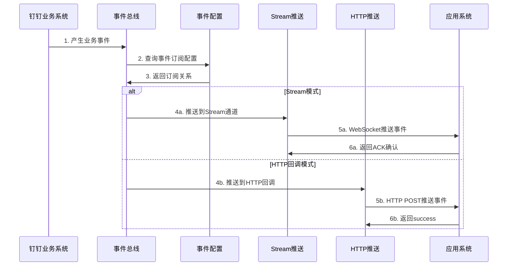

### 2.3 钉钉作为"动作"的能力（API 调用体系）

钉钉提供 500+ 服务端 API，是连接器"动作"侧的核心能力：

| API 域 | 接口数量 | 典型动作 | 对应 open-app 能力 | 成熟度 |
|--------|---------|---------|------------------|--------|
| **消息通知** | 30+ | 工作通知、群消息、机器人消息 | IM → API 模式 | 高，消息类型丰富 |
| **通讯录管理** | 60+ | 用户 CRUD、部门管理、角色管理 | Contact → API 模式 | 高 |
| **审批流程** | 40+ | 创建审批、审批操作、流程定义 | 需建设 | 高，审批 API 体系成熟 |
| **考勤管理** | 25+ | 打卡记录、考勤统计、排班管理 | 暂无对应 | 高 |
| **日程会议** | 20+ | 日程管理、会议创建、会议室 | Meeting/Calendar → API 模式 | 中高 |
| **智能人事** | 35+ | 花名册、薪酬、绩效 | 暂无对应 | 高 |
| **文档知识** | 15+ | 文档创建、知识库管理 | CloudBox/Drive → API 模式 | 中 |

**钉钉 API 体系的关键设计特点**：

| 设计特点 | 描述 | 对 open-app 的参考 |
|---------|------|------------------|
| **新旧版本并存** | 旧版 oapi 和新版 api 共存，迁移周期长 | open-app 应从第一天统一 API 版本规范 |
| **AccessToken 统一** | 所有 API 共享同一套 AccessToken 机制 | open-app Consumer 共享认证体系 |
| **分场景消息 API** | 工作通知/群消息/机器人消息分场景设计 | 不同通讯场景提供不同 API |
| **权限 Scope 机制** | API 访问受 Scope 权限控制 | open-app 应建立细粒度 Scope |
| **限流分级** | 不同 API 不同限流策略（100-500 QPS） | open-app 应按能力域分级限流 |

### 2.4 钉钉内部应用间的连接能力

钉钉内部应用间连接是内聚型平台的核心优势——原生体验的内部流转是内聚型架构的标志性能力：

| 内部连接链路 | 触发条件 | 自动化动作 | 用户体验 |
|------------|---------|----------|---------|
| 审批→消息 | 审批状态变更 | 自动推送工作通知给相关人员 | 移动端即时收到审批通知 |
| 审批→考勤 | 请假审批通过 | 自动更新考勤状态 | 无需手动销假 |
| 审批→日程 | 出差审批通过 | 自动创建出差日程 | 日历自动排期 |
| 通讯录→群组 | 新员工入职 | 自动加入部门群、项目群 | 零配置入群 |
| 通讯录→权限 | 角色变更 | 自动调整应用可见性和权限 | 权限即时生效 |
| 日程→会议 | 日程包含会议 | 自动创建视频会议 | 会议链接自动生成 |
| 宜搭→审批 | 宜搭表单提交 | 自动触发审批流程 | 低代码+审批一体化 |
| 宜搭→消息 | 宜搭数据变更 | 自动推送数据变更通知 | 数据变动即时触达 |

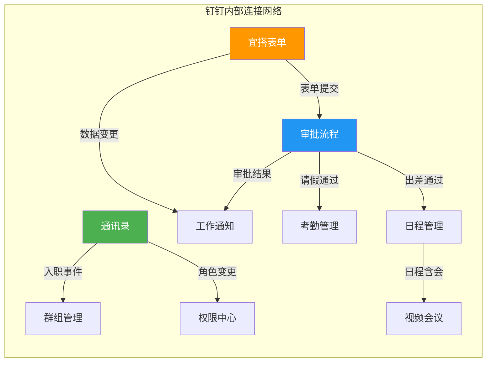

**内部连接的技术特点**：

| 特点 | 说明 | 对 open-app 的启示 |
|------|------|------------------|
| **零配置** | 内部应用间连接无需 API 调用，配置即生效 | open-app 各子系统间应支持原生联动 |
| **实时性** | 内部事件推送延迟极低（< 100ms） | 内部流转走事件总线，不经外部 API |
| **一致性** | 数据一致性由平台保障，无分布式问题 | Provider 间联动由平台层保障 |
| **统一体验** | 用户感知不到"跨系统"操作 | Consumer 感知统一的通讯能力 |

**open-app 9 大能力原生联动设计参考**：

| 联动链路 | 触发 Provider | 动作 Provider | 联动效果 | 优先级 |
|---------|-------------|-------------|---------|-------|
| IM→Meeting | 收到会议邀请消息 | 自动创建会议预约 | 消息中一键入会 | P0 |
| Meeting→Calendar | 会议预约确认 | 自动创建日历事件 | 日历自动排期 | P0 |
| Contact→IM | 人员入职/离职 | 自动加入/退出群组 | 组织变更即时生效 | P0 |
| IM→Phone | 紧急消息未读 | 自动触发电话呼叫 | 确保关键信息触达 | P1 |
| Calendar→IM | 会议即将开始 | 自动推送会议提醒 | 减少会议迟到 | P1 |
| Contact→Status | 人员状态变更 | 自动更新在线状态 | 状态同步准确 | P1 |
| Phone→IM | 未接来电 | 自动推送未接提醒 | 来电不遗漏 | P1 |
| Meeting→IM | 会议录制完成 | 自动推送录制文件链接 | 会议资产可追溯 | P2 |
| Mail→IM | 重要邮件到达 | 自动推送邮件摘要 | 邮件即时知晓 | P2 |
| Drive→IM | 文件被共享 | 自动推送共享通知 | 协作不遗漏 | P2 |

### 2.5 钉钉与外部应用的连接能力

#### 2.5.1 预置连接器

钉钉连接器平台提供 50+ 预置外部连接器，覆盖主流企业应用：

| 连接器类别 | 代表应用 | 触发器 | 动作 | 深度 |
|-----------|---------|--------|------|------|
| **ERP/财务** | 金蝶云星空、用友 U8 | 订单创建、凭证生成 | 创建订单、同步物料 | 中等 |
| **CRM** | 纷享销客、销售易 | 线索创建、客户变更 | 创建客户、同步商机 | 中等 |
| **OA** | 泛微、致远 | 流程回调、表单提交 | 提交流程、创建表单 | 中等 |
| **HR** | 北森、薪人薪事 | 入职/离职事件 | 查询员工、同步组织 | 中等 |
| **项目管理** | Teambition、禅道 | 任务变更、迭代更新 | 创建任务、更新状态 | 浅层 |
| **客服** | 智齿科技、网易七鱼 | 工单创建 | 发送消息、创建工单 | 浅层 |
| **电子签** | e 签宝、法大大 | 签署完成 | 发起签署 | 浅层 |
| **营销** | 有赞、微盟 | 订单创建 | 查询订单 | 浅层 |

**钉钉预置连接器的特点**：

| 特点 | 描述 |
|------|------|
| **深度策略** | 钉钉侧集成深度高，外部侧以浅层读写为主 |
| **质量保障** | 官方维护，质量稳定 |
| **更新频率** | 季度更新 |
| **设计理念** | 增强钉钉生态粘性，而非追求连接器数量 |
| **适用范围** | 钉钉生态内企业用户 |

#### 2.5.2 自定义连接器

钉钉支持通过 API 配置方式创建自定义连接器，接入任意系统：

| 配置能力 | 支持情况 | 说明 |
|---------|---------|------|
| **API 端点配置** | ✅ | RESTful API 的 URL、Method、Headers |
| **认证配置** | ✅ | API Key、OAuth2、Basic Auth |
| **触发器定义** | ✅ | Webhook 事件接收 |
| **动作定义** | ✅ | API 调用封装 |
| **字段映射** | ✅ | 输入/输出字段映射 |
| **数据转换** | ⚠️ | 有限的内置转换函数 |
| **测试验证** | ✅ | 在线测试工具 |

### 2.6 钉钉连接器能力与 open-app 四种开放模式的映射

这是本报告最重要的映射分析——钉钉的连接器能力如何对应 open-app 的 API/Event/WebHook/Bot 四种开放模式：

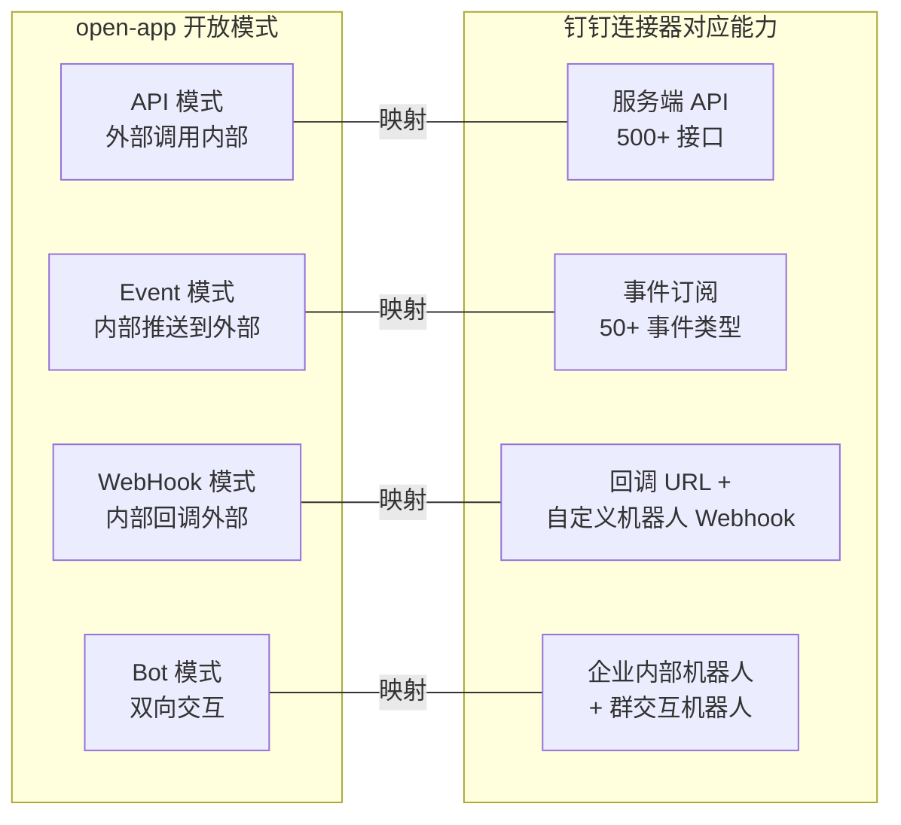

**详细映射分析**：

| open-app 开放模式 | open-app 场景 | 钉钉对应能力 | 钉钉实现方式 | 对 open-app 的设计参考 |
|-----------------|-------------|------------|------------|-------------------|
| **API** | Consumer 调用 IM 发送消息 | 消息 API | 工作通知/群消息/机器人消息 API | 分场景提供不同消息 API |
| **API** | Consumer 调用 Calendar 创建日程 | 日程 API | 日程创建/更新/删除 API | 标准 CRUD API 设计 |
| **API** | Consumer 调用 Meeting 创建会议 | 会议 API | 会议创建/管理 API | 会议号+链接双模式 |
| **Event** | IM 消息接收事件推送给 Consumer | 消息事件订阅 | Stream/HTTP 推送 | 双模式事件推送 |
| **Event** | Contact 通讯录变更推送给 Consumer | 通讯录事件订阅 | Stream/HTTP 推送 | 增量+全量补偿 |
| **Event** | Calendar 日程变更推送给 Consumer | 日程事件订阅 | Stream/HTTP 推送 | 事件过滤+去重 |
| **WebHook** | 审批完成回调 Consumer 系统 | 审批回调 URL | HTTP 回调 | 回调签名验证+重试 |
| **WebHook** | 系统告警推送到群 | 自定义机器人 Webhook | Webhook URL + 加签 | 安全机制参考钉钉三选一 |
| **Bot** | 群内机器人接收指令并回复 | 企业内部机器人 | 消息接收+回复 API | 交互式卡片增强体验 |
| **Bot** | AI 助手理解自然语言执行操作 | MCP 连接器 | 工具发现+参数映射 | 前瞻布局 AI 原生 |

### 2.7 钉钉宜搭低代码平台与连接器的协同

宜搭是钉钉的低代码应用构建平台，与连接器形成了"低代码+连接器"的协同模式：

| 协同模式 | 描述 | 典型场景 | 对 open-app 的启示 |
|---------|------|---------|------------------|
| **宜搭→审批** | 宜搭表单自动触发审批 | 请假/报销/采购申请 | 低代码表单+审批流一体化 |
| **宜搭→消息** | 宜搭数据变更自动通知 | 库存预警→群消息通知 | 数据驱动+消息触达联动 |
| **宜搭→外部 API** | 宜搭通过连接器调用外部系统 | 表单数据同步到 ERP | 连接器作为低代码的"动作扩展" |
| **审批→宜搭** | 审批结果写入宜搭数据表 | 采购审批通过→更新库存表 | 流程结果数据化 |

> **💡 对 open-app 的启示**：钉钉的连接器能力矩阵展示了内聚型平台的核心优势——内部连接具备原生深度，外部连接通过预置+自定义双轨覆盖。open-app 应借鉴这一模式：**内部通讯能力间实现零配置原生联动（IM↔Meeting↔Calendar↔Contact），外部连接通过 API/Event/WebHook/Bot 四种模式标准化开放**。同时，低代码+连接器协同是降低 Consumer 接入门槛的关键路径。

---

## 三、自动化工作流引擎

### 3.1 钉钉自动化工作流的能力架构

钉钉的自动化工作流由两大引擎组成：**连接流**（轻量级可视化编排）和**审批流**（企业级流程引擎），两者互补形成完整的工作流能力栈：

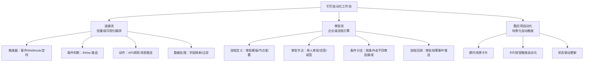

**连接流与审批流定位对比**：

| 对比维度 | 连接流 | 审批流 | 协同模式 |
|---------|--------|--------|---------|
| **核心定位** | 系统间自动化流转 | 人工决策流程 | 连接流负责自动化，审批流负责人工确认 |
| **流程类型** | 事件驱动型 | 人工审批型 | 事件触发→人工确认→自动化执行 |
| **执行方式** | 自动执行 | 人工操作 | 先自动后人工或先人工后自动 |
| **适用场景** | 数据同步、消息推送、状态更新 | 请假审批、采购审批、合同审批 | 审批结果驱动后续自动化 |
| **用户角色** | 管理员配置 | 管理员配置+员工参与 | 管理员配置，员工执行人工节点 |
| **复杂度** | 简单（线性+条件） | 复杂（多级、会签、加签） | 协同后可处理复杂业务场景 |

### 3.2 触发器类型和条件配置

#### 3.2.1 连接流触发器

| 触发器类型 | 描述 | 典型事件 | 配置方式 | 能力特点 |
|-----------|------|---------|---------|---------|
| **钉钉事件触发** | 钉钉内部事件驱动 | 审批状态变更、通讯录变更 | 选择事件类型+过滤条件 | 与钉钉原生能力深度绑定 |
| **Webhook 触发** | 接收外部 HTTP 请求 | 外部系统回调、IoT 上报 | 生成 Webhook URL | 支持外部系统灵活接入 |
| **定时触发** | 按时间计划执行 | 每日数据同步、定时报告 | Cron 表达式配置 | 覆盖定时巡检场景 |
| **机器人触发** | 群内交互触发 | 按钮点击、指令输入 | 配置交互卡片 | 内聚型平台独有能力 |
| **宜搭触发** | 宜搭表单事件 | 表单提交、数据变更 | 选择宜搭应用+事件 | 低代码场景深度整合 |

#### 3.2.2 条件配置

| 条件类型 | 描述 | 示例 | 能力特点 |
|---------|------|------|---------|
| **字段条件** | 基于数据字段值判断 | 金额 > 5000 走高级审批 | 基础能力 |
| **角色条件** | 基于用户角色判断 | 部门经理免审批 | 依赖通讯录体系的独有能力 |
| **时间条件** | 基于时间判断 | 工作时间走自动审批 | 基础能力 |
| **多条件组合** | AND/OR 组合条件 | 金额 > 5000 AND 部门=技术部 | 支持简单组合 |
| **审批条件** | 基于审批结果判断 | 审批通过走A流程，驳回走B | 与审批流深度整合的独有能力 |

### 3.3 动作类型和流程编排

| 动作类型 | 描述 | 钉钉支持 | 能力特点 |
|---------|------|---------|---------|
| **发送消息** | 工作通知/群消息/机器人消息 | ✅ 深度支持 | 原生消息能力，多种触达方式 |
| **创建审批** | 发起钉钉审批实例 | ✅ 原生支持 | 审批流无缝衔接 |
| **操作通讯录** | 创建/更新用户和部门 | ✅ 原生支持 | 组织架构实时同步 |
| **调用外部 API** | HTTP 请求到外部系统 | ✅ 支持 | 标准化外部集成 |
| **更新互动卡片** | 更新消息卡片内容和状态 | ✅ 原生支持 | 消息从通知升级为操作界面 |
| **操作宜搭数据** | 创建/更新/查询宜搭表单数据 | ✅ 原生支持 | 低代码数据联动 |
| **循环处理** | 对数组数据逐条操作 | ⚠️ 有限 | 不支持复杂循环和嵌套 |
| **并行执行** | 多个动作同时执行 | ⚠️ 有限 | 不支持多动作并行 |
| **错误处理** | 失败重试和异常路由 | ⚠️ 基础 | 仅支持基础重试 |
| **子流程调用** | 复用已定义的流程 | ⚠️ 有限 | 不支持流程嵌套和复用 |

**钉钉流程编排能力总览**：

| 编排能力 | 支持程度 | 说明 |
|---------|---------|------|
| 线性编排 | ⭐⭐⭐⭐ | 满足基础线性场景 |
| 条件分支 | ⭐⭐⭐ | 仅支持简单分支 |
| 循环迭代 | ⭐⭐ | 循环能力有限 |
| 并行执行 | ⭐⭐ | 并行有限 |
| 错误处理 | ⭐⭐ | 基础重试 |
| 人工节点 | ⭐⭐⭐⭐⭐ | 审批流独有优势 |

### 3.4 审批流+自动化流的协同

审批流是钉钉最具特色的工作流能力，与自动化流形成"人机协同"模式：

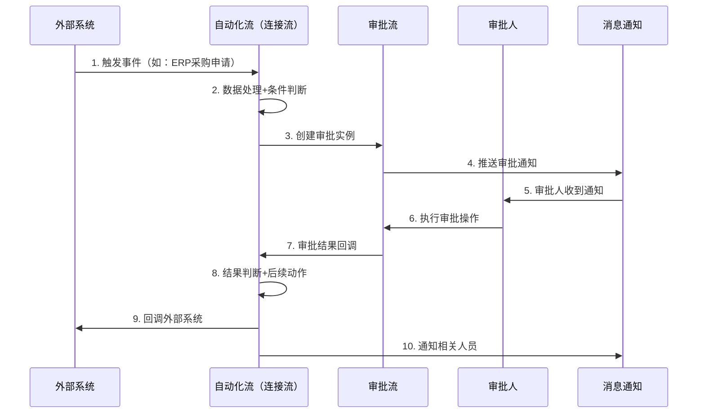

**审批流+自动化流协同的核心价值**：

| 协同模式 | 描述 | 钉钉实现 | 对 open-app 的启示 |
|---------|------|---------|------------------|
| **自动化触发审批** | 外部事件自动发起审批 | 连接流→审批 API | Event→审批 API 联动 |
| **审批结果驱动自动化** | 审批完成后自动执行后续操作 | 审批事件→连接流 | 审批 Event→自动化 |
| **审批中通知增强** | 审批过程中发送提醒、催办 | 审批+工作通知联动 | 审批+IM 消息联动 |
| **审批超时自动化** | 审批超时自动升级或通知 | 定时器+审批查询 | 定时触发+状态检查 |

**open-app 场景下的"人机协同"设计**：

| 协同场景 | 自动化部分 | 人工确认部分 | 自动化后续 |
|---------|----------|------------|----------|
| 会议预约 | Calendar 检查空闲+创建日程 | 参会人确认参会 | Meeting 自动创建会议+IM 推送链接 |
| 紧急通知 | IM 发送紧急消息 | 确认已读 | 未读超时→Phone 自动呼叫 |
| 来电处理 | Phone 收到来电 | 接听或转接 | 未接听→IM 推送未接提醒+语音信箱 |
| 文件审批 | Drive 文件共享申请 | 管理者审批 | 审批通过→CloudBox 自动授权 |

### 3.5 连接流的能力边界与局限

钉钉连接流作为轻量级可视化编排工具，有其明确的能力边界：

| 能力维度 | 连接流支持程度 | 说明 |
|---------|-------------|------|
| **线性编排** | ✅ 完整支持 | 满足基础线性场景 |
| **条件分支** | ⚠️ 简单分支 | 仅支持简单 if/else 分支 |
| **循环迭代** | ⚠️ 有限 | 不支持复杂循环和嵌套迭代 |
| **并行执行** | ⚠️ 有限 | 不支持多动作并行执行 |
| **错误处理** | ⚠️ 基础 | 仅支持基础重试，无断点续传 |
| **子流程调用** | ⚠️ 有限 | 不支持流程嵌套和复用 |
| **审批集成** | ✅ 原生深度 | 审批流与连接流无缝协同 |
| **人机协同** | ✅ 原生支持 | 审批+自动化混合编排 |
| **最大步骤数** | 约 10 步 | 适合简单场景 |
| **调试能力** | ⚠️ 基础 | 缺乏逐步调试和历史回放 |

**连接流适用场景**：
- 事件驱动的简单自动化（如：审批完成→发消息通知）
- 数据同步（如：外部系统→钉钉消息推送）
- 场景化自动触发（如：群内按钮→创建审批）

**连接流不适用场景**：
- 复杂业务逻辑（需循环、嵌套、多级条件）
- 大批量数据处理
- 需要断点续传和事务保障的场景
- 复杂的错误恢复流程

### 3.6 自动化的边界和限制

| 限制类别 | 具体限制 | 影响 | 规避方案 |
|---------|---------|------|---------|
| **编排复杂度** | 不支持复杂循环、嵌套子流程 | 无法处理复杂业务逻辑 | 拆分为多个简单流或用代码实现 |
| **实时双向同步** | 不支持真正的双向数据同步 | 数据一致性需额外保障 | 事件+定时补偿双保险 |
| **批量处理** | 不支持大批量数据并行处理 | 数据同步效率低 | 外部批处理+结果通知 |
| **错误恢复** | 缺乏断点续传和事务回滚 | 失败后难以从中间恢复 | 幂等设计+全量重试 |
| **流程监控** | 缺乏实时运行监控和告警 | 运维不透明 | 自建监控+日志分析 |
| **版本管理** | 流程变更无版本对比 | 回滚困难 | 变更前备份配置 |

> **💡 对 open-app 的启示**：钉钉的审批流+自动化流协同模式值得 open-app 深度借鉴。open-app 的 9 大能力中，Meeting 预约→Calendar 日程→IM 通知、审批→IM 消息→Phone 呼叫等人机协同场景天然存在。open-app 应设计"**自动化流 + 人工确认流**"的混合编排能力，让 Consumer 可以编排包含"等待人工确认"节点的自动化流程——这是内聚型平台相比纯自动化流程的差异化能力。

---

## 四、开发者体验与 SDK

### 4.1 钉钉集成开发的工具链

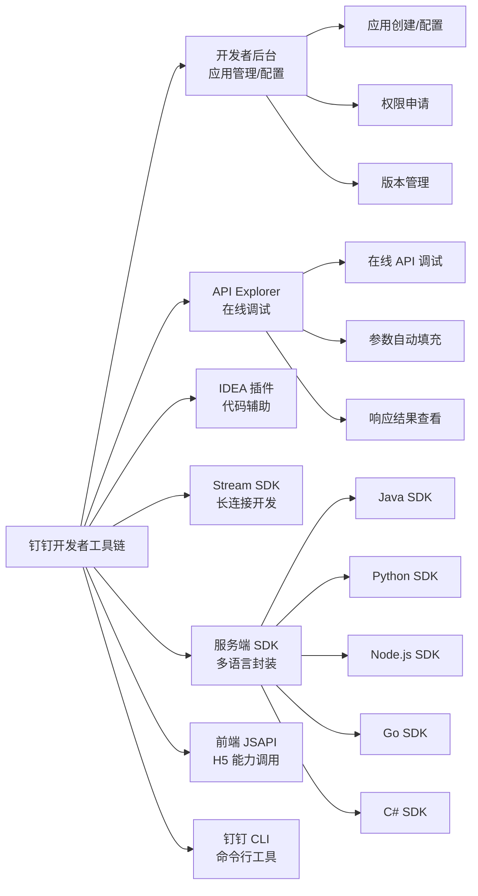

### 4.2 SDK 覆盖

| 语言 | SDK 类型 | 维护方 | 功能完整度 | Stream 支持 | 文档质量 |
|------|---------|--------|----------|-----------|---------|
| **Java** | 官方 SDK | 钉钉官方 | ⭐⭐⭐⭐⭐ | ✅ | ⭐⭐⭐⭐ |
| **Python** | 官方 SDK | 钉钉官方 | ⭐⭐⭐⭐ | ✅ | ⭐⭐⭐ |
| **Node.js** | 官方 SDK | 钉钉官方 | ⭐⭐⭐⭐ | ✅ | ⭐⭐⭐ |
| **Go** | 社区 SDK | 社区 | ⭐⭐⭐ | ⚠️ | ⭐⭐ |
| **C#** | 社区 SDK | 社区 | ⭐⭐ | ❌ | ⭐⭐ |

**钉钉开发体验特点**：

| 特点 | 描述 |
|------|------|
| **开发方式** | 代码为主+可视化辅助，面向开发者 |
| **接入门槛** | 需理解 OAuth2.0 + API 体系，有一定学习曲线 |
| **调试能力** | API Explorer + Stream 调试，开发者友好 |
| **文档质量** | 参差不齐，新旧版本共存 |
| **SDK 支持** | 5 种语言官方/社区 SDK，覆盖主流开发语言 |
| **学习曲线** | 中等，需理解钉钉概念体系 |
| **适合团队** | 有开发能力的 IT 团队 |

### 4.3 服务端 API 和前端 JSAPI

钉钉提供两套 API 体系，覆盖服务端和客户端场景：

| API 类型 | 运行环境 | 典型用途 | 认证方式 | 对应 open-app |
|---------|---------|---------|---------|-------------|
| **服务端 API** | 服务器端调用 | 数据读写、消息推送、流程操作 | AppKey/AppSecret → AccessToken | open-app API 模式 |
| **前端 JSAPI** | H5/小程序端调用 | 免登、扫一扫、选人、定位 | 免登授权码 | open-app 需建设 |

**前端 JSAPI 能力清单**：

| JSAPI | 描述 | 使用频率 | 对 open-app 的参考 |
|-------|------|---------|------------------|
| **dd.ready** | JSAPI 初始化 | 极高 | 需提供前端 SDK 初始化 |
| **dd.runtime.permission.requestAuthCode** | 获取免登授权码 | 极高 | 核心能力，必须支持 |
| **dd.biz.contact.choose** | 选人组件 | 高 | 通讯录选人 UI 组件 |
| **dd.biz.chat.pickConversation** | 选会话组件 | 高 | IM 选会话 UI 组件 |
| **dd.device.geolocation.get** | 获取地理位置 | 中 | 按需支持 |
| **dd.biz.util.scan** | 扫一扫 | 中 | 按需支持 |
| **dd.biz.ding.post** | 发送 Ding 消息 | 中 | Phone 能力对应 |

### 4.4 调试和测试能力

| 调试工具 | 能力 | 易用性 | 能力特点 |
|---------|------|-------|---------|
| **API Explorer** | 在线 API 调试，参数自动填充 | ⭐⭐⭐⭐ | 原生在线调试，开发者友好 |
| **事件订阅调试** | 测试事件推送是否正常 | ⭐⭐⭐ | 验证事件链路完整性 |
| **Stream 调试** | 本地直接接收事件测试 | ⭐⭐⭐⭐ | 内网开发场景利器 |
| **沙箱环境** | 测试企业环境验证 | ⭐⭐⭐ | 隔离测试环境 |
| **日志查看** | 查看 API 调用日志和事件推送日志 | ⭐⭐⭐ | 运维排障基础工具 |

**open-app 开发者工具链建设优先级**：

| 工具 | 优先级 | 钉钉参考 | 开发工作量 | 对 Consumer 的价值 |
|------|-------|---------|----------|-----------------|
| **开发者门户** | P0 | 钉钉开发者后台 | 2-3 人月 | Consumer 注册和配置入口 |
| **API Explorer** | P0 | 钉钉 API Explorer | 1-2 人月 | API 快速验证和调试 |
| **Java SDK** | P0 | 钉钉 Java SDK | 2-3 人月 | 企业级开发首选 |
| **Python SDK** | P0 | 钉钉 Python SDK | 1-2 人月 | 脚本和快速开发 |
| **Node.js SDK** | P1 | 钉钉 Node.js SDK | 1-2 人月 | Web 应用开发 |
| **Stream SDK** | P1 | 钉钉 Stream SDK | 2-3 人月 | Event 接入简化 |
| **前端组件库** | P1 | 钉钉 JSAPI | 3-4 人月 | 前端集成体验 |
| **沙箱环境** | P2 | 钉钉沙箱 | 3-4 人月 | 开发测试隔离 |

> **💡 对 open-app 的启示**：钉钉的开发者体验策略是"**双轨制**"——对开发者提供完整 SDK+API Explorer+Stream 调试，对业务人员提供连接流可视化编排。open-app 应借鉴这一策略：**API/Event 模式面向开发者提供专业 SDK 和调试工具，连接器/工作流模式面向业务人员提供可视化编排**。同时，前端 JSAPI 是钉钉的差异化优势，open-app 应考虑提供类似的前端组件库（选人、选会话、免登等），降低 Consumer 前端接入成本。

---

## 五、生态策略

### 5.1 钉钉应用市场中的集成类应用

钉钉应用市场已有 3000+ 应用，其中集成类应用是重要品类：

| 集成类应用类别 | 代表应用 | 功能 | ISV 类型 | 安装量级 |
|-------------|---------|------|---------|---------|
| **ERP 集成** | 金蝶云星空集成、用友 U8 集成 | ERP 数据同步、审批对接 | ERP 厂商 | 万级 |
| **CRM 集成** | 纷享销客集成、销售易集成 | 客户数据同步、消息通知 | CRM 厂商 | 万级 |
| **HR 集成** | 北森集成、薪人薪事集成 | 人事数据同步、考勤对接 | HR 厂商 | 千级 |
| **OA 集成** | 泛微集成、致远集成 | 流程对接、消息推送 | OA 厂商 | 千级 |
| **数据集成** | 第三方集成平台 | 通用 iPaaS 连接 | iPaaS 厂商 | 千级 |
| **电子签** | e 签宝、法大大 | 合同签署+审批联动 | 电子签厂商 | 万级 |
| **客服集成** | 智齿科技、网易七鱼 | 工单创建+消息通知 | 客服厂商 | 千级 |

### 5.2 ISV 合作模式和分成机制

| 合作模式 | 描述 | 分成机制 | ISV 价值 |
|---------|------|---------|---------|
| **上架应用市场** | ISV 开发应用上架钉钉市场 | 钉钉抽取 10-30% 佣金 | 获得钉钉流量分发 |
| **定制开发** | ISV 为企业客户定制集成 | 按项目收费 | 获得项目收入 |
| **连接器贡献** | ISV 向连接器平台贡献连接器 | 免费+流量激励 | 扩大 ISV 产品触达 |
| **生态服务商** | 成为钉钉认证服务商 | 服务费+返佣 | 获得认证背书 |

**钉钉 ISV 生态的关键数据**：

| 指标 | 数据 | 说明 |
|------|------|------|
| **ISV 数量** | 1000+ | 覆盖主流企业应用品类 |
| **应用数量** | 3000+ | 分类体系完善 |
| **企业安装量** | 平均每企业 5-10 个 | 集成类应用安装率最高 |
| **ISV 收入分成** | 10-30% 佣金 | SaaS 类应用佣金较高 |
| **审核周期** | 3-7 个工作日 | 安全审核+功能审核 |

### 5.3 钉钉原生应用 vs 第三方集成的差异

| 对比维度 | 钉钉原生应用 | 第三方集成 | 影响 |
|---------|------------|----------|------|
| **用户体验** | 深度集成，统一体验 | 跳转体验，风格可能不一致 | 原生应用体验优势明显 |
| **数据访问** | 直接访问底层能力 | 通过 API 访问，受权限约束 | 原生应用能力更强 |
| **审批集成** | 原生审批流，无需额外配置 | 需通过审批 API 对接 | 原生审批体验更好 |
| **消息触达** | 原生工作通知，无限制 | 受 API 调用频率限制 | 原生消息触达更可靠 |
| **部署方式** | 内置免安装 | 需安装+授权+配置 | 原生应用零部署成本 |
| **定价** | 包含在钉钉专业版中 | 独立定价，可能额外收费 | 原生应用成本优势 |

**对 open-app Consumer 体系的参考**：

| 钉钉经验 | open-app 对应 | 设计建议 |
|---------|-------------|---------|
| 原生应用体验优势明显 | open-app 核心通讯能力应如原生般流畅 | Provider 能力开放应保持原生体验 |
| 第三方集成受 API 频率限制 | Consumer 应有合理的 API 调用限制 | 分级限流策略，付费 Consumer 更高限额 |
| 安装+授权+配置增加门槛 | Consumer 注册和授权应极简 | 一键注册+自动授权+默认配置 |
| 独立定价增加成本 | open-app 基础能力应免费或低成本 | 基础能力免费，高级能力按量 |

### 5.4 钉钉"连接一切"生态策略分析

钉钉的生态策略可以用"**三个引力圈**"模型分析：

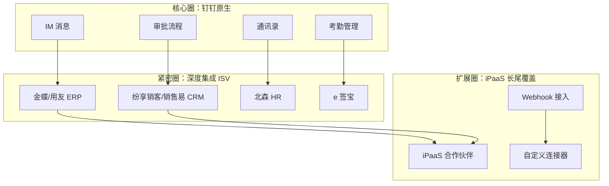

| 引力圈 | 策略 | 连接器角色 | 对 open-app 的启示 |
|-------|------|----------|------------------|
| **核心圈** | 原生能力最大化，用户无需离开钉钉 | 钉钉自身就是最大的连接器 | open-app 9 大能力应做深原生联动 |
| **紧密圈** | 与头部 ISV 深度合作，联合解决方案 | ISV 应用是钉钉的"扩展连接器" | 与头部 Consumer 深度合作 |
| **扩展圈** | 通过 iPaaS 伙伴覆盖长尾场景 | iPaaS 是钉钉的"连接器放大器" | 借助 iPaaS 扩展外部覆盖 |

### 5.5 阿里云生态协同

| 协同维度 | 具体表现 | 对钉钉连接器的影响 |
|---------|---------|-----------------|
| **计算基础设施** | 钉钉运行在阿里云之上 | 天然支持阿里云服务连接器（OSS、RDS、FC 等） |
| **身份认证** | 阿里云 RAM + 钉钉组织架构 | 统一身份体系，降低认证复杂度 |
| **AI 能力** | 通义大模型 + 钉钉 AI | MCP 连接器对接阿里云 AI 服务 |
| **数据中台** | DataWorks + 钉钉数据 | 钉钉数据可流入阿里云数据中台 |
| **安全合规** | 阿里云安全体系 + 钉钉 | 共享等保三级等合规认证 |
| **生态分发** | 阿里云市场 + 钉钉市场 | 双市场联动，扩大 ISV 分发渠道 |

**阿里云生态协同的双面性**：

| 正面影响 | 负面影响 |
|---------|---------|
| 阿里云用户无缝使用钉钉连接器 | 非阿里云用户有迁移顾虑 |
| 统一身份和安全体系 | 云锁定风险 |
| AI 能力无缝对接 | 依赖阿里云 AI 生态 |
| 双市场分发扩大 ISV 渠道 | 渠道佣金叠加 |

> **💡 对 open-app 的启示**：钉钉的生态策略核心是"**以原生能力为引力中心，通过 ISV 深度合作覆盖紧密场景，通过 iPaaS 伙伴覆盖长尾场景**"。open-app 应建立类似的三层生态模型：核心层是 9 大通讯能力的原生联动，紧密层是与头部 Consumer（如 OA、CRM、HR 系统）的深度对接，扩展层是通过 iPaaS 伙伴覆盖长尾。此外，钉钉原生应用与第三方集成的体验差异提醒我们：**open-app 的原生能力必须在体验上形成明显优势，否则 Consumer 更倾向于通过第三方集成平台接入而非直接接入**。阿里云生态的"双面性"也提醒 open-app 应保持云中立，不绑定特定云厂商。

---

## 六、与 open-app 的对比和启示

### 6.1 钉钉连接架构 vs open-app 开放架构对比

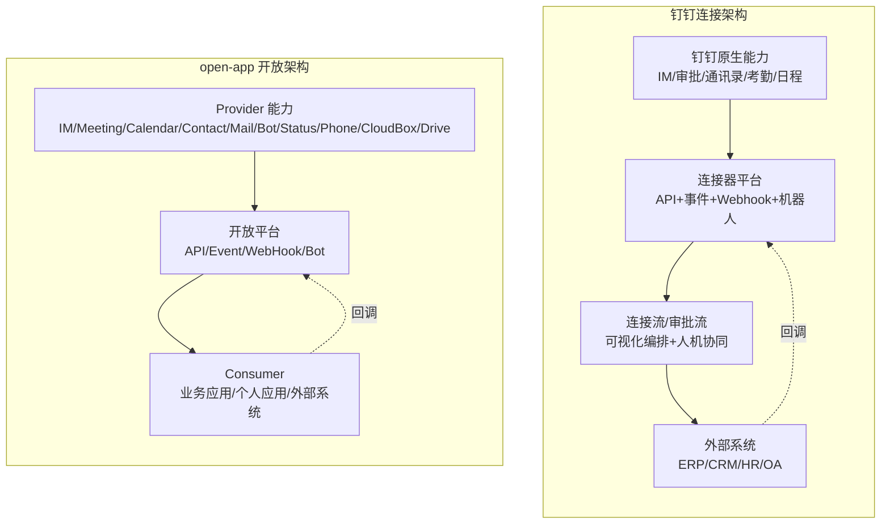

**架构对比详析**：

| 对比维度 | 钉钉连接架构 | open-app 开放架构 | 核心差异 |
|---------|------------|----------------|---------|
| **能力来源** | 钉钉自建+ISV 扩展 | Provider 提供（通讯子系统） | open-app 更纯粹（通讯聚焦） |
| **连接方向** | 以钉钉为中心向外辐射 | Provider→平台→Consumer 单向为主 | 钉钉双向更强，open-app 单向更清晰 |
| **开放模式** | API+事件+Webhook+机器人+MCP | API+Event+WebHook+Bot | 模式对应，钉钉多了 MCP |
| **编排能力** | 连接流+审批流+酷应用 | 暂无原生编排 | 钉钉有编排层，open-app 无 |
| **生态市场** | 3000+ 应用市场 | 暂无 Consumer 市场 | 钉钉生态成熟，open-app 需建设 |
| **开发者体验** | SDK+IDEA+API Explorer | 需建设 | open-app 需补齐工具链 |
| **内部联动** | 审批↔消息↔考勤↔日程 | IM↔Meeting↔Calendar 需建设 | open-app 内部联动需加强 |

### 6.1.1 钉钉连接模式 vs open-app 连接模式详细对比

**连接方向对比**：

| 连接特征 | 钉钉模式 | open-app 模式 | 设计建议 |
|---------|---------|-------------|---------|
| **主连接方向** | 钉钉→外部（推送为主） | Provider→Consumer（能力开放为主） | open-app 以能力开放为核心 |
| **回连方式** | 外部→钉钉（回调） | Consumer→平台（API 调用+回调） | 双向但以开放为主 |
| **连接粒度** | 应用级别（整个钉钉应用） | Consumer 级别（每个注册应用） | 更细粒度的权限控制 |
| **连接发现** | 钉钉应用市场 | 开发者门户（需建设） | 建设开发者门户 |
| **连接治理** | 钉钉审核+企业管理员 | 权限中心（需建设） | 建设审核+授权机制 |

**开放模式成熟度对比**：

| 开放模式 | 钉钉成熟度 | open-app 当前状态 | 差距 | 建设路径 |
|---------|----------|----------------|------|---------|
| **API 模式** | ⭐⭐⭐⭐⭐（500+ API） | ⭐⭐（基础框架） | 大 | 优先建设 9 大能力核心 API |
| **Event 模式** | ⭐⭐⭐⭐⭐（50+ 事件+Stream） | ⭐⭐（基础框架） | 大 | 优先建设 Stream+HTTP 双模式 |
| **WebHook 模式** | ⭐⭐⭐⭐（回调+机器人 Webhook） | ⭐⭐（基础框架） | 中 | 建设安全机制+重试 |
| **Bot 模式** | ⭐⭐⭐⭐（机器人+MCP） | ⭐（规划中） | 很大 | 前瞻布局 MCP |

### 6.2 钉钉连接策略对 open-app 的核心启示

#### 启示一：内聚型平台的核心竞争力是"原生联动深度"

钉钉最大的连接器优势不是外部连接器数量，而是内部能力间的原生联动——审批通过自动更新考勤、新员工入职自动入群、出差审批自动建日程。这种**零配置、零延迟、零代码**的内部联动是内聚型平台的标志性能力。

**open-app 行动建议**：
- IM 收到会议邀请 → Calendar 自动创建日程 → Meeting 自动预约
- Contact 人员离职 → IM 自动退出群组 → Status 自动更新状态
- Phone 未接来电 → IM 自动推送未接提醒 → Calendar 自动标记回电时间

#### 启示二：四种开放模式需要"统一身份"串联

钉钉的 API/事件/Webhook/机器人看似独立，但通过"应用"这个统一身份串联——一个钉钉应用可以同时使用所有开放模式，共享同一个 AccessToken、同一套权限 Scope。这让 Consumer 的接入体验是一体的，而非割裂的。

**open-app 行动建议**：
- 确保 API/Event/WebHook/Bot 四种模式共享统一的应用身份
- Consumer 一次注册即可使用所有开放模式
- 统一的权限 Scope 体系，一个 Scope 可跨模式使用

#### 启示三：Stream 模式是降低接入门槛的关键创新

钉钉的 Stream 模式（WebSocket 长连接接收事件）是一个关键创新——它让内网系统无需公网 IP 即可接收钉钉事件推送，极大降低了接入门槛。对于 open-app 的目标用户（可能有大量内网系统），这种模式至关重要。

**open-app 行动建议**：
- Event 模式必须支持 Stream（长连接）+ HTTP 回调双模式
- 优先推荐 Stream 模式，降低 Consumer 接入成本
- 提供 Stream SDK，封装连接管理、心跳、重连等细节

#### 启示四：连接器需要"可编排"才有实用价值

钉钉的连接器不是孤立的 API 调用，而是可以通过"连接流"进行可视化编排。单个连接器的能力是有限的，但编排后的连接器组合可以实现复杂业务场景。

**open-app 行动建议**：
- 建设"场景编排"能力，让 Consumer 可以将 API/Event/WebHook/Bot 组合使用
- 提供预置场景模板（如"会议预约→日历创建→IM 通知"一键编排）
- 支持条件判断和分支路由，适应不同业务场景

#### 启示五：安全机制需要"分级可选"而非"一刀切"

钉钉 Webhook 提供三种安全模式（加签/关键词/IP 白名单），让用户根据安全要求灵活选择。这种"分级可选"的设计比"一刀切"更实用。

**open-app 行动建议**：
- WebHook 安全机制提供多级选项
- 基础安全（签名验证）默认启用，高级安全（IP 白名单、加密）可选启用
- 不同安全等级对应不同的 Scope 和审批流程

### 6.3 open-app 可以借鉴的设计模式

| 设计模式 | 钉钉实践 | open-app 借鉴方案 | 优先级 |
|---------|---------|------------------|-------|
| **统一应用模型** | 一个钉钉应用=API+事件+机器人+卡片 | Consumer 注册后自动获得四种模式接入能力 | P0 |
| **Stream 长连接** | WebSocket 接收事件，无需公网 IP | Event 模式支持 Stream+HTTP 双通道 | P0 |
| **场景化卡片** | 互动卡片=消息+交互+数据更新 | IM 消息支持交互式卡片，卡片触发 Bot 动作 | P1 |
| **审批+自动化协同** | 人工审批+自动化的混合编排 | Meeting/Calendar 预约+人工确认+自动通知 | P1 |
| **低代码+连接器协同** | 宜搭表单→审批→消息一站式 | 低代码表单→API 调用→Event 推送 | P2 |
| **MCP AI 原生** | AI Agent 通过 MCP 调用钉钉能力 | Bot 模式支持 MCP 协议，AI 自主发现和调用 | P2 |
| **连接器市场** | ISV 贡献连接器，平台审核发布 | Consumer/ISV 贡献集成方案，平台分发 | P3 |

### 6.4 open-app 的差异化机会

虽然钉钉连接平台在企业管理场景有深厚积累，但 open-app 存在明确的差异化机会：

| 差异化维度 | 钉钉的局限 | open-app 的机会 | 具体策略 |
|-----------|----------|----------------|---------|
| **通讯专业性** | 钉钉 IM 是协同工具，非专业通讯 | open-app 源自专业通讯系统，IM/Phone/Meeting 能力更深 | 强调通讯可靠性、音视频质量、电话集成 |
| **中立性** | 钉钉以自身为中心，偏管理视角 | open-app 以能力开放为核心，中立赋能 | 对 Consumer 不偏不倚，支持灵活的编排方向 |
| **安全合规** | 钉钉数据在阿里云，政企敏感 | open-app 可私有化部署，数据自主可控 | 主打私有化+信创+数据不出域 |
| **Phone 能力** | 钉钉电话能力有限 | open-app 有完整电话系统支撑 | Phone+IM+Meeting 三位一体通讯 |
| **开放深度** | 钉钉 API 有诸多限制（频率、数据范围） | open-app 可提供更深度的能力开放 | 更高的 API 限流、更完整的数据访问 |
| **AI 原生** | 钉钉 MCP 刚起步 | open-app 可从架构层面 AI-Native | 从第一天就支持 AI Agent 接入 |

### 6.5 集成策略建议

基于钉钉连接策略的深度分析，对 open-app 的集成策略建议如下：

**短期（0-6 个月）**：

| 行动 | 描述 | 钉钉参考 | 价值 |
|------|------|---------|------|
| 统一应用模型 | Consumer 注册即获得四种模式能力 | 钉钉统一应用身份 | 降低接入成本 |
| 内部联动优先 | IM↔Meeting↔Calendar 原生联动 | 钉钉审批↔考勤↔消息 | 体验差异化 |
| Stream 模式 | Event 支持 WebSocket 长连接 | 钉钉 Stream 模式 | 降低内网接入门槛 |
| SDK 先行 | Java/Python/Node.js 三语言 SDK | 钉钉多语言 SDK | 开发者体验基础 |

**中期（6-12 个月）**：

| 行动 | 描述 | 钉钉参考 | 价值 |
|------|------|---------|------|
| 场景编排 | 可视化 API+Event 组合编排 | 钉钉连接流 | 降低业务人员使用门槛 |
| 交互式卡片 | IM 消息支持交互操作 | 钉钉互动卡片 | 消息从通知升级为操作 |
| 前端组件库 | 选人、选会话、免登组件 | 钉钉 JSAPI | 降低前端接入成本 |
| iPaaS 对接 | 对接 iPaaS 合作伙伴 | 钉钉是 iPaaS 的连接器源 | 快速扩展外部覆盖 |

**长期（12-24 个月）**：

| 行动 | 描述 | 钉钉参考 | 价值 |
|------|------|---------|------|
| MCP 协议 | Bot 支持 MCP，AI Agent 接入 | 钉钉 MCP 连接器 | AI 原生连接 |
| Consumer 市场 | 集成方案/模板分发市场 | 钉钉应用市场 | 生态运营 |
| 低代码协同 | 低代码表单+连接器+自动化 | 宜搭+连接流 | 零代码接入 |
| 开放治理 | 连接器生命周期管理 | 钉钉缺乏此能力（open-app 可超越） | 企业级治理 |

> **💡 对 open-app 的启示**：这是本报告最核心的章节。钉钉连接策略对 open-app 有五大核心启示：（1）**内聚型平台的核心竞争力是原生联动深度，不是连接器数量**；（2）**四种开放模式需要统一身份串联**；（3）**Stream 长连接模式是降低接入门槛的关键创新**；（4）**连接器需要可编排才有实用价值**；（5）**open-app 在通讯专业性、中立性、安全性上有明确差异化机会**。这些启示是 open-app 连接器策略的设计输入。

---

## 七、安全合规

### 7.1 钉钉连接平台的安全机制

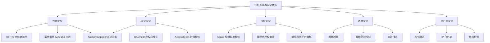

### 7.2 数据流转安全

| 安全环节 | 钉钉实现 | 安全等级 | 对 open-app 的参考 |
|---------|---------|---------|------------------|
| **传输加密** | HTTPS + TLS 1.2+ | 高 | 必须 |
| **事件加密** | AES-256 加密事件内容 | 高 | 推荐 |
| **Webhook 签名** | HmacSHA256 + 时间戳 | 中高 | 推荐（三选一：加签/关键词/IP白名单） |
| **Token 管理** | 2 小时过期，自动刷新 | 中高 | 推荐（缩短为 1.5 小时更安全） |
| **数据脱敏** | 手机号、身份证等自动脱敏 | 中 | 推荐 |
| **日志脱敏** | API 日志中敏感字段脱敏 | 中 | 推荐 |

**钉钉 Webhook 三种安全模式详解**：

| 安全模式 | 实现方式 | 安全等级 | 适用场景 | 对 open-app 的建议 |
|---------|---------|---------|---------|------------------|
| **加签模式** | HmacSHA256(timestamp + "\n" + secret) | 高 | 生产环境 | 默认推荐 |
| **关键词模式** | 消息包含指定关键词才接受 | 低 | 测试环境 | 可选 |
| **IP 白名单模式** | 仅允许指定 IP 调用 | 高 | 高安全要求 | 可选 |

### 7.3 权限模型

| 权限层级 | 申请方式 | 审批流程 | 典型权限 | 对 open-app 的参考 |
|---------|---------|---------|---------|------------------|
| **基础权限** | 开发者后台自助 | 无需审批 | 通讯录读取、消息发送 | open-app 基础 API 权限 |
| **高级权限** | 管理员授权 | 企业管理员审批 | 审批读写、考勤管理 | open-app 高级功能权限 |
| **敏感权限** | 平台审核 | 平台+管理员双重审批 | 敏感字段、消息记录 | open-app 敏感数据权限 |
| **特殊权限** | 定制申请 | 商务+技术评估 | 全量导出、管理员操作 | open-app 特殊操作权限 |

### 7.4 企业数据隔离

| 隔离维度 | 钉钉实现 | 说明 | 对 open-app 的参考 |
|---------|---------|------|------------------|
| **租户隔离** | corpId 级别数据隔离 | 不同企业数据完全隔离 | 必须 |
| **应用隔离** | appId 级别权限隔离 | 不同应用只能访问授权范围数据 | 必须 |
| **用户隔离** | userId 级别数据过滤 | API 返回数据基于用户权限过滤 | 推荐 |
| **网络隔离** | 支持 IP 白名单 | 限制 API 调用来源 | 推荐 |

> **💡 对 open-app 的启示**：钉钉的安全体系较为完善，open-app 可直接参考其四级权限模型和三层安全机制（传输安全+认证授权+数据隔离）。特别值得注意的是，钉钉 Webhook 的三种安全模式（加签/关键词/IP白名单）是一种实用的"安全分级"设计——open-app 的 WebHook 模式应提供类似的安全选项，让 Consumer 根据自身安全要求灵活选择。

---

## 八、局限性分析

### 8.1 钉钉连接平台的核心限制

| 限制类别 | 具体限制 | 影响程度 | 规避方案 | open-app 的超越机会 |
|---------|---------|---------|---------|-------------------|
| **API 版本碎片** | 新旧 API 共存，v1/v2/新版本不统一 | 高 | 统一使用新版本 API | open-app 应从第一天建立 API 版本规范 |
| **连接器数量有限** | 预置连接器仅 50+ | 中 | 通过 iPaaS 中转 | open-app 可通过 iPaaS 伙伴扩展 |
| **编排能力弱** | 连接流不支持复杂逻辑（循环、嵌套、并行） | 高 | 复杂场景用代码实现 | open-app 应建设更强的编排能力 |
| **双向同步不足** | 不支持真正的双向实时数据同步 | 中 | 事件+定时补偿 | open-app 可建设 CDC 能力 |
| **数据管道缺失** | 无原生数据管道，大数据量处理弱 | 中 | 外部 ETL 工具 | open-app 可建设轻量数据管道 |
| **连接器治理弱** | 缺乏连接器生命周期管理和监控 | 中 | 自建运维工具 | open-app 应建设连接器治理能力 |
| **跨云集成弱** | 与非阿里云生态集成体验差 | 低 | 通用 API 对接 | open-app 保持云中立 |

### 8.2 编排与集成能力局限

| 能力维度 | 钉钉当前状态 | 局限说明 |
|---------|------------|---------|
| **连接器数量** | 50+ 预置连接器 | 数量有限，长尾应用覆盖不足 |
| **编排复杂度** | 简单（连接流+审批流） | 不支持复杂循环、嵌套子流程 |
| **数据转换** | 基础 | 缺乏丰富的数据转换组件 |
| **错误处理** | 基础重试 | 缺乏异常策略、断点续传和事务回滚 |
| **监控运维** | 有限 | 缺乏运行监控和告警机制 |
| **开发者工具** | 有 SDK，缺乏 CLI | 命令行工具缺失 |
| **审批集成** | 原生深度 | 独有优势，无局限 |
| **内部联动** | 原生零配置 | 独有优势，无局限 |

### 8.3 生态依赖风险

| 风险类型 | 描述 | 影响 | 对 open-app 的警示 |
|---------|------|------|-------------------|
| **钉钉平台绑定** | 连接器强依赖钉钉平台，迁移成本高 | 一旦选择钉钉生态，难以迁移到其他平台 | open-app 应保持中立，不绑定特定云 |
| **阿里云依赖** | 深度依赖阿里云基础设施 | 非阿里云用户有顾虑 | open-app 应支持多云/私有化 |
| **ISV 生态风险** | ISV 应用质量和更新节奏不可控 | 集成质量参差不齐 | open-app 应建立 Consumer 准入标准 |
| **API 稳定性** | 钉钉 API 有时突然变更或下线 | Consumer 应用可能受影响 | open-app 应建立 API 废弃公告机制 |
| **数据主权** | 企业数据存储在钉钉/阿里云上 | 对数据敏感企业有顾虑 | open-app 应支持数据驻留选项 |

> **💡 对 open-app 的启示**：钉钉连接平台的局限性恰好是 open-app 的机会点。特别是 API 版本碎片、编排能力弱、连接器治理缺失这三个核心限制，open-app 可以从架构层面避免——**从第一天就建立 API 版本规范，建设可视化编排能力，构建连接器生命周期管理**。此外，钉钉的阿里云绑定和生态封闭性是 open-app "中立开放"定位的最佳对标——open-app 应始终坚持云中立和 Consumer 友好。

---

## 九、总结与建议

### 9.1 核心发现

| 发现编号 | 核心发现 | 详细说明 | 对 open-app 的影响 |
|---------|---------|---------|------------------|
| **F1** | 钉钉是内聚型连接平台 | 以自身为中心辐射连接，而非中立管道 | open-app 同为内聚型，应借鉴其架构设计 |
| **F2** | 内聚型平台的核心竞争力是原生联动深度 | 审批→消息→考勤零配置联动是标志性能力 | open-app 9 大能力原生联动是核心差异化 |
| **F3** | 四种开放模式需要统一身份串联 | 钉钉应用的 API+事件+机器人共享身份 | open-app Consumer 注册即获四种模式能力 |
| **F4** | Stream 长连接是降低接入门槛的关键创新 | 内网系统无需公网 IP 即可接入 | open-app Event 必须支持 Stream 模式 |
| **F5** | 审批流+自动化流协同是人机协同的典范 | 人工审批与自动化操作的无缝衔接 | open-app 的 Meeting/Calendar 场景可借鉴 |
| **F6** | 连接器数量不是内聚型平台的核心指标 | 钉钉 50+ 连接器即可提供优质体验 | open-app 不应追求连接器数量，应追求深度 |
| **F7** | 低代码+连接器协同降低接入门槛 | 宜搭表单→审批→消息一站式 | open-app 应建设低代码+连接器协同 |
| **F8** | 钉钉 API 版本碎片和编排弱是核心短板 | 新旧 API 共存，连接流无法处理复杂逻辑 | open-app 应从架构层面避免这两个问题 |
| **F9** | MCP 连接器代表 AI 原生连接方向 | AI Agent 通过标准化协议调用平台能力 | open-app Bot 模式应前瞻布局 MCP |
| **F10** | 生态三层模型：核心圈+紧密圈+扩展圈 | 原生能力→头部 ISV→iPaaS 长尾 | open-app 应建立类似生态三层模型 |

### 9.2 对 open-app 的战略建议

**建议一：定位为"通讯能力原生联动 + 标准化开放"的内聚型平台**

open-app 不应模仿通用 iPaaS 追求连接器数量，而应聚焦通讯能力的原生联动深度。IM→Meeting→Calendar→Contact 的零配置联动是差异化能力。

**建议二：四种开放模式统一身份，一次注册全模式可用**

Consumer 注册后自动获得 API/Event/WebHook/Bot 四种模式的接入能力，共享身份认证和权限体系。这是钉钉做得好的设计，open-app 必须做到。

**建议三：Event 模式必须支持 Stream 长连接**

对于 open-app 的目标用户（可能有大量内网部署场景），Stream 模式是接入的关键基础设施。open-app 应提供 Java/Python/Node.js 三语言的 Stream SDK。

**建议四：建设轻量级场景编排能力**

不需要建设通用 iPaaS 级别的可视化编排引擎，但应提供"场景模板+简单编排"能力，让 Consumer 可以将 API+Event+Bot 组合使用，覆盖 80% 的常见场景。

**建议五：通过 iPaaS 伙伴扩展外部连接广度**

open-app 不自建连接器市场（避免与通用 iPaaS 竞争），而是作为 iPaaS 合作伙伴的"优质连接器源"，通过 iPaaS 伙伴覆盖长尾外部系统。

### 9.3 行动建议

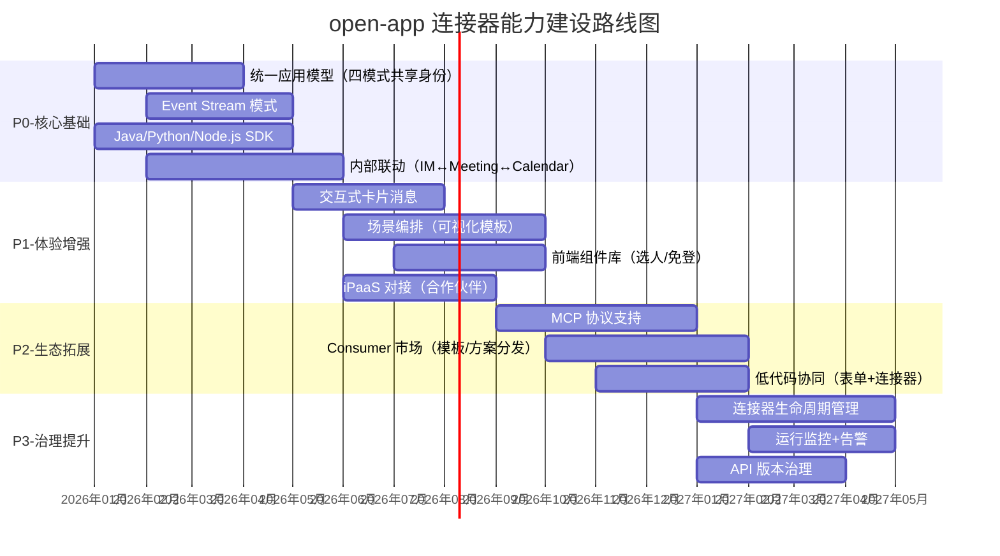

**优先级排序原则**：

| 优先级 | 判断标准 | 示例 |
|-------|---------|------|
| **P0** | 不做就无法正常使用 | 统一应用模型、Stream 模式、SDK、内部联动 |
| **P1** | 做了体验明显提升 | 交互式卡片、场景编排、前端组件、iPaaS 对接 |
| **P2** | 做了生态扩大 | MCP、Consumer 市场、低代码协同 |
| **P3** | 做了企业级可用 | 治理、监控、版本管理 |

---

## 附录

### 附录 A：钉钉连接器 vs open-app 开放模式完整映射表

| 钉钉能力 | 钉钉实现方式 | open-app 对应模式 | open-app 对应能力 | 映射评估 |
|---------|------------|-----------------|-----------------|---------|
| 工作通知 API | 服务端 API 调用 | API | IM → send_message | ✅ 直接映射 |
| 群消息 API | 服务端 API 调用 | API | IM → send_group_message | ✅ 直接映射 |
| 通讯录读写 API | 服务端 API 调用 | API | Contact → user CRUD | ✅ 直接映射 |
| 审批创建 API | 服务端 API 调用 | API | 暂无（需建设） | ⚠️ 需补充 |
| 会议创建 API | 服务端 API 调用 | API | Meeting → create | ✅ 直接映射 |
| 日程管理 API | 服务端 API 调用 | API | Calendar → event CRUD | ✅ 直接映射 |
| 通讯录变更事件 | Stream/HTTP 推送 | Event | Contact → user_change | ✅ 直接映射 |
| 审批状态变更事件 | Stream/HTTP 推送 | Event | 暂无（需建设） | ⚠️ 需补充 |
| 消息已读事件 | Stream/HTTP 推送 | Event | IM → message_read | ✅ 直接映射 |
| 日程变更事件 | Stream/HTTP 推送 | Event | Calendar → event_change | ✅ 直接映射 |
| 自定义机器人 Webhook | Webhook URL 推送 | WebHook | IM → incoming_webhook | ✅ 直接映射 |
| 审批回调 URL | HTTP 回调 | WebHook | 暂无（需建设） | ⚠️ 需补充 |
| 群内交互机器人 | 消息接收+回复 | Bot | Bot → interactive_bot | ✅ 直接映射 |
| 企业内部机器人 | 消息接收+API 回复 | Bot | Bot → enterprise_bot | ✅ 直接映射 |
| MCP 连接器 | AI Agent 工具调用 | Bot（扩展） | 暂无（前瞻） | 🎯 规划中 |
| 互动卡片 | 消息+交互+更新 | API+Bot | IM → card_message | ⚠️ 需增强 |

### 附录 B：术语说明

| 术语 | 英文 | 说明 |
|------|------|------|
| **内聚型平台** | Cohesive Platform | 以自身产品为核心向外辐射连接能力的平台模式 |
| **中立型平台** | Neutral Platform | 不偏袒任何一方，提供平等连接管道的平台模式 |
| **连接流** | Connection Flow | 钉钉的可视化流程编排能力 |
| **审批流** | Approval Flow | 钉钉的企业级审批流程引擎 |
| **酷应用** | Cool App | 钉钉场景化轻应用形态 |
| **互动卡片** | Interactive Card | 支持交互操作的消息卡片 |
| **Stream 模式** | Stream Mode | 基于 WebSocket 长连接的事件推送模式 |
| **MCP** | Model Context Protocol | AI Agent 工具调用协议 |
| **ISV** | Independent Software Vendor | 独立软件开发商 |
| **宜搭** | YiDa | 钉钉低代码应用构建平台 |
| **Scope** | Permission Scope | OAuth 权限范围 |
| **CDC** | Change Data Capture | 变更数据捕获 |
| **三器一体** | Three-in-One | 粘合器+放大器+锁存器的生态定位模型 |

### 附录 C：调研参考来源

| 来源类型 | 名称 | 说明 |
|---------|------|------|
| **官方文档** | 钉钉开放平台 open.dingtalk.com | API 文档、SDK 文档、Stream 文档 |
| **官方文档** | 钉钉连接器平台文档 | 连接流、自定义连接器文档 |
| **官方文档** | 钉钉 MCP 服务文档 | AI Agent 接入协议 |
| **竞品分析** | 本项目 connector-platform-research 目录 | 已有钉钉连接器平台调研报告 |
| **行业报告** | 本项目 software-connector-platform-research 目录 | 通用 iPaaS 平台调研报告 |
| **行业报告** | 本项目 open-platform-research 目录 | 钉钉/飞书开放平台调研报告 |
| **业务架构** | 本项目业务架构文档 | open-app Provider→平台→Consumer 三方模型 |

---

**报告编制时间**：2026年5月
**报告版本**：V1.0
**报告角度**：同赛道产品连接器能力分析——从内聚型平台视角为 open-app 提供战略参考
