# 集简云连接器平台调研报告

## 一、平台概述

### 1.1 平台简介

集简云（Jijianyun）是国内领先的 iPaaS（集成平台即服务）和无代码集成平台，总部位于北京，成立于 2020 年左右。作为国产 iPaaS 赛道的头部企业之一，集简云致力于让企业无需编写代码即可将多个软件系统连接起来，实现数据同步和业务流程自动化。截至目前，集简云已支持 400+ 应用连接，涵盖国内主流 SaaS 应用（企业微信、钉钉、飞书、金蝶、用友、纷享销客、销售易等）以及国际主流应用（Salesforce、HubSpot、Google 等），同时支持数据库与中间件的直连集成。

集简云的核心产品理念是"连接一切，自动化一切"，通过可视化流程编排降低企业系统集成门槛，使得业务人员而非开发人员也能构建跨系统自动化流程。平台累计服务超过 20000+ 企业客户，覆盖制造、零售、金融、教育、医疗等多个行业，已成为国内企业系统集成和业务自动化的重要基础设施之一。

### 1.2 平台定位

- **国产 iPaaS 平台**：面向中国企业的集成平台即服务，深耕国内 SaaS 生态，弥补 Zapier 等海外平台在国内应用覆盖不足的短板
- **无代码集成平台**：以可视化拖拽方式替代传统 API 编码对接，业务人员可独立完成 80% 以上的集成场景
- **企业自动化引擎**：以"数据流程 + 业务流程"双引擎驱动，实现从数据同步到审批自动化的全流程覆盖
- **SaaS 连接器市场**：作为国内 SaaS 生态的"连接中枢"，提供 400+ 预置连接器，覆盖 CRM、ERP、OA、HR、财务、营销等核心业务领域
- **开发者友好平台**：同时提供自定义连接器开发能力，支持通过 API 配置方式接入任意系统

### 1.3 核心价值主张

| 价值维度 | 描述 |
|---------|------|
| **效率提升** | 自动化跨系统数据流转和业务流程，减少 80% 以上的人工重复操作，从小时级处理提升到秒级响应 |
| **成本降低** | 无需专业开发人员编写集成代码，单个集成场景实施成本从传统方式的数万元降至数千元 |
| **数据互通** | 打通信息孤岛，实现 CRM、ERP、OA、通讯等系统间的数据实时同步，消除数据不一致问题 |
| **业务自动化** | 将人工审批、通知推送、数据录入等重复性流程自动化，让员工聚焦高价值工作 |
| **快速交付** | 分钟级完成集成配置，无需传统开发部署周期，从需求到上线可缩短至 1-3 天 |
| **国产化适配** | 深度适配国内 SaaS 生态（企业微信、钉钉、飞书、金蝶、用友等），中文界面和本地化服务支持 |
| **安全合规** | 数据传输加密、私有化部署选项、操作审计日志，符合国内数据安全和隐私保护法规要求 |

---

## 二、核心能力体系

### 2.1 连接器能力矩阵

集简云的每个连接器由三种核心能力类型组成，与 open-app 的开放模式形成天然映射关系：

| 能力类型 | 描述 | 典型示例 | 对应 open-app 开放模式 |
|---------|------|---------|---------------------|
| **触发器（Trigger）** | 当某事件发生时触发流程，是数据流程的起点 | 新消息到达、新订单创建、通讯录变更、审批状态更新 | 对应 Event（内部→外部）模式 |
| **动作（Action）** | 在流程中执行的具体操作，是流程的执行步骤 | 发送消息、创建联系人、更新数据、调用 API | 对应 API（外部→内部）模式 |
| **查询（Search）** | 在应用中查找特定数据，可配合动作使用 | 查询用户、查询订单、查询联系人 | 对应 API 查询接口 |

#### 2.1.1 国内 SaaS 连接器

集简云最核心的差异化优势在于对国内 SaaS 应用的深度覆盖，这是 Zapier、Make 等海外平台难以企及的：

| 应用类别 | 支持的应用 | 核心能力 |
|---------|-----------|---------|
| **企业通讯** | 企业微信、钉钉、飞书 | 消息发送/接收、通讯录同步、审批流程、群管理、机器人 |
| **CRM** | 纷享销客、销售易、红圈营销、励销云 | 线索管理、客户同步、商机更新、合同状态变更 |
| **ERP/财务** | 金蝶云星空、金蝶精斗云、用友 U8、用友 NC、畅捷通 | 凭证创建、科目同步、采购订单、销售出库、库存变动 |
| **OA/协同** | 泛微 OA、致远 OA、蓝凌 OA、禅道 | 审批流程、文档管理、项目任务、工单状态 |
| **HR/人事** | 北森、薪人薪事、2 号人事、盖雅工场 | 员工入职/离职、考勤同步、薪资变动、组织架构变更 |
| **营销** | 有赞、微盟、小鹅通、兔展 | 订单同步、会员变动、课程购买、表单提交 |
| **客服** | 智齿科技、网易七鱼、容联七陌 | 工单创建、客户消息、满意度评价 |
| **项目管理** | 禅道、Teambition、Tower、PingCode | 任务创建/更新、项目状态变更、迭代管理 |
| **表单/数据** | 金数据、麦客、简道云、明道云 | 表单提交、数据更新、记录查询 |
| **电子签** | e 签宝、法大大、上上签 | 合同签署完成、签署状态变更 |

**以钉钉连接器为例**：

| 能力类型 | 具体能力 | 描述 |
|---------|---------|------|
| 触发器 | 审批状态变更 | 当钉钉审批单状态发生变化时触发 |
| 触发器 | 新消息到达 | 当指定会话收到新消息时触发 |
| 触发器 | 通讯录变更 | 当企业通讯录发生人员变动时触发 |
| 动作 | 发送工作通知 | 向指定用户发送工作通知消息 |
| 动作 | 创建审批 | 在钉钉中创建审批实例 |
| 动作 | 查询用户信息 | 查询指定用户的详细信息 |
| 动作 | 发送群消息 | 向指定群发送消息 |
| 查询 | 查询审批详情 | 查询指定审批单的详细信息 |
| 查询 | 查询部门列表 | 查询指定部门下的子部门列表 |

**以金蝶云星空连接器为例**：

| 能力类型 | 具体能力 | 描述 |
|---------|---------|------|
| 触发器 | 新增销售订单 | 当金蝶中新增销售订单时触发 |
| 触发器 | 采购订单审核 | 当采购订单审核状态变更时触发 |
| 动作 | 创建客户 | 在金蝶中创建新的客户档案 |
| 动作 | 创建销售订单 | 在金蝶中创建销售订单 |
| 动作 | 查询库存 | 查询指定物料的库存信息 |
| 查询 | 查询客户信息 | 查询指定客户的详细信息 |
| 查询 | 查询科目余额 | 查询指定会计科目的余额 |

#### 2.1.2 国际 SaaS 连接器

| 应用类别 | 支持的应用 | 核心能力 |
|---------|-----------|---------|
| **CRM** | Salesforce、HubSpot、Pipedrive、Zoho CRM | 线索/客户/商机同步、任务创建、邮件触发 |
| **营销** | Mailchimp、ActiveCampaign、SendGrid | 邮件发送、列表管理、营销活动触发 |
| **协作** | Slack、Microsoft Teams、Notion、Trello | 消息发送、频道管理、页面/卡片创建 |
| **开发** | GitHub、GitLab、Jira、Linear | Issue 创建/更新、PR 通知、部署触发 |
| **Google 生态** | Google Sheets、Google Calendar、Gmail、Google Drive | 表格读写、日程管理、邮件收发、文件管理 |
| **微软生态** | Office 365、SharePoint、OneDrive、Outlook | 邮件收发、文件管理、日历同步 |

#### 2.1.3 数据库与中间件连接器

| 连接器类型 | 支持的系统 | 核心能力 |
|-----------|-----------|---------|
| **关系型数据库** | MySQL、PostgreSQL、SQL Server、Oracle | 数据查询、数据插入、数据更新、表结构同步 |
| **NoSQL 数据库** | MongoDB、Redis | 文档读写、缓存操作 |
| **消息队列** | RabbitMQ、Kafka、RocketMQ | 消息发送、消息消费、Topic 管理 |
| **数据仓库** | ClickHouse、Greenplum | 大数据查询、数据写入 |
| **对象存储** | 阿里云 OSS、腾讯云 COS、AWS S3 | 文件上传/下载、事件触发 |
| **邮件** | SMTP/IMAP、腾讯企业邮、阿里企业邮 | 邮件发送、邮件接收触发 |

#### 2.1.4 自定义 API 连接器

当预置连接器无法满足需求时，集简云支持通过自定义 API 方式接入任意系统：

**自定义连接器配置能力**：

| 配置项 | 描述 |
|--------|------|
| **API 端点配置** | 支持配置 RESTful API 的 URL、Method、Headers、Body |
| **认证配置** | 支持 API Key、OAuth2、Basic Auth、自定义 Token 等多种认证方式 |
| **数据格式** | 支持 JSON、XML、Form-Data 等请求和响应格式 |
| **字段映射** | 自定义输入/输出字段映射，支持嵌套对象和数组 |
| **分页处理** | 支持配置分页参数，自动获取全量数据 |
| **错误处理** | 支持配置错误码映射和重试策略 |
| **测试验证** | 提供在线测试工具，即时验证 API 连通性 |

### 2.2 开发模式

#### 2.2.1 可视化流程构建

集简云的核心开发模式是可视化流程构建，以"数据流程"为核心概念，采用"触发→动作"的配置范式：

**流程构建核心概念**：

```
+---------------------------------------------------------------+
|                      数据流程（Flow）                            |
|                                                               |
|  +----------+    +----------+    +----------+    +----------+  |
|  | 触发器    |--->| 数据处理  |--->| 条件判断  |--->| 动作      |  |
|  | (Trigger) |    | (Filter) |    | (Router) |    | (Action)  |  |
|  +----------+    +----------+    +----------+    +----------+  |
|                                                       |       |
|                                              +--------+-----+ |
|                                              |   分支路径    | |
|                                              +---+------+--+ |
|                                          +-------+   +-------+|
|                                     +----+----+    +----+----+|
|                                     | 动作 A   |    | 动作 B   ||
|                                     +---------+    +---------+||
+---------------------------------------------------------------+
```

**流程构建步骤**：

1. **选择触发器**：从 400+ 应用中选择触发事件，或使用 Webhook/定时触发
2. **配置数据处理**：设置字段映射、数据过滤、数据转换规则
3. **添加条件分支**：根据条件走不同执行路径
4. **选择执行动作**：配置目标应用的动作和参数
5. **测试运行**：实时测试每个步骤的执行结果
6. **发布启用**：流程上线后自动运行，支持暂停/编辑

**数据流程示例 — 新客户自动通知**：

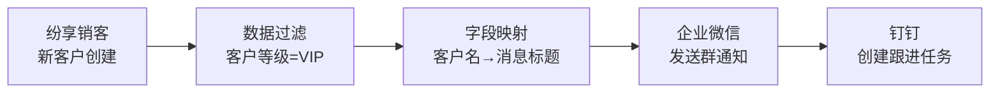

#### 2.2.2 业务流程自动化

集简云的"业务流程"是数据流程的增强版，支持更复杂的业务场景：

| 流程类型 | 描述 | 典型场景 |
|---------|------|---------|
| **审批流** | 多级审批、条件审批、会签/或签 | 采购审批、报销审批、合同审批 |
| **通知流** | 多渠道消息推送、条件通知、定时提醒 | 订单通知、异常告警、会议提醒 |
| **数据同步流** | 双向/单向数据同步、增量同步、全量同步 | CRM↔ERP 客户同步、OA↔HR 人员同步 |
| **工单流转流** | 工单创建、分配、升级、关闭 | 客服工单、IT 运维工单、售后工单 |
| **数据采集流** | 多源数据汇总、格式转换、入库 | 表单数据汇总、多平台线索汇总 |

**审批流示例 — 采购申请自动化**：

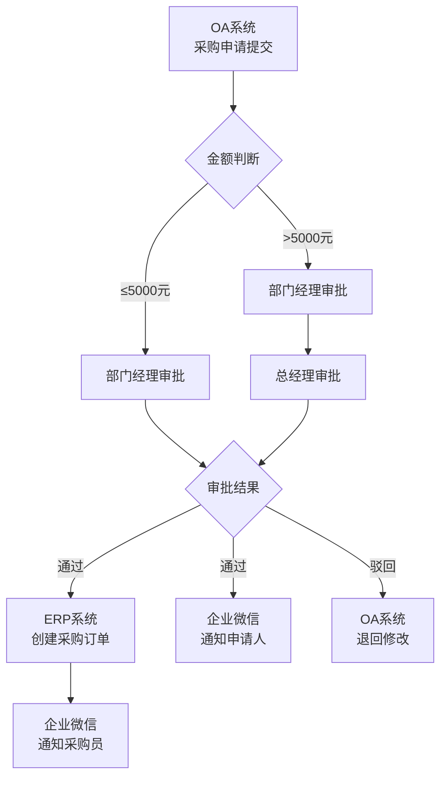

#### 2.2.3 Webhook 集成

集简云支持通过 Webhook 接收外部系统的实时事件推送，作为流程的触发器：

**Webhook 触发配置**：

| 配置项 | 描述 |
|--------|------|
| **Webhook URL** | 集简云为每个流程生成唯一的 Webhook 接收地址 |
| **请求方式** | 支持 POST、GET、PUT 等多种 HTTP Method |
| **数据格式** | 支持 JSON、XML、Form-Data 格式的请求体 |
| **鉴权方式** | 支持 URL 参数鉴权、Header 鉴权、签名验证 |
| **数据解析** | 自动解析 JSON 路径，支持提取嵌套字段 |
| **重试机制** | 流程执行失败后自动重试，支持配置重试次数和间隔 |

**Webhook 接入示例**：

```json
// 外部系统向集简云 Webhook URL 发送 POST 请求
POST https://api.jijianyun.com/webhook/flow_xxxxxxxxx

{
  "event": "order_created",
  "data": {
    "order_id": "ORD-20260514-001",
    "customer_name": "XX科技有限公司",
    "amount": 58000.00,
    "products": [
      {"name": "企业版订阅", "qty": 10, "price": 5800.00}
    ],
    "sales_rep": "张三"
  },
  "timestamp": "2026-05-14T10:30:00+08:00"
}
```

#### 2.2.4 API 集成

集简云支持通过 HTTP 请求步骤直接调用任意 API，无需预先创建连接器：

**API 请求配置示例**：

```json
{
  "method": "POST",
  "url": "https://api.open-app.example.com/v1/messages/send",
  "headers": {
    "Content-Type": "application/json",
    "Authorization": "Bearer ${api_token}"
  },
  "body": {
    "receiver": "${trigger.data.user_id}",
    "msg_type": "text",
    "content": {
      "text": "您有一条新的审批待处理：${trigger.data.approval_title}"
    }
  },
  "timeout": 30000,
  "retry": {
    "max_attempts": 3,
    "interval": 5000
  }
}
```

**API 集成能力**：

| 能力 | 描述 |
|------|------|
| **全 HTTP Method** | 支持 GET、POST、PUT、PATCH、DELETE |
| **动态参数** | 支持在 URL、Header、Body 中引用上游步骤的输出数据 |
| **响应处理** | 自动解析 JSON 响应，支持提取指定路径的数据 |
| **错误处理** | 支持配置 HTTP 状态码映射和异常流程 |
| **超时控制** | 可配置请求超时时间，默认 30 秒 |
| **分页获取** | 支持配置分页参数，自动循环获取全量数据 |

#### 2.2.5 自定义连接器开发

集简云提供开放平台 API，允许开发者创建和发布自定义连接器，供自己或所有用户使用：

**自定义连接器开发流程**：

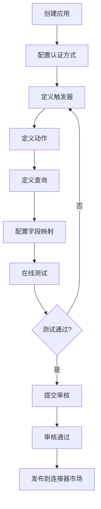

**自定义连接器配置示例（open-app 连接器）**：

```json
{
  "app": {
    "name": "open-app",
    "description": "XXX通信系统开放平台",
    "category": "企业通讯",
    "icon": "https://cdn.example.com/open-app-icon.png",
    "auth": {
      "type": "oauth2",
      "authorize_url": "https://open-app.example.com/oauth2/authorize",
      "token_url": "https://open-app.example.com/oauth2/token",
      "scopes": [
        "im:message:send",
        "contact:user:read",
        "meeting:create",
        "calendar:event:read"
      ]
    },
    "triggers": [
      {
        "name": "new_message",
        "display_name": "收到新消息",
        "description": "当 open-app 中收到新消息时触发",
        "webhook_path": "/triggers/new_message",
        "output_fields": [
          {"key": "message_id", "type": "string", "label": "消息ID"},
          {"key": "sender_id", "type": "string", "label": "发送者ID"},
          {"key": "content", "type": "string", "label": "消息内容"},
          {"key": "chat_id", "type": "string", "label": "会话ID"}
        ]
      }
    ],
    "actions": [
      {
        "name": "send_message",
        "display_name": "发送消息",
        "description": "通过 open-app 发送消息",
        "api": {
          "method": "POST",
          "path": "/v1/messages/send"
        },
        "input_fields": [
          {"key": "receiver", "type": "string", "label": "接收者ID", "required": true},
          {"key": "msg_type", "type": "string", "label": "消息类型", "required": true},
          {"key": "content", "type": "object", "label": "消息内容", "required": true}
        ],
        "output_fields": [
          {"key": "message_id", "type": "string", "label": "消息ID"},
          {"key": "send_time", "type": "string", "label": "发送时间"}
        ]
      }
    ]
  }
}
```

### 2.3 数据处理能力

集简云提供丰富的内置数据处理组件，在流程的各个步骤间进行数据转换和加工：

| 处理组件 | 描述 | 典型用法 |
|---------|------|---------|
| **数据过滤** | 根据条件过滤触发数据，只处理符合条件的数据 | 仅同步 VIP 客户、仅推送金额 > 10000 的订单 |
| **字段映射** | 将源字段映射到目标字段，支持重命名和类型转换 | CRM 的 company_name → ERP 的 customer_name |
| **数据转换** | 格式转换、日期格式化、数值计算、字符串操作 | 时间戳转日期、金额单位换算、手机号格式化 |
| **条件判断** | if/else 条件路由，根据数据走不同分支路径 | 金额大于阈值走高级审批，否则走普通审批 |
| **循环处理** | 对数组类型数据进行逐条迭代处理 | 订单中多个商品逐条同步到库存系统 |
| **延时等待** | 在流程中插入延时，等待外部条件满足 | 审批提交后等待 2 小时再发送提醒 |
| **聚合处理** | 将多条数据合并汇总，支持计数、求和、分组 | 每日汇总所有订单金额生成日报 |
| **数据暂存** | 在流程节点间暂存数据，供后续步骤使用 | 查询结果暂存后在下个步骤中使用 |

**字段映射配置示例**：

```json
{
  "field_mapping": [
    {"source": "trigger.data.customer_name", "target": "action.params.name", "transform": "trim"},
    {"source": "trigger.data.amount", "target": "action.params.total", "transform": "to_decimal"},
    {"source": "trigger.data.create_time", "target": "action.params.order_date", "transform": "date_format:YYYY-MM-DD"},
    {"source": "trigger.data.phone", "target": "action.params.mobile", "transform": "phone_format:CN"}
  ]
}
```

### 2.4 流程调度能力

| 触发方式 | 描述 | 适用场景 | 最小频率 |
|---------|------|---------|---------|
| **实时触发** | 由应用事件或 Webhook 即时触发 | 消息通知、订单同步、审批状态变更 | 实时（毫秒级） |
| **定时触发** | 按设定时间间隔定期执行 | 数据同步、报表生成、定期检查 | 每 5 分钟 |
| **Webhook 触发** | 接收外部系统 HTTP 请求触发 | 第三方系统回调、IoT 设备上报 | 实时 |
| **手动触发** | 用户手动点击执行 | 一次性数据迁移、临时数据处理 | 手动 |

**定时触发配置**：

| 配置项 | 可选值 |
|--------|--------|
| **执行频率** | 每 5 分钟、每 15 分钟、每 30 分钟、每小时、每天、每周、每月、自定义 Cron |
| **执行时间** | 支持指定每天/每周/每月的具体执行时间 |
| **时区设置** | 支持选择时区，默认北京时间（UTC+8） |
| **生效日期** | 支持设置开始日期和结束日期 |
| **并发控制** | 支持设置上次未完成时是否跳过本次执行 |

### 2.5 连接器发布与共享机制

集简云支持将自定义连接器发布到连接器市场，供其他用户使用：

| 共享级别 | 描述 | 可见范围 |
|---------|------|---------|
| **私有** | 仅创建者自己可用 | 单个用户 |
| **企业内** | 企业内所有成员可用 | 单个企业租户 |
| **公开** | 发布到连接器市场，所有用户可用 | 所有集简云用户 |

**连接器版本管理**：

- 支持连接器版本号管理（v1.0、v1.1、v2.0）
- 新版本发布后旧版本流程继续正常运行
- 支持向下兼容性检查
- 提供变更日志和迁移指南

---

## 三、应用场景分析

### 3.1 典型应用场景

#### 3.1.1 企业通讯与业务系统集成

**场景描述**：
将企业通讯平台（如 open-app）与 CRM、ERP、OA 等核心业务系统通过集简云连接，实现消息自动推送、审批流程打通、数据实时同步，让通讯成为业务流转的"神经系统"。

**集成方案**：

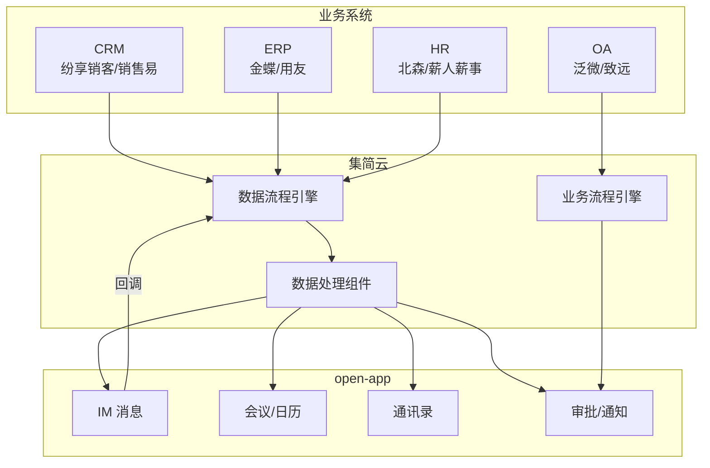

**关键能力映射**：

| 业务系统事件 | 集简云处理 | open-app 动作 |
|------------|-----------|-------------|
| CRM 新建 VIP 客户 | 数据过滤 + 字段映射 | IM 推送客户信息给销售经理 |
| ERP 采购订单审批完成 | 条件判断 + 审批流 | 通知申请人 + 创建日历事件 |
| OA 请假审批通过 | 数据同步 | 更新通讯录状态 + 通知团队 |
| HR 新员工入职 | 数据同步 + 多步动作 | 创建账号 + 加入群组 + 推送入职指引 |

#### 3.1.2 CRM 与通讯录/消息同步

**场景描述**：
实现 CRM 系统（销售易/纷享销客）与 open-app 通讯录和消息的双向同步，确保客户信息一致，销售人员实时获取客户动态。

**典型流程**：

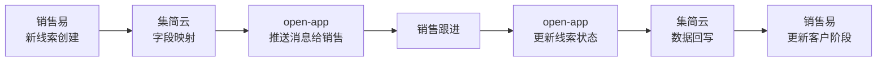

**详细数据映射**：

| CRM 字段 | 集简云转换 | open-app 字段 |
|---------|-----------|-------------|
| lead_name | 字符串处理 | 消息标题 |
| lead_phone | 手机号格式化 | 联系电话 |
| lead_company | 企业名称提取 | 客户公司 |
| lead_source | 来源映射 | 线索来源标签 |
| lead_score | 数值判断 | 是否 VIP 标识 |

#### 3.1.3 ERP 与审批流程对接

**场景描述**：
将金蝶/用友 ERP 系统的采购、报销、付款等审批流程通过集简云对接到 open-app，实现移动端审批、实时通知、审批结果回写。

**典型流程 — 采购审批**：

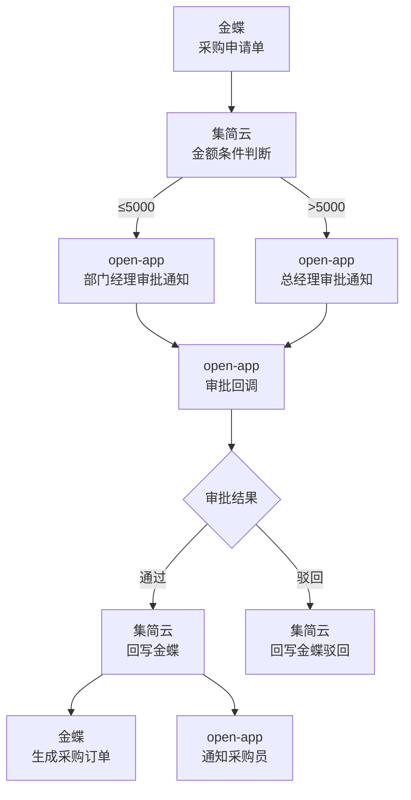

#### 3.1.4 OA 系统数据同步

**场景描述**：
实现泛微 OA、致远 OA 等传统 OA 系统与 open-app 的数据同步，包括公告推送、日程同步、待办提醒等。

**同步场景**：

| 同步方向 | 数据类型 | 触发条件 | 动作 |
|---------|---------|---------|------|
| OA → open-app | 公告通知 | OA 发布新公告 | open-app 群消息推送 |
| OA → open-app | 日程安排 | OA 新建日程 | open-app 日历创建事件 |
| open-app → OA | 审批结果 | open-app 审批完成 | OA 更新审批状态 |
| 双向 | 通讯录 | 人员变动 | 双向同步更新 |

#### 3.1.5 营销自动化

**场景描述**：
实现从线索获取到通知跟进的全流程自动化，打通营销平台、CRM、通讯系统之间的数据孤岛。

**营销自动化流程**：

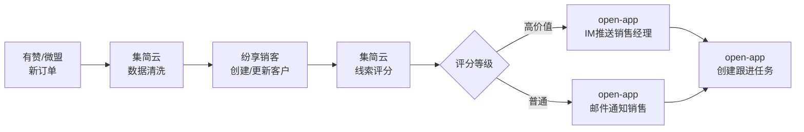

### 3.2 与 open-app 的集成场景

#### 3.2.1 open-app 4 种开放模式与集简云的映射

open-app 提供 4 种开放模式，与集简云的能力形成天然映射：

| open-app 开放模式 | 描述 | 集简云对应能力 | 集成方式 |
|-----------------|------|-------------|---------|
| **API（外部调用内部）** | 外部系统调用 open-app 的 API | **动作（Action）** | 集简云通过 HTTP 请求步骤调用 open-app API |
| **Event（内部推送到外部）** | open-app 内部事件推送到外部 | **触发器（Trigger）** | open-app 事件推送到集简云 Webhook 触发流程 |
| **WebHook/Callback（内部回调外部）** | open-app 内部触发回调到外部 | **触发器 + 回调处理** | open-app 回调到集简云 Webhook，集简云处理后再回调 open-app |
| **Bot（双向交互）** | 双向消息交互 | **触发器 + 动作组合** | Bot 消息触发集简云流程，流程结果通过动作回复 Bot |

**映射关系详解**：

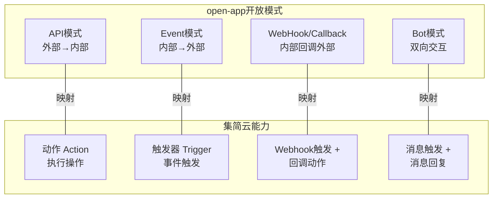

#### 3.2.2 集简云作为 open-app 连接器扩展层

集简云可以作为 open-app 的"连接器扩展层"，在不修改 open-app 核心架构的情况下，快速扩展 open-app 的外部连接能力：

**扩展层架构**：

```
+------------------------------------------------------------------+
|                      企业客户环境                                    |
|                                                                    |
|  +------------+     +------------+     +------------+              |
|  | 金蝶 ERP   |     | 纷享销客CRM |     | 泛微 OA    |              |
|  +-----+------+     +-----+------+     +-----+------+              |
|        |                  |                  |                      |
|        v                  v                  v                      |
|  +---------------------------------------------------+            |
|  |              集简云 iPaaS 连接层                      |            |
|  |  +----------+ +----------+ +----------+ +--------+ |            |
|  |  | 预置连接器| |自定义API | |数据处理  | |流程编排 | |            |
|  |  +----------+ +----------+ +----------+ +--------+ |            |
|  +------------------------+--+----------------------------+        |
|                           |                                       |
|                           v                                       |
|  +---------------------------------------------------+            |
|  |              open-app 通信能力层                      |            |
|  |  IM | 会议 | 云盘 | 日历 | 通讯录 | 邮件 | Bot       |            |
|  +---------------------------------------------------+            |
+------------------------------------------------------------------+
```

**核心价值**：
- **快速扩展**：无需逐一开发每个外部系统的连接器，通过集简云即刻获得 400+ 连接能力
- **零代码维护**：连接器升级、适配由集简云负责，open-app 侧无需代码修改
- **业务自助**：业务人员可自行配置集成流程，降低对开发团队的依赖
- **成本可控**：按流程数量计费，避免大量定制化开发投入

#### 3.2.3 open-app 能力通过集简云触达国内 SaaS 生态

通过集简云，open-app 的 9 大能力（IM、Meeting、CloudBox、Calendar、Contact、Mail、Drive、Bot、Status、Phone）可以快速触达国内主流 SaaS 应用生态：

| open-app 能力 | 通过集简云触达的系统 | 典型场景 |
|-------------|-----------------|---------|
| **IM** | 企业微信、钉钉、飞书 → CRM、ERP | 新订单推送消息、审批通知 |
| **Meeting** | 日历应用、OA 系统 | ERP 订单触发会议安排 |
| **CloudBox** | 企业网盘、OA 文档 | 合同签署后自动归档到云盘 |
| **Calendar** | Google Calendar、Outlook、OA 日历 | 跨系统日程同步 |
| **Contact** | HR 系统、CRM、OA | 新员工入职自动同步通讯录 |
| **Mail** | 邮件系统、CRM | 重要事件邮件通知 |
| **Drive** | 对象存储、文档管理 | 文件自动同步和备份 |
| **Bot** | 智能客服、工单系统 | 客服 Bot 消息双向打通 |
| **Status** | HR、OA、考勤系统 | 员工状态自动更新 |
| **Phone** | CRM、客服系统 | 来电弹屏、通话记录同步 |

---

## 四、开发指南

### 4.1 流程创建流程

**完整流程创建步骤**：

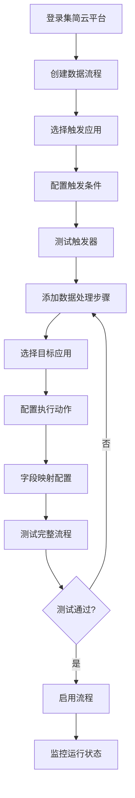

**详细步骤说明**：

1. **登录与创建**：访问集简云控制台，点击"创建流程"，选择"数据流程"或"业务流程"
2. **选择触发应用**：从 400+ 应用列表中选择触发器来源，或选择 Webhook/定时触发
3. **配置触发条件**：设置触发器的具体事件类型和过滤条件
4. **测试触发器**：从源应用获取样本数据，验证触发器配置正确性
5. **添加数据处理**：根据需要添加字段映射、条件判断、循环等处理步骤
6. **选择目标应用**：选择执行动作的目标应用
7. **配置动作参数**：设置动作的输入参数，支持引用上游步骤的输出数据
8. **字段映射**：通过可视化映射界面，将源字段一一对应到目标字段
9. **测试运行**：端到端测试整个流程，检查数据流转是否正确
10. **启用发布**：确认无误后启用流程，流程将自动运行

### 4.2 自定义连接器开发

当 open-app 需要作为集简云的连接器被使用时，需要在集简云开放平台进行连接器注册：

**open-app 连接器完整配置示例**：

```json
{
  "app": {
    "name": "open-app",
    "display_name": "XXX通信开放平台",
    "description": "XXX通信系统开放平台，提供IM、会议、日历、通讯录等企业通信能力",
    "category": "enterprise_communication",
    "icon": "https://cdn.open-app.example.com/logo.png",
    "auth": {
      "type": "oauth2",
      "authorize_url": "https://open-app.example.com/oauth2/authorize",
      "token_url": "https://open-app.example.com/oauth2/token",
      "refresh_url": "https://open-app.example.com/oauth2/refresh",
      "scope_separator": " ",
      "scopes": [
        {"key": "im:message:send", "label": "发送消息"},
        {"key": "im:message:read", "label": "读取消息"},
        {"key": "contact:user:read", "label": "读取通讯录"},
        {"key": "contact:dept:read", "label": "读取部门信息"},
        {"key": "meeting:create", "label": "创建会议"},
        {"key": "calendar:event:readwrite", "label": "读写日历"},
        {"key": "mail:send", "label": "发送邮件"},
        {"key": "drive:file:readwrite", "label": "读写云盘文件"}
      ]
    }
  }
}
```

**触发器定义示例**：

```json
{
  "triggers": [
    {
      "name": "new_message",
      "display_name": "收到新消息",
      "description": "当 open-app IM 中收到新消息时触发",
      "type": "webhook",
      "webhook_subscription": {
        "create_url": "https://open-app.example.com/v1/webhooks/subscribe",
        "delete_url": "https://open-app.example.com/v1/webhooks/unsubscribe",
        "payload": {"event_type": "im.message.receive_v1"}
      },
      "output_fields": [
        {"key": "message_id", "type": "string", "label": "消息ID"},
        {"key": "sender_id", "type": "string", "label": "发送者ID"},
        {"key": "sender_name", "type": "string", "label": "发送者姓名"},
        {"key": "chat_id", "type": "string", "label": "会话ID"},
        {"key": "chat_type", "type": "string", "label": "会话类型"},
        {"key": "content_type", "type": "string", "label": "消息类型"},
        {"key": "content", "type": "string", "label": "消息内容"},
        {"key": "timestamp", "type": "string", "label": "消息时间"}
      ]
    },
    {
      "name": "calendar_event_created",
      "display_name": "日历事件创建",
      "description": "当 open-app 日历中新建事件时触发",
      "type": "webhook",
      "output_fields": [
        {"key": "event_id", "type": "string", "label": "事件ID"},
        {"key": "title", "type": "string", "label": "事件标题"},
        {"key": "start_time", "type": "string", "label": "开始时间"},
        {"key": "end_time", "type": "string", "label": "结束时间"},
        {"key": "organizer", "type": "string", "label": "组织者"},
        {"key": "attendees", "type": "array", "label": "参会人列表"}
      ]
    },
    {
      "name": "contact_user_changed",
      "display_name": "通讯录人员变更",
      "description": "当 open-app 通讯录中人员信息变更时触发",
      "type": "webhook",
      "output_fields": [
        {"key": "user_id", "type": "string", "label": "用户ID"},
        {"key": "name", "type": "string", "label": "姓名"},
        {"key": "department", "type": "string", "label": "部门"},
        {"key": "change_type", "type": "string", "label": "变更类型"},
        {"key": "mobile", "type": "string", "label": "手机号"},
        {"key": "email", "type": "string", "label": "邮箱"}
      ]
    }
  ]
}
```

**动作定义示例**：

```json
{
  "actions": [
    {
      "name": "send_message",
      "display_name": "发送消息",
      "description": "通过 open-app IM 发送消息",
      "api": {"method": "POST", "path": "/v1/messages/send"},
      "input_fields": [
        {"key": "receiver_id", "type": "string", "label": "接收者ID", "required": true},
        {"key": "msg_type", "type": "string", "label": "消息类型", "required": true},
        {"key": "content", "type": "object", "label": "消息内容", "required": true}
      ],
      "output_fields": [
        {"key": "message_id", "type": "string", "label": "消息ID"},
        {"key": "send_time", "type": "string", "label": "发送时间"}
      ]
    },
    {
      "name": "create_meeting",
      "display_name": "创建会议",
      "description": "通过 open-app 创建视频会议",
      "api": {"method": "POST", "path": "/v1/meetings/create"},
      "input_fields": [
        {"key": "topic", "type": "string", "label": "会议主题", "required": true},
        {"key": "start_time", "type": "string", "label": "开始时间", "required": true},
        {"key": "duration", "type": "integer", "label": "时长(分钟)", "required": true},
        {"key": "attendees", "type": "array", "label": "参会人ID列表", "required": true}
      ],
      "output_fields": [
        {"key": "meeting_id", "type": "string", "label": "会议ID"},
        {"key": "join_url", "type": "string", "label": "参会链接"},
        {"key": "meeting_number", "type": "string", "label": "会议号"}
      ]
    },
    {
      "name": "create_calendar_event",
      "display_name": "创建日历事件",
      "description": "在 open-app 日历中创建事件",
      "api": {"method": "POST", "path": "/v1/calendar/events"},
      "input_fields": [
        {"key": "title", "type": "string", "label": "事件标题", "required": true},
        {"key": "start_time", "type": "string", "label": "开始时间", "required": true},
        {"key": "end_time", "type": "string", "label": "结束时间", "required": true},
        {"key": "description", "type": "string", "label": "事件描述"},
        {"key": "attendees", "type": "array", "label": "参会人"}
      ],
      "output_fields": [
        {"key": "event_id", "type": "string", "label": "事件ID"}
      ]
    },
    {
      "name": "get_user_info",
      "display_name": "查询用户信息",
      "description": "查询 open-app 通讯录中的用户详细信息",
      "api": {"method": "GET", "path": "/v1/users/{user_id}"},
      "input_fields": [
        {"key": "user_id", "type": "string", "label": "用户ID", "required": true}
      ],
      "output_fields": [
        {"key": "user_id", "type": "string", "label": "用户ID"},
        {"key": "name", "type": "string", "label": "姓名"},
        {"key": "department", "type": "string", "label": "部门"},
        {"key": "mobile", "type": "string", "label": "手机号"},
        {"key": "email", "type": "string", "label": "邮箱"},
        {"key": "position", "type": "string", "label": "职位"}
      ]
    }
  ]
}
```

### 4.3 Webhook 接入配置

**open-app 事件通过 Webhook 接入集简云**：

**步骤 1：在集简云创建 Webhook 触发器**

在集简云流程中选择"Webhook"作为触发器，获取唯一的 Webhook URL：

```
https://api.jijianyun.com/webhook/flow_a1b2c3d4e5f6
```

**步骤 2：在 open-app 配置事件订阅**

将集简云 Webhook URL 配置为 open-app 事件的回调地址：

```json
{
  "subscribe": {
    "callback_url": "https://api.jijianyun.com/webhook/flow_a1b2c3d4e5f6",
    "events": [
      "im.message.receive_v1",
      "calendar.event.create_v1",
      "contact.user.change_v1",
      "meeting.status.change_v1"
    ],
    "verification_token": "your_verification_token",
    "encrypt_key": "your_encrypt_key"
  }
}
```

**步骤 3：配置 Webhook 数据解析**

在集简云中配置 Webhook 接收数据的解析规则：

```json
{
  "parse_rules": {
    "event_type_path": "$.event.type",
    "event_data_path": "$.event.data",
    "timestamp_path": "$.header.timestamp",
    "verification": {
      "type": "token",
      "token_field": "$.header.verify_token"
    }
  }
}
```

**步骤 4：验证连通性**

向 open-app 发送测试事件，确认集简云能正确接收和解析：

```
open-app 发送测试事件 → 集简云 Webhook 接收 → 解析数据 → 触发流程
```

### 4.4 认证方式

集简云支持多种认证方式，以适配不同系统的安全要求：

| 认证方式 | 描述 | 适用场景 | 配置复杂度 |
|---------|------|---------|-----------|
| **API Key** | 在请求 Header 或 URL 参数中携带固定 API Key | 简单接口、内部系统 | ★☆☆☆☆ |
| **OAuth2** | 标准授权码模式，支持 access_token 和 refresh_token | SaaS 应用、第三方平台 | ★★★☆☆ |
| **Basic Auth** | 使用用户名/密码进行 HTTP 基础认证 | 旧系统、简单认证 | ★☆☆☆☆ |
| **自定义 Token** | 支持自定义的 Token 获取和刷新逻辑 | 自研系统、特殊认证协议 | ★★★☆☆ |

**open-app 推荐 OAuth2 认证配置**：

```json
{
  "auth_config": {
    "type": "oauth2",
    "grant_type": "authorization_code",
    "authorize_url": "https://open-app.example.com/oauth2/authorize",
    "token_url": "https://open-app.example.com/oauth2/token",
    "refresh_url": "https://open-app.example.com/oauth2/refresh",
    "client_id": "${CLIENT_ID}",
    "client_secret": "${CLIENT_SECRET}",
    "redirect_uri": "https://api.jijianyun.com/oauth/callback",
    "scope": "im:message:send contact:user:read meeting:create",
    "token_placement": "header",
    "token_prefix": "Bearer",
    "token_field": "access_token",
    "refresh_field": "refresh_token",
    "expires_in_field": "expires_in"
  }
}
```

### 4.5 最佳实践

#### 4.5.1 流程设计最佳实践

| 实践 | 描述 | 原因 |
|------|------|------|
| **单一职责** | 每个流程只做一件事 | 便于维护、调试和重用 |
| **添加过滤前置** | 在触发器后立即添加过滤条件 | 减少不必要的流程执行，节省配额 |
| **错误处理分支** | 为关键动作添加错误处理路径 | 防止单点失败导致整个流程中断 |
| **合理使用延时** | 在需要等待的场景使用延时而非轮询 | 减少不必要的 API 调用 |
| **幂等设计** | 确保重复执行流程不会产生副作用 | 应对重试机制可能带来的重复执行 |
| **数据校验** | 在关键步骤前校验数据完整性 | 避免无效数据写入目标系统 |

#### 4.5.2 性能优化最佳实践

- **批量处理**：对于大量数据，优先使用批量接口而非逐条处理
- **缓存热数据**：对于频繁查询的不变数据（如用户信息），使用数据暂存步骤缓存
- **异步解耦**：对于耗时操作，采用触发 → 通知的异步模式而非同步等待
- **合理调度**：定时任务避开业务高峰期，错峰执行

#### 4.5.3 安全最佳实践

- **最小权限**：OAuth2 授权仅申请必要的 scope
- **凭证管理**：API Key 和 Token 使用环境变量，不硬编码在流程中
- **数据脱敏**：流程日志中涉及敏感信息时配置脱敏规则
- **审计追踪**：开启流程执行日志，保留操作记录

---

## 五、优势与劣势分析

### 5.1 核心优势

#### 5.1.1 国产化优势

| 优势维度 | 详细描述 |
|---------|---------|
| **国内 SaaS 深度覆盖** | 400+ 连接器中国内应用占比超过 60%，涵盖金蝶、用友、纷享销客、销售易、泛微等国内主流系统，远超 Zapier 等海外平台 |
| **中文界面与文档** | 全中文操作界面、中文文档和客服支持，国内用户零学习障碍 |
| **本地化服务** | 提供中文客服、在线培训、实施咨询等本地化服务，响应速度快 |
| **合规适配** | 深度适配国内数据安全法规（网络安全法、个人信息保护法），支持私有化部署 |

#### 5.1.2 性价比优势

| 对比维度 | 集简云 | Zapier | 说明 |
|---------|--------|--------|------|
| **起步价格** | 免费版可用，付费版 ¥99/月起 | 免费版有限，付费版 $19.99/月起 | 集简云对国内中小企业更友好 |
| **人民币定价** | 直接人民币结算 | 美元结算，有汇率风险 | 集简云财务成本更可控 |
| **国内应用支持** | 400+ 含国内主流 | 7000+ 但国内应用极少 | 集简云国内覆盖远优于 Zapier |
| **定制化服务** | 支持定制化开发和实施 | 标准化产品为主 | 集简云更适合国内企业定制需求 |

#### 5.1.3 生态优势

| 优势维度 | 详细描述 |
|---------|---------|
| **国内 SaaS 生态** | 与国内主流 SaaS 厂商建立合作，连接器质量高、更新及时 |
| **行业模板** | 提供制造、零售、金融等行业的预制流程模板，开箱即用 |
| **社区生态** | 活跃的国内用户社区，分享最佳实践和流程模板 |
| **合作伙伴** | 与咨询公司、系统集成商合作，提供端到端解决方案 |

#### 5.1.4 技术优势

| 优势维度 | 详细描述 |
|---------|---------|
| **零代码** | 纯可视化配置，非技术人员可独立完成 80% 以上场景 |
| **灵活扩展** | 支持自定义连接器、Webhook、API 集成，覆盖任意系统 |
| **数据处理** | 内置过滤、映射、转换、条件、循环等丰富的数据处理组件 |
| **双引擎** | 数据流程 + 业务流程双引擎，覆盖简单同步到复杂审批全场景 |

### 5.2 潜在劣势

#### 5.2.1 规模劣势

| 劣势维度 | 详细描述 |
|---------|---------|
| **应用数量** | 400+ 应用连接器，相比 Zapier 的 7000+ 和 Make 的 1500+ 仍有差距 |
| **国际应用** | 国际 SaaS 应用覆盖有限，对出海企业或跨国公司不够友好 |
| **长尾应用** | 对小众行业应用、垂直领域 SaaS 的连接器覆盖不够全面 |

#### 5.2.2 企业级治理能力

| 劣势维度 | 详细描述 |
|---------|---------|
| **权限管理** | 企业级细粒度权限管理能力不如 MuleSoft、Workato 等企业级平台 |
| **审计合规** | 审计日志、合规报告等功能尚在完善中，对强监管行业支撑不足 |
| **高可用** | SLA 保障能力有待公开承诺和第三方认证 |
| **API 治理** | 缺乏 API 生命周期管理、版本治理等企业级 API 管理能力 |

#### 5.2.3 品牌与生态

| 劣势维度 | 详细描述 |
|---------|---------|
| **品牌知名度** | 在国内企业软件市场知名度仍有待提升，不如钉钉、企业微信等平台 |
| **开发者生态** | 开发者社区规模和活跃度不如 Zapier，自定义连接器数量有限 |
| **ISV 生态** | ISV 合作伙伴体系尚在建设中，缺乏大规模 ISV 生态 |
| **国际化** | 暂无国际化版本和海外服务能力，不适合海外业务场景 |

#### 5.2.4 技术局限

| 劣势维度 | 详细描述 |
|---------|---------|
| **高级数据处理** | 复杂数据转换（如自定义脚本、正则表达式）能力有限 |
| **实时性** | 定时触发最小粒度为 5 分钟，不如纯实时事件驱动架构 |
| **大规模并发** | 对高并发场景（如万级 QPS）的处理能力有待验证 |
| **自定义代码** | 不支持在流程中嵌入自定义代码片段（如 Python/JS 脚本） |

---

## 六、成本分析

### 6.1 定价方案

集简云采用分级定价模式，按流程数量和执行次数计费：

| 版本 | 价格（月付） | 流程数量 | 执行次数/月 | 适用场景 |
|------|------------|---------|-----------|---------|
| **免费版** | ¥0 | 2 个 | 100 次 | 个人体验、简单测试 |
| **基础版** | ¥99/月 | 5 个 | 1,000 次 | 小微企业、基础集成 |
| **专业版** | ¥299/月 | 15 个 | 5,000 次 | 中小企业、常规业务集成 |
| **企业版** | ¥899/月 | 50 个 | 20,000 次 | 中大型企业、复杂业务场景 |
| **旗舰版** | ¥2,999/月 | 不限 | 100,000 次 | 大型企业、大规模自动化 |
| **私有化部署** | 定制报价 | 不限 | 不限 | 政府、金融等强合规行业 |

**费用说明**：
- 年付可享 8.5 折优惠
- 超出执行次数按 ¥0.05/次计费
- 企业版及以上支持专属客户成功经理
- 私有化部署需额外支付部署费和运维费

### 6.2 开发成本

| 成本项 | 说明 | 预估费用 |
|--------|------|---------|
| **平台费用** | 集简云订阅费 | ¥99 ~ ¥2,999/月 |
| **连接器开发** | 自定义连接器开发（如 open-app） | 1-2 人周，约 ¥15,000 ~ ¥30,000 |
| **流程配置** | 业务流程设计与配置 | 每个流程 0.5-2 人天 |
| **培训成本** | 团队学习集简云使用 | 1-2 天培训 |
| **测试验证** | 端到端测试和联调 | 每个流程 0.5-1 人天 |

**对比传统开发方式**：

| 对比项 | 集简云方式 | 传统 API 编码方式 | 节省比例 |
|--------|-----------|----------------|---------|
| **单场景开发周期** | 1-3 天 | 2-4 周 | 80%+ |
| **单场景开发成本** | ¥2,000 ~ ¥5,000 | ¥30,000 ~ ¥80,000 | 90%+ |
| **维护成本/年** | 平台费 | 开发人员 20% 工时 | 70%+ |
| **新增系统集成** | 0.5-1 天 | 1-3 周 | 85%+ |

### 6.3 运营成本

| 成本项 | 说明 | 费用说明 |
|--------|------|---------|
| **平台订阅** | 集简云版本费用 | ¥99 ~ ¥2,999/月 |
| **超出用量** | 超出月度执行次数的费用 | ¥0.05/次 |
| **定制维护** | 自定义连接器和流程的维护 | 按需，约 2-4 人天/季度 |
| **人员培训** | 新员工使用培训 | 持续性，约 0.5 天/人 |
| **监控运维** | 流程监控和异常处理 | 日常运维，约 0.5 人天/周 |

---

## 七、技术架构建议

### 7.1 open-app 集简云连接器架构设计

**整体架构**：

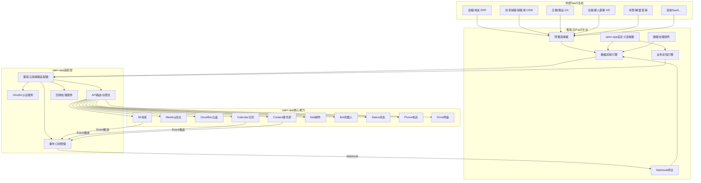

**架构层次说明**：

| 层次 | 组件 | 职责 |
|------|------|------|
| **外部 SaaS 生态层** | 金蝶、用友、纷享销客等 | 提供业务数据源和触发事件 |
| **集简云 iPaaS 层** | 连接器、流程引擎、数据处理 | 流程编排、数据转换、事件路由 |
| **适配层** | 连接器适配器、认证、订阅 | 协议转换、安全认证、事件管理 |
| **open-app 核心层** | IM、会议、通讯录等 | 提供通信能力和事件源 |

### 7.2 关键技术选型

#### 7.2.1 open-app 侧技术组件

| 技术组件 | 推荐方案 | 说明 |
|---------|---------|------|
| **连接器适配器** | Node.js / Go 微服务 | 轻量级、高并发，负责集简云与 open-app 的协议适配 |
| **OAuth2 服务** | 基于 OAuth2.1 协议 | 提供标准授权码模式和客户端凭证模式 |
| **Webhook 网关** | Kong / APISIX | API 网关，负责 Webhook 接收、限流、鉴权 |
| **事件分发** | Kafka / RocketMQ | 事件异步分发，解耦事件产生和消费 |
| **数据转换** | JSONata / JOLT | 声明式数据转换，适配集简云数据格式 |
| **监控告警** | Prometheus + Grafana | 流程执行监控、异常告警 |
| **日志审计** | ELK Stack | 操作日志收集和分析 |

#### 7.2.2 集简云侧技术组件

| 技术组件 | 推荐方案 | 说明 |
|---------|---------|------|
| **open-app 连接器** | 集简云自定义连接器 | 在集简云平台注册 open-app 连接器 |
| **触发器** | Webhook 触发 | open-app 事件通过 Webhook 推送到集简云 |
| **动作** | RESTful API 调用 | 集简云通过 API 调用 open-app 的能力 |
| **认证** | OAuth2 授权码模式 | 用户授权后集简云获取 open-app API 访问权限 |

### 7.3 安全架构

#### 7.3.1 认证授权流程

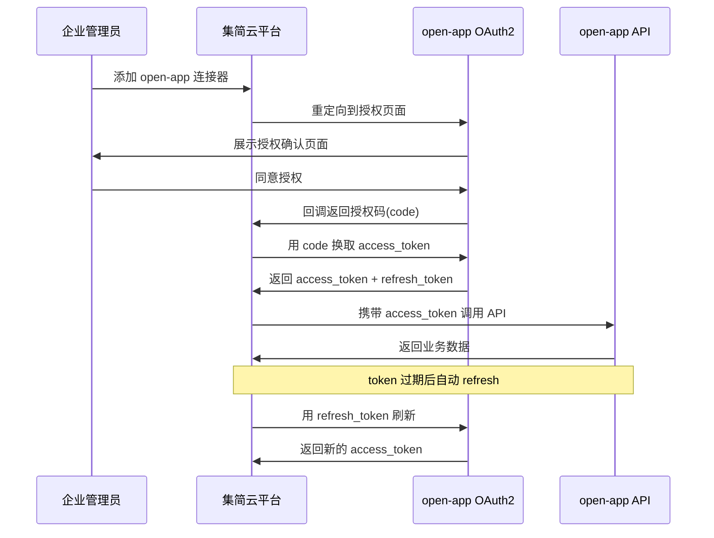

#### 7.3.2 数据安全措施

| 安全措施 | open-app 侧 | 集简云侧 | 说明 |
|---------|------------|---------|------|
| **传输加密** | HTTPS (TLS 1.2+) | HTTPS (TLS 1.2+) | 全链路加密传输 |
| **认证鉴权** | OAuth2 + API Gateway | OAuth2 + API Key | 双向认证鉴权 |
| **数据脱敏** | 响应字段脱敏 | 流程日志脱敏 | 敏感数据不落地 |
| **IP 白名单** | 配置集简云出口 IP | 配置 open-app 入口 IP | 限制访问来源 |
| **操作审计** | API 调用日志 | 流程执行日志 | 全链路可追溯 |
| **权限控制** | Scope 粒度权限 | 连接器级权限 | 最小权限原则 |
| **数据存储** | 不存储集简云数据 | 不持久化业务数据 | 数据不落盘原则 |

#### 7.3.3 私有化部署安全方案

对于有数据不出企业网络要求的客户，提供私有化部署方案：

```
+------------------------------------------------------------------+
|                    企业私有网络                                      |
|                                                                    |
|  +-------------------+          +-------------------+              |
|  | open-app 私有部署  | <------> | 集简云 私有部署    |              |
|  |                   |          |                   |              |
|  | IM/会议/通讯录    |          | 流程引擎/连接器   |              |
|  +-------------------+          +-------------------+              |
|           |                              |                         |
|           v                              v                         |
|  +-------------------+          +-------------------+              |
|  | 内部 ERP/CRM/OA   |          | 内部数据库/中间件  |              |
|  +-------------------+          +-------------------+              |
+------------------------------------------------------------------+
                           |
                           | (可选) 加密通道
                           v
                  +-------------------+
                  | 集简云公有云       |
                  | (连接器市场/更新) |
                  +-------------------+
```

---

## 八、实施路径建议

### 8.1 实施阶段规划

#### 第一阶段：连接器注册与基础验证（2-3 周）

**主要工作**：
- 在集简云开放平台注册 open-app 连接器
- 配置 OAuth2 认证方式
- 定义 IM 消息相关的基础触发器和动作（发送消息、接收消息）
- 端到端测试验证

**交付物**：
- open-app 集简云连接器（基础版）
- 连通性测试报告
- OAuth2 认证流程文档

#### 第二阶段：核心能力接入（4-6 周）

**主要工作**：
- 扩展 open-app 连接器的触发器和动作，覆盖 9 大核心能力
- 配置核心业务流程模板（消息通知、通讯录同步、会议创建等）
- 开发 open-app 侧的适配层服务
- 集成测试和性能测试

**交付物**：
- open-app 连接器完整版（IM、Meeting、Calendar、Contact 等）
- 10+ 预制业务流程模板
- 适配层服务代码
- 测试报告

#### 第三阶段：生态集成与场景落地（6-8 周）

**主要工作**：
- 实现与金蝶、用友、纷享销客等国内 SaaS 的集成场景
- 开发行业解决方案模板
- 客户试点和反馈收集
- 优化和迭代

**交付物**：
- 行业集成方案（制造、零售、金融）
- 客户试点报告
- 优化改进方案

#### 第四阶段：运营推广与持续优化（持续）

**主要工作**：
- 连接器发布到集简云公开市场
- 营销推广和客户拓展
- 监控运营数据和用户反馈
- 持续迭代优化连接器能力

**交付物**：
- 连接器市场发布
- 运营数据报告
- 季度迭代计划

### 8.2 团队配置建议

| 角色 | 人数 | 职责 | 参与阶段 |
|------|------|------|---------|
| **项目经理** | 1 | 项目整体规划、进度把控、资源协调 | 全程 |
| **架构师** | 1 | 架构设计、技术选型、技术难点攻关 | 第一、二阶段 |
| **后端开发** | 2-3 | 适配层开发、连接器配置、API 对接 | 第一、二、三阶段 |
| **产品经理** | 1 | 流程模板设计、场景梳理、用户体验优化 | 第二、三阶段 |
| **测试工程师** | 1 | 测试用例设计、功能测试、性能测试 | 第二、三阶段 |
| **运维工程师** | 1 | 环境搭建、部署上线、监控运维 | 第二阶段起 |
| **解决方案顾问** | 1 | 行业方案设计、客户对接 | 第三阶段起 |

### 8.3 风险控制

| 风险类型 | 风险描述 | 影响程度 | 应对措施 |
|---------|---------|---------|---------|
| **平台依赖** | 过度依赖集简云平台，平台故障影响业务 | 高 | 设计降级方案，关键流程保留直连 API 方式 |
| **数据安全** | 业务数据经过第三方平台，存在泄露风险 | 高 | 数据脱敏、加密传输、评估私有化部署 |
| **性能瓶颈** | 大量流程并发可能影响 open-app API 性能 | 中 | 实施限流、队列缓冲、性能压测 |
| **平台变更** | 集简云 API 或定价策略变更 | 中 | 关注平台动态、制定迁移预案、减少硬依赖 |
| **连接器质量** | 自定义连接器功能不完善或存在 Bug | 中 | 充分测试、建立版本管理、及时修复 |
| **合规风险** | 数据跨境、隐私保护等合规问题 | 高 | 评估数据流向、采用私有化部署、合规审查 |
| **成本失控** | 流程数量和执行次数超出预期 | 低 | 设置用量告警、优化流程效率、评估成本效益 |

---

## 九、总结与建议

### 9.1 总结

集简云作为国内领先的 iPaaS 平台，具有以下特点：

**核心优势**：
- 国内 SaaS 生态深度覆盖，400+ 连接器中国内应用占比超 60%
- 零代码可视化配置，业务人员可独立完成 80% 以上集成场景
- 性价比突出，人民币定价，对国内中小企业友好
- 本地化服务完善，中文界面、文档、客服支持
- 合规适配，支持私有化部署，符合国内数据安全法规

**主要劣势**：
- 应用数量（400+）相比 Zapier（7000+）仍有差距
- 国际 SaaS 应用覆盖有限，不适合出海和跨国企业
- 企业级治理能力（权限、审计、API 管理）有待提升
- 品牌知名度和开发者生态尚在建设期
- 高级数据处理能力和自定义代码支持有限

**与 open-app 的契合度**：
- 集简云的 Trigger/Action/Search 模型与 open-app 的 4 种开放模式天然映射
- 集简云的国内 SaaS 生态可以帮助 open-app 快速触达金蝶、用友、纷享销客等国内主流系统
- 集简云作为"连接器扩展层"可以大幅降低 open-app 的外部集成开发成本
- 集简云的业务人员自助配置模式可以让 open-app 的能力更快速地在客户侧落地

### 9.2 对 open-app 的建议

#### 9.2.1 短期建议（1-3 个月）

1. **注册集简云连接器**：在集简云开放平台注册 open-app 连接器，优先支持 IM 消息和通讯录能力
2. **配置 OAuth2 认证**：实现标准的 OAuth2 授权码模式，为集简云提供安全的 API 访问能力
3. **实现 Webhook 事件推送**：将 open-app 的 Event 模式适配为集简云的 Webhook 触发器
4. **发布 5-10 个流程模板**：覆盖消息通知、通讯录同步、会议创建等高频场景

#### 9.2.2 中期建议（3-6 个月）

1. **完善连接器能力**：扩展 open-app 连接器，覆盖全部 9 大能力（IM、Meeting、CloudBox、Calendar、Contact、Mail、Drive、Bot、Status/Phone）
2. **开发行业方案**：与集简云合作，为制造、零售、金融等行业开发预制集成方案
3. **建立合作生态**：与集简云建立正式合作伙伴关系，共同推广 open-app + 集简云解决方案
4. **评估私有化方案**：针对政企客户，评估集简云私有化部署的可行性和成本

#### 9.2.3 长期建议（6-12 个月）

1. **构建连接器标准**：基于集简云对接经验，建立 open-app 连接器开发标准，便于未来接入更多 iPaaS 平台
2. **自研轻量集成能力**：在 open-app 平台内部构建轻量级的流程编排能力，降低对第三方 iPaaS 的依赖
3. **探索国际 iPaaS 合作**：如需服务出海客户，评估与 Zapier、Make 等国际 iPaaS 平台的合作
4. **建设开放生态**：发展 ISV 和开发者生态，让更多第三方为 open-app 开发连接器和集成方案

#### 9.2.4 战略建议

- **定位明确**：将集简云定位为 open-app 在国内 SaaS 生态的"连接器扩展层"，而非替代自有集成能力
- **双轨并行**：一方面通过集简云快速扩展连接能力，另一方面持续建设 open-app 自身的 API 和 Event 能力
- **数据安全优先**：在任何集成方案中，确保数据安全和合规是第一优先级，必要时采用私有化部署
- **客户价值驱动**：以客户实际业务场景为导向，选择高价值场景优先落地，而非全面铺开

---

## 十、附录

### 10.1 相关资源

| 资源类型 | 链接/说明 |
|---------|---------|
| **集简云官网** | https://www.jijianyun.com |
| **集简云帮助中心** | https://help.jijianyun.com |
| **集简云开放平台** | https://open.jijianyun.com |
| **连接器市场** | https://www.jijianyun.com/apps |
| **流程模板库** | https://www.jijianyun.com/templates |
| **集简云开发者文档** | https://docs.jijianyun.com |
| **集简云博客** | https://blog.jijianyun.com |
| **集简云社区** | https://community.jijianyun.com |

### 10.2 常见问题

**Q1: 集简云与 Zapier 的核心区别是什么？**
A: 核心区别在于：1）集简云深度覆盖国内 SaaS 应用（金蝶、用友、纷享销客等），Zapier 以国际应用为主；2）集简云全中文界面和本地化服务，Zapier 全英文；3）集简云人民币定价更便宜，Zapier 美元定价对国内企业有汇率风险；4）集简云支持私有化部署，Zapier 无此选项；5）Zapier 应用数量（7000+）远多于集简云（400+），国际覆盖更广。

**Q2: 集简云如何保证数据安全？**
A: 集简云通过以下方式保证数据安全：1）全链路 HTTPS 加密传输；2）支持私有化部署，数据不出企业网络；3）提供操作审计日志，可追溯所有操作；4）支持数据脱敏配置；5）符合国内网络安全法和个人信息保护法要求；6）提供 IP 白名单限制访问来源。

**Q3: 集简云支持私有化部署吗？**
A: 支持。集简云提供私有化部署方案，适用于政府、金融、医疗等对数据安全有严格要求的行业。私有化部署可将集简云平台部署在企业自有服务器或私有云上，数据完全不出企业网络。部署方式支持 Docker 容器化和 Kubernetes 编排。

**Q4: open-app 接入集简云需要多少开发工作量？**
A: 主要工作量包括：1）在集简云开放平台注册连接器（配置 JSON，约 1-2 人天）；2）open-app 侧适配层开发（OAuth2 服务、Webhook 网关，约 2-3 人周）；3）流程模板设计和配置（约 1 人周）；4）测试验证（约 1 人周）。总体约 4-6 人周可完成基础接入。

**Q5: 集简云的流程执行有延迟吗？**
A: 延迟取决于触发方式：1）实时触发（Webhook/应用事件）：通常 1-5 秒内执行；2）定时触发：最小粒度为 5 分钟；3）流程复杂度：步骤越多、外部 API 响应越慢，延迟越高。对于大多数业务通知场景，秒级延迟完全满足需求。

**Q6: 集简云如何处理流程执行失败？**
A: 集简云提供完善的错误处理机制：1）自动重试：失败后自动重试（默认 3 次）；2）错误分支：可配置错误处理路径，失败后执行备选动作；3）告警通知：流程执行失败后通过邮件/企业微信等渠道告警；4）执行日志：详细的步骤级执行日志，便于排查问题。

**Q7: 集简云适合哪些规模的企业？**
A: 集简云覆盖从个人到大型企业的全规模客户：1）小微企业和个人：免费版或基础版即可满足基本需求；2）中型企业：专业版和企业版提供足够的流程和执行额度；3）大型企业：旗舰版提供无限流程和高执行次数，私有化部署满足合规要求。

**Q8: 集简云与 MuleSoft、Workato 等企业级 iPaaS 相比如何？**
A: 集简云在以下几个方面有差异：1）定位：集简云更侧重中小企业的无代码集成，MuleSoft/Workato 更侧重大型企业的 API 治理和复杂集成；2）价格：集简云（¥99 起）远低于 MuleSoft（$500+/月）和 Workato（$10,000+/年）；3）国内覆盖：集简云国内应用覆盖远优于两者；4）企业级能力：MuleSoft/Workato 在 API 治理、安全合规、高可用等方面更成熟；5）国际化：MuleSoft/Workato 国际应用生态更丰富。

---

**报告编制时间**：2026年5月
**报告版本**：V1.0
