# 飞书集成平台调研报告

**版本**：V1.0  
**日期**：2026年5月  

---

## 一、平台概述

### 1.1 平台简介

飞书集成平台（Feishu Integration Platform）是字节跳动旗下飞书办公套件的集成与连接能力体系，它不是一个独立的 iPaaS 产品，而是飞书作为"内聚型协作平台"向外输出和接入能力的完整技术架构。飞书集成平台以飞书开放平台为核心载体，通过 API、事件订阅、Webhook、机器人、小程序等标准化接口，实现飞书内部能力的外部化输出，以及外部系统与飞书的深度集成。

飞书集成平台本质上是一个**应用型平台的集成能力层**，而非中立的集成中间件。这意味着飞书集成能力的出发点是"让更多应用围绕飞书构建"，而非"帮助用户连接任意两个应用"。这种定位决定了飞书集成平台在架构设计、生态策略、开发者体验等方面呈现出独特特征——以飞书为中心、以场景为驱动、以锁定为目标。

飞书集成平台的核心组成包括：

| 组成部分 | 描述 |
|---------|------|
| **飞书开放平台** | API/事件/机器人/小程序等标准化接口 |
| **飞书自动化** | 内置低代码工作流编排工具 |
| **飞书应用市场** | ISV 应用分发和安装平台 |
| **飞书机器人** | 轻量级集成入口 |
| **多维表格自动化** | 基于数据表的工作流 |
| **审批流程引擎** | 可编程的审批流定义 |

### 1.2 发展历程

| 阶段 | 时间 | 里程碑 | 意义 |
|------|------|--------|------|
| **萌芽期** | 2017-2018 | 飞书（Lark）内部使用，基础 API 开放 | 飞书作为字节内部工具，初步开放接口供内部系统对接 |
| **开放期** | 2019 | 飞书开放平台正式上线，发布 RESTful API v1 | 面向外部开发者开放核心能力（通讯录、消息、日历） |
| **生态期** | 2020 | 飞书应用市场上线，ISV 入驻，小程序框架发布 | 从 API 开放到生态运营，第三方应用可上架分发 |
| **深化期** | 2021-2022 | 事件订阅体系完善（v2），机器人框架升级，多维表格 API 开放 | 集成能力从"调用"走向"联动"，事件驱动架构成熟 |
| **智能化期** | 2023 | 飞书智能助手发布，AI 集成能力开放，自动化能力增强 | AI 驱动的集成新范式，自然语言到可执行代码 |
| **平台化期** | 2024-至今 | 飞书集成平台能力体系化，开放平台 3.0，低代码集成工具 | 从"开放 API"走向"集成平台"，MCP 协议支持 |

### 1.3 飞书集成平台的内聚型架构特征

飞书集成平台的核心架构特征是**内聚型**——以飞书自身为中心，向外辐射集成能力。这种架构不是中立的集成中间件，而是飞书作为协作平台的能力延伸层，所有集成活动都以"围绕飞书构建"为出发点。

内聚型架构的核心特征体现在以下方面：

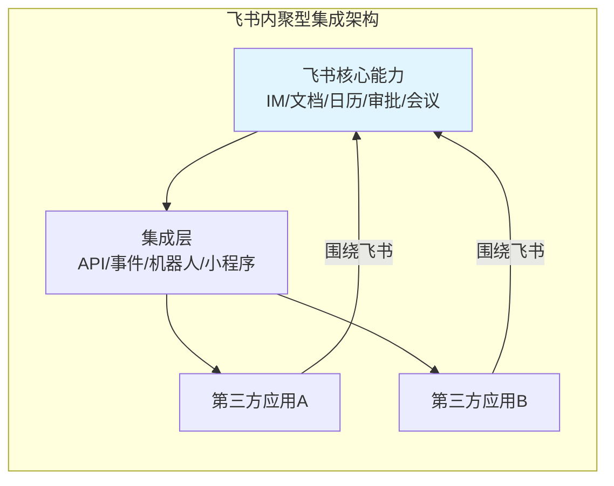

| 架构特征 | 描述 |
|---------|------|
| **平台立场** | 以自身为中心，吸引应用围绕飞书构建 |
| **集成方向** | 主要单向输出（飞书→外部），部分双向 |
| **连接器来源** | 飞书官方 API 为核心，第三方被动适配 |
| **数据归属** | 数据在飞书生态内流转 |
| **价值锚点** | 飞书作为协作入口的价值 |
| **锁定效应** | 强锁定——集成越深，迁移成本越高 |
| **自动化引擎** | 飞书内场景驱动的轻量自动化 |
| **计费模式** | 飞书订阅费包含集成能力 |
| **开放标准** | 飞书私有协议和 API 规范 |

### 1.4 飞书集成平台在飞书生态中的战略地位

飞书集成平台是飞书从"工具"走向"平台"再到"生态"的关键基础设施，其战略意义体现在三个层面：

**第一层：入口锁定**——通过集成能力将飞书打造为企业信息入口，所有业务通知、审批流程、数据流转都汇聚于飞书，形成"飞书即工作台"的用户心智。当员工的日常操作（看通知、审流程、收消息、约会议）全部在飞书完成时，飞书就成为了不可替代的入口。

**第二层：生态粘性**——通过应用市场和 ISV 生态，使飞书从单一工具升级为平台，企业一旦部署飞书+第三方应用组合，迁移成本急剧上升。飞书应用市场上的每个 ISV 应用都是一条"粘性线"，将企业更深地绑定在飞书生态中。

**第三层：数据枢纽**——通过 API 和事件体系，飞书成为企业数据流转的中枢节点，掌握组织架构、沟通、协作等核心数据。这些数据不仅支撑飞书自身的 AI 和智能能力，也使飞书成为企业数字化转型的"数据锚点"。

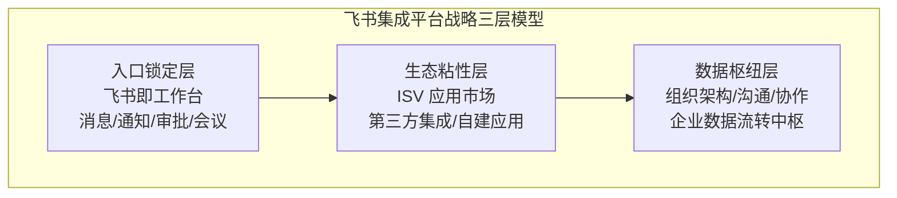

> 💡 **对 open-app 的启示**：飞书的内聚型集成策略证明，对于企业通讯平台而言，"以自身为中心"的集成模式能够有效建立生态壁垒。open-app 作为同赛道产品，应借鉴飞书的"入口锁定"思路，将自身定位为企业通讯能力的枢纽，而非简单的 API 管道。但 open-app 的枢纽定位应更聚焦——不追求成为全功能协作平台，而是成为"通讯能力"的权威来源。

### 1.5 飞书集成平台的核心价值主张

飞书集成平台的核心价值主张不是"连接你的所有应用"，而是"让飞书成为你所有应用的入口"。

| 价值维度 | 飞书的价值主张 | 核心逻辑 |
|---------|-------------|---------|
| **效率提升** | 在飞书内完成所有工作，无需切换应用 | 追求"入口统一"，所有操作汇聚于一处 |
| **体验优化** | 统一飞书交互体验，操作一致 | 平台可控的统一体验，避免体验碎片化 |
| **数据整合** | 飞书作为数据中枢，统一视图 | 汇聚数据而非透传数据，形成数据资产 |
| **成本降低** | 减少应用采购（飞书自带部分能力） | 通过平台内置能力替代独立工具 |
| **安全可控** | 数据不出飞书生态，统一安全策略 | 生态内闭环，安全策略一致可控 |

### 1.6 飞书集成平台的生态定位

在集成/连接器赛道中，飞书集成平台处于一个独特的位置——它既不是通用 iPaaS，也不是纯通讯工具，而是"带集成能力的协作平台"。这种定位使其与不同类型的产品存在不同的关系：

| 生态角色 | 描述 | 与飞书的关系 |
|---------|------|------------|
| **同赛道协作平台** | 同样以自身为中心构建集成生态的协作平台 | 直接竞争，均争夺"企业信息入口" |
| **通用 iPaaS 平台** | 中立集成中间件，连接任意应用 | 竞合——飞书自动化与通用 iPaaS 存在功能重叠，但飞书也是 iPaaS 的连接对象 |
| **企业门户** | 企业内部统一工作台 | 竞争——都是"企业信息入口"的争夺者 |

> 对 open-app 而言，飞书的生态定位提供了重要参考：作为能力型平台，与通用 iPaaS 保持合作而非竞争关系，既能通过自身集成能力覆盖高频场景，又能借助 iPaaS 生态扩展连接广度。

---

## 二、连接器能力矩阵

### 2.1 飞书作为连接器的整体架构

飞书的连接器能力体系可从"方向"和"模式"两个维度理解——方向上分为输出（飞书→外部）、输入（外部→飞书）和内部联动三类；模式上分为 API、Event、WebHook、Bot 四种。

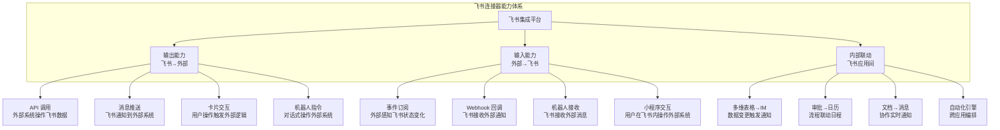

### 2.2 飞书作为"触发器"——事件订阅体系

飞书的事件订阅体系是外部系统感知飞书状态变化的核心机制。飞书的事件体系经历了从 v1 到 v2 的演进，v2 版本在安全性、可靠性和灵活性上都有显著提升。

#### 2.2.1 事件订阅架构

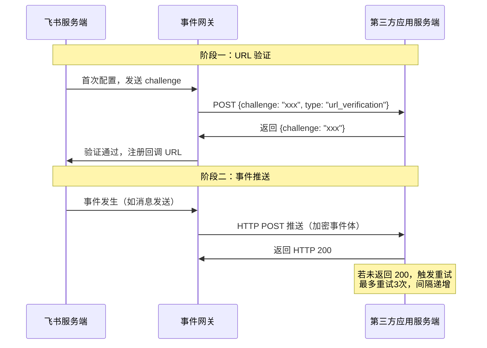

#### 2.2.2 事件类型矩阵

| 能力域 | 事件类型 | 事件示例 | 事件数量（约） | 对应 open-app Event 模式 |
|--------|---------|---------|-------------|------------------------|
| **通讯录** | 用户变更、部门变更、角色变更 | `contact.user.created_v6`、`contact.department.deleted_v6` | 20+ | Contact Event |
| **消息** | 消息接收、消息已读、消息撤回、消息反应 | `im.message.receive_v1`、`im.message.message_read_v1` | 15+ | IM Event |
| **审批** | 审批状态变更、审批任务更新 | `approval_instance`、`approval_task` | 10+ | Workflow Event |
| **日历** | 日程变更、日历变更、日历订阅 | `calendar.calendar.changed_v4`、`calendar.event.changed_v4` | 10+ | Calendar Event |
| **文档** | 文档变更、评论变更、权限变更 | `doc.document.changed`、`doc.comment.created` | 10+ | Drive Event |
| **会议** | 会议开始、会议结束、参会人变更、录制完成 | `vc.meeting.started_v1`、`vc.meeting.ended_v1` | 10+ | Meeting Event |
| **考勤** | 打卡结果、排班变更 | `attendance.user_task_updated` | 5+ | — |
| **云文档** | 文件上传、权限变更 | `drive.file.uploaded`、`drive.permission.changed` | 5+ | CloudBox Event |
| **机器人** | 机器人进群、机器人消息 | `p2p.chat_create`、`im.message.receive_v1` | 5+ | Bot Event |
| **应用** | 应用安装、应用卸载、权限变更 | `application.app.migrated` | 5+ | — |
| **任务** | 任务创建、任务完成、任务更新 | `task.task.created_v1` | 5+ | — |
| **多维表格** | 记录变更、视图变更 | `bitable.record.changed` | 5+ | — |

#### 2.2.3 事件订阅关键技术特性

| 特性 | 描述 |
|------|------|
| **事件加密** | 使用 Encryption Key 对事件内容加密，AES-256-CBC 算法，在 HTTPS 传输加密之上增加应用级加密 |
| **事件校验** | Verification Token + challenge 双重验证，确保事件来源可信 |
| **重试机制** | 未确认时最多重试 3 次，间隔递增（1s/5s/15s），保障事件可靠送达 |
| **事件过滤** | 支持按事件类型订阅，无需全量接收，降低不必要的事件推送 |
| **批量推送** | 不支持事件合并推送，每事件独立推送，逻辑简单可靠 |
| **顺序保证** | 单实体内事件有序（递增 event_id），跨实体不保证顺序 |
| **幂等处理** | 事件携带 event_id，需应用自行保证幂等，避免重复处理 |
| **版本管理** | 事件版本化（如 `_v1`、`_v6`），支持版本升级迁移，平滑演进 |

#### 2.2.4 事件订阅配置流程

1. **注册回调 URL**：在飞书开发者后台配置事件回调地址
2. **完成 URL 验证**：响应 challenge 验证请求
3. **选择事件类型**：勾选需要订阅的事件
4. **配置加密参数**：设置 Encryption Key 和 Verification Token
5. **测试事件推送**：使用开发者后台的事件模拟功能
6. **上线运行**：发布应用后事件自动推送

### 2.3 飞书作为"动作"——API 调用体系

飞书的 API 调用体系是外部系统操作飞书能力的核心机制。飞书 API 遵循 RESTful 设计规范，采用统一的认证和错误处理模型。

#### 2.3.1 API 能力矩阵

| 能力域 | 核心API | API数量（约） | 对应 open-app API 模式 | 开放成熟度 | 典型高频接口 |
|--------|--------|-------------|----------------------|----------|------------|
| **通讯录** | 用户/部门/角色/群组 CRUD | 80+ | Contact API | ⭐⭐⭐⭐⭐ | 获取用户信息、获取部门列表 |
| **即时消息** | 发送/更新/撤回消息、已读状态、表情回复 | 60+ | IM API | ⭐⭐⭐⭐⭐ | 发送消息、更新卡片 |
| **审批** | 审批定义/实例/任务/评论 | 40+ | — | ⭐⭐⭐⭐ | 发起审批、获取审批实例 |
| **日历** | 日程/日历/会议室/忙闲查询 | 50+ | Calendar API | ⭐⭐⭐⭐ | 创建日程、查询忙闲 |
| **云文档** | 文档/表格/知识库/权限 | 70+ | Drive API | ⭐⭐⭐⭐ | 创建文档、读写内容 |
| **视频会议** | 会议/录制/会议室/白板 | 40+ | Meeting API | ⭐⭐⭐⭐ | 创建会议、获取参会者 |
| **邮件** | 邮件/邮件组/规则 | 20+ | Mail API | ⭐⭐⭐ | 发送邮件、查询邮件 |
| **多维表格** | 数据表/记录/视图/字段 | 50+ | — | ⭐⭐⭐⭐⭐ | 增删改查记录 |
| **机器人** | 机器人管理/消息/交互 | 20+ | Bot API | ⭐⭐⭐⭐ | 机器人发消息 |
| **任务** | 任务/任务列表/评论 | 20+ | — | ⭐⭐⭐ | 创建任务 |
| **考勤** | 打卡/排班/统计 | 15+ | — | ⭐⭐⭐ | 获取打卡结果 |
| **人事** | 花名册/入职/离职 | 15+ | — | ⭐⭐⭐ | 查询花名册 |
| **搜索** | 全文搜索/消息搜索 | 5+ | — | ⭐⭐ | 搜索消息 |

#### 2.3.2 API 调用模式

| 调用模式 | 描述 | 典型场景 | 速率限制 |
|---------|------|---------|---------|
| **单次调用** | 标准 REST API 调用，请求-响应模式 | 获取用户信息、发送单条消息 | 依接口而定 |
| **批量调用** | 通过 batch API 一次处理多个资源 | 批量创建用户、批量发送消息 | 较低频限制 |
| **分页查询** | page_token 分页机制，支持游标迭代 | 获取部门列表、查询消息记录 | 每页最多 50 条 |
| **长轮询** | 部分场景支持长连接获取实时数据 | 消息事件获取 | — |
| **文件流** | 文件上传下载通过流式传输 | 云文档上传、图片上传 | 文件大小限制 |
| **异步任务** | 长时间运行的任务返回 task_id，轮询获取结果 | 批量导出、大数据量处理 | — |

#### 2.3.3 API 权限与范围

飞书 API 采用细粒度权限控制（scope），每个 API 调用需要对应的权限授权：

| 权限类型 | scope 示例 | 获取方式 | 有效期 |
|---------|-----------|---------|--------|
| **通讯录读取** | `contact:user.base:readonly` | 管理员后台授权 | 应用生命周期 |
| **消息发送** | `im:message:send_as_bot` | 应用自含（创建即有） | 应用生命周期 |
| **消息读取** | `im:message` | 用户 OAuth 授权 | 2 小时（可刷新） |
| **审批管理** | `approval:approval` | 管理员后台授权 | 应用生命周期 |
| **日历读写** | `calendar:calendar` | 用户 OAuth 授权 | 2 小时（可刷新） |
| **文档读写** | `docx:document` | 用户 OAuth 授权 | 2 小时（可刷新） |
| **会议管理** | `vc:meeting` | 管理员后台授权 | 应用生命周期 |

**Token 体系**：

| Token 类型 | 用途 | 获取方式 | 有效期 |
|-----------|------|---------|--------|
| **app_access_token** | 应用级 API 调用 | App ID + App Secret | 2 小时 |
| **tenant_access_token** | 租户级 API 调用（最常用） | app_access_token + tenant_key | 2 小时 |
| **user_access_token** | 用户级 API 调用 | OAuth 授权码 | 2 小时（可刷新） |


#### 2.3.4 API 生命周期管理

飞书对 API 的生命周期管理体现了其作为成熟开放平台的最佳实践：

| 生命周期阶段 | 管理策略 | 对开发者的影响 |
|------------|---------|-------------|
| **设计期** | API 设计遵循 RESTful 规范，统一资源命名、错误码、分页模型 | 学习成本低，一套规范适用所有 API |
| **发布期** | 新 API 通过开发者社区和 Changelog 提前预告 | 开发者可提前适配 |
| **稳定期** | API 接口签名不变，行为向后兼容 | 生产环境稳定可靠 |
| **废弃期** | 废弃 API 提前 6 个月通知，同时提供替代方案 | 有充足的迁移时间 |
| **下线期** | 废弃 API 下线后仍保留错误响应（410 Gone） | 避免静默失败 |

#### 2.3.5 API 错误处理模型

飞书采用统一的错误响应格式，所有 API 返回一致的结构：

| 错误级别 | HTTP 状态码 | 错误码范围 | 处理建议 |
|---------|-----------|----------|---------|
| **客户端错误** | 400 | -1 ~ -99 | 检查请求参数 |
| **认证错误** | 401/403 | 10001 ~ 19999 | 检查 Token 和权限 |
| **频率限制** | 429 | 99991400 | 实现退避重试 |
| **服务端错误** | 500 | 20001 ~ 29999 | 重试或联系支持 |
| **业务错误** | 200（含业务错误码） | 各 API 自定义 | 根据错误码处理 |

### 2.4 飞书内部应用间的连接能力

飞书最大的集成优势在于其内部应用之间的无缝联动，这是内聚型平台独有的"内聚型连接"。由于飞书所有内部应用共享同一套身份体系、数据模型和事件总线，内部应用间的联动天然具备零延迟、零数据丢失、零配置的特性。

#### 2.4.1 内部联动矩阵

| 源应用 | 目标应用 | 联动方式 | 典型场景 | 联动延迟 |
|--------|---------|---------|---------|---------|
| **多维表格** | IM | 记录变更→发送消息通知 | 项目状态更新自动通知团队 | <1s |
| **多维表格** | 审批 | 记录变更→发起审批 | 采购申请自动触发审批流 | <2s |
| **多维表格** | 日历 | 记录日期→创建日程 | 项目里程碑自动创建日程 | <2s |
| **审批** | 日历 | 审批通过→创建日程 | 请假审批通过→自动创建日历事件 | <2s |
| **审批** | IM | 审批状态变更→推送消息 | 审批结果实时通知 | <1s |
| **审批** | 云文档 | 审批附件→关联文档 | 审批单中嵌入文档链接 | 即时 |
| **日历** | 会议 | 日程→快速创建会议 | 日历事件一键转为视频会议 | <2s |
| **日历** | IM | 日程邀请→消息通知 | 会议邀请自动发送消息 | <1s |
| **文档** | IM | 文档评论/提及→消息推送 | 文档协作实时通知 | <1s |
| **IM** | 云文档 | 消息中的文件→保存到云盘 | 聊天文件自动归档 | 即时 |
| **多维表格** | 仪表盘 | 数据变更→仪表盘更新 | 业务数据实时可视化 | <3s |
| **机器人** | 多维表格 | 机器人指令→写入记录 | 通过对话录入数据 | <2s |
| **搜索** | 全域 | 统一搜索入口 | 跨应用内容搜索 | <1s |
| **会议** | IM | 会议开始→发送提醒 | 会议前5分钟自动提醒 | 即时 |
| **邮件** | IM | 新邮件→消息通知 | 重要邮件飞书提醒 | <5s |

#### 2.4.2 内部联动技术实现

飞书内部应用间的联动主要通过以下四大技术机制实现：

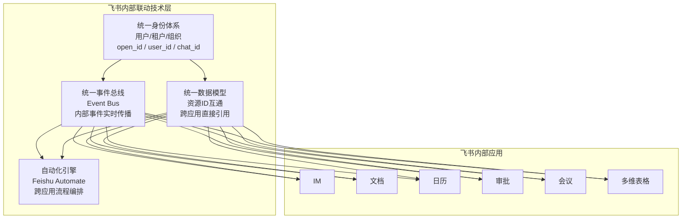

- **统一身份体系**：所有飞书应用共享同一套用户和组织架构，无需额外同步。跨应用引用用户时使用统一的 open_id/user_id
- **统一事件总线**：飞书内部所有应用的状态变更都通过内部事件总线传播，延迟极低（<1s）
- **统一数据模型**：飞书内部应用使用统一的资源 ID 体系（如 user_id、chat_id、doc_id、calendar_id），应用间可直接引用，无需 ID 映射
- **自动化引擎**：飞书自动化作为内部集成的编排层，实现跨应用流程自动化，无需开发者编写代码

#### 2.4.3 内部联动的技术优势

飞书内部联动凭借统一的身份、事件和数据体系，具有以下技术优势：

| 优势维度 | 描述 |
|---------|------|
| **超低延迟** | 内部事件总线传播，延迟 <1s，远优于外部 HTTP 往返的集成方式 |
| **极高可靠性** | 内部调用保障，可靠性达 99.99%，不受网络波动影响 |
| **零配置互通** | 内部应用天然互通，无需配置连接器和映射关系 |
| **强数据一致性** | 同一数据模型下操作，保证强一致性，无异步同步延迟 |
| **零代码实现** | 大部分联动通过自动化引擎或内置机制实现，无需开发 |

这些优势是内聚型平台架构的自然产物——当所有应用共享同一套基础设施时，跨应用联动就变成了内部调用而非外部集成。

### 2.5 飞书与外部应用的连接能力

#### 2.5.1 预置集成

飞书应用市场中已存在大量预置集成应用，这些应用由飞书官方或 ISV 开发，实现了飞书与外部系统的开箱即用连接。

| 集成类别 | 代表应用 | 集成深度 | 集成方式 | 用户规模 |
|---------|---------|---------|---------|---------|
| **项目管理** | Jira、Teambition、Tower、Asana、Monday | 深度双向 | API + 事件 + 机器人 + 小程序 | 大 |
| **代码管理** | GitHub、GitLab、Bitbucket | 中度双向 | Webhook + 机器人通知 + API | 大 |
| **CRM** | Salesforce、纷享销客、销售易 | 中度双向 | API + 事件 + 审批 | 中 |
| **HR** | 北森、Moka、薪人薪事 | 深度单向 | 通讯录同步 + 审批对接 + 消息通知 | 中 |
| **财务** | 金蝶、用友 | 中度单向 | 审批+报表推送+消息通知 | 中 |
| **OA** | 泛微、致远、蓝凌 | 深度双向 | API + 审批 + 消息 + 日历 | 大 |
| **设计** | Figma、蓝湖、即时设计 | 轻度双向 | 消息通知 + 文件同步 + 评论联动 | 中 |
| **监控** | Zabbix、Prometheus、Grafana | 轻度单向 | 告警→飞书消息/卡片 | 中 |
| **CI/CD** | Jenkins、Bamboo、CircleCI | 轻度单向 | 构建通知→飞书消息/卡片 | 大 |
| **AI/智能** | 智谱、百川、MiniMax | 能力集成 | API 调用 + 机器人 | 增长中 |
| **邮件** | 腾讯企业邮、网易邮箱 | 中度双向 | 邮件通知→消息 | 中 |
| **云存储** | AWS S3、阿里云 OSS | 轻度单向 | 文件同步 | 小 |

#### 2.5.2 自定义集成

对于飞书应用市场中未覆盖的外部系统，开发者可通过以下方式实现自定义集成：

| 集成方式 | 适用场景 | 开发复杂度 | 灵活度 | 典型开发周期 |
|---------|---------|----------|--------|------------|
| **API 直接调用** | 外部系统主动操作飞书 | 低 | 高 | 1-3 天 |
| **事件订阅** | 飞书状态变更触发外部逻辑 | 低 | 中 | 1-2 天 |
| **Webhook 机器人** | 简单消息推送场景 | 极低 | 低 | 0.5 天 |
| **自建应用** | 深度集成，需要完整交互 | 中 | 高 | 1-2 周 |
| **小程序** | 需要在飞书内提供交互界面 | 高 | 极高 | 2-4 周 |
| **开放平台 MCP** | AI 场景下的工具调用 | 中 | 高 | 1-2 周 |

#### 2.5.3 自定义集成开发流程

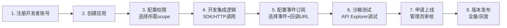

### 2.6 连接器能力与 open-app 四种开放模式的映射

| open-app 开放模式 | 飞书对应能力 | 映射完整度 | 差距分析 |
|------------------|------------|----------|---------|
| **API** | 飞书 RESTful API 体系（500+ 接口） | ⭐⭐⭐⭐⭐ | 飞书 API 覆盖全面，映射完整，可作为 open-app API 设计的参考模板 |
| **Event** | 飞书事件订阅体系（v2，100+ 事件） | ⭐⭐⭐⭐ | 飞书事件覆盖广，但部分场景（如邮件、Phone）事件较少 |
| **WebHook** | 飞书 Webhook 机器人 + 回调 | ⭐⭐⭐ | 飞书 WebHook 仅支持群消息推送，不支持通用回调，这是最大的差距 |
| **Bot** | 飞书机器人框架（自建+第三方） | ⭐⭐⭐⭐⭐ | 飞书机器人能力成熟，支持交互卡片、指令、群管理等 |

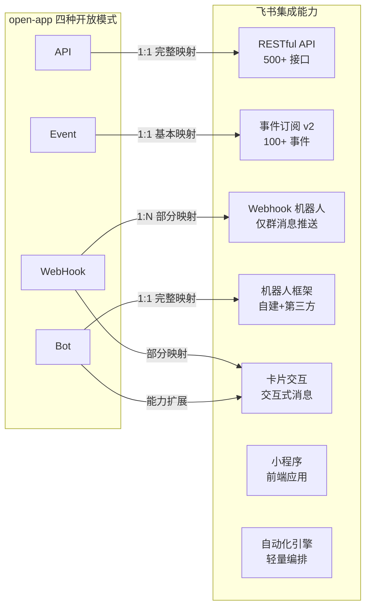

> 💡 **对 open-app 的启示**：飞书的连接器体系验证了 API + Event + Bot 三驾马车的完备性，但 WebHook 在飞书中仅作为轻量消息推送通道，功能有限。open-app 应将 WebHook 提升为通用回调机制（类似 Stripe Webhooks），而不仅是消息推送，这可以成为差异化优势。同时，飞书的"内部联动"能力是外部集成平台无法复制的，open-app 应充分利用自身 Provider 一体化优势，实现 IM/Meeting/Calendar 等能力间的深度联动，构建"通讯场景联动壁垒"。

---

## 三、自动化工作流引擎

### 3.1 飞书自动化能力架构

飞书自动化（Feishu Automate）是飞书内置的低代码工作流编排工具，允许用户在飞书内部构建跨应用的自动化流程。飞书自动化的设计边界限定在飞书生态内部，是一种"场景化自动化"而非"通用自动化"。

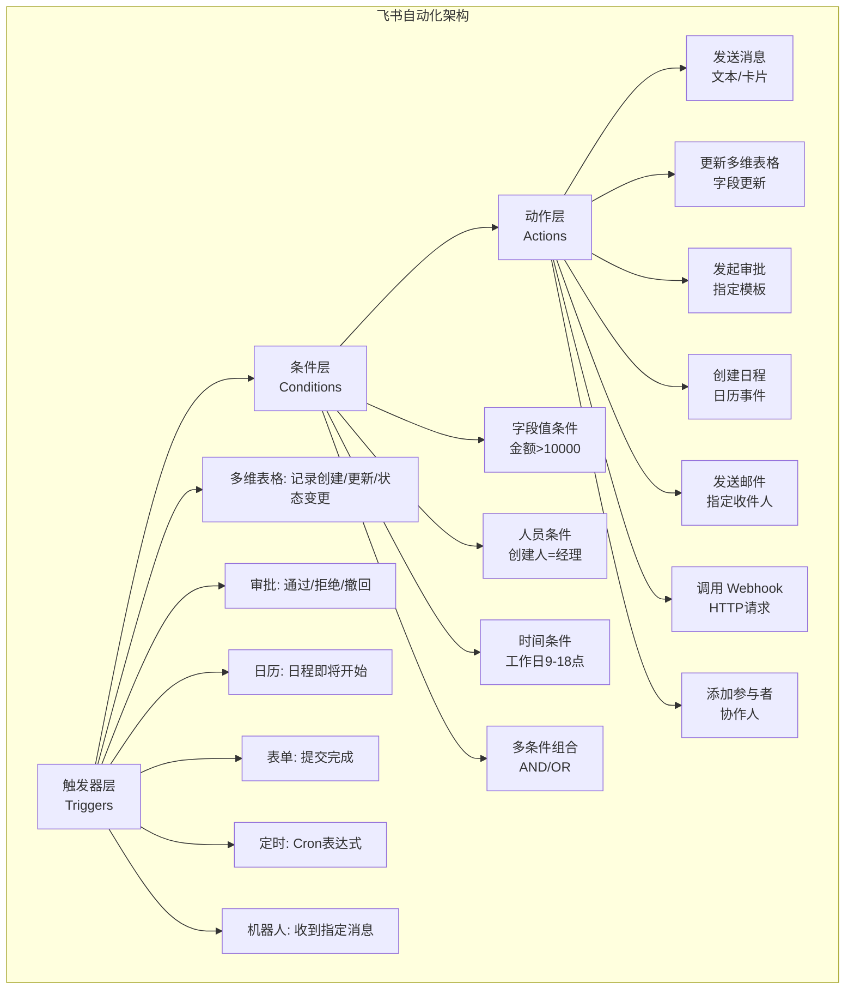

### 3.2 触发器类型和条件配置

#### 3.2.1 触发器类型全景

| 触发器来源 | 触发器类型 | 描述 | 可配置参数 |
|-----------|----------|------|----------|
| **多维表格** | 记录创建 | 新记录被添加到表格 | 表格ID、视图 |
| **多维表格** | 记录更新 | 现有记录字段值变更 | 表格ID、字段 |
| **多维表格** | 记录状态变更 | 记录流转到指定状态 | 表格ID、源状态→目标状态 |
| **审批** | 审批通过 | 审批实例通过 | 审批定义Code |
| **审批** | 审批拒绝 | 审批实例被拒绝 | 审批定义Code |
| **审批** | 审批撤回 | 审批实例被撤回 | 审批定义Code |
| **日历** | 日程即将开始 | 日程开始前 N 分钟 | 提前时间 |
| **表单** | 表单提交完成 | 飞书表单收到新提交 | 表单ID |
| **定时** | 定时触发 | 按 Cron 表达式定时执行 | Cron 表达式 |
| **机器人** | 收到指定消息 | 机器人接收到特定关键词 | 关键词、群ID |

#### 3.2.2 条件配置详解

| 条件类型 | 描述 | 支持运算符 | 示例 |
|---------|------|----------|------|
| **字段值条件** | 当指定字段满足条件时执行 | 等于/不等于/大于/小于/包含/为空 | `金额 > 10000` |
| **人员条件** | 当操作人是/不是指定人员时执行 | 是/不是/属于部门 | `创建人 = 部门经理` |
| **时间条件** | 当时间满足条件时执行 | 工作日/休息日/时间段 | `工作日 且 9:00-18:00` |
| **多条件组合** | AND/OR 组合条件 | AND/OR 嵌套 | `金额 > 10000 AND 类型 = 采购` |

### 3.3 动作类型和流程编排

#### 3.3.1 动作类型全景

| 动作类型 | 目标应用 | 具体操作 | 参数配置 | 对应 open-app 模式 |
|---------|---------|---------|---------|-------------------|
| **发送消息** | IM | 发送文本/卡片消息到指定群/个人 | 接收人、消息内容/卡片模板 | IM API / Bot |
| **更新记录** | 多维表格 | 更新指定记录的字段值 | 表格ID、记录ID、字段值 | — |
| **创建记录** | 多维表格 | 在指定表格中创建新记录 | 表格ID、字段值 | — |
| **发起审批** | 审批 | 根据模板发起审批流程 | 审批Code、申请人、表单数据 | — |
| **创建日程** | 日历 | 创建新的日历事件 | 日历ID、标题、时间、参与者 | Calendar API |
| **发送邮件** | 邮件 | 发送邮件到指定收件人 | 收件人、主题、正文 | Mail API |
| **调用 Webhook** | 外部系统 | 向外部 URL 发送 HTTP 请求 | URL、方法、Header、Body | WebHook |
| **添加参与者** | 多维表格 | 为记录添加协作人 | 记录ID、用户ID | — |
| **修改字段** | 多维表格 | 批量更新字段值 | 字段名、新值 | — |

#### 3.3.2 流程编排模式

飞书自动化支持以下编排模式：

| 编排模式 | 描述 | 飞书支持情况 |
|---------|------|------------|
| **线性流程** | 触发→条件→动作，单线执行 | ✅ 完整支持 |
| **条件分支** | 根据条件走不同路径 | ✅ IF/ELSE |
| **并行执行** | 多个动作同时执行 | ❌ 不支持 |
| **循环迭代** | 对列表数据逐条处理 | ❌ 不支持 |
| **子流程调用** | 调用其他自动化流程 | ❌ 不支持 |
| **错误处理** | 执行失败时的异常处理 | ❌ 不支持 |
| **延迟等待** | 流程中等待指定时间 | ✅ 支持 |
| **数据转换** | 格式转换和数据映射 | ⚠️ 有限字段映射 |
| **变量传递** | 步骤间传递数据 | ✅ 动态变量 |
| **调试模式** | 步骤执行调试 | ❌ 不支持 |

#### 3.3.3 飞书自动化典型流程示例

**示例：采购审批自动化**

```
触发器：多维表格「采购申请」- 记录状态变更为「待审批」
  ↓
条件：金额 > 50000
  ↓ 是 → 动作1：发起审批（总经理审批模板）
  ↓ 否 → 动作2：发起审批（部门经理审批模板）
  ↓
触发器：审批通过
  ↓
动作：发送消息到「采购群」（卡片消息，含采购详情）
  ↓
动作：更新多维表格记录状态为「已批准」
```

### 3.4 飞书自动化的能力边界与局限

飞书自动化作为场景化的轻量编排工具，存在明确的能力边界，这些边界既是架构选择的结果，也是"内聚型"平台定位的自然体现：

| 边界维度 | 具体限制 | 影响 | 规避方案 |
|---------|---------|------|---------|
| **触发器范围** | 仅支持飞书内部应用作为触发器 | 无法响应外部系统事件 | 外部系统通过 Webhook API 触发飞书自动化 |
| **动作范围** | 仅支持飞书内部动作 + 通用 Webhook 出站 | 无法直接操作外部系统 | 通过 Webhook 动作调用外部系统 API |
| **编排复杂度** | 不支持循环、并行、子流程 | 无法处理批量数据和复杂逻辑 | 拆分为多个简单自动化，或借助外部编排工具 |
| **数据转换** | 仅支持简单字段映射 | 无法进行复杂格式转换 | 在外部系统侧完成数据转换 |
| **错误处理** | 无异常捕获和重试机制 | 流程失败后无法自动恢复 | 手动监控和干预 |
| **执行监控** | 缺少执行日志和调试能力 | 问题排查困难 | 通过消息通知间接监控 |
| **版本管理** | 无流程版本控制 | 无法回滚到历史版本 | 手动备份配置 |
| **速率限制** | 未公开具体限制，但存在阈值 | 高频场景可能被限流 | 控制触发频率 |
| **跨表格联动** | 多维表格间的联动能力有限 | 复杂跨表逻辑难以实现 | 使用飞书自动化+Webhook 组合 |

飞书自动化的定位清晰：它不是通用流程编排引擎，而是飞书场景内的快捷自动化工具。对于超出其能力边界的复杂集成场景，需要借助通用 iPaaS 等外部编排工具来实现。

> 💡 **对 open-app 的启示**：飞书自动化的"轻量化"策略值得注意——它没有试图成为通用自动化平台，而是聚焦于飞书内部的场景化自动化。这种策略降低了用户门槛，但牺牲了编排灵活性。open-app 可采用**"双引擎"策略**：内置轻量自动化引擎覆盖高频场景（如审批→通知、会议→日历、状态→消息），同时通过开放 API 与第三方 iPaaS 深度对接，实现复杂编排。这种"内轻外重"的架构既保证了易用性，又不失扩展性。

---

## 四、开发者体验与 SDK

### 4.1 飞书集成开发工具链

飞书为开发者提供了一套完整的集成开发工具链，覆盖从应用创建到调试测试到发布上线的全生命周期：

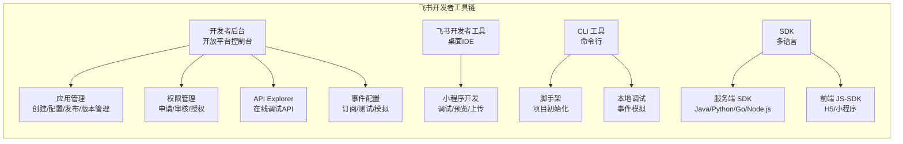

| 工具 | 用途 | 成熟度 |
|------|------|--------|
| **开发者后台** | 应用全生命周期管理（创建/配置/权限/版本/发布） | ⭐⭐⭐⭐⭐ |
| **API Explorer** | 在线 API 调试，支持参数填充和实时响应查看 | ⭐⭐⭐⭐ |
| **飞书开发者工具** | 小程序开发调试（类似微信开发者工具） | ⭐⭐⭐⭐ |
| **CLI 工具** | 项目脚手架和本地调试 | ⭐⭐⭐ |
| **服务端 SDK** | 多语言开发包（Java/Python/Go/Node.js） | ⭐⭐⭐⭐ |
| **JS-SDK** | 前端能力调用（H5/小程序） | ⭐⭐⭐⭐ |

### 4.2 SDK 覆盖

| 语言 | SDK 名称/包 | 功能覆盖 | 维护频率 | 文档质量 | 社区活跃度 | GitHub Star |
|------|-----------|---------|---------|---------|----------|------------|
| **Java** | `larksuite-oapi` | ⭐⭐⭐⭐⭐（全API+事件） | 高（月更） | ⭐⭐⭐⭐⭐ | 高 | 200+ |
| **Python** | `lark-oapi` | ⭐⭐⭐⭐（全API+事件） | 中（季度更） | ⭐⭐⭐⭐ | 中 | 100+ |
| **Go** | `lark-oapi/go-sdk` | ⭐⭐⭐⭐（全API+事件） | 中（季度更） | ⭐⭐⭐⭐ | 中 | 80+ |
| **Node.js** | `@larksuiteoapi/node-sdk` | ⭐⭐⭐⭐（全API+事件） | 中（季度更） | ⭐⭐⭐⭐ | 中 | 60+ |
| **C#/.NET** | 社区维护 | ⭐⭐⭐（部分API） | 低 | ⭐⭐⭐ | 低 | — |
| **PHP** | 社区维护 | ⭐⭐（基础API） | 低 | ⭐⭐ | 低 | — |

**SDK 功能覆盖度**：

| SDK 功能 | Java | Python | Go | Node.js |
|---------|------|--------|-----|---------|
| **API 调用** | ✅ 全量 | ✅ 全量 | ✅ 全量 | ✅ 全量 |
| **事件订阅** | ✅ 完整 | ✅ 完整 | ✅ 完整 | ✅ 完整 |
| **Token 管理** | ✅ 自动刷新 | ✅ 自动刷新 | ✅ 自动刷新 | ✅ 自动刷新 |
| **消息卡片** | ✅ 模板构建 | ✅ 模板构建 | ✅ 模板构建 | ✅ 模板构建 |
| **错误处理** | ✅ 统一异常 | ✅ 统一异常 | ✅ 统一异常 | ✅ 统一异常 |
| **日志记录** | ✅ 可配置 | ✅ 可配置 | ✅ 可配置 | ✅ 可配置 |
| **类型安全** | ✅ 强类型 | ✅ 类型提示 | ✅ 强类型 | ✅ TypeScript |
| **小程序** | ❌ | ❌ | ❌ | ❌ |

**SDK 典型使用示例（Go）**：

```go
import (
    lark "github.com/larksuite/oapi-sdk-go/v3"
    larkim "github.com/larksuite/oapi-sdk-go/v3/service/im/v1"
)

client := lark.NewClient("app_id", "app_secret",
    lark.WithEventCallbackVer("v2.0"),
    lark.WithLogReqAtDebug(true),
)

resp, err := client.Im.Message.Create(context.Background(),
    larkim.NewCreateMessageReqBuilder().
        MsgType(larkim.MsgTypeText).
        ReceiveIdType(larkim.ReceiveIdTypeChatId).
        ReceiveId("oc_xxx").
        ContentText("Hello from SDK").
        Build(),
)
```

### 4.3 调试和测试能力

| 能力 | 描述 | 成熟度 |
|------|------|--------|
| **API Explorer** | 在线调试 API，支持参数填充、实时响应、示例代码生成 | ⭐⭐⭐⭐ |
| **事件模拟** | 开发者后台可模拟事件推送，测试事件处理逻辑 | ⭐⭐⭐ |
| **沙箱环境** | 提供测试企业用于应用开发调试，不影响生产数据 | ⭐⭐⭐⭐ |
| **日志查看** | 开发者后台查看 API 调用日志和事件推送日志 | ⭐⭐⭐ |
| **Webhook 调试** | 支持手动触发 Webhook 测试 | ⭐⭐⭐ |
| **版本管理** | 应用版本控制，支持灰度发布和回滚 | ⭐⭐⭐⭐ |
| **性能监控** | API 调用统计、错误率、延迟分布 | ⭐⭐⭐ |

### 4.4 飞书集成开发体验特征

飞书集成开发体验的核心特征是**代码优先**——开发者使用 SDK 和 API 进行深度集成，而非可视化拖拽编排。这种模式的特点如下：

| 特征维度 | 飞书集成开发体验 |
|---------|---------------|
| **开发模式** | 代码优先（SDK + API） |
| **开发门槛** | 中（需编程能力） |
| **调试能力** | API Explorer + 沙箱 + 日志 |
| **文档质量** | 优秀（中英文档、示例代码） |
| **社区支持** | 活跃（GitHub/开发者论坛） |
| **部署方式** | 自行部署（自有服务器） |
| **目标开发者** | 专业开发者（后端工程师） |
| **开发周期** | 1-4 周 |
| **扩展性** | 高（代码级灵活性） |

飞书选择代码优先而非可视化优先，是因为企业通讯平台的集成开发者通常是后端工程师，他们需要深度控制和高度灵活性——将消息发送与业务系统联动、将审批流程与 CRM 对接等场景，都需要代码级别的定制能力，而非低代码模板所能覆盖。

### 4.5 开发者上手路径分析

飞书为不同类型的开发者设计了差异化的上手路径，这种"渐进式揭示"的体验设计值得 open-app 借鉴：

| 开发者类型 | 首次集成方式 | 学习内容 | 上手时间 | 进阶路径 |
|-----------|------------|---------|---------|---------|
| **运维人员** | Webhook 机器人 | 配置 Webhook URL + 消息模板 | 5 分钟 | → 交互卡片 |
| **前端工程师** | 小程序开发 | JS-SDK + 组件库 + 开发者工具 | 1-2 天 | → 服务端 API 联调 |
| **后端工程师** | 服务端 API + 事件订阅 | SDK + API 文档 + 事件回调 | 2-3 天 | → 机器人 + 卡片交互 |
| **ISV 开发者** | 完整应用开发 | 全部能力 + 应用市场规范 | 1-2 周 | → 上架应用市场 |

**飞书开发者上手"黄金路径"**：

```
Step 1: 创建应用（开发者后台，1 分钟）
   ↓
Step 2: 获取 Token（App ID + App Secret，1 分钟）
   ↓
Step 3: 调用第一个 API（API Explorer 在线调试，5 分钟）
   ↓
Step 4: 配置事件订阅（接收第一个事件，10 分钟）
   ↓
Step 5: 创建机器人（实现消息收发，30 分钟）
   ↓
Step 6: 设计交互卡片（卡片消息 + 回调，1 小时）
   ↓
Step 7: 集成测试（沙箱环境，2-4 小时）
   ↓
Step 8: 申请上线（管理员审核，1-3 天）
```

这条黄金路径的设计核心是：**每一步都有即时反馈**——Step 3 在 API Explorer 中可立即看到响应结果，Step 4 事件模拟可立即验证回调逻辑，Step 5 机器人可立即在飞书客户端看到消息。这种即时反馈机制极大降低了开发者的挫败感。

> 💡 **对 open-app 的启示**：飞书的"代码优先"开发模式适合专业开发者进行深度集成。这说明企业通讯平台的集成开发者更倾向于使用 SDK 和 API 进行深度集成，而非低代码编排。open-app 应优先投入 SDK 和 API 文档的建设，同时提供 API Explorer 和沙箱环境，降低开发者的试错成本。可视化编排可作为补充能力（通过 iPaaS 合作实现），而非核心建设方向。

---

## 五、生态策略

### 5.1 飞书应用市场中的集成类应用

飞书应用市场是飞书集成生态的核心载体，集成类应用是其中的重要组成部分。截至 2025 年，飞书应用市场上的应用总数超过 1000 款，其中集成类应用占比约 40%。

#### 5.1.1 应用市场结构

| 应用类别 | 数量（约） | 集成属性 | 典型应用 | 用户活跃度 |
|---------|----------|---------|---------|----------|
| **项目管理** | 100+ | 高度集成 | Jira、Teambition、Tower、Asana | ⭐⭐⭐⭐⭐ |
| **HR/人事** | 50+ | 深度集成 | 北森、Moka、薪人薪事、2号人事 | ⭐⭐⭐⭐ |
| **OA/审批** | 40+ | 深度集成 | 泛微、致远、蓝凌、氚云 | ⭐⭐⭐⭐⭐ |
| **CRM/销售** | 30+ | 中度集成 | 纷享销客、销售易、红圈营销 | ⭐⭐⭐ |
| **财务/ERP** | 30+ | 中度集成 | 金蝶、用友、每刻报销 | ⭐⭐⭐ |
| **研发/DevOps** | 60+ | 轻度集成 | GitHub、GitLab、Jenkins、SonarQube | ⭐⭐⭐⭐ |
| **设计/创意** | 20+ | 轻度集成 | Figma、蓝湖、即时设计 | ⭐⭐⭐ |
| **数据分析** | 30+ | 数据集成 | 数据观、帆软、观远数据 | ⭐⭐⭐ |
| **AI/智能** | 40+ | 能力集成 | 智谱、百川、MiniMax、月之暗面 | ⭐⭐⭐⭐（增长中） |
| **效率工具** | 50+ | 功能增强 | 腾讯文档、WPS、语雀 | ⭐⭐⭐⭐⭐ |
| **其他** | 100+ | 混合 | 签名、问卷、营销、直播等 | ⭐⭐⭐ |

#### 5.1.2 集成类应用的典型集成深度

| 集成深度 | 描述 | 能力使用 | 占比 | 开发成本 |
|---------|------|---------|------|---------|
| **浅层集成** | 仅消息通知，单向推送 | Webhook 机器人 | ~40% | 0.5-1 天 |
| **中度集成** | 双向数据同步，有限交互 | API + 事件订阅 + 消息 | ~35% | 1-2 周 |
| **深度集成** | 流程级联动，丰富交互 | API + 事件 + 审批 + 机器人 + 卡片 | ~20% | 2-4 周 |
| **原生集成** | 飞书内完整体验 | 全部能力 + 小程序 + 自动化 | ~5% | 1-3 月 |

### 5.2 ISV 合作模式和分成机制

| 合作维度 | 飞书策略 |
|---------|---------|
| **入驻模式** | ISV 在飞书开放平台注册开发者，创建应用并提交上架审核，ISV 自主性较强（自建应用而非仅封装连接器） |
| **分成机制** | 飞书不收取应用交易佣金，ISV 自主定价和收费 |
| **流量分发** | 飞书应用市场提供搜索、推荐、分类、排行榜等流量入口 |
| **技术支持** | 飞书提供 ISV 专属技术支持通道、开发文档、SDK、定期培训 |
| **认证体系** | 飞书 ISV 认证（能力认证、安全认证），提升可信度 |
| **数据归属** | ISV 应用数据归 ISV 所有，飞书不触碰 ISV 业务数据 |
| **计费模式** | ISV 自主选择（SaaS 订阅/按量/免费增值） |

### 5.3 飞书原生应用 vs 第三方集成的差异

| 对比维度 | 飞书原生应用 | 第三方集成应用 |
|---------|------------|-------------|
| **数据访问** | 直接访问飞书内部数据，无权限限制，延迟极低 | 需通过 API 获取，受权限模型约束，有网络延迟 |
| **性能** | 内部调用，无网络开销，响应 <10ms | 外部 API 调用，存在延迟 100-500ms |
| **功能深度** | 功能最完整，支持所有交互模式和最新特性 | 受 API 开放度限制，部分新功能无法立即使用 |
| **用户体验** | 原生嵌入飞书 UI，无缝体验，操作流畅 | 通过小程序/H5 嵌入，体验有差异，加载有延迟 |
| **可靠性** | 飞书内部保障，SLA 最高（99.99%） | 依赖第三方服务，可靠性不可控 |
| **迭代速度** | 跟随飞书版本发布，最快获得新能力 | ISV 自主迭代，可能滞后数周至数月 |
| **数据安全** | 数据不离开飞书，安全可控 | 数据流转到第三方服务器，需评估安全风险 |
| **定价** | 包含在飞书订阅费中 | 独立计费，可能增加使用成本 |
| **定制化** | 统一体验，定制空间有限 | 可根据企业需求定制 |

### 5.4 生态锁定策略分析

飞书的生态锁定策略体现在多个层面，形成了一个从浅到深的锁定梯度：

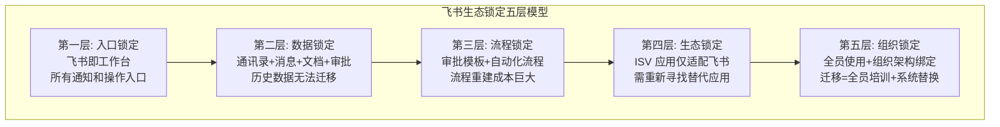

| 锁定层级 | 锁定机制 | 迁移成本 | 对用户的影响 | 可替代性 |
|---------|---------|---------|------------|---------|
| **入口锁定** | 飞书作为统一工作台，所有通知和操作入口 | 低 | 用户习惯飞书入口，不愿切换 | 高（同类协作平台可替代） |
| **数据锁定** | 消息记录、文档、审批数据存储在飞书 | 中高 | 数据导出困难，历史数据无法迁移 | 中（可导出部分数据） |
| **流程锁定** | 审批模板、自动化流程在飞书内定义 | 高 | 流程重建成本巨大 | 低（需完全重建） |
| **生态锁定** | ISV 应用仅适配飞书，无法迁移到其他平台 | 高 | 需要重新寻找替代应用 | 低（应用不可迁移） |
| **组织锁定** | 全员使用飞书，组织架构深度绑定 | 极高 | 迁移意味着全员培训+系统替换 | 极低（组织级变更） |


### 5.5 飞书集成生态的商业模式

飞书集成生态的商业模式与其内聚型定位紧密相关，核心逻辑是"通过集成能力提升飞书订阅价值"：

| 收入来源 | 描述 | 与集成能力的关系 |
|---------|------|---------------|
| **飞书订阅费** | 企业版/旗舰版按人头收费 | 集成能力是订阅版本的核心差异化（如应用数量、API 调用量） |
| **应用市场分成** | 部分付费应用抽取平台费 | 集成类应用是付费应用的重要组成 |
| **专业服务** | 飞书实施顾问服务 | 集成实施是专业服务的重要场景 |
| **ISV 生态增值** | ISV 应用带动飞书用户增长 | 集成能力吸引 ISV 入驻 |

飞书商业模式的核心特征是**集成能力作为订阅增值**，而非独立产品计费。这与通用 iPaaS 平台将集成能力作为核心收费对象形成本质区别——飞书的集成能力是为了驱动飞书订阅收入，而非直接通过集成操作量盈利。

> 💡 **对 open-app 的启示**：飞书的五层生态锁定模型对 open-app 具有重要参考价值。open-app 应特别关注"流程锁定"和"生态锁定"两层——前者通过自动化引擎实现，后者通过 ISV 合作实现。但 open-app 作为能力开放平台，锁定策略应更加克制和开放：在保证自身价值锚点的同时，避免过度锁定引发用户反感。建议采用"能力锁定"而非"数据锁定"——用户因为 open-app 的通讯能力不可替代而留下，而非因为数据被锁死。同时，提供标准化的数据导出 API 和迁移工具，反而能降低用户的决策门槛。

---

## 六、与 open-app 的对比和启示

### 6.1 飞书集成架构 vs open-app 开放架构对比

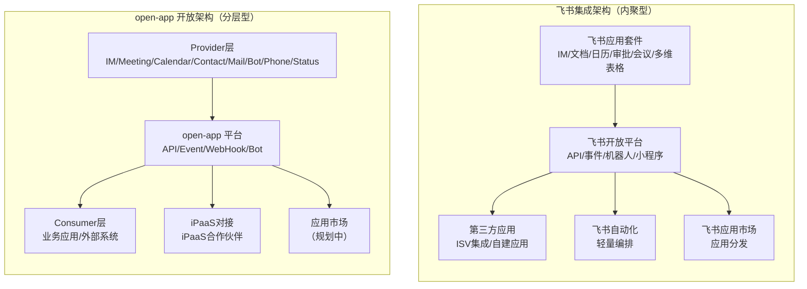

| 对比维度 | 飞书集成架构 | open-app 开放架构 | 关键差异 |
|---------|------------|-----------------|---------|
| **架构本质** | 内聚型：飞书既是 Provider 又是平台 | 分层型：Provider→平台→Consumer 三方解耦 | 飞书自产自销，open-app 中间商模式 |
| **Provider 来源** | 飞书自身全部应用 | XXX 通讯系统各子系统 | 飞书 Provider 更丰富（含文档/审批/多维表格等） |
| **集成方向** | 以飞书为中心辐射 | 以能力为中心分发 | 飞书是"太阳"，open-app 是"枢纽" |
| **Consumer 定位** | 围绕飞书构建的应用 | 消费通讯能力的任意系统 | 飞书 Consumer 更深绑定，open-app 更灵活 |
| **自动化引擎** | 飞书内置自动化 | 依赖外部 iPaaS | 飞书有但弱，open-app 无但可借力 |
| **生态市场** | 飞书应用市场（成熟） | 暂无，可考虑建设 | 飞书领先 |
| **数据归属** | 数据在飞书生态内 | 数据在 Provider 和 Consumer 间流转 | 飞书掌控数据，open-app 透传数据 |
| **计费模式** | 飞书订阅费包含 | 平台按量计费 | — |

### 6.2 飞书集成策略对 open-app 的核心启示

#### 启示一：能力开放 > 连接器封装

飞书没有采用"连接器封装"模式，而是直接开放 API 和事件。开发者使用标准 HTTP 请求或 SDK 即可集成，无需学习连接器概念。这降低了集成开发者的学习成本（学 REST API 即可），也避免了连接器维护的负担（飞书不需要为每个外部应用维护连接器）。

**open-app 行动建议**：优先保证 API 和 Event 的质量与稳定性，而非急于构建连接器市场。连接器可交给第三方 iPaaS 合作伙伴来做——国内主流 iPaaS 已经为国内主流 SaaS 构建了连接器，open-app 只需作为"能力提供方"被他们接入即可。

#### 启示二：内部联动是核心壁垒

飞书最大的集成优势不是 API 的数量，而是其内部应用间的无缝联动（多维表格→审批→消息→日历）。这种联动能力是任何外部集成平台无法复制的——因为外部集成的每次联动都需要 HTTP 往返，而飞书内部联动是内存级调用。

**open-app 行动建议**：充分利用 Provider 一体化优势，设计 IM→Meeting→Calendar→Contact→Phone→Status 之间的深度联动事件和组合 API，构建"通讯场景联动"壁垒。例如：
- 会议开始→IM 自动静音→状态变更为"会议中"→日历标记占用
- 来电→查询联系人→弹出 IM 卡片→一键创建会议

#### 启示三：机器人是最轻量的集成入口

飞书机器人是最受欢迎的集成方式——开发者只需实现一个 HTTP 接口，即可实现消息接收和回复。这种"最低门槛集成"策略极大降低了开发者进入成本。

**open-app 行动建议**：将 Bot 模式定位为"最轻量集成入口"，提供 5 分钟快速上手体验，让开发者无需理解完整的 API 体系即可开始集成。具体做法：
- 提供 Bot 一键创建和测试工具
- 提供 Bot SDK 最小示例（<50行代码即可运行）
- Bot 支持 Webhook 回调模式，无需部署服务器

#### 启示四：自动化引擎无需自建，但需要有"胶水"

飞书自建了轻量自动化引擎，但能力有限，复杂场景仍需借助外部 iPaaS。这说明对于能力开放平台而言，自建通用自动化引擎的 ROI 不高。

**open-app 行动建议**：不自建通用自动化引擎，而是提供"场景化快捷流程"（如"会议开始前自动发送提醒"、"来电自动创建联系人"）+ iPaaS 深度对接，实现"内轻外重"的自动化策略。

#### 启示五：生态市场是必选项

飞书应用市场是其生态策略的核心基础设施，没有应用市场，ISV 就没有分发渠道，用户就没有发现应用的途径。

**open-app 行动建议**：在开放平台成熟后，建设"应用市场"或"集成市场"，为 Consumer 提供应用发现和安装能力。但 open-app 的应用市场应定位于"通讯能力应用市场"而非"通用应用市场"，聚焦于展示如何使用 open-app 能力的最佳实践和集成方案。

### 6.3 open-app 可以借鉴的设计模式

| 设计模式 | 飞书实践 | open-app 借鉴方案 | 优先级 |
|---------|---------|-----------------|--------|
| **渐进式集成** | Webhook 机器人→API 调用→事件订阅→小程序，逐层深入 | Bot→API→Event→WebHook，提供从轻量到深度的集成路径 | P0 |
| **场景化模板** | 飞书自动化提供场景模板（如"审批通过发通知"） | 提供"通讯场景模板库"：会议提醒、消息转发、状态联动等 | P0 |
| **统一身份桥接** | 飞书统一 open_id 贯穿所有应用 | open-app 统一 user_id 映射，Provider 和 Consumer 共享 | P0 |
| **卡片式交互** | 飞书消息卡片支持按钮、表单等交互元素 | Bot 消息支持交互卡片，将 Bot 从"通知"升级为"操作入口" | P1 |
| **沙箱先行** | 飞书提供测试企业，开发者在沙箱中调试 | 提供 open-app 沙箱环境，Consumer 可安全测试 API | P1 |
| **事件驱动架构** | 飞书事件订阅是集成的核心触发机制 | 将 Event 模式定位为核心集成范式，API 作为补充 | P1 |
| **多语言 SDK** | 飞书提供 Java/Python/Go/Node.js 四语言 SDK | open-app 优先提供 Go 和 Java SDK（覆盖企业主流技术栈） | P1 |
| **应用级加密** | 飞书事件推送使用 AES-256-CBC 应用级加密 | open-app Event 推送增加应用级加密层 | P2 |
| **灰度发布** | 飞书支持应用灰度发布，逐步扩大使用范围 | open-app 支持 Consumer 灰度接入 | P2 |

### 6.4 open-app 的差异化机会

| 差异化方向 | 飞书局限 | open-app 机会 | 预期效果 |
|-----------|---------|-------------|---------|
| **中立性** | 飞书是内聚型平台，所有集成围绕飞书 | open-app 可做中立型能力平台，Consumer 不绑定特定产品 | 吸引不愿被锁定的企业 |
| **Provider 多元化** | 飞书 Provider 仅为自身应用 | open-app 支持多 Provider 接入，能力来源更丰富 | 通讯能力更全面 |
| **企业通讯深度** | 飞书通讯能力是其子集，非核心 | open-app 聚焦通讯，IM/Meeting/Phone/Status 等能力更深 | 专业性差异化 |
| **开放 WebHook** | 飞书 WebHook 仅限群消息推送 | open-app 可提供通用 WebHook 回调，覆盖更多集成场景 | 集成灵活性差异化 |
| **混合部署** | 飞书仅支持 SaaS 部署 | open-app 支持私有化部署，满足政企安全需求 | 安全合规差异化 |
| **iPaaS 联盟** | 飞书自建自动化，与 iPaaS 竞争 | open-app 与 iPaaS 合作，成为 iPaaS 的通讯能力 Provider | 生态互补差异化 |
| **数据可移植** | 飞书数据锁定，导出困难 | open-app 提供标准化数据导出，用户可随时迁移 | 信任差异化 |
| **场景联动** | 飞书内部联动限于飞书应用 | open-app 可实现通讯能力与企业业务系统的深度联动 | 业务价值差异化 |

### 6.5 集成策略建议：内聚型 vs 中立型 vs 混合型

| 策略类型 | 描述 | 优势 | 劣势 |
|---------|------|------|------|
| **内聚型** | 以自身产品为中心，集成围绕自身构建 | 体验一致、控制力强、锁定效应明显 | 开放性不足、生态受限、与通用集成平台竞争 |
| **中立型** | 不偏向任何产品，作为纯粹的能力管道 | 开放灵活、生态广泛、无锁定 | 缺乏核心锚点、易被替代、用户粘性弱 |
| **混合型** | 核心能力内聚（通讯），外部集成中立 | 兼顾深度和广度、差异化明显 | 架构复杂、需平衡内聚力与开放性 |

**open-app 混合型集成策略架构**：

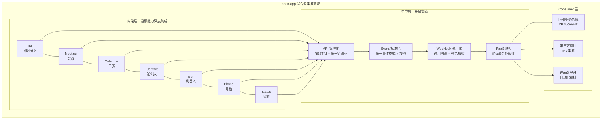

> 💡 **对 open-app 的启示**：飞书的内聚型策略虽然有效，但 open-app 不应简单复制。open-app 的定位是"能力开放平台"而非"协作平台"，因此应采用混合型策略：在通讯能力（IM/Meeting/Phone 等）上做深度的内聚型集成，构建场景联动壁垒；在外部集成上保持中立开放，与第三方 iPaaS 合作而非竞争。这种策略既能形成差异化，又不会因过度锁定而失去生态伙伴。核心原则是：**"内聚做深度，中立做广度"**。

---

## 七、安全合规

### 7.1 飞书集成平台的安全机制

| 安全维度 | 飞书机制 | 详细描述 |
|---------|---------|---------|
| **身份认证** | App ID + App Secret 双因素认证 | 应用级认证，支持 OAuth 2.0 授权码模式（用户级） |
| **访问控制** | 基于 scope 的细粒度权限模型 | 200+ 细粒度 scope，管理员审批授权 |
| **数据加密** | 传输层 + 应用层双重加密 | 传输层 TLS 1.2+；应用层 AES-256-CBC 事件加密 |
| **IP 白名单** | API 调用 IP 白名单限制 | 开发者后台配置可信 IP 列表 |
| **审计日志** | API 调用日志 + 事件推送日志 | 开发者后台可查看近 7 天调用日志 |
| **合规认证** | 多项安全认证 | 等保三级、SOC 2 Type II、ISO 27001 |
| **数据驻留** | 中国大陆数据中心 | 数据存储在国内，满足数据本地化要求 |

### 7.2 数据流转安全

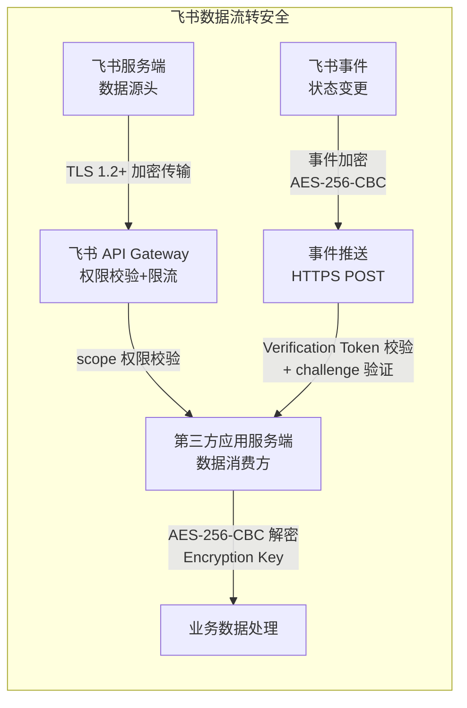

| 数据流转场景 | 安全措施 | 潜在风险点 | 风险缓解 |
|------------|---------|----------|---------|
| **API 调用** | TLS + Token + IP 白名单 + scope | Token 泄露风险 | Token 有效期 2h + 定期轮换 |
| **事件推送** | 事件加密 + Verification Token + challenge | 重放攻击 | 加 timestamp + event_id 去重 |
| **Webhook 回调** | HTTPS + 自定义签名 | 无标准签名机制 | 建议增加 HMAC 签名校验 |
| **机器人消息** | Token 校验 + 消息签名 | 消息内容未端到端加密 | 敏感信息避免通过机器人传输 |
| **小程序通信** | JS-SDK 签名 + 安全域配置 | 前端安全风险 | 域名白名单 + CSP 策略 |
| **OAuth 授权** | 授权码模式 + state 参数 | 授权码劫持 | state 参数防 CSRF + PKCE |

### 7.3 权限模型

飞书采用三层权限模型，层层递进确保最小权限原则：

| 权限层级 | 描述 | 授权方式 | 审计能力 | 示例 |
|---------|------|---------|---------|------|
| **应用级权限** | 应用可访问的功能范围 | 开发者后台申请，管理员审批 | ✅ 权限变更记录 | `im:message:send_as_bot` |
| **数据级权限** | 应用可访问的数据范围 | 用户 OAuth 授权或管理员授权 | ✅ 授权记录可查 | 读取指定用户的消息 |
| **功能级权限** | 单个 API 的调用权限 | 包含在 scope 内 | ✅ API 调用日志 | 发送卡片消息需 `im:message` scope |

> 💡 **对 open-app 的启示**：飞书的应用级事件加密机制值得借鉴——open-app 应在传输加密（TLS）之上增加应用级数据加密，特别是 Event 推送场景中，确保即使传输层被攻破，事件内容仍然安全。同时，飞书的三层权限模型（应用级/数据级/功能级）可作为 open-app 权限中心设计的参考。建议 open-app 在设计权限模型时，额外考虑"通讯场景级权限"——例如"会议中发送消息"这种跨能力域的组合权限，这是飞书未覆盖的空白。

---

## 八、局限性分析

### 8.1 飞书集成平台的核心限制

| 限制类别 | 具体描述 | 影响范围 | 规避方案 |
|---------|---------|---------|---------|
| **单向性偏向** | 集成能力主要围绕"飞书→外部"输出，"外部→飞书"的输入能力有限 | 外部系统难以深度嵌入飞书工作流 | 外部系统通过 API 主动写入飞书 |
| **WebHook 通用性不足** | WebHook 仅支持群消息推送，不支持通用事件回调 | 无法替代标准 Event 模式的通用回调需求 | 使用事件订阅替代 |
| **自动化引擎局限** | 不支持循环、并行、子流程、错误处理 | 复杂业务流程无法在飞书内完成 | 使用外部 iPaaS |
| **API 速率限制** | 部分高频 API 存在速率限制（如消息发送 50次/秒/app） | 大规模推送场景受限 | 批量 API + 队列削峰 |
| **事件时序性** | 跨实体事件不保证顺序 | 依赖事件顺序的业务逻辑可能出错 | 应用层做时序补偿 |
| **数据导出** | 消息、审批等数据的批量导出能力有限 | 数据迁移和备份困难 | 使用 API 分页导出 |
| **多租户隔离** | 第三方应用的数据隔离依赖应用自身实现 | SaaS 型 ISV 需自行解决多租户 | 应用层实现租户隔离 |
| **小程序审核** | 小程序上架需要审核，周期 3-7 天 | 快速迭代受限 | 使用 H5 应用绕过审核 |
| **机器人限制** | 机器人消息频率有限制，群机器人不支持交互 | 机器人无法承担复杂交互 | 使用自建应用+卡片交互 |

### 8.2 飞书集成平台的能力边界

飞书集成平台作为内聚型平台的集成能力层，存在由其架构定位决定的能力边界：

| 能力维度 | 飞书集成平台现状 | 边界评估 |
|---------|---------------|---------|
| **连接器数量** | 仅飞书自身能力，外部连接依赖 ISV 和第三方集成平台 | 受限于内聚型架构，外部连接器需生态建设 |
| **双向集成** | 部分双向，偏向单向输出 | 外部→飞书的深度集成能力有限 |
| **编排复杂度** | 简单线性+条件，不支持循环/并行/子流程/错误处理 | 复杂编排场景需借助外部工具 |
| **数据转换** | 简单字段映射，无丰富函数库和自定义脚本 | 复杂格式转换需在外部完成 |
| **错误恢复** | 无重试、错误路由、死信队列机制 | 流程失败后无法自动恢复 |
| **执行监控** | 基础日志，缺少详细执行追踪和性能分析 | 问题排查和性能优化困难 |
| **通用性** | 仅飞书生态，不具备跨平台集成能力 | 架构决定，不可弥合 |
| **开放标准** | 飞书私有协议和 API 规范 | 可逐步增加开放标准支持 |

### 8.3 生态锁定风险

| 风险类型 | 描述 | 对企业的影响 | 严重度 |
|---------|------|------------|--------|
| **数据锁定** | 消息、文档、审批数据存储在飞书，导出困难 | 迁移成本极高，数据主权受限 | 🔴 高 |
| **流程锁定** | 审批模板和自动化流程深度绑定飞书 | 业务流程重建成本巨大 | 🔴 高 |
| **供应商锁定** | ISV 应用仅适配飞书 API，不兼容其他平台 | 切换平台需替换所有集成应用 | 🟡 中 |
| **技能锁定** | 团队积累的飞书开发经验难以迁移到其他平台 | 人员培训成本高 | 🟡 中 |
| **定价锁定** | 飞书定价策略调整可能带来成本上升 | 缺乏议价能力 | 🟡 中 |
| **功能锁定** | 依赖飞书特有功能（如多维表格自动化） | 替代方案功能不完整 | 🟡 中 |

> 💡 **对 open-app 的启示**：飞书的局限性恰恰是 open-app 的机会——特别是在双向集成、通用 WebHook、数据导出能力方面，open-app 可以做得更好。同时，open-app 应避免飞书的生态锁定策略，通过开放标准和数据可移植性赢得用户信任。具体建议：1）提供标准化的数据导出 API，让用户随时带走自己的数据；2）WebHook 作为通用回调机制而非简单消息推送；3）与第三方 iPaaS 合作而非竞争，让用户自由选择编排工具；4）采用开放标准（OpenAPI 规范定义 API，CloudEvents 规范定义事件格式），降低集成锁定。

---

## 九、总结与建议

### 9.1 核心发现

| # | 核心发现 | 详细说明 | 对 open-app 的影响 |
|---|---------|---------|------------------|
| 1 | **飞书是内聚型平台** | 集成围绕飞书自身构建，所有第三方都是飞书生态的补充 | open-app 应采用混合型策略，通讯能力内聚+外部集成中立 |
| 2 | **内部联动是最大壁垒** | 多维表格→审批→消息→日历的零延迟联动，外部集成平台无法复制 | open-app 应设计 IM/Meeting/Calendar/Phone 间的深度联动 |
| 3 | **自动化引擎是轻量级** | 飞书自动化是场景化工具，复杂场景需外部编排工具 | open-app 无需自建重型自动化引擎，"内轻外重"即可 |
| 4 | **Bot 是最轻量入口** | 5 分钟可上手的集成方式，极大降低开发者进入成本 | open-app 应将 Bot 定位为"5 分钟集成"入口 |
| 5 | **WebHook 通用性不足** | 飞书 WebHook 仅限群消息推送，不支持通用回调 | open-app 可在通用 WebHook 回调上形成差异化 |
| 6 | **事件加密是安全亮点** | 飞书在传输加密之上增加了应用级 AES-256-CBC 加密 | open-app 应借鉴事件加密机制 |
| 7 | **SDK 覆盖四语言** | Java/Python/Go/Node.js SDK 功能覆盖度高，开发者体验好 | open-app 应优先建设多语言 SDK |
| 8 | **应用市场是生态核心** | 飞书应用市场为 ISV 提供分发渠道，是生态策略的基础设施 | open-app 应规划应用/集成市场建设 |
| 9 | **生态锁定有效但有争议** | 五层锁定模型有效提高迁移成本，但也引发用户担忧 | open-app 应通过开放标准和数据可移植性差异化 |
| 10 | **与 iPaaS 是竞合关系** | 飞书自动化与通用 iPaaS 存在功能重叠，但也依赖 iPaaS 补齐复杂场景 | open-app 应与 iPaaS 合作而非竞争 |

### 9.2 对 open-app 的战略建议

#### 建议一：明确"通讯能力枢纽"定位

open-app 不应试图成为飞书式的"协作平台"，也不应成为通用"集成中间件"，而应定位为**企业通讯能力的枢纽**——所有需要 IM、Meeting、Calendar、Phone 等通讯能力的应用，都通过 open-app 获取。这一定位既不同于飞书的"全功能协作"，也不同于通用 iPaaS 的"通用集成"，而是聚焦于"通讯"这一垂直领域。

#### 建议二：构建"场景联动"壁垒

借鉴飞书内部联动模式，设计以下核心联动场景：

| 联动场景 | 描述 | 价值 | 实现优先级 |
|---------|------|------|----------|
| **会议联动** | 日历事件→自动创建会议→会前提醒→会后纪要发送 | 端到端会议体验 | P0 |
| **消息联动** | 关键消息→自动升级为会议→会后纪要回传 | 紧急事件快速响应 | P0 |
| **状态联动** | 通话中→日历占用→IM 状态变更→拒接新来电 | 统一状态呈现 | P0 |
| **审批联动** | IM 消息中的审批指令→触发审批流→结果通知 | 消息即操作入口 | P1 |
| **通讯录联动** | 来电→查询联系人→弹出 IM 卡片→一键创建会议 | 统一通讯录体验 | P1 |
| **邮件联动** | 重要邮件→IM 通知→一键转为会议 | 邮件与即时通讯互通 | P2 |

#### 建议三：采用"双轨集成"架构

| 轨道 | 定位 | 目标用户 | 能力范围 | 上手时间 |
|------|------|---------|---------|---------|
| **轻量轨道** | Bot + 场景化快捷流程 | 业务人员、IT 通才 | 5 分钟上手，覆盖 80% 高频场景 | <5 分钟 |
| **深度轨道** | API + Event + iPaaS 对接 | 专业开发者、架构师 | 完整能力开放，覆盖 100% 场景 | 1-3 天 |

#### 建议四：与 iPaaS 建立联盟而非竞争

| 合作模式 | 描述 | 优先级 | 预期效果 |
|---------|------|--------|---------|
| **Provider 模式** | open-app 作为 iPaaS 的通讯能力 Provider | P0 | iPaaS 用户可直接使用 open-app 能力 |
| **连接器共建** | 与第三方 iPaaS 共建 open-app 连接器 | P0 | 降低 iPaaS 侧的对接成本 |
| **模板共创** | 与 iPaaS 共创通讯场景自动化模板 | P1 | 提供开箱即用的通讯场景方案 |
| **市场互嵌** | open-app 集成市场与 iPaaS 应用市场互嵌 | P2 | 扩大双方生态覆盖 |

### 9.3 行动建议

| 优先级 | 行动项 | 预期成果 | 时间线 | 资源投入 |
|--------|-------|---------|--------|---------|
| **P0** | 设计 IM/Meeting/Calendar/Phone 间的联动事件 | 构建"场景联动"壁垒 | 1-2 月 | 2 人 |
| **P0** | 开发 Bot 快速上手指南和 SDK 最小示例 | 实现"5 分钟集成"体验 | 1 月 | 1 人 |
| **P0** | 与第三方 iPaaS 共建 open-app 连接器 | 实现 iPaaS 生态接入 | 2-3 月 | 2 人 |
| **P1** | 设计通用 WebHook 回调机制 | 差异化于飞书的 WebHook 限制 | 2 月 | 1 人 |
| **P1** | 开发多语言 SDK（Go + Java 优先） | 降低开发者接入门槛 | 3-4 月 | 2-3 人 |
| **P1** | 构建 API Explorer 和沙箱环境 | 提升开发者调试体验 | 2-3 月 | 2 人 |
| **P2** | 设计"场景化快捷流程"引擎 | 实现轻量自动化能力 | 3-4 月 | 2-3 人 |
| **P2** | 规划应用/集成市场建设 | 为 ISV 提供分发渠道 | 6 月 | 3-4 人 |
| **P3** | 实现事件应用级加密（AES-256-CBC） | 提升安全合规能力 | 4-5 月 | 1-2 人 |
| **P3** | 设计数据可移植性方案 | 差异化于飞书的生态锁定 | 5-6 月 | 1-2 人 |


### 9.4 open-app 集成能力建设路线图

基于上述战略建议和行动建议，建议按以下三个阶段推进 open-app 的集成能力建设：

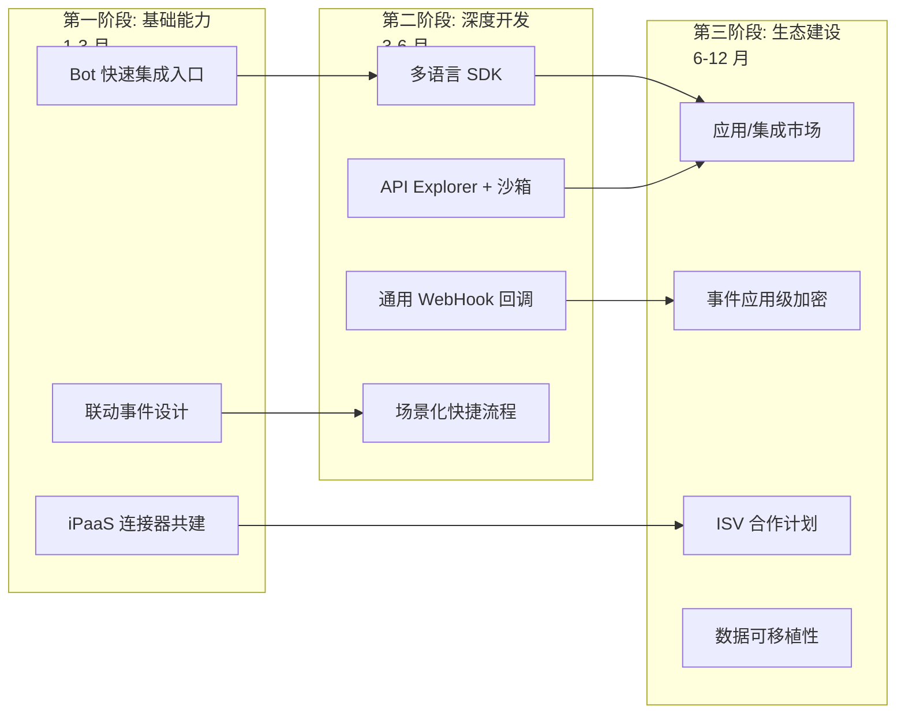

| 阶段 | 时间 | 核心目标 | 关键交付物 | 成功指标 |
|------|------|---------|----------|---------|
| **第一阶段：基础能力** | 1-3 月 | 建立最轻量集成入口 + iPaaS 生态接入 | Bot SDK + 联动事件 + iPaaS 连接器 | 5 分钟完成首个 Bot 集成 |
| **第二阶段：深度开发** | 3-6 月 | 建立专业开发者完整工具链 | Go/Java SDK + API Explorer + 通用 WebHook | 开发者接入周期 < 3 天 |
| **第三阶段：生态建设** | 6-12 月 | 构建 ISV 生态和应用分发渠道 | 应用市场 + ISV 合作 + 安全增强 | ISV 应用数 > 20 |

### 9.5 风险与应对

| 风险 | 描述 | 概率 | 影响 | 应对措施 |
|------|------|------|------|---------|
| **飞书生态挤压** | 飞书持续增强集成能力，挤压 open-app 空间 | 高 | 高 | 聚焦通讯深度，做飞书做不了的能力（Phone/Status） |
| **iPaaS 覆盖不足** | 第三方 iPaaS 对 open-app 的连接器支持不够 | 中 | 中 | 主动共建连接器，提供技术支持 |
| **开发者采用慢** | 开发者对 open-app 的认知度低 | 高 | 高 | Bot 5 分钟上手 + 优秀文档 + 社区运营 |
| **安全合规要求** | 政企客户对数据安全有严格要求 | 中 | 高 | 私有化部署 + 事件加密 + 合规认证 |
| **技术选型失误** | SDK/WebHook 设计不符合开发者习惯 | 中 | 中 | 参考飞书最佳实践 + 开发者调研 |

---

*本报告为 open-app 项目飞书集成平台专项调研，聚焦连接器/集成能力分析，飞书开放平台的 API 详情、权限体系等内容请参考《飞书开放平台调研报告》。*
