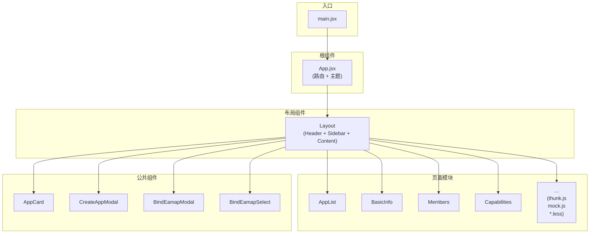
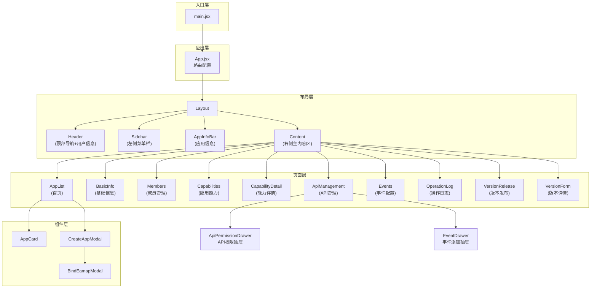
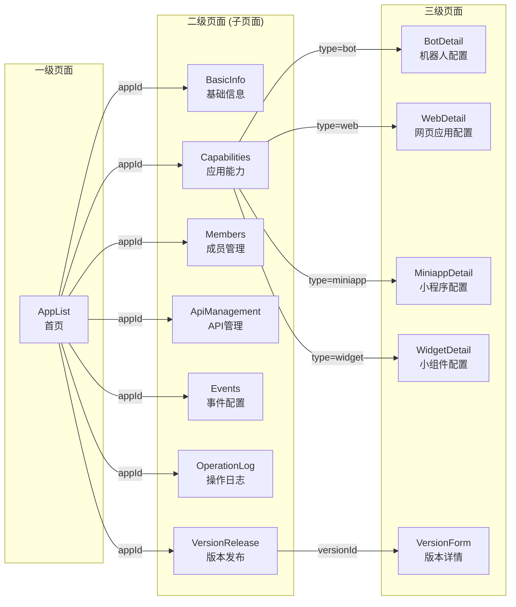

# 开放平台开发者控制台 - 项目知识文档

## 1. 项目概述

**项目名称**: 开放平台开发者控制台 (Feishu Developer Console)

**项目描述**: 一个基于 React + Ant Design 的开放平台管理后台，用于管理第三方应用的生命周期，包括应用创建、基础信息配置、权限管理、事件订阅、成员管理等核心功能。

**技术栈**:
- React 18.2.0
- React Router 6.20.0
- Ant Design 4.24.16
- Vite 5.0.0
- Less 4.2.0

---

## 2. 项目模块结构

### 2.1 项目架构图



### 2.2 模块关系图



### 2.3 页面导航流程图



### 2.4 核心业务模块 (pages/)

| 模块名称 | 目录 | 功能描述 | 包含文件 |
|----------|------|----------|----------|
| AppList | pages/AppList | 应用列表首页，展示所有应用卡片 | AppList.jsx, route.js, thunk.js, mock.js, AppList.m.less |
| BasicInfo | pages/BasicInfo | 管理应用凭证、安全配置和回调地址 | BasicInfo.jsx, route.js, thunk.js, mock.js, BasicInfo.m.less |
| Members | pages/Members | 成员管理，添加/删除成员 | Members.jsx, route.js, thunk.js, mock.js, Members.m.less |
| Capabilities | pages/Capabilities | 添加和管理应用能力 | Capabilities.jsx, route.js, thunk.js, Capabilities.m.less |
| CapabilityDetail | pages/CapabilityDetail | 能力详情配置 | CapabilityDetail.jsx, route.js, thunk.js, CapabilityDetail.m.less |
| ApiManagement | pages/ApiManagement | API 权限管理 | ApiManagement.jsx, route.js, thunk.js, mock.js, ApiManagement.m.less |
| Events | pages/Events | 事件订阅配置 | Events.jsx, route.js, thunk.js, mock.js, Events.m.less |
| OperationLog | pages/OperationLog | 操作日志查询 | OperationLog.jsx, route.js, thunk.js, mock.js, OperationLog.m.less |
| VersionRelease | pages/VersionRelease | 版本发布管理 | VersionRelease.jsx, VersionForm.jsx, route.js, thunk.js, mock.js, VersionRelease.m.less |

### 2.5 公共组件 (components/)

| 组件名称 | 目录 | 功能描述 | 包含文件 |
|----------|------|----------|----------|
| AppCard | components/AppCard | 应用卡片组件，展示应用基本信息 | AppCard.jsx, AppCard.m.less |
| CreateAppModal | components/CreateAppModal | 创建应用弹窗 | CreateAppModal.jsx, CreateAppModal.m.less |
| BindEamapModal | components/BindEamapModal | 绑定 EAMAP 弹窗 | BindEamapModal.jsx |
| BindEamapSelect | components/BindEamapSelect | EAMAP 服务下拉选择器 | BindEamapSelect.jsx |

### 2.6 布局组件

| 组件名称 | 目录 | 功能描述 |
|----------|------|----------|
| Layout | components/Layout | 主布局容器 |
| Header | components/Layout/Header | 顶部导航栏，包含 Logo、文档链接、用户信息 |
| Sidebar | components/Layout/Sidebar | 侧边导航菜单，根据 appId 和 caps 动态渲染 |
| AppInfoBar | components/Layout/AppInfoBar | 应用信息栏，显示应用名称和绑定状态 |

### 2.7 其他模块

| 模块名称 | 功能描述 |
|----------|----------|
| styles | 全局样式，包含 CSS 变量定义 |
| App.jsx | 根组件，包含路由配置和主题配置 |
| main.jsx | 应用入口文件 |

---

## 3. 目录结构

```
weCodesite/
├── src/
│   ├── components/              # 公共组件
│   │   ├── AppCard/            # 应用卡片组件
│   │   ├── BindEamapModal/     # 绑定 EAMAP 弹窗
│   │   ├── BindEamapSelect/    # EAMAP 选择器
│   │   ├── CreateAppModal/     # 创建应用弹窗
│   │   └── Layout/              # 布局组件
│   │       ├── Header/         # 顶部导航栏
│   │       ├── Sidebar/        # 侧边导航栏
│   │       ├── AppInfoBar/     # 应用信息栏
│   │       └── Layout.jsx      # 主布局
│   ├── pages/                   # 页面组件
│   │   ├── AppList/            # 应用列表首页
│   │   ├── BasicInfo/          # 基础信息页
│   │   ├── Members/            # 成员管理页
│   │   ├── Capabilities/        # 应用能力页
│   │   ├── CapabilityDetail/   # 能力详情页
│   │   ├── ApiManagement/      # API 管理页
│   │   ├── Events/             # 事件配置页
│   │   ├── OperationLog/       # 操作日志页
│   │   └── VersionRelease/     # 版本发布页
│   ├── styles/                 # 全局样式
│   ├── App.jsx                 # 根组件
│   └── main.jsx                # 入口文件
├── index.html
├── package.json
└── vite.config.js
```

---

## 4. 页面概览

| 页面 | 路由 | 主要功能 | 调用接口 |
|------|------|----------|----------|
| AppList | `/` | 应用列表首页，展示所有应用卡片 | fetchAppList, fetchDefaultIcons, fetchEamapOptions, createApp, bindEamap |
| BasicInfo | `/basic-info` | 管理应用凭证、安全配置和回调地址 | fetchAppInfo, bindEamapToApp |
| Members | `/members` | 成员管理，添加/删除成员 | fetchMemberList |
| Capabilities | `/capabilities` | 添加和管理应用能力 | fetchCapabilityList |
| CapabilityDetail | `/capability-detail` | 能力详情配置 | fetchCapabilityDetail |
| ApiManagement | `/api-management` | API 权限管理 | fetchApiList, fetchAvailableApis, fetchApiModules |
| Events | `/events` | 事件订阅配置 | fetchEventList, fetchSubscriptionConfig, fetchAllEvents |
| OperationLog | `/operation-log` | 操作日志查询 | fetchOperationLogList, fetchOperationLogFilters |
| VersionRelease | `/version-release` | 版本发布管理 | fetchVersionList |

---

## 5. 页面详细分析

### 5.1 AppList (应用列表)

**文件**: `src/pages/AppList/AppList.jsx`

**路由**: `/`

**功能描述**: 展示用户创建的所有应用卡片，提供创建新应用的功能

**API 调用**:

| 函数名 | 文件 | 功能 | 参数 | 返回值 |
|--------|------|------|------|--------|
| fetchAppList | thunk.js | 获取应用列表 | 无 | `Array<App>` |
| fetchDefaultIcons | thunk.js | 获取默认图标列表 | 无 | `Array<string>` |
| fetchEamapOptions | thunk.js | 获取 EAMAP 选项 | 无 | `Array<EamapOption>` |
| createApp | thunk.js | 创建新应用 | `{chineseName, englishName, chineseDesc, englishDesc, icon, eamap}` | `App` |
| bindEamap | thunk.js | 绑定应用到 EAMAP | `{appId, eamap}` | `App` |
| fetchAppById | thunk.js | 根据 ID 获取应用 | `appId` | `App \| null` |

**数据结构**:

```typescript
interface App {
  id: string;
  name: string;
  icon: string;           // emoji 或图片 URL
  status: string;         // '开发中'
  owner: string;          // 邮箱格式
  role: string;           // '所有者' | '管理员' | '开发者'
  updateTime: string;
  eamap: string | null;
  chineseName: string;
  englishName: string;
  chineseDesc: string;
  englishDesc: string;
}
```

---

### 5.2 BasicInfo (基础信息)

**文件**: `src/pages/BasicInfo/BasicInfo.jsx`

**路由**: `/basic-info?appId=xxx`

**功能描述**: 管理应用凭证（APP ID、APP Secret）、基础信息编辑、认证方式配置

**API 调用**:

| 函数名 | 文件 | 功能 | 参数 | 返回值 |
|--------|------|------|------|--------|
| fetchAppInfo | thunk.js | 获取应用详细信息 | `appId` | `AppInfo \| null` |
| bindEamapToApp | thunk.js | 绑定应用到 EAMAP | `{appId, eamap}` | `{appId, eamap}` |

---

### 5.3 Members (成员管理)

**文件**: `src/pages/Members/Members.jsx`

**路由**: `/members?appId=xxx`

**功能描述**: 管理应用成员和角色权限，支持添加和删除成员

**API 调用**:

| 函数名 | 文件 | 功能 | 参数 | 返回值 |
|--------|------|------|------|--------|
| fetchMemberList | thunk.js | 获取成员列表 | 无 | `Array<Member>` |

**数据结构**:

```typescript
interface Member {
  id: number;
  name: string;
  employeeId: string;
  role: string;           // '管理员' | '开发者'
  status: string;
}

interface User {
  id: number;
  name: string;
  employeeId: string;
  email: string;
}
```

---

### 5.4 Capabilities (应用能力)

**文件**: `src/pages/Capabilities/Capabilities.jsx`

**路由**: `/capabilities?appId=xxx&caps=xxx`

**功能描述**: 展示和管理应用能力（机器人、网页应用、小程序、小组件），支持开启/关闭能力

**API 调用**:

| 函数名 | 文件 | 功能 | 参数 | 返回值 |
|--------|------|------|------|--------|
| fetchCapabilityList | thunk.js | 获取能力列表 | 无 | `Array<Capability>` |

**能力类型**:

| 类型 | 名称 | 图标 |
|------|------|------|
| bot | 机器人 | RobotOutlined |
| web | 网页应用 | GlobalOutlined |
| miniapp | 小程序 | MailOutlined |
| widget | 小组件 | AppstoreOutlined |

---

### 5.5 CapabilityDetail (能力详情)

**文件**: `src/pages/CapabilityDetail/CapabilityDetail.jsx`

**路由**: `/capability-detail?appId=xxx&type=xxx`

**功能描述**: 配置特定能力的详细参数，如机器人名称、网页应用主页地址等

**API 调用**:

| 函数名 | 文件 | 功能 | 参数 | 返回值 |
|--------|------|------|------|--------|
| fetchCapabilityDetail | thunk.js | 获取能力详情 | `capabilityId` | `CapabilityDetail \| null` |

**各能力配置字段**:

**机器人 (bot)**:
- botName: 机器人名称 (必填)
- botDesc: 机器人描述 (可选)

**网页应用 (web)**:
- homepageUrl: 桌面端主页地址 (必填)
- mobileHomepageUrl: 移动端主页地址 (可选)
- openMode: 桌面端主页打开方式 (可选)

**小程序 (miniapp)**:
- appName: 小程序名称 (必填)
- appDesc: 小程序描述 (可选)

**小组件 (widget)**:
- widgetName: 小组件名称 (必填)
- widgetDesc: 小组件描述 (可选)

---

### 5.6 ApiManagement (API 管理)

**文件**: `src/pages/ApiManagement/ApiManagement.jsx`

**路由**: `/api-management?appId=xxx`

**功能描述**: 管理应用接口权限，配置 API 调用权限和参数

**API 调用**:

| 函数名 | 文件 | 功能 | 参数 | 返回值 |
|--------|------|------|------|--------|
| fetchApiList | thunk.js | 获取 API 列表 | 无 | `Array<ApiPermission>` |
| fetchAvailableApis | thunk.js | 获取可用 API | `auth` (SOA/APIG) | `AvailableApis \| null` |
| fetchApiModules | thunk.js | 获取 API 模块分类 | `auth` | `Array<Module>` |

**API 权限数据结构**:

```typescript
interface ApiPermission {
  id: string;
  name: string;           // 权限名称
  codeName: string;      // codeName
  auth: string;          // 认证方式 (user/app)
  category: string;      // 分类 (日历/云文档/云空间)
  status: string;       // 状态 (已审核/审核中/已中止)
}
```

---

### 5.7 Events (事件配置)

**文件**: `src/pages/Events/Events.jsx`

**路由**: `/events?appId=xxx`

**功能描述**: 配置事件订阅和回调地址，管理已订阅的事件

**API 调用**:

| 函数名 | 文件 | 功能 | 参数 | 返回值 |
|--------|------|------|------|--------|
| fetchEventList | thunk.js | 获取事件列表 | 无 | `Array<Event>` |
| fetchSubscriptionConfig | thunk.js | 获取订阅配置 | 无 | `SubscriptionConfig` |
| fetchAllEvents | thunk.js | 获取所有可选事件 | 无 | `Array<AllEvent>` |

**订阅方式**:
- MQS平台订阅
- 发送至业务系统

---

### 5.8 OperationLog (操作日志)

**文件**: `src/pages/OperationLog/OperationLog.jsx`

**路由**: `/operation-log?appId=xxx`

**功能描述**: 查看用户操作记录，支持按账号、对象、时间范围筛选

**API 调用**:

| 函数名 | 文件 | 功能 | 参数 | 返回值 |
|--------|------|------|------|--------|
| fetchOperationLogList | thunk.js | 获取操作日志列表 | `{page, pageSize, filters}` | `{data, total}` |
| fetchOperationLogFilters | thunk.js | 获取筛选选项 | 无 | `{operationTypes, operationObjects}` |

**筛选参数**:

```typescript
interface LogFilters {
  account?: string;           // 操作账号
  operationObject?: string;   // 操作对象
  timeRange?: [Date, Date];   // 操作时间范围
}
```

---

### 5.9 VersionRelease (版本发布)

**文件**: `src/pages/VersionRelease/VersionRelease.jsx`

**路由**: `/version-release?appId=xxx`

**功能描述**: 管理应用版本和发布历史，提交版本审核

**API 调用**:

| 函数名 | 文件 | 功能 | 参数 | 返回值 |
|--------|------|------|------|--------|
| fetchVersionList | thunk.js | 获取版本列表 | 无 | `Array<Version>` |

**版本状态**:
- 已发布 (green)
- 审核中 (blue)
- 审核未通过 (red)

---

## 6. 组件概览

| 组件 | 文件 | 功能 | Props |
|------|------|------|-------|
| Header | components/Layout/Header | 顶部导航栏，包含 Logo、文档链接、用户信息 | - |
| Sidebar | components/Layout/Sidebar | 侧边导航菜单，根据 appId 和 caps 动态渲染 | `appId`, `caps` |
| AppInfoBar | components/Layout/AppInfoBar | 应用信息栏，显示应用名称和绑定状态 | `appId`, `appName`, `eamap` |
| AppCard | components/AppCard | 应用卡片，展示应用基本信息 | `app`, `onClick` |
| CreateAppModal | components/CreateAppModal | 创建应用弹窗 | `open`, `onClose`, `onSubmit` |
| BindEamapModal | components/BindEamapModal | 绑定 EAMAP 弹窗 | `open`, `appId`, `onClose`, `onSubmit` |
| BindEamapSelect | components/BindEamapSelect | EAMAP 服务下拉选择器 | `value`, `onChange` |
| ApiPermissionDrawer | pages/ApiManagement | API 权限配置抽屉 | `open`, `appId`, `onClose` |
| EventDrawer | pages/Events | 添加事件抽屉 | `open`, `appId`, `onClose`, `onSubmit` |

---

## 7. API 参考

### 7.1 应用相关 (AppList)

#### fetchAppList
- **文件**: `src/pages/AppList/thunk.js`
- **功能**: 获取应用列表
- **参数**: 无
- **返回值**: `Array<App>`

#### fetchAppById
- **文件**: `src/pages/AppList/thunk.js`
- **功能**: 根据 ID 获取应用
- **参数**: `appId: string`
- **返回值**: `App | null`

#### fetchDefaultIcons
- **文件**: `src/pages/AppList/thunk.js`
- **功能**: 获取默认 emoji 图标列表
- **参数**: 无
- **返回值**: `Array<string>`

#### fetchEamapOptions
- **文件**: `src/pages/AppList/thunk.js`
- **功能**: 获取可选的 EAMAP 服务列表
- **参数**: 无
- **返回值**: `Array<EamapOption>`

#### createApp
- **文件**: `src/pages/AppList/thunk.js`
- **功能**: 创建新应用
- **参数**: `{chineseName, englishName, chineseDesc, englishDesc, icon, eamap}`
- **返回值**: `App` (新创建的应用对象)

#### bindEamap
- **文件**: `src/pages/AppList/thunk.js`
- **功能**: 绑定应用到 EAMAP 服务
- **参数**: `appId: string, eamap: string`
- **返回值**: `App`

---

### 7.2 基础信息相关 (BasicInfo)

#### fetchAppInfo
- **文件**: `src/pages/BasicInfo/thunk.js`
- **功能**: 获取应用详细信息
- **参数**: `appId: string`
- **返回值**: `AppInfo | null`

#### bindEamapToApp
- **文件**: `src/pages/BasicInfo/thunk.js`
- **功能**: 绑定应用到 EAMAP
- **参数**: `appId: string, eamap: string`
- **返回值**: `{appId, eamap}`

---

### 7.3 成员管理相关 (Members)

#### fetchMemberList
- **文件**: `src/pages/Members/thunk.js`
- **功能**: 获取成员列表
- **参数**: 无
- **返回值**: `Array<Member>`

---

### 7.4 应用能力相关 (Capabilities)

#### fetchCapabilityList
- **文件**: `src/pages/Capabilities/thunk.js`
- **功能**: 获取应用能力列表
- **参数**: 无
- **返回值**: `Array<Capability>`

#### fetchCapabilityDetail
- **文件**: `src/pages/CapabilityDetail/thunk.js`
- **功能**: 获取能力详情
- **参数**: `capabilityId: string`
- **返回值**: `CapabilityDetail | null`

---

### 7.5 API 管理相关 (ApiManagement)

#### fetchApiList
- **文件**: `src/pages/ApiManagement/thunk.js`
- **功能**: 获取 API 权限列表
- **参数**: 无
- **返回值**: `Array<ApiPermission>`

#### fetchAvailableApis
- **文件**: `src/pages/ApiManagement/thunk.js`
- **功能**: 获取可选的 API 列表
- **参数**: `auth: string` (SOA 或 APIG)
- **返回值**: `AvailableApis | null`

#### fetchApiModules
- **文件**: `src/pages/ApiManagement/thunk.js`
- **功能**: 获取 API 模块分类
- **参数**: `auth: string`
- **返回值**: `Array<Module>`

---

### 7.6 事件配置相关 (Events)

#### fetchEventList
- **文件**: `src/pages/Events/thunk.js`
- **功能**: 获取已订阅事件列表
- **参数**: 无
- **返回值**: `Array<Event>`

#### fetchSubscriptionConfig
- **文件**: `src/pages/Events/thunk.js`
- **功能**: 获取订阅配置
- **参数**: 无
- **返回值**: `SubscriptionConfig`

#### fetchAllEvents
- **文件**: `src/pages/Events/thunk.js`
- **功能**: 获取所有可选事件
- **参数**: 无
- **返回值**: `Array<AllEvent>`

---

### 7.7 操作日志相关 (OperationLog)

#### fetchOperationLogList
- **文件**: `src/pages/OperationLog/thunk.js`
- **功能**: 获取操作日志列表（支持分页和筛选）
- **参数**: `{page: number, pageSize: number, filters: LogFilters}`
- **返回值**: `{data: Array<LogEntry>, total: number}`

#### fetchOperationLogFilters
- **文件**: `src/pages/OperationLog/thunk.js`
- **功能**: 获取日志筛选选项
- **参数**: 无
- **返回值**: `{operationTypes, operationObjects}`

---

### 7.8 版本发布相关 (VersionRelease)

#### fetchVersionList
- **文件**: `src/pages/VersionRelease/thunk.js`
- **功能**: 获取版本列表
- **参数**: 无
- **返回值**: `Array<Version>`

---

## 8. 数据模型汇总

### App (应用)
```typescript
interface App {
  id: string;
  name: string;
  icon: string;
  status: string;
  owner: string;
  role: string;
  updateTime: string;
  eamap: string | null;
  chineseName: string;
  englishName: string;
  chineseDesc: string;
  englishDesc: string;
}
```

### Member (成员)
```typescript
interface Member {
  id: number;
  name: string;
  employeeId: string;
  role: string;
  status: string;
}
```

### Capability (能力)
```typescript
interface Capability {
  id: string;
  name: string;
  codeName: string;
  description: string;
  apiCount: number;
  status: string;
}
```

### ApiPermission (API 权限)
```typescript
interface ApiPermission {
  id: string;
  name: string;
  codeName: string;
  auth: string;
  category: string;
  status: string;
}
```

### Event (事件)
```typescript
interface Event {
  id: string;
  name: string;
  eventType: string;
  requiredPermission: string;
}
```

### Version (版本)
```typescript
interface Version {
  id: number;
  version: string;
  status: string;
  publisher: string;
  approvedTime: string;
}
```

### OperationLog (操作日志)
```typescript
interface OperationLog {
  id: number;
  account: string;
  operationType: string;
  operationObject: string;
  description: string;
  ip: string;
  time: string;
  result: string;
}
```

---

## 9. 路由参数规范

| 参数 | 说明 | 示例 |
|------|------|------|
| appId | 应用 ID | `?appId=1` |
| caps | 已启用的应用能力列表，逗号分隔 | `?caps=bot,web` |
| type | 应用能力类型 | `?type=bot` |

---

## 10. 依赖安装与启动

```bash
# 安装依赖
npm install

# 启动开发服务器
npm run dev

# 生产构建
npm run build

# 预览构建结果
npm run preview
```
