# 连接器平台详细设计文档

## 一、文档概述

### 1.1 文档目的

本文档基于现有开放平台的能力,详细规划连接器平台的功能架构、页面设计、交互逻辑和实施优先级。文档旨在明确连接器平台的核心价值、功能定位和落地路径,为后续的开发实施提供指导。

### 1.2 设计背景

现有开放平台具备以下核心能力:

- **卡片能力**:群置顶卡片、群通知、点对点通知、助手广场卡片、链接增强
- **订阅能力**:API订阅、事件订阅、回调管理

这些能力为连接器平台提供了**通知触达**和**事件触发**的基础设施。

### 1.3 平台定位

连接器平台定位为\*\*"能力共享枢纽"\*\*,核心目标:

- 将**API调用**、**事件订阅**、**Webhook回调**作为输入
- 将**卡片能力**作为输出
- 通过**流程编排引擎**实现跨系统的自动化联动

### 1.4 技术方案选择

采用\*\*"可扩展的多步骤串联流程引擎"方案\*\*:

- 支持多个动作串联执行(A → B → C)
- 支持简单条件分支(if-else)
- 支持数据映射与转换
- 预留向完整流程引擎的扩展路径
- 中等开发周期(11-16周)

***

## 二、整体架构设计

### 2.1 系统架构总览

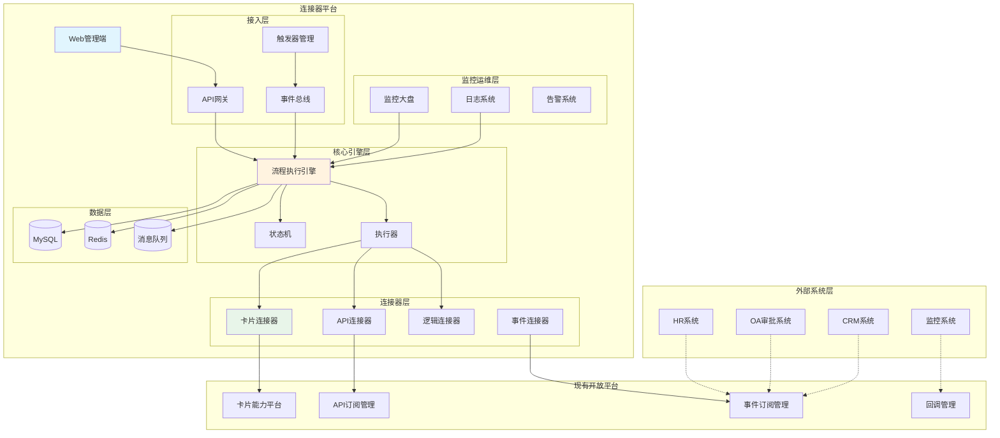
```mermaid
graph TB
    subgraph 外部系统层
        HR[HR系统]
        OA[OA审批系统]
        CRM[CRM系统]
        MONITOR[监控系统]
    end
    
    subgraph 现有开放平台
        CARD[卡片能力平台]
        API_SUBS[API订阅管理]
        EVENT_SUBS[事件订阅管理]
        CALLBACK[回调管理]
    end
    
    subgraph 连接器平台
        WEB[Web管理端]
        
        subgraph 接入层
            API_GATEWAY[API网关]
            EVENT_BUS[事件总线]
            TRIGGER[触发器管理]
        end
        
        subgraph 核心引擎层
            FLOW_ENGINE[流程执行引擎]
            STATE_MACHINE[状态机]
            EXECUTOR[执行器]
        end
        
        subgraph 连接器层
            CARD_CONN[卡片连接器]
            API_CONN[API连接器]
            LOGIC_CONN[逻辑连接器]
            EVENT_CONN[事件连接器]
        end
        
        subgraph 数据层
            MYSQL[(MySQL)]
            REDIS[(Redis)]
            MQS[(消息队列)]
        end
        
        subgraph 监控运维层
            MONITOR_DASH[监控大盘]
            LOG_SYS[日志系统]
            ALERT[告警系统]
        end
    end
    
    WEB --> API_GATEWAY
    API_GATEWAY --> FLOW_ENGINE
    EVENT_BUS --> FLOW_ENGINE
    TRIGGER --> EVENT_BUS
    
    FLOW_ENGINE --> STATE_MACHINE
    FLOW_ENGINE --> EXECUTOR
    EXECUTOR --> CARD_CONN
    EXECUTOR --> API_CONN
    EXECUTOR --> LOGIC_CONN
    
    CARD_CONN --> CARD
    API_CONN --> API_SUBS
    EVENT_CONN --> EVENT_SUBS
    
    FLOW_ENGINE --> MYSQL
    FLOW_ENGINE --> REDIS
    FLOW_ENGINE --> MQS
    
    MONITOR_DASH --> FLOW_ENGINE
    LOG_SYS --> FLOW_ENGINE
    
    HR -.-> EVENT_SUBS
    OA -.-> EVENT_SUBS
    CRM -.-> EVENT_SUBS
    MONITOR -.-> CALLBACK
    
    style WEB fill:#e1f5fe
    style FLOW_ENGINE fill:#fff3e0
    style CARD_CONN fill:#e8f5e9
```

**架构详细说明:**

**1. 整体架构设计理念**

该架构采用分层设计思想,从上到下共分为六个层级,每层职责明确:

- **外部系统层**:业务系统作为事件和数据来源,包括HR系统(提供员工入职事件)、OA审批系统(提供审批完成事件)、CRM系统(提供客户数据变更事件)、监控系统(提供告警事件)等。这些系统通过事件订阅或Webhook回调与连接器平台交互。

- **现有开放平台**:提供连接器平台依赖的基础能力,包括:
  - **卡片能力平台**:封装了发送群置顶卡片、群通知卡片、点对点通知卡片、助手广场卡片、链接增强等能力
  - **API订阅管理**:管理平台上架的各类API,支持API的注册、审批、下架等生命周期管理
  - **事件订阅管理**:提供事件的发布和订阅能力,支持业务系统发布事件并被流程订阅
  - **回调管理**:管理Webhook回调地址的生成和接收

- **连接器平台核心**:是整个系统的核心处理层,包含五大子层:
  - **接入层**:负责接收外部请求,包括API网关(统一处理HTTP请求)、事件总线(统一事件分发和处理)、触发器管理(管理和配置各类触发器)
  - **核心引擎层**:负责流程的编排和执行,包括流程执行引擎(流程的调度和执行控制)、状态机(管理流程实例的生命周期和状态转换)、执行器(具体执行每个流程节点)
  - **连接器层**:封装各种能力的调用接口,包括卡片连接器(封装所有卡片发送能力)、API连接器(封装内部和第三方API调用)、逻辑连接器(封装条件判断、延迟等待、数据提取等逻辑)、事件连接器(封装事件的发布和订阅)
  - **数据层**:提供数据存储和消息传递能力,MySQL存储流程定义、执行记录等结构化数据,Redis缓存热点数据和会话信息,MQS消息队列保证异步处理和系统解耦
  - **监控运维层**:提供平台的运维支撑能力,包括监控大盘(实时展示平台运行状态和关键指标)、日志系统(记录所有操作和执行日志)、告警系统(异常情况及时告警通知)

**2. 数据流向说明**

**正向处理流程**:外部系统产生事件 → 事件总线接收事件 → 触发器管理器判断触发条件 → 流程执行引擎创建执行实例 → 执行器按顺序执行每个节点 → 连接器调用相应能力 → 开放平台执行实际业务操作。

**反向回调流程**:外部系统发送Webhook回调 → 回调管理系统接收 → 触发器管理器识别回调类型 → 流程执行引擎创建执行实例 → 执行器处理回调数据 → 执行后续流程节点。

**API触发流程**:外部系统调用API → API网关接收请求 → 验证权限和参数 → 流程执行引擎创建执行实例 → 执行器执行流程 → 返回执行结果。

**3. 关键设计要点**

**模块化设计**:各层职责清晰分离,便于独立开发、测试和维护,降低系统复杂度。

**连接器抽象**:通过连接器层封装各种能力,新增能力只需开发新的连接器,无需修改核心引擎。

**事件驱动架构**:采用事件总线设计,实现系统间松耦合,提高系统可扩展性和灵活性。

**异步处理机制**:使用消息队列处理耗时操作,提高系统吞吐量和响应速度。

**可观测性**:配备完整的监控、日志、告警体系,便于问题定位和性能优化。

**扩展性设计**:预留向完整流程引擎的升级路径,支持并行网关、循环执行、子流程等高级特性。

### 2.2 页面架构概览

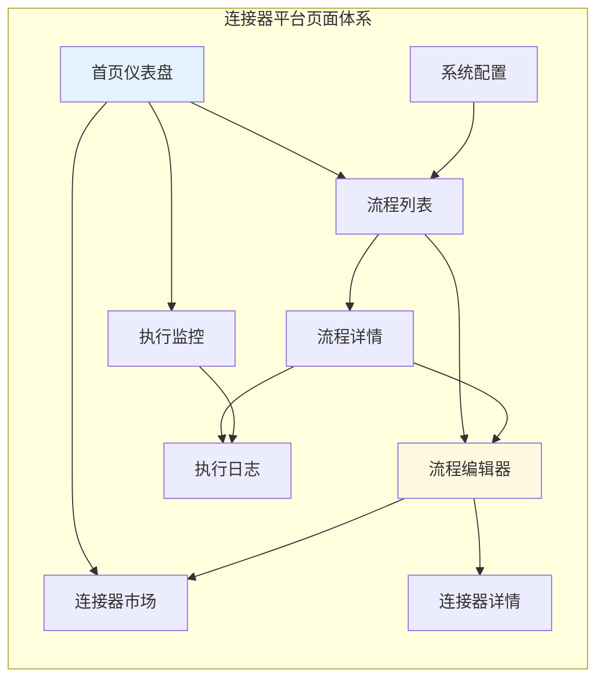
```mermaid
graph LR
    subgraph 连接器平台页面体系
        HOME[首页仪表盘]
        FLOW_LIST[流程列表]
        FLOW_EDITOR[流程编辑器]
        FLOW_DETAIL[流程详情]
        CONNECTOR_MARKET[连接器市场]
        CONNECTOR_DETAIL[连接器详情]
        MONITOR[执行监控]
        EXECUTION_LOG[执行日志]
        SYSTEM_CONFIG[系统配置]
    end
    
    HOME --> FLOW_LIST
    HOME --> CONNECTOR_MARKET
    HOME --> MONITOR
    
    FLOW_LIST --> FLOW_EDITOR
    FLOW_LIST --> FLOW_DETAIL
    FLOW_DETAIL --> FLOW_EDITOR
    FLOW_DETAIL --> EXECUTION_LOG
    
    FLOW_EDITOR --> CONNECTOR_MARKET
    FLOW_EDITOR --> CONNECTOR_DETAIL
    
    MONITOR --> EXECUTION_LOG
    
    SYSTEM_CONFIG --> FLOW_LIST
    
    style HOME fill:#e3f2fd
    style FLOW_EDITOR fill:#fff8e1
```

**页面架构详细说明:**

**1. 页面分类体系**

该架构图展示了连接器平台的完整页面体系,共包含9个核心页面,分为四大模块:

**首页仪表盘**:作为用户的统一入口,提供全局概览和快速导航功能。

**流程管理模块**:包含3个页面,是最核心的功能模块:
- **流程列表**:管理所有流程的入口页面,支持流程的创建、启停、编辑、删除等操作
- **流程编辑器**:核心工作区,通过可视化方式编排流程,包含节点添加、属性配置、数据映射、连线编辑等功能
- **流程详情**:查看流程完整信息,包括配置详情、执行历史、版本管理等

**连接器模块**:包含2个页面,提供能力发现和使用功能:
- **连接器市场**:展示平台上所有可用连接器,支持分类浏览、搜索、添加到流程
- **连接器详情**:提供连接器的完整文档和使用指南

**监控运维模块**:包含2个页面,提供运维支撑功能:
- **执行监控**:实时监控流程执行状态,提供统计图表和告警功能
- **执行日志**:查询历史执行记录,支持问题追溯和诊断

**系统配置模块**:提供管理功能,包括连接器管理、触发器管理、用户权限、系统设置等。

**2. 页面跳转关系**

**主路径**:首页仪表盘 → 流程列表 → 流程编辑器 → 连接器市场(选择连接器) → 发布流程 → 执行监控。

**辅助路径**:
- 流程编辑器 ↔ 流程详情(编辑/查看)
- 流程列表 → 执行日志(查看执行历史)
- 连接器市场 → 连接器详情(查看文档)
- 执行监控 → 执行日志详情(问题诊断)

**3. 模块间依赖关系**

**流程管理模块**是核心,依赖其他模块:
- 依赖连接器模块获取执行能力
- 依赖监控模块进行执行跟踪
- 依赖系统配置进行权限控制

**监控运维模块**为所有模块提供支撑:
- 记录所有流程的执行日志
- 提供问题诊断能力
- 支持运维人员快速定位问题

***

## 三、核心能力设计

### 3.1 触发器能力(输入)

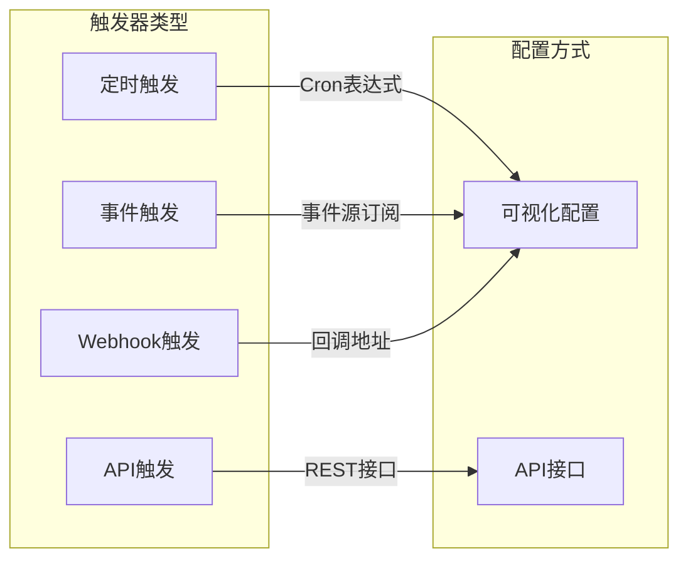
```mermaid
flowchart LR
    subgraph 触发器类型
        TIMER[定时触发]
        API_TRIGGER[API触发]
        EVENT[事件触发]
        WEBHOOK[Webhook触发]
    end
    
    subgraph 配置方式
        CONFIG_UI[可视化配置]
        CONFIG_API[API接口]
    end
    
    TIMER -->|Cron表达式| CONFIG_UI
    API_TRIGGER -->|REST接口| CONFIG_API
    EVENT -->|事件源订阅| CONFIG_UI
    WEBHOOK -->|回调地址| CONFIG_UI
```

| 触发类型  | 说明               | 配置方式     |
| ----- | ---------------- | -------- |
| 定时触发  | Cron表达式定时启动流程    | 用户配置     |
| API触发 | 通过API接口手动/外部触发流程 | 平台提供API  |
| 事件触发  | 订阅的事件发生时触发流程     | 可插拔事件源   |
| 回调触发  | Webhook回调到达时触发流程 | 平台生成回调地址 |

**触发器能力详细说明:**

**1. 四种触发器类型详解**

触发器是流程执行的起始点,连接器平台支持四种触发器类型:

**定时触发**:通过Cron表达式配置定时任务,支持秒、分、时、日、月、周多种配置方式。典型应用场景包括:每日定时汇总数据并发送报表、每周一定时发送周报、每月1号定时发送月报等。定时触发器需要配置执行时间(Cron表达式)和时区,支持配置重试策略和超时时间。

**API触发**:通过暴露REST API接口,允许外部系统通过HTTP请求触发流程执行。API触发支持GET和POST两种请求方法,支持路径参数和查询参数配置。调用方需要提供API Key进行身份验证,平台会记录每次API调用的日志和执行结果。典型应用场景包括:第三方系统回调触发、脚本触发、人工手动触发等。

**事件触发**:订阅特定业务系统发布的事件,当事件发生时自动触发流程执行。事件触发需要预先在事件源配置中订阅感兴趣的事件,并配置事件的过滤条件。平台支持事件的JSON Schema验证,确保接收的事件数据格式正确。典型应用场景包括:HR系统发布入职事件触发入职流程、OA系统发布审批完成事件触发后续处理、CRM系统发布客户变更事件触发数据同步等。

**Webhook触发**:平台为每个流程生成唯一的Webhook URL,外部系统通过POST请求向该URL发送数据即可触发流程。Webhook触发支持签名验证,确保请求来源的可靠性。支持配置请求体的JSON Path映射,提取关键字段作为流程输入参数。

**2. 配置方式对比**

可视化配置适合业务人员使用,通过界面操作即可完成触发器配置,无需编写代码。主要用于定时触发和事件触发的配置。

API接口配置适合开发人员使用,通过调用平台提供的API可以编程方式配置触发器,支持自动化配置和批量操作。主要用于API触发和Webhook触发的配置。

**3. 触发器选择建议**

选择触发器类型需要考虑以下因素:

- 如果流程需要定时执行,选择定时触发
- 如果需要外部系统主动触发,选择API触发或Webhook触发
- 如果需要响应业务系统的事件,选择事件触发
- 如果不确定触发时机,优先选择事件触发,因为最灵活

### 3.2 连接器能力(处理)

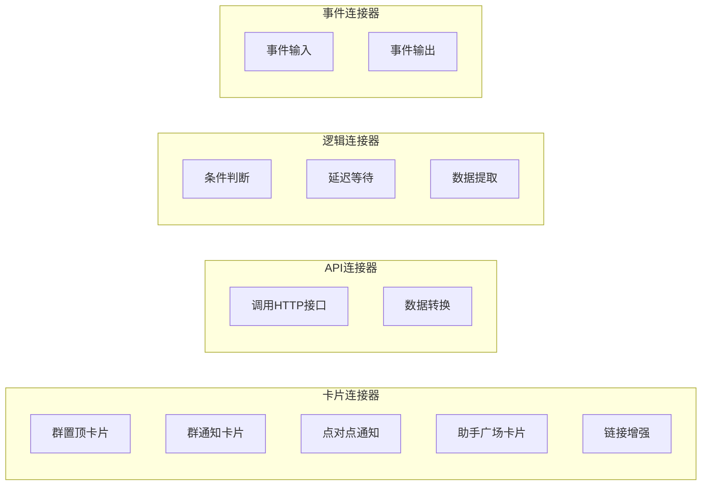
```mermaid
flowchart LR
    subgraph 卡片连接器
        C1[群置顶卡片]
        C2[群通知卡片]
        C3[点对点通知]
        C4[助手广场卡片]
        C5[链接增强]
    end
    
    subgraph API连接器
        A1[调用HTTP接口]
        A2[数据转换]
    end
    
    subgraph 逻辑连接器
        L1[条件判断]
        L2[延迟等待]
        L3[数据提取]
    end
    
    subgraph 事件连接器
        E1[事件输入]
        E2[事件输出]
    end
```

| 连接器类型  | 支持的动作                     | 输出         |
| ------ | ------------------------- | ---------- |
| 卡片连接器  | 发送群置顶、群通知、点对点、助手广场卡片,生成链接 | 调用卡片平台API  |
| API连接器 | 调用HTTP接口,数据转换与映射          | 调用平台上架的API |
| 逻辑连接器  | 条件判断(if-else),延迟等待,数据提取   | 内置处理       |
| 事件连接器  | 事件输入触发,事件输出发布             | 与事件系统集成    |

**连接器能力详细说明:**

**1. 四大连接器类型详解**

连接器是流程执行过程中调用的能力单元,封装了对外部系统的调用逻辑。

**卡片连接器**:封装了开放平台的卡片发送能力,是连接器平台的核心输出能力。包括五种卡片类型:

- **群置顶卡片**:发送到指定群聊并置顶显示,适用于紧急通知、重大公告等需要强提醒的场景。卡片会在群里始终显示在顶部,直到手动取消置顶。典型应用:系统故障紧急告警、公司重要通知发布。
- **群通知卡片**:发送到指定群聊的普通卡片消息,不会置顶。适用于流程执行结果通知、每日数据汇总报告等常规信息推送。典型应用:每日销售数据汇报、审批结果通知。
- **点对点通知**:发送消息给指定用户,是一对一的消息通知。适用于任务分配提醒、个人待办通知等需要个人关注的信息。典型应用:待办任务提醒、审批结果通知。
- **助手广场卡片**:发送交互式卡片,支持按钮点击、选项选择等交互操作。用户可以直接在卡片上完成审批、确认等操作。典型应用:权限申请待审批、投票调查收集。
- **链接增强**:对卡片中的链接进行增强处理,可以追踪链接的点击次数、记录点击用户信息、生成一次性访问令牌等。适用于需要追踪用户行为的场景。

**API连接器**:封装了对HTTP接口的调用能力,支持调用内部和第三方API。包括两种主要能力:

- **调用HTTP接口**:支持GET、POST、PUT、DELETE等HTTP方法,支持配置请求头、请求体、认证信息等。支持响应数据的提取和映射。典型应用:调用HR系统API获取员工信息、调用财务系统API创建报销单。
- **数据转换**:对输入数据进行格式转换、字段映射、计算处理等操作。包括JSON到JSON的转换、XML到JSON的转换、日期格式转换、数值计算等。典型应用:提取事件数据中的关键字段、计算金额的百分比。

**逻辑连接器**:提供流程控制的逻辑能力,不涉及外部系统调用。包括三种组件:

- **条件判断**:支持if-else分支逻辑,根据输入数据的值判断走不同的执行路径。支持比较运算(等于、大于、小于等)、逻辑运算(与、或、非)、正则匹配等条件类型。典型应用:根据审批结果判断是否发送通过或拒绝通知。
- **延迟等待**:暂停流程执行指定时间,支持固定时长延迟和定时延迟。固定时长延迟如等待10分钟后重试,定时延迟如等到某个时间点再继续执行。典型应用:审批超时提醒、失败重试。
- **数据提取**:从输入数据中提取指定字段或计算新的字段,作为后续节点的输入。支持JSON Path提取、正则提取、默认值设置等。典型应用:从事件数据提取客户ID作为后续API调用的参数。

**事件连接器**:提供事件的发布和订阅能力,用于流程之间的联动。包括两种能力:

- **事件输入**:将流程作为事件的消费者,接收其他流程发布的事件数据。用于流程间的解耦,一个流程可以触发多个下游流程。典型应用:主流程完成后发布事件,多个子流程分别订阅执行。
- **事件输出**:将流程作为事件的生产者,向事件总线发布事件数据。用于触发其他系统或流程。典型应用:流程执行完成后发布执行结果事件。

**2. 连接器使用场景推荐**

**卡片连接器使用建议**:优先使用群通知卡片作为常规通知方式,只有在紧急情况下才使用群置顶卡片以避免通知疲劳。点对点通知适用于需要个人确认的信息。助手广场卡片适用于需要用户交互确认的场景,但要注意用户可能不在线导致超时。

**API连接器使用建议**:调用外部API时要设置合理的超时时间和重试策略。对于调用失败的情况,建议记录日志并发送告警,便于问题追踪。数据转换尽量在前端完成,减少后端逻辑复杂度。

**逻辑连接器使用建议**:条件判断的条件表达式要清晰易懂,便于后期维护。延迟等待要根据业务场景设置合理的等待时间,避免等待时间过长影响用户体验。数据提取的字段名要有意义,便于后续节点引用。

### 3.3 流程编排能力

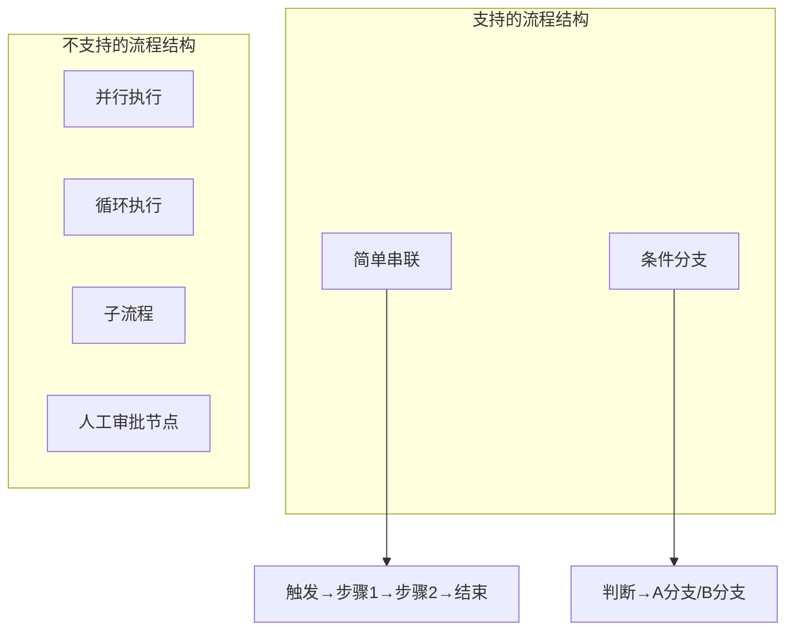
```mermaid
flowchart TB
    subgraph 支持的流程结构
        A1[简单串联]
        A2[条件分支]
    end
    
    A1 --> A3[触发→步骤1→步骤2→结束]
    A2 --> A4[判断→A分支/B分支]
    
    subgraph 不支持的流程结构
        B1[并行执行]
        B2[循环执行]
        B3[子流程]
        B4[人工审批节点]
    end
```

**支持的流程结构:**

```
简单串联:
[触发器] → [步骤1:获取数据] → [步骤2:处理数据] → [步骤3:发送卡片] → [结束]

条件分支:
[触发器] → [判断条件] 
          ├─ 条件A → [发送群通知卡片] → [结束]
          └─ 条件B → [发送点对点卡片] → [结束]
```

***

## 四、页面详细设计

### 4.1 首页仪表盘

#### 4.1.1 页面作用

首页仪表盘是用户登录连接器平台后的**第一个页面**,定位为用户的"**能力控制台**"。

**主要作用:**

- **全局概览**:让用户快速了解平台整体使用状况
- **快速入口**:让用户快速进入核心工作区
- **最近动态**:展示用户最近关注的流程和活动
- **关键指标**:展示连接器数量、流程数量、执行情况等核心指标

#### 4.1.2 页面功能模块

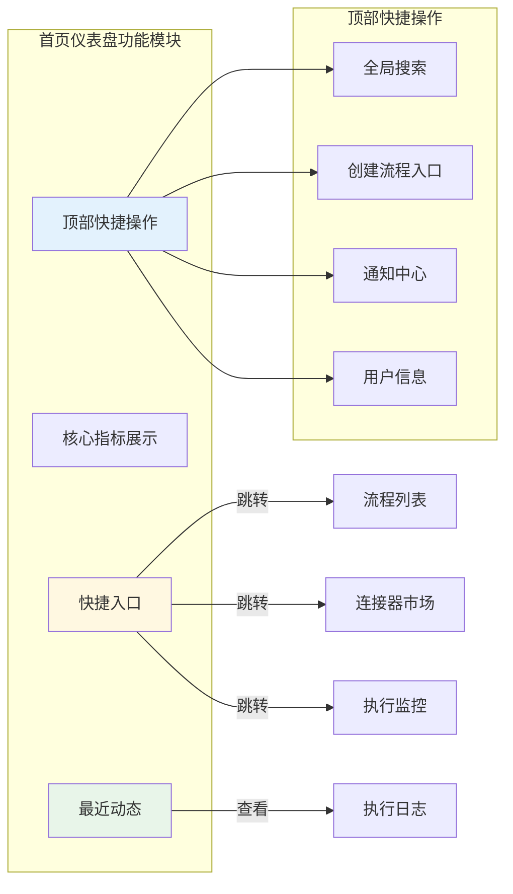
```mermaid
flowchart LR
    subgraph 首页仪表盘功能模块
        A1[顶部快捷操作]
        A2[核心指标展示]
        A3[快捷入口]
        A4[最近动态]
    end
    
    subgraph 顶部快捷操作
        SEARCH[全局搜索]
        CREATE[创建流程入口]
        NOTIFY[通知中心]
        USER[用户信息]
    end
    
    A1 --> SEARCH
    A1 --> CREATE
    A1 --> NOTIFY
    A1 --> USER
    
    A3 -->|跳转| FLOW_LIST[流程列表]
    A3 -->|跳转| CONNECTOR_MARKET[连接器市场]
    A3 -->|跳转| MONITOR[执行监控]
    A4 -->|查看| EXECUTION_LOG[执行日志]
    
    style A1 fill:#e3f2fd
    style A3 fill:#fff8e1
    style A4 fill:#e8f5e9
```

**首页仪表盘功能模块详细说明:**

**1. 图表整体结构说明**

该流程图展示了首页仪表盘的四大功能模块及其子功能项。图表采用分层结构,从整体到局部展示了功能模块的包含关系和使用流向。

**2. 核心图标详解**

**A1[顶部快捷操作]** - 蓝色背景(#e3f5fe):代表页面顶部的快捷操作区,包含全局搜索、创建流程入口、通知中心、用户信息四个子功能。这个区域是用户登录后首先看到的区域,提供最常用的操作入口。

**A2[核心指标展示]** - 代表页面中部的统计指标区域,展示平台的核心运行数据,包括连接器总数、流程总数、执行次数、成功率等关键指标,以及这些指标的变化趋势图。

**A3[快捷入口]** - 黄色背景(#fff8e1):代表页面中部的快捷入口区,提供一键跳转到核心功能页面的快捷按钮。这个区域让用户可以快速进入需要的功能模块。

**A4[最近动态]** - 绿色背景(#e8f5e9):代表页面下部的最近活动区域,展示用户最近关注的流程执行情况、创建的流程等信息。

**3. 子功能图标详解**

**SEARCH[全局搜索]** - 全局搜索功能图标,支持用户搜索流程、连接器、执行记录等内容。搜索框通常位于页面最显眼的位置,方便用户快速找到需要的内容。

**CREATE[创建流程入口]** - 创建流程按钮图标,点击后跳转到流程编辑器创建新的流程。这个按钮是平台的核心操作入口之一,通常采用醒目的颜色或样式。

**NOTIFY[通知中心]** - 通知中心图标,展示系统的告警消息、系统通知等信息。通知中心通常以徽标形式显示未读消息数量。

**USER[用户信息]** - 用户信息图标,展示当前登录用户的信息,通常包含用户头像、用户名,点击可查看用户详情或退出登录。

**FLOW_LIST[流程列表]** - 流程列表页面图标,代表用户通过快捷入口跳转的目标页面之一。

**CONNECTOR_MARKET[连接器市场]** - 连接器市场页面图标,代表用户通过快捷入口跳转的目标页面之一。

**MONITOR[执行监控]** - 执行监控页面图标,代表用户通过快捷入口跳转的目标页面之一。

**EXECUTION_LOG[执行日志]** - 执行日志页面图标,代表用户查看最近活动时跳转的目标页面。

**4. 箭头关系说明**

**A1 --> SEARCH/CREATE/NOTIFY/USER**:表示顶部快捷操作区域包含全局搜索、创建流程入口、通知中心、用户信息四个子功能。

**A3 -->|跳转| FLOW_LIST**:表示快捷入口区提供跳转到流程列表页面的入口,用户点击后可以进入流程管理页面。

**A3 -->|跳转| CONNECTOR_MARKET**:表示快捷入口区提供跳转到连接器市场页面的入口,用户点击后可以浏览和选择连接器。

**A3 -->|跳转| MONITOR**:表示快捷入口区提供跳转到执行监控页面的入口,用户点击后可以查看执行状态和统计信息。

**A4 -->|查看| EXECUTION_LOG**:表示最近动态区域提供查看执行日志详情的入口,用户可以查看具体的执行记录。

**5. 视觉层次说明**

图表中使用不同颜色区分功能模块的重要程度:

**蓝色区域(A1)**:基础操作区,提供系统的基础操作入口,是用户每天都会使用的功能。

**黄色区域(A3)**:功能入口区,提供跳转到核心功能页面的快捷方式,提高用户操作效率。

**绿色区域(A4)**:信息展示区,展示用户关注的信息,帮助用户快速了解最新动态。

**功能模块说明:**

| 模块     | 功能点    | 说明                  |
| ------ | ------ | ------------------- |
| 顶部快捷操作 | 全局搜索   | 支持搜索流程、连接器、执行记录     |
| <br /> | 创建流程入口 | 一键跳转到流程编辑器          |
| <br /> | 通知中心   | 展示告警消息、系统通知         |
| <br /> | 用户信息   | 登录用户信息、退出登录         |
| 核心指标展示 | 指标卡片区  | 连接器总数、流程总数、执行次数、成功率 |
| <br /> | 趋势图区   | 展示关键指标的变化趋势         |
| 快捷入口   | 快捷入口区  | 创建流程、连接器市场、执行监控、文档  |
| 最近动态   | 最近活动区  | 最近执行的流程、最近创建的流程     |
| <br /> | 我的收藏区  | 用户收藏的流程和连接器         |

#### 4.1.3 交互逻辑

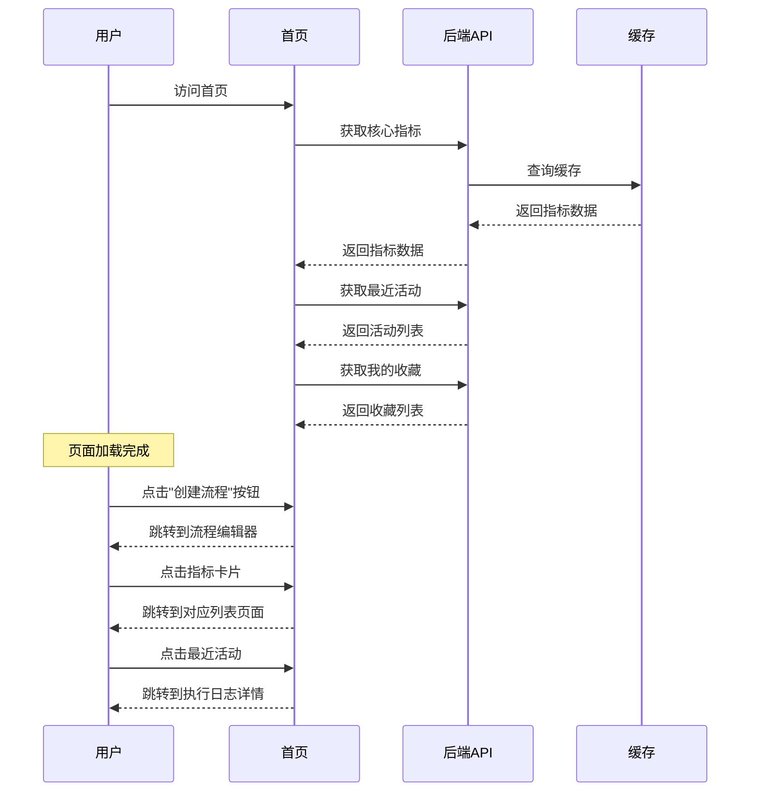
```mermaid
sequenceDiagram
    participant 用户
    participant 首页
    participant 后端API
    participant 缓存
    
    用户->>首页: 访问首页
    首页->>后端API: 获取核心指标
    后端API->>缓存: 查询缓存
    缓存-->>后端API: 返回指标数据
    后端API-->>首页: 返回指标数据
    首页->>后端API: 获取最近活动
    后端API-->>首页: 返回活动列表
    首页->>后端API: 获取我的收藏
    后端API-->>首页: 返回收藏列表
    
    Note over 用户: 页面加载完成
    
    用户->>首页: 点击"创建流程"按钮
    首页-->>用户: 跳转到流程编辑器
    
    用户->>首页: 点击指标卡片
    首页-->>用户: 跳转到对应列表页面
    
    用户->>首页: 点击最近活动
    首页-->>用户: 跳转到执行日志详情
```

#### 4.1.4 页面关系

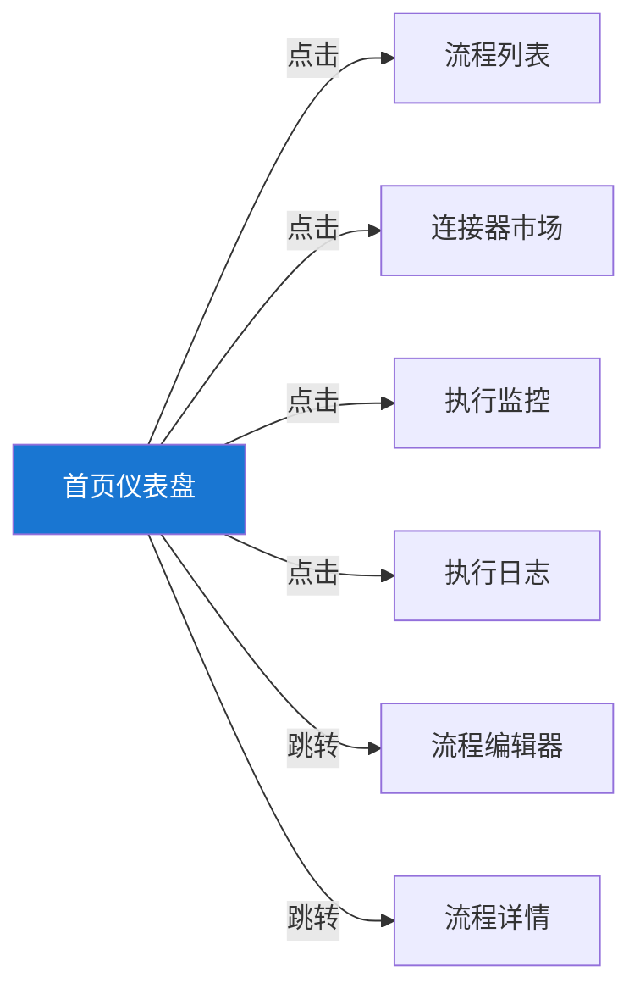
```mermaid
graph LR
    HOME[首页仪表盘] -->|点击| FLOW_LIST[流程列表]
    HOME -->|点击| CONNECTOR_MARKET[连接器市场]
    HOME -->|点击| MONITOR[执行监控]
    HOME -->|点击| EXECUTION_LOG[执行日志]
    
    HOME -->|跳转| FLOW_EDITOR[流程编辑器]
    HOME -->|跳转| FLOW_DETAIL[流程详情]
    
    style HOME fill:#1976d2,color:#fff
```

***

### 4.2 流程列表页面

#### 4.2.1 页面作用

流程列表是管理所有流程的**主入口**。

**主要作用:**

- **流程总览**:展示用户创建的所有流程
- **状态管理**:快速了解流程的启用/禁用状态
- **快速操作**:启停、编辑、删除、复制流程
- **筛选查询**:按名称、状态、类型等筛选流程

#### 4.2.2 页面功能模块

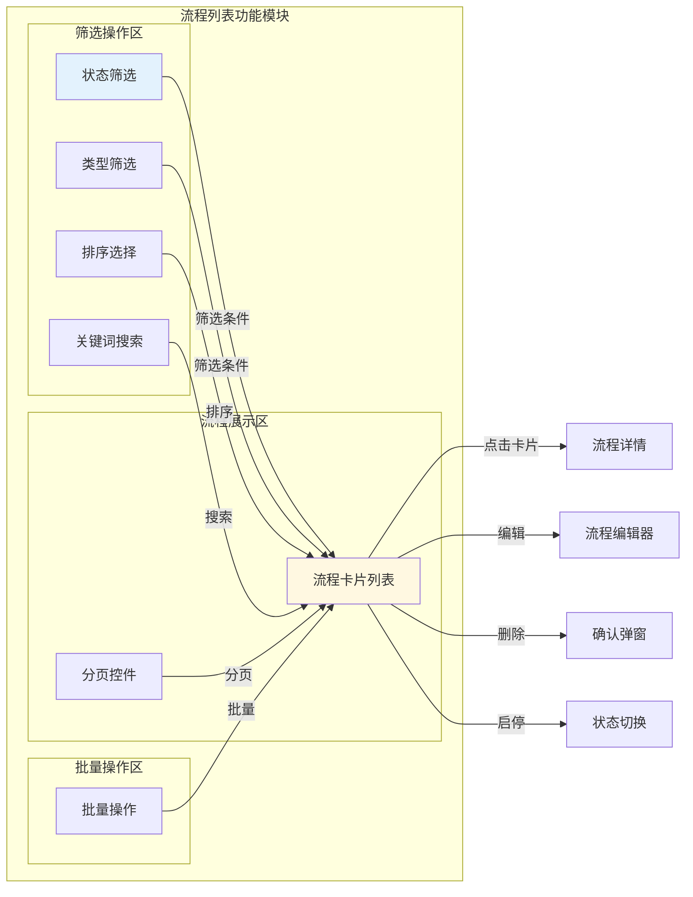
```mermaid
graph LR
    subgraph 流程列表功能模块
        subgraph 筛选操作区
            FILTER_STATUS[状态筛选]
            FILTER_TYPE[类型筛选]
            FILTER_SORT[排序选择]
            FILTER_SEARCH[关键词搜索]
        end
        
        subgraph 流程展示区
            FLOW_CARDS[流程卡片列表]
            PAGINATION[分页控件]
        end
        
        subgraph 批量操作区
            BATCH[批量操作]
        end
    end
    
    FILTER_STATUS -->|筛选条件| FLOW_CARDS
    FILTER_TYPE -->|筛选条件| FLOW_CARDS
    FILTER_SORT -->|排序| FLOW_CARDS
    FILTER_SEARCH -->|搜索| FLOW_CARDS
    
    FLOW_CARDS -->|点击卡片| FLOW_DETAIL[流程详情]
    FLOW_CARDS -->|编辑| FLOW_EDITOR[流程编辑器]
    FLOW_CARDS -->|删除| CONFIRM[确认弹窗]
    FLOW_CARDS -->|启停| TOGGLE[状态切换]
    
    PAGINATION -->|分页| FLOW_CARDS
    BATCH -->|批量| FLOW_CARDS
    
    style FILTER_STATUS fill:#e3f2fd
    style FLOW_CARDS fill:#fff8e1
```

**流程列表功能模块详细说明:**

**1. 图表整体结构说明**

该流程图展示了流程列表页面的三大功能模块及其子功能项。图表采用分层结构,从整体到局部展示了功能模块的包含关系和操作流向。

**2. 核心图标详解**

**筛选操作区**:代表页面顶部的筛选操作栏,包含状态筛选、类型筛选、排序选择、关键词搜索四个子功能。这个区域帮助用户在众多流程中快速定位目标流程。

**流程展示区**:代表页面中央的流程列表展示区域,以卡片形式展示每个流程的信息。黄色背景突出显示这是页面的核心内容区域。

**批量操作区**:代表页面的批量操作功能区,提供对多个流程同时进行操作的便利。

**3. 筛选操作区子图标详解**

**FILTER_STATUS[状态筛选]** - 蓝色背景:状态筛选下拉框,支持按流程状态进行筛选,包括"全部"、"启用"、"禁用"三种状态。蓝色背景表示这是基础的筛选功能。

**FILTER_TYPE[类型筛选]** - 类型筛选下拉框,支持按流程类型进行筛选,帮助用户找到特定类型的流程。

**FILTER_SORT[排序选择]** - 排序选择下拉框,支持按不同维度对流程列表进行排序,包括按创建时间、按执行次数、按名称等维度。

**FILTER_SEARCH[关键词搜索]** - 关键词搜索框,支持用户输入关键词快速匹配流程名称,实现精准搜索。

**4. 流程展示区子图标详解**

**FLOW_CARDS[流程卡片列表]** - 黄色背景:代表流程卡片列表的核心展示区域,每个卡片包含流程名称、状态、类型、执行统计等核心信息。

**PAGINATION[分页控件]** - 分页控件,当流程数量较多时提供分页展示功能,用户可以翻页或跳转特定页码查看流程列表。

**5. 批量操作区子图标详解**

**BATCH[批量操作]** - 批量操作按钮,支持对选中的多个流程同时进行启用、禁用、删除等操作,提高管理效率。

**6. 目标页面图标详解**

**FLOW_DETAIL[流程详情]** - 流程详情页面图标,代表用户点击流程卡片后跳转的目标页面,用于查看流程的完整信息。

**FLOW_EDITOR[流程编辑器]** - 流程编辑器页面图标,代表用户点击编辑按钮后跳转的目标页面,用于修改流程配置。

**CONFIRM[确认弹窗]** - 确认对话框图标,代表用户执行删除等危险操作时系统弹出的二次确认窗口,防止误操作。

**TOGGLE[状态切换]** - 状态切换开关图标,代表用户切换流程启用/禁用状态的操作。

**7. 箭头关系详解**

**筛选条件箭头**:所有筛选操作(FILTER_STATUS/FILTER_TYPE/FILTER_SEARCH)都指向FLOW_CARDS,表示筛选结果会影响流程卡片的展示内容。

**排序箭头**:FILTER_SORT指向FLOW_CARDS,表示排序会影响流程卡片的排列顺序。

**操作箭头**:FLOW_CARDS指向各个目标页面,表示用户可以在流程卡片上执行查看详情、编辑等操作。

**分页箭头**:PAGINATION指向FLOW_CARDS,表示分页操作会影响展示的流程列表。

**8. 交互流程说明**

**筛选流程**:用户设置筛选条件 → 条件传递给流程卡片列表 → 列表重新渲染显示符合条件的流程。

**搜索流程**:用户输入关键词 → 系统实时搜索匹配 → 列表显示搜索结果。

**查看流程**:用户点击流程卡片 → 跳转到流程详情页面 → 展示流程完整信息。

**编辑流程**:用户点击编辑按钮 → 跳转到流程编辑器 → 进入编辑模式修改流程。

**删除流程**:用户点击删除按钮 → 弹出确认对话框 → 用户确认后执行删除 → 列表刷新显示删除后的结果。

**功能模块说明:**

| 模块     | 功能点    | 说明                |
| ------ | ------ | ----------------- |
| 筛选操作区  | 状态筛选   | 全部/启用/禁用状态过滤      |
| <br /> | 类型筛选   | 按流程类型筛选           |
| <br /> | 排序选择   | 创建时间/执行次数/名称排序    |
| <br /> | 关键词搜索  | 按流程名称关键词搜索        |
| 流程展示区  | 流程卡片列表 | 展示流程卡片,包含状态、类型、统计 |
| <br /> | 分页控件   | 分页展示和跳转           |
| 批量操作区  | 批量操作   | 批量启用/禁用/删除        |

#### 4.2.3 交互逻辑

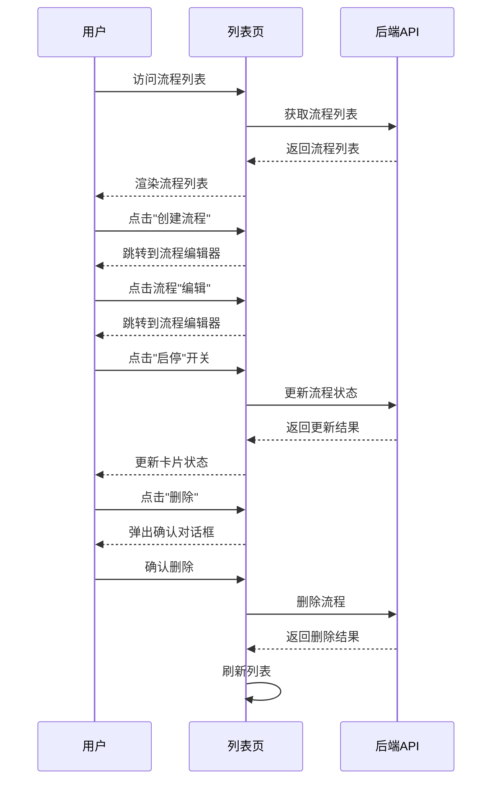
```mermaid
sequenceDiagram
    participant 用户
    participant 列表页
    participant 后端API
    
    用户->>列表页: 访问流程列表
    列表页->>后端API: 获取流程列表
    后端API-->>列表页: 返回流程列表
    列表页-->>用户: 渲染流程列表
    
    用户->>列表页: 点击"创建流程"
    列表页-->>用户: 跳转到流程编辑器
    
    用户->>列表页: 点击流程"编辑"
    列表页-->>用户: 跳转到流程编辑器
    
    用户->>列表页: 点击"启停"开关
    列表页->>后端API: 更新流程状态
    后端API-->>列表页: 返回更新结果
    列表页-->>用户: 更新卡片状态
    
    用户->>列表页: 点击"删除"
    列表页-->>用户: 弹出确认对话框
    用户->>列表页: 确认删除
    列表页->>后端API: 删除流程
    后端API-->>列表页: 返回删除结果
    列表页->>列表页: 刷新列表
```

***

### 4.3 流程编辑器页面(核心页面)

#### 4.3.1 页面作用

流程编辑器是连接器平台的**核心工作区**。

**主要作用:**

- **流程设计**:通过可视化连线编辑方式设计流程
- **节点配置**:配置每个节点的参数、数据映射、条件
- **流程测试**:在正式发布前测试流程执行
- **版本管理**:保存流程草稿、发布正式版本

#### 4.3.2 页面功能模块

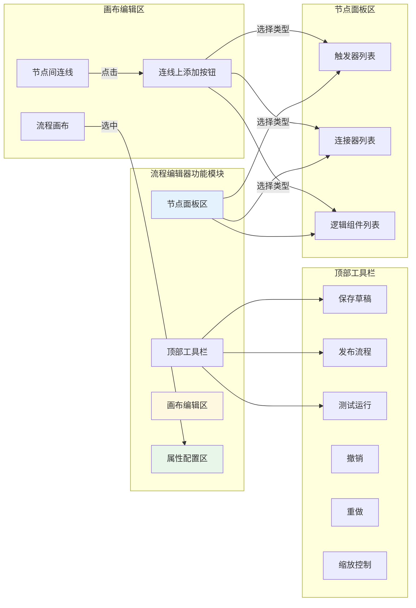
```mermaid
flowchart LR
    subgraph 流程编辑器功能模块
        A1[顶部工具栏]
        A2[节点面板区]
        A3[画布编辑区]
        A4[属性配置区]
    end
    
    subgraph 顶部工具栏
        TOOLBAR_SAVE[保存草稿]
        TOOLBAR_PUBLISH[发布流程]
        TOOLBAR_TEST[测试运行]
        TOOLBAR_UNDO[撤销]
        TOOLBAR_REDO[重做]
        TOOLBAR_ZOOM[缩放控制]
    end
    
    subgraph 节点面板区
        TRIGGER_PANEL[触发器列表]
        CONNECTOR_PANEL[连接器列表]
        LOGIC_PANEL[逻辑组件列表]
    end
    
    subgraph 画布编辑区
        CANVAS_AREA[流程画布]
        ADD_BTN[连线上添加按钮]
        NODE_CONNECT[节点间连线]
    end
    
    A1 --> TOOLBAR_SAVE
    A1 --> TOOLBAR_PUBLISH
    A1 --> TOOLBAR_TEST
    
    A2 --> TRIGGER_PANEL
    A2 --> CONNECTOR_PANEL
    A2 --> LOGIC_PANEL
    
    NODE_CONNECT -->|点击| ADD_BTN
    ADD_BTN -->|选择类型| TRIGGER_PANEL
    ADD_BTN -->|选择类型| CONNECTOR_PANEL
    ADD_BTN -->|选择类型| LOGIC_PANEL
    
    CANVAS_AREA -->|选中| A4
    
    style A2 fill:#e3f2fd
    style A3 fill:#fff8e1
    style A4 fill:#e8f5e9
```

**流程编辑器功能模块详细说明:**

**1. 四大功能区域概述**

流程编辑器是连接器平台的核心工作区,采用四区布局设计:

**顶部工具栏**:提供流程编辑的操作入口,位于页面最上方,方便快速操作。包含保存、发布、测试等高频操作按钮。

**节点面板区**:位于页面左侧,展示流程编辑所需的各类节点组件。包含触发器列表、连接器列表、逻辑组件列表。这个区域作为节点类型的参考库,用户在画布连线上添加节点时可以选择这些类型。

**画布编辑区**:占据页面中央大部分区域,是流程设计的主要工作区。用户在这里点击连线上的添加按钮来创建新节点、连接节点、调整节点位置和布局、可视化查看流程结构。与传统拖拽方式不同,节点通过点击连线的添加按钮来创建。

**属性配置区**:位于页面右侧或下方,当用户选中节点或连线时,显示对应的配置选项。用户在此配置节点的参数、数据映射等。

**2. 顶部工具栏功能详解**

**保存草稿**:将当前编辑的流程保存为草稿状态,不会影响线上运行的流程。草稿可以多次保存,方便分阶段编辑。

**发布流程**:将经过测试验证的流程正式发布到生产环境。发布前会进行配置校验,确保流程定义完整正确。

**测试运行**:在正式发布前验证流程的正确性。测试运行使用模拟数据,不会产生实际业务影响。

**撤销/重做**:提供编辑历史回溯能力,支持撤销最近50步编辑操作,避免误操作导致的工作丢失。

**缩放控制**:调整画布的显示比例,范围通常为50%-200%,便于查看整体结构或局部细节。

**3. 节点面板区功能详解**

**触发器列表**:展示平台支持的所有触发器类型,包括定时触发、API触发、事件触发、Webhook触发。每个流程必须包含一个且仅一个触发器节点,作为流程的起点。

**连接器列表**:展示平台提供的所有连接器能力,分为卡片连接器(发送各类卡片)、API连接器(调用HTTP接口)、事件连接器(发布/订阅事件)等类别。用户可以根据业务需求选择合适的连接器。

**逻辑组件列表**:提供流程控制的逻辑组件,包括条件判断(if-else分支)、延迟等待(暂停执行)、数据提取(字段映射)等。这些组件用于实现流程的逻辑控制和数据处理。

**4. 画布编辑区功能详解**

**节点创建操作**:在两个已有节点的连线上,会出现一个"+"添加按钮。点击该按钮后,会弹出节点类型选择菜单,用户可以选择要添加的节点类型(触发器/连接器/逻辑组件),选中后节点会被插入到连线中。这是与传统拖拽方式的核心区别。

**节点操作**:用户可以选中画布上的节点,调整节点位置,双击节点编辑名称,右键节点进行复制、删除等操作。

**连线操作**:节点之间会自动生成连线。当需要添加新节点时,点击连线上的添加按钮。当需要创建分支连线时(例如条件判断的真/假分支),在条件节点的分支连线上点击添加按钮,选择目标节点类型,即可创建条件分支连接。支持创建条件分支连线,区分条件为真和为假时的不同流向。

**画布操作**:支持画布的缩放、平移、多选、批量删除、对齐等操作,提高编辑效率。

**5. 属性配置区功能详解**

**节点属性**:配置选中节点的名称、描述、参数值等。每个节点类型有不同的配置项,例如API连接器需要配置调用的API和请求参数。

**数据映射**:定义节点间的数据传递关系。例如触发器节点的输出数据如何传递给后续节点,后续节点的输出又如何传递给再下一个节点。

**高级配置**:包括超时时间设置、重试策略配置、错误处理策略等,用于处理执行过程中的异常情况。

**6. 编辑器使用流程(钉钉实现方式)**

**创建流程**:在画布上创建一个触发器节点(作为流程起点) → 在触发器与结束位置之间的连线上点击添加按钮 → 选择需要的连接器类型 → 节点被插入到连线中 → 继续在后续连线上添加更多节点 → 配置每个节点的参数 → 配置节点间的数据映射 → 保存草稿 → 测试运行 → 发布流程。

**修改流程**:打开已有流程 → 修改需要调整的节点 → 调整节点间的连接关系 → 更新数据映射 → 保存并测试 → 重新发布。

**功能模块说明:**

| 模块     | 功能点    | 说明                        |
| ------ | ------ | ------------------------- |
| 顶部工具栏  | 保存草稿   | 保存当前流程为草稿                 |
| <br /> | 发布流程   | 将流程正式发布上线                 |
| <br /> | 测试运行   | 配置测试参数并执行测试               |
| <br /> | 撤销/重做  | 撤销/重做编辑操作                 |
| <br /> | 缩放控制   | 画布缩放比例控制                  |
| 节点面板区  | 触发器列表  | 定时触发、事件触发、API触发、Webhook触发 |
| <br /> | 连接器列表  | 卡片连接器、API连接器等             |
| <br /> | 逻辑组件列表 | 条件判断、延迟等待、数据提取            |
| 画布编辑区  | 流程画布   | 可缩放、点击添加节点的画布区域          |
| <br /> | 节点渲染   | 显示流程节点                    |
| <br /> | 连线渲染   | 节点间连接线                    |
| <br /> | 小地图    | 显示整体流程结构                  |
| 属性配置区  | 节点配置面板 | 配置选中节点的参数                 |
| <br /> | 流程配置面板 | 配置流程级别参数                  |
| <br /> | 数据映射弹窗 | 配置节点间数据映射                 |

#### 4.3.3 交互逻辑

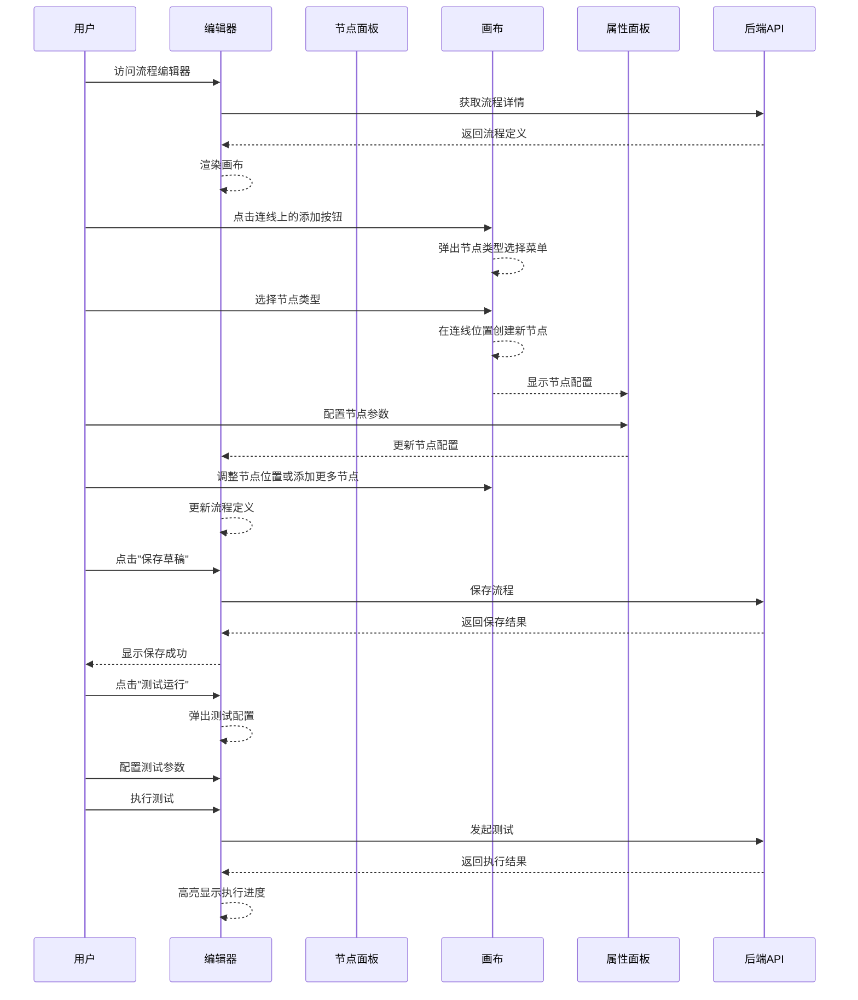
```mermaid
sequenceDiagram
    participant 用户
    participant 编辑器
    participant 节点面板
    participant 画布
    participant 属性面板
    participant 后端API
    
    用户->>编辑器: 访问流程编辑器
    编辑器->>后端API: 获取流程详情
    后端API-->>编辑器: 返回流程定义
    编辑器-->>编辑器: 渲染画布
    
    用户->>画布: 点击连线上的添加按钮
    画布-->>画布: 弹出节点类型选择菜单
    用户->>画布: 选择节点类型
    画布-->>画布: 在连线位置创建新节点
    画布-->>属性面板: 显示节点配置
    
    用户->>属性面板: 配置节点参数
    属性面板-->>编辑器: 更新节点配置
    
    用户->>画布: 调整节点位置或添加更多节点
    编辑器-->>编辑器: 更新流程定义
    
    用户->>编辑器: 点击"保存草稿"
    编辑器->>后端API: 保存流程
    后端API-->>编辑器: 返回保存结果
    编辑器-->>用户: 显示保存成功
    
    用户->>编辑器: 点击"测试运行"
    编辑器-->>编辑器: 弹出测试配置
    用户->>编辑器: 配置测试参数
    用户->>编辑器: 执行测试
    编辑器->>后端API: 发起测试
    后端API-->>编辑器: 返回执行结果
    编辑器-->>编辑器: 高亮显示执行进度
```

#### 4.3.4 节点添加流程(钉钉实现方式)

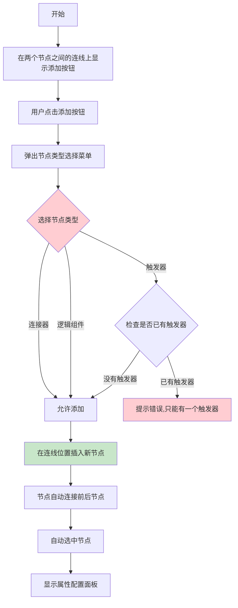
```mermaid
flowchart TD
    A[开始] --> B[在两个节点之间的连线上显示添加按钮]
    B --> C[用户点击添加按钮]
    C --> D[弹出节点类型选择菜单]
    D --> E{选择节点类型}
    E -->|触发器| F{检查是否已有触发器}
    E -->|连接器| G[允许添加]
    E -->|逻辑组件| G
    F -->|已有触发器| H[提示错误,只能有一个触发器]
    F -->|没有触发器| G
    G --> I[在连线位置插入新节点]
    I --> J[节点自动连接前后节点]
    J --> K[自动选中节点]
    K --> L[显示属性配置面板]
    
    style H fill:#ffcdd2
    style I fill:#c8e6c9
    
    style E fill:#ffcdd2
    style I fill:#c8e6c9
```

***

### 4.4 流程详情页面

#### 4.4.1 页面作用

流程详情页用于**查看流程的完整信息**。

**主要作用:**

- **流程概览**:查看流程的基本信息、配置状态
- **执行历史**:查看该流程的所有执行记录
- **版本管理**:查看流程的版本历史
- **关联分析**:查看流程使用的连接器和被引用情况

#### 4.4.2 页面功能模块

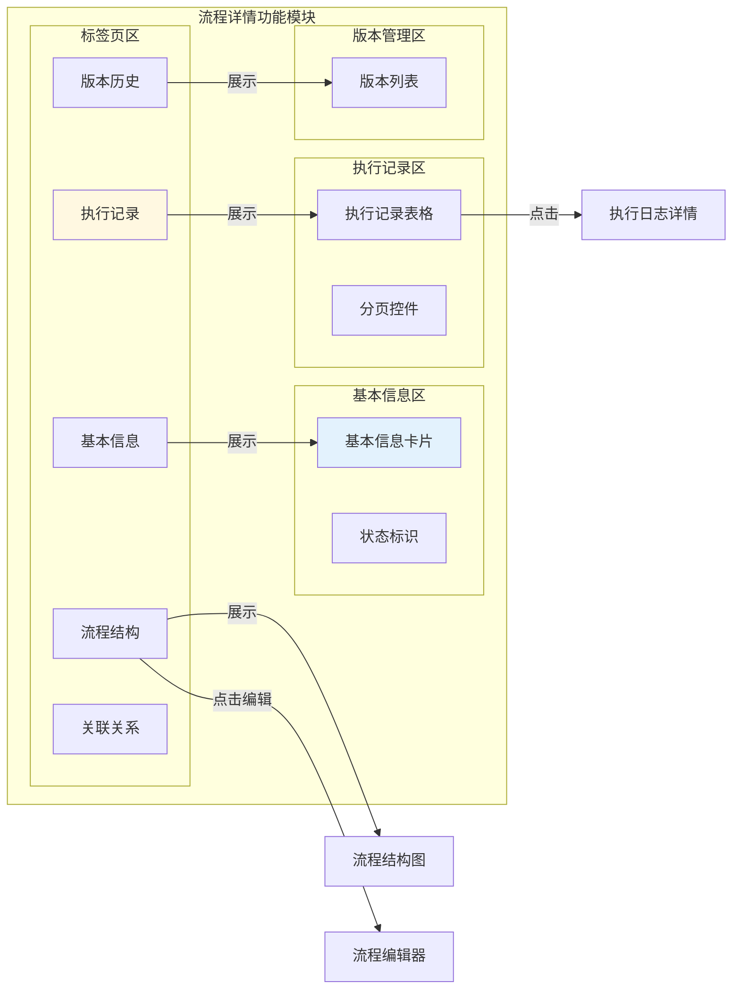
```mermaid
graph LR
    subgraph 流程详情功能模块
        subgraph 基本信息区
            INFO_CARD[基本信息卡片]
            STATUS[状态标识]
        end
        
        subgraph 标签页区
            TAB_BASIC[基本信息]
            TAB_STRUCTURE[流程结构]
            TAB_EXECUTION[执行记录]
            TAB_VERSION[版本历史]
            TAB_RELATION[关联关系]
        end
        
        subgraph 执行记录区
            EXEC_TABLE[执行记录表格]
            EXEC_PAGINATION[分页控件]
        end
        
        subgraph 版本管理区
            VERSION_LIST[版本列表]
        end
    end
    
    TAB_BASIC -->|展示| INFO_CARD
    TAB_STRUCTURE -->|展示| FLOW_DIAGRAM[流程结构图]
    TAB_EXECUTION -->|展示| EXEC_TABLE
    TAB_VERSION -->|展示| VERSION_LIST
    
    EXEC_TABLE -->|点击| LOG_DETAIL[执行日志详情]
    TAB_STRUCTURE -->|点击编辑| FLOW_EDITOR[流程编辑器]
    
    style INFO_CARD fill:#e3f2fd
    style TAB_EXECUTION fill:#fff8e1
```

**功能模块说明:**

| 模块     | 功能点    | 说明                  |
| ------ | ------ | ------------------- |
| 基本信息区  | 基本信息卡片 | 流程名称、ID、状态、版本、创建时间等 |
| <br /> | 状态标识   | 启用/禁用状态显示           |
| 标签页区   | 基本信息   | 触发配置、基础配置详情         |
| <br /> | 流程结构   | 可视化流程图展示            |
| <br /> | 执行记录   | 该流程的执行历史            |
| <br /> | 版本历史   | 流程的版本变更记录           |
| <br /> | 关联关系   | 使用的连接器、被引用情况        |
| 执行记录区  | 执行记录表格 | 执行ID、时间、状态、时长       |
| <br /> | 分页控件   | 分页展示执行记录            |
| 版本管理区  | 版本列表   | 历史版本列表和对比           |

#### 4.4.3 页面关系

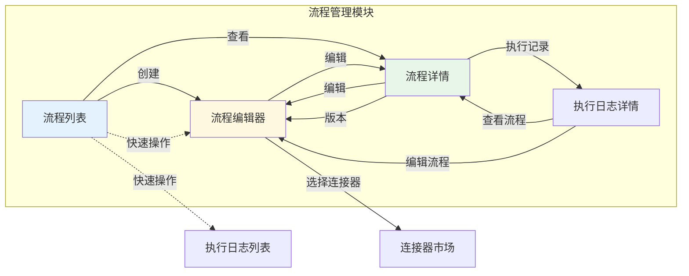
```mermaid
graph LR
    subgraph 流程管理模块
        LIST[流程列表]
        EDITOR[流程编辑器]
        DETAIL[流程详情]
        LOG_DETAIL[执行日志详情]
    end
    
    LIST -->|创建| EDITOR
    LIST -->|查看| DETAIL
    
    DETAIL -->|编辑| EDITOR
    DETAIL -->|执行记录| LOG_DETAIL
    DETAIL -->|版本| EDITOR
    
    EDITOR -->|编辑| DETAIL
    EDITOR -->|选择连接器| MARKET[连接器市场]
    
    LOG_DETAIL -->|查看流程| DETAIL
    LOG_DETAIL -->|编辑流程| EDITOR
    
    LIST -.->|快速操作| EDITOR
    LIST -.->|快速操作| LOG[执行日志列表]
    
    style LIST fill:#e3f2fd
    style EDITOR fill:#fff8e1
    style DETAIL fill:#e8f5e9
```

***

### 4.5 连接器市场页面

#### 4.5.1 页面作用

连接器市场是**连接器能力展示的商店**。

**主要作用:**

- **能力发现**:让用户发现平台上可用的连接器
- **分类浏览**:按类型、用途等维度浏览连接器
- **快速使用**:一键将连接器添加到流程中使用
- **文档查看**:查看连接器的使用文档和示例

#### 4.5.2 页面功能模块

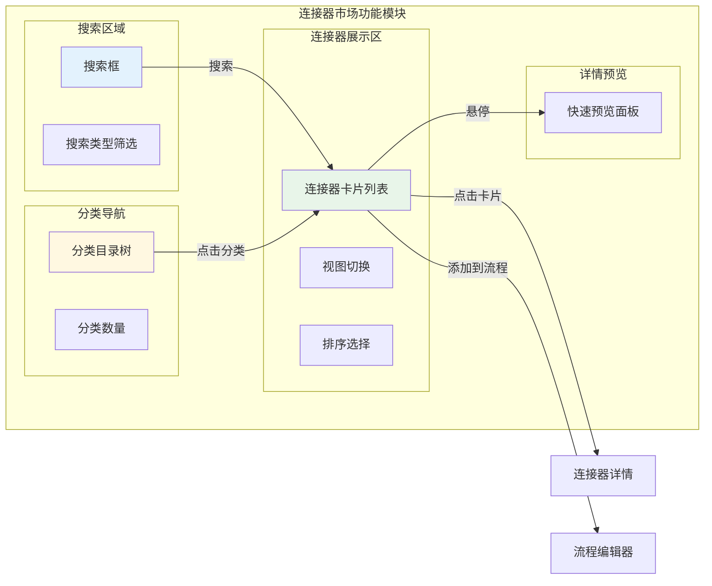
```mermaid
graph LR
    subgraph 连接器市场功能模块
        subgraph 搜索区域
            SEARCH_BAR[搜索框]
            SEARCH_TYPE[搜索类型筛选]
        end
        
        subgraph 分类导航
            CATEGORY_TREE[分类目录树]
            CATEGORY_COUNT[分类数量]
        end
        
        subgraph 连接器展示区
            CONNECTOR_LIST[连接器卡片列表]
            VIEW_SWITCH[视图切换]
            SORT_SELECT[排序选择]
        end
        
        subgraph 详情预览
            PREVIEW_PANEL[快速预览面板]
        end
    end
    
    SEARCH_BAR -->|搜索| CONNECTOR_LIST
    CATEGORY_TREE -->|点击分类| CONNECTOR_LIST
    
    CONNECTOR_LIST -->|点击卡片| CONNECTOR_DETAIL[连接器详情]
    CONNECTOR_LIST -->|添加到流程| FLOW_EDITOR[流程编辑器]
    CONNECTOR_LIST -->|悬停| PREVIEW_PANEL
    
    style SEARCH_BAR fill:#e3f2fd
    style CATEGORY_TREE fill:#fff8e1
    style CONNECTOR_LIST fill:#e8f5e9
```

**连接器市场功能模块详细说明:**

**1. 图表整体结构说明**

该流程图展示了连接器市场页面的四大功能模块及其子功能项。图表采用分层结构,从整体到局部展示了功能模块的包含关系和用户操作流向。

**2. 核心图标详解**

**搜索区域**:代表页面顶部的搜索功能区,包含搜索框和搜索类型筛选两个子功能。这个区域帮助用户快速找到需要的连接器。

**分类导航**:代表页面左侧的分类导航区域,以树形结构展示连接器的分类层级。黄色背景表示这是浏览查找的重要入口。

**连接器展示区**:绿色背景:代表页面中央的连接器列表展示区域,以卡片形式展示每个连接器的核心信息。这个区域是页面的核心内容区域。

**详情预览**:代表页面的快速预览功能,用户悬停在连接器卡片上时可以查看简要信息。

**3. 搜索区域子图标详解**

**SEARCH_BAR[搜索框]** - 蓝色背景:关键词搜索输入框,用户可以在此输入连接器名称、关键词进行搜索。蓝色背景表示这是基础的搜索功能。

**SEARCH_TYPE[搜索类型筛选]** - 搜索类型下拉选择框,支持按连接器类型进行筛选,例如只显示卡片连接器或只显示API连接器。

**4. 分类导航区子图标详解**

**CATEGORY_TREE[分类目录树]** - 黄色背景:树形结构的分类导航,展示连接器的分类层级关系,例如:卡片连接器→群通知卡片、点对点通知等子类。黄色背景表示这是重要的导航入口。

**CATEGORY_COUNT[分类数量]** - 分类数量标签,显示每个分类下的连接器数量,帮助用户了解分类规模。

**5. 连接器展示区子图标详解**

**CONNECTOR_LIST[连接器卡片列表]** - 绿色背景:代表连接器卡片列表的核心展示区域,每个卡片包含连接器图标、名称、类型、使用次数等核心信息。绿色背景表示这是页面的核心内容。

**VIEW_SWITCH[视图切换]** - 视图切换控件,支持在卡片视图和列表视图之间切换,满足不同用户的查看习惯。

**SORT_SELECT[排序选择]** - 排序选择下拉框,支持按热度(使用次数)、发布时间、名称等维度对连接器进行排序。

**6. 详情预览区子图标详解**

**PREVIEW_PANEL[快速预览面板]** - 快速预览弹窗,当用户悬停在连接器卡片上时,显示简要的连接器信息,包括功能描述、主要动作等。无需点击即可快速了解连接器概况。

**7. 目标页面图标详解**

**CONNECTOR_DETAIL[连接器详情]** - 连接器详情页面图标,代表用户点击连接器卡片后跳转的目标页面,用于查看连接器的完整信息和使用文档。

**FLOW_EDITOR[流程编辑器]** - 流程编辑器页面图标,代表用户点击"添加到流程"按钮后跳转的目标页面,用于将选中的连接器添加到流程中。

**8. 箭头关系详解**

**SEARCH_BAR -->|搜索| CONNECTOR_LIST**:表示用户输入关键词搜索后,搜索结果会显示在连接器卡片列表区域。

**CATEGORY_TREE -->|点击分类| CONNECTOR_LIST**:表示用户点击分类导航后,该分类下的连接器会显示在连接器卡片列表区域。

**CONNECTOR_LIST -->|点击卡片| CONNECTOR_DETAIL**:表示用户点击连接器卡片后会跳转到连接器详情页面。

**CONNECTOR_LIST -->|添加到流程| FLOW_EDITOR**:表示用户点击"添加到流程"按钮后会跳转到流程编辑器,并自动添加该连接器节点。

**CONNECTOR_LIST -->|悬停| PREVIEW_PANEL**:表示用户悬停在连接器卡片上时会触发快速预览面板的显示。

**9. 用户操作流程详解**

**搜索流程**:用户输入关键词 → 系统实时搜索匹配 → 连接器列表显示搜索结果。

**分类浏览流程**:用户点击分类导航 → 列表显示该分类下的所有连接器 → 用户可以继续浏览子分类。

**查看详情流程**:用户点击连接器卡片 → 跳转到连接器详情页面 → 展示完整的功能说明和接口文档。

**添加到流程流程**:用户点击"添加到流程"按钮 → 跳转到流程编辑器 → 编辑器中自动添加该连接器节点 → 用户进行后续配置。

**功能模块说明:**

| 模块     | 功能点     | 说明            |
| ------ | ------- | ------------- |
| 搜索区域   | 搜索框     | 按名称、类型、功能搜索   |
| <br /> | 搜索类型筛选  | 按连接器类型筛选      |
| 分类导航   | 分类目录树   | 按类型展示分类层级     |
| <br /> | 分类数量    | 显示每个分类下的连接器数量 |
| 连接器展示区 | 连接器卡片列表 | 展示连接器卡片       |
| <br /> | 视图切换    | 卡片视图/列表视图切换   |
| <br /> | 排序选择    | 热度/时间/名称排序    |
| 详情预览   | 快速预览面板  | 悬停显示快速预览      |

#### 4.5.3 页面关系

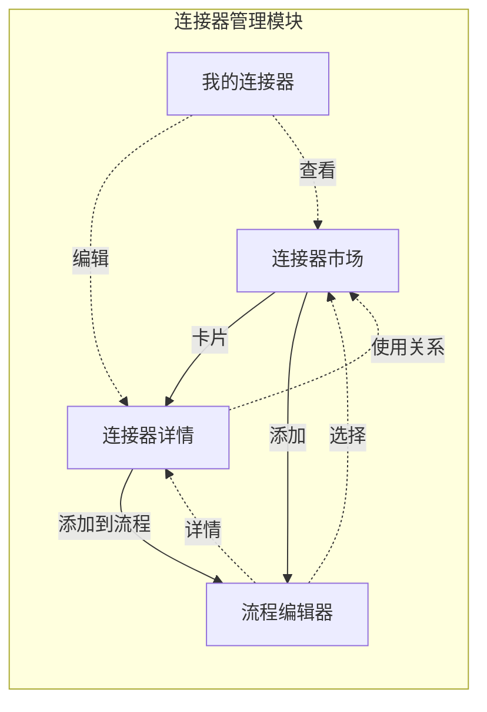
```mermaid
flowchart LR
    subgraph 连接器管理模块
        MARKET[连接器市场]
        DETAIL[连接器详情]
        MY_CONN[我的连接器]
        EDITOR[流程编辑器]
    end
    
    MARKET -->|卡片| DETAIL
    MARKET -->|添加| EDITOR
    
    DETAIL -->|添加到流程| EDITOR
    DETAIL -.->|使用关系| MARKET
    
    EDITOR -.->|选择| MARKET
    EDITOR -.->|详情| DETAIL
    
    MY_CONN -.->|编辑| DETAIL
    MY_CONN -.->|查看| MARKET
```

***

### 4.6 连接器详情页面

#### 4.6.1 页面作用

连接器详情页提供连接器的**完整信息和使用指南**。

**主要作用:**

- **能力展示**:详细说明连接器提供的所有能力
- **文档说明**:提供连接器的技术文档和使用示例
- **配置指导**:指导用户如何配置和使用连接器
- **快速入口**:快速将连接器添加到流程中

#### 4.6.2 页面功能模块

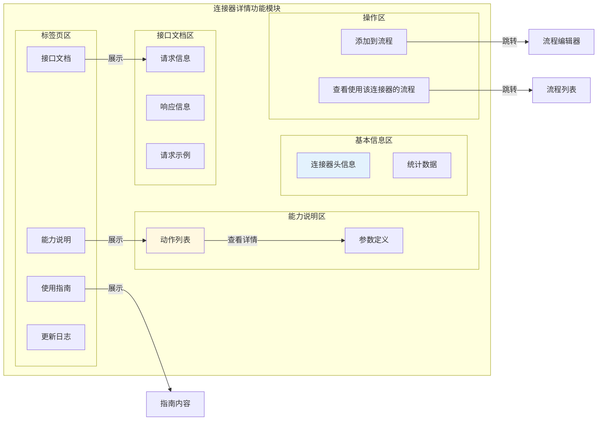
```mermaid
graph LR
    subgraph 连接器详情功能模块
        subgraph 基本信息区
            INFO_HEADER[连接器头信息]
            STATS[统计数据]
        end
        
        subgraph 标签页区
            TAB_CAPABILITY[能力说明]
            TAB_DOC[接口文档]
            TAB_GUIDE[使用指南]
            TAB_CHANGELOG[更新日志]
        end
        
        subgraph 能力说明区
            ACTION_LIST[动作列表]
            PARAM_DEF[参数定义]
        end
        
        subgraph 接口文档区
            REQUEST_INFO[请求信息]
            RESPONSE_INFO[响应信息]
            EXAMPLE[请求示例]
        end
        
        subgraph 操作区
            ADD_TO_FLOW[添加到流程]
            USAGE_LINK[查看使用该连接器的流程]
        end
    end
    
    TAB_CAPABILITY -->|展示| ACTION_LIST
    TAB_DOC -->|展示| REQUEST_INFO
    TAB_GUIDE -->|展示| GUIDE_CONTENT[指南内容]
    
    ACTION_LIST -->|查看详情| PARAM_DEF
    ADD_TO_FLOW -->|跳转| FLOW_EDITOR[流程编辑器]
    USAGE_LINK -->|跳转| FLOW_LIST[流程列表]
    
    style INFO_HEADER fill:#e3f2fd
    style ACTION_LIST fill:#fff8e1
```

**连接器详情功能模块详细说明:**

**1. 功能区域总体设计**

连接器详情页是连接器市场的重要补充,提供连接器的完整信息和使用指南。该页面采用分区布局,信息层次分明,从基本信息到详细文档,帮助用户全面了解连接器能力并正确使用。

**2. 基本信息区功能详解**

**连接器头信息**:展示连接器的核心标识信息,包括连接器图标(便于识别)、连接器名称(唯一标识)、提供部门(明确责任方)、版本号(便于版本管理)。这些信息帮助用户快速了解连接器的基本情况。

**统计数据**:展示连接器的使用统计,包括使用次数(反映连接器的受欢迎程度)、用户评分(其他用户的评价)、发布时间(便于判断新旧程度)。统计数据帮助用户判断连接器的质量和稳定性。

**3. 标签页区功能详解**

**能力说明标签页**:详细描述连接器的功能特性,包括功能描述(整体介绍)、支持的动作列表(列出所有可执行的操作)、使用限制(调用频率、并发数等限制)。用户可以在这里了解连接器能做什么。

**接口文档标签页**:提供连接器的技术文档,包括请求路径(HTTP URL)、请求方法(GET/POST/PUT等)、参数说明(每个参数的含义、类型、必填性)、响应说明(返回数据的结构)。技术文档帮助开发者正确调用连接器。

**使用指南标签页**:提供连接器的使用教程,包括快速开始(5分钟上手指南)、使用示例(常见场景的完整示例)、最佳实践(使用技巧和注意事项)。使用指南帮助用户快速上手使用连接器。

**更新日志标签页**:记录连接器的版本变更,包括版本号、变更时间、变更内容。更新日志帮助用户了解连接器的演进历史和最新变化。

**4. 能力说明区功能详解**

**动作列表**:列出连接器支持的所有动作(Action),每个动作包括动作名称、动作描述、适用场景。用户可以快速浏览找到需要的动作。

**参数定义**:详细说明每个动作的输入参数,包括参数名称、参数类型(字符串、数字、布尔等)、参数描述(含义说明)、是否必填、默认值、参数约束(长度、格式等限制)。参数定义是正确配置连接器的基础。

**5. 接口文档区功能详解**

**请求信息**:详细说明API调用的请求规范,包括请求方法(GET/POST/PUT/DELETE)、请求路径(完整的URL)、请求头(Content-Type、Authorization等)、请求体结构(JSON Schema)。

**响应信息**:详细说明API调用的响应规范,包括响应状态码(200成功、400参数错误、500服务器错误等)、响应体结构(成功和失败的响应格式)、错误码定义(各错误码的含义)。

**请求示例**:提供完整的请求示例,包括请求示例(JSON格式)、响应示例(成功和失败的示例)、常见错误示例。示例帮助开发者快速理解API使用方式。

**6. 操作区功能详解**

**添加到流程**:提供一键添加到流程的功能,点击后跳转到流程编辑器并自动添加该连接器节点。用户无需在编辑器中搜索,直接进入配置环节,提高使用效率。

**查看使用流程**:展示使用该连接器的所有流程列表,帮助用户了解该连接器的使用范围,也便于管理员评估连接器的重要性和影响度。

**功能模块说明:**

| 模块     | 功能点    | 说明             |
| ------ | ------ | -------------- |
| 基本信息区  | 连接器头信息 | 图标、名称、提供部门、版本  |
| <br /> | 统计数据   | 使用次数、评分、发布时间   |
| 标签页区   | 能力说明   | 功能描述、支持的动作列表   |
| <br /> | 接口文档   | 请求路径、方法、参数、响应  |
| <br /> | 使用指南   | 快速开始、使用示例、最佳实践 |
| <br /> | 更新日志   | 版本变更历史         |
| 能力说明区  | 动作列表   | 连接器支持的所有动作     |
| <br /> | 参数定义   | 每个动作的参数说明      |
| 接口文档区  | 请求信息   | 请求方法、路径、头部信息   |
| <br /> | 响应信息   | 响应参数说明         |
| <br /> | 请求示例   | JSON格式的请求示例    |
| 操作区    | 添加到流程  | 一键跳转到编辑器       |
| <br /> | 查看使用流程 | 查看使用该连接器的流程列表  |

***

### 4.7 执行监控页面

#### 4.7.1 页面作用

执行监控是连接器平台的**运维控制台**。

**主要作用:**

- **实时监控**:查看当前正在执行的流程实例
- **统计概览**:展示执行成功率的统计指标
- **异常告警**:及时发现执行失败的流程
- **性能分析**:分析流程执行的性能表现

#### 4.7.2 页面功能模块

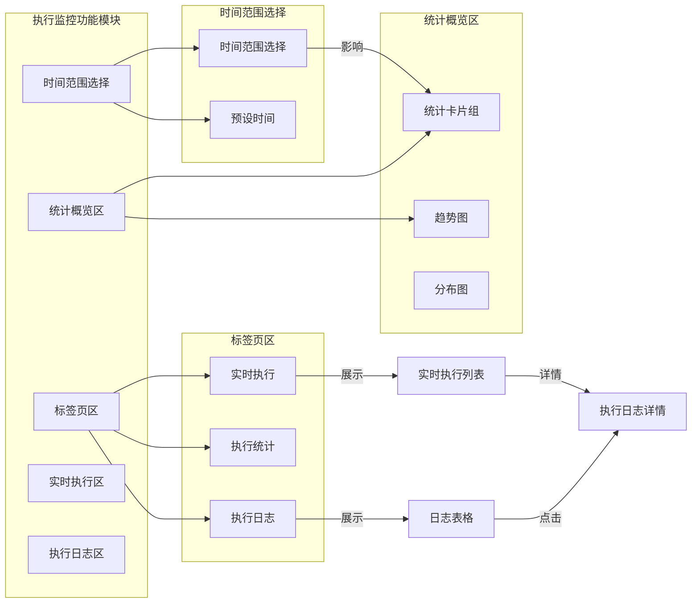
```mermaid
flowchart LR
    subgraph 执行监控功能模块
        A1[时间范围选择]
        A2[统计概览区]
        A3[标签页区]
        A4[实时执行区]
        A5[执行日志区]
    end
    
    subgraph 时间范围选择
        TIME_PICKER[时间范围选择]
        TIME_PRESET[预设时间]
    end
    
    subgraph 统计概览区
        STATS_CARDS[统计卡片组]
        TREND_CHART[趋势图]
        DISTRIBUTION_CHART[分布图]
    end
    
    subgraph 标签页区
        TAB_REALTIME[实时执行]
        TAB_STATS[执行统计]
        TAB_LOG[执行日志]
    end
    
    A1 --> TIME_PICKER
    A1 --> TIME_PRESET
    
    A2 --> STATS_CARDS
    A2 --> TREND_CHART
    
    A3 --> TAB_REALTIME
    A3 --> TAB_STATS
    A3 --> TAB_LOG
    
    TIME_PICKER -->|影响| STATS_CARDS
    
    TAB_REALTIME -->|展示| REALTIME_LIST[实时执行列表]
    TAB_LOG -->|展示| LOG_TABLE[日志表格]
    
    REALTIME_LIST -->|详情| LOG_DETAIL[执行日志详情]
    LOG_TABLE -->|点击| LOG_DETAIL
```

**执行监控功能模块详细说明:**

**1. 五大功能区域概述**

执行监控是连接器平台的运维控制台,帮助运维人员实时掌握平台运行状态,快速定位和解决问题。采用五区布局设计:

**时间范围选择**:位于页面顶部,提供时间筛选功能,帮助运维人员查看特定时间段内的执行情况。

**统计概览区**:以可视化的方式展示关键指标,包括执行次数、成功率、平均耗时、失败数等,一目了然了解整体运行状况。

**标签页区**:将功能划分为实时执行、执行统计、执行日志三个标签页,便于按需切换查看不同类型的信息。

**实时执行区**:展示当前正在执行的流程实例,实时更新执行进度,便于监控长流程的执行状态。

**执行日志区**:以表格形式展示历史执行记录,支持多维度筛选和排序,便于问题追溯和数据分析。

**2. 时间范围选择功能详解**

**时间范围选择器**:支持自定义选择起始时间和结束时间,精确定位到需要查看的时间段。时间格式支持多种形式,如YYYY-MM-DD HH:mm:ss。

**预设时间快捷选项**:提供常用时间范围的快捷按钮,包括:今天(当日0点至今)、昨天(昨日0点至24点)、近7天(7天前至今)、近30天(30天前至今)、本月(当月1日至今)、上月(上月1日至月末)。

**时间范围对统计的影响**:选择的时间范围会同时影响统计概览区的趋势图和执行日志区的记录列表,确保展示的数据都在选定范围内。

**3. 统计概览区功能详解**

**统计卡片组**:以卡片形式展示关键指标,包括:今日执行次数(展示当天的总执行次数和环比变化)、执行成功率(展示成功执行的占比,目标通常为99%以上)、平均执行时长(所有流程的平均执行时间,过长需关注)、失败次数(当日执行失败的总次数,需及时处理)。

**趋势图**:以折线图形式展示关键指标随时间变化的趋势,帮助发现异常波动。例如执行次数突增可能是流量异常,成功率下降可能存在系统问题。

**分布图**:以饼图或环形图展示执行结果的分布,直观展示成功、失败、执行中的占比,便于快速判断系统健康度。

**4. 标签页功能详解**

**实时执行标签页**:展示当前正在执行的流程实例列表。每个执行项显示:流程名称、开始时间、已执行时长、当前执行节点、执行进度。运维人员可以点击查看详情或终止执行。

**执行统计标签页**:综合展示各类统计图表,包括执行次数趋势图、执行成功率趋势图、各流程执行次数排名、执行耗时分布等。用于分析系统运行规律和性能瓶颈。

**执行日志标签页**:以表格形式展示历史执行记录,支持排序和筛选。表格列包括:执行ID、流程名称、触发时间、结束时间、执行时长、执行状态、操作。运维人员可以点击任意记录查看详情。

**5. 实时执行区功能详解**

**执行状态标识**:用不同颜色标识执行状态,绿色表示执行中正常、黄色表示执行中但较慢、红色表示执行失败、灰色表示等待中。

**进度展示**:展示流程的整体执行进度,例如"3/5 步骤",清晰显示当前执行到第几步,还剩几步。

**当前节点信息**:显示当前正在执行的节点名称和类型,便于判断流程卡在哪里。

**实时操作**:支持对执行中的流程进行操作,如终止执行(强制结束)、查看详情、暂停执行(暂停后可以恢复)。

**6. 执行日志区功能详解**

**筛选条件**:支持按流程名称、执行状态、时间范围、执行时长等条件筛选日志记录,快速定位目标记录。

**排序功能**:支持按执行时间、执行时长等字段排序,便于找到最新的记录或耗时最长的记录。

**分页展示**:每页展示固定数量的记录,支持翻页和跳转,便于查看大量历史记录。

**批量操作**:支持批量选择执行记录进行批量操作,如批量重试、批量导出等。
    
    style A2 fill:#e3f2fd
    style A3 fill:#fff8e1
```

**功能模块说明:**

| 模块     | 功能点    | 说明              |
| ------ | ------ | --------------- |
| 时间范围选择 | 时间范围选择 | 自定义时间范围         |
| <br /> | 预设时间   | 今日/近7天/近30天等预设  |
| 统计概览区  | 统计卡片组  | 执行次数、成功率、时长、失败数 |
| <br /> | 趋势图    | 关键指标的变化趋势       |
| <br /> | 分布图    | 成功/失败/执行中的分布    |
| 标签页区   | 实时执行   | 当前正在执行的任务       |
| <br /> | 执行统计   | 统计指标和图表         |
| <br /> | 执行日志   | 历史执行记录查询        |
| 实时执行区  | 实时执行列表 | 正在执行的任务卡片       |
| <br /> | 状态标识   | 执行状态高亮          |
| 执行日志区  | 日志表格   | 执行记录列表          |
| <br /> | 筛选条件   | 流程/状态/时间筛选      |
| <br /> | 分页控件   | 分页展示            |

#### 4.7.3 页面关系

| 来源页面 | 操作 | 目标页面 |
|---------|------|---------|
| 执行监控 | 切换标签 | 执行统计/执行日志 |
| 执行日志 | 点击记录 | 日志详情 |
| 日志详情 | 重新执行/编辑/查看流程 | 新执行/流程编辑器/流程详情 |

**页面跳转流程:**

执行监控 → 执行日志 → 日志详情 → 流程编辑器/流程详情

***

### 4.8 执行日志详情页面

#### 4.8.1 页面作用

执行日志详情页用于**追溯单次流程执行的完整过程**。

**主要作用:**

- **执行追踪**:查看流程执行的每个步骤
- **问题诊断**:定位执行失败的原因
- **数据回放**:查看每个步骤的输入输出数据
- **快速修复**:基于执行数据快速修复问题

#### 4.8.2 页面功能模块

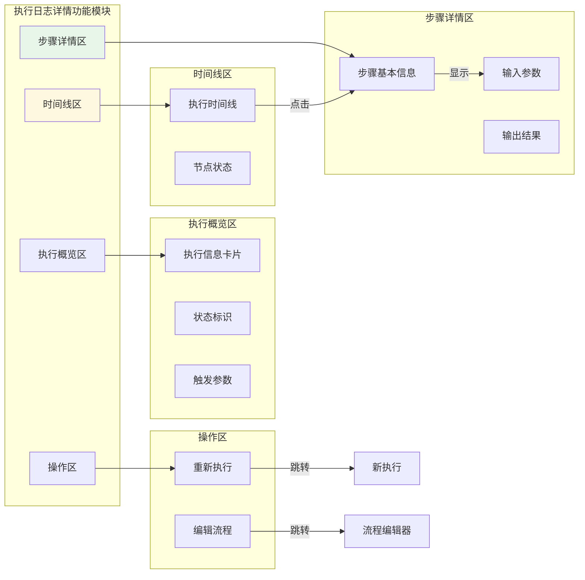
```mermaid
flowchart LR
    subgraph 执行日志详情功能模块
        A1[执行概览区]
        A2[时间线区]
        A3[步骤详情区]
        A4[操作区]
    end
    
    subgraph 执行概览区
        EXEC_INFO[执行信息卡片]
        STATUS_TAG[状态标识]
        TRIGGER_INFO[触发参数]
    end
    
    subgraph 时间线区
        TIMELINE[执行时间线]
        NODE_STATUS[节点状态]
    end
    
    subgraph 步骤详情区
        STEP_BASIC[步骤基本信息]
        STEP_INPUT[输入参数]
        STEP_OUTPUT[输出结果]
    end
    
    subgraph 操作区
        RETRY[重新执行]
        EDIT_FLOW[编辑流程]
    end
    
    A1 --> EXEC_INFO
    A2 --> TIMELINE
    A3 --> STEP_BASIC
    A4 --> RETRY
    
    TIMELINE -->|点击| STEP_BASIC
    STEP_BASIC -->|显示| STEP_INPUT
    
    RETRY -->|跳转| NEW_EXEC[新执行]
    EDIT_FLOW -->|跳转| FLOW_EDITOR[流程编辑器]
    
    style A2 fill:#fff8e1
    style A3 fill:#e8f5e9
```

**执行日志详情功能模块详细说明:**

**1. 四大功能区域概述**

执行日志详情页用于追溯单次流程执行的完整过程,是问题诊断的核心页面。采用四区布局设计:

**执行概览区**:展示本次执行的整体信息,包括执行ID、流程名称、执行状态、开始时间、结束时间、总耗时等关键信息。

**时间线区**:以可视化方式展示流程的执行过程,包括每个节点的开始时间、结束时间、执行状态。

**步骤详情区**:展示每个节点的详细执行信息,包括输入参数、输出结果、执行日志、错误信息(如果有)。

**操作区**:提供基于执行记录的操作能力,包括重新执行、编辑流程、复制参数等。

**2. 执行概览区功能详解**

**执行信息卡片**:展示执行的核心信息,包括执行ID(唯一的执行标识)、流程名称和版本、执行状态(成功/失败/执行中)、开始时间、结束时间、总耗时。

**状态标识**:用颜色标识执行状态,绿色表示成功、红色表示失败、黄色表示执行中、灰色表示已终止。状态标识醒目展示,一眼判断执行结果。

**触发参数**:展示触发本次执行时的输入参数,包括触发类型(事件/API/定时等)、触发来源、触发数据等。这些信息对于分析执行行为和排查问题非常重要。

**3. 时间线区功能详解**

**执行时间线**:以时间轴形式展示流程的执行过程。时间线上标注每个节点的位置,用不同颜色标识节点状态。时间线可以直观展示执行的先后顺序和时间跨度。

**节点状态标识**:每个节点下方显示该节点的执行状态图标,包括成功(✓)、失败(✗)、执行中(⟳)、跳过(⊘)等。失败的节点会用红色高亮,便于快速定位问题。

**时间戳展示**:每个节点显示精确到毫秒的开始时间和结束时间,便于分析执行耗时和时间分布。

**4. 步骤详情区功能详解**

**步骤基本信息**:展示选中节点的概要信息,包括节点名称、节点类型(触发器/连接器/逻辑组件)、执行时间、状态、耗时。

**输入参数JSON**:以JSON格式展示该节点的输入参数,包括来自前置节点的输出数据、系统注入的上下文数据、节点配置的参数值。JSON支持折叠和展开,便于查看复杂数据结构。

**输出结果JSON**:以JSON格式展示该节点的执行结果,包括API调用的响应数据、卡片发送的结果、系统处理的结果等。通过对比输入输出,可以验证节点是否按预期工作。

**执行日志**:以时间顺序展示节点执行过程中的详细日志,包括开始执行、调用连接器、处理响应、完成执行等关键事件。日志对于追踪执行细节和定位问题非常关键。

**错误信息(仅失败时显示)**:当节点执行失败时,显示详细的错误信息,包括错误码、错误消息、错误类型、堆栈信息等。错误信息帮助快速理解失败原因,有的错误信息还会提供解决方案建议。

**5. 操作区功能详解**

**重新执行**:基于本次执行的触发参数重新执行流程。用于测试修复后的流程或重新执行被中断的流程。重新执行会创建新的执行记录。

**编辑流程**:跳转到流程编辑器打开该流程。用于发现流程问题后快速进入编辑状态进行修改。编辑器会自动定位到出问题的节点。

**复制参数**:将输入参数JSON复制到剪贴板。用于获取测试数据或在其他地方使用这些参数。

**6. 问题诊断流程**

**定位问题节点**:通过时间线快速找到失败的节点(红色高亮)。

**查看错误信息**:点击失败节点,查看详细的错误码和错误消息。

**分析输入参数**:检查输入参数是否符合预期,排除参数错误。

**检查连接器配置**:如果参数正确,检查连接器配置是否正确。

**联系外部支持**:如果怀疑是外部系统问题,联系外部系统负责人。

**修改并测试**:在流程编辑器中修改流程,测试验证修复效果。
```

**功能模块说明:**

| 模块     | 功能点    | 说明              |
| ------ | ------ | --------------- |
| 执行概览区  | 执行信息卡片 | 执行ID、流程名称、状态、时长 |
| <br /> | 状态标识   | 成功/失败/运行中标识     |
| <br /> | 触发参数   | 触发时的输入参数        |
| 时间线区   | 执行时间线  | 可视化展示执行过程       |
| <br /> | 节点状态   | 每个步骤的成功/失败状态    |
| <br /> | 失败节点高亮 | 失败节点红色标识        |
| 步骤详情区  | 步骤基本信息 | 节点名称、类型、执行时间    |
| <br /> | 输入参数   | 该步骤的输入JSON      |
| <br /> | 输出结果   | 该步骤的输出JSON      |
| <br /> | 执行日志   | 详细的执行日志         |
| <br /> | 错误信息   | 失败时的错误码、消息、解决方案 |
| 操作区    | 重新执行   | 基于相同参数重新执行      |
| <br /> | 编辑流程   | 跳转到编辑器修改流程      |
| <br /> | 复制参数   | 复制输入参数          |

***

### 4.9 系统配置页面

#### 4.9.1 页面作用

系统配置是连接器平台的**管理后台**。

**主要作用:**

- **连接器管理**:管理平台上可用的连接器
- **事件源配置**:配置和管理事件来源
- **用户权限**:管理用户和角色权限
- **系统设置**:配置平台的各项参数

#### 4.9.2 页面功能模块

```mermaid
flowchart LR
    subgraph 系统配置功能模块
        A1[侧边菜单]
        A2[连接器管理]
        A3[触发器管理]
        A4[用户权限]
        A5[系统设置]
    end
    
    subgraph 侧边菜单
        MENU_CONNECTOR[连接器管理]
        MENU_TRIGGER[触发器管理]
        MENU_USER[用户权限]
        MENU_SYSTEM[系统设置]
    end
    
    subgraph 连接器管理
        CONN_LIST[连接器列表]
        CONN_CONFIG[连接器配置弹窗]
    end
    
    subgraph 触发器管理
        TRIGGER_LIST[事件源列表]
        WEBHOOK_LIST[Webhook列表]
    end
    
    A1 --> MENU_CONNECTOR
    A1 --> MENU_TRIGGER
    A1 --> MENU_USER
    A1 --> MENU_SYSTEM
    
    A2 --> CONN_LIST
    A3 --> TRIGGER_LIST
    A4 --> USER_LIST[用户列表]
    
    CONN_LIST -->|配置| CONN_CONFIG
    TRIGGER_LIST -->|添加| ADD_FORM[添加表单]
    
    style A1 fill:#e3f2fd
    style A2 fill:#fff8e1
```

**功能模块说明:**

| 模块     | 功能点       | 说明              |
| ------ | --------- | --------------- |
| 侧边菜单   | 连接器管理     | 连接器列表、连接器配置     |
| <br /> | 触发器管理     | 事件源配置、Webhook管理 |
| <br /> | 用户权限      | 用户列表、角色配置       |
| <br /> | 系统设置      | 基本配置、通知配置、日志配置  |
| 连接器管理  | 连接器列表     | 展示所有连接器及其状态     |
| <br /> | 连接器配置弹窗   | 修改连接器配置参数       |
| 触发器管理  | 事件源列表     | 管理事件来源配置        |
| <br /> | Webhook列表 | 管理Webhook回调地址   |
| <br /> | 添加事件源表单   | 新增事件源的配置表单      |
| 用户权限   | 用户列表      | 用户账号管理          |
| <br /> | 角色列表      | 角色定义和权限配置       |
| <br /> | 权限配置      | 功能权限和数据权限配置     |
| 系统设置   | 基本配置      | 平台基本参数配置        |
| <br /> | 通知配置      | 告警通知渠道和阈值配置     |
| <br /> | 日志配置      | 日志级别和存储配置       |

***

## 五、整体页面关系总览

```mermaid
graph TB
    subgraph 首页入口
        HOME[首页仪表盘]
    end
    
    subgraph 流程管理
        FLOW_LIST[流程列表]
        FLOW_EDITOR[流程编辑器]
        FLOW_DETAIL[流程详情]
    end
    
    subgraph 连接器
        CONNECTOR_MARKET[连接器市场]
        CONNECTOR_DETAIL[连接器详情]
    end
    
    subgraph 监控运维
        MONITOR[执行监控]
        EXECUTION_LOG[执行日志]
        LOG_DETAIL[执行日志详情]
    end
    
    subgraph 系统配置
        SYSTEM_CONFIG[系统配置]
    end
    
    HOME --> FLOW_LIST
    HOME --> CONNECTOR_MARKET
    HOME --> MONITOR
    
    FLOW_LIST --> FLOW_EDITOR
    FLOW_LIST --> FLOW_DETAIL
    FLOW_LIST --> EXECUTION_LOG
    
    FLOW_EDITOR --> CONNECTOR_MARKET
    FLOW_EDITOR --> CONNECTOR_DETAIL
    FLOW_EDITOR --> FLOW_DETAIL
    
    FLOW_DETAIL --> FLOW_EDITOR
    FLOW_DETAIL --> LOG_DETAIL
    
    CONNECTOR_MARKET --> CONNECTOR_DETAIL
    CONNECTOR_MARKET --> FLOW_EDITOR
    
    CONNECTOR_DETAIL --> FLOW_EDITOR
    
    MONITOR --> EXECUTION_LOG
    MONITOR --> LOG_DETAIL
    
    EXECUTION_LOG --> LOG_DETAIL
    LOG_DETAIL --> FLOW_EDITOR
    LOG_DETAIL --> FLOW_DETAIL
    
    SYSTEM_CONFIG --> FLOW_LIST
    SYSTEM_CONFIG --> CONNECTOR_MARKET
    
    style HOME fill:#1976d2,color:#fff
    style FLOW_EDITOR fill:#f57c00,color:#fff
    style LOG_DETAIL fill:#c62828,color:#fff
```

**整体页面关系详细说明:**

**1. 图表整体结构说明**

该流程图展示了连接器平台的完整页面关系架构,从上到下分为五个主要模块,各模块之间通过箭头展示页面跳转关系。

**2. 五大功能模块图标详解**

**HOME[首页仪表盘]** - 深蓝色背景:作为用户的统一入口,首页仪表盘是所有功能的起始点。用户登录后首先进入首页,可以快速跳转到各个功能模块。

**流程管理模块** - 包含流程列表、流程编辑器、流程详情三个页面,是平台最核心的功能模块,用于创建和管理自动化流程。

**连接器模块** - 包含连接器市场和连接器详情两个页面,提供能力发现和使用功能,帮助用户找到并使用合适的连接器。

**监控运维模块** - 包含执行监控、执行日志、执行日志详情三个页面,提供运维支撑功能,帮助运维人员监控平台运行状态和排查问题。

**系统配置模块** - 包含系统配置页面,提供管理功能,用于配置平台的各种参数和管理连接器、用户等资源。

**3. 核心页面图标详解**

**FLOW_LIST[流程列表]** - 流程管理模块的入口页面,用户可以查看和管理所有创建的流程。

**FLOW_EDITOR[流程编辑器]** - 橙色背景:核心工作区,用于可视化编排和设计流程,是平台最重要的页面之一。

**FLOW_DETAIL[流程详情]** - 查看流程的完整信息,包括配置详情、执行历史、版本管理等。

**CONNECTOR_MARKET[连接器市场]** - 连接器模块的入口页面,展示平台上所有可用的连接器。

**CONNECTOR_DETAIL[连接器详情]** - 查看连接器的完整信息,包括功能说明、接口文档、使用指南等。

**MONITOR[执行监控]** - 运维人员的主要工作区,实时监控流程执行状态和查看统计信息。

**EXECUTION_LOG[执行日志]** - 查询历史执行记录,支持多维度筛选和排序。

**LOG_DETAIL[执行日志详情]** - 红色背景:问题诊断的核心页面,追溯单次执行的完整过程。

**SYSTEM_CONFIG[系统配置]** - 管理后台,用于配置平台参数和管理各种资源。

**4. 页面跳转关系详解**

**首页作为统一入口**:首页仪表盘提供到流程列表、连接器市场、执行监控三个主要功能模块的快捷跳转入口。

**流程管理内部跳转**:流程列表可以跳转到流程编辑器(创建/编辑流程)和流程详情(查看流程信息)。流程详情可以跳转到流程编辑器(继续编辑)和执行日志详情(查看执行记录)。

**连接器模块内部跳转**:连接器市场可以跳转到连接器详情(查看文档)和流程编辑器(添加到流程)。连接器详情可以跳转到流程编辑器(添加到流程)。

**监控模块内部跳转**:执行监控可以跳转到执行日志(查看更多记录)和执行日志详情(查看详情)。执行日志可以跳转到执行日志详情(查看详情)。

**跨模块跳转**:执行日志详情可以跳转到流程编辑器(修改流程)和流程详情(查看流程信息)。系统配置可以跳转到流程列表和连接器市场进行配置管理。

**5. 箭头关系详解**

实线箭头表示直接跳转关系,虚线表示间接或辅助跳转关系。

**首页到功能模块**:HOME --> FLOW_LIST/CONNECTOR_MARKET/MONITOR表示首页提供到各个功能模块的快捷入口。

**流程管理跳转链**:FLOW_LIST --> FLOW_EDITOR --> CONNECTOR_MARKET表示创建流程时需要先到编辑器,然后可能需要去连接器市场选择连接器。

**监控运维跳转链**:MONITOR --> EXECUTION_LOG --> LOG_DETAIL表示监控发现问题后,可以进一步查看执行日志和执行详情进行问题诊断。

**问题修复跳转链**:LOG_DETAIL --> FLOW_EDITOR表示通过执行日志详情发现问题后,可以跳转到流程编辑器修改流程。

**6. 视觉层次说明**

图表中使用不同颜色标识页面的重要程度:

**深蓝色(HOME)**:入口页面,是所有功能的起点,采用醒目颜色标识。

**橙色(FLOW_EDITOR)**:核心工作区,平台最重要的功能页面,采用醒目颜色标识。

**红色(LOG_DETAIL)**:问题诊断核心页面,帮助用户快速定位问题,采用警示颜色标识。

**7. 用户使用路径推荐**

**流程创建路径**:首页 → 流程列表 → 流程编辑器 → 连接器市场(选择连接器) → 返回编辑器继续配置 → 保存发布 → 执行监控。

**问题诊断路径**:首页 → 执行监控 → 发现异常 → 执行日志 → 执行日志详情 → 定位问题 → 流程编辑器修改流程 → 测试验证。

**连接器使用路径**:首页 → 连接器市场 → 浏览/搜索连接器 → 连接器详情(查看文档) → 添加到流程 → 流程编辑器继续配置。

***

## 六、核心交互流程图

### 6.1 创建流程完整流程(钉钉实现方式)

| 步骤 | 操作 | 说明 |
|------|------|------|
| 1 | 访问流程列表 | 进入流程管理页面 |
| 2 | 点击创建流程 | 打开流程编辑器 |
| 3 | 添加触发器节点 | 在画布上添加一个触发器节点作为流程起点 |
| 4 | 点击连线添加按钮 | 在触发器与结束位置之间的连线上点击"+"添加按钮 |
| 5 | 选择节点类型 | 从弹出菜单中选择需要的连接器或逻辑组件类型 |
| 6 | 节点插入画布 | 选中的节点被自动插入到连线中,并与前后节点自动连接 |
| 7 | 继续添加更多节点 | 在后续连线上重复步骤4-6,添加更多节点 |
| 8 | 配置节点参数 | 选中每个节点,在右侧属性面板中配置参数 |
| 9 | 配置数据映射 | 定义节点间的数据传递关系和变量映射 |
| 10 | 保存草稿 | 保存流程配置为草稿状态 |
| 11 | 测试运行 | 使用模拟数据验证流程正确性 |
| 12 | 修复问题 | 如测试失败,修改流程配置后重新测试 |
| 13 | 发布流程 | 测试通过后正式发布流程 |
| 14 | 流程上线 | 流程进入运行状态,等待触发执行 |

**流程示意(钉钉方式):**

访问流程列表 → 创建流程 → 打开编辑器 → 添加触发器
↓
点击连线添加按钮 → 选择节点类型 → 节点插入画布
↓
继续添加节点 → 配置参数 → 配置数据映射
↓
保存草稿 → 测试运行
↓
是否通过? → 否 → 修改流程 → 测试运行
↓
是 → 发布流程 → 流程上线

### 6.2 流程执行完整流程

```mermaid
sequenceDiagram
    participant 事件源
    participant 事件总线
    participant 流程引擎
    participant 执行器
    participant 连接器
    participant 卡片平台
    participant 监控
    
    事件源->>事件总线: 发布事件
    事件总线->>流程引擎: 触发流程
    流程引擎->>流程引擎: 创建执行实例
    流程引擎->>监控: 记录开始执行
    
    loop 执行每个步骤
        流程引擎->>执行器: 执行步骤
        执行器->>连接器: 调用连接器
        连接器->>卡片平台: 发送卡片
        卡片平台-->>连接器: 返回结果
        连接器-->>执行器: 返回执行结果
        执行器-->>流程引擎: 返回步骤结果
        
        alt 步骤成功
            流程引擎->>流程引擎: 继续下一步骤
        else 步骤失败
            流程引擎->>监控: 记录失败
            流程引擎->>流程引擎: 错误处理
        end
    end
    
    流程引擎->>监控: 记录执行完成
    监控-->>事件源: 执行状态通知
```

**流程执行详细说明:**

**1. 完整执行流程解析**

该时序图展示了从事件触发到流程执行完成的完整过程,涉及七个参与者的协作:

**事件源**:业务系统或监控系统的外部系统,当发生特定业务事件(如入职、审批完成、告警等)时,向事件总线发布事件消息。事件消息包含事件类型、事件数据、事件时间戳等信息。

**事件总线**:平台的事件统一入口,负责接收来自各个事件源的事件。事件总线根据事件类型将事件路由到对应的触发器管理器,同时对事件进行格式校验和初步处理。

**流程引擎**:流程执行的核心调度器,负责管理整个流程的生命周期。主要职责包括:根据触发条件匹配对应的流程定义、创建流程执行实例、管理执行状态、控制执行顺序、处理异常情况。流程引擎内部维护流程实例状态机,确保流程按正确顺序执行。

**执行器**:流程引擎的执行单元,负责具体执行每个流程节点。执行器从连接器层获取节点对应的连接器实现,调用连接器执行业务操作,并处理连接器返回的结果。

**连接器**:封装了各种业务能力的调用接口。连接器根据节点配置构造请求参数,调用底层服务(如卡片平台、API服务等),并对返回结果进行标准化处理。

**卡片平台**:开放平台提供的卡片发送服务,接收来自连接器的卡片发送请求,将卡片消息发送到目标群聊或用户。

**监控系统**:记录流程执行的完整日志,包括执行开始、步骤执行、执行完成、执行失败等关键事件。监控系统还负责向外部系统发送执行状态通知。

**2. 关键执行机制**

**步骤循环执行机制**:流程引擎会按照流程定义的节点顺序,依次调用执行器执行每个步骤。每个步骤执行完成后,执行器返回执行结果给流程引擎,引擎根据结果判断是继续下一步还是进入异常处理。

**成功分支处理**:当步骤执行成功时,流程引擎记录步骤结果到监控日志,然后继续执行下一个步骤。整个流程按顺序执行,直到所有步骤完成。

**失败分支处理**:当步骤执行失败时,流程引擎会立即记录失败日志到监控系统,并进入错误处理流程。错误处理包括:记录错误详情、触发告警通知(如果配置了告警)、根据配置决定是重试还是终止流程。

**状态记录机制**:监控系统会记录整个执行过程的关键状态:执行开始时间、每个步骤的开始时间和结束时间、执行结果、执行耗时等。这些状态信息用于后续的问题诊断和性能分析。

**3. 执行监控和告警**

执行过程中的监控信息包括:每个步骤的输入参数、输出结果、执行耗时、执行状态。监控日志采用结构化格式,便于日志检索和统计分析。

告警通知会在以下情况触发:步骤执行失败、流程执行超时、连续执行失败超过阈值等。告警通知通过配置的渠道发送(如邮件、短信、即时通讯等)。

**4. 性能优化设计**

**异步执行**:耗时的步骤采用异步执行方式,提高系统吞吐量。异步执行的步骤会立即返回执行ID,调用方通过轮询或回调获取执行结果。

**并发控制**:对资源占用较大的操作(如数据库写入、外部API调用)进行并发控制,避免系统过载。可以配置每个连接器的最大并发数。

**超时管理**:每个步骤都配置有超时时间,超时未完成的步骤会被强制终止并标记为失败。超时时间根据业务场景合理设置,避免过短导致正常操作被中断,或过长导致问题发现不及时。

***

### 6.3 问题诊断流程

```mermaid
flowchart LR
    A[执行失败告警] --> B[访问执行监控]
    B --> C[查看执行日志列表]
    C --> D[点击失败记录]
    D --> E[查看执行时间线]
    E --> F{定位问题节点}
    F -->|查看输入参数| G[检查参数是否正确]
    G -->|参数错误| H[复制参数]
    H --> I[跳转到流程编辑器]
    I --> J[修改节点配置]
    J --> K[重新执行测试]
    G -->|参数正确| L[检查连接器配置]
    L --> M[可能需要检查外部系统]
    F -->|查看错误日志| N[分析错误日志]
    N --> O[确定解决方案]
    
    style A fill:#ffcdd2
    style K fill:#c8e6c9
```

**问题诊断流程详细说明:**

**1. 诊断流程概览**

该流程图展示了从发现执行失败到解决问题的完整诊断过程。当流程执行出现异常时,运维人员需要按照此流程进行问题排查和修复。

**2. 各环节详解**

**执行失败告警**:系统检测到流程执行失败后,自动发送告警通知给相关人员。告警信息包括:流程名称、执行ID、失败时间、错误概要等。告警渠道可以根据重要性配置为邮件、短信、即时通讯等。

**访问执行监控**:运维人员收到告警后,登录连接器平台的执行监控页面。执行监控页面展示实时执行状态和历史执行记录,是问题诊断的起点。

**查看执行日志列表**:运维人员通过筛选条件(时间范围、流程名称、执行状态等)定位到问题流程的执行记录。执行日志列表展示每次执行的概览信息,包括执行时间、执行时长、执行状态等。

**点击失败记录**:运维人员点击失败记录进入执行日志详情页。详情页展示该次执行的完整时间线和每个步骤的详细信息。

**查看执行时间线**:执行时间线以可视化方式展示流程的执行过程,包括每个步骤的开始时间、结束时间、执行状态。失败的步骤会高亮显示,便于快速定位问题节点。

**定位问题节点**:根据时间线和执行日志,运维人员需要确定是哪个步骤出现了问题。问题可能出在输入参数、连接器配置、外部系统等环节。

**3. 两种排查路径**

**路径一:检查输入参数**

如果怀疑是输入参数错误导致的失败,运维人员需要:
- 查看该步骤的输入参数JSON
- 对比参数值是否符合预期
- 检查参数的格式、类型、范围是否正确
- 如果确认参数错误,复制参数后跳转到流程编辑器修改节点配置
- 修改完成后进行测试运行验证修复效果

**路径二:检查连接器配置**

如果参数正确但仍然失败,可能原因包括:
- 连接器的配置项(如目标群ID、API密钥等)配置错误
- 连接器对应的外部服务不可用
- 连接器的调用权限被撤销
- 连接器的调用配额超限

如果怀疑是外部系统问题,可能需要:
- 检查外部系统的服务状态
- 查看外部系统的访问日志
- 联系外部系统负责人确认
- 等待外部系统恢复后重新执行

**4. 查看错误日志分析**

错误日志是问题诊断的关键依据,包含以下信息:
- 错误代码:标准的错误分类代码,便于快速定位错误类型
- 错误消息:对错误的详细描述
- 堆栈信息:如果涉及代码异常,包含完整的调用堆栈
- 上下文信息:错误发生时的环境变量、请求参数等

根据错误日志分析,可以确定解决方案:
- 参数错误:修改流程节点配置
- 配置错误:更新连接器配置或联系管理员
- 外部系统错误:等待外部系统恢复或联系外部系统支持
- 代码bug:反馈给开发团队修复

**5. 修复验证流程**

问题修复后,需要验证修复效果:
- 在流程编辑器中进行测试运行
- 确认测试通过后再发布正式版本
- 监控修复后的执行情况,确保问题不再复现

**6. 问题预防建议**

为减少问题发生,建议:
- 在正式发布前进行充分的测试
- 配置合理的超时时间和重试策略
- 建立完善的监控告警机制
- 定期审查流程配置和连接器状态
- 记录常见问题的解决方案,形成知识库

***

## 七、页面优先级规划

### 7.1 页面实施优先级概览

```mermaid
gantt
    title 连接器平台页面开发优先级
    dateFormat  YYYY-MM-DD
    section 第一阶段
    流程编辑器核心功能       :a1, 2024-02-01, 6周
    流程列表页面            :a2, 2024-02-01, 3周
    连接器市场基础功能       :a3, 2024-03-01, 2周
    执行监控基础功能         :a4, 2024-04-01, 3周
    section 第二阶段
    流程详情页面            :b1, 2024-04-15, 2周
    连接器详情页面           :b2, 2024-04-15, 1周
    执行日志详情页面         :b3, 2024-05-01, 2周
    首页仪表盘              :b4, 2024-05-15, 2周
    section 第三阶段
    系统配置-连接器管理      :c1, 2024-06-01, 2周
    系统配置-触发器管理      :c2, 2024-06-15, 2周
    系统配置-用户权限        :c3, 2024-07-01, 2周
```

### 7.2 页面优先级矩阵

| 优先级 | 页面 | 复杂度 | 业务价值 |
|-------|------|-------|---------|
| P0 | 流程编辑器、流程列表 | 高 | 高 |
| P1 | 执行监控、连接器市场 | 中 | 高 |
| P2 | 流程详情、执行日志详情 | 中 | 中 |
| P3 | 连接器详情、系统配置、首页仪表盘 | 低 | 低 |

**优先级顺序:**

P0 (Must Have) → P1 (Should Have) → P2 (Nice to Have) → P3 (Low Priority)

### 7.3 分阶段页面实施计划

#### 第一阶段:核心MVP (Week 1-6)

```mermaid
flowchart TD
    subgraph 第一阶段核心MVP
        A1[首页仪表盘<br/>简化版] 
        A2[流程列表<br/>基础CRUD]
        A3[流程编辑器<br/>核心功能]
        A4[执行监控<br/>基础功能]
    end
    
    subgraph 核心依赖
        D1[流程编辑器依赖流程列表]
        D2[执行监控依赖流程编辑器]
    end
    
    A1 -->|优先级:中| A2
    A2 -->|优先级:高| A3
    A3 -->|优先级:高| A4
    
    style A3 fill:#ff6b6b,color:#fff
    style A4 fill:#ffa500,color:#fff
```

| 页面        | 优先级 | 实现范围                     | 预计周期 |
| --------- | --- | ------------------------ | ---- |
| **流程编辑器** | P0  | 连线添加节点、属性配置、画布编辑、测试运行、保存发布 | 6周   |
| **流程列表**  | P0  | 列表展示、状态管理、启停控制、删除、搜索筛选   | 3周   |
| **执行监控**  | P1  | 实时执行列表、执行日志查询、基础统计       | 3周   |
| **首页仪表盘** | P2  | 简化版,仅展示核心入口和统计           | 1周   |

#### 第二阶段:完善功能 (Week 7-10)

```mermaid
flowchart TD
    subgraph 第二阶段完善功能
        B1[连接器市场<br/>完整功能]
        B2[连接器详情<br/>文档展示]
        B3[流程详情<br/>完整信息]
        B4[执行日志详情<br/>问题诊断]
    end
    
    B1 -->|优先级:高| B2
    B2 -->|优先级:中| B3
    B3 -->|优先级:高| B4
    
    style B1 fill:#ffa500,color:#fff
    style B2 fill:#ffa500,color:#fff
    style B3 fill:#ffa500,color:#fff
    style B4 fill:#ffa500,color:#fff
```

| 页面         | 优先级 | 实现范围                | 预计周期 |
| ---------- | --- | ------------------- | ---- |
| **连接器市场**  | P1  | 分类导航、连接器卡片、搜索、添加到流程 | 2周   |
| **连接器详情**  | P2  | 能力说明、接口文档、使用指南      | 1周   |
| **流程详情**   | P1  | 基本信息、流程结构、执行记录、版本历史 | 2周   |
| **执行日志详情** | P1  | 执行时间线、步骤详情、错误诊断     | 2周   |

#### 第三阶段:管理后台 (Week 11-14)

```mermaid
flowchart TD
    subgraph 第三阶段管理后台
        C1[系统配置<br/>连接器管理]
        C2[系统配置<br/>触发器管理]
        C3[系统配置<br/>用户权限]
        C4[系统配置<br/>系统设置]
    end
    
    C1 --> C2 --> C3 --> C4
    
    style C1 fill:#4ecdc4,color:#fff
    style C2 fill:#4ecdc4,color:#fff
    style C3 fill:#4ecdc4,color:#fff
    style C4 fill:#4ecdc4,color:#fff
```

| 页面             | 优先级 | 实现范围             | 预计周期 |
| -------------- | --- | ---------------- | ---- |
| **系统配置-连接器管理** | P2  | 连接器列表、连接器配置、启用禁用 | 2周   |
| **系统配置-触发器管理** | P2  | 事件源配置、Webhook管理  | 2周   |
| **系统配置-用户权限**  | P2  | 用户列表、角色配置、权限分配   | 2周   |
| **系统配置-系统设置**  | P3  | 基本配置、通知配置、日志配置   | 1周   |

### 7.4 页面依赖关系图

```mermaid
flowchart LR
    subgraph 依赖层级
        L1_HOME[首页仪表盘]
        L2_LIST[流程列表]
        L2_MARKET[连接器市场]
        L3_EDITOR[流程编辑器]
        L3_MONITOR[执行监控]
        L4_DETAIL[流程详情]
        L4_LOG_DETAIL[执行日志详情]
        L4_CONN_DETAIL[连接器详情]
        L5_CONFIG[系统配置]
    end
    
    L1_HOME -->|跳转| L2_LIST
    L1_HOME -->|跳转| L2_MARKET
    L1_HOME -->|跳转| L3_MONITOR
    
    L2_LIST -->|跳转| L3_EDITOR
    L2_MARKET -->|跳转| L3_EDITOR
    
    L3_EDITOR -->|跳转| L4_DETAIL
    L3_EDITOR -->|跳转| L4_CONN_DETAIL
    
    L3_MONITOR -->|跳转| L4_LOG_DETAIL
    
    L4_DETAIL -->|跳转| L3_EDITOR
    L4_LOG_DETAIL -->|跳转| L3_EDITOR
    
    L5_CONFIG -.->|配置| L2_LIST
    L5_CONFIG -.->|配置| L2_MARKET
    
    style L3_EDITOR fill:#ff6b6b,color:#fff
    style L2_LIST fill:#ffa500,color:#fff
```

### 7.5 MVP核心路径

```mermaid
flowchart TD
    subgraph MVP核心路径
        START[用户访问平台] --> HOME[首页仪表盘]
        HOME --> LIST[流程列表]
        LIST --> EDITOR[流程编辑器]
        EDITOR --> MARKET[连接器市场]
        MARKET --> EDITOR2[添加连接器]
        EDITOR2 --> TEST[测试运行]
        TEST --> SUCCESS{测试通过?}
        SUCCESS -->|是| PUBLISH[发布流程]
        PUBLISH --> MONITOR[执行监控]
        SUCCESS -->|否| DEBUG[查看日志]
        DEBUG --> EDITOR3[修改流程]
        EDITOR3 --> TEST
    end
    
    style EDITOR fill:#ff6b6b,color:#fff
    style PUBLISH fill:#4ecdc4,color:#fff
    style DEBUG fill:#ffa500,color:#fff
```

### 7.6 优先级总结表

```mermaid
graph LR
    subgraph P0 - 必须实现
        P0_1[流程编辑器]
        P0_2[流程列表]
    end
    
    subgraph P1 - 重要功能
        P1_1[执行监控]
        P1_2[流程详情]
        P1_3[执行日志详情]
        P1_4[连接器市场]
    end
    
    subgraph P2 - 增强功能
        P2_1[连接器详情]
        P2_2[系统配置]
    end
    
    subgraph P3 - 优化功能
        P3_1[首页仪表盘]
        P3_2[系统设置]
    end
    
    P0_1 --> P0_2
    P0_2 --> P1_1
    P1_1 --> P1_2
    P1_2 --> P1_3
    P1_3 --> P1_4
    P1_4 --> P2_1
    P2_1 --> P2_2
    P2_2 --> P3_1
    P3_1 --> P3_2
    
    style P0_1 fill:#ff6b6b,color:#fff
    style P0_2 fill:#ff6b6b,color:#fff
    style P1_1 fill:#ffa500,color:#fff
    style P1_2 fill:#ffa500,color:#fff
    style P1_3 fill:#ffa500,color:#fff
    style P1_4 fill:#ffa500,color:#fff
    style P2_1 fill:#4ecdc4,color:#fff
    style P2_2 fill:#4ecdc4,color:#fff
    style P3_1 fill:#95a5a6,color:#fff
    style P3_2 fill:#95a5a6,color:#fff
```

## 八、总结

### 8.1 页面清单

| 优先级 | 页面名称   | 页面类型 | 核心功能模块         | 目标用户 |
| --- | ------ | ---- | -------------- | ---- |
| P0  | 流程编辑器  | 编辑页  | 节点面板、画布编辑、属性配置 | 开发者  |
| P0  | 流程列表   | 列表页  | 筛选查询、流程卡片、批量操作 | 所有用户 |
| P1  | 执行监控   | 监控页  | 实时执行、统计图表、日志查询 | 运维人员 |
| P1  | 流程详情   | 详情页  | 信息展示、标签页、版本管理  | 所有用户 |
| P1  | 执行日志详情 | 详情页  | 时间线、步骤详情、错误诊断  | 运维人员 |
| P1  | 连接器市场  | 市场页  | 搜索、分类导航、连接器卡片  | 所有用户 |
| P2  | 连接器详情  | 详情页  | 能力说明、接口文档、使用指南 | 开发者  |
| P2  | 系统配置   | 配置页  | 连接器管理、事件源、用户权限 | 管理员  |
| P3  | 首页仪表盘  | 概览页  | 指标展示、快捷入口、最近动态 | 所有用户 |

### 8.2 核心页面关系

```mermaid
flowchart TB
    subgraph 页面架构
        HOME[首页仪表盘<br/>所有用户入口]
        LIST[流程列表]
        EDITOR[流程编辑器<br/>核心工作区]
        DETAIL[流程详情]
        MARKET[连接器市场]
        DETAIL_C[连接器详情]
        MON[执行监控]
        LOG[执行日志]
        LOG_D[执行日志详情]
        CONFIG[系统配置]
    end
    
    HOME --> LIST
    HOME --> MARKET
    HOME --> MON
    
    LIST --> EDITOR
    LIST --> DETAIL
    
    EDITOR --> MARKET
    EDITOR --> DETAIL_C
    
    DETAIL --> EDITOR
    DETAIL --> LOG_D
    
    MON --> LOG
    MON --> LOG_D
    
    LOG --> LOG_D
    LOG_D --> EDITOR
    
    CONFIG -.->|配置| LIST
    CONFIG -.->|配置| MARKET
    
    style HOME fill:#1976d2,color:#fff
    style EDITOR fill:#f57c00,color:#fff
    style LOG_D fill:#c62828,color:#fff
```

### 8.3 实施里程碑

| 阶段       | 时间         | 交付内容                      | 预计周期 |
| -------- | ---------- | ------------------------- | ---- |
| **第一阶段** | Week 1-6   | MVP核心功能:流程编辑器+流程列表+执行监控基础 | 6周   |
| **第二阶段** | Week 7-10  | 完善功能:连接器市场+流程详情+执行日志详情    | 4周   |
| **第三阶段** | Week 11-14 | 管理后台:系统配置全部功能             | 4周   |

**总开发周期预计:11-14周**

***

*文档编制日期:2026年5月13日*

*编制人:AI Assistant*

*版本:1.0*
