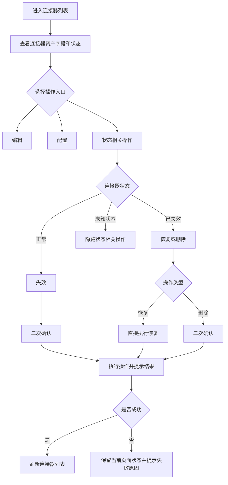
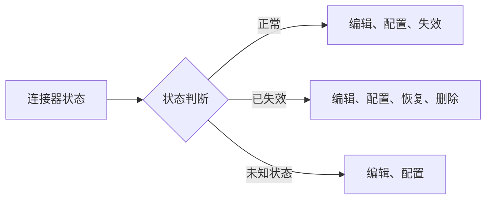
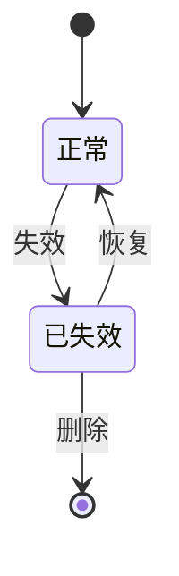
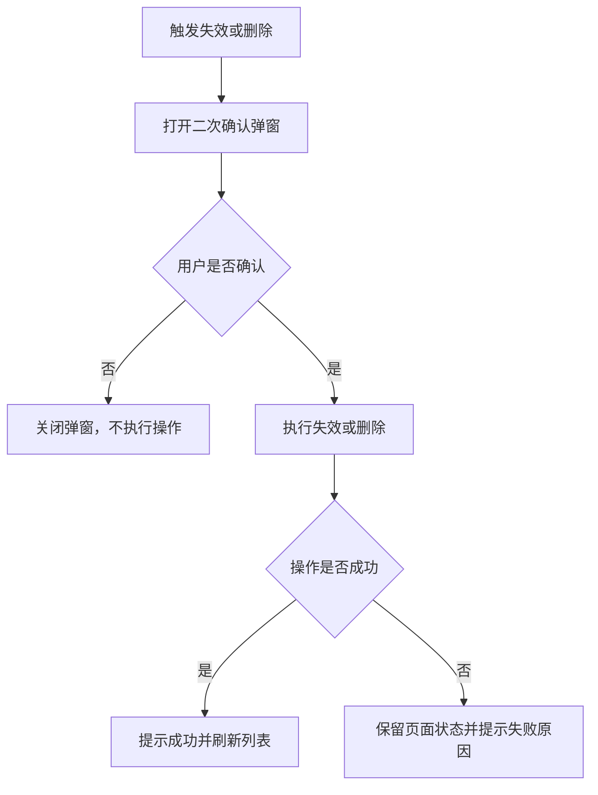

# 连接器列表需求设计说明书

## 修订记录

| 版本 | 日期 | 修订内容 | 作者 |
|---|---|---|---|
| V1.0 | 2026-06-11 | 新增连接器列表整改需求设计 | - |
| V1.1 | 2026-06-12 | 补充连接器管理整改详细方案内容，完善现状、目标、涉及文件、实现规则、实施顺序和验证点 | - |

## 目录

- 需求价值和概述
- 上下文分析
- 页面现状
- 初始需求分析
- 需求影响分析
- 系统用例分析
- 功能设计
- 涉及文件
- 实施顺序
- 验证点
- 系统级非功能设计
- checkList

## 表目录

结构化 IR、页面现状、整改目标、状态与操作规则、涉及文件、自检清单。

## 图目录

无。

## Keywords 关键字

中文：连接器列表、连接器状态、正常、已失效、恢复、删除、失效、表格扩展  
English: Connector List, Connector Status, Normal, Invalid, Restore, Delete, Invalidate, Table Extension

## Abstract 摘要

中文：本文档描述连接器列表页面整改需求，覆盖状态补充、字段扩展、按状态展示操作、失效、恢复、删除和弹窗宽度调整。  
English: This document describes the connector list enhancement requirements, including status extension, table field extension, status-based actions, invalidate, restore, delete, and modal width adjustment.

## List 偶发 abbreviations 缩略语清单

| 缩略语 | 英文全名 | 中文解释 |
|---|---|---|
| ID | Identifier | 唯一标识 |
| API | Application Programming Interface | 应用程序接口 |
| UI | User Interface | 用户界面 |

## 1 需求价值和概述

连接器列表当前缺少连接器 ID、创建者、更新人和状态字段；操作列固定展示编辑、配置、删除，未按连接器状态区分；缺少失效和恢复操作；删除按钮始终展示，不符合“已失效后才可删除”的管理目标。现有交互无法完整覆盖连接器生命周期，也存在误删风险。

本次整改需要新增连接器状态，状态包含正常和已失效；表格补齐连接器 ID、创建者、更新人、状态；正常状态展示编辑、配置、失效；已失效状态展示编辑、配置、恢复、删除；失效和删除走二次确认；恢复直接执行；修复失效状态值并新增恢复处理；同时调整新建/编辑弹窗和二次确认弹窗宽度。

价值：

| 价值点 | 说明 |
|---|---|
| 资产识别 | 补齐连接器 ID，便于定位和排查 |
| 审计信息 | 展示创建者、更新人，便于管理连接器变更来源 |
| 生命周期管理 | 支持正常、已失效两种状态及失效、恢复、删除操作 |
| 降低误删风险 | 删除仅在已失效状态展示，并需要二次确认 |
| 保持原入口 | 编辑、配置入口保持原有交互不变 |
| 体验优化 | 调整弹窗宽度，使表单和确认信息展示更稳定 |

## 2 上下文分析

| 角色 | 关注点 |
|---|---|
| 开发人员 | 根据连接器列表字段、状态和操作入口确认连接器生命周期管理逻辑是否符合配置要求 |
| 测试人员 | 根据正常、已失效、未知状态等场景验证列表字段展示、操作入口、二次确认、弹窗宽度和异常提示是否符合预期 |

连接器列表是连接平台的资产入口。连接器状态会影响后续连接流节点选择和配置使用。正常连接器可继续编辑和配置；已失效连接器可恢复或删除。前端需要控制入口展示，后端仍需进行权限和状态校验。

## 3 页面现状

| 现状项 | 当前表现 | 问题 |
|---|---|---|
| 表格字段 | 缺少连接器 ID、创建者、更新人、状态 | 资产定位和审计信息不足 |
| 操作列 | 固定展示编辑、配置、删除 | 未按状态区分，删除入口过早暴露 |
| 状态能力 | 无正常、已失效状态展示 | 无法表达连接器生命周期 |
| 失效能力 | 缺少失效操作，且失效状态值需修正 | 正常连接器不能按流程置为已失效 |
| 恢复能力 | 缺少恢复操作和恢复处理 | 已失效连接器不能恢复使用 |
| 删除约束 | 删除按钮始终展示 | 不符合“仅已失效可删除”的目标 |
| 弹窗宽度 | 新建/编辑弹窗和确认弹窗宽度需调整 | 表单或确认内容展示不够稳定 |

## 4 初始需求分析

### 4.1 初始需求场景分析

| 场景 | 场景名称 | 说明 | 角色 |
|---|---|---|---|
| 资产查看 | 查看连接器列表 | 查看 ID、名称、类型、描述、创建者、更新人、状态 | 开发人员、测试人员 |
| 生命周期 | 失效连接器 | 正常连接器通过确认后置为已失效 | 开发人员、测试人员 |
| 生命周期 | 恢复连接器 | 已失效连接器恢复为正常 | 开发人员、测试人员 |
| 生命周期 | 删除连接器 | 仅已失效连接器允许删除 | 开发人员、测试人员 |
| 配置管理 | 编辑或配置连接器 | 保持原编辑和配置入口 | 开发人员、测试人员 |

### 4.2 结构化 IR

| IR 属性 | 具体信息 |
|---|---|
| IR 标识 | IR-CONNECTOR-LIST-202606 |
| 名称 | 连接器列表整改 |
| 描述 | 扩展列表字段，新增连接器状态，并按状态控制失效、恢复、删除操作 |
| 优先级 | 高 |
| why | 当前列表缺少状态和审计字段，删除操作直接暴露，缺少失效和恢复能力 |
| what | 新增 ID、创建者、更新人、状态；正常展示编辑、配置、失效；已失效展示编辑、配置、恢复、删除；调整弹窗宽度 |
| who | 前端实现页面展示、操作入口、弹窗交互和基础校验，供开发人员和测试人员验证连接器列表整改规则 |
| 对架构要素的影响 | 前端表格、操作列和弹窗交互调整，安全风险低 |

### 4.3 整改目标

| 目标 | 说明 |
|---|---|
| 状态枚举 | 增加已失效、正常两种状态，0 表示已失效，1 表示正常 |
| 表格补充 | 补齐连接器 ID、创建者、更新人、状态 |
| 正常状态操作 | 正常状态展示编辑、配置、失效 |
| 已失效状态操作 | 已失效状态展示编辑、配置、恢复、删除 |
| 危险操作确认 | 失效和删除走二次确认 |
| 恢复操作 | 恢复直接执行，不需要二次确认 |
| 状态处理 | 修复失效状态值为 0，新增恢复处理并将恢复状态值设置为 1 |
| 弹窗宽度 | 新建/编辑连接器弹窗调整为 520px，二次确认弹窗调整为 420px |

## 5 需求影响分析

| 类型 | 影响特性 | 说明 |
|---|---|---|
| 新增 | 状态展示 | 新增正常、已失效状态 |
| 修改 | 表格字段 | 补充 ID、创建者、更新人、状态 |
| 修改 | 操作列 | 删除不再固定展示，按状态展示失效、恢复、删除 |
| 新增 | 恢复能力 | 已失效连接器可恢复为正常 |
| 修改 | 失效处理 | 失效操作状态值修正为 0 |
| 新增 | 恢复处理 | 恢复操作状态值更新为 1 |
| 修改 | 删除入口 | 删除仅在已失效状态可见 |
| 修改 | 弹窗宽度 | 调整表单弹窗和确认弹窗宽度 |

## 6 系统用例分析

连接器列表整改主要包含连接器资产查看、状态相关操作和配置入口验证三个用例。

连接器资产查看：开发人员和测试人员需要验证列表是否展示连接器 ID、名称、类型、描述、创建者、更新人和状态。  
状态相关操作：开发人员和测试人员需要验证正常状态仅展示失效，已失效状态展示恢复和删除，失效和删除需要二次确认，恢复直接执行。  
配置入口验证：开发人员和测试人员需要验证编辑、配置入口保持原有交互，未知状态下隐藏危险操作。

成功场景：页面加载列表，表格展示完整字段，状态以标签展示，操作列按状态展示；用户执行失效或删除时先二次确认；恢复直接执行；操作成功后刷新列表。  
扩展场景：操作失败时提示错误并保留当前页面状态；未知状态展示默认占位并隐藏危险操作；旧数据缺少审计字段时展示默认占位。

## 7 功能设计

### 7.1 业界方案实现

资源列表通常通过状态标签表达生命周期。编辑和配置属于常用入口，可以前置展示；失效、恢复、删除属于状态相关操作，需要根据当前状态控制入口；删除属于危险操作，应增加状态约束和二次确认。

### 7.2 功能实现整体设计方案

表格展示完整字段；操作列保留编辑、配置；状态相关操作由连接器状态决定。正常状态只允许失效，不展示删除；已失效状态允许恢复和删除；失效和删除通过二次确认弹窗执行；恢复直接处理；操作成功后刷新列表。

整体操作流程如下：

操作展示规则如下：

生命周期流转如下：

弹窗交互流程如下：

### 7.3 状态枚举设计

| 状态值 | 状态文案 | 颜色建议 | 说明 |
|---|---|---|---|
| 0 | 已失效 | 红色 | 连接器已失效，可恢复或删除 |
| 1 | 正常 | 绿色 | 连接器可正常编辑、配置和使用 |

未知状态展示默认占位，不展示失效、恢复、删除等状态相关操作。

### 7.4 表格列设计

目标列顺序：

| 序号 | 展示名称 | 说明 |
|---|---|---|
| 1 | 连接器 ID | 连接器唯一标识 |
| 2 | 中文名称 | 连接器中文名称 |
| 3 | 英文名称 | 连接器英文名称 |
| 4 | 类型 | 连接器类型 |
| 5 | 中文描述 | 连接器中文描述 |
| 6 | 英文描述 | 连接器英文描述 |
| 7 | 创建者 | 创建连接器的用户 |
| 8 | 更新人 | 最近一次更新连接器的用户 |
| 9 | 创建时间 | 连接器创建时间 |
| 10 | 更新时间 | 连接器更新时间 |
| 11 | 状态 | 以状态标签展示 |
| 12 | 操作 | 按状态展示可用操作 |

### 7.5 操作列设计

| 状态 | 操作 | 说明 |
|---|---|---|
| 正常 | 编辑、配置、失效 | 编辑和配置保持原交互，失效需要二次确认 |
| 已失效 | 编辑、配置、恢复、删除 | 恢复直接执行，删除需要二次确认 |
| 未知状态 | 编辑、配置 | 隐藏状态相关危险操作 |

操作规则补充：

| 操作 | 处理方式 | 成功后动作 | 失败后动作 |
|---|---|---|---|
| 编辑 | 打开编辑弹窗或进入编辑入口 | 保存成功后刷新列表 | 提示失败原因 |
| 配置 | 进入连接器配置页面 | 不涉及列表刷新 | 跳转失败时提示错误 |
| 失效 | 打开二次确认弹窗，确认后更新状态为已失效 | 提示失效成功并刷新列表 | 保留页面状态并提示失败 |
| 恢复 | 直接更新状态为正常 | 提示恢复成功并刷新列表 | 提示失败原因 |
| 删除 | 打开二次确认弹窗，确认后删除 | 提示删除成功并刷新列表 | 保留页面状态并提示失败 |

### 7.6 失效、恢复、删除交互设计

| 操作 | 来源状态 | 目标状态 | 是否确认 | 说明 |
|---|---|---|---|---|
| 失效 | 正常 | 已失效 | 是 | 防止误将正常连接器置为失效 |
| 恢复 | 已失效 | 正常 | 否 | 恢复为低风险操作，直接执行 |
| 删除 | 已失效 | 删除记录 | 是 | 删除不可逆，必须二次确认 |

二次确认弹窗需要明确展示操作对象和风险说明。失效确认用于提示连接器失效后可能影响后续选择和配置；删除确认用于提示删除后不可恢复。恢复操作不弹窗，但需要展示成功或失败提示。

### 7.7 弹窗宽度设计

| 弹窗 | 宽度 | 说明 |
|---|---|---|
| 新建/编辑连接器弹窗 | 520px | 用于展示连接器表单字段 |
| 二次确认弹窗 | 420px | 用于展示失效和删除确认内容 |

## 8 涉及文件

| 文件 | 说明 |
|---|---|
| `src/utils/constants.js` | 新增连接器状态枚举 |
| `src/pages/ConnectPlatform/Connector/constants.jsx` | 表格列、操作列、弹窗文案 |
| `src/pages/ConnectPlatform/Connector/index.jsx` | 失效、恢复、删除事件处理 |
| `src/pages/ConnectPlatform/Connector/thunk.js` | 修复失效处理，新增恢复处理 |
| `src/components/ConnectorFormModal/ConnectorFormModal.jsx` | 调整新建/编辑连接器表单弹窗宽度 |
| `src/components/DeleteConfirmModal/DeleteConfirmModal.jsx` | 调整二次确认弹窗宽度 |

## 9 实施顺序

1. 新增连接器状态枚举，包含正常和已失效。
2. 扩展表格列，补充连接器 ID、创建者、更新人、状态。
3. 修复失效处理，将失效状态值更新为已失效。
4. 新增恢复处理，将连接器状态恢复为正常。
5. 操作列按状态切换，正常展示编辑、配置、失效，已失效展示编辑、配置、恢复、删除。
6. 接入失效、恢复、删除交互，失效和删除复用二次确认弹窗，恢复直接执行。
7. 调整新建/编辑连接器弹窗宽度为 520px。
8. 调整二次确认弹窗宽度为 420px。
9. 联调验证列表字段、状态展示、失效、恢复、删除和失败提示。

## 10 验证点

| 验证项 | 预期结果 |
|---|---|
| 表格新增字段 | 连接器 ID、创建者、更新人、状态正常展示 |
| 状态展示 | 正常展示绿色标签，已失效展示红色标签 |
| 正常连接器操作 | 仅展示编辑、配置、失效 |
| 已失效连接器操作 | 展示编辑、配置、恢复、删除 |
| 删除入口 | 仅已失效状态可见 |
| 失效操作 | 二次确认后状态变为已失效 |
| 恢复操作 | 直接执行，成功后状态变为正常 |
| 删除操作 | 二次确认后删除并刷新列表 |
| 弹窗宽度 | 新建/编辑弹窗为 520px，二次确认弹窗为 420px |
| 操作失败 | 保留页面状态并提示失败原因 |
| 未知状态 | 展示默认占位，不展示危险操作 |

## 11 系统级非功能设计

### 11.1 FMEA 影响分析

| 风险 | 影响 | 措施 |
|---|---|---|
| 状态未知 | 操作错误 | 展示默认占位并隐藏危险操作 |
| 删除误操作 | 数据丢失 | 仅已失效可删除并二次确认 |
| 失效误操作 | 正常连接器不可用 | 失效前二次确认 |
| 操作失败 | 页面状态未按预期更新 | 保留页面状态并提示失败 |
| 旧数据缺字段 | 表格展示异常 | 缺失字段展示默认占位 |
| 恢复失败 | 已失效连接器无法恢复 | 提示失败原因，保留当前状态 |

### 11.2 安全影响分析

状态变更和删除依赖后端鉴权。前端按状态控制入口，降低误操作概率；后端需要继续校验用户权限和当前连接器状态。删除入口受状态限制，且删除前需要二次确认。

### 11.3 兼容性

旧数据缺少状态时展示默认占位，隐藏状态相关危险操作。旧数据缺少创建者、更新人时展示默认占位。后续扩展状态时通过枚举和操作映射补充。

### 11.4 可运维

操作成功或失败均需明确提示；失效、恢复、删除成功后刷新列表；表格展示连接器 ID、创建者、更新人，便于排查问题和追踪数据来源。

### 11.5 资料

需要更新连接器列表操作说明，补充状态含义、失效、恢复、删除规则、二次确认说明和弹窗展示规范。

## 12 checkList

| check 点 | 是否达标 |
|---|---|
| 补充连接器 ID、创建者、更新人、状态 | 是 |
| 状态包含正常和已失效 | 是 |
| 正常状态展示编辑、配置、失效 | 是 |
| 已失效展示编辑、配置、恢复、删除 | 是 |
| 删除仅已失效可见 | 是 |
| 失效和删除二次确认 | 是 |
| 恢复直接执行 | 是 |
| 修复失效状态值 | 是 |
| 新增恢复处理 | 是 |
| 新建/编辑弹窗宽度调整为 520px | 是 |
| 二次确认弹窗宽度调整为 420px | 是 |
| 操作失败保留页面状态并提示失败 | 是 |
