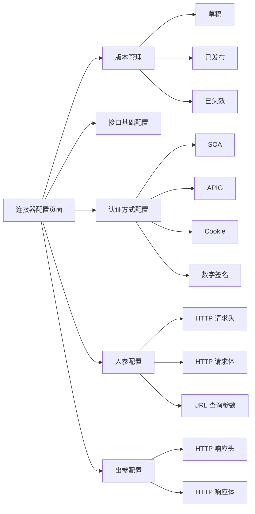
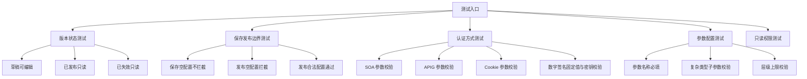
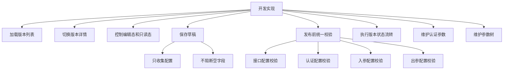
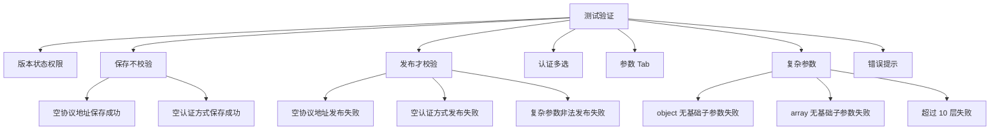
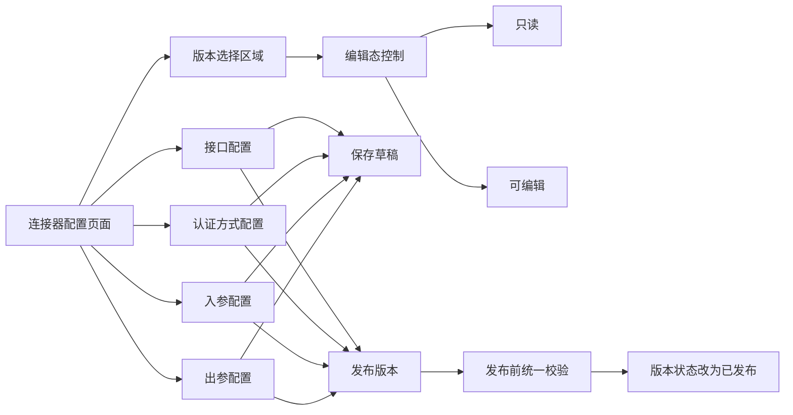
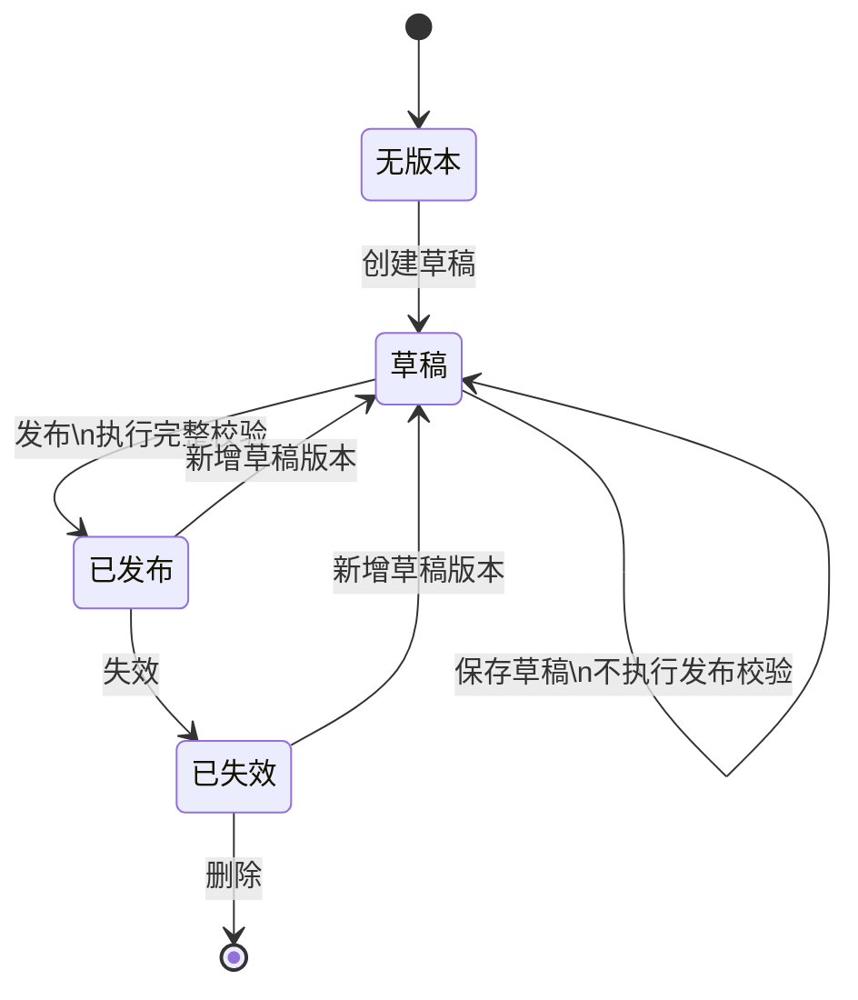
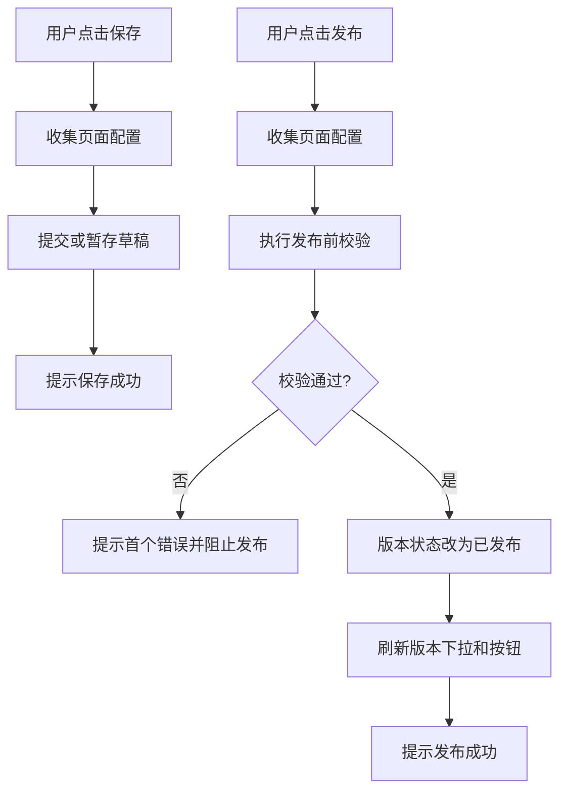
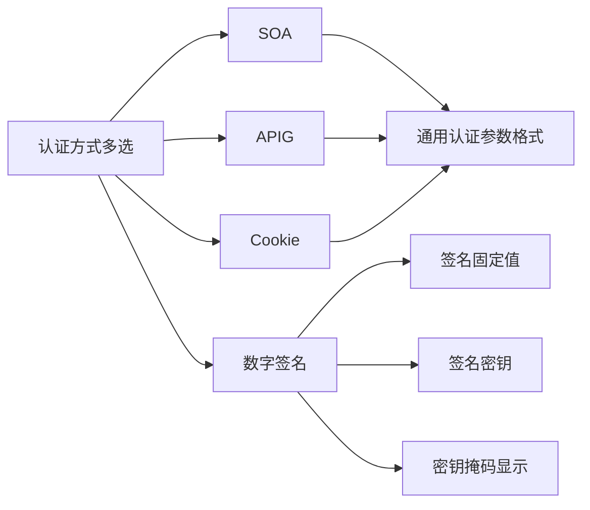
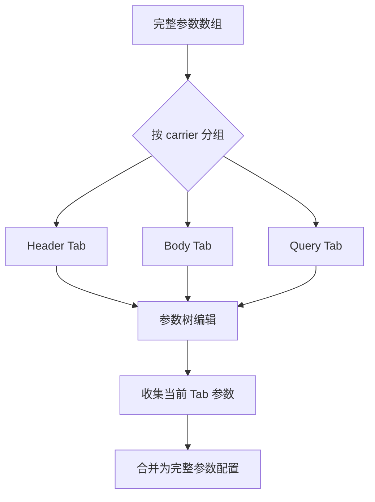
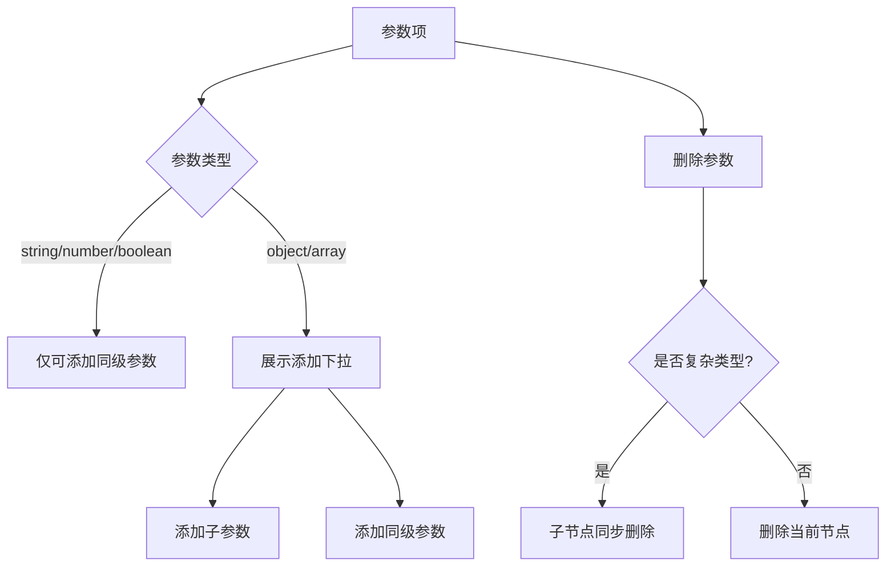

# 连接器配置需求设计说明书

## 修订记录

| 版本 | 日期 | 修订内容 | 作者 |
|---|---|---|---|
| V1.0 | 2026-06-11 | 新增连接器配置整改需求设计 | - |
| V1.1 | 2026-06-15 | 补充发布校验、保存不校验、开发/测试视角上下文和系统用例；移除代码示例，改用流程图说明 | - |

## 目录

- 需求价值和概述
- 上下文分析
- 初始需求分析
- 需求影响分析
- 系统用例分析
- 功能设计
- 系统级非功能设计
- checkList

## 表目录

结构化 IR、版本状态与操作、认证方式、配置校验规则、参数 Tab、接口设计、自检清单。

## 图目录

连接器配置上下文图、版本状态流转图、保存与发布流程图、页面模块关系图、参数配置数据流图、开发与测试用例图。

## Keywords 关键字

中文：连接器配置、接口配置、版本管理、发布校验、保存草稿、Cookie 认证、数字签名  
English: Connector Configuration, API Configuration, Version Management, Publish Validation, Draft Save, Cookie Authentication, Signature Authentication

## Abstract 摘要

中文：本文档描述连接器配置页面整改需求，覆盖版本选择、草稿保存、发布校验、只读编辑切换、认证方式扩展、出入参按位置分 Tab、复杂参数校验、参数层级限制和版本接口。保存草稿时不阻断输入，发布时统一校验配置完整性和参数合法性。  
English: This document describes connector configuration requirements, including version selection, draft saving, publish-time validation, read-only/edit mode, authentication extension, parameter tabs by carrier, complex parameter validation, schema depth limits, and version APIs.

## List 偶发 abbreviations 缩略语清单

| 缩略语 | 英文全名 | 中文解释 |
|---|---|---|
| API | Application Programming Interface | 应用程序接口 |
| SOA | Service-Oriented Architecture | SOA 认证方式 |
| APIG | API Gateway | API 网关认证方式 |
| Cookie | HTTP Cookie | HTTP Cookie 认证信息 |

## 1 需求价值和概述

连接器配置当前是单份可编辑配置，无版本概念；认证方式仅支持 SOA、APIG；入参和出参未按参数位置拆分；保存和发布缺少明确的校验边界。本次整改引入版本体系、草稿保存、发布前校验和只读模式，扩展 Cookie 与数字签名认证，并提升参数配置质量。

核心价值：

| 价值点 | 说明 |
|---|---|
| 降低误改风险 | 已发布和已失效版本只读，避免运行时契约被直接修改 |
| 支持版本化治理 | 草稿、已发布、已失效版本分离，方便配置迭代和回溯 |
| 提升发布质量 | 保存草稿允许暂存半成品，发布时再统一校验完整性 |
| 扩展认证能力 | 新增 Cookie 和数字签名，支持更多接口接入场景 |
| 提升参数可读性 | 入参/出参按 Header、Body、Query 分区维护 |

## 2 上下文分析

### 2.1 开发视角

连接器配置页是连接器契约维护入口，需要同时处理页面状态、版本状态、表单数据、认证参数、入参/出参参数树和接口调用。开发实现时需要把“保存草稿”和“发布版本”拆成两个不同动作：保存只收集并提交数据，发布先执行完整校验再发起状态流转。

开发关注点：

| 模块 | 开发关注点 |
|---|---|
| 版本管理 | 不同版本状态控制按钮、只读态、状态流转和列表刷新 |
| 保存草稿 | 只收集当前配置，不执行必填、格式、复杂参数校验 |
| 发布版本 | 发布前统一校验接口配置、认证配置、入参和出参 |
| 认证配置 | 多选认证方式后动态展示参数区，数字签名使用固定值输入模型 |
| 参数配置 | Tab 只影响展示位置，底层仍按参数树收集数据 |
| 只读控制 | 非草稿版本不能修改任何页面内容，草稿进入编辑态后才可修改 |

### 2.2 测试视角

测试需要围绕版本状态、保存/发布边界、配置校验、Tab 切换、复杂参数和只读限制设计用例。重点不是验证保存时所有字段正确，而是验证发布时能准确拦截非法配置。

测试关注点：

| 测试方向 | 关键断言 |
|---|---|
| 保存草稿 | 空协议地址、空认证、空参数均允许保存 |
| 发布版本 | 配置不完整时阻止发布并展示明确错误 |
| 认证方式 | 多选后每种认证都能独立校验对应参数 |
| 数字签名 | 不展示字段映射输入框，校验固定值和密钥配置 |
| 入参/出参 | 各 Tab 下参数能独立新增、删除、收集和校验 |
| 复杂参数 | object/array 必须包含基础类型子参数，超层级不允许发布 |

## 3 初始需求分析

### 3.1 初始需求场景分析

| 场景 | 场景名称 | 说明 | 主要视角 |
|---|---|---|---|
| 版本管理 | 选择版本 | 顶部切换连接器版本并加载详情 | 开发、测试 |
| 版本管理 | 创建草稿 | 版本列表为空时仅展示创建草稿入口 | 开发、测试 |
| 配置编辑 | 编辑草稿 | 草稿版本可进入编辑态，非草稿版本只读 | 开发、测试 |
| 草稿保存 | 保存草稿 | 保存当前草稿内容，不执行发布校验 | 开发、测试 |
| 配置发布 | 发布草稿 | 发布前校验所有配置，校验通过后发布 | 开发、测试 |
| 参数配置 | 按位置维护参数 | 入参按 header/body/query，出参按 header/body | 开发、测试 |
| 认证扩展 | 配置 Cookie 和数字签名 | 多选认证方式并维护对应参数 | 开发、测试 |

### 3.2 结构化 IR

| IR 属性 | 具体信息 |
|---|---|
| IR 标识 | IR-CONNECTOR-CONFIG-202606 |
| 名称 | 连接器配置整改 |
| 描述 | 增加版本管理、草稿保存、发布校验、只读编辑切换、认证扩展、参数 Tab、复杂参数校验和层级限制 |
| 优先级 | 高 |
| why | 单配置编辑风险高，保存和发布边界不清晰，认证和参数能力不足 |
| what | 增加版本选择和创建草稿；扩展 Cookie、数字签名；出入参分 Tab；保存不校验；发布前校验完整性、复杂参数和层级上限 |
| who | 前端实现交互、状态控制和校验；后端提供版本接口和状态流转能力；测试覆盖保存/发布边界和状态权限 |
| 对架构要素的影响 | 前端页面和组件数据流调整；转换层保持数组加 carrier 结构；发布动作新增统一校验入口 |

## 4 需求影响分析

| 类型 | 影响特性 | 说明 |
|---|---|---|
| 新增 | 版本选择 | 顶部增加版本下拉和状态操作按钮 |
| 新增 | 创建草稿 | 版本列表为空时仅展示创建草稿按钮 |
| 修改 | 编辑模式 | 非草稿只读；草稿进入编辑态后可修改 |
| 新增 | 保存草稿 | 保存只收集并暂存配置，不执行发布校验 |
| 新增 | 发布校验 | 发布前校验接口配置、认证配置、入参和出参 |
| 新增 | Cookie 认证 | 认证参数格式与 SOA/APIG 保持一致 |
| 新增 | 数字签名认证 | 不展示字段映射输入框，改为固定值和密钥配置 |
| 修改 | 参数配置 | 入参/出参按参数位置 Tab 展示 |
| 新增 | 参数校验 | 参数名称必填；object、array 必须包含基础类型子参数；最多支持 10 层 |

## 5 系统用例分析

### 5.1 开发视角用例

| 用例 | 开发处理 | 成功标准 |
|---|---|---|
| 加载版本列表 | 请求版本列表并默认选中一个版本 | 下拉展示版本名称、创建时间和状态 |
| 控制编辑态 | 根据版本状态启用或禁用页面控件 | 非草稿不可修改，草稿编辑态可修改 |
| 保存草稿 | 收集页面当前输入并保存 | 空字段也可保存成功 |
| 发布校验 | 发布前调用统一校验入口 | 非法配置阻止发布并提示具体原因 |
| 状态流转 | 发布、失效、删除、创建草稿后刷新列表 | 按状态展示正确按钮 |
| 参数树维护 | 支持同级参数和子参数新增删除 | 删除复杂类型时子节点同步删除 |

### 5.2 测试视角用例

| 用例 | 测试输入 | 预期结果 |
|---|---|---|
| 保存不校验 | 草稿中协议地址为空，点击保存 | 保存成功，不提示必填错误 |
| 发布校验协议 | 草稿中协议地址为空，点击发布 | 发布失败，提示协议地址不能为空 |
| 发布校验认证 | 未选择认证方式，点击发布 | 发布失败，提示至少选择一种认证方式 |
| 发布校验 Cookie | 勾选 Cookie，清空参数名称，点击发布 | 发布失败，提示 Cookie 参数名称不能为空 |
| 发布校验数字签名 | 勾选数字签名，密钥为空，点击发布 | 发布失败，提示签名密钥不能为空 |
| 非草稿只读 | 切换到已发布或已失效版本 | 页面控件不可编辑 |
| 复杂参数校验 | object/array 没有基础类型子参数 | 发布失败，提示复杂类型必须包含基础类型子参数 |

## 6 功能设计

### 6.1 整体设计原则

页面由页面头部、版本选择区域、接口基础配置、认证方式配置、入参配置、出参配置组成。页面默认只读，只有草稿版本可编辑。保存动作与发布动作分离：保存不校验，发布才校验。

### 6.2 版本状态和操作矩阵

| 状态 | 展示文案 | 页面可编辑 | 主要操作 |
|---|---|---|---|
| 无版本 | 暂无版本 | 不可编辑 | 创建草稿 |
| 草稿 | 草稿 | 可进入编辑态 | 保存、发布 |
| 已发布 | 已发布 | 不可编辑 | 新增草稿版本、失效 |
| 已失效 | 已失效 | 不可编辑 | 新增草稿版本、删除 |

### 6.3 保存与发布流程

保存和发布是两个独立动作。保存用于暂存草稿，允许配置未完成；发布用于生成可被连接流使用的正式版本，因此必须执行完整校验。

### 6.4 发布校验规则

| 配置区域 | 校验项 | 校验规则 | 触发时机 |
|---|---|---|---|
| 接口配置 | 协议类型 | 必选 | 发布 |
| 接口配置 | 协议地址 | 必填，且为 http/https 地址 | 发布 |
| 认证方式配置 | 认证方式 | 至少选择一种 | 发布 |
| SOA | 参数名称 | 必填 | 发布 |
| APIG | 参数名称 | 必填 | 发布 |
| Cookie | 参数名称 | 必填，参数格式与 SOA/APIG 一致 | 发布 |
| 数字签名 | 签名固定值 | 必填，默认展示 X-Signature | 发布 |
| 数字签名 | 签名密钥 | 必填 | 发布 |
| 入参配置 | 参数名称 | 每个参数必填 | 发布 |
| 出参配置 | 参数名称 | 每个参数必填 | 发布 |
| 入参/出参配置 | 参数类型 | 仅支持 object、array、string、number、boolean | 发布 |
| 入参/出参配置 | object/array | 必须包含基础类型子参数 | 发布 |
| 入参/出参配置 | 参数层级 | 最多支持 10 层 | 发布 |

### 6.5 认证方式扩展

认证方式由 SOA、APIG 扩展为 SOA、APIG、Cookie、数字签名，且支持多选。勾选后展示对应配置区域。

| 认证类型 | 配置内容 | 交互规则 |
|---|---|---|
| SOA | 参数名称、参数类型、参数位置、值来源 | 参数格式保持现有逻辑 |
| APIG | 参数名称、参数类型、参数位置、值来源 | 参数格式保持现有逻辑 |
| Cookie | 参数名称、参数类型、参数位置、值来源 | 参数格式与 SOA/APIG 一致 |
| 数字签名 | 参数名称、参数类型、参数位置、签名固定值、签名密钥 | 不展示字段映射输入框，改为固定值输入框 |

### 6.6 入参和出参 Tab 设计

入参配置新增 HTTP 请求头、HTTP 请求体、URL 查询参数三个 Tab；出参配置保留 HTTP 响应头、HTTP 响应体两个 Tab。每个 Tab 下独立展示当前参数位置的数据。

| 区域 | Tab | carrier | 数据范围 |
|---|---|---|---|
| 入参配置 | HTTP 请求头 | header | 请求 Header 参数 |
| 入参配置 | HTTP 请求体 | body | 请求 Body 参数 |
| 入参配置 | URL 查询参数 | query | URL Query 参数 |
| 出参配置 | HTTP 响应头 | header | 响应 Header 参数 |
| 出参配置 | HTTP 响应体 | body | 响应 Body 参数 |

### 6.7 参数项交互设计

每个参数配置项包含参数名称、参数值、参数类型、参数描述、添加按钮和删除按钮。object 和 array 类型可以添加子参数，添加按钮通过下拉框区分“添加子参数”和“添加同级参数”。

| 参数字段 | 是否必填 | 说明 |
|---|---|---|
| 参数名称 | 发布时必填 | 保存草稿时可为空 |
| 参数值 | 按场景决定 | 数字签名为固定值输入模型 |
| 参数类型 | 可选 | 可选值为 object、array、string、number、boolean |
| 参数描述 | 可选 | 用于说明参数含义 |
| 添加按钮 | 可见性受编辑态控制 | object/array 展示添加子参数或同级参数 |
| 删除按钮 | 可见性受编辑态控制 | 删除 object/array 时同步删除子节点 |

### 6.8 接口设计

| URL | method | 功能 | 增删改查 | 页面行为 |
|---|---|---|---|---|
| `/connectors/{connectorId}/versions` | GET | 版本列表 | 查 | 页面初始化和版本操作成功后刷新版本下拉 |
| `/connectors/{connectorId}/versions/draft` | POST | 创建草稿 | 增 | 版本列表为空或新增草稿时调用 |
| `/connectors/{connectorId}/versions/{versionId}` | GET | 版本详情 | 查 | 切换版本后加载页面主体配置 |
| `/connectors/{connectorId}/versions/{versionId}` | PUT | 保存配置 | 改 | 草稿保存时调用，不做发布校验 |
| `/connectors/{connectorId}/versions/{versionId}/publish` | POST | 发布 | 改 | 草稿发布时调用，前端先完成发布校验 |
| `/connectors/{connectorId}/versions/{versionId}/copy` | POST | 复制到草稿 | 增 | 基于已发布或已失效版本生成草稿 |
| `/connectors/{connectorId}/versions/{versionId}/status` | PUT | 失效 | 改 | 已发布版本失效 |
| `/connectors/{connectorId}/versions/{versionId}` | DELETE | 删除版本 | 删 | 删除已失效版本 |

### 6.9 数据模型设计

接口配置页前端维护统一参数结构，参数项通过 carrier 标识所在位置。展示层按 Tab 拆分，保存和发布前统一收集。

| 字段 | 类型 | 说明 |
|---|---|---|
| versionId | string | 版本 ID |
| status | string | 版本状态，草稿、已发布、已失效 |
| protocolType | string | HTTP 方法 |
| protocolAddress | string | 接口地址 |
| authType | array | 多选认证方式 |
| authRequestSchema | array | 认证参数配置 |
| requestSchema | object | 入参配置，按 header/body/query 分组 |
| responseSchema | object | 出参配置，按 header/body 分组 |

## 7 系统级非功能设计

### 7.1 FMEA 影响分析

| 风险 | 影响 | 措施 |
|---|---|---|
| 保存时拦截半成品 | 用户无法暂存草稿 | 保存不执行发布校验 |
| 发布时遗漏非法配置 | 运行时契约不可用 | 发布前统一校验接口、认证、入参、出参 |
| 非草稿被误改 | 已发布契约被破坏 | 已发布和已失效版本只读 |
| Tab 合并丢参数 | 保存数据不完整 | 按 Tab 收集后统一合并 |
| 复杂参数非法 | 运行结构不明确 | 发布前递归校验基础类型子参数和 10 层上限 |
| 版本接口失败 | 页面异常 | 保留当前配置并提示失败 |

### 7.2 安全影响分析

数字签名密钥默认掩码展示，并通过独立按钮控制显示或隐藏；Cookie 运行时值不在连接器配置页明文维护；发布、失效、删除和创建草稿依赖后端鉴权。

### 7.3 兼容性

历史参数缺少 carrier 时默认归入 body；认证方式和版本状态通过枚举扩展；历史复杂参数如果超过 10 层，发布时提示并阻止发布。

### 7.4 可运维

版本操作成功后刷新列表和详情；版本列表为空时保留当前页面并展示创建草稿入口；校验失败提示具体配置区域和参数路径，便于定位问题。

### 7.5 测试建议

| 测试类型 | 覆盖内容 |
|---|---|
| 单元测试 | 发布校验规则、复杂参数递归校验、层级限制 |
| 交互测试 | 保存不校验、发布才校验、状态按钮切换 |
| 回归测试 | SOA/APIG 原有认证逻辑、参数 Tab 切换不丢数据 |
| 权限测试 | 非草稿版本只读、草稿版本可编辑 |

## 8 checkList

| check 点 | 是否达标 |
|---|---|
| 页面默认只读 | 是 |
| 草稿可编辑保存 | 是 |
| 保存草稿不执行发布校验 | 是 |
| 发布草稿执行完整校验 | 是 |
| 非草稿版本不允许编辑 | 是 |
| 版本列表为空时支持创建草稿 | 是 |
| 支持 Cookie、数字签名 | 是 |
| 数字签名不展示字段映射输入框 | 是 |
| 数字签名使用固定值和密钥配置 | 是 |
| 入参按 HTTP 请求头、HTTP 请求体、URL 查询参数展示 | 是 |
| 出参按 HTTP 响应头、HTTP 响应体展示 | 是 |
| Tab 切换不丢失参数 | 是 |
| 参数名称发布时校验必填 | 是 |
| object、array 发布前校验 | 是 |
| object、array 参数最多支持 10 层 | 是 |
| 上下文分析体现开发和测试角度 | 是 |
| 系统用例体现开发和测试角度 | 是 |
| 设计说明书不展示代码示例 | 是 |
