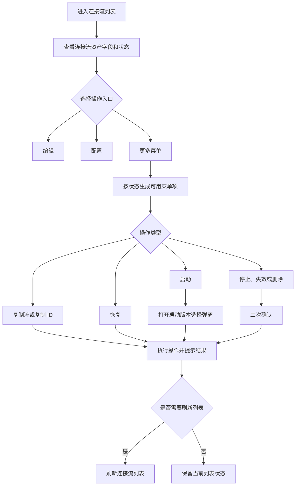
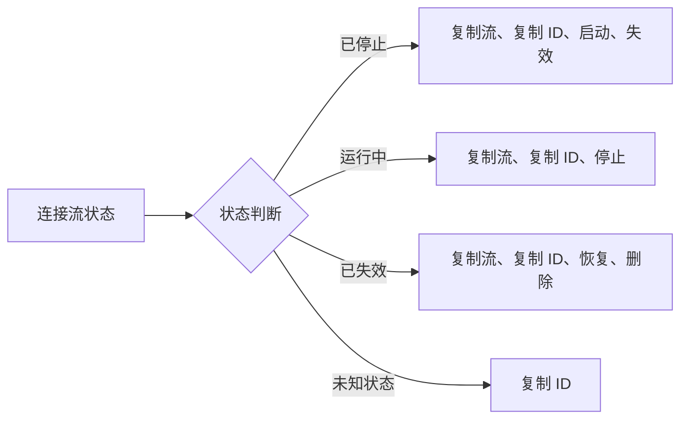
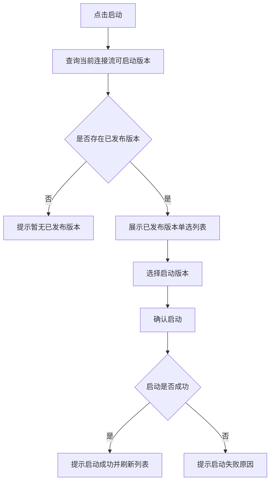
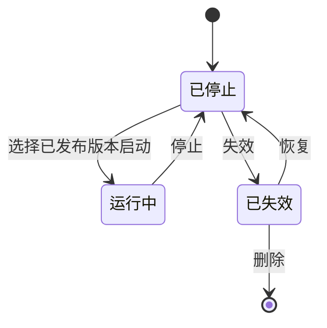

# 连接流列表需求设计说明书

## 修订记录

| 版本 | 日期 | 修订内容 | 作者 |
|---|---|---|---|
| V1.0 | 2026-06-11 | 新增连接流列表整改需求设计 | - |
| V1.1 | 2026-06-12 | 补充连接流管理整改详细方案内容，完善现状、目标、涉及文件、实现规则、实施顺序和验证点 | - |
| V1.2 | 2026-06-17 | 调整连接流生命周期，移除待部署状态，默认状态改为已停止 | - |

## 目录

- 需求价值和概述
- 上下文分析
- 页面现状
- 初始需求分析
- 需求影响分析
- 系统用例分析
- 功能设计
- 涉及文件
- 实施顺序
- 验证点
- 系统级非功能设计
- checkList

## 表目录

结构化 IR、页面现状、整改目标、状态与菜单规则、涉及文件、自检清单。

## 图目录

无。

## Keywords 关键字

中文：连接流列表、连接流状态、已停止、运行中、已失效、启动版本、复制流、复制 ID、更多菜单
English: Flow List, Flow Status, Stopped, Running, Invalid, Start Version, Copy Flow, Copy ID, More Menu

## Abstract 摘要

中文：本文档描述连接流列表整改需求，覆盖状态调整、表格字段扩展、更多菜单、复制流、复制 ID、启动版本选择、停止、失效、恢复和删除等能力。
English: This document describes flow list enhancement requirements, including status adjustment, table fields, more menu, copy flow, copy ID, start version selection, stop, invalidate, restore, and delete.

## List 偶发 abbreviations 缩略语清单

| 缩略语 | 英文全名 | 中文解释 |
|---|---|---|
| ID | Identifier | 唯一标识 |
| API | Application Programming Interface | 应用程序接口 |
| UI | User Interface | 用户界面 |

## 1 需求价值和概述

连接流列表当前包含运行中、已停止状态，缺少已失效状态；新建连接流默认应为已停止状态；表格字段缺少连接流 ID、创建者、更新人；操作按钮直接暴露在表格中，缺少统一的更多菜单；启动时缺少版本选择入口。现有列表难以完整表达连接流生命周期，也不便于用户定位、复制和启动连接流。

本次整改需要将连接流状态调整为已停止、运行中、已失效三种；补齐资产识别字段；将操作列收敛为编辑、配置、更多；在更多菜单中按状态展示可用操作；启动时弹出版本选择弹窗，只展示已发布版本；补充复制流和复制 ID 能力。

价值：

| 价值点 | 说明 |
|---|---|
| 资产识别 | 展示连接流 ID、创建者、更新人，便于排查和管理 |
| 生命周期管理 | 支持已停止、运行中、已失效三态展示和操作 |
| 操作收敛 | 操作列固定展示编辑、配置、更多，减少列表横向按钮堆叠 |
| 启动准确性 | 启动前选择已发布版本，避免运行版本不明确 |
| 复用效率 | 支持复制流，减少重复配置成本 |
| 运维定位 | 支持复制 ID，便于日志排查和接口联调 |

## 2 上下文分析

连接流列表本次整改来源于上一版本生命周期表达不完整和启动能力不足。上一版本列表能够承载基础查看、编辑和配置入口，但状态、字段和操作还停留在简单管理阶段，无法完整支撑连接流从创建、启动、运行、停止到失效删除的闭环管理。

| 背景类型 | 现有问题或增强原因 | 本次处理方向 |
|---|---|---|
| 上个版本功能缺陷 | 状态缺少已失效，且新建连接流默认状态不符合实际生命周期 | 状态调整为已停止、运行中、已失效三种，新建和复制后默认为已停止 |
| 上个版本功能缺陷 | 表格缺少连接流 ID、创建者、更新人，排查问题和审计变更时定位成本较高 | 补充资产识别和审计字段 |
| 上个版本功能缺陷 | 操作按钮直接铺在表格中，状态差异越多越难控制可见性，也容易暴露不应执行的操作 | 操作列收敛为编辑、配置、更多，并按状态生成更多菜单 |
| 上个版本功能缺陷 | 启动时没有版本选择入口，用户无法明确选择要运行的已发布版本 | 启动前打开版本选择弹窗，只允许选择已发布版本 |
| 现有能力增强 | 用户需要快速复用连接流配置，并在排障时复制连接流 ID | 增加复制流和复制 ID 能力 |

因此，本次连接流列表不是单纯增加按钮，而是补齐连接流生命周期管理能力，降低启动误操作和排障成本，并让不同状态下的操作入口更清晰。

## 3 页面现状

| 现状项 | 当前表现 | 问题 |
|---|---|---|
| 状态枚举 | 只有运行中、已停止 | 缺少已失效，新建默认状态需要统一为已停止 |
| 表格字段 | 未展示连接流 ID、创建者、更新人 | 资产定位和审计信息不足 |
| 操作列 | 操作按钮直接暴露在表格中 | 按钮过多时影响列表展示，也不便按状态收敛操作 |
| 复制能力 | 缺少复制流、复制 ID | 复用配置和定位问题不方便 |
| 启动能力 | 缺少启动版本选择弹窗 | 用户无法明确选择要启动的已发布版本 |
| 生命周期操作 | 缺少失效、恢复等能力 | 连接流无法形成完整生命周期闭环 |

## 4 初始需求分析

### 4.1 初始需求场景分析

| 场景 | 场景名称 | 说明 | 角色 |
|---|---|---|---|
| 列表查看 | 查看连接流资产 | 查看 ID、名称、描述、创建者、更新人、状态 | 开发人员、测试人员 |
| 操作管理 | 使用更多菜单 | 按状态展示复制、启动、停止、失效、恢复、删除等操作 | 开发人员、测试人员 |
| 启动管理 | 选择版本启动 | 启动时选择已发布版本，确认后进入运行中 | 开发人员、测试人员 |
| 复用配置 | 复制连接流 | 基于已有流生成新流，默认状态为已停止 | 开发人员、测试人员 |
| 问题定位 | 复制连接流 ID | 将连接流 ID 复制到剪贴板，用于日志和接口排查 | 开发人员、测试人员 |

### 4.2 结构化 IR

| IR 属性 | 具体信息 |
|---|---|
| IR 标识 | IR-FLOW-LIST-202606 |
| 名称 | 连接流列表整改 |
| 描述 | 调整状态和字段，操作列改为编辑、配置、更多，补充复制、启动、停止、失效、恢复和删除能力 |
| 优先级 | 高 |
| why | 当前状态和操作不完整，启动缺少版本选择，表格缺少资产识别字段 |
| what | 状态调整为已停止、运行中、已失效；默认状态为已停止；补充 ID、创建者、更新人；更多菜单按状态展示；启动选择已发布版本 |
| who | 前端实现列表、更多菜单、复制 ID、启动弹窗、操作交互和基础校验，供开发人员和测试人员验证连接流列表整改规则 |
| 对架构要素的影响 | 前端列表交互、启动弹窗和状态枚举调整 |

### 4.3 整改目标

| 目标 | 说明 |
|---|---|
| 状态调整 | 状态调整为已停止、运行中、已失效 |
| 默认状态 | 新建连接流和复制流默认状态为已停止 |
| 表格补充 | 补充连接流 ID、创建者、更新人字段 |
| 操作收敛 | 操作列固定展示编辑、配置、更多 |
| 菜单分态 | 更多菜单按连接流状态展示不同操作 |
| 复制能力 | 支持复制流和复制 ID |
| 启动能力 | 启动时弹出版本选择弹窗，只展示已发布版本 |
| 生命周期能力 | 支持启动、停止、失效、恢复、删除 |
| 危险操作确认 | 停止、失效、删除需要二次确认 |

## 5 需求影响分析

| 类型 | 影响特性 | 说明 |
|---|---|---|
| 修改 | 状态枚举 | 移除待部署状态，新增已失效状态，保留已停止和运行中 |
| 修改 | 默认状态 | 新建连接流和复制流默认状态改为已停止 |
| 修改 | 表格字段 | 新增连接流 ID、创建者、更新人 |
| 修改 | 操作列 | 固定展示编辑、配置、更多，不再直接铺开全部操作 |
| 新增 | 更多菜单 | 按状态展示复制、启动、停止、失效、恢复、删除 |
| 新增 | 启动弹窗 | 启动时选择已发布版本 |
| 新增 | 复制能力 | 支持复制流和复制 ID |
| 新增 | 生命周期操作 | 支持启动、停止、失效、恢复、删除 |
| 新增 | 工具函数 | 补充复制 ID 工具能力 |
| 修改 | 操作处理 | 补充复制、启动、状态变更和版本查询处理 |

## 6 系统用例分析

连接流列表整改主要包含连接流资产查看、更多菜单操作、启动版本选择和复制能力验证四个用例。

连接流资产查看：开发人员和测试人员需要验证列表是否展示连接流 ID、名称、描述、创建者、更新人和状态。
更多菜单操作：开发人员和测试人员需要验证不同状态下更多菜单条目是否正确，停止、失效、删除是否需要二次确认。
启动版本选择：开发人员和测试人员需要验证启动操作是否打开版本选择弹窗，且仅展示已发布版本。
复制能力验证：开发人员和测试人员需要验证复制流成功后刷新列表，复制 ID 成功后展示成功提示。

成功场景：用户进入连接流列表，表格展示完整字段和状态标签；操作列固定展示编辑、配置、更多；用户点击更多菜单后，系统按状态展示可用操作；已停止连接流点击启动后打开版本选择弹窗；操作成功后刷新列表。
扩展场景：无已发布版本时提示暂无可启动版本；停止、失效、删除需要二次确认；复制 ID 失败时提示失败；操作失败时保留当前页面状态并提示错误。

## 7 功能设计

### 7.1 业界方案实现

流程类资源列表通常使用状态标签表达生命周期。高频操作前置展示，低频操作和危险操作收敛到更多菜单中，并根据资源状态控制菜单项可见性。启动类操作通常需要先选择目标版本，避免系统默认版本与用户预期不一致。

### 7.2 功能实现整体设计方案

表格展示完整资产字段；操作列固定为编辑、配置、更多；更多菜单根据连接流状态生成；启动操作打开版本选择弹窗；复制、复制 ID、恢复直接执行；停止、失效、删除进入二次确认；所有操作成功后刷新列表。

整体操作流程如下：

菜单生成规则如下：

启动版本选择流程如下：

生命周期流转如下：

### 7.3 状态枚举设计

| 状态文案 | 颜色建议 | 说明 |
|---|---|---|
| 运行中 | 绿色 | 当前连接流已选择已发布版本并运行 |
| 已停止 | 红色 | 当前连接流未运行，新建和复制后默认进入该状态 |
| 已失效 | 红色 | 当前连接流已失效，可恢复或删除 |

未知状态展示默认占位，不展示危险操作。

### 7.4 表格列设计

目标列顺序：

| 序号 | 展示名称 | 说明 |
|---|---|---|
| 1 | 连接流 ID | 连接流唯一标识 |
| 2 | 中文名称 | 连接流中文名称 |
| 3 | 英文名称 | 连接流英文名称 |
| 4 | 中文描述 | 连接流中文描述 |
| 5 | 英文描述 | 连接流英文描述 |
| 6 | 创建者 | 创建连接流的用户 |
| 7 | 更新人 | 最近一次更新连接流的用户 |
| 8 | 创建时间 | 连接流创建时间 |
| 9 | 更新时间 | 连接流更新时间 |
| 10 | 状态 | 以状态标签展示 |
| 11 | 操作 | 固定展示编辑、配置、更多 |

### 7.5 操作列设计

操作列固定展示三个入口：

| 操作 | 展示方式 | 行为 |
|---|---|---|
| 编辑 | 按钮 | 打开连接流基础信息编辑入口 |
| 配置 | 按钮 | 进入连接流配置页面 |
| 更多 | 下拉菜单 | 按状态展示当前可用操作 |

编辑和配置保持原有交互，不受状态差异影响。更多菜单承载复制、启动、停止、失效、恢复、删除等操作。

### 7.6 更多菜单规则

| 状态 | 菜单条目 | 说明 |
|---|---|---|
| 已停止 | 复制流、复制 ID、启动、失效 | 已停止的流可选择已发布版本启动，也可置为失效 |
| 运行中 | 复制流、复制 ID、停止 | 运行中的流可停止 |
| 已失效 | 复制流、复制 ID、恢复、删除 | 已失效的流可恢复为已停止或删除 |
| 未知状态 | 复制 ID | 未知状态下仅保留低风险定位能力 |

菜单规则补充：

| 规则 | 说明 |
|---|---|
| 复制流 | 用于基于当前连接流生成副本，副本默认状态为已停止 |
| 复制 ID | 将连接流 ID 写入剪贴板 |
| 启动 | 打开启动版本选择弹窗，只展示已发布版本 |
| 停止 | 进入二次确认弹窗 |
| 失效 | 仅已停止状态可操作，并进入二次确认弹窗 |
| 恢复 | 已失效状态直接恢复为已停止 |
| 删除 | 仅已失效状态展示，并进入二次确认弹窗 |

### 7.7 操作分发设计

| 操作 | 处理方式 | 成功后动作 | 失败后动作 |
|---|---|---|---|
| 复制流 | 调用复制流接口 | 提示复制成功并刷新列表，新流状态为已停止 | 提示失败原因 |
| 复制 ID | 调用复制 ID 工具能力 | 提示复制成功 | 提示复制失败 |
| 启动 | 打开启动版本选择弹窗 | 确认启动成功后刷新列表，状态变为运行中 | 提示失败原因 |
| 停止 | 二次确认后调用状态变更接口 | 提示停止成功并刷新列表，状态变为已停止 | 保留页面状态并提示失败 |
| 失效 | 二次确认后调用状态变更接口 | 提示失效成功并刷新列表，状态变为已失效 | 保留页面状态并提示失败 |
| 恢复 | 调用状态变更接口 | 提示恢复成功并刷新列表，状态变为已停止 | 提示失败原因 |
| 删除 | 二次确认后调用删除接口 | 提示删除成功并刷新列表 | 保留页面状态并提示失败 |

### 7.8 启动版本选择弹窗设计

| 项目 | 设计 |
|---|---|
| 打开时机 | 点击更多菜单中的启动 |
| 弹窗标题 | 选择启动版本 |
| 数据来源 | 当前连接流的可启动版本列表 |
| 版本范围 | 只展示已发布版本 |
| 选择方式 | 单选 |
| 确认按钮 | 确认启动 |
| 取消按钮 | 关闭弹窗，不执行启动 |
| 无数据处理 | 提示暂无已发布版本，禁止确认启动 |
| 成功处理 | 提示启动成功并刷新列表 |
| 失败处理 | 提示启动失败原因，弹窗状态按实际交互保留或关闭 |

### 7.9 复制能力设计

| 能力 | 设计 |
|---|---|
| 复制流 | 调用复制接口生成新的连接流记录，新记录默认状态为已停止，成功后刷新列表 |
| 复制 ID | 复制当前行连接流 ID，成功后提示“复制成功” |
| 失败处理 | 复制流失败展示接口错误；复制 ID 失败提示用户手动复制 |

### 7.10 生命周期操作设计

| 操作 | 来源状态 | 目标状态 | 是否确认 | 说明 |
|---|---|---|---|---|
| 启动 | 已停止 | 运行中 | 否，需选择版本 | 确认已发布版本后执行启动 |
| 停止 | 运行中 | 已停止 | 是 | 防止误停运行中连接流 |
| 失效 | 已停止 | 已失效 | 是 | 失效后可恢复或删除 |
| 恢复 | 已失效 | 已停止 | 否 | 直接执行恢复 |
| 删除 | 已失效 | 删除记录 | 是 | 仅已失效状态允许删除 |

## 8 涉及文件

| 文件 | 说明 |
|---|---|
| `src/utils/constants.js` | 连接流状态枚举，包含已停止、运行中、已失效 |
| `src/utils/flowUtils.js` | 复制 ID 工具函数 |
| `src/pages/ConnectPlatform/Flow/constants.jsx` | 表格列、更多菜单配置、弹窗文案 |
| `src/pages/ConnectPlatform/Flow/index.jsx` | 操作分发、更多菜单处理、启动弹窗接入 |
| `src/pages/ConnectPlatform/Flow/thunk.js` | 复制、启动、停止、失效、恢复、删除、版本查询处理 |
| `src/components/DeployFlowModal/DeployFlowModal.jsx` | 启动版本选择弹窗 |

## 9 实施顺序

1. 调整连接流状态枚举，移除待部署，保留已停止、运行中、已失效。
2. 将新建连接流和复制流默认状态改为已停止。
3. 扩展表格列，补充连接流 ID、创建者、更新人。
4. 补充复制、启动、状态变更、删除和版本查询处理。
5. 支持复制、启动、停止、失效、恢复、删除等操作分发。
6. 新增复制 ID 工具能力。
7. 新增更多菜单配置，按状态返回菜单条目。
8. 新增启动版本选择弹窗，只展示已发布版本。
9. 操作列接入编辑、配置、更多，并完成更多菜单操作分发。
10. 接入二次确认弹窗，覆盖停止、失效、删除。
11. 联调验证列表展示、状态流转、启动、复制和删除。

## 10 验证点

| 验证项 | 预期结果 |
|---|---|
| 状态筛选和状态标签 | 出现已停止、运行中、已失效 |
| 默认状态 | 新建连接流和复制流默认展示为已停止 |
| 表格字段 | 展示连接流 ID、创建者、更新人 |
| 操作列 | 只固定展示编辑、配置、更多 |
| 已停止菜单 | 展示复制流、复制 ID、启动、失效 |
| 运行中菜单 | 展示复制流、复制 ID、停止 |
| 已失效菜单 | 展示复制流、复制 ID、恢复、删除 |
| 启动弹窗 | 只展示已发布版本，选择版本后可确认启动 |
| 无可启动版本 | 提示暂无已发布版本，不执行启动 |
| 复制流 | 复制成功后刷新列表，新流状态为已停止 |
| 复制 ID | 成功复制当前连接流 ID |
| 危险操作 | 停止、失效、删除均需要二次确认 |
| 失效入口 | 仅已停止状态展示失效 |
| 删除入口 | 仅已失效状态展示删除 |
| 恢复入口 | 已失效状态恢复后变为已停止 |
| 操作失败 | 保留页面状态并提示失败原因 |

## 11 系统级非功能设计

### 11.1 FMEA 影响分析

| 风险 | 影响 | 措施 |
|---|---|---|
| 无可启动版本 | 用户无法完成启动 | 提示暂无已发布版本，禁止确认启动 |
| 菜单状态错误 | 用户看到不应出现的操作 | 前端按状态控制菜单，后端继续校验状态 |
| 删除误操作 | 数据丢失 | 仅已失效可删除，并增加二次确认 |
| 停止误操作 | 运行中连接流被误停 | 停止前二次确认 |
| 复制 ID 失败 | 运维定位受影响 | 提示失败，允许用户手动复制 |
| 操作失败 | 列表状态未按预期更新 | 保留当前页面状态，提示失败原因，成功后刷新列表 |
| 未知状态 | 展示和操作不确定 | 状态展示默认占位，隐藏高风险操作 |

### 11.2 安全影响分析

启动、停止、失效、恢复、删除依赖后端鉴权。前端按状态控制操作入口，后端仍需校验当前连接流状态和用户权限。失效入口仅在已停止状态展示，删除入口仅在已失效状态展示，且停止、失效、删除前需要二次确认。

### 11.3 兼容性

历史“待部署”状态不再作为连接流有效生命周期状态展示。如存量数据仍返回待部署状态，前端应按未知状态处理，仅保留复制 ID 能力。旧数据缺少创建者、更新人时展示默认占位。

### 11.4 可运维

复制 ID 便于日志排查和接口联调；启动、状态变更和删除操作成功后刷新列表；失败时展示明确错误提示，便于用户判断是否需要重试或联系管理员。

### 11.5 资料

需要更新连接流列表操作说明，补充状态含义、更多菜单规则、启动版本选择、复制流、复制 ID 和危险操作确认说明。

## 12 checkList

| check 点 | 是否达标 |
|---|---|
| 状态包含已停止、运行中、已失效 | 是 |
| 新建和复制默认状态为已停止 | 是 |
| 展示连接流 ID、创建者、更新人 | 是 |
| 操作列固定为编辑、配置、更多 | 是 |
| 更多菜单按状态展示 | 是 |
| 已停止展示复制流、复制 ID、启动、失效 | 是 |
| 运行中展示复制流、复制 ID、停止 | 是 |
| 已失效展示复制流、复制 ID、恢复、删除 | 是 |
| 启动选择已发布版本 | 是 |
| 支持复制流和复制 ID | 是 |
| 停止、失效、删除二次确认 | 是 |
| 失效仅已停止可见 | 是 |
| 删除仅已失效可见 | 是 |
| 恢复后变为已停止 | 是 |
| 操作失败保留页面状态并提示失败 | 是 |
