# 连接流配置需求设计说明书

## 修订记录

| 版本 | 日期 | 修订内容 | 作者 |
|---|---|---|---|
| V1.0 | 2026-06-11 | 新增连接流配置整改需求设计 | - |
| V1.1 | 2026-06-12 | 补充连接流编辑器详细设计、关键实现思路、交互流程和验证点 | - |
| V1.2 | 2026-06-15 | 按连接流编排交互调整补充版本操作、更多配置、调试、节点校验、保存发布校验策略，并移除实现代码块 | - |
| V1.3 | 2026-06-15 | 补充 ELK 自动布局与业务语义布局的职责边界、并行分支间距计算原因和嵌套结构布局规则 | - |
| V1.4 | 2026-06-16 | 按 elkjs 示例项目实现修正添加后布局处理说明，明确当前实现不包含后续节点位移预处理 | - |
| V1.5 | 2026-06-16 | 补充连线加号展示与隐藏规则，说明结构辅助连线和受限链路的插入控制方式 | - |
| V1.6 | 2026-06-16 | 补充自定义连线组件、折线路径计算、多出边分叉和多入边汇合实现说明 | - |
| V1.7 | 2026-06-16 | 补充自定义连线组件不计算转折点时对分叉、汇合、加号定位和结构可读性的影响 | - |
| V1.8 | 2026-06-16 | 补充 ELK 布局后并行节点、错误处理节点及嵌套结构新增时的位置计算规则 | - |
| V1.9 | 2026-06-16 | 重组节点添加与结构布局说明，压缩重复内容并补充 Mermaid 图 | - |
| V2.0 | 2026-06-22 | 按 V4 版编辑器 demo 调整：引入「单节点 / 串行编排 / 并行编排」三种编排模式，节点形态由画布拖拽改为步骤条加号插入；节点体系精简为触发器、连接器、脚本处理、并行、数据输出五类；移除数据处理节点（由脚本处理节点取代）、错误处理节点、文本节点以及 ELK 复合布局、结构语义位置修正、ReactFlow nodes/edges 添加样例等画布布局相关章节 | - |

## 目录

- 需求价值和概述
- 上下文分析
- 初始需求分析
- 需求影响分析
- 系统用例分析
- 功能设计
- 系统级非功能设计
- checkList

## 表目录

版本状态与操作、编排模式、节点体系、节点添加入口与步骤条加号、各编排模式可插入节点、节点删除、节点校验、更多配置、调试配置、验证清单。

## 图目录

连接流编排上下文图、版本状态操作图、保存发布校验流程图、编排模式选择流程图、节点配置数据流图、节点添加总流程图、步骤条加号插入流程图、并行节点结构图、节点删除流程图、更多配置数据流图、调试流程图。

## Keywords 关键字

中文：连接流配置、连接流编辑器、编排模式、版本管理、脚本处理节点、节点校验、更多配置、限流、缓存、连接器超时、调试  
English: Flow Configuration, Flow Editor, Flow Mode, Version Management, Script Node, Node Validation, Advanced Config, Rate Limit, Cache, Connector Timeout, Debugging

## Abstract 摘要

中文：本文档描述连接流编排页面整改需求，覆盖编排模式选择、版本下拉与状态操作、只读控制、更多配置、调试抽屉、触发器节点、连接器节点、脚本处理节点、并行节点、数据输出节点、节点数据校验和保存发布校验策略。本期编辑器采用「编排模式 + 步骤条 + 当前激活节点卡片」的形态，不再采用画布拖拽和 ELK 自动布局。  
English: This document describes flow editor requirements, including flow mode selection, version selector, status actions, read-only control, advanced configuration, debug drawer, trigger node, connector node, script node, parallel node, output node, node validation, and save/publish validation strategy. The editor adopts a "flow mode + step bar + active node card" layout instead of free-form canvas with ELK auto layout.

## List 偶发 abbreviations 缩略语清单

| 缩略语 | 英文全名 | 中文解释 |
|---|---|---|
| DAG | Directed Acyclic Graph | 有向无环图 |
| API | Application Programming Interface | 应用程序接口 |
| JSON | JavaScript Object Notation | JSON 数据格式 |
| SYSACCOUNT | System Account | 系统账号，用于限制可触发当前连接流的系统账号范围 |

## 1 需求价值和概述

连接流编排页面需要支持按版本查看和维护连接流配置，并根据不同版本状态控制工作区编辑能力、节点内容编辑能力和页面操作按钮。当前页面需要进一步补充编排模式选择、版本切换、更多配置、调试、连接器版本选择、触发器 SYSACCOUNT 白名单、脚本处理节点和节点发布前校验能力。

本次整改目标如下：

| 目标 | 说明 |
|---|---|
| 模式化编排 | 进入编辑器后必须先选择编排模式（单节点 / 串行编排 / 并行编排）；模式可见性由应用级配置接口下发 |
| 步骤条形态 | 节点采用"步骤条 + 当前激活节点卡片"形态，节点之间通过加号按钮插入，不再采用画布拖拽和 ELK 自动布局 |
| 版本化编排 | 顶部新增版本列表，下拉项展示版本名称、创建时间和状态标签，切换版本后展示对应编排内容 |
| 状态化操作 | 草稿、已发布、已失效、审批中、已驳回、已撤回版本展示不同操作按钮，并按状态控制是否可编辑 |
| 配置能力补齐 | 更多配置抽屉支持限流和缓存配置；限流上限支持应用级接口配置，默认上限为 1000；缓存时间上限 1296000 秒 |
| 节点能力补齐 | 触发器新增 SYSACCOUNT 白名单；连接器新增版本选择和超时时间；新增脚本处理节点（取代旧版数据处理节点） |
| 发布前质量保障 | 保存草稿不做完整校验；发布时才执行节点数据完整性和输入合法性校验 |
| 调试闭环 | 调试抽屉展示触发器入参赋值区和执行输出区，支持立即调试并展示结果 |

## 2 上下文分析

连接流配置本次整改来源于上一版本编排能力已具备雏形，但版本治理、节点能力、调试闭环和发布质量控制仍不完整。上一版本可以进行基础流程编排，但无法充分支撑连接流从草稿编辑、发布审批、运行调试到问题排查的完整链路。

| 背景类型 | 现有问题或增强原因 | 本次处理方向 |
|---|---|---|
| 上个版本功能缺陷 | 编排页面缺少完整版本状态控制，草稿、审批中、已发布、已失效等版本的可编辑范围和按钮不够清晰 | 增加版本下拉、状态标签、状态化操作按钮和只读控制 |
| 上个版本功能缺陷 | 自由画布编排在节点种类繁多、连线复杂时维护成本高，且业务编排实际只覆盖固定模式 | 将编排能力收敛到「单节点 / 串行编排 / 并行编排」三种模式，节点形态改为步骤条加号插入 |
| 上个版本功能缺陷 | 节点配置缺少发布前统一校验，保存和发布边界不清晰，可能把不完整节点发布到运行链路 | 保存草稿不做完整校验，发布时统一校验节点必填项、参数映射和结构合法性 |
| 上个版本功能缺陷 | 触发器、连接器和脚本处理节点能力不足，无法覆盖 SYSACCOUNT 白名单、连接器版本选择、超时时间和脚本处理配置 | 补充触发器 SYSACCOUNT、连接器版本与超时时间、脚本处理节点和节点配置模型 |
| 上个版本功能缺陷 | 缺少调试闭环，用户配置完成后不能在页面内基于触发器入参立即验证执行结果 | 增加调试抽屉，展示触发器入参赋值区和执行输出区 |
| 上个版本功能缺陷 | 限流、缓存等运行级配置缺少统一入口，且默认上限和应用级上限规则不明确 | 增加更多配置抽屉，支持限流、缓存和应用级上限约束 |
| 现有能力增强 | 连接流编排需要与连接器版本、应用级配置、运行记录形成联动，支撑后续部署和排障 | 明确版本接口、连接器版本接口、保存发布接口、调试接口和运行记录之间的关系 |

因此，本次连接流配置上下文是把"基础画布编排"重构为"模式化、可版本化、可校验、可调试、可治理的连接流编排能力"，重点解决上一版本在状态控制、节点完整性、运行前验证和运行级配置上的缺口。

### 2.1 连接流编排上下文图

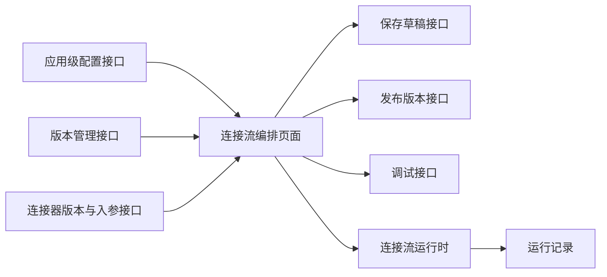
```mermaid
flowchart LR
  AppConfig[应用级配置接口] --> FlowEditor[连接流编排页面]
  VersionApi[版本管理接口] --> FlowEditor
  ConnectorApi[连接器版本与入参接口] --> FlowEditor
  FlowEditor --> SaveApi[保存草稿接口]
  FlowEditor --> PublishApi[发布版本接口]
  FlowEditor --> DebugApi[调试接口]
  FlowEditor --> Runtime[连接流运行时]
  Runtime --> RunRecord[运行记录]
```

## 3 初始需求分析

### 3.1 初始需求场景分析

| 场景 | 场景名称 | 说明 | 主要角色 |
|---|---|---|---|
| 模式选择 | 进入编辑器选择编排模式 | 根据应用级配置展示可选编排模式，选择后初始化对应默认节点结构 | 开发 |
| 版本切换 | 查看不同版本编排 | 顶部版本下拉展示所有版本，切换后加载对应工作区和配置 | 开发、测试 |
| 草稿编辑 | 编辑连接流草稿 | 草稿版本可切换编排模式、增删节点、编辑节点配置，支持保存、发布、调试、更多配置 | 开发 |
| 发布版本查看 | 查看已发布版本 | 已发布版本只读，支持新增草稿、更多配置、调试、失效 | 开发、测试 |
| 失效版本查看 | 查看已失效版本 | 已失效版本只读，支持新增草稿、更多配置、删除 | 开发、测试 |
| 审批中版本查看 | 查看审批中版本 | 审批中版本只读，支持更多配置、撤回 | 开发、测试 |
| 已驳回版本查看 | 查看已驳回版本 | 已驳回版本只读，支持新增草稿、更多配置、删除 | 开发、测试 |
| 已撤回版本查看 | 查看已撤回版本 | 已撤回版本只读，支持新增草稿、更多配置、删除 | 开发、测试 |
| 节点配置 | 配置触发器和连接器 | 触发器配置 SYSACCOUNT 白名单；连接器选择版本并查看对应入参映射 | 开发 |
| 脚本处理 | 新增脚本处理节点 | 在串行/并行模式下通过步骤条加号插入脚本处理节点，使用 Monaco TS 编辑器配置 | 开发 |
| 更多配置 | 配置限流和缓存 | 限流受应用级上限约束；缓存开启后配置缓存时间和多项缓存 Key | 开发、测试 |
| 调试验证 | 立即调试连接流 | 根据触发器入参展示赋值区，执行后展示调试结果 | 开发、测试 |

### 3.2 结构化 IR

| IR 属性 | 具体信息 |
|---|---|
| IR 标识 | IR-FLOW-CONFIG-202606 |
| 名称 | 连接流配置整改 |
| 描述 | 引入编排模式 + 步骤条形态；增加版本化编排、状态化操作、更多配置、节点配置扩展、节点发布前校验和调试能力 |
| 优先级 | 高 |
| why | 当前连接流编排缺少完整版本状态控制、模式化编排、更多配置、调试闭环和发布前校验能力 |
| what | 编排模式选择、步骤条加号插入、版本下拉、状态按钮、只读控制、触发器 SYSACCOUNT、连接器版本与超时、脚本处理节点、更多配置、调试抽屉、发布校验 |
| who | 前端实现交互和校验；后端提供应用级配置、版本、连接器版本、保存、发布、调试接口；测试验证状态流和边界值 |
| 对架构要素的影响 | 前端页面状态管理、节点配置模型、校验模型、接口调用链路需要同步调整 |

## 4 需求影响分析

| 类型 | 影响特性 | 说明 |
|---|---|---|
| 修改 | 编辑器整体形态 | 由自由画布 + 拖拽 + ELK 自动布局改为编排模式 + 步骤条 + 当前激活节点卡片 |
| 修改 | 顶部操作区 | 新增版本列表下拉，并按状态展示不同按钮（草稿/已发布/已失效/审批中/已驳回/已撤回） |
| 修改 | 版本只读控制 | 除草稿外，不可切换编排模式、不可增删节点，节点表单只读 |
| 修改 | 保存发布策略 | 保存不做完整校验；发布才执行节点数据校验 |
| 新增 | 编排模式选择 | 单节点 / 串行编排 / 并行编排；模式可见性由应用级配置接口下发 |
| 新增 | 更多配置抽屉 | 支持限流配置和缓存配置；缓存 Key 多项配置 + 拼接预览 |
| 新增 | 应用级配置上限 | 限流默认 1000、超时默认 3 秒、串行连接器默认上限 3 个、并行分支默认上限 8、缓存时间上限 1296000 秒，均支持接口覆盖 |
| 新增 | 触发器节点配置 | 新增 SYSACCOUNT 白名单，可添加多个账号 |
| 新增 | 连接器节点配置 | 新增连接器版本列表，选择版本后刷新认证方式与入参映射 |
| 新增 | 脚本处理节点 | 取代旧版数据处理节点，使用 Monaco TS 编辑器，加载失败时回退 textarea |
| 新增 | 调试抽屉 | 展示触发器入参赋值区和执行输出区，支持立即调试 |
| 新增 | 节点校验 | 各节点发布前执行数据校验，并输出错误定位信息 |
| 取消 | 数据处理节点 / 错误处理节点 / 文本节点 | 取消使用，旧数据按预留字段保留 |

## 5 系统用例分析

### 5.1 开发视角用例

| 用例 | 前置条件 | 主流程 | 结果 |
|---|---|---|---|
| 选择编排模式 | 当前版本为草稿且应用启用对应模式 | 在编排模式卡片中选择模式 | 初始化对应默认节点结构，并切换激活节点为触发器 |
| 切换版本 | 已存在连接流版本 | 打开版本下拉，选择目标版本 | 页面加载目标版本工作区和节点配置 |
| 编辑草稿 | 当前版本为草稿 | 修改编排模式或节点配置，点击保存 | 草稿内容保存成功，不触发完整校验 |
| 发布草稿 | 当前版本为草稿 | 点击发布，系统执行节点校验 | 校验通过后进入审批中；不通过时阻止发布并提示错误 |
| 新增草稿 | 当前版本为已发布、已失效、已驳回或已撤回 | 点击新增草稿 | 创建草稿版本并切换到草稿配置 |
| 配置触发器 | 当前版本为草稿 | 选中触发器步骤，维护 SYSACCOUNT 白名单与入参 | 触发器节点保存白名单和入参配置 |
| 配置连接器 | 当前版本为草稿 | 选择连接器与版本，配置入参、认证参数、超时时间 | 节点保存连接器版本和参数映射 |
| 配置脚本处理 | 当前版本为草稿（串行/并行模式） | 步骤条加号插入脚本处理节点，编辑 TS 脚本和出参 schema | 节点保存脚本和出参定义 |
| 配置更多配置 | 当前版本存在 | 打开更多配置抽屉，配置限流和缓存 | 保存连接流级限流与缓存配置 |
| 调试连接流 | 当前版本为草稿或已发布 | 打开调试抽屉，填写触发器入参值，点击立即调试 | 展示调试输出和错误信息 |

### 5.2 测试视角用例

| 用例 | 验证点 | 预期结果 |
|---|---|---|
| 验证编排模式可见性 | 应用级配置接口下发模式可见性 | 仅展示启用的编排模式卡片 |
| 验证草稿按钮 | 草稿版本顶部按钮 | 展示更多配置、调试、保存、发布、删除 |
| 验证已发布按钮 | 已发布版本顶部按钮 | 展示新增草稿、更多配置、调试、失效 |
| 验证已失效按钮 | 已失效版本顶部按钮 | 展示新增草稿、更多配置、删除 |
| 验证审批中按钮 | 审批中版本顶部按钮 | 展示更多配置、撤回 |
| 验证已驳回按钮 | 已驳回版本顶部按钮 | 展示新增草稿、更多配置、删除 |
| 验证已撤回按钮 | 已撤回版本顶部按钮 | 展示新增草稿、更多配置、删除 |
| 验证只读状态 | 非草稿版本工作区 | 编排模式卡片、步骤条加号、节点表单均不可操作 |
| 验证保存不校验 | 草稿配置缺少必填映射时点击保存 | 保存允许提交，不因节点不完整被阻断 |
| 验证发布校验 | 草稿配置缺少必填映射时点击发布 | 发布被阻断，并展示节点和字段错误 |
| 验证限流上限 | 应用级上限接口返回非 1000 | 限流校验使用接口返回值 |
| 验证超时上限 | 应用级超时接口返回非 3 秒 | 连接器超时时间校验使用接口返回值 |
| 验证脚本节点相邻 | 步骤条加号在脚本节点相邻位置 | 弹窗不展示脚本节点选项 |
| 验证 Monaco 加载失败 | 模拟 Monaco 资源加载失败 | 回退到 textarea 并展示提示文案 |

### 5.3 版本状态操作图

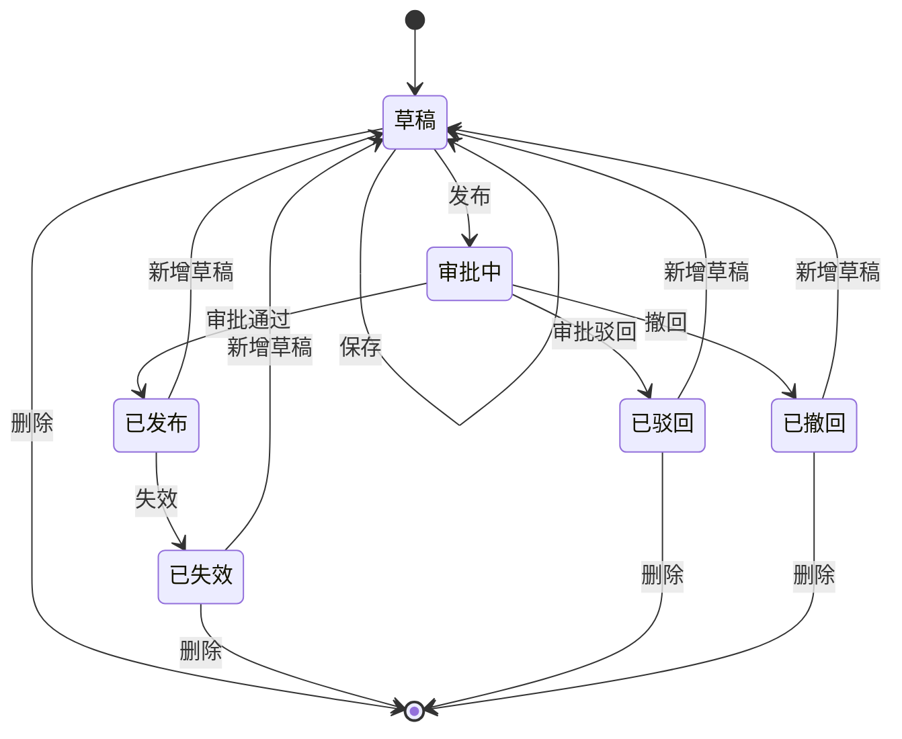
```mermaid
stateDiagram-v2
  [*] --> 草稿
  草稿 --> 审批中: 发布
  草稿 --> 草稿: 保存
  草稿 --> [*]: 删除
  审批中 --> 已撤回: 撤回
  审批中 --> 已驳回: 审批驳回
  审批中 --> 已发布: 审批通过
  已发布 --> 已失效: 失效
  已发布 --> 草稿: 新增草稿
  已失效 --> 草稿: 新增草稿
  已驳回 --> 草稿: 新增草稿
  已撤回 --> 草稿: 新增草稿
  已失效 --> [*]: 删除
  已驳回 --> [*]: 删除
  已撤回 --> [*]: 删除
```

## 6 功能设计

### 6.1 功能实现整体设计方案

连接流编排页面由顶部版本操作区、编排模式选择卡片、步骤条与当前激活节点卡片、更多配置抽屉和调试抽屉组成。页面初始化时先获取应用级配置上限与编排模式可见性，再获取版本列表，并加载选中版本对应的编排模式、节点结构和节点配置。版本状态决定当前页面是否可编辑，以及顶部展示哪些操作按钮。

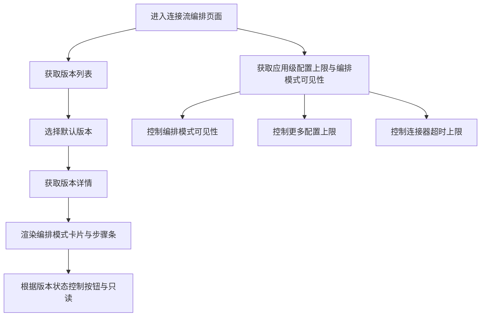
```mermaid
flowchart TB
  Init[进入连接流编排页面] --> LoadAppConfig[获取应用级配置上限与编排模式可见性]
  Init --> LoadVersions[获取版本列表]
  LoadVersions --> SelectVersion[选择默认版本]
  SelectVersion --> LoadDetail[获取版本详情]
  LoadDetail --> RenderModeAndStepper[渲染编排模式卡片与步骤条]
  LoadAppConfig --> ModeVisibility[控制编排模式可见性]
  LoadAppConfig --> MoreConfig[控制更多配置上限]
  LoadAppConfig --> ConnectorTimeout[控制连接器超时上限]
  RenderModeAndStepper --> StatusControl[根据版本状态控制按钮与只读]
```

### 6.2 顶部版本操作区

#### 6.2.1 版本下拉

版本下拉展示当前连接流所有版本。每个版本项需要展示版本名称、版本创建时间和版本状态标签。用户点击版本后，页面切换到对应版本并展示该版本的编排内容。

| 字段 | 展示说明 |
|---|---|
| 版本名称 | 版本下拉主文本 |
| 创建时间 | 版本下拉辅助信息 |
| 状态标签 | 草稿、已发布、已失效、审批中、已驳回、已撤回 |

#### 6.2.2 版本状态与按钮

| 版本状态 | 顶部按钮 | 工作区能力 | 节点内容能力 |
|---|---|---|---|
| 无版本 | 添加版本 | 不渲染编排模式与节点 | 不可用 |
| 草稿 | 更多配置、调试、保存、发布、删除 | 可切换编排模式、可增删节点 | 可修改 |
| 已发布 | 新增草稿、更多配置、调试、失效 | 不可切换模式、不可增删节点 | 只读查看 |
| 已失效 | 新增草稿、更多配置、删除 | 不可切换模式、不可增删节点 | 只读查看 |
| 审批中 | 更多配置、撤回 | 不可切换模式、不可增删节点 | 只读查看 |
| 已驳回 | 新增草稿、更多配置、删除 | 不可切换模式、不可增删节点 | 只读查看 |
| 已撤回 | 新增草稿、更多配置、删除 | 不可切换模式、不可增删节点 | 只读查看 |

#### 6.2.3 版本操作说明

| 操作 | 说明 |
|---|---|
| 添加版本 | 无版本状态下创建一个草稿版本作为首个版本，并切换为当前版本 |
| 保存 | 草稿状态保存当前编排模式、节点结构和节点配置；不执行完整节点校验 |
| 发布 | 对当前草稿执行完整节点校验，通过后进入审批中 |
| 新增草稿 | 基于已发布、已失效、已驳回或已撤回版本创建草稿版本，并切换到草稿版本配置 |
| 失效 | 将当前已发布版本设为已失效 |
| 撤回 | 将当前审批中版本撤回为已撤回版本 |
| 删除 | 删除当前草稿、已驳回、已撤回或已失效版本，删除前二次确认 |
| 更多配置 | 打开右侧抽屉，展示限流配置和缓存配置 |
| 调试 | 打开右侧调试抽屉，展示触发器入参并执行调试（仅草稿、已发布版本可用） |

### 6.3 只读与编辑控制

版本状态是页面可编辑能力的唯一入口判断。草稿版本可切换编排模式、增删节点、编辑节点表单；非草稿版本工作区进入只读，编排模式卡片、步骤条加号和节点表单均不可操作。更多配置在任何有版本的状态下均允许打开；调试仅在草稿和已发布状态可用。

| 控制对象 | 草稿 | 非草稿 |
|---|---|---|
| 切换编排模式 | 允许 | 禁止 |
| 步骤条加号添加节点 | 允许 | 禁止 |
| 删除节点 / 分支 | 允许 | 禁止 |
| 修改节点配置 | 允许 | 禁止，仅查看 |
| 保存版本 | 允许 | 禁止 |
| 发布版本 | 允许 | 禁止 |
| 调试 | 允许 | 已发布允许；其他非草稿禁止 |
| 更多配置 | 允许 | 允许，任何有版本的状态均可打开 |

### 6.4 保存与发布校验策略

保存和发布采用不同校验策略。保存用于暂存草稿，不要求节点配置完整；发布用于进入正式状态，必须确保所有节点数据满足运行要求。

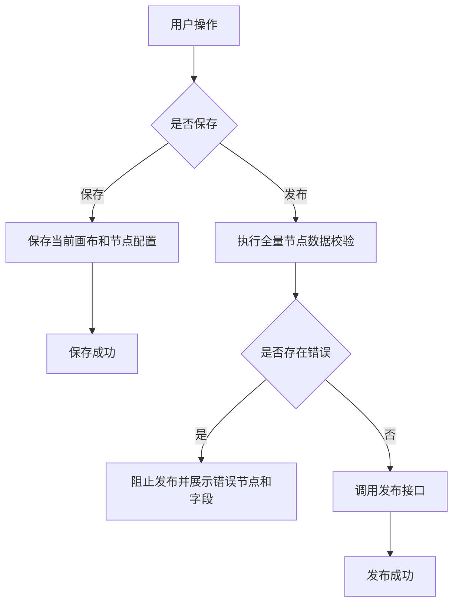
```mermaid
flowchart TD
  Action[用户操作] --> IsSave{是否保存}
  IsSave -->|保存| SaveDraft[保存当前画布和节点配置]
  SaveDraft --> SaveSuccess[保存成功]
  IsSave -->|发布| ValidateAll[执行全量节点数据校验]
  ValidateAll --> HasError{是否存在错误}
  HasError -->|是| ShowError[阻止发布并展示错误节点和字段]
  HasError -->|否| Publish[调用发布接口]
  Publish --> PublishSuccess[发布成功]
```

| 操作 | 校验范围 | 处理策略 |
|---|---|---|
| 保存 | 基础数据可序列化校验 | 不做节点完整性校验，允许保存未完成草稿 |
| 发布 | 节点完整性、字段必填、引用合法性、上限边界、结构完整性 | 任一节点不通过则阻止发布 |
| 调试 | 调试入参格式和接口调用参数 | 不替代发布校验；调试失败不改变版本状态 |

### 6.5 节点体系与编排模式

#### 6.5.1 编排模式

连接流编辑器采用「编排模式 + 步骤条 + 当前激活节点卡片」的形态。用户进入编辑器后先选择编排模式，再展示对应的步骤条与节点表单。编排模式可见性由应用级配置接口下发，未启用任何模式时提示"当前应用未启用任何编排类型，请联系管理员调整接口配置"。

| 编排模式 | 标识 | 默认节点结构 | 适用场景 |
|---|---|---|---|
| 单节点 | single | 触发器 → 连接器 → 数据输出 | 一次连接器调用，节点结构固定，不展示步骤条加号 |
| 串行编排 | serial | 触发器 → 连接器 → 数据输出 | 按顺序追加连接器节点和脚本处理节点，连接器数量受应用级上限约束 |
| 并行编排 | parallel | 触发器 → 并行节点（默认 2 个分支）→ 数据输出 | 在并行节点内配置多个分支，每分支固定一个连接器 |

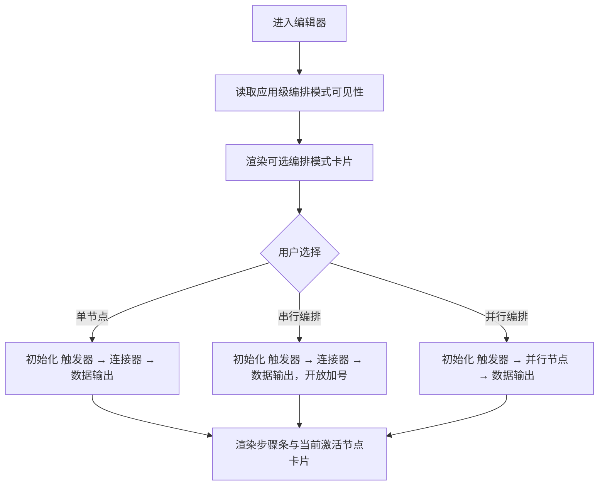
```mermaid
flowchart TD
  EnterEditor[进入编辑器] --> LoadModeVisibility[读取应用级编排模式可见性]
  LoadModeVisibility --> RenderModeGrid[渲染可选编排模式卡片]
  RenderModeGrid --> ChooseMode{用户选择}
  ChooseMode -->|单节点| InitSingle[初始化 触发器 → 连接器 → 数据输出]
  ChooseMode -->|串行编排| InitSerial[初始化 触发器 → 连接器 → 数据输出，开放加号]
  ChooseMode -->|并行编排| InitParallel[初始化 触发器 → 并行节点 → 数据输出]
  InitSingle --> RenderStepper[渲染步骤条与当前激活节点卡片]
  InitSerial --> RenderStepper
  InitParallel --> RenderStepper
```

模式切换会重置当前节点结构为对应模式的默认结构，并将激活节点切换为触发器。

#### 6.5.2 节点体系

本期连接流编辑器仅开放下列节点类型，不再使用数据处理节点、错误处理节点、文本节点、条件节点和循环节点。

| 节点类型 | 状态 | 定义与作用 | 配置入口 |
|---|---|---|---|
| 触发器节点 | 开放 | 连接流入口，定义触发方式、SYSACCOUNT 白名单和入参 | 步骤条选中后展示节点表单 |
| 连接器节点 | 开放 | 调用连接器，支持版本选择、认证方式、超时时间和入参映射 | 步骤条选中后展示节点表单 |
| 脚本处理节点 | 开放 | 使用 TypeScript 处理上游数据并声明出参结构，取代旧版数据处理节点 | 步骤条选中后展示节点表单 |
| 并行节点 | 开放 | 包含多个分支，每分支固定一个连接器，仅并行编排模式存在 | 步骤条选中后展示节点表单 |
| 数据输出节点 | 开放 | 组装连接流最终响应（响应头、响应体） | 步骤条选中后展示节点表单 |
| 数据处理节点 | 取消 | 旧版功能由脚本处理节点取代 | - |
| 错误处理节点 | 取消 | 本期不再开放 | - |
| 文本节点 | 取消 | 本期不再开放 | - |
| 循环节点 | 预留 | 本期不开放 | - |
| 条件节点 | 预留 | 本期不开放 | - |

#### 6.5.3 触发器节点交互流程

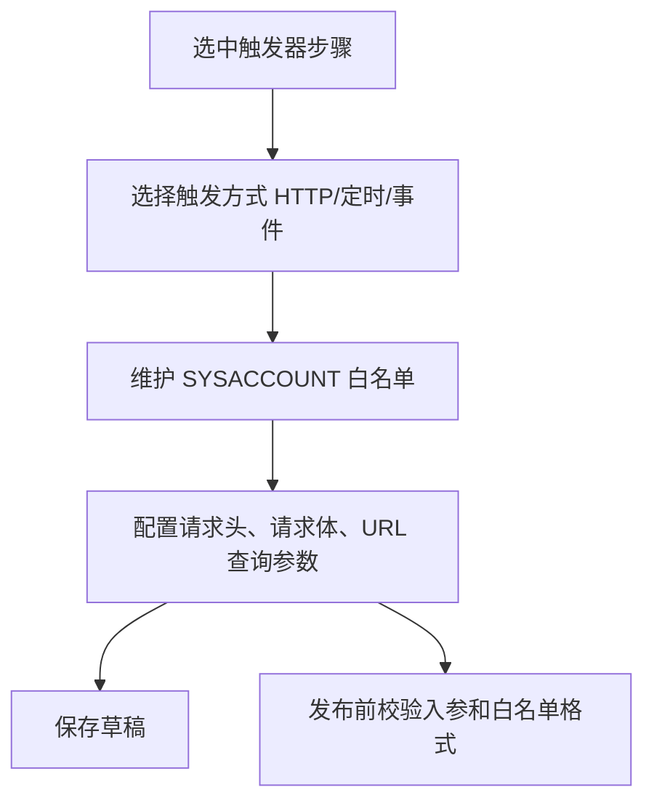
```mermaid
flowchart TD
  OpenTrigger[选中触发器步骤] --> EditTriggerType[选择触发方式 HTTP/定时/事件]
  EditTriggerType --> EditWhitelist[维护 SYSACCOUNT 白名单]
  EditWhitelist --> EditInput[配置请求头、请求体、URL 查询参数]
  EditInput --> SaveDraft[保存草稿]
  EditInput --> PublishValidate[发布前校验入参和白名单格式]
```

触发器节点不可删除，是连接流的固定入口节点。

#### 6.5.4 连接器节点交互流程

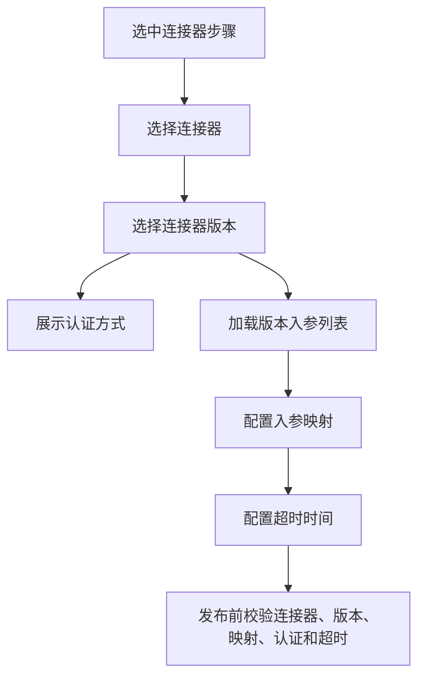
```mermaid
flowchart TD
  OpenConnector[选中连接器步骤] --> SelectConnector[选择连接器]
  SelectConnector --> SelectVersion[选择连接器版本]
  SelectVersion --> LoadAuth[展示认证方式]
  SelectVersion --> LoadInputParams[加载版本入参列表]
  LoadInputParams --> EditMapping[配置入参映射]
  EditMapping --> EditTimeout[配置超时时间]
  EditTimeout --> PublishValidate[发布前校验连接器、版本、映射、认证和超时]
```

连接器节点删除规则：单节点模式下不可删除；串行模式下连接器数量大于 1 时可删；并行分支内的连接器固定，不可删除。

#### 6.5.5 脚本处理节点交互流程

脚本处理节点用 TypeScript 处理上游数据，并通过出参 schema 声明可供下游引用的字段。

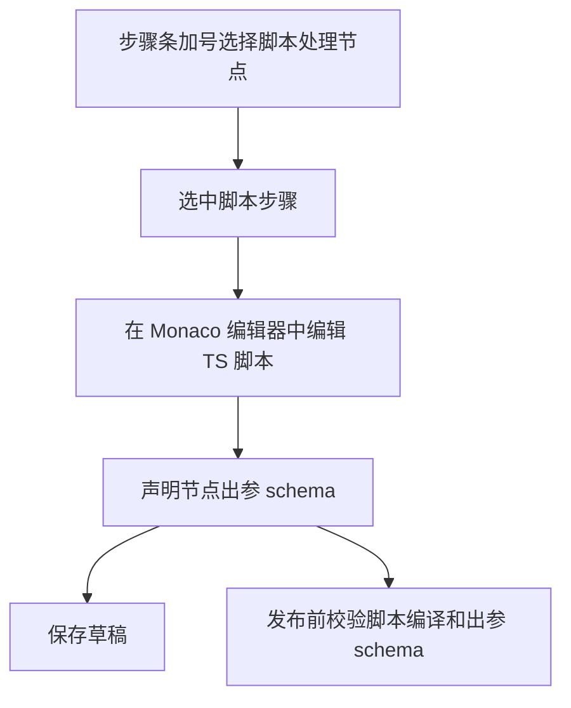
```mermaid
flowchart TD
  AddScript[步骤条加号选择脚本处理节点] --> OpenScript[选中脚本步骤]
  OpenScript --> EditScript[在 Monaco 编辑器中编辑 TS 脚本]
  EditScript --> DefineOutput[声明节点出参 schema]
  DefineOutput --> SaveDraft[保存草稿]
  DefineOutput --> PublishValidate[发布前校验脚本编译和出参 schema]
```

| 配置项 | 说明 |
|---|---|
| 脚本编辑器 | 使用 Monaco Editor，默认模板提供 `transform(input)` 函数，提供 TypeScript 基础校验 |
| 加载失败回退 | Monaco 加载失败时切换为普通 textarea，并提示"Monaco Editor 加载失败，请使用备用输入框" |
| 节点出参 | 扁平 schema 列表（名称、类型、描述），不区分 header/body/query 位置 |
| 插入规则 | 仅串行/并行编排允许插入；脚本节点之间不允许相邻 |

#### 6.5.6 并行节点交互流程

并行节点仅在并行编排模式下存在，且固定 1 个，不可删除。默认包含 2 个分支，每分支固定一个连接器节点，分支内部不可继续添加其他节点。

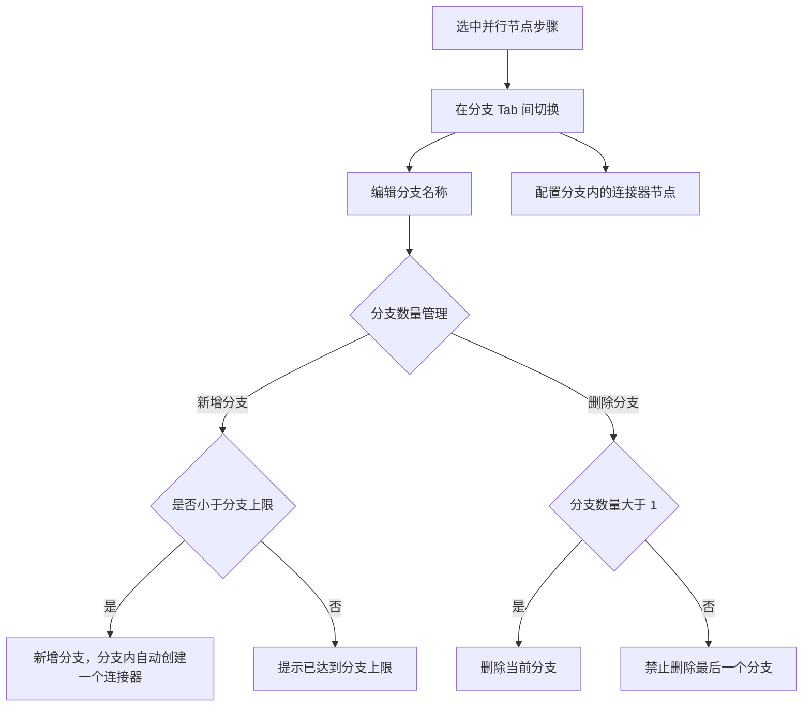
```mermaid
flowchart TD
  OpenParallel[选中并行节点步骤] --> SwitchBranchTab[在分支 Tab 间切换]
  SwitchBranchTab --> EditBranchName[编辑分支名称]
  SwitchBranchTab --> EditBranchConnector[配置分支内的连接器节点]
  EditBranchName --> ManageBranch{分支数量管理}
  ManageBranch -->|新增分支| CheckLimit{是否小于分支上限}
  CheckLimit -->|是| CreateBranch[新增分支，分支内自动创建一个连接器]
  CheckLimit -->|否| ShowLimit[提示已达到分支上限]
  ManageBranch -->|删除分支| CheckRemain{分支数量大于 1}
  CheckRemain -->|是| RemoveBranch[删除当前分支]
  CheckRemain -->|否| BlockRemove[禁止删除最后一个分支]
```

| 配置项 | 说明 |
|---|---|
| 分支数量 | 默认 2 个；上限由应用级配置接口下发，默认 8 |
| 分支名称 | 可编辑，默认"分支N" |
| 分支内节点 | 固定一个连接器节点，不可删除，也不能再添加其他节点 |

#### 6.5.7 数据输出节点交互流程

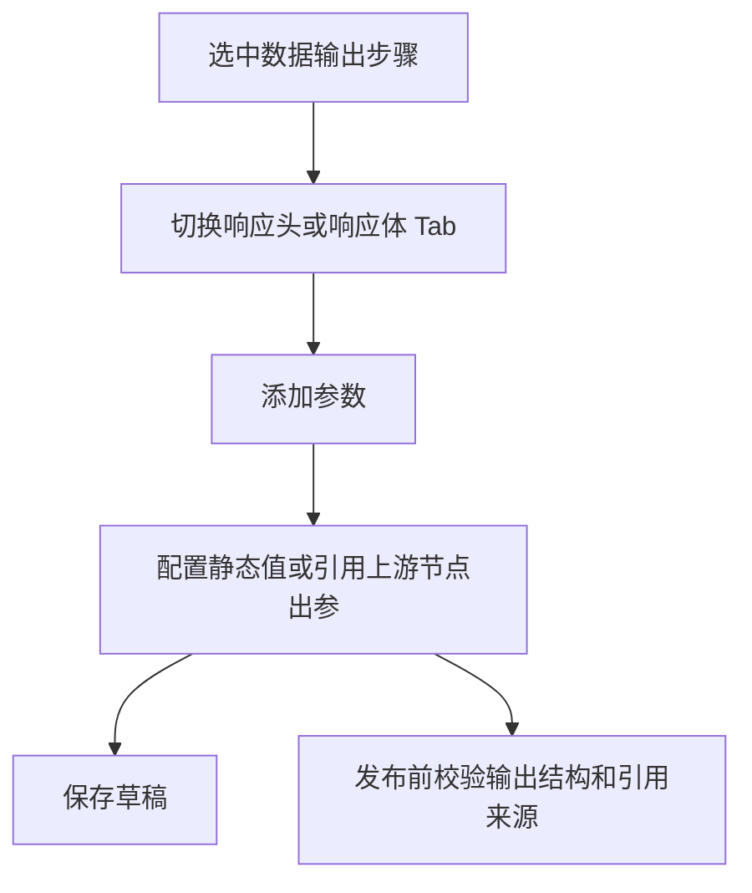
```mermaid
flowchart TD
  OpenOutput[选中数据输出步骤] --> SelectTab[切换响应头或响应体 Tab]
  SelectTab --> AddParam[添加参数]
  AddParam --> ConfigureValue[配置静态值或引用上游节点出参]
  ConfigureValue --> SaveDraft[保存草稿]
  ConfigureValue --> PublishValidate[发布前校验输出结构和引用来源]
```

数据输出节点固定存在，不可删除。

#### 6.5.8 节点添加交互与逻辑

节点添加统一通过"步骤条加号"进入。步骤条按可见节点顺序渲染节点按钮，节点之间根据编排模式判断是否展示加号。加号点击后，按当前位置可插入的节点类型弹出节点选择弹窗；若只有一种可插入类型，则直接插入。

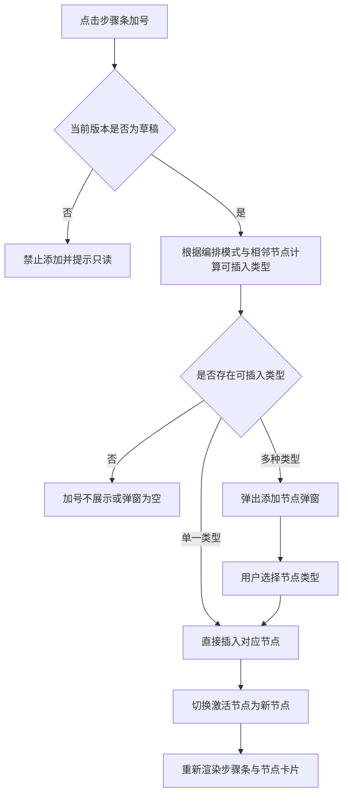
```mermaid
flowchart TD
  ClickPlus[点击步骤条加号] --> CheckVersion{当前版本是否为草稿}
  CheckVersion -->|否| BlockAdd[禁止添加并提示只读]
  CheckVersion -->|是| ComputeOptions[根据编排模式与相邻节点计算可插入类型]
  ComputeOptions --> HasOption{是否存在可插入类型}
  HasOption -->|否| HideOptions[加号不展示或弹窗为空]
  HasOption -->|单一类型| AutoInsert[直接插入对应节点]
  HasOption -->|多种类型| OpenSelectModal[弹出添加节点弹窗]
  OpenSelectModal --> UserChoose[用户选择节点类型]
  UserChoose --> AutoInsert
  AutoInsert --> ActivateNode[切换激活节点为新节点]
  ActivateNode --> RenderStepper[重新渲染步骤条与节点卡片]
```

##### 6.5.8.1 各编排模式可插入节点

| 编排模式 | 加号展示位置 | 可插入节点类型 | 限制 |
|---|---|---|---|
| 单节点 | 不展示 | - | 节点结构固定，不允许追加 |
| 串行编排 | 节点之间均展示 | 连接器节点、脚本处理节点 | 连接器节点受应用级上限约束（默认最多 3 个）；脚本节点不能与脚本节点相邻 |
| 并行编排 | 仅"触发器↔并行节点"和"并行节点↔数据输出"之间展示 | 脚本处理节点 | 脚本节点不能与脚本节点相邻；分支内部不允许通过加号添加任何节点 |

##### 6.5.8.2 加号弹窗交互规则

| 规则 | 说明 |
|---|---|
| 版本限制 | 仅草稿版本展示加号；非草稿版本步骤条节点之间使用普通连接线 |
| 类型限制 | 弹窗中只展示当前位置允许的节点类型 |
| 单一类型直插 | 当前位置只有一种可插入类型时直接插入，不弹出选择弹窗 |
| 上限提示 | 连接器数量达到上限或脚本相邻冲突时，对应节点类型在弹窗中不展示 |
| 激活节点切换 | 插入完成后激活节点自动切换为新增节点 |

#### 6.5.9 节点删除与重连

本期编辑器不存在自由画布连线，删除节点不需要 ELK 重新布局，仅需要从步骤条中移除节点并按编排模式刷新步骤条即可。

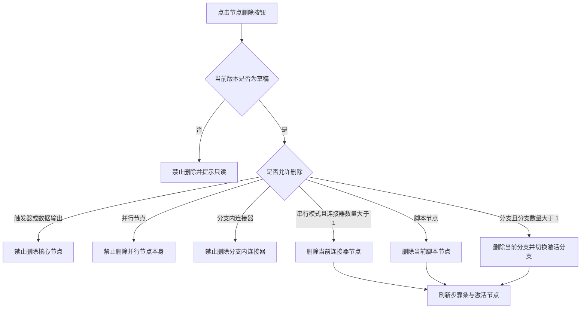
```mermaid
flowchart TD
  ClickRemove[点击节点删除按钮] --> CheckVersionForRemove{当前版本是否为草稿}
  CheckVersionForRemove -->|否| BlockRemove[禁止删除并提示只读]
  CheckVersionForRemove -->|是| CheckNodeType{是否允许删除}
  CheckNodeType -->|触发器或数据输出| ForbidCore[禁止删除核心节点]
  CheckNodeType -->|并行节点| ForbidParallel[禁止删除并行节点本身]
  CheckNodeType -->|分支内连接器| ForbidBranchConnector[禁止删除分支内连接器]
  CheckNodeType -->|串行模式且连接器数量大于 1| RemoveConnector[删除当前连接器节点]
  CheckNodeType -->|脚本节点| RemoveScript[删除当前脚本节点]
  CheckNodeType -->|分支且分支数量大于 1| RemoveBranch[删除当前分支并切换激活分支]
  RemoveConnector --> RefreshStepper[刷新步骤条与激活节点]
  RemoveScript --> RefreshStepper
  RemoveBranch --> RefreshStepper
```

| 删除对象 | 是否可删 | 行为 |
|---|---|---|
| 触发器节点 | 不可删 | - |
| 数据输出节点 | 不可删 | - |
| 并行节点 | 不可删 | - |
| 单节点模式下的连接器 | 不可删 | - |
| 串行模式下的连接器 | 连接器数量大于 1 时可删 | 删除节点并刷新步骤条；激活节点回退到相邻节点 |
| 脚本处理节点 | 可删 | 删除节点并刷新步骤条；激活节点回退到相邻节点 |
| 并行分支内的连接器 | 不可删 | - |
| 并行分支 | 分支数量大于 1 时可删 | 删除分支并切换到剩余分支 |

### 6.6 触发器节点配置

触发器节点是连接流入口节点，固定存在且不可删除。本期触发方式开放 HTTP 触发、定时触发、事件触发；节点支持 SYSACCOUNT 白名单管理，可添加多个 SYSACCOUNT，限制允许触发当前连接流的系统账号范围。

| 配置项 | 说明 | 是否必填 | 编辑状态 |
|---|---|---|---|
| 触发方式 | HTTP 触发 / 定时触发 / 事件触发 | 发布时必选 | 草稿可编辑 |
| SYSACCOUNT 白名单 | 可添加多个 SYSACCOUNT，添加入口文案为"添加账号" | 非必填，若添加则校验格式 | 草稿可编辑 |
| 入参配置 | HTTP 请求头、请求体、URL 查询参数三类入参 | 发布时按规则校验 | 草稿可编辑 |

### 6.7 连接器节点配置

连接器节点配置展示连接器选择、连接器版本选择、认证方式、超时时间和入参映射。选择不同版本后，认证方式和入参列表会同步刷新。连接器节点的删除规则参见 6.5.9。

| 配置项 | 说明 | 默认值或来源 | 校验策略 |
|---|---|---|---|
| 连接器 | 当前节点调用的连接器 | 用户选择 | 发布时必选 |
| 连接器版本 | 当前连接器的具体版本 | 连接器版本接口 | 发布时必选；切换版本后刷新认证方式与入参 |
| 认证方式 | SOA、APIG、Cookie、数字签名等认证参数 | 连接器配置页同步 | 发布时校验必填项 |
| 入参映射 | 仅展示所选版本对应的入参 | 用户配置 | 发布时校验引用来源合法 |
| 超时时间 | 连接器调用超时时间 | 默认上限 3 秒，应用级配置接口可覆盖 | 发布时校验不超过当前应用上限 |

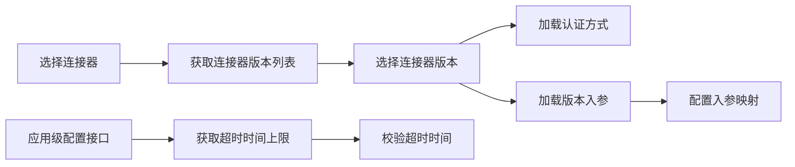
```mermaid
flowchart LR
  SelectConnector[选择连接器] --> LoadConnectorVersions[获取连接器版本列表]
  LoadConnectorVersions --> SelectConnectorVersion[选择连接器版本]
  SelectConnectorVersion --> LoadAuth[加载认证方式]
  SelectConnectorVersion --> LoadInputParams[加载版本入参]
  LoadInputParams --> Mapping[配置入参映射]
  AppConfig[应用级配置接口] --> TimeoutLimit[获取超时时间上限]
  TimeoutLimit --> TimeoutInput[校验超时时间]
```

### 6.8 脚本处理节点配置

脚本处理节点取代旧版数据处理节点，用 TypeScript 处理上游数据并通过出参 schema 声明可供下游引用的字段。脚本处理节点仅在串行编排和并行编排模式下可插入，且不允许与脚本节点相邻。

| 配置项 | 说明 | 校验策略 |
|---|---|---|
| TS 脚本 | 使用 Monaco Editor 编辑 TypeScript 脚本，默认模板提供 `transform(input)` 函数 | 发布时执行 TypeScript 基础校验，编译失败阻止发布 |
| Monaco 加载失败回退 | Monaco 加载失败时切换为 textarea，并提示"Monaco Editor 加载失败，请使用备用输入框" | 不影响发布校验；脚本内容继续生效 |
| 节点出参 | 扁平 schema 列表（名称、类型、描述），不区分 header/body/query 位置 | 发布时校验参数名称同级唯一；参数类型合法 |

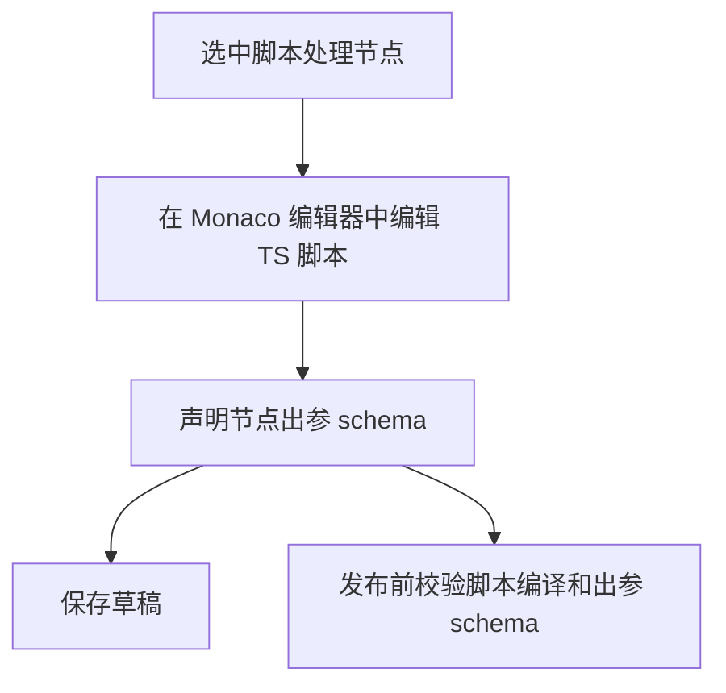
```mermaid
flowchart TD
  OpenScriptConfig[选中脚本处理节点] --> EditScript[在 Monaco 编辑器中编辑 TS 脚本]
  EditScript --> DefineOutput[声明节点出参 schema]
  DefineOutput --> SaveDraft[保存草稿]
  DefineOutput --> PublishValidate[发布前校验脚本编译和出参 schema]
```

脚本节点的出参由下游节点（连接器入参映射、数据输出参数组装）通过引用方式使用，引用关系由各下游节点的发布校验校验存在性。

### 6.9 入参出参配置交互

节点入参、出参参数统一按 HTTP 请求头、HTTP 请求体、URL 查询参数三个 tab 展示。每个 tab 下支持添加参数。没有参数时展示添加参数按钮；已有参数时在参数配置项上展示添加和删除按钮。脚本处理节点的出参为扁平 schema，不区分 header/body/query 三类，配置时无 tab 切换。

| 参数字段 | 说明 |
|---|---|
| 参数名称 | 当前参数的名称 |
| 参数值 | 静态值或引用上游节点出参 |
| 参数类型 | object、array、string、number、boolean，可选 |
| 参数描述 | 参数说明，可选 |
| 添加按钮 | 添加同级参数或子参数 |
| 删除按钮 | 删除当前参数；object 或 array 删除时级联删除子节点 |

object 和 array 类型支持添加子参数。此类参数的添加按钮需要提供下拉选择，区分"添加子参数"和"添加同级参数"。

### 6.10 更多配置抽屉

更多配置抽屉展示当前连接流的限流配置和缓存配置。

#### 6.10.1 限流配置

限流配置默认上限为 1000。页面进入时通过接口获取当前应用下的限流配置上限；当接口返回上限时，以接口返回值作为校验上限。接口未返回、返回为空或获取失败时，使用默认上限 1000。

| 配置项 | 说明 |
|---|---|
| 限流值 | 当前连接流允许的限流值 |
| 默认上限 | 1000 |
| 应用级上限 | 通过接口获取，可不为 1000 |
| 校验时机 | 发布时校验；更多配置保存时可做边界提示 |
| 超限提示 | 当前限流值不能超过应用配置上限 |

#### 6.10.2 缓存配置

缓存配置支持开启和关闭。开启时，需要配置缓存时间和缓存 key；缓存 key 支持配置多个，每个 key 从触发器入参中选择字段，最终在抽屉中实时展示拼接后的预览结果。

| 配置项 | 说明 | 校验策略 |
|---|---|---|
| 缓存开关 | 开启或关闭 | 必选 |
| 缓存时间 | 单位：秒，最大 1296000 秒（15 天） | 开启缓存时必填；超过上限时提示"上限为 1296000 秒" |
| 缓存 key | 支持添加多个 key 项，每项可从触发器入参中选择字段；抽屉中实时展示拼接后的预览结果 | 开启缓存时至少配置一个 key 项 |

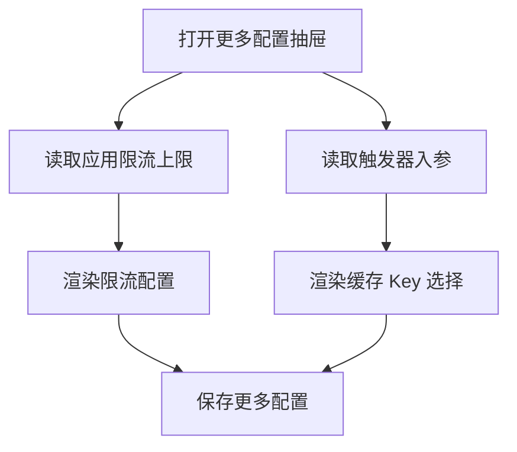
```mermaid
flowchart TB
  OpenMoreConfig[打开更多配置抽屉] --> LoadLimit[读取应用限流上限]
  OpenMoreConfig --> LoadTriggerParams[读取触发器入参]
  LoadLimit --> RateLimitForm[渲染限流配置]
  LoadTriggerParams --> CacheKeyPicker[渲染缓存 Key 选择]
  RateLimitForm --> SaveMoreConfig[保存更多配置]
  CacheKeyPicker --> SaveMoreConfig
```

### 6.11 调试抽屉

点击调试按钮后，展开右侧调试抽屉。调试抽屉获取连接流触发器节点的入参配置，并展示在弹窗中。参数名称和参数类型不能编辑，用户只能为每个参数赋值。

| 区域 | 内容 | 说明 |
|---|---|---|
| 入参配置 | 触发器请求头、请求体、URL 查询参数 | 参数名称和类型只读，仅参数值可编辑 |
| 操作按钮 | 立即调试 | 点击后调用调试接口 |
| 执行输出 | 调试结果、错误信息、节点执行信息 | 接口返回后展示 |

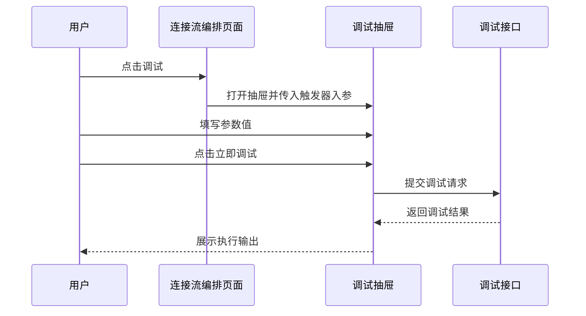
```mermaid
sequenceDiagram
  participant User as 用户
  participant Editor as 连接流编排页面
  participant Debug as 调试抽屉
  participant Api as 调试接口
  User->>Editor: 点击调试
  Editor->>Debug: 打开抽屉并传入触发器入参
  User->>Debug: 填写参数值
  User->>Debug: 点击立即调试
  Debug->>Api: 提交调试请求
  Api-->>Debug: 返回调试结果
  Debug-->>User: 展示执行输出
```

### 6.12 节点数据校验设计

各节点均需要提供发布前校验能力。校验在发布时统一执行，保存草稿时不执行完整校验。校验结果需要包含节点 ID、节点名称、字段路径和错误信息，便于页面定位错误节点。

| 节点类型 | 发布前校验规则 |
|---|---|
| 触发器节点 | 触发方式必选；入参名称同级唯一；参数类型合法；SYSACCOUNT 白名单若配置则账号格式合法 |
| 连接器节点 | 连接器必选；连接器版本必选；入参映射引用来源合法；认证参数满足当前认证方式要求；超时时间不超过应用级上限 |
| 脚本处理节点 | TypeScript 脚本可通过基础编译校验；出参 schema 参数名称同级唯一；参数类型合法 |
| 并行节点 | 分支数量不超过应用级上限；每个分支均包含一个连接器节点；分支名称非空 |
| 数据输出节点 | 响应头和响应体参数名称同级唯一；引用来源合法；输出结构可序列化 |

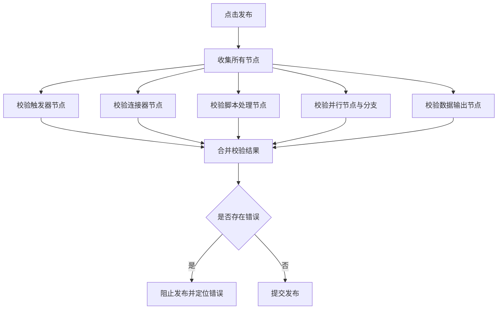
```mermaid
flowchart TD
  PublishClick[点击发布] --> CollectNodes[收集所有节点]
  CollectNodes --> ValidateTrigger[校验触发器节点]
  CollectNodes --> ValidateConnector[校验连接器节点]
  CollectNodes --> ValidateScript[校验脚本处理节点]
  CollectNodes --> ValidateParallel[校验并行节点与分支]
  CollectNodes --> ValidateOutput[校验数据输出节点]
  ValidateTrigger --> MergeErrors[合并校验结果]
  ValidateConnector --> MergeErrors
  ValidateScript --> MergeErrors
  ValidateParallel --> MergeErrors
  ValidateOutput --> MergeErrors
  MergeErrors --> ErrorExists{是否存在错误}
  ErrorExists -->|是| BlockPublish[阻止发布并定位错误]
  ErrorExists -->|否| SubmitPublish[提交发布]
```

### 6.13 实施顺序

1. 调整连接流编排页面顶部版本下拉和状态按钮展示。
2. 接入版本状态只读控制，限制非草稿版本编排模式切换、节点增删和节点表单编辑。
3. 接入应用级配置上限接口，用于编排模式可见性、限流上限、连接器超时时间上限、连接器节点数上限、并行分支上限、缓存时间上限。
4. 实现编排模式选择卡片和模式切换逻辑（单节点 / 串行 / 并行）。
5. 实现步骤条与当前激活节点卡片渲染，支持节点切换、收起/展开。
6. 实现步骤条加号插入弹窗，按编排模式控制可插入节点类型。
7. 改造触发器节点配置：触发方式（HTTP/定时/事件）、SYSACCOUNT 白名单、入参配置。
8. 改造连接器节点配置：连接器选择、版本选择、认证方式、入参映射、超时时间。
9. 新增脚本处理节点：Monaco TypeScript 编辑器、加载失败回退 textarea、节点出参 schema。
10. 改造并行节点：固定 2 个默认分支，每分支固定连接器；分支增删改名。
11. 改造更多配置抽屉：限流配置、缓存时间上限校验、缓存 Key 多项配置与拼接预览。
12. 接入调试抽屉和立即调试流程。
13. 接入节点数据校验，并接入发布流程；保存草稿不执行完整校验。
14. 补充开发自测和测试用例。

## 7 系统级非功能设计

### 7.1 FMEA 影响分析

| 风险 | 影响 | 措施 |
|---|---|---|
| 版本状态判断错误 | 非草稿版本被误编辑 | 所有编辑入口统一走版本状态判断 |
| 保存时误触发完整校验 | 草稿无法暂存 | 保存流程只做可序列化校验，不调用发布校验 |
| 发布时漏校验节点 | 运行时失败 | 发布前统一收集全部节点并执行节点类型校验 |
| 应用级配置上限获取失败 | 限流或超时校验缺少约束 | 限流使用默认上限 1000，超时时间使用默认上限 3 秒 |
| 连接器版本切换后出参未刷新 | 下游引用错误 | 选择版本后强制刷新版本出参，并提示可能影响下游映射 |
| 调试接口失败 | 用户无法定位问题 | 调试输出区展示错误信息，保留用户输入参数 |
| 非草稿更多配置误保存 | 版本配置不一致 | 更多配置保存权限由版本状态和接口权限共同控制 |

### 7.2 安全影响分析

版本发布、删除、失效、撤回等操作依赖后端鉴权。SYSACCOUNT 白名单仅保存账号标识或引用信息，不在页面展示敏感明文。调试入参仅用于当前调试请求，不改变版本状态。Cookie、SOA、APIG、数字签名等认证参数遵循连接器配置页既有安全策略。脚本处理节点的 TypeScript 代码在保存与发布阶段执行基础校验，运行时由后端执行环境隔离。

### 7.3 兼容性

已有连接流版本和历史编排数据需要保持可加载。旧版本若包含已取消的数据处理节点、错误处理节点、文本节点等数据，按预留字段保留，但不在新版编辑器中展示与编辑。新增字段在旧版本中不存在时按默认空配置处理。限流上限、超时时间上限、并行分支上限、连接器节点数上限、缓存时间上限接口不可用时使用默认值，避免阻断页面基础使用。循环和条件节点继续作为预留节点，不在本期开放。

### 7.4 可运维

调试抽屉展示执行结果、错误信息和节点执行详情，便于定位配置问题。发布校验错误需要包含节点名称和字段路径，便于快速回到对应节点修复。更多配置中的限流和缓存配置需要在版本详情或运行记录中具备可追踪性。

### 7.5 测试建议

| 测试类型 | 建议覆盖内容 |
|---|---|
| 单元测试 | 版本状态按钮映射、只读判断、编排模式可见性、节点校验规则、上限计算逻辑（限流 / 超时 / 分支 / 连接器数 / 缓存时间） |
| 集成测试 | 编排模式切换、版本切换、连接器版本切换、步骤条加号插入、节点删除、并行分支增删、更多配置保存、调试接口调用 |
| 端到端测试 | 草稿编辑保存、各模式节点插入与删除、发布校验拦截、发布成功、已发布新增草稿、审批中撤回、失效与删除 |
| 边界测试 | 限流上限非 1000、超时时间上限非 3 秒、连接器数量达到上限、并行分支达到上限、脚本节点相邻冲突、Monaco 加载失败回退、缓存时间 > 1296000 秒 |

## 8 checkList

| check 点 | 是否达标 |
|---|---|
| 顶部版本下拉展示版本名称、创建时间和状态标签 | 是 |
| 切换版本后展示对应编排模式、步骤条与节点配置 | 是 |
| 无版本状态展示"添加版本"入口 | 是 |
| 草稿版本展示更多配置、调试、保存、发布、删除 | 是 |
| 已发布版本展示新增草稿、更多配置、调试、失效 | 是 |
| 已失效版本展示新增草稿、更多配置、删除 | 是 |
| 审批中版本展示更多配置、撤回 | 是 |
| 已驳回版本展示新增草稿、更多配置、删除 | 是 |
| 已撤回版本展示新增草稿、更多配置、删除 | 是 |
| 除草稿外不可切换编排模式、不可增删节点、节点表单只读 | 是 |
| 保存草稿不执行完整节点数据校验 | 是 |
| 发布版本执行完整节点数据校验 | 是 |
| 各节点（触发器、连接器、脚本处理、并行、数据输出）均有发布前数据校验规则 | 是 |
| 进入编辑器后必须先选择编排模式（单节点 / 串行 / 并行），且模式可见性由应用级接口下发 | 是 |
| 单节点模式下节点结构固定，不展示步骤条加号 | 是 |
| 串行编排模式下步骤条加号支持插入连接器和脚本处理节点，连接器数量受应用级上限约束 | 是 |
| 并行编排模式下仅在触发器↔并行节点、并行节点↔数据输出之间允许插入脚本处理节点 | 是 |
| 脚本节点之间不允许相邻 | 是 |
| 触发器节点支持 HTTP / 定时 / 事件三种触发方式和 SYSACCOUNT 白名单 | 是 |
| 连接器节点支持版本选择、切换版本后刷新认证方式与入参映射 | 是 |
| 连接器节点超时时间默认上限 3 秒，可通过接口获取应用级上限 | 是 |
| 脚本处理节点使用 Monaco Editor 编辑 TypeScript 脚本，加载失败时回退到 textarea | 是 |
| 脚本处理节点出参为扁平 schema，不区分 header/body/query | 是 |
| 并行节点默认 2 个分支，每分支固定一个连接器，不可删除或追加其他节点 | 是 |
| 并行分支可改名、可增减，分支数量上限由应用级接口下发（默认 8） |  是 |
| 更多配置支持限流配置和缓存配置 | 是 |
| 限流配置默认上限 1000，可通过接口获取应用级上限 | 是 |
| 缓存时间最大 1296000 秒，超出时阻断并提示 | 是 |
| 缓存 Key 支持多项配置，并实时展示拼接预览 | 是 |
| 节点删除规则覆盖触发器、数据输出、并行节点不可删；连接器按模式判定；脚本节点和分支按条件可删 | 是 |
| 节点添加交互通过步骤条加号入口完成，单一可插入类型时直接插入，多类型时弹窗选择 | 是 |
| 入参出参配置按 HTTP 请求头、请求体、URL 查询参数三个 tab 展示（脚本节点出参除外） | 是 |
| object 和 array 类型支持添加子参数 | 是 |
| 调试抽屉展示触发器入参且参数名称、类型不可编辑，立即调试后展示执行输出 | 是 |
| 文档不展示实现代码块，仅使用表格和 Mermaid 图说明 | 是 |
