# 连接流配置需求设计说明书

## 修订记录

| 版本 | 日期 | 修订内容 | 作者 |
|---|---|---|---|
| V1.0 | 2026-06-11 | 新增连接流配置整改需求设计 | - |
| V1.1 | 2026-06-12 | 补充连接流编辑器详细设计、关键实现思路、交互流程和验证点 | - |
| V1.2 | 2026-06-15 | 按连接流编排交互调整补充版本操作、更多配置、调试、节点校验、保存发布校验策略，并移除实现代码块 | - |
| V1.3 | 2026-06-15 | 补充并行分支间距计算原因和嵌套结构布局规则 | - |
| V1.4 | 2026-06-16 | 按编排示例项目实现修正添加后处理说明，明确当前实现不包含后续节点位移预处理 | - |
| V1.5 | 2026-06-16 | 补充添加节点入口展示与隐藏规则，说明结构辅助链路和受限链路的插入控制方式 | - |
| V1.6 | 2026-06-16 | 补充自定义链路组件、折线路径计算、多出边分叉和多入边汇合实现说明 | - |
| V1.7 | 2026-06-16 | 补充自定义链路组件不计算转折点时对分叉、汇合、加号定位和结构可读性的影响 | - |
| V1.8 | 2026-06-16 | 补充并行节点及嵌套结构新增时的位置计算规则 | - |
| V1.9 | 2026-06-16 | 重组节点添加与结构布局说明，压缩重复内容并补充 Mermaid 图 | - |
| V2.0 | 2026-06-26 | 按 FlowEditorV2 最新交互重写文档，调整为版本栏、编排模式、步骤条、节点卡片、详情/更多配置/调试抽屉，并移除旧版结构链路和布局描述 | - |

## 目录

- 需求价值和概述
- 上下文分析
- 初始需求分析
- 需求影响分析
- 系统用例分析
- 功能设计
- 系统级非功能设计
- checkList

## 表目录

版本状态与操作、编辑态控制、编排模式、节点体系、步骤条节点添加规则、节点删除规则、触发器配置、连接器配置、脚本处理配置、并行配置、数据输出配置、更多配置、调试配置、节点发布校验、验证清单。

## 图目录

连接流编排上下文图、页面初始化流程图、版本状态操作图、编辑态流转图、保存发布校验流程图、编排模式初始化图、步骤条节点添加流程图、更多配置数据流图、调试流程图、节点配置数据流图。

## Keywords 关键字

中文：连接流配置、FlowEditorV2、版本管理、编辑态、步骤条、节点卡片、更多配置、限流、缓存、连接器超时、脚本处理、调试  
English: Flow Configuration, FlowEditorV2, Version Management, Edit Mode, Stepper, Node Card, Advanced Config, Rate Limit, Cache, Connector Timeout, Script Processing, Debugging

## Abstract 摘要

中文：本文档描述连接流编排页面 FlowEditorV2 的最新需求设计，覆盖版本下拉、版本详情、状态化操作、编辑态控制、编排模式选择、步骤条节点添加、节点配置卡片、更多配置抽屉、调试抽屉、保存与发布校验策略。文档从开发和测试视角说明页面交互边界、数据流、接口依赖和验证要点。  
English: This document describes the latest FlowEditorV2 requirements, including version selector, version detail drawer, status actions, edit-mode control, orchestration mode selector, stepper-based node insertion, node configuration cards, advanced configuration drawer, debug drawer, and save/publish validation strategy.

## List 偶发 abbreviations 缩略语清单

| 缩略语 | 英文全名 | 中文解释 |
|---|---|---|
| API | Application Programming Interface | 应用程序接口 |
| JSON | JavaScript Object Notation | JSON 数据格式 |
| SYSACCOUNT | System Account | 系统账号凭证 |
| QPS | Queries Per Second | 每秒请求数 |

## 1 需求价值和概述

连接流编排页面需要支持按版本查看和维护连接流配置，并根据版本状态和编辑态控制页面操作、编排模式、步骤条节点增删、节点卡片表单和更多配置保存能力。FlowEditorV2 的最新交互以“版本栏 + 编排模式 + 步骤条 + 当前激活节点卡片”的方式完成配置。

本次整改目标如下：

| 目标 | 说明 |
|---|---|
| 版本化编排 | 顶部展示版本下拉，版本项包含版本名称、创建时间和状态标签，切换版本后加载对应配置 |
| 状态化操作 | 按草稿、已发布、已失效、审批中、已驳回、已撤回展示不同操作按钮 |
| 编辑态控制 | 草稿、已驳回、已撤回默认只读，点击编辑后才允许修改；保存或取消编辑后回到只读态 |
| 编排模式配置 | 支持单节点、串行编排、并行编排，且编排模式可见性受应用级配置控制 |
| 节点配置卡片化 | 当前选中的步骤条节点在下方展示配置卡片，按节点类型渲染触发器、连接器、脚本处理、并行、数据输出配置 |
| 配置能力补齐 | 更多配置抽屉支持限流和缓存；限流、缓存时间、连接器超时时间受应用级上限约束 |
| 调试闭环 | 草稿和已发布版本支持调试，调试抽屉展示触发器入参赋值区、执行链路和输出结果 |
| 发布前质量保障 | 保存不做完整节点校验；发布前执行前端全量校验，通过确认后提交发布 |

## 2 上下文分析

连接流配置需要支撑连接流从草稿创建、节点配置、保存、发布审批、运行调试到问题排查的完整链路。FlowEditorV2 将原本偏图形化的操作收敛为结构化步骤配置，降低节点定位、节点增删和配置维护成本。

| 背景类型 | 现有问题或增强原因 | 本次处理方向 |
|---|---|---|
| 版本治理 | 不同版本状态下按钮、可编辑范围和详情信息不够清晰 | 增加版本下拉、版本详情抽屉、状态化按钮和编辑态控制 |
| 配置入口 | 自由编排方式下节点定位和配置入口不统一 | 使用步骤条展示执行顺序，点击节点后在配置卡片中维护内容 |
| 编排复杂度 | 连接流需要支持单节点、串行、并行三类常见编排方式 | 通过编排模式选择初始化不同节点结构，应用级配置控制模式可见性 |
| 运行级配置 | 限流、缓存等配置缺少统一维护入口 | 更多配置抽屉统一维护限流、缓存时间和缓存 Key |
| 调试闭环 | 用户配置完成后需要在页面内验证执行结果 | 调试抽屉按触发器入参填写测试值并展示执行输出 |
| 发布质量 | 保存草稿和正式发布的校验边界需要区分 | 保存允许暂存未完成配置，发布前执行完整校验 |

因此，本次连接流配置上下文是把基础配置能力增强为“版本可治理、配置可维护、节点可校验、运行可调试”的结构化连接流编排能力。

### 2.1 连接流编排上下文图

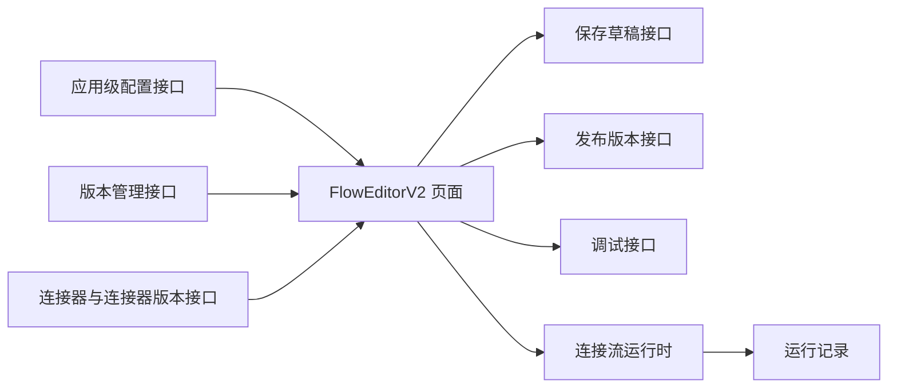

## 3 初始需求分析

### 3.1 初始需求场景分析

| 场景 | 场景名称 | 说明 | 主要角色 |
|---|---|---|---|
| 无版本初始化 | 创建首个草稿 | 页面无版本时展示空状态和创建草稿按钮 | 开发 |
| 版本切换 | 查看不同版本编排 | 顶部版本下拉展示所有版本，切换后加载对应编排配置 | 开发、测试 |
| 查看版本详情 | 查看版本元信息 | 点击详情打开抽屉，按版本状态展示基础信息、审批信息、发布信息等 | 开发、测试 |
| 草稿编辑 | 编辑连接流草稿 | 草稿默认只读，点击编辑后可选择编排模式、增删节点、修改节点卡片和更多配置 | 开发 |
| 已发布查看 | 查看已发布版本 | 已发布版本只读，支持新增草稿、更多配置查看、调试和失效 | 开发、测试 |
| 已失效查看 | 查看已失效版本 | 已失效版本只读，支持新增草稿、更多配置查看、恢复和删除 | 开发、测试 |
| 审批中查看 | 查看审批中版本 | 审批中版本只读，支持详情、更多配置查看和撤回 | 开发、测试 |
| 已驳回编辑 | 修改已驳回版本 | 已驳回默认只读，点击编辑后可修改，保存后回到草稿状态 | 开发 |
| 已撤回编辑 | 修改已撤回版本 | 已撤回默认只读，点击编辑后可修改，保存后回到草稿状态 | 开发 |
| 编排模式选择 | 初始化节点结构 | 选择单节点、串行或并行编排，生成对应触发器、步骤节点和输出节点 | 开发 |
| 节点配置 | 配置当前激活节点 | 点击步骤条节点，在节点卡片中维护触发器、连接器、脚本处理、并行或输出配置 | 开发 |
| 更多配置 | 配置限流和缓存 | 打开更多配置抽屉，编辑态下保存限流、缓存开关、缓存时间和缓存 Key | 开发、测试 |
| 调试验证 | 立即调试连接流 | 草稿或已发布版本打开调试抽屉，填写触发器入参，执行后展示结果 | 开发、测试 |

### 3.2 结构化 IR

| IR 属性 | 具体信息 |
|---|---|
| IR 标识 | IR-FLOW-CONFIG-202606 |
| 名称 | 连接流配置整改 |
| 描述 | 增加 FlowEditorV2 版本化编排、编辑态控制、编排模式、节点卡片配置、更多配置、发布校验和调试能力 |
| 优先级 | 高 |
| why | 当前连接流需要更清晰的版本治理、结构化配置入口、运行级配置和调试闭环 |
| what | 版本下拉、详情抽屉、状态按钮、编辑态、编排模式、步骤条、节点卡片、更多配置、调试抽屉、发布校验 |
| who | 前端实现交互和校验；后端提供版本、应用配置、连接器、保存、发布、调试接口；测试验证状态流和边界值 |
| 对架构要素的影响 | 前端页面状态管理、节点数据模型、校验模型、接口调用链路需要同步调整 |

## 4 需求影响分析

| 类型 | 影响特性 | 说明 |
|---|---|---|
| 修改 | 顶部版本栏 | 版本下拉左侧展示当前版本，右侧按状态展示操作按钮 |
| 新增 | 版本详情抽屉 | 点击详情后按版本状态展示基础信息、发布信息、审批信息、驳回信息或撤回信息 |
| 修改 | 编辑态控制 | 草稿、已驳回、已撤回需要先点击编辑才允许修改，保存和取消编辑后退出编辑态 |
| 修改 | 主体编排区 | 使用编排模式选择、步骤条和节点配置卡片，形成结构化配置交互 |
| 新增 | 编排模式 | 支持单节点、串行编排、并行编排，模式展示受应用级配置控制 |
| 新增 | 步骤条节点添加 | 在步骤条节点之间展示添加按钮，按编排模式计算可插入节点类型 |
| 修改 | 节点体系 | 当前开放触发器、连接器、脚本处理、并行、数据输出五类节点 |
| 新增 | 更多配置抽屉 | 支持限流、缓存开关、缓存时间、缓存 Key 选择和保存 |
| 新增 | 调试抽屉 | 草稿和已发布版本支持打开，展示入参配置和执行输出 |
| 修改 | 保存发布策略 | 保存不执行完整校验；发布前执行全量校验和发布确认 |
| 新增 | 应用级配置上限 | 限流、缓存时间、连接器超时时间、串行连接器数量、并行分支数量均支持应用级上限 |

## 5 系统用例分析

### 5.1 开发视角用例

| 用例 | 前置条件 | 主流程 | 结果 |
|---|---|---|---|
| 创建草稿 | 当前连接流无版本 | 点击创建草稿 | 创建草稿版本并加载默认配置 |
| 切换版本 | 已存在连接流版本 | 打开版本下拉，选择目标版本 | 页面加载目标版本配置并退出编辑态 |
| 查看详情 | 已选中版本 | 点击详情 | 打开版本详情抽屉并展示状态相关信息 |
| 进入编辑 | 当前版本为草稿、已驳回或已撤回 | 点击编辑 | 编排模式、步骤条增删、节点卡片和更多配置进入可编辑状态 |
| 取消编辑 | 当前处于编辑态 | 点击取消编辑 | 重新加载当前版本详情并退出编辑态 |
| 保存配置 | 当前处于编辑态 | 点击保存 | 保存当前配置，不做完整节点校验，保存后退出编辑态 |
| 发布草稿 | 当前版本为草稿且非编辑态 | 点击发布并确认 | 校验通过后提交发布，发布成功后刷新版本列表 |
| 新增草稿 | 当前版本为已发布或已失效 | 点击新增草稿并确认 | 基于当前版本创建草稿并切换到新版本 |
| 失效版本 | 当前版本为已发布 | 点击失效并二次确认 | 当前版本变为已失效 |
| 恢复版本 | 当前版本为已失效 | 点击恢复 | 当前版本恢复为可用状态 |
| 撤回版本 | 当前版本为审批中 | 点击撤回并二次确认 | 当前版本变为已撤回 |
| 删除版本 | 当前版本支持删除 | 点击删除并二次确认 | 删除当前版本并重新加载版本列表 |
| 配置节点 | 当前处于编辑态且已选择编排模式 | 点击步骤条节点并修改节点卡片 | 节点配置写入当前连接流数据 |
| 配置更多配置 | 当前处于编辑态 | 打开更多配置抽屉并保存 | 限流和缓存配置立即保存到草稿配置 |
| 调试连接流 | 当前版本为草稿或已发布 | 打开调试抽屉并点击立即调试 | 展示执行状态、耗时、执行链路、输出数据和错误信息 |

### 5.2 测试视角用例

| 用例 | 验证点 | 预期结果 |
|---|---|---|
| 验证无版本空态 | 无版本时页面主体 | 展示“暂无版本，请先创建草稿”和创建草稿按钮 |
| 验证草稿非编辑态按钮 | 草稿版本顶部按钮 | 左侧展示详情、更多配置、调试；右侧展示编辑、发布、删除 |
| 验证草稿编辑态按钮 | 草稿点击编辑后 | 右侧展示取消编辑、保存、删除；发布按钮隐藏 |
| 验证已发布按钮 | 已发布版本顶部按钮 | 左侧展示详情、更多配置、调试；右侧展示新增草稿、失效 |
| 验证已失效按钮 | 已失效版本顶部按钮 | 左侧展示详情、更多配置；右侧展示新增草稿、恢复、删除 |
| 验证审批中按钮 | 审批中版本顶部按钮 | 左侧展示详情、更多配置；右侧展示撤回 |
| 验证已驳回按钮 | 已驳回版本顶部按钮 | 左侧展示详情、更多配置；右侧非编辑态展示编辑、删除，编辑态展示取消编辑、保存、删除 |
| 验证已撤回按钮 | 已撤回版本顶部按钮 | 左侧展示详情、更多配置；右侧非编辑态展示编辑、删除，编辑态展示取消编辑、保存、删除 |
| 验证编辑态权限 | 非编辑态下点击编排模式、节点添加、表单输入 | 不允许修改，仅查看 |
| 验证保存不校验 | 草稿缺少连接器版本时点击保存 | 保存允许提交，不因节点不完整被阻断 |
| 验证发布校验 | 草稿缺少连接器版本时点击发布 | 发布被阻断并展示错误提示 |
| 验证限流上限 | 应用级限流上限接口返回非 1000 | 更多配置和发布校验使用接口返回值 |
| 验证超时上限 | 应用级超时上限接口返回非默认值 | 连接器超时时间控件和发布校验使用接口返回值 |
| 验证调试入口 | 已失效、审批中、已驳回、已撤回版本 | 不展示调试按钮，不能直接调试 |

### 5.3 版本状态操作图

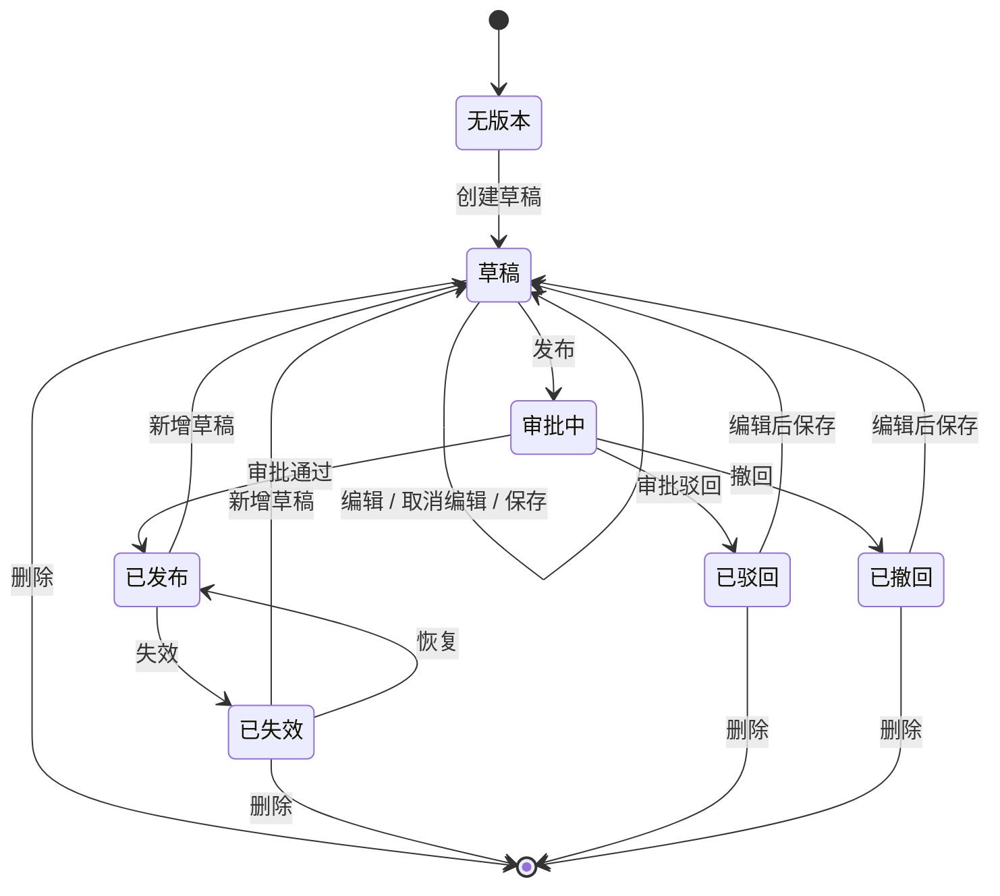

## 6 功能设计

### 6.1 功能实现整体设计方案

连接流编排页面由面包屑、页面标题、顶部版本栏、编排模式选择区、步骤条、节点配置卡片、版本详情抽屉、更多配置抽屉、调试抽屉和二次确认弹窗组成。页面初始化时先获取应用级配置，再获取版本列表；如果存在版本，则选择目标版本并加载版本详情；如果不存在版本，则展示创建草稿空态。

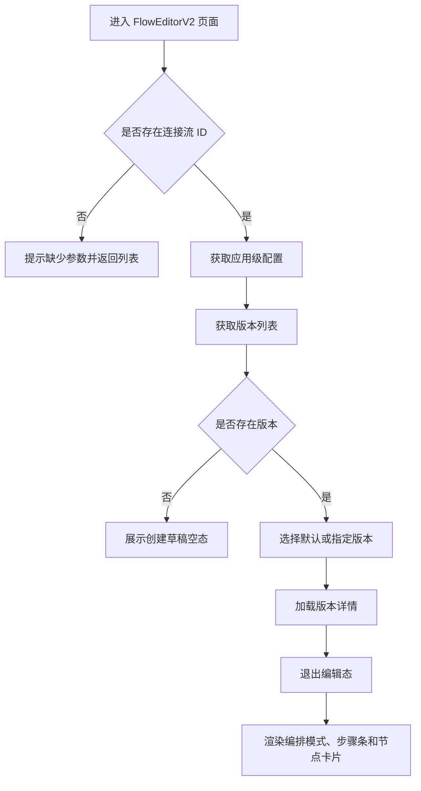

### 6.2 顶部版本操作区

#### 6.2.1 版本下拉

版本下拉展示当前连接流所有版本。每个版本项需要展示版本名称、版本创建时间和版本状态标签。用户点击版本后，页面切换到对应版本、重新加载版本详情，并强制退出编辑态。

| 字段 | 展示说明 |
|---|---|
| 版本名称 | 版本下拉主文本 |
| 创建时间 | 版本下拉辅助信息 |
| 状态标签 | 草稿、已发布、已失效、审批中、已驳回、已撤回 |

#### 6.2.2 版本栏布局

| 区域 | 内容 | 展示规则 |
|---|---|---|
| 左侧标签 | 当前版本 | 固定展示 |
| 版本下拉 | 版本列表 | 有版本时展示；无版本时展示“暂无版本，点击创建草稿开始配置” |
| 左侧辅助操作 | 详情、更多配置、调试 | 详情有版本时固定展示；更多配置、调试按当前版本状态展示 |
| 右侧状态操作 | 新增草稿、编辑、取消编辑、保存、发布、撤回、失效、恢复、删除 | 按版本状态和编辑态计算后展示 |

#### 6.2.3 版本状态与按钮

| 版本状态 | 左侧辅助按钮 | 非编辑态右侧按钮 | 编辑态右侧按钮 | 是否可进入编辑态 |
|---|---|---|---|---|
| 草稿 | 详情、更多配置、调试 | 编辑、发布、删除 | 取消编辑、保存、删除 | 是 |
| 已发布 | 详情、更多配置、调试 | 新增草稿、失效 | 无 | 否 |
| 已失效 | 详情、更多配置 | 新增草稿、恢复、删除 | 无 | 否 |
| 审批中 | 详情、更多配置 | 撤回 | 无 | 否 |
| 已驳回 | 详情、更多配置 | 编辑、删除 | 取消编辑、保存、删除 | 是 |
| 已撤回 | 详情、更多配置 | 编辑、删除 | 取消编辑、保存、删除 | 是 |

#### 6.2.4 版本操作说明

| 操作 | 说明 |
|---|---|
| 创建草稿 | 无版本时创建首个草稿版本，成功后加载该版本 |
| 详情 | 打开版本详情抽屉，并拉取当前版本详细信息 |
| 编辑 | 当前版本为草稿、已驳回或已撤回时进入编辑态 |
| 取消编辑 | 退出编辑态，并重新拉取当前版本详情，还原未保存内容 |
| 保存 | 保存当前配置；不执行完整节点校验；保存成功后退出编辑态 |
| 发布 | 仅草稿非编辑态展示；发布前执行完整校验，校验通过后展示确认弹窗，确认后提交发布 |
| 新增草稿 | 基于当前已发布或已失效版本创建草稿版本，并切换到新草稿 |
| 失效 | 将当前已发布版本设为已失效，操作前二次确认 |
| 恢复 | 将当前已失效版本恢复为可用状态 |
| 撤回 | 将当前审批中版本撤回为已撤回，操作前二次确认 |
| 删除 | 删除当前支持删除的版本，操作前二次确认 |
| 更多配置 | 打开更多配置抽屉；非编辑态只读，编辑态可保存 |
| 调试 | 草稿和已发布版本支持打开调试抽屉 |

### 6.3 版本详情抽屉

版本详情抽屉用于查看当前版本的元信息和状态相关信息。点击版本栏中的“详情”后打开抽屉，并调用版本详情信息接口。

| 版本状态 | 展示内容 |
|---|---|
| 草稿 | 版本名称、创建人、创建时间、更新人、更新时间 |
| 已发布 | 基础信息、发布人、发布时间 |
| 已失效 | 基础信息、失效人、失效时间 |
| 审批中 | 基础信息、当前审批人、提交时间、审批链接、催办审批按钮 |
| 已驳回 | 基础信息、驳回人、驳回时间、驳回原因 |
| 已撤回 | 基础信息、撤回人、撤回时间 |

审批中版本存在审批链接时，详情抽屉需要展示审批链接卡片，并支持复制审批链接。点击催办审批时，页面展示催办成功提示。

### 6.4 只读与编辑控制

FlowEditorV2 的可编辑能力由“版本状态 + 编辑态”共同决定。草稿、已驳回、已撤回是支持编辑的版本状态，但页面加载或切换版本后默认处于只读态，必须点击“编辑”后才允许修改。已发布、已失效、审批中始终只读。

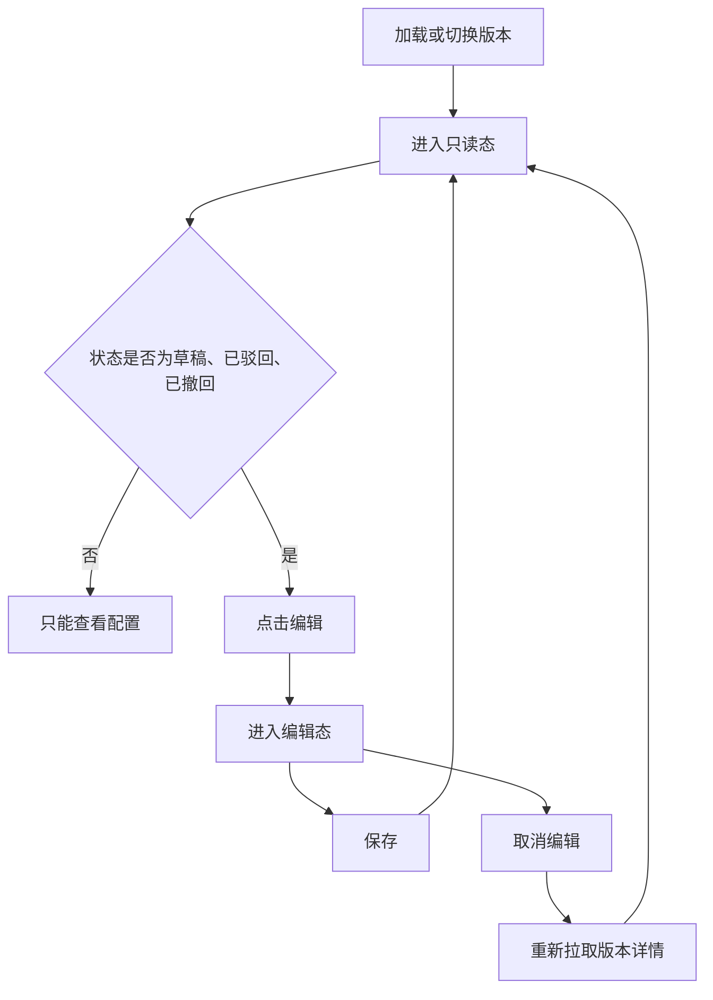

| 控制对象 | 只读态 | 编辑态 |
|---|---|---|
| 编排模式选择 | 不允许切换 | 允许切换，切换后重新初始化节点结构 |
| 步骤条节点切换 | 允许 | 允许 |
| 步骤条添加节点 | 不展示添加入口 | 按编排模式和上限展示添加入口 |
| 步骤条删除节点 | 不展示删除入口 | 按节点类型和数量规则展示删除入口 |
| 节点配置卡片 | 表单禁用，仅查看 | 表单可编辑 |
| 更多配置抽屉 | 可打开，仅查看，底部展示关闭 | 可打开并保存配置 |
| 保存版本 | 不展示保存按钮 | 展示保存按钮 |
| 发布版本 | 草稿非编辑态展示 | 编辑态隐藏，需先保存后发布 |
| 调试 | 草稿、已发布允许 | 草稿编辑态不展示发布，但调试入口仍按版本状态控制 |

### 6.5 保存与发布校验策略

保存和发布采用不同校验策略。保存用于暂存当前连接流配置，不要求节点配置完整；发布用于进入审批流程，必须确保所有节点数据满足运行要求。

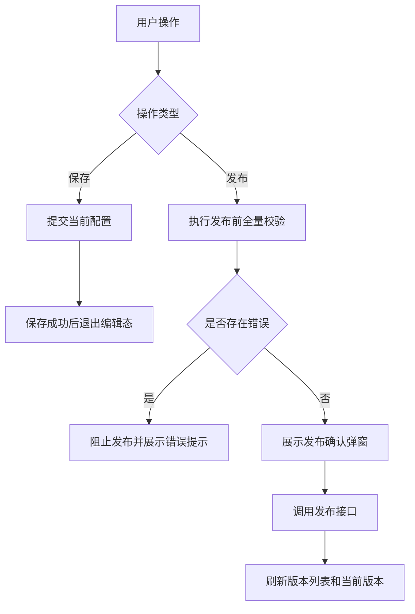

| 操作 | 校验范围 | 处理策略 |
|---|---|---|
| 保存 | 不执行完整节点校验 | 允许保存未完成配置，保存成功后退出编辑态 |
| 发布 | 编排模式、触发器、连接器、脚本处理、并行、数据输出、应用级上限 | 任一校验不通过则阻止发布 |
| 更多配置保存 | 限流上限、缓存时间、缓存 Key | 编辑态下立即保存到当前版本配置 |
| 调试 | 调试入参和接口调用参数 | 不替代发布校验，调试失败不改变版本状态 |

### 6.6 编排模式设计

编排模式选择区用于初始化连接流节点结构。模式卡片展示单节点、串行编排、并行编排；具体可见模式由应用级配置返回的模式可见性控制。

| 编排模式 | 展示文案 | 初始化结构 | 步骤条添加能力 |
|---|---|---|---|
| 单节点 | 单节点 | 触发器 → 连接器 → 数据输出 | 不展示添加按钮 |
| 串行编排 | 串行编排 | 触发器 → 连接器 → 数据输出 | 可插入连接器或脚本处理 |
| 并行编排 | 并行编排 | 触发器 → 并行节点 → 数据输出 | 可在步骤链路中插入脚本处理 |

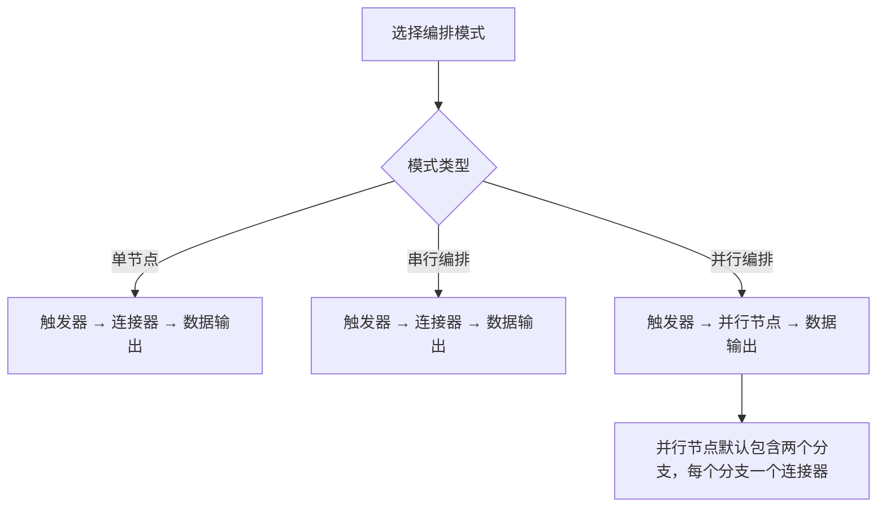

模式选择规则如下：

| 规则 | 说明 |
|---|---|
| 编辑态限制 | 只有编辑态允许选择或切换编排模式 |
| 重置规则 | 切换编排模式会重新初始化触发器、步骤节点、输出节点和运行级默认配置 |
| 可见性控制 | 应用级配置关闭某个模式后，页面不展示该模式卡片 |
| 空模式提示 | 当前版本未选择模式时，页面提示“请在上方选择编排类型后开始配置节点” |

### 6.7 步骤条与节点卡片

选择编排模式后，页面展示步骤条。步骤条按顺序展示触发器、步骤节点和数据输出节点。点击步骤条节点后，该节点成为当前激活节点，下方展示对应节点配置卡片。

| 区域 | 说明 |
|---|---|
| 步骤条节点 | 展示节点序号、节点标题和激活态 |
| 添加入口 | 编辑态下在可插入位置展示添加按钮 |
| 删除入口 | 编辑态下在可删除节点上展示删除入口 |
| 节点卡片头部 | 展示节点类型标签、节点标题和节点 ID |
| 节点卡片内容 | 按节点类型渲染触发器、连接器、脚本处理、并行或数据输出配置 |

节点标题按当前节点顺序生成，便于用户区分多个连接器或脚本处理节点。触发器节点标记为入口，数据输出节点标记为出口，其他步骤节点标记为工序。

### 6.8 步骤条节点添加交互与逻辑

节点添加统一从步骤条节点之间的添加按钮进入。点击添加按钮后，页面根据当前编排模式、步骤节点列表、插入位置和应用级上限计算可插入节点类型。如果只有一种可插入类型，则直接插入；如果存在多种类型，则打开节点类型选择弹窗。

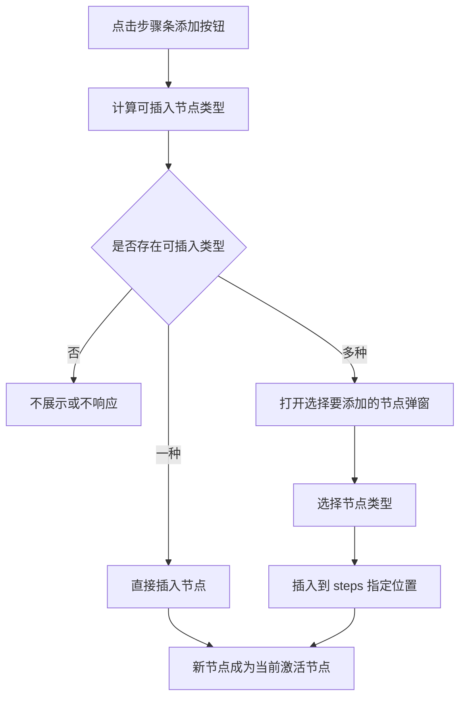

| 编排模式 | 可插入节点 | 限制规则 |
|---|---|---|
| 单节点 | 无 | 单节点模式不展示添加按钮 |
| 串行编排 | 连接器、脚本处理 | 连接器数量不能超过应用级串行连接器上限；脚本处理不能与脚本处理相邻 |
| 并行编排 | 脚本处理 | 只允许插入脚本处理；脚本处理不能与脚本处理相邻 |

节点类型选择弹窗需要展示可选节点的图标、名称和描述。当前实现支持以下可插入节点：

| 节点类型 | 展示名称 | 描述 |
|---|---|---|
| 连接器 | 连接器 | 调用连接器接口，支持版本选择和入参映射 |
| 脚本处理 | 脚本处理 | TypeScript 脚本处理上游数据 |
| 并行 | 并行节点 | 当前编排初始化时使用；步骤条插入规则以实际可插入类型计算结果为准 |

### 6.9 节点删除交互与逻辑

节点删除入口展示在步骤条节点上。只有编辑态下才展示删除入口，并且需要先判断节点类型和当前编排模式是否允许删除。

| 节点类型 | 删除规则 |
|---|---|
| 触发器节点 | 不允许删除 |
| 数据输出节点 | 不允许删除 |
| 并行节点 | 不允许删除 |
| 单节点模式连接器 | 不允许删除 |
| 串行编排连接器 | 当连接器数量大于 1 时允许删除 |
| 并行分支内连接器 | 不通过步骤条删除 |
| 脚本处理节点 | 允许删除 |

删除节点后，系统从步骤节点列表中移除该节点。如果删除的是当前激活节点，或当前激活节点已经不存在，则自动选中新的第一个可见节点。

### 6.10 节点体系设计

FlowEditorV2 当前开放的节点类型如下：

| 节点类型 | 状态 | 定义与作用 | 配置入口 |
|---|---|---|---|
| 触发器节点 | 开放 | 连接流入口，定义 HTTP 触发方式、SYSACCOUNT 白名单和入参结构 | 节点配置卡片 |
| 连接器节点 | 开放 | 调用连接器动作，支持连接器选择、版本选择、认证参数、入参映射和超时时间 | 节点配置卡片 |
| 脚本处理节点 | 开放 | 使用 TypeScript 脚本处理上游参数，并定义脚本出参 | 节点配置卡片 |
| 并行节点 | 开放 | 定义多分支并行执行结构，每个分支配置一个连接器 | 节点配置卡片 |
| 数据输出节点 | 开放 | 定义连接流最终响应头和响应体 | 节点配置卡片 |

### 6.11 触发器节点配置

触发器节点用于定义连接流入口。当前支持 HTTP 触发方式、SYSACCOUNT 白名单和入参配置。

| 配置项 | 说明 | 编辑状态 | 发布校验 |
|---|---|---|---|
| 触发方式 | 当前连接流触发方式，当前支持 HTTP 触发 | 编辑态可选 | 必须选择 |
| SYSACCOUNT 白名单 | 允许触发当前连接流的系统账号列表 | 编辑态可新增、修改、删除 | 当前前端不作为必填项 |
| 入参配置 | 按 HTTP 请求头、HTTP 请求体、URL 查询参数维护入参 schema | 编辑态可维护 | 入参结构需可被后续节点引用 |

触发器入参配置使用统一 schema 编辑器，按 header、body、query 三类载体展示。更多配置中的缓存 Key 和调试抽屉中的入参赋值均来源于触发器入参配置。

### 6.12 连接器节点配置

连接器节点用于选择连接器动作和版本，并配置调用参数。

| 配置项 | 说明 | 默认值或来源 | 校验策略 |
|---|---|---|---|
| 连接器 | 当前节点调用的连接器 | 连接器列表接口 | 发布时必选 |
| 连接器版本 | 当前连接器的具体版本 | 连接器版本接口 | 发布时必选 |
| 版本入参 | 所选连接器版本的入参 schema | 连接器版本详情接口 | 用于渲染入参映射表 |
| 版本出参 | 所选连接器版本的出参 schema | 连接器版本详情接口 | 写入节点数据，供下游引用 |
| 认证方式 | 当前版本对应的认证方式 | 连接器版本详情接口 | 非 Cookie 认证参数只读展示，Cookie 支持映射配置 |
| 入参映射 | 连接器调用入参映射 | 用户配置 | 支持静态值和引用上游参数 |
| 超时时间 | 连接器调用超时时间 | 默认 3000 毫秒，控件上限来自应用级配置 | 发布时不超过应用级上限 |

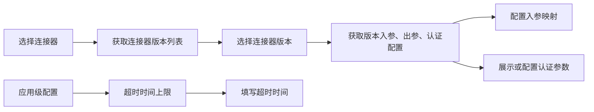

### 6.13 脚本处理节点配置

脚本处理节点用于通过 TypeScript 脚本处理当前节点之前的上游参数，并定义脚本执行后的出参 schema。

| 配置项 | 说明 | 编辑状态 | 校验策略 |
|---|---|---|---|
| 脚本内容 | 使用 Monaco Editor 编辑 TypeScript 脚本；加载失败时使用备用输入框 | 编辑态可修改 | 发布时不能为空 |
| 上游上下文类型 | 根据当前节点之前的可引用参数生成 Context 类型提示 | 自动生成 | 不需要用户维护 |
| 出参 schema | 定义脚本执行后输出参数 | 编辑态可维护 | 出参名称不能为空，同级名称不能重复 |

脚本处理节点的默认脚本包含 transform 方法。保存运行配置前，需要以运行时可执行脚本为准，编辑器中的类型声明仅用于提示和补全。

### 6.14 并行节点配置

并行节点用于配置多个并行分支。并行编排初始化时默认生成一个并行节点，并行节点默认包含两个分支，每个分支内固定配置一个连接器。

| 配置项 | 说明 | 编辑状态 | 校验策略 |
|---|---|---|---|
| 分支数量 | 当前并行节点下的分支数量 | 编辑态可新增或删除 | 至少 1 个分支，不超过应用级分支上限 |
| 分支名称 | 每个分支的名称 | 编辑态可修改 | 发布时不能为空 |
| 分支连接器 | 每个分支内的连接器配置 | 编辑态可配置 | 连接器和版本必选 |
| 分支连接器入参映射 | 分支连接器调用入参 | 编辑态可配置 | 引用参数需要合法 |
| 分支连接器认证参数 | 分支连接器认证信息 | 编辑态可配置或查看 | 遵循连接器版本认证配置 |
| 分支连接器超时时间 | 分支连接器调用超时时间 | 编辑态可配置 | 不超过应用级上限 |

并行节点使用 Tab 展示分支。分支数量大于 1 时，编辑态下允许删除分支；达到应用级分支上限时，添加分支按钮禁用。

### 6.15 数据输出节点配置

数据输出节点用于定义连接流最终响应结构。当前按响应体和响应头两个载体维护输出参数。

| 配置项 | 说明 | 编辑状态 | 校验策略 |
|---|---|---|---|
| 响应体参数 | 连接流响应体结构 | 编辑态可添加、修改、删除 | 参数名称不能为空 |
| 响应头参数 | 连接流响应头结构 | 编辑态可添加、修改、删除 | 参数名称不能为空 |
| 参数类型 | string、number、boolean、object、array 等 | 编辑态可选择 | object、array 可维护子参数 |
| 值来源 | 静态值或引用上游参数 | 编辑态可选择 | 引用值需要来自当前节点之前的上游参数 |
| 参数值 | 静态值内容或上游引用路径 | 编辑态可填写或选择 | 按值来源校验 |

输出参数支持层级结构。object 类型可添加多个子参数；array 类型可添加子参数并受 schema 编辑器层级限制。

### 6.16 上游参数引用

连接器节点、脚本处理节点、并行分支连接器和数据输出节点都依赖上游参数引用能力。系统会根据当前节点在步骤条中的位置，收集当前节点之前的触发器入参、连接器出参、脚本出参和并行节点出参，作为可选引用来源。

| 来源节点 | 可引用内容 | 使用场景 |
|---|---|---|
| 触发器节点 | header、body、query 入参 | 连接器入参映射、脚本上下文、输出参数、缓存 Key |
| 连接器节点 | header、body 出参 | 后续连接器映射、脚本上下文、输出参数 |
| 脚本处理节点 | 脚本出参 schema | 后续连接器映射、输出参数 |
| 并行节点 | 分支连接器出参 | 后续脚本处理或输出参数 |

引用参数按节点分组展示，用户可以通过下拉或自动完成选择引用路径。

### 6.17 更多配置抽屉

更多配置抽屉用于维护连接流运行级策略，包含限流配置和缓存配置。抽屉在所有展示更多配置按钮的版本状态下可打开，但只有编辑态允许保存。

#### 6.17.1 限流配置

| 配置项 | 说明 |
|---|---|
| 限流值 | 当前连接流允许的 QPS |
| 默认上限 | 1000 |
| 应用级上限 | 页面初始化时从应用级配置接口获取 |
| 输入限制 | 输入值不能超过应用级上限 |
| 保存时机 | 编辑态下点击保存配置立即提交 |

#### 6.17.2 缓存配置

缓存配置支持开启和关闭。开启时，需要配置缓存时间和缓存 Key；缓存 Key 从触发器入参中选择，并按顺序拼接。

| 配置项 | 说明 | 校验策略 |
|---|---|---|
| 缓存开关 | 开启或关闭缓存 | 必选 |
| 缓存时间 | 单位秒 | 开启缓存时必填，且不超过应用级缓存时间上限 |
| 缓存 Key | 从触发器 header、body、query 入参中选择字段 | 开启缓存时至少选择一个 |
| 缓存 Key 预览 | 展示已选择 Key 的拼接结果 | 只读展示 |

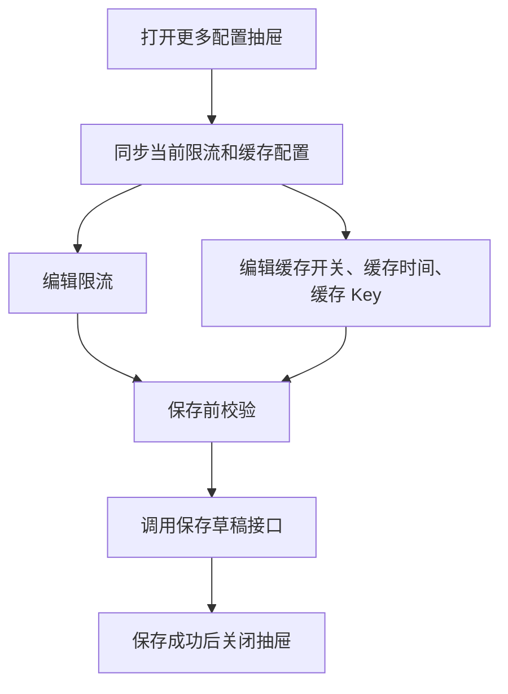

### 6.18 调试抽屉

调试抽屉仅草稿和已发布版本支持。点击调试后，页面清空上一次调试结果，打开右侧调试抽屉，并按触发器入参展示 header、body、query 三个 Tab。

| 区域 | 内容 | 说明 |
|---|---|---|
| 抽屉头部 | 连接流调试、连接流名称、DEBUG 标识 | 提示当前调试对象 |
| 入参配置 | HTTP 请求头、HTTP 请求体、URL 查询参数 | 参数名称和类型只读，仅参数值可编辑 |
| 操作按钮 | 关闭、立即调试 | 点击立即调试后调用调试接口 |
| 执行概览 | 执行成功/失败、耗时、节点数量 | 调试接口返回后展示 |
| 节点执行链路 | 每个节点名称、状态、耗时 | 用于定位执行链路 |
| 输出数据 | JSON 格式输出 | 执行成功或接口返回输出时展示 |
| 错误信息 | 错误文本 | 执行失败时展示 |

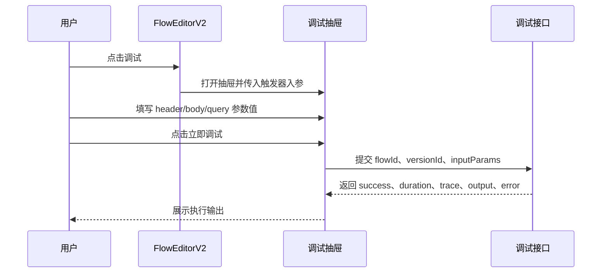

### 6.19 节点数据校验设计

发布前执行全量校验。校验不通过时，页面阻止发布并展示第一条错误提示。保存草稿不执行完整校验。

| 校验对象 | 发布前校验规则 |
|---|---|
| 编排模式 | 必须选择编排模式 |
| 触发器节点 | 必须选择触发方式 |
| 连接器节点 | 连接器必选；连接器版本必选；超时时间不能超过应用级上限 |
| 脚本处理节点 | 脚本内容不能为空；出参名称不能为空；出参名称不能重复 |
| 并行节点 | 至少 1 个分支；分支数量不超过应用级上限；分支名称不能为空；每个分支连接器和版本必选；分支入参引用表达式合法 |
| 数据输出节点 | 响应体和响应头参数名称不能为空；子参数递归校验 |

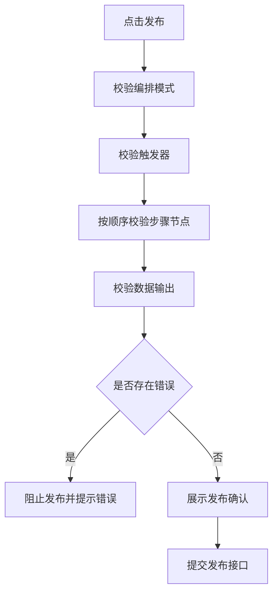

### 6.20 关键数据模型

FlowEditorV2 的连接流配置以当前版本详情中的配置数据为基础，页面编辑过程中维护本地连接流数据。

| 字段 | 说明 |
|---|---|
| flowMode | 当前编排模式，取值为 single、serial、parallel |
| trigger | 触发器节点配置 |
| steps | 中间步骤节点列表，包含连接器、脚本处理、并行节点 |
| output | 数据输出节点配置 |
| rateLimit | 限流值 |
| cacheEnabled | 是否开启缓存 |
| cacheTime | 缓存时间，单位秒 |
| cacheKeys | 缓存 Key 引用路径列表 |

### 6.21 接口依赖

| 接口能力 | 使用场景 | 返回或提交重点 |
|---|---|---|
| 获取应用级配置 | 页面初始化 | 编排模式可见性、限流上限、超时上限、串行连接器上限、并行分支上限、缓存时间上限 |
| 获取版本列表 | 页面初始化、版本操作后刷新 | 版本 ID、版本名称、创建时间、状态 |
| 获取版本详情 | 切换版本、取消编辑、初始化当前版本 | 编排模式、节点配置、运行级配置 |
| 获取版本详情信息 | 打开版本详情抽屉 | 基础信息、发布信息、审批信息、驳回信息、撤回信息 |
| 创建草稿版本 | 无版本创建、已发布或已失效新增草稿 | 新版本 ID |
| 保存草稿 | 点击保存、更多配置保存 | 当前连接流配置 |
| 发布版本 | 发布校验通过并确认后 | flowId、versionId |
| 失效版本 | 已发布版本失效 | flowId、versionId |
| 恢复版本 | 已失效版本恢复 | flowId、versionId |
| 撤回版本 | 审批中版本撤回 | flowId、versionId |
| 删除版本 | 删除支持删除的版本 | flowId、versionId |
| 获取连接器列表 | 连接器节点配置 | 连接器 ID、连接器名称 |
| 获取连接器版本列表 | 选择连接器后 | 版本 ID、版本名称、创建时间、状态、认证方式 |
| 获取连接器版本入参 | 选择连接器版本后 | 入参 schema、出参 schema、认证配置、连接器版本配置快照 |
| 调试连接流 | 点击立即调试 | 执行成功状态、耗时、执行链路、输出数据、错误信息 |

### 6.22 实施顺序

1. 调整连接流编排页面顶部版本下拉、详情按钮和状态按钮展示。
2. 接入版本状态和编辑态控制，限制非编辑态下的模式切换、节点增删、节点卡片输入和更多配置保存。
3. 接入应用级配置，控制编排模式可见性、限流上限、缓存时间上限、连接器超时时间上限、串行连接器数量上限和并行分支数量上限。
4. 调整无版本空态，统一从空态创建草稿。
5. 调整编排模式选择，按单节点、串行、并行初始化节点结构。
6. 调整步骤条展示、节点激活、节点添加和节点删除规则。
7. 改造触发器节点卡片，维护触发方式、SYSACCOUNT 白名单和入参 schema。
8. 改造连接器节点卡片，维护连接器、版本、认证参数、入参映射、超时时间和版本配置快照。
9. 新增或调整脚本处理节点卡片，支持脚本编辑、上游 Context 类型提示和出参 schema。
10. 改造并行节点卡片，支持分支 Tab、分支增删、分支名称和分支连接器配置。
11. 改造数据输出节点卡片，支持响应体、响应头、静态值和上游引用配置。
12. 改造更多配置抽屉，支持编辑态保存和非编辑态只读查看。
13. 接入调试抽屉和立即调试流程。
14. 接入发布前校验和发布确认流程。
15. 补充开发自测和测试用例。

## 7 系统级非功能设计

### 7.1 FMEA 影响分析

| 风险 | 影响 | 措施 |
|---|---|---|
| 版本状态判断错误 | 不可编辑版本被误编辑 | 所有编辑入口统一依赖版本状态和编辑态判断 |
| 切换版本未退出编辑态 | 旧版本编辑状态影响新版本 | 切换或加载版本详情时强制退出编辑态 |
| 取消编辑未还原数据 | 用户误以为未保存内容已丢弃 | 取消编辑时重新拉取当前版本详情 |
| 保存时误触发完整校验 | 未完成草稿无法暂存 | 保存流程不调用发布校验 |
| 发布时漏校验节点 | 不完整配置进入审批或运行链路 | 发布前统一执行节点类型校验 |
| 应用级配置上限获取失败 | 限流、缓存或超时缺少约束 | 使用默认上限兜底 |
| 连接器版本切换后配置未刷新 | 入参映射和下游引用错误 | 选择版本后重新拉取版本详情，并写入出参和认证配置快照 |
| 更多配置非编辑态误保存 | 版本配置不一致 | 抽屉保存按钮仅编辑态展示，保存接口前再次判断编辑态 |
| 调试接口失败 | 用户无法定位问题 | 调试输出区展示失败状态和错误信息 |

### 7.2 安全影响分析

版本发布、删除、失效、撤回等操作依赖后端鉴权。SYSACCOUNT 白名单仅保存系统账号标识，不在页面展示敏感明文。调试入参仅用于当前调试请求，不改变版本状态。Cookie、SOA、APIG、数字签名等认证参数遵循连接器配置页既有安全策略。

### 7.3 兼容性

已有连接流版本和历史编排数据需要保持可加载。新增字段在旧版本中不存在时按默认空配置处理。限流上限、缓存时间上限、超时时间上限接口不可用时使用默认值，避免阻断页面基础查看。旧版本中不存在编排模式时，页面展示选择编排类型提示。

### 7.4 可运维

调试抽屉展示执行结果、错误信息和节点执行链路，便于定位配置问题。发布校验错误需要明确节点类型和字段问题，便于快速回到对应节点修复。更多配置中的限流和缓存配置需要在版本详情或运行记录中具备可追踪性。

### 7.5 测试建议

| 测试类型 | 建议覆盖内容 |
|---|---|
| 单元测试 | 版本状态按钮映射、编辑态判断、节点添加类型计算、节点删除规则、发布校验规则、上限计算逻辑 |
| 集成测试 | 版本切换、进入编辑、取消编辑、保存、发布、连接器版本切换、更多配置保存、调试接口调用 |
| 端到端测试 | 无版本创建草稿、草稿编辑保存、发布校验拦截、发布成功、已发布新增草稿、审批中撤回、已失效恢复和删除 |
| 边界测试 | 应用级模式全部关闭、串行连接器达到上限、脚本相邻插入限制、并行分支达到上限、缓存开启未配置 Key、超时时间超过上限 |

## 8 checkList

| check 点 | 是否达标 |
|---|---|
| 顶部版本下拉展示版本名称、创建时间和状态标签 | 是 |
| 切换版本后加载对应版本详情并退出编辑态 | 是 |
| 无版本时展示创建草稿空态 | 是 |
| 版本栏左侧展示详情、更多配置、调试等辅助按钮 | 是 |
| 草稿非编辑态展示编辑、发布、删除 | 是 |
| 草稿编辑态展示取消编辑、保存、删除，并隐藏发布 | 是 |
| 已发布版本展示新增草稿、失效，并支持调试 | 是 |
| 已失效版本展示新增草稿、恢复、删除，不展示调试 | 是 |
| 审批中版本展示撤回，不展示调试 | 是 |
| 已驳回和已撤回版本支持编辑后保存回草稿 | 是 |
| 版本详情抽屉按状态展示基础、发布、失效、审批、驳回、撤回信息 | 是 |
| 草稿、已驳回、已撤回默认只读，点击编辑后才可修改 | 是 |
| 保存和取消编辑后退出编辑态 | 是 |
| 保存草稿不执行完整节点数据校验 | 是 |
| 发布版本执行完整节点数据校验和发布确认 | 是 |
| 编排模式支持单节点、串行编排、并行编排 | 是 |
| 编排模式展示受应用级配置控制 | 是 |
| 单节点模式不展示步骤条添加按钮 | 是 |
| 串行编排可按规则插入连接器和脚本处理节点 | 是 |
| 并行编排可按规则插入脚本处理节点 | 是 |
| 节点删除规则覆盖触发器、输出、连接器、脚本处理、并行节点 | 是 |
| 触发器节点支持触发方式、SYSACCOUNT 白名单和入参配置 | 是 |
| 连接器节点支持连接器选择、版本选择、认证参数、入参映射和超时时间 | 是 |
| 脚本处理节点支持脚本编辑、Context 类型提示和出参 schema | 是 |
| 并行节点支持分支 Tab、分支增删、分支名称和分支连接器配置 | 是 |
| 数据输出节点支持响应体、响应头、静态值和引用上游参数 | 是 |
| 更多配置支持限流、缓存开关、缓存时间和缓存 Key | 是 |
| 更多配置非编辑态只读、编辑态可保存 | 是 |
| 调试抽屉仅草稿和已发布版本支持 | 是 |
| 调试抽屉展示触发器入参，参数名称和类型只读，仅参数值可编辑 | 是 |
| 立即调试后展示执行状态、耗时、节点执行链路、输出数据和错误信息 | 是 |
| 文档不展示实现代码块，仅使用表格和 Mermaid 图说明 | 是 |
