# 连接流配置需求设计说明书

## 修订记录

| 版本 | 日期 | 修订内容 | 作者 |
|---|---|---|---|
| V1.0 | 2026-06-11 | 新增连接流配置整改需求设计 | - |
| V1.1 | 2026-06-12 | 补充连接流编辑器详细设计、关键实现思路、交互流程和验证点 | - |
| V1.2 | 2026-06-15 | 按连接流编排交互调整补充版本操作、更多配置、调试、节点校验、保存发布校验策略，并移除实现代码块 | - |
| V1.3 | 2026-06-15 | 补充 ELK 自动布局与业务语义布局的职责边界、并行分支间距计算原因和嵌套结构布局规则 | - |
| V1.4 | 2026-06-16 | 按 elkjs 示例项目实现修正添加后布局处理说明，明确当前实现不包含后续节点位移预处理 | - |
| V1.5 | 2026-06-16 | 补充连线加号展示与隐藏规则，说明结构辅助连线和受限链路的插入控制方式 | - |
| V1.6 | 2026-06-16 | 补充自定义连线组件、折线路径计算、多出边分叉和多入边汇合实现说明 | - |
| V1.7 | 2026-06-16 | 补充自定义连线组件不计算转折点时对分叉、汇合、加号定位和结构可读性的影响 | - |
| V1.8 | 2026-06-16 | 补充 ELK 布局后并行节点、错误处理节点及嵌套结构新增时的位置计算规则 | - |
| V1.9 | 2026-06-16 | 重组节点添加与结构布局说明，压缩重复内容并补充 Mermaid 图 | - |

## 目录

- 需求价值和概述
- 上下文分析
- 初始需求分析
- 需求影响分析
- 系统用例分析
- 功能设计
- 系统级非功能设计
- checkList

## 表目录

版本状态与操作、节点体系、节点添加入口与连线加号、单节点插入逻辑、结构节点插入逻辑、ReactFlow nodes 和 edges 添加样例、结构节点数据语义、添加后布局处理、ELK 与结构语义位置修正、节点删除、函数引用配置、节点校验、更多配置、调试配置、验证清单。

## 图目录

连接流编排上下文图、版本状态操作图、保存发布校验流程图、节点配置数据流图、函数引用配置流程图、函数引用数据流图、节点添加总流程图、单节点连线拆分图、结构节点添加语义流程图、并行节点结构图、错误处理节点结构图、添加后布局处理流程图、ELK 与语义修正职责边界图、结构语义位置修正规则图、缺少 ELK 或语义修正的影响图、节点删除重连流程图、结构节点级联删除流程图、更多配置数据流图、调试流程图。

## Keywords 关键字

中文：连接流配置、连接流编辑器、版本管理、节点校验、更多配置、限流、缓存、连接器超时、数据处理、调试  
English: Flow Configuration, Flow Editor, Version Management, Node Validation, Advanced Config, Rate Limit, Cache, Connector Timeout, Data Processing, Debugging

## Abstract 摘要

中文：本文档描述连接流编排页面整改需求，覆盖版本下拉与状态操作、只读控制、更多配置、调试抽屉、触发器节点、连接器节点、数据处理节点、节点数据校验、保存与发布校验策略。文档从开发和测试视角说明功能边界、数据流、接口依赖和验证要点。  
English: This document describes flow editor requirements, including version selector, status actions, read-only control, advanced configuration, debug drawer, trigger node, connector node, data processing node, node validation, and save/publish validation strategy.

## List 偶发 abbreviations 缩略语清单

| 缩略语 | 英文全名 | 中文解释 |
|---|---|---|
| DAG | Directed Acyclic Graph | 有向无环图 |
| API | Application Programming Interface | 应用程序接口 |
| JSON | JavaScript Object Notation | JSON 数据格式 |
| SYSTOKEN | System Token | 系统令牌凭证 |

## 1 需求价值和概述

连接流编排页面需要支持按版本查看和维护连接流配置，并根据不同版本状态控制画布编辑能力、节点内容编辑能力和页面操作按钮。当前页面需要进一步补充版本切换、更多配置、调试、连接器版本选择、触发器 SYSTOKEN 白名单、数据处理节点和节点发布前校验能力。

本次整改目标如下：

| 目标 | 说明 |
|---|---|
| 版本化编排 | 顶部新增版本列表，下拉项展示版本名称、创建时间和状态标签，切换版本后展示对应编排内容 |
| 状态化操作 | 草稿、已发布、已失效、审批中、已驳回版本展示不同操作按钮，并按状态控制是否可编辑 |
| 配置能力补齐 | 更多配置抽屉支持限流和缓存配置；限流上限支持应用级接口配置，默认上限为 1000 |
| 节点能力补齐 | 触发器新增 SYSTOKEN 凭证白名单；连接器新增版本选择和超时时间；新增数据处理节点 |
| 发布前质量保障 | 保存草稿不做完整校验；发布时才执行节点数据完整性和输入合法性校验 |
| 调试闭环 | 调试抽屉展示触发器入参赋值区和执行输出区，支持立即调试并展示结果 |

## 2 上下文分析

连接流配置本次整改来源于上一版本编排能力已具备雏形，但版本治理、节点能力、调试闭环和发布质量控制仍不完整。上一版本可以进行基础流程编排，但无法充分支撑连接流从草稿编辑、发布审批、运行调试到问题排查的完整链路。

| 背景类型 | 现有问题或增强原因 | 本次处理方向 |
|---|---|---|
| 上个版本功能缺陷 | 编排页面缺少完整版本状态控制，草稿、审批中、已发布、已失效等版本的可编辑范围和按钮不够清晰 | 增加版本下拉、状态标签、状态化操作按钮和只读控制 |
| 上个版本功能缺陷 | 画布和节点配置缺少发布前统一校验，保存和发布边界不清晰，可能把不完整节点发布到运行链路 | 保存草稿不做完整校验，发布时统一校验节点必填项、参数映射和结构合法性 |
| 上个版本功能缺陷 | 触发器、连接器和数据处理节点能力不足，无法覆盖 SYSTOKEN 白名单、连接器版本选择、超时时间和数据处理配置 | 补充触发器 SYSTOKEN、连接器版本与超时时间、数据处理节点和节点配置模型 |
| 上个版本功能缺陷 | 缺少调试闭环，用户配置完成后不能在页面内基于触发器入参立即验证执行结果 | 增加调试抽屉，展示触发器入参赋值区和执行输出区 |
| 上个版本功能缺陷 | 限流、缓存等运行级配置缺少统一入口，且默认上限和应用级上限规则不明确 | 增加更多配置抽屉，支持限流、缓存和应用级上限约束 |
| 现有能力增强 | 连接流编排需要与连接器版本、应用级配置、运行记录形成联动，支撑后续部署和排障 | 明确版本接口、连接器版本接口、保存发布接口、调试接口和运行记录之间的关系 |

因此，本次连接流配置上下文是把“基础画布编排”增强为“可版本化、可校验、可调试、可治理的连接流编排能力”，重点解决上一版本在状态控制、节点完整性、运行前验证和运行级配置上的缺口。

### 2.1 连接流编排上下文图


## 3 初始需求分析

### 3.1 初始需求场景分析

| 场景 | 场景名称 | 说明 | 主要角色 |
|---|---|---|---|
| 版本切换 | 查看不同版本编排 | 顶部版本下拉展示所有版本，切换后加载对应画布和配置 | 开发、测试 |
| 草稿编辑 | 编辑连接流草稿 | 草稿版本可编辑画布和节点配置，支持保存、发布、调试、更多配置 | 开发 |
| 发布版本查看 | 查看已发布版本 | 已发布版本只读，支持新增草稿、更多配置、调试、失效 | 开发、测试 |
| 失效版本查看 | 查看已失效版本 | 已失效版本只读，支持新增草稿、更多配置、删除 | 开发、测试 |
| 审批中版本查看 | 查看审批中版本 | 审批中版本只读，支持更多配置、撤回 | 开发、测试 |
| 已驳回版本查看 | 查看已驳回版本 | 已驳回版本支持更多配置、调试、保存转草稿和删除 | 开发、测试 |
| 已撤回版本查看 | 查看已撤回版本 | 已撤回版本支持更多配置、调试、保存转草稿和删除 | 开发、测试 |
| 节点配置 | 配置触发器和连接器 | 触发器配置 SYSTOKEN 白名单；连接器选择版本并查看对应出参 | 开发 |
| 数据处理 | 新增数据处理节点 | 数据处理节点可拖拽到画布，点击后打开配置弹窗 | 开发 |
| 更多配置 | 配置限流和缓存 | 限流受应用级上限约束；缓存开启后配置缓存时间和缓存 key | 开发、测试 |
| 调试验证 | 立即调试连接流 | 根据触发器入参展示赋值区，执行后展示调试结果 | 开发、测试 |

### 3.2 结构化 IR

| IR 属性 | 具体信息 |
|---|---|
| IR 标识 | IR-FLOW-CONFIG-202606 |
| 名称 | 连接流配置整改 |
| 描述 | 增加连接流版本化编排、状态化操作、更多配置、节点配置扩展、节点发布前校验和调试能力 |
| 优先级 | 高 |
| why | 当前连接流编排缺少完整版本状态控制、更多配置、调试闭环和发布前校验能力 |
| what | 版本下拉、状态按钮、只读控制、触发器 SYSTOKEN、连接器版本与超时、数据处理节点、更多配置、调试抽屉、发布校验 |
| who | 前端实现交互和校验；后端提供版本、应用配置、连接器版本、保存、发布、调试接口；测试验证状态流和边界值 |
| 对架构要素的影响 | 前端页面状态管理、节点配置模型、校验模型、接口调用链路需要同步调整 |

## 4 需求影响分析

| 类型 | 影响特性 | 说明 |
|---|---|---|
| 修改 | 顶部操作区 | 新增版本列表下拉，并按状态展示不同按钮 |
| 修改 | 版本只读控制 | 除草稿外，画布不可编辑，节点内容只能查看 |
| 修改 | 保存发布策略 | 保存不做完整校验；发布才执行节点数据校验 |
| 新增 | 更多配置抽屉 | 支持限流配置和缓存配置 |
| 新增 | 应用级配置上限 | 限流默认上限 1000，连接器超时时间默认上限 3 秒，均支持接口覆盖 |
| 新增 | 触发器节点配置 | 新增 SYSTOKEN 凭证白名单，可添加多个 SYSTOKEN 凭证 |
| 新增 | 连接器节点配置 | 新增连接器版本列表，选择版本后展示对应版本出参配置 |
| 新增 | 数据处理节点 | 可拖拽到画布，点击后打开数据处理节点配置弹窗 |
| 新增 | 调试抽屉 | 展示触发器入参赋值区和执行输出区，支持立即调试 |
| 新增 | 节点校验 | 各节点发布前执行数据校验，并输出错误定位信息 |

## 5 系统用例分析

### 5.1 开发视角用例

| 用例 | 前置条件 | 主流程 | 结果 |
|---|---|---|---|
| 切换版本 | 已存在连接流版本 | 打开版本下拉，选择目标版本 | 页面加载目标版本画布和节点配置 |
| 编辑草稿 | 当前版本为草稿 | 修改画布或节点配置，点击保存 | 草稿内容保存成功，不触发完整校验 |
| 发布草稿 | 当前版本为草稿 | 点击发布，系统执行节点校验 | 校验通过后发布；不通过时阻止发布并提示错误 |
| 新增草稿 | 当前版本为已发布或已失效 | 点击新增草稿 | 创建草稿版本并切换到草稿配置 |
| 保存转草稿 | 当前版本为已驳回或已撤回 | 点击保存 | 当前版本回到草稿状态 |
| 配置触发器 | 当前版本为草稿 | 打开触发器配置弹窗，维护 SYSTOKEN 白名单 | 触发器节点保存白名单配置 |
| 配置连接器 | 当前版本为草稿 | 选择连接器版本，配置入参、认证参数、超时时间 | 节点保存连接器版本和参数映射 |
| 配置更多配置 | 当前版本存在 | 打开更多配置抽屉，配置限流和缓存 | 保存连接流级限流与缓存配置 |
| 调试连接流 | 当前版本存在 | 打开调试抽屉，填写触发器入参值，点击立即调试 | 展示调试输出和错误信息 |

### 5.2 测试视角用例

| 用例 | 验证点 | 预期结果 |
|---|---|---|
| 验证草稿按钮 | 草稿版本顶部按钮 | 展示更多配置、调试、保存、发布、删除 |
| 验证已发布按钮 | 已发布版本顶部按钮 | 展示新增草稿、更多配置、调试、失效 |
| 验证已失效按钮 | 已失效版本顶部按钮 | 展示新增草稿、更多配置、调试、删除 |
| 验证审批中按钮 | 审批中版本顶部按钮 | 展示更多配置、调试、撤回 |
| 验证已驳回按钮 | 已驳回版本顶部按钮 | 展示更多配置、调试、保存、删除 |
| 验证已撤回按钮 | 已撤回版本顶部按钮 | 展示更多配置、调试、保存、删除 |
| 验证只读状态 | 非草稿版本画布和节点弹窗 | 画布不可编辑，节点内容只能查看 |
| 验证保存不校验 | 草稿配置缺少必填映射时点击保存 | 保存允许提交，不因节点不完整被阻断 |
| 验证发布校验 | 草稿配置缺少必填映射时点击发布 | 发布被阻断，并展示节点和字段错误 |
| 验证限流上限 | 应用级上限接口返回非 1000 | 限流校验使用接口返回值 |
| 验证超时上限 | 应用级超时接口返回非 3 秒 | 连接器超时时间校验使用接口返回值 |

### 5.3 版本状态操作图

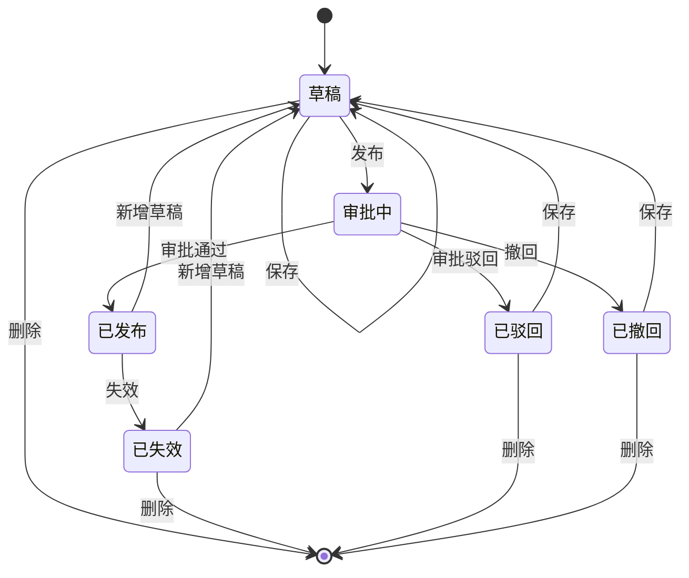

## 6 功能设计

### 6.1 功能实现整体设计方案

连接流编排页面由顶部版本操作区、画布编辑区、节点配置弹窗、更多配置抽屉和调试抽屉组成。页面初始化时先获取当前连接流版本列表和应用级配置上限，再加载选中版本的编排内容。版本状态决定当前页面是否可编辑，以及顶部展示哪些操作按钮。

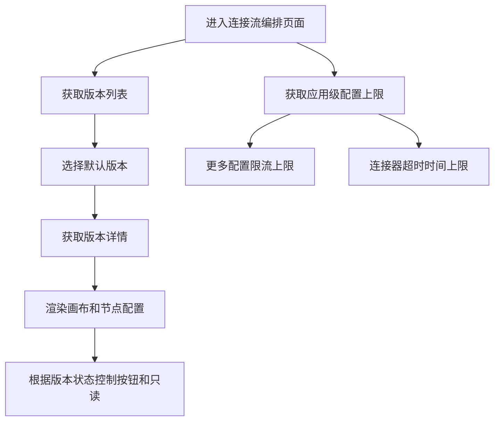

### 6.2 顶部版本操作区

#### 6.2.1 版本下拉

版本下拉展示当前连接流所有版本。每个版本项需要展示版本名称、版本创建时间和版本状态标签。用户点击版本后，页面切换到对应版本并展示该版本的编排内容。

| 字段 | 展示说明 |
|---|---|
| 版本名称 | 版本下拉主文本 |
| 创建时间 | 版本下拉辅助信息 |
| 状态标签 | 草稿、已发布、已失效、审批中、已驳回、已撤回 |

#### 6.2.2 版本状态与按钮

| 版本状态 | 顶部按钮 | 画布能力 | 节点内容能力 |
|---|---|---|---|
| 草稿 | 更多配置、调试、保存、发布、删除 | 可编辑 | 可修改 |
| 已发布 | 新增草稿、更多配置、调试、失效 | 不可编辑 | 只读查看 |
| 已失效 | 新增草稿、更多配置、调试、删除 | 不可编辑 | 只读查看 |
| 审批中 | 更多配置、调试、撤回 | 不可编辑 | 只读查看 |
| 已驳回 | 更多配置、调试、保存、删除 | 不可编辑，保存后回到草稿 | 只读查看 |
| 已撤回 | 更多配置、调试、保存、删除 | 不可编辑，保存后回到草稿 | 只读查看 |

#### 6.2.3 版本操作说明

| 操作 | 说明 |
|---|---|
| 保存 | 草稿状态保存当前草稿内容；已驳回和已撤回状态点击保存后回到草稿状态；不执行完整节点校验 |
| 发布 | 对当前草稿执行完整节点校验，通过后发布版本 |
| 新增草稿 | 基于已发布或已失效版本创建草稿版本，并切换到草稿版本配置 |
| 失效 | 将当前已发布版本设为已失效 |
| 撤回 | 将当前审批中版本撤回为已撤回版本 |
| 删除 | 删除当前草稿、已驳回、已撤回或已失效版本，删除前二次确认 |
| 更多配置 | 打开右侧抽屉，展示限流配置和缓存配置 |
| 调试 | 打开右侧调试抽屉，展示触发器入参并执行调试 |

### 6.3 只读与编辑控制

版本状态是页面可编辑能力的唯一入口判断。草稿版本可编辑画布、连线、节点和连接流级配置；非草稿版本画布不可编辑，节点内容只能查看。调试和更多配置在任何版本状态下均允许打开；已驳回和已撤回版本允许通过保存操作回到草稿状态。

| 控制对象 | 草稿 | 非草稿 |
|---|---|---|
| 拖拽节点 | 允许 | 禁止 |
| 新增节点 | 允许 | 禁止 |
| 删除节点 | 允许 | 禁止 |
| 修改连线 | 允许 | 禁止 |
| 修改节点配置 | 允许 | 禁止，仅查看 |
| 保存版本 | 允许 | 已驳回、已撤回允许保存并回到草稿；其他非草稿禁止 |
| 发布版本 | 允许 | 禁止 |
| 调试 | 允许 | 允许，任何版本状态均可打开调试抽屉 |
| 更多配置 | 允许 | 允许，任何版本状态均可打开更多配置抽屉 |

### 6.4 保存与发布校验策略

保存和发布采用不同校验策略。保存用于暂存草稿，不要求节点配置完整；发布用于进入正式状态，必须确保所有节点数据满足运行要求。

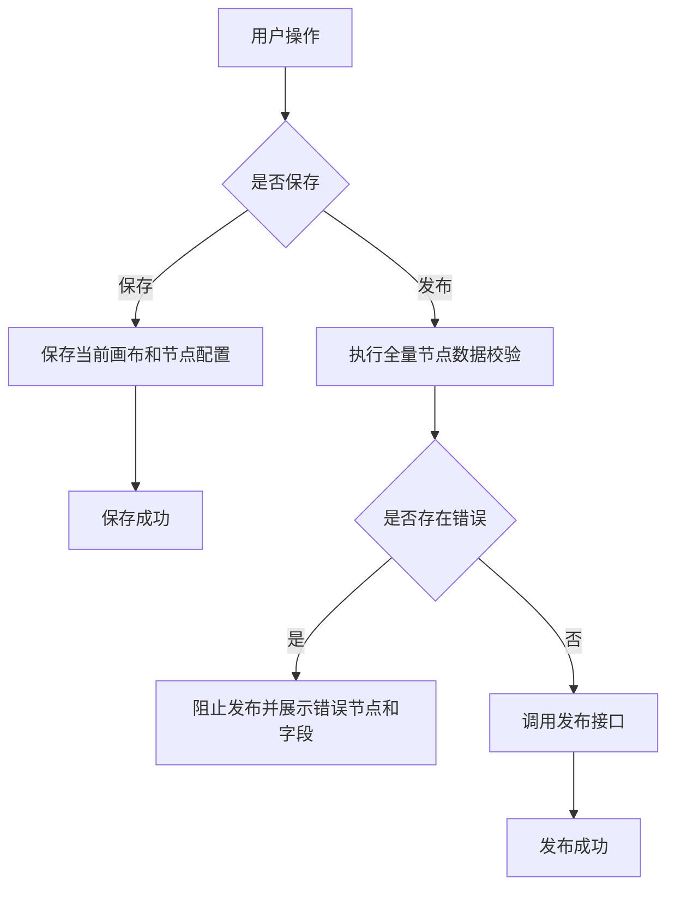

| 操作 | 校验范围 | 处理策略 |
|---|---|---|
| 保存 | 基础数据可序列化校验 | 不做节点完整性校验，允许保存未完成草稿 |
| 发布 | 节点完整性、字段必填、引用合法性、上限边界、结构完整性 | 任一节点不通过则阻止发布 |
| 调试 | 调试入参格式和接口调用参数 | 不替代发布校验；调试失败不改变版本状态 |

### 6.5 节点体系设计

| 节点类型 | 状态 | 定义与作用 | 配置入口 |
|---|---|---|---|
| 触发器节点 | 开放 | 连接流入口，定义 HTTP 请求触发方式和入参 | 节点配置弹窗 |
| 连接器节点 | 开放 | 调用连接器动作，支持版本选择、入参映射、认证参数和超时时间 | 节点配置弹窗 |
| 数据处理节点 | 开放 | 对上游参数进行转换、组装和处理后输出给下游节点 | 节点配置弹窗 |
| 数据输出节点 | 开放 | 定义连接流最终响应结构 | 节点配置弹窗 |
| 错误处理节点 | 开放 | 定义异常处理策略 | 节点配置弹窗 |
| 并行节点 | 开放 | 定义多分支并行执行结构 | 节点配置弹窗 |
| 文本节点 | 开放 | 用于画布说明、分支提示或结束占位 | 节点配置弹窗 |
| 循环节点 | 预留 | 定义重复执行逻辑 | 本期不开放 |
| 条件节点 | 预留 | 定义条件分支逻辑 | 本期不开放 |

#### 6.5.1 触发器节点交互流程

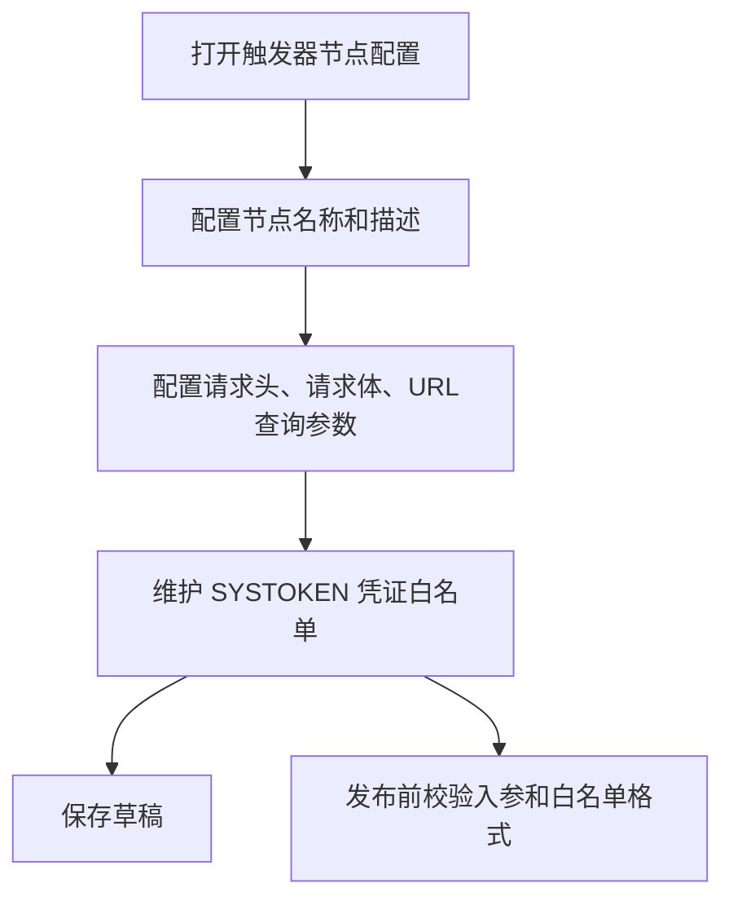

#### 6.5.2 连接器节点交互流程

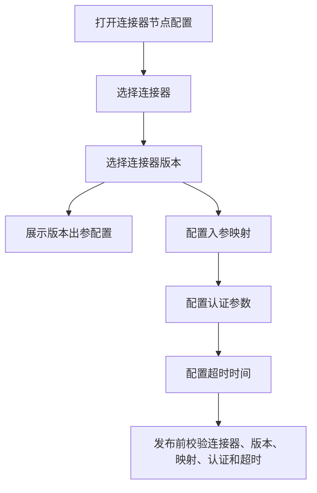

#### 6.5.3 数据处理节点交互流程

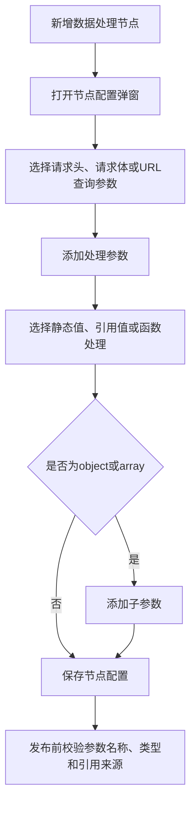

#### 6.5.4 数据输出节点交互流程

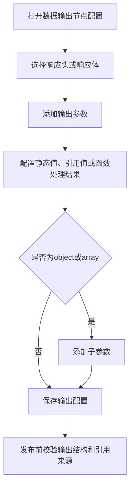

#### 6.5.5 错误处理节点交互流程

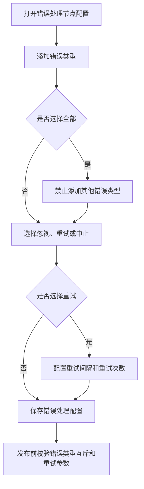

#### 6.5.6 并行节点交互流程

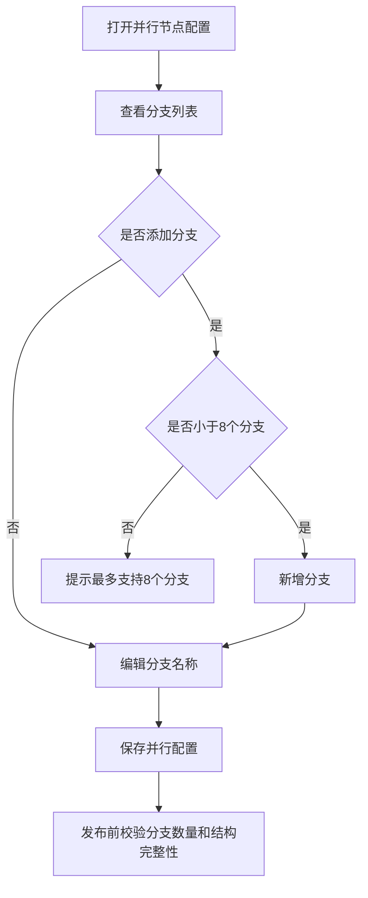

#### 6.5.7 节点添加交互与逻辑

节点添加统一从“连线加号”进入。6.5.7 只说明添加入口、交互流程和基础限制；并行节点、错误处理节点的数据结构语义见 6.5.8，添加后的节点位置处理见 6.5.9。

用户点击连线加号后，系统记录被点击连线、源节点、目标节点、插入位置和弹窗位置，再打开节点类型选择面板。确认节点类型后，系统先完成节点和连线数据更新，再触发布局刷新，不直接依赖用户点击位置作为最终展示位置。

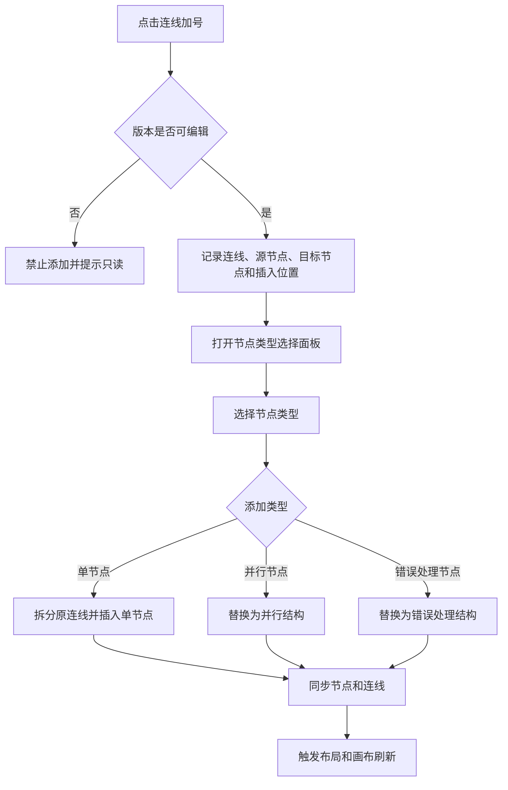

| 添加入口 | 允许添加内容 | 上下文记录 | 后续处理 |
|---|---|---|---|
| 主流程连线加号 | 单节点、并行节点、错误处理节点等可用节点 | 原源节点、原目标节点、原连线 | 新节点或结构承接原上下游关系 |
| 并行分支内部连线加号 | 单节点、允许内嵌的结构节点 | 父并行结构、当前分支、分支序号 | 新节点继承当前分支归属 |
| 错误处理右侧链路加号 | 受限制的动作节点 | 错误处理结构、右侧链路角色 | 新节点进入右侧处理链路，并受数量限制控制 |
| 错误处理跳出后连线加号 | 普通后续节点或结构节点 | 跳出节点、后续目标节点 | 从错误处理结构出口继续向下编排 |

##### 6.5.7.1 单节点插入逻辑

单节点插入时，原连线只用于定位插入上下文。节点创建后，原连线会被删除，并新增两条连线保持执行顺序不变。

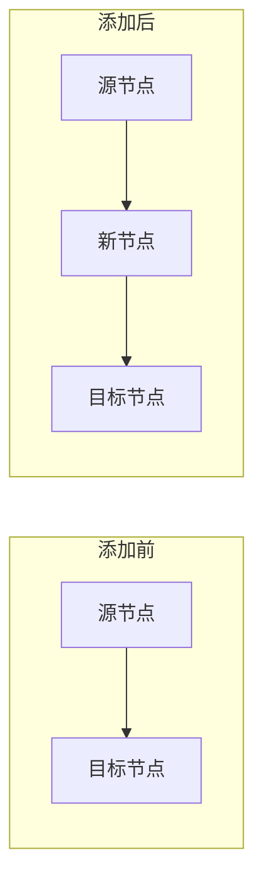

| 处理项 | 说明 |
|---|---|
| 节点创建 | 创建一个业务节点，并初始化对应节点类型的基础配置 |
| 结构继承 | 如果插入在并行分支或错误处理右侧链路中，新节点继承对应结构归属 |
| 连线替换 | 删除原连线，新增“源节点 -> 新节点”和“新节点 -> 目标节点” |
| 布局刷新 | 同步节点和连线后，统一进入 6.5.9 的布局处理流程 |

##### 6.5.7.2 结构节点插入逻辑

结构节点插入时，原连线会被一组结构节点和结构连线替换。这里不展开具体数据结构，只说明插入结果；详细节点组成和结构归属标识见 6.5.8。

| 结构类型 | 插入结果 | 原上下游处理 |
|---|---|---|
| 并行节点 | 创建并行主节点、默认分支开始/结束节点、并行合并节点和结构连线 | 上游连接并行主节点，下游连接并行合并节点 |
| 错误处理节点 | 创建错误处理主节点、区域节点、右侧开始/结束节点、跳出节点和结构连线 | 上游连接错误处理主节点，下游连接跳出节点 |

##### 6.5.7.3 添加限制和连线加号规则

节点添加需要先判断版本、连线类型和当前链路限制。加号只出现在允许继续插入业务节点的链路上，结构辅助线不展示加号。

| 规则 | 说明 |
|---|---|
| 版本限制 | 仅草稿版本允许通过连线加号添加节点 |
| 类型限制 | 节点选择面板只展示当前链路允许插入的节点类型 |
| 错误处理限制 | 错误处理右侧链路达到动作数量限制后，隐藏对应插入加号 |
| 结构辅助线 | 并行分叉线、并行汇合线、错误处理区域说明线、右侧入口线、跳出辅助线不允许插入节点 |
| 数据同步 | 新节点或结构创建后，必须一次性同步最新节点列表和连线列表 |
| 布局刷新 | 数据同步后统一触发 ELK 复合布局和结构语义位置修正 |

| 连线类型 | 是否展示加号 | 原因 |
|---|---|---|
| 普通主流程连线 | 展示 | 支持继续插入业务节点或结构节点 |
| 单节点插入后产生的新连线 | 展示 | 新链路仍属于可编辑执行链路 |
| 并行主节点到分支开始节点 | 隐藏 | 只表达并行分叉关系 |
| 并行分支开始节点到分支结束节点 | 展示 | 属于分支内部可编辑主链路 |
| 并行分支结束节点到合并节点 | 隐藏 | 只表达分支汇合关系 |
| 错误处理主节点到区域文本 | 隐藏 | 只表达错误处理区域说明 |
| 错误处理主节点到右侧开始节点 | 隐藏 | 只表达右侧处理链路入口 |
| 错误处理开始节点到结束节点 | 展示或动态隐藏 | 未达到动作数量限制时允许插入 |
| 错误处理结束节点到跳出节点 | 隐藏 | 只表达错误处理结构跳出关系 |
| 错误处理跳出节点到后续节点 | 展示 | 已回到外部主流程或父分支 |

#### 6.5.8 并行节点和错误处理节点数据结构语义

并行节点和错误处理节点都不是单个孤立节点，而是由一组节点、一组连线和一组结构归属标识共同表达的复合结构。节点坐标只决定画布展示位置，不能单独表达“属于哪条分支”“是不是右侧错误处理链路”“是否是结构汇合点”等业务含义。因此，添加结构节点时必须先写入结构语义，再交给布局逻辑计算最终位置。

##### 6.5.8.1 ReactFlow nodes 和 edges 添加样例

本节只展示添加并行节点和错误处理节点时，ReactFlow 中需要新增的 `nodes` 和 `edges` 数据。示例假设原来存在一条 `node-upstream -> node-downstream` 的普通连线，添加结构节点后删除原连线，再写入下面的节点和连线。

示例中 `nodes` 的每个节点都通过 `data` 保存节点展示信息和结构语义：

- `data.label`：节点展示名称，用于画布节点标题展示，例如“并行处理节点”“分支1开始”“错误处理开始”。
- `data.type`：业务节点类型，用于配置面板、节点分类和业务逻辑判断，通常与外层 `type` 保持一致。
- `data.config`：节点业务配置和结构归属信息，用于判断节点属于哪个并行结构、哪个分支、哪个错误处理结构，以及在结构中承担什么角色。
- `data.config.parallelGroupId`：并行结构 ID，同一个并行结构下的主节点、分支开始节点、分支结束节点和合并节点使用同一个值。
- `data.config.parallelRole`：并行结构角色，`root` 表示并行主节点，`branch-start` 表示分支开始节点，`branch-end` 表示分支结束节点，`merge` 表示并行合并节点。
- `data.config.parallelBranchId`：并行分支 ID，用于标识当前节点属于哪条分支。
- `data.config.parallelBranchIndex`：并行分支序号，用于分支排序和布局修正。
- `data.config.loopV2GroupId`：错误处理结构 ID，同一个错误处理结构下的主节点、区域节点、开始节点、结束节点和跳出节点使用同一个值。
- `data.config.loopV2Role`：错误处理结构角色，`region` 表示错误处理区域说明节点，`start` 表示右侧处理链路开始节点，`end` 表示右侧处理链路结束节点，`break` 表示错误处理跳出节点。

示例中 `edges` 的每条连线都通过 `data` 保存连线交互信息：

- `data.hideInsertButton`：是否隐藏连线上的添加按钮。`false` 表示这条连线可以继续添加节点，`true` 表示这条连线只表达结构分叉、汇合或收束关系，不允许用户在该连线上插入节点。

###### 6.5.8.1.1 添加并行节点

```js
// 添加并行节点时新增的 ReactFlow nodes
const nodes = [
  {
    id: 'parallel-1',
    type: 'parallel',
    position: { x: 0, y: 0 },
    data: {
      label: '并行处理节点',
      type: 'parallel',
      config: {
        parallelGroupId: 'parallel-1',
        parallelRole: 'root'
      }
    }
  },
  {
    id: 'branch-1-start',
    type: 'text',
    position: { x: -180, y: 120 },
    data: {
      label: '分支1开始',
      type: 'text',
      config: {
        parallelGroupId: 'parallel-1',
        parallelRole: 'branch-start',
        parallelBranchId: 'branch-1',
        parallelBranchIndex: 1
      }
    }
  },
  {
    id: 'branch-1-end',
    type: 'text',
    position: { x: -180, y: 260 },
    data: {
      label: '分支1结束',
      type: 'text',
      config: {
        parallelGroupId: 'parallel-1',
        parallelRole: 'branch-end',
        parallelBranchId: 'branch-1',
        parallelBranchIndex: 1
      }
    }
  },
  {
    id: 'branch-2-start',
    type: 'text',
    position: { x: 180, y: 120 },
    data: {
      label: '分支2开始',
      type: 'text',
      config: {
        parallelGroupId: 'parallel-1',
        parallelRole: 'branch-start',
        parallelBranchId: 'branch-2',
        parallelBranchIndex: 2
      }
    }
  },
  {
    id: 'branch-2-end',
    type: 'text',
    position: { x: 180, y: 260 },
    data: {
      label: '分支2结束',
      type: 'text',
      config: {
        parallelGroupId: 'parallel-1',
        parallelRole: 'branch-end',
        parallelBranchId: 'branch-2',
        parallelBranchIndex: 2
      }
    }
  },
  {
    id: 'parallel-merge-1',
    type: 'text',
    position: { x: 0, y: 400 },
    data: {
      label: '并行合并',
      type: 'text',
      config: {
        parallelGroupId: 'parallel-1',
        parallelRole: 'merge'
      }
    }
  }
];

// 添加并行节点时新增的 ReactFlow edges
const edges = [
  {
    id: 'edge-upstream-parallel',
    source: 'node-upstream',
    target: 'parallel-1',
    type: 'insert',
    data: {
      hideInsertButton: false
    }
  },
  {
    id: 'edge-parallel-branch-1-start',
    source: 'parallel-1',
    target: 'branch-1-start',
    type: 'insert',
    data: {
      hideInsertButton: true
    }
  },
  {
    id: 'edge-branch-1-main',
    source: 'branch-1-start',
    target: 'branch-1-end',
    type: 'insert',
    data: {
      hideInsertButton: false
    }
  },
  {
    id: 'edge-branch-1-merge',
    source: 'branch-1-end',
    target: 'parallel-merge-1',
    type: 'insert',
    data: {
      hideInsertButton: true
    }
  },
  {
    id: 'edge-parallel-branch-2-start',
    source: 'parallel-1',
    target: 'branch-2-start',
    type: 'insert',
    data: {
      hideInsertButton: true
    }
  },
  {
    id: 'edge-branch-2-main',
    source: 'branch-2-start',
    target: 'branch-2-end',
    type: 'insert',
    data: {
      hideInsertButton: false
    }
  },
  {
    id: 'edge-branch-2-merge',
    source: 'branch-2-end',
    target: 'parallel-merge-1',
    type: 'insert',
    data: {
      hideInsertButton: true
    }
  },
  {
    id: 'edge-merge-downstream',
    source: 'parallel-merge-1',
    target: 'node-downstream',
    type: 'insert',
    data: {
      hideInsertButton: false
    }
  }
];
```

###### 6.5.8.1.2 添加错误处理节点

```js
// 添加错误处理节点时新增的 ReactFlow nodes
const nodes = [
  {
    id: 'error-1',
    type: 'error-handler',
    position: { x: 0, y: 0 },
    data: {
      label: '错误处理节点',
      type: 'error-handler',
      config: {
        loopV2GroupId: 'error-1'
      }
    }
  },
  {
    id: 'error-region-1',
    type: 'text',
    position: { x: -180, y: 140 },
    data: {
      label: '错误处理区域',
      type: 'text',
      config: {
        loopV2GroupId: 'error-1',
        loopV2Role: 'region'
      }
    }
  },
  {
    id: 'error-start-1',
    type: 'text',
    position: { x: 180, y: 140 },
    data: {
      label: '错误处理开始',
      type: 'text',
      config: {
        loopV2GroupId: 'error-1',
        loopV2Role: 'start'
      }
    }
  },
  {
    id: 'error-end-1',
    type: 'text',
    position: { x: 180, y: 280 },
    data: {
      label: '错误处理结束',
      type: 'text',
      config: {
        loopV2GroupId: 'error-1',
        loopV2Role: 'end'
      }
    }
  },
  {
    id: 'error-break-1',
    type: 'text',
    position: { x: 0, y: 420 },
    data: {
      label: '错误处理跳出',
      type: 'text',
      config: {
        loopV2GroupId: 'error-1',
        loopV2Role: 'break'
      }
    }
  }
];

// 添加错误处理节点时新增的 ReactFlow edges
const edges = [
  {
    id: 'edge-upstream-error',
    source: 'node-upstream',
    target: 'error-1',
    type: 'insert',
    data: {
      hideInsertButton: false
    }
  },
  {
    id: 'edge-error-region',
    source: 'error-1',
    target: 'error-region-1',
    type: 'insert',
    data: {
      hideInsertButton: true
    }
  },
  {
    id: 'edge-region-break',
    source: 'error-region-1',
    target: 'error-break-1',
    type: 'insert',
    data: {
      hideInsertButton: true
    }
  },
  {
    id: 'edge-error-start',
    source: 'error-1',
    target: 'error-start-1',
    type: 'insert',
    data: {
      hideInsertButton: true
    }
  },
  {
    id: 'edge-start-end',
    source: 'error-start-1',
    target: 'error-end-1',
    type: 'insert',
    data: {
      hideInsertButton: false
    }
  },
  {
    id: 'edge-end-break',
    source: 'error-end-1',
    target: 'error-break-1',
    type: 'insert',
    data: {
      hideInsertButton: true
    }
  },
  {
    id: 'edge-break-downstream',
    source: 'error-break-1',
    target: 'node-downstream',
    type: 'insert',
    data: {
      hideInsertButton: false
    }
  }
];
```

##### 6.5.8.2 并行节点结构语义

并行节点用于把一条执行链路拆成多条分支，再在分支执行完成后汇合回原链路。默认添加并行节点时创建两条分支；后续通过并行节点配置继续追加分支。并行结构的核心语义是“分支之间横向并列，分支内部纵向执行，最后统一回到合并节点”。

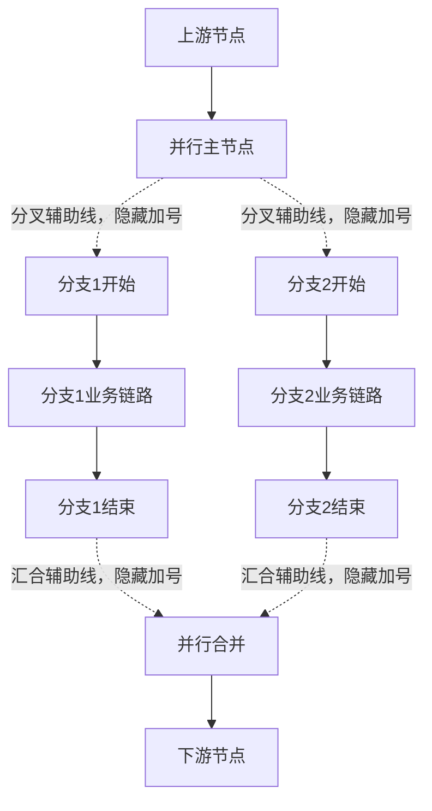

| 数据组成 | 创建内容 | 结构语义 | 位置语义 |
|---|---|---|---|
| 主节点 | 并行主节点 | 表示进入并行结构，承接原连线的上游 | 对齐当前主流程轴或父分支轴 |
| 分支开始节点 | 每条分支一个开始文本节点 | 表示一条分支的入口 | 按分支序号从左到右排列 |
| 分支结束节点 | 每条分支一个结束文本节点 | 表示一条分支的出口 | 与对应分支开始节点保持同一分支轴 |
| 合并节点 | 一个并行合并文本节点 | 表示所有分支执行完成后回到原链路 | 回到并行结构主轴 |
| 分支内部业务节点 | 用户在分支开始和结束之间插入的节点 | 表示某条分支内的实际执行内容 | 继承所在分支轴，并按连线顺序纵向排列 |

| 语义标识 | 记录对象 | 作用 |
|---|---|---|
| 并行结构 ID | 并行主节点、分支开始、分支结束、合并节点 | 判断这些节点属于同一个并行结构 |
| 分支 ID | 分支开始、分支结束、分支内部业务节点 | 判断节点属于哪一条分支 |
| 分支序号 | 分支开始、分支结束、分支内部业务节点 | 决定分支从左到右的展示顺序 |
| 父分支标识 | 插入在外层并行分支内的内嵌结构 | 判断整个内嵌结构属于外层哪条分支 |

并行结构中的连线分为可插入链路和结构辅助线。分叉线和汇合线只表达并行结构关系，不承载业务动作，必须隐藏加号；分支开始到分支结束之间才是可编辑的分支业务链路。

##### 6.5.8.3 错误处理节点结构语义

错误处理节点复用循环类结构的节点组织方式，但业务语义不同。它表示当主流程进入错误处理区域后，右侧链路执行错误处理动作，处理完成后通过跳出节点回到原主流程或父分支。当前错误处理右侧链路最多允许添加一个动作节点，达到限制后隐藏对应插入加号。

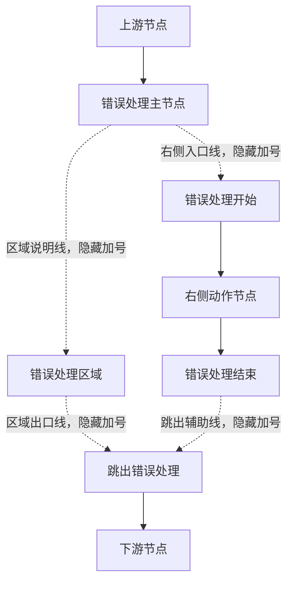

| 数据组成 | 创建内容 | 结构语义 | 位置语义 |
|---|---|---|---|
| 主节点 | 错误处理主节点 | 表示进入错误处理结构，承接原连线上游 | 对齐当前主流程轴或父分支轴 |
| 区域文本节点 | 错误处理区域 | 表达左侧错误处理区域说明 | 固定在结构主轴左侧 |
| 开始文本节点 | 错误处理开始 | 表示右侧处理链路入口 | 固定在结构主轴右侧 |
| 右侧动作节点 | 用户插入的连接器或数据处理节点 | 表示错误处理时执行的动作 | 对齐右侧处理链路轴 |
| 结束文本节点 | 错误处理结束 | 表示右侧处理链路出口 | 对齐右侧处理链路轴，并位于动作节点之后 |
| 跳出文本节点 | 错误处理跳出 | 表示错误处理结构结束并回到外部链路 | 回到结构主轴，位于左侧区域和右侧链路之后 |

| 语义标识 | 记录对象 | 作用 |
|---|---|---|
| 错误处理结构 ID | 主节点、区域、开始、结束、跳出节点 | 判断这些节点属于同一个错误处理结构 |
| 右侧链路角色 | 右侧动作节点、内嵌在右侧链路中的节点 | 判断节点属于错误处理右侧执行链路 |
| 跳出角色 | 跳出文本节点 | 判断结构出口，后续节点从这里继续连接 |
| 父分支标识 | 插入在并行分支中的错误处理结构 | 判断错误处理结构结束后回到哪条父分支 |

错误处理结构中的区域说明线、右侧入口线和跳出辅助线都不是业务插入点，应隐藏加号。只有错误处理开始到错误处理结束之间的右侧动作链路可以插入动作节点，并受数量限制控制。

##### 6.5.8.4 结构归属标识为什么不能省略

结构归属标识是后续布局、删除、校验、加号展示和分支增删的共同依据。如果只依赖节点坐标，系统无法稳定判断节点属于哪条分支，也无法判断内嵌结构应该随哪个父结构移动。

| 使用场景 | 依赖的结构语义 | 不记录时的影响 |
|---|---|---|
| 布局修正 | 结构 ID、分支 ID、右侧链路角色 | 分支轴、错误处理左右列、合并点和跳出点无法稳定还原 |
| 新增节点 | 父分支标识、右侧链路角色 | 新节点可能插入到错误的主流程或错误的分支中 |
| 删除结构 | 结构 ID、父结构 ID | 级联删除时可能漏删内部节点，或误删其他结构节点 |
| 新增/删除并行分支 | 分支 ID、分支序号 | 分支顺序无法连续维护，分支内部节点可能被错误移动 |
| 连线加号控制 | 连线辅助语义、右侧动作数量限制 | 结构辅助线可能被误插入业务节点，破坏结构完整性 |

#### 6.5.9 添加后布局处理实现思路

添加节点后不在前端手动递归收集所有后续节点并整体下移，而是采用“更新节点和连线数据 -> ELK 复合布局 -> 结构语义位置修正 -> 连线重新渲染”的顺序。这样做的原因是：手动下移只能处理局部链路，无法稳定处理并行、错误处理和多层内嵌结构；ELK 可以先解决全局层级和避让，语义修正再把业务结构恢复到产品定义的位置关系。

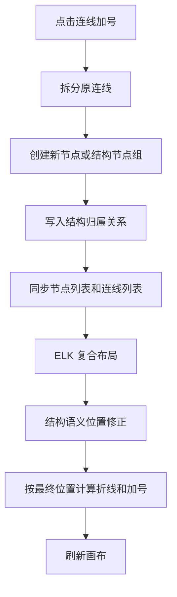

##### 6.5.9.1 ELK 和结构语义位置修正的职责边界

ELK 和结构语义位置修正解决的是两类不同问题。ELK 负责“图怎么整体排开”，结构语义修正负责“业务结构应该长什么样”。两者组合使用，才能同时满足全局避让和业务可读性。


| 阶段 | 解决的问题 | 为什么要用 | 什么时候用 | 怎么用 |
|---|---|---|---|---|
| ELK 复合布局 | 全局分层、节点避让、复合结构占位、减少连线交叉 | 新增结构后，外部节点需要知道结构整体占了多大空间 | 节点和连线数据同步之后，语义修正之前 | 把真实节点和结构虚拟容器转换成 ELK 复合图，读取 ELK 返回坐标 |
| 结构语义位置修正 | 主流程主轴、并行分支轴、错误处理左右列、合并点和跳出点 | ELK 不理解产品语义，不能保证分支顺序和错误处理列关系 | ELK 返回基础坐标之后，画布渲染之前 | 根据结构归属标识重新计算结构内部和内嵌结构的 X/Y |
| 连线折线与加号渲染 | 分叉、汇合、折线、加号位置 | 节点最终位置确定后，连线才能准确表达流向和可插入点 | 语义修正之后，连线组件渲染时 | 根据最终节点位置、同源出边和同目标入边计算连线路径 |

##### 6.5.9.2 添加节点时的位置处理总原则

所有添加场景都遵循同一套处理顺序：先保证数据语义正确，再计算位置。初始 position 只作为新节点进入布局前的参考坐标，最终展示位置以 ELK 和结构语义修正后的结果为准。

| 处理对象 | 处理原则 | 说明 |
|---|---|---|
| 新增单节点 | 插入原源节点和目标节点之间 | 如果在主流程中，后续回到主流程轴；如果在分支中，继承当前分支轴 |
| 新增并行结构 | 主节点承接上游，合并节点承接下游 | 分支按分支序号横向展开，合并节点回到结构主轴 |
| 新增错误处理结构 | 主节点承接上游，跳出节点承接下游 | 左侧区域、右侧链路和跳出点按固定结构语义排列 |
| 当前链路后续节点 | 不手动整体下移 | 由 ELK 重新分层，再由语义修正按链路顺序压缩纵向间距 |
| 其他分支 | 不直接改业务归属 | 仅在当前分支占位变大时，由父并行结构重新计算分支轴并整体避让 |
| 内嵌结构 | 把所在分支轴作为局部主轴 | 内嵌并行继续向右展开，内嵌错误处理围绕局部主轴左右展开 |

##### 6.5.9.3 典型添加场景下的位置变化

| 添加场景 | 新增节点或结构的位置处理 | 当前链路后续节点处理 | 其他节点或分支处理 |
|---|---|---|---|
| 主流程添加单节点 | 新节点最终对齐主流程主轴 | 原目标节点和后续主流程节点排在新节点之后 | 其他结构只参与全局避让，不改变自身业务归属 |
| 主流程添加并行节点 | 并行主节点和合并节点对齐主流程主轴，分支横向展开 | 原目标节点从合并节点之后继续向下 | 并行结构整体占位变大时，外部节点避让该结构 |
| 主流程添加错误处理节点 | 错误处理主节点和跳出节点对齐主流程主轴，左右列展开 | 原目标节点从跳出节点之后继续向下 | 后续主流程节点可能因错误处理结构高度增加而下移 |
| 并行分支内添加单节点 | 新节点继承父并行结构和当前分支，最终对齐当前分支轴 | 当前分支后续节点按连线顺序继续向下 | 合并节点 Y 可能跟随最长分支下移 |
| 并行分支内添加并行节点 | 内嵌并行以当前分支轴为局部主轴，内部分支向右展开 | 当前分支后续节点从内嵌合并节点之后继续 | 当前分支占位变宽时，父并行中后续分支可能右移 |
| 并行分支内添加错误处理节点 | 错误处理结构以当前分支轴为局部主轴，左右列展开 | 当前分支后续节点从跳出节点之后继续 | 当前分支左右占位变大时，父并行重新计算分支间距 |
| 错误处理右侧链路添加单节点 | 新节点继承右侧链路角色，最终对齐右侧处理轴 | 错误处理结束节点移动到动作节点之后 | 跳出节点取左侧区域和右侧链路的较低位置之后再回主轴 |
| 内嵌结构继续添加节点 | 按所在内嵌分支或右侧链路的局部轴处理 | 当前内嵌链路继续纵向排列 | 占位逐级暴露给父结构，父结构再决定是否避让 |

##### 6.5.9.4 结构语义位置修正规则

结构语义位置修正只接管结构相关的业务坐标，不替代 ELK 的全局布局能力。它基于 ELK 的基础坐标和结构归属标识，把并行、错误处理和内嵌结构修正为稳定的业务形态。

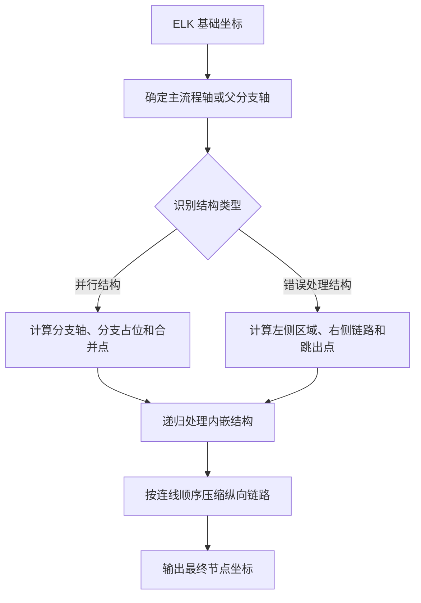

修正计算逻辑大致如下：

1. 先以 ELK 返回的坐标作为基础坐标，读取触发器或结束节点的中心点作为主流程中心线。节点最终 X 坐标不是直接使用中心点，而是用“目标中心线 - 节点宽度 / 2”得到节点左上角 X 坐标。
2. 主流程上的并行主节点、错误处理主节点优先对齐主流程中心线；如果结构在并行分支内或错误处理右侧链路内，则使用父分支轴或父右侧链路轴作为局部中心线。
3. 并行结构的分支 X 轴根据分支顺序和分支占位计算。第一条分支默认从结构主轴开始，后续分支按“上一分支右侧占位 + 当前分支左侧占位 + 安全间距”向右累加；分支内普通节点和内嵌结构都对齐到所属分支轴；合并节点重新回到并行结构主轴。
4. 错误处理结构的 X 轴根据结构主轴左右偏移计算。主节点和跳出节点对齐结构主轴；区域说明节点对齐“结构主轴 - 右侧列偏移”；开始、动作、结束节点对齐“结构主轴 + 右侧列偏移”。
5. Y 轴先保留 ELK 的整体层级结果，再按结构语义局部压缩。并行分支开始节点取所有分支开始节点中最靠上的 Y 并统一对齐；分支首个业务节点位于分支开始节点下方固定间距；分支内后续节点按连线顺序，用“上一个节点底部 Y + 分支节点间距”计算；合并节点位于所有分支结束节点底部之后固定间距。
6. 错误处理结构的 Y 轴从结构主节点下方固定间距开始：区域说明节点和开始节点位于同一行；右侧链路按连线顺序依次向下排列；跳出节点位于左侧区域底部和右侧链路底部两者的最大值之后固定间距。
7. 如果被移动的是并行或错误处理等复合结构，计算目标 Y 后会得到一个纵向偏移量，并把结构主节点和其内部节点整体平移，避免只移动主节点导致内部节点散开。

| 修正对象 | 修正规则 | 作用 |
|---|---|---|
| 主流程主轴 | 主流程中的普通节点、并行主节点、错误处理主节点优先回到主流程中心线 | 保持主流程从上到下稳定可读 |
| 并行分支轴 | 分支 1 使用结构主轴，后续分支按前一分支右侧占位、当前分支左侧占位和安全间距向右累加 | 保证分支顺序稳定，避免内嵌结构覆盖后续分支 |
| 并行合并点 | X 回到并行结构主轴，Y 位于所有分支结束节点之后 | 保证并行执行完成后回到原链路 |
| 错误处理左侧列 | 区域文本固定在错误处理主轴左侧 | 保证区域说明和右侧动作链路不混淆 |
| 错误处理右侧列 | 开始、动作、结束节点固定在错误处理主轴右侧同一列 | 保证错误处理动作链路清晰纵向排列 |
| 错误处理跳出点 | X 回到错误处理主轴，Y 位于左侧区域和右侧链路之后 | 保证错误处理完成后回到主流程或父分支 |
| 内嵌结构 | 以所在分支轴或右侧链路轴作为局部主轴递归处理 | 保证多层结构仍能保持局部语义 |
| 纵向链路 | 按连线顺序依次向下排列 | 避免同一链路内部出现过大空隙或顺序错乱 |

##### 6.5.9.5 不使用 ELK 或不使用结构语义修正的影响

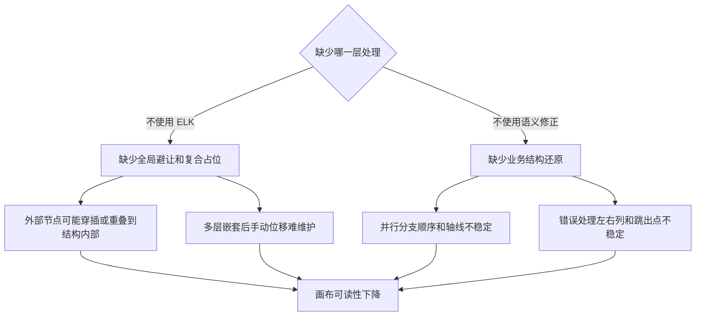

| 缺失内容 | 可能问题 | 影响 |
|---|---|---|
| 不使用 ELK | 新增节点后缺少全局层级重排，结构与外部节点容易重叠 | 画布整体避让不足，复杂流程难以阅读 |
| 不使用 ELK 复合容器 | 并行、错误处理、内嵌结构不能作为整体预留空间 | 外部主流程节点可能穿插到结构内部 |
| 不使用结构语义修正 | 并行分支可能左右错位，合并点不回主轴，错误处理左右列不稳定 | 用户难以判断执行方向和结构边界 |
| 不做纵向链路压缩 | 分支内部或错误处理右侧链路间距过大、顺序不紧凑 | 画布高度膨胀，阅读和操作成本增加 |
| 不结合连线加号规则 | 结构辅助连线可能被误插入业务节点 | 结构完整性被破坏，删除、校验和发布逻辑变复杂 |

因此，添加后的布局策略应以当前实现为准：不在 ELK 前手动移动后续节点；所有节点先通过结构语义进入正确的业务关系，再由 ELK 完成全局布局，最后由结构语义位置修正恢复主轴、分支轴、左右列、合并点和跳出点。

#### 6.5.10 节点删除交互与逻辑

节点删除参考 elkjs 示例项目中的删除和重连模式。用户点击节点删除入口后，系统先判断节点是否允许删除，再根据单节点或结构节点执行不同删除策略。删除完成后刷新节点、连线并重新执行自动布局。

| 删除对象 | 删除策略 | 重连策略 |
|---|---|---|
| 触发器节点 | 不允许删除 | 不处理 |
| 结束节点 | 不允许删除 | 不处理 |
| 单节点 | 删除当前节点和与其相连的入边、出边 | 若存在前置节点和后置节点，新增前置节点到后置节点的连线 |
| 数据处理节点 | 按单节点删除，同时移除下游引用校验中的来源 | 若存在前置节点和后置节点，新增前置节点到后置节点的连线 |
| 并行节点 | 级联删除并行主节点、分支节点、分支内部节点和汇合节点 | 若结构前后存在节点，重连结构前置节点和后置节点 |
| 错误处理节点 | 级联删除错误处理主节点、结构说明节点和右侧链路节点 | 若结构前后存在节点，重连结构前置节点和后置节点 |

节点删除需要遵循以下规则：

| 规则 | 说明 |
|---|---|
| 版本限制 | 仅草稿版本允许删除节点 |
| 禁删节点 | 触发器和结束节点不可删除 |
| 关联收集 | 删除结构节点时递归收集结构子节点、分支节点、结构内部插入节点 |
| 自动重连 | 删除节点后若存在明确前后节点，需要自动补齐连线 |
| 引用处理 | 删除节点后，下游引用该节点出参的配置在发布校验时提示引用失效 |
| 自动布局 | 删除后统一刷新节点和连线，再触发自动布局和画布自适应 |

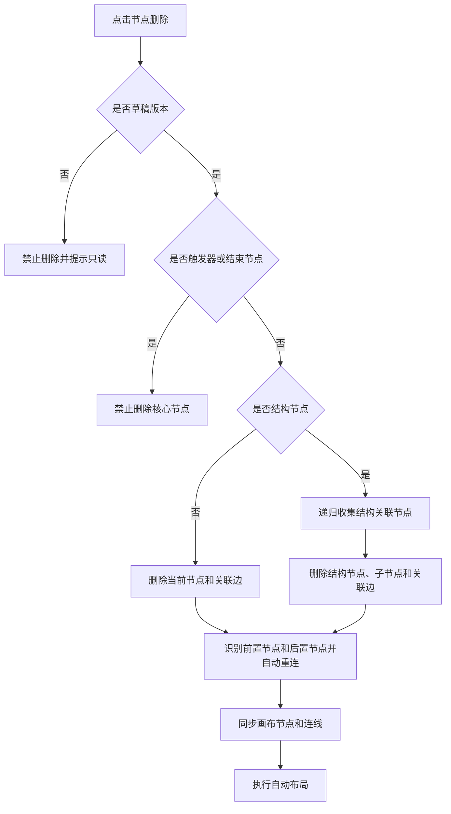

单节点删除后，系统根据入边和出边恢复前后节点的直接连线。


结构节点删除需要先递归收集所有关联节点，避免删除后残留孤立节点或孤立连线。

```mermaid
flowchart TD
  DeleteStructure[删除结构主节点] --> CollectMain[加入主节点]
  CollectMain --> CollectChildren[收集结构子节点]
  CollectChildren --> CollectBranch[收集分支节点]
  CollectBranch --> CollectInner[收集结构内部插入节点]
  CollectInner --> HasMore{是否发现新的关联节点}
  HasMore -->|是| CollectChildren
  HasMore -->|否| RemoveAll[删除全部关联节点和关联连线]
  RemoveAll --> ReconnectOuter[重连结构外部前后节点]
```

### 6.6 触发器节点配置

触发器节点配置弹窗新增 SYSTOKEN 凭证白名单。用户可添加多个 SYSTOKEN 凭证，用于限制允许触发当前连接流的系统凭证范围。

| 配置项 | 说明 | 是否必填 | 编辑状态 |
|---|---|---|---|
| 节点名称 | 触发器节点展示名称 | 发布时必填 | 草稿可编辑 |
| 入参配置 | HTTP 请求头、请求体、URL 查询参数 | 发布时按规则校验 | 草稿可编辑 |
| SYSTOKEN 凭证白名单 | 可添加多个 SYSTOKEN 凭证 | 非必填，若添加则校验格式 | 草稿可编辑 |

### 6.7 连接器节点配置

连接器节点配置弹窗新增连接器版本列表。选择不同版本后，展示对应版本的出参配置，并用于下游参数引用。连接器节点同时支持超时时间配置，默认上限为 3 秒，可通过接口获取当前应用下配置；接口返回值不为 3 秒时，以接口返回值作为上限。

| 配置项 | 说明 | 默认值或来源 | 校验策略 |
|---|---|---|---|
| 连接器 | 当前节点调用的连接器 | 用户选择 | 发布时必选 |
| 连接器版本 | 当前连接器的具体版本 | 连接器版本接口 | 发布时必选 |
| 版本出参 | 所选连接器版本对应的出参结构 | 连接器版本详情接口 | 切换版本后刷新展示 |
| 入参映射 | 连接器调用入参 | 用户配置 | 发布时校验引用来源合法 |
| 认证参数 | SOA、APIG、Cookie、数字签名等认证参数 | 连接器配置页同步 | 发布时校验必填项 |
| 超时时间 | 连接器调用超时时间 | 默认上限 3 秒，应用接口可覆盖 | 发布时校验不超过当前应用上限 |

```mermaid
flowchart LR
  SelectConnector[选择连接器] --> LoadConnectorVersions[获取连接器版本列表]
  LoadConnectorVersions --> SelectConnectorVersion[选择连接器版本]
  SelectConnectorVersion --> LoadOutput[加载版本出参配置]
  SelectConnectorVersion --> Mapping[配置入参映射]
  AppConfig[应用级配置接口] --> TimeoutLimit[获取超时时间上限]
  TimeoutLimit --> TimeoutInput[校验超时时间]
```

### 6.8 数据处理节点配置

数据处理节点可拖拽到画布上，点击后打开数据处理节点配置弹窗。数据处理节点用于对上游参数进行转换、组装或计算，并将处理后的结果提供给下游节点引用。

| 配置项 | 说明 | 校验策略 |
|---|---|---|
| 节点名称 | 数据处理节点展示名称 | 发布时必填 |
| 参数名称 | 输出参数名称 | 发布时必填，且同级唯一 |
| 参数值 | 静态值、引用值或处理结果 | 发布时按来源类型校验 |
| 参数类型 | object、array、string、number、boolean | 可选；object 和 array 支持子参数 |
| 参数描述 | 参数说明 | 可选 |
| 子参数 | object 或 array 类型下的子节点 | 父节点删除时级联删除 |

#### 6.8.1 函数引用处理思路

数据处理节点的核心能力是把上游数据转换为下游可直接使用的出参。参数值除静态值和节点引用外，还需要支持函数引用。函数引用用于完成字段拼接、格式转换、默认值兜底、数组取值、对象提取、条件判断等处理场景。

| 值来源 | 使用场景 | 配置方式 | 输出结果 |
|---|---|---|---|
| 静态值 | 固定常量、默认值 | 用户直接输入参数值 | 原样作为当前参数输出 |
| 节点引用 | 使用触发器或上游节点出参 | 选择节点、参数路径和引用字段 | 将引用值作为当前参数输出 |
| 函数引用 | 对一个或多个来源值做处理 | 选择函数，绑定函数入参，配置返回类型 | 将函数执行结果作为当前参数输出 |

函数引用配置由“函数选择、入参绑定、返回结果映射、发布校验”四部分组成。

| 配置步骤 | 说明 |
|---|---|
| 选择函数 | 从函数列表中选择处理函数，函数需要展示名称、描述、入参要求和返回类型 |
| 绑定入参 | 每个函数入参可绑定静态值、触发器入参、上游节点出参或当前数据处理节点已配置的同级前置参数 |
| 配置返回类型 | 当前参数类型需与函数返回类型一致，或满足可兼容转换规则 |
| 保存草稿 | 保存时仅记录函数引用配置，不校验函数入参完整性 |
| 发布校验 | 发布时校验函数是否存在、必填入参是否绑定、引用来源是否存在、返回类型是否兼容 |

```mermaid
flowchart TD
  OpenDataProcess[打开数据处理节点配置] --> AddParam[添加参数]
  AddParam --> ChooseValueSource{选择参数值来源}
  ChooseValueSource -->|静态值| InputStatic[输入固定值]
  ChooseValueSource -->|节点引用| SelectReference[选择上游节点和参数路径]
  ChooseValueSource -->|函数引用| SelectFunction[选择处理函数]
  SelectFunction --> LoadFunctionMeta[读取函数入参和返回类型]
  LoadFunctionMeta --> BindInputs[绑定函数入参来源]
  BindInputs --> CheckReturn[匹配当前参数类型和函数返回类型]
  InputStatic --> SaveParam[保存参数配置]
  SelectReference --> SaveParam
  CheckReturn --> SaveParam
  SaveParam --> PublishValidate[发布时统一校验完整性]
```

函数引用的数据流以“输入来源集合 -> 函数处理 -> 参数输出 -> 下游引用”为主线。函数本身不直接改变上游节点数据，只生成当前数据处理节点的出参。

```mermaid
flowchart LR
  TriggerInput[触发器入参] --> FunctionInput[函数入参绑定]
  UpstreamOutput[上游节点出参] --> FunctionInput
  StaticValue[静态值] --> FunctionInput
  FunctionInput --> FunctionExec[函数处理]
  FunctionExec --> DataProcessOutput[数据处理节点出参]
  DataProcessOutput --> DownstreamMapping[下游节点入参映射]
```

#### 6.8.2 函数引用交互逻辑

用户在参数配置项中选择“函数引用”后，参数值区域切换为函数配置区域。函数配置区域需要展示函数选择框、函数说明、函数入参列表和返回结果说明。函数入参列表按函数元数据动态渲染，每个入参都可以选择值来源。

| 交互对象 | 交互说明 |
|---|---|
| 函数选择框 | 切换函数后刷新入参列表和返回类型；已绑定的旧入参不再匹配时需要清空 |
| 函数说明 | 展示函数用途、入参说明、返回类型和示例说明 |
| 入参来源选择 | 支持静态值、触发器入参、上游节点出参、同节点前置参数 |
| 引用路径选择 | 选择节点后按请求头、请求体、URL 查询参数或节点出参结构选择字段路径 |
| 返回类型提示 | 当前参数类型与函数返回类型不一致时展示风险提示，发布时阻断不兼容配置 |
| 删除函数引用 | 切回静态值或节点引用时，清空函数引用配置，避免残留无效配置 |

```mermaid
sequenceDiagram
  participant User as 用户
  participant Param as 参数配置项
  participant FunctionList as 函数列表
  participant ReferenceTree as 引用来源树
  participant Validator as 发布校验
  User->>Param: 参数值来源选择函数引用
  Param->>FunctionList: 加载可选函数和函数元数据
  User->>FunctionList: 选择处理函数
  FunctionList-->>Param: 返回入参列表和返回类型
  User->>Param: 为每个函数入参选择来源
  Param->>ReferenceTree: 按节点和参数结构选择引用路径
  ReferenceTree-->>Param: 返回绑定路径
  User->>Param: 保存草稿
  Param-->>Validator: 发布时提交函数引用配置
  Validator-->>User: 返回校验结果
```

#### 6.8.3 函数引用发布校验

函数引用只在发布阶段执行完整校验，保存草稿阶段允许配置不完整。校验结果需要定位到数据处理节点、参数路径、函数名称和具体函数入参。

| 校验项 | 通过条件 | 失败提示 |
|---|---|---|
| 函数存在性 | 函数 ID 在当前可用函数列表中存在 | 当前参数引用的函数不存在 |
| 必填入参 | 函数必填入参均已绑定值来源 | 函数入参未配置 |
| 引用有效性 | 绑定的节点、参数路径仍存在 | 函数入参引用来源已失效 |
| 类型兼容 | 函数返回类型与当前参数类型兼容 | 函数返回类型与参数类型不一致 |
| 循环引用 | 不引用当前参数自身或后置参数 | 函数入参存在循环引用 |

### 6.9 入参出参配置交互

节点入参、出参和数据处理参数统一按 HTTP 请求头、HTTP 请求体、URL 查询参数三个 tab 展示。每个 tab 下支持添加参数。没有参数时展示添加参数按钮；已有参数时在参数配置项上展示添加和删除按钮。

| 参数字段 | 说明 |
|---|---|
| 参数名称 | 当前参数的名称 |
| 参数值 | 静态值、引用值或函数处理结果 |
| 参数类型 | object、array、string、number、boolean，可选 |
| 参数描述 | 参数说明，可选 |
| 添加按钮 | 添加同级参数或子参数 |
| 删除按钮 | 删除当前参数；object 或 array 删除时级联删除子节点 |

object 和 array 类型支持添加子参数。此类参数的添加按钮需要提供下拉选择，区分“添加子参数”和“添加同级参数”。

### 6.10 更多配置抽屉

更多配置抽屉展示当前连接流的限流配置和缓存配置。

#### 6.10.1 限流配置

限流配置默认上限为 1000。页面进入时通过接口获取当前应用下的限流配置上限；当接口返回上限时，以接口返回值作为校验上限。接口未返回、返回为空或获取失败时，使用默认上限 1000。

| 配置项 | 说明 |
|---|---|
| 限流值 | 当前连接流允许的限流值 |
| 默认上限 | 1000 |
| 应用级上限 | 通过接口获取，可不为 1000 |
| 校验时机 | 发布时校验；更多配置保存时可做边界提示 |
| 超限提示 | 当前限流值不能超过应用配置上限 |

#### 6.10.2 缓存配置

缓存配置支持开启和关闭。开启时，需要配置缓存时间和缓存 key；缓存 key 从触发器入参配置中选择并拼接。

| 配置项 | 说明 | 校验策略 |
|---|---|---|
| 缓存开关 | 开启或关闭 | 必选 |
| 缓存时间 | 单位：秒 | 开启缓存时必填 |
| 缓存 key | 从触发器入参中选择并拼接 | 开启缓存时至少选择一个 |

```mermaid
flowchart TB
  OpenMoreConfig[打开更多配置抽屉] --> LoadLimit[读取应用限流上限]
  OpenMoreConfig --> LoadTriggerParams[读取触发器入参]
  LoadLimit --> RateLimitForm[渲染限流配置]
  LoadTriggerParams --> CacheKeyPicker[渲染缓存 Key 选择]
  RateLimitForm --> SaveMoreConfig[保存更多配置]
  CacheKeyPicker --> SaveMoreConfig
```

### 6.11 调试抽屉

点击调试按钮后，展开右侧调试抽屉。调试抽屉获取连接流触发器节点的入参配置，并展示在弹窗中。参数名称和参数类型不能编辑，用户只能为每个参数赋值。

| 区域 | 内容 | 说明 |
|---|---|---|
| 入参配置 | 触发器请求头、请求体、URL 查询参数 | 参数名称和类型只读，仅参数值可编辑 |
| 操作按钮 | 立即调试 | 点击后调用调试接口 |
| 执行输出 | 调试结果、错误信息、节点执行信息 | 接口返回后展示 |

```mermaid
sequenceDiagram
  participant User as 用户
  participant Editor as 连接流编排页面
  participant Debug as 调试抽屉
  participant Api as 调试接口
  User->>Editor: 点击调试
  Editor->>Debug: 打开抽屉并传入触发器入参
  User->>Debug: 填写参数值
  User->>Debug: 点击立即调试
  Debug->>Api: 提交调试请求
  Api-->>Debug: 返回调试结果
  Debug-->>User: 展示执行输出
```

### 6.12 节点数据校验设计

各节点均需要提供发布前校验能力。校验在发布时统一执行，保存草稿时不执行完整校验。校验结果需要包含节点 ID、节点名称、字段路径和错误信息，便于页面定位错误节点。

| 节点类型 | 发布前校验规则 |
|---|---|
| 触发器节点 | 节点名称必填；入参名称同级唯一；参数类型合法；SYSTOKEN 白名单若配置则凭证格式合法 |
| 连接器节点 | 节点名称必填；连接器必选；连接器版本必选；入参映射引用来源合法；认证参数满足当前认证方式要求；超时时间不超过应用级上限 |
| 数据处理节点 | 节点名称必填；参数名称同级唯一；参数类型合法；引用来源存在；object 和 array 子参数结构合法 |
| 数据输出节点 | 节点名称必填；响应头和响应体参数名称同级唯一；引用来源合法；输出结构可序列化 |
| 错误处理节点 | 错误类型不重复；全部类型与其他错误类型互斥；重试策略下重试间隔合法 |
| 并行节点 | 分支数量合法；分支开始和结束结构完整；每条分支存在可执行链路或明确为空分支 |
| 文本节点 | 文案可为空，不阻断发布；若作为结构节点占位，需要保留结构标识 |

```mermaid
flowchart TD
  PublishClick[点击发布] --> CollectNodes[收集所有节点]
  CollectNodes --> ValidateTrigger[校验触发器节点]
  CollectNodes --> ValidateConnector[校验连接器节点]
  CollectNodes --> ValidateDataProcess[校验数据处理节点]
  CollectNodes --> ValidateOutput[校验数据输出节点]
  CollectNodes --> ValidateStructure[校验错误处理和并行结构]
  ValidateTrigger --> MergeErrors[合并校验结果]
  ValidateConnector --> MergeErrors
  ValidateDataProcess --> MergeErrors
  ValidateOutput --> MergeErrors
  ValidateStructure --> MergeErrors
  MergeErrors --> ErrorExists{是否存在错误}
  ErrorExists -->|是| BlockPublish[阻止发布并定位错误]
  ErrorExists -->|否| SubmitPublish[提交发布]
```

### 6.13 实施顺序

1. 调整连接流编排页面顶部版本下拉和状态按钮展示。
2. 接入版本状态只读控制，限制非草稿版本画布和节点编辑能力。
3. 接入应用级配置上限接口，用于限流上限和连接器超时时间上限。
4. 改造更多配置抽屉，补充限流配置和缓存配置。
5. 改造触发器节点配置，新增 SYSTOKEN 凭证白名单。
6. 改造连接器节点配置，新增连接器版本列表和版本出参展示。
7. 新增节点添加、节点删除、结构节点级联删除和自动布局交互。
8. 新增数据处理节点和数据处理节点配置弹窗。
9. 补充数据处理节点函数引用配置、引用来源选择和发布校验。
10. 统一入参出参配置 tab 和参数增删交互。
11. 新增节点数据校验模型，并接入发布流程。
12. 调整保存流程，确保保存草稿不执行完整节点校验。
13. 接入调试抽屉和立即调试流程。
14. 补充开发自测和测试用例。

## 7 系统级非功能设计

### 7.1 FMEA 影响分析

| 风险 | 影响 | 措施 |
|---|---|---|
| 版本状态判断错误 | 非草稿版本被误编辑 | 所有编辑入口统一走版本状态判断 |
| 保存时误触发完整校验 | 草稿无法暂存 | 保存流程只做可序列化校验，不调用发布校验 |
| 发布时漏校验节点 | 运行时失败 | 发布前统一收集全部节点并执行节点类型校验 |
| 应用级配置上限获取失败 | 限流或超时校验缺少约束 | 限流使用默认上限 1000，超时时间使用默认上限 3 秒 |
| 连接器版本切换后出参未刷新 | 下游引用错误 | 选择版本后强制刷新版本出参，并提示可能影响下游映射 |
| 调试接口失败 | 用户无法定位问题 | 调试输出区展示错误信息，保留用户输入参数 |
| 非草稿更多配置误保存 | 版本配置不一致 | 更多配置保存权限由版本状态和接口权限共同控制 |

### 7.2 安全影响分析

版本发布、删除、失效、撤回等操作依赖后端鉴权。SYSTOKEN 白名单仅保存凭证标识或引用信息，不在页面展示敏感明文。调试入参仅用于当前调试请求，不改变版本状态。Cookie、SOA、APIG、数字签名等认证参数遵循连接器配置页既有安全策略。

### 7.3 兼容性

已有连接流版本和历史编排数据需要保持可加载。新增字段在旧版本中不存在时按默认空配置处理。限流上限和超时时间上限接口不可用时使用默认值，避免阻断页面基础使用。循环和条件节点继续作为预留节点，不在本期开放。

### 7.4 可运维

调试抽屉展示执行结果、错误信息和节点执行详情，便于定位配置问题。发布校验错误需要包含节点名称和字段路径，便于快速回到对应节点修复。更多配置中的限流和缓存配置需要在版本详情或运行记录中具备可追踪性。

### 7.5 测试建议

| 测试类型 | 建议覆盖内容 |
|---|---|
| 单元测试 | 版本状态按钮映射、只读判断、节点校验规则、函数引用校验、上限计算逻辑 |
| 集成测试 | 版本切换、连接器版本切换、节点添加删除、结构节点级联删除、更多配置保存、调试接口调用 |
| 端到端测试 | 草稿编辑保存、节点插入、节点删除重连、发布校验拦截、发布成功、已发布新增草稿、审批中撤回为已撤回、失效和删除 |
| 边界测试 | 限流上限非 1000、超时时间上限非 3 秒、函数引用来源失效、缓存开启未配置 key、连接器版本无出参 |

## 8 checkList

| check 点 | 是否达标 |
|---|---|
| 顶部版本下拉展示版本名称、创建时间和状态标签 | 是 |
| 切换版本后展示对应编排内容 | 是 |
| 草稿版本展示更多配置、调试、保存、发布、删除 | 是 |
| 已发布版本展示新增草稿、更多配置、调试、失效 | 是 |
| 已失效版本展示新增草稿、更多配置、调试、删除 | 是 |
| 审批中版本展示更多配置、调试、撤回 | 是 |
| 已驳回版本展示更多配置、调试、保存、删除 | 是 |
| 已撤回版本展示更多配置、调试、保存、删除 | 是 |
| 除草稿外画布不可编辑、节点内容只读 | 是 |
| 保存草稿不执行完整节点数据校验 | 是 |
| 发布版本执行完整节点数据校验 | 是 |
| 各个节点均有发布前数据校验规则 | 是 |
| 更多配置支持限流配置和缓存配置 | 是 |
| 限流配置默认上限 1000，可通过接口获取应用级上限 | 是 |
| 连接器节点超时时间默认上限 3 秒，可通过接口获取应用级上限 | 是 |
| 触发器节点支持 SYSTOKEN 凭证白名单 | 是 |
| 连接器节点支持版本列表和版本出参展示 | 是 |
| 数据处理节点可添加并打开配置弹窗 | 是 |
| 数据处理节点支持函数引用配置、函数入参绑定和发布校验 | 是 |
| 节点添加逻辑包含连线加号入口、节点类型选择、单节点插入、结构节点插入、同步节点连线和触发布局说明 | 是 |
| 单节点插入说明包含原连线删除、新增两条连线、结构归属继承和布局刷新 | 是 |
| 结构节点插入说明区分并行节点和错误处理节点，并明确原上下游承接方式 | 是 |
| ReactFlow nodes 和 edges 添加样例直接展示添加并行节点、错误处理节点时新增的 nodes 和 edges 数据，并说明 data 下各参数含义 | 是 |
| 并行和错误处理节点通过表格说明主节点、辅助节点、分支节点、合并或跳出节点、结构归属标识和位置语义 | 是 |
| 说明结构归属标识在布局修正、新增节点、删除结构、分支增删和连线加号控制中的作用 | 是 |
| 说明添加后布局不在 ELK 前手动移动后续节点，而是先同步数据，再执行 ELK 复合布局和结构语义位置修正 | 是 |
| 说明 ELK 负责全局分层、避让和复合占位，结构语义位置修正负责主轴、分支轴、左右列、合并点、跳出点以及 X/Y 轴计算逻辑 | 是 |
| 说明主流程、并行分支、错误处理右侧链路和内嵌结构中新增节点后的当前位置、后续节点和其他分支处理规则 | 是 |
| 并行节点、错误处理节点、添加后布局、ELK 与语义修正、结构语义修正规则和缺失影响均包含 Mermaid 图说明 | 是 |
| 节点删除逻辑包含单节点重连、结构节点级联删除和自动布局说明 | 是 |
| 入参出参配置按 HTTP 请求头、HTTP 请求体、URL 查询参数 tab 展示 | 是 |
| object 和 array 类型支持添加子参数 | 是 |
| 调试抽屉展示触发器入参且参数名称、类型不可编辑 | 是 |
| 立即调试后展示执行输出 | 是 |
| 文档不展示实现代码块，仅使用表格和 Mermaid 图说明 | 是 |
