# 连接流配置需求设计说明书

## 修订记录

| 版本 | 日期 | 修订内容 | 作者 |
|---|---|---|---|
| V1.0 | 2026-06-11 | 新增连接流配置整改需求设计 | - |
| V1.1 | 2026-06-12 | 补充连接流编辑器详细设计、关键实现思路、交互流程和验证点 | - |
| V1.2 | 2026-06-15 | 按连接流编排交互调整补充版本操作、更多配置、调试、节点校验、保存发布校验策略，并移除实现代码块 | - |
| V1.3 | 2026-06-15 | 补充 ELK 自动布局与业务语义布局的职责边界、并行分支间距计算原因和嵌套结构布局规则 | - |
| V1.4 | 2026-06-16 | 按 elkjs 示例项目实现修正添加后布局处理说明，明确当前实现不包含后续节点位移预处理 | - |
| V1.5 | 2026-06-16 | 补充连线加号展示与隐藏规则，说明结构辅助连线和受限链路的插入控制方式 | - |
| V1.6 | 2026-06-16 | 补充自定义连线组件、折线路径计算、多出边分叉和多入边汇合实现说明 | - |
| V1.7 | 2026-06-16 | 补充自定义连线组件不计算转折点时对分叉、汇合、加号定位和结构可读性的影响 | - |

## 目录

- 需求价值和概述
- 上下文分析
- 初始需求分析
- 需求影响分析
- 系统用例分析
- 功能设计
- 系统级非功能设计
- checkList

## 表目录

版本状态与操作、节点体系、节点添加删除、连线加号展示规则、连线组件和折线路径、结构节点布局、添加后布局处理、函数引用配置、节点校验、更多配置、调试配置、验证清单。

## 图目录

连接流编排上下文图、版本状态操作图、保存发布校验流程图、节点配置数据流图、函数引用配置流程图、函数引用数据流图、节点添加交互流程图、连线加号展示规则图、连线折线路径计算图、连线转折缺失影响图、并行节点添加布局流程图、错误处理节点添加布局流程图、ELK与语义修正流程图、添加后布局处理流程图、节点删除重连流程图、结构节点级联删除流程图、更多配置数据流图、调试流程图。

## Keywords 关键字

中文：连接流配置、连接流编辑器、版本管理、节点校验、更多配置、限流、缓存、连接器超时、数据处理、调试  
English: Flow Configuration, Flow Editor, Version Management, Node Validation, Advanced Config, Rate Limit, Cache, Connector Timeout, Data Processing, Debugging

## Abstract 摘要

中文：本文档描述连接流编排页面整改需求，覆盖版本下拉与状态操作、只读控制、更多配置、调试抽屉、触发器节点、连接器节点、数据处理节点、节点数据校验、保存与发布校验策略。文档从开发和测试视角说明功能边界、数据流、接口依赖和验证要点。  
English: This document describes flow editor requirements, including version selector, status actions, read-only control, advanced configuration, debug drawer, trigger node, connector node, data processing node, node validation, and save/publish validation strategy.

## List 偶发 abbreviations 缩略语清单

| 缩略语 | 英文全名 | 中文解释 |
|---|---|---|
| DAG | Directed Acyclic Graph | 有向无环图 |
| API | Application Programming Interface | 应用程序接口 |
| JSON | JavaScript Object Notation | JSON 数据格式 |
| SYSTOKEN | System Token | 系统令牌凭证 |

## 1 需求价值和概述

连接流编排页面需要支持按版本查看和维护连接流配置，并根据不同版本状态控制画布编辑能力、节点内容编辑能力和页面操作按钮。当前页面需要进一步补充版本切换、更多配置、调试、连接器版本选择、触发器 SYSTOKEN 白名单、数据处理节点和节点发布前校验能力。

本次整改目标如下：

| 目标 | 说明 |
|---|---|
| 版本化编排 | 顶部新增版本列表，下拉项展示版本名称、创建时间和状态标签，切换版本后展示对应编排内容 |
| 状态化操作 | 草稿、已发布、已失效、审批中、已驳回版本展示不同操作按钮，并按状态控制是否可编辑 |
| 配置能力补齐 | 更多配置抽屉支持限流和缓存配置；限流上限支持应用级接口配置，默认上限为 1000 |
| 节点能力补齐 | 触发器新增 SYSTOKEN 凭证白名单；连接器新增版本选择和超时时间；新增数据处理节点 |
| 发布前质量保障 | 保存草稿不做完整校验；发布时才执行节点数据完整性和输入合法性校验 |
| 调试闭环 | 调试抽屉展示触发器入参赋值区和执行输出区，支持立即调试并展示结果 |

## 2 上下文分析

连接流配置本次整改来源于上一版本编排能力已具备雏形，但版本治理、节点能力、调试闭环和发布质量控制仍不完整。上一版本可以进行基础流程编排，但无法充分支撑连接流从草稿编辑、发布审批、运行调试到问题排查的完整链路。

| 背景类型 | 现有问题或增强原因 | 本次处理方向 |
|---|---|---|
| 上个版本功能缺陷 | 编排页面缺少完整版本状态控制，草稿、审批中、已发布、已失效等版本的可编辑范围和按钮不够清晰 | 增加版本下拉、状态标签、状态化操作按钮和只读控制 |
| 上个版本功能缺陷 | 画布和节点配置缺少发布前统一校验，保存和发布边界不清晰，可能把不完整节点发布到运行链路 | 保存草稿不做完整校验，发布时统一校验节点必填项、参数映射和结构合法性 |
| 上个版本功能缺陷 | 触发器、连接器和数据处理节点能力不足，无法覆盖 SYSTOKEN 白名单、连接器版本选择、超时时间和数据处理配置 | 补充触发器 SYSTOKEN、连接器版本与超时时间、数据处理节点和节点配置模型 |
| 上个版本功能缺陷 | 缺少调试闭环，用户配置完成后不能在页面内基于触发器入参立即验证执行结果 | 增加调试抽屉，展示触发器入参赋值区和执行输出区 |
| 上个版本功能缺陷 | 限流、缓存等运行级配置缺少统一入口，且默认上限和应用级上限规则不明确 | 增加更多配置抽屉，支持限流、缓存和应用级上限约束 |
| 现有能力增强 | 连接流编排需要与连接器版本、应用级配置、运行记录形成联动，支撑后续部署和排障 | 明确版本接口、连接器版本接口、保存发布接口、调试接口和运行记录之间的关系 |

因此，本次连接流配置上下文是把“基础画布编排”增强为“可版本化、可校验、可调试、可治理的连接流编排能力”，重点解决上一版本在状态控制、节点完整性、运行前验证和运行级配置上的缺口。

### 2.1 连接流编排上下文图


## 3 初始需求分析

### 3.1 初始需求场景分析

| 场景 | 场景名称 | 说明 | 主要角色 |
|---|---|---|---|
| 版本切换 | 查看不同版本编排 | 顶部版本下拉展示所有版本，切换后加载对应画布和配置 | 开发、测试 |
| 草稿编辑 | 编辑连接流草稿 | 草稿版本可编辑画布和节点配置，支持保存、发布、调试、更多配置 | 开发 |
| 发布版本查看 | 查看已发布版本 | 已发布版本只读，支持新增草稿、更多配置、调试、失效 | 开发、测试 |
| 失效版本查看 | 查看已失效版本 | 已失效版本只读，支持新增草稿、更多配置、删除 | 开发、测试 |
| 审批中版本查看 | 查看审批中版本 | 审批中版本只读，支持更多配置、撤回 | 开发、测试 |
| 已驳回版本查看 | 查看已驳回版本 | 已驳回版本支持更多配置、调试、保存转草稿和删除 | 开发、测试 |
| 已撤回版本查看 | 查看已撤回版本 | 已撤回版本支持更多配置、调试、保存转草稿和删除 | 开发、测试 |
| 节点配置 | 配置触发器和连接器 | 触发器配置 SYSTOKEN 白名单；连接器选择版本并查看对应出参 | 开发 |
| 数据处理 | 新增数据处理节点 | 数据处理节点可拖拽到画布，点击后打开配置弹窗 | 开发 |
| 更多配置 | 配置限流和缓存 | 限流受应用级上限约束；缓存开启后配置缓存时间和缓存 key | 开发、测试 |
| 调试验证 | 立即调试连接流 | 根据触发器入参展示赋值区，执行后展示调试结果 | 开发、测试 |

### 3.2 结构化 IR

| IR 属性 | 具体信息 |
|---|---|
| IR 标识 | IR-FLOW-CONFIG-202606 |
| 名称 | 连接流配置整改 |
| 描述 | 增加连接流版本化编排、状态化操作、更多配置、节点配置扩展、节点发布前校验和调试能力 |
| 优先级 | 高 |
| why | 当前连接流编排缺少完整版本状态控制、更多配置、调试闭环和发布前校验能力 |
| what | 版本下拉、状态按钮、只读控制、触发器 SYSTOKEN、连接器版本与超时、数据处理节点、更多配置、调试抽屉、发布校验 |
| who | 前端实现交互和校验；后端提供版本、应用配置、连接器版本、保存、发布、调试接口；测试验证状态流和边界值 |
| 对架构要素的影响 | 前端页面状态管理、节点配置模型、校验模型、接口调用链路需要同步调整 |

## 4 需求影响分析

| 类型 | 影响特性 | 说明 |
|---|---|---|
| 修改 | 顶部操作区 | 新增版本列表下拉，并按状态展示不同按钮 |
| 修改 | 版本只读控制 | 除草稿外，画布不可编辑，节点内容只能查看 |
| 修改 | 保存发布策略 | 保存不做完整校验；发布才执行节点数据校验 |
| 新增 | 更多配置抽屉 | 支持限流配置和缓存配置 |
| 新增 | 应用级配置上限 | 限流默认上限 1000，连接器超时时间默认上限 3 秒，均支持接口覆盖 |
| 新增 | 触发器节点配置 | 新增 SYSTOKEN 凭证白名单，可添加多个 SYSTOKEN 凭证 |
| 新增 | 连接器节点配置 | 新增连接器版本列表，选择版本后展示对应版本出参配置 |
| 新增 | 数据处理节点 | 可拖拽到画布，点击后打开数据处理节点配置弹窗 |
| 新增 | 调试抽屉 | 展示触发器入参赋值区和执行输出区，支持立即调试 |
| 新增 | 节点校验 | 各节点发布前执行数据校验，并输出错误定位信息 |

## 5 系统用例分析

### 5.1 开发视角用例

| 用例 | 前置条件 | 主流程 | 结果 |
|---|---|---|---|
| 切换版本 | 已存在连接流版本 | 打开版本下拉，选择目标版本 | 页面加载目标版本画布和节点配置 |
| 编辑草稿 | 当前版本为草稿 | 修改画布或节点配置，点击保存 | 草稿内容保存成功，不触发完整校验 |
| 发布草稿 | 当前版本为草稿 | 点击发布，系统执行节点校验 | 校验通过后发布；不通过时阻止发布并提示错误 |
| 新增草稿 | 当前版本为已发布或已失效 | 点击新增草稿 | 创建草稿版本并切换到草稿配置 |
| 保存转草稿 | 当前版本为已驳回或已撤回 | 点击保存 | 当前版本回到草稿状态 |
| 配置触发器 | 当前版本为草稿 | 打开触发器配置弹窗，维护 SYSTOKEN 白名单 | 触发器节点保存白名单配置 |
| 配置连接器 | 当前版本为草稿 | 选择连接器版本，配置入参、认证参数、超时时间 | 节点保存连接器版本和参数映射 |
| 配置更多配置 | 当前版本存在 | 打开更多配置抽屉，配置限流和缓存 | 保存连接流级限流与缓存配置 |
| 调试连接流 | 当前版本存在 | 打开调试抽屉，填写触发器入参值，点击立即调试 | 展示调试输出和错误信息 |

### 5.2 测试视角用例

| 用例 | 验证点 | 预期结果 |
|---|---|---|
| 验证草稿按钮 | 草稿版本顶部按钮 | 展示更多配置、调试、保存、发布、删除 |
| 验证已发布按钮 | 已发布版本顶部按钮 | 展示新增草稿、更多配置、调试、失效 |
| 验证已失效按钮 | 已失效版本顶部按钮 | 展示新增草稿、更多配置、调试、删除 |
| 验证审批中按钮 | 审批中版本顶部按钮 | 展示更多配置、调试、撤回 |
| 验证已驳回按钮 | 已驳回版本顶部按钮 | 展示更多配置、调试、保存、删除 |
| 验证已撤回按钮 | 已撤回版本顶部按钮 | 展示更多配置、调试、保存、删除 |
| 验证只读状态 | 非草稿版本画布和节点弹窗 | 画布不可编辑，节点内容只能查看 |
| 验证保存不校验 | 草稿配置缺少必填映射时点击保存 | 保存允许提交，不因节点不完整被阻断 |
| 验证发布校验 | 草稿配置缺少必填映射时点击发布 | 发布被阻断，并展示节点和字段错误 |
| 验证限流上限 | 应用级上限接口返回非 1000 | 限流校验使用接口返回值 |
| 验证超时上限 | 应用级超时接口返回非 3 秒 | 连接器超时时间校验使用接口返回值 |

### 5.3 版本状态操作图

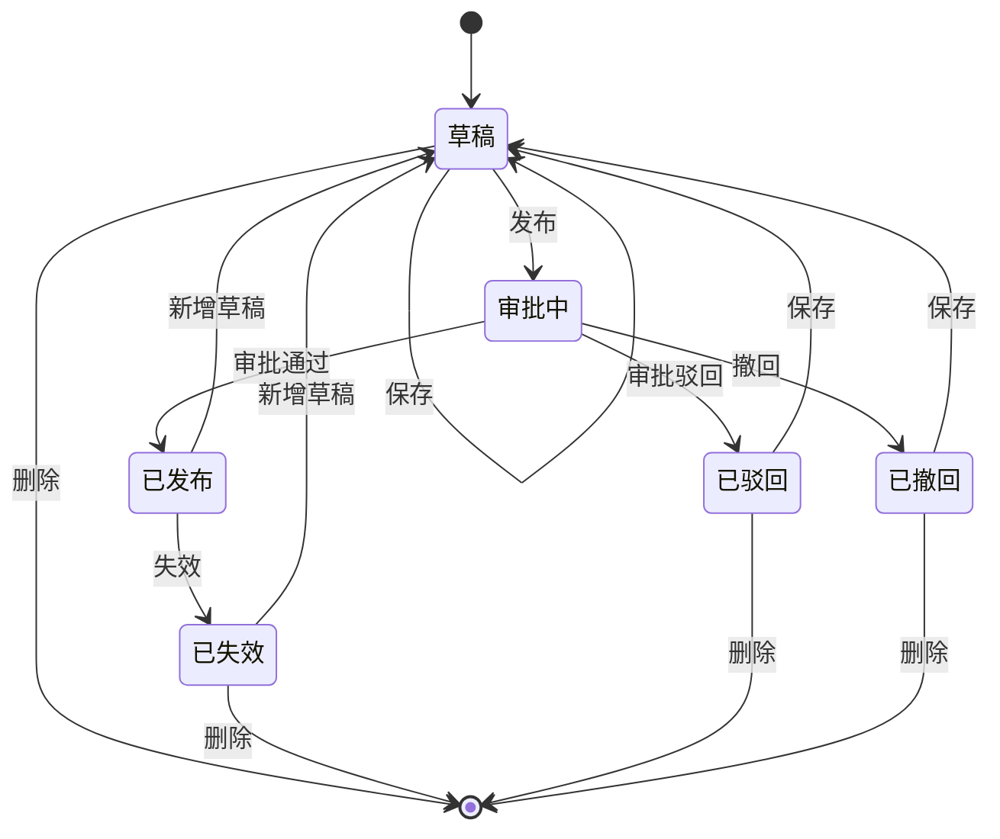

## 6 功能设计

### 6.1 功能实现整体设计方案

连接流编排页面由顶部版本操作区、画布编辑区、节点配置弹窗、更多配置抽屉和调试抽屉组成。页面初始化时先获取当前连接流版本列表和应用级配置上限，再加载选中版本的编排内容。版本状态决定当前页面是否可编辑，以及顶部展示哪些操作按钮。

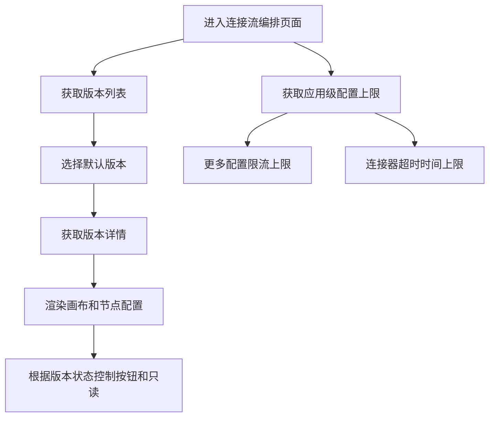

### 6.2 顶部版本操作区

#### 6.2.1 版本下拉

版本下拉展示当前连接流所有版本。每个版本项需要展示版本名称、版本创建时间和版本状态标签。用户点击版本后，页面切换到对应版本并展示该版本的编排内容。

| 字段 | 展示说明 |
|---|---|
| 版本名称 | 版本下拉主文本 |
| 创建时间 | 版本下拉辅助信息 |
| 状态标签 | 草稿、已发布、已失效、审批中、已驳回、已撤回 |

#### 6.2.2 版本状态与按钮

| 版本状态 | 顶部按钮 | 画布能力 | 节点内容能力 |
|---|---|---|---|
| 草稿 | 更多配置、调试、保存、发布、删除 | 可编辑 | 可修改 |
| 已发布 | 新增草稿、更多配置、调试、失效 | 不可编辑 | 只读查看 |
| 已失效 | 新增草稿、更多配置、调试、删除 | 不可编辑 | 只读查看 |
| 审批中 | 更多配置、调试、撤回 | 不可编辑 | 只读查看 |
| 已驳回 | 更多配置、调试、保存、删除 | 不可编辑，保存后回到草稿 | 只读查看 |
| 已撤回 | 更多配置、调试、保存、删除 | 不可编辑，保存后回到草稿 | 只读查看 |

#### 6.2.3 版本操作说明

| 操作 | 说明 |
|---|---|
| 保存 | 草稿状态保存当前草稿内容；已驳回和已撤回状态点击保存后回到草稿状态；不执行完整节点校验 |
| 发布 | 对当前草稿执行完整节点校验，通过后发布版本 |
| 新增草稿 | 基于已发布或已失效版本创建草稿版本，并切换到草稿版本配置 |
| 失效 | 将当前已发布版本设为已失效 |
| 撤回 | 将当前审批中版本撤回为已撤回版本 |
| 删除 | 删除当前草稿、已驳回、已撤回或已失效版本，删除前二次确认 |
| 更多配置 | 打开右侧抽屉，展示限流配置和缓存配置 |
| 调试 | 打开右侧调试抽屉，展示触发器入参并执行调试 |

### 6.3 只读与编辑控制

版本状态是页面可编辑能力的唯一入口判断。草稿版本可编辑画布、连线、节点和连接流级配置；非草稿版本画布不可编辑，节点内容只能查看。调试和更多配置在任何版本状态下均允许打开；已驳回和已撤回版本允许通过保存操作回到草稿状态。

| 控制对象 | 草稿 | 非草稿 |
|---|---|---|
| 拖拽节点 | 允许 | 禁止 |
| 新增节点 | 允许 | 禁止 |
| 删除节点 | 允许 | 禁止 |
| 修改连线 | 允许 | 禁止 |
| 修改节点配置 | 允许 | 禁止，仅查看 |
| 保存版本 | 允许 | 已驳回、已撤回允许保存并回到草稿；其他非草稿禁止 |
| 发布版本 | 允许 | 禁止 |
| 调试 | 允许 | 允许，任何版本状态均可打开调试抽屉 |
| 更多配置 | 允许 | 允许，任何版本状态均可打开更多配置抽屉 |

### 6.4 保存与发布校验策略

保存和发布采用不同校验策略。保存用于暂存草稿，不要求节点配置完整；发布用于进入正式状态，必须确保所有节点数据满足运行要求。

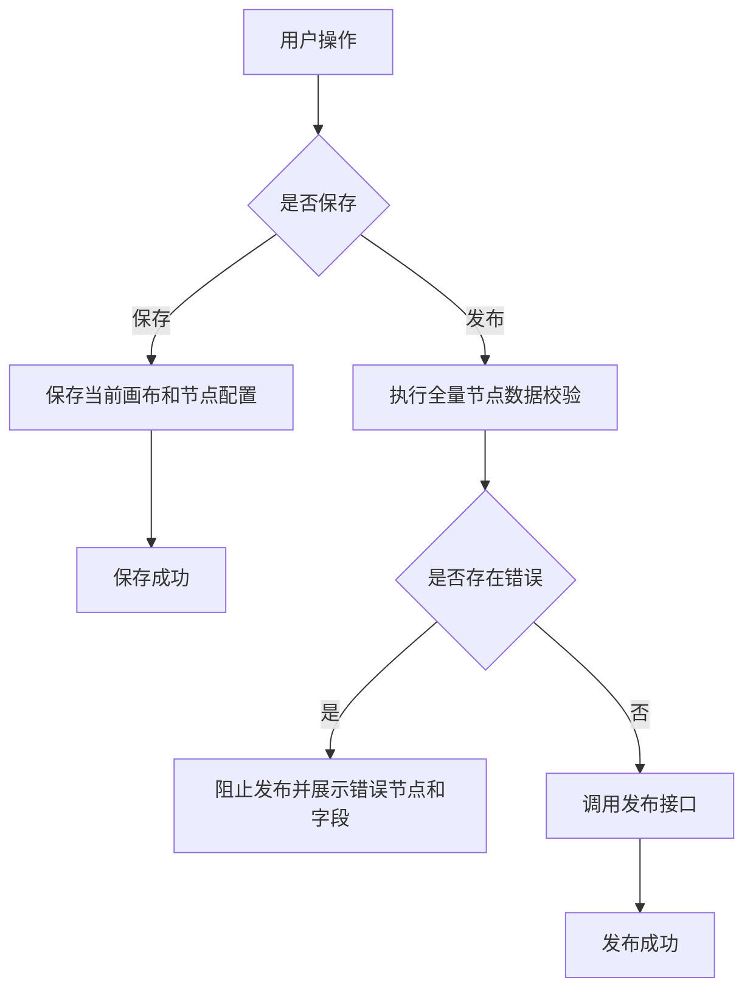

| 操作 | 校验范围 | 处理策略 |
|---|---|---|
| 保存 | 基础数据可序列化校验 | 不做节点完整性校验，允许保存未完成草稿 |
| 发布 | 节点完整性、字段必填、引用合法性、上限边界、结构完整性 | 任一节点不通过则阻止发布 |
| 调试 | 调试入参格式和接口调用参数 | 不替代发布校验；调试失败不改变版本状态 |

### 6.5 节点体系设计

| 节点类型 | 状态 | 定义与作用 | 配置入口 |
|---|---|---|---|
| 触发器节点 | 开放 | 连接流入口，定义 HTTP 请求触发方式和入参 | 节点配置弹窗 |
| 连接器节点 | 开放 | 调用连接器动作，支持版本选择、入参映射、认证参数和超时时间 | 节点配置弹窗 |
| 数据处理节点 | 开放 | 对上游参数进行转换、组装和处理后输出给下游节点 | 节点配置弹窗 |
| 数据输出节点 | 开放 | 定义连接流最终响应结构 | 节点配置弹窗 |
| 错误处理节点 | 开放 | 定义异常处理策略 | 节点配置弹窗 |
| 并行节点 | 开放 | 定义多分支并行执行结构 | 节点配置弹窗 |
| 文本节点 | 开放 | 用于画布说明、分支提示或结束占位 | 节点配置弹窗 |
| 循环节点 | 预留 | 定义重复执行逻辑 | 本期不开放 |
| 条件节点 | 预留 | 定义条件分支逻辑 | 本期不开放 |

#### 6.5.1 触发器节点交互流程

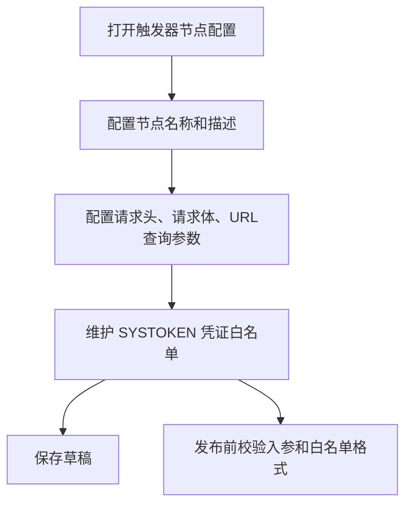

#### 6.5.2 连接器节点交互流程

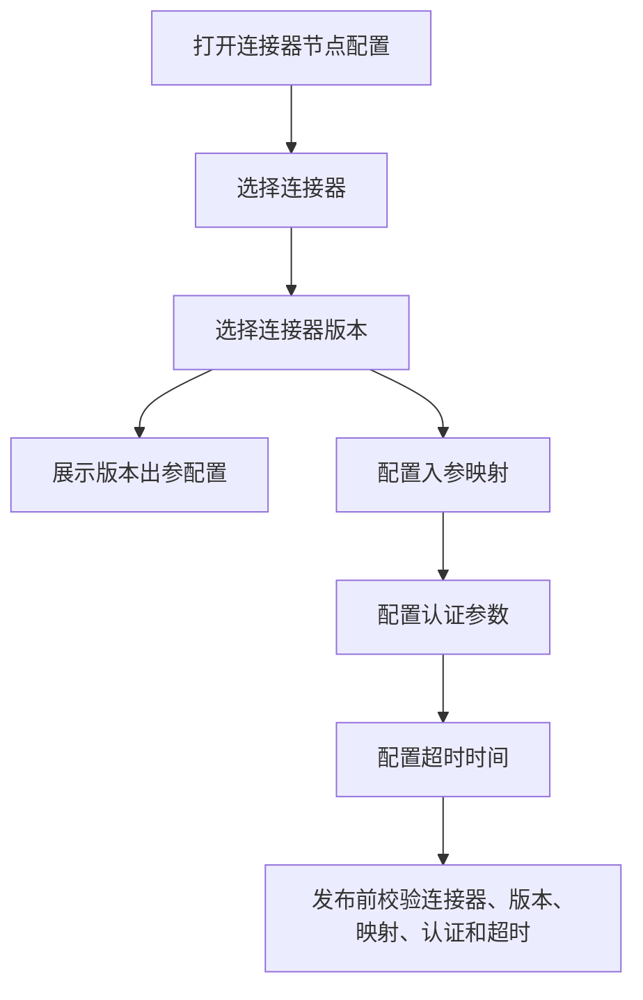

#### 6.5.3 数据处理节点交互流程

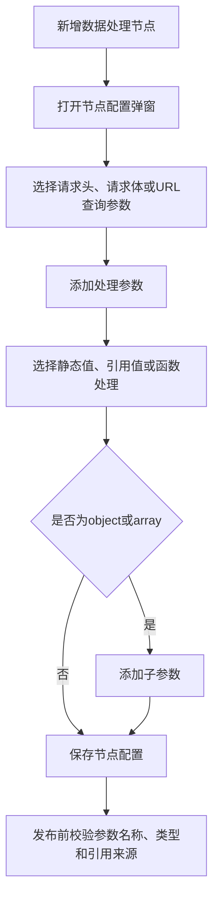

#### 6.5.4 数据输出节点交互流程

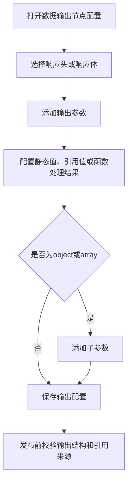

#### 6.5.5 错误处理节点交互流程

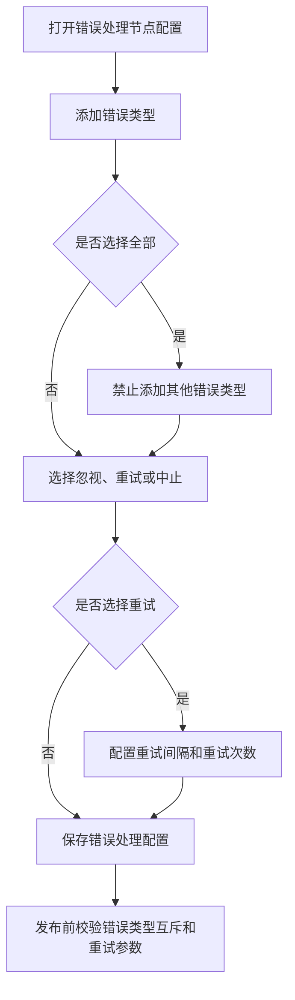

#### 6.5.6 并行节点交互流程

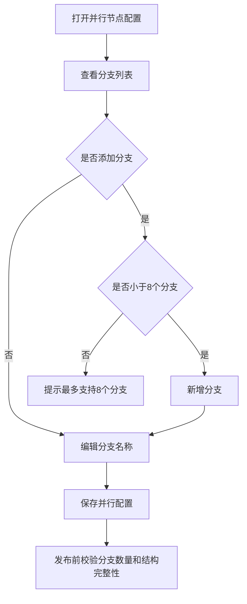

#### 6.5.7 节点添加交互与逻辑

节点添加参考 elkjs 示例项目中的连线插入模式。画布中的可插入连线在中点展示添加按钮，用户点击后打开节点类型选择面板。系统记录被点击连线、插入参考位置和弹窗展示位置，用户选择节点类型后按节点类型执行不同插入逻辑。

| 节点类型 | 添加逻辑 | 连线处理 | 布局处理 |
|---|---|---|---|
| 单节点 | 在被点击连线之间创建新节点 | 删除原连线，新增源节点到新节点、新节点到目标节点两条连线 | 插入后执行自动布局 |
| 数据处理节点 | 作为单节点插入，并初始化数据处理配置 | 同单节点 | 插入后执行自动布局 |
| 并行节点 | 创建并行主节点、默认分支和汇合结构 | 原连线被替换为并行结构连线 | 插入后执行自动布局 |
| 错误处理节点 | 创建错误处理主节点和右侧处理链路占位 | 原连线被替换为结构连线 | 插入后执行自动布局 |
| 文本节点 | 用于结构说明或占位 | 根据所属结构决定是否隐藏插入按钮 | 插入后执行自动布局 |

节点添加需要遵循以下规则：

| 规则 | 说明 |
|---|---|
| 版本限制 | 仅草稿版本允许添加节点 |
| 连线拆分 | 单节点添加时必须保留原源节点和目标节点的执行顺序 |
| 结构归属 | 插入到并行分支、错误处理右侧链路等结构内时，新节点需要继承父级结构标识 |
| 插入限制 | 特定结构内部可限制可插入节点数量，例如错误处理右侧链路可限制动作节点数量 |
| 自动布局 | 添加节点后统一刷新节点和连线，再触发自动布局和画布自适应 |

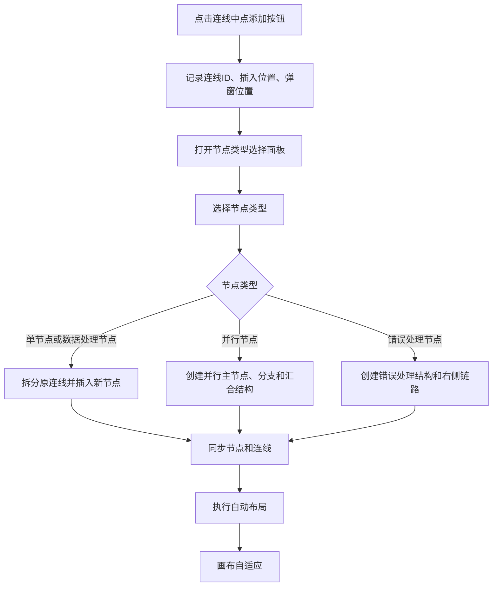

单节点插入时，原连线被拆分为两条新连线，确保执行顺序不变。


插入后自动布局用于避免节点重叠，并保持主流程、分支结构和结构内部链路的视觉稳定。

连线上的加号由连线数据控制。可插入连线不设置隐藏标识，连线组件默认展示加号；结构辅助连线、汇合连线、受限制的错误处理右侧链路会设置隐藏标识，连线组件据此隐藏加号。并行、错误处理等结构在创建结构连线时预先标记哪些连线可插入；错误处理结构还会在插入动作节点后动态刷新隐藏状态。

| 连线类型 | 加号展示 | 说明 |
|---|---|---|
| 普通主流程连线 | 展示 | 支持继续在源节点和目标节点之间插入节点 |
| 单节点插入后产生的新连线 | 展示 | 新增的两条执行连线默认可继续插入 |
| 并行主节点到分支开始节点 | 隐藏 | 属于结构分叉辅助连线，不允许插入业务节点 |
| 并行分支开始节点到分支结束节点 | 展示 | 分支内部主链路，允许插入处理节点 |
| 并行分支结束节点到合并节点 | 隐藏 | 属于结构汇合辅助连线，不允许插入业务节点 |
| 错误处理主节点到区域文本、开始文本 | 隐藏 | 属于结构说明或结构入口辅助连线 |
| 错误处理开始节点到结束节点 | 展示或动态隐藏 | 右侧处理链路未添加动作节点时展示，达到限制后隐藏 |
| 错误处理结束节点到跳出节点 | 隐藏 | 属于结构汇合辅助连线 |
| 错误处理跳出节点到后续节点 | 展示 | 回到主流程后允许继续插入 |

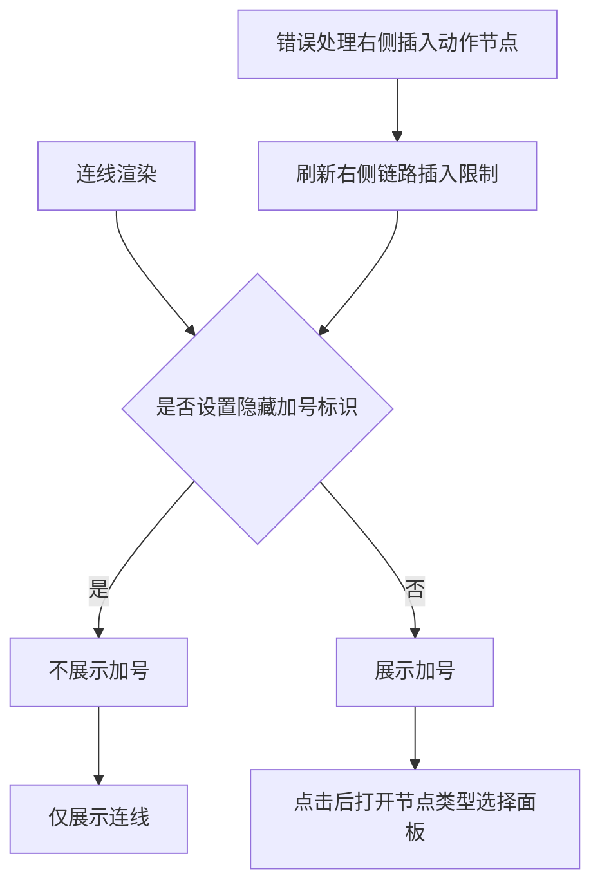

连线使用自定义连线组件统一渲染。普通可插入连线、结构辅助连线和受限制连线不需要拆成多套组件，均使用同一种连线类型；是否展示加号由连线数据中的隐藏标识决定。连线组件负责绘制折线路径、渲染加号按钮、处理加号点击事件，并把被点击连线和插入参考位置传给节点选择面板。

| 实现点 | 处理方式 | 说明 |
|---|---|---|
| 连线组件注册 | 注册自定义连线类型 | 画布中的业务连线统一使用自定义连线组件渲染 |
| 加号展示控制 | 读取连线隐藏标识 | 未设置隐藏标识时展示加号，设置后只展示连线路径 |
| 加号点击 | 阻止事件冒泡并记录上下文 | 记录连线 ID、插入参考位置和弹窗位置 |
| 普通折线 | 起点向下、水平转折、终点向下连接 | 默认使用源点和目标点中间高度作为水平转折线 |
| 多出边分叉 | 源节点下方设置公共分叉点 | 同一源节点连出多条线时先下探再分叉 |
| 多入边汇合 | 目标节点上方设置公共汇合点 | 多条线进入同一目标节点时先汇合再进入目标 |
| 加号位置 | 放在主要水平段中点 | 与折线路径保持一致，便于用户识别可插入位置 |

连线转折路径由连线组件根据源节点和目标节点的连接点坐标计算。普通一对一连线使用源点和目标点之间的中间高度作为水平转折点；如果同一源节点存在多条出边，则先从源节点向下延伸到公共分叉点，再横向连接到目标侧；如果同一目标节点存在多条入边，则先在目标节点上方的公共汇合点水平对齐，再进入目标节点。

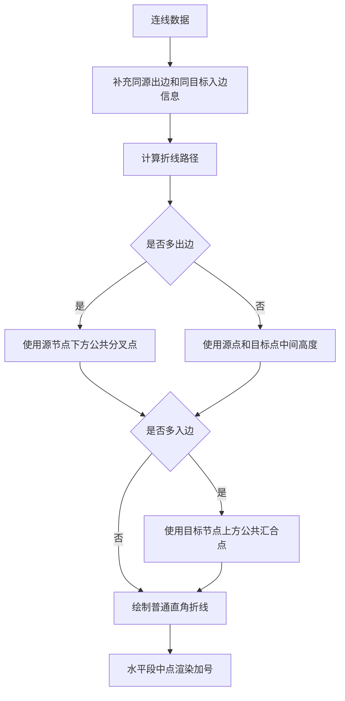

如果自定义连线组件不计算转折点，只依赖默认连线或简单直连，普通单链路仍可展示，但复杂结构的业务语义会明显下降。并行、条件分支、错误处理、循环和嵌套结构都依赖清晰的分叉、汇合和加号定位；缺少转折点计算后，节点位置即使由 ELK 排列合理，连线路径仍可能出现穿插、贴边、分叉不清晰和加号错位。

| 缺失处理 | 可能问题 | 影响 |
|---|---|---|
| 不处理多出边分叉 | 多条线从源节点各自散开 | 并行或条件分支不像统一结构，分叉关系不清晰 |
| 不处理多入边汇合 | 多条线直接进入同一目标节点 | 合并节点、跳出节点或结束节点附近线条堆叠 |
| 不计算主要水平段 | 加号缺少稳定锚点 | 加号可能偏离连线、压住节点或不符合插入预期 |
| 不使用直角折线 | 连线可能斜穿结构区域 | 错误处理左右区域、并行分支和嵌套结构可读性下降 |
| 不结合出入边数量 | 分叉和汇合缺少统一规则 | 复杂画布中连线交叉、贴边和重叠问题更明显 |

因此，ELK 负责节点整体布局，自定义连线组件负责最终连线路径和加号定位。两者需要配合使用：只有节点位置计算而没有连线转折处理时，画布仍可能出现“节点位置正确但连线表达不清晰”的问题。

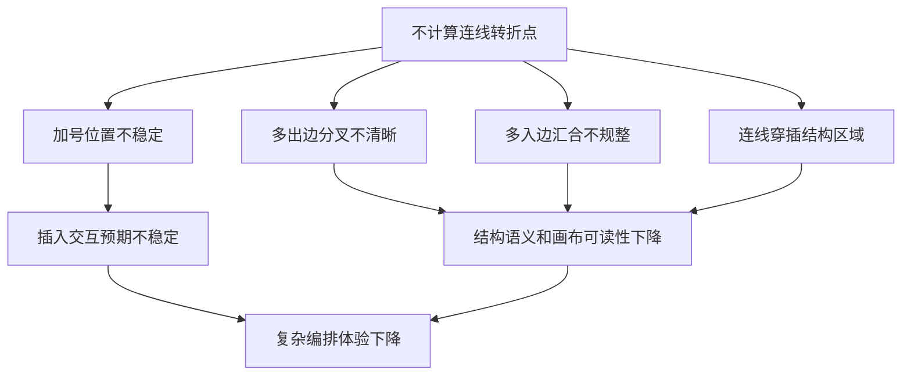

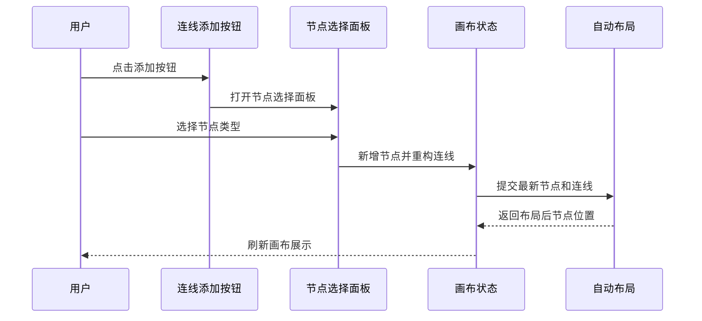

#### 6.5.8 结构节点布局与额外位置处理

并行节点和错误处理节点不是单节点，而是由主节点、辅助文本节点、分支节点、汇合节点和多条结构连线组成的复合结构。添加这类节点时，需要同时使用 ELK 自动布局和额外节点位置处理。

ELK 负责通用自动布局，解决节点不重叠、连线少交叉、整体从上到下分层排列等问题。额外节点位置处理负责业务语义修正，保证并行节点、错误处理节点符合产品定义的视觉形态。两者职责不同，不能互相替代。

| 处理层级 | 主要职责 | 作用 |
|---|---|---|
| ELK 自动布局 | 根据节点和连线计算整体层级、节点间距、连线走向、复合容器尺寸 | 让图整体可读，避免节点重叠和大量连线交叉 |
| 初始位置处理 | 添加结构节点时先给辅助节点、分支节点、汇合节点一个相对合理的位置 | 避免新增瞬间节点堆叠，并向后续布局表达结构的左右关系 |
| 结构占位计算 | 根据并行分支、错误处理左右区域和嵌套结构计算节点横向占位 | 为后续分支右移、嵌套结构避让和主轴对齐提供依据 |
| 语义位置修正 | 在 ELK 计算后按业务规则修正主轴、分支轴、右侧处理链路和汇合点位置 | 保证视觉结果符合连接流编排交互预期 |

ELK 只能识别节点、连线、层级、复合容器和通用间距配置，不理解连接流业务中的“分支 1 是主轴分支”“分支 2 及后续分支只能向右展开”“嵌套结构只能推开当前分支之后的分支”“错误处理左侧区域和右侧处理链路需要对称”等规则。因此结构节点的横向位置不能完全依赖 ELK 的 spacing 配置，需要在 ELK 完成纵向层级布局后，由业务语义布局统一接管 X 轴坐标。

并行节点添加时，系统先拆分原连线，创建并行主节点、默认两条分支的开始/结束文本节点、合并文本节点和结构连线。ELK 会把这些节点作为复合结构参与整体布局，但 ELK 不理解“主流程中轴线”“分支局部主轴”“合并节点回到主轴”等业务语义，所以需要额外处理：并行主节点对齐主流程中心线，分支开始节点、分支结束节点和分支内部节点按所属分支轴线横向对齐，并行合并节点回到主流程中心线，分支 2 及后续分支按实际占位从左到右排布，分支内部嵌套结构整体跟随分支轴移动。当前语义修正主要接管 X 轴坐标，Y 轴层级和节点间距主要由 ELK 计算。

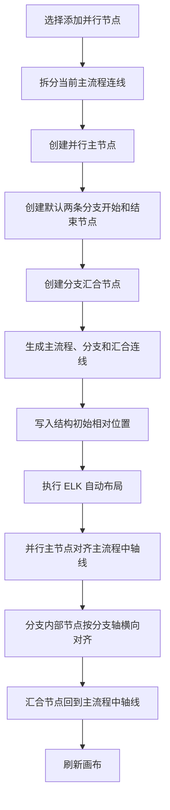

错误处理节点添加时，系统先拆分原连线，创建错误处理主节点、错误处理区域文本、开始文本、结束文本、跳出文本和结构连线。ELK 能计算整体层级和容器空间，但不会理解“左侧区域说明、右侧处理链路、下方跳出汇合”的语义。因此需要额外位置处理：错误处理主节点对齐主流程中心线，错误处理区域固定在左侧，错误处理开始和错误处理结束固定在右侧处理链路并保持纵向对齐，左右两侧与错误处理主节点保持一致间距，错误处理跳出节点回到主流程出口中轴线，并与触发器、结束节点保持同一纵轴。

并行和错误处理发生嵌套时，需要根据结构类型和所在分支计算横向避让距离。任意分支嵌套并行节点时，嵌套并行的分支 1 仍跟随当前分支主轴，嵌套并行的分支 2 及后续分支向右展开；父并行当前分支之后的所有分支需要整体右移，右移距离取决于嵌套并行向右扩展的宽度、分支数量、分支宽度和安全间距。分支 1 嵌套错误处理节点时，错误处理整体宽度固定，父并行后续分支只需要避让错误处理右半侧宽度和安全间距。分支 2 或后续分支嵌套错误处理节点时，当前分支也需要右移，避免错误处理左侧区域覆盖前一分支，当前分支之后的分支继续基于该分支实际占位向右排列。

并行分支间距不能只使用固定值或 ELK 全局 spacing。分支中心线需要根据前一分支右侧扩展宽度、当前分支左侧扩展宽度和安全间距动态计算。这样可以保证嵌套分支越多，父级后续分支右移越多，避免嵌套结构覆盖其他分支。

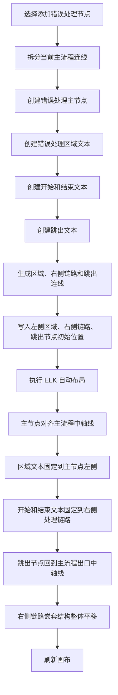

如果省略额外节点位置处理，只保留 ELK，结构节点虽然仍能自动布局，但会出现主流程中轴线偏移、并行合并点错位、分支轴线偏移、错误处理左右区域混乱、嵌套结构内部错位等问题。因此额外处理是保证业务视觉语义稳定的必要逻辑。

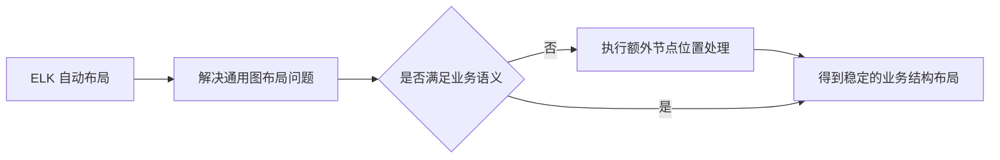

#### 6.5.9 添加后布局处理实现思路

添加单节点、并行节点或错误处理节点后，系统不会在 ELK 前单独递归收集被拆分连线后的后续节点，也不会对后续节点做整体下移预处理。当前处理方式是先完成节点和连线更新，再把最新画布数据提交给 ELK 复合层级布局，最后执行结构语义位置修正。

添加后布局处理的目标不是手动维护后续节点坐标，而是通过“结构初始位置 + ELK 复合布局 + 业务语义修正”保证整体可读。结构初始位置负责表达新增结构内部的左右关系，ELK 负责全局层级、间距和复合容器空间，语义位置修正负责并行、错误处理等结构的横向业务对齐。

| 处理对象 | 处理思路 | 说明 |
|---|---|---|
| 单节点 | 插入时主流程节点继承源节点 X 坐标，Y 坐标交给 ELK 统一计算 | 避免把连线中点误作为节点最终左上角 |
| 当前新增结构 | 写入结构初始相对位置和语义标识 | 便于 ELK 和语义修正识别结构关系 |
| 后续节点 | 不做独立位移预处理 | 后续节点位置由 ELK 全局布局结果决定 |
| 分支内部节点 | 根据所属分支或结构归属参与复合布局 | 避免跨分支混排 |
| 辅助文本节点 | 作为结构子节点参与复合布局和语义修正 | 保证区域、开始、结束、跳出等文本语义不丢失 |

ELK 布局前，系统会把 ReactFlow 节点和连线转换为复合层级图。结构主节点会生成虚拟复合容器，结构子节点挂载到对应容器中；跨层级连线会被映射到共同容器下的直接端点。这样可以让 ELK 在计算整体层级时感知结构节点的占位，减少结构内部节点与外部主流程节点混排。

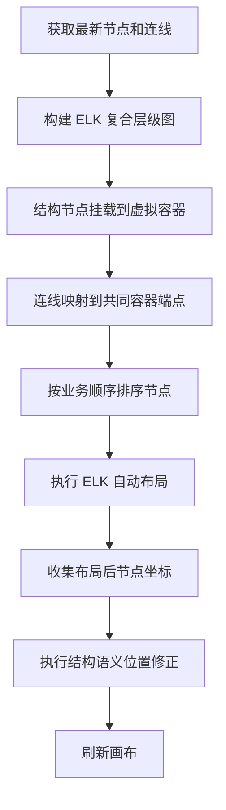

语义位置修正只在 ELK 返回布局结果后执行。修正逻辑主要接管结构节点的 X 轴坐标：主流程结构节点对齐主流程中心线；并行结构的分支节点按分支中心线横向对齐；并行合并节点回到主轴；错误处理的区域文本固定在左侧，开始、结束和右侧链路节点固定在右侧，跳出节点回到主轴。Y 轴层级、节点间距和结构前后节点的纵向避让主要由 ELK 计算。

```mermaid
flowchart TD
  Layouted[ELK 返回布局坐标] --> FindAxis[确定主流程或当前结构轴线]
  FindAxis --> StructureType{结构类型}
  StructureType -->|并行或条件分支| ParallelAxis[计算每条分支中心线]
  StructureType -->|错误处理或循环| LoopAxis[计算左侧区域、右侧链路和主轴]
  ParallelAxis --> AlignParallel[横向修正分支节点和合并节点]
  LoopAxis --> AlignLoop[横向修正区域、右侧链路和跳出节点]
  AlignParallel --> Render[刷新画布]
  AlignLoop --> Render
```

完整添加流程中，当前实现没有独立的“后续节点收集”和“后续节点位移”阶段。新增结构和后续节点的避让依赖 ELK 复合层级布局；结构内部和嵌套结构的业务视觉稳定性依赖 ELK 后的语义位置修正。

```mermaid
sequenceDiagram
  participant User as 用户
  participant Canvas as 画布
  participant Store as 节点状态
  participant Elk as ELK布局
  participant Semantic as 语义修正
  User->>Canvas: 在连线上添加节点
  Canvas->>Store: 拆分连线并创建节点或结构
  Store->>Elk: 提交最新节点和连线做复合布局
  Elk-->>Store: 返回全局布局结果
  Store->>Semantic: 执行主轴、分支轴、右侧链路横向修正
  Semantic-->>Canvas: 返回最终画布节点位置
```

因此，文档中的布局说明应以当前实现为准：添加后先更新画布数据，再执行 ELK 自动布局和结构语义修正；不描述为在 ELK 前手动递归收集后续节点并整体下移。

#### 6.5.10 节点删除交互与逻辑

节点删除参考 elkjs 示例项目中的删除和重连模式。用户点击节点删除入口后，系统先判断节点是否允许删除，再根据单节点或结构节点执行不同删除策略。删除完成后刷新节点、连线并重新执行自动布局。

| 删除对象 | 删除策略 | 重连策略 |
|---|---|---|
| 触发器节点 | 不允许删除 | 不处理 |
| 结束节点 | 不允许删除 | 不处理 |
| 单节点 | 删除当前节点和与其相连的入边、出边 | 若存在前置节点和后置节点，新增前置节点到后置节点的连线 |
| 数据处理节点 | 按单节点删除，同时移除下游引用校验中的来源 | 若存在前置节点和后置节点，新增前置节点到后置节点的连线 |
| 并行节点 | 级联删除并行主节点、分支节点、分支内部节点和汇合节点 | 若结构前后存在节点，重连结构前置节点和后置节点 |
| 错误处理节点 | 级联删除错误处理主节点、结构说明节点和右侧链路节点 | 若结构前后存在节点，重连结构前置节点和后置节点 |

节点删除需要遵循以下规则：

| 规则 | 说明 |
|---|---|
| 版本限制 | 仅草稿版本允许删除节点 |
| 禁删节点 | 触发器和结束节点不可删除 |
| 关联收集 | 删除结构节点时递归收集结构子节点、分支节点、结构内部插入节点 |
| 自动重连 | 删除节点后若存在明确前后节点，需要自动补齐连线 |
| 引用处理 | 删除节点后，下游引用该节点出参的配置在发布校验时提示引用失效 |
| 自动布局 | 删除后统一刷新节点和连线，再触发自动布局和画布自适应 |

```mermaid
flowchart TD
  ClickDelete[点击节点删除] --> CheckVersion{是否草稿版本}
  CheckVersion -->|否| BlockDelete[禁止删除并提示只读]
  CheckVersion -->|是| CheckNode{是否触发器或结束节点}
  CheckNode -->|是| BlockCore[禁止删除核心节点]
  CheckNode -->|否| CheckStructure{是否结构节点}
  CheckStructure -->|否| RemoveNormal[删除当前节点和关联边]
  CheckStructure -->|是| CollectRelated[递归收集结构关联节点]
  CollectRelated --> RemoveStructure[删除结构节点、子节点和关联边]
  RemoveNormal --> Reconnect[识别前置节点和后置节点并自动重连]
  RemoveStructure --> Reconnect
  Reconnect --> SyncCanvas[同步画布节点和连线]
  SyncCanvas --> AutoLayout[执行自动布局]
```

单节点删除后，系统根据入边和出边恢复前后节点的直接连线。

```mermaid
flowchart LR
  BeforeA[前置节点] --> DeleteNode[待删除节点]
  DeleteNode --> BeforeB[后置节点]
  BeforeB -.删除后.-> AfterA[前置节点]
  AfterA --> AfterB[后置节点]
```

结构节点删除需要先递归收集所有关联节点，避免删除后残留孤立节点或孤立连线。

```mermaid
flowchart TD
  DeleteStructure[删除结构主节点] --> CollectMain[加入主节点]
  CollectMain --> CollectChildren[收集结构子节点]
  CollectChildren --> CollectBranch[收集分支节点]
  CollectBranch --> CollectInner[收集结构内部插入节点]
  CollectInner --> HasMore{是否发现新的关联节点}
  HasMore -->|是| CollectChildren
  HasMore -->|否| RemoveAll[删除全部关联节点和关联连线]
  RemoveAll --> ReconnectOuter[重连结构外部前后节点]
```

### 6.6 触发器节点配置

触发器节点配置弹窗新增 SYSTOKEN 凭证白名单。用户可添加多个 SYSTOKEN 凭证，用于限制允许触发当前连接流的系统凭证范围。

| 配置项 | 说明 | 是否必填 | 编辑状态 |
|---|---|---|---|
| 节点名称 | 触发器节点展示名称 | 发布时必填 | 草稿可编辑 |
| 入参配置 | HTTP 请求头、请求体、URL 查询参数 | 发布时按规则校验 | 草稿可编辑 |
| SYSTOKEN 凭证白名单 | 可添加多个 SYSTOKEN 凭证 | 非必填，若添加则校验格式 | 草稿可编辑 |

### 6.7 连接器节点配置

连接器节点配置弹窗新增连接器版本列表。选择不同版本后，展示对应版本的出参配置，并用于下游参数引用。连接器节点同时支持超时时间配置，默认上限为 3 秒，可通过接口获取当前应用下配置；接口返回值不为 3 秒时，以接口返回值作为上限。

| 配置项 | 说明 | 默认值或来源 | 校验策略 |
|---|---|---|---|
| 连接器 | 当前节点调用的连接器 | 用户选择 | 发布时必选 |
| 连接器版本 | 当前连接器的具体版本 | 连接器版本接口 | 发布时必选 |
| 版本出参 | 所选连接器版本对应的出参结构 | 连接器版本详情接口 | 切换版本后刷新展示 |
| 入参映射 | 连接器调用入参 | 用户配置 | 发布时校验引用来源合法 |
| 认证参数 | SOA、APIG、Cookie、数字签名等认证参数 | 连接器配置页同步 | 发布时校验必填项 |
| 超时时间 | 连接器调用超时时间 | 默认上限 3 秒，应用接口可覆盖 | 发布时校验不超过当前应用上限 |

```mermaid
flowchart LR
  SelectConnector[选择连接器] --> LoadConnectorVersions[获取连接器版本列表]
  LoadConnectorVersions --> SelectConnectorVersion[选择连接器版本]
  SelectConnectorVersion --> LoadOutput[加载版本出参配置]
  SelectConnectorVersion --> Mapping[配置入参映射]
  AppConfig[应用级配置接口] --> TimeoutLimit[获取超时时间上限]
  TimeoutLimit --> TimeoutInput[校验超时时间]
```

### 6.8 数据处理节点配置

数据处理节点可拖拽到画布上，点击后打开数据处理节点配置弹窗。数据处理节点用于对上游参数进行转换、组装或计算，并将处理后的结果提供给下游节点引用。

| 配置项 | 说明 | 校验策略 |
|---|---|---|
| 节点名称 | 数据处理节点展示名称 | 发布时必填 |
| 参数名称 | 输出参数名称 | 发布时必填，且同级唯一 |
| 参数值 | 静态值、引用值或处理结果 | 发布时按来源类型校验 |
| 参数类型 | object、array、string、number、boolean | 可选；object 和 array 支持子参数 |
| 参数描述 | 参数说明 | 可选 |
| 子参数 | object 或 array 类型下的子节点 | 父节点删除时级联删除 |

#### 6.8.1 函数引用处理思路

数据处理节点的核心能力是把上游数据转换为下游可直接使用的出参。参数值除静态值和节点引用外，还需要支持函数引用。函数引用用于完成字段拼接、格式转换、默认值兜底、数组取值、对象提取、条件判断等处理场景。

| 值来源 | 使用场景 | 配置方式 | 输出结果 |
|---|---|---|---|
| 静态值 | 固定常量、默认值 | 用户直接输入参数值 | 原样作为当前参数输出 |
| 节点引用 | 使用触发器或上游节点出参 | 选择节点、参数路径和引用字段 | 将引用值作为当前参数输出 |
| 函数引用 | 对一个或多个来源值做处理 | 选择函数，绑定函数入参，配置返回类型 | 将函数执行结果作为当前参数输出 |

函数引用配置由“函数选择、入参绑定、返回结果映射、发布校验”四部分组成。

| 配置步骤 | 说明 |
|---|---|
| 选择函数 | 从函数列表中选择处理函数，函数需要展示名称、描述、入参要求和返回类型 |
| 绑定入参 | 每个函数入参可绑定静态值、触发器入参、上游节点出参或当前数据处理节点已配置的同级前置参数 |
| 配置返回类型 | 当前参数类型需与函数返回类型一致，或满足可兼容转换规则 |
| 保存草稿 | 保存时仅记录函数引用配置，不校验函数入参完整性 |
| 发布校验 | 发布时校验函数是否存在、必填入参是否绑定、引用来源是否存在、返回类型是否兼容 |

```mermaid
flowchart TD
  OpenDataProcess[打开数据处理节点配置] --> AddParam[添加参数]
  AddParam --> ChooseValueSource{选择参数值来源}
  ChooseValueSource -->|静态值| InputStatic[输入固定值]
  ChooseValueSource -->|节点引用| SelectReference[选择上游节点和参数路径]
  ChooseValueSource -->|函数引用| SelectFunction[选择处理函数]
  SelectFunction --> LoadFunctionMeta[读取函数入参和返回类型]
  LoadFunctionMeta --> BindInputs[绑定函数入参来源]
  BindInputs --> CheckReturn[匹配当前参数类型和函数返回类型]
  InputStatic --> SaveParam[保存参数配置]
  SelectReference --> SaveParam
  CheckReturn --> SaveParam
  SaveParam --> PublishValidate[发布时统一校验完整性]
```

函数引用的数据流以“输入来源集合 -> 函数处理 -> 参数输出 -> 下游引用”为主线。函数本身不直接改变上游节点数据，只生成当前数据处理节点的出参。

```mermaid
flowchart LR
  TriggerInput[触发器入参] --> FunctionInput[函数入参绑定]
  UpstreamOutput[上游节点出参] --> FunctionInput
  StaticValue[静态值] --> FunctionInput
  FunctionInput --> FunctionExec[函数处理]
  FunctionExec --> DataProcessOutput[数据处理节点出参]
  DataProcessOutput --> DownstreamMapping[下游节点入参映射]
```

#### 6.8.2 函数引用交互逻辑

用户在参数配置项中选择“函数引用”后，参数值区域切换为函数配置区域。函数配置区域需要展示函数选择框、函数说明、函数入参列表和返回结果说明。函数入参列表按函数元数据动态渲染，每个入参都可以选择值来源。

| 交互对象 | 交互说明 |
|---|---|
| 函数选择框 | 切换函数后刷新入参列表和返回类型；已绑定的旧入参不再匹配时需要清空 |
| 函数说明 | 展示函数用途、入参说明、返回类型和示例说明 |
| 入参来源选择 | 支持静态值、触发器入参、上游节点出参、同节点前置参数 |
| 引用路径选择 | 选择节点后按请求头、请求体、URL 查询参数或节点出参结构选择字段路径 |
| 返回类型提示 | 当前参数类型与函数返回类型不一致时展示风险提示，发布时阻断不兼容配置 |
| 删除函数引用 | 切回静态值或节点引用时，清空函数引用配置，避免残留无效配置 |

```mermaid
sequenceDiagram
  participant User as 用户
  participant Param as 参数配置项
  participant FunctionList as 函数列表
  participant ReferenceTree as 引用来源树
  participant Validator as 发布校验
  User->>Param: 参数值来源选择函数引用
  Param->>FunctionList: 加载可选函数和函数元数据
  User->>FunctionList: 选择处理函数
  FunctionList-->>Param: 返回入参列表和返回类型
  User->>Param: 为每个函数入参选择来源
  Param->>ReferenceTree: 按节点和参数结构选择引用路径
  ReferenceTree-->>Param: 返回绑定路径
  User->>Param: 保存草稿
  Param-->>Validator: 发布时提交函数引用配置
  Validator-->>User: 返回校验结果
```

#### 6.8.3 函数引用发布校验

函数引用只在发布阶段执行完整校验，保存草稿阶段允许配置不完整。校验结果需要定位到数据处理节点、参数路径、函数名称和具体函数入参。

| 校验项 | 通过条件 | 失败提示 |
|---|---|---|
| 函数存在性 | 函数 ID 在当前可用函数列表中存在 | 当前参数引用的函数不存在 |
| 必填入参 | 函数必填入参均已绑定值来源 | 函数入参未配置 |
| 引用有效性 | 绑定的节点、参数路径仍存在 | 函数入参引用来源已失效 |
| 类型兼容 | 函数返回类型与当前参数类型兼容 | 函数返回类型与参数类型不一致 |
| 循环引用 | 不引用当前参数自身或后置参数 | 函数入参存在循环引用 |

### 6.9 入参出参配置交互

节点入参、出参和数据处理参数统一按 HTTP 请求头、HTTP 请求体、URL 查询参数三个 tab 展示。每个 tab 下支持添加参数。没有参数时展示添加参数按钮；已有参数时在参数配置项上展示添加和删除按钮。

| 参数字段 | 说明 |
|---|---|
| 参数名称 | 当前参数的名称 |
| 参数值 | 静态值、引用值或函数处理结果 |
| 参数类型 | object、array、string、number、boolean，可选 |
| 参数描述 | 参数说明，可选 |
| 添加按钮 | 添加同级参数或子参数 |
| 删除按钮 | 删除当前参数；object 或 array 删除时级联删除子节点 |

object 和 array 类型支持添加子参数。此类参数的添加按钮需要提供下拉选择，区分“添加子参数”和“添加同级参数”。

### 6.10 更多配置抽屉

更多配置抽屉展示当前连接流的限流配置和缓存配置。

#### 6.10.1 限流配置

限流配置默认上限为 1000。页面进入时通过接口获取当前应用下的限流配置上限；当接口返回上限时，以接口返回值作为校验上限。接口未返回、返回为空或获取失败时，使用默认上限 1000。

| 配置项 | 说明 |
|---|---|
| 限流值 | 当前连接流允许的限流值 |
| 默认上限 | 1000 |
| 应用级上限 | 通过接口获取，可不为 1000 |
| 校验时机 | 发布时校验；更多配置保存时可做边界提示 |
| 超限提示 | 当前限流值不能超过应用配置上限 |

#### 6.10.2 缓存配置

缓存配置支持开启和关闭。开启时，需要配置缓存时间和缓存 key；缓存 key 从触发器入参配置中选择并拼接。

| 配置项 | 说明 | 校验策略 |
|---|---|---|
| 缓存开关 | 开启或关闭 | 必选 |
| 缓存时间 | 单位：秒 | 开启缓存时必填 |
| 缓存 key | 从触发器入参中选择并拼接 | 开启缓存时至少选择一个 |

```mermaid
flowchart TB
  OpenMoreConfig[打开更多配置抽屉] --> LoadLimit[读取应用限流上限]
  OpenMoreConfig --> LoadTriggerParams[读取触发器入参]
  LoadLimit --> RateLimitForm[渲染限流配置]
  LoadTriggerParams --> CacheKeyPicker[渲染缓存 Key 选择]
  RateLimitForm --> SaveMoreConfig[保存更多配置]
  CacheKeyPicker --> SaveMoreConfig
```

### 6.11 调试抽屉

点击调试按钮后，展开右侧调试抽屉。调试抽屉获取连接流触发器节点的入参配置，并展示在弹窗中。参数名称和参数类型不能编辑，用户只能为每个参数赋值。

| 区域 | 内容 | 说明 |
|---|---|---|
| 入参配置 | 触发器请求头、请求体、URL 查询参数 | 参数名称和类型只读，仅参数值可编辑 |
| 操作按钮 | 立即调试 | 点击后调用调试接口 |
| 执行输出 | 调试结果、错误信息、节点执行信息 | 接口返回后展示 |

```mermaid
sequenceDiagram
  participant User as 用户
  participant Editor as 连接流编排页面
  participant Debug as 调试抽屉
  participant Api as 调试接口
  User->>Editor: 点击调试
  Editor->>Debug: 打开抽屉并传入触发器入参
  User->>Debug: 填写参数值
  User->>Debug: 点击立即调试
  Debug->>Api: 提交调试请求
  Api-->>Debug: 返回调试结果
  Debug-->>User: 展示执行输出
```

### 6.12 节点数据校验设计

各节点均需要提供发布前校验能力。校验在发布时统一执行，保存草稿时不执行完整校验。校验结果需要包含节点 ID、节点名称、字段路径和错误信息，便于页面定位错误节点。

| 节点类型 | 发布前校验规则 |
|---|---|
| 触发器节点 | 节点名称必填；入参名称同级唯一；参数类型合法；SYSTOKEN 白名单若配置则凭证格式合法 |
| 连接器节点 | 节点名称必填；连接器必选；连接器版本必选；入参映射引用来源合法；认证参数满足当前认证方式要求；超时时间不超过应用级上限 |
| 数据处理节点 | 节点名称必填；参数名称同级唯一；参数类型合法；引用来源存在；object 和 array 子参数结构合法 |
| 数据输出节点 | 节点名称必填；响应头和响应体参数名称同级唯一；引用来源合法；输出结构可序列化 |
| 错误处理节点 | 错误类型不重复；全部类型与其他错误类型互斥；重试策略下重试间隔合法 |
| 并行节点 | 分支数量合法；分支开始和结束结构完整；每条分支存在可执行链路或明确为空分支 |
| 文本节点 | 文案可为空，不阻断发布；若作为结构节点占位，需要保留结构标识 |

```mermaid
flowchart TD
  PublishClick[点击发布] --> CollectNodes[收集所有节点]
  CollectNodes --> ValidateTrigger[校验触发器节点]
  CollectNodes --> ValidateConnector[校验连接器节点]
  CollectNodes --> ValidateDataProcess[校验数据处理节点]
  CollectNodes --> ValidateOutput[校验数据输出节点]
  CollectNodes --> ValidateStructure[校验错误处理和并行结构]
  ValidateTrigger --> MergeErrors[合并校验结果]
  ValidateConnector --> MergeErrors
  ValidateDataProcess --> MergeErrors
  ValidateOutput --> MergeErrors
  ValidateStructure --> MergeErrors
  MergeErrors --> ErrorExists{是否存在错误}
  ErrorExists -->|是| BlockPublish[阻止发布并定位错误]
  ErrorExists -->|否| SubmitPublish[提交发布]
```

### 6.13 实施顺序

1. 调整连接流编排页面顶部版本下拉和状态按钮展示。
2. 接入版本状态只读控制，限制非草稿版本画布和节点编辑能力。
3. 接入应用级配置上限接口，用于限流上限和连接器超时时间上限。
4. 改造更多配置抽屉，补充限流配置和缓存配置。
5. 改造触发器节点配置，新增 SYSTOKEN 凭证白名单。
6. 改造连接器节点配置，新增连接器版本列表和版本出参展示。
7. 新增节点添加、节点删除、结构节点级联删除和自动布局交互。
8. 新增数据处理节点和数据处理节点配置弹窗。
9. 补充数据处理节点函数引用配置、引用来源选择和发布校验。
10. 统一入参出参配置 tab 和参数增删交互。
11. 新增节点数据校验模型，并接入发布流程。
12. 调整保存流程，确保保存草稿不执行完整节点校验。
13. 接入调试抽屉和立即调试流程。
14. 补充开发自测和测试用例。

## 7 系统级非功能设计

### 7.1 FMEA 影响分析

| 风险 | 影响 | 措施 |
|---|---|---|
| 版本状态判断错误 | 非草稿版本被误编辑 | 所有编辑入口统一走版本状态判断 |
| 保存时误触发完整校验 | 草稿无法暂存 | 保存流程只做可序列化校验，不调用发布校验 |
| 发布时漏校验节点 | 运行时失败 | 发布前统一收集全部节点并执行节点类型校验 |
| 应用级配置上限获取失败 | 限流或超时校验缺少约束 | 限流使用默认上限 1000，超时时间使用默认上限 3 秒 |
| 连接器版本切换后出参未刷新 | 下游引用错误 | 选择版本后强制刷新版本出参，并提示可能影响下游映射 |
| 调试接口失败 | 用户无法定位问题 | 调试输出区展示错误信息，保留用户输入参数 |
| 非草稿更多配置误保存 | 版本配置不一致 | 更多配置保存权限由版本状态和接口权限共同控制 |

### 7.2 安全影响分析

版本发布、删除、失效、撤回等操作依赖后端鉴权。SYSTOKEN 白名单仅保存凭证标识或引用信息，不在页面展示敏感明文。调试入参仅用于当前调试请求，不改变版本状态。Cookie、SOA、APIG、数字签名等认证参数遵循连接器配置页既有安全策略。

### 7.3 兼容性

已有连接流版本和历史编排数据需要保持可加载。新增字段在旧版本中不存在时按默认空配置处理。限流上限和超时时间上限接口不可用时使用默认值，避免阻断页面基础使用。循环和条件节点继续作为预留节点，不在本期开放。

### 7.4 可运维

调试抽屉展示执行结果、错误信息和节点执行详情，便于定位配置问题。发布校验错误需要包含节点名称和字段路径，便于快速回到对应节点修复。更多配置中的限流和缓存配置需要在版本详情或运行记录中具备可追踪性。

### 7.5 测试建议

| 测试类型 | 建议覆盖内容 |
|---|---|
| 单元测试 | 版本状态按钮映射、只读判断、节点校验规则、函数引用校验、上限计算逻辑 |
| 集成测试 | 版本切换、连接器版本切换、节点添加删除、结构节点级联删除、更多配置保存、调试接口调用 |
| 端到端测试 | 草稿编辑保存、节点插入、节点删除重连、发布校验拦截、发布成功、已发布新增草稿、审批中撤回为已撤回、失效和删除 |
| 边界测试 | 限流上限非 1000、超时时间上限非 3 秒、函数引用来源失效、缓存开启未配置 key、连接器版本无出参 |

## 8 checkList

| check 点 | 是否达标 |
|---|---|
| 顶部版本下拉展示版本名称、创建时间和状态标签 | 是 |
| 切换版本后展示对应编排内容 | 是 |
| 草稿版本展示更多配置、调试、保存、发布、删除 | 是 |
| 已发布版本展示新增草稿、更多配置、调试、失效 | 是 |
| 已失效版本展示新增草稿、更多配置、调试、删除 | 是 |
| 审批中版本展示更多配置、调试、撤回 | 是 |
| 已驳回版本展示更多配置、调试、保存、删除 | 是 |
| 已撤回版本展示更多配置、调试、保存、删除 | 是 |
| 除草稿外画布不可编辑、节点内容只读 | 是 |
| 保存草稿不执行完整节点数据校验 | 是 |
| 发布版本执行完整节点数据校验 | 是 |
| 各个节点均有发布前数据校验规则 | 是 |
| 更多配置支持限流配置和缓存配置 | 是 |
| 限流配置默认上限 1000，可通过接口获取应用级上限 | 是 |
| 连接器节点超时时间默认上限 3 秒，可通过接口获取应用级上限 | 是 |
| 触发器节点支持 SYSTOKEN 凭证白名单 | 是 |
| 连接器节点支持版本列表和版本出参展示 | 是 |
| 数据处理节点可添加并打开配置弹窗 | 是 |
| 数据处理节点支持函数引用配置、函数入参绑定和发布校验 | 是 |
| 节点添加逻辑包含连线插入、节点类型选择、连线拆分和自动布局说明 | 是 |
| 并行和错误处理节点说明 ELK 自动布局、初始位置处理、结构占位计算、语义位置修正的职责差异 | 是 |
| 说明并行分支间距不能完全依赖 ELK，需要按业务语义动态计算 | 是 |
| 说明并行和错误处理嵌套时的后续分支右移和避让规则 | 是 |
| 并行和错误处理节点添加过程包含对应 Mermaid 流程图 | 是 |
| 后续处理节点位置处理说明收集、位移和布局衔接流程 | 是 |
| 节点删除逻辑包含单节点重连、结构节点级联删除和自动布局说明 | 是 |
| 入参出参配置按 HTTP 请求头、HTTP 请求体、URL 查询参数 tab 展示 | 是 |
| object 和 array 类型支持添加子参数 | 是 |
| 调试抽屉展示触发器入参且参数名称、类型不可编辑 | 是 |
| 立即调试后展示执行输出 | 是 |
| 文档不展示实现代码块，仅使用表格和 Mermaid 图说明 | 是 |
