# wecodesite 接入子应用技术文档

## 修订记录

| 版本 | 日期 | 修订人 | 修订内容 |
|------|------|--------|---------|
| V1.0 | 2026-07-15 | - | 初始版本，梳理 wecodesite 基于 qiankun 接入子应用的技术方案 |
| V1.1 | 2026-07-15 | - | 修正：移除 microApps.js 静态配置改为接口获取；补充所有用例细化分析；移除 activeRule 字段；分析 qiankun/* 路由必要性；修复 mermaid 图渲染问题 |

## 目录

- 需求价值和概述
- 上下文分析
- 初始需求分析
    - 3.1 初始需求场景分析
    - 3.2 结构化IR（必选）
- 需求影响分析
    - 4.1 特性影响分析
- 系统用例分析
    - 5.1 用例清单
    - 5.2 用例分析
- 功能设计
    - 6.1 业界方案实现
    - 6.2 功能实现整体设计方案
    - 6.3 功能实现
- 系统级非功能设计
    - 7.1 系统级FMEA影响分析
    - 7.2 系统级安全影响分析
    - 7.3 兼容性
    - 7.4 可运维
    - 7.5 资料
- checkList（必填）
    - 8.1 设计自检清单要求（必填）

## 表目录

- 表1：qiankun 依赖包说明
- 表2：非业务逻辑配置清单及影响范围
- 表3：构建产物包影响分析
- 表4：接口配置返回参数说明
- 表5：用例清单
- 表6：功能实现分解分配清单

## 图目录

- 图1：系统上下文架构图
- 图2：构建产物包结构对比图
- 图3：架构逻辑视图
- 图4：运行视图
- 图5：应用启动与子应用加载整体流程图
- 图6：子应用加载时序图
- 图7：子应用卸载时序图
- 图8：两套路由系统并行工作示意图
- 图9：自有页面渲染流程图
- 图10：子应用渲染流程图
- 图11：路由切换状态图

## Keywords 关键字

中文：微前端、qiankun、loadMicroApp、HashRouter、子应用接入、样式隔离、沙箱、动态加载、wecodesite、接口配置
英文：Micro Frontend, qiankun, loadMicroApp, HashRouter, Sub-application Integration, Style Isolation, Sandbox, Dynamic Loading, wecodesite, API Configuration

## Abstract 摘要

中文：本文档详细描述 wecodesite 主应用如何引入 qiankun 微前端框架、所需的依赖包与非业务逻辑配置，以及这些配置对项目构建产物包的影响。重点阐述 qiankun 在 wecodesite 中以 loadMicroApp 主动加载模式运行的整体流程，包括应用启动初始化、接口配置读取、菜单动态渲染、子应用加载与卸载的完整生命周期，并通过 mermaid 流程图和时序图对比自有页面渲染流程与子应用加载流程的差异。子应用配置通过后端接口动态获取，无需在项目中维护静态配置文件。

英文：This document details how the wecodesite main application introduces the qiankun micro-frontend framework, the required dependencies and non-business logic configurations, and the impact of these configurations on the project build output. It focuses on the overall flow of qiankun running in loadMicroApp active loading mode within wecodesite, including application startup initialization, API configuration reading, dynamic menu rendering, and the complete lifecycle of sub-application loading and unmounting. Sub-application configurations are dynamically fetched via backend API, eliminating the need for static configuration files.

## List 缩略语清单

| Abbreviations 缩略语 | Full spelling 英文全名 | Chinese explanation 中文解释 |
|---------------------|----------------------|---------------------------|
| UMD | Universal Module Definition | 通用模块定义 |
| ESM | ECMAScript Module | ECMAScript 模块 |
| CORS | Cross-Origin Resource Sharing | 跨域资源共享 |
| HMR | Hot Module Replacement | 热模块替换 |
| FMEA | Failure Mode and Effects Analysis | 失效模式与影响分析 |
| DOM | Document Object Model | 文档对象模型 |
| SPA | Single Page Application | 单页应用 |

---

## 1 需求价值和概述

### 背景

wecodesite 作为开放平台的开发者控制台主应用，需要将助手广场、其他业务工程等作为子应用嵌入展示。需引入微前端框架实现主子应用解耦，使子应用可独立开发、独立部署，主应用通过接口配置即可接入新子应用，无需修改代码。具体框架选型见第 2 节"业界方案对比与选型"。

### 需求价值

| 价值维度 | 具体说明 |
|---------|---------|
| 架构解耦 | 主应用与子应用独立开发、独立部署、独立技术栈 |
| 零代码扩展 | 新增子应用仅需在后端配置接口中添加配置，wecodesite 无需改代码和发版 |
| 样式隔离 | 微前端沙箱机制确保主子应用样式互不污染 |
| 渐进增强 | 配置加载失败时降级展示主应用基础功能，不影响核心体验 |

### 客户问题

如果没有该特性：
- 新增嵌入工程需 wecodesite 开发修改代码、测试、发版，周期长
- 主应用与子应用强耦合，子应用技术栈升级受主应用限制
- 样式冲突难以避免，排查困难

---

## 2 业界方案对比与选型

### 2.1 业界微前端方案概览

业界微前端框架方案对比：

| 方案 | 实现方式 | 优点 | 缺点 | 是否采用 |
|------|---------|------|------|---------|
| qiankun | 基于 single-spa 的微前端框架，通过 loadMicroApp 或 registerMicroApps 加载子应用 | 技术栈无关；内置 JS 沙箱和样式隔离；社区成熟，中文文档完善 | 无预加载能力（loadMicroApp 模式）；需自行管理生命周期 | 待定 |
| Piral | 插件化微前端框架，通过 Piral Instance + Pilet 模式组合 | 多模块可同页面共存；importmap 共享依赖；Feed Service 动态发现 | 应用外壳必须是 React；无 JS 沙箱；需搭建 Feed Service | 待定 |
| iframe 嵌入 | 使用 iframe 加载子页面 | 天然隔离，简单 | 交互受限、性能差、UX 差、通信困难 | 否 |
| Module Federation | Webpack 5 模块联邦 | 编译时集成，性能好 | 强依赖 Webpack 5，子应用改造成本高；Vite 支持不完善 | 否 |
| wujie | 基于 iframe + Web Component 的微前端框架 | 天然隔离，预加载支持好 | 生态较新，文档不如 qiankun 丰富 | 否 |

从上表可看出，iframe、Module Federation、wujie 因明显劣势被排除，最终候选方案为 qiankun 和 Piral，以下对两者进行详细对比。

### 2.2 qiankun 与 Piral 框架对比

针对多技术栈（React/Vue）、多构建工具（Vite/Webpack）、多路由模式（HashRouter/BrowserRouter）、含历史项目的微前端集成场景，对 qiankun 和 Piral 两个主流框架进行对比分析。

**名词解释：**

| 术语 | 说明 |
|------|------|
| Piral Instance（应用外壳） | Piral 架构中的主应用，提供布局、导航、路由和共享功能，所有 Pilet 运行在其中。类比 qiankun 的主应用（基座），但 Piral Instance 必须是 React 技术栈 |
| Pilet（微应用插件） | Piral 中的独立功能模块包，取名自 Pi(ral) + mod(ul)et。通过实现 setup(app) 函数向应用外壳注册页面、卡片、菜单等。与 qiankun 子应用的区别：qiankun 是应用级集成（整页切换，同时只有一个子应用激活），Pilet 是插件级集成（多个 Pilet 可同页面共存，类似 VS Code 插件向编辑器注册命令和视图） |
| Feed Service（Pilet 分发服务） | Piral 的核心基础设施，类似 Pilet 的 npm 私服 + CDN。各团队通过 pilet publish 发布 Pilet 到 Feed Service，应用外壳启动时从 Feed Service 动态拉取可用 Pilet 列表。管理员可在 Feed Service 中增删 Pilet 实现动态上下线，应用外壳自动感知，无需重新部署。qiankun 无此机制，子应用地址在主应用代码中维护 |

**框架核心差异：**

| 对比维度 | qiankun | Piral |
|---------|---------|-------|
| 底层基础 | 基于 single-spa 构建 | 独立设计，基于 React + SystemJS |
| 设计理念 | 应用级微前端（整页切换，同一时刻只有一个子应用激活） | 插件化微前端（模块级组合，多个 Pilet 可同页面共存） |
| 核心概念 | 主应用（基座）+ 子应用 | Piral Instance（应用外壳）+ Pilet（微应用/插件） |
| 主应用技术栈 | 任意（React/Vue/Angular/原生均可） | 必须是 React |
| 子应用技术栈 | 技术栈无关，通过 UMD + 生命周期协议集成 | 基于 React，其他框架需安装转换器（piral-vue/piral-ng 等） |
| 加载方式 | fetch HTML 入口 -> 解析 JS/CSS -> 沙箱执行 | 通过 Feed Service 动态加载 Pilet 模块 |
| JS 隔离 | 内置 JS 沙箱（Proxy 代理 window） | 无强制 JS 沙箱，依赖模块化隔离 |
| 样式隔离 | 内置（Shadow DOM / Scoped CSS） | 依赖 Pilet 层隔离，需自行处理样式作用域 |
| 通信机制 | props 传参 + 全局状态（initGlobalState） | 共享数据（setData/getData）+ 扩展槽机制 + 事件系统 |
| 路由方式 | 主应用路由驱动，子应用适配 activeRule | 统一路由系统，Pilet 通过 registerPage 注册页面 |
| 部署方式 | 子应用独立部署，主应用 fetch 拉取 | Pilet 发布到 Feed Service，应用外壳动态获取 |
| Vite 支持 | 通过 vite-plugin-qiankun 适配 | 原生支持 Webpack5，Vite 支持较好 |
| 构建工具兼容 | Webpack：UMD+public-path；Vite：插件适配；无构建工具：直接挂 window | 依赖 piral-cli 工具链，偏 Webpack5 |
| 社区生态 | 国内主流，中文文档完善 | 国际化框架，英文文档为主，生态较新 |

**子应用改造成本对比：**

| 改造项 | qiankun（Webpack 子应用） | qiankun（Vite 子应用） | Piral |
|-------|--------------------------|----------------------|-------|
| 入口文件 | 导出 bootstrap/mount/unmount | 使用 renderWithQiankun | 重写为 setup(app) 函数，注册页面/组件 |
| 打包格式 | 改为 UMD 导出 | 插件自动处理 | 依赖 piral-cli 构建 |
| 资源路径 | 新增 public-path.js | server.origin 配置 | 无需处理 |
| 路由适配 | 设置 basename | 设置 basename | 通过 app.registerPage 重新注册 |
| 框架转换器 | 不需要 | 不需要 | Vue 需 piral-vue，Angular 需 piral-ng |
| 独立运行检测 | window.__POWERED_BY_QIANKUN__ | qiankunWindow.__POWERED_BY_QIANKUN__ | 原生支持在应用外壳内调试 |
| 业务代码改动 | 无（仅入口和配置） | 无（仅入口和配置） | 需重构入口和路由注册逻辑 |

**主应用改造成本对比（wecodesite，React 技术栈）：**

| 改造项 | qiankun | Piral |
|-------|---------|-------|
| 安装依赖 | npm install qiankun | npm install piral-cli，创建 Piral 实例 |
| 入口文件 | 调用 loadMicroApp 主动加载，原有 React 渲染逻辑不变 | 使用 createInstance 创建实例，替换原有 React 渲染入口 |
| 布局改造 | 提供挂载容器 DOM（如 #sub-app-viewport），Layout 中加条件渲染 | 定义扩展点（Extension Slot），布局需按 Piral 规范重写 |
| 路由适配 | 为子应用路由做占位（qiankun/* 通配路由），原有路由不变 | 使用 Piral 统一路由系统，原有路由体系需迁移至 Piral 路由 |
| 构建配置 | 无需特殊配置，现有 Webpack/Vite 配置不变 | 依赖 piral-cli 工具链，需改用 piral 构建命令 |
| 共享依赖 | 通过 externals 或手动处理 | 通过 importmap 声明式共享 |
| 业务代码改动 | 集中在 Layout 组件，不影响自有页面和已有路由 | 入口、布局、路由均需按 Piral 规范重构 |

**Piral Pilet 迁移到 qiankun 子应用的改造分析：**

若子应用已使用 Piral 实现（作为 Pilet），现需改为 qiankun 子应用，因两者架构模式根本不同（插件模式 vs 应用模式），需进行以下改造：

| 改造类别 | Pilet 原始方式 | qiankun 目标方式 | 改动程度 |
|---------|---------------|-----------------|---------|
| 入口函数 | 实现 setup(app)，通过 app.registerPage/registerTile/registerMenu 注册功能 | 导出 bootstrap/mount/unmount 生命周期，自己创建 React 实例并渲染到 container | 完全重写 |
| 渲染逻辑 | 组件注册到应用外壳，由应用外壳负责渲染 | 自己创建 React 实例，渲染到 qiankun 传入的 container 容器 | 完全重写 |
| 路由 | app.registerPage 注册，路由由应用外壳统一管理 | 引入 react-router-dom 自己管理路由，设置 basename 为 activeRule 路径 | 完全重建 |
| 构建配置 | piral-cli 工具链构建 | webpack：UMD + public-path.js + CORS；Vite：vite-plugin-qiankun + server.origin | 完全替换 |
| 打包格式 | piral-cli 默认格式 | UMD（webpack）或插件适配（Vite） | 完全替换 |
| 依赖管理 | 通过 importmap 从应用外壳获取共享依赖 | 移除 piral 相关依赖，自己打包或通过 externals 共享 | 较大改动 |
| 通信机制 | app.setData/getData + 扩展槽 + Piral 事件系统 | 通过 props 从主应用接收 + qiankun initGlobalState + CustomEvent | 较大改动 |
| 卡片/菜单 | app.registerTile / app.registerMenu 注册到应用外壳 | 无对应概念，需自行在页面中布局，菜单由主应用管理 | 需重新设计 |
| 独立运行 | 不能脱离应用外壳独立运行 | 必须支持：入口添加 if (!window.__POWERED_BY_QIANKUN__) 独立渲染 | 新增 |
| 业务组件代码 | - | - | 基本不动（页面/组件本身逻辑不需要改，只是挂载方式变了） |

结论：从 Piral Pilet 改为 qiankun 子应用，业务组件代码基本不用动，但入口、路由、构建、通信、依赖管理全部要重写，本质上是把一个"插件"改造成一个"独立应用"。

**主应用及子应用改用 Piral 的改造分析：**

若主应用（React 技术栈）及各子应用从现有方案改为 Piral，因 Piral 要求所有子应用重构为 Pilet 插件，改造成本远高于 qiankun：

| 改造对象 | qiankun 方案（当前） | 改用 Piral | 改动程度 |
|---------|--------------------|-----------|---------|
| 主应用入口 | 调用 loadMicroApp 主动加载，原有 React 渲染不变 | 使用 createInstance 创建实例，替换原有渲染入口 | 完全重写 |
| 主应用布局 | 提供挂载容器 #sub-app-viewport + 条件渲染 | 按 Piral 规范定义布局，声明 Extension Slot 扩展点 | 较大改动 |
| 主应用路由 | HashRouter + qiankun/* 通配路由 | 迁移到 Piral 统一路由系统，自有页面通过 registerPage 注册 | 完全重建 |
| 主应用构建 | 现有 Webpack/Vite 配置 | 改用 piral-cli 工具链 | 完全替换 |
| 子应用配置来源 | 后端接口返回 name/entry/container | 从 Feed Service 动态拉取 Pilet 列表 | 改变数据源 |
| 基础设施 | 无额外设施 | 需搭建 Feed Service 用于 Pilet 分发 | 新增基础设施 |
| React 子应用 | 导出生命周期 + UMD 配置 | 入口重写为 setup(app) + 路由重建为 registerPage + 构建改 piral-cli | 完全重写 |
| Vue 子应用 | 同 React 子应用 | 额外需安装 piral-vue 转换器 + 组件用 fromVue 转换后注册 | 完全重写 |
| Vite 子应用 | vite-plugin-qiankun 插件适配 | 构建工具从 Vite 换成 piral-cli（基于 Webpack5） | 完全替换 |
| Webpack 子应用 | UMD + public-path.js + chunkLoadingGlobal | 改用 piral-cli 构建，移除 UMD/public-path 配置 | 完全替换 |
| 历史项目子应用 | 入口加 3 个函数 + 配置改动（业务代码不动） | 入口重写 + 路由重建 + 构建替换 + 丢失独立运行能力 | 不可接受 |
| JS 隔离 | 内置 Proxy 沙箱 | 无内置方案，需手动避免全局变量冲突 | 额外工作量 |
| 样式隔离 | 内置 experimentalStyleIsolation | 无内置方案，需自行引入 CSS Modules / Shadow DOM | 额外工作量 |

结论：在多技术栈 + 多构建工具 + 历史项目的场景下，改用 Piral 的改造成本远高于 qiankun。qiankun 子应用"几乎不用改业务代码"，而 Piral 要求所有子应用从"独立应用"重构为"插件"，特别是历史项目的改造成本不可接受。

### 2.3 选型结论

针对 wecodesite 的微前端集成场景，选用 qiankun 框架，原因如下：

1. **历史项目改造成本最低**：qiankun 仅需在入口文件导出生命周期函数、构建配置改为 UMD，业务代码一行不动。Piral 要求子应用重构为 Pilet，实现 setup 函数并重新注册路由，对历史项目侵入性高。

2. **真正技术栈无关**：qiankun 通过 UMD 全局变量 + 生命周期协议集成，不关心子应用用什么框架。Piral 的应用外壳必须是 React，Vue 子应用需额外安装 piral-vue 转换器。

3. **隔离能力更强**：qiankun 内置 JS 沙箱（Proxy 代理 window）和样式隔离（Shadow DOM / Scoped CSS），防止历史项目的全局变量和 CSS 互相污染。Piral 无 JS 沙箱。

4. **构建工具兼容性好**：Webpack 子应用通过 UMD + public-path 接入，Vite 子应用通过 vite-plugin-qiankun 接入，均有成熟方案。

5. **路由兼容灵活**：qiankun 的 loadMicroApp 主动加载模式完全兼容 HashRouter，由 Layout 的 useEffect 根据路由变化控制加载与卸载。

6. **独立部署不影响运维**：子应用各自独立部署，主应用通过 fetch 拉取，历史项目的部署流程和 CI/CD 无需改变。

**Piral 的适用场景：**

Piral 适用于以下场景，但不适合当前 wecodesite 的需求：

- 全新项目，无历史包袱，需要插件化架构（类 VS Code 扩展体系）
- 多模块需要同页面共存（如仪表盘：多个团队的 Tile 同时展示在一个页面）
- 全 React 技术栈，能最大化利用共享依赖（importmap）和扩展槽机制
- 需要运行时动态发现和加载模块（通过 Feed Service 上线/下线功能，无需重新部署主应用）

### 2.4 qiankun 实现模式选型

wecodesite 使用 HashRouter，location.pathname 始终为 /，qiankun 默认基于 pathname 的 activeRule 无法正常工作。采用 loadMicroApp 主动加载模式，由 Layout 的 useEffect 根据路由变化主动控制子应用的加载与卸载，完全兼容 HashRouter。且 loadMicroApp 仅需 { name, entry, container } 三个参数，不需要 activeRule 字段。

---

## 3 上下文分析

### 系统上下文架构

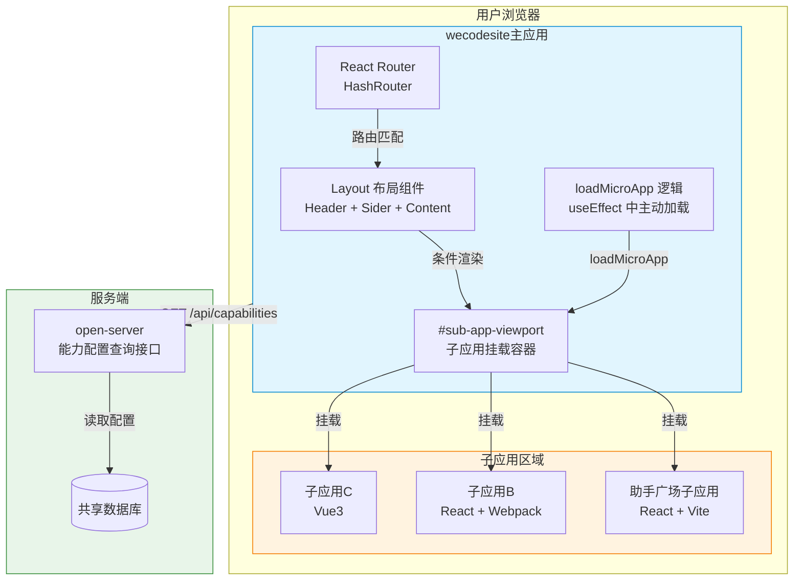

**说明：** wecodesite 作为主应用（基座），通过 HashRouter 管理路由，Layout 组件负责整体布局。当用户访问 /qiankun/* 路径时，Layout 中的 loadMicroApp 逻辑将子应用加载到 #sub-app-viewport 容器中。子应用配置来源通过 open-server API 动态获取。

### 利益相关方

| 利益相关方 | 关注点 | 期望 |
|-----------|--------|------|
| wecodesite 开发 | qiankun 引入对现有项目的影响最小 | 非侵入式集成，不影响自有页面 |
| 子应用开发 | 接入规范清晰，样式隔离 | 微前端接入文档完善，沙箱隔离可靠 |
| 前端架构 | 构建产物不受影响，架构可扩展 | 运行时集成，无需特殊构建配置 |

---

## 4 初始需求分析

### 4.1 初始需求场景分析

| 所属场景 | 场景名称 | 场景简要说明 | 涉及角色 |
|---------|---------|------------|---------|
| 框架引入 | qiankun 依赖安装与配置 | 在 wecodesite 中安装 qiankun 依赖，配置非业务逻辑的框架参数 | 前端开发 |
| 配置获取 | 接口动态获取子应用配置 | wecodesite 启动时调用后端接口获取子应用配置列表 | 系统（自动） |
| 子应用加载 | loadMicroApp 主动加载子应用 | 通过 loadMicroApp 主动加载子应用到指定容器 | 系统（自动） |
| 子应用卸载 | 子应用卸载 | 路由切换离开子应用时，通过 handle.unmount() 卸载 | 系统（自动） |
| 自有页面渲染 | 自有页面正常渲染 | 非子应用路由时，通过 React Router Outlet 渲染自有页面 | 系统（自动） |
| 菜单渲染 | 动态菜单渲染 | 根据接口返回的子应用配置动态渲染左侧导航菜单 | 系统（自动） |

### 4.2 结构化IR（必选）

| IR 属性 | 具体信息 |
|---------|---------|
| IR 标识 | IR-2026-07-WECODESITE-QIANKUN |
| 名称 | wecodesite 接入 qiankun 微前端框架技术方案 |
| 描述 | 在 wecodesite 主应用中引入 qiankun 微前端框架，通过 loadMicroApp 主动加载模式实现子应用的动态加载与卸载，子应用配置通过后端接口动态获取，配合 HashRouter 路由系统实现自有页面与子应用页面的统一管理 |
| 优先级 | 高 |
| 需求描述（why） | 需要将助手广场等业务工程作为子应用嵌入 wecodesite 展示，实现主子应用解耦、独立部署、零代码扩展 |
| what | 1. 安装 qiankun 依赖；2. 配置非业务逻辑的框架参数（沙箱、样式隔离等）；3. 通过后端接口获取子应用配置；4. 实现 loadMicroApp 加载/卸载逻辑；5. 配置路由系统支持子应用与自有页面并行工作 |
| who | wecodesite 前端开发（框架引入与配置）、子应用开发（按规范接入）、后端开发（配置接口） |
| 其他 | wecodesite 使用 HashRouter，qiankun 默认 activeRule 无法直接使用，需采用 loadMicroApp 主动加载模式；loadMicroApp 仅需 name/entry/container 三个参数，不需要 activeRule |
| 对架构要素的影响 | 前端架构（微前端集成模式）、性能（子应用资源加载）、可靠性（子应用加载容错） |

---

## 5 需求影响分析

### 4.1 特性影响分析

**【新增】**

| 特性名称 | 说明 |
|---------|------|
| qiankun 微前端框架依赖 | 新增 qiankun ^2.10.16 依赖包 |
| 子应用配置接口请求模块 | 新增 capabilityApi.js，通过后端接口获取子应用配置 |
| loadMicroApp 加载逻辑 | Layout.jsx 中新增 useEffect 主动加载/卸载子应用逻辑 |
| #sub-app-viewport 挂载容器 | Layout.jsx 中新增条件渲染的子应用挂载容器 |
| qiankun/* 通配路由 | App.jsx 中新增子应用统一路由匹配（必需，防止通配路由拦截） |

**【修改】**

| 特性名称 | 修改说明 |
|---------|---------|
| App.jsx 路由配置 | 新增 qiankun/* 通配路由（element=null），不影响已有路由 |
| Layout.jsx 布局组件 | 新增 loadMicroApp 逻辑和条件渲染容器，不影响已有布局结构 |
| Sidebar.jsx 侧边栏 | 新增微前端应用菜单分类，从接口配置动态渲染菜单项 |

**【删除】**

无删除项。

---

## 5 系统用例分析

### 5.1 用例清单

**表5：用例清单**

| 角色名称 | UseCase 名称 | UseCase 简要说明 | 是否需要细化分析 |
|---------|-------------|-----------------|----------------|
| 前端开发 | UC-01 引入 qiankun 依赖 | 安装 qiankun 依赖包，配置非业务逻辑参数 | 是 |
| 系统 | UC-02 获取子应用配置 | wecodesite 启动时调用后端接口获取子应用配置列表 | 是 |
| 系统 | UC-03 加载子应用 | 用户访问子应用路由时，通过 loadMicroApp 主动加载子应用 | 是 |
| 系统 | UC-04 卸载子应用 | 用户离开子应用路由时，通过 handle.unmount() 卸载子应用 | 是 |
| 系统 | UC-05 渲染自有页面 | 用户访问自有页面路由时，通过 React Router Outlet 正常渲染 | 是 |
| 系统 | UC-06 动态渲染菜单 | 根据接口返回的子应用配置动态渲染左侧导航菜单 | 是 |

### 5.2 用例分析

#### UC-01 引入 qiankun 依赖

**【简要说明】** 在 wecodesite 项目中安装 qiankun 依赖包，配置非业务逻辑的框架参数（沙箱样式隔离、挂载容器、路由通配），确保对现有项目侵入性最小。

**【Actor】** 前端开发

**【前置条件】**
1. wecodesite 项目已搭建完成（React 18 + Vite 5）
2. 项目使用 HashRouter 路由模式

**【最小保证】** qiankun 依赖安装失败时，项目仍可正常运行自有页面功能。

**【成功保证】** qiankun 依赖安装成功，项目可正常启动，自有页面功能不受影响。

**【主成功场景】**
1. 执行 npm install qiankun 安装依赖
2. 在 App.jsx 中新增 qiankun/* 通配路由（防止通配路由 * 拦截子应用路径）
3. 在 Layout.jsx 中新增 loadMicroApp 加载逻辑和条件渲染容器
4. 在 Sidebar.jsx 中新增微前端应用菜单分类
5. 新增 capabilityApi.js 接口请求模块，用于获取子应用配置
6. 启动项目验证自有页面和子应用页面均可正常访问

**【扩展场景】**
- 1a. qiankun 版本与 React 18 不兼容：使用 qiankun ^2.10.16 版本，已支持 React 18
- 2a. 未添加 qiankun/* 路由：子应用路径被通配路由 * 捕获并重定向到 /appList，子应用无法加载
- 4a. loadMicroApp 返回异常：handle 句柄对象可直接调用 unmount() 卸载，无需 await

#### UC-02 获取子应用配置

**【简要说明】** wecodesite 启动时调用后端接口（open-server）获取子应用配置列表，将配置数据传入 Layout 供 loadMicroApp 使用，同时传入 Sidebar 供菜单动态渲染。

**【Actor】** 系统（wecodesite 前端）

**【前置条件】**
1. wecodesite 已加载 qiankun 依赖
2. open-server 服务正常运行，配置查询接口可访问
3. 后端已配置至少一个子应用能力信息

**【最小保证】** 接口请求失败时，wecodesite 展示基础功能页面（自有页面），左侧菜单不显示子应用入口，不影响主应用自身功能。

**【成功保证】** 接口返回配置列表后，wecodesite 左侧菜单根据配置动态生成，配置数据传入 Layout 供 loadMicroApp 使用。

**【主成功场景】**
1. wecodesite 页面加载，渲染主应用基础布局（头部、侧边栏骨架、内容区）
2. wecodesite 调用 open-server API 获取能力配置列表
3. API 返回能力配置数组（按 sortOrder 排序）
4. wecodesite 将配置数据转换为两部分：菜单数据（渲染左侧导航菜单）和子应用加载数据（提取 name、entry 供 loadMicroApp 使用）
5. 配置数据传入 Layout.jsx，供 useEffect 中的 loadMicroApp 匹配使用
6. 左侧菜单渲染完成，显示所有已配置的能力入口

**【扩展场景】**
- 2a. API 请求超时（超过 5s）：显示"配置加载超时"提示，降级展示基础功能
- 2b. API 返回空列表：左侧菜单仅显示 wecodesite 自有功能入口，不加载任何子应用
- 2c. API 返回错误（非 200）：显示"配置加载失败"提示，不影响主应用自身页面渲染
- 3a. 单条配置数据异常（如 entry 为空）：跳过该条配置，控制台输出警告，其他配置正常使用

#### UC-03 加载子应用

**【简要说明】** 用户点击菜单项或直接访问 /#/qiankun/xxx 路径时，Layout 的 useEffect 检测路由变化，从接口配置中匹配子应用，通过 loadMicroApp 主动加载子应用资源并挂载到 #sub-app-viewport 容器。

**【Actor】** 系统（wecodesite 前端）

**【前置条件】**
1. wecodesite 已加载 qiankun 依赖
2. 子应用配置已通过接口获取并传入 Layout
3. 子应用已部署且可访问（CORS 已配置）

**【最小保证】** 子应用加载失败时，显示"页面加载失败"错误提示，不影响主应用布局和其他子应用。

**【成功保证】** 子应用资源加载成功，执行 mount 生命周期，渲染到 #sub-app-viewport 容器。

**【主成功场景】**
1. 用户访问 /#/qiankun/assistant-square 路径
2. HashRouter 匹配 qiankun/* 路由（element=null）
3. Layout 检测 isMicroAppPage = true，条件渲染 #sub-app-viewport 容器
4. Layout useEffect 检测路由变化，从接口配置中通过 routePath 匹配到子应用
5. 调用 loadMicroApp({ name, entry, container }) 主动加载子应用
6. qiankun fetch 子应用 entry HTML，解析脚本和样式
7. qiankun 创建沙箱，执行子应用 bootstrap + mount 生命周期
8. 子应用渲染到 #sub-app-viewport 容器

**【扩展场景】**
- 5a. 接口配置中未匹配到对应子应用：页面显示空白或"未找到对应应用"提示
- 6a. 子应用 entry 不可达：qiankun 加载失败，页面显示"页面加载失败"错误提示
- 7a. 子应用 JS 执行错误：qiankun 沙箱捕获错误，子应用白屏，显示错误边界提示
- 7b. 子应用未导出生命周期函数：loadMicroApp 报错，控制台输出错误日志

#### UC-04 卸载子应用

**【简要说明】** 用户从子应用页面切换到其他页面时，Layout useEffect 的 cleanup 函数执行 handle.unmount()，qiankun 调用子应用 unmount 生命周期，清理 DOM 和沙箱。

**【Actor】** 系统（wecodesite 前端）

**【前置条件】**
1. 当前已有子应用通过 loadMicroApp 加载并挂载到 #sub-app-viewport
2. loadMicroApp 返回的 handle 句柄对象被正确保存

**【最小保证】** 卸载失败时，尝试强制清理 #sub-app-viewport 容器内容，确保后续页面可正常渲染。

**【成功保证】** 子应用 DOM 被清理，沙箱被销毁，#sub-app-viewport 容器清空，条件渲染切回 Outlet。

**【主成功场景】**
1. 用户从 /#/qiankun/assistant-square 导航到 /#/appList
2. Layout useEffect 依赖 currentMicroAppName 从对应值变为 null
3. useEffect cleanup 函数触发，调用 handle.unmount()
4. qiankun 调用子应用 unmount 生命周期
5. 子应用清理 DOM 节点和事件监听
6. qiankun 销毁 JS 沙箱
7. Layout 条件渲染切回 Outlet

**【扩展场景】**
- 3a. handle.unmount() 抛出异常：try-catch 捕获错误，强制清空 #sub-app-viewport innerHTML
- 4a. 子应用 unmount 函数未正确清理定时器/事件监听：可能导致内存泄漏，需子应用接入规范约束

#### UC-05 渲染自有页面

**【简要说明】** 用户访问自有页面路由（如 /#/appList）时，React Router 匹配对应 Route，通过 Outlet 渲染自有页面组件到 Content 区域，不涉及 qiankun 任何逻辑。

**【Actor】** 系统（wecodesite 前端）

**【前置条件】**
1. wecodesite 已启动并渲染 Layout 布局
2. 自有页面路由已正确配置

**【最小保证】** 无（自有页面渲染不依赖 qiankun 和子应用配置）。

**【成功保证】** 自有页面组件正确渲染到 Content 区域，Header + Sider 布局保持完整。

**【主成功场景】**
1. 用户访问 /#/appList 路径
2. HashRouter 匹配 Route path="appList"
3. Layout 检测 isMicroAppPage = false
4. Content 区域渲染 Outlet
5. React Router 通过 Outlet 渲染 AppList 组件
6. 用户看到完整的 Header + Sider + Content 布局，Content 中显示 AppList 页面

**【扩展场景】**
- 1a. 访问未匹配的路由路径：通配路由 * 重定向到 /appList
- 4a. 自有页面组件加载失败：React 错误边界捕获，显示错误提示

#### UC-06 动态渲染菜单

**【简要说明】** wecodesite 获取接口配置后，Sidebar 根据配置数据动态渲染左侧导航菜单的微前端应用部分，包括菜单标题、图标、排序，点击菜单项导航到对应子应用路由。

**【Actor】** 系统（wecodesite 前端）

**【前置条件】**
1. 接口配置已成功获取
2. Sidebar 组件已接收配置数据

**【最小保证】** 接口配置获取失败时，Sidebar 不渲染微前端应用菜单分类，自有页面菜单正常显示。

**【成功保证】** 左侧菜单显示所有已配置的子应用入口，按 sortOrder 排序，点击可导航到子应用页面。

**【主成功场景】**
1. 接口配置数据传入 Sidebar 组件
2. Sidebar 遍历配置数组，生成微前端应用菜单项
3. 每个菜单项包含 key（routePath）、label（title）、icon（iconUrl）
4. 菜单按 sortOrder 排序展示
5. 用户点击菜单项，导航到 /#/qiankun/xxx 路径
6. 当前菜单项高亮显示

**【扩展场景】**
- 2a. 配置项缺少 title 或 routePath：跳过该菜单项，控制台输出警告
- 2b. iconUrl 加载失败：显示默认占位图标

---

## 7 功能设计

### 7.1 功能实现整体设计方案

#### 7.1.1 整体方案

**设计原则：**
1. **运行时集成**：qiankun 通过运行时 JavaScript API 集成，无需特殊构建配置
2. **loadMicroApp 主动加载模式**：兼容 HashRouter，由 Layout 根据路由变化主动控制加载与卸载
3. **接口配置驱动**：子应用配置通过后端接口动态获取，不在项目中维护静态配置文件
4. **条件渲染**：通过 isMicroAppPage 条件切换 #sub-app-viewport 与 Outlet
5. **样式隔离**：启用 experimentalStyleIsolation 沙箱样式隔离
6. **最小侵入**：qiankun 逻辑集中在 Layout.jsx，不影响自有页面和已有路由

**设计约束：**
1. wecodesite 使用 HashRouter，URL 形式为 /#/qiankun/xxx
2. 所有子应用路由统一以 /qiankun/ 为前缀
3. loadMicroApp 仅需 { name, entry, container } 三个参数，不需要 activeRule
4. 子应用必须导出 bootstrap、mount、unmount 生命周期函数
5. 子应用必须配置 CORS 允许主应用跨域拉取资源
6. 所有子应用共用同一个挂载容器 #sub-app-viewport

#### 7.1.2 架构设计方案

##### 逻辑视图

**图3：架构逻辑视图**

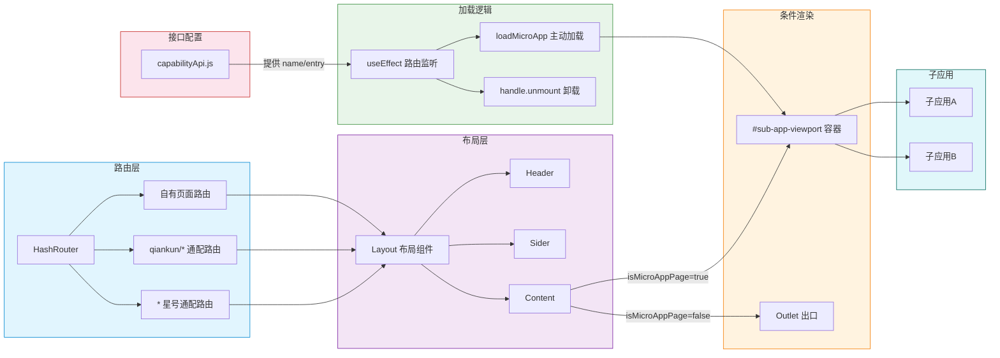

**说明：** 架构分为六层：路由层负责 URL hash 变化的路由匹配；布局层提供 Header/Sider/Content 整体布局；条件渲染层根据 isMicroAppPage 标志切换 #sub-app-viewport 与 Outlet；加载逻辑层通过 useEffect 监听路由变化，调用 loadMicroApp 主动加载或 handle.unmount 卸载子应用；接口配置层通过 capabilityApi.js 获取子应用配置数据；子应用层为各独立部署的子应用实例。

##### 开发视图

```
wecodesite/
├── package.json                    # qiankun 依赖声明
├── vite.config.js                  # Vite 构建配置（无 qiankun 专用配置）
├── src/
│   ├── main.jsx                    # 入口：HashRouter 包裹 App，异步获取配置传入 App
│   ├── App.jsx                     # 路由：自有路由 + qiankun/* 通配路由
│   ├── services/
│   │   └── capabilityApi.js        # 子应用配置接口请求模块（新增）
│   ├── utils/
│   │   └── microAppHelper.js       # 配置转换工具（接口数据 -> loadMicroApp 格式 + 菜单数据）
│   └── components/
│       └── Layout/
│           ├── Layout.jsx          # 布局：loadMicroApp 逻辑 + 条件渲染容器
│           └── Sidebar/
│               └── Sidebar.jsx     # 侧边栏：从接口配置动态渲染菜单
```

| 文件 | 职责 | 是否含业务逻辑 |
|------|------|--------------|
| package.json | 声明 qiankun ^2.10.16 依赖 | 否 |
| vite.config.js | Vite 构建配置，无需 qiankun 专用配置 | 否 |
| main.jsx | 应用入口，HashRouter 包裹 App，异步获取接口配置后传入 App | 否 |
| App.jsx | 路由配置，自有页面路由 + qiankun/* 通配路由 + 星号通配重定向 | 否 |
| capabilityApi.js | 调用后端接口获取子应用配置列表 | 否 |
| microAppHelper.js | 将接口数据转换为 loadMicroApp 格式（name/entry）和菜单数据（title/iconUrl/sortOrder） | 否 |
| Layout.jsx | 布局组件，含 loadMicroApp 主动加载/卸载逻辑和条件渲染容器 | 是（布局逻辑） |
| Sidebar.jsx | 侧边栏菜单，从接口配置动态渲染微前端应用菜单项 | 是（菜单逻辑） |

##### 运行视图

**图4：运行视图**

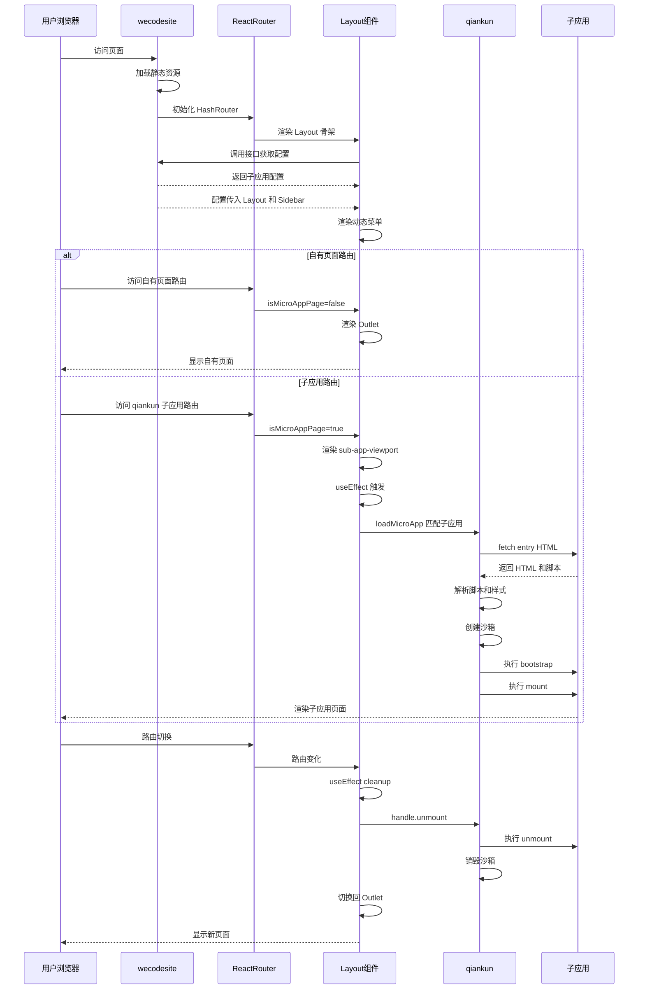

**说明：** 运行视图展示了从用户访问到子应用加载/卸载的完整时序。wecodesite 启动后先渲染 Layout 骨架，再调用接口获取配置，配置传入 Layout 和 Sidebar 后渲染动态菜单。当用户访问自有页面时，走 Outlet 渲染流程；当用户访问子应用路由时，走 loadMicroApp 主动加载流程。路由切换时，useEffect cleanup 触发 handle.unmount 卸载子应用，清理 DOM 和沙箱后切换回 Outlet。

### 7.2 功能实现

#### 7.2.1 qiankun 依赖引入

##### 7.2.1.1 依赖安装

**表1：qiankun 依赖包说明**

| 依赖包 | 版本 | 说明 | 对构建产物的影响 |
|--------|------|------|----------------|
| qiankun | ^2.10.16 | 微前端框架核心包，提供 loadMicroApp API | 增加约 150KB（gzip 后约 50KB）到主应用 chunk |

安装命令：npm install qiankun

**说明：** qiankun 是唯一的微前端依赖包，无需安装额外的插件（如 vite-plugin-qiankun）。qiankun 通过运行时 JavaScript API 工作，不依赖构建时插件。

##### 7.2.1.2 非业务逻辑配置清单

**表2：非业务逻辑配置清单及影响范围**

| 配置项 | 配置位置 | 配置内容 | 影响范围 | 对产物包影响 |
|--------|---------|---------|---------|------------|
| qiankun 依赖 | package.json | "qiankun": "^2.10.16" | 主应用 JS bundle | 增加约 150KB（gzip ~50KB） |
| HashRouter | main.jsx | HashRouter包裹App | 全局路由模式 | 无影响（React Router 已有依赖） |
| qiankun/* 通配路由 | App.jsx | Route path="qiankun/*" element=null | 路由配置 | 无影响（仅路由声明） |
| 子应用配置接口 | capabilityApi.js | 调用后端接口获取 name/entry/routePath 等 | 子应用加载和菜单渲染 | 无影响（运行时请求） |
| 挂载容器 | Layout.jsx | div id="sub-app-viewport" | 子应用渲染位置 | 无影响（DOM 节点） |
| 沙箱配置 | Layout.jsx | sandbox: { experimentalStyleIsolation: true } | 子应用样式隔离 | 无影响（运行时配置） |
| loadMicroApp 逻辑 | Layout.jsx | useEffect 中调用 loadMicroApp | 子应用加载/卸载 | 无影响（运行时逻辑） |
| 微前端菜单 | Sidebar.jsx | 从接口配置动态渲染菜单项 | 侧边栏菜单 | 无影响（运行时渲染） |

##### 7.2.1.3 构建产物包影响分析

**表3：构建产物包影响分析**

| 分析维度 | 说明 | 是否有影响 |
|---------|------|-----------|
| 构建工具配置 | Vite 构建配置无需修改，不需要 vite-plugin-qiankun 等插件 | 无影响 |
| 构建产物结构 | 产物目录结构不变，仍是标准 Vite 输出（dist/ + assets/） | 无影响 |
| HTML 入口 | index.html 结构不变，无需要额外的入口标记 | 无影响 |
| JS bundle 体积 | 新增 qiankun 库代码到主 chunk，增加约 150KB（gzip ~50KB） | 轻微增加 |
| CSS 产物 | 无额外 CSS 产物，qiankun 样式隔离运行时注入 | 无影响 |
| Source Map | qiankun 库代码包含在 source map 中 | 无影响 |
| 分包策略 | qiankun 代码打包到主应用 vendor chunk，不影响懒加载分包 | 无影响 |
| 子应用产物 | 子应用独立构建独立部署，产物不包含在主应用中 | 无影响 |

**图2：构建产物包结构对比图**

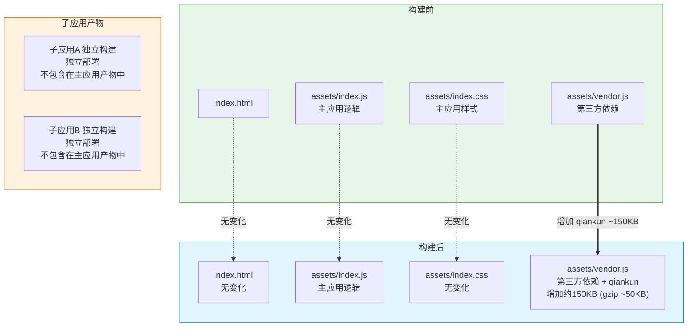

**结论：** qiankun 引入对构建产物包的影响仅限于主应用 JS bundle 体积增加约 150KB（gzip 后约 50KB），构建工具配置、产物目录结构、HTML 入口、CSS 产物均不受影响。子应用独立构建独立部署，产物完全不包含在主应用中。

#### 7.2.2 qiankun 配置详解

##### 7.2.2.1 子应用配置接口设计

子应用配置通过后端接口（open-server）动态获取，不在项目中维护静态配置文件。

**表4：接口配置返回参数说明**

| 接口返回字段 | 类型 | 是否必需 | 用途 | 说明 |
|-------------|------|---------|------|------|
| name | string | 必需 | loadMicroApp 参数 | 子应用唯一标识，如 assistant-square |
| entry | string | 必需 | loadMicroApp 参数 | 子应用资源入口地址，如 //localhost.uat.com:5174 |
| routePath | string | 必需 | 前端路由匹配 | 子应用路由路径，如 /qiankun/assistant-square |
| title | string | 必需 | 菜单渲染 | 菜单显示名称 |
| iconUrl | string | 可选 | 菜单渲染 | 菜单图标地址 |
| description | string | 可选 | 菜单渲染 | 菜单 tooltip 描述 |
| sortOrder | number | 可选 | 菜单排序 | 菜单排序值，按升序排列 |

**关键说明：**
- loadMicroApp 仅需 { name, entry, container } 三个参数，container 固定为 #sub-app-viewport，由前端硬编码，不需要接口返回
- 不需要 activeRule 字段：loadMicroApp 主动加载模式下，子应用的加载与卸载由 Layout 的 useEffect 根据路由变化控制
- routePath 是前端路由匹配的关键字段

**接口返回字段流向图**

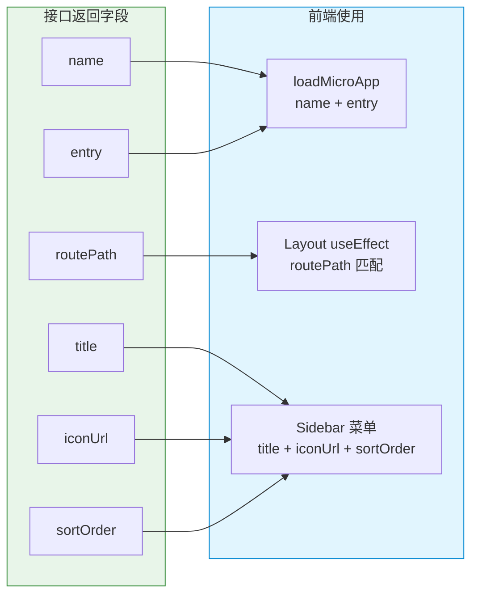

**接口返回数据示例：**

```json
[
    {
        "name": "assistant-square",
        "entry": "//localhost.uat.com:5174",
        "routePath": "/qiankun/assistant-square",
        "title": "助手广场",
        "iconUrl": "https://cdn.example.com/icons/assistant.png",
        "description": "AI 助手广场，浏览和管理各类助手",
        "sortOrder": 1
    },
    {
        "name": "data-center",
        "entry": "//localhost.uat.com:5175",
        "routePath": "/qiankun/data-center",
        "title": "数据中心",
        "iconUrl": "https://cdn.example.com/icons/data.png",
        "description": "数据统计与分析中心",
        "sortOrder": 2
    }
]
```

**前端配置转换逻辑：**

| 转换目标 | 来源字段 | 用途 | 转换逻辑 |
|---------|---------|------|---------|
| loadMicroApp 参数 name | name | 子应用唯一标识 | 直接使用 |
| loadMicroApp 参数 entry | entry | 子应用资源入口 | 直接使用 |
| loadMicroApp 参数 container | 前端硬编码 | 挂载容器 | 固定为 document.getElementById('sub-app-viewport') |
| useEffect 路由匹配 | routePath | 判断当前路由是否匹配子应用 | 从 location.hash 提取路径，与 routePath 匹配 |
| Sidebar 菜单项 key | routePath | 菜单项唯一标识 | 直接使用 |
| Sidebar 菜单项 label | title | 菜单项显示文本 | 直接使用 |
| Sidebar 菜单项 icon | iconUrl | 菜单项图标 | 直接使用 |
| Sidebar 菜单排序 | sortOrder | 菜单排列顺序 | 按 sortOrder 升序排列 |

##### 6.3.2.2 路由配置（App.jsx）与 qiankun 路由必要性分析

**问题：App.jsx 路由配置中一定要添加 qiankun/* 通配路由吗？**

**结论：是的，qiankun/* 通配路由是必需的。**

**原因分析：** wecodesite 的 App.jsx 中存在通配路由 Route path="*" element=Navigate to="/appList"，该路由会匹配所有未被上方路由匹配的路径。如果不添加 qiankun/* 路由，当用户访问 /#/qiankun/assistant-square 时，会被通配路由捕获并重定向到 /appList。

**qiankun 路由必要性分析图**

```mermaid
graph TD
    subgraph 未添加qiankun路由
        A1["用户访问 /#/qiankun/assistant-square"]
        A2["HashRouter 路由匹配"]
        A3["被通配路由 * 捕获"]
        A4["重定向到 /appList"]
        A5["子应用无法加载"]
        A1 --> A2
        A2 --> A3
        A3 --> A4
        A4 --> A5
    end

    subgraph 添加qiankun路由
        B1["用户访问 /#/qiankun/assistant-square"]
        B2["HashRouter 路由匹配"]
        B3["匹配 qiankun/* 路由"]
        B4["element=null Layout渲染"]
        B5["渲染 sub-app-viewport 容器"]
        B6["loadMicroApp 加载子应用"]
        B1 --> B2
        B2 --> B3
        B3 --> B4
        B4 --> B5
        B5 --> B6
    end

    style 未添加qiankun路由 fill:#ffebee,stroke:#c62828
    style 添加qiankun路由 fill:#e8f5e9,stroke:#388e3c
```

**路由匹配优先级说明：**

| 优先级 | 路由路径 | element | 说明 |
|--------|---------|---------|------|
| 1 | appList | AppList | 自有页面-应用列表 |
| 2 | ...其他自有页面路由... | 对应组件 | 其他自有页面 |
| 3 | qiankun/* | null | 子应用通配路由，匹配所有 /qiankun/ 开头路径，element 为 null 表示由 Layout 内部条件渲染处理 |
| 4 | * | Navigate to="/appList" | 兜底通配路由，未匹配的路径重定向到应用列表 |

**说明：** qiankun/* 路由必须放在通配路由 * 之前，否则子应用路径会被通配路由捕获。element 设为 null 表示该路由不渲染特定组件，实际渲染由 Layout 内部通过 isMicroAppPage 条件判断控制（渲染 #sub-app-viewport 或 Outlet）。

##### 6.3.2.3 布局与加载逻辑（Layout.jsx）

**Layout 核心逻辑图**

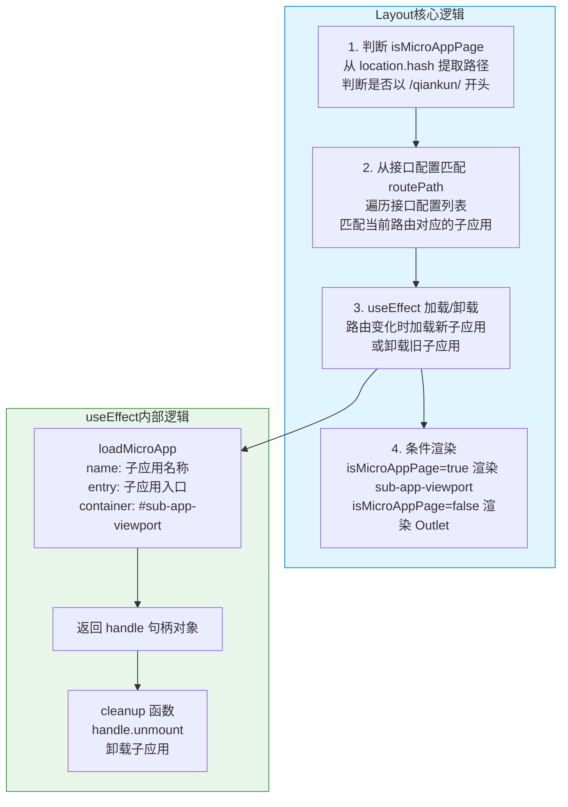

**条件渲染逻辑说明：**

| 条件 | isMicroAppPage | 渲染内容 | 说明 |
|------|---------------|---------|------|
| 当前路由以 /qiankun/ 开头且接口配置中存在匹配 | true | div#sub-app-viewport | 子应用挂载容器，qiankun 将子应用渲染到此容器 |
| 当前路由不以 /qiankun/ 开头 | false | Outlet | React Router Outlet，渲染自有页面组件 |
| 当前路由以 /qiankun/ 开头但接口配置中无匹配 | true | div#sub-app-viewport（空） | 容器渲染但无子应用加载，显示空内容或提示 |

**loadMicroApp 参数说明：**

| 参数 | 值 | 来源 | 说明 |
|------|------|------|------|
| name | 接口配置中的 name 字段 | 接口返回 | 子应用唯一标识，如 assistant-square |
| entry | 接口配置中的 entry 字段 | 接口返回 | 子应用资源入口地址，如 //localhost.uat.com:5174 |
| container | document.getElementById('sub-app-viewport') | 前端硬编码 | 子应用挂载容器 DOM 节点 |

**注意：** loadMicroApp 不需要 activeRule 参数。loadMicroApp 主动加载模式下，子应用的加载与卸载完全由 Layout 的 useEffect 根据路由变化控制，不依赖 qiankun 的自动路由匹配机制。

#### 6.3.3 子应用加载整体流程

##### 6.3.3.1 应用启动与初始化流程

**图5：应用启动与子应用加载整体流程图**

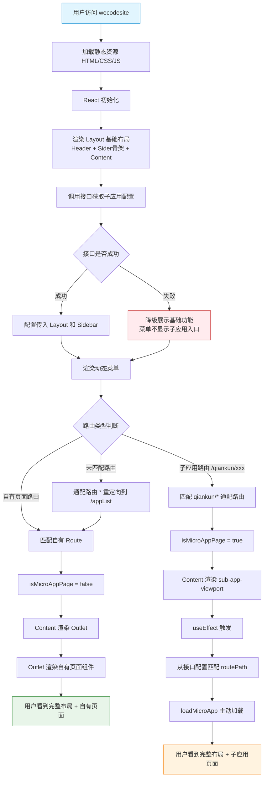

##### 6.3.3.2 子应用加载详细时序图

**图6：子应用加载时序图**

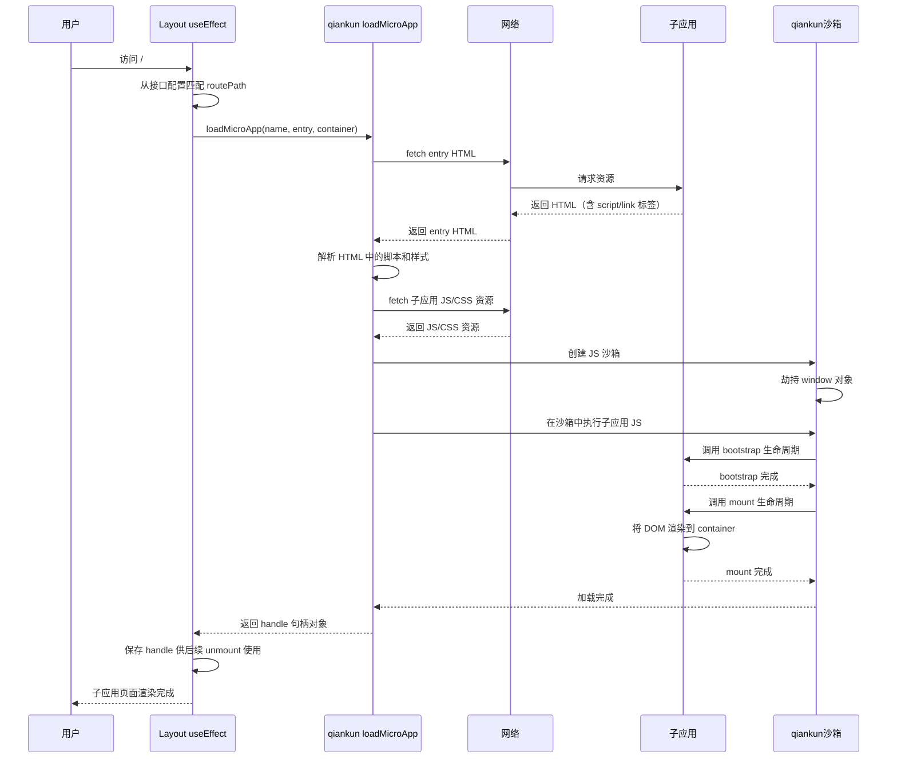

**关键步骤说明：**

| 步骤 | 说明 | 异常处理 |
|------|------|---------|
| 1. routePath 匹配 | 从接口配置列表中查找与当前路由匹配的子应用 | 未匹配到时显示空白或"未找到对应应用"提示 |
| 2. loadMicroApp 调用 | 传入 name/entry/container 三个参数主动加载子应用 | loadMicroApp 返回 Promise，catch 捕获异常 |
| 3. fetch entry HTML | qiankun 通过 fetch 请求子应用入口 HTML | 网络不可达时 loadMicroApp reject，显示错误提示 |
| 4. 解析脚本和样式 | qiankun 解析 HTML 中的 script 和 link 标签 | 解析失败时 loadMicroApp reject |
| 5. 创建沙箱 | qiankun 创建 JS 沙箱隔离子应用全局变量 | 沙箱创建失败时降级为非沙箱模式 |
| 6. 执行子应用 JS | 在沙箱中执行子应用 JavaScript 代码 | JS 执行错误被沙箱捕获，显示错误边界 |
| 7. bootstrap 生命周期 | 调用子应用导出的 bootstrap 函数 | 子应用未导出 bootstrap 时 qiankun 跳过 |
| 8. mount 生命周期 | 调用子应用导出的 mount 函数，传入 container | 子应用未导出 mount 时 loadMicroApp reject |
| 9. 返回 handle | loadMicroApp 返回句柄对象，含 unmount 方法 | handle 对象保存到 ref 供 cleanup 使用 |

##### 6.3.3.3 子应用卸载流程

**图7：子应用卸载时序图**

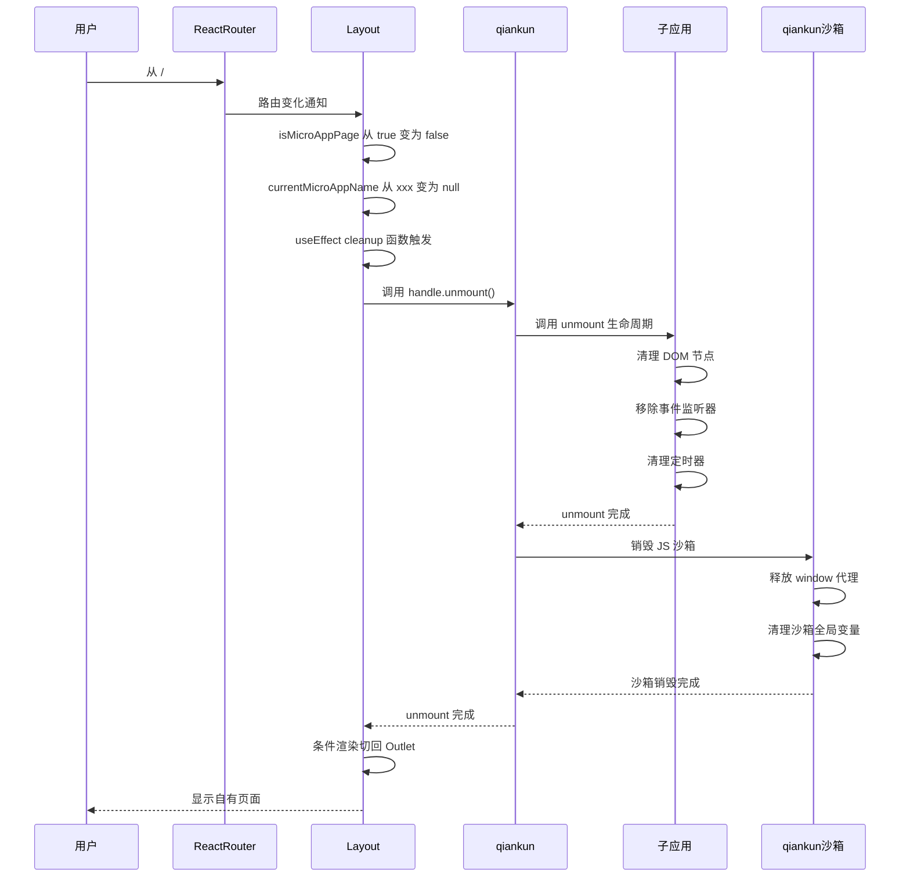

**卸载关键点说明：**

| 关键点 | 说明 | 异常处理 |
|--------|------|---------|
| useEffect cleanup 触发 | React 依赖变化时自动触发 cleanup 函数 | 确保依赖正确设置（currentMicroAppName） |
| handle.unmount() | 调用 loadMicroApp 返回的句柄的 unmount 方法 | try-catch 捕获异常，强制清空容器 innerHTML |
| 子应用 unmount 生命周期 | 子应用需正确清理 DOM、事件监听、定时器 | 子应用接入规范约束，需在 unmount 中清理 |
| 沙箱销毁 | qiankun 销毁 JS 沙箱，释放 window 代理 | 沙箱销毁失败不影响后续页面渲染 |
| 条件渲染切换 | isMicroAppPage 变为 false，渲染切回 Outlet | React 自动处理条件渲染切换 |

#### 6.3.4 自有页面与子应用页面流程对比

##### 6.3.4.1 两套路由系统并行工作示意图

**图8：两套路由系统并行工作示意图**

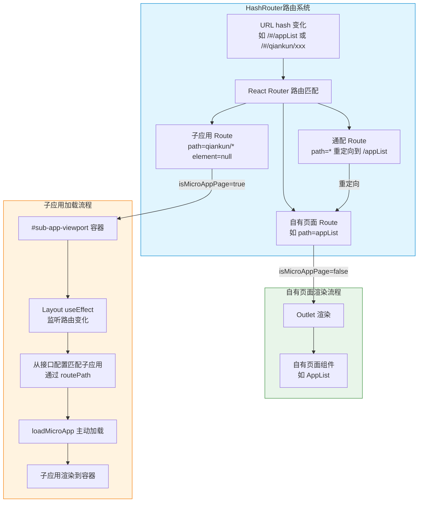

**核心说明：** 两套路由系统并行工作——React Router 负责自有页面的路由匹配和 Outlet 渲染；qiankun loadMicroApp 负责子应用的主动加载和卸载。当 React Router 匹配到 qiankun/* 路由时，element 为 null，Layout 内部通过 isMicroAppPage 条件判断渲染 #sub-app-viewport 容器，useEffect 监听路由变化触发 loadMicroApp 主动加载子应用。两套路由系统互不干扰，自有页面不受 qiankun 影响，子应用不依赖 React Router 的 Outlet。

##### 6.3.4.2 自有页面渲染流程

**图9：自有页面渲染流程图**

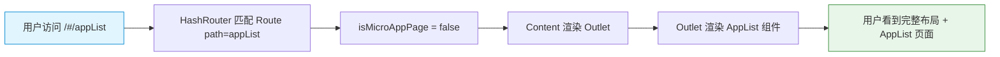

**流程文字说明：**

| 步骤 | 说明 | 涉及组件 |
|------|------|---------|
| 1. 用户访问 | 用户通过菜单或地址栏访问 /#/appList | 浏览器 |
| 2. 路由匹配 | HashRouter 匹配 Route path="appList" | React Router |
| 3. 条件判断 | Layout 检测 isMicroAppPage = false（路径不以 /qiankun/ 开头） | Layout.jsx |
| 4. 渲染 Outlet | Content 区域渲染 React Router Outlet | Layout.jsx |
| 5. 组件渲染 | Outlet 渲染对应的自有页面组件（AppList） | AppList 组件 |
| 6. 页面展示 | 用户看到完整的 Header + Sider + Content 布局 | 浏览器 |

##### 6.3.4.3 子应用页面渲染流程

**图10：子应用渲染流程图**

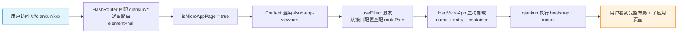

**流程文字说明：**

| 步骤 | 说明 | 涉及组件 |
|------|------|---------|
| 1. 用户访问 | 用户通过动态菜单或地址栏访问 /#/qiankun/xxx | 浏览器 |
| 2. 路由匹配 | HashRouter 匹配 qiankun/* 通配路由，element=null | React Router |
| 3. 条件判断 | Layout 检测 isMicroAppPage = true（路径以 /qiankun/ 开头） | Layout.jsx |
| 4. 渲染容器 | Content 区域渲染 div#sub-app-viewport | Layout.jsx |
| 5. useEffect 触发 | useEffect 检测路由变化，从接口配置中匹配 routePath | Layout.jsx useEffect |
| 6. loadMicroApp 加载 | 调用 loadMicroApp(name, entry, container) 主动加载子应用 | qiankun |
| 7. 生命周期执行 | qiankun 执行子应用 bootstrap + mount 生命周期 | qiankun + 子应用 |
| 8. 页面展示 | 子应用渲染到 #sub-app-viewport，用户看到完整布局 + 子应用页面 | 浏览器 |

##### 6.3.4.4 两种流程对比

| 对比维度 | 自有页面渲染流程 | 子应用页面渲染流程 |
|---------|----------------|------------------|
| 路由匹配 | 匹配具体 Route path（如 appList） | 匹配 qiankun/* 通配路由 |
| element 值 | 对应自有页面组件（如 AppList） | null（由 Layout 内部条件渲染） |
| 渲染方式 | React Router Outlet 渲染 | loadMicroApp 主动加载到 #sub-app-viewport |
| qiankun 参与 | 不参与 | 参与（loadMicroApp 加载/卸载） |
| 配置依赖 | 不依赖接口配置 | 依赖接口配置（name/entry/routePath） |
| 性能开销 | 无额外开销（组件已打包在主应用） | 需 fetch 子应用资源（首次加载有网络开销） |
| 样式隔离 | 无需隔离（主应用内部样式） | experimentalStyleIsolation 沙箱隔离 |
| 卸载方式 | React Router 自动切换组件 | useEffect cleanup 调用 handle.unmount() |
| 布局保持 | Header + Sider + Content 保持 | Header + Sider + Content 保持 |

**两种流程对比图**

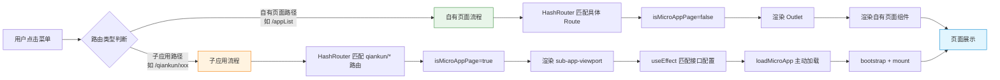

#### 6.3.5 路由切换时的子应用加载与卸载

**图11：路由切换状态图**

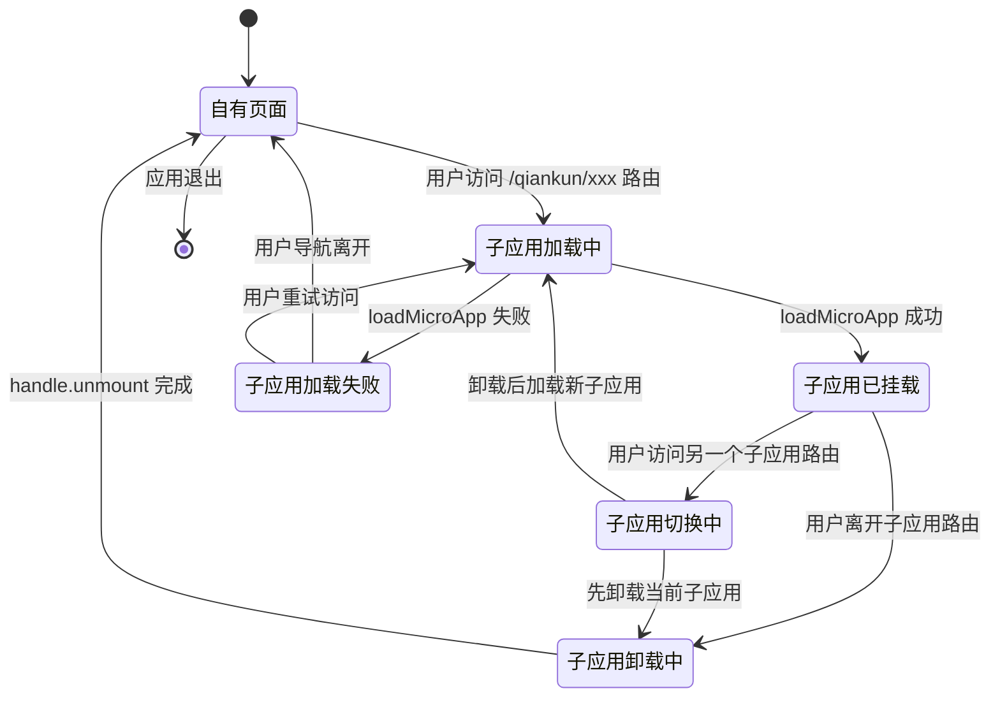

**状态转换说明：**

| 状态转换 | 触发条件 | 执行动作 | 目标状态 |
|---------|---------|---------|---------|
| 自有页面 -> 子应用加载中 | 用户访问 /qiankun/xxx 路由 | isMicroAppPage=true，渲染容器，useEffect 触发 | 子应用加载中 |
| 子应用加载中 -> 子应用已挂载 | loadMicroApp 成功返回 handle | 子应用 bootstrap + mount 完成 | 子应用已挂载 |
| 子应用加载中 -> 子应用加载失败 | loadMicroApp reject 或超时 | 显示错误提示，不影响主应用 | 子应用加载失败 |
| 子应用已挂载 -> 子应用卸载中 | 用户导航到自有页面 | useEffect cleanup，handle.unmount | 子应用卸载中 |
| 子应用已挂载 -> 子应用切换中 | 用户导航到另一个子应用 | 先卸载当前子应用，再加载新子应用 | 子应用切换中 |
| 子应用卸载中 -> 自有页面 | handle.unmount 完成 | 条件渲染切回 Outlet | 自有页面 |
| 子应用切换中 -> 子应用加载中 | 当前子应用卸载完成 | loadMicroApp 加载新子应用 | 子应用加载中 |
| 子应用加载失败 -> 自有页面 | 用户导航离开 | 清理容器内容 | 自有页面 |

#### 6.3.6 功能可靠性分析

| 故障场景 | 影响 | 应对措施 |
|---------|------|---------|
| 接口配置获取失败 | 菜单不显示子应用入口，无法访问子应用 | 降级展示主应用基础功能，显示"配置加载失败"提示，不影响自有页面 |
| 子应用 entry 不可达 | 子应用页面白屏，显示加载错误 | loadMicroApp reject 时显示"页面加载失败"错误提示，不影响主应用布局 |
| 子应用 JS 执行错误 | 子应用白屏或部分功能异常 | qiankun 沙箱捕获错误，显示错误边界提示，用户可导航离开 |
| 子应用未导出生命周期函数 | loadMicroApp 报错，子应用无法加载 | 控制台输出错误日志，页面显示错误提示，需子应用接入规范约束 |
| 子应用 CORS 未配置 | qiankun fetch 子应用资源失败 | 子应用部署时必须配置 CORS，开发环境需配置 devServer CORS |
| loadMicroApp 返回失败 | 子应用无法加载 | catch 捕获异常，显示错误提示，cleanup 中 try-catch 确保容器清理 |
| 路由快速切换 | 可能出现多个 loadMicroApp 并发，导致容器冲突 | useEffect cleanup 中先 unmount 旧 handle，再加载新子应用；使用 ref 保存最新 handle |

#### 6.3.7 功能安全分析

| 安全风险 | 风险说明 | 应对措施 |
|---------|---------|---------|
| 跨域安全 | 子应用资源需要跨域 fetch，存在 CORS 安全风险 | 子应用服务端配置明确的 CORS 允许来源（仅允许主应用域名） |
| XSS 注入 | 子应用可能包含恶意脚本，注入到主应用 DOM | qiankun 沙箱隔离子应用 JS 执行，experimentalStyleIsolation 防止样式注入 |
| 子应用恶意操作 | 子应用可能尝试修改主应用 DOM 或 window 对象 | qiankun JS 沙箱劫持 window 对象，子应用对 window 的修改在沙箱内，不影响主应用 |
| 资源劫持 | 子应用 entry 资源可能被中间人劫持篡改 | 子应用资源使用 HTTPS 部署，配置 CSP 策略限制资源来源 |
| 配置数据安全 | 接口返回的子应用配置可能被篡改 | 接口使用 HTTPS 传输，后端对配置数据进行校验，前端对配置数据做基本格式验证 |

#### 6.3.8 架构元素影响列表

| 架构元素 | 改动类型 | 改动说明 | 对产物包影响 |
|---------|---------|---------|------------|
| package.json | 修改 | 新增 qiankun ^2.10.16 依赖 | JS bundle 增加 ~150KB |
| vite.config.js | 不修改 | 无需 qiankun 专用构建配置 | 无影响 |
| main.jsx | 修改 | 异步获取接口配置后传入 App 组件 | 无影响（运行时逻辑） |
| App.jsx | 修改 | 新增 qiankun/* 通配路由（element=null） | 无影响（路由声明） |
| capabilityApi.js | 新增 | 子应用配置接口请求模块 | 无影响（运行时请求） |
| microAppHelper.js | 新增 | 配置转换工具（接口数据转 loadMicroApp 格式和菜单数据） | 无影响（工具函数） |
| Layout.jsx | 修改 | 新增 loadMicroApp useEffect 逻辑和 #sub-app-viewport 条件渲染 | 无影响（运行时逻辑） |
| Sidebar.jsx | 修改 | 新增微前端应用菜单分类，从接口配置动态渲染 | 无影响（运行时渲染） |

#### 6.3.9 功能实现分解分配清单

**表6：功能实现分解分配清单**

| 任务编号 | 任务名称 | 任务描述 | 对应 US |
|---------|---------|---------|---------|
| TASK-01 | qiankun 依赖安装 | 在 package.json 中新增 qiankun ^2.10.16 依赖，验证与 React 18 兼容性 | US-01 |
| TASK-02 | 路由配置 | 在 App.jsx 中新增 qiankun/* 通配路由（element=null），防止通配路由拦截子应用路径 | US-01 |
| TASK-03 | 接口配置请求模块 | 新增 capabilityApi.js，调用后端接口获取子应用配置列表 | US-02 |
| TASK-04 | 配置转换工具 | 新增 microAppHelper.js，将接口数据转换为 loadMicroApp 格式和菜单数据 | US-02 |
| TASK-05 | Layout 加载逻辑 | 在 Layout.jsx 中新增 loadMicroApp useEffect 逻辑和 #sub-app-viewport 条件渲染 | US-03 |
| TASK-06 | Sidebar 菜单渲染 | 在 Sidebar.jsx 中新增微前端应用菜单分类，从接口配置动态渲染 | US-06 |
| TASK-07 | 沙箱样式隔离配置 | 配置 experimentalStyleIsolation: true，验证主子应用样式隔离效果 | US-03 |
| TASK-08 | 容错处理 | 接口失败降级展示；loadMicroApp 失败时降级显示错误提示，不影响主应用 | US-02 |

---

## 8 系统级非功能设计

### 8.1 系统级 FMEA 影响分析

| 失效模式 | 失效原因 | 失效影响 | 严重度 | 发生度 | 检测度 | RPN | 应对措施 |
|---------|---------|---------|--------|--------|--------|-----|---------|
| 子应用 entry 不可达 | 子应用未部署、服务宕机、网络故障 | 子应用页面白屏，显示加载错误 | 7 | 3 | 4 | 84 | loadMicroApp catch 捕获，显示错误提示，不影响主应用 |
| 子应用 JS 执行错误 | 子应用代码 bug、依赖缺失 | 子应用白屏或功能异常 | 6 | 4 | 5 | 120 | qiankun 沙箱捕获错误，显示错误边界，用户可导航离开 |
| 子应用 CORS 未配置 | 子应用服务端未配置 CORS 允许主应用域名 | qiankun fetch 子应用资源失败 | 8 | 3 | 3 | 72 | 子应用部署 checklist 必须包含 CORS 配置验证 |
| loadMicroApp 竞态 | 路由快速切换导致多个 loadMicroApp 并发 | 容器 DOM 冲突，子应用渲染异常 | 7 | 3 | 5 | 105 | useEffect cleanup 先 unmount 旧 handle，ref 保存最新 handle |
| 沙箱内存泄漏 | 子应用 unmount 未清理定时器/事件监听 | 内存占用持续增长 | 5 | 4 | 7 | 140 | 子应用接入规范约束 unmount 必须清理，定期内存监控 |
| 接口配置获取失败 | open-server 服务不可用、网络故障 | 菜单不显示子应用入口 | 6 | 2 | 3 | 36 | 降级展示基础功能，显示重试按钮 |

### 8.2 系统级安全影响分析

| 安全维度 | 风险分析 | 安全措施 |
|---------|---------|---------|
| 跨域安全 | 子应用资源跨域 fetch，存在 CORS 安全风险 | 子应用服务端配置明确的 CORS 允许来源，仅允许主应用域名 |
| 沙箱隔离 | 子应用 JS 可能修改主应用 window 或 DOM | qiankun JS 沙箱劫持 window 对象，子应用修改隔离在沙箱内 |
| 资源完整性 | 子应用 entry 资源可能被篡改 | 子应用使用 HTTPS 部署，配置 CSP 策略限制资源来源 |
| DOM 安全 | 子应用可能注入恶意 DOM 节点 | experimentalStyleIsolation 样式隔离，子应用 DOM 限制在容器内 |
| 配置数据安全 | 接口配置数据可能被篡改 | 接口使用 HTTPS 传输，后端校验配置数据，前端做格式验证 |

### 8.3 兼容性

#### 后向兼容性确认

| 兼容性项 | 说明 | 是否兼容 |
|---------|------|---------|
| 现有 wecodesite 自有功能 | qiankun 逻辑集中在 Layout.jsx，不影响自有页面渲染和路由 | 兼容 |
| 现有路由配置 | 新增 qiankun/* 通配路由放在通配路由 * 之前，不影响已有路由匹配 | 兼容 |
| 构建 toolchain | Vite 构建配置无需修改，qiankun 通过运行时 API 工作 | 兼容 |
| 现有依赖 | qiankun ^2.10.16 与 React 18 兼容，不与现有依赖冲突 | 兼容 |

#### 前向兼容性确认

| 兼容性项 | 说明 | 是否兼容 |
|---------|------|---------|
| 后续新增子应用（仅需接口配置） | 新增子应用仅需在后端接口添加配置，wecodesite 无需改代码 | 兼容 |
| 子应用技术栈扩展 | qiankun 支持任意技术栈子应用（React/Vue/Angular 等），只要导出生命周期函数 | 兼容 |

### 8.4 可运维

| 运维维度 | 设计说明 |
|---------|---------|
| 子应用独立部署 | 子应用独立构建、独立部署，不依赖主应用发版；主应用通过接口配置发现新子应用 |
| 配置管理 | 子应用配置通过后端接口动态管理，新增/修改/删除子应用仅需修改后端配置，无需前端发版 |
| 日志监控 | loadMicroApp 加载失败、子应用 JS 执行错误等通过 console.error 输出；建议接入前端监控系统采集错误 |
| 健康检查 | 子应用 entry 可达性可通过健康检查接口监控；接口配置可用性可通过 open-server 健康检查保障 |
| 故障恢复 | 子应用加载失败时降级显示错误提示，不影响主应用；接口配置失败时降级展示基础功能 |

### 8.5 资料

| 资料类型 | 说明 |
|---------|------|
| 子应用接入指南 | 详细说明子应用如何导出 bootstrap/mount/unmount 生命周期、配置 CORS、适配 qiankun 沙箱 |
| 接口配置说明 | 详细说明后端接口返回参数格式（name/entry/routePath/title/iconUrl/sortOrder）及各字段用途 |
| 故障排查手册 | 常见问题排查指南，包括子应用加载失败、CORS 配置问题、样式冲突、沙箱报错等 |

---

## 9 checkList（必填）

### 9.1 设计自检清单要求（必填）

| check 点 | 是否达标 | 说明 |
|---------|---------|------|
| qiankun 依赖版本是否明确 | 是 | 使用 qiankun ^2.10.16，已验证与 React 18 兼容 |
| 非业务逻辑配置是否完整列出 | 是 | 第6.3.1.2节表2列出了8项非业务逻辑配置及其影响范围 |
| 构建产物包影响是否明确分析 | 是 | 第6.3.1.3节表3详细分析了8个维度的影响，结论为仅 JS bundle 增加 ~150KB |
| 是否需要特殊构建配置 | 是 | 明确说明不需要 vite-plugin-qiankun 等构建插件，qiankun 通过运行时 API 工作 |
| 子应用配置是否通过接口获取 | 是 | 第6.3.2.1节明确了接口返回参数（name/entry/routePath/title/iconUrl/sortOrder），不使用静态配置文件 |
| loadMicroApp 参数是否明确 | 是 | 仅需 name/entry/container 三个参数，不需要 activeRule |
| qiankun/* 路由必要性是否分析 | 是 | 第6.3.2.2节分析了不添加该路由会导致子应用路径被通配路由拦截重定向 |
| 子应用加载整体流程是否清晰 | 是 | 第6.3.3节通过时序图和流程图详细描述了加载和卸载完整流程 |
| 自有页面与子应用流程对比是否清晰 | 是 | 第6.3.4节通过流程图和对比表详细对比了两种渲染流程的差异 |
| 两套路由系统并行机制是否说明 | 是 | 第6.3.4.1节通过示意图说明了 React Router 与 qiankun loadMicroApp 的并行工作机制 |
| HashRouter 约束是否说明 | 是 | 明确说明 HashRouter 下 pathname 始终为 /，需采用 loadMicroApp 主动加载模式 |
| 样式隔离方案是否说明 | 是 | 启用 experimentalStyleIsolation: true 沙箱样式隔离 |
| 所有用例是否都细化分析 | 是 | 第5.2节对UC-01至UC-06全部6个用例进行了细化分析 |
| 可靠性分析是否覆盖关键故障场景 | 是 | 第6.3.6节分析了7类故障场景及应对措施 |
| 安全分析是否覆盖主要安全风险 | 是 | 第6.3.7节分析了5类安全风险及措施 |
| 兼容性是否确认 | 是 | 第7.3节确认了后向和前向兼容性 |
| 是否使用了 mermaid 图配合文字说明 | 是 | 全文使用了多个 mermaid 图（流程图/时序图/状态图）配合表格和文字说明 |
| 是否避免了大段纯文字 | 是 | 内容以图表为主，文字为辅，每段文字均配合图表说明 |
| 是否满足"不使用 useCallback"规则 | 是 | 文档中未涉及 useCallback 的使用 |
| 是否满足"不体现代码提交内容"规则 | 是 | 文档为技术设计说明，不含代码提交相关内容 |
