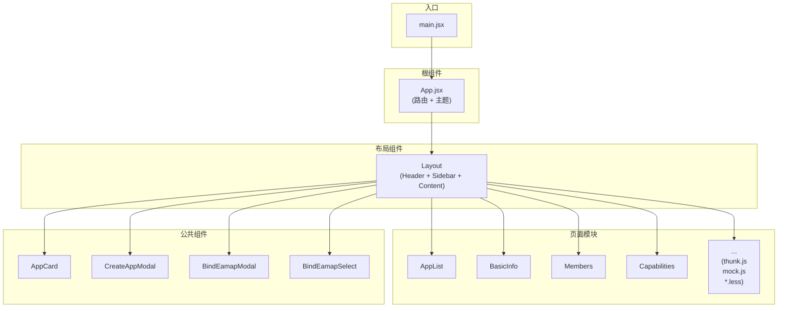
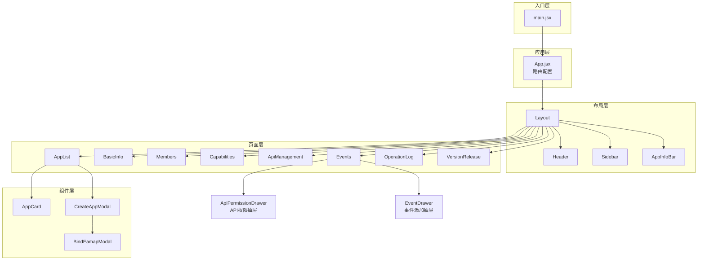
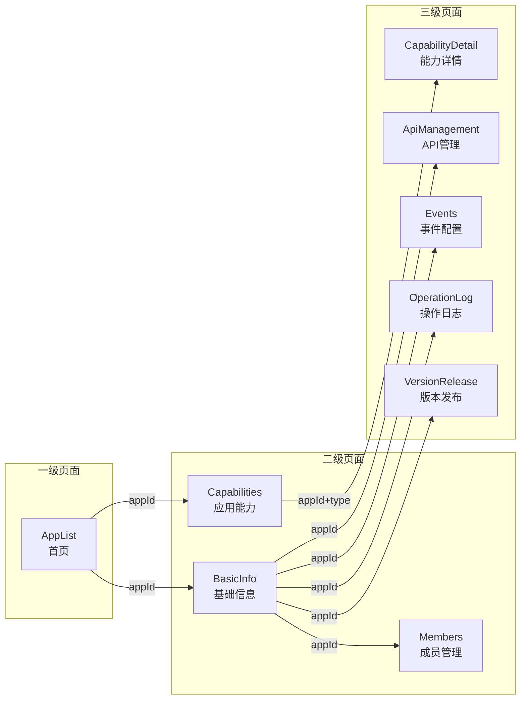
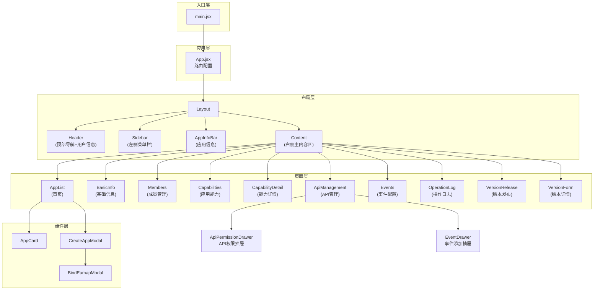
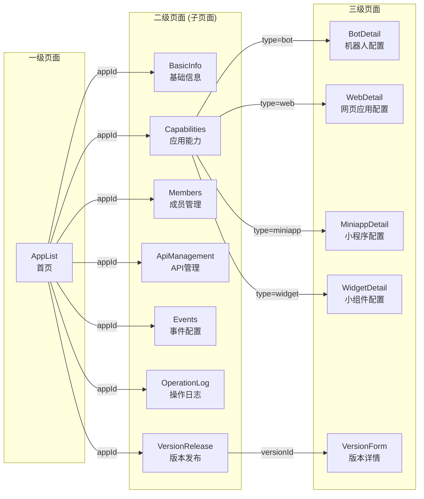

# Project Knowledge Generator

This skill analyzes a project and generates a comprehensive knowledge document that helps AI quickly understand the project, including its purpose, pages, components, and API calls.

## When to Use

- User wants to understand the project structure and purpose
- User wants to know what APIs are called in each page/component
- User wants to generate a knowledge document for AI reference
- User asks "what does this project do" or "how does this project work"

## Confirmation Workflow

Before generating the knowledge document, confirm with the user:

1. **Purpose confirmation**: What is the context/purpose of documenting this project?
2. **Scope confirmation**: Are there any specific areas/pages/components to focus on or exclude?
3. **Output confirmation**: Where should the knowledge document be saved?

## Documentation Output

The generated document will include:

### 1. Project Overview
- Project name and description
- Technology stack (React, Vue, etc.)
- Purpose and main features

### 2. Project Modules (项目模块结构)
- **Module name**: Name of each module in the project
- **Module description**: What the module does
- **Files included**: List of files in each module
- **Dependencies**: Other modules or packages it depends on

For each module, identify:
- Core business modules (pages)
- Shared components
- Utility functions
- Configuration files
- Entry points

### 2.1 Architecture Diagram (架构图)
Use Mermaid flowchart to show the overall project architecture:



### 2.2 Module Relationship Diagram (模块关系图)
Show how modules depend on each other using Mermaid:



### 2.3 Page Flow Diagram (页面流程图)
Show user navigation flow using Mermaid:



### 3. Directory Structure
- Complete file tree with descriptions for each directory and key files

### 3. Pages Documentation
For each page:
- **Purpose**: What the page does
- **Route**: URL route
- **Components used**: List of child components
- **API calls**: All API endpoints called (from thunk.js, mock.js)
- **Key functions**: Important functions and their purposes

### 4. Components Documentation
For each component:
- **Purpose**: What the component does
- **Props**: Input parameters
- **Events**: Output events/callbacks

### 5. API Reference
Complete list of all API endpoints:
- **Endpoint name**: Function name
- **File location**: Where it's defined
- **Purpose**: What it does
- **Parameters**: Input parameters
- **Return value**: What it returns

## Implementation Steps

### Step 1: Analyze Project Structure
1. Scan the `src` directory to understand the project structure
2. Identify pages, components, and utility files
3. Identify API-related files (thunk.js, mock.js, services/, api/)

### Step 2: Analyze Project Modules
For each module identified in the project:
1. **Core Business Modules (pages/)**: Analyze each page directory
   - Page component (PageName.jsx)
   - Route configuration (route.js)
   - API calls (thunk.js)
   - Mock data (mock.js)
   - Styles (PageName.m.less)
2. **Shared Components (components/)**: Analyze reusable components
   - Component files
   - Style files
3. **Layout Components**: Header, Sidebar, AppInfoBar
4. **Entry Points**: App.jsx, main.jsx
5. Document each module:
   - Module name and purpose
   - Files included
   - Dependencies on other modules
   - Key exports

### Step 3: Analyze Each Page
For each page in the `pages` directory:
1. Read the page component file
2. Read the associated thunk.js file to identify API calls
3. Read the associated mock.js file to understand data structures
4. Document:
   - Page route
   - Purpose
   - API functions called
   - Key state and handlers

### Step 4: Analyze Components
For each component in the `components` directory:
1. Read the component file
2. Document:
   - Component purpose
   - Props/parameters
   - Events emitted
   - Child components used

### Step 5: Aggregate API Information
From all thunk.js and mock.js files:
1. List all exported functions
2. Categorize by functionality (fetch, create, update, delete)
3. Document parameters and return values

### Step 6: Generate Knowledge Document
Create a comprehensive markdown document with:
1. Project overview
2. **Project modules** - Detailed module structure and descriptions
3. Directory structure
4. Page-by-page analysis with API calls
5. Component catalog
6. Complete API reference

## Output Format

The knowledge document should be saved to:
`.trae/skills/project-knowledge/output/<timestamp>-knowledge.md`

## Document Template

```markdown
# <Project Name> - 知识文档

## 1. 项目概述

**项目名称**: <name>
**项目描述**: <description>
**技术栈**: <tech stack>

## 2. 项目模块结构

描述项目中所有模块及其功能：

### 2.1 项目架构图


### 2.2 模块关系图



### 2.3 页面导航流程图



### 2.4 核心业务模块 (pages/)

| 模块名称 | 目录 | 功能描述 | 包含文件 |
|----------|------|----------|----------|
| 模块1 | pages/Module1 | 模块功能描述 | PageName.jsx, route.js, thunk.js, mock.js, *.less |

### 2.5 公共组件 (components/)

| 组件名称 | 目录 | 功能描述 |
|----------|------|----------|
| 组件1 | components/Component1 | 组件功能描述 |

### 2.6 布局组件

| 组件名称 | 功能描述 |
|----------|----------|
| Header | 顶部导航栏 |
| Sidebar | 侧边导航菜单 |
| AppInfoBar | 应用信息栏 |

### 2.7 其他模块

| 模块名称 | 功能描述 |
|----------|----------|
| styles | 全局样式 |
| App.jsx | 根组件/路由配置 |
| main.jsx | 应用入口 |

```

## 3. 目录结构

```
<directory tree>
```

## 4. 页面概览

| 页面 | 路由 | 主要功能 | 调用接口 |
|------|------|----------|----------|
| <page1> | /route1 | <purpose> | fetchXxx, createYyy |
| <page2> | /route2 | <purpose> | fetchZzz |

## 5. 页面详细分析

### 5.1 <Page Name>

**文件**: `src/pages/PageName/PageName.jsx`
**路由**: `/page-route`
**功能描述**: <description>

**API 调用**:
| 函数名 | 文件 | 功能 | 参数 | 返回值 |
|--------|------|------|------|--------|
| fetchXxx | thunk.js | 获取xxx列表 | - | Array |
| createYyy | thunk.js | 创建yyy | {name, desc} | Object |

**关键代码片段**:
```javascript
// Example of API usage in this page
const data = await fetchXxx();
```

## 6. 组件概览

| 组件 | 文件 | 功能 | Props |
|------|------|------|-------|
| Header | components/Header | 顶部导航 | - |
| Sidebar | components/Sidebar | 侧边菜单 | collapsed, onCollapse |

## 7. API 参考

### 7.1 应用相关

#### fetchAppList
- **文件**: `src/pages/AppList/thunk.js`
- **功能**: 获取应用列表
- **参数**: 无
- **返回值**: `Array<{id, name, icon, status, ...}>`

#### createApp
- **文件**: `src/pages/AppList/thunk.js`
- **功能**: 创建新应用
- **参数**: `{chineseName, englishName, icon, eamap, ...}`
- **返回值**: `Object` (新创建的应用对象)

... (continue for all APIs)

## 8. 数据模型

### App
```typescript
interface App {
  id: string;
  name: string;
  icon: string;
  status: string;
  owner: string;
  role: string;
  eamap: string | null;
  updateTime: string;
}
```

... (continue for other data models)
```

## Quality Standards

- **Complete**: Cover all pages, components, and API functions
- **Accurate**: Use exact file paths and function names from the codebase
- **Structured**: Use tables and clear headings for easy lookup
- **Actionable**: Include parameter types and return values for all APIs
