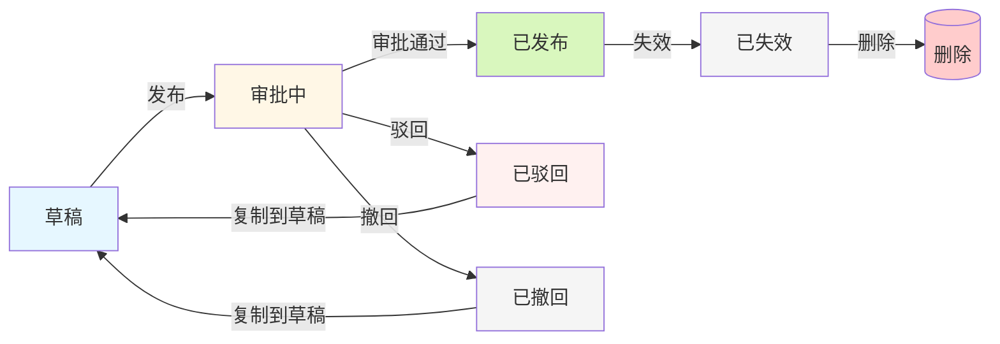

# 连接平台页面交互文档

## 目录

1. [连接器管理页面 (connector-list.html)](#1-连接器管理页面)
2. [接口配置页面 (connector-editor.html)](#2-接口配置页面)
3. [连接流管理页面 (flow-list.html)](#3-连接流管理页面)
4. [连接流编辑器页面 (flow-editor.html)](#4-连接流编辑器页面)
5. [审批中心页面 (approval-center.html)](#5-审批中心页面)
6. [运行记录页面 (flow-run-log.html)](#6-运行记录页面)

---

## 1. 连接器管理页面

### 1.1 页面概述

| 属性 | 描述 |
|------|------|
| 页面名称 | 连接器管理 |
| 页面标题 | 连接器管理 |
| 页面描述 | 管理平台的连接器配置，包括触发事件和执行动作的定义 |
| 导航入口 | 左侧导航栏 - 连接器管理 |

### 1.2 页面结构

```
┌─────────────────────────────────────────────────────────────────┐
│  左侧导航栏 (220px)  │           主内容区域                     │
│  ┌─────────────────┐ │  ┌─────────────────────────────────┐   │
│  │ 连接平台         │ │  │ 页面头部                         │   │
│  ├─────────────────┤ │  │ - 标题: 连接器管理                │   │
│  │ ⚡ 连接器管理 √  │ │  │ - 描述: ...                     │   │
│  │ 🔗 连接流管理    │ │  │ - 按钮: + 新建连接器             │   │
│  └─────────────────┘ │  ├─────────────────────────────────┤   │
│                      │  │ 搜索表单                         │   │
│                      │  │ [搜索框] [搜索] [重置]          │   │
│                      │  ├─────────────────────────────────┤   │
│                      │  │ 表格列表                         │   │
│                      │  │ - 连接器ID / 中文名称 / 英文名称  │   │
│                      │  │ - 类型 / 中文描述 / 英文描述      │   │
│                      │  │ - 创建时间 / 更新时间 / 操作      │   │
│                      │  ├─────────────────────────────────┤   │
│                      │  │ 分页器                           │   │
│                      │  └─────────────────────────────────┘   │
└─────────────────────────────────────────────────────────────────┘
```

### 1.3 功能交互

#### 1.3.1 搜索功能

| 操作 | 输入 | 触发条件 | 行为 |
|------|------|----------|------|
| 搜索 | 关键词 | 点击"搜索"按钮或按Enter键 | 根据中英文名称过滤列表，重置到第1页 |
| 重置 | - | 点击"重置"按钮 | 清空搜索框，恢复完整列表，重置到第1页 |

#### 1.3.2 新建/编辑连接器

| 操作 | 触发条件 | 行为 |
|------|----------|------|
| 打开新建弹窗 | 点击"新建连接器"按钮 | 弹出模态框，表单标题改为"新建连接器"，清空表单 |
| 打开编辑弹窗 | 点击表格中的"编辑"按钮 | 弹出模态框，表单标题改为"编辑连接器"，填充现有数据 |
| 提交表单 | 点击弹窗"保存"按钮 | 验证必填项(中文名称、英文名称)，保存数据，关闭弹窗，刷新列表 |
| 取消 | 点击弹窗"取消"按钮或点击遮罩或按ESC | 关闭弹窗，不保存数据 |

#### 1.3.3 状态操作

| 操作 | 触发条件 | 前置条件 | 行为 |
|------|----------|----------|------|
| 配置 | 点击"配置"按钮 | 无 | 跳转到 connector-editor.html?id=xxx |
| 失效 | 点击"失效"按钮 | 连接器未失效 | 弹出确认框，提示"确认要将xxx设为失效状态吗？失效后可删除该连接器"，确认后标记为失效 |
| 删除 | 点击"删除"按钮 | 连接器已失效 | 弹出确认框，提示"删除后将无法恢复"，确认后从列表移除 |

#### 1.3.4 分页功能

| 操作 | 行为 |
|------|------|
| 点击页码 | 切换到对应页面 |
| 点击"上一页"/"下一页" | 切换到相邻页面 |
| 切换每页条数 | 更新分页大小，重置到第1页 |

### 1.4 表单字段

| 字段名 | 类型 | 必填 | 最大长度 | 验证规则 |
|--------|------|------|----------|----------|
| 类型 | 下拉框 | 是 | - | 固定为"HTTP" |
| 中文名称 | 文本框 | 是 | 128 | 不能为空 |
| 英文名称 | 文本框 | 是 | 128 | 不能为空 |
| 中文描述 | 文本域 | 否 | 500 | - |
| 英文描述 | 文本域 | 否 | 512 | - |

### 1.5 模态框规格

| 模态框 | 宽度 | 用途 |
|--------|------|------|
| 新建/编辑连接器 | max-width: 520px | 创建或编辑连接器基本信息 |
| 确认删除 | max-width: 420px | 失效/删除操作的二次确认 |

### 1.6 Toast提示

| 类型 | 场景 |
|------|------|
| success | 创建成功、编辑成功、失效成功、删除成功 |
| error | 必填项为空 |

---

## 2. 接口配置页面

### 2.1 页面概述

| 属性 | 描述 |
|------|------|
| 页面名称 | 接口配置 |
| 页面标题 | 接口配置 |
| 页面描述 | 编辑连接器的接口配置信息 |
| 导航入口 | 连接器管理 → 配置按钮 |
| 页面特性 | 支持版本切换、编辑/保存模式切换 |

### 2.2 页面结构

```
┌─────────────────────────────────────────────────────────────────┐
│  左侧导航栏 (220px)  │           主内容区域                     │
│  ┌─────────────────┐ │  ┌─────────────────────────────────┐   │
│  │ 连接平台         │ │  │ 页面头部 (固定定位)              │   │
│  ├─────────────────┤ │  │ [返回] 接口配置                  │   │
│  │ ⚡ 连接器管理 √  │ │  └─────────────────────────────────┘   │
│  │ 🔗 连接流管理    │ │  ┌─────────────────────────────────┐   │
│  └─────────────────┘ │  │ 版本选择卡片                      │   │
│                      │  │ [版本下拉框] [编辑] [发布]       │   │
│                      │  │ [复制到草稿] [失效] [删除]       │   │
│                      │  ├─────────────────────────────────┤   │
│                      │  │ 接口配置卡片                      │   │
│                      │  │ - 协议类型: GET/POST/PUT/DELETE  │   │
│                      │  │ - 协议地址: URL输入框             │   │
│                      │  ├─────────────────────────────────┤   │
│                      │  │ 认证方式配置卡片                 │   │
│                      │  │ - 多选框: SOA/APIG/Cookie/签名   │   │
│                      │  │ - 动态显示认证参数表单           │   │
│                      │  ├─────────────────────────────────┤   │
│                      │  │ 入参配置卡片                     │   │
│                      │  │ [HTTP请求头] [HTTP请求体] [URL]  │   │
│                      │  ├─────────────────────────────────┤   │
│                      │  │ 出参配置卡片                     │   │
│                      │  │ [HTTP请求头] [HTTP请求体]        │   │
│                      │  └─────────────────────────────────┘   │
└─────────────────────────────────────────────────────────────────┘
```

### 2.3 版本状态与按钮

| 版本状态 | 显示按钮 | 按钮行为 |
|----------|----------|----------|
| 草稿(Draft) | 编辑、发布 | 点击编辑进入编辑模式；点击发布设为已发布状态 |
| 已发布(Published) | 复制到草稿、失效 | 点击复制创建新草稿版本；点击失效设为已失效 |
| 已失效(Invalid) | 复制到草稿、删除 | 点击复制创建新草稿版本；点击删除移除版本 |

### 2.4 功能交互

#### 2.4.1 版本管理

| 操作 | 触发条件 | 行为 |
|------|----------|------|
| 切换版本 | 选择下拉框选项 | 如果在编辑状态则退出编辑；更新按钮状态；显示Toast提示当前版本 |

版本按钮显示规则：

| 版本状态 | 显示按钮 | 按钮行为 |
|----------|----------|----------|
| 草稿(Draft) | 编辑、发布 | 编辑：进入编辑模式；发布：将版本设为已发布状态 |
| 已发布(Published) | 复制到草稿、失效 | 复制到草稿：创建新的草稿版本；失效：将版本设为已失效 |
| 已失效(Invalid) | 复制到草稿、删除 | 复制到草稿：创建新的草稿版本；删除：移除该版本 |

#### 2.4.2 编辑与保存

| 操作 | 触发条件 | 行为 |
|------|----------|------|
| 进入编辑模式 | 点击"编辑"按钮 | 按钮文本变为"保存"；表单控件可编辑；显示入参/出参的添加按钮 |
| 保存配置 | 点击"保存"按钮 | 收集所有配置数据（协议类型、协议地址、认证参数、入参、出参）；显示Toast提示"保存成功"；退出编辑模式 |
| 退出编辑模式 | 点击"保存"后自动退出 | 表单控件恢复禁用状态；隐藏添加按钮 |

**编辑模式说明：**
- 进入编辑模式后，页面中所有表单控件变为可编辑状态
- 未编辑状态下，页面为只读模式
- 编辑状态下可修改：协议类型、协议地址、认证方式、入参配置、出参配置

#### 2.4.3 协议类型切换

| 操作 | 行为 |
|------|------|
| 点击协议按钮 | 高亮选中项；更新配置数据 |

#### 2.4.4 认证方式配置

| 操作 | 行为 |
|------|------|
| 勾选认证类型 | 调用handleAuthTypeChange；动态渲染对应认证参数表单 |
| 认证类型参数 | 根据类型显示不同参数：SOA/APIG显示参数名、类型、位置；Cookie可编辑值来源；数字签名显示签名值和签名密钥 |

#### 2.4.5 入参/出参配置

| 操作 | 行为 |
|------|------|
| 切换Tab | 点击Tab按钮；切换参数列表显示 |
| 添加参数 | 点击"添加参数"按钮；新增一行参数输入项 |
| 编辑参数 | 输入参数名称、类型、描述 |
| 删除参数 | 点击参数行的删除按钮；移除该参数行 |
| 类型变更 | object/array类型显示下拉框(添加子节点/添加兄弟节点)；基础类型直接添加兄弟节点 |

### 2.5 表单字段

#### 接口配置

| 字段名 | 类型 | 说明 |
|--------|------|------|
| 协议类型 | 单选按钮组 | GET/POST/PUT/DELETE/PATCH |
| 协议地址 | 文本框 | URL地址输入 |

#### 认证参数(动态)

| 认证类型 | 参数字段 |
|----------|----------|
| SOA | 参数名称、类型(固定string)、位置(header/body/query)、值来源(固定) |
| APIG | 参数名称、类型(固定string)、位置(header/body/query)、值来源(固定) |
| Cookie | 参数名称、类型(固定string)、位置(header/body/query)、值来源(可编辑) |
| 数字签名 | 参数名称、类型(固定string)、位置、签名值、签名密钥 |

### 2.6 页面禁用状态

在非编辑模式下，以下控件被禁用：
- 协议地址输入框
- 协议类型按钮组
- 认证方式多选框
- 入参/出参配置的所有输入框和按钮

---

## 3. 连接流管理页面

### 3.1 页面概述

| 属性 | 描述 |
|------|------|
| 页面名称 | 连接流管理 |
| 页面标题 | 连接流管理 |
| 页面描述 | 管理平台的连接流配置，支持可视化流程编排 |
| 导航入口 | 左侧导航栏 - 连接流管理 |

### 3.2 页面结构

```
┌─────────────────────────────────────────────────────────────────┐
│  左侧导航栏 (220px)  │           主内容区域                     │
│  ┌─────────────────┐ │  ┌─────────────────────────────────┐   │
│  │ 连接平台         │ │  │ 页面头部                         │   │
│  ├─────────────────┤ │  │ - 标题: 连接流管理                │   │
│  │ ⚡ 连接器管理    │ │  │ - 描述: ...                     │   │
│  │ 🔗 连接流管理 √ │ │  │ - 按钮: + 新建连接流             │   │
│  └─────────────────┘ │  ├─────────────────────────────────┤   │
│                      │  │ 搜索表单                         │   │
│                      │  │ [搜索框] [搜索] [重置]           │   │
│                      │  ├─────────────────────────────────┤   │
│                      │  │ 表格列表                         │   │
│                      │  │ - 连接流ID / 中英文名称          │   │
│                      │  │ - 中英文描述 / 状态              │   │
│                      │  │ - 创建时间 / 更新时间 / 操作    │   │
│                      │  ├─────────────────────────────────┤   │
│                      │  │ 分页器                           │   │
│                      │  └─────────────────────────────────┘   │
└─────────────────────────────────────────────────────────────────┘
```

### 3.3 功能交互

#### 3.3.1 搜索功能

| 操作 | 输入 | 触发条件 | 行为 |
|------|------|----------|------|
| 搜索 | 关键词 | 点击"搜索"按钮或按Enter键 | 根据中英文名称过滤列表 |
| 重置 | - | 点击"重置"按钮 | 清空搜索框，恢复完整列表 |

#### 3.3.2 新建/编辑连接流

| 操作 | 触发条件 | 行为 |
|------|----------|------|
| 打开新建弹窗 | 点击"新建连接流"按钮 | 弹出模态框，清空表单 |
| 打开编辑弹窗 | 点击表格中的"编辑"按钮 | 弹出模态框，填充现有数据 |
| 提交表单 | 点击弹窗"保存"按钮 | 验证必填项，保存数据，刷新列表 |

#### 3.3.3 操作列功能

| 操作 | 触发条件 | 行为 |
|------|----------|------|
| 编辑 | 点击"编辑"按钮 | 打开编辑弹窗 |
| 配置 | 点击"配置"按钮 | 跳转到 flow-editor.html?id=xxx |
| 更多 | 点击"更多 ▼"按钮 | 显示下拉菜单 |

#### 3.3.4 更多菜单功能

| 操作 | 可见条件 | 行为 |
|------|----------|------|
| 复制流 | 始终可见 | 创建副本，添加到列表顶部 |
| 复制ID | 始终可见 | 复制ID到剪贴板，显示Toast |
| 部署 | 状态不为"已失效" | 打开部署弹窗，显示已发布版本列表 |
| 删除 | 状态为"已失效" | 弹出确认框，确认后从列表移除 |
| 停止 | 状态为"运行中" | 弹出确认框，确认后状态改为"已停止" |
| 启动 | 状态为"已停止" | 状态改为"运行中" |
| 失效 | 状态为"待部署"或"已停止" | 弹出确认框，确认后状态改为"已失效" |

**说明：** 已失效状态的连接流在更多菜单中只显示"复制流"、"复制ID"和"删除"三个操作。

#### 3.3.5 部署功能

| 操作 | 行为 |
|------|------|
| 打开部署弹窗 | 显示已发布版本列表 |
| 选择版本 | 单选框选择目标版本 |
| 确认部署 | 选中版本部署，更新状态为"运行中" |

### 3.4 状态说明

| 状态值 | 显示文本 | 颜色 | 说明 |
|--------|----------|------|------|
| 0 | 待部署 | 灰色 | 新创建，未部署 |
| 1 | 运行中 | 绿色 | 已部署并正在运行 |
| 2 | 已停止 | 红色 | 已部署但已停止 |
| 3 | 已失效 | 红色 | 已失效，可删除 |

### 3.5 表单字段

| 字段名 | 类型 | 必填 | 最大长度 |
|--------|------|------|----------|
| 中文名称 | 文本框 | 是 | 128 |
| 英文名称 | 文本框 | 是 | 128 |
| 中文描述 | 文本域 | 否 | 500 |
| 英文描述 | 文本域 | 否 | 512 |

---

## 4. 连接流编辑器页面

### 4.1 页面概述

| 属性 | 描述 |
|------|------|
| 页面名称 | 连接流编辑器 |
| 页面标题 | 连接流编辑器 |
| 页面描述 | 可视化流程编排界面 |
| 导航入口 | 连接流管理 → 配置按钮 |
| 页面特性 | 拖拽式节点编排、画布操作、版本管理 |

### 4.2 页面结构

```
┌─────────────────────────────────────────────────────────────────────────────┐
│ 左侧导航栏  │                        主内容区域                               │
│ ┌─────────┐│ ┌─────────────────────────────────────────────────────────────┐│
│ │ 连接平台 ││ │ 编辑器头部 (固定高度60px)                                   ││
│ ├─────────┤│ │ [← 返回] 流程名称    版本:[下拉框] [详情]   [版本操作按钮]   ││
│ │⚡连接器  ││ └─────────────────────────────────────────────────────────────┘│
│ │🔗连接流√││ ┌──────────────┬─────────────────────────────┬──────────────┐│
│ └─────────┘│ │  节点库      │         画布区域             │  配置抽屉    ││
│            │ │  (260px)     │      (拖拽式画布)            │  (滑出式)    ││
│            │ │ ┌──────────┐ │                             │              ││
│            │ │ │ 触发器   │ │    ┌────────┐               │  节点名称    ││
│            │ │ │ -HTTP触发│ │    │触发节点│               │  ──────────  ││
│            │ │ │ -定时触发│ │    └───┬────┘               │  节点类型    ││
│            │ │ │ -事件触发│ │        │                    │              ││
│            │ │ └──────────┘ │    ┌───▼────┐               │  参数配置    ││
│            │ │ ┌──────────┐ │    │动作节点│               │  ──────────  ││
│            │ │ │ 动作     │ │    └───┬────┘               │  输入参数    ││
│            │ │ │ -HTTP请求│ │        │                    │  输出参数    ││
│            │ │ │ -数据库  │ │    ┌───▼────┐               │              ││
│            │ │ │ -消息队列│ │    │结束节点│               │  [取消][保存]││
│            │ │ └──────────┘ │    └────────┘               │              ││
│            │ │ ┌──────────┐ │                             │              ││
│            │ │ │ 逻辑控制 │ │                             │              ││
│            │ │ │ -条件分支│ │                             │              ││
│            │ │ │ -循环    │ │                             │              ││
│            │ │ │ -并行    │ │                             │              ││
│            │ │ └──────────┘ │                             │              ││
│            │ │ ┌──────────┐ │                             │              ││
│            │ │ │ 异常处理 │ │                             │              ││
│            │ │ └──────────┘ │                             │              ││
│            │ └──────────────┴─────────────────────────────┴──────────────┘│
└─────────────────────────────────────────────────────────────────────────────┘
```

### 4.3 节点类型

| 节点分类 | 节点类型 | 图标颜色 | 说明 |
|----------|----------|----------|------|
| 触发器 | HTTP触发、定时触发、事件触发、手动触发 | 蓝色 | 流程入口节点，每个流程必须有且仅有一个触发器节点 |
| 动作 | HTTP请求、数据库操作、消息队列、变量赋值 | 绿色 | 执行具体操作，可配置连接器和版本 |
| 逻辑控制 | 条件分支、循环、并行执行 | 橙色/青色/紫色 | 控制流程走向，分支/循环/并行处理 |
| 数据处理 | 数据转换、数据映射 | 紫色 | 数据处理节点 |
| 输出 | 响应返回、输出日志 | 粉色 | 流程结束节点，组装返回数据 |
| 异常处理 | 错误捕获、重试机制 | 红色 | 异常情况处理 |

#### 节点详细交互说明

**触发器节点：**
- 配置项：节点名称、节点描述、触发方式（HTTP/定时/事件/手动）、SYSTOKEN凭证白名单、入参配置
- 入参配置：支持HTTP请求头、HTTP请求体、URL查询参数三类参数
- 特殊说明：触发器节点的入参用于调试功能的入参展示

**动作节点（连接器节点）：**
- 配置项：节点名称、节点描述、选择连接器、选择版本、出参配置
- 出参配置：展示连接器的输出参数（只读），支持HTTP请求头、HTTP请求体
- 特殊说明：可引用的入参来自触发器节点配置

**逻辑控制节点：**
- 条件分支：配置分支名称和条件表达式，如 `${ctx.status} == 'active'`
- 循环：配置循环次数或循环条件
- 并行执行：配置并行分支数量

**数据处理节点：**
- 配置项：节点名称、节点描述、参数组装配置
- 参数组装配置：支持header/body/query三类参数，支持固定值、引用参数、函数处理三种方式
- 函数处理支持：map（映射转换）、filter（过滤筛选）、reduce（聚合计算）、concat（字符串拼接）、split（字符串分割）、trim（去除首尾空格）、toUpperCase（转大写）、toLowerCase（转小写）、formatDate（日期格式化）、parseJson（JSON解析）、toJson（对象转JSON）、getValue（获取属性值）

**输出节点：**
- 配置项：节点名称、节点描述、参数组装配置
- 参数组装配置：用于组装返回给调用方的数据，支持固定值或引用参数

**异常处理节点：**
- 配置项：节点名称、节点描述、异常处理策略、重试次数
- 策略类型：忽略、重试、返回错误

### 4.4 功能交互

#### 4.4.1 节点库操作

| 操作 | 行为 |
|------|------|
| 浏览节点 | 查看分类展示的所有可用节点 |
| 拖拽节点 | 鼠标拖住节点卡片，拖到画布上释放，创建新节点 |

#### 4.4.2 画布操作

| 操作 | 行为 |
|------|------|
| 添加节点 | 从节点库拖拽到画布 |
| 选择节点 | 点击画布上的节点，高亮显示 |
| 移动节点 | 拖拽节点到新位置 |
| 删除节点 | 点击节点删除按钮，移除节点及连线 |
| 连接节点 | 从节点输出端口拖拽到另一节点输入端口，创建连线 |
| 删除连线 | 点击连线，按Delete键删除 |

#### 4.4.3 节点配置

| 操作 | 行为 |
|------|------|
| 打开配置 | 点击画布上的节点，打开右侧配置抽屉 |
| 配置参数 | 选择连接器、操作类型、配置输入输出参数 |
| 保存配置 | 点击"保存"按钮，关闭抽屉，更新节点显示 |
| 取消配置 | 点击"取消"按钮或关闭按钮，放弃更改 |

#### 4.4.4 版本管理

##### 版本详情
| 操作 | 触发条件 | 行为 |
|------|----------|------|
| 查看版本详情 | 点击"详情"按钮 | 打开右侧抽屉，显示版本详细信息（版本号、创建时间、状态等） |
| 关闭详情 | 点击"✕"按钮或遮罩区域或按ESC | 关闭抽屉 |

**版本详情抽屉信息展示：**

| 版本状态 | 额外显示内容 |
|----------|-------------|
| 审批中 | 审批人、审批地址、催办按钮 |
| 已驳回 | 驳回人、驳回理由 |
| 已撤回 | 撤回人、撤回时间 |
| 其他状态 | 仅显示基本信息 |

##### 版本操作

| 版本状态 | 可用操作 |
|----------|----------|
| 草稿 | 保存、发布、版本历史、更多配置、保存并调试 |
| 审批中 | 查看审批进度（在版本详情中查看审批人、审批地址，可催办）、更多配置、保存并调试、撤回 |
| 已驳回 | 更多配置、保存并调试、复制到草稿（在版本详情中查看驳回人和驳回原因） |
| 已撤回 | 更多配置、保存并调试、复制到草稿（在版本详情中查看撤回人） |
| 已发布 | 更多配置、保存并调试、复制到草稿、失效 |
| 已失效 | 删除、更多配置、保存并调试 |

**说明：** 所有版本状态均显示"更多配置"和"保存并调试"按钮。

##### 版本流转说明



**流转规则：**
| 流转方向 | 触发操作 | 说明 |
|----------|----------|------|
| 草稿 → 审批中 | 发布 | 提交审批，状态变为审批中 |
| 审批中 → 已发布 | 审批通过 | 审批人通过后，版本正式发布 |
| 审批中 → 已驳回 | 审批驳回 | 审批人驳回，填写驳回理由 |
| 已驳回 → 草稿 | 复制到草稿 | 驳回后可复制内容创建新的草稿版本 |
| 审批中 → 已撤回 | 撤回 | 在审批中状态下撤回（需填写撤回理由） |
| 已撤回 → 草稿 | 复制到草稿 | 撤回后可复制内容创建新的草稿版本 |
| 已发布 → 已失效 | 失效 | 手动将已发布版本设为失效 |
| 已失效 → 删除 | 删除 | 彻底删除失效版本 |

| 操作 | 触发条件 | 行为 |
|------|----------|------|
| 打开调试抽屉 | 点击"保存并调试"按钮 | 打开右侧抽屉，显示入参配置和执行输出区域 |
| 入参配置 | 调试抽屉打开后 | 展示触发器节点配置的完整入参，包含HTTP请求头、HTTP请求体、URL查询参数三个Tab，支持参数名称和类型的只读显示 |
| 开始调试 | 点击"开始调试"按钮 | 收集入参值，执行调试，显示执行结果 |
| 关闭抽屉 | 点击"关闭"按钮 | 关闭抽屉 |

**调试抽屉特性：**
- 右侧滑出形式，无蒙层覆盖
- 入参配置使用Tab切换展示header/body/query三类参数
- 参数配置展示完整的参数结构（参数名称、类型、值）
- 支持复杂类型参数（object/array）的层级展示

---

## 5. 审批中心页面

### 5.1 页面概述

| 属性 | 描述 |
|------|------|
| 页面名称 | 审批中心 |
| 页面标题 | 审批中心 |
| 页面描述 | 审批权限申请，处理待办事项 |
| 导航入口 | 左侧导航栏 - 审批中心 |

### 5.2 页面结构

```
┌─────────────────────────────────────────────────────────────────┐
│  左侧导航栏 (220px)  │           主内容区域                     │
│  ┌─────────────────┐ │  ┌─────────────────────────────────┐   │
│  │ 连接平台         │ │  │ 页面头部                         │   │
│  ├─────────────────┤ │  │ - 标题: 审批中心                 │   │
│  │ ⚡ 连接器管理    │ │  │ - 描述: 审批权限申请...          │   │
│  │ 🔗 连接流管理    │ │  └─────────────────────────────────┘   │
│  │ 📋 审批中心 √    │ │  ┌─────────────────────────────────┐   │
│  │ 📊 运行记录      │ │  │ Tab标签栏                        │   │
│  └─────────────────┘ │  │ [我的待审] [我发起的] [全部]      │   │
│                      │  │ [审批流程配置]                    │   │
│                      │  ├─────────────────────────────────┤   │
│                      │  │ Tab内容区域                      │   │
│                      │  │ (根据Tab显示不同内容)             │   │
│                      │  │ - 我的待审: 待审批列表            │   │
│                      │  │ - 我发起的: 我申请的审批          │   │
│                      │  │ - 全部: 所有审批记录              │   │
│                      │  │ - 审批流程配置: 流程模板管理      │   │
│                      │  └─────────────────────────────────┘   │
└─────────────────────────────────────────────────────────────────┘
```

### 5.3 Tab标签说明

| Tab名称 | 内容说明 |
|---------|----------|
| 我的待审 | 显示需要当前用户审批的待办事项 |
| 我发起的 | 显示当前用户发起的审批申请 |
| 全部 | 显示所有与当前用户相关的审批记录 |
| 审批流程配置 | 管理系统中的审批流程模板 |

### 5.4 审批流程配置子页面

#### 5.4.1 搜索功能

| 操作 | 触发条件 | 行为 |
|------|----------|------|
| 搜索 | 输入关键词，点击"搜索"按钮 | 按流程名称(中英文)或流程代码过滤 |
| 重置 | 点击"重置"按钮 | 清空搜索框，恢复完整列表 |

#### 5.4.2 新建/编辑审批流程

| 操作 | 行为 |
|------|------|
| 打开新建弹窗 | 点击"新建流程"按钮 |
| 打开编辑弹窗 | 点击表格"编辑"按钮 |
| 添加审批节点 | 点击"添加审批节点"按钮，新增节点卡片 |
| 删除审批节点 | 点击节点卡片"删除"按钮 |
| 提交表单 | 验证必填项，保存数据 |

#### 5.4.3 删除审批流程

| 操作 | 行为 |
|------|------|
| 确认删除 | 点击"删除"按钮，弹出确认框，确认后删除 |

### 5.5 表单字段

| 字段名 | 类型 | 必填 | 说明 |
|--------|------|------|------|
| 流程名称(中文) | 文本框 | 是 | - |
| 流程名称(英文) | 文本框 | 是 | - |
| 流程代码 | 下拉框 | 是 | 选择后不可修改 |
| 应用ID | 文本框 | 条件必填 | 仅"应用级连接流审批"时显示 |
| 审批节点 | 动态添加 | - | 每节点包含审批人ID和姓名 |

### 5.6 审批流程代码说明

| 代码值 | 显示名称 | 类型 |
|--------|----------|------|
| global | 全局审批 | 全局审批 |
| api_register | API注册审批 | 场景审批 |
| event_register | 事件注册审批 | 场景审批 |
| callback_register | 回调注册审批 | 场景审批 |
| api_permission_apply | API权限申请审批 | 场景审批 |
| event_permission_apply | 事件权限申请审批 | 场景审批 |
| callback_permission_apply | 回调权限申请审批 | 场景审批 |
| global_connector_flow | 全局连接流审批 | 全局审批 |
| app_connector_flow | 应用级连接流审批 | 场景审批 |

### 5.7 表单提示

- 审批节点按顺序执行，序号从1开始递增
- code='global' 为全局审批流程，其他为场景审批流程
- 全局连接流审批和应用级连接流审批用于连接流的发布审批
- 应用级连接流审批需要指定应用ID
- 流程代码创建后不可修改

---

## 6. 运行记录页面

### 6.1 页面概述

| 属性 | 描述 |
|------|------|
| 页面名称 | 连接流运行记录 |
| 页面标题 | 连接流运行记录 |
| 页面描述 | 查看所有连接流的执行记录和详细信息 |
| 导航入口 | 左侧导航栏 - 运行记录 |

### 6.2 页面结构

```
┌─────────────────────────────────────────────────────────────────┐
│  左侧导航栏 (220px)  │           主内容区域                     │
│  ┌─────────────────┐ │  ┌─────────────────────────────────┐   │
│  │ 连接平台         │ │  │ 页面头部                         │   │
│  ├─────────────────┤ │  │ - 标题: 连接流运行记录            │   │
│  │ ⚡ 连接器管理    │ │  │ - 描述: 查看所有连接流的执行记录  │   │
│  │ 🔗 连接流管理    │ │  └─────────────────────────────────┘   │
│  │ 📋 审批中心      │ │  ┌─────────────────────────────────┐   │
│  │ 📊 运行记录 √   │ │  │ 搜索表单                         │   │
│  └─────────────────┘ │  │ [连接流名称] [状态筛选]          │   │
│                      │  │ [搜索] [重置]                    │   │
│                      │  ├─────────────────────────────────┤   │
│                      │  │ 表格列表                         │   │
│                      │  │ - 执行ID / 连接流名称 / 版本      │   │
│                      │  │ - 触发方式 / 状态 / 执行时长      │   │
│                      │  │ - 开始时间 / 结束时间 / 操作      │   │
│                      │  ├─────────────────────────────────┤   │
│                      │  │ 分页器                           │   │
│                      │  └─────────────────────────────────┘   │
│                      │                                          │
│                      │  详情抽屉 (右侧滑出)                      │
│                      │  ┌─────────────────────────────────┐   │
│                      │  │ 执行详情                    [✕] │   │
│                      │  ├─────────────────────────────────┤   │
│                      │  │ 基本信息                         │   │
│                      │  │ - 执行ID / 连接流 / 版本         │   │
│                      │  │ - 触发方式 / 状态 / 执行时长     │   │
│                      │  │ - 开始/结束时间 / 错误信息       │   │
│                      │  ├─────────────────────────────────┤   │
│                      │  │ 触发参数                         │   │
│                      │  │ { JSON格式化展示 }              │   │
│                      │  ├─────────────────────────────────┤   │
│                      │  │ 节点执行详情                     │   │
│                      │  │ - 节点1: [状态] 耗时             │   │
│                      │  │   [输入/输出JSON]               │   │
│                      │  │ - 节点2: [状态] 耗时             │   │
│                      │  │   [输入/输出JSON]               │   │
│                      │  ├─────────────────────────────────┤   │
│                      │  │ [关闭]                          │   │
│                      │  └─────────────────────────────────┘   │
└─────────────────────────────────────────────────────────────────┘
```

### 6.3 功能交互

#### 6.3.1 搜索筛选

| 操作 | 触发条件 | 行为 |
|------|----------|------|
| 按名称搜索 | 输入关键词，点击"搜索"按钮 | 按连接流名称(中英文)过滤 |
| 按状态筛选 | 选择状态选项 | 按执行状态过滤 |
| 组合筛选 | 同时输入名称和选择状态 | 同时满足两个条件 |
| 重置 | 点击"重置"按钮 | 清空所有筛选条件 |

#### 6.3.2 详情查看

| 操作 | 行为 |
|------|------|
| 点击"详情"按钮 | 打开右侧抽屉，显示完整执行信息 |

#### 6.3.3 抽屉操作

| 操作 | 触发条件 | 行为 |
|------|----------|------|
| 关闭抽屉 | 点击"关闭"按钮或"✕"按钮 | 隐藏抽屉 |
| 关闭抽屉 | 点击遮罩区域 | 隐藏抽屉 |
| 关闭抽屉 | 按ESC键 | 隐藏抽屉 |

### 6.4 状态说明

| 状态值 | 显示文本 | 颜色 | 说明 |
|--------|----------|------|------|
| success | 成功 | 绿色 | 执行成功完成 |
| error | 失败 | 红色 | 执行出错 |
| running | 运行中 | 蓝色 | 正在执行中 |
| timeout | 超时 | 红色 | 执行超时 |

### 6.5 触发方式说明

| 触发类型 | 显示文本 |
|----------|----------|
| http | HTTP触发 |
| schedule | 定时触发 |
| event | 事件触发 |
| manual | 手动触发 |

### 6.6 详情展示

#### 基本信息区域

| 字段 | 说明 |
|------|------|
| 执行ID | 本次执行的唯一标识 |
| 连接流 | 连接流的中英文名称 |
| 版本 | 执行使用的版本号 |
| 触发方式 | 触发类型的显示文本 |
| 状态 | 执行状态及颜色标识 |
| 执行时长 | 格式化时长(ms/s) |
| 开始时间 | 精确到毫秒 |
| 结束时间 | 执行完成时间，未完成显示"-" |
| 错误信息 | 仅失败/超时时显示 |

#### 触发参数区域

以JSON格式展示触发时传入的参数，语法高亮显示。

#### 节点执行详情

| 信息 | 说明 |
|------|------|
| 节点名称 | 节点的显示名称 |
| 状态 | 该节点的执行状态 |
| 执行时间 | 开始到结束的精确时间 |
| 错误信息 | 仅该节点失败时显示 |
| 输出数据 | JSON格式展示节点输出 |

---

## 附录

### A. 通用交互规范

#### Toast提示
- 位置: 页面顶部居中
- 显示时长: 3秒
- 类型: success(绿色)、error(红色)

#### 模态框
- 居中显示
- 点击遮罩可关闭
- 按ESC键可关闭
- 有最小和最大宽度限制

#### 表格操作
- 悬停时高亮整行
- 操作按钮默认显示
- 危险操作(删除)使用红色文字

#### 分页器
- 显示总条数
- 支持页码切换
- 支持每页条数切换
- 首页/末页/上一页/下一页按钮

### B. 页面跳转关系

```
index.html (首页/仪表盘)
    │
    ├─→ connector-list.html (连接器管理)
    │       │
    │       └─→ connector-editor.html (接口配置)
    │
    ├─→ flow-list.html (连接流管理)
    │       │
    │       └─→ flow-editor.html (连接流编辑器)
    │
    ├─→ approval-center.html (审批中心)
    │
    └─→ flow-run-log.html (运行记录)
```

### C. 表单验证规则

| 页面 | 必填字段 |
|------|----------|
| 连接器管理 | 中文名称、英文名称 |
| 接口配置 | 协议地址 |
| 连接流管理 | 中文名称、英文名称 |
| 审批流程配置 | 流程名称(中英文)、流程代码 |
