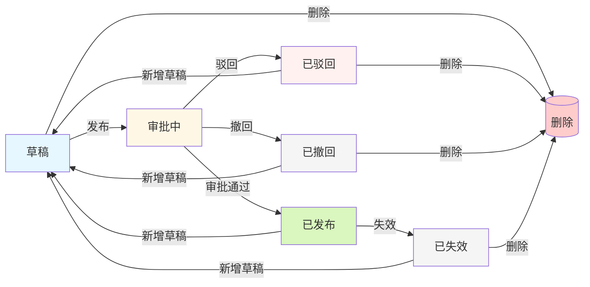

# 连接平台页面交互文档

## 目录

1. [连接器管理页面 (connector-list.html)](#1-连接器管理页面)
2. [接口配置页面 (connector-editor.html)](#2-接口配置页面)
3. [连接流管理页面 (flow-list.html)](#3-连接流管理页面)
4. [连接流编辑器页面 (flow-editor.html)](#4-连接流编辑器页面)
5. [审批中心页面 (approval-center.html)](#5-审批中心页面)
6. [运行记录页面 (flow-run-log.html)](#6-运行记录页面)

---

## 1. 连接器管理页面

### 1.1 页面概述

| 属性 | 描述 |
|------|------|
| 页面名称 | 连接器管理 |
| 页面标题 | 连接器管理 |
| 页面描述 | 管理平台的连接器配置，包括触发事件和执行动作的定义 |
| 导航入口 | 左侧导航栏 - 连接器管理 |

### 1.2 页面结构

```
┌─────────────────────────────────────────────────────────────────┐
│  左侧导航栏 (220px)  │           主内容区域                     │
│  ┌─────────────────┐ │  ┌─────────────────────────────────┐   │
│  │ 连接平台         │ │  │ 页面头部                         │   │
│  ├─────────────────┤ │  │ - 标题: 连接器管理                │   │
│  │ ⚡ 连接器管理 √  │ │  │ - 描述: ...                     │   │
│  │ 🔗 连接流管理    │ │  │ - 按钮: + 新建连接器             │   │
│  └─────────────────┘ │  ├─────────────────────────────────┤   │
│                      │  │ 搜索表单                         │   │
│                      │  │ [搜索框] [搜索] [重置]          │   │
│                      │  ├─────────────────────────────────┤   │
│                      │  │ 表格列表                         │   │
│                      │  │ - 连接器ID / 中文名称 / 英文名称  │   │
│                      │  │ - 类型 / 中文描述 / 英文描述      │   │
│                      │  │ - 创建者 / 更新人                 │   │
│                      │  │ - 创建时间 / 更新时间 / 操作      │   │
│                      │  ├─────────────────────────────────┤   │
│                      │  │ 分页器                           │   │
│                      │  └─────────────────────────────────┘   │
└─────────────────────────────────────────────────────────────────┘
```

### 1.3 功能交互

#### 1.3.1 搜索功能

| 操作 | 输入 | 触发条件 | 行为 |
|------|------|----------|------|
| 搜索 | 关键词 | 点击"搜索"按钮或按Enter键 | 根据中英文名称过滤列表，重置到第1页 |
| 重置 | - | 点击"重置"按钮 | 清空搜索框，恢复完整列表，重置到第1页 |

#### 1.3.2 新建/编辑连接器

| 操作 | 触发条件 | 行为 |
|------|----------|------|
| 打开新建弹窗 | 点击"新建连接器"按钮 | 弹出模态框，表单标题改为"新建连接器"，清空表单 |
| 打开编辑弹窗 | 点击表格中的"编辑"按钮 | 弹出模态框，表单标题改为"编辑连接器"，填充现有数据 |
| 提交表单 | 点击弹窗"保存"按钮 | 验证必填项(中文名称、英文名称)，保存数据，关闭弹窗，刷新列表 |
| 取消 | 点击弹窗"取消"按钮或点击遮罩或按ESC | 关闭弹窗，不保存数据 |

#### 1.3.3 状态操作

| 操作 | 触发条件 | 前置条件 | 行为 |
|------|----------|----------|------|
| 配置 | 点击"配置"按钮 | 无 | 跳转到 connector-editor.html?id=xxx |
| 失效 | 点击"失效"按钮 | 连接器未失效 | 弹出确认框，提示"确认要将xxx设为失效状态吗？失效后可删除该连接器"，确认后标记为失效 |
| 删除 | 点击"删除"按钮 | 连接器已失效 | 弹出确认框，提示"删除后将无法恢复"，确认后从列表移除 |

#### 1.3.4 分页功能

| 操作 | 行为 |
|------|------|
| 点击页码 | 切换到对应页面 |
| 点击"上一页"/"下一页" | 切换到相邻页面 |
| 切换每页条数 | 更新分页大小，重置到第1页 |

### 1.4 表单字段

| 字段名 | 类型 | 必填 | 最大长度 | 验证规则 |
|--------|------|------|----------|----------|
| 类型 | 下拉框 | 是 | - | 固定为"HTTP" |
| 中文名称 | 文本框 | 是 | 128 | 不能为空 |
| 英文名称 | 文本框 | 是 | 128 | 不能为空 |
| 中文描述 | 文本域 | 否 | 500 | - |
| 英文描述 | 文本域 | 否 | 512 | - |

### 1.5 模态框规格

| 模态框 | 宽度 | 用途 |
|--------|------|------|
| 新建/编辑连接器 | max-width: 520px | 创建或编辑连接器基本信息 |
| 确认删除 | max-width: 420px | 失效/删除操作的二次确认 |

### 1.6 Toast提示

| 类型 | 场景 |
|------|------|
| success | 创建成功、编辑成功、失效成功、恢复成功、删除成功 |
| error | 必填项为空 |

---

## 2. 接口配置页面

### 2.1 页面概述

| 属性 | 描述 |
|------|------|
| 页面名称 | 接口配置 |
| 页面标题 | 接口配置 |
| 页面描述 | 编辑连接器的接口配置信息 |
| 导航入口 | 连接器管理 → 配置按钮 |
| 页面特性 | 支持版本切换、编辑/保存模式切换 |

### 2.2 页面结构

```
┌─────────────────────────────────────────────────────────────────┐
│  左侧导航栏 (220px)  │           主内容区域                     │
│  ┌─────────────────┐ │  ┌─────────────────────────────────┐   │
│  │ 连接平台         │ │  │ 页面头部 (固定定位)              │   │
│  ├─────────────────┤ │  │ [返回] 接口配置                  │   │
│  │ ⚡ 连接器管理 √  │ │  └─────────────────────────────────┘   │
│  │ 🔗 连接流管理    │ │  ┌─────────────────────────────────┐   │
│  └─────────────────┘ │  │ 版本选择卡片                      │   │
│                      │  │ [版本下拉框] [创建草稿/编辑/发布] │   │
│                      │  │ [复制到草稿] [失效] [恢复] [删除] │   │
│                      │  ├─────────────────────────────────┤   │
│                      │  │ 接口配置卡片                      │   │
│                      │  │ - 协议类型: GET/POST/PUT/DELETE  │   │
│                      │  │ - 协议地址: URL输入框             │   │
│                      │  ├─────────────────────────────────┤   │
│                      │  │ 认证方式配置卡片                 │   │
│                      │  │ - 多选框: SOA/APIG/Cookie/签名   │   │
│                      │  │ - 动态显示认证参数表单           │   │
│                      │  ├─────────────────────────────────┤   │
│                      │  │ 入参配置卡片                     │   │
│                      │  │ [HTTP请求头] [HTTP请求体] [URL]  │   │
│                      │  ├─────────────────────────────────┤   │
│                      │  │ 出参配置卡片                     │   │
│                      │  │ [HTTP请求头] [HTTP请求体]        │   │
│                      │  └─────────────────────────────────┘   │
└─────────────────────────────────────────────────────────────────┘
```

### 2.3 版本状态与按钮

| 版本状态 | 显示按钮 | 按钮行为 |
|----------|----------|----------|
| 无版本 | 创建草稿 | 点击后新增一个草稿版本，并自动设为当前版本 |
| 草稿(Draft) | 编辑/保存、发布、删除 | 点击编辑进入编辑模式；保存后保持草稿；点击发布提交发布；点击删除移除版本 |
| 已发布(Published) | 复制到草稿、失效 | 不展示编辑按钮；点击复制创建新草稿版本；点击失效设为已失效 |
| 已失效(Invalid) | 复制到草稿、恢复、删除 | 不展示编辑按钮；点击复制创建新草稿版本；点击恢复设为已发布；点击删除移除版本 |

### 2.4 功能交互

#### 2.4.1 版本管理

| 操作 | 触发条件 | 行为 |
|------|----------|------|
| 创建草稿 | 版本列表为空时点击“创建草稿”按钮 | 新增一个草稿版本，自动设为当前版本，并刷新版本下拉框和按钮状态 |
| 切换版本 | 选择下拉框选项 | 如果在编辑状态则退出编辑；更新按钮状态；显示Toast提示当前版本 |
| 删除最后一个版本 | 已失效版本点击“删除”并确认后版本列表为空 | 留在当前接口配置页，版本下拉展示空占位，右侧仅展示“创建草稿”按钮 |

版本按钮显示规则：

| 版本状态 | 显示按钮 | 按钮行为 |
|----------|----------|----------|
| 无版本 | 创建草稿 | 创建草稿：新增一个草稿版本，并切换到该草稿 |
| 草稿(Draft) | 编辑/保存、发布、删除 | 编辑：进入编辑模式；保存：保存当前配置；发布：提交发布；删除：二次确认后移除版本 |
| 已发布(Published) | 复制到草稿、失效 | 不展示编辑按钮；复制到草稿：创建新的草稿版本；失效：二次确认后将版本设为已失效 |
| 已失效(Invalid) | 复制到草稿、恢复、删除 | 不展示编辑按钮；复制到草稿：创建新的草稿版本；恢复：二次确认后恢复为已发布版本；删除：二次确认后移除该版本 |

#### 2.4.2 编辑与保存

| 操作 | 触发条件 | 行为 |
|------|----------|------|
| 进入编辑模式 | 点击"编辑"按钮 | 按钮文本变为"保存"；表单控件可编辑；显示入参/出参的添加按钮 |
| 保存配置 | 点击"保存"按钮 | 收集所有配置数据（协议类型、协议地址、认证参数、入参、出参）；显示Toast提示"保存成功"；退出编辑模式 |
| 退出编辑模式 | 点击"保存"后自动退出 | 表单控件恢复禁用状态；隐藏添加按钮 |

**编辑模式说明：**
- 进入编辑模式后，页面中所有表单控件变为可编辑状态
- 未编辑状态下，页面为只读模式
- 草稿版本展示“编辑”按钮，保存后保持草稿状态
- 已发布和已失效版本不展示编辑入口
- 编辑状态下可修改：协议类型、协议地址、认证方式、入参配置、出参配置

#### 2.4.3 协议类型切换

| 操作 | 行为 |
|------|------|
| 点击协议按钮 | 高亮选中项；更新配置数据 |

#### 2.4.4 认证方式配置

| 操作 | 行为 |
|------|------|
| 勾选认证类型 | 调用handleAuthTypeChange；动态渲染对应认证参数表单 |
| 认证类型参数 | 根据类型显示不同参数：SOA/APIG/Cookie/数字签名均展示参数名称、类型、位置、值来源；参数名称、类型、位置和值来源默认不可编辑，仅 Cookie 的值来源可从上游所有节点出参中选择 |

#### 2.4.5 入参/出参配置

| 操作 | 行为 |
|------|------|
| 切换Tab | 点击Tab按钮；切换参数列表显示 |
| 添加参数 | 点击"添加参数"按钮；新增一行参数输入项 |
| 编辑参数 | 输入参数名称、类型、描述 |
| 删除参数 | 点击参数行的删除按钮；移除该参数行 |
| 类型变更 | object/array类型显示下拉框(添加子节点/添加兄弟节点)；基础类型直接添加兄弟节点；达到第10层后不再显示添加子节点入口 |
| 保存校验 | object/array 类型参数下必须包含 string/number/boolean 基础类型子参数，不能只定义空 object/array 或仅嵌套复杂类型；参数层级最多支持10层 |

### 2.5 表单字段

#### 接口配置

| 字段名 | 类型 | 说明 |
|--------|------|------|
| 协议类型 | 单选按钮组 | GET/POST/PUT/DELETE |
| 协议地址 | 文本框 | URL地址输入 |

#### 认证参数(动态)

| 认证类型 | 参数字段 |
|----------|----------|
| SOA | 参数名称、类型(固定string)、位置(header/body/query)、值来源(固定) |
| APIG | 参数名称、类型(固定string)、位置(header/body/query)、值来源(固定) |
| Cookie | 参数名称、类型(固定string)、位置(header/body/query)、值来源；仅值来源可选择上游所有节点出参 |
| 数字签名 | 参数名称、类型(固定string)、位置、值来源；签名值和签名密钥均按连接器配置展示，连接流节点中不可编辑 |

### 2.6 页面禁用状态

在非编辑模式下，以下控件被禁用：
- 协议地址输入框
- 协议类型按钮组
- 认证方式多选框
- 认证参数输入框和下拉框
- 入参/出参配置的所有输入框和按钮
- 数字签名密钥的显示/隐藏按钮不受编辑态禁用影响，可单独操作

---

## 3. 连接流管理页面

### 3.1 页面概述

| 属性 | 描述 |
|------|------|
| 页面名称 | 连接流管理 |
| 页面标题 | 连接流管理 |
| 页面描述 | 管理平台的连接流配置，支持可视化流程编排 |
| 导航入口 | 左侧导航栏 - 连接流管理 |

### 3.2 页面结构

```
┌─────────────────────────────────────────────────────────────────┐
│  左侧导航栏 (220px)  │           主内容区域                     │
│  ┌─────────────────┐ │  ┌─────────────────────────────────┐   │
│  │ 连接平台         │ │  │ 页面头部                         │   │
│  ├─────────────────┤ │  │ - 标题: 连接流管理                │   │
│  │ ⚡ 连接器管理    │ │  │ - 描述: ...                     │   │
│  │ 🔗 连接流管理 √ │ │  │ - 按钮: + 新建连接流             │   │
│  └─────────────────┘ │  ├─────────────────────────────────┤   │
│                      │  │ 搜索表单                         │   │
│                      │  │ [搜索框] [搜索] [重置]           │   │
│                      │  ├─────────────────────────────────┤   │
│                      │  │ 表格列表                         │   │
│                      │  │ - 连接流ID / 中英文名称          │   │
│                      │  │ - 中英文描述 / 状态              │   │
│                      │  │ - 创建者 / 更新人                │   │
│                      │  │ - 创建时间 / 更新时间 / 操作    │   │
│                      │  ├─────────────────────────────────┤   │
│                      │  │ 分页器                           │   │
│                      │  └─────────────────────────────────┘   │
└─────────────────────────────────────────────────────────────────┘
```

### 3.3 功能交互

#### 3.3.1 搜索功能

| 操作 | 输入 | 触发条件 | 行为 |
|------|------|----------|------|
| 搜索 | 关键词 | 点击"搜索"按钮或按Enter键 | 根据中英文名称过滤列表 |
| 重置 | - | 点击"重置"按钮 | 清空搜索框，恢复完整列表 |

#### 3.3.2 新建/编辑连接流

| 操作 | 触发条件 | 行为 |
|------|----------|------|
| 打开新建弹窗 | 点击"新建连接流"按钮 | 弹出模态框，清空表单 |
| 打开编辑弹窗 | 点击表格中的"编辑"按钮 | 弹出模态框，填充现有数据 |
| 提交表单 | 点击弹窗"保存"按钮 | 验证必填项，保存数据，新增连接流默认状态为"已停止"，刷新列表 |

#### 3.3.3 操作列功能

| 操作 | 触发条件 | 行为 |
|------|----------|------|
| 编辑 | 点击"编辑"按钮 | 打开编辑弹窗 |
| 配置 | 点击"配置"按钮 | 跳转到 flow-editor.html?id=xxx |
| 更多 | 点击"更多 ▼"按钮 | 显示下拉菜单 |

#### 3.3.4 更多菜单功能

| 操作 | 可见条件 | 行为 |
|------|----------|------|
| 复制流 | 状态为"已停止"、"运行中"、"已失效" | 创建副本，添加到列表顶部，副本默认状态为"已停止"，且未绑定任何部署版本 |
| 复制ID | 始终可见 | 复制ID到剪贴板，显示Toast |
| 启动 | 状态为"已停止" | 仅修改连接流状态：已停止 → 运行中。要求当前连接流已存在部署版本；若未部署则提示"当前连接流尚未部署版本，请先部署后再启动"并阻断 |
| 部署 | 状态为"已停止"或"运行中" | 打开部署版本选择弹窗，仅修改"连接流-版本"绑定关系，不修改连接流状态。可重复执行用于切换部署版本 |
| 停止 | 状态为"运行中" | 弹出确认框，确认后仅修改连接流状态：运行中 → 已停止，部署版本绑定保持不变 |
| 失效 | 状态为"已停止" | 弹出确认框，确认后状态改为"已失效" |
| 恢复 | 状态为"已失效" | 确认后状态恢复为"已停止"，原部署版本绑定保持不变 |
| 删除 | 状态为"已失效" | 弹出确认框，确认后从列表移除 |

**说明：** 连接流只有"已停止"、"运行中"、"已失效"三种状态；启动与部署是两个独立动作——启动只切换状态，部署只更新版本绑定关系。已失效状态的连接流在更多菜单中显示"复制流"、"复制ID"、"恢复"和"删除"，不展示启动与部署。

#### 3.3.5 部署功能

部署操作通过更多菜单中的"部署"入口触发，用于建立或切换连接流与已发布版本的绑定关系。部署本身不影响连接流的运行状态。

| 操作 | 行为 |
|------|------|
| 打开部署弹窗 | 弹窗标题为"选择部署版本"；列表仅展示当前连接流的已发布版本 |
| 默认选中 | 若连接流已有部署版本，弹窗中默认选中该版本并加蓝色边框标识"(当前部署)"；未部署过则不预选 |
| 选择版本 | 单选框选择目标已发布版本 |
| 无可部署版本 | 列表区展示"暂无已发布的版本"，"确认部署"按钮置灰 |
| 确认部署 | 仅更新连接流的"当前部署版本"绑定关系，不修改 lifecycleStatus；成功后刷新列表，并提示"部署成功" |
| 取消 | 关闭弹窗，不执行任何变更 |

#### 3.3.6 启动功能

启动操作通过更多菜单中的"启动"入口触发，仅在"已停止"状态可见，作用是把连接流状态从"已停止"切换到"运行中"。启动本身不修改部署版本绑定。

| 操作 | 行为 |
|------|------|
| 启动前置校验 | 必须已经存在当前部署版本，否则提示"当前连接流尚未部署版本，请先部署后再启动"并阻断 |
| 启动结果 | 状态变为"运行中"，部署版本绑定保持不变；展示"启动成功"Toast 并刷新列表 |

### 3.4 状态说明

| 状态值 | 显示文本 | 颜色 | 说明 |
|--------|----------|------|------|
| 1 | 运行中 | 绿色 | 连接流已启动并正在运行；当前部署版本绑定生效 |
| 2 | 已停止 | 红色 | 默认状态，当前未运行；可能已部署版本（仅未启动），也可能尚未部署版本（需先部署后再启动） |
| 3 | 已失效 | 红色 | 已失效，可恢复为已停止或删除 |

### 3.5 表单字段

| 字段名 | 类型 | 必填 | 最大长度 |
|--------|------|------|----------|
| 中文名称 | 文本框 | 是 | 128 |
| 英文名称 | 文本框 | 是 | 128 |
| 中文描述 | 文本域 | 否 | 500 |
| 英文描述 | 文本域 | 否 | 512 |

---

## 4. 连接流编辑器页面

### 4.1 页面概述

| 属性 | 描述 |
|------|------|
| 页面名称 | 连接流编辑器 |
| 页面标题 | 连接流编辑器 |
| 页面描述 | 基于编排模式的连接流配置界面 |
| 导航入口 | 连接流管理 → 配置按钮 |
| 页面特性 | 编排模式驱动 + 步骤条节点切换 + 版本管理 + 更多配置 + 调试 |

### 4.2 页面结构

```
┌─────────────────────────────────────────────────────────────────────────────┐
│ 左侧导航栏  │                        主内容区域                               │
│ ┌─────────┐│ ┌─────────────────────────────────────────────────────────────┐│
│ │ 连接平台 ││ │ 编辑器头部 (固定高度64px)                                   ││
│ ├─────────┤│ │ [← 返回] 流程名称    版本:[下拉框]           [版本操作按钮] ││
│ │⚡连接器  ││ └─────────────────────────────────────────────────────────────┘│
│ │🔗连接流√││ ┌─────────────────────────────────────────────────────────────┐│
│ └─────────┘│ │ 工作区                                                       ││
│            │ │ ┌─────────────────────────────────────────────────────────┐ ││
│            │ │ │ 编排模式选择卡片：[单节点] [串行编排] [并行编排]         │ ││
│            │ │ └─────────────────────────────────────────────────────────┘ ││
│            │ │ ┌─────────────────────────────────────────────────────────┐ ││
│            │ │ │ 步骤条：[触]──+──[连1]──+──[脚]──+──[连2]──+──[出]      │ ││
│            │ │ └─────────────────────────────────────────────────────────┘ ││
│            │ │ ┌─────────────────────────────────────────────────────────┐ ││
│            │ │ │ 当前激活节点卡片（点击步骤条切换）                       │ ││
│            │ │ │  - 节点头部：图标、标题、副标题、删除/折叠按钮           │ ││
│            │ │ │  - 节点表单：根据节点类型动态渲染                        │ ││
│            │ │ └─────────────────────────────────────────────────────────┘ ││
│            │ └─────────────────────────────────────────────────────────────┘│
│            │                                                                  │
│            │  右侧抽屉（按需弹出）：更多配置抽屉 / 调试抽屉                 │
└─────────────────────────────────────────────────────────────────────────────┘
```

### 4.3 编排模式选择

进入编辑器后，先选择编排模式，再展示步骤条与节点卡片。模式可见性由应用级接口下发，未启用任何模式时展示"当前应用未启用任何编排类型，请联系管理员调整接口配置"。

| 模式 | 标识 | 默认节点 | 适用场景 |
|------|------|----------|----------|
| 单节点 | single | 触发器 → 连接器 → 数据输出 | 一次连接器调用 |
| 串行编排 | serial | 触发器 → 连接器 → 数据输出 | 按顺序添加连接器和脚本处理节点 |
| 并行编排 | parallel | 触发器 → 并行节点（含 2 个分支）→ 数据输出 | 在并行节点内配置多个分支，每分支固定一个连接器 |

| 操作 | 行为 |
|------|------|
| 切换编排模式 | 选择模式卡片，重置节点为该模式默认结构，并切换激活节点为触发器 |
| 模式不可见 | 应用级配置接口未返回该模式时不展示对应卡片 |

### 4.4 节点类型

本期连接流编辑器仅开放下列节点类型：

| 节点类型 | 标识 | 图标 | 说明 |
|----------|------|------|------|
| 触发器 | trigger | 触 | 连接流入口，固定 1 个，不可删除 |
| 连接器 | connector | 连 | 调用连接器，可选择版本、配置认证与入参映射 |
| 脚本处理 | script | 脚 | 使用 TypeScript 处理上游数据并声明出参结构（仅串行/并行模式可用） |
| 并行 | parallel | 并 | 包含多个分支，每分支固定一个连接器（仅并行模式存在） |
| 数据输出 | output | 出 | 组装连接流最终响应，固定 1 个，不可删除 |

#### 节点详细交互说明

**触发器节点：**
- 配置项：触发方式（HTTP触发 / 定时触发 / 事件触发）、SYSACCOUNT 白名单、入参配置
- 入参配置：支持 HTTP 请求头、HTTP 请求体、URL 查询参数三类参数
- SYSACCOUNT 白名单：支持添加多个账号，添加入口文案为"添加账号"
- 特殊说明：触发器节点固定存在，不可删除；其入参用于调试抽屉的入参展示

**连接器节点：**
- 配置项：选择连接器、选择连接器版本、认证方式、超时时间、入参映射
- 切换连接器后版本列表刷新，版本切换后入参映射根据所选版本的入参刷新展示
- 超时时间默认为应用级上限（默认 3 秒，可由应用级配置接口覆盖）
- 入参映射只展示该版本对应的入参，参数值支持选择上游节点输出
- 删除规则：单节点模式下不可删除；串行模式下当连接器数量大于 1 时可删；并行分支内的连接器不可删除

**脚本处理节点（script）：**
- 配置项：TypeScript 脚本（Monaco 编辑器）、节点出参配置
- 脚本默认模板提供 `transform(input)` 函数，Monaco Editor 提供 TypeScript 基础校验
- Monaco 加载失败时回退到普通文本框，并展示"Monaco Editor 加载失败，请使用备用输入框"
- 节点出参：扁平 schema 列表，仅配置数据结构（名称、类型、描述），不区分 header/body/query
- 适用范围：仅串行编排和并行编排模式可插入；脚本节点之间不允许相邻

**并行节点：**
- 仅并行编排模式存在，且固定存在 1 个，不可删除
- 默认包含 2 个分支，每个分支固定一个连接器，分支内不可继续添加其他节点
- 分支可改名、可增减；分支数量上限为应用级上限（默认 8）；分支数量大于 1 时单个分支可删
- 通过 Tab 切换查看分支详情

**数据输出节点：**
- 配置项：参数组装配置（响应头 / 响应体两个 Tab）
- 参数支持固定值或引用上游节点出参
- 固定存在，不可删除

### 4.5 功能交互

#### 4.5.1 步骤条与节点切换

| 操作 | 行为 |
|------|------|
| 切换激活节点 | 点击步骤条中的节点按钮，下方仅展示当前激活节点的配置卡片 |
| 收起/展开节点卡片 | 点击节点头部的"收起/展开"按钮，临时折叠当前节点表单 |

#### 4.5.2 节点插入（步骤条加号）

步骤条节点之间根据编排模式动态展示加号按钮，点击后按可插入类型弹出选择弹窗。

| 编排模式 | 加号展示规则 | 可插入节点类型 |
|----------|--------------|----------------|
| 单节点 | 不展示加号 | - |
| 串行编排 | 节点之间均展示加号 | 连接器节点（受应用级上限约束，默认最多 3 个）、脚本处理节点（相邻节点不为 script 时可选） |
| 并行编排 | 仅"触发器↔并行节点"和"并行节点↔数据输出"之间展示加号 | 脚本处理节点（相邻节点不为 script 时可选） |

| 操作 | 行为 |
|------|------|
| 点击加号 | 仅 1 个可插入类型时直接插入；多个类型时弹出"添加节点"弹窗 |
| 在弹窗中选择类型 | 在当前位置插入对应节点，激活节点切换为新节点 |
| 已达连接器上限 | 加号弹窗不再展示连接器节点选项 |
| 脚本相邻限制 | 当相邻节点为脚本节点时不展示脚本选项 |

#### 4.5.3 节点删除

| 节点类型 | 是否可删 | 行为 |
|----------|----------|------|
| 触发器 | 不可删 | - |
| 数据输出 | 不可删 | - |
| 连接器（主流程） | 单节点模式不可删；串行模式下连接器数量大于 1 时可删 | 删除节点并刷新步骤条 |
| 脚本处理 | 可删 | 删除节点并刷新步骤条 |
| 并行节点 | 不可删 | - |
| 并行分支内连接器 | 不可删（分支固定一个连接器） | - |
| 并行分支 | 分支数量大于 1 时可删 | 删除分支并切换到剩余分支 |

#### 4.5.4 版本管理

##### 版本下拉

| 字段 | 说明 |
|------|------|
| 版本名称 | 版本下拉主文本 |
| 创建时间 | 版本下拉辅助信息 |
| 状态标签 | 草稿 / 已发布 / 已失效 / 审批中 / 已驳回 / 已撤回 |

| 操作 | 行为 |
|------|------|
| 切换版本 | 选择下拉项后切换当前版本，重新渲染编排模式、步骤条与节点 |
| 无版本状态 | 版本下拉位置展示"暂无版本"，右侧仅展示"添加版本"按钮 |

##### 版本按钮显示规则

| 版本状态 | 按钮列表 |
|----------|----------|
| 无版本 | 添加版本 |
| 草稿 | 更多配置、调试、保存、发布、删除 |
| 已发布 | 新增草稿、更多配置、调试、失效 |
| 已失效 | 新增草稿、更多配置、删除 |
| 审批中 | 更多配置、撤回 |
| 已驳回 | 新增草稿、更多配置、删除 |
| 已撤回 | 新增草稿、更多配置、删除 |

**说明：** 非草稿版本下，编排模式卡片与节点表单进入只读状态，无法切换模式、增删节点或修改表单。

##### 版本流转说明



| 流转方向 | 触发操作 | 说明 |
|----------|----------|------|
| 草稿 → 审批中 | 发布 | 提交审批，状态变为审批中 |
| 审批中 → 已发布 | 审批通过 | 审批人通过后，版本正式发布 |
| 审批中 → 已驳回 | 审批驳回 | 审批人驳回 |
| 审批中 → 已撤回 | 撤回 | 在审批中状态下撤回 |
| 已发布 → 已失效 | 失效 | 手动将已发布版本设为失效 |
| 已发布/已失效/已驳回/已撤回 → 草稿 | 新增草稿 | 基于当前版本创建新的草稿版本 |
| 草稿/已驳回/已撤回/已失效 → 删除 | 删除 | 二次确认后彻底删除版本 |

#### 4.5.5 更多配置抽屉

| 配置项 | 交互说明 |
|--------|----------|
| 限流配置 | 默认上限 1000；通过应用级配置接口可覆盖当前上限，文案展示"默认上限1000，当前上限 X"；超过上限时阻断并提示 |
| 缓存开关 | 控制是否启用缓存；开启后展示缓存时间与缓存 Key 配置 |
| 缓存时间 | 单位秒，最大 1296000 秒（15 天）；超过上限时提示"上限为 1296000 秒" |
| 缓存 Key | 支持添加多个缓存 Key 项，每项可从触发器入参中选择字段；同时展示拼接结果预览 |

#### 4.5.6 调试抽屉

| 操作 | 触发条件 | 行为 |
|------|----------|------|
| 打开调试抽屉 | 点击"调试"按钮（草稿、已发布版本可用） | 右侧滑出抽屉，加载触发器节点的入参 |
| 切换入参 Tab | 点击 header / body / query Tab | 切换展示对应类型的入参 |
| 编辑参数值 | 在参数行输入值 | 参数名称、类型只读，仅参数值可编辑 |
| 立即调试 | 点击"立即调试"按钮 | 调用调试接口，输出区展示执行结果或错误信息 |
| 关闭抽屉 | 点击"×"按钮 | 关闭调试抽屉 |

**调试抽屉特性：**
- 右侧滑出形式，无蒙层覆盖
- 入参配置按 header / body / query 三个 Tab 切换展示
- 参数名称和类型只读，仅参数值可编辑
- 调试输出展示成功结果或失败错误信息

---

## 5. 审批中心页面

### 5.1 页面概述

| 属性 | 描述 |
|------|------|
| 页面名称 | 审批中心 |
| 页面标题 | 审批中心 |
| 页面描述 | 审批权限申请，处理待办事项 |
| 导航入口 | 左侧导航栏 - 审批中心 |

### 5.2 页面结构

```
┌─────────────────────────────────────────────────────────────────┐
│  左侧导航栏 (220px)  │           主内容区域                     │
│  ┌─────────────────┐ │  ┌─────────────────────────────────┐   │
│  │ 连接平台         │ │  │ 页面头部                         │   │
│  ├─────────────────┤ │  │ - 标题: 审批中心                 │   │
│  │ ⚡ 连接器管理    │ │  │ - 描述: 审批权限申请...          │   │
│  │ 🔗 连接流管理    │ │  └─────────────────────────────────┘   │
│  │ 📋 审批中心 √    │ │  ┌─────────────────────────────────┐   │
│  │ 📊 运行记录      │ │  │ Tab标签栏                        │   │
│  └─────────────────┘ │  │ [我的待审] [我发起的] [全部]      │   │
│                      │  │ [审批流程配置]                    │   │
│                      │  ├─────────────────────────────────┤   │
│                      │  │ Tab内容区域                      │   │
│                      │  │ (根据Tab显示不同内容)             │   │
│                      │  │ - 我的待审: 待审批列表            │   │
│                      │  │ - 我发起的: 我申请的审批          │   │
│                      │  │ - 全部: 所有审批记录              │   │
│                      │  │ - 审批流程配置: 流程模板管理      │   │
│                      │  └─────────────────────────────────┘   │
└─────────────────────────────────────────────────────────────────┘
```

### 5.3 Tab标签说明

| Tab名称 | 内容说明 |
|---------|----------|
| 我的待审 | 显示需要当前用户审批的待办事项 |
| 我发起的 | 显示当前用户发起的审批申请 |
| 全部 | 显示所有与当前用户相关的审批记录 |
| 审批流程配置 | 管理系统中的审批流程模板 |

### 5.4 审批流程配置子页面

#### 5.4.1 搜索功能

| 操作 | 触发条件 | 行为 |
|------|----------|------|
| 搜索 | 输入关键词，点击"搜索"按钮 | 按流程名称(中英文)或流程代码过滤 |
| 重置 | 点击"重置"按钮 | 清空搜索框，恢复完整列表 |

#### 5.4.2 新建/编辑审批流程

| 操作 | 行为 |
|------|------|
| 打开新建弹窗 | 点击"新建流程"按钮，流程代码下拉框可选择 |
| 打开编辑弹窗 | 点击表格"编辑"按钮，流程代码置为不可修改 |
| 选择连接流版本审批 | 流程代码选择 `connector_flow`，展示应用ID输入框 |
| 全局连接流版本审批 | 流程代码选择 `connector_flow`，不填写应用ID |
| 应用级连接流版本审批 | 流程代码选择 `connector_flow`，填写应用ID |
| 添加审批节点 | 点击"添加审批节点"按钮，新增节点卡片 |
| 删除审批节点 | 点击节点卡片"删除"按钮 |
| 提交表单 | 验证必填项；应用ID非必填，根据是否填写判断全局审批或应用级审批 |

#### 5.4.3 删除审批流程

| 操作 | 行为 |
|------|------|
| 确认删除 | 点击"删除"按钮，弹出确认框，确认后删除 |

### 5.5 表单字段

| 字段名 | 类型 | 必填 | 说明 |
|--------|------|------|------|
| 流程名称(中文) | 文本框 | 是 | - |
| 流程名称(英文) | 文本框 | 是 | - |
| 流程代码 | 下拉框 | 是 | 新建时可选，编辑时不可修改 |
| 应用ID | 文本框 | 否 | 仅选择 `connector_flow` 时显示；不填为全局审批，填写后为应用级审批 |
| 审批节点 | 动态添加 | - | 每节点包含审批人ID和姓名 |

### 5.6 审批流程代码说明

| 代码值 | 显示名称 | 类型 |
|--------|----------|------|
| global | 全局审批 | 全局审批 |
| api_register | API注册审批 | 场景审批 |
| event_register | 事件注册审批 | 场景审批 |
| callback_register | 回调注册审批 | 场景审批 |
| api_permission_apply | API权限申请审批 | 场景审批 |
| event_permission_apply | 事件权限申请审批 | 场景审批 |
| callback_permission_apply | 回调权限申请审批 | 场景审批 |
| connector_flow | 连接流版本审批 | 根据应用ID是否填写判断：未填写为全局审批，填写为应用级审批 |

### 5.7 表单提示

- 审批节点按顺序执行，序号从1开始递增
- code='global' 为全局审批流程，其他为场景审批流程
- connector_flow 用于连接流版本发布审批
- 连接流版本审批不填应用ID为全局审批，填写应用ID为应用级审批
- 流程代码创建后不可修改

---

## 6. 运行记录页面

### 6.1 页面概述

| 属性 | 描述 |
|------|------|
| 页面名称 | 连接流运行记录 |
| 页面标题 | 连接流运行记录 |
| 页面描述 | 查看连接流执行历史、执行状态、节点链路和错误信息 |
| 导航入口 | 左侧导航栏 - 运行记录 |
| 页面路由 | `flow-run-log.html` / `/connect/run-log` |
| 页面特性 | 只读排障页面，支持列表筛选、分页、详情抽屉、JSON 格式化展示 |

### 6.2 页面结构

```
┌─────────────────────────────────────────────────────────────────┐
│  左侧导航栏 (220px)  │           主内容区域                     │
│  ┌─────────────────┐ │  ┌─────────────────────────────────┐   │
│  │ 连接平台         │ │  │ 页面头部                         │   │
│  ├─────────────────┤ │  │ - 标题: 连接流运行记录            │   │
│  │ ⚡ 连接器管理    │ │  │ - 描述: 查看执行历史和链路详情    │   │
│  │ 🔗 连接流管理    │ │  │ - 按钮: 刷新                     │   │
│  │ 📋 审批中心      │ │  └─────────────────────────────────┘   │
│  │ 📊 运行记录 √   │ │  ┌─────────────────────────────────┐   │
│  └─────────────────┘ │  │ 搜索筛选区                       │   │
│                      │  │ [连接流名称] [执行状态]          │   │
│                      │  │ [触发方式] [时间范围]            │   │
│                      │  │ [搜索] [重置]                    │   │
│                      │  ├─────────────────────────────────┤   │
│                      │  │ 表格列表                         │   │
│                      │  │ - 执行ID / 连接流名称 / 版本      │   │
│                      │  │ - 触发方式 / 状态 / 执行耗时      │   │
│                      │  │ - 开始时间 / 结束时间 / 操作      │   │
│                      │  ├─────────────────────────────────┤   │
│                      │  │ 分页器                           │   │
│                      │  └─────────────────────────────────┘   │
│                      │                                          │
│                      │  详情抽屉 (右侧滑出)                  │
│                      │  ┌─────────────────────────────────┐   │
│                      │  │ 执行详情                    [✕] │   │
│                      │  ├─────────────────────────────────┤   │
│                      │  │ 基本信息                         │   │
│                      │  │ 触发参数                         │   │
│                      │  │ 节点执行明细                     │   │
│                      │  │ 节点入参 / 出参 / 耗时 / 错误    │   │
│                      │  │ [关闭]                          │   │
│                      │  └─────────────────────────────────┘   │
└─────────────────────────────────────────────────────────────────┘
```

### 6.3 改动点方案

| 模块 | 改动点 | 方案说明 |
|------|--------|----------|
| 导航入口 | 新增运行记录菜单 | 左侧导航增加“运行记录”，点击进入运行记录页面 |
| 页面路由 | 新增运行记录页面入口 | 注册 `flow-run-log.html` 或 `/connect/run-log` |
| 搜索筛选 | 支持组合筛选 | 按连接流名称、执行状态、触发方式、时间范围筛选，搜索时重置到第一页 |
| 表格列表 | 展示执行记录核心信息 | 表格展示执行 ID、连接流、版本、触发方式、状态、耗时、开始/结束时间 |
| 状态标签 | 区分执行状态 | 成功、失败、运行中、超时使用不同颜色标签展示 |
| 详情抽屉 | 查看单次执行详情 | 点击“详情”从右侧打开抽屉，展示完整执行链路 |
| 节点明细 | 展示链路排障信息 | 按执行顺序展示每个节点的入参、出参、耗时、状态；失败或超时时展示错误信息 |
| JSON 展示 | 提升参数可读性 | 触发参数、节点入参、节点出参以格式化 JSON 展示 |
| 操作边界 | 保持只读 | 不提供重跑、编辑连接流、修改版本等写操作 |

### 6.4 功能交互

#### 6.4.1 搜索筛选

| 操作 | 触发条件 | 行为 |
|------|----------|------|
| 按名称搜索 | 输入连接流名称，点击“搜索” | 按连接流中文名、英文名或 ID 过滤列表 |
| 按状态筛选 | 选择执行状态 | 按成功、失败、运行中、超时筛选 |
| 按触发方式筛选 | 选择触发方式 | 按 HTTP、定时、事件、手动触发筛选 |
| 按时间范围筛选 | 选择开始时间范围 | 过滤指定时间范围内的运行记录 |
| 组合筛选 | 同时设置多个筛选条件 | 查询同时满足所有条件的数据 |
| 重置 | 点击“重置”按钮 | 清空筛选条件，页码回到第一页并刷新列表 |
| 刷新 | 点击页面头部“刷新”按钮 | 保留当前筛选条件，重新加载列表 |

#### 6.4.2 表格操作

| 操作 | 触发条件 | 行为 |
|------|----------|------|
| 查看详情 | 点击表格操作列“详情” | 打开详情抽屉，展示该次运行完整信息 |
| 分页切换 | 点击页码或上一页、下一页 | 按当前筛选条件加载对应页数据 |
| 切换每页条数 | 选择每页条数 | 更新分页大小，页码回到第一页 |

#### 6.4.3 详情抽屉

| 操作 | 触发条件 | 行为 |
|------|----------|------|
| 打开抽屉 | 点击“详情” | 从右侧滑出详情抽屉 |
| 关闭抽屉 | 点击“关闭”或“✕” | 关闭详情抽屉 |
| 查看节点详情 | 查看节点执行明细 | 展示节点状态、耗时、入参、出参；失败或超时时展示错误信息 |

### 6.5 表格字段

| 字段 | 说明 |
|------|------|
| 执行ID | 单次运行记录唯一标识 |
| 连接流ID | 运行记录关联的连接流 ID |
| 连接流名称 | 连接流中文名称 / 英文名称 |
| 版本 | 执行使用的连接流版本号 |
| 触发方式 | HTTP触发、定时触发、事件触发、手动触发 |
| 执行状态 | 成功、失败、运行中、超时 |
| 执行耗时 | 从开始到结束的耗时，运行中显示已运行时长 |
| 开始时间 | 执行开始时间 |
| 结束时间 | 执行完成时间，运行中显示“-” |
| 操作 | 详情 |

### 6.6 状态说明

| 状态值 | 显示文本 | 颜色 | 说明 |
|--------|----------|------|------|
| success | 成功 | 绿色 | 执行成功完成 |
| error | 失败 | 红色 | 执行过程中出现错误 |
| running | 运行中 | 蓝色 | 当前仍在执行 |
| timeout | 超时 | 橙色 | 执行超过超时时间 |

### 6.7 触发方式说明

| 触发类型 | 显示文本 | 说明 |
|----------|----------|------|
| http | HTTP触发 | 外部 HTTP 请求触发连接流 |
| schedule | 定时触发 | 按定时任务触发连接流 |
| event | 事件触发 | 由外部事件触发连接流 |
| manual | 手动触发 | 用户或调试入口手动触发 |

### 6.8 详情展示

#### 基本信息区域

| 字段 | 说明 |
|------|------|
| 执行ID | 本次执行的唯一标识 |
| 连接流ID | 关联连接流 ID |
| 连接流名称 | 关联连接流名称 |
| 版本 | 执行使用的版本号 |
| 触发方式 | 触发类型的显示文本 |
| 状态 | 执行状态及颜色标识 |
| 执行耗时 | 格式化耗时 |
| 开始时间 | 精确到秒或毫秒 |
| 结束时间 | 执行完成时间，未完成显示“-” |
| 错误信息 | 仅失败或超时时显示 |

#### 触发参数区域

- 展示触发时传入的 header、body、query 等参数。
- 以格式化 JSON 展示，保留对象和数组层级。
- 无参数时展示空状态文案。

#### 节点执行明细

| 字段 | 说明 |
|------|------|
| 节点名称 | 节点的显示名称 |
| 节点类型 | 触发器、连接器、数据处理、数据输出、错误处理、并行等 |
| 执行状态 | 该节点的执行状态 |
| 执行耗时 | 节点开始到结束的耗时 |
| 入参 | 节点执行入参，JSON 格式化展示 |
| 出参 | 节点执行出参，JSON 格式化展示，空值展示为 null 或占位 |
| 错误信息 | 仅节点失败或超时时显示 |

#### 错误信息展示

- 整体运行失败或超时时，在基本信息区域展示本次执行错误信息。
- 节点失败或超时时，在对应节点卡片中展示节点错误信息。
- 运行中节点的出参可为空，耗时显示为“-”。

### 6.9 空状态与异常状态

| 场景 | 展示 |
|------|------|
| 无运行记录 | 表格展示空状态文案“暂无运行记录” |
| 筛选无结果 | 表格展示空状态文案“未查询到匹配的运行记录” |
| 详情加载失败 | 抽屉内展示错误提示，并支持关闭后重新进入 |
| JSON 数据为空 | 展示“-”或“暂无数据” |

### 6.10 非本期范围

- 不提供运行记录重跑能力。
- 不提供运行记录删除能力。
- 不在运行记录页面编辑连接流或连接流版本。
- 不在运行记录页面修改节点配置。

---

## 附录

### A. 通用交互规范

#### Toast提示
- 位置: 页面顶部居中
- 显示时长: 3秒
- 类型: success(绿色)、error(红色)

#### 模态框
- 居中显示
- 点击遮罩可关闭
- 按ESC键可关闭
- 有最小和最大宽度限制

#### 表格操作
- 悬停时高亮整行
- 操作按钮默认显示
- 危险操作(删除)使用红色文字

#### 分页器
- 显示总条数
- 支持页码切换
- 支持每页条数切换
- 首页/末页/上一页/下一页按钮

### B. 页面跳转关系

```
index.html (首页/仪表盘)
    │
    ├─→ connector-list.html (连接器管理)
    │       │
    │       └─→ connector-editor.html (接口配置)
    │
    ├─→ flow-list.html (连接流管理)
    │       │
    │       └─→ flow-editor.html (连接流编辑器)
    │
    ├─→ approval-center.html (审批中心)
    │
    └─→ flow-run-log.html (运行记录)
```

### C. 表单验证规则

| 页面 | 必填字段 |
|------|----------|
| 连接器管理 | 中文名称、英文名称 |
| 接口配置 | 协议地址 |
| 连接流管理 | 中文名称、英文名称 |
| 审批流程配置 | 流程名称(中英文)、流程代码；connector_flow 的应用ID非必填 |
